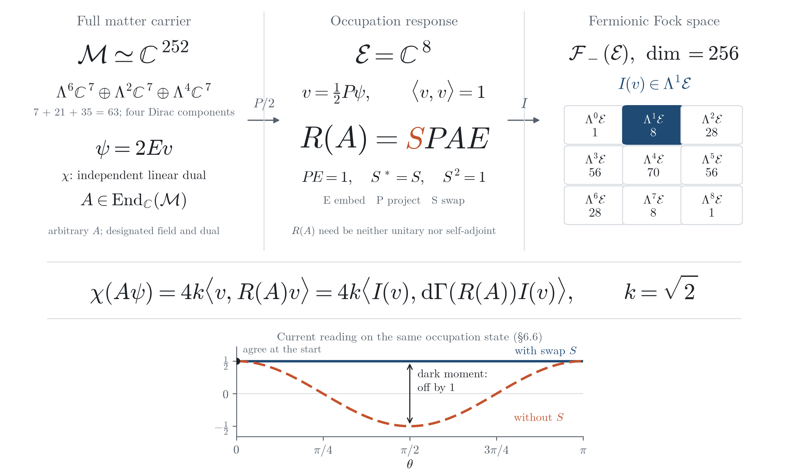
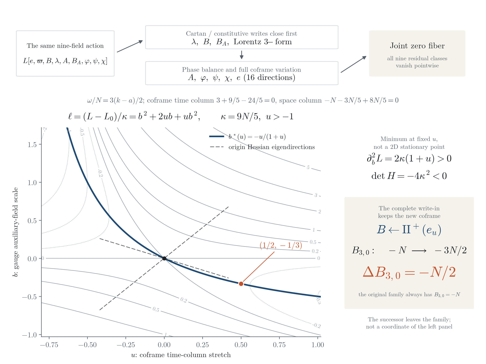
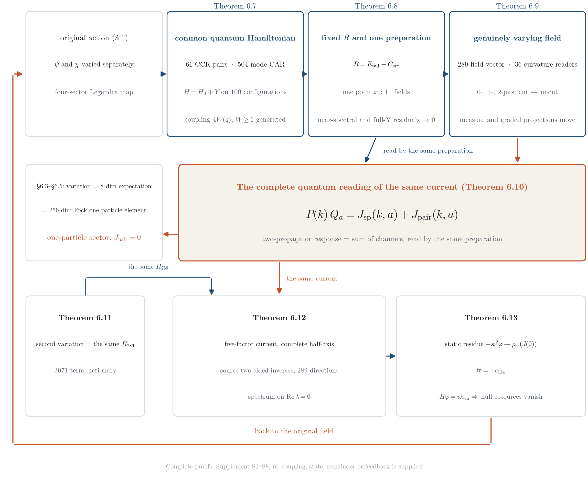
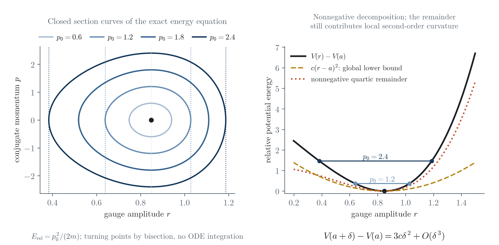
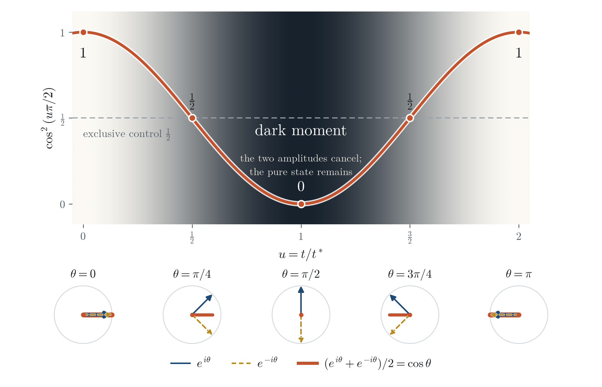
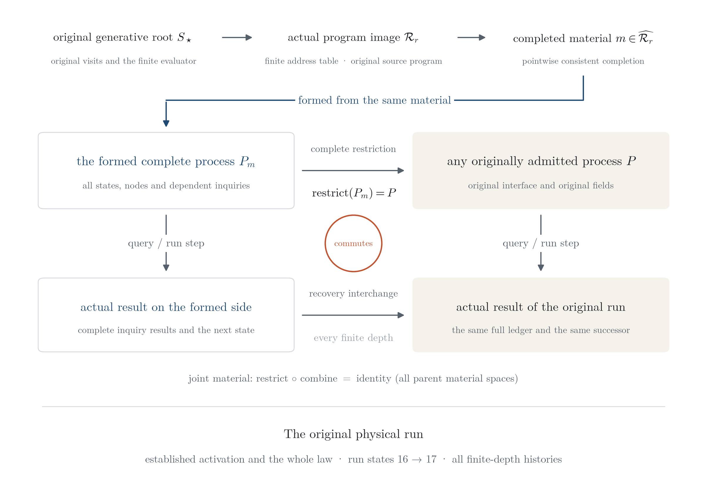

# We Found No Magic in This Mighty Universe: Common-Source Generation and Classical–Quantum Correspondence in a Spin×SU(7) Theory

**这浩瀚宇宙里，我们没找到魔法：Spin×SU(7) 理论的同源生成与经典—量子对应**

**Author: Jian Gao (高健)**\
Independent Researcher · innersummer@hotmail.com · ORCID 0009-0009-5002-1655

---

> *I have heard of thee by the hearing of the ear: but now mine eye seeth thee.*
>
> — Job 42:5 (King James Version)

## Abstract

In the $\mathrm{Spin}^+(1,3)\times\mathrm{SU}(7)$ theory constructed here, none of gravity, gauge fields or matter is introduced separately: all three arise from one common source structure, and classical variation and quantum response are related by an exact identity whose coefficient is computed from the original action rather than fitted. A common action with an independent matter dual admits an explicit nine-field solution satisfying every Euler–Lagrange equation. For this solution's matter field $\psi$, independent linear dual $\chi$ and every complex-linear operator $A$ on the 252-dimensional matter space, $\chi(A\psi)=4k\langle v,R(A)v\rangle$. Here $v$ is a normalized eight-dimensional state, $R(A)$ is determined by the original action and dual, and $k=\sqrt2$. The identity recovers, term by term, the gauge current and the sixteen kinetic loads; standard eight-mode fermionic Fock lifting preserves its one-particle matrix elements.

The same original action carries quantization all the way through. The complete 252-dimensional matter and its independent dual form a 504-mode CAR which, together with the scalar CCR, carries the common Hamiltonian $H=H_0+Y$; its action core is recovered exactly from the original action, and its coupling is a configuration function generated by the original scalar Gram rather than a supplied constant. The original four time constraints generate the quantum clock order by order, and the whole energy tail generates one fixed self-adjoint remainder $R$, whose closed-factor form plus $R$ reads back the complete Weyl energy exactly; for every precision, one source point carries all preparation fields at once—physical unit, near spectrum, Yukawa charge and eight external legs among them—and the near-spectral and full-Yukawa cutoff residuals tend to zero together as the precision is refined. Along the full field curve of a genuinely varying measure, the prepared responses and curvature readings, with their first and second derivatives, commute with the limit from cutoff to uncut. The gauge current above thereby becomes a charge–current Ward identity on the complete CAR: the one-particle sector carries no quartic pair current, and the two-propagator response is read by the same prepared state. The current then returns to the field: the mother action's second variation is the same 289-dimensional Jacobi matrix the Green function uses; the real current returns through the complete positive half-axis and source-generated two-sided inverses to the 289 field directions, with spectrum on the imaginary axis; in the static limit the uncleared field leaves a pole residue determined by constraint source number 114, and the field equation holds if and only if the nine null-direction cosources vanish.

The common-source result reaches beyond the physical world of this paper. On the original admission interface, every admitted world state over any relation network, vocabulary and authority root, every complete inquiry and every complete evolving process is formed from the same source's finite-program image via pointwise completion, with full recovery of its states, inquiry and action rules, and histories at every finite depth; an inquiry is a registered readout question about a state, answered in the original physical process by the field readings. That source is the original occurrence source of the physical construction, whose occurrence history is generated by the raw event structure; any authority root proposed as another source falls under the same quantifier and is itself formed by it. Every formed world also satisfies total reality: the difference between any two distinct visits is located at their registered occurrences, so no real difference is left internally unlocated — there is no magic. The theorem directly preserves the original physical process's field readings and actual evolution.

The action also yields exact signed auxiliary elimination and nonzero gravitational feedback. On fixed coframe and Cartan-spin backgrounds, every real impulse generates a unique all-real-time coupled orbit whose Legendre energy is recovered from quantum time derivatives. Coherence and Bell probabilities give analytic predictions, among them a 32-cell prediction reaching $2\sqrt2$ constructed by the same source with no empirical input. The empirical verdicts are separated by object: the frozen ideal joint model is rejected by superconducting-circuit Bell data; the named nominal model of NIST 2015 still deviates from the five documented settings after the efficiency-unit correction, while the complete optical source domain generated from the public counts is nonempty under the joint 95% contract with every accepted source's CH strictly positive; for the Munich atomic experiment, the complete readout domain is compatible over all 20,403 prefixes, the ideal readout surface is rejected, and within the regular range all readout parameters of the same probability law are exactly one family of reciprocal scales — the hardware inverse requires independently prepared probe inputs.

**Keywords**: Spin×SU(7); gravity and gauge fields; classical–quantum correspondence; common-source generation; BF action; independent dual; common quantum Hamiltonian; Ward identity; fermionic Fock space; formal verification

### 摘要

在本文构造的 $\mathrm{Spin}^+(1,3)\times\mathrm{SU}(7)$ 理论里，引力、规范场与物质不是分别加入的：三者由同一源结构生成；经典变分与量子响应之间是精确等式，换算系数由原作用算出，不是拟合所得。我们写出包含独立物质对偶的共同作用量，给出满足全部 Euler–Lagrange 方程的九场显式解。对该解的物质场 $\psi$、独立线性对偶 $\chi$ 和任意 252 维复线性作用 $A$，有 $\chi(A\psi)=4k\langle v,R(A)v\rangle$：$v$ 是八维归一占据态，$R(A)$ 由原作用及对偶共同确定，$k=\sqrt2$。这条等式逐项恢复规范电流与十六项动能负荷；标准八模费米子 Fock 提升保持其单粒子矩阵元。

同一原作用还把量子化做到底。完整 252 维物质与独立对偶组成 504 模 CAR，与标量 CCR 一起承载共同 Hamiltonian $H=H_0+Y$，其作用核由原作用精确认回，耦合是由原标量 Gram 生成的配置函数而非外设常数。原四条时间约束逐阶生成量子时钟，全部能量尾生成一个固定的自伴余项 $R$，其闭因子形式加 $R$ 恰回读完整的 Weyl 能量；对每个精度，同一个源点同时携带物理单位、近谱、Yukawa 荷与八条外腿等全部准备字段，近谱与全 Yukawa 截断两个残差随精度一同趋零。沿真正变动测度的全场曲线，准备态的响应与曲率读数连同一、二阶导数都与截断到未截的极限交换。上述规范电流由此在完整 CAR 上成为荷—电流 Ward 恒等式：单粒子扇区恰无四次对电流，双传播子响应由同一准备态读出。电流又回到场：母作用的二阶变分就是 Green 所用的同一个 289 维 Jacobi 矩阵；实电流经完整正半轴与源生的双侧逆回到 289 个场方向，谱落在虚轴上；静态极限下，未清分母的场留下由第 114 号约束源决定的极点留数，场方程成立当且仅当九个零方向的共源为零。

共同来源的结论不止于本文的物理世界。在原准入接口上，任意关系网络、词汇与权威根上的每个合法世界状态，以及每个完整查询与每个完整演化过程，都由同一来源的有限程序像经逐输入完成形成，并完整恢复各自的状态、查询与作用规则，以及任意有限深度的演化历史；这里的查询是对状态的登记读出提问，在原物理过程中其答案即场读数。这个来源正是上述物理构造的原发生源，其发生史由原始事件结构生成；任何被提出作另一个来源的权威根也在同一量词之内，本身由它形成。每个被形成的世界同时满足全实在性：其中任意两次不同访问的差别都定位到各自的登记发生，不留内部无从定位的真实差别，也就是没有魔法。这一定理直接保持原物理过程的场读数和实际演化。

原作用还给出辅助场的精确有符号消元与非零引力反馈。在固定余标架和 Cartan 自旋背景上，任意实冲量生成唯一全实时间耦合轨道，量子时间导数恢复其 Legendre 能量。相干与 Bell 概率提供解析预测，其中同一源无经验输入地构造出达到 $2\sqrt2$ 的 32 格预测。经验裁决按对象分开：冻结的理想联合模型被超导电路 Bell 数据拒绝；NIST 2015 的具名名义模型在修正效率单位后仍偏离五个文档设置，而公开计数生成的完整光学源域在联合 95% 合同下非空、全部接受源 CH 严格为正；对 Munich 原子实验，完整读出域在全部 20,403 条前缀上相容，理想读出面被拒绝，在正则范围内同一概率律的全部读出参数恰是一族反向尺度，硬件逆需要独立制备的探针输入。

**关键词**：Spin×SU(7)；引力与规范场；经典—量子对应；同源生成；BF 作用量；独立对偶；共同量子 Hamiltonian；Ward 恒等式；费米子 Fock 空间；形式化验证

## 1 Introduction: from hearing to seeing

### 1.1 The basic question

That the classical and the quantum are connected, physics has long known: quantization replaces classical quantities by operators, the correspondence principle guarantees that the two sides agree in a suitable limit, and countless calculations bear this out. Yet our knowledge of it is closer to something heard than something seen — we know the two sides agree, but can rarely point, within one complete model, to where each agreeing number comes from. We construct a $\mathrm{Spin}^+(1,3)\times\mathrm{SU}(7)$ theory in order to see this for ourselves.

To borrow a plain question: does God cheat here? Cheating has a precise meaning: a real difference appears in the theory, nothing inside the theory decides it, and yet it has been fixed. A coefficient tuned to match a result is such a difference — with another value the theory would still stand, it would merely fail to match; so is a separate source opened for some class of objects — swap it, and everything else stays as it was. We call such a difference **magic**. Where the classical meets the quantum, this paper examines the two places most often suspected: the coefficient and the source.

We look first at one gauge current. It appears in three places. On the classical side it is read as the coefficient of the variation of the action with respect to the gauge field; on the quantum side the corresponding response is read as the expectation value in a normalized state; the fermionic Fock representation then writes this one-body action as a combination of creation and annihilation operators. Each of the three writings has a definite mathematical object, and what usually connects them is a conventional dictionary. Our task is to build that dictionary term by term inside a given model and to check it at every pairing.

The first question is therefore: **can gravity, gauge fields and matter be generated from a common source, with the three readings above equal term by term?** What we look for are exact identities between designated objects, not asymptotics in $\hbar\to0$. The second question concerns the source itself, and it turns our view to the whole theory: **which states and evolving processes can this common source form, and once formed, are their original actions and evolution still fully preserved?**

Theorem 8.4 answers this question universally, and its quantifier covers the whole object domain of the original admission interface: every admitted world state over any relation network, vocabulary and authority root, every complete inquiry, every complete evolving process; an inquiry here is a registered readout question about a state, answered in the original physical process by the field readings. The “source” here is a generative structure: it specifies how states are produced, how actions are executed, and how the next occurrence follows on. The source identity used in this paper comes from the original physical occurrence history; the same source that generates geometry and matter is also used in the universal formation theorem. For each object, the construction produces the required material, and then recovers the object's full states and original operations. **The same source works for all objects** — that is the universal conclusion of the theorem; “fixed” appears in the proof only to mark this order of quantifiers. The theorem therefore need not first identify which admitted world our universe is: whatever can be written as an admitted world of the original interface lies within its quantifier. The same holds for any authority root proposed as another source; it is itself formed by the same source (§8.4). Figure 6 displays the interchange between formation and original action.

The difficulty lies first in the pairing, not only in the dimensions. The complete matter field lives on a 252-complex-dimensional carrier, yet the occupation components of our explicit solution need only 8 complex coordinates, and the corresponding eight-mode Fock space has dimension 256. Projection would lose information, and normalization changes amplitudes. To obtain an exact identity, one must prove that the solution really lies in the chosen occupation subspace, keep the normalization coefficient, and transcribe the action of the independent dual as well. Placing the three carriers side by side shows no identity at all; the identity has to be built through these three steps.

The answer running through the paper is condensed in one identity. Write $\psi$ for the complete matter field on the 252-complex-dimensional full matter carrier, $\chi$ for its independent linear dual (a field that enters independently of $\psi$ and is solved jointly with $\psi$ in the field equations), $v$ for the 8-dimensional occupation state obtained from $\psi$ by projection and normalization, $R(A)$ for the response matrix compressing a full-carrier endomorphism $A$ to the occupation carrier, $I(v)$ for the one-particle embedding of $v$ into the 256-dimensional fermionic Fock space, and $\mathrm{d}\Gamma$ for the one-body operator lift. Then at every spacetime point and for every full-carrier endomorphism $A$:

$$\chi(A\psi)\;=\;4k\,\langle v,\,R(A)\,v\rangle\;=\;4k\,\langle I(v),\,\mathrm{d}\Gamma(R(A))\,I(v)\rangle,\qquad k=\sqrt2 .$$

The left side keeps the complete full-carrier action and the independent dual; the middle uses the response matrix determined jointly by them; the right side is the Fock one-particle matrix element of the same response. The second equality is the standard preservation law of one-body lifting; what this paper must additionally prove is the first equality and its source coefficient $4k=4\sqrt2$. We call this identity the **classical–quantum pairing identity**. Here $A$ is arbitrary, while $\psi$ and $\chi$ are the designated solution of this paper; “arbitrary operator” and “arbitrary field” are two different quantifiers. The “no magic” of the title names three things seen at first hand: the coefficient $4\sqrt2$ is computed from the original action and independent dual, not fitted; every object of Theorem 8.4 is formed from the same source, with no object given a source of its own and any proposed further source among the formed objects; and every formed admitted world satisfies total reality, so each real difference in it is located at a registered occurrence and a magic bit is formally excluded (§8.4).

This identity still reaches only the one-particle sector. §6.7–§6.10 carry quantization all the way through: the same original action gives the complete common quantum Hamiltonian, the original time constraints generate by themselves a fixed energy remainder and one source-prepared state, and the response of a genuinely varying full field persists through the limit from cutoff to uncut; the coupling is a configuration function generated by the original scalar Gram, and the prepared state is produced by the source, so neither is chosen separately. On the complete 504-mode CAR the same current becomes a charge–current identity, and the one-particle sector is exactly the part where the quartic pair current vanishes. §6.11–§6.13 then let this current return to the field: the 289-dimensional matrix the Green function uses is the mother action's own second variation, the current returns through complete time to the 289 field directions, and the static-limit residue is determined by the original constraint sources.

### 1.2 Three carriers and six groups of results

Table 1 distinguishes the three carriers and their roles. The 8-dimensional occupation carrier consists of four Dirac components and a color doublet; for the explicit solution of this paper, $\psi=2Ev$, where $E$ is the embedding of the occupation subspace. The Fock lift places $v$ into $\Lambda^1\mathbb C^8$ and extends a one-body action to the whole exterior algebra. Figure 1 separates “preserving the designated pairing” from “recovering an arbitrary full-carrier field”, and also separates “an operator acting on the whole Fock space” from “which particle sector the state occupies”.

**Table 1 Inputs and outputs of the three carriers.**

| Carrier | Dimension | Input | Output |
| --- | --- | --- | --- |
| Full matter carrier $\Lambda^6\mathbb C^7\oplus\Lambda^2\mathbb C^7\oplus\Lambda^4\mathbb C^7$ (four Dirac components) | 252 complex | Complete matter field $\psi$, independent dual $\chi$, arbitrary linear operator $A$ | True variational current, kinetic loads, Yukawa pairing |
| Occupation carrier (Dirac spin $\times$ color doublet) | 8 complex | Projected normalized state $v$, response matrix $R(A)$ | Evaluation on positive normalized states, coherence weights, Bell probabilities |
| Eight-mode fermionic Fock space | 256 complex | One-particle embedding $I(v)$, one-body lift $\mathrm{d}\Gamma(O)$ | Finite-dimensional preservation of all one-particle readings |

**Figure 1 | Three representations of the same pairing.** The pairing obeyed by current readings like the one computed by hand in Example 1.1(b) is spread out here into its three writings. Structural diagram. Left: the full carrier $\mathcal M=(\Lambda^6\mathbb C^7\oplus\Lambda^2\mathbb C^7\oplus\Lambda^4\mathbb C^7)^{\oplus4}$. Middle: the occupation carrier $\mathcal E=\mathbb C^8$; $E$ is the embedding, $P$ the projection, $S$ swaps the upper and lower Dirac components, hence $R(A)=SPAE$. The figure does not draw an arbitrary $R(A)$ as a rotation: it is neither necessarily unitary nor necessarily self-adjoint. Right: $\mathcal F_-(\mathcal E)=\bigoplus_{n=0}^8\Lambda^n\mathcal E$; only the $n=1$ sector is highlighted, because $I(v)$ is a one-particle state. The middle identity preserves the pairing of this solution; it does not represent a lossless compression of an arbitrary full-carrier field, nor an expansion of a one-particle state into many-particle states. The inset takes the current reading for direction 1 and generator $\tau_0$ on the same occupation state (Example 6.6): with the swap $S$ it is constantly $1/2$, without $S$ it is $\cos(2\theta)/2$; the two agree only for $\theta\in\pi\mathbb Z$ and differ by 1 at the dark moment $\theta=\pi/2$. Both lines are evaluated directly from the analytic expressions.

The main text is organized around six groups of results, in the order in which they come into view: first a configuration on which every field equation holds at once, then where the coefficient linking classical and quantum readings comes from, then quantization carried through to the complete carrier and the full-field response, then whether the source stays the same for every object; the last two groups show how the same action feeds back and evolves, and which layer is still a hand-set mapping when it meets experiment.

**(I) The nine-field solution: one configuration satisfies every equation (§2–§4).** Explicit source material generates the global geometry, exterior-power matter and the common Dirac-dual action. The explicit nine-field solution satisfies every Euler channel with all six sectors nonzero; within the lawful weak readouts of the original complete history and classical world admission, it is unique, and it shares the derivative bounds of every finite order on compact domains with all lawfully recovered fields. The early geometric and material certificates, and the matter recovery of the current and next configurations, hold jointly in one machine-verified statement (Appendix D.2).

**(II) The coefficient is computed: classical–quantum pairing (§6, §7.3).** The classical–quantum pairing identity holds for every full-carrier endomorphism; the current and the sixteen kinetic loads agree term by term; the standard Fock lift preserves all readings. The two factors of the coefficient $4k=4\sqrt2$ come from the independent dual ($2k$) and from the amplitude of the designated solution ($\psi=2Ev$); the bare compression that omits one dual swap reads $-\tfrac12$ at the dark moment (§6.6). The common-source phase gives the five-point coherence law.

**(III) Quantization carried through, then the current returns to the field: the complete quantum construction and the original-field return (§6.7–§6.14).** The same original action gives 61 scalar CCR pairs, a 504-mode CAR formed by the 252-dimensional matter and its independent dual, and the common Hamiltonian $H=H_0+Y$ on a 100-dimensional configuration, whose action core is recovered exactly from the original action. The original time constraints generate the clock at every order, and the whole energy tail generates a fixed self-adjoint remainder $R$; one source point pays at once all preparation fields, among them physical unit, near spectrum, Yukawa charge and eight external legs, and the near-spectral and full-Yukawa cutoff residuals tend to zero together. Along the full field curve of a genuinely varying measure, the values and the first and second derivatives of the prepared responses and of 36 curvature readings commute with the limit from cutoff to uncut; on the complete CAR the gauge current becomes a charge–current Ward identity whose one-particle sector carries no quartic pair current (Theorems 6.7–6.10). The current then returns to the field: the mother action's second variation is the same $H_{289}$ the Green function uses (Theorem 6.11); the real current returns through the complete positive half-axis, source-generated two-sided inverses and a genuinely varying background to the 289 field directions (Theorem 6.12); in the static limit the uncleared field leaves a residue determined by constraint source number 114, and the field equation holds if and only if the null-direction cosources vanish (Theorem 6.13); the composite source's matched $\Gamma$ word has a source-internal budget and the renormalized endpoint has an absolute whole-frequency common tail (Theorem 6.14). All complete proofs are in Supplement S1–S8.

**(IV) The mother source does not change with the object: universal formation (§8, Appendix C).** Every admitted world state of the original admission interface (over any relation network, vocabulary and authority root), every complete inquiry and every complete evolving process is formed by completion from the finite programs of the same mother source $S_\star$; every formed world satisfies total reality and contains no magic bit. Recovery preserves all states, the inquiry and action rules of each state, and the evolving history at every finite depth of the whole process; joint formation also preserves each copy of the complete material participating in the construction. Forming these objects and recovering their original operations use one and the same material. The precise object domain and types of the theorem are given in §8.4, and §8.5 connects it back to the original physical process. The same generator also constructs, for every member of the smooth unified source family, a nine-field realization with its quantum response (the source data change, the mother source stays the same); every finite source sequence acquires a lawful ordered path on the common history; complete matter actions are formed by canonical completion of rational histories of the source material. Pointwise completion, joint material and all-state formation further constitute the proof mechanism of Theorem 8.4. Finite real paths, rational autonomous programs and complete completion each have their own quantifiers and uses.

**(V) How the same action responds, feeds back and evolves (§3, §5, §7.1–§7.2).** For any nondegenerate full field configuration, the auxiliary fields have an exact signed elimination $B^*=K_e^{-1}F$; the mixed density $L=L_0+\kappa(b^2+2ub+ub^2)$ obtained by stretching the clock has, at fixed $u>-1$, a unique valley bottom $b^*=-u/(1+u)$ in the auxiliary direction, whose stress is transmitted to the gravitational skeleton, producing an origin recoil of $-N/2$ and pushing the successor out of the original two-parameter family. Every impulse on the fixed background generates an all-real-time coupled orbit whose Legendre energy is recovered from quantum time derivatives.

**(VI) Bell probabilities and the public experiments: on which object the verdict lands (§7.4, §9.2).** The common-source phase gives the Bell probability family. For comparison with experiment, the apparatus phase, settings and readout map are frozen at nominal values and are not generated by the source. One existing test rejects the superconducting-circuit joint model carrying this mapping; for a named nominal model of the public NIST 2015 apparatus, a dual-implementation replay with the corrected efficiency unit still places the five documented settings outside the nominal optimum band. The public counts now generate a complete optical source domain whose joint 95% acceptance domain is nonempty with every accepted source's CH strictly positive (Proposition 9.1); the same source constructs with no empirical input a prediction reaching $2\sqrt2$, the Munich atomic experiment's complete readout domain is compatible over all original-order prefixes, and inside the regular range the same-law parameters are exactly one family of reciprocal scales (Proposition 9.2); the detector fibre, the two-probe unique inverse, the pulse-realizable image and the original post-measurement history connect the readout back to the hardware (Proposition 9.3). The optical source inversion and feedback and the full development of readout identification are carried by the optical-metrology paper and the Bell readout-identification paper.

### 1.3 Let the reader compute first

Before the construction begins, the reader is invited to compute three numbers by hand. They use only the four parameters of the fixed source; the definitions and relations of these parameters are checked in §2.1 and Appendix A.

$$\sigma=\tfrac12,\qquad k=\sqrt2,\qquad a=\frac{3k}{5}=\frac{3\sqrt2}{5},\qquad N=\sqrt{\frac{54}{125}} .$$

**Example 1.1 (Three-minute hand calculations).**

**(a) The frequency.** The source phase frequency is defined as $\omega=3N(k-a)/2$. Please verify two identities: first, $k-a=2\sqrt2/5$, hence $\omega=3N\sqrt2/5=3Nk/5$; second,

$$\omega^2=\frac{9N^2k^2}{25}=9\cdot\frac{54}{125}\cdot\frac{2}{25}=\frac{972}{3125}.$$

There is no numerical fitting here: $972/3125$ is the exact square of the frequency. The ratio $a/k=3/5$ and the balance $a^3=N^2k$ used later will repeatedly reduce longer expressions to such rational numbers. They are fixed parameter relations within this model, not assertions restricting which prime factors physical constants may contain.

**(b) A concrete current reading.** The three gauge generators $\tau_0,\tau_1,\tau_2$ on the color doublet have the Pauli form $\tau_g=(i/2)\sigma_{g+1}$ on their doublet block ($g=0,1,2$; $\sigma_1,\sigma_2,\sigma_3$ are the Pauli matrices; full definitions are in Appendix A). Take $\tau_1$: its matrix is

$$\tau_1=\begin{pmatrix}0&\tfrac12\\[2pt]-\tfrac12&0\end{pmatrix},\qquad
\tau_1^2=\begin{pmatrix}-\tfrac14&0\\[2pt]0&-\tfrac14\end{pmatrix}=-\tfrac14 I .$$

The Lie pairing is $\langle X,Y\rangle=-\mathrm{Re}\,\mathrm{tr}(XY)$. Thus $\langle\tau_1,\tau_1\rangle=-\mathrm{Re}\,\mathrm{tr}(-\tfrac14 I)=\tfrac12$; similarly $\langle\tau_g,\tau_h\rangle=\tfrac12\,\delta_{gh}$. The gauge current of this paper is read out on the spatial variation taking the value $\tau_1$ (Theorem 6.3; the current superscript is a spatial-direction index, not a square):

$$J^2(\tau_1)\;=\;4Nk\cdot\langle\tau_1,\tau_1\rangle\;=\;4\sqrt{\tfrac{54}{125}}\cdot\sqrt2\cdot\frac12\;=\;\frac{12\sqrt{15}}{25}\;\approx\;1.8590 .$$

On the quantum side, the same current is $4Nk\cdot\langle v,O_2(\tau_1)v\rangle$, where $v$ is the occupation state and $O_{g+1}(\tau_h)$ is the response observable in direction $g{+}1$ (in this example $g=h=1$, i.e. $O_2(\tau_1)$); Theorem 6.3 asserts $\langle v,O_{g+1}(\tau_h)v\rangle=\tfrac12\,\delta_{gh}$. The two expressions $4Nk\cdot\tfrac12$ are the same algebraic number. The hand calculation ends here: **classical variation and quantum expectation give one and the same value, no more and no less** — and you have used no limit and no approximation. This is the first thing seen at first hand: the number computed by hand on the classical side is exactly the quantum reading given by Theorem 6.3.

**(c) Five marks.** Write $t^*=\pi/(2\omega)$ (called the dark moment in §6) and $u=t/t^*$. The function $\cos^2(\omega t)$ takes, at the five marks $u=0,\tfrac12,1,\tfrac32,2$, the values

$$\cos^2\!\Big(\frac{u\pi}{2}\Big):\qquad 1,\;\tfrac12,\;0,\;\tfrac12,\;1 .$$

These are just the elementary values of $\cos^2$ at integer multiples of $\pi/4$; anyone can compute them. What §7 will prove is that the coherence reading of the source-generated quantum state follows exactly this curve, while the classical exclusive path stays at the constant $\tfrac12$. At $u=0$ and $u=1$ the two readings therefore disagree openly, $1$ versus $\tfrac12$ and $0$ versus $\tfrac12$; the moment $u=1$ is the dark moment.

Each of the three numbers announces something: the constants involve no fitting, classical and quantum sides read the same current, and the coherence reading goes dark at the dark moment. One more number is worth remembering now: $-1/2$. §6.6 will explain that omitting just one swap required by the independent dual makes the correct current $1/2$ read as exactly that.

### 1.4 Relation to nearby work

The immediate neighbor is Smolin's extended Plebański gravity–Yang–Mills action [7]; §9.1 compares the two term by term in constraint variables, field content, elimination and construction goal. The Yang–Mills gauge principle and Deser's self-coupling construction provide the comparative background for the common action and the source of its nonlinearity [1,2]; the concrete arguments of this paper lie in the source-generated configurations and their cross-carrier pairing. Standard fermionic second quantization provides the identity from a one-body action to a Fock action [4]; this paper additionally checks the response of the full-carrier projection, the normalization and the independent dual. The Bell–CHSH work provides the existing framework for joint observation [5]; this paper states its analytic probability family and the existing empirical rejection record separately.

### 1.5 Organization and reading routes

§2 grows geometry and matter from the source data; §3 writes down the common action and eliminates the auxiliary fields; §4 gives the complete classical solution, uniqueness and all-history bounds; §5 analyzes the clock–auxiliary mixed response and the gravitational recoil; §6 establishes the classical–quantum pairing identity, the current agreement and the Fock preservation, then carries quantization through to the complete CAR, the fixed energy remainder, one source preparation and the full-field response, and lets the current return to the original field through the same $H_{289}$, the complete half-axis and the static pole; §7 gives all-real-time dynamics and analytic predictions; §8 explains how the common source forms the states and processes of the entire theory, then returns to the original physical run; §9 compares related work, reports the empirical adjudication and discusses the results. Appendices A–D carry respectively the full-carrier representations and constant computations, the variation and elimination details, the proofs of the source family and complete formation, and the fixed versions and verification certificates; the complete proofs and checks of Theorems 6.7–6.14 and Propositions 9.1–9.3 are in the Supplement.

Figure 1 gives the pairing map; Figure 2 separates the nine-field dependencies, the Clock–$B$ local density and the complete write; Figure 3 draws the complete quantum construction from the original action to the original-field return; Figure 4 draws the equal-energy orbits and the energy control; Figure 5 draws the five-point coherence readings; Figure 6 draws how the same formation material connects back to the original objects and original operations. The formal entry points for the nine-field computation are in Appendix B.7; the declaration locations and proof mechanism of the formation theorem are in Appendices C.8–C.9; versions and verification records are in Appendix D. Readers interested in the concrete physics can start from Example 1.1, Figure 1 and Theorem 6.2, and then follow Theorems 6.10–6.13 to the complete quantum reading of the same current and its path back to the original field; readers interested in the universal formation can read Theorem 8.4 first, then rebuild its proof along Appendix C.9.

---

## 2 Source data, Spin×SU(7) geometry and exterior-power matter

### 2.1 Where the fields come from

Usually the fields are written down together with the Lagrangian; that they are there is a premise. Here the fields, too, have an origin. The source material has two parts: finitely describable discrete data, and real-valued coframe coefficients together with a contact residue. We do not conjure a continuum out of purely discrete data; what we give is an explicit set of rules for how this mixed material generates geometry, connections, representations and the subsequent field configurations. The “source” here is neither an externally applied current source in a field-theoretic equation nor an initial slice in a cosmological initial-value problem; it is the primitive generative material of the construction: fields, connections and all readings are generated from it (§8 gives its formation-side profile).

**Definition 2.1 (Source data).** The basic source has six fields: a source-root label, a material path, integer-valued potentials on two phase rings, a natural-number $\sigma$ seed, a natural-number color scale, and $4\times4\times4$ real coframe linear coefficients. A **smooth unified source** contains one more real contact residue, hence $64+1=65$ continuous coordinates in total. The fixed source takes root label $(5,7)$ (energy level $8$), zero shift, phase potentials $0,1,3$ and $2,5,9$, seed $0$, color scale $1$, a single nonzero coframe coefficient $1$ at $(\text{direction},\text{internal},\text{coordinate})=(2,0,1)$, and contact residue $2\pi$. These are the values adopted by the constructions of this paper; the finiteness of the field count is not a proof of parameter minimality.

Values and origins at a glance (this table is part of the definition; the numbered tables cited in the text start from Table 1):

| Field | Fixed value | Origin (one sentence) |
| --- | --- | --- |
| Source-root label | $(5,7)$, energy level $8$ | Depth-zero reading of the A6 root-lattice source trace |
| Source shift | Zero | Base label read at zero displacement (shifts generate other labels by the same grammar) |
| Phase potentials | $0,1,3$ and $2,5,9$ | Depth-zero readings on the two source phase rings |
| $\sigma$ seed | $0$ | Origin of the generating family $\sigma_n=1/(n+2)$ ($\sigma=\tfrac12$) |
| Color scale | $1$ | Unit calibration |
| Coframe linear coefficients | The shear coefficient (unique nonzero component $1$) | The $x^1$-dependence of the time frame component shears by one unit along $x^2$ (the $(0,1)$ entry of the coframe $=x^2$) — an elementary shear matrix: pointwise $\det=1$, nonzero anholonomicity |
| Continuous contact residue | $2\pi$ | Contact rate $\pi$; the original reading of the imaginary hypercharge diagonal of the common source potential |

Source fields must be kept apart from downstream conclusions: the representation certificates of the endpoints, the genealogy identities, the breaking scalar, the mass matrices, the matter states and the currents are not extra inputs; they are generated or read out along the construction chain. The early layers provide the nondegenerate geometry, the simplicity target, the gravity–gauge coupling, the single $\mathrm{SU}(7)$ full-carrier connection and the substructure determined by the selection equations; the representation and matter interfaces are checked in Propositions 2.2 and 2.5 respectively. This paper continues constructing continuous fields along these structures.

The root label comes from the depth-zero reading of the A6 root-lattice source trace, and zero shift keeps that base label. Node differences of the phase potentials generate the phase cochains; the first ring's potential difference $1-0=1$ gives the nonzero physical amplitude. Seed $0$ gives $\sigma=1/2$ in the family $\sigma_n=1/(n+2)$. The primitive coframe generated by the real coefficients is $e^0=dx^0+x^2dx^1$, $e^i=dx^i$ ($i=1,2,3$), hence the pointwise determinant is $1$, while $de^0=dx^2\wedge dx^1\ne0$: nondegeneracy and anholonomicity are both directly visible. The contact residue makes the contact rate $\sigma\cdot2\pi=\pi$. The source geometry here and the homogeneous coframe solved in §4 are different objects in the construction chain.

By the standard of §1, this table must itself be examined: are these values a set of differences that were fixed without anything deciding them? They are not. The root label and the phase potentials are depth-zero readings of the source root trace and the source phase rings, the $\sigma$ seed is the origin of its generating family, the contact residue is the original reading of the common source potential, and the color scale is a unit calibration — a convention of description, not a real difference. Nor is this choice of values singled out: Theorem 8.1 gives a nine-field realization for **every** member of the smooth unified source family, with classical-world admission decided by whether that source's own integer amplitude is nonzero; Theorem 8.2 shows that any finitely many members can become actual readouts, in order, on the same original mother history; and in Theorem 8.4 the mother source $S_\star$ is the same for every object. Changing the source data opens no separate source.

These data also fix the generative identity of this physical construction. Three objects must be distinguished: the physical source data of this section, the 252-dimensional matter carrier, and the root $S_\star$ carrying the original occurrence history. The first two serve the computation of fields and responses; the third provides the original history and the finite evaluation rules of §8. Theorem 8.4 reuses this original generative root and proves that it can form all admitted objects; the material rank and completed material required for each object are given by the construction. §8 will explain in turn how the concrete source family, finite real paths, rational autonomous programs and complete formation connect back to the same occurrence history.

Three direct readings will be used below: $\sigma=1/(0+2)=1/2$, contact rate $\pi$, and phase amplitude $1$. The normalization of the gauge constitutive law needs an explicit convention: what multiplies the Hodge star is the coupling **squared** — all three blocks take $g_i^2=\sigma$, not $g_i=\sigma$. This convention makes the elimination formula of §3 and the auxiliary-field values of §4 mutually consistent.

**Table 2 The nine fields.** The coframe is called simply *coframe* throughout. The last column distinguishes algebraic from differential channels; the Lorentz channel is a derivative three-form equation, closed in this construction by the Cartan write. The **standard-model-type block** is the block embedding chosen in the formalization (formal label P286): on the $3+2+1+1$ block decomposition, Lie algebra elements are $\mathrm{diag}(C,W,y,-y)$, with $C\in\mathfrak{su}(3)$, $W\in\mathfrak{su}(2)$ and $y$ a pure imaginary scalar; the group-level embedding is in Appendix A.1. Spatial directions take $i=1,2,3$, and the three color-doublet generators used are numbered $\tau_0,\tau_1,\tau_2$.

| Field | Symbol | Physical identity | Value in the designated solution | Channel |
| --- | --- | --- | --- | --- |
| Coframe | $e$ | Spacetime frame, root of the metric | $\mathrm{diag}(N,1,1,1)$ | Differential |
| Spin connection | $\varpi$ | $\mathrm{Spin}^+(1,3)$ connection | Generated by the Cartan write | Differential (Cartan-closed) |
| Gravitational auxiliary | $B$ | Bivector, one wing of the BF pairing | $\mathrm{II}^+(e)$ ($\mathrm{II}^+$ is the simplicity target) | Algebraic |
| Simplicity multiplier | $\lambda$ | Bivector locking $B$ back to the frame | Generated by the Cartan write | Algebraic |
| Gauge connection | $A$ | Connection valued in the standard-model-type Lie block | $(0,\,a\tau_0,\,a\tau_1,\,a\tau_2)$ | Differential |
| Gauge auxiliary | $B_A$ | Gauge wing of the BF pairing | $K_e^{-1}F$ (generated by the constitutive write) | Algebraic |
| Scalar | $\varphi$ | $\Lambda^4\mathbb C^7$-valued dynamical scalar | Unique vacuum point | Differential |
| Matter | $\psi$ | Exterior-power Dirac field | $e^{\pm i\omega t}$ structure (§4.1) | Differential |
| Independent dual | $\chi$ | Independent linear dual field of $\psi$ | $\sqrt2\,e^{\pm i\omega t}$ phases | Differential |

The nine fields give the raw field configuration; their curvatures and covariant derivatives are then generated by actual differentiation. This is the **holonomic configuration** used in this paper: the gravitational curvature is computed as $\mathrm d\varpi+\varpi\wedge\varpi$, the gauge curvature componentwise as $F_{\mu\nu}=\partial_\mu A_\nu-\partial_\nu A_\mu+[A_\mu,A_\nu]$, the matter covariant derivative as $D_\mu\psi=\partial_\mu\psi+\gamma(\varpi_\mu)\psi+\rho(A_\mu)\psi$, and similarly for the scalar. Here “holonomic” means that the derivatives come from the integrability relations of the raw fields, not “holomorphic” in complex analysis. The independent linear dual $\chi$ and $\psi$ enter the variation separately; their exact relation on the designated solution must be checked by construction and cannot be replaced in advance by complex conjugation.

### 2.2 The exterior-power carriers: basis, dimension and matter action

**A geometric reading of the exterior powers.** The $d$-th exterior power of a seven-dimensional complex space has as basis the oriented wedge products of $d$ distinct basis vectors; swapping two factors flips the sign, and a repeated factor gives zero. The dimensions of the three matter layers can therefore be counted directly: $\binom76=7$, $\binom72=21$, $\binom74=35$. With four Dirac components adjoined, the complete matter carrier is

$$\psi\in\big(\Lambda^6\mathbb C^7\oplus\Lambda^2\mathbb C^7\oplus\Lambda^4\mathbb C^7\big)^{\oplus 4},\qquad 7+21+35=63,\quad 4\times63=252 .$$

The scalar lies in $\Lambda^4\mathbb C^7$, and the Yukawa map uses the wedge product $\Lambda^2\mathbb C^7\otimes\Lambda^4\mathbb C^7\to\Lambda^6\mathbb C^7$ to connect the corresponding matter layers. The number 252 here is exactly $4(7+21+35)$; no further layer of freedom is hidden. The hypercharge direction of this paper is the opposite action $\mathrm{diag}(y,-y)$ on the last two one-dimensional blocks of the chosen decomposition; along this direction, each exterior-power layer splits into three branches of weights $-1,0,+1$.

**Proposition 2.2 (Exterior-power matter structure and anomaly cancellation).** On the exterior-power matter carrier of the fixed source: the total dimension is $63$ (per Dirac component); the hypercharge weight multiplicities at $-1,0,+1$ are $16,31,16$ respectively (sum $63$; layer by layer: $1,5,1$ for $\Lambda^6$, $5,11,5$ for $\Lambda^2$, $10,15,10$ for $\Lambda^4$); the $\mathrm{SU}(7)$ cubic anomaly index table, under generator labels $(1,3,2,-2,-3,-1)$, sums to zero over the $(6,2,4)$ combination, and all five remaining anomaly traces cancel; the weak doublet count is $16$, an even number (Witten's parity condition); the one-loop $b_0$ coefficients are $\mathrm{SU}(7):61/3$, $\mathrm{SU}(3):17/3$, $\mathrm{SU}(2):2$, $\mathrm{U}(1):-64/3$.

Proof idea. Nothing here needs guessing; it only needs counting. The first three items are explicit combinatorial computations on the exterior-power representation: weight multiplicities are summed from layer-by-layer enumeration, anomaly indices are obtained by summing the $(6,2,4)$ terms of the label-by-label table of the cubic symmetric invariant, and the remaining traces are eliminated one by one through trace identities. The $b_0$ table is the fixed record of a Weyl-only one-loop inventory. ∎

These computations check the dimension, anomalies and one-loop counts of the designated representation content; they are definite algebraic conditions on the matter spectrum and do not replace a proof of full quantum field-theoretic consistency. The listed $b_0$ belongs to the Weyl-only inventory; the beta functions of the full theory with the dynamical scalar added cannot directly reuse this table.

### 2.3 Global geometry: gluing and descent of the full-carrier connection

A connection written in local coordinates is only half of the geometry; the other half is **gluing**. Let $g(x)$ be the transition functions of the frame bundle. The full-carrier connection potentials on two charts must satisfy

$$A_{(\beta)}=\mathrm{Ad}(g)\,A_{(\alpha)}-(dg)\,g^{-1} .$$

The source geometry also carries, on each chart, a translation term in the hypercharge direction (arranged by chart index on the time component), which commutes with the standard-model-type gauge block and therefore does not disturb the gluing formula. The following proposition assembles the local data into global objects.

**Proposition 2.3 (Total bundle, descent and background transport).** The fixed source generates the $\mathrm{Spin}^+(1,3)\times\mathrm{SU}(7)$ total bundle and the associated matter bundle, and: (i) matter sections descend along all charts to a global section, sewn on overlaps by the coboundary condition of the transition functions, while the independent dual $\chi$ is sewn by contragredient transport along the same bundle, compatibly with the matter descent; (ii) the full-carrier connection potentials satisfy the gluing identity above, and the local action and local densities are invariant under change of charts; (iii) the source-background full-carrier connection satisfies, for every smooth unified source, every coordinate axis, and every real length and time, the background parallel ODE and its composition law — its rectangle holonomy is nontrivial and its flow evolution non-identity, so the background itself carries genuine global information; (iv) the current actual configuration uses its own gauge connection, read back at any chart and point by the same gluing identity.

Proof idea. The difficulty lies not in the patches but in the seams. Local sections are transported by the representation of the transition functions, and the dual by the inverse action; overlap compatibility guarantees that they define the same global object. The descent of densities is checked term by term through the equivariance of wedge products and pairings. The background axial transport uses explicit source-generated functions, with the parallel equation, initial values and composition law verified directly; the bare local existence theorem for general smooth ODEs would not by itself yield the all-parameter conclusion needed here. Nontrivial holonomy must also be seen on the spot: its witness belongs to the fixed source and cannot be inferred from the gluing form alone. ∎

Writing field equations on a single chart does not yet say that the action readings on all charts glue into one object. What the gluing condition supplies is exactly this step from local computation to global interpretation; all representations and responses below use the completed gluing.

### 2.4 The unique vacuum and its stabilizer

Next we fix the minimum of the scalar potential, and distinguish “the minimum is unique” from “which symmetries remain”.

**Proposition 2.4 (Unique vacuum and the 35-coordinate stabilizer).** The source-generated scalar potential has, in every chart and at every point, the generating vacuum coordinates as its unique minimum: $\text{potential}(\varphi)\ge\text{potential}(\varphi_{\mathrm{vac}})$, with equality if and only if $\varphi=\varphi_{\mathrm{vac}}$. The stabilizer of the vacuum is characterized by the equalizing conditions on all $35$ $\Lambda^4$ coordinates (the number of basis indices of $\Lambda^4\mathbb C^7$ is exactly $\binom74=35$); this stabilizer is a proper subgroup, and it meets the embedded hypercharge circle only at the identity element.

Proof idea. The shape of the potential already gives the answer. It is a squared norm of the departure from the vacuum coordinates, so uniqueness of the minimum is the vanishing condition of a squared norm; the stabilizer condition equalizes each $\Lambda^4$ coordinate of $\rho_4(g)\cdot\varphi_{\mathrm{vac}}$ with the corresponding coordinate of $\varphi_{\mathrm{vac}}$, 35 conditions in total; properness and the trivial hypercharge intersection are checked by explicit group elements. ∎

That the stabilizer is a proper subgroup says the vacuum is not fixed by the whole full-carrier group; that it meets the embedded hypercharge circle only at the identity gives more specific breaking information. The unique-minimum statement concerns the given source and its coordinatized potential, not the full vacuum orbit when the source is not fixed. The solution of §4 takes this generating vacuum, and the origin contact condition is defined accordingly.

### 2.5 Connecting the early finite structure back to the actual fields

The continuous matter fields must also connect back to the early finite structure. Whether the readings of the same internal action, scalar, mass map and mixing matrix at the two construction levels really agree is the content of the next proposition.

**Proposition 2.5 (The early structure connects back to the actual matter).** At every spacetime point, for every full-carrier algebra element and every spin index: the value of the early internal-representation action on the current complete matter field equals the current reading of that element's action value; the pointwise scalar readings, the complete mass map and the finite $2\times2$ mixing matrix agree term by term with the early joint values. The same identities hold for the next configuration.

Proof idea. There is no new estimate here, only pointwise bookkeeping: internal actions are aligned entry by entry through the representation matrices; scalar, mass and mixing are read back directly through composites of fixed maps; the next configuration is transported through the configuration identity. ∎

The early finite structure therefore enters the actual fields directly: Proposition 2.5 gives one set of interface identities for each of the current and next configurations, and the occupation-state projection and the history formation below use the readings of these same objects.

---

## 3 The common action and auxiliary-field elimination

### 3.1 How nine fields enter one action

First-order BF methods pair curvature with two-forms and then introduce dynamics through constraint or constitutive terms; the method is standard. The new questions sit at the seams: how the same coframe enters both the gauge constitutive law and the matter kinetic term, how the independent dual produces simultaneously the Dirac equation and the current, and whether these dependencies can be jointly satisfied by one complete configuration.

We first write the formulas on the source's zeroth chart. Take spacetime indices $\mu,\nu=0,1,2,3$ and internal Lorentz indices $a,b=0,1,2,3$, with $\eta=\operatorname{diag}(-1,1,1,1)$. Both kinds of two-form indices are ordered as

$$\mathcal P=(01,02,03,23,31,12),\qquad p^c=(3,4,5,0,1,2),\qquad \epsilon_I=(-1,-1,-1,1,1,1)_I.$$

Here $I$ indexes internal bivectors and $p$ indexes spacetime two-forms; the two must not be conflated merely because both have six coordinates. The pointwise types of the independent fields on the physically admitted domain are:

| Field | Pointwise type and conventions |
|---|---|
| $e^a{}_\mu$ | Invertible real $4\times4$ coframe; $\nu_e=|\det e|$, $g=e^{\mathsf T}\eta e$ |
| $\varpi_\mu{}^a{}_b$ | $\mathfrak{so}(1,3)$-valued one-form; antisymmetric after lowering the internal indices |
| $B^{ab}_{\mu\nu},\lambda^{ab}_{\mu\nu}$ | Two independent real $6\times6$ arrays, i.e. internal-bivector-valued two-forms |
| $A_\mu$ | $\mathfrak h=\mathfrak{su}(3)\oplus\mathfrak{su}(2)\oplus\mathfrak u(1)$-valued one-form, acting on the full-carrier representation through the block embedding of §2 |
| $B_{A,p}$ | $\mathfrak h$-valued two-form |
| $\varphi$ | $\Lambda^4\mathbb C^7\simeq\mathbb C^{35}$ |
| $\psi$ | $\mathcal M=\mathbb C^4\otimes[(\Lambda^6\oplus\Lambda^2\oplus\Lambda^4)\mathbb C^7]\simeq\mathbb C^{252}$ |
| $\chi$ | $\mathcal M^*=\operatorname{Hom}_{\mathbb C}(\mathcal M,\mathbb C)$, varied independently of $\psi$ |

The raw configuration carrier allows arbitrary real coframe and connection coordinates; the nondegeneracy and Lorentz legality in the table are physical admission conditions imposed separately, not a deletion of other candidates from the original carrier. After imposing this legality, $\varpi$ has $24$ real coordinates and the gauge one-form has $4\times12$ real coordinates; the model's full-carrier representation is $\mathrm{SU}(7)$ — this does not mean that another $48$ independent gauge generators participate in the nine-field variation. Curvatures and covariant derivatives are recomputed from the fields in the table, not input as separate fields.

To fix the normalization, define the oriented wedge coefficients

$$W_\beta(X,Y)=\sum_{p\in\mathcal P}\beta(X_p,Y_{p^c}),\qquad
W_{\rm top}(B,C)=\sum_{I,p}\epsilon_I B_{Ip}C_{I,p^c}.$$

This amounts to taking the coefficient of the positive orientation $dx^0\wedge dx^1\wedge dx^2\wedge dx^3$. The gauge fiber pairing is $-\operatorname{Re}\operatorname{Tr}(XY)$ on the two special-unitary blocks and $-\operatorname{Re}(yz)$ on the imaginary hypercharge coordinate; the latter uses its own normalization and is not doubled merely because the embedding displays the two terms $y,-y$. The internal dual and the curvature with raised indices are

$$J=\begin{pmatrix}0&I_3\\-I_3&0\end{pmatrix},\quad
(\Sigma_e)_{Ip}=e^{a_I}_{\mu_p}e^{b_I}_{\nu_p}-e^{a_I}_{\nu_p}e^{b_I}_{\mu_p},\quad
\mathrm{II}^+(e)=J\Sigma_e,\quad
\widehat F_{\varpi,Ip}=\epsilon_I F_{\varpi,Ip}^{\rm raw}.$$

$F^{\rm raw}_{\varpi,Ip}$ is the curvature coordinate with both internal indices lowered; the hat only raises them once. $J$ acts on $I$, while the spacetime Hodge star $\star_e$ acts on $p$. For the $e=\operatorname{diag}(N,1,1,1)$ used shortly,

$$\star_e(f_0,\ldots,f_5)=
(N^{-1}f_3,N^{-1}f_4,N^{-1}f_5,-Nf_0,-Nf_1,-Nf_2).$$

This fixes both the minus sign of the constitutive inverse and the two kinds of “duality” that §5 must not conflate.

**Definition 3.1 (The common local density).** Let $\gamma_e^\mu=(e^{-1})^\mu{}_a\gamma^a$, $\Omega_\mu=\frac14\varpi_{\mu ab}\gamma^a\gamma^b$, and

$$D_\mu\psi=\partial_\mu\psi+(\Omega_\mu+\rho_{\mathcal M}(A_\mu))\psi,
\qquad D_\mu\varphi=\partial_\mu\varphi+\rho_4(A_\mu)\varphi.$$

In the above, $\varpi_{\mu ab}$ is summed over all ordered $a,b$, equivalently over the six antisymmetric pairs with a factor $1/2$. The Gamma matrices, the block embedding and the exterior-power actions are in Appendix A. Write $Y_R(\varphi)=T_\varphi P_R$, where

$$P_R=\operatorname{diag}(0,0,1,1),\qquad
T_\varphi(w_6,w_2,w_4)=(w_2\wedge\varphi,0,0),\qquad
U_s(\varphi)=\sum_{|I|=4}|\varphi_I-(\varphi_{{\rm vac},s})_I|^2.$$

$T_\varphi$ acts Dirac component by Dirac component; $P_R$ acts only on Dirac indices. The independent linear dual already carries one side of the pairing, so no $\gamma^0$ is inserted into $Y_R$. The common density is

$$\begin{aligned}
L_s={}&W_{\rm top}(B,\widehat F_\varpi)-\tfrac12W_{\rm top}(B,JB)
+W_{\rm top}(\lambda,B-J\Sigma_e)\\
&+\sum_{j=3,2,1}\left[W_j(B_{A,j},F_{A,j})-
\tfrac12W_j(B_{A,j},g_j^2\star_e B_{A,j})\right]\\
&+\nu_e\left[\tfrac12g^{\mu\nu}\operatorname{Re}\langle D_\mu\varphi,D_\nu\varphi\rangle
-U_s(\varphi)+\operatorname{Re}\chi\!\left(i\gamma_e^\mu D_\mu\psi+Y_R(\varphi)\psi\right)\right].
\tag{3.1}
\end{aligned}$$

For the fixed source, all three squared couplings are $g_j^2=\sigma=1/2$. On other source charts, the scalar, matter, dual and their covariant derivatives are first written back to the zeroth chart by the source-generated transition action; the potential energy is still the squared distance above, relative to the same source vacuum. Thus the concrete potential here is not a Mexican-hat potential with parameters suppressed, nor does it require a vacuum vector numerically invariant in all frames. The BF and constraint terms are already four-form coefficients; only the last line is additionally multiplied by $\nu_e$.

Varying (3.1) with respect to the nine fields separately and integrating by parts yields the nine classes of residues in Appendix B.1. The first three are

$$\mathcal E_\lambda=B-J\Sigma_e,\qquad
\mathcal E_B=\widehat F_\varpi-JB+\lambda,\qquad
\mathcal E_{B_A}=F_A-K_e B_A.\tag{3.2}$$

They explain how the auxiliary fields are determined; they do not yet say that the equations for $\varpi,A,\varphi,\psi,\chi,e$ are satisfied. In particular, the coframe variation must be performed with the other eight fields held fixed: one must not first substitute the constitutive solution, which varies with $e$, and then mistake the resulting partial derivatives for the original nine-field ones.

### 3.2 Exact elimination of the auxiliary fields

The gauge auxiliary field is not a Lagrange multiplier appearing only linearly. Its quadratic term enters the Euler equations, and the Lorentzian Hodge star satisfies $\star_e^2=-1$. The elimination must therefore use the actual constitutive inverse and keep the sign of the residual quadratic form; it cannot be replaced by a positive-definite norm penalty.

**Theorem 3.2 (Auxiliary-field elimination).** For every smooth unified source, every nondegenerate full field configuration, and every chart and point, let $F_A$ be the gauge curvature and $\alpha_j=g_j^2(\mathrm{source})>0$ the squared coupling of the $j$-th gauge block generated by that source. Then $K_{e,j}=\alpha_j\star_e$, and the constitutive equation $K_e(B_A)=F_A$ has a unique algebraic solution, block by block:

$$B_{A,j}^{*}=K_{e,j}^{-1}F_{A,j}=-\alpha_j^{-1}\star_e F_{A,j} .$$

For the fixed source, all three $\alpha_j$ equal $\sigma=1/2$. For every such source, the complete local density admits the signed quadratic decomposition

$$L(B_A)\;=\;L(B_A^{*})-\tfrac12\,W\big(B_A-B_A^{*},\,K_e(B_A-B_A^{*})\big) .$$

Furthermore, there is a two-way bijection between nine-field configurations and pairs “constitutively fixed center $+$ $B$-residual” (full configuration $\mapsto$ (center, $B_A-B_A^*$)); this correspondence itself does **not** need the nondegeneracy premise, and under nondegeneracy the density in (center, residual) coordinates has the same shape. Before and after any number of source-generated writes, the field recovery and this decomposition are preserved.

Proof idea. The gauge auxiliary field looks like a Lagrange multiplier but is not one, so the key step is to expand the gauge block's dependence on $B_A$ as a quadratic form: $W(B,F)-\tfrac12 W(B,K_eB)$ is stationary at $B^*=K_e^{-1}F$, and completing the square leaves $-\tfrac12 W(B-B^*,K_e(B-B^*))$ — pure wedge algebra, with no differentiation. The two-way correspondence is given by the idempotency of the constitutive write map: first read out the center, then recover the residual; the two composites are the identity. ∎

**Sign check.** The quadratic remainder under the wedge pairing is not positive definite in general. Replacing it arbitrarily by $-c\|B_A-B_A^*\|^2$ would rewrite the original action rather than merely re-express it. The strict $b$-direction convexity that §5 obtains on one designated $(u,b)$ section is compatible with the indefiniteness on the full Lorentzian two-form space.

### 3.3 Invariance and lawful readings

The action must depend only on geometric objects, not on how charts and frames are written.

**Proposition 3.3 (Chart consistency, local Spin invariance and the moving-frame law).** For the fixed source and the designated actual configuration: (i) on every chart and at every point, the actual density after synchronous transport equals the original density, and the corresponding action readings are preserved; (ii) for every smooth local Spin field, the original holonomic integrated action of the designated actual configuration after the local Spin action equals the original value; (iii) for the complete moving-frame representation — every frame, every change of frame, and every field section — the action reading on the transformed frame and transformed field equals the original reading. Item (iii) is obtained by integrating a pointwise reduction identity, without additional smoothness or integrability assumptions; the formal integral identity here differs from analytic assertions of absolute convergence on infinite spacetime — see Appendix B.5.

Proof idea. Each item has its own reason; none borrows from another. (i) uses the density descent identity of the actual fields. (ii) substitutes the designated configuration's already-proven smoothness, Lorentz legality and nondegeneracy into the original local Spin covariance theorem, yielding the invariance of the actual integrated action. (iii) directly uses the frame reduction identity $\mathrm{reduce}(gf,g\cdot\Phi)=\mathrm{reduce}(f,\Phi)$: the two densities are pointwise equal, hence their defined integral readings are equal. It is a complete representation law, proved independently of the physical local Spin transformation of item (ii). ∎

Together the three items delimit the **lawful readings**: the uniqueness of §4 and the quantum identities of §6 are stated over this invariant action. A history with the same field values but differently registered occurrences is not merged by these theorems — the distinction of occurrence identities is carried by the complete representation of §8.

---

## 4 The complete classical world solution

Writing down an action is only a promise; to see it kept, one must find a configuration at which the nine classes of variations balance jointly at the same point. This section writes out this configuration in full, then examines the most informative cancellations. The lawful recovery from the original history and the all-order compact-domain bounds come last: they answer how this solution is determined by history.

### 4.1 The designated solution: writing out all nine fields

We reuse the positive parameters of Example 1.1:

$$\sigma=\tfrac12,\qquad k=\sqrt2,\qquad a=\frac{3k}{5},\qquad
N=\sqrt{\frac{54}{125}},\qquad \omega=\frac{3N}{2}(k-a).\tag{4.1}$$

First designate the two color directions where matter lives. The basis of the seven-dimensional fundamental representation is written $c_0,c_1,c_2,w_0,w_1,h_+,h_-$; let $E_I$ denote the unit exterior-power basis element with index set $I$ in the fixed basis order. Let

$$q_s=(0,c_s\wedge h_+,0)\in\Lambda^6\oplus\Lambda^2\oplus\Lambda^4,\quad s=0,1,$$

and let $q_s^*$ pick out its $\Lambda^2$ coordinate. The vacuum used is not a symbol to be solved for, but a sum of four definite unit four-forms:

$$\varphi_0=E_{\{c_0,c_1,c_2,h_-\}}+E_{\{c_0,c_1,c_2,w_1\}}
+E_{\{c_0,c_1,h_+,h_-\}}+E_{\{c_0,c_1,w_1,h_+\}}.\tag{4.2}$$

The set subscript avoids mistaking the sign of an unordered wedge product for a basis coefficient. For two complex numbers $u,v$ define the $4\times2$ coefficient matrix

$$C(u,v)=\begin{pmatrix}0&u\\-u&0\\0&v\\-v&0\end{pmatrix},\qquad
\Psi[u,v]_r=\sum_{s=0}^1C(u,v)_{rs}q_s,\qquad
\Xi[p,q](w)=\sum_{r=0}^3\sum_{s=0}^1 C(p,q)_{rs}q_s^*(w_r).\tag{4.3}$$

$\Xi$ is a complex-linear dual; no conjugation is hidden on the right-hand side. Take $u=e^{i\omega t}$, $v=e^{-i\omega t}$; then $uv=1$. The matrices of the three gauge generators on the first two color dimensions are

$$\tau_0=\frac12\begin{pmatrix}0&i\\i&0\end{pmatrix},\qquad
\tau_1=\frac12\begin{pmatrix}0&1\\-1&0\end{pmatrix},\qquad
\tau_2=\frac12\begin{pmatrix}i&0\\0&-i\end{pmatrix}.\tag{4.4}$$

All other color, weak and hypercharge coordinates vanish, hence $[\tau_0,\tau_1]=-\tau_2$ and its cyclic permutations hold, and $-\operatorname{Re}\operatorname{Tr}(\tau_i\tau_j)=\delta_{ij}/2$.

**Construction 4.1 (The designated solution).** At every $x\in\mathbb R^4$, let

$$e=\operatorname{diag}(N,1,1,1),\quad
A=(0,a\tau_0,a\tau_1,a\tau_2),\quad
\varphi=\varphi_0,\quad \psi=\Psi[u,v],\quad \chi=\Xi[ku,kv].\tag{4.5}$$

The spin connection with lowered internal indices, $C_{\mu I}=\varpi_{\mu a_Ib_I}$, is

$$C_{\mu I}=\begin{pmatrix}
0&0&0&0&0&0\\
0&0&0&k&0&0\\
0&0&0&0&k&0\\
0&0&0&0&0&k
\end{pmatrix}.\tag{4.6}$$

Completing by antisymmetry $\varpi_{\mu ba}=-\varpi_{\mu ab}$ and raising the first internal index with $\eta$ gives the full $\varpi_\mu{}^a{}_b$. In the internal-row/spacetime-column order of §3, the remaining three fields are

$$\begin{aligned}
B&=\begin{pmatrix}0&I_3\\-NI_3&0\end{pmatrix},
&\lambda&=\operatorname{diag}(-N,-N,-N,k^2-1,k^2-1,k^2-1),\\
B_A&=\frac{a^2}{\sigma N}(\tau_0,\tau_1,\tau_2,0,0,0).
\end{aligned}\tag{4.7}$$

All nine fields are now determined. The Levi–Civita connection of the coframe is zero, while (4.6) is not; its curvature is produced by the squaring of the connection, not borrowed from the source background. Direct computation gives

$$\widehat F_\varpi=F_\varpi^{\rm raw}
=\operatorname{diag}(0,0,0,-k^2,-k^2,-k^2),\qquad
F_A=(0,0,0,-a^2\tau_0,-a^2\tau_1,-a^2\tau_2).\tag{4.8}$$

Thus $B=J\Sigma_e$, $\lambda=JB-\widehat F_\varpi$ and $B_A=-\sigma^{-1}\star_eF_A$ can all be rechecked immediately. “Magnetic in, electric out” comes from the Hodge swap of the constitutive inverse, not from an added free electric field.

**A useful dimensionless ratio.** Write $\rho=a/k=3/5$. From $a^3=2\sigma N^2k=N^2k$ and $k^2=2$ one gets $N^2=2\rho^3$; on these fixed parameters, $\omega=\rho Nk$, $\kappa=3\rho N$ and $c/m=1/\rho$. These cross-relations ease the checking of constants; $\rho$ is a fixed value here, not a tunable parameter of a solution family.

### 4.2 How the nine classes of residues vanish simultaneously

**Theorem 4.2 (Joint zero fiber of the nine channels).** Construction 4.1 satisfies, at every spacetime point, all nine classes of Euler residues of the original action (3.1). The proof first closes the three auxiliary/multiplier channels and the Lorentz connection channel, then checks the five classes of equations for the gauge connection, the scalar, the matter, the independent dual and the coframe. The Lorentz equation is a derivative three-form equation; in this construction it is closed by the Cartan write, and on general configurations it remains a differential channel.

**Auxiliary fields and the Cartan balance.** (4.7)–(4.8) already make the three residues of (3.2) vanish. It remains to explain why (4.6) is exactly the spin connection that matter requires. Substituting $p=ku,q=kv$ into (4.3), the key cross products are

$$pv=qu=k.\tag{4.9}$$

Multiplying by the Gamma matrices of Appendix A, over all $4\times6$ spin-connection directions one has

$$\operatorname{Re}\frac{i}{2}\Xi[p,q]
 \bigl(\gamma^\mu\gamma^{a_I}\gamma^{b_I}\Psi[u,v]\bigr)
=\begin{cases}-2k,&(\mu,I)=(1,3),(2,4),(3,5),\\0,&\text{all other directions.}\end{cases}\tag{4.10}$$

After multiplying by the volume element, the three nonzero matter coefficients are all $-2Nk$. On the other hand, (4.6) gives $T^1_{23}=T^2_{31}=T^3_{12}=-2k$ with all other torsion components zero; substituting $B=J(e\wedge e)$ into the original BF variation, the three corresponding coefficients are exactly $+2Nk$, the rest also zero. Hence $D_\varpi B+j_{\rm spin}=0$: every connection direction is balanced. This is the visible content of the “Cartan write” in the present example. The general write uses the torsion–contorsion linear isomorphism over a nondegenerate coframe; here, both sides are already checkable constant matrices.

**Check matter first, then check the dual independently.** Let $\mathcal R_i$ be $\gamma^2\gamma^3,\gamma^3\gamma^1,\gamma^1\gamma^2$ in turn. The three spatial directions share one structure:

$$\rho_{\mathcal M}(\tau_i)\Psi[u,v]=-\tfrac12\mathcal R_i\Psi[u,v],\qquad
D_{i+1}\psi=\tfrac{k-a}{2}\mathcal R_i\psi,\qquad
\gamma^{i+1}\mathcal R_i\Psi[u,v]=i\Psi[v,u].$$

The time direction has no connection term, $D_0\psi=\Psi[i\omega u,-i\omega v]$, and $\gamma_e^0=\gamma^0/N$. Hence

$$i\gamma_e^\mu D_\mu\psi
=\left(\frac{\omega}{N}-3\frac{k-a}{2}\right)\Psi[v,u]=0.\tag{4.11}$$

The “$3$” here is exactly the three spatial terms, not a coefficient obtained by fitting the residue as a whole. Moreover, since every term of (4.2) contains $c_0,c_1$, the two-form part of $q_s$ wedges with it to zero, so $Y_R(\varphi_0)\psi=0$. This closes the forward Dirac equation obtained by varying the independent dual $\chi$.

The variation with respect to $\psi$ cannot be replaced by the previous sentence. For an arbitrary full-carrier direction $w\in\mathcal M$, write $\chi=\Xi[p,q]$. By the same matrix multiplication, the sum of the three spatial algebraic terms and the momentum divergence are respectively

$$Q_\psi[w]=-\omega\operatorname{Re}\Xi[q,p](w),\qquad
\partial_\mu P_\psi^\mu[w]=\partial_0\operatorname{Re}\Xi[p,q](i\gamma^0w)
=-\omega\operatorname{Re}\Xi[q,p](w),\tag{4.12}$$

where $P_\psi^\mu[w]=N\operatorname{Re}\chi(i\gamma_e^\mu w)$; the spatial coefficient of $Q_\psi$ is $-3N(k-a)/2=-\omega$. $\Xi$ picks out only $\Lambda^2$ components, while the Yukawa operator outputs in $\Lambda^6$, so $\chi(Y_R(\varphi)w)=0$ for all $\varphi,w$. The original Euler coefficient $Q_\psi-\partial_\mu P_\psi^\mu$ therefore vanishes. The two equations use the same phase rate, yet each discharges its own variational responsibility.

**Gauge current and scalar.** Write $\beta=a^2/(\sigma N)$ and expand in the three-form order $(012,013,023,123)$:

$$D_A B_A=(2a\beta\tau_2,-2a\beta\tau_1,2a\beta\tau_0,0),\qquad
j_A=(-4Nk\tau_2,4Nk\tau_1,-4Nk\tau_0,0).\tag{4.13}$$

Since $a^3=2\sigma N^2k$, the two expressions cancel term by term. $j_A$ is the current three-form of the original action; no new matter current is chosen. Its vector reading satisfies, for every gauge test direction $X$,

$$J^0(X)=0,\qquad J^{i+1}(X)=4Nk\,\langle\tau_i,X\rangle_{\mathfrak h}.\tag{4.14}$$

Taking $i=1,X=\tau_1$ returns to Example 1.1's $J^2(\tau_1)=2Nk$. This also makes the cancellation in the gauge equation land on the same quantity as the opening hand calculation. On the scalar side, $\varphi_0$ is constant and $\rho_4(\tau_i)\varphi_0=0$, hence $D\varphi_0=0$ and the scalar momentum and its divergence vanish; $dU_s(\varphi_0)=0$, while the Yukawa variation in any scalar direction is still canceled by $\chi$. The scalar Euler equation therefore holds as well.

**The sixteen directions of the coframe.** The last cancellation best explains why “the on-shell density vanishes” does not mean “no load on the geometry”. Freezing the other eight fields, let

$$T_{a\mu}=\operatorname{Re}\chi(i\gamma^aD_\mu\psi)
=\operatorname{diag}\bigl(4k\omega,-2k(k-a),-2k(k-a),-2k(k-a)\bigr)_{a\mu}.\tag{4.15}$$

The matter density on a candidate coframe $f$ is $|\det f|\sum_{a,\mu}(f^{-1})^\mu{}_aT_{a\mu}$. At $f=e$ the contraction vanishes, but its derivative still acts on the inverse coframe. Using

$$D(f^{-1})[H]=-f^{-1}Hf^{-1},$$

one obtains the complete matter coframe coefficient

$$\mathcal E_e^{\rm mat}[H]=-6k(k-a)H_{00}
+2Nk(k-a)(H_{11}+H_{22}+H_{33}).\tag{4.16}$$

The volume derivative multiplies the on-shell density, which is zero; what remains is exactly the above. The gauge block and the simplicity response give respectively

$$\begin{aligned}
\mathcal E_e^{\rm gauge}[H]&=\frac{a^4}{4\sigma N^2}
 [3H_{00}-N(H_{11}+H_{22}+H_{33})],\\
\mathcal E_e^{\rm grav}[H]&=-(3-3k^2)H_{00}
-N(3-k^2)(H_{11}+H_{22}+H_{33}).
\end{aligned}\tag{4.17}$$

Taking the sixteen standard basis directions of real matrices yields the entire coframe equation, not only a restricted variation within a diagonal ansatz:

| Variation direction of the original nine fields | Gravitational response | Gauge constitutive | Matter load | Sum |
|---|---:|---:|---:|---:|
| $H_{00}=1$ | $3$ | $9/5$ | $-24/5$ | $0$ |
| $H_{ii}=1$, $i=1,2,3$ | $-N$ | $-3N/5$ | $8N/5$ | $0$ |
| Twelve off-diagonal standard directions | $0$ | $0$ | $0$ | $0$ |

The primitive parameter identities are $3a^4/(4\sigma N^2)-6(k-a)k=3-3k^2$ and $-a^4/(4\sigma N)+2N(k-a)k=N(3-k^2)$. The remaining five classes of residues, together with the four classes already closed, therefore form the joint zero fiber of the original nine fields. ∎

The correspondence of each group of identities above with the variation of the original action and its formal entry points is given in Appendices B.1 and B.7. §6 will reuse (4.3), (4.9) and (4.15): the quantum state is taken directly from this classical solution. The special relation that the independent dual satisfies on the solution does not revoke its independence at variation time; §6.6 examines the concrete erroneous response that omits the dual swap.

### 4.3 Six nonzero sectors and the unique classical world solution

A solution that vanishes everywhere or has only gravity nonzero cannot carry the quantum readings of §6. The **classical world admission** (CWA) for the fixed source requires, beyond smoothness, pointwise coframe nondegeneracy, Lorentz legality, the joint zero fiber and the origin scalar contact, that six physical sectors be simultaneously nonzero.

**Proposition 4.3 (Six nonzero sectors).** The six sectors of the designated solution are nonzero: the gravitational curvature is nonzero at some point; the gauge curvature is nonzero at some point; the broken vacuum basis is nonzero; the Yukawa mass map is nonzero; the matter current is nonzero at some point; the coframe matter-sector stress or the Lorentz spin source is nonzero at some point.

Proof idea. Each of the six sectors must produce its own nonzero witness from the designated configuration; none can sign for another. The gauge curvature comes from the nonzero commutator of the constant gauge potential; the gravitational curvature comes from the connection after the Cartan write — the holonomy of the source background cannot be substituted for it. The witnesses of the vacuum and the mass map trace back to the nonzero phase amplitude; the current and the stress use component readings of the same actual matter field. The current of Example 1.1(b) is one such witness the reader has already checked by hand. ∎

**Theorem 4.4 (The unique classical world solution).** Under the fixed source, there exists a **unique** configuration satisfying simultaneously: (i) **lawful classical actuality** — its compact-coordinate reading equals the density of some lawful weak admission (see below) of the original complete history; and (ii) every clause of classical world admission. This unique configuration is the designated solution of Construction 4.1.

“Lawful weak admission” also restricts how fields are obtained from history: one takes weak readings along a strictly increasing subsequence of the original history, on the chosen compactly supported $L^2$-type coordinate carrier; a smooth configuration counts as lawfully classically actual only when the density of the weak reading and that configuration's compact-coordinate reading satisfy the designated recovery identity. Weak candidates and smooth fields are not of the same type, and not every candidate automatically satisfies admission. For the stable history here, the existence of the designated reading follows directly from the stable tail.

Proof idea. The usual route takes a sequence of approximations and then a limit from a general compactness theorem; none of that is needed here. The field coordinates of the original complete history stabilize to the readings of the designated solution from index $7$ onward. One can therefore take the stable tail to construct the witness of a lawful weak reading directly. The density of any lawful weak candidate is then determined by the coordinate-by-coordinate recovery identity, giving the same compact description; smoothness and the separation property of the recovery connect it back to the complete field. Combined with the clauses of classical world admission, this yields the stated existence and uniqueness. The argument is confined to the original history and its lawful recoveries; it is not a PDE uniqueness argument for arbitrary dynamical initial values. ∎

### 4.4 All-order compact-domain bounds for the whole history and all recovered fields

The unique recovery leaves a quantitative question: do the various visits in the history and the various lawful weak-reading presentations each need a separate derivative budget? The next theorem gives a common bound. Different subsequences or recovery parameters can describe the same object; one must not infer from them that there are many different lawful smooth fields.

**Theorem 4.5 (All-order compact-domain bounds).** For every finite order $m$ and every compact domain $K\subset\mathbb R^4$, there exists a real number $C(K,m)$ such that: for **every index of the original complete history, all real coordinates of the nine fields, and every point in $K$**, one has $\|D^m(\text{field reading})\|\le C(K,m)$. After taking the maximum over the finite prefix and the recovery side, the same $C(K,m)$ simultaneously covers **all** smooth configurations recovered from lawful weak-admission densities — no per-candidate budget is input.

Proof idea. Why does an infinite history need only finitely many bounds? Because it has a **stable tail**: every coordinate reading is identical from the $7$-th registration onward (the on-solution successor identity), so the derivative set of the whole history is in fact the derivative set of an 8-term finite prefix; a finite family is bounded order by order on compact domains. On the recovery side: the density identity reduces every lawful candidate to the same first-write readings, hence they share the same family of bounds. The derivatives act on the real four-dimensional spacetime variables. ∎

The role of this estimate is clearest through its quantifiers: first fix the compact domain $K$ and the order $m$, then choose one bound, and only then let the history indices, the field coordinates and the lawful recovery presentations vary arbitrarily. The common budget comes from the stable tail and the finite prefix.

The object to look at is now in view: one complete configuration on which the nine kinds of variation balance at the same point, with every field equation given by the same action and satisfied by the same configuration. §5 first examines how it feeds back under perturbation; §6 then asks where the coefficient linking classical and quantum readings comes from.

---

## 5 Mixed response of geometry and auxiliary fields

### 5.1 Stretching the clock

Stretch the solution just found along two directions; the stretch need not be small. Leave the coordinate time unchanged, multiply only the time column of the coframe by $1+u$, and multiply the gauge auxiliary field by $1+b$, keeping all other fields at their original values. This distinguishes two things: how the local density changes on the given two-parameter section, and whether the successor stays in this section after a complete source-generated update. The parameter domain is $u,b\in\mathbb R$ with $1+u>0$. In particular, the gravitational auxiliary field in the section stays frozen at the original configuration's value; it is not updated in advance with the coframe.

**Construction 5.1 (The Clock–$B$ two-parameter family).** Fixed source and origin chart: the $\mathrm{clock}(u,b)$ configuration is the designated solution with coframe time column multiplied by $(1+u)$ and gauge auxiliary field by $(1+b)$, all other fields unchanged. $(u,b)=(0,0)$ is the original configuration.

### 5.2 Normal form, Hessian and conditional minimum

What is substituted is the complete local density, not its second-order approximation. The result is only a cubic polynomial; precisely because the cubic term is kept, the elimination below can be carried out exactly.

**Theorem 5.2 (Normal form and mixed Hessian).** At the origin, the complete local density is exactly

$$L(u,b)=L_0+\kappa\,\big(b^2+2ub+ub^2\big),\qquad \kappa=\frac{9N}{5}>0 ,$$

where $L_0=L(0,0)$. At the original configuration $(u,b)=(0,0)$, the matrix of second derivatives of the density in $(u,b)$ (the mixed Hessian) is

$$H=2\kappa\begin{pmatrix}0&1\\[2pt]1&1\end{pmatrix},\qquad \det H=-4\kappa^2<0 .$$

Proof idea. The five density blocks are substituted into $\mathrm{clock}(u,b)$ block by block; three of them give closed forms:

- **Gravitational block: $+3Nu$.** A unit stretch of the time column is a rank-one perturbation whose simplicity bivector vanishes, so the gravitational block is strictly affine in the clock rate and produces no $u^2$ term.
- **Gauge block: the increment relative to $(0,0)$ is $\kappa\big((1+u)(1+b)^2-2(1+b)+1\big)$.** The $K_e$ in the constitutive term $\tfrac12 W(B_A,K_eB_A)$ carries the clock rate $(1+u)$ as an overall factor — the same factor pays both the diagonal stiffness in $b^2$ and the cross stiffness in $ub$.
- **Matter block: $-6Nu\,k(k-a)$, purely linear.**
- **First-order cancellation.** The three pure-$u$ first-order coefficients sum to $3+\tfrac95-\tfrac{24}5=0$. This is exactly the identity of the §4.2 coframe balance channel (one of the 16 directions) on the time column — the three-term cancellation of gravitational response, gauge force and matter force made visible on the clock family: the original configuration is a solution, so the energy is first-order neutral along the pure clock direction.

The Hessian is obtained by differentiating the polynomial term by term. ∎

$\det H<0$ says that the origin is a nondegenerate saddle point of this two-dimensional local density, of Morse index $1$, not a joint minimum. Set $\phi_g=(1+\sqrt5)/2$; the two eigendirections have slopes $\phi_g$ and $-1/\phi_g$ in the $(u,b)$ plane, with eigenvalues $\kappa(1\pm\sqrt5)$. The golden ratio here is only a root of the characteristic polynomial $x^2-x-1$ of the matrix $\left(\begin{smallmatrix}0&1\\1&1\end{smallmatrix}\right)$. A more direct physical reading is to fix $u$ and look at $b$: $\partial_b^2L=2\kappa(1+u)>0$, so each such slice has a unique minimum. Along $b=0$, however, $L(u,0)=L_0$; that direction is not “a landslide without brakes”. This map of the local action density does not by itself provide a dynamical stability criterion.

**Theorem 5.3 (Unique valley bottom and effective action).** For every $u$ (with $1+u>0$), the density has a unique minimum in the $b$ direction at

$$b^{*}(u)=-\frac{u}{1+u},\qquad L_{\mathrm{eff}}(u)=L_0-\frac{\kappa\,u^2}{1+u},$$

and the normal form completes the square exactly: $L(u,b)=L_{\mathrm{eff}}(u)+\kappa(1+u)\big(b-b^*(u)\big)^2$. Hence $L(u,b)=L_{\mathrm{eff}}(u)$ if and only if $b=b^*(u)$. The constitutive write automatically lands on the valley bottom: applying it to $\mathrm{clock}(u,b)$ returns $\mathrm{clock}(u,b^*(u))$.

Proof idea. One differentiation in $b$ suffices: $\partial L/\partial b=2\kappa(1+u)b+2\kappa u$, whose zero is $b^*$; substitute and complete the square. The second sentence is the reading of Theorem 3.2's constitutive write on the two-parameter family. ∎

The reader can immediately compute two numbers from the constants of Example 1.1: at the source-generated clock seed $u=\sigma=\tfrac12$, the valley bottom is $b^*=-(1/2)/(3/2)=-1/3$; the effective action drops by $\kappa u^2/(1+u)=(9N/5)(1/4)(2/3)=3N/10$.

### 5.3 Source-generated feedback: stress transmission and origin recoil

Within the two-parameter family, the constitutive write tunes $b$ to $b^*(u)$. But the complete write must also process the gravitational auxiliary field. For the source-generated seed $u=\sigma=1/2$, does this extra step change the fields that were frozen? One component answers this below.

**Theorem 5.4 (Nonzero gravitational recoil and an off-family successor).** Take the source-generated clock seed $u=\sigma=\tfrac12$, executed by the original complete write (the constitutive write automatically gives $b^*=-1/3$). Then: (i) the complete gravitational auxiliary field undergoes at the origin an exact change $-N/2$ in its $(3,0)$ component ($-u\cdot N$ for general $u$); (ii) the complete successor configuration after the write belongs to no $\mathrm{clock}(u,b)$ two-parameter member — for all $u,b$, the successor's complete field readings differ from $\mathrm{clock}(u,b)$.

Proof idea. One component is enough. The original configuration has gravitational auxiliary component $B_{3,0}=-N$ at the origin; the two-parameter family freezes this field, so every member still has $-N$ there. The complete write keeps the stretched coframe but recomputes $B=\mathrm{II}^+(e)=J(e\wedge e)$, so the same component becomes $-(1+u)N$. The difference of the two values is $-uN$, and the source-generated seed gives $-N/2\ne0$. Hence no matter how the two parameters are re-chosen, the successor cannot equal any member of the original family. What is used here is the direct computation of the internal simplicity bivector, not a transplant of the inverse stretch of the gauge spacetime Hodge star onto gravitational indices. ∎

This example distinguishes “auxiliary-field elimination” from “complete configuration update”. The former finds the conditional minimum of the gauge auxiliary field on a chosen section; the latter rebuilds the gravitational auxiliary field from the same coframe, and therefore walks out of the original section. $-N/2$ is a definite field-component change, not an extra force, impulse or experimental effect; the word “recoil” is used here only for this nonzero feedback.

Figure 2 draws the two steps at different places: the contour lines describe only the $(u,b)$ section, while the gravitational component comparison outside the frame describes the complete successor. Keeping them apart, one will not mistake the two-dimensional figure for accommodating the update of all nine fields.

**Figure 2 | The mixed density and the successor outside the section.** Upper part: schematic of the nine-field construction dependencies; the lower contour plot is evaluated directly from $\ell=(L-L_0)/\kappa=b^2+2ub+ub^2$. The bold line $b^*=-u/(1+u)$ is the $b$-direction minimum line at fixed $u>-1$, not a two-dimensional stable equilibrium orbit. The long dashes mark the two eigendirections of the Hessian at the origin; the dotted lines are negative contours. The separate box next to the seed point $(1/2,-1/3)$ records the complete write: $B_{3,0}$ changes from $-N$ to $-3N/2$, hence by $-N/2$. This component does not serve as an arrow length or a third axis in the $(u,b)$ plane. The phase identity and the time/spatial coframe balances in the upper part correspond to (4.11) and (4.17) respectively; the lower part is the density on a fixed section, not a stability map of the full field space.

---

## 6 Quantum states, the classical–quantum pairing, the complete quantum construction and the original-field return

### 6.1 Where the occupation state comes from

If a hand-tuned coefficient hides between classical and quantum readings, this is where it would show itself. The classical side already has the complete configuration, but the quantum side must first answer: which matter components carry the pairing? Compressing a general 252-dimensional vector to 8 dimensions necessarily loses action information. Our solution can be compressed because it really lies in the subspace spanned by the four Dirac components and the color doublet, and the independent dual has a corresponding exact coefficient bridge. Only once this support is seen and the normalization done can the two readings be set side by side.

**Definition 6.1 (Occupation state).** At every spacetime point, the occupation carrier takes the 8 basis indices of Dirac spin $\times$ color doublet. The **occupation state** $v$ is obtained from the complete matter field in two steps: first project along the color doublet (each spin component reads out doublet coordinates), then divide by $2$. For the fixed source: $v$ is pointwise normalized ($\langle v,v\rangle=1$), its evaluation on all positive semidefinite observables is nonnegative, the full-carrier action gives a noncommutative algebra and actual interference (coherence weights $\cos^2(\omega t)$, §7), and time translation is implemented unitarily by $\mathrm{diag}(e^{i\omega\Delta},e^{i\omega\Delta},e^{-i\omega\Delta},e^{-i\omega\Delta})\otimes I_2$. For the solution of Construction 4.1, the complete matter field is exactly the twofold embedding of the occupation components: $\psi=2\cdot\mathrm{embed}(v)$, with

$$v=\tfrac12\big(0,\,e^{i\theta};\;-e^{i\theta},\,0;\;0,\,e^{-i\theta};\;-e^{-i\theta},\,0\big),\qquad \theta=\omega x^0 ,$$

the eight components ordered by (spin, color). The reader can verify the norm: four components of modulus $\tfrac12$ with $\pm$ signs, squared sum $=4\times\tfrac14=1$.

Three geometric remarks. First, dividing by $2$ is not an arbitrary normalization: the source-generated amplitude has squared-modulus sum $4$, so dividing by $2$ lands exactly on the unit sphere — the divisor is fixed by the material. Second, “$\psi=2\cdot\mathrm{embed}(v)$” holds only for the designated solution; a general field ranges over all $252$ dimensions, and the $A$-side of the classical–quantum pairing identity always stays on the complete carrier. Third, the dual $\chi$ of Definition 6.1 does not appear in the construction of the occupation state — it is an independent field and enters from the pairing side in the next subsection.

**Support first, amplitude second.** The embedding $E:\mathcal E\to\mathcal M$ and the projection $P:\mathcal M\to\mathcal E$ satisfy $PE=1$. This solution has $\psi=2Ev$, so the amplitude dropped by normalization can be fully restored by the factor $2$; the dual's separate factor is checked independently in the next section. These are the respective tasks of the two arrows in Figure 1.

### 6.2 The classical–quantum pairing identity

**Theorem 6.2 (The classical–quantum pairing identity).** Fixed source and actual configuration. At every spacetime point and for every complex-linear endomorphism $A$ of the complete full matter carrier:

$$\chi\big(A\psi\big)\;=\;4k\,\big\langle v,\,R(A)\,v\big\rangle,\qquad k=\sqrt2 ,$$

where $E$ is the occupation embedding, $P$ the occupation projection, and $S$ swaps the upper and lower Dirac components $0\leftrightarrow2$, $1\leftrightarrow3$ (color indices unchanged). The response map has type $R:\operatorname{End}_{\mathbb C}(\mathcal M)\to\operatorname{End}_{\mathbb C}(\mathbb C^8)$, written exactly as $R(A)=SPAE$. $S$ is a self-adjoint unitary involution; an arbitrary $R(A)$ need be neither a unitary matrix nor a self-adjoint observable.

Proof. $E:\mathbb C^8\to\mathcal M$ places the two coordinates of each spin into the $q_0,q_1$ directions of (4.3), and $P=E^*$ retrieves them. Thus $PE=1$, while (4.3)–(4.5) give $\psi=2Ev$. The coefficient of the independent dual can also be read out directly: for $u=e^{i\theta},v_-=e^{-i\theta}$, arranged in the eight occupation coordinates,

$$2k\,\overline{Sv}=k(0,u;-u,0;0,v_-;-v_-,0).\tag{6.1}$$

The right-hand side is exactly the linear coefficient of $\Xi[ku,kv_-]$; the coefficients of all non-occupation coordinates vanish. Hence for **every** $w\in\mathcal M$ one has $\chi(w)=2k\langle Sv,Pw\rangle$, the inner product being conjugate in the first slot. Now only linear algebra is used:

$$\chi(A\psi)=2k\langle Sv,PA(2Ev)\rangle
=4k\langle Sv,PAEv\rangle
=4k\langle v,SPAEv\rangle.\tag{6.2}$$

The last step uses $S^*=S$. Neither the self-adjointness of $A$ nor its preservation of the occupation subspace is required. The algebraic derivation is standard; what makes it hold in this physical model is that (4.5), which already satisfies the nine-field equations, delivers support, phase and dual relation at the same time. ∎

Here $A$ may transport between different exterior-power layers, and may also send the occupation vector out of the occupation subspace; the identity still reads back through the same $SPAE$. What it preserves is the pairing tested by this solution and this dual; it does not provide a way to recover $A$ from $R(A)$. Moreover, $A\mapsto R(A)$ is not a unital positive compression in general: taking merely $A=1$ gives $R(1)=S$. The positivity of the quantum state on positive semidefinite $8\times8$ operators, and the response form of arbitrary full-carrier actions, are two different statements.

The coefficient can also be checked independently: the matter norm of this solution is $2$, and the four nonzero components of the unit occupation state each have squared modulus $1/4$; the independent dual contributes the coefficient $2k$. Thus $4k$ is the product of the amplitudes of two already-defined maps, not a normalization chosen afterwards for the current values.

Omitting $S$ would change $R(A)$ to $PAE$, hence change the pairing being computed. An accidental agreement of some initial value cannot identify the two operators as one; Example 6.6 gives the complete formula of their separation with the phase.

### 6.3 Current, kinetic loads and the on-axis $\tfrac12$

Now take the arbitrary full-carrier action in turn to be the current, the kinetic loads and the mass action. The general pairing identity thereby becomes physically checkable readings, term by term.

**Theorem 6.3 (Current and sixteen kinetic loads).** Fixed source and actual configuration:

1. **Current agreement term by term.** At every point and for every complete standard-model-type gauge variation, the quantum response and the original classical variational current agree term by term under the same $4Nk$ normalization. With spatial directions and generator numbers made explicit, $\langle v,O_{g+1}(\tau_h)v\rangle=\tfrac12\delta_{gh}$ for $g,h\in\{0,1,2\}$, hence $J^{g+1}(\tau_h)=2Nk\delta_{gh}$: $2Nk$ on the same axis, $0$ off-axis, both independent of the moment. Example 1.1(b) takes $g=h=1$, the second spatial direction.

2. **Sixteen kinetic loads agree term by term.** All $4\times4$ (direction $\times$ internal index) kinetic-load components equal those of the actual configuration, with Hermitian readings; the diagonal closed form is $\mathrm{diag}\big(4k\omega,\,-2k(k-a),\,-2k(k-a),\,-2k(k-a)\big)$ — one term in the time direction and one in each of the three spatial directions.

3. **Mass and occupation Yukawa.** The complete mass map is nonzero, and all four of its $2\times2$ mixing entries are nonzero; the Yukawa operator acting on the actual matter field is zero, and the same information is transmitted through the classical–quantum pairing identity to a zero occupation expectation.

Proof idea. Why does an $8\times8$ sum land exactly on $\tfrac12$? The key step of (1): the pairing of the response matrix of the current observable $O_d(V)$ at the generators collapses exactly to the Lie pairing $\langle\tau_g,\tau_h\rangle=\tfrac12\delta_{gh}$ — the bilinearity of the $\gamma$ matrices and the orthogonality of the color doublet reduce the $8\times8$ sum to a $2\times2$ trace. (2) The time-direction diagonal $4k\omega$ comes from the phase rate (the real part of the inner product of the $\mathsf V$ operator's diagonal $\pm i\omega$ with $\psi'$), and the spatial $-2k(k-a)$ from the difference between spin swap and gauge amplitude (the spatial coefficient $(k-a)/2$ of the covariant action times the spin-rotation generator). (3) is a direct check of the exterior-power wedge on the occupation double layer. ∎

### 6.4 Transport, first-order jets and exterior powers of arbitrary degree

The readings must also be compatible with frame changes and connection transport. Here we first fix the base point and direction of the actual configuration, form the generator on the full-carrier fundamental representation, and then lift the transport to exterior powers. This fundamental representation is seven-dimensional, not the eight-dimensional representation of the occupation state.

**Proposition 6.4 (Transport and exterior-power remainders).** Fixed source and actual configuration:

1. The connection generator $G$ (the actual gauge potential via the full-carrier block embedding) is anti-self-adjoint, hence $U(t)=\exp(tG)$ is a $7\times7$ unitary matrix acting on $\mathbb C^7$ for all real $t$;
2. The first-order jet is $1+tG$, and the derivative of $\exp$ at $0$ is $G$;
3. For every $t\ge0$, $\|\exp(tG)-(1+tG)\|\le\|G\|^2\,t^2$;
4. For every exterior-power degree $d$, every $\Lambda^d\mathbb C^7$ vector and every basis coordinate, the coordinate difference between the actions of $\Lambda^dU(t)$ and $\Lambda^d(1+tG)$ does not exceed $C_{d,v,j}(t)\,t^2$ ($t\ge0$). The scale $C_{d,v,j}(t)$ depends explicitly on time, degree, input vector and generator — see Appendix B.4; on a fixed finite time interval it can be bounded uniformly. What is lifted here is the first-order jet of the fundamental representation; its exterior powers themselves generally contain higher-order terms in $t$.

5. For every complete $\mathrm{Spin}^+(1,3)\times\mathrm{SU}(7)$ moving-frame change with equivalent base point, exterior-power transport and frame change commute on same-point readings; the actual local Spin invariance and the arbitrary moving-frame representation law are separately proven theorems (Appendix B.6).

Proof idea. (4) is the only non-standard estimate among them. (1) The exponential of an anti-self-adjoint matrix is unitary. (3) is a second-derivative bound in the $C^*$-norm. The key step of (4) is to expand the transport on exterior powers factor by factor along the wedge product: in a product of $\mathrm{degree}$ factors, the error of the jet replacement is controlled layer by layer by multilinear differences and the basis decomposition, with the scale factor $(1+t\|G\|)^{\mathrm{degree}-1}$ collected into an explicit upper bound. (5) is read out item by item from the commutativity of frame change and transport. ∎

The estimate for arbitrary exterior-power degrees is not limited to the $d=6,2,4$ used in this model. Note that a time-dependent scale must not be suppressed in order to then claim a quadratic error constant uniform over all time; “an explicit bound for every $t\ge0$” and “an $O(t^2)$ bound on a fixed interval” have their precise respective meanings here.

### 6.5 The standard Fock lift: fidelity at 256 dimensions

The standard fermionic Fock space of eight modes is $\mathcal F_-(\mathbb C^8)=\bigoplus_{n=0}^8\Lambda^n\mathbb C^8$, of total dimension $2^8=256$, with sector dimensions $1,8,28,56,70,56,28,8,1$ in turn. A one-body operator $O$ lifts to $\mathrm d\Gamma(O)=\sum_{ij}O_{ij}c_i^\dagger c_j$; the state $I(v)$ embedded in this paper remains in the one-particle sector — it does not become a many-particle preparation merely because the ambient space grows.

**Theorem 6.5 (Standard Fock preservation).** In two parts.

**(General identity)** For every finite linearly ordered mode set and every complex matrix $A$ (no self-adjointness required): the explicit creation/annihilation construction gives

$$\mathrm{d}\Gamma(A)\,I(v)=I(Av),\qquad \big\langle I(v),\,\mathrm{d}\Gamma(A)\,I(w)\big\rangle=\langle v,\,Aw\rangle,$$

where $I$ is the one-particle embedding and the pairing is the Fock inner product.

**(Application to the present source)** Take the 8 modes of this source (linear order: spin first, color next) and the 256-dimensional Fock space, with $v$ the occupation state. Then at every point and for every complete full-carrier endomorphism $A$: the independent-dual response, the complex current, the physical current, the complete standard-model-type variational current and the physical kinetic loads are all preserved through Fock expectation values; the current tick and the next tick give the same value for every occupation matrix. In particular, the right-hand side of the classical–quantum pairing identity can be read as a whole as the Fock matrix element $4k\langle I(v),\mathrm{d}\Gamma(R(A))I(v)\rangle$.

Proof idea. The ambient space grows, yet not a single reading changes; the reason is in the signs. The general identity is an explicit check of standard second quantization: the sign functions of creation/annihilation (counting powers of $-1$) cancel completely on the one-particle sector, leaving matrix multiplication; the pairing identity is given by the projection of the Fock inner product to the one-particle sector. Each preservation in the present-source application substitutes the corresponding $8\times8$ reading (proven in Theorems 6.2–6.3) into the general identity. ∎

**Scope of proofs and numerical checks.** The general identity and the present-source preservation identity are machine-verified theorems (Appendix D.2). In addition there is an independent numerical recheck: the full 256-dimensional Fock space, $812$ evaluations, maximal absolute residual about $8.882\times10^{-16}$ (tolerance $2\times10^{-12}$), with the negative control (accepted $+\tfrac12$ versus omitted $-\tfrac12$ at the dark moment) hit digit by digit. **The cross-mode CAR and full Fock adjointness hold within the scope of that numerical check**; they are not among the machine-verified theorems (Appendix D.3).

### 6.6 The dark-moment counterexample: equal initial values are not enough

Now do something that looks harmless: omit the spin swap $S$, giving the bare compression. The occupation state is unchanged; only the current response matrix changes. A single check at the initial moment shows no difference at all; only when the phase has run for a while does the difference appear.

**Example 6.6 (Agreement at the initial moment, separation at the dark moment).** The reading of the bare current pair (direction $1$, generator $\tau_0$) is

$$\big\langle v,\,\mathrm{raw}\big\rangle=\frac{\overline{\mathrm{up}}\cdot\mathrm{low}+\overline{\mathrm{low}}\cdot\mathrm{up}}{4}=\frac{e^{-2i\theta}+e^{2i\theta}}{4}=\frac{\cos 2\theta}{2}=\cos^2\theta-\tfrac12 ,$$

where $\mathrm{up}=e^{i\theta}$, $\mathrm{low}=e^{-i\theta}$ are the upper and lower doublet phases. At $\theta=0$ (the initial moment): the reading is $\tfrac12$, in full agreement with the accepted dual response. At the dark moment $\theta=\pi/2$: the reading is $-\tfrac12$, while the accepted response is still $+\tfrac12$ — the two numbers openly part ways. The machine-verified theorem gives initial agreement and dark-moment separation simultaneously.

The bare response equals the correct value $1/2$ if and only if $\cos2\theta=1$, i.e. $\theta\in\pi\mathbb Z$; it is not equal “at most moments”. In particular, at $\theta=\pi/4$ the bare response is $0$, not $1/2$; at the dark moment the two differ by a full $1$. What was dropped is exactly the upper-lower swap induced by the independent dual. This example is a counterexample to one concrete response formula: a negative current expectation is not a negative probability, and the viability of other dual treatments is not decided by it. Initial agreement is only one test point and cannot replace an operator-level identity. The bare compression is exactly such a hand-made shortcut: skip one swap and the initial moment still agrees; only at the dark moment does one see it miss by exactly 1. The swap cannot be chosen from a single agreement; the swap used here is exactly the one the independent dual supplies.

### 6.7 From one particle to the complete CAR: the common quantum Hamiltonian

Theorem 6.5 keeps the one-particle readings in the 256-dimensional Fock space of 8 modes. The complete theory asks for more: the 252 matter components together with the independent dual, all scalar–gauge–coframe configuration and the original one-directional Yukawa term must enter one Hilbert space, driven by one Hamiltonian obtained from the original action. The four theorems of this part give this complete quantum construction chain—**original action → common quantum Hamiltonian → complete fixed $R$ and one source preparation → genuine full-field response**—and end back at the current of Example 1.1. A key construction follows each theorem; the complete proofs—including the all-order budgets, the energy tail, the two-jet exchange and the all-frequency integrals—are in Supplement S1–S4. §6.11–§6.14 then let this current return to the field.

**Theorem 6.7 (Common quantum Hamiltonian).** Fix the source and the original action (3.1):

1. **Canonical carrier.** The four-sector Legendre map gives a common canonical one-form, which produces 61 scalar CCR pairs and the 504-mode two-branch CAR formed by the complete 252-dimensional matter symbol and the independent dual of opposite sign (one CAR quantization). The four energies are first added on the common 103-dimensional configuration domain and then descend through three stabilizer sections and the actual measure to a 100-dimensional configuration; the reduced measure and half-density fix a positive-definite Hilbert pairing.
2. **Common Hamiltonian.** The complete $H=H_0+Y$ and the independent formal adjoint $H^\sharp=H_0+Y^\dagger$ form a formal adjoint pair on one dense invariant core, each generating the minimal closure of its original graph; $H$ has an exact four-time Weyl representation generating the motion of all 100 CCR pairs and 504 CAR pairs.
3. **Action recovery.** The original action–force coefficient is the configuration-dependent $4W$, where $W\ge1$ is generated by the original scalar Gram and is not a supplied global coupling constant. The actual core $K(p)$ contains the original full Yukawa term, the configuration matter, the retained temporal and spin terms and the physical momentum, and satisfies exactly
$$S_{\rm phys}(p)+Y=S_{\rm nat}+S_{\rm cf}+K(p)-K_{\rm ret},\tag{6.3}$$
where $S_{\rm nat}$ and $S_{\rm cf}$ are the actions of the native sector and the coframe, and the retained term $K_{\rm ret}$ is recovered from the original action itself.

Key construction. The independent dual stays independent under quantization: the 252-dimensional matter symbol and its opposite-sign dual are assembled into one 504-dimensional matrix, which is CAR-quantized once as a whole, matching the separate variation of $\psi$ and $\chi$ in §3.1. The four energies (coframe, scalar, gauge and matter) are added on the common configuration domain, the stabilizer sections of the three Gauss constraints lower 103 dimensions to 100, and the measure cancellation of the second-class constraints fixes the half-density. (6.3) shows that the complete physical action is not patched together term by term: it is an identity with the native and coframe parts and the actual core, with the configuration-dependent $W$ kept in every direction. Complete proof in Supplement S1. ∎

### 6.8 The complete fixed $R$ and one source preparation

With the Hamiltonian in hand, one still needs a state prepared by the source itself. The four time constraints of a constrained system give no ready-made time parameter, so the clock must be solved from the action; the higher-order tail of the energy must likewise become one fixed operator rather than a repair that changes with precision.

**Theorem 6.8 (All-order clock, complete fixed $R$ and one source preparation).** On the carrier of Theorem 6.7:

1. **All-order clock.** The original 42 degree/slot functions, ordered Moyal words and 13 original time leaves generate the natural-number recursion of the clock engine; the new clock at order $k$ is $-J_4^{-1}$ applied to the residual of that order, with $J_4$ generated by the original coefficients $T,S,C$. For every $k\ge0$ the four successor forces vanish strictly on the original support, and the paid lower orders are kept in every deeper engine; the finite-order derivative budgets of all 100 directions (keeping the multiplicity of repeated directions) and the original coefficient tables are generated inside the source, not supplied by a caller.
2. **Complete fixed $R$.** The energy tail of all orders $k\ge2$ generates the bounded self-adjoint operator
$$R=E_{\rm tail}-C_{\rm src},$$
where $C_{\rm src}$ is the native source composition and $R$ has a source-generated norm bound; on all original scalar test functions, the form $\langle Af,Ag\rangle+\langle f,Rg\rangle$ built from the original closed factor $A$ and $R$ is exactly the original Weyl energy form of the complete $B_1^2+E_{\rm tail}$. Neither $R$, nor the source operator, nor the source energy depends on any preparation precision.
3. **One source preparation.** For every $\varepsilon>0$, there is a point $x_\varepsilon$ in the domain of the source operator carrying 11 dependent fields at once, including the physical unit norm, near spectrum, source creation, the original weak form, the native Yukawa charge $-1$, eight external legs, independent time–frequency fields, and the domain, value, cutoff and limit of the full Yukawa term; the full-Yukawa cutoff error is at most $(915/916)^{n+1}\cdot916\cdot b$, with $b$ a source-generated bound.
4. **Two residuals tend to zero together.** Take $\varepsilon_n=1/(n+1)$: under one fixed $R$, source operator $\mathcal T$ and source energy $E$, the near-spectral residual $(\mathcal T-E)\,x_{\varepsilon_n}$ and the full-Yukawa cutoff residual of the same initial state both tend to zero. The causal, contact, positive-damping time-tail and nonlinear readings consume this same prepared point directly.

Key construction. The clock takes no outside help: the engine solves the new clock order by order and proves that the four forces cancel, without rewriting lower orders. The energy tail first generates a Fourier kernel (keeping $\pi(\xi+\eta)$) and two-sided Schur bounds, then a self-adjoint tail operator through the Riesz representation; subtracting the source composition gives $R$, and the read-back identity shows that $R$ is not a supplied bounded remainder but part of the complete energy. The prepared point is produced once by one factory, and no state is chosen separately among its eleven fields. Complete proof in Supplement S2. ∎

Item (4) is residual convergence: it asserts neither convergence of state vectors nor that $x_\varepsilon$ is an exact eigenstate.

### 6.9 The genuine full-field response

Responses must be computed along a genuinely varying field: the measure, the graded projections and the native and coframe terms all move with the field, and the cutoff must be removable.

**Theorem 6.9 (Genuinely varying response and cutoff exchange).** On the carrier and preparation of Theorems 6.7–6.8:

1. **Genuinely varying field.** The original 106-dimensional inverse and all native, coframe and retained terms generate a genuine 289-dimensional field vector and 36 curvature readers; the first two derivatives of the actual Gauss density $J\,v^{N+2}$ and of the half-density ratio are transported along the original field curve, and the graded compression keeps the layout $\sum_g P_gP_F\,H_{\rm phys}\,P_FP_g$. The complete form and its cutoff compressions have genuine second-order jets; the inverse of a finite cutoff directly gives the first-order $-RJR$ and the complete second-order contact term of the same preparation.
2. **Nonlinear response.** For every damping $\gamma>0$, on the nonlinear neighbourhood generated by the source, the Laplace response of the same prepared state has a genuine parameter derivative and a source-generated $O(r^2)$ remainder; two independent transfers keep the momentum labels $p,\ p+\ell,\ p+k,\ p+k+\ell$, the minus sign of the force and the plus sign of the contact.
3. **From cutoff to uncut.** The original moving closed Yukawa term has a dense closed graph, and the retained space and the eight external legs of the preparation lie in its true domain; for every original cutoff index $F$, every non-real $z$ and every original local field neighbourhood, the 0-, 1- and 2-jets of the literal cutoff converge to those of the uncut term, and the values, first derivatives and second derivatives of the prepared response and of the 36 curvature readings commute with the cutoff limit.
4. **Mother state and fixed measure.** The coordinate edges and diagonal of the original state square recover one mother action state and generate all four ordered Hessian blocks; in the source neighbourhood the moving fibre integral equals the original fixed-measure fibre exactly, the density derivatives cancel by the same transport identity, and the mother current, the native and coframe jets and the retained balance still enter the cutoff and uncut first and second derivatives of the same preparation.

Key construction. Writing the graded compression as $\sum_g P_gP_FP_g$, or treating the measure as fixed, would make the derivatives miss the density transport and the half-density ratio; here the measure, the original physical basis, the graded projections and the complete Yukawa domain all pay together. What the fixed-measure fibre cancels is only the density derivative already paid; the response itself is read as usual. The exchange from cutoff to uncut holds for every $F$; the final spectra and residues across all $F$ belong to their own later readings. Complete proof in Supplement S3. ∎

The frequency and time domains also have a complete source response (Supplement S3): for the source response of the original $H_0$, every original core input $g$ generates, through the same source filter, a positive finite measure of mass $\|g\|^2$ that reads the resolvent quadratic amplitudes and energies of all non-real $z$ at once; for every bounded insertion, the complete complex retarded amplitude converges in $L^1$ on the whole real frequency axis and, through the inverse Fourier transform, uniformly in all times. These are quantities of the source response of the original $H_0$; they are not renamed as the particle spectrum of the complete interaction.

### 6.10 The complete quantum reading of the same current

The current of Example 1.1 started from the classical variation and passed through the 8-dimensional occupation state and the one-particle sector of the 256-dimensional Fock space; now let it traverse the complete quantum carrier.

**Theorem 6.10 (Charge–current Ward identity and one preparation).** On the carrier, preparation and responses of Theorems 6.7–6.9:

1. **Charge–current decomposition.** For every original quantum test state, every momentum $k$ and every native Lie-algebra element $a$,
$$P(k)\,Q_a=J_{\rm sp}(k,a)+J_{\rm pair}(k,a),\qquad J_{\rm pair}(k,a)=\sum_{i,j,u,v}(P_k)_{ij}\,(Q_a)_{uv}\;c_i^\dagger c_u^\dagger a_v a_j ,\tag{6.4}$$
where $P(k)$ is the momentum action, $Q_a$ the charge action and $J_{\rm sp}$ the one-body spatial current; on the complete 504-mode fibre at every configuration point, the remainder $J_{\rm pair}$ is exactly the original CAR four-operator sum with the one-body momentum and charge matrices $(P_k)_{ij}$, $(Q_a)_{uv}$ as coefficients, and it commutes with all particle-number density weights. On the one-particle projection, $J_{\rm pair}=0$.
2. **Complete Ward identity.** The charge difference of the unprojected original physical action plus Yukawa keeps the configuration torque, the spatial current, the quartic current and the Yukawa torque in full, and the compression defect of every cutoff and $Y_{\rm cut}-Y$ are returned unchanged; the actual two-propagator response $\langle f,\ R_{\rm full}(p+k,z)\,Q_a\,R_{\rm full}(p,w)\,g\rangle$, with the original finite full inverses as its two legs, equals the sum of these channels exactly.
3. **Global charge and one preparation.** The original 12 time directions generate from the actual action a global bounded charge $Q$; the $-rQ$ variations of the bare Hamiltonian and of the retained term along the same curve cancel, so the complete $H$ minus the retained term produces no spurious $-rQ$ term; the joint graph of the native 106-dimensional orbit generates the weighted joint momentum representation $\sum P^\dagger(\mathrm{coeff}\cdot f)=-Q$. The genuine two-leg Ward identity is completed by the same source filter and read directly by the eight external legs and the twelve time columns of the 36 curvature readers of the same preparation of Theorem 6.8; the global price is uniform in the original cutoff index.

Key construction. The pair current of (6.4) comes from transporting the original normal product to the fibre coordinates of the complete 504 modes; in the one-particle sector two annihilation operators cannot act together, so the quartic term vanishes by itself. The complete Ward identity does not silently delete cutoff defects: a joint bound is not a channel-by-channel bound, and propagation errors depending on the cutoff are kept as they are. Complete proof in Supplement S4. ∎

The current of Example 1.1 has now completed its quantum journey. Theorem 6.3 aligns, term by term on the designated solution, the classical variational current with the 8-dimensional quantum expectation; Theorem 6.5 puts it into the one-particle sector of the 256-dimensional Fock space; Theorem 6.10 gives, on the complete 504-mode CAR, the charge–current identity of the same matter–gauge coupling—the one-particle sector is precisely the part where the pair current vanishes, and in sectors of two or more particles the quartic pair current necessarily appears. The same prepared state is both the product of Theorem 6.8 and the reader of the two-propagator response here: from the original action to the full-field response, no state is chosen separately and no coupling is set separately in between.

These readings are not yet identified with the physical electromagnetic coupling, the electron or the Thomson limit; that step requires generating the physical electromagnetic modes and the vertex–residue normalization from the same complete field, and belongs to later actual readings.

### 6.11 The mother action's second variation is this $H$

Theorem 6.10 has finished reading the current; next let the current return to the field. The field's linear response is carried by one $289\times289$ Jacobi matrix $H_{289}(p)$: it acts on the 289 real directions of the nine field groups, and $p$ is four complex momenta. The matrix was first read out of the original action as a rational-coefficient dictionary (3071 terms, coefficients in $\mathbb Q(\sqrt2,\sqrt{15})$), and the original Green function, the nine compatibility residuals and the 36 curvature readers all use it directly. A question that must be answered first: is this dictionary the original action's own second variation?

**Theorem 6.11 (The mother action recovers the same $H_{289}$).** Fixed source, the original action (3.1) and the designated solution of Construction 4.1.

1. **Genuine Hessian.** Embed the 289 real directions of the nine field groups and the four real gradients into the original mother action's holonomic configuration at the designated solution (the independent dual $\chi$ stays an independent variable); the mother density is smooth at that point, and its Fréchet second variation is a symmetric bilinear form. It decomposes by sector—gravity (topological BF and linear $\Lambda$ residue), gauge, scalar and Dirac (including the independent dual)—into four second-order densities with 234, 406, 220 and 790 terms respectively.
2. **The same $H$.** For every four complex momenta $p$, the Fourier transform of this Hessian—1650 terms, 3300 signed two-leg contributions—merges exactly into the 3071-term dictionary of the original $H_{289}(p)$; the left Euler's minus sign is inserted only once. The production objects $H_{289}$, the original Green function, the nine compatibility residuals and the 36 curvature readers are not replaced.
3. **All Euler components.** The pullbacks of the original nine groups of mother residues (BF/wedge, coframe/scalar, rotational primal, independent dual) along all 289 field unit directions equal, direction by direction, the mother action's holonomic Euler readings; the 184 derivative-free slots give zero momentum and zero divergence, and the scalar, primal and connection direction classes (9, 24, 72) satisfy “value minus divergence equals the original Euler”.
4. **Legendre read-back.** The Lorentz connection's complete quadratic form $\tfrac12\omega^{\mathsf T}\mathcal H\omega$ has a two-sided inverse $K$ on every nondegenerate coframe; after adding the spin and geometry load $J$ it eliminates uniquely to $\Omega=-KJ$ with value $-\tfrac12J^{\mathsf T}KJ-3\det e$; the Legendre transform of the coframe's 16 canonical momenta and 10 primary constraints returns §6.7's coframe kinetic energy. CAR contraction over the eight Clifford directions gives the spin constant term $\tfrac{3\,\mathrm{lapse}}{4V}\,\mathrm{Number}-\tfrac{\mathrm{lapse}}{2V}\,\mathrm{normal}$; the $\mathrm{Number}^2$ term produced by pairing the linear current with the particle-number radial momentum cancels exactly against the mixed Gram's extra terms, leaving $-\tfrac{9\,\mathrm{lapse}}{8V}\,\mathrm{Number}$. Together these are exactly the five blocks of the original coframe action: kinetic, current, spin-square, particle-number shift and volume potential.

Proof idea. (1) The mother density is smoothly generated by twelve source-supported nodes (inverse coframe, third-order $H$ coefficients, non-Abelian contact, scalar orbit and the independent dual's third-order coefficients and adjugate matrix); the Fréchet differential is given by the density's explicit polynomial. (2) Every term of the four second-order densities is a product of two field legs and one momentum monomial; the Fourier transform writes each term as two signed contributions, merged by the original dictionary's order—a finite equality decided term by term in the proof kernel. (3) For a holonomic configuration the Euler reading equals "partial derivative of the value minus divergence of the momentum", computed slot by slot. (4) $\mathcal H$ is given by 216 structure coefficients and a rational matrix $K_0$ of the nondegenerate coframe, and the 576 polynomial entries of the product verify the two-sided inverse; the Legendre part is finite-dimensional quadratic elimination, the spin part a finite contraction of CAR normal order. Complete proof in Supplement S5. ∎

(2) turns a dictionary read out of the original action into a theorem of the original action itself: the $H_{289}$ consumed by the original Green function and the feedback is the Hessian of the mother action; the time and pole returns below all consume this matrix produced by the mother action itself.

### 6.12 The current returns to the field in complete time

The current returns to the field through time. Write $C_F(p)$ for the self-adjoint compression of the preparation space at cutoff index $F$, $A_F$ for the retained term of the uncut Yukawa, $K_F(p)=C_F(p)+A_F$ the actual generator, $T_p(t)=e^{-itK_F(p)}$, $R_p(z)=(K_F(p)-z)^{-1}$ ($z$ non-real). The current read-port $J$ is the quantization of the mother action's first variation (in the complete 504-mode matrix, multiply first by $-4W\cdot DH$, then quantize once). Matter momenta $p,\ p+k$ and non-real $z,w$ give the **five-factor kernel**
$$\mathcal K(t)=T_{p+k}(-t)\,R_{p+k}(z)\,J\,R_p(w)\,T_p(t).$$

**Theorem 6.12 (Real-current time return, half-axis and source-generated inverses).** On the carrier, preparation and $H_{289}$ of Theorems 6.7–6.11, fix $F$, the matter parameters $z,w$ and the same source preparation:

1. **Mixed response and finite window.** The same spatial half-density and configuration integral give a common field-parameter $C^2$ carrier with symmetric Hessian, and the two 36-reader groups of the same preparation give all 1296 mixed readings. The five-factor kernel's time derivative is exactly five terms (left/right time variations, left/right inverse variations and the read-port contact); its 289-dimensional Euler covector enters the original Green function
$$G=\Xi\,(D^{-1}+P_a K_{\rm ext}^{-1})\,\Xi(-p)^{\mathsf T},\qquad H_{289}\,G=I-\Xi(-p)^{-\mathsf T}P_{\rm null}\Xi(-p)^{\mathsf T},$$
where $\Xi$ is the Green factor matrix (not to be confused with the cutoff index $F$), $D$ the contact-block inverse, $P_a$ the orthogonal projection onto the active 103-dimensional block, $K_{\rm ext}$ the extended kernel (active kernel plus empty-slot supplement) and $P_{\rm null}$ the nine-dimensional null-direction projection. The second identity holds on the regular domain where the active-103 determinant is nonzero, whose nonemptiness is given by one source-generated point; the nine compatibility residuals are retained. A finite window satisfies $\Xi(-\lambda,-ik)^{\mathsf T}\cdot\mathrm{forcing}=\int(\text{time jets})-(\text{terminal}-\text{initial})$, and the derivative of the field curve equals the Green function applied to that forcing.
2. **Complete positive half-axis.** The graded structure of $K_F$ gives $T_p(t)$ a 57-term polynomial time bound; for every $\operatorname{Re}\lambda>0$ the terminal cosource tends to zero. Writing $\Phi^+$ for the half-axis forcing response, $\Sigma^+$ for the time-jet integral term and $B_0$ for the initial-boundary term, the half-axis identity $\Xi(-\lambda)^{\mathsf T}\,\Phi^+=\Sigma^++B_0$ holds; the difference between finite window and half-axis has the explicit tail bound $\frac{2}{\operatorname{Re}\lambda}\,c\,e^{-\operatorname{Re}\lambda\,T/2}$, the constant $c$ generated by the same source's norm prices.
3. **Two-sided inverses and the spectral axis.** The Bochner integrals of the two-leg time action $X\mapsto T_{p+k}(-t)XT_p(t)$ on the complete operator space give two-sided inverses of the propagation pencil on both the positive and the negative half-plane; the spectrum therefore lies on $\operatorname{Re}\lambda=0$. At zero transfer the two generators coincide, $\mathrm{Id}$ lies in the kernel, and the prepared state's unit norm keeps the Hilbert space nontrivial, so $0$ is an actual spectral point, with response $\lambda^{-1}\langle\text{left response},\text{right response}\rangle$.
4. **Genuinely varying background.** For every prescribed $C^1$ field history inside the source time window $[0,T_*)$, the Picard iteration of the original joint generator gives the nonautonomous two-leg evolution $U'=AU$, $V'=-VA$; the amplitude derivative returns exactly the ordered primal and independent-dual legs; the first and second time derivatives of the five-factor kernel return the Noether history source and, through the same Green function, the nine compatibility residuals and the 36 curvature readers, return to the field.
5. **Real-current operator and causal feedback.** The same preparation's real current generates a continuous linear operator on the complete 289-dimensional real field, and the difference between finite window and half-axis converges in operator norm by $\frac{2}{\operatorname{Re}\lambda}\,c\,e^{-\operatorname{Re}\lambda\,T/2}$. The 0-, 1- and 2-jets of the original four-dimensional real Fourier signal $\operatorname{Re}(e^{ip\cdot x}a)$ enter the actual ordered history and the mother Euler equation; the two real orthogonal components give a complex-linear operator. The determinant and adjugate of the feedback update $I-\mathcal U$ give a two-sided inverse and a unique fixed point at frequencies with $\det\neq0$; in the source-generated instance (zero transfer, clock $\lambda_0=3-g$, read frequency $3$, where $g=1/(8(1+B))$ is generated by the source's initial budget $B$) one has $\|\mathcal U\|\le3/16$, hence $\det\neq0$, the regular domain is nonempty and the inverse's norm does not exceed $16/13$. The initial cosource and the nine compatibility residuals are retained throughout.

Proof idea. (1) The derivative of the five-factor product is expanded factor by factor by the product rule; the Green identity is verified in the coefficient field by a finite matrix identity interlacing the original Jacobi, $\Xi$ and the active-103 block, and the regular point is given by the nonzero determinant at a source rational point; the finite-window formula is weighted integration by parts. (2) The compressed part of $K_F$ keeps the grading and the retained term raises it by one, so the Duhamel expansion terminates after 57 upgrades; the exponential tail comes from the source price at $\eta=\operatorname{Re}\lambda/8$. (3) The positive-time Bochner integral $\int_0^\infty e^{-\lambda t}\Phi_t\,dt$ gives the two-sided inverse by the fundamental theorem of the time equation; the negative time is symmetric, and the spectrum can only lie outside both open half-planes. (4) Picard iteration and Gronwall give existence and the amplitude derivative, and on the finite interval dominated convergence exchanges integration and differentiation. (5) The continuous linear operator is generated by the 289 real basis columns and the $L^1$ bound of the exponential prices; the determinant–adjugate identity holds unconditionally, and $\|\mathcal U\|\le3/16$ comes from splitting the source instance's update operator into a Laplace-current term and an initial-value term whose source prices do not exceed $1/16$ and $1/8$ respectively; the spectral radius below $1$ makes $\det\neq0$, and the response equation $\varphi=f+\mathcal U\varphi$ gives $\|\varphi\|\le\|f\|+\tfrac3{16}\|\varphi\|$, hence $16/13$. Complete proof in Supplement S6. ∎

### 6.13 The current returns to the original field: poles, constraints and the static residue

After the half-axis return, the question tightens to one point: in the static limit, what does the current leave in the original field?

**Theorem 6.13 (The original-field return).** In the setting of Theorem 6.12:

1. **The same moving carrier.** For every three-momentum, the source's $4\times4$ Hermitian matrix gives two chiral complete octets; the overlap $U(p)$ between them and the rest octet is unitary, and the preparation, production and fibre vectors at momentum $p$ are the $U(p)$ combinations of the rest ones. Every Gauss operator $A$'s readout tensor satisfies $M(p_L,p_R)[A]=U(p_L)^{\dagger}M(0,0)[A]\,U(p_R)$; the whole $A$ is retained, and the octet only carries the outer coordinates.
2. **Momentum continuity.** $C_F(p)=C_F(0)+v_F(p)$ with $v_F$ a continuous real-linear map; $\|C_F(p)-C_F(k)\|\le\|v_F\|\,\|p-k\|$, and for non-real $z$, $\|R_p(z)-R_k(z)\|\le|\operatorname{Im}z|^{-2}\|v_F\|\,\|p-k\|$. The finite retained set and the retained term $A_F$ are the same across momenta, the joint resolvent and time evolution are continuous, the time bound follows the growth at $p=0$; all 289 read-ports are continuous in the momentum, and the five-factor tensor and finite Laplace window returning to the common octet carrier are continuous in $(p_L,p_R)$. No continuity of any single spectral label is assumed.
3. **Static residue.** Take the physical momentum $(0,i\kappa,0,0)$, with $\kappa$ inside the source-generated nonempty punctured static domain. The uncleared complete 289-dimensional Green function equals a contact term, plus $(-\kappa^2)^{-1}$ times the native frame and five-direction Schur inverse applied to the read-back forcing, plus a regular part on the 98-dimensional complement; the nine null-direction forcings are retained. For fixed forcing $f$, $-\kappa^2G(\kappa)f\to V_0S^{-1}V_0^{\mathsf T}f$. For the actual transfer's current (left momentum $-\kappa e_1$, right momentum $0$, $\lambda=0$, finite window $T$),
$$-\kappa^2\,\varphi(\kappa)\ \longrightarrow\ \rho_{\rm st}\bigl(J(0)\bigr)=E_0\Bigl(-\tfrac{9}{125}\sqrt{30}\,\mathfrak{w},\ -\tfrac{67}{72}\sqrt{30}\,\mathfrak{w},\,0,0,0\Bigr),$$
where $\rho_{\rm st}$ is the static-residue map, $E_0:\mathbb C^5\to\mathbb C^{289}$ the origin embedding of the native frame through the original change of variables, and $\mathfrak{w}$ the actual current's origin weight; in the native reading $\mathfrak{w}=\tfrac{3\sqrt2}{10}(J_{21}-J_{34})$, with $J_{21},J_{34}$ two gauge components of the window current.
4. **Constraint compatibility.** Write the field solution as $\varphi$, the window forcing covector as $w_{\rm win}$, and the original Green function's row-lift and read-back maps as $L$ and $R_b$ (satisfying $R_bL=I$); then the field satisfies $H\varphi=w_{\rm win}-L\,P_{\rm null}\,R_b\,w_{\rm win}$; hence $H\varphi=w_{\rm win}$ if and only if the nine-dimensional null-direction cosource vanishes (the converse direction is given by $R_bL=I$). The origin weight is exactly the negative of constraint cosource number 114: $\mathfrak{w}=-c_{114}$.
5. **Native balance and price.** Write $\kappa_{\rm ct}$ for the native colour contact window and $\delta_{\rm cf}$ for the actual configuration deviation window; then $\mathfrak{w}=\kappa_{\rm ct}-\delta_{\rm cf}$; the same $\mathfrak{w}$ has a Laplace-weighted Ward form—the actual constraint cosource number 114 for every spectral parameter $\lambda$ and finite window $T$ reads
$$\begin{aligned}c_{114}(\lambda,T)=\ &\int_0^Te^{-\lambda t}\,(\text{N1 colour Ward readout})\,dt\\
&+\int_0^Te^{-\lambda t}\,(\text{covariant constraint current})\,dt-\bigl(e^{-\lambda T}Q(T)-Q(0)\bigr),\end{aligned}$$
while the actual transfer of (3) takes $\lambda=0$, so $\mathfrak{w}=\kappa_{\rm ct}-\delta_{\rm cf}=-c_{114}(0,T)$. The configuration deviation has a source-generated price: $|\mathfrak{w}-\kappa_{\rm ct}|\le\|D_0F\|\,|T|/(|\operatorname{Im}z|\,|\operatorname{Im}w|)$, and multiplying by the complete five-direction pole vector's norm controls the whole field residue's error.

The $\kappa$ static limit and the matter Abel limit are taken separately and their order does not commute; whether the null-direction cosource vanishes is given precisely by the necessary and sufficient condition of (4), not generated by this theorem; these readings are not yet identified with the physical electromagnetic coupling, the electron or the Thomson limit.

Proof idea. (1) The moving basis's expansion coefficients over the rest basis are $U(p)$; the same-$\varepsilon$ preparation's orthonormality gives $U^\dagger U=I$, and in finite dimension the right inverse follows; the tensor formula comes from the bilinear expansion of the inner product. (2) The momentum action, through quantization and the fixed compression, is real-linear, so $C_F$ is affine; the resolvent difference follows from $R_p-R_k=R_p(C_F(k)-C_F(p))R_k$ and $\|R\|\le|\operatorname{Im}z|^{-1}$; the retained set depends only on the fixed retained index set and $F$, hence is the same across momenta. (3) At the static point the principal part is $-\kappa^2S$ with $S$ invertible; the third-order error of the complete Schur complement and the norm bound of the 98-dimensional complement's inverse give the nonempty punctured domain, and the matrix residue multiplies the forcing limit; the origin weight is read out of the two nonzero components of the five-direction inverse. (4) Apply both sides of the Green equation to the window and use $R_bL=I$. (5) The contact–deviation decomposition comes from the native symbol's configuration decomposition; the Ward form comes from the same N1 Ward and the Laplace-weighted finite-window integration by parts, with the actual transfer at $\lambda=0$; the price multiplies the norms of the two matter resolvents and the deviation read-port. Complete proof in Supplement S7. ∎

Theorem 6.10's current has here returned to the field it started from: the current read by the same prepared state, through the same $H_{289}$ and the same Green function, leaves in the static limit a residue determined by the original colour constraint source. The current departs from the action and returns to the action's field.

**Figure 3 | From the original action to the original-field return.** Structural diagram. Top row, from the left: the original action (3.1) gives, through the four-sector Legendre map, 61 scalar CCR pairs, the 504-mode CAR and $H=H_0+Y$ on a 100-dimensional configuration (Theorem 6.7); the original time constraints generate the clock order by order, the energy tail gives the fixed $R=E_{\rm tail}-C_{\rm src}$, and one prepared point $x_\varepsilon$ carries 11 fields while the near-spectral and full-Yukawa residuals tend to zero (Theorem 6.8); along the genuinely varying field curve, the 0-, 1- and 2-jets of cutoff and uncut commute (Theorem 6.9). Middle row: the same current satisfies $P(k)Q_a=J_{\rm sp}+J_{\rm pair}$, with $J_{\rm pair}=0$ on the one-particle sector (Theorem 6.10, vermilion), and the thin link on the left connects back to the Fock embedding of Figure 1 (Theorem 6.5). Bottom row is the return: the mother action's second variation is the same $H_{289}$ (Theorem 6.11); the five-factor current returns to the field through the complete half-axis and source-generated inverses (Theorem 6.12); the static limit leaves a residue determined by constraint source number 114, and the null-direction cosources are retained (Theorem 6.13). The figure has no dashed input frame: coupling, prepared state, remainder and feedback are all generated by the original action.

### 6.14 The composite source's whole-word budget and the whole-frequency endpoint tail

At the end of §6.9 the original $H_0$'s source response was written as a positive measure; on the composite-source clock $\varphi$, the complete $\Gamma$ word—retaining all $C_F$/$d_F$, matter, vacuum, gauge and spatial terms and the coframe contact—must likewise have its own payment. Write $H_0$ for the complete native-history Hamiltonian, $C_F=H_0-d_F$ its finite compression, $\sigma=\mu>0$ the damping; two seeds $(g,\rho g)$ generate the state $w$, $A=aD$ the product of the source's root action and the Gauss direction, $U=a^2$.

**Theorem 6.14 (The matched whole-word budget and the renormalized endpoint's common tail).**

1. **The matched positive source.** The same $H_0$ generates the matched column $C_3=UD+3iD_cU$ and the tester $C_3+2U$; the literal delayed word $R_3$ satisfies $J_3=R_3+6\sigma\operatorname{Im}\langle C_3w,w\rangle$, and
$$J_3\ \ge\ \tfrac{3n}{8}\|C_3w\|^2+\tfrac{5n}{2}\,\mathsf{sc}(Uw)+10n\,\mathrm{sh}_{40}(w)+\tfrac{3n}{4}\,\mathsf{cf}(Uw)+18n\|w\|^2,$$
where $\mathsf{sc}$ and $\mathsf{cf}$ are the scalar form and the coframe Gram, $\mathrm{sh}_{40}(w)$ the second moment of the 40-shifted columns, every right-hand slot nonnegative, and $n=\sqrt{54/125}$.
2. **The whole $\Gamma$ budget.** Write $C_{\rm J}$ for the closed joint cost, $M_\mu(k)$ the source $\mu$-factor and $P_\rho$ the radius price. For every $\varepsilon>0$, $\mu>0$, original $g,k$ and both sharp cutoffs, there is a common $N$ preceding all $m,\ell$ and cofinal $F$ such that
$$C_{\rm J}\ \le\ \varepsilon+48\,M_\mu(k)\,P_\rho\cdot\frac{\mu}{20n}\int R_3^{\,+},$$
where $\int R_3^{\,+}$ is the positive-part integral of the literal delayed word ($\int^{-}\mathrm{ofReal}\,R_3$).
3. **The endpoint common tail.** The second Green function's renormalized endpoint $\mathcal E=\operatorname{Re}\langle k,(H_0-\operatorname{Re}z)Aw\rangle-\|k\|^2\operatorname{Re}(1/z)$ has, on both causal ports, an absolute whole-frequency $L^1$ common tail: for every $\varepsilon>0$ there is a common $N$ such that on all $m\ge N$, $\ell\ge m$ and cofinal $F$, $\int|\mathcal E|\le\varepsilon$.
4. **The diffusion decomposition.** The diffusion generator on the same volume satisfies $L(1)=0$, $L(V)=18$, the noise kernel is positive semidefinite, and the carré retains the complete cross of $[A,C_F]+[A,d_F]$; writing $R_{\rm df}$ for the diffusion remainder, the literal word decomposes exactly as $R_3=\mathcal E/\sigma^2-D_{\rm ren}/(2\sigma^2)+R_{\rm df}$.

(2) is a budget for the two prescribed sharp cutoffs and the original source responsibility, not a statement about the complete $C_F$ semigroup; $D_{\rm ren}$ and the diffusion remainder remain the parts of $R_3$ settled by their own consumers.

Proof idea. (1) Expand $J_3$ from the same $H_0$'s electro-geometric primitives and the six coframes' positive contacts, completing the square slot by slot; the native pressure term $P_3$ (a real pairing of a pair of native pressure operators on $w$) satisfies $P_3\le4J_3$, giving the later absorption. (2) The radius identity $\rho^2=1+\tfrac{2\|\mathrm{vac}\|^2}{25}+\tfrac12\|\varphi-\tfrac{2\mathrm{vac}}5\|^2-\tfrac14\|\varphi-\tfrac{4\mathrm{vac}}5\|^2$ gives $\|v_\varphi\|^2\le(1+\tfrac{2\|\mathrm{vac}\|^2}{25})\|w\|^2+J_3/(20n)$; the phase's Young error is paid internally by the common tail of the ordinary $w$, then substituted into the original $\Gamma$'s all-sharp interface. (3) Read the endpoint as a finite combination of fixed $H_0^2g_i$ responses and integrate against the Lorentz mass $\pi/\mu$; the source's fourth-order jets and the Ritt third- and fourth-order gradient bounds (32, 256) make all fixed-source norms small together, and taking $\eta=\varepsilon\mu/(8\pi)$ concludes. (4) $L$'s two values and the noise kernel's Gram structure are direct computations, and the decomposition expands the definition of the Green counterterm. Complete proof in Supplement S8. ∎

---

## 7 All-real-time dynamics and analytic predictions

### 7.1 Letting amplitude and phase move together

The configuration above has constant gauge amplitude and uniformly rotating matter phase. Now fix the remaining frame and the Cartan spin background, and let the gauge amplitude, its conjugate momentum and the phase evolve jointly. This gives a radial system that is genuinely coupled yet fully controllable; it is neither an approximation by a free harmonic oscillator, nor the fully coupled initial-value problem with all nine fields dynamical.

**Theorem 7.1 (All-real-time gauge–Dirac orbits).** Fixed source and geometric background. The phase space is $\mathbb R^3$ (amplitude $r$, momentum $p$, phase angle). For every real impulse: there exists an all-real-time orbit (CompleteOrbit) with initial value $(a,\ \text{impulse},\ 0)$, satisfying everywhere the Hamilton generator equations

$$\dot r=\frac{p}{m},\qquad \dot p=-V'(r),\qquad \dot\theta=\frac{3N}{2}\,(k-r),$$

$$V(r)=\frac{3}{4\sigma N}\,r^4-6Nk\,r,\qquad m=\frac{3N}{2\sigma}=3N .$$

Any two orbit curves with the same impulse are equal (uniqueness); the orbit extends a local orbit to all real time. On the background configuration, the gauge Euler three-form and the two matter Euler direction coefficients — primitive and adjoint — vanish pointwise. The energy $E=p^2/(2m)+V(r)$ is conserved along the orbit; the momentum satisfies $p(t)^2\le\text{impulse}^2$; the amplitude satisfies $c\,(r-a)^2\le\text{impulse}^2/(2m)$ ($c=5N$, see Theorem 7.2). The helical quantity $Q=3r^5$ is not constant: for nonzero impulse, $\dot Q(0)=15a^4\cdot\text{impulse}/m\ne0$.

Proof idea. A polynomial right-hand side does not by itself keep a solution alive for all time; what carries the orbit through is energy control. A smooth vector field first gives local existence and uniqueness. By the balance $a^3=2\sigma N^2k$, one has $V(r)-V(a)=c(r-a)^2+3(r-a)^2(r+a)^2/(4\sigma N)\ge c(r-a)^2$. The conserved energy thus constrains $p$ and $r-a$ simultaneously; the phase derivative is then bounded as well and cannot escape within any finite time interval. Concretely, the formal proof first constructs the global orbit of a smoothly cut-off field, proves that the original energy is conserved along it, and then uses these bounds to prove that the cut-off is identically $1$ along the whole orbit, thereby returning to the original equation. Uniqueness extends along local uniqueness; the initial derivative of $Q$ is computed directly. ∎

**Geometric reading.** The equilibrium is at $r=a$: the reader can verify that $V'(a)=0$ is equivalent to $a^3=N^2k$ (the recheck of Construction 4.1 in §4.1). The phase angle precesses at the rate $3N(k-r)/2$ — when the amplitude departs from equilibrium the phase speed changes; this is the dynamical generalization of the §6.1 phase rate. The zero-impulse orbit is pure precession $(a,0,\omega t)$.

### 7.2 Quantum time derivatives recover the orbit energy

The orbit gives $r(t)$ and $p(t)$; the next step is the converse — reading these two quantities back from the quantum matter features of the same orbit. The key lies not in a single instantaneous value of the state, but in its time derivative.

**Theorem 7.2 (Quantum features recover the orbit and the Legendre energy).** For every real impulse, every corresponding complete orbit and every real time $t$, let $z_t=\frac12\,\mathrm{naturalCoordinates}(\psi_{\mathrm{orbit}}(t))\in\mathbb C^{252}$ be the normalized feature of the original complete full matter field, $\langle z_t,z_t\rangle=1$. Write $\mathsf V=\mathrm{diag}(i\omega,i\omega,-i\omega,-i\omega)\otimes I_{63}$ to distinguish it from the potential $V(r)$, where $\omega$ is the nonzero frequency of the fixed equilibrium configuration: $\mathsf V$ serves here as the original clock probe for reading the nonlinear orbit, not as a replacement of that orbit's generator by a free phase generator. Differentiating in the physical coordinate time, define

$$q=\frac{\mathrm{Re}\langle \mathsf Vz_t,z_t'\rangle}{\omega} .$$

Then $q$ exactly recovers the orbit amplitude information $r=k-2q/(3N)=r(t)$, and its derivative recovers the momentum $p=-2m\,q'/(3N)=p(t)$ (equivalently $q=3N(k-r)/2$). Moreover, the Legendre relative energy decomposes strictly as

$$E_{\mathrm{Legendre}}\;=\;\frac{p^2}{2m}\;+\;c\,(r-a)^2\;+\;\frac{3\,(r-a)^2(r+a)^2}{4\sigma N},\qquad c=\frac{3a^2}{2\sigma N}=5N ,$$

whose last term is everywhere nonnegative, and $E_{\mathrm{Legendre}}$ equals exactly the orbit Hamiltonian minus its value at the zero-impulse equilibrium. All constants are given by the source: $m=3N$, $c=5N$ (simplified via $N^2=54/125$), and quartic coefficient $3/(2N)$.

Proof idea. The position of the orbit is written in the state's rate of turning. The actual feature satisfies $z_t'=\big(3N(k-r)/(2\omega)\big)\mathsf Vz_t$, and $\langle\mathsf Vz_t,\mathsf Vz_t\rangle=\omega^2$. Substitution gives $q=3N(k-r)/2$; differentiating it and using $\dot r=p/m$ yields the recovery formulas for $r$ and $p$. For the energy part, $V'(a)=0$ is used to factor $V(r)-V(a)$ exactly; no higher-order term is truncated. ∎

**The lower bound is not the local dominant term.** The $c(r-a)^2$ in the decomposition is a convenient global coercive lower bound; the remainder, though a quartic polynomial, is not a fourth-order small quantity near the equilibrium. Let $\delta=r-a$; then $3(r-a)^2(r+a)^2/(4\sigma N)=2c\delta^2+O(\delta^3)$, so the complete potential difference is $3c\delta^2+O(\delta^3)$. In other words, the remainder still contributes local second-order curvature. Figure 4 draws the two terms together with the total potential difference; the closed equal-energy curves in the left panel come from the exact energy equation, and the phase precession does not alter this two-dimensional energy projection.

**Figure 4 | Equal-energy orbits and coercive energy control.** Numerical visualization of theoretical formulas. Left: energy sections $p=\pm\sqrt{2m(E_{\mathrm{rel}}-[V(r)-V(a)])}$ for four designated initial impulses, where $E_{\mathrm{rel}}=p_0^2/(2m)$; the turning points are obtained by bisection root-finding on the two monotone branches, and the positive and negative momentum branches close at $p=0$; the turning radii for $p_0=1.2$ and $p_0=2.4$ are marked by vertical dotted lines in matching colors. No numerical ODE integration is used here as a substitute for the all-time existence proof. Right: the complete potential difference, the global quadratic lower bound $c(r-a)^2$ and the nonnegative remainder $3(r-a)^2(r+a)^2/(4\sigma N)$; the two thin horizontal lines are the relative energies of the same pair of $p_0$, whose intersections with the potential-difference curve are exactly the turning points shown by the matching dotted lines on the left; the remainder is still second order near $r=a$. All parameters come from Table A2; there are no fitted data.

### 7.3 The five-point coherence law and the exclusive control

Dynamics sets the phase in motion; now read the phase.

**Theorem 7.3 (The five-point coherence law).** Fixed source and actual configuration:

1. **All-time coherence law.** The coherence reading at every point is $\cos^2(\omega x^0)$, with $\omega^2=972/3125$ (Example 1.1(a));
2. **Dark moment and return tick.** At the first dark moment $t^*=\pi/(2\omega)$ the reading is $0$; at twice the dark moment $2t^*$ the reading returns to $1$;
3. **Five-point lock.** With $u=t/t^*$ as dimensionless time, the joint readings at the five marks $u=0,\tfrac12,1,\tfrac32,2$ are $1,\tfrac12,0,\tfrac12,1$ (equal values at the current tick and the next tick); the classical exclusive path reads constantly $\tfrac12$ (all points, all marks).

Proof idea. Where does the dark moment come from? The matrix element of the coherence effect keeps the cross term of the upper and lower phases, reducing to $\left|(e^{i\theta}+e^{-i\theta})/2\right|^2=\cos^2\theta$. This is not the squared modulus $|e^{i\theta}|^2$ of a single phase, which is identically $1$. Substituting $\theta=u\pi/2$ gives the dark moment, the return tick and the five-point values; the designated exclusive control, after removing the cross term, gives the constant $1/2$ by its mixing weight. ∎

**Table 3 Five-point joint readings and the exclusive control.**

| $u=t/t^*$ | $0$ | $\tfrac12$ | $1$ | $\tfrac32$ | $2$ |
| --- | --- | --- | --- | --- | --- |
| Source-generated quantum reading $\cos^2(u\pi/2)$ | $1$ | $\tfrac12$ | $0$ | $\tfrac12$ | $1$ |
| Classical exclusive path | $\tfrac12$ | $\tfrac12$ | $\tfrac12$ | $\tfrac12$ | $\tfrac12$ |

**Coherence persists at the dark point.** At $u=1$, the upper and lower amplitudes cancel in the designated effect, hence the reading is zero; this does not say that the pure state has decohered. It is precisely because the relative phase is still preserved that this dark point and the later recovery occur. The constant $1/2$ belongs to the exclusive mixing control designated in this paper; it cannot be generalized into “every classical description predicts $1/2$”. The role of the five-point table is to place these two clearly defined readout schemes side by side on the same scale.

**Figure 5 | Coherence readings at five marks.** The five numbers of Example 1.1(c) join here into a curve that goes dark. Horizontal axis $u=t/t^*$, $t^*=\pi/(2\omega)$. The solid curve is $\cos^2(u\pi/2)$; the dashed line is the constant $1/2$ of the designated exclusive control; the five marked points are $1,1/2,0,1/2,1$ in turn. The background brightens linearly with the same reading $\cos^2(u\pi/2)$, so the dark moment is literally dark; it is a second encoding of the curve, not another data set. The five circles below are column-aligned with the five marked points and draw the upper and lower unit phase amplitudes $e^{\pm i\theta}$ together with their average $(e^{i\theta}+e^{-i\theta})/2=\cos\theta$ (vermilion bar), whose squared length is the reading above; the arrows themselves are not probabilities. The dark point $u=1$ indicates cancellation in the designated effect, not a loss of coherence of the state. The curve is evaluated directly from the analytic expression; it is neither experimental scatter nor does it contain any frequency fitting.

### 7.4 Common-source Bell readings and definite preparation

Coherence is a one-sided observation; Bell readings ask about both sides.

**Proposition 7.4 (Common-source two-sided Bell probability family and definite preparation).** Fixed source and actual configuration. For every point, both parties' unit XZ axes and the four Boolean outcomes: the joint Born probability is

$$P(a,b;x,y)=\frac{1-\,\mathrm{sign}\,x\cdot\mathrm{sign}\,y\,\big(a_xb_x+a_zb_z\big)}{4},$$

the current tick and the next tick give the same family of probabilities; each side's marginal is $1/2$, the four outcomes sum to $1$, and term by term they belong to $[0,1]$. The same runtime vector passes first through the fixed color-$Z$ operation and then through a color-$X$ swap, giving what is called the $\Phi^+$ preparation in this paper. For the joint effect of its two positive outcomes, the probability is $(1+a_xb_x+a_zb_z)/4$; the corresponding correlation quantity is exactly $a_xb_x+a_zb_z$, and the two readings must not be conflated. In the formalization, the herald here refers to the fixed preparation branch and the axis reflection, not another random post-selection.

Proof idea. The four probabilities are a few $2\times2$ matrix products. They are expectation values of tensor products of projection operators: the $2\times2$ matrices of the spin projection and the axis projection are multiplied explicitly, the linear terms cancel pairwise when summed over the four outcomes, and the first-order term of the axis inner product remains. The marginal $\tfrac12$ is the pairwise cancellation of sign factors when summing over the opposite party's outcomes. The correlation of $\Phi^+$ is read out from the explicit components of the preparation vector in the color-X frame. ∎

The analytic theorem of this section gives the probability family itself: its functional form in the measurement axes is fixed by the source and the original action, while the axes themselves are free settings. Comparing with experiment further requires mapping the apparatus phase, settings and readout onto these axes; this mapping is not generated by the source, and the two existing empirical contacts, with their gap at this layer, are reported in §9.2.

---

## 8 Which processes the common source can form

Now the second place: the source itself. If a separate source were opened for some state, inquiry or process, which one to open would be a difference nothing inside the theory decides — the magic of §1. This section finds that no such separate source is needed: in Theorem 8.4 the mother source $S_\star$ is the same for every object, and only the formation material constructed for each object varies; any further source proposed, if it is an authority root of the original interface, is itself one of the objects $S_\star$ forms. What §8.1 changes is the source data; the mother source stays the same.

Before the formal interface, let us first recognize in physical terms the three kinds of object that §8.4–§8.5 form; the formal interface definitions are in §8.4, and the quantifiers are governed by Theorem 8.4. An **admitted world state** is a complete world admitted by the original interface: one visit of the lawful history of some authority root over some relation network and vocabulary. A **complete inquiry state** is the totality of registered readout questions on a live world, together with each question's answer, responsibility and compilation rule; in the original physical process, inquiry answers are actual readings such as field readings and currents (Theorem 8.3: the occupation restriction equals the runtime answer). A **complete macro process** is a complete evolution containing all states, state-by-state inquiry nodes and successor rules; its original physical instance is the actual evolution of the original runtime (Corollary 8.5). The full ledger of Theorem 8.3 is the event-by-event bookkeeping of all occurrences in one representation (§8.3); an established activation is the activation that has already occurred in the original physical process, whose complete inquiry results and next engine are recovered by the same witness of Corollary 8.5. This reading only marks the correspondence of the original physical instance; it does not narrow the object domain of Theorem 8.4 and takes no part in proofs.

### 8.1 After changing the source material, can nine fields still be realized jointly

§§4–7 looked at one designated material. Looking at only one invites the suspicion that the results were tailored to it. Now change the six fields of the source or its continuous residue: does the original construction still give a joint nine-field solution, and can the same physical readings still be recognized in the update? The completion of arbitrary full-carrier actions, the coverage of complete maps and the embedding of continuous processes are left to Appendix C; they extend the representation interface and do not replace the field equations here.

**Theorem 8.1 (Nine-field realization for every source).** The same generating mechanism gives, for **every** member of the smooth unified source family, its own nine-field configuration such that: smoothness, pointwise coframe nondegeneracy, Lorentz legality, the nine-channel joint zero fiber, and that source's own origin scalar contact all hold. Classical world admission holds if and only if that source's integer phase amplitude is nonzero; when the amplitude is nonzero, all six sectors are nonzero. Moreover, for every center point, every finite write epoch, every point and every complete matter linear action: the original complete write, the same nine fields, the physical coframe, the actual relative action and the normalized quantum response hold simultaneously in one statement; the original source reads back the runtime configuration.

Proof idea. With a different source, the recipe stays the same, as in §4: the coframe takes the homogeneous frame of that source's clock parameters, the gauge amplitude is given by the integer amplitude and the source's auxiliary equation (different coupling sources are distinguished by their actual auxiliary equations), and the remaining fields are generated by the Cartan write and the constitutive write. The key step of the admission equivalence is the pair of “nonzero $\Leftrightarrow$ amplitude nonzero”: the vacuum basis and the Yukawa mass map are both scalar multiples of the integer amplitude, so their nonvanishing is entirely determined by this integer; the nonvanishing of gravity, gauge curvature, current and stress is supplied in the forward direction by explicit readings. ∎

The fixed source has integer phase amplitude $1$ and is one member of the source family. A member with zero amplitude still gets from the theorem a smooth, nondegenerate coframe and the nine-channel balance; what fails for it is classical world admission with six nonzero sectors, and its coframe cannot for that reason be called degenerate. The source-family theorem explicitly distinguishes “the field equations already have a realization” from “this realization satisfies all physical nonvanishing conditions”.

### 8.2 Arbitrary paths and autonomous programs

How do family members travel between one another?

**Theorem 8.2 (Lawful ordered paths and autonomous programs).** Two contracts hold separately:

1. **Arbitrary finite source paths.** For every finite target list (each item = one smooth unified source $\times$ $195$ real space residuals, $195=65\times3$, Appendix C.3), there exists a lawful finite complete event path on **the same original history** such that the targets become, in order, a subsequence of actual step-by-step readings; every micro-step, complete event recovery, native history and the physical presence of all intermediate sources are preserved item by item.
2. **Autonomous rational programs.** For every finite program list of complete discrete material/$260$ rational coordinates ($260=65\times4$, Appendix C.3), there exists in the same autonomous history **one round** that actually forms and executes that program; the round is selected prior to all physical inquiries; each entry's complete word, coordinates, strictly earlier parents and the complete physical action at its birthplace are all preserved.

Proof idea. The two statements look alike but differ at the input. (1) First, after any given starting point, choose a later visit by discrete recurrence, then construct the complete event value at that visit by continuous-coordinate recovery, reading back exactly the target source and all space residuals. A finite target list is concatenated item by item into a lawful ordered path; this is not a coordinate-by-coordinate approximation, nor a claim that a single orbit of a fixed emitter enumerates all real targets. (2) One round is selected by the autonomous-program coverage lemma, whose program data equal the given finite rational list; that round is selected before all physical inquiries, and each entry's parents are strictly earlier. Real-target paths and rational autonomous programs each preserve their own inputs and quantifiers. ∎

Beyond rational coordinates, the formation of real coordinates is likewise closed: $65$ continuous slots fold bounded responses with weights $2^{-(n+1)}$, the joint real limit carries the explicit tail bound $\|\text{limit}-f_n\|\le 2^{-n}$, and the completed source delivers the complete admission and quantum response (Appendix C.4).

The difference between the two conclusions lies at the input end: real-target paths allow constructing the corresponding real event operands, while autonomous programs find an execution round within an already fixed discrete/rational formation mechanism. Both keep the intermediate events and physical readouts, but neither can replace the other. The formation of the complete action carrier is in Appendix C.5; it uses completed values.

### 8.3 After material and presentation change, which current is preserved

By now the classical solution, the quantum readings, the source family and the programs have each appeared. To confirm that they speak of the same thing, all occurrences must be placed in one representation and booked event by event.

**Theorem 8.3 (Complete representation, all events and all macro successors).** Fixed source. Between the pointwise description and the compact description there exists a unique comparison, which preserves and reflects the relations of every index type and transports every stream operation; every complete description with the same kernel generates a unique successor. The complete history of every $n$ recovers the $n$-th visit. The primitive event structure generates its own root and recovers the original stream readings $n$ by $n$; the **10th actual event** (the 10th visit of the original history, the macro-occurrence that identifies the physical occurrence) recovers the original writer, all projections, the physical full ledger, the complete fields and arbitrary matter responses. The matter recovery of the current and next configurations (Proposition 2.5), the occupation restriction equaling the runtime answer, the classical–quantum pairing identity (Theorem 6.2) and the macro successor hold jointly in the same description. The macro iteration preserves the generative live law for **all** natural indices.

Proof idea. The unique comparison is not picked out of thin air; it is constructed along the common occurrence: the pointwise side and the compact side are each equivalent to the same occurrence layer, and the two-way representations compose into the unique comparison. History recovery is the readout of the decoding identity at depth $n$. The recovery of the 10th event is field-by-field equality between the step-by-step construction of the primitive representation and the runtime registration. The preservation of macro successors is by induction on the index, each step using the same activation structure. ∎

This theorem applies the general representation theorem (unique comparison, event-by-event recovery) of the process-core paper in the same series to this configuration; what this paper adds is the joint presence of the physical fields — nine fields, currents, quantum responses — in that representation. Occurrences with identical field values are not merged: the macro-occurrence and the history continue; it is only the field readings that are stable (the first-write property of §4.4).

The current computed by hand in Example 1.1 gains here a checkable status: it is not a re-chosen numerical label, but the reading of the complete field under the original current function. The representation comparison transports its input and action, so the current and next configurations and the quantum response still meet in the same commutative expression. For another source, the constants and readings can change; “preservation” requires the correspondence of its own fields, actions and successors, and does not require every source to give $12\sqrt{15}/25$.

### 8.4 Universal formation from the same source with complete recovery

Now push the goal of formation from concrete field material to complete worlds, inquiries and processes. A process has not only current values: it also contains all states, the questions that can be asked at each state, the rules compiling these questions, and how to continue after an occurrence. Recover only a few visited readings, and the next inquiry can fall outside the representation. The required formation must cover the entire object, and the original operations must still execute after the recovery.

This section reuses the original generative root $S_\star$ of the physical construction above, namely the authority ledger root of the SpinPair live root, called the common source below. For all objects to be formed, $S_\star$ and its finite evaluation rule remain the same; what is constructed is the material required by each object, together with its formation and recovery maps. Let $\mathbb S=\mathbb R^{\mathbb N}$ be the real stream; at material rank $r$, $X_r$ is the input carrier and $\mathcal A_r$ the observation addresses separating inputs. A finite program consists of a finite address table and one lawful visit of $S_\star$. Its evaluation first pads the observed values with zeros into a stream, then hands it to the original source evaluator:

$$\begin{aligned}
\mathsf{Prog}_r
 &=\coprod_{n\in\mathbb N}\mathcal A_r^{\,n}\times\mathsf{Visit}(S_\star),\\
L_r((a_0,\ldots,a_{n-1};\nu),x)
 &=\mathsf{finiteLaw}_{S_\star}
   \bigl(\nu,\operatorname{pad}_n(\operatorname{obs}_r(a_i,x))_{i<n}\bigr),\\
\mathcal R_r&=\operatorname{im}L_r,\qquad
\mathcal M_r=\widehat{\mathcal R_r},\qquad
\overline{\iota_r(\mathcal R_r)}=\mathcal M_r .
\end{aligned}\tag{8.1}$$

The completion uses the pointwise uniformity — pointwise in the input and in each finite output coordinate; $\iota_r$ is the map of the original program image into the completion. Materials of low and high ranks are both formed by (8.1); the latter allows taking already-formed complete material as input. The original world's relation network, vocabulary and root are also recovered from material. Material ranks and addresses are constructed within the coverage proof, not handed to the theorem as extra admission data.

The three original interfaces used below have definite content. An admitted world state is one lawful history visit of a given authority root; a complete inquiry state contains the live root, the visit, the inquiry types, and each inquiry's responsibility, authority and originally generated compilation program. A complete macro process contains the state type, state-by-state inquiry nodes, the initial state and the inquiry-by-inquiry successors; the original interface requires that the readings of active states under the authority record be injective, and that successors preserve the corresponding generative live-root laws. These are the admission conditions of the original objects, and the formation theorem preserves them completely.

**Theorem 8.4 (Common-source formation and complete recovery).** Fix the above $S_\star$. On the original interface (whose objects lie at the lowest type-universe level; see below), the following three universal statements hold simultaneously; the formation materials, actual factories and recovery identities of the three branches belong to one and the same realization witness.

1. **Admitted worlds.** For every relation network $N$, vocabulary $V$, authority root $R$ over them and every admitted world state $w$, there exist a material rank $r$ and an $m\in\mathcal M_r$ such that the root and visit materials recovered by the actual state factory from $m$ form $\operatorname{some}(V,R,w)$; the complete world is recovered as $(N,V,R,w)$. Occurrence, authority evolution, forward disposition, history patch, current patch, full ledger, next current value and advance are recovered field by field; the formed root satisfies total reality: for any two distinct admitted world states of it, their difference is located at their distinct registered occurrences. The restriction is a left inverse of the original material embedding.
2. **Complete inquiries.** For every $N,V$ and every original complete inquiry state $q$ over them, there exists a completed material such that the inquiry world read out equals $(N,V,\operatorname{create}(q))$, and the complete program clauses formed equal the clauses of the original state. For every inquiry of $q$, and for every exact causal event of the original root at that visit, the program compilation recovers the original inquiry compilation. Answer, action, revision and routing materials are used in the same joint material; all parent material spaces are recovered by the restriction.
3. **Complete macro processes.** For every native query-engine process $P$, there exists a completed material $m$ such that the actual process factory successfully forms $P_m$, with

$$\mathsf{form}(m)=\operatorname{some}(P_m),
\qquad \mathsf{restrict}(P_m)=P .\tag{8.2}$$

This is a complete process identity: the state type, the state-by-state nodes, the initial state and the successor functions are all recovered; the compilation of every inquiry at every state commutes along the same representation. For every existing engine and established activation, the complete inquiry results and the actual next engine are recovered; for every existing complete activation law, the whole law together with its initial value and successor functions is recovered. For every original runtime $\mathcal T$, the same material witness produces $\widetilde{\mathcal T}$, and for all $n\in\mathbb N$,

$$\begin{aligned}
\widetilde{\mathcal T}.\mathsf{stateAt}(n)
 &=T_m\bigl(\mathcal T.\mathsf{stateAt}(n)\bigr),\\
\widetilde{\mathcal T}.\mathsf{tickAt}(n)
 &\doteq\mathcal T.\mathsf{tickAt}(n),\\
\bigl(\widetilde{\mathcal T}.\mathsf{tickAt}(n)\bigr).\mathsf{nextState}
 &=T_m\bigl((\mathcal T.\mathsf{tickAt}(n)).\mathsf{nextState}\bigr).
\end{aligned}\tag{8.3}$$

Here $T_m$ is the type transport induced by the complete process identity, and $\doteq$ denotes heterogeneous equality over dependent types. The parent preservation for inquiries and macro processes is a left inverse on the entire material space:

$$\mathsf{restrictParents}\circ\mathsf{combine}
 =\operatorname{id}_{(\prod_i\mathcal M_i^{\rm high})
                       \times(\prod_j\mathcal M_j^{\rm low})} .
\tag{8.4}$$

Proof. The difficulty is coverage: finite programs read only finitely many observation addresses, while the target is a complete function. The original finite source evaluation approximates every target value on every finite input set and every finite output prefix, so its image is dense in the pointwise uniformity. The completed readout is a uniform embedding; its image is closed and contains the dense image above, hence covers the complete function carrier. This step reuses the same source evaluator at the two material levels.

The world branch jointly forms the root material and the lawful visit material, then uses the original state factory to generate the complete state. The inquiry branch forms the clauses of each kind and the routes selecting them, merges all the material and calls the original compiler. The process branch forms, for **every state** of the original state type, a complete node, and simultaneously forms the addresses, initial values and successor operations of all dependent inquiries. The restriction of the joint material recovers these raw materials, and the actual factory forms the process from them; restriction along the state equivalence gives (8.2). What the factory uses is exactly the material it has provenly formed, so complete fields, compilations and their downstream results are connected on the same witness. Transporting the existing activations and runtimes along the original process identity gives (8.3); the whole-space left inverse of the joint material gives (8.4). Appendix C.9 unfolds the three steps of finite observations, material join and factory recovery. ∎

The original interface is the interface at the lowest type-universe level (Lean's `Type 0`): the state type of a macro process and the inquiry type of each node lie at this level, while the complete root and process records keep their original higher levels. The construction internally uses corresponding higher-rank material to accommodate the complete families. The quantifier is “fix $S_\star$; for each original object there exist a material rank and a completed material”. The completion allows general Cauchy filters; its temporal meaning differs from the finite paths and autonomous rational programs of §8.2, and the latter two still give their own finite execution results.

**Total reality is the formal statement of “no magic”.** The total reality carried by Theorem 8.4(1) turns the magic of §1.1 into a checkable formal object. On an authority root, a difference is a pair of lawful visits: it is real when both visits are actually produced by the root's compiler, each has a stable registered occurrence, and the two visits differ; it has an internal structural identity when their registered occurrences differ. A magic bit is a real, nonredundant difference without internal structural identity. Total reality says that every real difference has such an identity, so no magic bit exists: the derivation of “no magic bit” from total reality is the kernel theorem `TotalRealityAt.noMagicBit` (Appendix C.8). This property is not a premise handed to the theorem at admission; it is read off the registered root itself and recovered together with the formation material. Theorem 8.4 therefore says two things at once: every admitted world is formed by $S_\star$, and no admitted world contains magic.

**One source, no independent second.** The world branch quantifies universally over the authority root $R$, and this quantifier itself answers whether there is another ontology. Any authority root of the original interface proposed as another source, together with each of its admitted world states, is a readout of completed material of $S_\star$ and is recovered field by field; it is not independent of $S_\star$ but one of the objects $S_\star$ forms. Nor is $S_\star$ picked from candidate sources: in Theorem 8.3 the states, events, initial value, emission and update of the raw event structure generate a root by themselves, whose $n$-th visit reproduces, for every $n$, the current of the $n$-th visit of the original source history; Corollary 8.5 then places $S_\star$'s own physical process back in the object domain of Theorem 8.4, formed and recovered by the same material. So “which source” is not an undetermined difference inside the theory: the source is generated by the original occurrence history, and every other authority root of the interface is formed through it.

**Figure 6 | From the common source to the continued running of the original process.** Structural diagram; the object domain is the original interface of Theorem 8.4. In the upper part, the original generative root and the finite evaluator generate the program image, and pointwise completion gives the material; the source and the evaluator are the same for all objects, and the required ranks and materials are given by the construction. The middle and lower parts draw the macro-process branch: the actual factory forms the complete process from this material, and restriction recovers the original object; the interchange relations preserve inquiries, the full ledger and successors. The parent restriction is a left inverse of the joint formation on the entire material space. The mark at the centre of the square indicates that the two paths commute. The bottom gives the readout of the same main theorem on the original physical run: the established activation, the 16th-to-17th run states, and all finite-depth histories. “Completion” in the figure is the mathematical operation of (8.1).

### 8.5 Back to the original physical occurrence

The use of unified formation can now be seen along one concrete successor. The original physical runtime contains all registered states and inquiries; the actual step at its 16th state enters the 17th state. Taking it as the $P$ of Theorem 8.4, formation and recovery need neither re-selected physical fields nor a separately built set of inquiry rules.

**Corollary 8.5 (Preservation of the original physical activation, the whole law and the run history).** For the original physical query process, Theorem 8.4 gives a completed material and an actual formation witness from the same common source. Along this witness, the complete inquiry results and the next engine of the original established activation are recovered, and the existing complete activation law together with its initial value and successor functions is recovered; the original runtime satisfies

$$\begin{aligned}
\widetilde{\mathcal T}_{\rm phys}.\mathsf{tickAt}(16)
 &\doteq\mathcal T_{\rm phys}.\mathsf{tickAt}(16),\\
\bigl(\widetilde{\mathcal T}_{\rm phys}.\mathsf{tickAt}(16)\bigr).\mathsf{nextState}
 &=T_m\bigl(\mathcal T_{\rm phys}.\mathsf{stateAt}(17)\bigr).
\end{aligned}\tag{8.5}$$

The same material preserves the states, the complete steps and the next states at every finite depth. Its physical occurrence identity remains the 10th visit of the original history, and the original co-occurrence activation holds.

Proof. Substitute the original physical process into Theorem 8.4(3), evaluate its recovery identities at the established activation and the complete law, then evaluate (8.3) at the 16th state of the original runtime. The successor of the original runtime equals the 17th state; the visit identity and the co-occurrence activation are given by that original physical process's registration identities. In the formal proof, the two physical corollary statements directly call the same main statement of Theorem 8.4 (Appendix C.8). ∎

The 10th source visit identifies the physical occurrence; the 16th and 17th run states identify the execution positions of the query engine; the two indices have their respective uses. The full ledger of the complete inquiry results is recovered, and then the nine fields and matter responses read out by their original projections are recovered. Thus Theorem 8.3's representation preservation, Theorem 6.2's pairing identity and the common-source formation here are connected on the same original object. Example 1.1's current is still given by the original actual field as $J^2(\tau_1)=12\sqrt{15}/25$: forming the material, reading the field, computing the current and executing the successor now belong to one closed construction chain.

Three further results on complete full-carrier actions, joint laws and continuous processes also keep their uses. Appendix C.5 gives the unique completion of every $252\times252$ complex matrix together with the reading of past samples; C.6 gives two common laws and the successful inquiry of every joint value; C.7 gives respectively the completion of all pointwise maps and the closed embedding of continuous processes under explicit topological premises. Theorem 8.4 directly covers the complete interface of original admission, while the continuous-process result of C.7 additionally preserves the topological structure it declares.

---

## 9 Related work, evidence and scope of applicability

### 9.1 The immediate neighbor: after a common BF action, what remains to be proved

Putting gravity and gauge fields into a common first-order action has direct precedents. Closest to the action-level question of this paper is Smolin's extended Plebański action [7]. To avoid confusion with this paper's scalar $\varphi$ and squared couplings, we write his symmetric zero-form $\phi_{IJ}$ as $\Phi_{IJ}$ and his parameter $g$ as $\zeta$; his equation (4) is

$$S_{\rm Smolin}=\frac1G\int\left[B^I\wedge F_I
-\frac12\Phi_{IJ}B^I\wedge B^J
+\frac{\zeta}{2}\Phi^{KL}\Phi_{KL}B^I\wedge B_I\right].$$

That paper's §2 works with a semisimple group containing $\mathrm{SO}(4)$ in Euclidean signature; when the corresponding denominators are nonzero, it first eliminates $\Phi$ [its eq. (26)], then eliminates the gauge two-forms at the expansion level of its symmetry-breaking ansatz, obtaining the Yang–Mills term and topological terms [its eqs. (31)–(35)]. The points of comparison are as follows.

| Object of comparison | The concrete construction of Smolin [7] | The concrete construction of (3.1) in this paper |
|---|---|---|
| Connection and sectors | Enlarged-group connection and its gravitational/non-gravitational decomposition | Lorentz connection and the three gauge blocks embedded in the $\mathrm{SU}(7)$ full-carrier representation; the common source determines the material |
| Constraint variables | Symmetric zero-form $\Phi_{IJ}$ coupling $B^I\wedge B^J$ | Independent two-form $\lambda$ linearly constraining $B=J(e\wedge e)$ |
| Elimination | First the zero-form, then the gauge two-forms | Exact solution $B_A=-g^{-2}\star_eF_A$ with signed completion of the square for the full field, plus a separate Cartan response write |
| Matter content | Inclusion of fermions discussed separately in its §3.1 | Explicitly listed $\Lambda^4$ scalar, 252-dimensional Dirac exterior-power matter and independent dual, with nine classes of original-action variations closed simultaneously |
| Construction goal | Obtain gravity–Yang–Mills dynamics from the extended action | On one explicit nine-field solution, continue to prove the common-source chain of current/kinetic response, Fock preservation and original-action feedback |

The constraint variables, signatures and elimination objects on the two sides differ; one cannot regard (3.1) as a strict generalization of that action merely from the BF shape. The increment of this paper is: from the actual matter support of (4.5) and the independent-dual coefficient, derive the identity (6.2) for **arbitrary full-carrier actions**, then connect the same current back to the nine-field response and the successor. An expression for a common action does not by itself give this chain.

The earlier literature explains where the methods used come from. The local gauge transformations, covariant derivatives and non-Abelian curvature of Yang–Mills [1] are the foundation of the gauge block. Deser [2] obtains the nonlinear action from self-coupling with independent first-order variables and conserved currents; in particular its eqs. (2), (4), (9) display the steps from a quadratic free action to a closed cubic action; this paper instead searches for and checks a complete solution of an already-given common action — the two generation problems are different. Plebański [3] (1977) provides the historical background of constrained first-order gravity; the formula-by-formula comparison of this section concerns Smolin [7] §2.

The division of labor on the quantum side is equally concrete. Tasaki [4, §3, eqs. (3.22)–(3.29)] gives the standard one-body lift $d\Gamma(Q)=\sum Q_{ij}a_i^\dagger a_j$; on the one-particle sector it is exactly the action of $Q$. Theorem 6.5 therefore uses an established second-quantization method; the model's work is to prove first that $Q=SPAE$ really reads the independent-dual pairing of this solution, preserved on the current/next configurations. CHSH [5] and the standard Born rule provide the method for the probability computation of §7.4; whether the instrument map holds must still be tested separately. Wilson's [6] lattice gauge construction is not among the methods used in this paper, and the corresponding lattice spectrum and mass-gap conclusions do not follow from the continuous BF computation here.

The general representation theorem of unique comparison and event-by-event recovery is in the process-core paper of the same series, which also proves that a source program can be executed and read back, generates and pays its own responsibility without a prior bearer, and asks the next question after settlement; the quantum construction chain of this paper does not call those results. The complete proofs of §6.7–§6.14 are given in this paper's Supplement; the more general developments of constrained quantization, composite-source response and the source quantum clock belong to the constrained-local-quantization paper, the composite-source-response paper and the source quantum-clock paper of the same series; the gauge spectrum, continuous-field GNS and mass gap are in the gauge-reconstruction paper of the same series; complete flows and norms are in the native-flow paper of the same series. This paper uses only the representation theorem of the simultaneously released process-core paper, in §8.3; the results of the other papers are not premises of its conclusions.

### 9.2 Evidence and actual consumers of public experiments

Mathematical identities, structural explanations, finite computations and experimental verdicts answer different questions. Table 4 lists their respective scopes of check.

**Table 4 Evidence identity layers.**

| Identity | Meaning | Location in this paper |
| --- | --- | --- |
| Strict mathematical theorem | Lean 4 machine-verified proof (Appendix D.1–D.2, D.7), quantifiers and premises matched to the formal statements item by item | Theorems/propositions in the main text and Appendix C, Example 6.6; the mathematical parts of Theorems 6.7–6.14 and Propositions 9.1–9.3, complete proofs in Supplement S1–S9. The finite-dimensional carrier computations of Theorem 6.7(1)(2) are carried by fixed exact source programs and their independent recomputations, see Supplement S1 |
| Structural explanation | Geometric or algebraic explanation of the meaning of proven identities; figures do not enlarge the theorems' quantifiers | Main-text explanation paragraphs, Figure 1, the structural parts of Figure 2, Figure 3 and Figure 6 |
| Program and numerical checks | Reported by execution version, tolerance and coverage; floating-point tests do not replace proofs | Finite numerical checks of §6.5 and Appendices D.3 and D.5, and figure numerics; the nominal replay of §9.2 and the dual-implementation checks of Propositions 9.1–9.3 |
| Experimental empirical contact | Statistical verdict of historical holdout data on the joint model; nominal replay, joint confidence domain and all-prefix compatibility contract on public counts | This subsection, Propositions 9.1–9.3 |

The existing test uses the superconducting-circuit Bell experiment of Storz et al. and the official ETH dataset [8,9], reading the first $100000$ trial lines of the main event file under frozen rules, keeping both parties' settings, all outcomes and the original line order. What is tested is the joint model of the common-source Bell probabilities of §7.4 with **fixed ideal preparation, nominal phases and readout map**. At $\alpha=0.025$, the zero-radius model is rejected: maximal $\log E=46803.6234$, and an existing independent high-precision receipt gives $p_{\rm any}\approx2.783760711\times10^{-20327}$; the original JSON's `0.0` is a floating-point underflow, not a mathematical zero. Radii $0.01,0.02,0.05$ are still rejected; $0.1,0.2$ are not rejected. All six rows are pre-specified conditional sensitivities; no “passing” instrument error bound is chosen based on the results.

**The known gap of the phase bridge.** A control-mapping recheck in the existing records shows: substituting the old lock's phases and settings table into the original experimenters' CHSH sign convention gives $S=0$, which is inconsistent with its description as “optimal nominal settings”. The original synthetic-matrix check verified the chosen computation but did not close this layer of instrument-semantic correspondence; moreover, phase, visibility and readout calibrations separated from the test stream are missing. Hence the original lock's rejection stands, while a separate empirical verdict on the underlying source theory remains **inconclusive** — the deviation is attributed neither wholesale to the source nor wholesale to the apparatus.

**The NIST 2015 nominal replay and the conditional source family.** The second contact uses the public apparatus documentation and supplementary material of the loophole-free Bell experiment of Shalm et al. [10]. What is tested is again a named nominal model: the normalized state family $|HH\rangle+r|VV\rangle$, angles $\theta_0^A=-\theta_0^B$ and $\theta_1^A=-\theta_1^B$ on the two sides, the product of efficiencies on joint counts, per-trial background, and the CH-type combination $S_{\rm CH}$. Following the published $\pm0.3\%$ efficiency uncertainty, the efficiency half-width was refrozen before execution as the probability $0.003$ (an earlier replay mistakenly used the ten-times narrower $0.0003$, and its result keeps its original identity). The numerical optima at the centre and the 16 corners form the predeclared band, widened by $\pm0.05^\circ$ and $\pm0.0005$: $r\in[0.30516,0.32571]$, $\theta_0\in[4.728^\circ,5.180^\circ]$, $\theta_1\in[-27.553^\circ,-26.901^\circ]$, with centre $(0.315463895,\ 4.954737358^\circ,\ -27.232869633^\circ)$. The documented values $r=0.2872$, $\theta_0=4.2^\circ$, $\theta_1=-25.9^\circ$ and the two mirrored angles on Bob's side—five values in all—lie outside the band; two different probability and optimization implementations give the same verdict, and the original readiness gate actually consumes this negative result. What it shows is that, under these frozen inputs, the optimum of this nominal model is not the documented setting; it is not a new Bell event test, and it does not revoke the conclusion of the original experiment.

The same public data also give a positive retrospective result: on the four-cell full counts of the supplementary Table S-II (five-pulse window, $N=177358351$, no-click outcomes kept), a full-Fock source trained on the cells 00, 01 and 11 holds out the fourth cell, and all twelve probability envelopes lie within the simultaneous average-probability domain. This is a conditionally consistent member on public counts, not an identification of the actual apparatus configuration. Inverting the source strength and the unknown losses on both sides simultaneously from three single-pulse probabilities, and transporting finite-count error into bounded same-apparatus feedback, is the subject of the independent optical-metrology paper.

The new observation-generated chain uses fewer exact centres: it takes only the four singles and joint00 centres from cells 00 and 11, uses the original confidence interval for joint11, and holds out both complete cells 01 and 10. These inputs generate the unknown loss and phase as a complete legal source slice. Two independent algorithms each give a gap-free 69-segment partition: 32 entire inside segments, 35 exclusions and two preserved boundary segments. All 34 retained segments predict both held-out cells jointly using the same loss coordinate, and the complete prediction envelope lies within the original intervals. A rational member selected before reading the held-out observations is checked by independent Fock summation against all 16 outcomes and 12 original intervals. Holding this source and its training phase fixed, two independent derivative systems certify a strict finite update that lowers both Bob angles by $0.01^\circ$ over the entire rounding box of $\pm0.05^\circ$ at each of the four angles. The uniform gain bounds exceed $1.99\times10^{-9}$ and $1.69\times10^{-9}$ respectively; the independent Fock endpoint gain is approximately $3.8493\times10^{-9}$. The evidence account is in Supplement S9.2 and the version and receipt entries in Appendix D.8.

The public configuration material also has a definite direction: [10]'s Figure 1 gives the pump polarization $\cos16^\circ|H\rangle+\sin16^\circ|V\rangle$, and the original NIST acquisition program gives the half-wave plate $8^\circ$ recipe. The two nominal-model negative verdicts, the observation-generated legal slice and the common-source receiver gain are each consumed under their original inputs; these consumptions give legal source domains and compatible intervals, and the actual apparatus source identity is not uniquely identified by them (Supplement S9.2).

Appendix D.4 gives the dataset DOI, the field encodings, the original lock's pulse/axis tables, the complete statistics, the six-radius results and the frozen file locations, and locates the self-consistency issue above; D.4.6 gives the frozen entry points of the NIST nominal replay and the conditional source family. What is reported is the existing frozen test: the event stream was not re-run, the old lock's angles and outcome signs were not adjusted, and no target-state tomography or angle scan was used for supplementary fitting.

Public counts, atomic readout and hardware records now each have complete source consumers. The three propositions below state the optical, atomic-readout-domain and atomic-hardware results respectively; each item marks whether it is a source-internal mathematical proof, a dual-implementation numerical check, or a statistical contract with a pre-registered error rate. Evidence entries are in Supplement S9 and Appendix D.8.

**Proposition 9.1 (The complete optical source domain and the joint 95% strictly positive CH).** For the public counts of NIST 2015 [10]:

1. **Complete source** (mathematics): the common sign constant $k$, the physical square bounds and all training slabs of every lawful original source hold if and only if there is a lawful phase; four actual means recover the common covariance coordinates, and all single intervals hold if and only if eight half-spaces do; every regular quintuple $(m,z,x,r,e)$ and lawful $k$ generate by themselves the axes, two intensities, transmission, $\lambda$ and all same-source windows.
2. **Ports and infinite Born** (mathematics): the Pol$\otimes$Env six ports generate, for every $T_H,T_V\in[0,1]$ and $|\xi|\le1$, the effect $\Gamma_n=O^\dagger X^{\otimes n}O$ of every $n$; in the matched case the complete infinite Born probability is $1/[1+nV(T_A+T_B-T_AT_B)]$.
3. **Statistical fibre and members of both signs** (dual-implementation check): the two covering trees of the six training confidence intervals, 81,922 nodes in total, cover the common-phase source domain completely, and 141 concrete Born out-of-bounds counterexamples uniformly include the held-out cells; the intersections of the twelve confidence intervals each contain 64 actual $\Gamma$/Fock members inside the band (41 positive, 23 negative CH).
4. **Joint 95% domain** (statistical contract plus mathematics): inside the original $1/20$ joint budget, actual setting exposures, all four outcomes and the source-generated exact normalized support are additionally consumed; the new acceptance domain is nonempty, has 8 actual $\Gamma$/Fock physical members and a complete continuous outer cover, and **every** accepted source satisfies $\mathrm{CH}_{N5}>1.3790180504\times10^{-6}$.
5. **Public review** (statistical contract): the family upper bound of the 24 public spacelike source-signature families at $\alpha=0.05$ is approximately $0.00241643$; the entire continuous nominal domain of the named environment-calibration nominal model and the original confidence interval are strictly disjoint; the five published controls of the nineteen r6/r6.1 sources all deviate.

**Proposition 9.2 (Zero-empirical-input prediction, the complete atomic readout domain and the same-law parameters).** For the atomic Bell experiment of Rosenfeld et al. [11]:

1. **Prediction lock** (mathematics): the original source generates, for all lawful XZ axes, probability families with the uniform bound $|S_{\rm CHSH}|\le2\sqrt2$; fixed orthogonal axes and a normalized bisector generate a 32-cell exact prediction reaching $2\sqrt2$. The constructor contains no data, device or calibration parameters.
2. **Complete readout domain** (mathematics): every lawful binary readout channel (including negative or zero gain) and XZ axis generates a compact effect $(\mu,u,z)$; conversely, the radius and the source cone generate a lawful channel and axis, and the round trip is exact; four effects give the complete domain of 12 real coordinates.
3. **All trials** (statistical contract): the 10,201 and 10,202 valid pairs of the two Munich runs keep the original order; the ideal zero-error surface is rejected at prefix 3974 of April, where it first crosses threshold 40 (maximal $E\approx494.849935$); the complete readout domain has one exact original witness in each run, and all 20,403 prefixes stay strictly below 40 (April maximum 1, June approximately 1.338729277), the two runs sharing a $1/20$ anytime budget.
4. **Same law and fibre** (mathematics): two lawful setting families give the same probability law if and only if the four biases and the two groups of X/Z product matrices agree—the maximal observational quotient of the whole domain; inside the regular range, a same-law effect is exactly a lawful reciprocal scale of one unique nonzero $(s,t)$.
5. **Response bounds** (mathematics plus dual-implementation check): over the entire original confidence domain all effective gains are at least $0.36579$, and both kinds of gauge error rates are below $0.37916$.

**Proposition 9.3 (Hardware inverse, pulse-realizable images and the original post-measurement history).** On the readout domain of Proposition 9.2:

1. **Joint gain upper bounds** (dual-implementation check): the same whole-prefix joint domain gives 8 cross-setting gain product upper bounds and 6 maximal-ray bounds; April's maximal gain $>0.67020$, each side $>0.44918$; June's $>0.66386$, $>0.44071$ respectively.
2. **Two-probe unique inverse** (mathematics): on the identified regular complete law, the signed responses to two source-known independent Bloch probes and a nonzero identification determinant give two-sided inverses, recover all family coordinates, and the effect family is unique; the probes may come from different settings, and zero determinant has a separate counterexample.
3. **Detector fibre** (mathematics): $E_{\rm click}=dI+kJ$, $k=(1-d)\eta$; for positive gain all lawful $(d,k)$ satisfy exactly $0\le d\le m$, $M-d\le k\le1-d$, where $m=(1-\mu-g)/2$ and $M=(1-\mu+g)/2$ are the effect's minimum and maximum click probabilities; the inverse atom is unique, and $\eta\,\lambda_{\max}(J)\ge2g/(1+\mu+g)$.
4. **Atomic forward and pulse image** (mathematics plus dual-implementation numerical forward): for a positive-gain effect and a named spectrum (bright rate $b$, dark rate $d$, spectral gap $\gamma=b-d$), a finite rectangular pulse is realizable if and only if two source-internal squared inequalities hold—$(u^2+z^2)(b+d)^2\le(1-\mu)^2\gamma^2$ and $(u^2+z^2)(2-b-d)^2\le(1+\mu)^2\gamma^2$; when realizable, the realized effect equals the original effect coordinatewise, and two different feasible spectra can realize the same effect with different atoms. The gain has an additional area cap: under lawful detector rates, background $d<1$, $|\mu|\le B$, efficiency $\le\eta_{\rm up}$ and $\mathcal A^2\le A_{\rm up}$, if the atomic effect satisfies the forward inequality $p^{\rm at}_{\max}\le7\mathcal A^2/4$ ($p^{\rm at}_{\max}=(1+\mu_{\rm at}+g_{\rm at})/2$ the atomic effect's maximal click probability, $\mathcal A=\int\Omega_{12}\,dt$ the dimensionless readout Rabi area), then $g\le\min\bigl(1,(1+B)\,\eta_{\rm up}\bar a/(2-\eta_{\rm up}\bar a)\bigr)$, $\bar a=\min(1,7A_{\rm up}/4)$—the cap is a source-internal Lean theorem, while its forward inequality and the strict lower bounds of the maximal readout Rabi area are given by the dual-implementation forward of the fixed-chart 12-state ionization model: Garthoff's original 12-state matrix, 18 natural transitions and 7 ionization channels [12], with the four named pulses realizable on all 32 domains of two runs $\times$ four roles, and six strictly different atomic responses still giving the same joint probabilities and every prefix factor.
5. **Complete history and post-measurement clock** (mathematics plus dual-implementation check): the complete history of the original source, visit 10 and run steps 16→17 keeps the current, the successor and every installed output; two independent parsers recover the nine original fields of 41,673 local records and 867 unpaired records; the original record clock gives 41,603 positive intervals, 66 zero intervals and 4 right-censored ends, and the ordered two-clock commitment keeps the same history.

Proofs and checks. Each item's formal statements, dual-implementation programs and frozen receipts are listed item by item in Supplement S9; 9.1(1)(2), 9.2(1)(2)(4), 9.3(2)(3) and the realizability of 9.3(4) are source-internal theorems, the 12-state forward of 9.3(4) is a dual-implementation numerical computation, and the statistical items follow their original pre-registered contracts. ∎

The boundaries of the three propositions all land on concrete objects: the 12-state numerical forward and the source-internal inverse-image theorems are listed separately; the two-probe unique inverse needs independently prepared probe inputs, and the nominal settings and AOM channel identities of the original 2021 thesis [13] do not pay that input; the marginal cumulative distributions and the ordered clock commitments each have consumers, and a two-dimensional joint clock distribution is not asserted here. The optical source inversion and feedback and the full development of readout identification are carried respectively by the optical-metrology paper and the Bell readout-identification paper.

### 9.3 Scope of applicability and open questions

1. **Common-source formation and complete recovery** (Theorem 8.4). All admitted world states over any relation network, vocabulary and authority root of the original interface, together with all complete inquiry states and complete macro processes, are actually formed from the completed material of the same common source and completely recovered; every formed world satisfies total reality, and any authority root proposed as another source is among the formed objects; the preservation of the original physical activation and run history is Corollary 8.5. The formation theorem preserves each object's own content; this paper's Spin×SU(7) field equations and numerical readings are given by the concrete physical construction of §2–§7.
2. **Public-source and instrument adjudication.** The original rejections of §9.2, the complete optical joint domain (Proposition 9.1) and the complete Munich atomic-readout domain (Propositions 9.2–9.3) each consume their named contract. Exact scale equivalence gives a provable distinction between knowing all probabilities and uniquely identifying hardware parameters; the two-probe unique inverse needs independently prepared probe inputs, and nominal settings do not pay that input.
3. **Boundary of the one-loop inventory.** The Weyl-only $b_0$ table of Appendix A is not the beta table of the full theory with the dynamical scalar added.
4. **Boundary of the dynamical scope.** The orbits of Theorems 7.1–7.2 are fixed on the coframe and Cartan spin background — a coupled radial system with source-generated loads; fully coupled coframe orbits, SI unit calibration and cosmological interpretation are all outside this paper's claims. Theorem 6.8(4) is residual convergence, not convergence of state vectors; the charge–current readings of Theorem 6.10 and the static residue of Theorem 6.13 are not yet identified with the physical electromagnetic coupling, the electron or the Thomson limit, and the condition that the null-direction cosource vanish is given by Theorem 6.13(4), not generated by it.
5. **Division of labor within the series.** The general theorem of complete representation and unique comparison is proved in the simultaneously released process-core paper, and §8.3 applies it to this configuration; gauge spectrum and mass gap, and complete flows and norms, belong to two other papers of the same series and are not premises of this paper's conclusions.
6. **Phenomenological boundary.** The anomaly cancellation, representation dimensions and one-loop coefficients of the SU(7) construction are reported as the proven computations of §2.2; low-energy phenomenology such as proton-decay lifetimes, the low-energy breaking chain and renormalization-group scales is outside this paper's claims and forms no premise of its classical–quantum identities.

### 9.4 Conclusion

We began by asking whether God cheats at the two places where the classical meets the quantum. In the model of this paper both have been examined item by item: the coefficient linking them is computed from the original action, not tuned; the mother source is the same for every object, not swapped, and any proposed further source is itself formed by it. Neither place holds magic; the source-data values themselves each have an origin and, by Theorems 8.1–8.2, extend to the whole source family (§2.1). Nor does the examination stop at these two places: Theorem 8.4 gives every admitted world of the original interface total reality, in which each real difference has a registered occurrence as its structural identity, and a magic bit formally does not exist. In meeting public experiments, the source now generates complete optical and atomic readout domains; trials in original order yield actual verdicts, and complete parameter equivalence and statistical inversion are consumed along that same source (§9.2).

This paper generates Spin×SU(7) geometry, gravity, gauge fields and matter from a common source, gives a nine-field solution satisfying all field equations, and establishes an exact correspondence between classical variation and quantum response. The coefficient relation between the independent dual and the occupation state makes the classical pairing, the quantum expectation and the Fock one-particle matrix element of the same action equal. The universal formation theorem further shows that the finite evaluation of this original generative source, together with its completion, covers every admitted world state over any relation network, vocabulary and authority root of the original interface, together with all complete inquiries and complete processes; the complete recovery preserves each object's states, inquiry and action rules, and evolving histories at every finite depth.

The same original action also carries quantization all the way through: the action core of the common Hamiltonian is recovered from the original action, the coupling is a source-generated configuration function, the fixed energy remainder and the one prepared state are both produced by the source, the response of a genuinely varying full field persists through the limit from cutoff to uncut, and the mother action's second variation is the same $H_{289}$. The original action's auxiliary-field elimination, its off-section feedback and the all-real-time orbits on the fixed background explain how this physical construction continues to evolve; the complete common-source realization preserves the objects that execute these original operations. Example 1.1's current runs through three lines of argument: from the nine-field variation to the quantum pairing, its value is given by explicit coefficients; on the complete 504-mode CAR it becomes a charge–current Ward identity, with no pair current on the one-particle sector and the response read by the same prepared state; it then returns to the field through the mother action's own $H_{289}$, the complete half-axis and the source-generated inverses, leaving in the static limit a residue determined by the original constraint sources; from the common-source formation to the original runtime, its field source and successor are completely recovered. Every transition has a checkable map and identity, so the reader can walk back along the same current to its source, and then forward to the next occurrence. What we once heard of and now see is the same pairing.

---

## Appendix A Full-carrier representation, generators and source constants

**A.0 Symbol quick reference.** (For readers returning after an interruption; detailed definitions are in the “Defined at” column.)

| Symbol | Meaning | Defined at |
| --- | --- | --- |
| $e,\ \varpi$ | Coframe, spin connection | Table 2 |
| $B,\ \lambda$ | Gravitational auxiliary field (bivector), simplicity multiplier | Table 2 |
| $A,\ B_A$ | Gauge connection, gauge auxiliary field | Table 2 |
| $\varphi,\ \phi_g$ | Dynamical scalar; separately $\phi_g=(1+\sqrt5)/2$ denotes the golden-ratio root of the Hessian | §2.2, §5.2 |
| $\psi,\ \chi$ | Complete matter field (252 complex dimensions), independent linear dual | §1.1 |
| $v,\ R(A)$ | Occupation state (8-dimensional), response matrix (compression + swap) | Definition 6.1, Theorem 6.2 |
| $I(v),\ \mathrm{d}\Gamma$ | Fock one-particle embedding, one-body operator lift | §1.1 |
| $\mathrm{II}^+(e)$ | Simplicity-target bivector generated by the frame | §3.1 |
| $J$ | Internal bivector dual: the Hodge dual on the six components of Lorentz internal indices (no coframe; distinct from $\star_e$) | §3.1 |
| $K_e=\sigma\star_e$ | Constitutive operator; $g_i^2=\sigma=1/2$, $\star_e$ acts on spacetime two-forms | Definition 3.1 |
| $W,\ W_{\mathrm{top}}$ | Wedge-coefficient pairings | Definition 3.1 |
| $\tau_g$ | Color-doublet generators (Pauli form $\tfrac{i}{2}\sigma_{g+1}$) | Example 1.1(b), A.1 |
| $k,a,N,\omega,\kappa,\sigma$ | Source constants: $\sqrt2$, $3k/5$, $\sqrt{54/125}$, $3N(k{-}a)/2$, $9N/5$, $\tfrac12$ | Example 1.1, A.4 |
| $m,\ c,\ t^{*}$ | Orbit mass, stiffness, dark moment $\pi/(2\omega)$ | §7 |
| $u,\ b$ | Clock-section parameter, auxiliary-field scaling parameter; §7.3 also writes $u=t/t^*$ for the dimensionless observation time | Construction 5.1, §7.3 |
| $\rho$ | The fixed ratio $a/k=3/5$; not to be confused with the simplicity multiplier $\lambda$ | §4.1 |
| $\mathsf V,\ V(r)$ | Quantum time-velocity operator; radial potential energy — the two have different types | §7.1–7.2 |
| $\theta$ | Phase $\omega x^0$ | §6.1 |

**A.1 The color-doublet generators.** The three gauge generators $\tau_0,\tau_1,\tau_2$ on the color doublet take the Pauli form $\tau_g=(i/2)\sigma_{g+1}$ on their doublet block ($\sigma_1,\sigma_2,\sigma_3$ are the Pauli matrices):

$$\tau_0=\begin{pmatrix}0&i/2\\ i/2&0\end{pmatrix},\quad \tau_1=\begin{pmatrix}0&1/2\\ -1/2&0\end{pmatrix},\quad \tau_2=\begin{pmatrix}i/2&0\\ 0&-i/2\end{pmatrix}.$$

The Lie pairing $\langle X,Y\rangle=-\mathrm{Re}\,\mathrm{tr}(XY)$ gives $\langle\tau_g,\tau_h\rangle=\tfrac12\,\delta_{gh}$ (a thirty-second check using $\tau_g^2=-\tfrac14 I$, Example 1.1(b)). The full identity of the standard-model-type Lie block (the proposition labelled P286 in the formalization): on the $3{+}2{+}1{+}1$ block index type, take $\mathrm{diag}(C,W,z,z^{-1})$ — $C$ a $3\times3$ special unitary block, $W$ a $2\times2$ special unitary block, $z$ a complex scalar of modulus $1$ — then carry it to the seven indices of $\mathrm{SU}(7)$; its infinitesimal pattern is Table 2's $\mathrm{diag}(C,W,y,-y)$. The standard-model-type Lie-block construction of the $\tau_g$: $\tau_0$ is the $\tfrac14$ combination of the Cartan and mixed blocks, $\tau_1$ is $\tfrac12$ of the mixed block, $\tau_2$ is $\tfrac12$ of the Cartan block.

**A.2 Dirac matrices.** The Dirac spin index set is Fin 4; the Clifford representation takes the symmetric block form (($\gamma^0)^2=-1$, $(\gamma^i)^2=+1$; one two-component doublet above and one below):

$$\gamma^0=\begin{pmatrix}0&I\\-I&0\end{pmatrix},\qquad \gamma^i=\begin{pmatrix}0&\sigma_i\\ \sigma_i&0\end{pmatrix}\qquad(i=1,2,3),$$

where $I$ is the $2\times2$ identity and the $\sigma_i$ are the Pauli matrices:

$$\sigma_1=\begin{pmatrix}0&1\\1&0\end{pmatrix},\qquad \sigma_2=\begin{pmatrix}0&-i\\i&0\end{pmatrix},\qquad \sigma_3=\mathrm{diag}(1,-1).$$

Two explicit expansions:

$$\gamma^1=\begin{pmatrix}0&0&0&1\\0&0&1&0\\0&1&0&0\\1&0&0&0\end{pmatrix},\qquad \gamma^3=\begin{pmatrix}0&0&1&0\\0&0&0&-1\\1&0&0&0\\0&-1&0&0\end{pmatrix}.$$

The spin block of the time-velocity operator is $\mathrm{diag}(i\omega,i\omega,-i\omega,-i\omega)$. On the complete 252-dimensional full-carrier matter Hilbert carrier it is tensored with $I_{63}$; only after restriction to the 8-dimensional occupation carrier is it tensored with $I_2$. The time jet of §7.2 uses the former; the occupation phase of §6.1 uses the latter. The bare-current computation of Example 6.6 separately uses the explicit expansion of $\gamma^1$.

**A.3 Exterior-power decomposition and weights.**

**Table A1 Hypercharge multiplicities of the exterior-power layers.**

| Layer | Dimension | Hypercharge $-1$ | Hypercharge $0$ | Hypercharge $+1$ |
| --- | --- | --- | --- | --- |
| $\Lambda^6\mathbb C^7$ | $7$ | $1$ | $5$ | $1$ |
| $\Lambda^2\mathbb C^7$ | $21$ | $5$ | $11$ | $5$ |
| $\Lambda^4\mathbb C^7$ | $35$ | $10$ | $15$ | $10$ |
| Total (per Dirac component) | $63$ | $16$ | $31$ | $16$ |

The $\mathrm{SU}(7)$ cubic anomaly index table (generator label order $1,3,2,-2,-3,-1$) sums to zero over the $(6,2,4)$ combination; all five remaining anomaly traces cancel; the weak doublet count $16$ is even. The one-loop $b_0$ table: $\mathrm{SU}(7)$ $61/3$, $\mathrm{SU}(3)$ $17/3$, $\mathrm{SU}(2)$ $2$, $\mathrm{U}(1)$ $-64/3$ (Weyl-only inventory, §9.3).

**A.4 Constants and their derivation chain.**

**Table A2 Source constants.**

| Constant | Value | Source/relation |
| --- | --- | --- |
| $\sigma$ | $\tfrac12$ | $\sigma=1/(\text{seed}+2)$, seed $0$ |
| $k$ | $\sqrt2$ | Source parameter (spin scale) |
| $a$ | $3\sqrt2/5=3k/5$ | Gauge amplitude scale |
| $N$ | $\sqrt{54/125}$ | Clock (lapse), $N^2=54/125$ |
| $\omega$ | $3N(k-a)/2=3Nk/5$ | Frequency, $\omega^2=972/3125$ |
| $ka$ | $6/5$ | Amplitude $\times$ spin |
| $a^2$ | $18/25$ | — |
| $a^3$ | $N^2k=54\sqrt2/125$ | Potential balance condition |
| $\kappa$ | $9N/5$ | Clock–$B$ spring stiffness (Theorem 5.2) |
| $m$ | $3N/(2\sigma)=3N$ | Orbit inertia (Theorem 7.1) |
| $c$ | $3a^2/(2\sigma N)=5N$ | Quadratic stiffness ($c=54/(25N)$, simplified with $N^2=54/125$) |
| Quartic coefficient | $3/(4\sigma N)=3/(2N)$ | Energy remainder (Theorem 7.2) |
| Source load $6Nk$ | $6N\sqrt2$ | Linear term of the potential |
| $t^*$ | $\pi/(2\omega)$ | Dark moment |

Numerical reference: $k\approx1.41421$, $a\approx0.84853$, $N\approx0.65727$, $\omega\approx0.55771$, $\kappa\approx1.18308$, $m\approx1.97180$, $c\approx3.28634$, $t^*\approx2.81651$. For rechecking, verify in turn $\omega^2=972/3125$, $a^3=N^2k$, $c=5N$, $\tau_1^2=-I_2/4$ and $\langle v,v\rangle=1$. If $\rho=a/k=3/5$, then $N^2=2\rho^3$, $\omega=\rho Nk$, $\kappa=3\rho N$, $c/m=1/\rho$. The five-point coherence values are $\cos^2(j\pi/4)$ ($j=0,\ldots,4$); the integer index here is distinct from the spin scale $k$.

## Appendix B Variation, elimination and remainder formulas

**B.1 Nine classes of Euler residues and the first variation of the original action.** This section fixes the zeroth source chart; the other charts descend by Proposition 3.3. Let $L_\mu=\Omega_\mu+\rho_{\mathcal M}(A_\mu)$ and $\mathscr D\psi=i\gamma_e^\mu D_\mu\psi+Y_R(\varphi)\psi$. All field variations are first taken independently, then evaluated at Construction 4.1 when needed. Matter and scalar test directions are understood as realifications of complex coordinates; the remaining coordinates are as in §3.1.

For a one-form $\alpha$ and a three-form $Z$, $W_{13}(\alpha,Z)$ denotes the positive four-form coefficient of $\alpha\wedge Z$, with the fiber pairing inherited from the corresponding pairing of $W_j$ or $W_{\rm top}$. For example, when gauge three-forms are ordered as $(012,013,023,123)$,

$$W_{13}(\alpha,Z)=\langle\alpha_0,Z_{123}\rangle-
\langle\alpha_1,Z_{023}\rangle+
\langle\alpha_2,Z_{013}\rangle-
\langle\alpha_3,Z_{012}\rangle.\tag{B.1}$$

The two matter three-forms are uniquely determined by the first-order coefficients of the original action, so their signs can be read from the following rather than from customary conventions:

$$\begin{aligned}
W_{13}(\delta\varpi,j_{\rm spin})
 &=\nu_e\operatorname{Re}\chi(i\gamma_e^\mu\delta\Omega_\mu\psi),\\
W_{13}(\alpha,j_A)
 &=\nu_e\left[g^{\mu\nu}\operatorname{Re}\langle\rho_4(\alpha_\mu)\varphi,D_\nu\varphi\rangle
 +\operatorname{Re}\chi(i\gamma_e^\mu\rho_{\mathcal M}(\alpha_\mu)\psi)\right].
\end{aligned}\tag{B.2}$$

The first line uses the original Lorentz one-form/three-form pairing; $\delta\Omega_\mu=\frac14\delta\varpi_{\mu ab}\gamma^a\gamma^b$. Giving the coefficient of an arbitrary test one-form gives all coordinates of the three-form, without inputting the current in advance as another field.

The nine classes of residues can be written as

$$\begin{array}{ll}
\mathcal E_\lambda=B-J\Sigma_e,&
\mathcal E_B=\widehat F_\varpi-JB+\lambda,\\
\mathcal E_{B_A}=F_A-K_eB_A,&
\mathcal E_\varpi=D_\varpi B+j_{\rm spin},\\
\mathcal E_A=D_A B_A+j_A.&
\end{array}\tag{B.3}$$

The remaining three direction families and the coframe residual are as follows, with $h\in\Lambda^4\mathbb C^7$, $w\in\mathcal M$ and $\zeta\in\mathcal M^*$ constant test directions:

$$\begin{aligned}
\mathcal E_\varphi[h]
={}&\nu_e\left[g^{\mu\nu}\operatorname{Re}\langle\rho_4(A_\mu)h,D_\nu\varphi\rangle
 -2\operatorname{Re}\langle h,\varphi-\varphi_{{\rm vac},s}\rangle
 +\operatorname{Re}\chi(Y_R(h)\psi)\right]\\
&-\partial_\mu\left[\nu_e g^{\mu\nu}\operatorname{Re}\langle h,D_\nu\varphi\rangle\right],\\
\mathcal E_\psi[w]
={}&\nu_e\operatorname{Re}\chi\bigl(i\gamma_e^\mu L_\mu w+Y_R(\varphi)w\bigr)
 -\partial_\mu\left[\nu_e\operatorname{Re}\chi(i\gamma_e^\mu w)\right],\\
\mathcal E_\chi[\zeta]
={}&\nu_e\operatorname{Re}\zeta(\mathscr D\psi),\\
\mathcal E_e[H]
={}&-W_{\rm top}(\lambda,J\,D\Sigma_e[H])
 +D_e\bigl(L_{\rm gauge}+L_{\rm scalar}+L_{\rm Dirac\text{-}dual}\bigr)[H].
\end{aligned}\tag{B.4}$$

Each component of $D\Sigma_e[H]$ is $H^a_\mu e^b_\nu+e^a_\mu H^b_\nu-H^a_\nu e^b_\mu-e^a_\nu H^b_\mu$. In the last line, $A,B_A,\varpi,\psi,\chi,\varphi,B,\lambda$ and their existing derivatives are held fixed; the wedge coefficients of gravitational BF do not depend on $e$ separately. These formulas not only list channel names but also give the method for computing the residues from the nine fields and their derivatives. The formalization represents dual test directions by realifications of full-carrier coordinates; this is the same finite-dimensional direction family as the present writing with $\zeta$ ranging over $\mathcal M^*$, and it is not constrained by $\chi=\psi^\dagger$.

Under the original smoothness, Lorentz legality and nondegeneracy conditions, for admissible compactly supported smooth variations, the first-order relative action of (3.1) is the integral pairing of these residues with the corresponding test fields. Its derivation has only two steps: use $\delta F=D\delta A$ for curvatures and $\delta D\psi=D\delta\psi+\delta L\,\psi$ for the kinetic terms; then integrate by parts the derivatives on the test fields. The three algebraic terms need no integration by parts, and $\chi$ and $e$ do not appear in (3.1) through their own derivatives. Compact support removes the boundary terms. The integral pairings of the gauge and Lorentz sectors use (B.1) and its internal-index version respectively. The channel-by-channel variation theorems and the fundamental lemma of the calculus of variations in the formalization connect stationarity back to the pointwise equations; the joint residual construction packs the nine existing Euler equations into one object.

**The checking route on the designated solution.** First handle the first three items of (B.3) and $\mathcal E_\varpi$ by (4.7)–(4.10); then close $\mathcal E_A$ by (4.13). $D\varphi_0=0$, $dU_s(\varphi_0)=0$ and $\chi Y_R(h)=0$ handle $\mathcal E_\varphi$; (4.11) and (4.12) handle $\mathcal E_\chi$ and $\mathcal E_\psi$ respectively; (4.16)–(4.17) handle the complete $\mathcal E_e$. All items are evaluated on the same actual configuration.

**B.2 The constitutive inverse and signed elimination.** On each gauge block, $K_e=\sigma\star_e$ with $\sigma=1/2$. When the coframe is nondegenerate, $\star_e^2=-1$, hence $K_e^{-1}=-\sigma^{-1}\star_e$, satisfying $K_eK_e^{-1}=1$. Expanding $B_A=B_A^*+\delta B_A$ and using wedge self-adjointness with $K_eB_A^*=F_A$, the cross terms cancel, giving $L(B_A)=L(B_A^*)-\frac12W(\delta B_A,K_e\delta B_A)$. This is completion of the square at a stationary point, without presupposing positive definiteness. The other invertible coordinate decomposition of the full field into center/residual comes from the idempotency of the write, and its recovery identity does not need nondegeneracy; the coordinate decomposition on a degenerate coframe must not for that reason be called Hodge invertibility as well.

**B.3 Two dualities and the clock.** For $e=\mathrm{diag}(N,1,1,1)$, the gauge spacetime Hodge star is $\star_e(f_0,\ldots,f_5)=(N^{-1}f_3,N^{-1}f_4,N^{-1}f_5,-Nf_0,-Nf_1,-Nf_2)$; applied once more it gives $-f$. It explains the conversion between purely magnetic curvature and purely electric auxiliary fields. On the other hand, the gravitational component of §5 comes from the internal dual $J$: $\mathrm{II}^+(\mathrm{diag}(\nu,1,1,1))_{3,0}=-\nu$. Substituting $\nu=N$ and $(1+u)N$ and subtracting gives $-uN$. The two formulas use different index spaces.

**B.4 Exterior-power error scales.** Fix a point and a direction, let $G$ be the anti-self-adjoint generator of the seven-dimensional fundamental representation, $U(t)=e^{tG}$, $J_1(t)=1+tG$. For a wedge input $w=(w_1,\ldots,w_d)$, write $T_w:M_7(\mathbb C)\to(\mathbb C^7)^d$ as $T_w(M)=(Mw_1,\ldots,Mw_d)$, and $\omega_{d,j}$ for the alternating multilinear form of the $j$-th exterior-power coordinate. The corresponding scale is $C_{w,j}(t)=\|\omega_{d,j}\|\,d[\|T_w\|(1+t\|G\|)]^{d-1}\|T_w\|\,\|G\|^2$. If $v=\sum_Iv_Ie_I$, take the basis wedge inputs $w^I$; then $C_{d,v,j}(t)=\sum_I|v_I|C_{w^I,j}(t)$, and $|[\Lambda^dU(t)v-\Lambda^dJ_1(t)v]_j|\le C_{d,v,j}(t)t^2$ ($t\ge0$). For $d=0$ the action difference is zero. For any fixed $T$, the uniform scale $C_{d,v,j}(T)$ can be used on $0\le t\le T$.

**B.5 Densities, relative actions and defined integrals.** A local density is the pointwise four-form coefficient of Definition 3.1. The compactly supported relative action is defined by the integral of the original relative density over admissible variations; source-family updates use this object. The foundation layer's $\mathrm{actualAction}$ and $\mathrm{nativeActionInFrame}$ use already-defined whole-space integrals; pointwise equality of densities gives equality of these readings. The latter's formal definition and invariance do not prove the density absolutely integrable over infinite spacetime, nor do they give a finite value to an infinite-volume total action.

**B.6 Moving frames.** For every frame, every frame change and every field section: the density evaluated at (changed frame, changed field) equals the original reading; full $\mathrm{Spin}\times\mathrm{SU}(7)$ moves and same-point readings with arbitrary equivalent base points commute (Proposition 3.3(iii), 6.4(5)).

**B.7 Formal entry points for the decisive computations.** The following paths are relative to `Lean/SaturationMonoid/PhysicsCore/`; versions are given in Appendix D.1. Main-text formulas and proof entries are listed separately, so that the reader can first compute by hand and then check the formal declarations.

| Formula/step in this paper | Definition or proof entry | Downstream statements |
|---|---|---|
| The complete Dirac-dual density of (3.1) | `StageNineDiracDualFormNativeMotherAction.lean`; gravity and gauge blocks in `StageNineFormNativeMotherAction.lean` | `Stage9G/Foundation/NativeAction.lean` |
| Internal index raising and wedge normalization | `StageNineHolonomicGravityCurvatureVarianceNormalization.lean`; `StageNineTopologicalFourFormPairing.lean` | The gravitational auxiliary-field variation and the full-carrier action above |
| Assembly of the nine residues of (B.3)–(B.4) | `StageNineDiracDualFormNativeJointResidualCarrier.lean:209–233`; definitional factorization of the action jet in `StageNineDiracDualFormNativePointwiseActionJetCarrier.lean:410–421` | `Stage9C/Reduction/AlgebraicCartan.lean`; `Stage9C/Material/SpinPair/Acceptance.lean` |
| The vacuum, occupation basis and phases of (4.2)–(4.5) | `SU7ExteriorYukawaMassSpectrum.lean:322–338,463–469`; `Stage9C/Material/SpinPair/{ColorDoublet,Spinor,Phase,Actual}.lean` | `DiracActual.lean`, `Scalar.lean`, `Stage9DEF/Compatibility/DualResponse.lean` |
| The Cartan connection and torsion–spin balance of (4.6)–(4.10) | `Stage9C/Dynamics/Homogeneous/{Cartan,Gravity,CartanSource}.lean`; `Stage9C/Dynamics/Homogeneous/CartanActual.lean` | `actual_gravityConnection`, `algebraicCartanReduction_lorentz_zero` |
| The forward phase balance of (4.11) | `Stage9C/Material/SpinPair/{Dirac,DiracActual}.lean` | `actual_conjugateMatterEuler_zero`, `actual_jointZeroFiber` |
| The independent-dual balance of (4.12) | `Stage9C/Material/SpinPair/{Adjoint,AdjointActual}.lean` | `actual_matterEuler_zero`, `actual_jointZeroFiber` |
| The gauge three-form and the same current of (4.13)–(4.14) | `Stage9C/Material/SpinPair/{GaugeField,GaugeCurrent,GaugeEquation}.lean` | `actual_gaugeEuler_zero`, `Stage9DEF/Compatibility/Current.lean` |
| The complete sixteen directions of (4.15)–(4.17) | `Stage9C/Material/SpinPair/{KineticLoad,CoframeMatter,Coframe}.lean`; `Stage9C/Dynamics/Homogeneous/GaugeBalance.lean` | `actual_coframeEuler_zero`, `actual_jointZeroFiber` |

The four-channel closure here comes from two **commuting and idempotent full-field writes together with their equation theorems**, not from the bare property of “idempotency” implying stationarity. `algebraicCartanReduction_jointZero_iff` explicitly retains the remaining five classes of original residues; `actual_jointZeroFiber` uses five explicit computations, and `actual_classicalWorldAcceptance` adds the smoothness, nondegeneracy, Lorentz legality, contact and six-sector nonvanishing conditions.

## Appendix C Source family, law formation and process representation details

This appendix keeps the extended results of §8 and their construction entries. Finite paths, rational programs, real limits and pointwise completions use different input contracts; the quantifiers at each place are not interchangeable.

**C.1 The carrier of pointwise completion.** Finite laws take the Cauchy-filter completion in the pointwise uniformity. Its evaluation extension is used in Proposition C.3; it is not a pre-given computable sequence. The physical input is (primitive ten-slot Cauchy state $\times$ independent clock) $\times$ side Stream, the ten slots being the nine fields plus the scalar velocity. The regularity-free map coverage and the later closed embedding of continuous processes are stated separately.

**C.2 The four source-family contracts.** (i) There exists a law, prior to all sources, states and centers, whose source evaluation recovers the complete input, outputs the next Cartan state and preserves the actual relative action. (ii) There exists a law, prior to every material and lawful occurrence, that compiles into the native write and reads out the successor as the next Cartan state. (iii) There exists a law, within the same universal scope, whose original occurrence targets are exactly the original Cartan write targets. (iv) For every given law, material and lawful occurrence, the evolution itself generates the ledger successor and recovers that target. The laws of the first three existential contracts are all chosen prior to their corresponding targets; the fourth contract ranges over all laws. The complete statements and their downstream statements are in C.8.

**C.3 Paths and autonomous programs.** Arbitrarily late states are reachable: $\forall$ starting point, $\forall$ target, $\exists$ a later visit and value such that the actual reading hits the target (finite lists concatenated in order into a subsequence). Autonomous coverage: $\forall$ target program list, $\exists$ a round whose program data are exactly the target list; the round precedes all physical inquiries; each entry contains the complete word, coordinates, strictly earlier parents and the physical action at its birthplace. Space residuals $195=65\times3$; rational coordinates $260=65\times4$.

**C.4 Continuous formation and the joint real limit.** The $65$ continuous slots ($1$ contact parameter $+$ $64$ coframe coefficients) fold their respective bounded responses $q^2/(1+q^2)$ with weights $w_n=\sigma_0(1-\sigma_0)^n=2^{-(n+1)}$ ($\sigma_0=\tfrac12$); the finite sums $f_n$ have an explicit normal form. The machine theorem gives: the sequence converges, is Cauchy, the limit is unique, and the complete sup-norm tail bound is $\|\text{limit}-f_n\|\le 2^{-n}$ — each further step of the history halves the convergence of all 65 slots synchronously. Adding the common limit back to the original 64 coframe coefficients and the original residue $2\pi$: the zero-step finite sum recovers the original source exactly, all continuous slots have strict increments, and the original all-time contact flow gives the actual separation moments; the completed source delivers the complete classical world admission, the original writer, the complete nine fields and the quantum response. The folding uses only the actual history of the current history; no target real numbers, future sequences or target-chosen subsequences are input.

**C.5 Formation of the complete full-carrier matter actions.**

All readings on the quantum side involve arbitrary full-carrier endomorphisms $A$; where does $A$ itself come from?

**Theorem C.1 (Source-material formation of the 252-dimensional actions).** The complete matter basis has dimension 252. The full-carrier curvature forms the complex unit $i$ via rate normalization (that curvature component divided by its rate is exactly the imaginary unit). The $127008=2\times252^2$ real coordinates of the actual rational value domain of the history form the complete matrix carrier by canonical completion, and for **every** full-carrier endomorphism $A$ there exists a **unique** completed value $v$ with $\mathrm{operator}(v)=A$; all basis entries and the action on arbitrary matter vectors are recovered two-way. Finite reading visits only past samples of the same history visit (time depth does not run ahead); at every source datum, center, epoch and point, this action holds together with the forming source's complete write, the nine channels, the clock, the actual relative action and the $8\times8$ quantum response.

Proof idea. The matrix carrier has coordinate count $252\times252$ complex elements $\times$ real and imaginary parts. The key step is the surjectivity of canonical completion: rational values are dense in the pointwise uniformity, so the completed carrier covers all complex matrices; injectivity is given by digit-by-digit recovery of the coordinates. “Read only the past” is carried item by item by the time-depth inequalities of the samples. ∎

$127008=2\times252^2$ is only the real coordinate count of a complete complex matrix. The substance of the theorem is the two-way recovery of the completion map: every full-carrier action has a unique completed value, and every matrix entry of the completed value can be read back. The “arbitrary action” here lies in the completed carrier; it does not mean that every complex matrix has a finite rational program writing it out exactly.

**C.6 The joint carrier and physical compilation.**

The joint input uses the original $\Omega$ orbit; the rules are not changed target by target. The crux is to fix the laws first and then range over values.

**Proposition C.2 (Joint carrier formation and physical compilation).** The joint carrier = the integer span of the entire $\Omega$ orbit of the original joint input (each carrier element is a finite integer sum of orbit elements). There exist two source laws whose existence **precedes** any joint value: the type law gives formation material to every value, and the action law sends every word to its native lifted value. Source-generated nonzero incident directions are likewise formed and preserved by the native lift. Furthermore there exist two common laws, prior to all parents and all joint values; for each parent and each joint value, there exists an inquiry whose original query compilation answers exactly (that inquiry, some of that value, some of that value's native lift). The compilation of every inquiry preserves its original answer; the whole-carrier coverage is carried by the above contract of inquiry existence — the two are not conflated into “every inquiry successfully answers every value”.

Proof idea. Coverage by the orbit span is given by integer-coefficient induction: each carrier element expands into a finite sum by the definition of the span. The “prior” of the laws is carried by the order of existential quantifiers (the laws are given first, then material is taken for arbitrary values). The literal return shape of the compilation is read out from the compiler's word-by-word construction. ∎

**C.7 Complete laws and continuous processes.**

Finally we examine how wide a class of maps the law carrier can represent, and how it joins with continuous processes. One must distinguish the set-theoretic pointwise completion from process representation with topological conditions: the former does not require the map to be continuous, while the latter explicitly uses the complete separable structure of the state and total lawful-event spaces and the continuity of emission and update.

**Proposition C.3 (Law completion and process representation).** Three completion contracts:

1. **Pointwise completion.** For every Stream→Stream map $f$, there exists a unique law whose evaluation at all inputs equals $f(\text{input})$;
2. **Physical-input completion.** The same covers every Input→Stream, where Input = complete primitive ten-slot Cauchy state $\times$ independent clock $\times$ side Stream, **with no regularity premise**;
3. **Closed embedding of continuous processes.** Given a dynamics, if the state space and the total space $\sum_s\mathrm{EventAt}(s)$ of dependent events are both complete separable metric spaces, and the emission map from states to total events and the update map from total events to states are both continuous, then there exist a source law, an initial state and a process map. It is injective on states and all lawful events, can recover events including those outside the emitted image, and preserves the initial value, emission, update, all finite emitted histories, both sides' full ledgers and the native successor.

Proof idea. (1)(2) use the Cauchy-filter completion in the pointwise uniformity, extended pointwise and unique. (3) first closed-embeds the disjoint sum of the state space and the total event space into the source stream carrier, defines emission and update on the closed image, then forms the law by continuous extension. What is used is a closed embedding, not an isometric embedding. The resulting process map commutes with emission and update, hence further preserves the complete history and successors; this adds operational compatibility beyond a bare state encoding. ∎

**C.8 Formal locations of the results and their downstream statements.** Paths are rooted at `Lean/SaturationMonoid/PhysicsCore/Stage10/SourceUniqueness/Formation/`; Theorem 8.4 and Corollary 8.5 take the F of Appendix D.1, the other results keep H.

| Result | Production declaration | Downstream statements / preserved content |
|---|---|---|
| Theorem 8.1 | `General/Consumer.lean:36–49`, `material_realization/material_original`; `General/Acceptance.lean:53–83` | `General/Evolution/Consumer.lean:88–105`: for every source/center/finite epoch/point/full-carrier action, the complete nine fields, relative action and quantum response are present together; the relative action vanishes on that source's stable write sequence |
| The native source contracts of Appendix C.2 | `Declarations/AllSourceOrigin/Consumer.lean:23–93` | The first three existential-law contracts are listed separately from the last contract's ledger successor for an arbitrary law; the original `p286CartanStateNext` and its actual relative action are recovered |
| The real paths / rational programs of Theorem 8.2 | `Paths/Consumer.lean:33–44`; `Programmes/Autonomous/Consumer.lean:102–114` | All connecting micro-steps and intermediate physical states, and lines 65–81 of the latter recover the birth entries, complete words, coordinates and strictly earlier parents |
| Theorem C.1 | `Matter/Action/Matrix.lean:70–107`, `operatorEquiv/every_operator` | `Matter/Action/Consumer.lean:19–70`: two-way recovery of complete operators, actions on all vectors, past samples, and the native write/response |
| Proposition C.2 | `Declarations/JointCarrierFormation/Coverage.lean:70–84` | `Declarations/JointCarrierFormation/Consumer.lean:18–28` preserves the source-generated nonzero feedback; `Declarations/NativePhysicalQuery/Inquiry.lean:64–80` keeps the compilation answers and generates a successful inquiry for each parent and value |
| The two pointwise completions of Proposition C.3 | `Laws/Pointwise/Completion.lean:69–76`; `Declarations/PhysicalLaws/Completion.lean:57–64` | The native physical use is carried by the source-family laws above |
| The continuous processes of Proposition C.3 | `Laws/Restriction/Process.lean:36–97`, `regular_process_map` | Directly uses `map.generated`, `map.history_at`, `map.updated`, `map.whole_row`; the states of the closed embedding and all lawful events are not confined to the actual emitted image |
| The complete representation of Theorem 8.3 | Separately relative to `PhysicsCore/`: `Stage10/{Description/Consumer,Realization,RawSourceRealization}.lean` | `Stage10/Runtime/Activation.lean` and `Stage10/Recovery/Consumer.lean` jointly use the current/next complete matter and all natural-index macro successors |
| The unified main statement of Theorem 8.4 (F) | `Declarations/Cumulative/FixedMother/CompleteRealization.lean:102`, `root_admission_fixed_mother_complete_realization`; formation definitions and density in `Formation.lean` of the same directory | The three branches `WorldRealization`, `InquiryRealization`, `ProcessRealization` in the same file; the actual production chain is `AdmittedWorld/Source.lean`, `CompleteInquiry/{Bundle,Coverage,Consumer}.lean`, `MacroProcess/{Source,Consumer}.lean` |
| Total reality and no magic bit in Theorem 8.4(1) (F) | Relative to `Lean/SaturationMonoid/`: `LivingLawRootTotalRealityAdapter.lean:83`, `RootTotalReality.isTotal`; `LivingLawTotalRealityKernel.lean:104`, `TotalRealityAt.noMagicBit` | The field `WorldRealization.totalReality` of the unified main statement takes `isTotal` of the original root directly through `Origin.totalReality` in `Declarations/Cumulative/AdmittedWorld/Consumer.lean:45`; `noMagicBit` derives `MagicBitAt → False` from total reality and is not an admission premise |
| The original physical corollary statements of Corollary 8.5 (F) | Relative to `Lean/`: `docs/audits/physics/source-uniqueness/MotherFixedSourceRealizationConsumer.lean` | `original_physical_seal_and_whole_law` and `original_physical_tick_and_history` directly call the unified main statement above; they preserve the complete inquiries of the established activation, the original law, the 16th-to-17th states and all finite-depth histories |

### C.9 The proof mechanism of complete formation

**How finite observations give complete readouts.** Suppose the address observations separate the points of $X_r$. Given a finite input set $F\subset X_r$, choose for each pair of distinct points an address distinguishing them; this gives a finite address table making the observation vector injective on $F$. Padding the vector with zeros into a stream still keeps this injectivity. For every target $f:X_r\to\mathbb S$, one can therefore prescribe the target values $f(x)$ on the finite observation image and then extend to the remaining input streams.

The approximation theorem of the original finite source evaluator then gives: for every $b\in\mathbb N$ and $\varepsilon>0$, there exist an actual source visit and the finite address table above such that

$$\bigl|L_r(p,x)(j)-f(x)(j)\bigr|<\varepsilon
\qquad(x\in F,\ 0\le j<b).\tag{C.1}$$

In the formal proof the visit is taken as the $(10+c)$-th of the original history, where $c$ is the index of the finite source program. The basic neighborhoods of the pointwise uniformity consist exactly of finite $F$, finite output prefixes $b$ and positive errors, so (C.1) proves $\mathcal R_r$ dense. Let $\mathsf{read}_r$ be the extension of the inclusion of the original program image to the completion; then

$$\mathsf{read}_r:\mathcal M_r\longrightarrow(X_r\to\mathbb S),
\qquad
\mathsf{read}_r(\iota_r(L_r(p)))=L_r(p).\tag{C.2}$$

The inclusion is a uniform embedding, and its completed extension remains a uniform embedding. The image of the completion domain is closed and contains the dense $\mathcal R_r$, so $\mathsf{read}_r$ is surjective and injective. This gives the equivalence of the complete function carrier with the source material.

Low-level addresses separate the points of the rank carrier by the single-point observations $\mathbf1_{\{a\}}(x)$; higher-level addresses are pairs of “low-level key, output coordinate” and read the complete low-level material. Since the low-level readout is injective, the higher-level observations separate points as well, so the same argument can be used again. Higher-rank receipt material uses the same finite evaluation and completion construction. What is needed here is the pointwise uniformity; arbitrary original inquiries or successor functions can therefore serve as targets, and the coverage proof does not need to supplement them with continuity.

**How all materials enter the same witness.** For a macro process $P$, put all states and all dependent inquiries into the disjoint sum

$$\mathcal U_P
 =\operatorname{State}(P)\ \sqcup\
   \coprod_{s\in\operatorname{State}(P)}
          \operatorname{Query}(P.\mathsf{stateAt}(s)).\tag{C.3}$$

The cumulative material construction selects enough ranks from inside $\mathcal U_P$ and generates faithful addresses. A complete inquiry node is formed separately for each original state, while the state domain and the operation materials are formed at the same time. States already answered, not yet visited, or distinct states with identical readings all keep their own places in (C.3). The inquiry branch encodes the original inquiry types and the complete branch indices in the same way, forming the three families of answer, action and revision and the routes selecting them; all five complete branches of the original inquiry compilation are covered.

The joint construction first embeds each family of materials into a common material rank, then merges them with fixed stream pairings. The two readouts of a pairing recover the two complete streams, and the readout of the function family recovers the complete material under each index; hence the whole-space left inverse (8.4). The world branch uses the pairing of root material and visit material: after the root's complete relation network, vocabulary and authority structure are recovered, the visit factory recovers the lawful finite or cofinal visits by the original generation rule, and then forms the original world state.

**How the factory connects back to the original downstream results.** The macro-process factory reads the state domain, the complete node family, the event addresses and the operation graph in the joint material. Nodes are actually read out by the corresponding sub-factories; by the recovery identities of the previous step, the original registered factory successfully forms the state-relabeled version $P_m$ of the original process. Restricting along the generated state equivalence gives the complete record identity $\mathsf{restrict}(P_m)=P$.

This identity is the common basis of the downstream preservation results. State-by-state node equality makes all inquiries compile equally after dependent-type transport; complete process equality recovers existing engines, established activations and whole activation laws after transport. Every step of every original runtime is recovered together with its next state, giving (8.3) at arbitrary depth. The $m$ already used by the formation proof carries these identities at the same time; the downstream results choose no other material.

The main statement conjoins the universal conclusions over the three original domains, without adding external coverage, address or representability assumptions. Its world branch uses the low-rank completion; the inquiry and macro-process branches use higher material families to accommodate the joint constructions. The base universe parameter of the original interface is still zero, and ranks serve only as formation indices. The uniqueness of the complete function readout belongs to the fixed material rank of (C.2); the main theorem asserts the existence of a realization witness for original objects and does not require witnesses in different ranks to be equal.

## Appendix D Fixed versions, verification certificates and empirical protocol

**D.1 Fixed versions.** The nine-field construction, the classical–quantum pairing and the remaining results correspond to version H = `e60a86058abcb74b7f2225f2383c182be8343785`; Theorem 8.4, Corollary 8.5 and Appendix C.9 correspond to version F = `cde4b910929d9bc57554aa56f6ade116bc3b8675` (the public export is in “Code and data availability”). Both toolchains are Lean 4 `v4.33.0`; H's mathlib is `db584cd6d46c92f209a44c0f1c829460d327499d`. The 72 source files used in this paper are file-by-file identical between H and F. The proof identities come from the independent certification of the fixed versions.

**D.2 Certification records of the machine theorems.** The following certification records are kept with version H (Stage numbers are the construction stages of the research repository and match the `Stage*` directories in the appendix paths): Stage1–10 end-to-end (no reverse dependency of source/writer, distinct-time occurrence control); Stage9G (independent fresh build with `--trust=0 -DwarningAsError=true`, the three standard axioms, complete type/value must-consume checks); Stage9DEF; Stage10 Bell; Stage10 gauge spectrum global. They are existing certification records.

F additionally stores `MotherFixedSourceRealization.certification.json` and the independent review source code. The unified implementation's two production modules pass certification with `--trust=0 -DwarningAsError=true`; 64 self-declarations complete type, proof-value and metadata correspondence; the trusted closure contains only `propext`, `Classical.choice`, `Quot.sound`, with no unsafe or trusted partial. Five downstream statements call the unified main statement in their proof terms, covering the three original object domains, the original physical established activation and whole law, the original physical 16th-to-17th states and all finite-depth histories. The certification also checks that the original 329 production modules are unchanged, and keeps the positive and negative controls. This is a completed strict certification record.

**D.3 Numerical recheck receipt (quantization-current).** The fixed-version audit verdict is certified: strict compilation passes all 4 files; the axiom profile covers 86 declarations with the final axiom set containing only the three standard axioms; the numerical verification covers 40 families and 812 evaluations with maximal absolute residual $8.882\times10^{-16}$ (tolerance $2\times10^{-12}$); the mode count is 8, the full Fock dimension is 256, and the particle sector dimensions are $[1,8,28,56,70,56,28,8,1]$; the negative control (accepted $+0.5$, omitted $-0.5$ at the dark moment) is hit. The cross-mode CAR and full Fock adjointness hold within this numerical acceptance scope (the layered statement of §6.5).

### D.4 The checkable method of the historical Bell test

**D.4.1 Data and samples.** The experiment paper is Storz et al. [8]; the data were published by Simon Storz at ETH Research Collection under the official title `Bell_Test_ETHZ_2023_rawData`, DOI `10.3929/ethz-b-000624026`, released 2023-07-26 [9]. The download package listed in the fixed custody record is `Storz_Loopholefree_Nature_2023.zip`, and the evaluation file is `ETH_repo_upload/main_dataset_all_events.txt`. The official provenance, the package identity and the author-provided column semantics are kept in H's `custody/r0002-storz2023-metadata.json`, not reverse-engineered from trial-related functions.

The four columns of each line of the main file are $(a,x,b,y)$ in turn: Alice's setting bit, Alice's outcome, Bob's setting bit, Bob's outcome; $a,b\in\{0,1\}$, $x,y\in\{+1,-1\}$, with ground state $g$ recorded as $+1$ and excited state $e$ as $-1$. The file already has the FPGA encoding expanded and is not decoded a second time. The parser skips three header lines and reads the first 100000 main trials in the author-given line order, i.e. physical lines 4–100003; all settings and outcomes are kept, with no event-ready filtering, readout correction or post-selection of results. The main file has no per-event timestamps, so the line order cannot be reinterpreted as a measured equally spaced time series. The $h=+1$ in the interface marks a definite real Bell preparation, not a subsample kept only after a random trigger succeeds.

**D.4.2 The frozen map being scored.** The old lock adopts the ideal $\psi^+=(|ge\rangle+|eg\rangle)/\sqrt2$ preparation and interprets the pulses in the literature as

$$R_\phi(\pi/2)=\frac{I-i(\cos\phi\,X+\sin\phi\,Y)}{\sqrt2}.$$

Alice first applies $R_x(\pi/2)$, then applies $R_y(\pi/2)$ or not according to $a$; the axes of Bob's two pulse stages are recorded as $x+\theta_{\rm geo}$ and $y+\theta_{\rm geo}$, the later stage controlled by $b$. A fixed common $R_x$ frame writes the ideal state as $\phi^+$ (global phase omitted), and Bob's fixed Pauli $X$ conjugation connects the effect back to the original $\psi^+$ family. **This is the conditional model actually used by the old lock; its instrument correspondence is not certified (D.4.5).** The XZ axis table it gives is

$$n_{A,0}=(0,1),\quad n_{A,1}=(-1,0),\qquad
n_{B,0}=\tfrac1{\sqrt2}(1,-1),\quad
n_{B,1}=\tfrac1{\sqrt2}(-1,-1),\qquad\theta_{\rm geo}=-\pi/4.$$

The $\phi^+$ axis table before Bob's conjugation is $(1,1)/\sqrt2,(-1,1)/\sqrt2$. The sixteen conditional probabilities finally scored by the old lock can be reconstructed unambiguously from

$$q_{ab}(x,y)=\frac{1+xy\,C_{ab}}4,\qquad
C_{ab}=\cos\!\left(\theta_{\rm geo}+(b-a)\frac\pi2\right),\qquad
(C_{ab})=\frac1{\sqrt2}\begin{pmatrix}1&1\\-1&1\end{pmatrix}.\tag{D.1}$$

The outcome signs were not changed, and no phase offset was fitted from the data. The total control phase in the public supplementary material and the geometric angle here cannot be identified merely for sharing the letter $\theta$; the practical consequences of this problem are in D.4.5.

**D.4.3 Sequential statistics and sensitivity radii.** Write the current context as $c_n=(h_n,a_n,b_n)$ and the outcome as $o_n=(x_n,y_n)$, the four outcome orders being $++,+-,-+,--$. For each pre-fixed per-cell probability radius $\varepsilon$, let

$$u_{\varepsilon,c}(o)=\min\{1,q_c(o)+\varepsilon\}.$$

The null hypothesis, conditional on the entire past and the current settings, requires every true conditional probability not to exceed this upper bound; per-cell $|p_c(o)-q_c(o)|\le\varepsilon$ is a sufficient condition satisfying it. The test therefore does not assume trials independent and identically distributed, nor does it predict the incidence rates of setting bits and trigger labels. The four upper bounds need not sum to one, which makes the radius envelope conservative.

Seven predictive numerators are given before each outcome is disclosed. Six fixed numerators are

$$r_{v,c}(o)=\frac{1-v}{4}+v q_c(o),\qquad
v\in\{0,\tfrac14,\tfrac12,\tfrac34,0.9,1\};$$

the seventh is the Krichevsky–Trofimov numerator using only past counts:

$$r_{{\rm KT},n,c}(o)=\frac{N_{c,o}(n-1)+1/2}{N_c(n-1)+2}.$$

Counts are updated only after the current outcome is scored. Take the **fixed equal-weight mixture of the products**, rather than multiplying the per-step mixtures again:

$$E_{\varepsilon,t}=\frac17\sum_{j=1}^7
 \prod_{n=1}^{t}\frac{r_{j,n,c_n}(o_n)}{u_{\varepsilon,c_n}(o_n)},\qquad
p_{{\rm any},\varepsilon}(t)=\min\!\left\{1,\frac1{\max_{0\le s\le t}E_{\varepsilon,s}}\right\},\qquad E_{\varepsilon,0}=1.\tag{D.2}$$

Under the conditional null hypothesis above, each factor has conditional expectation at most $\sum_o r_{j,n,c_n}(o)=1$, so each product and its fixed mixture are nonnegative supermartingales; the maximal bound gives an anytime-valid $p$ reading. Support violations with zero denominators are separately and explicitly judged as rejections; this flag is false for every row. The ideal-model threshold is $\alpha=0.025$; another $0.025$ reserved for an independent calibration model was not used for lack of non-crossing calibration, and was not transferred to the ideal model. The six radii are six conditional-sensitivity hypotheses, not confidence radii inferred from these $p$ values.

**D.4.4 All retained results and frozen provenance.** The following numbers come from H's frozen results and the independent 80-digit recomputation record.

| $\varepsilon$ | Final $\log E$ | Maximal $\log E$ | $p_{\rm any}$ | Rejected at $\alpha=0.025$ |
|---:|---:|---:|---:|:---:|
| $0$ | $46803.6234$ | $46803.6234$ | $\approx2.783760711\times10^{-20327}$ | Yes |
| $0.01$ | $39333.5872$ | $39333.5872$ | $<10^{-300}$ | Yes |
| $0.02$ | $32605.0741$ | $32605.0741$ | $<10^{-300}$ | Yes |
| $0.05$ | $15586.6383$ | $15587.0120$ | $<10^{-300}$ | Yes |
| $0.1$ | $-6225.1905$ | $0.4819$ | $0.6175880790$ | No |
| $0.2$ | $-37462.7821$ | $0$ | $1$ | No |

As a check of the file and the parsing result, the outcome counts of the four settings are respectively

| $(a,b)$ | $++$ | $+-$ | $-+$ | $--$ | Total |
|---|---:|---:|---:|---:|---:|
| $(0,0)$ | $9683$ | $3006$ | $3027$ | $9506$ | $25222$ |
| $(0,1)$ | $3001$ | $9407$ | $9224$ | $3246$ | $24878$ |
| $(1,0)$ | $8904$ | $2787$ | $3553$ | $9644$ | $24888$ |
| $(1,1)$ | $9072$ | $2694$ | $3248$ | $9998$ | $25012$ |

This summary table cannot replace the original trial order required by (D.2). All files are located in version H: the base directory is `Verification/physics/stage10/independent-bell/`, and `protocol.json`, `instrument.json`, `reader.py`, `analyze.py`, `evidence/results.json`, `evidence/independent-recompute.json`, `report/results.md` are checked in turn; the statistical core is `delft-bell/statistics.py` in the sibling directory of the same commit. The protocol's sequence and the independent-role records are located in `custody/`.

The package SHA-256 is `2d39d1b6898480d3de0134e2d55ac3faee87af32c8db5bc6fdf6fa6997296909`; the main-file SHA-256 is `5881b901b0d4a148104b14eadabe80c4f742026e2a120397af23013c2113a848`. The scoring-code commit is `8bf881e89c07d36ce0f02ceb51b3025a36ea616b`, the lock commit is `5d32d1576`, and the lock SHA-256 is `f644d2c18e314f7ddc8733ddf4361fb8c72ac1315dc09ae36fe4e4b73cb13286`. The UTC records of 2026-09-06 are in turn: freeze 10:52:09.688074, first access of the independent pipeline 10:53:49.967977, end of computation 10:53:51.085076, unified release 10:55:25.897144. The existing independent recomputation compared all 100001 prefixes, the four count groups and the six radii one by one, with maximal $\log E$ difference $5.59\times10^{-10}$.

**D.4.5 The unclosed physical phase correspondence.** Within H, `bridge-review/README.md` and its `phase-conventions.md`, `public-calibration.md` already record: the original authors use $S=E_{00}-E_{01}+E_{10}+E_{11}$. For the preparation phase $\gamma$ and $\delta=\gamma+\phi_B-\phi_A$ formed by the two stations' reference axes, the pulse computation gives

$$ (E_{00},E_{01},E_{10},E_{11})=(\cos\delta,-\sin\delta,\sin\delta,\cos\delta),\qquad
S=2(\cos\delta+\sin\delta).$$

The old lock's $\gamma=0,\theta_{\rm geo}=-\pi/4$ gives $S=0$ under this sign convention, inconsistent with the authors' optimal nominal settings. This is a concrete gap in the interpretation of the instrument controls, not a sign freedom that could be repaired by oneself after seeing two cells flip sign. The existing records do not uniquely identify the physical correspondence among the original phase commands, the per-setting effective unitaries and the shared reference frame, nor do they provide non-crossing visibility, asymmetric readout $F_0/F_1$ and phase-error calibrations covering the selected trial stream. Angle scans and target-state tomography are therefore not retroactively recognized as independent calibrations of the old lock.

The conclusion is kept in three layers: the instrument bridge is unclosed; the frozen ideal joint model is rejected; the underlying source theory alone remains inconclusive. Not rejecting at enlarged radii cannot close the first layer, and the original lock's rejection is not revoked by subsequent bridging analysis. This paper introduces no replacement prediction tables, calibration parameters or new experimental conclusions.

**D.4.6 The NIST nominal replay and the conditional source family.** The nominal replay is pinned to AB (D.8), directory `Verification/physics/stage10/independent-bell/nist-real/nominal-replay/`: the criterion `criterion-r0003.md` was frozen before execution (commit `8e4b0643d`), and the outputs `replay-r0003.json` and the independent implementation `independent_replay-r0003.json` both give the verdict `REPLAY_DEVIATION_EXCEEDS_PREDECLARED_BAND`; the original gate consumes this result through `checks.py` and `readiness.py`. The earlier `replay.json` used the efficiency half-width $0.0003$ and keeps its original identity. The public counts and criterion of the conditional source family are `observable-prediction/public-observables.json` and `public-criterion-po0003.md` in the same directory, with verification receipt `public-verification.json`. Efficiency, background and angle conventions are recorded item by item in the criterion; the independent implementation checks the numerical computation, and the input mapping is as stated in the criterion text.

**D.5 Finite numerical checks.** This paper's mathematical sources are fixed as H and F of D.1 respectively (Theorem 8.4 and its dependencies take F). The check script `scripts/physics/common-source/check_core_identities.py` in H0mework (2026-09-20; rerun with `make check-physics`) runs 20 groups and 501 finite matrix/arithmetic evaluations, with maximal residual $1.5543122345\times10^{-15}$ and tolerance $10^{-10}$: checking the explicit curvature and auxiliary matrices, the 24 Cartan spin coefficients, the two independent phase equations, all 16 kinetic loads, the coframe standard directions, and the classical–quantum pairing identity with the dark-moment control for complete 252-dimensional non-self-adjoint full-carrier matrices. The coframe gauge terms use the (4.17) coefficients already derived in the source; no separate sign proof of the Hodge variation was done. The frozen receipt is `evidence/physics/common-source/core-identity-checks.json`. These finite checks serve to find transcription, type or sign errors; they do not constitute a proof for arbitrary points/arbitrary matrices.

**D.6 Evidence identity index.** The nine-field and classical–quantum theorems use H's existing build records; the unified complete realization uses F's independent certification; §6.5 uses the historical Fock numerical receipt; Theorems 6.7–6.14 use the production declarations and existing certification at AB/AC/AD/AE/CAP (D.7); §9.2 and Propositions 9.1–9.3 use the existing empirical protocols and results and the corresponding frozen receipts (D.8). The script and receipt of the finite checks are at the H0mework paths given above.

**D.7 Versions and declaration entry points of the complete quantum construction and the original-field return.** Pinned commits: AB = `fde5c14df36b6064c87064acd20830d3df0500bb`, AC = `b67aa48c75b3cd7738766ed40093bb3f7c1d7a1a`, AD = `aef0ad2a26199d9fd6da9bc9e7ec1a65636ef63f`, AE = `26b91feb6b507fdc3f43be9c429edb63fb9395ef`, CAP = `59409a512c435cad5c5113fdedc91a451af88883`. Paths in the table are relative to `Verification/physics/low-energy-phenomenology/` at each commit, with `A/` abbreviating `alpha-source/` and `V/` abbreviating `external-composite-decay/`; the regular carrier, $H=H_0+Y$ and the minimal closed graphs of Theorem 6.7(1)(2) follow the four earlier commits already fixed by the constrained-local-quantization paper (`85cb5386ca132818f74d90470d87a252e4a27ea7`, `f9b733928fb5078ac82430b164dabb8696542e64`, `6726f385356cb327e7c158687e6e37f5f086fe71`, `eec031c489f37459742e62a59a26b9866a21caed`, see Supplement S1). Written proofs are given section by section in Supplement S1–S8. The production mouths of these modules fall into two classes: Lean files (formal theorems item by item) and fixed exact source programs (each accompanied by an independent recomputation program at the same commit, see the assignment table of Supplement S1); the source repository keeps the builds and independent check records of both classes, and nothing was rebuilt or re-run while writing this paper.

| Main-text result | Pinned commit | Production declarations (paths relative to `low-energy-phenomenology/`) |
| --- | --- | --- |
| Theorem 6.7(3) action recognition | AB | `physical_action_decomposition` of `A/CanonicalPreparationActionCoreDecomposition.lean`; `FieldQuantization{Symbols,Core,Contacts}` with the same prefix |
| Theorem 6.8(1) all-order clock | AB | `sourceEngine_generated` of `A/CanonicalPreparationEngineProgram.lean`; `sourceEngineForces_successor_zero` of `A/CanonicalPreparationEngineCancellationForces.lean`; `Filtration`, `PaidForces`, `ActualRadial` with the same prefix |
| Theorem 6.8(2) complete fixed $R$ | AB | `actual_closed_form_complete_energy` of `A/CanonicalPreparationFullEnergyForm.lean`; `sourceRemainder_decomposition`, `sourceRemainder_selfAdjoint`, `sourceRemainder_readback` of `A/CanonicalPreparationSourceRemainder.lean` |
| Theorem 6.8(3)(4) one source preparation | AB | `sourcePreparation_exists`, `preparationSequence_residual`, `preparationSequence_yukawa_residual`, `sourceCausalState_same_preparation`, `sourceNonlinearState_same_preparation` of `A/CanonicalPreparationSource{PreparedState,BoundarySequence,CausalState,NonlinearState}.lean` |
| Theorem 6.9 genuinely varying response and cutoff exchange | AB, AC | AB: `preparedLaplace_derivative`, `preparedLaplace_remainder` of `A/CanonicalPreparationSourceNonlinearState.lean`; `observed_uncut_limit_near`, `observed_{first,second}_exchange`, `curvature_{first,second}_exchange` of `A/CanonicalPreparationYukawaObservedLimit.lean`; `diagonalFiber_source` of `A/CanonicalPreparationHalfDensityCompressionFeed.lean`. AC common field: `completeForm_source` of `A/CanonicalPreparationSpatialFullFormFeed.lean`; `mixedCurvatureMatrix_generated` of `CanonicalPreparationJointMixedResponse.lean`; `eulerCovector_generated` of `CanonicalPreparationRawJointFiveTerms.lean`; `physicalField_generated` of `CanonicalPreparationPhysicalFeedbackField.lean` |
| End of §6.9, frequency and time domains | AB | `actual_source_spectral_measure` of `V/SourceHamiltonianSpectralMeasure.lean`; `actual_uniform_time_response` of `V/SourceBoundedInsertionTime.lean` |
| Theorem 6.10 charge–current Ward | AB | `A/CanonicalPreparationElectric{PairCurrent,CoreWard,WeightedGraph,PreparedWard}.lean`; `A/CanonicalPreparationTemporalGlobalCharge.lean` |
| Theorem 6.11 mother-action return of $H_{289}$ | AD | `nativeActionFourierHessian_original`, `nativeJacobi_original`, `nativeAction_{sourceField,sourceField36,noetherField,noetherField36}` of `A/CanonicalSourcePropagationOriginalHessianReturn.lean`; `A/CanonicalSourcePropagationPreparedMotherEulerReturn.lean` |
| Theorem 6.12 half-axis return | AE, AD | AE: `A/CanonicalPreparationSource{HalfAxisCurrentOperator,HalfAxisFieldOperator,NativeFourierHistory,SignalCausalResponse,CurrentFeedbackAdjugate,AnalyticRegularPoint,FullOriginSchur,FullOriginInverse,FullOriginCurrent}.lean`, `A/CanonicalPreparationPropagation{HalfAxisPencil,PencilDynamics}.lean`, `A/CanonicalSourcePropagation{AxisReadback,SourceSpectralInverse,WholeResolvent}.lean`. AD: `A/CanonicalPreparationPhysical{FullHalfAxis,ControlledFieldTail}.lean`, `A/CanonicalSourcePropagationActualNativeHistoryReturn.lean` |
| Original Green equation (matrix data of 6.12(1) and 6.13(4)) | AC | `original_green_equation`, `original_forced_field` of `A/CanonicalPreparationOriginalPreparedGreen.lean` |
| Theorem 6.13 poles and static residue | AE, CAP | AE: `A/CanonicalPreparationSource{StaticPoleDomain,StaticOriginalGreen,StaticActualPole,StaticInterval,StaticMixedChannel,StaticNativeMode,ModeCurrent,FullOriginCurrent,ConstraintRead,ConstraintBoundary,ColorBoundaryWard,N1Prepared,N1NormalWard,N1Dynamics,MovingPoleCurrent,MovingPoleGaussPreparation,MovingPoleGaussVertex}.lean` (byte-identical in CAP). CAP: `A/CanonicalPreparationSource{MovingCarrier,PreparedTensor,MomentumContinuation,RetainerMomentum,ReaderMomentum,FullPoleTensor,ReferenceContact,ModeNativeSymbol,ModeContactRead,GaussConnection,GaussKineticTorque,GaussColorWard,NativePoleBalance,NativePolePrice,AxisCompatibility}.lean` |
| Theorem 6.14 matched budget and endpoint tail | AE | `V/SourceClockPhi{NativeMatchedSource,NativeMatchedGammaBudget,RenormalizedSecondGreen,RenormalizedSecondGreenTail,FixedSourceJets,MatchedDiffusionSource,RittHigherGradient}.lean` |

**Two source supplements in the dependency closure.** The dependency closure of Theorems 6.7–6.13 contains two generated Lean modules `A/CanonicalPreparationSerialized{Asset,Consumer}`: they are decoded from a fixed original table (3934 nodes, 747 expressions, 46079 ordered rows) that is kept only in a private archive of the source repository; each commit keeps the generators, the input inventory and the certification receipt `A/canonical_preparation_serialized_source_{generate.py,sources.json,certification.json}`, and the receipt records the hashes of both generated sources together with a byte-for-byte match between regeneration and the original frozen bytes. The production declarations of Theorem 6.14 use, through `V/SourceScalarEssentialBudget.lean`, the original geometric bulk time budget `V/SourceGeometricBulkTimeBudget.lean` (`actual_original_geometric_budget`); this file is in none of the commits AB–CAP, and its bytes, together with the direct consumer `V/AuditSourceGeometricBulkTimeBudget.lean`, are kept at the Homework commit `fa15016c967e1ea50c1fdc3d8e7bf1ec8f7128a6`. Neither changes any statement of the main text; the public build uses the corresponding bytes by these hashes and this commit.

**D.8 Versions and evidence entry points of the public-experiment consumers.** The table lists, item by item, the frozen criteria, dual-implementation programs and receipts, Lean consumption entries and pinned commits of §9.2 and Propositions 9.1–9.3; the evidence account is given item by item in Supplement S9. `B/` abbreviates `Lean/SaturationMonoid/PhysicsCore/Stage10/Bell/`; `N/` abbreviates `Verification/physics/stage10/independent-bell/nist-real/nominal-replay/`; `O/` abbreviates its `observable-closure/`; `M/` abbreviates `Verification/physics/stage10/independent-bell/munich/`. The original strict certifications and scientific runs keep their own frozen identities; this writing only checked fixed bytes, actual producer mouths and direct consumers, and re-ran nothing.

| Result | Pinned commit | Evidence entries |
| --- | --- | --- |
| D.4.6 NIST nominal replay r0003 | AB | `N/criterion-r0003.md` (frozen before execution), `N/replay-r0003.json`, `N/independent_replay-r0003.json`; both verdicts `REPLAY_DEVIATION_EXCEEDS_PREDECLARED_BAND` |
| Table S-II conditional source member | AB | `N/observable-prediction/public-observables.json`, `N/public-criterion-po0003.md`, `N/public-verification.json` |
| AC observation-generated source slice and the two-Bob-angle update | AC | `O/criterion-ef0002.md`, `O/verification.json`, `O/slice-primary.json`, `O/independent-slice.json`, `O/cross-receipt.json`; the receiver `O/receiver-criterion.md`, `O/receiver-verification.json` and the dual receipts bound by them; Lean consumption `O/{ObservableClosure,ClosureConsumer,ScalarFiber,ScalarFiberConsumer}.lean` |
| Proposition 9.1(1) complete source | AD | `O/full-statistical-fiber/{PhaseFiber,TrainingChart,CovarianceSource,CovarianceSourceCertification,PhaseCertification}.lean`; checks `cross-verification.json`, `phase-certification.json`, `chart-certification.json`, `covariance-source-certification.json` |
| Proposition 9.1(2) ports and infinite Born | AD | `O/environment-source/{MatchedSource,EnvironmentSource,SectorSource}.lean`; `criterion.md` |
| Proposition 9.1(3) statistical fibre and members of both signs | AD | `O/full-statistical-fiber/{criterion.md,criterion-all-data.md}`, `cross-verification.json`, `all-data-verification.json`, `all-data-sign-certification.json` |
| Proposition 9.1(4) joint 95% domain | AD | `N/public-review/source-compression/{NormalizedSourceBet.lean,criterion.md}`; receipts `statistics-cross-verification.json`, `kernel-certification-first.json`, `domain-verification.json`, `source-compression-verification.json` |
| Proposition 9.1(5) public review | AD | `N/public-review/` (`complete-review*.json`, per-signature-family subdirectories); readiness receipts `nist-real/evidence/readiness-public-review-pr0001*.json`, `readiness-source-compression-sc0001*.json`, `readiness-full-fiber-ef0003.1.json` |
| Proposition 9.2(1)(2)(4)(5) prediction lock, readout domain, same law, response bounds | AD | `B/{TheoryBlind,ReadoutEffects,ReadoutIdentification,ReadoutResponseBounds}.lean` |
| Proposition 9.2(3) all trials | AE | `M/criterion-mu0001.1.md`, `M/readout-domain/{parameter-recovery.md,verification.json,identification-verification.json}` |
| Proposition 9.3(1) joint gain upper bounds | AE | `M/readout-domain/shared-response-verification.json` |
| Proposition 9.3(2) two-probe unique inverse | AE | `B/ReadoutAnchors.lean`; `M/readout-domain/response-projection-verification.json` |
| Proposition 9.3(3) detector fibre | AE | `B/ReadoutDetectorFiber.lean`; `M/readout-domain/{fiber-verification.json,detector-fiber-verification.json}` |
| Proposition 9.3(4) atomic forward and pulse image | AE | `B/ReadoutPulseRealization.lean`; `M/readout-domain/{pulse-realization-verification.json,atomic-forward-verification.json}` |
| Proposition 9.3(5) complete history and post-measurement clock | AE | `B/SourceHistory.lean`; `M/readout-domain/{history-verification.json,clock-verification-cl0001.json,history-source.md}` |

<!-- code-availability:begin -->
## Code and data availability

The Lean proofs, direct consumers, reproduction programs and evidence accompanying this paper are bound to H0mework commit `234817b3c3f7a1023226e7a4fdb8660ddcbc9d0a`, under Apache-2.0 for original material. The [first-release map](https://github.com/Sapientropic/H0mework/tree/234817b3c3f7a1023226e7a4fdb8660ddcbc9d0a/docs/first-release-map.json) records each claim’s source revisions, declarations, resources and acceptance results. Third-party attribution and publication transforms are specified in [NOTICE](https://github.com/Sapientropic/H0mework/tree/234817b3c3f7a1023226e7a4fdb8660ddcbc9d0a/NOTICE) and the [byte-identity contract](https://github.com/Sapientropic/H0mework/tree/234817b3c3f7a1023226e7a4fdb8660ddcbc9d0a/docs/evidence-publication.md).

The paper’s versioned proof entries are `H0mework.Papers.PhysicsCommonSourceHRelease`, `H0mework.Papers.PhysicsCommonSourceFRelease`, `H0mework.Papers.PhysicsCommonSourceAbRelease`, `H0mework.Papers.PhysicsCommonSourceAcRelease`, `H0mework.Papers.PhysicsCommonSourceAdRelease`, `H0mework.Papers.PhysicsCommonSourceAeRelease`, `H0mework.Papers.PhysicsCommonSourceCapRelease`, `H0mework.Papers.ConstrainedLocalQuantumV`, `H0mework.Papers.ConstrainedLocalQuantumX`. Each entry is checked in its own Lean environment. The [reproduction guide](https://github.com/Sapientropic/H0mework/tree/234817b3c3f7a1023226e7a4fdb8660ddcbc9d0a/docs/first-release-reproduction.md) specifies the pinned toolchain, dependencies and commands.

Run `make check-first-release-entry` from the repository root for entry checks. `make build-first-release` builds the proof selection; `make trust-first-release` audits the complete dependency closures of the selected declarations. `make check-first-release-full` performs the complete proof and scientific checks for both first-release papers. Bell and quantum checks can be run separately with `make check-first-release-bell` and `make check-first-release-quantum`. Original executions, fresh verification outputs and failure verdicts retain their separate identities.
<!-- code-availability:end -->

## References

1. C. N. Yang, R. L. Mills. Conservation of Isotopic Spin and Isotopic Gauge Invariance. *Physical Review*, 96(1):191–195, 1954. DOI: 10.1103/PhysRev.96.191.
2. S. Deser. Self-interaction and gauge invariance. *General Relativity and Gravitation*, 1:9–18, 1970. DOI: 10.1007/BF00759198. Author's reprint: arXiv:gr-qc/0411023.
3. J. F. Plebański. On the separation of Einsteinian substructures. *Journal of Mathematical Physics*, 18(12):2511–2520, 1977. DOI: 10.1063/1.523215.
4. H. Tasaki. *Introduction to the “second quantization” formalism for non-relativistic quantum mechanics: A possible substitution for Sections 6.7 and 6.8 of Feynman’s “Statistical Mechanics”*. arXiv:1812.10732, 2018; v5, 2023.
5. J. F. Clauser, M. A. Horne, A. Shimony, R. A. Holt. Proposed Experiment to Test Local Hidden-Variable Theories. *Physical Review Letters*, 23(15):880–884, 1969. DOI: 10.1103/PhysRevLett.23.880.
6. K. G. Wilson. Confinement of quarks. *Physical Review D*, 10(8):2445–2459, 1974. DOI: 10.1103/PhysRevD.10.2445.
7. L. Smolin. The Plebanski action extended to a unification of gravity and Yang–Mills theory. *Physical Review D*, 80:124017, 2009. DOI: 10.1103/PhysRevD.80.124017. arXiv:0712.0977, v2, 2008; this paper compares its §2, eqs. (4), (26), (31)–(35).
8. S. Storz et al. Loophole-free Bell inequality violation with superconducting circuits. *Nature*, 617:265–270, 2023. DOI: 10.1038/s41586-023-05885-0.
9. S. Storz. *Bell_Test_ETHZ_2023_rawData* [dataset]. ETH Research Collection, 2023-07-26. DOI: 10.3929/ethz-b-000624026. The fixed custody record of data identity and measurement semantics is in Appendix D.4.
10. L. K. Shalm et al. Strong Loophole-Free Test of Local Realism. *Physical Review Letters*, 115:250402, 2015. DOI: 10.1103/PhysRevLett.115.250402. This paper uses its public apparatus documentation and the supplementary Table S-II.
11. W. Rosenfeld et al. Event-Ready Bell Test Using Entangled Atoms Simultaneously Closing Detection and Locality Loopholes. *Physical Review Letters*, 119:010402, 2017. DOI: 10.1103/PhysRevLett.119.010402. Official complete-trial archive: Zenodo record 22936124.
12. R. S. Garthoff. *Optimierte Erzeugung und Nachweis von Atom-Photon-Zuständen zur Verschränkung Räumlich Getrennter Atome*. Masterarbeit, Ludwig–Maximilians–Universität München, 2015. Original: https://xqp.physik.uni-muenchen.de/publications/files/theses_master/master_garthoff.pdf.
13. R. S. Garthoff. *Efficient Single Photon Collection for Single Atom Quantum Nodes*. Dissertation, Ludwig–Maximilians–Universität München, 2021. Original: https://xqp.physik.uni-muenchen.de/publications/files/theses_phd/phd_garthoff.pdf.
