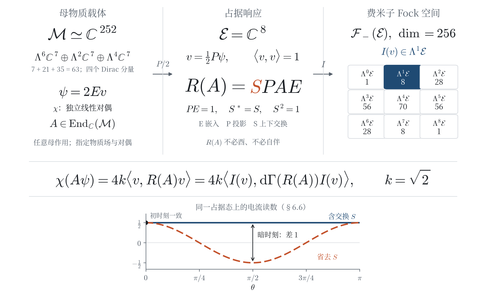
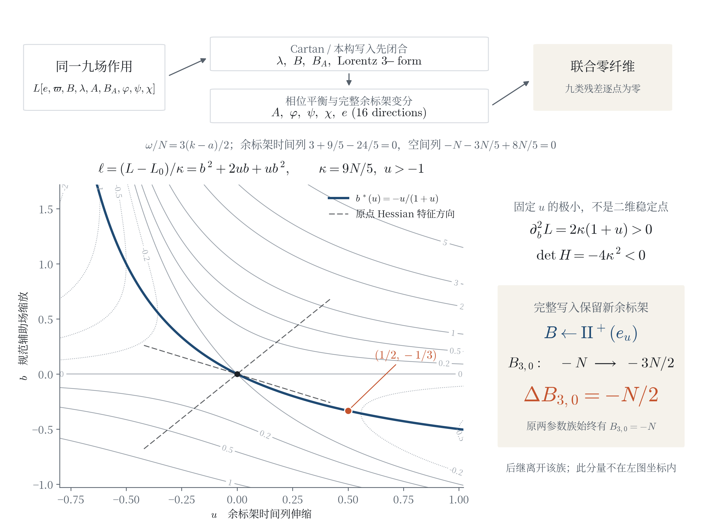
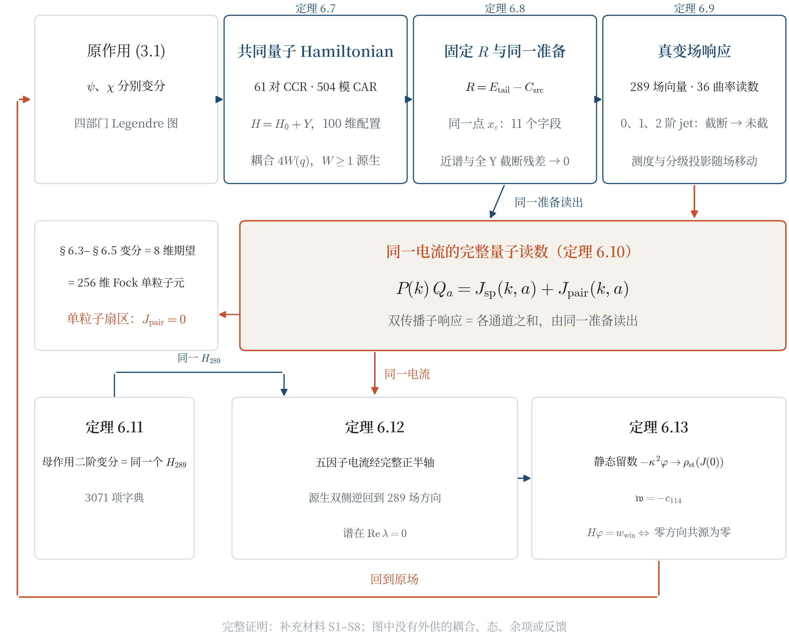
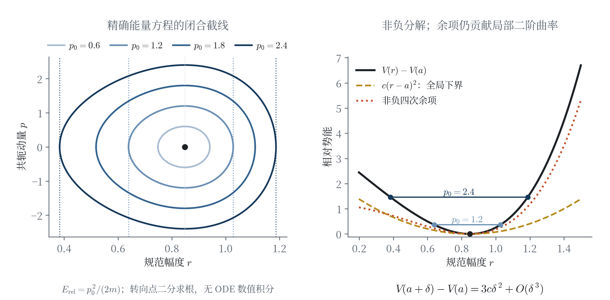
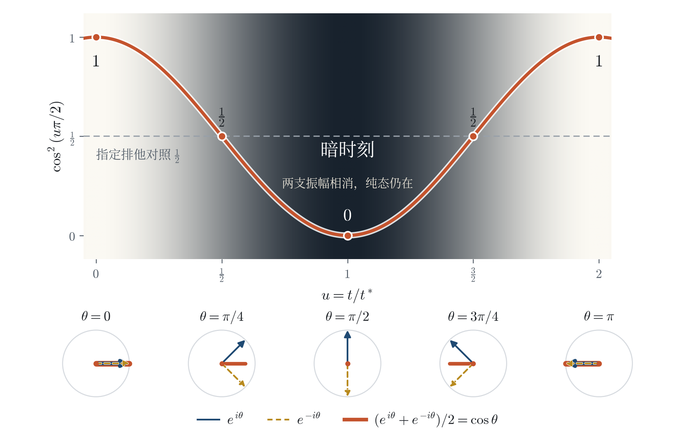
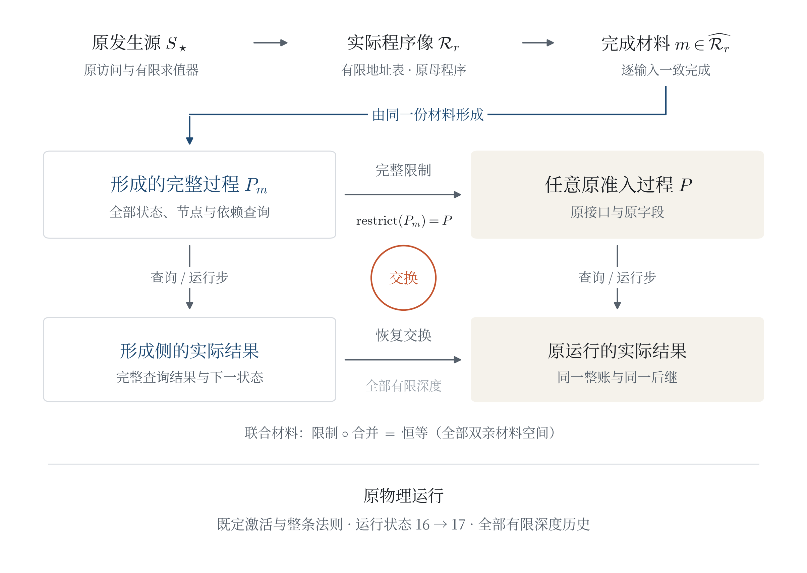

# 这浩瀚宇宙里，我们没找到魔法：Spin×SU(7) 理论的同源生成与经典—量子对应

**We Found No Magic in This Mighty Universe: Common-Source Generation and Classical–Quantum Correspondence in a Spin×SU(7) Theory**

**作者：高健（Jian Gao）**\
独立研究者 · innersummer@hotmail.com · ORCID 0009-0009-5002-1655

---

> 我从前风闻有你，现在亲眼看见你。
>
> ——《约伯记》42:5，和合本

## 摘要

在本文构造的 $\mathrm{Spin}^+(1,3)\times\mathrm{SU}(7)$ 理论里，引力、规范场与物质不是分别加入的：三者由同一源结构生成；经典变分与量子响应之间是精确等式，换算系数由原作用算出，不是拟合所得。我们写出包含独立物质对偶的共同作用量，给出满足全部 Euler–Lagrange 方程的九场显式解。对该解的物质场 $\psi$、独立线性对偶 $\chi$ 和任意 252 维复线性作用 $A$，有 $\chi(A\psi)=4k\langle v,R(A)v\rangle$：$v$ 是八维归一占据态，$R(A)$ 由原作用及对偶共同确定，$k=\sqrt2$。这条等式逐项恢复规范电流与十六项动能负荷；标准八模费米子 Fock 提升保持其单粒子矩阵元。

同一原作用还把量子化做到底。完整 252 维物质与独立对偶组成 504 模 CAR，与标量 CCR 一起承载共同 Hamiltonian $H=H_0+Y$，其作用核由原作用精确认回，耦合是由原标量 Gram 生成的配置函数而非外设常数。原四条时间约束逐阶生成量子时钟，全部能量尾生成一个固定的自伴余项 $R$，其闭因子形式加 $R$ 恰回读完整的 Weyl 能量；对每个精度，同一个源点同时携带物理单位、近谱、Yukawa 荷与八条外腿等全部准备字段，近谱与全 Yukawa 截断两个残差随精度一同趋零。沿真正变动测度的全场曲线，准备态的响应与曲率读数连同一、二阶导数都与截断到未截的极限交换。上述规范电流由此在完整 CAR 上成为荷—电流 Ward 恒等式：单粒子扇区恰无四次对电流，双传播子响应由同一准备态读出。电流又回到场：母作用的二阶变分就是 Green 所用的同一个 289 维 Jacobi 矩阵；实电流经完整正半轴与源生的双侧逆回到 289 个场方向，谱落在虚轴上；静态极限下，未清分母的场留下由第 114 号约束源决定的极点留数，场方程成立当且仅当九个零方向的共源为零。

共同来源的结论不止于本文的物理世界。在原准入接口上，任意关系网络、词汇与权威根上的每个合法世界状态，以及每个完整查询与每个完整演化过程，都由同一来源的有限程序像经逐输入完成形成，并完整恢复各自的状态、查询与作用规则，以及任意有限深度的演化历史；这里的查询是对状态的登记读出提问，在原物理过程中其答案即场读数。这个来源正是上述物理构造的原发生源，其发生史由原始事件结构生成；任何被提出作另一个来源的权威根也在同一量词之内，本身由它形成。每个被形成的世界同时满足全实在性：其中任意两次不同访问的差别都定位到各自的登记发生，不留内部无从定位的真实差别，也就是没有魔法。这一定理直接保持原物理过程的场读数和实际演化。

原作用还给出辅助场的精确有符号消元与非零引力反馈。在固定余标架和 Cartan 自旋背景上，任意实冲量生成唯一全实时间耦合轨道，量子时间导数恢复其 Legendre 能量。相干与 Bell 概率提供解析预测，其中同一源无经验输入地构造出达到 $2\sqrt2$ 的 32 格预测。经验裁决按对象分开：冻结的理想联合模型被超导电路 Bell 数据拒绝；NIST 2015 的具名名义模型在修正效率单位后仍偏离五个文档设置，而公开计数生成的完整光学源域在联合 95% 合同下非空、全部接受源 CH 严格为正；对 Munich 原子实验，完整读出域在全部 20,403 条前缀上相容，理想读出面被拒绝，在正则范围内同一概率律的全部读出参数恰是一族反向尺度，硬件逆需要独立制备的探针输入。

**关键词**：Spin×SU(7)；引力与规范场；经典—量子对应；同源生成；BF 作用量；独立对偶；共同量子 Hamiltonian；Ward 恒等式；费米子 Fock 空间；形式化验证

### Abstract (English)

In the $\mathrm{Spin}^+(1,3)\times\mathrm{SU}(7)$ theory constructed here, none of gravity, gauge fields or matter is introduced separately: all three arise from one common source structure, and classical variation and quantum response are related by an exact identity whose coefficient is computed from the original action rather than fitted. A common action with an independent matter dual admits an explicit nine-field solution satisfying every Euler–Lagrange equation. For this solution's matter field $\psi$, independent linear dual $\chi$ and every complex-linear operator $A$ on the 252-dimensional matter space, $\chi(A\psi)=4k\langle v,R(A)v\rangle$. Here $v$ is a normalized eight-dimensional state, $R(A)$ is determined by the original action and dual, and $k=\sqrt2$. The identity recovers, term by term, the gauge current and the sixteen kinetic loads; standard eight-mode fermionic Fock lifting preserves its one-particle matrix elements.

The same original action carries quantization all the way through. The complete 252-dimensional matter and its independent dual form a 504-mode CAR which, together with the scalar CCR, carries the common Hamiltonian $H=H_0+Y$; its action core is recovered exactly from the original action, and its coupling is a configuration function generated by the original scalar Gram rather than a supplied constant. The original four time constraints generate the quantum clock order by order, and the whole energy tail generates one fixed self-adjoint remainder $R$, whose closed-factor form plus $R$ reads back the complete Weyl energy exactly; for every precision, one source point carries all preparation fields at once—physical unit, near spectrum, Yukawa charge and eight external legs among them—and the near-spectral and full-Yukawa cutoff residuals tend to zero together as the precision is refined. Along the full field curve of a genuinely varying measure, the prepared responses and curvature readings, with their first and second derivatives, commute with the limit from cutoff to uncut. The gauge current above thereby becomes a charge–current Ward identity on the complete CAR: the one-particle sector carries no quartic pair current, and the two-propagator response is read by the same prepared state. The current then returns to the field: the mother action's second variation is the same 289-dimensional Jacobi matrix the Green function uses; the real current returns through the complete positive half-axis and source-generated two-sided inverses to the 289 field directions, with spectrum on the imaginary axis; in the static limit the uncleared field leaves a pole residue determined by constraint source number 114, and the field equation holds if and only if the nine null-direction cosources vanish.

The common-source result reaches beyond the physical world of this paper. On the original admission interface, every admitted world state over any relation network, vocabulary and authority root, every complete inquiry and every complete evolving process is formed from the same source's finite-program image via pointwise completion, with full recovery of its states, inquiry and action rules, and histories at every finite depth; an inquiry is a registered readout question about a state, answered in the original physical process by the field readings. That source is the original occurrence source of the physical construction, whose occurrence history is generated by the raw event structure; any authority root proposed as another source falls under the same quantifier and is itself formed by it. Every formed world also satisfies total reality: the difference between any two distinct visits is located at their registered occurrences, so no real difference is left internally unlocated — there is no magic. The theorem directly preserves the original physical process's field readings and actual evolution.

The action also yields exact signed auxiliary elimination and nonzero gravitational feedback. On fixed coframe and Cartan-spin backgrounds, every real impulse generates a unique all-real-time coupled orbit whose Legendre energy is recovered from quantum time derivatives. Coherence and Bell probabilities give analytic predictions, among them a 32-cell prediction reaching $2\sqrt2$ constructed by the same source with no empirical input. The empirical verdicts are separated by object: the frozen ideal joint model is rejected by superconducting-circuit Bell data; the named nominal model of NIST 2015 still deviates from the five documented settings after the efficiency-unit correction, while the complete optical source domain generated from the public counts is nonempty under the joint 95% contract with every accepted source's CH strictly positive; for the Munich atomic experiment, the complete readout domain is compatible over all 20,403 prefixes, the ideal readout surface is rejected, and within the regular range all readout parameters of the same probability law are exactly one family of reciprocal scales — the hardware inverse requires independently prepared probe inputs.

**Keywords**: Spin×SU(7); gravity and gauge fields; classical–quantum correspondence; common-source generation; BF action; independent dual; common quantum Hamiltonian; Ward identity; fermionic Fock space; formal verification

---

## 1 引言：从风闻到看见

### 1.1 基本问题

经典与量子彼此相连，物理学早已知道：量子化把经典量换成算符，对应原理保证两侧在适当极限下吻合，无数计算印证了这一点。但我们对它的了解更像是听来的——知道两侧对得上，却很少能在一个完整模型里指出，每个对上的数从哪里来。本文构造一个 $\mathrm{Spin}^+(1,3)\times\mathrm{SU}(7)$ 理论，想在其中亲眼看一看。

借一个朴素的问法：上帝在这里耍赖了吗？耍赖有确切所指：理论里出现一个真实的差别，内部没有任何东西决定它，它却被定了下来。为对上结果而调定的系数是这样的差别，换一个值，理论照样成立，只是对不上；为某类对象另开的一份来源也是，换一份，别处一切照旧。本文把这样的差别称为**魔法**。经典与量子相接处，本文检查其中最常被怀疑的两处：系数与来源。

先看一个规范电流。它在三处出现：经典侧把它读作作用量对规范场变分的系数；量子侧把相应响应读作归一化态的期望值；费米子 Fock 表示再把这一体作用写成产生、湮灭算符的组合。三种写法各有明确的数学对象，平常把它们连起来的，是一本约定俗成的字典。我们要做的，是在给定模型里把这本字典逐项造出来，并在每一次配对中验算它。

于是第一个问题是：**能否从同一来源生成引力、规范场与物质，并使上述三种读数逐项相等？**要找的是指定对象之间的精确等式，不是 $\hbar\to0$ 的渐近关系。第二个问题关于来源本身，它把视线推向整个理论：**这种共同来源能够形成哪些状态与演化过程？形成之后，它们原有的作用和演化是否仍被完整保留？**

定理 8.4 对这个问题给出全称的肯定回答，其量词覆盖原准入接口上的整个对象域：任意关系网络、词汇与权威根上的每个合法世界状态，每个完整查询，每个完整演化过程；这里的一个查询是对状态的登记读出提问，在原物理过程中其答案即场读数。这里的“源”是一套发生结构：它给出状态怎样产生、作用怎样执行、下一次发生怎样接续。本文的源身份来自原物理发生史，生成几何与物质的这同一来源也用于普遍形成定理。对每个对象，构造产生所需的材料，进而恢复对象的全部状态与原操作。**同一来源适用于所有对象**，是这条定理的全称结论；“固定”在证明中只用于标明这一量词顺序。因此定理不必先指认我们的宇宙是哪一个合法世界：凡能写成原接口上合法世界的，都在它的量词之内。任何被提出作另一个来源的权威根也是如此，它本身由同一来源形成（§8.4）。图 6 展示形成与原作用的交换关系。

困难首先在于配对，而不只是维数。完整物质场位于 252 复维载体，本文显式解的占据分量却只需 8 个复坐标；相应的八模 Fock 空间则有 256 维。投影本来会丢失信息，归一化也会改变幅度。要获得精确等式，必须证明该解确实落在选定占据子空间内，把归一化系数保留下来，并把独立对偶的作用一同转写。把三个载体并排摆着，看不见任何等式；等式要靠这三步一步步造出来。

贯穿全文的答案凝聚在一个等式上。以 $\psi$ 记 252 复维母物质载体上的完整物质场，$\chi$ 记它的独立线性对偶（一个与 $\psi$ 独立入场、在场方程中与 $\psi$ 联立求解的场），$v$ 记从 $\psi$ 投影归一得到的 8 维占据态，$R(A)$ 记母自同态 $A$ 压缩到占据载体的响应矩阵，$I(v)$ 记 $v$ 在 256 维费米子 Fock 空间中的单粒子嵌入，$\mathrm{d}\Gamma$ 为一体算符提升。那么对每个时空点与每个母自同态 $A$：

$$\chi(A\psi)\;=\;4k\,\langle v,\,R(A)\,v\rangle\;=\;4k\,\langle I(v),\,\mathrm{d}\Gamma(R(A))\,I(v)\rangle,\qquad k=\sqrt2 .$$

左端保留完整母作用与独立对偶；中间使用由它们共同确定的响应矩阵；右端是同一响应的 Fock 单粒子矩阵元。第二个等号属于标准一体提升的保持律，本文需要额外证明的是第一个等号及其源系数 $4k=4\sqrt2$。下文称这条式子为**经典—量子配对等式**。其中 $A$ 任意，$\psi$ 与 $\chi$ 则取本文指定解；“任意作用”与“任意场”是两个不同的量词。题目中的“没有魔法”，说的是亲眼看过之后的三件事：系数 $4\sqrt2$ 由原作用与独立对偶算出，不是拟合；定理 8.4 的全部对象由同一来源形成，不为任何对象另换来源，另提的来源也在被形成之列；每个被形成的合法世界满足全实在性，其中每个真实差别都定位到登记发生，魔法比特在形式上被排除（§8.4）。

这条等式还只走到单粒子扇区。§6.7–§6.10 把量子化做到底：同一原作用给出完整的共同量子 Hamiltonian，原时间约束自己生成固定的能量余项与同一个源准备态，真正变动的全场响应在截断到未截的极限中保持；耦合系数是由原标量 Gram 生成的配置函数，准备态也由源产出，二者都不另选。同一电流在完整 504 模 CAR 上成为荷—电流恒等式，单粒子扇区恰是其中四次对电流为零的部分。§6.11–§6.13 再让这条电流回到场：Green 所用的 289 维矩阵就是母作用自己的二阶变分，电流经完整时间回到 289 个场方向，静态极限的留数由原约束源决定。

### 1.2 三种载体与六组结果

表 1 区分三种载体及其职责。8 维占据载体由四个 Dirac 分量与色二重态组成；对本文的显式解，有 $\psi=2Ev$，其中 $E$ 是占据子空间的嵌入。Fock 提升则把 $v$ 放入 $\Lambda^1\mathbb C^8$，并把一体作用延拓到整个外代数。图 1 将“保持指定配对”与“恢复任意母场”分开，也将“算符作用于全 Fock 空间”与“态占据哪个粒子扇区”分开。

**表 1 三种载体的输入与输出。**

| 载体 | 维数 | 输入 | 输出 |
| --- | --- | --- | --- |
| 母物质载体 $\Lambda^6\mathbb C^7\oplus\Lambda^2\mathbb C^7\oplus\Lambda^4\mathbb C^7$（四个 Dirac 分量） | 252 复维 | 完整物质场 $\psi$、独立对偶 $\chi$、任意线性作用 $A$ | 真实变分电流、动能负荷、Yukawa 配对 |
| 占据载体（Dirac 自旋 $\times$ 色二重态） | 8 复维 | 投影归一态 $v$、响应矩阵 $R(A)$ | 正归一态的评价、相干权重、Bell 概率 |
| 八模费米子 Fock 空间 | 256 复维 | 单粒子嵌入 $I(v)$、一体提升 $\mathrm{d}\Gamma(O)$ | 全部单粒子读数的有限维保持 |

**图 1｜同一配对的三种表示。** 例 1.1(b) 那类电流读数所服从的配对，在这里摊开成三种写法。结构示意。左：母载体 $\mathcal M=(\Lambda^6\mathbb C^7\oplus\Lambda^2\mathbb C^7\oplus\Lambda^4\mathbb C^7)^{\oplus4}$。中：占据载体 $\mathcal E=\mathbb C^8$；$E$ 为嵌入，$P$ 为投影，$S$ 交换上下 Dirac 分量，故 $R(A)=SPAE$。图中不把任意 $R(A)$ 画成旋转：它未必酉，也未必自伴。右：$\mathcal F_-(\mathcal E)=\bigoplus_{n=0}^8\Lambda^n\mathcal E$；只高亮 $n=1$ 扇区，因为 $I(v)$ 是单粒子态。中部等式保持本解的配对，不表示任意母场的无损压缩，也不表示单粒子态被展开成多粒子态。下方小图取同一占据态、方向 1 与生成元 $\tau_0$ 的电流读数（例 6.6）：含交换 $S$ 时恒为 $1/2$，省去 $S$ 时为 $\cos(2\theta)/2$；二者只在 $\theta\in\pi\mathbb Z$ 相等，暗时刻 $\theta=\pi/2$ 相差 1。两条线均由解析式直接求值。

正文围绕六组结果组织，顺序就是看见的顺序：先得到一个让全部场方程同时成立的构型，再看连接经典与量子的系数从哪里来，接着把量子化做到完整载体与全场响应，然后看来源是否对所有对象不变；后两组说明同一作用怎样反馈与演化，以及与实验相接时哪一层仍是手工映射。

**（I）九场解：同一个构型让全部方程成立（§2–§4）。** 明确源材料生成全局几何、外幂物质与共同 Dirac-dual 作用。九场显式解满足全部 Euler 通道与六部门非零；在原完整历史的合法弱读出和经典世界准入范围内，它唯一，并与全部合法恢复场共享各有限阶紧域导数界。早期几何与物质凭证、当前与下一构型的物质恢复，在同一个机器验证的声明中联合成立（附录 D.2）。

**（II）系数是算出的：经典—量子配对（§6、§7.3）。** 经典—量子配对等式对任意母自同态成立；电流与十六项动能负荷逐项相等；标准 Fock 提升保持全部读数。系数 $4k=4\sqrt2$ 的两个因子分别来自独立对偶（$2k$）与指定解幅度（$\psi=2Ev$）；省去一次对偶交换的裸压缩在暗时刻读出 $-\tfrac12$（§6.6）。同源相位给出五点相干律。

**（III）把量子化做到底，再让电流回到场：完整量子构造与原场返回（§6.7–§6.14）。** 同一原作用给出 61 对标量 CCR、由 252 维物质与独立对偶组成的 504 模 CAR，以及 100 维配置上的共同 Hamiltonian $H=H_0+Y$，其作用核由原作用精确认回。原时间约束逐阶生成全阶时钟，全部能量尾生成固定自伴余项 $R$；同一源点同时付清物理单位、近谱、Yukawa 荷与八条外腿等全部准备字段，近谱与全 Yukawa 截断两残差一同趋零。沿真正变动测度的全场曲线，准备响应与 36 个曲率读数的值、一阶与二阶导数都与截断到未截的极限交换；规范电流在完整 CAR 上成为荷—电流 Ward 恒等式，单粒子扇区恰无四次对电流（定理 6.7–6.10）。电流随后回到场：母作用的二阶变分就是 Green 所用的同一个 $H_{289}$（定理 6.11）；实电流经完整正半轴、源生双侧逆与真实变背景回到 289 个场方向（定理 6.12）；静态极限下未清分母的场留下由第 114 号约束源决定的留数，场方程成立当且仅当零方向共源为零（定理 6.13）；复合源的 matched $\Gamma$ 整词有源内预算，renormalized 端点有绝对全频共同尾（定理 6.14）。全部完整证明见补充材料 S1–S8。

**（IV）母源不随对象更换：普遍形成（§8、附录 C）。** 原准入接口上的每个合法世界状态（任意关系网络、词汇与权威根）、每个完整查询和每个完整演化过程，都由同一母源 $S_\star$ 的有限程序完成形成；每个被形成的世界满足全实在性，没有魔法比特。恢复保留全部状态、每个状态的查询与作用规则，以及整个过程任意有限深度的演化历史；联合形成还保留参与构造的各份完整材料。形成这些对象与恢复其原操作使用同一份材料。定理的精确对象域和类型在 §8.4 给出，§8.5 将它接回原物理过程。同一生成器还对光滑统一源家族的每个成员构造九场实现与量子响应（源数据可换，母源同一）；任意有限源序列在共同母史上获得合法有序路径；完整物质作用由母材料有理历史的规范完成形成。逐输入完成、联合材料与全状态形成进一步构成定理 8.4 的证明机制。有限实路径、有理自主程序和完整完成各有自己的量词与用途。

**（V）同一作用怎样响应、反馈与演化（§3、§5、§7.1–§7.2）。** 任意非退化全场的辅助场有精确有符号消元 $B^*=K_e^{-1}F$；拉伸时钟所得的混合密度 $L=L_0+\kappa(b^2+2ub+ub^2)$ 在固定 $u>-1$ 的辅助场方向有唯一谷底 $b^*=-u/(1+u)$，其应力传导到引力骨架，产生 $-N/2$ 的原点反冲，并把后继推出原两参数族。固定背景上的任意冲量生成全时耦合轨道，量子时间导数恢复 Legendre 能量。

**（VI）Bell 概率与公开实验：裁决落在哪个对象上（§7.4、§9.2）。** 同源相位给出 Bell 概率族。与实验比较时，装置的相位、设置与读出映射按名义值冻结，不由源生成。已有一次检验拒绝了带着这层映射的超导电路联合模型；对 NIST 2015 公开装置的具名名义模型，修正效率单位后的双实现重放仍把五个文档设置值置于名义最优带外。公开计数现在生成完整光学源域，联合 95% 接受域非空且全部接受源的 CH 严格为正（命题 9.1）；同一源无经验输入地构造达到 $2\sqrt2$ 的预测，Munich 原子实验的完整读出域在全部原序前缀上相容，正则范围内同律参数恰是一族反向尺度（命题 9.2）；探测器纤维、两探针唯一逆、脉冲可实现像与原后测历史把读出接回硬件（命题 9.3）。光源逆解与反馈、读出辨识的完整展开由光学计量稿与 Bell 读出辨识稿承担。

### 1.3 让读者先算

在进入构造之前，先请读者亲手算三个数。它们只用到固定源的四个参数；这些参数的定义及关系在 §2.1 与附录 A 中核对。

$$\sigma=\tfrac12,\qquad k=\sqrt2,\qquad a=\frac{3k}{5}=\frac{3\sqrt2}{5},\qquad N=\sqrt{\frac{54}{125}} .$$

**例 1.1（三分钟手算）。**

**(a) 频率。** 源相位频率定义为 $\omega=3N(k-a)/2$。请验证两个等式：其一，$k-a=2\sqrt2/5$，故 $\omega=3N\sqrt2/5=3Nk/5$；其二，

$$\omega^2=\frac{9N^2k^2}{25}=9\cdot\frac{54}{125}\cdot\frac{2}{25}=\frac{972}{3125}.$$

这里没有数值拟合：$972/3125$ 是频率的精确平方。后文用到的比值 $a/k=3/5$ 与平衡式 $a^3=N^2k$ 会反复把较长的表达式化成这样的有理数。它们在本模型中是已固定的参数关系，不是关于物理常数只能含哪些素因子的断言。

**(b) 一个具体的电流读数。** 色二重态上的三个规范生成元 $\tau_0,\tau_1,\tau_2$ 在其二重态块上有 Pauli 形式 $\tau_g=(i/2)\sigma_{g+1}$（$g=0,1,2$；$\sigma_1,\sigma_2,\sigma_3$ 为 Pauli 矩阵；完整定义见附录 A）。取 $\tau_1$：它的矩阵是

$$\tau_1=\begin{pmatrix}0&\tfrac12\\[2pt]-\tfrac12&0\end{pmatrix},\qquad
\tau_1^2=\begin{pmatrix}-\tfrac14&0\\[2pt]0&-\tfrac14\end{pmatrix}=-\tfrac14 I .$$

李配对取 $\langle X,Y\rangle=-\mathrm{Re}\,\mathrm{tr}(XY)$。于是 $\langle\tau_1,\tau_1\rangle=-\mathrm{Re}\,\mathrm{tr}(-\tfrac14 I)=\tfrac12$；同理 $\langle\tau_g,\tau_h\rangle=\tfrac12\,\delta_{gh}$。本文的规范电流对取值为 $\tau_1$ 的空间变分读出（定理 6.3；电流上标为空间方向编号，不是平方）

$$J^2(\tau_1)\;=\;4Nk\cdot\langle\tau_1,\tau_1\rangle\;=\;4\sqrt{\tfrac{54}{125}}\cdot\sqrt2\cdot\frac12\;=\;\frac{12\sqrt{15}}{25}\;\approx\;1.8590 .$$

量子侧同一个电流是 $4Nk\cdot\langle v,O_2(\tau_1)v\rangle$，其中 $v$ 是占据态、$O_{g+1}(\tau_h)$ 是方向 $g{+}1$ 的响应可观测量（本例 $g=h=1$，即 $O_2(\tau_1)$）；定理 6.3 断言 $\langle v,O_{g+1}(\tau_h)v\rangle=\tfrac12\,\delta_{gh}$。两个 $4Nk\cdot\tfrac12$ 是同一个代数数。手算到此完成：**经典变分、量子期望值给出不多不少的同一个值**，而你没有使用任何极限或近似。这是第一次亲眼看见：经典侧亲手算出的数，正是定理 6.3 给出的量子侧读数。

**(c) 五个刻度。** 记 $t^*=\pi/(2\omega)$（§6 称为暗时刻），$u=t/t^*$。函数 $\cos^2(\omega t)$ 在五个刻度 $u=0,\tfrac12,1,\tfrac32,2$ 上取值

$$\cos^2\!\Big(\frac{u\pi}{2}\Big):\qquad 1,\;\tfrac12,\;0,\;\tfrac12,\;1 .$$

这些只是 $\cos^2$ 在 $\pi/4$ 整倍数处的初等值，谁都算得出。§7 要证明的是：源生量子态的相干读数恰好走这条曲线，而经典排他路径停在恒值 $\tfrac12$。于是在 $u=0$ 与 $u=1$ 两处，两种读法给出 1 对 $\tfrac12$、0 对 $\tfrac12$ 的公开分歧；$u=1$ 那一刻就是暗时刻。

三个数各自预告一件事：常数之间没有拟合，经典与量子读出同一个电流，相干读数会在暗时刻熄灭。还有一个数值得先记住：$-1/2$。§6.6 会说明，只要省掉独立对偶要求的一次交换，正确电流 $1/2$ 就会被读成它。

### 1.4 与相关工作的关系

直接近邻是 Smolin 的扩展 Plebański 引力—Yang–Mills 作用 [7]；§9.1 逐项比较两者的约束变量、场内容、消元与构造目标。Yang–Mills 的规范原理与 Deser 的自耦合构造提供共同作用及其非线性来源的比较背景 [1,2]；本文的具体论证落在源生成构型及其跨载体配对。标准费米子二次量子化提供从一体作用到 Fock 作用的恒等式 [4]；本文额外核对母场投影、归一化和独立对偶的响应。Bell–CHSH 工作提供联合观测的既有框架 [5]；本文分别陈述解析概率族与已有的经验拒绝记录。

### 1.5 组织与阅读路线

§2 从源数据生长几何与物质；§3 写下共同作用量并消去辅助场；§4 给出完整经典解、唯一性与全历史界；§5 分析时钟—辅助场混合响应与引力反冲；§6 建立经典—量子配对等式、电流一致与 Fock 保持，再把量子化做到完整 CAR、固定能量余项、同一源准备与全场响应，并让电流经同一 $H_{289}$、完整半轴与静态极点回到原场；§7 给出全时动力学与解析预测；§8 说明共同来源如何形成整个理论的状态与过程，再回到原物理运行；§9 比较相关工作、报告经验裁决并讨论结果。附录 A–D 分别承载母表示与常数计算、变分与消元细节、源族与完整形成的证明、以及固定版本与验证凭证；定理 6.7–6.14 与命题 9.1–9.3 的完整证明与核验在补充材料中。

图 1 给出配对映射；图 2 将九场依赖、Clock–B 局部密度与完整更新分开；图 3 画从原作用到原场返回的完整量子构造；图 4 画等能轨道及能量控制；图 5 画五点相干读数；图 6 画同一形成材料怎样接回原对象及原操作。九场计算的形式化入口在附录 B.7，形成定理的声明位置与证明机制在附录 C.8–C.9，版本与验证记录在附录 D。关注具体物理的读者可从例 1.1、图 1 和定理 6.2 起步，再沿定理 6.10–6.13 看同一电流的完整量子读数与它回到原场的路径；关注统一形成的读者可先读定理 8.4，再沿附录 C.9 重建其证明。

---

## 2 源数据、Spin×SU(7) 几何与外幂物质

### 2.1 场从哪里来

通常，场随拉氏量一起写下，它们在那里是前提。本文让场也有来处。源材料有两部分：有限描述的离散数据，以及实值余标架系数和接触残差。我们不从纯离散数据凭空导出连续统；给出的是一套明确规则，说明这份混合材料怎样生成几何、联络、表示与后续场构型。这里的“源”既不是场论方程里的外加流源，也不是宇宙学初值问题的初始切片，而是构造的原始发生材料：场、联络与全部读数都从它生成（§8 给出它的形成侧写）。

**定义 2.1（源数据）。** 基础源有六个字段：源根标签、一条材料路径、两条相位环上的整值势、自然数 $\sigma$ 种子、自然数色尺度，以及 $4\times4\times4$ 个实余标架线性系数。**光滑统一源**另含一个实接触残差，故连续坐标共 $64+1=65$ 个。固定源取根标签 $(5,7)$（能量级 8）、零移动、相位势 $0,1,3$ 与 $2,5,9$、种子 0、色尺度 1、唯一非零余标架系数 $(\text{方向},\text{内标},\text{坐标})=(2,0,1)$ 处的 1，以及接触残差 $2\pi$。这些是本文构造所采用的值；有限字段数不构成参数最少性的证明。

取值与来处速查（本表为定义的一部分，正文引用的编号表自表 1 起）：

| 字段 | 固定取值 | 来处（一句） |
| --- | --- | --- |
| 源根标签 | $(5,7)$，能量级 8 | A6 根晶格源轨迹的深度零读出 |
| 源移动 | 零 | 零位移处读出基标签（移动经同一文法生成其他标签） |
| 相位势 | $0,1,3$ 与 $2,5,9$ | 两条源相位环的深度零读数 |
| $\sigma$ 种子 | 0 | 生成族 $\sigma_n=1/(n+2)$ 的原点（$\sigma=\tfrac12$） |
| 色尺度 | 1 | 单位标定 |
| coframe 线性系数 | 剪切系数（唯一非零分量 1） | 时间标架分量的 $x^1$ 依赖随 $x^2$ 单位剪切（coframe 的 $(0,1)$ 元 $=x^2$）——初等剪切阵：逐点 $\det=1$、非完整性非零 |
| 连续接触残差 | $2\pi$ | 接触率 $\pi$；母势超荷对角虚部的原读数 |

源字段与下游结论须分开：端点的表示凭证、谱系等式、破缺标量、质量矩阵、物质态与电流都不是额外输入，而在构造链中生成或读出。早期层提供非退化几何、简单性靶、引力—规范耦合、单一 $\mathrm{SU}(7)$ 母联络及选择方程所确定的子结构；表示与物质接口则分别在命题 2.2、2.5 核对。本文沿这些结构继续构造连续场。

根标签来自 A6 根晶格源轨迹的深度零读出，零移动保留该基标签。相位势的节点差生成相位上链；首环势差 $1-0=1$ 给出非零物理振幅。种子 0 在族 $\sigma_n=1/(n+2)$ 中给出 $\sigma=1/2$。实系数生成的原始余标架为 $e^0=dx^0+x^2dx^1$、$e^i=dx^i$（$i=1,2,3$），因而逐点行列式为 1，而 $de^0=dx^2\wedge dx^1\ne0$：非退化与非完整性可同时直接看见。接触残差使接触率 $\sigma\cdot2\pi=\pi$。这里的源几何与 §4 求出的齐次余标架是构造链中的不同对象。

按 §1 的标准，这张表本身也该受审：这些取值会不会正是一组被定下、却无人决定的差别？不会。根标签与相位势分别是源根轨迹与源相位环的深度零读数，$\sigma$ 种子是生成族的原点，接触残差是母势的原读数，色尺度只是单位标定，属于描述约定而非真实差别。这份取值也不是唯一被照顾的一份：定理 8.1 对光滑统一源家族的**每个**成员给出九场实现，经典世界准入由该源自己的整数振幅是否非零决定；定理 8.2 表明任意有限个成员可在同一原母史上按序成为实际读出；定理 8.4 中母源 $S_\star$ 对全部对象不变。换源数据，并不另立一份来源。

这些数据也确定了该物理构造的发生身份。须区分三个对象：本节的物理源数据、252 维物质载体，以及承载原发生史的根 $S_\star$。前两者用于场与响应的计算，第三者提供 §8 的原历史与有限求值规则。定理 8.4 沿用这个原发生根，证明它能形成全部容许对象；对象所需的材料阶和完成材料由构造给出。§8 将依次说明具体源族、有限实路径、有理自主程序及完整形成怎样接回同一发生史。

三个直接读数将在下文使用：$\sigma=1/(0+2)=1/2$，接触率为 $\pi$，相位振幅为 1。规范本构的归一化须特别约定：乘在 Hodge 星前的是耦合平方，三个块均取 $g_i^2=\sigma$，不是 $g_i=\sigma$。这一约定使 §3 的消元公式与 §4 的辅助场值相互一致。

**表 2 九个场。** coframe 在本文称余标架。最后一列区分代数与微分通道；Lorentz 通道是含导数的三形式方程，在本构造中由 Cartan 写入闭合。**标准模型型块**是形式化中选定的块嵌入（形式化编号 P286）：在 $3+2+1+1$ 分块上，李代数元素为 $\mathrm{diag}(C,W,y,-y)$，其中 $C\in\mathfrak{su}(3)$、$W\in\mathfrak{su}(2)$，$y$ 为纯虚标量。其群级嵌入见附录 A.1。空间方向取 $i=1,2,3$，所用三个色二重态生成元则编号为 $\tau_0,\tau_1,\tau_2$。

| 场 | 记号 | 物理身份 | 指定解取值 | 通道 |
| --- | --- | --- | --- | --- |
| coframe | $e$ | 时空标架，度规之根 | $\mathrm{diag}(N,1,1,1)$ | 微分 |
| 自旋联络 | $\varpi$ | $\mathrm{Spin}^+(1,3)$ 联络 | Cartan 写生成 | 微分（Cartan 闭合） |
| 引力辅助场 | $B$ | 双矢，BF 配对的一翼 | $\mathrm{II}^+(e)$（$\mathrm{II}^+$ 为简单性靶） | 代数 |
| 简单性乘子 | $\lambda$ | 把 $B$ 锁回标架的双矢 | Cartan 写生成 | 代数 |
| 规范连接 | $A$ | 取值于标准模型型李块的联络 | $(0,\,a\tau_0,\,a\tau_1,\,a\tau_2)$ | 微分 |
| 规范辅助场 | $B_A$ | BF 配对的规范一翼 | $K_e^{-1}F$（本构写生成） | 代数 |
| 标量 | $\varphi$ | $\Lambda^4\mathbb C^7$ 值动力学标量 | 唯一真空点 | 微分 |
| 物质 | $\psi$ | 外幂 Dirac 场 | $e^{\pm i\omega t}$ 结构（§4.1） | 微分 |
| 独立对偶 | $\chi$ | $\psi$ 的独立线性对偶场 | $\sqrt2\,e^{\pm i\omega t}$ 相位 | 微分 |

九个字段给出原始场构型，其曲率和协变导数再由实际微分生成。这就是本文使用的 **holonomic configuration**：引力曲率由 $\mathrm d\varpi+\varpi\wedge\varpi$ 计算，规范曲率逐分量为 $F_{\mu\nu}=\partial_\mu A_\nu-\partial_\nu A_\mu+[A_\mu,A_\nu]$，物质协变导数为 $D_\mu\psi=\partial_\mu\psi+\gamma(\varpi_\mu)\psi+\rho(A_\mu)\psi$，标量同理。这里 holonomic 指导数来自原始场的可积关系，不是复分析的“全纯”。独立线性对偶 $\chi$ 与 $\psi$ 分别进入变分；指定解上两者的精确关系须由构造核对，不能预先用复共轭替代。

### 2.2 外幂载体：基、维数与物质作用

**外幂的几何读法。** 七维复空间的 $d$ 阶外幂以 $d$ 个不同基向量的有向楔积为基；交换两个因子变号，重复因子则为零。因而三个物质层的维数可直接数出：$\binom76=7$、$\binom72=21$、$\binom74=35$。加入四个 Dirac 分量后，完整物质载体是

$$\psi\in\big(\Lambda^6\mathbb C^7\oplus\Lambda^2\mathbb C^7\oplus\Lambda^4\mathbb C^7\big)^{\oplus 4},\qquad 7+21+35=63,\quad 4\times63=252 .$$

标量位于 $\Lambda^4\mathbb C^7$，Yukawa 映射用楔积 $\Lambda^2\mathbb C^7\otimes\Lambda^4\mathbb C^7\to\Lambda^6\mathbb C^7$ 把相应物质层接起来。这里的 252 就是 $4(7+21+35)$，不额外隐藏一层自由度。本文的超荷方向是所用分块中最后两个一维块的相反作用 $\mathrm{diag}(y,-y)$；沿此方向，每个外幂层分解为权重 $-1,0,+1$ 的三支。

**命题 2.2（外幂物质结构与反常清零）。** 固定源的外幂物质载体上：总维数 63（每个 Dirac 分量）；超荷权重多重数在 $-1,0,+1$ 处分别为 16,31,16（总和 63；逐层 $\Lambda^6$ 为 1,5,1，$\Lambda^2$ 为 5,11,5，$\Lambda^4$ 为 10,15,10）；$\mathrm{SU}(7)$ 三次反常指标表在生成元标签 $(1,3,2,-2,-3,-1)$ 下于 $(6,2,4)$ 组合求和为零，五条剩余反常迹全部消去；弱双重态计数 16，为偶数（Witten 宇称条件）；一圈 $b_0$ 系数表为 $\mathrm{SU}(7):61/3$、$\mathrm{SU}(3):17/3$、$\mathrm{SU}(2):2$、$\mathrm{U}(1):-64/3$。

证明思路。这里没有需要猜的地方，只有需要数清的地方。前三款是外幂表示的显式组合计算：权重多重数逐层枚举后相加；反常指标取三次对称不变量的逐标签表，在 $(6,2,4)$ 项上求和；剩余迹由迹恒等式逐条消去。$b_0$ 表是 Weyl-only 一圈清单的固定记录。∎

这些计算核对指定表示内容的维数、反常与一圈计数，是物质谱的明确代数条件，不替代完整量子场论的一致性证明。所列 $b_0$ 只属于 Weyl-only 清单；加入动力学标量后的全理论 beta 函数不能直接沿用这张表。

### 2.3 全局几何：母连接的拼接与下降

局部坐标里写下的联络只是几何的一半；另一半是**拼接**。设标架丛的转移函数为 $g(x)$。两个坐标片上的母连接势必须满足

$$A_{(\beta)}=\mathrm{Ad}(g)\,A_{(\alpha)}-(dg)\,g^{-1} .$$

源几何在每张坐标片上还带一个超荷方向的平移项（时间分量上按坐标片指数排列），它与标准模型型规范块交换，从而不破坏拼接公式。以下命题把局部数据组装成全局对象。

**命题 2.3（总丛、下降与背景输运）。** 固定源生成 $\mathrm{Spin}^+(1,3)\times\mathrm{SU}(7)$ 总丛与关联物质丛，且：（i）物质截面沿全部坐标片下降为整体截面，重叠区由转移函数的上边缘条件缝合，独立对偶 $\chi$ 沿同一丛逆输运缝合，与物质下降相容；（ii）母连接势满足上述拼接等式，局部作用与局部密度在坐标片更换下不变；（iii）源背景母连接对任意光滑统一源、任意坐标轴、任意实长度与时间满足背景平行 ODE 及复合律，其矩形和乐非平凡、流演化非恒同——背景本身携带真实的整体信息；（iv）当前实际构型使用自己的规范连接，在任意坐标片与点上按同一拼接等式读回。

证明思路。难处不在局部，而在接缝。局部截面按转移函数的表示搬运，对偶按逆作用搬运；只要重叠处相容，它们就定义同一个全局对象。密度的下降由楔积和配对的等变性逐项核对。背景轴向输运另需小心：一般光滑 ODE 的局部存在定理本身推不出这里所需的全参数结论，所以直接用源生成的显式函数验证平行方程、初值与复合律。非平凡和乐也要当场看见：它的见证属于固定源，不能仅由拼接形式推得。∎

只在一张坐标片上写出场方程，尚未说明各片上的作用读数能拼成同一对象。拼接条件所补上的，正是从局部计算到全局解释的这一步；后文的表示与响应始终使用已完成的拼接。

### 2.4 唯一真空与稳定子

接下来固定标量势的极小点，并区分“极小点唯一”与“仍保留哪些对称”。

**命题 2.4（唯一真空与 35 坐标稳定子）。** 源生成的标量势在每个坐标片、每个点上以生成真空坐标为唯一极小点：$\text{势}(\varphi)\ge\text{势}(\varphi_{\mathrm{vac}})$，等号当且仅当 $\varphi=\varphi_{\mathrm{vac}}$。真空的稳定子由全部 35 个 $\Lambda^4$ 坐标的等化条件刻画（$\Lambda^4\mathbb C^7$ 的基指标数恰为 $\binom74=35$）；该稳定子是真子群，且与嵌入的超荷圆只交于单位元。

证明思路。势的形状本身就说出了答案：它是离开真空坐标的平方范数，唯一极小就是平方范数取零的条件。稳定子条件把 $\rho_4(g)\cdot\varphi_{\mathrm{vac}}$ 的每个 $\Lambda^4$ 坐标与 $\varphi_{\mathrm{vac}}$ 的对应坐标等化，共 35 条；稳定子为真子群、与超荷圆只交于单位元，都由显式群元素当场检验。∎

稳定子是真子群，说明该真空未被整个母群固定；它与所嵌入超荷圆只交于单位元，则给出更具体的破缺信息。唯一极小点的陈述针对已给定源及其坐标化势，不涉及未固定源时的全部真空轨道。§4 的解取这个生成真空，原点接触条件据此定义。

### 2.5 早期有限结构接回实际场

连续物质场还须接回早期有限结构。同一个内部作用、标量、质量映射和混合矩阵，在两种构造层次上的读数是否确实相等，是下一条命题的内容。

**命题 2.5（早期结构接回实际物质）。** 对每个时空点、每个母代数元素与每个自旋指标：早期内部表示作用在当前完整物质场上的值，等于该元素作用值的当前读出；全点标量读数、完整质量映射与有限 $2\times2$ 混合矩阵逐项等于早期联合值。同样的等式对下一构型成立。

证明思路。这里没有新的估计，只有逐点对账：内部作用由表示矩阵逐条对齐，标量、质量与混合由固定映射的复合直接读回；下一构型经由构型等式输运过去。∎

因此早期有限结构直接进入实际场：命题 2.5 为当前构型与下一构型各给一组接口等式，后文的占据态投影及母史形成使用的是这些同一对象的读出。

---

## 3 共同作用量与辅助场消元

### 3.1 九场怎样进入同一个作用

一阶 BF 方法把曲率与二形式配对，再由约束或本构项引入动力学；这套方法是现成的。新的问题在接缝处：同一余标架怎样同时进入规范本构和物质动能，独立对偶怎样同时产生 Dirac 方程与电流，以及这些依赖能否由一个完整构型共同满足。

以下先在源的零号坐标片写公式。取时空指标 $\mu,\nu=0,1,2,3$，内部洛伦兹指标 $a,b=0,1,2,3$，$\eta=\operatorname{diag}(-1,1,1,1)$。两种二形式指标都依次取

$$\mathcal P=(01,02,03,23,31,12),\qquad p^c=(3,4,5,0,1,2),\qquad \epsilon_I=(-1,-1,-1,1,1,1)_I.$$

这里 $I$ 指内部双矢，$p$ 指时空二形式，不能因两者都有六个坐标就把它们混为一类。独立字段在物理准入域中的点值类型为

| 字段 | 点值类型与约定 |
|---|---|
| $e^a{}_\mu$ | 可逆实 $4\times4$ 余标架；$\nu_e=|\det e|$，$g=e^{\mathsf T}\eta e$ |
| $\varpi_\mu{}^a{}_b$ | $\mathfrak{so}(1,3)$ 值一形式；降低内部指标后反对称 |
| $B^{ab}_{\mu\nu},\lambda^{ab}_{\mu\nu}$ | 两个独立实 $6\times6$ 数组，即内部双矢值二形式 |
| $A_\mu$ | $\mathfrak h=\mathfrak{su}(3)\oplus\mathfrak{su}(2)\oplus\mathfrak u(1)$ 值一形式，通过 §2 的块嵌入作用于母表示 |
| $B_{A,p}$ | $\mathfrak h$ 值二形式 |
| $\varphi$ | $\Lambda^4\mathbb C^7\simeq\mathbb C^{35}$ |
| $\psi$ | $\mathcal M=\mathbb C^4\otimes[(\Lambda^6\oplus\Lambda^2\oplus\Lambda^4)\mathbb C^7]\simeq\mathbb C^{252}$ |
| $\chi$ | $\mathcal M^*=\operatorname{Hom}_{\mathbb C}(\mathcal M,\mathbb C)$，与 $\psi$ 分别变分 |

原始配置载体允许任意实余标架与连接坐标；表中的非退化和 Lorentz 合法性是另行要求的物理准入条件，不是删去了原载体中的其他候选。施加该合法性后，$\varpi$ 有 24 个实坐标，规范一形式有 $4\times12$ 个实坐标；模型的母表示为 $\mathrm{SU}(7)$，不等于这里另有 48 个独立规范生成元参与九场变分。曲率与协变导数均由表中的场重新计算，不是另外输入的字段。

为固定归一化，定义有向楔系数

$$W_\beta(X,Y)=\sum_{p\in\mathcal P}\beta(X_p,Y_{p^c}),\qquad
W_{\rm top}(B,C)=\sum_{I,p}\epsilon_I B_{Ip}C_{I,p^c}.$$

这相当于取正向 $dx^0\wedge dx^1\wedge dx^2\wedge dx^3$ 的系数。规范纤维配对在两个特殊酉块上为 $-\operatorname{Re}\operatorname{Tr}(XY)$，在虚数超荷坐标上为 $-\operatorname{Re}(yz)$；后者采用其自身归一化，不因嵌入出现 $y,-y$ 两项而额外乘二。内部对偶与曲率升指标为

$$J=\begin{pmatrix}0&I_3\\-I_3&0\end{pmatrix},\quad
(\Sigma_e)_{Ip}=e^{a_I}_{\mu_p}e^{b_I}_{\nu_p}-e^{a_I}_{\nu_p}e^{b_I}_{\mu_p},\quad
\mathrm{II}^+(e)=J\Sigma_e,\quad
\widehat F_{\varpi,Ip}=\epsilon_I F_{\varpi,Ip}^{\rm raw}.$$

$F^{\rm raw}_{\varpi,Ip}$ 是降低了两个内部指标的曲率坐标；帽号只把它们升起一次。$J$ 作用在 $I$ 上，时空 Hodge 星 $\star_e$ 则作用在 $p$ 上。对稍后所用的 $e=\operatorname{diag}(N,1,1,1)$，

$$\star_e(f_0,\ldots,f_5)=
(N^{-1}f_3,N^{-1}f_4,N^{-1}f_5,-Nf_0,-Nf_1,-Nf_2).$$

这既固定了本构逆的负号，也固定了 §5 不能混用的两种“对偶”。

**定义 3.1（共同局部密度）。** 令 $\gamma_e^\mu=(e^{-1})^\mu{}_a\gamma^a$，$\Omega_\mu=\frac14\varpi_{\mu ab}\gamma^a\gamma^b$，并令

$$D_\mu\psi=\partial_\mu\psi+(\Omega_\mu+\rho_{\mathcal M}(A_\mu))\psi,
\qquad D_\mu\varphi=\partial_\mu\varphi+\rho_4(A_\mu)\varphi.$$

$\varpi_{\mu ab}$ 在上式按全部有序 $a,b$ 求和，等价于在六个反对称对上用 $1/2$。Gamma 矩阵、块嵌入及外幂作用见附录 A。写 $Y_R(\varphi)=T_\varphi P_R$，其中

$$P_R=\operatorname{diag}(0,0,1,1),\qquad
T_\varphi(w_6,w_2,w_4)=(w_2\wedge\varphi,0,0),\qquad
U_s(\varphi)=\sum_{|I|=4}|\varphi_I-(\varphi_{{\rm vac},s})_I|^2.$$

$T_\varphi$ 逐个 Dirac 分量作用；$P_R$ 只作用于 Dirac 指标。独立线性对偶已经承担配对的一侧，故 $Y_R$ 中不再插入一个 $\gamma^0$。共同密度为

$$\begin{aligned}
L_s={}&W_{\rm top}(B,\widehat F_\varpi)-\tfrac12W_{\rm top}(B,JB)
+W_{\rm top}(\lambda,B-J\Sigma_e)\\
&+\sum_{j=3,2,1}\left[W_j(B_{A,j},F_{A,j})-
\tfrac12W_j(B_{A,j},g_j^2\star_e B_{A,j})\right]\\
&+\nu_e\left[\tfrac12g^{\mu\nu}\operatorname{Re}\langle D_\mu\varphi,D_\nu\varphi\rangle
-U_s(\varphi)+\operatorname{Re}\chi\!\left(i\gamma_e^\mu D_\mu\psi+Y_R(\varphi)\psi\right)\right].
\tag{3.1}
\end{aligned}$$

固定源的三个耦合平方均为 $g_j^2=\sigma=1/2$。在其他源坐标片，标量、物质、对偶及其协变导数先按源生成的过渡作用写回零号片；势能仍是相对同一源真空的上述平方距离。因此这里的具体势不是省略了参数的墨西哥帽势，也不要求一个在所有标架中数值不变的真空向量。BF 与约束项本来就是四形式系数，只有最后一行另乘 $\nu_e$。

将 (3.1) 对九场分别变分并分部积分，得到附录 B.1 的九类残差。前三类是

$$\mathcal E_\lambda=B-J\Sigma_e,\qquad
\mathcal E_B=\widehat F_\varpi-JB+\lambda,\qquad
\mathcal E_{B_A}=F_A-K_e B_A.\tag{3.2}$$

它们说明怎样确定辅助字段；还不能说明 $\varpi,A,\varphi,\psi,\chi,e$ 的方程已经满足。尤其余标架变分须在其他八场固定时进行，不能先将随 $e$ 变化的本构解偷偷代入，再把所得偏导当作原九场偏导。

### 3.2 辅助场的精确消元

规范辅助场不是一个仅线性出现的拉格朗日乘子。它的二次项参与 Euler 方程，且洛伦兹 Hodge 星满足 $\star_e^2=-1$。因此消元要使用实际本构逆，并保留剩余二次型的符号；不能用一个正定范数惩罚项替换它。

**定理 3.2（辅助场消元）。** 对任意光滑统一源、任意非退化全场构型、任意坐标片与点，令 $F_A$ 为规范曲率，$\alpha_j=g_j^2(\mathrm{source})>0$ 为该源生成的第 $j$ 个规范块的耦合平方。则 $K_{e,j}=\alpha_j\star_e$，本构方程 $K_e(B_A)=F_A$ 有唯一代数解，各块为

$$B_{A,j}^{*}=K_{e,j}^{-1}F_{A,j}=-\alpha_j^{-1}\star_e F_{A,j} .$$

固定源的三个 $\alpha_j$ 均为 $\sigma=1/2$。对上述任意源，完整局部密度满足带符号的二次分解

$$L(B_A)\;=\;L(B_A^{*})-\tfrac12\,W\big(B_A-B_A^{*},\,K_e(B_A-B_A^{*})\big) .$$

进一步，九场构型与“本构固定中心＋$B$ 余量”的搭配之间存在双向一一对应（全场 $\mapsto$（中心，$B_A-B_A^*$）），该对应本身**不需要**非退化前提；在非退化条件下，（中心，余量）坐标中的密度同样具有上述形状。任意次源生写入前后，字段恢复与该分解式保持不变。

证明思路。规范辅助场看上去像拉格朗日乘子，其实不是，所以关键一步是把规范块对 $B_A$ 的依赖展开为二次型：$W(B,F)-\tfrac12 W(B,K_eB)$ 在 $B^*=K_e^{-1}F$ 处取驻点，配方后剩 $-\tfrac12 W(B-B^*,K_e(B-B^*))$。整个过程是纯楔代数，不含微分。双向对应由本构写映射的幂等性给出：先读出中心，再回收余量，两次复合是恒同。∎

**符号检查。** 楔配对下的二次余项并非一般正定。若擅自把它换为 $-c\|B_A-B_A^*\|^2$，就改写了原作用量，而非仅改变表达形式。§5 在一个指定的 $(u,b)$ 截面上得到的 $b$ 向严格凸性，与完整洛伦兹二形式空间上的不定性可以同时成立。

### 3.3 不变性与合法读数

作用量必须只依赖几何对象，不依赖坐标片与标架的写法。

**命题 3.3（坐标片一致、局部 Spin 不变与移动标架律）。** 固定源与指定实际构型：（i）在每个坐标片、每个点上，同步输运后的实际密度等于原密度，相应作用读数保持；（ii）对任意光滑局部 Spin 场，指定实际构型经局部 Spin 作用后的原 holonomic 积分作用等于原值；（iii）对于完整移动标架表示，任意标架、任意标架更换、任意场截面，均满足变换后标架与变换后场上的作用读数等于原读数。第（iii）条由逐点约化恒等式积分得到，不额外附加光滑性或可积性假设；这里的形式积分等式与无限时空上绝对收敛的分析断言不同，见附录 B.5。

证明思路。三款各有各的理由，不能互相借用。(i) 使用实际场的密度下降等式。(ii) 把指定构型已证的光滑、Lorentz 合法及非退化条件代入原局部 Spin 协变定理，得到实际积分作用的不变性。(iii) 直接使用标架约化恒等式 $\mathrm{reduce}(gf,g\cdot\Phi)=\mathrm{reduce}(f,\Phi)$：两个密度逐点相等，已定义的积分读数也就相等。这是完整表示律，与 (ii) 的物理局部 Spin 变换各有独立证明。∎

这三条合起来划定**合法读数**的范围：§4 的唯一性、§6 的量子等式都在这个不变的作用量上陈述。一个场值相同但登记发生不同的历史不会被这些定理合并——发生身份的区分由 §8 的完整表示承担。

---

## 4 完整经典世界解

作用量写下来只是承诺；要看见它兑现，得找到一个构型，让九类变分在同一点上同时平衡。本节把这个构型写全，再检查其中最有信息的几处相消。原历史的合法恢复与全阶紧域界放在最后，它们回答的是这个解怎样由历史确定。

### 4.1 指定解：把九个字段写全

沿用例 1.1 的正参数

$$\sigma=\tfrac12,\qquad k=\sqrt2,\qquad a=\frac{3k}{5},\qquad
N=\sqrt{\frac{54}{125}},\qquad \omega=\frac{3N}{2}(k-a).\tag{4.1}$$

先指定物质所在的两个颜色方向。七维基本表示的基记作 $c_0,c_1,c_2,w_0,w_1,h_+,h_-$；以 $E_I$ 表示固定基序下、指标集合为 $I$ 的单位外幂基。令

$$q_s=(0,c_s\wedge h_+,0)\in\Lambda^6\oplus\Lambda^2\oplus\Lambda^4,\quad s=0,1,$$

并以 $q_s^*$ 取其 $\Lambda^2$ 坐标。所用真空不是待求的符号，而是四个确定的单位四形式之和：

$$\varphi_0=E_{\{c_0,c_1,c_2,h_-\}}+E_{\{c_0,c_1,c_2,w_1\}}
+E_{\{c_0,c_1,h_+,h_-\}}+E_{\{c_0,c_1,w_1,h_+\}}.\tag{4.2}$$

集合下标避免了把未排序楔积的符号误当作基系数。对两个复数 $u,v$ 定义 $4\times2$ 系数阵

$$C(u,v)=\begin{pmatrix}0&u\\-u&0\\0&v\\-v&0\end{pmatrix},\qquad
\Psi[u,v]_r=\sum_{s=0}^1C(u,v)_{rs}q_s,\qquad
\Xi[p,q](w)=\sum_{r=0}^3\sum_{s=0}^1 C(p,q)_{rs}q_s^*(w_r).\tag{4.3}$$

$\Xi$ 是复线性对偶，右端没有隐去的共轭。取 $u=e^{i\omega t}$、$v=e^{-i\omega t}$，则 $uv=1$。三只规范生成元在颜色前两维上的矩阵是

$$\tau_0=\frac12\begin{pmatrix}0&i\\i&0\end{pmatrix},\qquad
\tau_1=\frac12\begin{pmatrix}0&1\\-1&0\end{pmatrix},\qquad
\tau_2=\frac12\begin{pmatrix}i&0\\0&-i\end{pmatrix}.\tag{4.4}$$

其余颜色、弱及超荷坐标为零，故 $[\tau_0,\tau_1]=-\tau_2$ 及其循环式成立，$-\operatorname{Re}\operatorname{Tr}(\tau_i\tau_j)=\delta_{ij}/2$。

**构造 4.1（指定解）。** 在每个 $x\in\mathbb R^4$，令

$$e=\operatorname{diag}(N,1,1,1),\quad
A=(0,a\tau_0,a\tau_1,a\tau_2),\quad
\varphi=\varphi_0,\quad \psi=\Psi[u,v],\quad \chi=\Xi[ku,kv].\tag{4.5}$$

降低了内部指标的自旋联络 $C_{\mu I}=\varpi_{\mu a_Ib_I}$ 为

$$C_{\mu I}=\begin{pmatrix}
0&0&0&0&0&0\\
0&0&0&k&0&0\\
0&0&0&0&k&0\\
0&0&0&0&0&k
\end{pmatrix}.\tag{4.6}$$

由反对称性补齐 $\varpi_{\mu ba}=-\varpi_{\mu ab}$，再用 $\eta$ 升起首内部指标，即得到完整 $\varpi_\mu{}^a{}_b$。在 §3 的内部行／时空列次序下，其余三个字段为

$$\begin{aligned}
B&=\begin{pmatrix}0&I_3\\-NI_3&0\end{pmatrix},
&\lambda&=\operatorname{diag}(-N,-N,-N,k^2-1,k^2-1,k^2-1),\\
B_A&=\frac{a^2}{\sigma N}(\tau_0,\tau_1,\tau_2,0,0,0).
\end{aligned}\tag{4.7}$$

至此九场全部确定。余标架的 Levi–Civita 联络为零，而 (4.6) 不为零；其曲率是联络自乘产生的，不是另从源背景借来的曲率。直接计算得

$$\widehat F_\varpi=F_\varpi^{\rm raw}
=\operatorname{diag}(0,0,0,-k^2,-k^2,-k^2),\qquad
F_A=(0,0,0,-a^2\tau_0,-a^2\tau_1,-a^2\tau_2).\tag{4.8}$$

因此 $B=J\Sigma_e$、$\lambda=JB-\widehat F_\varpi$、$B_A=-\sigma^{-1}\star_eF_A$ 均可立即复核。“磁进电出”来自本构逆的 Hodge 交换，而非增加了一个自由电场。

**一个有用的无量纲比。** 记 $\rho=a/k=3/5$。由 $a^3=2\sigma N^2k=N^2k$ 与 $k^2=2$，得 $N^2=2\rho^3$；在这些固定参数上，$\omega=\rho Nk$、$\kappa=3\rho N$、$c/m=1/\rho$。这些交叉关系便于复核常数；$\rho$ 在此是固定值，不是解族的可调参数。

### 4.2 九类残差怎样同时归零

**定理 4.2（九通道联合零纤维）。** 构造 4.1 在每个时空点满足原作用 (3.1) 的全部九类 Euler 残差。其证明先闭合三个辅助／乘子通道与 Lorentz 联络通道，再核对规范联络、标量、物质、独立对偶和余标架五类方程。Lorentz 方程属于含导数的三形式方程；它在本构造中由 Cartan 写入关闭，在一般构型上仍是微分通道。

**辅助字段与 Cartan 平衡。** (4.7)–(4.8) 已使 (3.2) 的三个残差为零。还需解释为什么 (4.6) 正是物质要求的自旋联络。把 $p=ku,q=kv$ 代入 (4.3)，关键交叉乘积是

$$pv=qu=k.\tag{4.9}$$

用附录 A 的 Gamma 矩阵相乘，在全部 $4\times6$ 个自旋联络方向上有

$$\operatorname{Re}\frac{i}{2}\Xi[p,q]
 \bigl(\gamma^\mu\gamma^{a_I}\gamma^{b_I}\Psi[u,v]\bigr)
=\begin{cases}-2k,&(\mu,I)=(1,3),(2,4),(3,5),\\0,&\text{其余方向。}\end{cases}\tag{4.10}$$

乘体积后，三个非零物质系数都是 $-2Nk$。另一方面，(4.6) 给出 $T^1_{23}=T^2_{31}=T^3_{12}=-2k$、其余扭率分量为零；将 $B=J(e\wedge e)$ 代入原 BF 变分，三个对应系数恰为 $+2Nk$，其余亦为零。故 $D_\varpi B+j_{\rm spin}=0$，每一个联络方向都已平衡。这就是“Cartan 写入”在本例中的可见内容。一般写入使用非退化余标架上的扭率—挠率线性同构；在这里，两边已经是可检查的常矩阵。

**先核对物质，再独立核对对偶。** 令 $\mathcal R_i$ 依次为 $\gamma^2\gamma^3,\gamma^3\gamma^1,\gamma^1\gamma^2$。三个空间方向具有同一结构：

$$\rho_{\mathcal M}(\tau_i)\Psi[u,v]=-\tfrac12\mathcal R_i\Psi[u,v],\qquad
D_{i+1}\psi=\tfrac{k-a}{2}\mathcal R_i\psi,\qquad
\gamma^{i+1}\mathcal R_i\Psi[u,v]=i\Psi[v,u].$$

时间方向没有连接项，$D_0\psi=\Psi[i\omega u,-i\omega v]$，且 $\gamma_e^0=\gamma^0/N$。于是

$$i\gamma_e^\mu D_\mu\psi
=\left(\frac{\omega}{N}-3\frac{k-a}{2}\right)\Psi[v,u]=0.\tag{4.11}$$

这里的“3”正是三个空间项，不是对残差作整体拟合得到的系数。又因 (4.2) 每一项都含 $c_0,c_1$，$q_s$ 的二形式与它楔乘为零，故 $Y_R(\varphi_0)\psi=0$。这关闭了对独立对偶 $\chi$ 变分得到的前向 Dirac 方程。

对 $\psi$ 的变分不能由上一句代替。对任意母载体方向 $w\in\mathcal M$，写 $\chi=\Xi[p,q]$。由同一矩阵乘法，三个空间代数项之和及动量散度分别是

$$Q_\psi[w]=-\omega\operatorname{Re}\Xi[q,p](w),\qquad
\partial_\mu P_\psi^\mu[w]=\partial_0\operatorname{Re}\Xi[p,q](i\gamma^0w)
=-\omega\operatorname{Re}\Xi[q,p](w).\tag{4.12}$$

其中 $P_\psi^\mu[w]=N\operatorname{Re}\chi(i\gamma_e^\mu w)$；$Q_\psi$ 的空间系数为 $-3N(k-a)/2=-\omega$。$\Xi$ 只取 $\Lambda^2$ 分量，而 Yukawa 算子输出在 $\Lambda^6$，所以 $\chi(Y_R(\varphi)w)=0$ 对任意 $\varphi,w$ 成立。于是原 Euler 系数 $Q_\psi-\partial_\mu P_\psi^\mu$ 为零。两条方程用了同一相位率，却分别完成了各自的变分责任。

**规范电流与标量。** 记 $\beta=a^2/(\sigma N)$，按三形式次序 $(012,013,023,123)$ 展开：

$$D_A B_A=(2a\beta\tau_2,-2a\beta\tau_1,2a\beta\tau_0,0),\qquad
j_A=(-4Nk\tau_2,4Nk\tau_1,-4Nk\tau_0,0).\tag{4.13}$$

由于 $a^3=2\sigma N^2k$，两式逐项相消。$j_A$ 是原作用的电流三形式，不另选新的物质流。其向量读数对任意规范测试方向 $X$ 满足

$$J^0(X)=0,\qquad J^{i+1}(X)=4Nk\,\langle\tau_i,X\rangle_{\mathfrak h}.\tag{4.14}$$

取 $i=1,X=\tau_1$，便回到例 1.1 的 $J^2(\tau_1)=2Nk$。这也使规范方程的相消与开头的手算确实落在同一个量上。标量方面，$\varphi_0$ 为常值且 $\rho_4(\tau_i)\varphi_0=0$，故 $D\varphi_0=0$、标量动量及其散度为零；$dU_s(\varphi_0)=0$，而任意标量方向的 Yukawa 变分仍被 $\chi$ 消去。因此标量 Euler 方程也成立。

**余标架的十六个方向。** 最后一个相消最能说明为什么“解上密度为零”不等于“对几何没有负荷”。冻结其他八场，令

$$T_{a\mu}=\operatorname{Re}\chi(i\gamma^aD_\mu\psi)
=\operatorname{diag}\bigl(4k\omega,-2k(k-a),-2k(k-a),-2k(k-a)\bigr)_{a\mu}.\tag{4.15}$$

物质密度在候选余标架 $f$ 上为 $|\det f|\sum_{a,\mu}(f^{-1})^\mu{}_aT_{a\mu}$。在 $f=e$ 时收缩为零，但其导数还要作用于逆余标架。使用

$$D(f^{-1})[H]=-f^{-1}Hf^{-1},$$

得到完整物质余标架系数

$$\mathcal E_e^{\rm mat}[H]=-6k(k-a)H_{00}
+2Nk(k-a)(H_{11}+H_{22}+H_{33}).\tag{4.16}$$

体积导数所乘的解上密度为零；留下来的正是上式。规范块和简单性反应则分别给出

$$\begin{aligned}
\mathcal E_e^{\rm gauge}[H]&=\frac{a^4}{4\sigma N^2}
 [3H_{00}-N(H_{11}+H_{22}+H_{33})],\\
\mathcal E_e^{\rm grav}[H]&=-(3-3k^2)H_{00}
-N(3-k^2)(H_{11}+H_{22}+H_{33}).
\end{aligned}\tag{4.17}$$

取实矩阵的十六个标准基方向，便得到整个余标架方程，而不只是对角 ansatz 的受限变分：

| 原九场变分方向 | 引力反应 | 规范本构 | 物质负荷 | 总和 |
|---|---:|---:|---:|---:|
| $H_{00}=1$ | $3$ | $9/5$ | $-24/5$ | $0$ |
| $H_{ii}=1$，$i=1,2,3$ | $-N$ | $-3N/5$ | $8N/5$ | $0$ |
| 十二个非对角标准方向 | $0$ | $0$ | $0$ | $0$ |

原始参数恒等式是 $3a^4/(4\sigma N^2)-6(k-a)k=3-3k^2$ 及 $-a^4/(4\sigma N)+2N(k-a)k=N(3-k^2)$。因此剩余五类残差与已关闭的四类一起，组成原九场联合零纤维。∎

上述每组等式与原作用变分及其形式化入口的对应见附录 B.1、B.7。§6 将再次使用 (4.3)、(4.9) 和 (4.15)：量子态直接取自这一经典解。独立对偶在解上的特殊关系不撤销变分时的独立性；§6.6 检验省去对偶交换这一具体错误响应式。

### 4.3 六部门非零与唯一经典世界解

一个处处为零或只有引力非零的解无法承载 §6 的量子读数。固定源的**经典世界准入**（CWA）在光滑、全点 coframe 非退化、Lorentz 合法、联合零纤维、原点标量接触之外，还要求六个物理部门同时非零。

**命题 4.3（六部门非零）。** 指定解的六个部门非零：引力曲率在某点非零；规范曲率在某点非零；破缺真空基非零；Yukawa 质量映射非零；物质电流在某点非零；coframe 物质扇区应力或 Lorentz 自旋源在某点非零。

证明思路。六个部门要各自拿出自己的非零见证，不能互相代签。规范曲率来自常值规范势的非零对易子；引力曲率来自 Cartan 写入后的联络，源背景的和乐不能替它作证。真空与质量映射的见证追溯到非零相位振幅；电流和应力读的是同一实际物质场的分量。例 1.1(b) 那个电流，就是其中一项读者已经亲手核过的见证。∎

**定理 4.4（唯一经典世界解）。** 固定源下，存在**唯一**构型同时满足：（i）**合法经典实际**——它的 compact 坐标读出等于原完整历史某合法弱准入（见下）的密度；且（ii）经典世界准入的全部条款。该唯一构型即构造 4.1 的指定解。

“合法弱准入”还限制了怎样从历史得到场：沿原历史的严格递增子列，在所用紧支撑 $L^2$ 型坐标载体上取弱读出；只有其密度与一个光滑构型的紧坐标读出满足指定恢复等式时，该构型才算合法经典实际。弱候选与光滑场不是同一类型，也不是每个候选都自动满足准入。对于这里的稳定历史，指定读出的存在可由稳定尾部直接给出。

证明思路。常见的路线是先取一列近似，再借一般紧性定理找极限；这里用不着。原完整历史的场坐标从指标 7 起就稳定为指定解的读出，稳定尾部因此直接给出合法弱读出的见证。任意合法弱候选的密度再由逐坐标恢复等式确定，落到同一个紧描述；光滑性与恢复的分离性质把它接回完整场。结合经典世界准入的各条款，得到所述存在与唯一性。这个论证只关于原历史及其合法恢复，不是任意动力学初值的 PDE 唯一性论证。∎

### 4.4 全历史与全恢复场的全阶紧域界

唯一恢复还留下一个定量问题：历史中各次访问与各种合法弱读出呈现，是否需要各自另给一个导数预算？下一条定理给出共同的界。不同子列或恢复参数可以描述同一对象，不能据此推断存在许多个不同的合法光滑场。

**定理 4.5（全阶紧域界）。** 对每一有限阶 $m$ 与每一紧域 $K\subset\mathbb R^4$，存在一个实数 $C(K,m)$，使得：**原完整历史的每个指标、九个场的全部实坐标、每个 $K$ 中的点**，都有 $\|D^m(\text{场读数})\|\le C(K,m)$。将有限前缀与恢复侧的界取最大后，同一个 $C(K,m)$ 同时覆盖**全部**由合法弱准入密度恢复的光滑构型——不输入任何逐候选预算。

证明思路。一段无限历史为什么只需要有限个界？因为它有**稳定后缀**：每个坐标读出从第 7 次登记起恒等（解上的后继恒等式），全历史的导数集合实际上就是有限前缀 8 项的导数集合，而有限族在紧域上逐阶有界。恢复侧同理：密度等式把每个合法候选化归到同一首写读出，于是它们共享同一族界。导数作用于真实四维时空变量。∎

这条估计的作用可以用量词看清：先固定紧域 $K$ 和阶数 $m$，再选择一个界，之后才让历史指标、场坐标和合法恢复呈现任意变化。共同预算来自稳定尾部与有限前缀。

到这里，要看的对象已经在眼前：一个让九类变分在同一点上同时平衡的完整构型，全部场方程由同一作用给出、由同一构型满足。§5 先看它受扰时怎样反馈；§6 再看连接经典与量子的系数从哪里来。

---

## 5 几何与辅助场的混合响应

### 5.1 把时钟拉长

把刚找到的解沿两个方向拉伸，拉伸幅度不必小。坐标时间不动，只把余标架的时间列乘以 $1+u$，同时把规范辅助场乘以 $1+b$，其余字段保持原值。这样可以分辨两件事：在给定两参数截面上，局部密度怎样改变；完整源生更新以后，后继是否仍留在这个截面内。参数域为 $u,b\in\mathbb R$、$1+u>0$。特别地，截面中的引力辅助场始终冻结在原构型的值，并未随余标架预先更新。

**构造 5.1（Clock–B 两参数族）。** 固定源与原点坐标片：$\mathrm{clock}(u,b)$ 构型 = 指定解的 coframe 时间列 $\times(1+u)$、规范辅助场 $\times(1+b)$、其余字段不动。$(u,b)=(0,0)$ 是原构型。

### 5.2 正规形、Hessian 与条件极小

代入的是完整局部密度，而不是它的二阶近似。结果只剩一个三次多项式；正因保留三次项，后面的消元可以精确完成。

**定理 5.2（正规形与混合 Hessian）。** 在原点，完整局部密度恰为

$$L(u,b)=L_0+\kappa\,\big(b^2+2ub+ub^2\big),\qquad \kappa=\frac{9N}{5}>0 ,$$

其中 $L_0=L(0,0)$。在原构型 $(u,b)=(0,0)$ 处，密度对 $(u,b)$ 的二阶导数矩阵（混合 Hessian）为

$$H=2\kappa\begin{pmatrix}0&1\\[2pt]1&1\end{pmatrix},\qquad \det H=-4\kappa^2<0 .$$

证明思路。把 $\mathrm{clock}(u,b)$ 逐块代入五块密度，其中三块给出封闭形式：

- **引力块：$+3Nu$。** 时间列的单位拉伸是秩一扰动，其简单性双矢为零，故引力块对钟速严格仿射，不产生任何 $u^2$ 项。
- **规范块：相对 $(0,0)$ 的增量为 $\kappa\big((1+u)(1+b)^2-2(1+b)+1\big)$。** 本构项 $\tfrac12 W(B_A,K_eB_A)$ 中的 $K_e$ 把钟速 $(1+u)$ 作为整体因子携带——同一个因子既支付 $b^2$ 的对角刚度，也支付 $ub$ 的交叉刚度。
- **物质块：$-6Nu\,k(k-a)$，纯线性。**
- **一阶相消。** 三个纯 $u$ 一阶系数之和 $3+\tfrac95-\tfrac{24}5=0$，这正是 §4.2 coframe 平衡通道（16 方向之一）在时间列上的恒等式、即引力反应、规范力与物质力三项相消在 clock 族上的显影：原构型是解，能量沿纯时钟方向一阶中性。

Hessian 由该多项式逐项求导。∎

$\det H<0$ 表明原点是这个二维局部密度的非退化鞍点，Morse 指数为 1，而不是联合极小。设 $\phi_g=(1+\sqrt5)/2$；两条特征方向在 $(u,b)$ 平面中的斜率为 $\phi_g$ 与 $-1/\phi_g$，特征值为 $\kappa(1\pm\sqrt5)$。黄金比在此只是矩阵 $\left(\begin{smallmatrix}0&1\\1&1\end{smallmatrix}\right)$ 的特征多项式 $x^2-x-1$ 的根。更直接的物理读法是固定 $u$ 再看 $b$：$\partial_b^2L=2\kappa(1+u)>0$，所以每条这样的截线有唯一极小。沿 $b=0$，却有 $L(u,0)=L_0$；该方向并非“没有刹车的滑坡”。这张局部作用密度图本身不提供动力学稳定性判据。

**定理 5.3（唯一谷底与有效作用）。** 对每个 $u$（$1+u>0$），密度在 $b$ 方向有唯一极小

$$b^{*}(u)=-\frac{u}{1+u},\qquad L_{\mathrm{eff}}(u)=L_0-\frac{\kappa\,u^2}{1+u},$$

且正规形可完整配方为 $L(u,b)=L_{\mathrm{eff}}(u)+\kappa(1+u)\big(b-b^*(u)\big)^2$。因此 $L(u,b)=L_{\mathrm{eff}}(u)$ 当且仅当 $b=b^*(u)$。本构写入自动落在谷底：对 $\mathrm{clock}(u,b)$ 施加本构写返回 $\mathrm{clock}(u,b^*(u))$。

证明思路。只需对 $b$ 求一次导：$\partial L/\partial b=2\kappa(1+u)b+2\kappa u$，零点就是 $b^*$；代回去配方即得。第二句是定理 3.2 的本构写在两参数族上的读出。∎

读者可以立刻用例 1.1 的常数算两个数：源生时钟种子 $u=\sigma=\tfrac12$ 时，谷底 $b^*=-(1/2)/(3/2)=-1/3$；有效作用下落 $\kappa u^2/(1+u)=(9N/5)(1/4)(2/3)=3N/10$。

### 5.3 源生反馈：应力传导与原点反冲

在两参数族内，本构写入把 $b$ 调到 $b^*(u)$。但完整写入还要处理引力辅助场。对源生种子 $u=\sigma=1/2$，这个额外步骤是否会改变原来冻结的字段？下面用一个分量就能回答。

**定理 5.4（非零引力反冲与族外后继）。** 取源生时钟种子 $u=\sigma=\tfrac12$，经原完整写入执行（本构写自动给出 $b^*=-1/3$）。则：（i）完整引力辅助场在原点的 $(3,0)$ 分量发生精确变化 $-N/2$（一般 $u$ 下为 $-u\cdot N$）；（ii）写入后的完整后继构型不属于任何 $\mathrm{clock}(u,b)$ 两参数成员——对任意 $u,b$，后继的完整字段读数 $\ne\mathrm{clock}(u,b)$。

证明思路。只看一个分量就够了。原构型在原点的引力辅助分量为 $B_{3,0}=-N$；两参数族冻结该字段，所以每个成员在这里仍是 $-N$。完整写入保留已经伸缩的余标架，却重新计算 $B=\mathrm{II}^+(e)=J(e\wedge e)$，同一分量于是变成 $-(1+u)N$。两值相差 $-uN$，源生种子给出 $-N/2\ne0$。因此无论怎样重新选择两参数，这个后继都回不到原族里。这里用的是内部简单性双矢的直接计算，不是把规范时空 Hodge 星的逆伸缩搬到引力指标上。∎

这个例子区分了“辅助场消元”与“完整构型更新”。前者在选定截面上找到规范辅助场的条件极小；后者按同一余标架重建引力辅助场，因而走出原截面。$-N/2$ 是确定的字段分量变化，不是额外的力、冲量或实验效应；这里沿用“反冲”一词，只指这次非零反馈。

图 2 将这两步画在不同位置：等高线只描述 $(u,b)$ 截面，框外的引力分量对照描述完整后继。把它们分开，便不会误以为二维图已经容纳了所有九场的更新。

**图 2｜混合密度与截面外的后继。** 上部为九场构造依赖示意；下部等高线由 $\ell=(L-L_0)/\kappa=b^2+2ub+ub^2$ 直接求值。粗线 $b^*=-u/(1+u)$ 是固定 $u>-1$ 时的 $b$ 向极小线，不是二维稳定平衡轨道。长虚线标出原点 Hessian 的两条特征方向；点线为负值等高线。种子点 $(1/2,-1/3)$ 旁的独立框记录完整写入：$B_{3,0}$ 从 $-N$ 变为 $-3N/2$，故变化为 $-N/2$。这个分量不作为 $(u,b)$ 平面中的箭头长度或第三个轴。上部的相位式与时间／空间余标架平衡分别对应 (4.11) 与 (4.17)；下部是固定截面的密度，不是完整场空间的稳定性图。

---

## 6 量子态、经典—量子配对、完整量子构造与原场返回

### 6.1 占据态从哪里来

经典读数与量子读数之间若藏着一个手调系数，就会在这里现身。经典侧已有完整构型，量子侧却要先回答：哪一部分物质分量承担配对？一般的 252 维向量压成 8 维，必然丢掉作用信息。本文的解之所以能压，是因为它确实落在四个 Dirac 分量与色二重态张成的子空间里，独立对偶也有相应的精确系数桥。先看清这个支撑，再归一化，两边的读数才可以放在一起比较。

**定义 6.1（占据态）。** 对每个时空点，占据载体取 Dirac 自旋 $\times$ 色二重态的 8 个基指标。**占据态** $v$ 由完整物质场经两步得到：先沿色二重态投影（每个自旋分量读出二重态坐标），再除以 2。对固定源：$v$ 逐点归一（$\langle v,v\rangle=1$），全部半正定观测的评价非负，母作用给出非交换代数与实际干涉（相干权重 $\cos^2(\omega t)$，§7），时间平移由 $\mathrm{diag}(e^{i\omega\Delta},e^{i\omega\Delta},e^{-i\omega\Delta},e^{-i\omega\Delta})\otimes I_2$ 酉执行。对构造 4.1 的解，完整物质场恰为占据分量的两倍嵌入：$\psi=2\cdot\mathrm{embed}(v)$，且

$$v=\tfrac12\big(0,\,e^{i\theta};\;-e^{i\theta},\,0;\;0,\,e^{-i\theta};\;-e^{-i\theta},\,0\big),\qquad \theta=\omega x^0 ,$$

八个分量按（自旋, 色）排列。读者可验算范数：四个分量的模均为 $\tfrac12$（两正两负），平方和 $=4\times\tfrac14=1$。

三个几何注记。其一，除以 2 不是随手归一：源生振幅的模方和为 4，除以 2 恰好落在单位球上——除数由材料决定。其二，“$\psi=2\cdot\mathrm{embed}(v)$”只对指定解成立；一般场取遍 252 维，经典—量子配对等式的 $A$ 端始终在完整载体上。其三，定义 6.1 里的对偶 $\chi$ 不出现在占据态构造中——它是独立场，下一小节从配对侧进场。

**先看支撑，再看幅度。** 嵌入 $E:\mathcal E\to\mathcal M$ 与投影 $P:\mathcal M\to\mathcal E$ 满足 $PE=1$。本解有 $\psi=2Ev$，因此归一化丢去的幅度可以用因子 2 完整补回；对偶的另外一个因子则在下一节单独核对。这是图 1 中两条箭头各自承担的任务。

### 6.2 经典—量子配对等式

**定理 6.2（经典—量子配对等式）。** 固定源与实际构型。对每个时空点、完整母物质载体上的每个复线性自同态 $A$：

$$\chi\big(A\psi\big)\;=\;4k\,\big\langle v,\,R(A)\,v\big\rangle,\qquad k=\sqrt2 ,$$

其中 $E$ 为占据嵌入、$P$ 为占据投影，$S$ 交换上下 Dirac 分量 $0\leftrightarrow2$、$1\leftrightarrow3$（色指标不变）。响应映射的类型为 $R:\operatorname{End}_{\mathbb C}(\mathcal M)\to\operatorname{End}_{\mathbb C}(\mathbb C^8)$，准确地写为 $R(A)=SPAE$。$S$ 是自伴酉对合，任意 $R(A)$ 则不必是酉矩阵或自伴可观测量。

证明。$E:\mathbb C^8\to\mathcal M$ 把每个自旋的两个坐标放入 (4.3) 的 $q_0,q_1$ 方向，$P=E^*$ 取回它们。于是 $PE=1$，而 (4.3)–(4.5) 给出 $\psi=2Ev$。独立对偶的系数也可以直接读出：当 $u=e^{i\theta},v_-=e^{-i\theta}$ 时，按八个占据坐标排列，

$$2k\,\overline{Sv}=k(0,u;-u,0;0,v_-;-v_-,0).\tag{6.1}$$

右端正是 $\Xi[ku,kv_-]$ 的线性系数，非占据坐标的系数全为零。因此对**任意** $w\in\mathcal M$ 有 $\chi(w)=2k\langle Sv,Pw\rangle$；此处内积第一槽共轭。现在只用线性代数：

$$\chi(A\psi)=2k\langle Sv,PA(2Ev)\rangle
=4k\langle Sv,PAEv\rangle
=4k\langle v,SPAEv\rangle.\tag{6.2}$$

最后一步使用 $S^*=S$。既不要求 $A$ 自伴，也不要求 $A$ 保持占据子空间。代数推导是标准的；使它在这个物理模型中成立的，是已经满足九场方程的 (4.5) 同时交付了支撑、相位与对偶关系。∎

这里可以让 $A$ 搬运不同外幂层，也可以让它把占据向量送出占据子空间；等式仍使用同一个 $SPAE$ 读回。它保持的是本解与本对偶所测试的配对，并不给出从 $R(A)$ 恢复 $A$ 的方法。此外，$A\mapsto R(A)$ 不是一般的保单位正压缩：仅取 $A=1$ 就得到 $R(1)=S$。量子态对半正定 $8\times8$ 算符的正性，与任意母作用的响应式，是两个不同的陈述。

系数也可以独立检查：本解的物质范数为 2，单位占据态的四个非零分量各有模方 $1/4$；独立对偶提供 $2k$ 的系数。因此 $4k$ 是两个已定义映射的幅度乘积，不是事后为电流数值选定的归一化。

省去 $S$ 会把 $R(A)$ 改成 $PAE$，从而改变被计算的配对。某个初时值恰好一致，不能把两个算符认成同一个；例 6.6 给出它们随相位分离的完整公式。

### 6.3 电流、动能负荷与同轴 $\tfrac12$

现在把任意母作用依次取成电流、动能负荷与质量作用。一般配对等式由此成为可逐项验算的物理读数。

**定理 6.3（电流与十六项动能负荷）。** 固定源与实际构型：

1. **电流逐项相等。** 对每个点与任意完整标准模型型规范变分，量子响应与原经典变分电流按同一 $4Nk$ 归一化逐项相等。明确空间方向与生成元的编号后，对 $g,h\in\{0,1,2\}$ 有 $\langle v,O_{g+1}(\tau_h)v\rangle=\tfrac12\delta_{gh}$，故 $J^{g+1}(\tau_h)=2Nk\delta_{gh}$：同轴为 $2Nk$，异轴为 0，均与时刻无关。例 1.1(b) 取 $g=h=1$，对应第二个空间方向。

2. **十六项动能负荷逐项相等。** 全部 $4\times4$（方向 $\times$ 内标）的动能负荷分量等于实际构型的动能负荷，读数为 Hermitian；对角闭式为 $\mathrm{diag}\big(4k\omega,\,-2k(k-a),\,-2k(k-a),\,-2k(k-a)\big)$——时间方向一项，三个空间方向各一项。

3. **质量与占据 Yukawa。** 完整质量映射非零，其四个 $2\times2$ 混合条目全部非零；Yukawa 算符作用在实际物质场上为零，同一信息经经典—量子配对等式传导为占据期待值为零。

证明思路。一个 $8\times8$ 的求和，为什么恰好落成 $\tfrac12$？(1) 的关键一步：电流可观测量 $O_d(V)$ 的响应矩阵在生成元处的配对恰好塌缩为李配对 $\langle\tau_g,\tau_h\rangle=\tfrac12\delta_{gh}$——$\gamma$ 矩阵的双线性与色二重态的正交性，把 $8\times8$ 的求和缩成 $2\times2$ 的迹。(2) 时间方向的对角 $4k\omega$ 来自相位率（$\mathsf V$ 算子对角 $\pm i\omega$ 与 $\psi'$ 的内积实部）；空间方向的 $-2k(k-a)$ 来自自旋交换与规范幅度之差（协变作用空间部分的系数 $(k-a)/2$ 乘自旋旋转生成元）。(3) 是外幂楔合在占据双层上的直接核对。∎

### 6.4 输运、一阶 jet 与任意阶外幂

读数还须与标架更换及联络输运相容。这里先固定实际构型的基点与方向，在母基本表示上形成生成元，再把输运提升到外幂。这个基本表示是七维，不是占据态的八维表示。

**命题 6.4（输运与外幂余项）。** 固定源与实际构型：

1. 连接生成元 $G$（实际规范势经母块嵌入）反自伴，故 $U(t)=\exp(tG)$ 对全部实 $t$ 是作用在 $\mathbb C^7$ 上的 $7\times7$ 酉阵；
2. 一阶 jet 为 $1+tG$，且 $\exp$ 在 0 处的导数为 $G$；
3. 对任意 $t\ge0$，$\|\exp(tG)-(1+tG)\|\le\|G\|^2\,t^2$；
4. 对任意外幂阶数 $d$、任意 $\Lambda^d\mathbb C^7$ 向量与任意基坐标，$\Lambda^dU(t)$ 与 $\Lambda^d(1+tG)$ 作用后的坐标差不超过 $C_{d,v,j}(t)t^2$（$t\ge0$）。尺度 $C_{d,v,j}(t)$ 显式依赖时间、阶数、输入向量和生成元，见附录 B.4；在固定有限时间区间上可将它统一界住。这里提升的是基本表示的一阶 jet；其外幂本身通常含更高次的 $t$ 项。

5. 对任意基点等价的完整 $\mathrm{Spin}^+(1,3)\times\mathrm{SU}(7)$ 移动标架更换，外幂输运与标架更改在同点读数上交换；实际局部 Spin 不变性与任意移动标架表示律分别为已证定理（附录 B.6）。

证明思路。(4) 是其中唯一非标准的估计。(1) 是反自伴矩阵的指数酉。(3) 是 $C^*$-范数下的二阶导数界。(4) 的关键一步是把外幂上的输运按楔积逐因子展开：degree 个因子的乘积里，jet 替换的误差由多线性差与基分解逐层控制，尺度因子 $(1+t\|G\|)^{\mathrm{degree}-1}$ 收进显式上界。(5) 由标架更改与输运的交换性逐条读出。∎

任意外幂阶数的估计不局限于本模型使用的 $d=6,2,4$。需要留意，随 $t$ 变化的尺度不能省略后再宣称一个对全部时间统一的二次误差常数；“任意 $t\ge0$ 的显式界”和“固定区间上的 $O(t^2)$ 界”在这里各有准确含义。

### 6.5 标准 Fock 提升：256 维的保真

八个模式的标准费米子 Fock 空间是 $\mathcal F_-(\mathbb C^8)=\bigoplus_{n=0}^8\Lambda^n\mathbb C^8$，总维数 $2^8=256$，扇区维数依次为 $1,8,28,56,70,56,28,8,1$。一体算符 $O$ 提升为 $\mathrm d\Gamma(O)=\sum_{ij}O_{ij}c_i^\dagger c_j$；而本文嵌入的态 $I(v)$ 仍在单粒子扇区。后者不因环境空间增大而变成多粒子制备。

**定理 6.5（标准 Fock 保持）。** 分两段。

**（一般恒等式）** 对任意有限线序模集与任意复矩阵 $A$（无自伴要求）：显式产生/湮灭构造给出

$$\mathrm{d}\Gamma(A)\,I(v)=I(Av),\qquad \big\langle I(v),\,\mathrm{d}\Gamma(A)\,I(w)\big\rangle=\langle v,\,Aw\rangle,$$

其中 $I$ 为单粒子嵌入，配对为 Fock 内积。

**（本源应用）** 取本源 8 模（自旋在前、色紧随的线序）与 256 维 Fock 空间，$v$ 为占据态。则对每个点与每个完整母自同态 $A$：独立对偶响应、复电流、物理电流、完整标准模型型变分电流与物理动能负荷全部经 Fock 期望值保持；当前拍与下一拍对任意占据矩阵给出同值。特别地，经典—量子配对等式右端可整体读作 Fock 矩阵元 $4k\langle I(v),\mathrm{d}\Gamma(R(A))I(v)\rangle$。

证明思路。环境空间变大了，读数却一个不变，原因在符号。一般恒等式是标准二次量子化的显式核对：产生／湮灭的符号函数（$-1$ 的计数幂）在单粒子扇区上完全抵消，剩下的只是矩阵乘法；配对等式由 Fock 内积的单粒子扇区投影给出。本源应用的每一条保持，都是把相应的 $8\times8$ 读数（定理 6.2–6.3 已证）代入这条一般恒等式。∎

**证明与数值检查的范围。** 一般恒等式与本源保持恒等式是机器验证的定理（附录 D.2）。此外有一份独立数值复核：256 维全 Fock 空间、812 次评价、最大绝对残差约 $8.882\times10^{-16}$（容差 $2\times10^{-12}$），负对照（暗时刻接受 $+\tfrac12$ 对遗漏 $-\tfrac12$）逐位命中。**跨模 CAR 与完整 Fock 伴随性在该数值检查范围内成立**，不属于机器验证的定理（附录 D.3）。

### 6.6 暗时刻反例：初值相同还不够

现在做一件看起来无害的事：省掉自旋交换 $S$，得到裸压缩。占据态不变，只有电流响应矩阵变了。初时刻的一次校验看不出任何区别；要让相位走完一段，差别才显形。

**例 6.6（初时一致、暗时刻分离）。** 裸电流对（方向 1，生成元 $\tau_0$）的读数为

$$\big\langle v,\,\mathrm{raw}\big\rangle=\frac{\overline{\mathrm{up}}\cdot\mathrm{low}+\overline{\mathrm{low}}\cdot\mathrm{up}}{4}=\frac{e^{-2i\theta}+e^{2i\theta}}{4}=\frac{\cos 2\theta}{2}=\cos^2\theta-\tfrac12 ,$$

其中 $\mathrm{up}=e^{i\theta}$、$\mathrm{low}=e^{-i\theta}$ 为上、下二重态相位。在 $\theta=0$（初时刻）：读数 $=\tfrac12$，与接受的对偶响应完全一致。在暗时刻 $\theta=\pi/2$：读数 $=-\tfrac12$，而接受响应仍为 $+\tfrac12$——两个数字公开分道扬镳。机器验证的定理同时给出初时一致与暗时刻分离。

裸响应与正确值 $1/2$ 相等，当且仅当 $\cos2\theta=1$，即 $\theta\in\pi\mathbb Z$；并非在“大多数时刻”相等。特别地，$\theta=\pi/4$ 时裸响应为 0，而不是 $1/2$；暗时刻两者相差整整 1。丢掉的结构正是独立对偶诱导的上下交换。这个例子是一条具体响应公式的反例：负的电流期望不是负概率，其他对偶处理的可行性也不由它判定。初值吻合只是一个测试点，不能替代算符层面的恒等式。裸压缩正是一种手工捷径：少做一次交换，初时刻照样对得上；要到暗时刻，才看见它差出整整 1。交换不能凭一次吻合挑选；本文用的交换，正是独立对偶给出的那一个。

### 6.7 从单粒子到完整 CAR：共同量子 Hamiltonian

定理 6.5 在 8 个模式、256 维的 Fock 空间里保持单粒子读数。完整理论要的更多：252 个物质分量连同独立对偶、全部标量—规范—余标架配置以及原单向 Yukawa 项，都要进入同一个 Hilbert 空间，由同一个从原作用得到的 Hamiltonian 推动。本节四个定理给出这条完整量子构造链：**原作用 → 共同量子 Hamiltonian → 完整固定 $R$ 与同一源准备 → 真正的全场响应**，最后回到例 1.1 的电流。每个定理之后给出构造要点，完整证明——全阶预算、能量尾、两 jet 交换与全频积分在内——见补充材料 S1–S4。§6.11–§6.14 再让这条电流回到场。

**定理 6.7（共同量子 Hamiltonian）。** 固定源与原作用 (3.1)：

1. **正则载体。** 四部门 Legendre 图给出共同正则一形式，由它产生 61 对标量 CCR，以及由完整 252 维物质符号与符号相反的独立对偶组成的 504 模双支 CAR（一次 CAR 量子化）。四份能量先在共同 103 维配置域上相加，再经三个稳定子截面与实际测度下降到 100 维配置；约化测度与半密度确定正定 Hilbert 配对。
2. **共同 Hamiltonian。** 完整 $H=H_0+Y$ 与独立形式伴随 $H^\sharp=H_0+Y^\dagger$ 在同一稠密不变核上构成形式伴随对，各自生成原图的最小闭包；$H$ 有精确的四时间 Weyl 表示，生成全部 100 对 CCR 与 504 对 CAR 的运动。
3. **作用认回。** 原作用—力系数是配置依赖的 $4W$，其中 $W\ge1$ 由原标量 Gram 生成，不是可外设的全局耦合常数。实际核 $K(p)$ 含原全 Yukawa、配置物质、保留的时间与自旋项及物理动量，并精确满足
$$S_{\rm phys}(p)+Y=S_{\rm nat}+S_{\rm cf}+K(p)-K_{\rm ret},\tag{6.3}$$
其中 $S_{\rm nat}$ 与 $S_{\rm cf}$ 是原生部门与余标架的作用，保留项 $K_{\rm ret}$ 由原作用自身认回。

构造要点。独立对偶在量子化时仍保持独立：252 维物质符号与符号相反的对偶拼成一个 504 维矩阵，再整体做一次 CAR 量子化，这与 §3.1 中 $\psi$、$\chi$ 分别变分相应。四份能量（余标架、标量、规范与物质）先在共同配置域上相加，三个 Gauss 约束的稳定子截面把 103 维降到 100 维，第二类约束的测度相消决定半密度。(6.3) 说明完整物理作用不是逐项拼凑的：它与原生、余标架两部分以及实际核之间是一个恒等式，配置依赖的 $W$ 保留在每个方向上。完整证明见补充材料 S1。∎

### 6.8 完整固定 $R$ 与同一源准备

有了 Hamiltonian，还需要一个由源自己准备的态。约束系统的四条时间约束不给出现成的时间参数，时钟必须从作用里解出；能量的高阶尾也必须成为一个固定的算子，而不是随精度改变的修补。

**定理 6.8（全阶时钟、完整固定 $R$ 与同一源准备）。** 在定理 6.7 的载体上：

1. **全阶时钟。** 原 42 个阶／槽函数、有序 Moyal 词与原 13 个时间叶生成时钟引擎的自然数递推；第 $k$ 阶的新时钟等于 $-J_4^{-1}$ 作用于该阶残差，$J_4$ 由原系数 $T,S,C$ 生成。对每个 $k\ge0$，四个后继力在原支撑上严格为零，已付的低阶在任意更深的引擎中保持；全部 100 个方向的有限阶导数预算（保留重复方向的重数）与原系数表都由源内生成，不由调用方提供。
2. **完整固定 $R$。** 全部 $k\ge2$ 阶的能量尾生成有界自伴算子
$$R=E_{\rm tail}-C_{\rm src},$$
$C_{\rm src}$ 为源原生组成项，$R$ 有源生范数界；在全部原标量测试函数上，原闭因子 $A$ 与 $R$ 组成的形式 $\langle Af,Ag\rangle+\langle f,Rg\rangle$ 恰为完整 $B_1^2+E_{\rm tail}$ 的原 Weyl 能量形式。$R$、源算子与源能量都不依赖任何准备精度。
3. **同一源准备。** 对每个 $\varepsilon>0$，源算子定义域中存在一个点 $x_\varepsilon$，同时携带 11 个依赖字段，包括物理单位范数、近谱、源产生、原弱形式、原生 Yukawa 荷 $-1$、八条外腿、独立的时间—频率字段，以及全 Yukawa 的定义域、值、截断与极限；全 Yukawa 截断误差不超过 $(915/916)^{n+1}\cdot916\cdot b$，$b$ 为源生界。
4. **两个残差同时趋零。** 取 $\varepsilon_n=1/(n+1)$：在同一个固定的 $R$、源算子 $\mathcal T$ 与源能量 $E$ 之下，近谱残差 $(\mathcal T-E)\,x_{\varepsilon_n}$ 与同一初态的全 Yukawa 截断残差都趋于零。因果、接触、正阻尼时间尾与非线性读数直接消费这同一个准备点。

构造要点。时钟不收外援：引擎逐阶解出新时钟并证明四个力被消去，低阶不被后续阶改写。能量尾先生成 Fourier 核（保留 $\pi(\xi+\eta)$）与双侧 Schur 界，再经 Riesz 表示得到自伴尾算子，减去源组成项即为 $R$；回读等式说明 $R$ 不是外供的有界余项，而是完整能量的一部分。准备点由同一工厂一次产出，十一个字段之间没有另选的态。完整证明见补充材料 S2。∎

（4）是残差收敛：它不断言态矢收敛，也不把 $x_\varepsilon$ 称为精确本征态。

### 6.9 真正的全场响应

响应要沿真正变动的场计算：测度、分级投影、原生与余标架项都随场移动，截断还必须能够撤去。

**定理 6.9（真变场响应与截断交换）。** 在定理 6.7–6.8 的载体与准备之上：

1. **真变场。** 原 106 维逆与全部原生、余标架、保留项生成真正的 289 维场向量与 36 个曲率读数；实际 Gauss 密度 $J\,v^{N+2}$ 与半密度比的前两阶导数沿原场曲线输运，分级压缩保持 $\sum_g P_gP_F\,H_{\rm phys}\,P_FP_g$ 的布局。完整形式及其截断压缩有真正的二阶 jet；有限截断的逆直接给出同一准备的一阶 $-RJR$ 与完整二阶接触项。
2. **非线性响应。** 对任意阻尼 $\gamma>0$，在源生成的非线性邻域上，同一准备态的 Laplace 响应有真正的参数导数与源生 $O(r^2)$ 余项；两条独立转移保持动量标签 $p,\ p+\ell,\ p+k,\ p+k+\ell$，以及力的负号与接触的正号。
3. **截断到未截。** 原移动闭 Yukawa 有稠密闭图，保留空间与准备的八条外腿在其真定义域内；对每个原截断指标 $F$、每个非实 $z$ 与原局部场邻域，字面截断的 0、1、2 阶 jet 都收敛到未截者，准备响应与 36 个曲率读数的值、一阶导数与二阶导数都与截断极限交换。
4. **母态与固定测度。** 原状态平方的坐标边与对角线认回同一个母作用态，生成全部四个有序 Hessian 块；在源邻域内，移动纤维积分严格等于原固定测度纤维，密度导数由同一输运恒等式消去，而母电流、原生与余标架 jet 及保留余额照常进入同一准备的截断与未截一、二阶导数。

构造要点。若把分级压缩写成 $\sum_g P_gP_FP_g$，或把测度当作固定，导数就会漏掉密度输运与半密度比；这里测度、原物理基、分级投影与完整 Yukawa 定义域一起付账。固定测度纤维消去的只是已付的密度导数，响应本身照常读出。截断到未截的交换对每个 $F$ 成立；跨全部 $F$ 的最终谱与留数由各自的后续读数承担。完整证明见补充材料 S3。∎

频域与时域也有完整的源响应：对原 $H_0$，每个原核输入 $g$ 由同一源滤子生成质量为 $\|g\|^2$ 的正有限测度，它同时读取全部非实 $z$ 的预解二次振幅与能量；对任意有界插入，完整复迟滞振幅在整条实频轴上 $L^1$ 收敛，经逆 Fourier 变换对全部时间一致收敛（补充材料 S3）。这些是原 $H_0$ 源响应的量，不改称完整相互作用的粒子谱。

### 6.10 同一电流的完整量子读数

例 1.1 的电流从经典变分出发，经过 8 维占据态与 256 维 Fock 单粒子扇区；现在让它走完完整量子载体。

**定理 6.10（荷—电流 Ward 恒等式与同一准备）。** 在定理 6.7–6.9 的载体、准备与响应之上：

1. **荷—电流分解。** 对每个原量子测试态、每个动量 $k$ 与每个原生李代数元 $a$，
$$P(k)\,Q_a=J_{\rm sp}(k,a)+J_{\rm pair}(k,a),\qquad J_{\rm pair}(k,a)=\sum_{i,j,u,v}(P_k)_{ij}\,(Q_a)_{uv}\;c_i^\dagger c_u^\dagger a_v a_j ,\tag{6.4}$$
其中 $P(k)$ 是动量作用，$Q_a$ 是荷作用，$J_{\rm sp}$ 是单体空间电流；在每个配置点的完整 504 模纤维上，余项 $J_{\rm pair}$ 恰为以动量与荷的单体矩阵 $(P_k)_{ij}$、$(Q_a)_{uv}$ 为系数的原 CAR 四算子和，并与全部粒子数密度权重对易。在单粒子投影上 $J_{\rm pair}=0$。
2. **完整 Ward。** 未投影的原物理作用加 Yukawa 的荷差完整保留配置力矩、空间电流、四次电流与 Yukawa 力矩，任意截断的压缩缺陷与 $Y_{\rm cut}-Y$ 原样返回；以原有限全逆为两腿的实际双传播子响应 $\langle f,\ R_{\rm full}(p+k,z)\,Q_a\,R_{\rm full}(p,w)\,g\rangle$ 精确等于这些通道之和。
3. **全局荷与同一准备。** 原 12 个时间方向由实际作用生成全局有界荷 $Q$；裸 Hamiltonian 与保留项沿同一曲线的 $-rQ$ 变化相消，完整 $H$ 减保留项不产生虚假的 $-rQ$ 项；原生 106 维轨道的联合图生成加权联合动量表示 $\sum P^\dagger(\mathrm{coeff}\cdot f)=-Q$。真实双腿 Ward 由同一源滤子完成，并由定理 6.8 同一准备的八条外腿与 36 个曲率读数的十二个时间列直接读取；全局价格统一于原截断指标。

构造要点。(6.4) 的对电流来自原正规乘积在完整 504 模纤维坐标上的输运；在单粒子扇区，两个湮灭算符无从同时作用，四次项自然消失。完整 Ward 不把截断缺陷静默删去：联合界不等于逐通道的界，依赖截断的传播误差原样保留。完整证明见补充材料 S4。∎

例 1.1 的电流现在走完了它的量子路程。定理 6.3 在指定解上把经典变分电流与 8 维量子期望逐项对齐；定理 6.5 把它放进 256 维 Fock 空间的单粒子扇区；定理 6.10 在完整 504 模 CAR 上给出同一物质—规范耦合的荷—电流恒等式——单粒子扇区正是对电流消失的那一部分，进入两粒子以上的扇区，四次对电流必然出现。同一个准备态既是定理 6.8 的产物，又是这里双传播子响应的读出者：从原作用到全场响应，中间没有另选一个态，也没有另设一个耦合。

这些读数尚未识别为物理电磁耦合、电子或 Thomson 极限；那一步需要从同一完整场生成物理电磁模态与顶点—留数规范化，由后续实际读数承担。

### 6.11 母作用的二阶变分就是这个 $H$

定理 6.10 读完了电流；接下来让电流回到场。场的线性响应由一枚 $289\times289$ 的 Jacobi 矩阵 $H_{289}(p)$ 承担：它作用在九组场的 289 个实方向上，$p$ 是四个复动量。这枚矩阵最初由原作用读出成一张有理系数字典（3071 项，系数在 $\mathbb Q(\sqrt2,\sqrt{15})$ 中），原 Green、九个相容残差与 36 个曲率读数都直接使用它。先回答一个必须回答的问题：这张字典是不是原作用自己的二阶变分？

**定理 6.11（母作用认回同一个 $H_{289}$）**。固定源、原作用 (3.1) 与构造 4.1 的指定解。

1. **真 Hessian**：把九组场的 289 个实方向与四个实梯度嵌入原母作用在指定解处的 holonomic 配置（独立对偶 $\chi$ 仍是独立变量），母密度在该点光滑，其 Fréchet 二阶变分是对称双线性型。它按引力（拓扑 BF 与线性 $\Lambda$ 残差）、规范、标量与 Dirac（含独立对偶）四个部门分解为四个二阶密度，分别有 234、406、220 与 790 项。
2. **同一个 $H$**：对任意四个复动量 $p$，这枚 Hessian 的 Fourier 变换——1650 项、3300 个带符号的双腿贡献——精确归并为原 $H_{289}(p)$ 的 3071 项字典；左 Euler 的负号只插入一次。$H_{289}$、原 Green、九个相容残差与 36 个曲率读数的生产对象都不更换。
3. **全部 Euler**：原九组母残差（BF／楔积、余标架／标量、旋转 primal、独立对偶）沿全部 289 个场单位方向的拉回，逐方向等于母作用的 holonomic Euler 读数；184 个不含导数的槽给出零动量与零散度，标量、primal 与连接三类方向（9、24、72 个）满足“值减散度等于原 Euler”。
4. **Legendre 回读**：Lorentz 连接的完整二次型 $\tfrac12\omega^{\mathsf T}\mathcal H\omega$ 在任意非退化余标架上有左右逆 $K$，加入自旋与几何载荷 $J$ 后唯一消元为 $\Omega=-KJ$，值为 $-\tfrac12J^{\mathsf T}KJ-3\det e$；余标架 16 个正则动量与 10 个初级约束的 Legendre 变换返回 §6.7 的余标架动能。八个 Clifford 方向的 CAR 收缩给出自旋常数项 $\tfrac{3\,\mathrm{lapse}}{4V}\,\mathrm{Number}-\tfrac{\mathrm{lapse}}{2V}\,\mathrm{normal}$；线性电流与粒子数径向动量的配对产生的 $\mathrm{Number}^2$ 项，与混合 Gram 的额外项精确相消，剩 $-\tfrac{9\,\mathrm{lapse}}{8V}\,\mathrm{Number}$。合起来恰为原余标架作用的五块：动能、电流、自旋平方、粒子数移位与体积势。

证明思路。（1）母密度由十二个源支撑节点（逆余标架、三阶 $H$ 系数、非阿贝尔接触、标量轨道与独立对偶的三阶系数及伴随矩阵）光滑生成，Fréchet 微分由密度的显式多项式给出。（2）四个二阶密度的每一项是两个场腿与一个动量单项式的乘积；Fourier 变换把每项写成两个带符号贡献，按原字典的排序合并同类项，这是一个有限的、在证明核中逐项判定的等式。（3）对 holonomic 配置，Euler 读数等于“值的偏导减动量散度”，逐槽计算。（4）$\mathcal H$ 由 216 个结构系数与非退化余标架的有理矩阵 $K_0$ 给出，576 个多项式条目的乘积验证两侧逆；Legendre 部分是有限维二次型消元，自旋部分是 CAR 正规序的有限收缩。完整证明见补充材料 S5。∎

（2）把一张由原作用读出的字典变成了原作用自己的定理：原 Green 与反馈所消费的 $H_{289}$ 就是母作用的 Hessian；下面的时间与极点返回，都消费这枚由母作用亲自产生的矩阵。

### 6.12 电流在完整时间中回到场

电流回到场要经过时间。记 $C_F(p)$ 为准备空间在截断指标 $F$ 上的自伴压缩，$A_F$ 为未截 Yukawa 的保留项，$K_F(p)=C_F(p)+A_F$ 为实际生成元，$T_p(t)=e^{-itK_F(p)}$，$R_p(z)=(K_F(p)-z)^{-1}$（$z$ 非实）。电流读口 $J$ 是母作用一阶变分的量子化（在完整 504 模矩阵中先乘 $-4W\cdot DH$、再量子化一次）。物质动量 $p,\ p+k$ 与非实 $z,w$ 给出**五因子核**
$$\mathcal K(t)=T_{p+k}(-t)\,R_{p+k}(z)\,J\,R_p(w)\,T_p(t).$$

**定理 6.12（实电流的时间返回、半轴与源生逆）**。在定理 6.7–6.11 的载体、准备与 $H_{289}$ 之上，固定 $F$、物质参数 $z,w$ 与同一源准备：

1. **混合响应与有限窗**：同一空间半密度与配置积分给出共同的场参数 $C^2$ 载体与对称 Hessian，同一准备的两组 36 个读数给出全部 1296 格混合响应。五因子核对时间的导数恰为五项（左右时间变化、左右逆变化与读口接触），它的 289 维 Euler 余向量进入原 Green
$$G=\Xi\,(D^{-1}+P_a K_{\rm ext}^{-1})\,\Xi(-p)^{\mathsf T},\qquad H_{289}\,G=I-\Xi(-p)^{-\mathsf T}P_{\rm null}\Xi(-p)^{\mathsf T},$$
其中 $\Xi$ 为 Green 因子矩阵（不与截断指标 $F$ 相混），$D$ 为接触块逆、$P_a$ 为活跃 103 维块的正交投影、$K_{\rm ext}$ 为扩展核（活跃核加空槽补项）、$P_{\rm null}$ 为九维零方向投影。后者在活跃 103 维块行列式非零的正则域上成立，非空性由一个源生点给出；九个相容残差保留。有限窗口满足 $\Xi(-\lambda,-ik)^{\mathsf T}\cdot\mathrm{forcing}=\int(\text{时间 jets})-(\text{终值}-\text{初值})$，场曲线的导数等于 Green 作用于该 forcing。
2. **完整正半轴**：$K_F$ 的分级结构使 $T_p(t)$ 有 57 项的多项式时间界；对每个 $\operatorname{Re}\lambda>0$，终值共源趋零。记 $\Phi^+$ 为半轴 forcing 响应、$\Sigma^+$ 为时间 jet 积分项、$B_0$ 为初值边界项，则半轴恒等式 $\Xi(-\lambda)^{\mathsf T}\,\Phi^+=\Sigma^++B_0$ 成立；有限窗口与半轴之差有显式尾界 $\frac{2}{\operatorname{Re}\lambda}\,c\,e^{-\operatorname{Re}\lambda\,T/2}$，常数 $c$ 由同一源的范数价格生成。
3. **双侧逆与谱轴**：两腿时间作用 $X\mapsto T_{p+k}(-t)XT_p(t)$ 在完整算子空间上的 Bochner 积分，给出正、负两个半平面上传播 pencil 的两侧逆；故谱落在 $\operatorname{Re}\lambda=0$ 上。零转移时两生成元重合，$\mathrm{Id}$ 在核中，而准备态的单位范数保证 Hilbert 空间非平凡，所以 $0$ 确是谱点，响应为 $\lambda^{-1}\langle\text{左响应},\text{右响应}\rangle$。
4. **真实变背景**：对源时间窗 $[0,T_*)$ 内任意给定的 $C^1$ 场历史，原联合生成元的 Picard 迭代给出非自治双腿 $U'=AU$、$V'=-VA$，幅度导数精确返回有序原始与独立对偶腿；五因子核的时间一、二阶导数返回 Noether 历史源，并经同一 Green、九个相容残差与 36 个曲率读数回到场。
5. **实电流算子与因果反馈**：同一准备的实电流在完整 289 维实场上生成连续线性算子，有限窗与半轴之差在算子范数中按 $\frac{2}{\operatorname{Re}\lambda}\,c\,e^{-\operatorname{Re}\lambda\,T/2}$ 收敛。原四维实 Fourier 信号 $\operatorname{Re}(e^{ip\cdot x}a)$ 的 0、1、2 阶时间 jet 进入实际有序历史与母 Euler；两个实正交分量给出复线性算子。反馈更新 $I-\mathcal U$ 的行列式与伴随矩阵在 $\det\neq0$ 的频率上给出两侧逆与唯一不动点；在源生实例（零转移、时钟 $\lambda_0=3-g$、读频 $3$，$g=1/(8(1+B))$ 由源生初值预算 $B$ 生成）中 $\|\mathcal U\|\le3/16$，于是 $\det\neq0$、正则域非空，逆的范数不超过 $16/13$。初值共源与九个相容残差始终保留。

证明思路。（1）五因子乘积的导数由乘积法则逐因子展开；Green 等式由原 Jacobi、$\Xi$ 与活跃 103 维块交织的有限矩阵恒等式在系数域中验证，正则点由源有理数值点上的行列式非零给出；有限窗公式是加权分部积分。（2）$K_F$ 的压缩部分保持分级、保留项升一级，57 次升级后为零，Duhamel 展开截于 57 项；指数尾来自 $\eta=\operatorname{Re}\lambda/8$ 的源价格。（3）正时间 Bochner 积分 $\int_0^\infty e^{-\lambda t}\Phi_t\,dt$ 由时间方程的基本定理给出两侧逆；负时间同理，谱只能在两个开半平面之外。（4）Picard 迭代与 Gronwall 给存在与幅度导数，有限区间上用控制收敛交换积分与微分。（5）连续线性算子由 289 个实基列与指数价格的 $L^1$ 界生成；行列式—伴随矩阵等式无条件成立，$\|\mathcal U\|\le3/16$ 由源实例的更新算子拆为 Laplace 电流项与初值项两块、源生价格分别不超过 $1/16$ 与 $1/8$ 给出；谱半径小于 $1$ 使 $\det\neq0$，响应方程 $\varphi=f+\mathcal U\varphi$ 给 $\|\varphi\|\le\|f\|+\tfrac3{16}\|\varphi\|$，即 $16/13$。完整证明见补充材料 S6。∎

### 6.13 电流回到原场：极点、约束与静态留数

半轴返回之后，问题收紧到一个点：静态极限下，电流在原场中留下什么。

**定理 6.13（原场返回）**。在定理 6.12 的设置中：

1. **同一 moving 载体**：对任意三动量，源的 $4\times4$ Hermitian 矩阵给出两个手征的完整八态；它们与静止八态之间的重叠 $U(p)$ 是酉矩阵，动量 $p$ 处的准备、产生与纤维向量都是静止者的 $U(p)$ 组合。任意 Gauss 算子 $A$ 的读出张量满足 $M(p_L,p_R)[A]=U(p_L)^{\dagger}M(0,0)[A]\,U(p_R)$；整个 $A$ 保留，八态只承担外端坐标。
2. **动量连续**：$C_F(p)=C_F(0)+v_F(p)$，$v_F$ 是连续实线性映射；$\|C_F(p)-C_F(k)\|\le\|v_F\|\,\|p-k\|$，对非实 $z$，$\|R_p(z)-R_k(z)\|\le|\operatorname{Im}z|^{-2}\|v_F\|\,\|p-k\|$。有限保留集与保留项 $A_F$ 跨动量相同，联合预解式与时间演化连续，时间界沿用 $p=0$ 的增长；全部 289 个读口对动量连续，返回到共同八态载体的五因子张量与有限 Laplace 窗对 $(p_L,p_R)$ 连续。单个谱标签的连续性不作假设。
3. **静态留数**：取物理动量 $(0,i\kappa,0,0)$，$\kappa$ 落在源生的非空穿孔静态域中。未清分母的完整 289 维 Green 等于接触项、加 $(-\kappa^2)^{-1}$ 乘原生框架与五方向 Schur 逆作用于读回 forcing、再加 98 维补空间的正则部分；九个零方向的 forcing 保留。对固定 forcing $f$，$-\kappa^2G(\kappa)f\to V_0S^{-1}V_0^{\mathsf T}f$。对实际转移的电流（左动量 $-\kappa e_1$、右动量 $0$、$\lambda=0$、有限窗 $T$），
$$-\kappa^2\,\varphi(\kappa)\ \longrightarrow\ \rho_{\rm st}\bigl(J(0)\bigr)=E_0\Bigl(-\tfrac{9}{125}\sqrt{30}\,\mathfrak{w},\ -\tfrac{67}{72}\sqrt{30}\,\mathfrak{w},\,0,0,0\Bigr),$$
其中 $\rho_{\rm st}$ 为静态留数映射、$E_0:\mathbb C^5\to\mathbb C^{289}$ 为原生框架经原变量代换的原点嵌入，$\mathfrak{w}$ 是实际电流的原点权重；在原生读数中 $\mathfrak{w}=\tfrac{3\sqrt2}{10}(J_{21}-J_{34})$，$J_{21},J_{34}$ 是窗口电流的两个规范分量。
4. **约束相容**：记场解为 $\varphi$、窗口 forcing 余向量为 $w_{\rm win}$、原 Green 的行提升与回读映射为 $L$ 与 $R_b$（满足 $R_bL=I$），则场满足 $H\varphi=w_{\rm win}-L\,P_{\rm null}\,R_b\,w_{\rm win}$；因此 $H\varphi=w_{\rm win}$ 当且仅当九维零方向的共源为零（反向由 $R_bL=I$ 给出）。原点权重恰为第 114 号约束共源的相反数：$\mathfrak{w}=-c_{114}$。
5. **原生平衡与价格**：记 $\kappa_{\rm ct}$ 为原生 colour 接触窗、$\delta_{\rm cf}$ 为实际配置偏离窗，则 $\mathfrak{w}=\kappa_{\rm ct}-\delta_{\rm cf}$；同一个 $\mathfrak{w}$ 有带 Laplace 权的 Ward 形式——实际第 114 号共源对任意谱参数 $\lambda$ 与有限窗 $T$ 为
$$c_{114}(\lambda,T)=\int_0^Te^{-\lambda t}\,(\text{N1 色 Ward 读出})\,dt+\int_0^Te^{-\lambda t}\,(\text{协变约束电流})\,dt-\bigl(e^{-\lambda T}Q(T)-Q(0)\bigr),$$
而 (3) 的实际转移取 $\lambda=0$，故 $\mathfrak{w}=\kappa_{\rm ct}-\delta_{\rm cf}=-c_{114}(0,T)$。配置偏离有源生价格：$|\mathfrak{w}-\kappa_{\rm ct}|\le\|D_0F\|\,|T|/(|\operatorname{Im}z|\,|\operatorname{Im}w|)$，乘完整五方向极点向量的范数即控制整场留数的误差。

这里的 $\kappa$ 静态极限与物质 Abel 极限各自取，次序不交换；零方向共源是否为零，由 (4) 给出准确的充要条件，而不由本定理生成；这些读数也尚未识别为物理电磁耦合、电子或 Thomson 极限。

证明思路。（1）moving 基在静止基上的展开系数即 $U(p)$；同 $\varepsilon$ 准备的正交归一给 $U^\dagger U=I$，有限维中右逆随之成立；张量公式由内积的双线性展开得到。（2）动量作用经量子化与固定压缩是实线性的，故 $C_F$ 仿射；预解差由 $R_p-R_k=R_p(C_F(k)-C_F(p))R_k$ 与 $\|R\|\le|\operatorname{Im}z|^{-1}$ 得出；保留集只依赖固定的保留指标集与 $F$，故跨动量相同。（3）静态点上主部为 $-\kappa^2S$，$S$ 可逆；完整 Schur 补的三阶误差与 98 维补空间逆的范数界给出非空穿孔域，矩阵留数与 forcing 的极限相乘即得；原点权重由五方向逆的两个非零分量读出。（4）Green 方程两边作用于窗口并用 $R_bL=I$。（5）接触—偏离分解来自原生符号的配置分解；Ward 形式来自同一 N1 Ward 与带 Laplace 权的有限窗分部积分，实际转移取 $\lambda=0$；价格由两个物质预解的范数与偏离读口范数相乘。完整证明见补充材料 S7。∎

定理 6.10 的电流在这里回到了它出发的场：同一准备态读出的电流，经同一 $H_{289}$、同一 Green，在静态极限下留下由原 colour 约束源确定的留数。电流从作用出发，又回到作用的场。

**图 3｜从原作用到原场返回。** 结构示意。上行左起：原作用 (3.1) 经四部门 Legendre 图给出 61 对标量 CCR、504 模 CAR 与 100 维配置上的 $H=H_0+Y$（定理 6.7）；原时间约束逐阶生成时钟，能量尾给出固定的 $R=E_{\rm tail}-C_{\rm src}$，同一准备点 $x_\varepsilon$ 携带 11 个字段，近谱与全 Yukawa 两残差趋零（定理 6.8）；沿真变场曲线，截断与未截的 0、1、2 阶 jet 交换（定理 6.9）。中行：同一电流满足 $P(k)Q_a=J_{\rm sp}+J_{\rm pair}$，单粒子扇区 $J_{\rm pair}=0$（定理 6.10，朱红），左侧细线接回图 1 的 Fock 嵌入（定理 6.5）。下行是返回：母作用的二阶变分就是同一个 $H_{289}$（定理 6.11）；五因子电流经完整半轴与源生逆回到场（定理 6.12）；静态极限留下由第 114 号约束源决定的留数，零方向共源保留（定理 6.13）。图中没有虚线输入框：耦合、准备态、余项与反馈都由原作用生成。

### 6.14 复合源的整词预算与全频端点尾

§6.9 末把原 $H_0$ 的源响应写成正测度；在复合源时钟 $\varphi$ 上，完整的 $\Gamma$ 整词——保留全部 $C_F$／$d_F$、物质、真空、规范、空间项与余标架接触——同样要有自己的付款。记 $H_0$ 为完整原生历史 Hamiltonian，$C_F=H_0-d_F$ 为其有限压缩，$\sigma=\mu>0$ 为阻尼；两颗种子 $(g,\rho g)$ 生成状态 $w$，$A=aD$ 为源的根作用与 Gauss 方向之积，$U=a^2$。

**定理 6.14（matched 整词预算与 renormalized 端点共同尾）**。

1. **matched 正源**：同一 $H_0$ 生成 matched 列 $C_3=UD+3iD_cU$ 与检验子 $C_3+2U$，字面延迟整词 $R_3$ 满足 $J_3=R_3+6\sigma\operatorname{Im}\langle C_3w,w\rangle$，且
$$J_3\ \ge\ \tfrac{3n}{8}\|C_3w\|^2+\tfrac{5n}{2}\,\mathsf{sc}(Uw)+10n\,\mathrm{sh}_{40}(w)+\tfrac{3n}{4}\,\mathsf{cf}(Uw)+18n\|w\|^2,$$
其中 $\mathsf{sc}$、$\mathsf{cf}$ 分别为标量形与余标架 Gram，$\mathrm{sh}_{40}(w)$ 为 40 位移列的二阶矩；右端各槽非负，$n=\sqrt{54/125}$。
2. **整 $\Gamma$ 预算**：记 $C_{\rm J}$ 为闭合联合价格、$M_\mu(k)$ 为源 $\mu$ 因子、$P_\rho$ 为半径价格。对任意 $\varepsilon>0$、$\mu>0$、原 $g,k$ 与两种锐截断，存在先于所有 $m,\ell$ 与共尾的 $F$ 的共同 $N$，使
$$C_{\rm J}\ \le\ \varepsilon+48\,M_\mu(k)\,P_\rho\cdot\frac{\mu}{20n}\int R_3^{\,+},$$
其中 $\int R_3^{\,+}$ 是字面延迟整词的正部积分（$\int^{-}\mathrm{ofReal}\,R_3$）。
3. **端点共同尾**：第二 Green 的 renormalized 端点 $\mathcal E=\operatorname{Re}\langle k,(H_0-\operatorname{Re}z)Aw\rangle-\|k\|^2\operatorname{Re}(1/z)$ 在两个因果口上有绝对全频 $L^1$ 共同尾：对任意 $\varepsilon>0$，存在共同 $N$，使所有 $m\ge N$、$\ell\ge m$ 与共尾的 $F$ 上 $\int|\mathcal E|\le\varepsilon$。
4. **扩散分解**：同一体积的扩散生成元满足 $L(1)=0$、$L(V)=18$，噪声核是正半定的，carré 保留 $[A,C_F]+[A,d_F]$ 的完整交叉；记 $R_{\rm df}$ 为扩散余项，则字面整词精确分解为 $R_3=\mathcal E/\sigma^2-D_{\rm ren}/(2\sigma^2)+R_{\rm df}$。

（2）是对给定的两种锐截断与原源责任成立的预算，不是完整 $C_F$ 半群的结论；$D_{\rm ren}$ 与扩散余项仍是 $R_3$ 中由其自身消费者结算的部分。

证明思路。（1）由同一 $H_0$ 的电几何原语与六个余标架的正接触展开 $J_3$，逐槽配方；原生压力项 $P_3$（一双原生压力算子在 $w$ 上的实配对）满足 $P_3\le4J_3$，给出后续吸收。（2）半径恒等式 $\rho^2=1+\tfrac{2\|\mathrm{vac}\|^2}{25}+\tfrac12\|\varphi-\tfrac{2\mathrm{vac}}5\|^2-\tfrac14\|\varphi-\tfrac{4\mathrm{vac}}5\|^2$ 给 $\|v_\varphi\|^2\le(1+\tfrac{2\|\mathrm{vac}\|^2}{25})\|w\|^2+J_3/(20n)$；相位的 Young 误差由普通 $w$ 的共同尾内部支付，再代入原 $\Gamma$ 的全锐截断接口。（3）把端点读成固定 $H_0^2g_i$ 响应的有限组合，对 Lorentz 质量 $\pi/\mu$ 积分；源的四阶 jets 与 Ritt 三、四阶梯度界（32、256）使所有固定源范数一起变小，取 $\eta=\varepsilon\mu/(8\pi)$ 即得。（4）$L$ 的两个值与噪声核的 Gram 结构是直接计算，分解式由 Green 反项的定义展开。完整证明见补充材料 S8。∎

---

## 7 全时动力学与解析预测

### 7.1 让幅度与相位一起动

前面的构型具有恒定规范幅度与匀速物质相位。现在固定其余标架和 Cartan 自旋背景，让规范幅度、共轭动量与相位共同演化。这给出一个确实耦合、又能完整控制的径向系统；它不是自由谐振子的近似，也不是九个场全部动态化后的全耦合初值问题。

**定理 7.1（全时规范—Dirac 轨道）。** 固定源与几何背景。相空间取 $\mathbb R^3$（幅度 r、动量 p、相位角）。对每个实冲量：存在全实时间的轨道（CompleteOrbit），初值为 $(a,\ \text{冲量},\ 0)$，处处满足 Hamilton 生成子方程

$$\dot r=\frac{p}{m},\qquad \dot p=-V'(r),\qquad \dot\theta=\frac{3N}{2}\,(k-r),$$

$$V(r)=\frac{3}{4\sigma N}\,r^4-6Nk\,r,\qquad m=\frac{3N}{2\sigma}=3N .$$

同冲量的任意两条轨道曲线相等（唯一性），轨道延拓局部轨道至全实时间。背景构型上规范 Euler 三形式与原始、伴随两条物质 Euler 方向系数全点为零。能量 $E=p^2/(2m)+V(r)$ 沿轨道守恒；动量满足 $p(t)^2\le\text{冲量}^2$；幅度满足 $c\,(r-a)^2\le\text{冲量}^2/(2m)$（$c=5N$，见定理 7.2）。螺旋量 $Q=3r^5$ 非恒定：对非零冲量，$\dot Q(0)=15a^4\cdot\text{冲量}/m\ne0$。

证明思路。右端是多项式，并不保证解能活到任意时刻；让轨道走完全程的是能量控制。光滑向量场先给出局部存在唯一性。由平衡式 $a^3=2\sigma N^2k$，有 $V(r)-V(a)=c(r-a)^2+3(r-a)^2(r+a)^2/(4\sigma N)\ge c(r-a)^2$，守恒能量于是同时约束 $p$ 与 $r-a$；相位导数随之有界，在任意有限时间区间内也不会逃逸。形式证明先构造光滑截断场的全局轨道，证明原能量沿它守恒，再由这些界证明截断在整条轨道上恒等于 1，从而回到原方程。唯一性沿局部唯一性延拓；$Q$ 的初始导数直接求得。∎

**几何读法。** 平衡点在 $r=a$：读者可验算 $V'(a)=0$ 等价于 $a^3=N^2k$（§4.1 构造 4.1 的复核）。相角以 $3N(k-r)/2$ 的速率进动——幅度偏离平衡时相速改变，这是 §6.1 相位率的动力学推广。零冲量轨道是纯进动 $(a,0,\omega t)$。

### 7.2 量子时间导数恢复轨道能量

轨道给出 $r(t)$ 与 $p(t)$；下一步反过来，从同一轨道的量子物质特征中读回这两个量。关键不在态的单个瞬时值，而在它的时间导数。

**定理 7.2（量子特征恢复轨道与 Legendre 能量）。** 对每个实冲量、每条相应完整轨道与每个实时间 $t$，令 $z_t=\frac12\,\mathrm{naturalCoordinates}(\psi_{\mathrm{orbit}}(t))\in\mathbb C^{252}$ 为原完整母物质场的归一特征，$\langle z_t,z_t\rangle=1$。记 $\mathsf V=\mathrm{diag}(i\omega,i\omega,-i\omega,-i\omega)\otimes I_{63}$，以区别于势能 $V(r)$。其中 $\omega$ 是固定平衡构型的非零频率：$\mathsf V$ 在此充当读取非线性轨道的原时钟探针，不是把该轨道的生成子替换成自由相位生成子。对物理坐标时间求导，定义

$$q=\frac{\mathrm{Re}\langle \mathsf Vz_t,z_t'\rangle}{\omega} .$$

则 $q$ 精确恢复轨道幅度信息 $r=k-2q/(3N)=r(t)$，其导数恢复动量 $p=-2m\,q'/(3N)=p(t)$（等价地 $q=3N(k-r)/2$）。并且 Legendre 相对能量严格分解为

$$E_{\mathrm{Legendre}}\;=\;\frac{p^2}{2m}\;+\;c\,(r-a)^2\;+\;\frac{3\,(r-a)^2(r+a)^2}{4\sigma N},\qquad c=\frac{3a^2}{2\sigma N}=5N ,$$

其中末项处处非负，且 $E_{\mathrm{Legendre}}$ 精确等于轨道 Hamilton 量减其在零冲量平衡点的值。全部常数由源给出：$m=3N$、$c=5N$（由 $N^2=54/125$ 化简）、四次系数 $3/(2N)$。

证明思路。轨道的位置写在态的转速里。实际特征满足 $z_t'=\big(3N(k-r)/(2\omega)\big)\mathsf Vz_t$，而 $\langle\mathsf Vz_t,\mathsf Vz_t\rangle=\omega^2$；代入即得 $q=3N(k-r)/2$。对它求导并使用 $\dot r=p/m$，就读回了 $r$、$p$。能量部分用 $V'(a)=0$ 把 $V(r)-V(a)$ 精确因式分解，没有截去任何高阶项。∎

**下界不等于局部主导项。** 分解中的 $c(r-a)^2$ 是一个方便的全局强制下界，余项虽为四次多项式，却并非在平衡点附近的四阶小量。令 $\delta=r-a$，则 $3(r-a)^2(r+a)^2/(4\sigma N)=2c\delta^2+O(\delta^3)$，所以完整势差为 $3c\delta^2+O(\delta^3)$。换言之，余项仍贡献局部二阶曲率。图 4 将这两项与总势差同时画出；左图的闭合等能曲线来自精确能量方程，相位进动则不改变该二维能量投影。

**图 4｜等能轨道与强制能量控制。** 理论公式的数值可视化。左：四个指定初始冲量的能量截线 $p=\pm\sqrt{2m(E_{\mathrm{rel}}-[V(r)-V(a)])}$，其中 $E_{\mathrm{rel}}=p_0^2/(2m)$；转向点通过单调两支上的二分求根得到，正负动量分支在 $p=0$ 处闭合；$p_0=1.2$ 与 $p_0=2.4$ 的转向半径以同色竖直点线标出。这里没有以数值 ODE 积分替代全时存在证明。右：完整势差、全局二次下界 $c(r-a)^2$ 和非负余项 $3(r-a)^2(r+a)^2/(4\sigma N)$；两条水平细线是同一对 $p_0$ 的相对能量，与势差曲线的交点正是左图同色点线所示的转向点；余项近 $r=a$ 仍为二阶。全部参数来自表 A2，没有拟合数据。

### 7.3 五点相干律与排他对照

动力学让相位走起来；现在读相位。

**定理 7.3（五点相干律）。** 固定源与实际构型：

1. **全时间相干律。** 每个点的相干读数为 $\cos^2(\omega x^0)$，其中 $\omega^2=972/3125$（例 1.1(a)）；
2. **暗时刻与回拍。** 首暗时刻 $t^*=\pi/(2\omega)$ 处读数为 0；两倍暗时刻 $2t^*$ 处读数回到 1；
3. **五点锁定。** 以 $u=t/t^*$ 为无量纲时间，五个刻度 $u=0,\tfrac12,1,\tfrac32,2$ 的联合读数为 $1,\tfrac12,0,\tfrac12,1$（当前拍与下一拍同值）；经典排他路径的读数恒为 $\tfrac12$（全部点、全部刻度）。

证明思路。暗时刻从哪里来？相干效应的矩阵元保留了上下相位的交叉项，化为 $\left|(e^{i\theta}+e^{-i\theta})/2\right|^2=\cos^2\theta$。这不是单个相位的模方 $|e^{i\theta}|^2$，后者恒为 1。代入 $\theta=u\pi/2$，暗时刻、回拍和五点值依次出现；指定排他对照去掉交叉项，按其混合权重只剩常值 $1/2$。∎

**表 3 五点联合读数与排他对照。**

| $u=t/t^*$ | 0 | $\tfrac12$ | 1 | $\tfrac32$ | 2 |
| --- | --- | --- | --- | --- | --- |
| 源生量子读数 $\cos^2(u\pi/2)$ | 1 | $\tfrac12$ | 0 | $\tfrac12$ | 1 |
| 经典排他路径 | $\tfrac12$ | $\tfrac12$ | $\tfrac12$ | $\tfrac12$ | $\tfrac12$ |

**暗处仍有相干。** 在 $u=1$ 处，上下两条振幅在指定效应中相消，故该读数为零；这并不表示纯态已经退相干。恰恰是相对相位仍被保留，才会出现这个暗点以及后来的回升。常值 $1/2$ 属于本文指定的排他混合对照，不能推广成“一切经典描述都预测 $1/2$”。五点表的作用，是把这两个明确定义的读出方案摆在同一刻度上比较。

**图 5｜五个刻度上的相干读数。** 例 1.1(c) 的五个数，在这里连成一条会变暗的曲线。横轴 $u=t/t^*$，$t^*=\pi/(2\omega)$。实线为 $\cos^2(u\pi/2)$，虚线为指定排他对照的常值 $1/2$；五个标记点依次为 $1,1/2,0,1/2,1$。底色随同一读数 $\cos^2(u\pi/2)$ 线性变亮，暗时刻因此在画面上就是暗的；它是曲线的第二种编码，不是另一组数据。下方五个圆与五个标记点同列对齐，画上、下两条单位相位振幅 $e^{\pm i\theta}$ 及其平均 $(e^{i\theta}+e^{-i\theta})/2=\cos\theta$（朱红短杆），短杆长度的平方即上方读数；箭头本身不是概率。暗点 $u=1$ 表示指定效应中的相消，不表示态失去相干。曲线由解析式直接求值，既不是实验散点，也不含频率拟合。

### 7.4 同源 Bell 读数与确定准备

相干是单侧观测；Bell 读数问双侧。

**命题 7.4（同源双侧 Bell 概率族与确定准备）。** 固定源与实际构型。对每个点、双方单位 XZ 轴与四个布尔结果：联合 Born 概率为

$$P(a,b;x,y)=\frac{1-\,\mathrm{sign}\,x\cdot\mathrm{sign}\,y\,\big(a_xb_x+a_zb_z\big)}{4},$$

当前拍与下一拍给出同族概率；每侧边缘为 $1/2$，四个结果总和为 1，且逐项属于 $[0,1]$。同一运行时向量先经固定的色 $Z$ 操作，再经色 $X$ 交换，得到文中所称 $\Phi^+$ 准备。对它的两个正结果联合效应，概率为 $(1+a_xb_x+a_zb_z)/4$；相应关联量才是 $a_xb_x+a_zb_z$，不能把这两种读数混称。形式化中的先导（herald）在此指固定准备分支与轴反射，不是另一次随机后选择。

证明思路。四个概率只是几次 $2\times2$ 的矩阵乘法。概率是射影算符张量积的期望值：自旋投影与轴投影的 $2\times2$ 矩阵显式相乘，对四个结果求和后线性项对消，只剩轴内积的一次项。边缘 $\tfrac12$ 来自对侧结果求和时符号因子成对相消。$\Phi^+$ 的关联由准备向量在 color-X 框架下的显式分量读出。∎

本节的解析定理给出概率族本身：它对测量轴的函数形式由源和原作用确定，轴本身是自由设置。要与实验比较，还须把装置的相位、设置与读出映射到这些轴上；这一层映射不由源生成，已有的两次经验接触及其在这一层上的缺口在 §9.2 报告。

---

## 8 共同来源能够形成哪些过程

现在看第二处：来源本身。若为某个状态、查询或过程另开一份来源，选哪一份就是理论内部无从决定的差别，即 §1 所说的魔法。本节的结论是不必另开：定理 8.4 中母源 $S_\star$ 对全部对象不变，随对象变化的只是构造给出的形成材料；另提的任何来源，只要是原接口上的权威根，本身就是 $S_\star$ 形成的对象之一。§8.1 要更换的是源数据，母源仍是同一个。

在进入形式接口之前，先用物理语言认一认 §8.4–§8.5 要形成的三种对象；形式定义见 §8.4，量词以定理 8.4 为准。**合法世界状态**是原接口容许的一个完整世界，即某个关系网络与词汇上某个权威根的合法历史的一次访问。**完整查询状态**是活世界上登记的全部读出提问，连同每个提问的答案、责任与编译规则；在原物理过程中，这些答案就是场读数与电流等实际读出（定理 8.3：占据限制等于运行时答案）。**完整宏过程**是含全部状态、逐状态查询节点与后继规则的完整演化，它的原物理实例就是原运行时的实际演化（推论 8.5）。后文还会用到两个词：定理 8.3 的整账，是全部发生在同一表示中的逐事件记账（§8.3）；既定激活，指原物理过程中已经发生的那一次激活，其完整查询结果与下一引擎由推论 8.5 的同一见证恢复。这些读法只标出原物理实例在哪里，不缩小定理 8.4 的对象域，也不参与证明。

### 8.1 改变源材料之后，九场是否仍能共同实现

§§4–7 看的是一份指定材料。只看一份，难免让人怀疑结果是为它量身定做的。现在把源的六个字段或连续残差换掉：原构造是否仍给出九场共同解，更新中是否仍能认出同一物理读数？任意母作用的完成、完整映射覆盖与连续过程嵌入放在附录 C；它们扩充表示接口，不替代这里的场方程。

**定理 8.1（任意源的九场实现）。** 同一生成机制对光滑统一源家族的**每个**成员给出自己的九场构型，使：光滑、全点 coframe 非退化、Lorentz 合法、九通道联合零纤维、以及该源自己的原点标量接触全部成立。经典世界准入当且仅当该源的整数相位振幅非零；振幅非零时六部门全部非零。并且对任意中心点、任意有限写入世代、任意点与任意完整物质线性作用：原完整写入、同一九场、物理 coframe、实际相对作用与归一量子响应在同一声明中同时成立；原源回读运行时构型。

证明思路。换一份源，构造的套路不变：coframe 取该源时钟参数的齐次标架，规范幅度由整数振幅与源的辅助方程给出（不同耦合源由其实际辅助方程区分），其余字段经 Cartan 写与本构写生成。准入等价的关键一步是两个“非零 ⇔ 振幅非零”：真空基与 Yukawa 质量映射都是整数振幅的标量倍，非零性完全由这个整数决定；引力、规范曲率与电流、应力的非零，在正向由显式读数补齐。∎

固定源的整数相位振幅为 1，是源族中的一个成员。振幅为零的成员仍由定理给出光滑、非退化余标架和九通道平衡；它失败的是六部门非零的经典世界准入，不能因此称其余标架退化。源族定理明确区分了“场方程已有实现”与“该实现满足全部物理非零条件”。

### 8.2 任意路径与自主程序

家族成员之间怎样往来？

**定理 8.2（合法有序路径与自主程序）。** 两个合同分别成立：

1. **任意有限源路径。** 对任意有限的目标列表（每项 = 一个光滑统一源 $\times$ 195 个实空间余量，$195=65\times3$，附录 C.3），存在**同一原母史**上的合法有限完整事件路径，使目标按序成为实际逐步读出的子列；每一微步、完整事件恢复、原生历史与全部中间源的物理在场性逐项保留。
2. **自主有理程序。** 对任意有限的完整离散材料/260 有理坐标程序列表（$260=65\times4$，附录 C.3），同一自主历史中存在**一轮**实际形成并执行该程序；轮次的选定先于全部物理查询；每个条目的完整字、坐标、严格更早的双亲与出生处的完整物理作用全部保留。

证明思路。两件事看起来相似，输入端却不同。(1) 先在任意给定起点之后，用离散复现选择一个更晚访问，再由连续坐标恢复构造该访问处的完整事件值，精确读回目标源与全部空间余量。有限目标列表逐项连接，得到合法有序路径；这不是逐坐标逼近，也不是声称固定发射器的单条轨道枚举所有实目标。(2) 用自主程序覆盖引理选择一轮，其程序数据等于给定有限有理列表；该轮的选择在全部物理查询之前，每个条目的双亲严格更早。实目标路径与有理自主程序各自保留其输入及量词。∎

有理坐标之外，实坐标的形成同样闭合：65 个连续槽按 $2^{-(n+1)}$ 权重折叠有界响应，联合实极限带显式尾界 $\|\text{极限}-f_n\|\le 2^{-n}$，完成源交付完整准入与量子响应（附录 C.4）。

两个结论的区别在输入端：实目标路径允许构造相应的实事件操作数；自主程序则从已经固定的离散／有理形成机制中找到执行轮次。它们都保持中间事件与物理读出，但一个不能替代另一个。完整作用载体的形成见附录 C.5，它使用完成值。

### 8.3 材料和表达变化后，保留的是哪个电流

到这里，经典解、量子读数、源族与程序已经各自出场。要确认它们说的是同一件事，得把全部发生放进一份表示，逐事件记账。

**定理 8.3（完整表示、全事件与所有宏后继）。** 固定源。逐点描述与紧描述之间存在唯一比较，它保持并反射任意索引型的关系，运输任意流操作；任意同核完整描述生成唯一后继。任意 $n$ 的完整历史恢复第 $n$ 次访问。原始事件结构自行生成根并逐 $n$ 恢复原流读数；**第 10 次实际事件**（原母史的第 10 次访问，即标识物理发生的那一次宏发生）恢复原写入器、全部投影、物理整账、完整场与任意物质响应。当前与下一构型的物质恢复（命题 2.5）、占据限制等于运行时答案、经典—量子配对等式（定理 6.2）与宏后继在同一描述中联合成立。宏进程对**全部**自然数指标保持生成性活法则。

证明思路。唯一比较不是凭空选出来的，它沿共同发生构造：点侧与紧侧各自等价到同一发生层，双向表示复合出唯一比较。历史恢复是解码等式在深度 $n$ 的读出。第 10 次事件的恢复，由原始表示的逐步构造与运行时登记逐字段相等给出。宏后继的保持对指标归纳，每一步使用同一激活结构。∎

这条定理把同系列过程核心论文的通用表示定理（唯一比较、逐事件恢复）用于本构型；本文新增的是物理字段——九场、电流、量子响应——在同一表示中的联合在场。字段值相同的不同发生不被合并：宏发生与历史继续，只是场读数稳定（§4.4 的首写性质）。

例 1.1 那个亲手算出的电流，在这里有了可检验的地位：它不是重新选取的数值标签，而是完整字段经原电流函数得到的读数。表示比较输运其输入与作用，因此当前、下一构型和量子响应仍在同一交换式中相遇。对另一个源，常数与读数可以改变；“保持”要求其自身的字段、作用和后继对应，不要求所有源都给出 $12\sqrt{15}/25$。

### 8.4 同一来源的普遍形成与完整恢复

现在把形成的目标从具体场材料推进到完整的世界、查询与过程。一个过程不只有当前值，还包含全部状态、每个状态可问的问题、编译这些问题的规则，以及发生之后怎样继续。只恢复访问过的几项读数，下一次查询就可能落到表示之外。所以形成必须覆盖整个对象，并让原操作在恢复之后照常执行。

本节沿用前述物理构造的原发生根 $S_\star$，即 SpinPair 活根的权威账本根，以下称为母源。对所有待形成的对象，$S_\star$ 及其有限求值规则保持同一；所构造的是各对象所需的材料及其形成与恢复映射。设 $\mathbb S=\mathbb R^{\mathbb N}$ 为实流；在材料阶 $r$ 上，$X_r$ 为输入载体，$\mathcal A_r$ 为分离输入的观测地址。一个有限程序由有限地址表和 $S_\star$ 的一次合法访问组成。其求值先把观测值补零成流，再交给原母求值器：

$$\begin{aligned}
\mathsf{Prog}_r
 &=\coprod_{n\in\mathbb N}\mathcal A_r^{\,n}\times\mathsf{Visit}(S_\star),\\
L_r((a_0,\ldots,a_{n-1};\nu),x)
 &=\mathsf{finiteLaw}_{S_\star}
   \bigl(\nu,\operatorname{pad}_n(\operatorname{obs}_r(a_i,x))_{i<n}\bigr),\\
\mathcal R_r&=\operatorname{im}L_r,\qquad
\mathcal M_r=\widehat{\mathcal R_r},\qquad
\overline{\iota_r(\mathcal R_r)}=\mathcal M_r .
\end{aligned}\tag{8.1}$$

完成采用逐输入、逐有限输出坐标的一致结构，$\iota_r$ 是原程序像进入完成的映射。低阶材料与高阶材料都按 (8.1) 形成；后者允许把已形成的完整材料作为输入。原世界的关系网络、词汇及根也由材料恢复。材料阶与地址在覆盖证明中构造，不作为额外准入资料交给定理。

下面使用的三个原接口有明确内容。合法世界状态就是给定权威根的一次合法历史访问；完整查询状态包含活根、访问、查询型，以及每个查询的责任、权威和原生成编译程序。完整宏过程则包含状态型、逐状态查询节点、初始态和逐查询后继；原接口要求活动状态在权威记录下的读出单射，后继保持相应的生成活根法则。这些是原对象的准入条件，形成定理完整保留它们。

**定理 8.4（同源形成与完整恢复）。** 固定上述 $S_\star$。在原接口上（对象位于最低类型宇宙层级，见下文），以下三个全称命题同时成立；各分支的形成材料、实际工厂与恢复等式属于同一个实现见证。

1. **合法世界。** 对任意关系网络 $N$、词汇 $V$、其权威根 $R$ 及任意合法世界状态 $w$，存在材料阶 $r$ 和 $m\in\mathcal M_r$，使实际状态工厂从 $m$ 恢复出的根与访问材料形成 $\operatorname{some}(V,R,w)$；完整世界恢复为 $(N,V,R,w)$。发生、权威演化、正向处置、历史补片、当前补片、整账、下一当前值及推进逐字段恢复；形成的根满足全实在性：它的任意两个不同合法世界状态，其差别都定位到二者不同的登记发生。限制是原材料嵌入的左逆。
2. **完整查询。** 对任意 $N,V$ 及其原完整查询状态 $q$，存在完成材料，使读出的查询世界等于 $(N,V,\operatorname{create}(q))$，形成的完整程序子句等于原状态的子句。对 $q$ 的每个查询，以及原根在该次访问上的每个精确因果事件，程序编译恢复原查询编译。回答、行动、修订与路由材料在同一联合材料中使用；全部双亲材料空间由限制恢复。
3. **完整宏过程。** 对任意原生查询引擎过程 $P$，存在完成材料 $m$，实际过程工厂成功形成 $P_m$，并有

$$\mathsf{form}(m)=\operatorname{some}(P_m),
\qquad \mathsf{restrict}(P_m)=P .\tag{8.2}$$

这是一条完整过程等式：状态型、逐状态节点、初始态与后继函数全部恢复；每个状态的每个查询编译沿同一表示交换。对任意既有引擎及既定激活，完整查询结果和实际下一引擎恢复；对任意既有完整激活法则，整条法则及其初始值、后继函数恢复。对任意原运行时 $\mathcal T$，同一个材料见证产生 $\widetilde{\mathcal T}$，并在全部 $n\in\mathbb N$ 上满足

$$\begin{aligned}
\widetilde{\mathcal T}.\mathsf{stateAt}(n)
 &=T_m\bigl(\mathcal T.\mathsf{stateAt}(n)\bigr),\\
\widetilde{\mathcal T}.\mathsf{tickAt}(n)
 &\doteq\mathcal T.\mathsf{tickAt}(n),\\
\bigl(\widetilde{\mathcal T}.\mathsf{tickAt}(n)\bigr).\mathsf{nextState}
 &=T_m\bigl((\mathcal T.\mathsf{tickAt}(n)).\mathsf{nextState}\bigr).
\end{aligned}\tag{8.3}$$

这里 $T_m$ 是由完整过程等式诱导的类型输运，$\doteq$ 表示依赖类型下的异质相等。查询与宏过程的双亲保持是整个材料空间上的左逆：

$$\mathsf{restrictParents}\circ\mathsf{combine}
 =\operatorname{id}_{(\prod_i\mathcal M_i^{\rm high})
                       \times(\prod_j\mathcal M_j^{\rm low})} .
\tag{8.4}$$

证明。难处在覆盖：有限程序只读取有限个观测地址，目标却是完整函数。原母有限求值在每个有限输入集、每个有限输出前缀上逼近任意目标值，故其像在逐输入一致结构中稠密。完成读出是一致嵌入；其像闭且含有上述稠密像，因而覆盖完整函数载体。该步骤在两个材料层级复用同一母求值器。

世界分支联合形成根材料与合法访问材料，再用原状态工厂生成完整状态。查询分支形成各类子句及选择它们的路由，将全部材料合并后调用原编译器。过程分支则对原状态型的**每一个状态**形成完整节点，同时形成全部依赖查询的地址、初始值和后继操作。联合材料的限制恢复这些原料，实际工厂据此形成过程；沿状态等价限制后得到 (8.2)。工厂使用的正是已证形成的材料，故完整字段、编译及其下游结论连在同一见证上。由原过程等式输运既有激活与运行时，得到 (8.3)；联合材料的全空间左逆给出 (8.4)。附录 C.9 展开有限观测、材料联合与工厂恢复这三个步骤。∎

原接口指最低类型宇宙层级（Lean 的 `Type 0`）上的接口：宏过程的状态型和每个节点的查询型都在这一层级，而完整根与过程记录保持原有的更高层级。构造内部使用相应的高阶材料容纳完整族。量词是“固定 $S_\star$，对每个原对象存在材料阶和完成材料”。完成允许一般 Cauchy 滤子，其时间含义与 §8.2 的有限路径、自主有理程序不同；后两者仍给出各自的有限执行结果。

**全实在性是“没有魔法”的形式陈述。** 定理 8.4(1) 所载的全实在性，把 §1.1 的魔法写成了可以检验的形式对象。在一个权威根上，差别取为两次合法访问之对：两次访问都由根的编译器实际产生、各有稳定的登记发生且二者不等，这个差别就是真实的；二者的登记发生不同，它就有内部结构身份。魔法比特是真实、非冗余却没有内部结构身份的差别。全实在性说每个真实差别都有这样的身份，于是魔法比特不存在：由全实在性推出不存在魔法比特，是内核定理 `TotalRealityAt.noMagicBit`（附录 C.8）。这项性质不是准入时交给定理的前提，而是从登记根本身读出，并随形成材料一起恢复。所以定理 8.4 同时说了两件事：每个合法世界都由 $S_\star$ 形成；每个合法世界内部都没有魔法。

**一个来源，没有独立的第二个。** 世界分支对权威根 $R$ 全称量化，这一量词本身回答了“是否另有一个本体”。原接口上任何被提出作另一个来源的权威根，连同它的每个合法世界状态，都是 $S_\star$ 完成材料的读出，并逐字段恢复；它不独立于 $S_\star$，而是 $S_\star$ 形成的对象之一。$S_\star$ 也不是从候选来源中挑出的：定理 8.3 中，原始事件结构的状态、事件、初值、发射与更新自行生成一枚根，其第 $n$ 次访问对每个 $n$ 复现原母史第 $n$ 次访问的当前值；推论 8.5 又把 $S_\star$ 自己的物理过程放回定理 8.4 的对象域，由同一材料形成并恢复。于是“用哪一份来源”在理论内部不是待定的差别：来源由原发生史生成，接口上的其他每个权威根都经它形成。

**图 6｜从共同来源到原过程的继续运行。** 结构示意，对象域为定理 8.4 的原接口。上部的原发生根及有限求值器生成程序像，逐输入完成给出材料；源与求值器对所有对象相同，所需的阶与材料由构造给出。中下部画出宏过程分支：实际工厂从该材料形成完整过程，限制恢复原对象；交换关系保存查询、整账及后继。双亲限制是联合形成在全部材料空间上的左逆。中部方块中心的标记表示两条路径交换。最下方给出同一主定理在原物理运行上的读出：既定激活、第 16 至 17 个运行状态与所有有限深度历史。图中的“完成”是 (8.1) 的数学操作。

### 8.5 回到原物理发生

统一形成的用途，现在可以沿一个具体的后继看见。原物理运行时包含全部登记状态及查询；其中第 16 个状态的实际步进入第 17 个状态。把它作为定理 8.4 的 $P$，形成与恢复不必重新挑选物理字段，也不必另造一套查询规则。

**推论 8.5（原物理激活、整条法则与运行史的保持）。** 对原物理查询过程，定理 8.4 给出同一母源的完成材料与实际形成见证。沿该见证，原既定激活的完整查询结果及下一引擎恢复，既有完整激活法则连同初始值和后继函数恢复；原运行时满足

$$\begin{aligned}
\widetilde{\mathcal T}_{\rm phys}.\mathsf{tickAt}(16)
 &\doteq\mathcal T_{\rm phys}.\mathsf{tickAt}(16),\\
\bigl(\widetilde{\mathcal T}_{\rm phys}.\mathsf{tickAt}(16)\bigr).\mathsf{nextState}
 &=T_m\bigl(\mathcal T_{\rm phys}.\mathsf{stateAt}(17)\bigr).
\end{aligned}\tag{8.5}$$

同一材料保持任意有限深度的状态、完整步和下一状态。其物理发生身份仍为原母史第 10 次访问，原同发生激活成立。

证明。将原物理过程代入定理 8.4(3)，在既定激活与完整法则上评价其恢复等式，再在原运行时的第 16 个状态评价 (8.3)。原运行时的后继等于第 17 个状态；访问身份与同发生激活由该原物理过程的登记等式给出。形式证明中，两个物理推论声明直接调用定理 8.4 的同一主声明（附录 C.8）。∎

第 10 次母访问标识物理发生，第 16、17 个运行状态标识查询引擎的执行位置；两种索引各有用途。完整查询结果的整账恢复，继而恢复由其原投影读出的九场与物质响应。因而定理 8.3 的表示保持、定理 6.2 的配对等式与这里的母源形成接在同一原对象上。例 1.1 的电流仍由原实际字段给出 $J^2(\tau_1)=12\sqrt{15}/25$：形成材料、读取字段、计算电流和执行后继，现在属于一条闭合的构造链。

完整母作用、联合法则与连续过程的另外三条结果也保留其用途。附录 C.5 给出任意 $252\times252$ 复矩阵的唯一完成及过去样本读取；C.6 给出两枚共同法则和每个联合值的成功查询；C.7 分别给出全部逐输入映射的完成与具有明确拓扑前提的连续过程闭嵌入。定理 8.4 直接覆盖原准入的完整接口，C.7 的连续过程结果则额外保持它所声明的拓扑结构。

---

## 9 相关工作、证据与适用范围

### 9.1 直接近邻：共同 BF 作用之后，还须证明什么

将引力与规范场放入共同的一阶作用已有直接先例。最接近本文作用层问题的是 Smolin 的扩展 Plebański 作用 [7]。为避免与本文的标量 $\varphi$ 和耦合平方混淆，将其对称零形式 $\phi_{IJ}$ 记为 $\Phi_{IJ}$，参数 $g$ 记为 $\zeta$；其式 (4) 为

$$S_{\rm Smolin}=\frac1G\int\left[B^I\wedge F_I
-\frac12\Phi_{IJ}B^I\wedge B^J
+\frac{\zeta}{2}\Phi^{KL}\Phi_{KL}B^I\wedge B_I\right].$$

该文 §2 以包含 $\mathrm{SO}(4)$ 的半单群和欧式号差展开；在相应分母非零时先消去 $\Phi$〔式 (26)〕，再在其破缺 ansatz 的展开层次上消去规范二形式，得到 Yang–Mills 项与拓扑项〔式 (31)–(35)〕。比较的着力点如下。

| 比较对象 | Smolin [7] 的具体构造 | 本文 (3.1) 的具体构造 |
|---|---|---|
| 连接与部门 | 扩大群连接及其引力／非引力分解 | Lorentz 连接与嵌入 $\mathrm{SU}(7)$ 母表示的三规范块；共同源确定材料 |
| 约束变量 | 对称零形式 $\Phi_{IJ}$ 耦合 $B^I\wedge B^J$ | 独立二形式 $\lambda$ 线性约束 $B=J(e\wedge e)$ |
| 消元 | 先消零形式，再处理规范二形式 | $B_A=-g^{-2}\star_eF_A$ 的精确解及全场带符号配方，另有 Cartan 反应写入 |
| 物质内容 | 费米子的纳入另在 §3.1 讨论 | 明列 $\Lambda^4$ 标量、252 维 Dirac 外幂物质及独立对偶，九类原作用变分同时闭合 |
| 构造目标 | 由扩展作用获得引力—Yang–Mills 动力学 | 在一份显式九场解上继续证明电流／动能响应、Fock 保持和原作用反馈的同源链 |

两边的约束变量、号差与消元对象不同，不能仅凭 BF 外形把 (3.1) 认作该作用的严格推广。本文的增量在于：从 (4.5) 的实际物质支撑和独立对偶系数，推出**任意母作用**的等式 (6.2)，再把同一电流接回九场反应与后继。共同作用的表达式本身并不给出这条链。

较早的文献说明所用方法从何而来。Yang–Mills [1] 的局域规范变换、协变导数及非阿贝尔曲率是规范块的基础。Deser [2] 以独立的一阶变量和守恒流的自耦合得到非线性作用，尤其其式 (2)、(4)、(9) 展示了从二次自由作用到闭合三次作用的步骤；本文则从已经给出的共同作用寻找并核对完整解，两者的生成问题不同。Plebański [3]（1977）提供约束一阶引力的历史背景；本节的逐式比较针对 Smolin [7] §2。

量子侧的分工同样具体。Tasaki [4, §3，式 (3.22)–(3.29)] 给出标准一体提升 $d\Gamma(Q)=\sum Q_{ij}a_i^\dagger a_j$；在单粒子扇区它就是 $Q$ 的作用。因此定理 6.5 使用既有二次量子化方法，模型的工作在于先证明 $Q=SPAE$ 确实读取本解的独立对偶配对，并在当前／下一构型上保持。CHSH [5] 与标准 Born 规则为 §7.4 的概率计算提供方法；仪器映射是否成立仍须单独检验。Wilson [6] 的格点规范构造不在本文采用的方法内，相应的格点谱与质量隙结论也不由这里的连续 BF 计算推出。

唯一比较与逐事件恢复的通用表示定理见同系列的过程核心论文，它还证明源程序可被执行与逆读、不借旧承担者生成并支付自己的责任，并在结清后提出下一问；本文的量子构造链不调用这些结果。§6.7–§6.14 的完整证明在本文的补充材料中给出；约束量子化、复合源响应与源量子时钟的更一般展开属同系列的约束局部量子化稿、复合源响应稿与源量子时钟稿；规范谱、连续场 GNS 与质量隙见同系列的规范重构论文；完整流与范数见同系列的原生流论文。本文只在 §8.3 使用同时发布的过程核心论文的表示定理；其余各稿的结果不是本文结论的前提。

### 9.2 证据与公开实验的实际消费者

数学等式、结构解释、有限计算与实验裁决回答不同的问题。表 4 列出各自的核查范围。

**表 4 证据身份分层。**

| 身份 | 含义 | 本文位置 |
| --- | --- | --- |
| 严格数学定理 | Lean 4 机器验证的证明（附录 D.1–D.2、D.7），量词与前提逐条对应形式声明 | 正文与附录 C 的定理／命题、例 6.6；定理 6.7–6.14 与命题 9.1–9.3 的数学部分，完整证明见补充材料 S1–S9。定理 6.7(1)(2) 的有限维载体计算由固定精确源程序及其独立重算承担，见补充材料 S1 |
| 结构解释 | 用几何或代数说明已证等式的含义；图示不额外扩大定理的量词 | 正文解释段、图 1、图 2 的结构部分、图 3 及图 6 |
| 程序与数值核查 | 按执行版本、容差与覆盖范围报告，不以浮点测试代替证明 | §6.5、附录 D.3 与 D.5 的有限数值检查及图件数值；§9.2 的名义重放与命题 9.1–9.3 的双实现核验 |
| 实验经验接触 | 历史留出数据对联合模型的统计判定；公开计数上的名义重放、联合置信域与全部前缀的相容合同 | 本小节、命题 9.1–9.3 |

已有检验使用 Storz 等人的超导电路 Bell 实验及 ETH 正式数据集 [8,9]，按冻结规则读取主事件文件最前面的 100000 行试次，保留双方设置、全部结局及原行序。被检验的是 §7.4 的同源 Bell 概率与**固定理想制备、名义相位和读出映射的联合模型**。在 $\alpha=0.025$ 下，零半径模型被拒绝：最大 $\log E=46803.6234$，已有独立高精度回执给出 $p_{\rm any}\approx2.783760711\times10^{-20327}$；原 JSON 的 `0.0` 是浮点下溢，不是数学零。半径 $0.01,0.02,0.05$ 仍拒绝，$0.1,0.2$ 未拒绝。六行都是事先规定的条件敏感度，不据结果选择一个“通过”的仪器误差界。

**相位桥的已知缺口。** 已有记录中的一次控制映射复核表明：将旧锁的相位和设置表代入原实验作者的 CHSH 符号定义，得到 $S=0$，与其“最优名义设置”的描述不自洽。原合成矩阵检查验证了所选计算，却未关闭这层仪器语义对应；同时缺少与测试流分离的相位、可见度和读出校准。故原锁的拒绝保留，底层源理论的单独经验判定仍为**不可裁决**，而不是将偏差全部归给源或全部归给装置。

**NIST 2015 的名义重放与条件源族。** 第二次接触使用 Shalm 等人的无漏洞 Bell 实验 [10] 的公开装置文档与补充材料。被检验的仍是一个具名的名义模型：归一化态族 $|HH\rangle+r|VV\rangle$、两侧角度 $\theta_0^A=-\theta_0^B$、$\theta_1^A=-\theta_1^B$、联合计数取效率乘积、逐试次背景，以及 CH 型组合 $S_{\rm CH}$。按公开的 $\pm0.3\%$ 效率不确定度，执行前把效率半宽重新冻结为概率 $0.003$（较早一次重放误用了窄十倍的 $0.0003$，其结果按原身份保留）。中心与 16 个角点的数值最优构成预先声明的带，再加宽 $\pm0.05^\circ$ 与 $\pm0.0005$：$r\in[0.30516,0.32571]$，$\theta_0\in[4.728^\circ,5.180^\circ]$，$\theta_1\in[-27.553^\circ,-26.901^\circ]$，中心为 $(0.315463895,\ 4.954737358^\circ,\ -27.232869633^\circ)$。文档值 $r=0.2872$、$\theta_0=4.2^\circ$、$\theta_1=-25.9^\circ$ 及 Bob 侧两个镜像角共五个值全部落在带外；两条不同的概率与优化实现给出相同的判定，原就绪门实际消费了这一负向结果。它说明的是：在这组冻结输入下，该名义模型的最优点不是文档设置；它不是新的 Bell 事件检验，也不撤销原实验的结论。

同一份公开数据还给出一个正向的回顾性结果：补充材料 Table S-II 的四格全计数（五脉冲窗口，$N=177358351$，保留无点击结局）上，以 00、01、11 三格训练的全 Fock 源保留第四格作留出，十二个概率包络全部落在同时平均概率域之内。这是公开计数上的条件相容成员，不是实际装置配置的识别。从单脉冲三个概率同时逆解源强与两侧未知损耗、以有限计数误差运输出带界的同装置反馈，是独立光学计量稿的主题。

新的观测生成链使用更少的精确中心：只从 00、11 两格取四个 single 与 joint00 的中心，joint11 取原置信区间，01、10 两整格留出。未知损耗与相位由这组输入生成完整合法源切片；两个独立算法各给出无缝的 69 段分区，其中 32 段全合法、35 段排除、两段边界保留。全部 34 个保留段以同一损耗坐标联合预测两格留出，完整预测包络落在原区间；留出前选定的有理成员由独立 Fock 求和读回全部 16 个 outcome 和 12 项原区间。保持这枚源及其训练相位，两个独立导数体系又在四角各 $\pm0.05^\circ$ 的完整舍入盒上，给出 Bob 两角同时减 $0.01^\circ$ 的严格有限更新；共同增益下界分别超过 $1.99\times10^{-9}$ 与 $1.69\times10^{-9}$，独立 Fock 端点增益约 $3.8493\times10^{-9}$。证据说明见补充材料 S9.2，版本与回执入口见附录 D.8。

公开配置材料也已有明确方向：[10] 的图 1 给泵浦偏振 $\cos16^\circ|H\rangle+\sin16^\circ|V\rangle$，NIST 原采集程序给半波片 $8^\circ$ 的配方。原两次名义模型负判、观测生成的合法切片及同源接收器增益，分别按其原输入消费；这些消费给出的是合法源域与相容区间，实际装置源身份不由它们唯一识别（补充材料 S9.2）。

附录 D.4 给出数据集 DOI、字段编码、原锁的脉冲／轴表、完整统计量、六半径结果和冻结文件位置，并定位上述自洽性问题；D.4.6 给出 NIST 名义重放与条件源族的冻结入口。所报告的是既有冻结检验：未重跑事件流，未调整旧锁角度或结局符号，也未用目标态层析与角扫描补拟合。

公开计数、原子读出与硬件记录现在各有完整的源消费者。下面三个命题分别陈述光学、原子读出域与原子硬件的结果；每一款注明它是源内的数学证明、双实现的数值核验，还是带预先登记错误率的统计合同，证据入口见补充材料 S9 与附录 D.8。

**命题 9.1（光学完整源域与联合 95% 严格正 CH）**。对 NIST 2015 的公开计数 [10]：

1. **完整源**（数学）：任意合法原始源的共同符号常数 $k$、物理平方界与全部训练 slab 成立，当且仅当存在合法相位；四个实际均值恢复共同协方差坐标，全部 single 区间当且仅当八个半空间；任意正规五元组 $(m,z,x,r,e)$ 与合法 $k$ 自产轴、两强度、透射、$\lambda$ 与全部同源窗口。
2. **端口与无限 Born**（数学）：Pol$\otimes$Env 六端口对任意 $T_H,T_V\in[0,1]$ 与 $|\xi|\le1$ 生成全部 $n$ 的效果 $\Gamma_n=O^\dagger X^{\otimes n}O$；matched 情形的完整无限 Born 概率为 $1/[1+nV(T_A+T_B-T_AT_B)]$。
3. **统计纤维与正负成员**（双实现核验）：六个训练置信区间的两棵覆盖树共 81,922 个节点完整覆盖共同相位源域，141 个实际 Born 越界反证统一包含留出；十二个置信区间的交集各有 64 个实际 $\Gamma$/Fock 成员落带（41 正、23 负 CH）。
4. **联合 95% 域**（统计合同＋数学）：在原 $1/20$ 联合预算内另消费实际设置曝光、完整四结局与源生成的精确归一化支持函数；新接受域非空，有 8 个实际 $\Gamma$/Fock 物理成员与完整连续外覆盖，且**每个**接受源满足 $\mathrm{CH}_{N5}>1.3790180504\times10^{-6}$。
5. **公开审查**（统计合同）：24 项公开 spacelike 源签名族在 $\alpha=0.05$ 下的家族上界约 $0.00241643$；具名环境校准名义模型的整个连续名义域与原置信区间严格不交；r6/r6.1 十九个源的五个公布控制全部偏离。

**命题 9.2（零经验输入预测、完整原子读出域与同律参数）**。对 Rosenfeld 等人的原子 Bell 实验 [11]：

1. **预测锁**（数学）：原源对全部合法 XZ 轴生成概率族与统一界 $|S_{\rm CHSH}|\le2\sqrt2$；固定正交轴与归一角平分线自产 32 格精确预测，达到 $2\sqrt2$。构造器不含数据、器件或校准参数。
2. **完整读出域**（数学）：任意合法二元读出通道（含负或零增益）与 XZ 轴生成紧效果 $(\mu,u,z)$，反向由半径与源锥生成合法通道与轴，往返精确；四个效果给 12 个实坐标的完整域。
3. **全部试次**（统计合同）：Munich 两次运行的 10,201 与 10,202 个有效配对保持原序；理想零误差面在 April 第 3974 条首次越过阈值 40（最大 $E\approx494.849935$）而被拒绝；完整读出域在两次运行各有一枚精确原始证人，全部 20,403 条前缀都严格低于 40（April 最大 1，June 约 1.338729277），两次运行的联合随时预算为 $1/20$。
4. **同律与纤维**（数学）：两套合法设置族给出同一概率律，当且仅当四个偏置与两组 X/Z 乘积矩阵相等——这是全域的最大观测商；在正则范围内，同律效果恰为唯一非零 $(s,t)$ 的合法反向尺度。
5. **响应界**（数学＋双实现核验）：整个原置信域上全部有效增益至少 $0.36579$，两类规范误率都低于 $0.37916$。

**命题 9.3（硬件逆、脉冲可实现像与原后测历史）**。在命题 9.2 的读出域上：

1. **联合增益上界**（双实现核验）：同一全前缀联合域给出 8 个跨设置增益乘积上界与 6 条最大射线界；April 的最大增益 $>0.67020$、每侧 $>0.44918$，June 分别 $>0.66386$、$>0.44071$。
2. **两探针唯一逆**（数学）：在已识别的正则完整律上，两个源已知的独立 Bloch 探针的带符号响应与非零识别行列式给出两侧逆，恢复全部族坐标，效果族唯一；探针可来自不同设置，零行列式另有反例。
3. **探测器纤维**（数学）：$E_{\rm click}=dI+kJ$，$k=(1-d)\eta$；对正增益，全部合法 $(d,k)$ 恰满足 $0\le d\le m$、$M-d\le k\le1-d$，其中 $m=(1-\mu-g)/2$、$M=(1-\mu+g)/2$ 为效果点击概率的最小、最大值；逆原子唯一，且 $\eta\,\lambda_{\max}(J)\ge2g/(1+\mu+g)$。
4. **原子前向与脉冲像**（数学＋双实现数值前向）：对正增益效果与具名谱（亮率 $b$、暗率 $d$、谱隙 $\gamma=b-d$），有限矩形脉冲可实现当且仅当两条源内平方不等式成立——$(u^2+z^2)(b+d)^2\le(1-\mu)^2\gamma^2$ 与 $(u^2+z^2)(2-b-d)^2\le(1+\mu)^2\gamma^2$；可实现时实现的效果与原效果逐坐标相等，两个不同可行谱可实现同一效果而原子不同。增益另有面积上限：在探测器速率合法、背景 $d<1$、$|\mu|\le B$、效率 $\le\eta_{\rm up}$、$\mathcal A^2\le A_{\rm up}$ 下，若原子效果满足前向不等式 $p^{\rm at}_{\max}\le7\mathcal A^2/4$（$p^{\rm at}_{\max}=(1+\mu_{\rm at}+g_{\rm at})/2$ 为原子效果的最大点击概率，$\mathcal A=\int\Omega_{12}\,dt$ 为无量纲读出 Rabi 面积），则 $g\le\min\bigl(1,(1+B)\,\eta_{\rm up}\bar a/(2-\eta_{\rm up}\bar a)\bigr)$，$\bar a=\min(1,7A_{\rm up}/4)$——该上限是源内 Lean 定理，其前向不等式与最大读出 Rabi 面积的严格下界由固定图 12 态电离模型的双实现前向给出：Garthoff 的原 12 态矩阵、18 个自然跃迁与 7 个电离通道 [12]，四个具名脉冲在两次运行×四个角色的 32 个域上都可实现，六组严格不同的原子响应仍给同一联合概率与全部前缀因子。
5. **完整历史与后测时钟**（数学＋双实现核验）：原源、第 10 次访问与 16→17 运行步的完整历史保持当前、后继与全部已安装输出；两个独立解析器恢复 41,673 条本地记录的九个原字段与 867 条未配对记录；原记录时钟给 41,603 个正间隔、66 个零间隔与 4 个右删失末端，有序两时钟承诺保同一历史。

证明与核验。各款的形式声明、双实现程序与冻结回执逐条列在补充材料 S9；9.1(1)(2)、9.2(1)(2)(4)、9.3(2)(3) 与 9.3(4) 的可实现性是源内定理，9.3(4) 的 12 态前向是双实现数值计算，统计款沿原预先登记的合同。∎

三个命题的边界都落在具体对象上：12 态数值前向与源内的逆像定理分列；两探针唯一逆需要独立制备的探针输入，原 2021 论文 [13] 的名义设置与 AOM 通道身份不代付这一输入；边缘累计分布与有序时钟承诺各有消费者，二维联合时钟分布不在这里断言。光源逆解与反馈、读出辨识的完整展开分别由光学计量稿与 Bell 读出辨识稿承担。

### 9.3 适用范围与后续问题

1. **同源形成与完整恢复**（定理 8.4）。原接口上任意关系网络、词汇与权威根的全部合法世界状态，以及全部完整查询状态和完整宏过程，均由同一母源的完成材料实际形成并完整恢复；每个形成的世界满足全实在性，另提的权威根亦在被形成之列；原物理激活与运行史的保持见推论 8.5。形成定理保留各对象自身的内容；本文的 Spin×SU(7) 场方程与数值读数由 §2–§7 的具体物理构造给出。
2. **公开源与仪器的裁决。** §9.2 的原拒绝、完整光学联合域（命题 9.1）与 Munich 完整原子读出域（命题 9.2–9.3）各消费自己的具名合同。精确尺度等价使“全部概率已知”与“硬件参数唯一”有可证明的区别；两探针唯一逆需要独立制备的探针输入，名义设置不代付它。
3. **一圈清单的边界。** 附录 A 的 Weyl-only $b_0$ 表不是加入动力学标量后的全理论 beta 表。
4. **动力学范围的边界。** 定理 7.1–7.2 的轨道固定在 coframe 与 Cartan 自旋背景上，含源生载荷的耦合径向系统；全耦合 coframe 轨道、SI 单位标度与宇宙学解释均不在本文主张之列。定理 6.8(4) 是残差收敛而非态矢收敛；定理 6.10 的荷—电流读数与定理 6.13 的静态留数尚未识别为物理电磁耦合、电子或 Thomson 极限，零方向共源为零的条件由定理 6.13(4) 给出而未由它生成。
5. **同系列分工。** 完整表示与唯一比较的通用定理由同时发布的过程核心论文证明，本文在 §8.3 把它用于本构型；规范谱与质量隙、完整流与范数分属同系列另两篇论文，不是本文结论的前提。
6. **唯象边界。** SU(7) 构造的反常清零、表示维数与一圈系数按 §2.2 的已证计算报告；质子衰变寿命、低能破缺链与重整化群标度等低能唯象问题不在本文主张之列，也不构成本文经典—量子恒等式的前提。

### 9.4 结论

开头问，上帝在经典与量子相接的两处有没有耍赖。在本文的模型里，两处都已逐项看过：连接二者的系数由原作用算出，没有调；母源对全部对象不变，没有换，另提的来源也由它形成。两处都没有魔法；源数据的取值本身也各有来处，并由定理 8.1–8.2 覆盖整个源家族（§2.1）。检查也不止这两处：定理 8.4 让原接口上的每个合法世界自带全实在性，其中每个真实差别都以登记发生为结构身份，魔法比特在形式上不存在。与公开实验相接时，源已生成完整光学与原子读出域，原序试次产生实际裁决，完整参数等价与统计逆读也沿同一源消费（§9.2）。

本文从共同来源生成 Spin×SU(7) 几何、引力、规范场与物质，给出满足全部场方程的九场解，并建立经典变分与量子响应之间的精确对应。独立对偶与占据态的系数关系使同一作用的经典配对、量子期望和 Fock 单粒子矩阵元相等。普遍形成定理进一步表明，这个原发生源的有限求值及其完成覆盖原接口上任意关系网络、词汇与权威根的全部合法世界状态，以及全部完整查询与完整过程；完整恢复保留各对象的状态、查询与作用规则，以及任意有限深度的演化历史。

同一原作用还把量子化做到底：共同 Hamiltonian 的作用核由原作用认回，耦合是由源生成的配置函数，固定的能量余项与同一个准备态都由源产出，真正变动的全场响应在截断到未截的极限中保持，母作用的二阶变分就是同一个 $H_{289}$。原作用的辅助场消元、截面外反馈与固定背景上的全时轨道说明该物理构造怎样继续演化；完整母源实现则保持执行这些原操作的对象。例 1.1 的电流贯穿三条论证：从九场变分到量子配对，它的值由明确系数给出；在完整 504 模 CAR 上，它成为荷—电流 Ward 恒等式，单粒子扇区恰无对电流，响应由同一准备态读出；它再经母作用自己的 $H_{289}$、完整半轴与源生的逆回到场，在静态极限留下由原约束源决定的留数；从母源形成到原运行时，它的字段来源与后继被完整恢复。每一次转换都有可核对的映射与等式，读者因而能够沿同一电流走回其来源，再走向下一次发生。从前风闻、现在看见的，是同一条配对。

---

## 附录A 母表示、生成元与源常数

**A.0 符号速查。**（供中断后返回的读者；详细定义见“定义处”列。）

| 符号 | 含义 | 定义处 |
| --- | --- | --- |
| $e,\ \varpi$ | 余标架（coframe）、自旋联络 | 表 2 |
| $B,\ \lambda$ | 引力辅助场（双矢）、简单性乘子 | 表 2 |
| $A,\ B_A$ | 规范连接、规范辅助场 | 表 2 |
| $\varphi,\ \phi_g$ | 动力学标量；另以 $\phi_g=(1+\sqrt5)/2$ 记 Hessian 的黄金比根 | §2.2、§5.2 |
| $\psi,\ \chi$ | 完整物质场（252 复维）、独立线性对偶 | §1.1 |
| $v,\ R(A)$ | 占据态（8 维）、响应矩阵（压缩＋翻转） | 定义 6.1、定理 6.2 |
| $I(v),\ \mathrm{d}\Gamma$ | Fock 单粒子嵌入、一体算符提升 | §1.1 |
| $\mathrm{II}^+(e)$ | 标架生成的简单性靶双矢 | §3.1 |
| $J$ | 内双矢对偶：洛伦兹内指标六分量上的 Hodge 对偶（无 coframe；区别于 $\star_e$） | §3.1 |
| $K_e=\sigma\star_e$ | 本构算子；$g_i^2=\sigma=1/2$，$\star_e$ 作用于时空二形式 | 定义 3.1 |
| $W,\ W_{\mathrm{top}}$ | 楔系数配对 | 定义 3.1 |
| $\tau_g$ | 色二重态生成元（Pauli 形式 $\tfrac{i}{2}\sigma_{g+1}$） | 例 1.1(b)、A.1 |
| $k,a,N,\omega,\kappa,\sigma$ | 源常数：$\sqrt2$、$3k/5$、$\sqrt{54/125}$、$3N(k{-}a)/2$、$9N/5$、$\tfrac12$ | 例 1.1、A.4 |
| $m,\ c,\ t^{*}$ | 轨道质量、刚度、暗时刻 $\pi/(2\omega)$ | §7 |
| $u,\ b$ | 时钟截面参数、辅助场缩放参数；§7.3 另以 $u=t/t^*$ 记无量纲观测时间 | 构造 5.1、§7.3 |
| $\rho$ | 固定比值 $a/k=3/5$；不与简单性乘子 $\lambda$ 混用 | §4.1 |
| $\mathsf V,\ V(r)$ | 量子时间速度算符；径向势能，二者类型不同 | §7.1–7.2 |
| $\theta$ | 相位 $\omega x^0$ | §6.1 |

**A.1 色二重态生成元。** 色二重态上的三个规范生成元 $\tau_0,\tau_1,\tau_2$ 在其二重态块上取 Pauli 形式 $\tau_g=(i/2)\sigma_{g+1}$（$\sigma_1,\sigma_2,\sigma_3$ 为 Pauli 矩阵）：

$$\tau_0=\begin{pmatrix}0&i/2\\ i/2&0\end{pmatrix},\quad \tau_1=\begin{pmatrix}0&1/2\\ -1/2&0\end{pmatrix},\quad \tau_2=\begin{pmatrix}i/2&0\\ 0&-i/2\end{pmatrix}.$$

李配对 $\langle X,Y\rangle=-\mathrm{Re}\,\mathrm{tr}(XY)$ 给出 $\langle\tau_g,\tau_h\rangle=\tfrac12\,\delta_{gh}$（$\tau_g^2=-\tfrac14 I$ 的三十秒验算，例 1.1(b)）。标准模型型李块的完整身份（形式化中编号 P286 的命题）：在 $3{+}2{+}1{+}1$ 分块指标型上取 $\mathrm{diag}(C,W,z,z^{-1})$——$C$ 为 $3\times3$ 特殊幺正块、$W$ 为 $2\times2$ 特殊幺正块、$z$ 为模 1 复标量——再搬运到 $\mathrm{SU}(7)$ 的七指标；其无穷小模式即表 2 的 $\mathrm{diag}(C,W,y,-y)$。$\tau_g$ 的标准模型型李块构造：$\tau_0$ 为 Cartan 与混合块的 $\tfrac14$ 组合、$\tau_1$ 为混合块的 $\tfrac12$、$\tau_2$ 为 Cartan 块的 $\tfrac12$。

**A.2 Dirac 矩阵。** Dirac 自旋指标集为 Fin 4；Clifford 表示取对称分块形式（$(\gamma^0)^2=-1$，$(\gamma^i)^2=+1$；上、下各一个二分量双重态）：

$$\gamma^0=\begin{pmatrix}0&I\\-I&0\end{pmatrix},\qquad \gamma^i=\begin{pmatrix}0&\sigma_i\\ \sigma_i&0\end{pmatrix}\qquad(i=1,2,3),$$

其中 $I$ 为 $2\times2$ 单位阵，$\sigma_i$ 为 Pauli 矩阵：

$$\sigma_1=\begin{pmatrix}0&1\\1&0\end{pmatrix},\qquad \sigma_2=\begin{pmatrix}0&-i\\i&0\end{pmatrix},\qquad \sigma_3=\mathrm{diag}(1,-1).$$

两个显式展开：

$$\gamma^1=\begin{pmatrix}0&0&0&1\\0&0&1&0\\0&1&0&0\\1&0&0&0\end{pmatrix},\qquad \gamma^3=\begin{pmatrix}0&0&1&0\\0&0&0&-1\\1&0&0&0\\0&-1&0&0\end{pmatrix}.$$

时间速度算子的自旋块为 $\mathrm{diag}(i\omega,i\omega,-i\omega,-i\omega)$。在完整 252 维母物质 Hilbert 载体上，它与 $I_{63}$ 作张量积；限制到 8 维占据载体时才与 $I_2$ 作张量积。§7.2 的时间 jet 使用前者，§6.1 的占据相位使用后者。例 6.6 的裸电流计算另使用 $\gamma^1$ 的显式展开。

**A.3 外幂分解与权重。**

**表 A1 外幂层的超荷多重数。**

| 层 | 维数 | 超荷 $-1$ | 超荷 $0$ | 超荷 $+1$ |
| --- | --- | --- | --- | --- |
| $\Lambda^6\mathbb C^7$ | 7 | 1 | 5 | 1 |
| $\Lambda^2\mathbb C^7$ | 21 | 5 | 11 | 5 |
| $\Lambda^4\mathbb C^7$ | 35 | 10 | 15 | 10 |
| 合计（每 Dirac 分量） | 63 | 16 | 31 | 16 |

$\mathrm{SU}(7)$ 三次反常指标表（生成元标签序 $1,3,2,-2,-3,-1$）在 $(6,2,4)$ 组合求和为零；五条剩余反常迹全部消去；弱双重态计数 16 为偶数。一圈 $b_0$ 表：$\mathrm{SU}(7)$ $61/3$、$\mathrm{SU}(3)$ $17/3$、$\mathrm{SU}(2)$ $2$、$\mathrm{U}(1)$ $-64/3$（Weyl-only 清单，§9.3）。

**A.4 常数总表与推导链。**

**表 A2 源常数一览。**

| 常数 | 值 | 来源/关系 |
| --- | --- | --- |
| $\sigma$ | $\tfrac12$ | $\sigma=1/(\text{种子}+2)$，种子 0 |
| $k$ | $\sqrt2$ | 源参数（自旋尺度） |
| $a$ | $3\sqrt2/5=3k/5$ | 规范幅度尺度 |
| $N$ | $\sqrt{54/125}$ | 时钟（lapse），$N^2=54/125$ |
| $\omega$ | $3N(k-a)/2=3Nk/5$ | 频率，$\omega^2=972/3125$ |
| $ka$ | $6/5$ | 幅度×自旋 |
| $a^2$ | $18/25$ | — |
| $a^3$ | $N^2k=54\sqrt2/125$ | 势平衡条件 |
| $\kappa$ | $9N/5$ | Clock–B 弹簧刚度（定理 5.2） |
| $m$ | $3N/(2\sigma)=3N$ | 轨道惯性（定理 7.1） |
| $c$ | $3a^2/(2\sigma N)=5N$ | 二次刚度（$c=54/(25N)$，$N^2=54/125$ 化简） |
| 四次系数 | $3/(4\sigma N)=3/(2N)$ | 能量余项（定理 7.2） |
| 源载荷 $6Nk$ | $6N\sqrt2$ | 势的线性项 |
| $t^*$ | $\pi/(2\omega)$ | 暗时刻 |

数值参考：$k\approx1.41421$，$a\approx0.84853$，$N\approx0.65727$，$\omega\approx0.55771$，$\kappa\approx1.18308$，$m\approx1.97180$，$c\approx3.28634$，$t^*\approx2.81651$。复核时可依次检查 $\omega^2=972/3125$、$a^3=N^2k$、$c=5N$、$\tau_1^2=-I_2/4$ 与 $\langle v,v\rangle=1$。若记 $\rho=a/k=3/5$，则 $N^2=2\rho^3$、$\omega=\rho Nk$、$\kappa=3\rho N$、$c/m=1/\rho$。五点相干值取 $\cos^2(j\pi/4)$（$j=0,\ldots,4$），其中的整数指标不同于自旋尺度 $k$。

## 附录B 变分、消元与余项公式

**B.1 九类 Euler 残差与原作用的一阶变分。** 本节固定零号源坐标片；其他片由命题 3.3 下降。令 $L_\mu=\Omega_\mu+\rho_{\mathcal M}(A_\mu)$，$\mathscr D\psi=i\gamma_e^\mu D_\mu\psi+Y_R(\varphi)\psi$。所有场变分先彼此独立，再在需要时评价到构造 4.1。物质与标量的测试方向按复坐标的实化理解；其余坐标与 §3.1 相同。

对一形式 $\alpha$、三形式 $Z$，$W_{13}(\alpha,Z)$ 表示 $\alpha\wedge Z$ 的正向四形式系数，纤维配对沿用 $W_j$ 或 $W_{\rm top}$ 的相应配对。例如规范三形式按 $(012,013,023,123)$ 排列时，

$$W_{13}(\alpha,Z)=\langle\alpha_0,Z_{123}\rangle-
\langle\alpha_1,Z_{023}\rangle+
\langle\alpha_2,Z_{013}\rangle-
\langle\alpha_3,Z_{012}\rangle.\tag{B.1}$$

两种物质三形式由原作用的一阶系数唯一确定，因而其符号可从下式而不是习惯约定读取：

$$\begin{aligned}
W_{13}(\delta\varpi,j_{\rm spin})
 &=\nu_e\operatorname{Re}\chi(i\gamma_e^\mu\delta\Omega_\mu\psi),\\
W_{13}(\alpha,j_A)
 &=\nu_e\left[g^{\mu\nu}\operatorname{Re}\langle\rho_4(\alpha_\mu)\varphi,D_\nu\varphi\rangle
 +\operatorname{Re}\chi(i\gamma_e^\mu\rho_{\mathcal M}(\alpha_\mu)\psi)\right].
\end{aligned}\tag{B.2}$$

第一式采用原洛伦兹一形式—三形式配对；$\delta\Omega_\mu=\frac14\delta\varpi_{\mu ab}\gamma^a\gamma^b$。给出任意测试一形式的系数，便给出了三形式全部坐标，且不预先输入电流作为另一个场。

九类残差可写为

$$\begin{array}{ll}
\mathcal E_\lambda=B-J\Sigma_e,&
\mathcal E_B=\widehat F_\varpi-JB+\lambda,\\
\mathcal E_{B_A}=F_A-K_eB_A,&
\mathcal E_\varpi=D_\varpi B+j_{\rm spin},\\
\mathcal E_A=D_A B_A+j_A.&
\end{array}\tag{B.3}$$

余下三种方向族与余标架余量如下，其中 $h\in\Lambda^4\mathbb C^7$、$w\in\mathcal M$ 和 $\zeta\in\mathcal M^*$ 为常测试方向：

$$\begin{aligned}
\mathcal E_\varphi[h]
={}&\nu_e\left[g^{\mu\nu}\operatorname{Re}\langle\rho_4(A_\mu)h,D_\nu\varphi\rangle
 -2\operatorname{Re}\langle h,\varphi-\varphi_{{\rm vac},s}\rangle
 +\operatorname{Re}\chi(Y_R(h)\psi)\right]\\
&-\partial_\mu\left[\nu_e g^{\mu\nu}\operatorname{Re}\langle h,D_\nu\varphi\rangle\right],\\
\mathcal E_\psi[w]
={}&\nu_e\operatorname{Re}\chi\bigl(i\gamma_e^\mu L_\mu w+Y_R(\varphi)w\bigr)
 -\partial_\mu\left[\nu_e\operatorname{Re}\chi(i\gamma_e^\mu w)\right],\\
\mathcal E_\chi[\zeta]
={}&\nu_e\operatorname{Re}\zeta(\mathscr D\psi),\\
\mathcal E_e[H]
={}&-W_{\rm top}(\lambda,J\,D\Sigma_e[H])
 +D_e\bigl(L_{\rm gauge}+L_{\rm scalar}+L_{\rm Dirac\text{-}dual}\bigr)[H].
\end{aligned}\tag{B.4}$$

$D\Sigma_e[H]$ 的每个分量是 $H^a_\mu e^b_\nu+e^a_\mu H^b_\nu-H^a_\nu e^b_\mu-e^a_\nu H^b_\mu$。在最后一式中，$A,B_A,\varpi,\psi,\chi,\varphi,B,\lambda$ 及其已有导数固定；引力 BF 的楔系数不另依赖 $e$。这些公式不仅列出通道名称，也给出从九场及其导数计算残差的办法。形式化将对偶测试方向以母坐标实化来表示；与此处遍取 $\zeta\in\mathcal M^*$ 的写法是同一个有限维方向族，并未用 $\chi=\psi^\dagger$ 约束它。

在原光滑性、Lorentz 合法性和非退化条件下，对允许的紧支撑光滑变分，(3.1) 的一阶相对作用为这些残差与对应测试场的积分配对。其推导只有两步：对曲率用 $\delta F=D\delta A$、对动能用 $\delta D\psi=D\delta\psi+\delta L\,\psi$；然后将测试场上的导数分部积分。三个代数项不需要分部积分，$\chi$ 与 $e$ 也不在 (3.1) 中以自身导数出现。紧支撑消去边界项。规范和 Lorentz 的积分配对分别使用 (B.1) 及其内部指标版本。形式化中的逐通道变分定理与变分基本引理把驻定性接回逐点方程；联合残差构造把九个既有 Euler 方程装入一个对象。

**在指定解上的核查路线。** 先由 (4.7)–(4.10) 处理 (B.3) 的前三项及 $\mathcal E_\varpi$；再由 (4.13) 关闭 $\mathcal E_A$。$D\varphi_0=0$、$dU_s(\varphi_0)=0$ 与 $\chi Y_R(h)=0$ 处理 $\mathcal E_\varphi$；(4.11)、(4.12) 分别处理 $\mathcal E_\chi$、$\mathcal E_\psi$；(4.16)–(4.17) 处理完整 $\mathcal E_e$。所有项都在同一实际构型上评价。

**B.2 本构逆与有符号消元。** 在各规范块上，$K_e=\sigma\star_e$、$\sigma=1/2$。余标架非退化时 $\star_e^2=-1$，故 $K_e^{-1}=-\sigma^{-1}\star_e$，满足 $K_eK_e^{-1}=1$。展开 $B_A=B_A^*+\delta B_A$ 并利用楔自伴性和 $K_eB_A^*=F_A$，交叉项相消，得到 $L(B_A)=L(B_A^*)-\frac12W(\delta B_A,K_e\delta B_A)$。这是驻点配方，不预设正定性。另一个全场—中心／余量的可逆坐标分解由写入的幂等性得到，其恢复等式不需要非退化；不能因此把退化余标架上的坐标分解也称为 Hodge 的可逆性。

**B.3 两种对偶与时钟。** 对 $e=\mathrm{diag}(N,1,1,1)$，规范时空 Hodge 星为 $\star_e(f_0,\ldots,f_5)=(N^{-1}f_3,N^{-1}f_4,N^{-1}f_5,-Nf_0,-Nf_1,-Nf_2)$，再作用一次即为 $-f$。它解释纯磁曲率与纯电辅助场的转换。另一方面，§5 的引力分量来自内部对偶 $J$：$\mathrm{II}^+(\mathrm{diag}(\nu,1,1,1))_{3,0}=-\nu$。代入 $\nu=N$ 与 $(1+u)N$，相减得到 $-uN$。两条公式使用不同指标空间。

**B.4 外幂误差尺度。** 固定点与方向，令 $G$ 为七维基本表示的反自伴生成元，$U(t)=e^{tG}$、$J_1(t)=1+tG$。对楔输入 $w=(w_1,\ldots,w_d)$，记 $T_w:M_7(\mathbb C)\to(\mathbb C^7)^d$ 为 $T_w(M)=(Mw_1,\ldots,Mw_d)$，$\omega_{d,j}$ 为第 $j$ 个外幂坐标的交替多线性形式。相应尺度为 $C_{w,j}(t)=\|\omega_{d,j}\|\,d[\|T_w\|(1+t\|G\|)]^{d-1}\|T_w\|\,\|G\|^2$。若 $v=\sum_Iv_Ie_I$，取各基楔输入 $w^I$，则 $C_{d,v,j}(t)=\sum_I|v_I|C_{w^I,j}(t)$，并有 $|[\Lambda^dU(t)v-\Lambda^dJ_1(t)v]_j|\le C_{d,v,j}(t)t^2$（$t\ge0$）。$d=0$ 时作用差为零。对任意固定 $T$，可在 $0\le t\le T$ 上使用统一尺度 $C_{d,v,j}(T)$。

**B.5 密度、相对作用与已定义积分。** 局部密度是定义 3.1 的逐点四形式系数。紧支撑相对作用按原相对密度及允许变分的积分定义，源族更新使用这一对象。形式化基础层的 $\mathrm{actualAction}$ 与 $\mathrm{nativeActionInFrame}$ 则使用已定义的全空间积分；密度逐点相等即给出这些读数相等。后者的形式定义与不变性不证明密度在无限时空上绝对可积，也不给出无限体积总作用的有限值。

**B.6 移动标架。** 对任意标架、任意标架更改与任意场截面：密度在（更改后标架，更改后场）上的取值等于原读数；全 $\mathrm{Spin}\times\mathrm{SU}(7)$ 移动与任意基点等价的同点读数交换（命题 3.3(iii)、6.4(5)）。

**B.7 决定性计算的形式化入口。** 下列路径均相对 `Lean/SaturationMonoid/PhysicsCore/`，版本见附录 D.1。主文公式与证明入口分开列出，便于读者先手算，再核对形式声明。

| 本文公式／步骤 | 定义或证明入口 | 下游声明 |
|---|---|---|
| (3.1) 的完整 Dirac-dual 密度 | `StageNineDiracDualFormNativeMotherAction.lean`；重力与规范块见 `StageNineFormNativeMotherAction.lean` | `Stage9G/Foundation/NativeAction.lean` |
| 内部升指标与楔归一化 | `StageNineHolonomicGravityCurvatureVarianceNormalization.lean`；`StageNineTopologicalFourFormPairing.lean` | 引力辅助场变分及上述母作用 |
| (B.3)–(B.4) 九个残差的组装 | `StageNineDiracDualFormNativeJointResidualCarrier.lean:209–233`；与作用 jet 的定义性因子分解见 `StageNineDiracDualFormNativePointwiseActionJetCarrier.lean:410–421` | `Stage9C/Reduction/AlgebraicCartan.lean`；`Stage9C/Material/SpinPair/Acceptance.lean` |
| (4.2)–(4.5) 的真空、占据基与相位 | `SU7ExteriorYukawaMassSpectrum.lean:322–338,463–469`；`Stage9C/Material/SpinPair/{ColorDoublet,Spinor,Phase,Actual}.lean` | `DiracActual.lean`、`Scalar.lean`、`Stage9DEF/Compatibility/DualResponse.lean` |
| (4.6)–(4.10) Cartan 联络与扭率—自旋平衡 | `Stage9C/Dynamics/Homogeneous/{Cartan,Gravity,CartanSource}.lean`；`Stage9C/Dynamics/Homogeneous/CartanActual.lean` | `actual_gravityConnection`、`algebraicCartanReduction_lorentz_zero` |
| (4.11) 前向相位平衡 | `Stage9C/Material/SpinPair/{Dirac,DiracActual}.lean` | `actual_conjugateMatterEuler_zero`、`actual_jointZeroFiber` |
| (4.12) 独立对偶平衡 | `Stage9C/Material/SpinPair/{Adjoint,AdjointActual}.lean` | `actual_matterEuler_zero`、`actual_jointZeroFiber` |
| (4.13)–(4.14) 规范三形式及同一电流 | `Stage9C/Material/SpinPair/{GaugeField,GaugeCurrent,GaugeEquation}.lean` | `actual_gaugeEuler_zero`、`Stage9DEF/Compatibility/Current.lean` |
| (4.15)–(4.17) 完整十六方向 | `Stage9C/Material/SpinPair/{KineticLoad,CoframeMatter,Coframe}.lean`；`Stage9C/Dynamics/Homogeneous/GaugeBalance.lean` | `actual_coframeEuler_zero`、`actual_jointZeroFiber` |

这里的四通道关闭来自两项**可交换且幂等的全场写入及其方程定理**，不是仅从“幂等”这一性质推出驻定性。`algebraicCartanReduction_jointZero_iff` 明确保留其余五类原残差；`actual_jointZeroFiber` 使用五项显式计算，`actual_classicalWorldAcceptance` 再加上光滑、非退化、Lorentz 合法、接触与六部门非零条件。

## 附录C 源族、法则形成与过程表示细节

本附录保存 §8 的扩展结果及其构造入口。有限路径、有理程序、实极限和逐输入完成使用不同的输入合同；各处量词不互相替换。

**C.1 逐输入完成的载体。** 有限法则取逐输入一致结构的 Cauchy 滤子完成。其评价延拓用于命题 C.3；这里不是预先给定的可计算序列。物理输入为（原始十槽 Cauchy 状态 $\times$ 独立时钟）$\times$ 旁 Stream，十槽是九场加标量速度。无正则性要求的映射覆盖与后面的连续过程闭嵌入分开陈述。

**C.2 源族四合同。** （i）存在一枚法则，先于所有源、状态与中心，母求值恢复完整输入、输出下一 Cartan 态并保持实际相对作用。（ii）存在一枚法则，先于任意材料及合法发生，使编译为原生写入，读出的后继为下一 Cartan 态。（iii）存在一枚法则，在同样的全称范围内使原发生目标恰为原 Cartan 写入目标。（iv）对任意给定法则、材料与合法发生，演化本身生成账本后继并恢复该目标。前三个存在合同的法则均先于对应目标选取；第四个合同遍取法则。完整声明及其下游声明见 C.8。

**C.3 路径与自主程序。** 任意晚状态可达：$\forall$ 起点、$\forall$ 目标，$\exists$ 更晚访问与值使实际读出命中目标（有限列表按序拼接为子列）。自主覆盖：$\forall$ 目标程序列表，$\exists$ 轮次使该轮程序数据恰为目标列表；轮次先于全部物理查询；每条目含完整字、坐标、严格更早双亲与出生处物理作用。空间余量 $195=65\times3$；有理坐标 $260=65\times4$。

**C.4 连续形成与联合实极限。** 65 个连续槽（1 个接触参数＋64 个 coframe 系数）按权重 $w_n=\sigma_0(1-\sigma_0)^n=2^{-(n+1)}$（$\sigma_0=\tfrac12$）折叠各自的有界响应 $q^2/(1+q^2)$，有限和 $f_n$ 有显式正规形。机器定理给出：序列收敛、Cauchy、极限唯一，且完整 sup 范数尾界 $\|\text{极限}-f_n\|\le 2^{-n}$——每多一步母史，全部 65 槽同步折半收敛。把共同极限加回原 64 个 coframe 系数与原残差 $2\pi$：零步有限和精确恢复原源、全部连续槽严格增量、原全时间接触流给出实际分离时刻；完成源交付完整经典世界准入、原写入器、完整九场与量子响应。折叠只使用当前母史的实际历史，不输入目标实数、未来序列或由目标选择的子序列。

**C.5 完整母物质作用的形成。**

量子侧的全部读数都涉及任意母自同态 $A$；$A$ 本身从哪里来？

**定理 C.1（252 维作用的母材料形成）。** 完整物质基的维数为 252。母曲率经率归一化形成复单位 $i$（该曲率分量除以其率恰为虚数单位）。母史实际有理取值域的 $127008=2\times252^2$ 个实坐标经规范完成形成完整矩阵载体，且对**每个**母自同态 $A$ 存在**唯一**完成值 $v$ 使 $\mathrm{operator}(v)=A$；全部基条目与对任意物质向量的作用双向恢复。有限读取只访问同一母史访问的过去样本（时间深度不超前）；任意源数据、中心、世代与点上，该作用与形成源的完整写入、九通道、时钟、实际相对作用及 $8\times8$ 量子响应同时成立。

证明思路。矩阵载体的坐标数是 $252\times252$ 个复元素 $\times$ 实虚两部分。关键一步是规范完成的满射性：有理值在逐输入一致结构中稠密，完成后的载体覆盖全部复矩阵；单射性由坐标的逐位恢复给出。“只读过去”由样本的时间深度不等式逐条承担。∎

$127008=2\times252^2$ 只是完整复矩阵的实坐标数。定理的实质是完成映射的双向恢复：任意母作用都有唯一完成值，完成值的每个矩阵条目又可读回。这里的“任意作用”位于完成载体中，不等于每个复矩阵都有一个有限有理程序精确写出。

**C.6 联合载体与物理编译。**

联合输入使用原 $\Omega$ 轨道，不逐目标更换规则。要害在于先固定法则，再遍取值。

**命题 C.2（联合载体形成与物理编译）。** 联合载体 = 原联合输入的整个 $\Omega$ 轨道的整系数张成（每个载体元素是轨道元素的有限整数和）。存在两枚母法则，其存在**先于**任何联合值：类型法则给每个值以形成材料，作用法则把每个词送到其原生提升值。源生的非零入射方向同样形成并被原生提升保留。进一步存在两枚共同法则，先于所有双亲与所有联合值；对每个双亲与每个联合值，存在查询，使原查询编译的回答精确为（该查询, some 该值, some 该值的原生提升）。任意查询的编译都保持其原回答；全载体覆盖则由上述存在查询的合同承担，二者不混写为“任意查询都成功回答任意值”。

证明思路。轨道张成的覆盖由整系数归纳给出：每个载体元素按张成定义展开为有限和。法则的“先于”由存在量词的次序承担（先给法则，再对任意值取材料）。字面编译的返回形状由编译器的逐字构造读出。∎

**C.7 完整法则与连续过程。**

最后考察法则载体能表示多广的映射，以及它与连续过程怎样接合。需要区分逐输入的集合论完成和带拓扑条件的过程表示：前者不要求映射连续，后者则明确使用状态与全部合法事件空间的完备可分结构及发射、更新的连续性。

**命题 C.3（法则完成与过程表示）。** 三个完成合同：

1. **逐输入完成。** 对任意 Stream→Stream 的映射 $f$，存在唯一法则使全部输入的求值等于 $f(\text{输入})$；
2. **物理输入完成。** 同样覆盖任意 Input→Stream，其中 Input = 完整原始十槽 Cauchy 状态 $\times$ 独立时钟 $\times$ 旁 Stream，**无正则性前提**；
3. **连续过程闭嵌入。** 给定一个动力学，若状态空间与依赖事件的总空间 $\sum_s\mathrm{EventAt}(s)$ 都是完备可分度量空间，且状态到总事件的发射映射、总事件到状态的更新映射均连续，则存在母法则、初始态与过程映射。它对状态与全部合法事件单射，能恢复包括发射像之外的事件，并保持初始值、发射、更新、全部有限发射历史、两边整账与原生后继。

证明思路。(1)(2) 使用逐输入一致结构下的 Cauchy 滤子完成，逐点评价延拓且唯一。(3) 先把状态空间与总事件空间的不交和闭嵌入母流载体，在闭像上定义发射与更新，再用连续延拓形成法则。所用的是闭嵌入，不是等距嵌入。得到的过程映射与发射、更新交换，因而进一步保持完整历史和后继；这比只给状态编码多出了实际操作的相容性。∎

**C.8 结果的形式化位置与下游声明。** 路径以 `Lean/SaturationMonoid/PhysicsCore/Stage10/SourceUniqueness/Formation/` 为根；定理 8.4 与推论 8.5 取附录 D.1 的 F，其余结果保留 H。

| 结果 | 生产声明 | 下游声明／保留内容 |
|---|---|---|
| 定理 8.1 | `General/Consumer.lean:36–49` 的 `material_realization/material_original`；`General/Acceptance.lean:53–83` | `General/Evolution/Consumer.lean:88–105`，任意源／中心／有限世代／点／母作用，完整九场、相对作用与量子响应同在；在该源的稳定写入序列上相对作用为零 |
| 附录 C.2 原生来源合同 | `Declarations/AllSourceOrigin/Consumer.lean:23–93` | 前三枚存在法则合同与最后一枚任意法则的账本后继分列；原 `p286CartanStateNext` 及其实际相对作用被恢复 |
| 定理 8.2 的实路径／有理程序 | `Paths/Consumer.lean:33–44`；`Programmes/Autonomous/Consumer.lean:102–114` | 全部连接微步和中间物理状态，且后者第 65–81 行恢复出生条目、完整字、坐标与严格更早双亲 |
| 定理 C.1 | `Matter/Action/Matrix.lean:70–107`，`operatorEquiv/every_operator` | `Matter/Action/Consumer.lean:19–70`，完整算子双向恢复、全向量作用、过去样本以及原生写入／响应 |
| 命题 C.2 | `Declarations/JointCarrierFormation/Coverage.lean:70–84` | `Declarations/JointCarrierFormation/Consumer.lean:18–28` 保留源生非零反馈；`Declarations/NativePhysicalQuery/Inquiry.lean:64–80` 保持编译回答，并按每个双亲与值生成成功查询 |
| 命题 C.3 的两个逐输入完成 | `Laws/Pointwise/Completion.lean:69–76`；`Declarations/PhysicalLaws/Completion.lean:57–64` | 原生物理用途由上述源族法则承担 |
| 命题 C.3 的连续过程 | `Laws/Restriction/Process.lean:36–97`，`regular_process_map` | 直接使用 `map.generated`、`map.history_at`、`map.updated`、`map.whole_row`；闭嵌入的状态及全部合法事件不只限于实际发射像 |
| 定理 8.3 的完整表示 | 另相对 `PhysicsCore/`：`Stage10/{Description/Consumer,Realization,RawSourceRealization}.lean` | `Stage10/Runtime/Activation.lean` 与 `Stage10/Recovery/Consumer.lean` 共同使用当前／下一完整物质及全部自然数宏后继 |
| 定理 8.4 的统一主声明（F） | `Declarations/Cumulative/FixedMother/CompleteRealization.lean:102`，`root_admission_fixed_mother_complete_realization`；形成定义及稠密性见同目录 `Formation.lean` | 同文件三分支的 `WorldRealization`、`InquiryRealization`、`ProcessRealization`；实际生产链为 `AdmittedWorld/Source.lean`、`CompleteInquiry/{Bundle,Coverage,Consumer}.lean`、`MacroProcess/{Source,Consumer}.lean` |
| 定理 8.4(1) 的全实在性与无魔法比特（F） | 相对 `Lean/SaturationMonoid/`：`LivingLawRootTotalRealityAdapter.lean:83`，`RootTotalReality.isTotal`；`LivingLawTotalRealityKernel.lean:104`，`TotalRealityAt.noMagicBit` | 统一主声明的 `WorldRealization.totalReality` 经 `Declarations/Cumulative/AdmittedWorld/Consumer.lean:45` 的 `Origin.totalReality` 直接取原根的 `isTotal`；`noMagicBit` 由全实在性推出 `MagicBitAt → False`，不作准入前提 |
| 推论 8.5 的原物理推论声明（F） | 相对 `Lean/`：`docs/audits/physics/source-uniqueness/MotherFixedSourceRealizationConsumer.lean` | `original_physical_seal_and_whole_law` 与 `original_physical_tick_and_history` 直接调用上述统一主声明；保持既定激活的完整查询、原法则、第 16 至 17 个状态及全部有限深度历史 |

### C.9 完整形成的证明机制

**有限观测怎样给出完整读出。** 设地址观测分离 $X_r$ 的点。给定有限输入集 $F\subset X_r$，对每对不同的点选一枚区分它们的地址，便得到一张有限地址表，使观测向量在 $F$ 上单射。把向量补零为流，仍保持这项单射性。对任意目标 $f:X_r\to\mathbb S$，因此可以在有限观测像上规定目标值 $f(x)$，再延拓到其余输入流。

原母有限求值器的逼近定理随后给出：对每个 $b\in\mathbb N$ 和 $\varepsilon>0$，存在一个实际母访问及上述有限地址表，使

$$\bigl|L_r(p,x)(j)-f(x)(j)\bigr|<\varepsilon
\qquad(x\in F,\ 0\le j<b).\tag{C.1}$$

形式证明中的访问取原史的第 $10+c$ 次，$c$ 是有限母程序的编号。逐输入一致结构的基本邻域恰由有限 $F$、有限输出前缀 $b$ 与正误差组成，所以 (C.1) 证明 $\mathcal R_r$ 稠密。令 $\mathsf{read}_r$ 为原程序像的包含映射在完成上的延拓，则

$$\mathsf{read}_r:\mathcal M_r\longrightarrow(X_r\to\mathbb S),
\qquad
\mathsf{read}_r(\iota_r(L_r(p)))=L_r(p).\tag{C.2}$$

包含映射是一致嵌入，其完成延拓仍为一致嵌入。完成域的像为闭集，又包含稠密的 $\mathcal R_r$，于是 $\mathsf{read}_r$ 满射且单射。这给出完整函数载体与母材料的等价。

底层地址用单点观测 $\mathbf1_{\{a\}}(x)$ 分离秩载体中的点；上层地址为“底层键、输出坐标”对，读取完整底层材料。由于底层读出单射，上层观测同样分离点，故同一论证可以再次使用。高阶收据材料使用相同的有限求值与完成构造。这里所需的是逐输入的一致结构；任意原查询或后继函数因此都能作为目标，覆盖证明无需给它们补加连续性。

**全部材料怎样进入同一个见证。** 对宏过程 $P$，把全部状态与全部依赖查询放入不交和

$$\mathcal U_P
 =\operatorname{State}(P)\ \sqcup\
   \coprod_{s\in\operatorname{State}(P)}
          \operatorname{Query}(P.\mathsf{stateAt}(s)).\tag{C.3}$$

累积材料构造从 $\mathcal U_P$ 内部选择足够的阶，并生成忠实地址。对每个原状态分别形成完整查询节点，同时形成状态域与操作材料。已经回答、尚未访问及读数相同的不同状态都在 (C.3) 中保留自己的位置。查询分支以同样方式编码原查询型与完整分支指标，形成回答、行动、修订三族及选择它们的路由；原查询编译的五个完整分支全部被覆盖。

联合构造先把各族材料嵌入共同材料阶，再用固定流配对将它们合并。配对的两条读出恢复两份完整流，函数族的读出则恢复每个指标下的完整材料，因此得到 (8.4) 的全空间左逆。世界分支使用根材料与访问材料的配对：根的完整关系网络、词汇和权威结构恢复之后，访问工厂按原生成规则恢复合法有限或共尾访问，再形成原世界状态。

**工厂怎样接回原下游结论。** 宏过程工厂读取联合材料中的状态域、完整节点族、事件地址和操作图。节点由相应子工厂实际读出；由上一步的恢复等式，原注册工厂成功形成原过程的状态重标版本 $P_m$。沿所生成的状态等价限制，得到完整记录等式 $\mathsf{restrict}(P_m)=P$。

这条等式是各项下游保持结论的共同依据。逐状态节点相等使全部查询沿依赖类型输运后编译相等；完整过程相等使既有引擎、既定激活及整条激活法则输运后恢复。任意原运行时的每一步连同其下一状态恢复，由此在任意深度得到 (8.3)。形成证明已经使用的 $m$ 同时承担这些等式，下游结论没有另选一份材料。

主声明把三个原域的全称结论合取，不增加外置的覆盖、地址或可表示性假设。其世界分支采用低阶完成；查询和宏过程用更高的材料族容纳联合构造。原接口的基础宇宙参数仍为零，阶只作形成索引。完整函数读出的唯一性属于 (C.2) 的固定材料阶；主定理对原对象断言实现见证存在，并不要求不同阶中的见证相等。

## 附录D 固定版本、验证凭证与经验协议

**D.1 固定版本。** 九场构造、经典—量子配对及其余结果对应版本 H = `e60a86058abcb74b7f2225f2383c182be8343785`；定理 8.4、推论 8.5 及附录 C.9 对应版本 F = `cde4b910929d9bc57554aa56f6ade116bc3b8675`（公开导出见文末“代码与数据可得性”）。两者工具链均为 Lean 4 `v4.33.0`；H 的 mathlib 为 `db584cd6d46c92f209a44c0f1c829460d327499d`。本文所用的 72 份来源文件在 H 与 F 间逐文件相同。证明身份来自固定版本的独立认证。

**D.2 机器定理的认证记录。** 以下认证记录随版本 H 保存（Stage 编号是源仓的构造阶段，与附录路径中的 `Stage*` 目录对应）：Stage1–10 贯通（源/写入器无逆向依赖、不同时间发生控制）；Stage9G（`--trust=0 -DwarningAsError=true` 独立 fresh 构建、标准三公理、完整类型/值必消费检查）；Stage9DEF；Stage10 Bell；Stage10 规范谱全局。它们是既有的认证记录。

F 另保存 `MotherFixedSourceRealization.certification.json` 及独立审查源码。统一实现的两个生产模块以 `--trust=0 -DwarningAsError=true` 通过认证，64 个自身声明完成类型、证明值及元数据对应；可信闭包只含 `propext`、`Classical.choice`、`Quot.sound`，无 unsafe 或受信 partial。五个下游声明在证明项中调用统一主声明，覆盖三个原对象域、原物理既定激活与整条法则、原物理第 16 至 17 个状态及全部有限深度历史。认证还核对原 329 个生产模块保持不变，并保留正反控制。这是已完成的严格认证记录。

**D.3 数值复核回执（quantization-current）。** 固定版审计判读 certified：严格编译 4 文件全过；公理画像 86 声明、最终公理集仅标准三公理；数值验证 40 族、812 次评价、最大绝对残差 $8.882\times10^{-16}$（容差 $2\times10^{-12}$）；模式数 8、全 Fock 维 256、粒子扇区维 $[1,8,28,56,70,56,28,8,1]$；负对照（暗时刻接受 $+0.5$、遗漏 $-0.5$）命中。跨模 CAR 与完整 Fock 伴随性在此数值验收范围内（§6.5 的分层声明）。

### D.4 Bell 历史检验的可复核方法

**D.4.1 数据与样本。** 实验论文为 Storz 等 [8]；数据由 Simon Storz 在 ETH Research Collection 发布，正式题名 `Bell_Test_ETHZ_2023_rawData`，DOI `10.3929/ethz-b-000624026`，发布日期 2023-07-26 [9]。固定保管记录所列下载包为 `Storz_Loopholefree_Nature_2023.zip`，其中评价文件是 `ETH_repo_upload/main_dataset_all_events.txt`。正式出处、数据包身份与作者提供的列语义保存在 H 的 `custody/r0002-storz2023-metadata.json`，不是从试验相关函数反推。

主文件每行的四列依次是 $(a,x,b,y)$：Alice 设置位、Alice 结局、Bob 设置位、Bob 结局；$a,b\in\{0,1\}$，$x,y\in\{+1,-1\}$，基态 $g$ 记 $+1$、激发态 $e$ 记 $-1$。文件已展开 FPGA 编码，不作第二次解码。解析器跳过三个标题行，依作者给出的行序读取前 100000 个主试次，即物理行 4–100003；全部设置与结局保留，没有事件就绪筛选、读出纠正或结果后选择。主文件没有逐事件时间戳，不能把行序再解释成测得的等间隔时间序列。接口中的 $h=+1$ 标识确定性实 Bell 制备，不是一个随机触发成功后才保留的子样本。

**D.4.2 被评分的冻结映射。** 旧锁采用理想 $\psi^+=(|ge\rangle+|eg\rangle)/\sqrt2$ 制备，并将文献中的脉冲解释为

$$R_\phi(\pi/2)=\frac{I-i(\cos\phi\,X+\sin\phi\,Y)}{\sqrt2}.$$

Alice 先作 $R_x(\pi/2)$、再按 $a$ 决定是否作 $R_y(\pi/2)$；Bob 两级脉冲的轴分别记为 $x+\theta_{\rm geo}$、$y+\theta_{\rm geo}$，后一级由 $b$ 控制。固定公共 $R_x$ 标架将理想态写成 $\phi^+$（略去全局相位），再用 Bob 的固定 Pauli $X$ 共轭把效应接回原 $\psi^+$ 族。**这是旧锁实际使用的条件模型；它的仪器对应未经认证（D.4.5）。** 它给出的 XZ 轴表为

$$n_{A,0}=(0,1),\quad n_{A,1}=(-1,0),\qquad
n_{B,0}=\tfrac1{\sqrt2}(1,-1),\quad
n_{B,1}=\tfrac1{\sqrt2}(-1,-1),\qquad\theta_{\rm geo}=-\pi/4.$$

Bob 共轭前的 $\phi^+$ 轴表为 $(1,1)/\sqrt2,(-1,1)/\sqrt2$。旧锁最终评分的十六个条件概率可无歧义地由下式重建：

$$q_{ab}(x,y)=\frac{1+xy\,C_{ab}}4,\qquad
C_{ab}=\cos\!\left(\theta_{\rm geo}+(b-a)\frac\pi2\right),\qquad
(C_{ab})=\frac1{\sqrt2}\begin{pmatrix}1&1\\-1&1\end{pmatrix}.\tag{D.1}$$

未改动结局符号，也未从数据拟合相位偏置。公开补充材料中的总控制相位与这里的几何角仅凭同用字母 $\theta$ 并不能识别；这一问题的实际后果见 D.4.5。

**D.4.3 顺序统计量与敏感度半径。** 记当前上下文 $c_n=(h_n,a_n,b_n)$、结局 $o_n=(x_n,y_n)$，四种结局次序为 $++,+-,-+,--$。对事先固定的每格概率半径 $\varepsilon$，令

$$u_{\varepsilon,c}(o)=\min\{1,q_c(o)+\varepsilon\}.$$

零假设条件于整个过去及当前设置，要求每个真实条件概率不超过这个上界；逐格 $|p_c(o)-q_c(o)|\le\varepsilon$ 是满足它的一个充分条件。因而检验不假设试次独立同分布，也不预测设置位和触发标签的发生率。四个上界不必相加为一，这使半径包络保守。

每次结局披露前给出七个预测分子。六个固定分子为

$$r_{v,c}(o)=\frac{1-v}{4}+v q_c(o),\qquad
v\in\{0,\tfrac14,\tfrac12,\tfrac34,0.9,1\};$$

第七个是只用既往计数的 Krichevsky–Trofimov 分子

$$r_{{\rm KT},n,c}(o)=\frac{N_{c,o}(n-1)+1/2}{N_c(n-1)+2}.$$

在评分本次结局后才更新计数。取七个**乘积的固定等权混合**，而不是把每步的混合再相乘：

$$E_{\varepsilon,t}=\frac17\sum_{j=1}^7
 \prod_{n=1}^{t}\frac{r_{j,n,c_n}(o_n)}{u_{\varepsilon,c_n}(o_n)},\qquad
p_{{\rm any},\varepsilon}(t)=\min\!\left\{1,\frac1{\max_{0\le s\le t}E_{\varepsilon,s}}\right\},\qquad E_{\varepsilon,0}=1.\tag{D.2}$$

在上述条件零假设下，每个因子的条件期望至多为 $\sum_o r_{j,n,c_n}(o)=1$，故每个乘积及其固定混合都是非负超鞅；最大值界给出随时有效的 $p$ 读数。分母为零的支持违例另作显式判拒，各行的该标记均为 false。理想模型阈值为 $\alpha=0.025$；为独立校准模型保留的另一个 $0.025$ 因缺少不交叉校准而未使用，也未转给理想模型。六个半径是六个条件敏感度假设，不是由这些 $p$ 值反推的置信半径。

**D.4.4 保留的全部结果及冻结定位。** 以下数字来自 H 的冻结结果及独立 80 位复算记录。

| $\varepsilon$ | 终点 $\log E$ | 最大 $\log E$ | $p_{\rm any}$ | 按 $\alpha=0.025$ 拒绝 |
|---:|---:|---:|---:|:---:|
| 0 | 46803.6234 | 46803.6234 | $\approx2.783760711\times10^{-20327}$ | 是 |
| 0.01 | 39333.5872 | 39333.5872 | $<10^{-300}$ | 是 |
| 0.02 | 32605.0741 | 32605.0741 | $<10^{-300}$ | 是 |
| 0.05 | 15586.6383 | 15587.0120 | $<10^{-300}$ | 是 |
| 0.1 | −6225.1905 | 0.4819 | 0.6175880790 | 否 |
| 0.2 | −37462.7821 | 0 | 1 | 否 |

作为文件与解析结果的核对，四个设置的结局计数分别为

| $(a,b)$ | $++$ | $+-$ | $-+$ | $--$ | 合计 |
|---|---:|---:|---:|---:|---:|
| $(0,0)$ | 9683 | 3006 | 3027 | 9506 | 25222 |
| $(0,1)$ | 3001 | 9407 | 9224 | 3246 | 24878 |
| $(1,0)$ | 8904 | 2787 | 3553 | 9644 | 24888 |
| $(1,1)$ | 9072 | 2694 | 3248 | 9998 | 25012 |

这张汇总表不能替代 (D.2) 所需的原试次次序。全部文件按版本 H 定位：基目录为 `Verification/physics/stage10/independent-bell/`，依次核查 `protocol.json`、`instrument.json`、`reader.py`、`analyze.py`、`evidence/results.json`、`evidence/independent-recompute.json`、`report/results.md`；统计核心是同提交的兄弟目录 `delft-bell/statistics.py`。协议的先后次序及独立角色记录位于 `custody/`。

数据包 SHA-256 为 `2d39d1b6898480d3de0134e2d55ac3faee87af32c8db5bc6fdf6fa6997296909`；主文件 SHA-256 为 `5881b901b0d4a148104b14eadabe80c4f742026e2a120397af23013c2113a848`。评分代码提交为 `8bf881e89c07d36ce0f02ceb51b3025a36ea616b`，锁提交为 `5d32d1576`，锁 SHA-256 为 `f644d2c18e314f7ddc8733ddf4361fb8c72ac1315dc09ae36fe4e4b73cb13286`。2026-09-06 的 UTC 记录依次是：冻结 10:52:09.688074，独立流水线首次访问 10:53:49.967977，计算结束 10:53:51.085076，统一释放 10:55:25.897144。已有独立复算逐一比对全部 100001 个前缀、四组计数及六半径，最大 $\log E$ 差为 $5.59\times10^{-10}$。

**D.4.5 未关闭的实物相位对应。** H 内 `bridge-review/README.md` 及其 `phase-conventions.md`、`public-calibration.md` 已记录：原作者采用 $S=E_{00}-E_{01}+E_{10}+E_{11}$。对准备相位 $\gamma$ 和两站参考轴组成的 $\delta=\gamma+\phi_B-\phi_A$，脉冲计算给出

$$ (E_{00},E_{01},E_{10},E_{11})=(\cos\delta,-\sin\delta,\sin\delta,\cos\delta),\qquad
S=2(\cos\delta+\sin\delta).$$

旧锁的 $\gamma=0,\theta_{\rm geo}=-\pi/4$ 在这个符号定义下使 $S=0$，与作者最优名义设置不自洽。这是仪器控制解释的具体缺口，不是一个可以在看到两格反号后自行修复的符号自由。现有记录未唯一识别原始相位命令、逐设置有效 unitary 与共享参考帧之间的实物对应，也未提供覆盖选定试次流的不交叉可见度、非对称读出 $F_0/F_1$ 与相位误差校准。角扫描与目标态层析因此没有被追认为旧锁的独立校准。

结论分三层保留：仪器桥未闭合；冻结理想联合模型被拒绝；底层源理论单独不可裁决。扩大半径后不拒绝不能关闭第一层，原锁的拒绝也不被后续桥接分析撤销。本文不引入替代预测表、校准参数或新实验结论。

**D.4.6 NIST 名义重放与条件源族。** 名义重放固定于 AB（D.8），目录 `Verification/physics/stage10/independent-bell/nist-real/nominal-replay/`：判据 `criterion-r0003.md` 于执行前冻结（提交 `8e4b0643d`），输出 `replay-r0003.json` 与独立实现 `independent_replay-r0003.json` 的判定同为 `REPLAY_DEVIATION_EXCEEDS_PREDECLARED_BAND`；原门禁经 `checks.py` 与 `readiness.py` 消费该结果。较早的 `replay.json` 使用效率半宽 $0.0003$，按原身份保留。条件源族的公开计数及判据为同目录 `observable-prediction/public-observables.json` 与 `public-criterion-po0003.md`，核验回执为 `public-verification.json`。效率、背景与角度约定逐项记于判据；独立实现核对数值计算，输入映射以判据文本为准。

**D.5 有限数值检查。** 本文的数学来源按 D.1 的 H、F 分别固定（定理 8.4 及其依赖取 F）。H0mework 中的检查脚本 `scripts/physics/common-source/check_core_identities.py`（2026-09-20；`make check-physics` 重跑）执行 20 组、501 次有限矩阵／算术评价，最大残差 $1.5543122345\times10^{-15}$，容差 $10^{-10}$：核对显式曲率与辅助矩阵、24 个 Cartan 自旋系数、两条独立相位方程、全部16项动能负荷、余标架标准方向、完整252维非自伴母矩阵的经典—量子配对等式与暗时刻对照。余标架规范项使用源中已导出的 (4.17) 系数，并未另做 Hodge 变分的符号证明。冻结回执为 `evidence/physics/common-source/core-identity-checks.json`。这些有限检查用于发现抄写、类型或符号错误，不构成任意点／任意矩阵的证明。

**D.6 证据身份索引。** 九场及经典—量子定理使用 H 的既有构建记录；统一完整实现使用 F 的独立认证；§6.5 使用历史 Fock 数值回执；定理 6.7–6.14 使用 AB/AC/AD/AE/CAP 的生产声明与既有认证（D.7）；§9.2 与命题 9.1–9.3 使用已有经验协议与结果及相应的冻结回执（D.8）。有限检查的脚本与回执见上文所列 H0mework 路径。

**D.7 完整量子构造与原场返回的版本与声明入口。** 固定提交：AB = `fde5c14df36b6064c87064acd20830d3df0500bb`，AC = `b67aa48c75b3cd7738766ed40093bb3f7c1d7a1a`，AD = `aef0ad2a26199d9fd6da9bc9e7ec1a65636ef63f`，AE = `26b91feb6b507fdc3f43be9c429edb63fb9395ef`，CAP = `59409a512c435cad5c5113fdedc91a451af88883`。下表路径相对于各提交的 `Verification/physics/low-energy-phenomenology/`，`A/` 简记其下 `alpha-source/`，`V/` 简记 `external-composite-decay/`；定理 6.7 第 1–2 款的正则载体、$H=H_0+Y$ 与最小闭图沿用约束局部量子化稿已固定的四枚较早提交（`85cb5386ca132818f74d90470d87a252e4a27ea7`、`f9b733928fb5078ac82430b164dabb8696542e64`、`6726f385356cb327e7c158687e6e37f5f086fe71`、`eec031c489f37459742e62a59a26b9866a21caed`，见补充材料 S1）。书面证明逐节见补充材料 S1–S8。这些模块的生产口分两类：Lean 文件（逐条形式定理）与固定精确源程序（每枚附同一提交下的独立重算程序，见补充材料 S1 的分派表）；源仓保存两类生产口的构建与独立核查记录，本文写作时未重新构建或运行。

| 正文结果 | 固定提交 | 生产声明（路径相对于 `low-energy-phenomenology/`） |
| --- | --- | --- |
| 定理 6.7(3) 作用认回 | AB | `A/CanonicalPreparationActionCoreDecomposition.lean` 的 `physical_action_decomposition`；同前缀 `FieldQuantization{Symbols,Core,Contacts}` |
| 定理 6.8(1) 全阶时钟 | AB | `A/CanonicalPreparationEngineProgram.lean` 的 `sourceEngine_generated`；`A/CanonicalPreparationEngineCancellationForces.lean` 的 `sourceEngineForces_successor_zero`；同前缀 `Filtration`、`PaidForces`、`ActualRadial` |
| 定理 6.8(2) 完整固定 $R$ | AB | `A/CanonicalPreparationFullEnergyForm.lean` 的 `actual_closed_form_complete_energy`；`A/CanonicalPreparationSourceRemainder.lean` 的 `sourceRemainder_decomposition`、`sourceRemainder_selfAdjoint`、`sourceRemainder_readback` |
| 定理 6.8(3)(4) 同一源准备 | AB | `A/CanonicalPreparationSource{PreparedState,BoundarySequence,CausalState,NonlinearState}.lean` 的 `sourcePreparation_exists`、`preparationSequence_residual`、`preparationSequence_yukawa_residual`、`sourceCausalState_same_preparation`、`sourceNonlinearState_same_preparation` |
| 定理 6.9 真变场与截断交换 | AB、AC | AB：`A/CanonicalPreparationSourceNonlinearState.lean` 的 `preparedLaplace_derivative`、`preparedLaplace_remainder`；`A/CanonicalPreparationYukawaObservedLimit.lean` 的 `observed_uncut_limit_near`、`observed_{first,second}_exchange`、`curvature_{first,second}_exchange`；`A/CanonicalPreparationHalfDensityCompressionFeed.lean` 的 `diagonalFiber_source`。AC 共同场：`A/CanonicalPreparationSpatialFullFormFeed.lean` 的 `completeForm_source`；`CanonicalPreparationJointMixedResponse.lean` 的 `mixedCurvatureMatrix_generated`；`CanonicalPreparationRawJointFiveTerms.lean` 的 `eulerCovector_generated`；`CanonicalPreparationPhysicalFeedbackField.lean` 的 `physicalField_generated` |
| §6.9 末频域与时域 | AB | `V/SourceHamiltonianSpectralMeasure.lean` 的 `actual_source_spectral_measure`；`V/SourceBoundedInsertionTime.lean` 的 `actual_uniform_time_response` |
| 定理 6.10 荷—电流 Ward | AB | `A/CanonicalPreparationElectric{PairCurrent,CoreWard,WeightedGraph,PreparedWard}.lean`；`A/CanonicalPreparationTemporalGlobalCharge.lean` |
| 定理 6.11 母作用返回 $H_{289}$ | AD | `A/CanonicalSourcePropagationOriginalHessianReturn.lean` 的 `nativeActionFourierHessian_original`、`nativeJacobi_original`、`nativeAction_{sourceField,sourceField36,noetherField,noetherField36}`；`A/CanonicalSourcePropagationPreparedMotherEulerReturn.lean` |
| 定理 6.12 半轴返回 | AE、AD | AE：`A/CanonicalPreparationSource{HalfAxisCurrentOperator,HalfAxisFieldOperator,NativeFourierHistory,SignalCausalResponse,CurrentFeedbackAdjugate,AnalyticRegularPoint,FullOriginSchur,FullOriginInverse,FullOriginCurrent}.lean`、`A/CanonicalPreparationPropagation{HalfAxisPencil,PencilDynamics}.lean`、`A/CanonicalSourcePropagation{AxisReadback,SourceSpectralInverse,WholeResolvent}.lean`。AD：`A/CanonicalPreparationPhysical{FullHalfAxis,ControlledFieldTail}.lean`、`A/CanonicalSourcePropagationActualNativeHistoryReturn.lean` |
| 原 Green 等式（6.12(1) 与 6.13(4) 的矩阵数据） | AC | `A/CanonicalPreparationOriginalPreparedGreen.lean` 的 `original_green_equation`、`original_forced_field` |
| 定理 6.13 极点与静态留数 | AE、CAP | AE：`A/CanonicalPreparationSource{StaticPoleDomain,StaticOriginalGreen,StaticActualPole,StaticInterval,StaticMixedChannel,StaticNativeMode,ModeCurrent,FullOriginCurrent,ConstraintRead,ConstraintBoundary,ColorBoundaryWard,N1Prepared,N1NormalWard,N1Dynamics,MovingPoleCurrent,MovingPoleGaussPreparation,MovingPoleGaussVertex}.lean`（这些文件在 CAP 中逐字节相同）。CAP：`A/CanonicalPreparationSource{MovingCarrier,PreparedTensor,MomentumContinuation,RetainerMomentum,ReaderMomentum,FullPoleTensor,ReferenceContact,ModeNativeSymbol,ModeContactRead,GaussConnection,GaussKineticTorque,GaussColorWard,NativePoleBalance,NativePolePrice,AxisCompatibility}.lean` |
| 定理 6.14 matched 预算与端点尾 | AE | `V/SourceClockPhi{NativeMatchedSource,NativeMatchedGammaBudget,RenormalizedSecondGreen,RenormalizedSecondGreenTail,FixedSourceJets,MatchedDiffusionSource,RittHigherGradient}.lean` |

**依赖闭包中的两处源补充。** 定理 6.7–6.13 的依赖闭包含两个生成的 Lean 模块 `A/CanonicalPreparationSerialized{Asset,Consumer}`：它们由固定原表（3934 个节点、747 个表达式、46079 条有序行）解码生成，原表只保存在源仓的私有归档中；各提交保存生成程序、输入清单与认证回执 `A/canonical_preparation_serialized_source_{generate.py,sources.json,certification.json}`，回执记录两份生成源码的散列，并记录再生成与原冻结字节逐字节一致。定理 6.14 的生产声明经 `V/SourceScalarEssentialBudget.lean` 使用原几何体时间预算 `V/SourceGeometricBulkTimeBudget.lean`（`actual_original_geometric_budget`）；该文件未进入 AB–CAP 的任何提交，其字节连同直接消费者 `V/AuditSourceGeometricBulkTimeBudget.lean` 保存在 Homework 提交 `fa15016c967e1ea50c1fdc3d8e7bf1ec8f7128a6`。两处都不改动正文任何陈述；公开构建按这些散列与提交使用相应字节。

**D.8 公开实验消费者的版本与证据入口。** 下表逐项列出 §9.2 与命题 9.1–9.3 的冻结判据、双实现程序与回执、Lean 消费入口及固定提交；证据说明逐款见补充材料 S9。`B/` 简记 `Lean/SaturationMonoid/PhysicsCore/Stage10/Bell/`；`N/` 简记 `Verification/physics/stage10/independent-bell/nist-real/nominal-replay/`；`O/` 简记其下 `observable-closure/`；`M/` 简记 `Verification/physics/stage10/independent-bell/munich/`。原严格认证与科学运行保持各自冻结身份；本次写作只核读固定字节、实际生产口和直接消费者，未重新运行。

| 结果 | 固定提交 | 证据入口 |
| --- | --- | --- |
| D.4.6 NIST 名义重放 r0003 | AB | `N/criterion-r0003.md`（执行前冻结）、`N/replay-r0003.json`、`N/independent_replay-r0003.json`；判定同为 `REPLAY_DEVIATION_EXCEEDS_PREDECLARED_BAND` |
| Table S-II 条件源成员 | AB | `N/observable-prediction/public-observables.json`、`N/public-criterion-po0003.md`、`N/public-verification.json` |
| AC 观测生成源切片与 Bob 两角更新 | AC | `O/criterion-ef0002.md`、`O/verification.json`、`O/slice-primary.json`、`O/independent-slice.json`、`O/cross-receipt.json`；接收器 `O/receiver-criterion.md`、`O/receiver-verification.json` 及绑定的双路回执；Lean 消费 `O/{ObservableClosure,ClosureConsumer,ScalarFiber,ScalarFiberConsumer}.lean` |
| 命题 9.1(1) 完整源 | AD | `O/full-statistical-fiber/{PhaseFiber,TrainingChart,CovarianceSource,CovarianceSourceCertification,PhaseCertification}.lean`；核验 `cross-verification.json`、`phase-certification.json`、`chart-certification.json`、`covariance-source-certification.json` |
| 命题 9.1(2) 端口与无限 Born | AD | `O/environment-source/{MatchedSource,EnvironmentSource,SectorSource}.lean`；`criterion.md` |
| 命题 9.1(3) 统计纤维与正负成员 | AD | `O/full-statistical-fiber/{criterion.md,criterion-all-data.md}`、`cross-verification.json`、`all-data-verification.json`、`all-data-sign-certification.json` |
| 命题 9.1(4) 联合 95% 域 | AD | `N/public-review/source-compression/{NormalizedSourceBet.lean,criterion.md}`；回执 `statistics-cross-verification.json`、`kernel-certification-first.json`、`domain-verification.json`、`source-compression-verification.json` |
| 命题 9.1(5) 公开审查 | AD | `N/public-review/`（`complete-review*.json`、各签名族子目录）；就绪回执 `nist-real/evidence/readiness-public-review-pr0001*.json`、`readiness-source-compression-sc0001*.json`、`readiness-full-fiber-ef0003.1.json` |
| 命题 9.2(1)(2)(4)(5) 预测锁、读出域、同律、响应界 | AD | `B/{TheoryBlind,ReadoutEffects,ReadoutIdentification,ReadoutResponseBounds}.lean` |
| 命题 9.2(3) 全部试次 | AE | `M/criterion-mu0001.1.md`、`M/readout-domain/{parameter-recovery.md,verification.json,identification-verification.json}` |
| 命题 9.3(1) 联合增益上界 | AE | `M/readout-domain/shared-response-verification.json` |
| 命题 9.3(2) 两探针唯一逆 | AE | `B/ReadoutAnchors.lean`；`M/readout-domain/response-projection-verification.json` |
| 命题 9.3(3) 探测器纤维 | AE | `B/ReadoutDetectorFiber.lean`；`M/readout-domain/{fiber-verification.json,detector-fiber-verification.json}` |
| 命题 9.3(4) 原子前向与脉冲像 | AE | `B/ReadoutPulseRealization.lean`；`M/readout-domain/{pulse-realization-verification.json,atomic-forward-verification.json}` |
| 命题 9.3(5) 完整历史与后测时钟 | AE | `B/SourceHistory.lean`；`M/readout-domain/{history-verification.json,clock-verification-cl0001.json,history-source.md}` |

<!-- code-availability:begin -->
## 代码与数据可得性

本文的 Lean 证明、直接消费者、复现程序与证据采用 H0mework 固定提交 `234817b3c3f7a1023226e7a4fdb8660ddcbc9d0a`，原创材料许可为 Apache-2.0。各主张的来源版本、声明、资源和验收结果见[首发映射](https://github.com/Sapientropic/H0mework/tree/234817b3c3f7a1023226e7a4fdb8660ddcbc9d0a/docs/first-release-map.json)。第三方归属与公开变换见 [NOTICE](https://github.com/Sapientropic/H0mework/tree/234817b3c3f7a1023226e7a4fdb8660ddcbc9d0a/NOTICE) 和[字节合同](https://github.com/Sapientropic/H0mework/tree/234817b3c3f7a1023226e7a4fdb8660ddcbc9d0a/docs/evidence-publication.md)。

本文的版本化证明入口为 `H0mework.Papers.PhysicsCommonSourceHRelease`、`H0mework.Papers.PhysicsCommonSourceFRelease`、`H0mework.Papers.PhysicsCommonSourceAbRelease`、`H0mework.Papers.PhysicsCommonSourceAcRelease`、`H0mework.Papers.PhysicsCommonSourceAdRelease`、`H0mework.Papers.PhysicsCommonSourceAeRelease`、`H0mework.Papers.PhysicsCommonSourceCapRelease`、`H0mework.Papers.ConstrainedLocalQuantumV`、`H0mework.Papers.ConstrainedLocalQuantumX`，各入口在独立 Lean 环境中验收。固定工具链、运行依赖与命令见[首发复现指南](https://github.com/Sapientropic/H0mework/tree/234817b3c3f7a1023226e7a4fdb8660ddcbc9d0a/docs/first-release-reproduction.md)。

在仓库根目录运行 `make check-first-release-entry` 检查入口；`make build-first-release` 构建证明选集，`make trust-first-release` 审查所选声明的完整依赖闭包。`make check-first-release-full` 执行两篇首发论文的完整证明与科学检查，Bell 和量子检查也可分别运行 `make check-first-release-bell` 与 `make check-first-release-quantum`。原始执行、新验证输出与失败判决保留各自身份。
<!-- code-availability:end -->

## 参考文献

1. C. N. Yang, R. L. Mills. Conservation of Isotopic Spin and Isotopic Gauge Invariance. *Physical Review*, 96(1):191–195, 1954. DOI: 10.1103/PhysRev.96.191.
2. S. Deser. Self-interaction and gauge invariance. *General Relativity and Gravitation*, 1:9–18, 1970. DOI: 10.1007/BF00759198. 作者重刊：arXiv:gr-qc/0411023.
3. J. F. Plebański. On the separation of Einsteinian substructures. *Journal of Mathematical Physics*, 18(12):2511–2520, 1977. DOI: 10.1063/1.523215.
4. H. Tasaki. *Introduction to the “second quantization” formalism for non-relativistic quantum mechanics: A possible substitution for Sections 6.7 and 6.8 of Feynman’s “Statistical Mechanics”*. arXiv:1812.10732, 2018; v5, 2023.
5. J. F. Clauser, M. A. Horne, A. Shimony, R. A. Holt. Proposed Experiment to Test Local Hidden-Variable Theories. *Physical Review Letters*, 23(15):880–884, 1969. DOI: 10.1103/PhysRevLett.23.880.
6. K. G. Wilson. Confinement of quarks. *Physical Review D*, 10(8):2445–2459, 1974. DOI: 10.1103/PhysRevD.10.2445.
7. L. Smolin. The Plebanski action extended to a unification of gravity and Yang–Mills theory. *Physical Review D*, 80:124017, 2009. DOI: 10.1103/PhysRevD.80.124017. arXiv:0712.0977, v2, 2008；本文比较其 §2、式 (4)、(26)、(31)–(35)。
8. S. Storz et al. Loophole-free Bell inequality violation with superconducting circuits. *Nature*, 617:265–270, 2023. DOI: 10.1038/s41586-023-05885-0.
9. S. Storz. *Bell_Test_ETHZ_2023_rawData* [数据集]. ETH Research Collection, 2023-07-26. DOI: 10.3929/ethz-b-000624026. 数据身份及测量语义的固定保管记录见附录 D.4。
10. L. K. Shalm et al. Strong Loophole-Free Test of Local Realism. *Physical Review Letters*, 115:250402, 2015. DOI: 10.1103/PhysRevLett.115.250402. 本文使用其公开装置文档与补充材料 Table S-II。
11. W. Rosenfeld et al. Event-Ready Bell Test Using Entangled Atoms Simultaneously Closing Detection and Locality Loopholes. *Physical Review Letters*, 119:010402, 2017. DOI: 10.1103/PhysRevLett.119.010402. 原完整试次的官方档案：Zenodo record 22936124。
12. R. S. Garthoff. *Optimierte Erzeugung und Nachweis von Atom-Photon-Zuständen zur Verschränkung Räumlich Getrennter Atome*. Masterarbeit, Ludwig–Maximilians–Universität München, 2015. 原件／Original: https://xqp.physik.uni-muenchen.de/publications/files/theses_master/master_garthoff.pdf.
13. R. S. Garthoff. *Efficient Single Photon Collection for Single Atom Quantum Nodes*. Dissertation, Ludwig–Maximilians–Universität München, 2021. 原件／Original: https://xqp.physik.uni-muenchen.de/publications/files/theses_phd/phd_garthoff.pdf.
