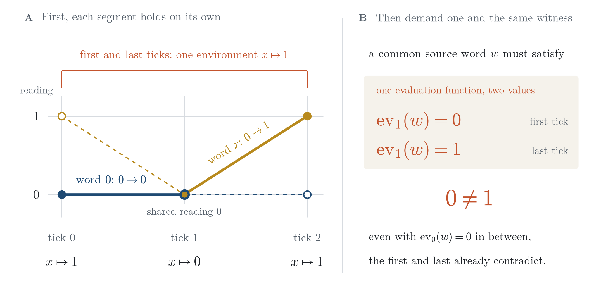
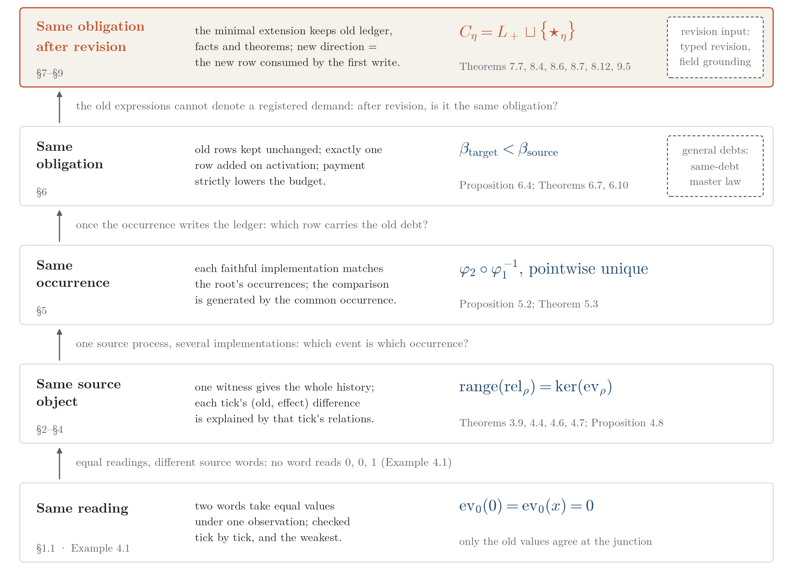
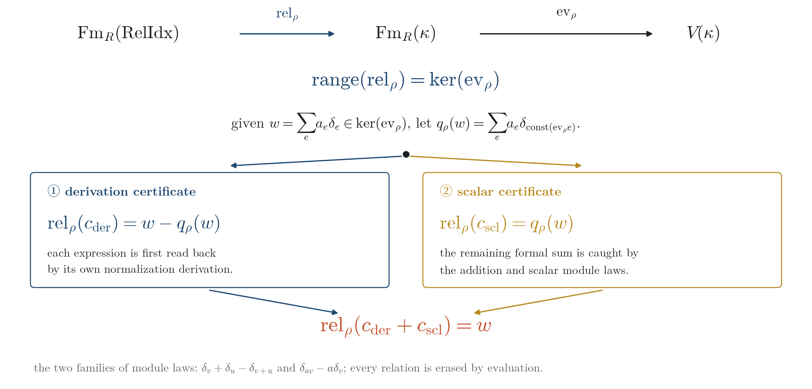
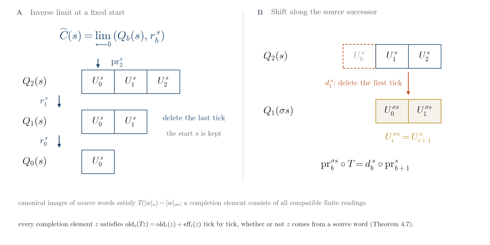
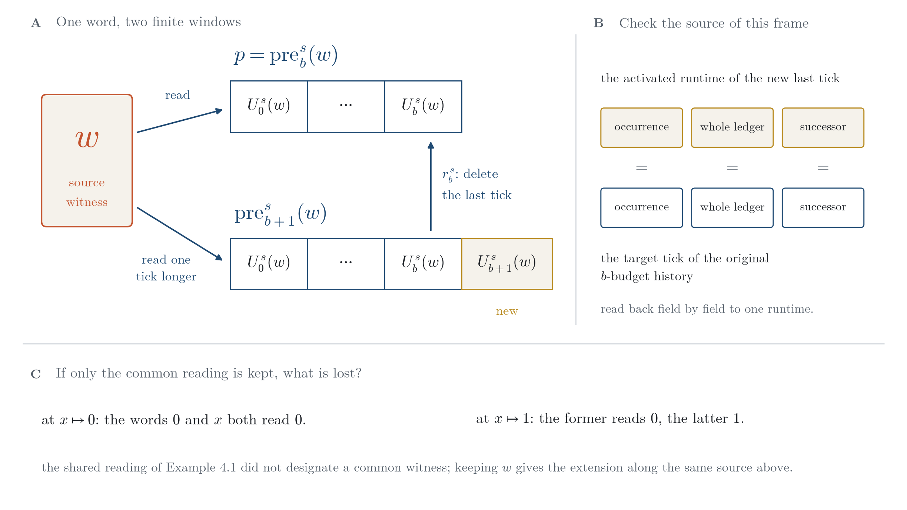
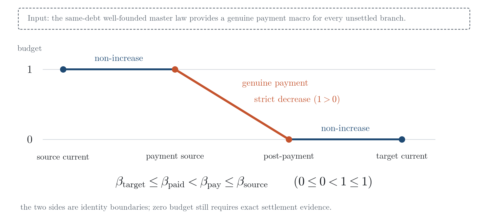
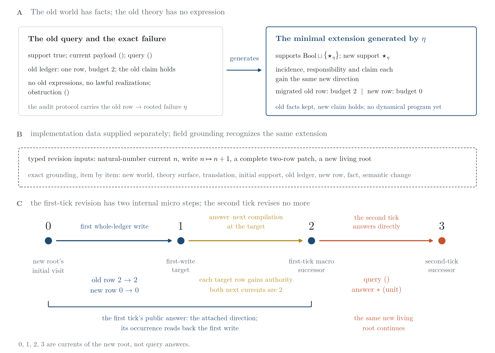
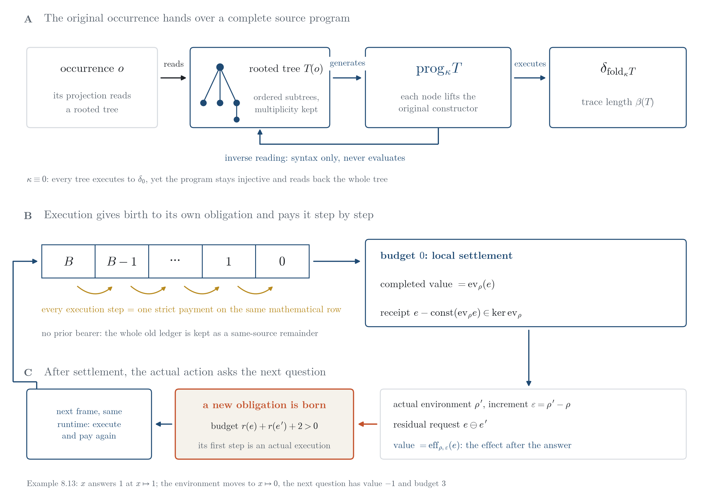

# The State Is Not the History, the Source Is: Identity, Responsibility, and Minimal Revision in Processes

**状态不是历史，源才是：过程同一性、责任承接与最小修订**

**Author: Jian Gao (高健)**\
Independent Researcher · innersummer@hotmail.com · ORCID 0009-0009-5002-1655

> *From null to source: a question itself carries the answer.*

---

## Abstract

A question leaves a demand for a process to discharge; even when several readings agree, an answer must still say which run it belongs to. Through four levels of identity—same reading, same source object, same occurrence, same obligation—we construct a positive chain that the source walks by itself: the original occurrence hands over a complete source program, the program is actually executed and can be read back independently, the execution gives birth to its own responsibility row and pays it step by step, and after settlement the actual action asks the next question.

The first link separates readings from sources. Any rooted tree and any constructor function generate a whole-tree program: the execution trace has exactly the budget generated by the tree’s syntax, and a syntax-only parser recovers the whole tree from the program; even when the constructor is constantly zero and every tree executes to the same value, the program still keeps the whole tree injectively. On top of this, the relations generated by derivations and module laws are exactly the evaluation kernel; two source words are the same in history iff at every tick their (old value, effect) difference is explained by that tick’s relations; and the evolution equation covers every element of the completion carrier. When implementations change, the common occurrence generates the unique comparison.

The second link lets responsibility be born from the source. A complete environment and expression registered at the original occurrence generate a new mathematical responsibility row without any prior bearer: its budget is the number of remaining primitive computations, every actual execution step is a strict payment, local settlement is reached where the budget runs out, and the completed value equals the evaluation of the original expression; the paid trace is at once a relation receipt, and the whole old ledger is kept as a same-source remainder. For general responsibilities, given a master law covering every same-debt current, genuine payments likewise generate finite settlement histories and terminal receipts.

The third link lets an answer ask the next question. After settlement, the actual action puts the paid relation back into the current actual environment: the value of the new request is exactly the effect of the original word under this update, its budget is strictly positive, and its first step is the birth of a new responsibility; the existing inquiry runtime runs through these recursive frames tick by tick, with no external table of future requests. When the old theory can neither express nor lawfully realize a demand, the rooted failure generates a minimal extension: on the ledger, incidence and claim coordinates, every admissible extension receives it through a unique faithful map; every typed revision sends this direction into the new root’s first write, and in a fixed two-tick instance the second tick is answered directly by the same new root.

The next question does not set out empty-handed. The same source program folds the complete time of this visit while it executes the effect, and keeps both histories together with an inverse criterion for the action difference; the read-outs of all actors jointly recover the all-word model; the paid query of an arbitrary source program generates a new obligation admission at the same root and visit, and physical and low-level inventories of two types cross the admission and are read back item by item; the default run itself executes this source-generated request, together with its old and next subtrees, paying node by node. A question therefore does not merely wait for an answer: its execution, its settlement and its failure all ask the next question. The theorems and constructions are formalized in Lean 4; complete written proofs are given in the text and the Supplement, and the scope of the formalization is given in Appendix D.

**Keywords**: process identity; incremental computation; source-program execution; semantic relation kernel; faithful realization; responsibility ledger; minimal revision; dependent types; formalization

### 摘要

提问给过程留下一个必须处置的需求；即使几个读数彼此吻合，答案仍须说明它属于哪一次运行。本文沿同一读数、同一源对象、同一次发生、同一笔责任的四级同一性，构造一条由源亲自走完的正向链：原发生交出完整源程序，程序被实际执行，也能被独立逆读；执行生成自己的责任行并逐步付款；结清之后，实际动作提出下一问。

第一环把读数与源分开。任意根树与任意构造子函数生成一个整树程序：执行迹的长度恰为由树语法生成的预算，只读语法的解析器从程序恢复整棵树；即使构造子恒取零、所有树的执行值都相同，程序仍单射地保存全树。在此之上，推导与模律生成的关系恰为求值核；两个源词在历史中同一，当且仅当每一拍的（旧值，效应）差都由该拍关系解释；演化等式覆盖完成载体的每个元素。换一种实现时，共同发生生成唯一比较。

第二环让责任从源中出生。原发生上登记的完整环境与表达式无需任何旧承担者，便生成一条新的数学责任行：预算是剩余的原语计算数，每一步实际执行都是严格付款，预算耗尽处到达局部结算，完成值等于原表达式的求值；已付执行迹同时是关系收据，全部旧账作为同源余项保留。对一般责任，给定覆盖每个同债当前的总律，真实付款同样生成有限结算历史与终账回执。

第三环让回答提出下一问。结清后，实际动作把已付关系放回当前的真实环境：新请求的值恰是原词在这次更新下的效应，预算严格为正，首步即一次新的责任出生；现成的询问运行时沿这些递归帧逐拍运行，无需外部的未来请求表。旧理论对一项需求既无表达也无合法实现时，扎根失败生成最小扩充：在账、关联与主张三个坐标上，每个容许扩充经唯一忠实映射接收它；任一有类型修订都把这个方向送入新根的首次写入，固定两拍实例的第二拍由同一新根直接回答。

下一问并非空手出发。同一个源程序在执行效应的同时折叠这次访问的完整时间，保留两段历史与作用差的逆判据；全部作用者的读数共同恢复全词模型；任意源程序的已付查询都在同根、同访问处生成新的责任准入，物理与低层两种类型的库存越过准入后被逐项读回；默认运行亲自执行这一源自产请求，连同旧、新两棵子树逐节点付款。问题因此不只等待答案：它的执行、结算与失败都在提出下一问。定理与构造以 Lean 4 形式化；完整书面证明见正文与补充材料，形式化范围见附录 D。

**关键词**：过程同一性；增量计算；源程序执行；语义关系核；忠实实现；责任账；最小修订；依赖类型；形式化

---

## 1 Introduction

### 1.1 Why equal readings are not enough

A question places a demand on a process: what is the answer, and what makes it belong to this run? Let the simplest candidate answer first—the zero word.

Consider a single variable $x$ whose environment takes the values $x\mapsto1$, $x\mapsto0$, $x\mapsto1$ in turn. Say that a word **realizes** a segment of updates if its readings before and after the update are exactly the prescribed target readings. The first segment updates the environment $1\to0$ and asks for the readings $0\to0$; the zero word $0$ does this. The second segment updates the environment $0\to1$ and asks for the readings $0\to1$; the variable word $x$ does this. The two segments also agree at the shared environment $x\mapsto0$: both read $0$.

Both segments pass their local checks. Now try to join them into a three-tick history with readings $0,0,1$: is there one fixed **source word** (a formal word evaluated across ticks as a history witness) that produces these readings from beginning to end?

There is not. Such a word $w$ would have to satisfy $\mathrm{ev}_1(w)=0$, $\mathrm{ev}_0(w)=0$ and $\mathrm{ev}_1(w)=1$ at once, and the first and last conditions demand different values in the same environment $x\mapsto1$ (Figure 1; Example 4.1). The faulty step is the inference: the readings agree at the junction, so the two segments can be joined into the history of one source word. Equal middle readings only say that the two words are indistinguishable at this tick; they do not make the two words one source object.

**Caption**. Figure 1 | Local witnesses and the common source word (exact numerical figure; Example 4.1, Table 1). The environments are $x\mapsto1,0,1$ in turn. The deep-blue zero word realizes $0\to0$ on the first segment; the gold variable word realizes $0\to1$ on the second. Solid lines mark the adopted local segments; dashed lines with hollow dots supply the word’s readings on the other segment; the vermilion bracket marks the one environment shared by the first and last ticks. A common source word would have to read $0$ and $1$ in the same environment at the first and last ticks, a contradiction already fixed by these two conditions.

The same gap appears in relations, implementations and responsibilities. The relation $x^2-x$ evaluates to zero under $x\mapsto1$, yet becomes $2$ after the update to $x\mapsto2$: a relation that holds now need not hold at the next tick. Two implementations can produce the same observation sequence without telling us which event is which occurrence. An unfinished obligation, after a ledger update or an expressive revision, must still answer: which row carries it, and which disposition supports the change of its budget?

This paper arranges these phenomena into four levels of identity, each keeping one more thing than the one before:

- **Same reading**: two objects take equal values under some observation. It can be checked tick by tick, and it is the weakest.
- **Same source object**: one witness gives the whole history. §2–§4 construct this level: readings enter a free carrier, change becomes an itemized effect, and a history becomes the completion carrier of compatible prefixes.
- **Same occurrence**: an event, together with its source, write-back and successor, belongs to one and the same run. §5 constructs this level between two implementations; the comparison map is uniquely determined by the common occurrence.
- **Same obligation**: unfinished matters that must be disposed of by rule are called **responsibilities**, and ledger rows record their claims and budgets. This level requires a responsibility to be carried by a determined row after a ledger update; §6 constructs it and gives conditions under which settlement is finite.

A positive chain, walked by the source itself, also runs through the four levels: the original occurrence hands over a complete source program, which is actually executed and can be read back independently (§3.4); the execution gives birth to its own responsibility row and pays it step by step (§6.5); after settlement, the actual action asks the next question (§8.5). The first link returns a reversed echo of the opening: in the three-tick counterexample the readings agree while the source words differ; in §3.4 the constructor is constantly zero and every tree executes to exactly the same value, yet the whole-tree program is still read back to the original tree. Readings can forget everything; the source does not. The end of the chain does not hand over just a number either: §9 proves that the next question, together with the complete time of this visit, all actors and inventories of two types, is carried in by the same source program and executed by the default run.

The last level carries the question to a deeper absence: the old theory has no expression for the demand itself. The zero word first brought null into the opening; here null acquires its precise meaning—**double-empty failure**, in which the expression-witness and lawful-realization types for this demand in the given old theory are both empty. §7 obtains such a failure from a selected dependency residual (the part still unmatched after alignment), and §8 registers the failure together with this occurrence, old row and successor as a **rooted failure**. The absence now has an address of its own: the new direction indexed by it enters the new root supplied by a **typed revision**, a contract giving both the new run and compatibility proofs for carrying the old question. A root is the running registration that fixes emission and compilation. The first tick makes this attached direction public, and the second is answered directly by the new root. The opening asks “where is the one witness?”; the ending asks two things: how does this answer ask the next question, and how does this failure become the source of a new answer?

### 1.2 Main results

Figure 2 places the four groups of results on one ladder, and Figure 6 draws the positive chain running through them; the precise statements are in the sections. Here a **source process** gives states, an initial position and a one-tick generating successor, and registers every state as a complete living current—the complete registration of the same root and visit (Definition 2.1).

**Caption**. Figure 2 | Four levels of identity (structural diagram). From bottom to top, each level keeps one more thing than the one below: same reading compares values only; same source object requires one witness for the whole history, and the program of any rooted tree is executable and invertible (§2–§4, Theorems 3.9, 4.4, 4.6–4.7); same occurrence is fixed by the correspondence between two faithful realizations and the common occurrence (§5, Theorem 5.3); same obligation is given by the determined row that carries an old row through a whole-ledger update, and a responsibility born from a source program is paid step by step (§6, Proposition 6.4, Theorems 6.7, 6.10); after the expressive structure is revised, the minimal extension sends the new direction to the new row consumed by the first write, while the old row is carried as before, and a settled answer asks the next question, carrying the complete time, all actors and both inventories (§7–§9, Theorems 7.7, 8.4, 8.6–8.7, 8.12, 9.2–9.8). The text between levels is the concrete situation that makes the next level necessary; the same-debt master law of general responsibilities and the typed revision are marked as inputs by dashed frames. The vermilion level is where the paper’s answer lands.

**A (same source object, §2–§4).** An arbitrary native state set $S$ and an arbitrary function $f:X\to Y\to Z$ enter a many-sorted expression language through free carriers; states need not have addition (Propositions 2.3, 2.5). The update equation writes change as an effect generated node by node; the order- and multiplicity-preserving list of mixed terms sums exactly to the effect; derivations exist as replayable objects (Propositions 3.3, 3.5, 3.6). On top of this:

- any rooted tree and any constructor function generate a whole-tree program: its execution value is the state point of the fold, its execution trace has exactly the budget generated by the tree’s syntax, and a syntax-only parser hands back the whole tree; when the constructor is constantly zero and all trees read the same, the program is still injective (Theorem 3.9);
- over any commutative ring and in any environment, the relation map generated by derivations and module laws has image exactly the evaluation kernel (Theorem 4.4);
- two source words have the same image in the history completion iff at every tick their (old value, effect) difference is explained by the relations generated at that tick (Theorem 4.6);
- **every** element of the completion carrier—not only images of source words—satisfies the exact evolution equation at every finite stage (Theorem 4.7).

This explains the opening three-tick counterexample: at the junction only the old values agree, and only a prefix carrying a common source word extends along the generated successor (Proposition 4.8).

**B (same occurrence, §5).** A faithful realization requires that, at every current, world occurrences and implementation events correspond two-sidedly, the canonical occurrence goes to the emitted event, and compilation results lie in the lawful evolution family of the occurrence (Definition 5.1). Under this contract, between any two faithful realizations of the same root the common occurrence generates an event correspondence compatible with the emitters and the whole compiler; **every** candidate event map—with no compatibility condition attached—agrees with it pointwise (Theorem 5.3). Every event recovers the canonical occurrence, all installed projections and the generated successor (Proposition 5.2). The physics construction calls this level directly (§10.1).

**C (same obligation, §6).** An event-generated whole-ledger update is exactly the old ledger when inactive; upon activation it adds exactly one debt row determined by the activation law, keeping old claims and budgets unchanged (Proposition 6.4). If the same-debt master law supplies, at every same-debt current, exact settlement or a finite continuation containing a genuine payment, then every same-debt current generates a finite settlement history, exact settlement at a determined endpoint, and a terminal receipt for the tracked row (Theorem 6.7). Computational responsibilities need no such input: a complete environment–expression pair at the original occurrence directly generates, without any prior bearer, the execution debt law (Definition 6.9) and its new responsibility row; at the $k$-th causal visit the budget is $B-k$, for $k<B$ the source-selected execution step is a genuine payment, and at $k=B$ local settlement holds with completed value equal to the original evaluation; the paid trace gives the relation receipt, and the whole old ledger is kept as a same-source remainder (Theorem 6.10). Installed in an actual inquiry, the whole-tree program reads value, provenance and cost in one answer (Proposition 6.11).

**D (same obligation after revision, §7–§8).** Dependency-tree residuals give exact expressive failures of the old theory, and the causal audit binds them to this occurrence of the root (Propositions 7.4, 7.5). A failure rooted in this way generates a minimal extension: old ledger, facts, dispositions and theorems are kept, and the new direction has no old preimage on the ledger, incidence and claim coordinates; every admissible extension receives it through a unique faithful morphism (Theorem 8.4). For any typed revision, this unique map sends the new direction to the new row consumed by the revision’s first write (Theorem 8.6); under **field grounding**—field-by-field recovery of the minimal extension, or a richer faithful reconstruction—the old and the new row each obtain the new root’s answer and successor at the write target (Theorem 8.7). The fixed instance of Proposition 8.9 lets the new root answer directly at the second tick. The two aligned branches of a dependent step also hand over complete constructor trees, charged by the same execution debt law (Proposition 7.6); the original inquiry input registered by the root at that visit connects it to the shared run, and the original compiler’s successor feeds the next visit (Theorem 7.7). After settlement, the actual action generates a residual request: its value is the effect of the paid relation under the actual update, its budget is strictly positive, and its first step is the birth of a new responsibility; the recursive frames are all the nodes of the existing inquiry runtime, and payment and birth each keep their identity (Theorem 8.12). This is the positive counterpart of the one-shot obstruction of Proposition 8.10; Example 8.13 computes the next questions for the three words of Table 1.

**E (complete execution, §9).** The next question carries all the material of this run. The same program folds the receipt tree of temporal codes while it folds the effect; the source and target histories generate a common history with exact zero fibres; the action difference has two read-outs, an image residual and an observation residual, whose joint vanishing is exactly the criterion for lifting from the source fibre (Theorem 9.2). The read-outs of all actors—every position of the pairing trees, repetitions counted separately—give an all-word model as a quotient; the ordered effect history transports every step residual to the end, and nonzero intermediate terms are not deleted when the final values cancel; the coarse reader and all future readers are injective on the model (Theorem 9.3). For an arbitrary source program, the paid query generates an obligation admission at the same root and visit, a first whole-ledger write and a literal successor, and the born frame runs on (Theorem 9.5); physical and low-level inventories cross the admission with values preserved by the binding and are read back item by item (Theorem 9.6); the pairing of operation words with complete states is covariant, iterated substitution is the advance of time, and the cost of every prefix is charged exactly (Theorem 9.7). The default run executes this source-generated request, and the old and next subtrees enter one main expression and are paid node by node (Theorem 9.8).

**Kinds of construction.** Universal properties of free modules and tensor products, structural induction, inverse limits, well-founded recursion and disjoint sums supply the construction tools. Here they deliver objects used by the next construction: the whole-tree program is both the object of execution and the source of inverse reading, every step of an execution trace is at once a payment and a relation certificate, and the effect of a paid relation in a new environment becomes the next question; derivation endpoint differences become relation certificates, the common source word becomes a history-extension witness, and the attached direction of a failure becomes the new row consumed by the first write. Faithful realization, the same-debt master law and typed revision specify what each connection must keep; once the contract is supplied, identity is forced. The domain applications of §10.1 use these outputs in execution.

### 1.3 Differences from the closest work

**Incremental computation.** DBSP [1] defines incremental view maintenance on streams over commutative groups: its Z-set $\mathbb Z[A]$ is the same object as our free carrier, and the bilinear node of Proposition 3.3 is the structural-induction form of its three-term formula (its Theorem 3.4); DBSP’s results are likewise formalized in Lean. We go on to ask whether these correct readings belong to the same run, keeping derivation objects, the complete relation kernel and source-witnessed histories (§10.2). Cai et al. [2] define change structures for $\lambda$-calculi and prove the update equation for valid changes; here arbitrary native states are lifted freely first, and the lifted carriers carry the increment structure.

**Provenance and algebraic evaluation.** The provenance semirings of Green, Karvounarakis and Tannen [3] first record how input tuples combine by provenance polynomials and then evaluate through semiring homomorphisms (detailed in §10.2). This paper shares the idea of keeping the provenance first and evaluating afterwards; what it keeps also includes one witness running through the history, the occurrence of a fixed visit, the whole lawful evolution and its ledger rows.

**Implementation and refinement.** TLA [4] organizes actions and temporal properties with primed and unprimed variables. Abadi and Lamport [5] prove that a lower-level specification implements a higher-level one by refinement mappings between state spaces, and show that such a mapping may exist only after auxiliary variables (history and prophecy variables) are added to the lower-level specification. This agrees with our starting point: states alone do not carry the correspondence between two levels. The comparison in §5 is different: two implementations are not mapped to each other directly; each establishes a faithful correspondence with the occurrences of the same root, and the comparison map is generated from these and is unique.

**Events and causality.** Event structures [6] describe computation by events with their causality and consistency relations. The root in this paper has exactly one occurrence at each visit, so there are no alternative branches between events; on such deterministic single-root processes we bind whole-ledger dispositions and expressive revisions to one and the same occurrence.

**Theory revision.** AGM theory [7] studies contracting or revising a theory in a given language: partial meet contraction takes the intersection of some maximal subsets of the theory that fail to imply the proposition to be removed, and is characterized by a set of postulates. §8 treats a different revision: the demand can be neither expressed nor lawfully realized in the old theory, so the expressive structure itself is extended; “minimal” means initiality among admissible extensions, not a choice among maximal subsets.

**Resource reasoning.** Separation logic [8] describes the resource locality of the heap by the separating conjunction. The three responsibility laws of §6 describe how obligations arise, persist and are carried along lifecycle edges; finite settlement additionally requires the master law and genuine payments.

### 1.4 Scope and reading route

**Scope.** The processes in this paper are deterministic single-root processes: the fixed root has exactly one occurrence at each visit, and at most one lawful evolution (§5); concurrency and nondeterminism are outside the scope. The following are inputs, not conclusions, each stated where it is used: the same-debt master law (Theorem 6.7 proves “master law $\Rightarrow$ finite settlement”); typed revisions and their field grounding (Theorems 8.6–8.7); and the registration of the revised new root as a source process—once the new root is registered by Definition 2.1, the conclusions of §2–§4 can be reused, but this registration is not separately formalized (end of §8.4). The positive chain (§3.4, §6.5, end of §7.3, §8.5) and the complete execution of §9 need none of these inputs: payments are generated by execution and the next question by the actual action; their formalization is pinned to the respective later source commits (Appendix D.2). The characterization of semantic fibres is not a decision procedure (Proposition 3.6); a master classification defined non-constructively does not by itself give a decision procedure or complexity bounds (Proposition 7.1).

Throughout, two kinds of object are distinguished: those **generated** by the source or the compiler, and those **supplied** by the caller. The former carry evidence of which occurrence they come from; the latter appear as hypotheses of theorems. When the text says “generated row” or “genuine payment”, it always means the former.

**Reading route.** §2–§4 climb the ladder from states to the completion carrier, §3.4 gives the whole-tree program, and §4 settles the three-tick counterexample; §5 treats occurrences; §6 treats responsibilities, and §6.5 lets a responsibility be born from a source program and paid; §7–§8 treat expressive revision, with the two-tick instance in §8.4, and §8.5 lets an answer ask the next question; §9 lets the next question carry the complete time, all actors and both inventories, executed by the default run. §10 collects the domain applications and the details of related work, and §11 concludes. Figures 3–4 unfold the completion carrier and witness extension, Figure 5 unfolds the two-tick revision, and Figure 6 unfolds the positive chain; Tables 1–5 give, in order, the counterexample readings, the fixed payment, the three budget stages, the two-tick trajectory and the four-level summary. Proof ideas accompany the statements; complete written proofs of the results of §6.5, the end of §7.3, §8.5 and §9 are given in Supplement S1–S5, the formal declarations are in Appendix D, and a quick reference of terms is in Appendix E.

---

## 2 Source processes and free carriers: states need no addition

For an answer to belong to this run, it first needs a source that keeps object, occurrence and successor together. A native state may be a database, a board position or a physical configuration; this section registers it as a current in a run, then places it in a free carrier that supports item-by-item calculation.

**Minimal-record definition (world, root, visit and occurrence).** A **world relation network** $N$ is a record of the carriers and dependent families in the first three rows below; a **root** is a running registration on $N$ fixing the vocabulary, native currents, emitter and whole-ledger compiler. A **visit** $v$ is one history-bearing time visit of the root, and an **occurrence** is the dependent object canonically emitted at that visit. Write $c$ for a current at the root and $s(c)$ for its support; the last three rows give the occurrence and evolution fields obtained from the root registration. A support is the common location of responsibilities and facts; an anchor records provenance, incidence records connections, and lineage records the identity carried forward.

<!-- definition-fields:begin -->
| field owner | carrier or dependent family used here | role of the field |
| --- | --- | --- |
| $N$: support and location | $\mathrm{Sup}$; anchors, incidence, lineage and their support readouts | locates occurrences and records provenance and carried identities |
| $N$: responsibilities and claims | $\mathrm{Responsibility},\mathrm{Claim}$; $\mathrm{OpenAt}(s,r),\mathrm{HoldsAt}(s,a)$; the claim and natural-number budget of an open row | an opening witness makes a responsibility a ledger row; a fact witness makes a claim hold at the support |
| $N$: obstructions and dispositions | $\mathrm{Obs}(s)$ with its obstruction claim; semantic-change families; $\mathrm{Disposition}(s,k)$ | records the obstruction and evidence for whole-support settlement, transfer or law-surface extension |
| root: canonical occurrence | $\mathrm{Occ}_W(c)$, $g_c\in\mathrm{Occ}_W(c)$ | fixes this visit as its canonically emitted occurrence |
| root: lawful evolution | $\mathrm{Evol}_W(c)$, $\mathrm{Lawful}_c(g,e)$ | identifies the lawful result $e$ of occurrence $g$ among candidate whole evolutions |
| root: compiler | $\mathrm{comp}_c:\mathrm{Occ}_W(c)\to\mathrm{Evol}_W(c)$ | generates whole-ledger write-back and the next current for subsequent visits |
<!-- definition-fields:end -->

Here $\mathrm{OpenAt}$, $\mathrm{HoldsAt}$ and dispositions are witness-bearing type families. The **causal world** $W$ obtained from the root registration also fixes two laws: every $g\in\mathrm{Occ}_W(c)$ equals $g_c$; the compiler selects a lawful evolution for every occurrence, and every lawful result of that occurrence equals it. The former fixes the occurrence, the latter the whole evolution; the two implementations in §5 share these laws. Appendix D locates the complete formal records.

The fixed instance compresses these fields to a tiny world: the current payload of the old root is always $()$, while its time visit advances at every tick. By payload alone every tick looks the same; read with root and visit, each has its own occurrence. §8 will ask this world a question that the old theory cannot express.

### 2.1 Source processes

A **living current** on $N$ is a dependent record $c$ comprising a vocabulary, a complete living root and one time visit of that root; its occurrence and one-tick successor are read from this registration. Equality compares the complete record, on which §5 compares realizations and §8 recognizes revisions. **Erasure** maps the living root to its authoritative root—the registration fixing occurrence and compilation—while keeping the vocabulary and the same visit; only the living root’s additional pre-emitter continuation law is forgotten. **Terminal settlement** is the whole-ledger terminal disposition given by root compilation (§6).

**Definition 2.1 (Source process).** A **source process** $\mathcal{P}=(S,\iota,s_0,\sigma)$ on $N$ consists of:

- a state carrier $S$, an arbitrary type with no algebraic structure assumed;
- an injection $\iota:S\hookrightarrow\mathrm{Cur}(N)$ registering every state as a living current;
- an initial state $s_0\in S$;
- a one-tick generating successor $\sigma:S\to S$: the erasure of $\iota(\sigma(s))$ equals the next current generated by the root of $\iota(s)$ at the visit of $\iota(s)$, and on non-terminal branches the root itself is unchanged.

The successor $\sigma$ is given together with its generating evidence; it must continue the occurrence in the current registration.

**Proposition 2.2 (Determinacy of the fixed-process successor).** Let $\mathcal{P}$ be a source process.

1. The erasure of $\iota(\sigma(s))$ equals the generated next current of the root of $\iota(s)$;
2. the root law surface of $\iota(\sigma(s))$ (the field of the root registration naming the theory law being followed) equals the root law surface of $\iota(s)$;
3. if $\iota(s_1)=\iota(s_2)$, then $\iota(\sigma(s_1))=\iota(\sigma(s_2))$;
4. for any observation budget $n$, an $n$-tick history is generated recursively; exhausting the budget only stops the observation and produces no terminal disposition.

Proof. (1) and (3) unfold Definition 2.1 directly; in (3), injectivity of $\iota$ gives $s_1=s_2$. (2) takes the image of (1) under the law surface and uses a property carried by the root registration: the generated next current preserves the law surface. (4) is recursion on $n$. ∎

(2) says that a fixed-law process cannot hide a theory revision inside a local terminal settlement or a carrier handover; revision belongs to the independent construction of §8. (3) says that any difference between successors is already reflected in the registered current: a parameter that does not change the complete current (vocabulary, law surface and the like) cannot quietly fork the next world.

### 2.2 Free carriers: turning observation into a linear map

Keeping an independent place for every native object gives answer readout a starting point that does not merge sources.

Keep an independent base point for every state $s$ and allow finite integer combinations of these base points; this gives the free module $\mathbb{Z}[S]:=S\to_0\mathbb{Z}$. Write the **state point** as $\delta_s:=1\cdot s$. It is like a table of cells labelled by states: $\delta_s$ records $1$ only in cell $s$, and a general element records nonzero integers, possibly negative, in finitely many cells.

The state-point map $\delta$ is injective, so distinct states stay distinct. The native successor advances cell by cell and gives a linear map $A:\mathbb{Z}[S]\to\mathbb{Z}[S]$ with $A\,\delta_s=\delta_{\sigma(s)}$. In the runtime, a state point is read back together with the occurrence, write-back and successor with which it is registered (Appendix A.1).

This representation leaves a definite place for every observation with values in an additive abelian group: prescribe the reading of every state point and extend by linear combination.

**Proposition 2.3 (Unique free extension of an arbitrary observation).** Let $B$ be any additive abelian group and $\mathrm{read}:S\to B$ any native observation. Then there is a unique linear map $\widehat{\mathrm{read}}:\mathbb{Z}[S]\to B$ with $\widehat{\mathrm{read}}(\delta_s)=\mathrm{read}(s)$, and it commutes with the source action:
$$\widehat{\mathrm{read}}\circ A=\widehat{\mathrm{read}\circ\sigma}.$$

Proof. This is the universal property of free modules. Uniqueness: two linear maps agreeing on all base points agree everywhere (induction on finite support); existence: extend by linear combination. Both sides of the commutation take the value $\mathrm{read}(\sigma(s))$ on base points, and uniqueness gives the equation. ∎

For example, the reading of $a\delta_s+b\delta_t$ can only be $a\,\mathrm{read}(s)+b\,\mathrm{read}(t)$. The commutation can also be seen directly on base points: advancing $\delta_s$ to $\delta_{\sigma(s)}$ and then reading gives the same result as first composing the observation $\mathrm{read}\circ\sigma$ on states and then extending freely; no autonomous successor on the value group $B$ is required.

### 2.3 Joint lifting of arbitrary binary native functions

When a question uses two inputs at once, their pairing must also be kept.

We also need to represent operations acting on two inputs at once, such as multiplication, pairing or path composition. Given arbitrary types $X,Y,Z$ and a function $f:X\to Y\to Z$, take their free carriers.

**Definition 2.4 (Joint lift).** The **joint map** $\mathrm{joint}:\mathbb{Z}[X]\to\mathbb{Z}[Y]\to\mathbb{Z}[X\times Y]$ is the unique bilinear map with $\mathrm{joint}(\delta_x,\delta_y)=\delta_{(x,y)}$; the **pushforward** $\mathrm{push}_f:\mathbb{Z}[X\times Y]\to\mathbb{Z}[Z]$ is the free pushforward of $\mathrm{curry}^{-1}(f)$; the **lift** is $\mathrm{lift}(f):=\mathrm{push}_f\circ\mathrm{joint}$.

This is an application of the universal property of the tensor product [9]. $\mathrm{joint}$ pairs left and right inventories independently and expands into the rectangular combination of all left and right terms; an inventory that already carries pairing relations should enter $\mathrm{push}_f$ directly as an element of $\mathbb{Z}[X\times Y]$. For example, with $x\ne x'$ and $y\ne y'$, the correlated inventory $\delta_{(x,y)}+\delta_{(x',y')}$ keeps only two pairings and cannot be written as any $\mathrm{joint}(u,v)$; independent pairing that gives both positions nonzero coefficients also produces nonzero terms at the cross positions $(x,y')$ and $(x',y)$. The dependency trees of §7 use exactly such already-correlated joint material.

**Proposition 2.5 (Base-point readback and complete increment expansion).** Take the three-element sort set $\{\text{left},\text{right},\text{result}\}$ with the three free carriers as value carriers, the environment $\rho^{\delta}$ sending each variable to its own state point, and the native expression $e_{f,x,y}:=\mathrm{bilinear}(\mathrm{lift}(f))(\mathrm{var}\,x)(\mathrm{var}\,y)$ (expressions and evaluation are formally given in Definition 3.1). Then:

1. $\mathrm{ev}_{\rho^{\delta}}(e_{f,x,y})=\delta_{f(x,y)}$ and $\mathrm{lift}(f)(\delta_x,\delta_y)=\delta_{f(x,y)}$;
2. for any increment environment $\varepsilon$:
$$\mathrm{ev}_{\rho^{\delta}+\varepsilon}(e_{f,x,y})=\delta_{f(x,y)}+\mathrm{lift}(f)(\delta_x,\varepsilon_y)+\mathrm{lift}(f)(\varepsilon_x,\delta_y)+\mathrm{lift}(f)(\varepsilon_x,\varepsilon_y).$$

Proof. (1) is the definitional composite of the two factor maps on base points. (2) follows from the general update equation of Proposition 3.3 applied to this expression; the three action terms are exactly the three kept by its bilinear node. ∎

Proposition 2.5(2) holds equally for native binary functions such as table lookup and string concatenation: the three terms correspond to changing only the right input, changing only the left input, and changing both at once. The expansion comes from bilinear lifting on free carriers and requires neither differentiability nor additivity of $f$. The expression $e_{f,x,y}$ also carries a normalizing derivation to its own constant (Proposition 3.6), available for replay by later constructions.

### 2.4 Witnesses come from the runtime

The witness named by a reading must be delivered by this tick of the run.

State readings in the language also need runtime witnesses. A one-tick transition together with the complete registration of its occurrence, ledger and next current is called a **tick**. Take a one-sorted language with value carrier $\mathbb{Z}[S]$; an additive environment projection $\pi:M\to\mathrm{Env}$ sends material readings into the language environment (general setting in §4.3). The source word $\mathrm{var}$ and the action word $\mathrm{linear}(A)(\mathrm{var})$ read at any finite stage as
$$(\delta_{s_i},\ \delta_{s_{i+1}}-\delta_{s_i})\quad\text{and}\quad(\delta_{s_{i+1}},\ \delta_{s_{i+2}}-\delta_{s_{i+1}}),\qquad s_k:=\sigma^k(s_0),$$
each pair containing an old value and an increment.

The state point in the old component of the action word is witnessed directly by the tick of the next runtime $\sigma^{i+1}(s_0)$; this runtime is exactly the target tick of the history at that stage. A native readout $\mathrm{readout}:S\to B$ of any type $B$ (no addition needed on $B$) is read from the same runtime. Both carry, by $\Sigma$-types, proofs that “the state point equals the old component of the reading” and that “the point equals the image under free observation”.

This is the **actual-witness principle**: the needed state points and native readouts are taken from the generated runtime and carried together with the proofs that they equal the language readings; states are never solved back from readings. §4 extends histories by it, and §8 recognizes the revised successor by it.

---

## 3 Effects, mixed terms and derivations: the update equation becomes a usable object

How an answer changes must be accounted for by this update itself. This section defines its **effect**, the difference between updated and old values, by the expression’s structure; bilinear nodes use the three-term formula of incremental view maintenance [1]. We also keep an itemized list of the effect and replayable derivations, so that the next section can ask which relations witness the equality of two answers. Finally, derivations are written as step-charged executions, and every rooted tree thereby generates an executable, invertible whole-tree program (§3.4).

### 3.1 Heterogeneous expressions and effects

First let an expression specify its native objects and operations, so that its effect has a source traceable node by node.

**Definition 3.1 (Expressions and evaluation).** Let $\mathcal K$ be a set of sorts; each sort $\kappa$ has an additive abelian group $V(\kappa)$ (the value carrier) and a variable set $\mathrm{Var}(\kappa)$. **Expressions** $e\in\mathrm{Expr}(\kappa)$ are generated by the grammar
$$e::=\mathrm{var}\,x\mid\mathrm{const}\,c\mid e_1+e_2\mid \mathrm{linear}_h(e)\mid \mathrm{bilinear}_\mu(e_1,e_2)$$
where $h:V(\kappa)\to V(\kappa')$ is an additive homomorphism and $\mu:V(\kappa)\to V(\kappa')\to V(\kappa'')$ is biadditive. An environment $\rho$ gives every variable of every sort a value; evaluation $\mathrm{ev}_\rho(e)$ is as usual. The language keeps all intermediate sorts and source operations; no quotient or normalization is imposed on the syntax in advance.

**Definition 3.2 (Effect).** The effect is generated recursively from the pair $(\rho,\varepsilon)$ of an old environment and an increment environment: variables take the increment $\varepsilon$; constants take $0$; addition and linear homomorphisms recurse structurally; bilinear nodes keep all three kinds of action term:
$$\mathrm{bilinear}_\mu(e_1,e_2)\mapsto \mu(\mathrm{ev}_\rho e_1,\mathrm{eff}_{\rho,\varepsilon}e_2)+\mu(\mathrm{eff}_{\rho,\varepsilon}e_1,\mathrm{ev}_\rho e_2)+\mu(\mathrm{eff}_{\rho,\varepsilon}e_1,\mathrm{eff}_{\rho,\varepsilon}e_2).$$

**Proposition 3.3 (Update equation).** For any expression $e$ and environments $\rho,\varepsilon$:
$$\mathrm{ev}_{\rho+\varepsilon}(e)=\mathrm{ev}_\rho(e)+\mathrm{eff}_{\rho,\varepsilon}(e).$$

Proof. The expansion has four terms, and for the identity to hold at every bilinear node none can be dropped. Structural induction on $e$. Variables and constants hold by definition; addition uses the group axioms, and linear nodes use additivity. Bilinear nodes expand completely: $\mu(a{+}da,a'{+}da')=\mu(a,a')+\mu(a,da')+\mu(da,a')+\mu(da,da')$. Its single-point special case is Proposition 2.5(2). ∎

The three terms correspond to changing only the right input, only the left input, and both at once; dropping any one of them, the equation cannot hold for every bilinear node. On relational joins this is exactly the three-term formula of incremental view maintenance [1]. The induction also gives two composition properties used tick by tick in §4: the effect of a zero increment is zero; two consecutive updates satisfy $\mathrm{eff}_{\rho,\varepsilon_1+\varepsilon_2}=\mathrm{eff}_{\rho,\varepsilon_1}+\mathrm{eff}_{\rho+\varepsilon_1,\varepsilon_2}$, where the second effect is based at the updated environment and so records the second segment of change that actually occurred.

### 3.2 Ordered mixed terms: an itemized receipt

The effect gives the total change; to trace where each term comes from, the list that generates it must also be kept.

**Definition 3.4 (Ordered mixed terms).** Mark every variable with an “old/increment” position to obtain the mixed environment $\rho\oplus\varepsilon$. The **mixed-term list** $\mathrm{mix}(e)$ of an expression $e$ is generated recursively: a variable gives its increment-position word; a constant gives the empty list; addition concatenates; a linear map is applied term by term; a bilinear node gives three segments—the right-increment segment (the old left element paired with every right increment term), the left-increment segment, and the fully ordered Cartesian product of the two lists (every left increment term occurring jointly with every right increment term).

**Proposition 3.5 (Completeness of mixed terms).** For any $e,\rho,\varepsilon$:
$$\sum_{t\in\mathrm{mix}(e)}\mathrm{ev}_{\rho\oplus\varepsilon}(t)=\mathrm{eff}_{\rho,\varepsilon}(e).$$
The list preserves source order and multiplicity: a subterm occurring twice contributes twice, and bilinear nodes neither fold nor swap left and right.

Proof. The difficulty sits at the bilinear node: the three increment segments, each summed on its own, must add back to exactly the effect. Structural induction on $e$. The first four kinds of node are direct; bilinear nodes are checked in three segments: the sum over the right-increment segment is pulled out by biadditivity as $\mu(\mathrm{ev}\,e_1,\sum\mathrm{mix}(e_2))$, the left-increment segment likewise, and the sum over the Cartesian-product segment equals $\mu(\sum\mathrm{mix}(e_1),\sum\mathrm{mix}(e_2))$ by exchanging “pair term by term, then sum” (induction on the left list). The three segments add up exactly to the definition of the effect. ∎

Proposition 3.5 gives a receipt that can be checked item by item: each term comes from a definite syntactic position, a term occurring twice is counted twice, and the total is exactly the effect.

### 3.3 Derivations in Type: replay, not decision

The effect records change; a derivation keeps the path by which an equation holds. A derivation is like a videotape that can be replayed rather than a verdict that only announces the conclusion: it records every step from $e$ to $e'$, can be played backwards, and can be spliced into a longer tape. Fixing an environment $\rho$, a **derivation** $d:e\vdash_\rho e'$ is an inductive object in $\mathrm{Type}$ comprising reflexivity, symmetry and transitivity, variable binding ($\mathrm{var}\,x\vdash\mathrm{const}(\rho\,x)$), three constant-computation rules (constant addition, linear constant, bilinear constant), and three congruence rules corresponding to the syntax nodes. Every step keeps the source bindings and source operations; since derivations live in $\mathrm{Type}$, later constructions can use these steps for substitution and assembly.

**Proposition 3.6 (Normalization and characterization of semantic fibres).**

1. **Soundness**: if $d:e\vdash_\rho e'$, then $\mathrm{ev}_\rho(e)=\mathrm{ev}_\rho(e')$.
2. **Generated normalization**: every $e$ recursively generates $\mathrm{norm}_\rho(e):e\vdash_\rho\mathrm{const}(\mathrm{ev}_\rho(e))$, and the construction takes no semantic equality or normalizer as input.
3. **Characterization of semantic fibres**: $e\vdash_\rho e'$ is nonempty iff $\mathrm{ev}_\rho(e)=\mathrm{ev}_\rho(e')$.

Proof. Derivations are sound, generated by normalization, and characterize the semantic fibres; the three items are proved in turn. (1) Induction on $d$; every constant rule is a definitional computation. (2) Recursion: variables use binding; compound nodes first reduce subexpressions by congruence rules and then apply the corresponding constant rule. (3) “Only if” is (1); “if” splices (2) by transitivity and transport: $\mathrm{norm}_\rho(e)$, followed by the transport along the equality of evaluations, followed by $(\mathrm{norm}_\rho(e'))^{-1}$. ∎

(3) characterizes the semantic fibres: given evidence of equality, the two normalization paths can be connected; it is not a procedure deciding semantic equality. §4 generates the relation kernel directly from derivation endpoint differences, without first solving a decision problem.

### 3.4 Whole-tree programs: execution, charging and inverse reading

A derivation proves an equation; an execution pays for that proof one primitive computation at a time. This subsection first writes the normalization of Proposition 3.6 as a step-counted execution trace, and then lets every rooted tree generate its own program. The result gives the most extreme separation between readings and sources: evaluation may read every tree as one and the same value, while the program still keeps and hands back the whole tree.

**Remaining count and execution traces.** The **remaining count** $r(e)$ of an expression counts the primitive computations still to be executed:
$$r(\mathrm{var}\,x)=1,\qquad r(\mathrm{const}\,c)=0,\qquad r(e_1+e_2)=r(e_1)+r(e_2)+1,$$
$$r(\mathrm{linear}_h e)=r(e)+1,\qquad r(\mathrm{bilinear}_\mu(e_1,e_2))=r(e_1)+r(e_2)+1.$$
An **execution step** is one of four primitive computations—binding the variable $\mathrm{var}\,x$ to $\mathrm{const}(\rho\,x)$, and addition, linear action and bilinear action on constants—possibly inside any syntactic position through the congruence rules. Finitely many execution steps joined end to end form an **execution trace**.

**Proposition 3.7 (Execution traces).** For every environment $\rho$ and expression $e$:

1. every execution step lowers the remaining count by exactly $1$; constants have no step, and the step relation is well founded;
2. there is an execution trace $\mathrm{exec}_\rho(e):e\to\mathrm{const}(\mathrm{ev}_\rho e)$ visiting the syntax from left to right, of length $r(e)$;
3. every execution trace is a derivation in the sense of §3.3, so $\mathrm{exec}_\rho(e)$ is a step-charged implementation of the normalization of Proposition 3.6(2).

Proof. Only because the count drops by exactly one per step can execution be read as payment. (1) Induction on steps: each primitive computation removes one unit of count, and a congruence position leaves the rest of the count unchanged; strict decrease gives well-foundedness. (2) Structural recursion on $e$: execute the left subexpression, then the right one, then the node’s own primitive computation; the length accumulates by (1). (3) Every execution step is a constant rule or a congruence of one, and joining traces is transitivity of derivations. ∎

The endpoint difference $e-\mathrm{const}(\mathrm{ev}_\rho e)$ of an execution trace is exactly the first certificate produced by normalization in the proof of Theorem 4.4; §4.2 reads it as an element of the relation kernel, and §6.5 reads every step of the trace as a payment.

**Definition 3.8 (Rooted trees and whole-tree programs).** **Rooted trees** are generated by the inductive syntax
$$T::=\mathrm{occ}(a;\,T_1,\dots,T_k)\qquad(a\in\mathrm{Root},\ k\ge0):$$
every node carries a root label $a$ and a list of ordered subtrees, whose order and multiplicity are data. Given any carrier $C$ and any **constructor function** $\kappa:\mathrm{Root}\to\mathrm{List}(C)\to C$, the **fold** is
$$\mathrm{fold}_\kappa\bigl(\mathrm{occ}(a;T_1,\dots,T_k)\bigr)=\kappa\bigl(a,[\mathrm{fold}_\kappa T_1,\dots,\mathrm{fold}_\kappa T_k]\bigr).$$
Take three sorts $\{\text{root},\text{result},\text{children}\}$ with value carriers $\mathbb Z[\mathrm{Root}]$, $\mathbb Z[C]$ and $\mathbb Z[\mathrm{List}(C)]$; only the root sort has variables (one per root label), and the environment $\delta$ sends the variable $a$ to the state point $\delta_a$. The **whole-tree program** and the **children program** are defined by mutual recursion:
$$\mathrm{prog}_\kappa\bigl(\mathrm{occ}(a;\vec T)\bigr)=\mathrm{bilinear}_{\mathrm{lift}(\kappa)}\bigl(\mathrm{var}\,a,\ \mathrm{kids}_\kappa(\vec T)\bigr),$$
$$\mathrm{kids}_\kappa([\,])=\mathrm{const}(\delta_{[\,]}),\qquad \mathrm{kids}_\kappa(T::\vec T)=\mathrm{bilinear}_{\mathrm{lift}(\mathrm{cons})}\bigl(\mathrm{prog}_\kappa T,\ \mathrm{kids}_\kappa\vec T\bigr),$$
where $\mathrm{lift}$ is the joint lifting of Definition 2.4 and $\mathrm{cons}$ puts an element at the front of a list. The **tree budget** is generated recursively from the syntax:
$$\beta\bigl(\mathrm{occ}(a;\vec T)\bigr)=2+\beta^*(\vec T),\qquad \beta^*([\,])=0,\qquad \beta^*(T::\vec T)=\beta(T)+\beta^*(\vec T)+1.$$

No candidate value, target reading or commuting equation enters the program: every node is one joint lifting of the original constructor, and the subtrees are assembled in their actual order.

**Theorem 3.9 (Whole-tree execution and independent inverse reading).** For every root set $\mathrm{Root}$, carrier $C$, constructor function $\kappa$ and rooted tree $T$:

1. **execution value**: $\mathrm{ev}_\delta(\mathrm{prog}_\kappa T)=\delta_{\mathrm{fold}_\kappa T}$;
2. **charged by syntax**: $r(\mathrm{prog}_\kappa T)=\beta(T)$, so the execution trace $\mathrm{exec}_\delta(\mathrm{prog}_\kappa T)$ has length $\beta(T)$, depending only on the shape of the tree and not on $\kappa$ or its values; the endpoint difference of the trace is $\mathrm{prog}_\kappa T-\mathrm{const}(\delta_{\mathrm{fold}_\kappa T})$;
3. **independent inverse reading**: a partial function $\mathrm{read}:\mathrm{Expr}(\text{result})\rightharpoonup\{\text{rooted trees}\}$ that reads syntax only and never evaluates satisfies $\mathrm{read}(\mathrm{prog}_\kappa T)=T$; hence $\mathrm{prog}_\kappa$ is injective;
4. **constant-zero evaluation still keeps the whole tree**: with $C=\mathbb Z$ and $\kappa\equiv0$, every rooted tree executes to the same state point $\delta_0$, while $\mathrm{prog}_\kappa$ remains injective and $\mathrm{read}$ hands every tree back from its program.

Proof. All four items go by mutual recursion on trees and children lists. (1) At a root node, the basis readback of Proposition 2.5(1) gives $\mathrm{lift}(\kappa)(\delta_a,\delta_{\vec c})=\delta_{\kappa(a,\vec c)}$, and likewise for $\mathrm{lift}(\mathrm{cons})$ at a children node; the induction hypothesis reads the values of the subprograms as state points of the subtree folds. (2) A root node contributes $1$ for the variable and $1$ for the bilinear node, each extension of a children list contributes $1$, and the empty list $0$, item by item as in the recursion of $\beta$; the length follows from Proposition 3.7(2). (3) On the result sort, the parser accepts only bilinear nodes whose left sort is “root” and right sort is “children”, reading the variable name as the root label; on the children sort it reads a constant as the empty list and a bilinear node with left sort “result” as an extension. It does not look at the bilinear map on a node, and it never evaluates. Mutual recursion over the program gives $\mathrm{read}\circ\mathrm{prog}_\kappa=\mathrm{id}$, and injectivity follows. (4) is the special case of (1) and (3) for a constant constructor. ∎

(4) is a reversed echo of the opening three-tick counterexample. In Example 4.1 the readings agree while the source words differ; here every tree has the same reading, because the constructor forgets everything, yet the program keeps and hands back the original tree without losing a node. Inverse reading does not pass through evaluation, so however much information $\kappa$ keeps, the tree stays in the program. Same reading is the weakest identity, and it stays so under the most extreme observation.

The budget is generated by syntax, and it does not hide the cost inside a single constructor: one application of $\kappa$ counts as one bilinear primitive computation, whose internal cost is accounted under the primitive contract. §6.5 installs this program in an actual inquiry: the root’s projection reads the tree from the actual occurrence, execution generates and pays a new mathematical responsibility, and the expressions kept by the query and the result are read back to the whole tree by the same parser (Proposition 6.11).

---

## 4 The relation kernel and complete histories: only the same source word forms the same history

An answer that runs through several ticks must carry the same source rather than change witnesses at a junction. The opening three-tick question therefore asks for two things: tick-wise relations say in which environment an equation holds (§4.2), and compatible prefixes keep the whole history’s demand for a common source word (§4.3); the existing source witness then extends along the generated successor (§4.4).

From this section on, let $R$ be an arbitrary commutative ring and let every $V(\kappa)$ be an $R$-module.

### 4.1 The two counterexamples in precise form

The three-tick counterexample of the opening, together with one where a relation fails, now takes its exact form. Take one sort, value group $\mathbb{Z}$ and one variable $x$; the words $0$, $x$, $x^2-x$ evaluate as usual.

**Example 4.1 (Local witnesses cannot be spliced into a common source history).**

1. First segment (environment $x\mapsto1\to x\mapsto0$): the zero word $w=0$ realizes the readings $0\to0$, i.e. its old reading on this segment is $0$ and its new reading is $0$ (the reading is the word’s reading in the start or end environment of the segment; likewise below);
2. second segment ($x\mapsto0\to x\mapsto1$): the variable word $w=x$ realizes the readings $0\to1$, with old reading $0$ and new reading $1$;
3. the two segments have the same reading at the shared environment $x\mapsto0$ (both $0$);
4. but there is no source word $w$ with $\mathrm{ev}_1(w)=0$, $\mathrm{ev}_0(w)=0$ and $\mathrm{ev}_1(w)=1$: the first and third conditions give $0=1$ in the same environment $x\mapsto1$.

**Example 4.2 (An old relation fails at a new stage).** In the environment $x\mapsto1$, $x^2-x\in\ker(\mathrm{ev}_1)$; after the update to $x\mapsto2$, $\mathrm{ev}_2(x^2-x)=2\neq0$. Hence $\ker(\mathrm{ev}_1)\not\subseteq\ker(\mathrm{ev}_2)$: treating a relation of the old stage as permanent produces a false equality at the next tick. The old readings of $x^2-x$ and of the zero word $0$ are both $0$ (in $x\mapsto1$), while their new readings are $2$ and $0$ (in $x\mapsto2$)—a minimal display that readings do not distinguish source objects (complete statement in Appendix B.2).

**Table 1 Readings of candidate words against environments.** Rows are candidate words, columns are environment values; each cell is the word’s reading in that environment.

| word \ environment | $x\mapsto1$ | $x\mapsto0$ | $x\mapsto2$ |
| --- | --- | --- | --- |
| $0$ | $0^{\otimes,\dagger}$ | $0^{\dagger}$ | $0^{\ddagger}$ |
| $x$ | $1^{\otimes,\dagger}$ | $0^{\dagger}$ | $2$ |
| $x^2-x$ | $0$ | $0$ | $2^{\ddagger}$ |

The marks follow three threads. $\otimes$ marks the splicing failure of Example 4.1: the three-tick history requires a common source word to take both $0$ (the old reading of the first tick) and $1$ (the new reading of the last tick) in the $x\mapsto1$ column, and no row hits both cells. $\dagger$ marks the two locally correct realizations: the row $0$ gives $0\to0$ on the first segment, the row $x$ gives $0\to1$ on the second, and the two rows read the same in the $x\mapsto0$ column. $\ddagger$ marks the relation failure of Example 4.2: the rows $x^2-x$ and $0$ both read $0$ in the $x\mapsto1$ column and separate into $2$ and $0$ in the $x\mapsto2$ column.

Hence equality in a history must be checked tick by tick; for local readings to connect, the common source word that gives them must also be kept. We first treat tick-wise equality, then the continuation of histories.

### 4.2 The relation kernel: a decomposition theorem made of certificates

Equal answers need relation certificates; here derivations generate the full certificate space.

**Definition 4.3 (Formal words and relation indices).** A **formal word** of sort $\kappa$ is a finite $R$-linear combination of expressions, $\mathrm{Fm}_R(\kappa):=\mathrm{Expr}(\kappa)\to_0 R$, with evaluation extended linearly to $\mathrm{ev}_\rho:\mathrm{Fm}_R(\kappa)\to V(\kappa)$. Formal words serving as history witnesses are called **source words** below. Fixing an environment $\rho$, the **relation index** is the disjoint sum of two families of evidence:
$$\mathrm{RelIdx}(\rho,\kappa):=\bigl(\Sigma\,e\,e':\ \text{derivation}\ \rho\ e\ e'\bigr)\oplus\mathrm{SclIdx}(\kappa).$$
The first part is **derivation evidence**, whose relation image is the word difference $e-e'$ of the two endpoints; the second part is the **scalar module laws**, consisting of addition relations (each pair $(v,v')$ gives the formal sum $\delta_v+\delta_{v'}-\delta_{v+v'}$) and scalar-action relations (each $(r,v)$ gives $\delta_{r\cdot v}-r\,\delta_v$), sent into formal words by the constant map. The **relation map** $\mathrm{rel}_\rho$ is the linear extension of the index family.

**Theorem 4.4 (The relation range equals the evaluation kernel).** For any commutative ring $R$, any $R$-module value carriers and any environment $\rho$:
$$\mathrm{range}(\mathrm{rel}_\rho)=\ker(\mathrm{ev}_\rho),$$
so $\mathrm{Fm}_R(\mathrm{RelIdx})\xrightarrow{\mathrm{rel}_\rho}\mathrm{Fm}_R(\kappa)\xrightarrow{\mathrm{ev}_\rho}V(\kappa)$ is exact at every sort.

Proof idea. Endpoint differences of derivations and the module laws fall into the kernel naturally; the hard part is the converse, assembling a certificate for every kernel element. “$\subseteq$” is checked evidence by evidence: derivation endpoints evaluate equally (Proposition 3.6(1)), and module laws vanish after evaluation. Normalization gives the first part: every expression $e$ generates a certificate whose relation image is
$$e-\mathrm{const}(\mathrm{ev}_\rho e).$$
Linear extension gives a **derivation certificate** reducing $w$ to the constant formal sum obtained by evaluating expression by expression. If $\mathrm{ev}_\rho(w)=0$, this remaining formal sum still lies in the kernel of free evaluation $R[V(\kappa)]\to V(\kappa)$, and the two families of module laws (addition and scalar action) give the second part, the **scalar certificate**. This step uses the scalar presentation carrier: the quotient of $R[V(\kappa)]$ by the submodule generated by the two families of module laws is linearly equivalent to $V(\kappa)$, with inverse induced by $v\mapsto\delta_v$; a formal sum in the kernel is zero in the quotient, from which a relation preimage is extracted. Adding the two certificates gives $w\in\mathrm{range}(\mathrm{rel}_\rho)$ (construction details in Appendix A.3; no choice is used). ∎

The two kinds of relation can be seen as two identifications: derivations identify an expression with its evaluated constant, and module laws identify formal operations on constants with the actual operations in the value carrier. For example, in $V(\kappa)=\mathbb{Z}$, $\delta_2+\delta_3-\delta_5$ evaluates to $2+3-5=0$, and $\delta_{2\cdot3}-2\,\delta_3$ evaluates to $6-6=0$. Linear combinations of these “creases” cover exactly the whole evaluation kernel (Figure S1); the normalizing derivations of §3.3 supply exactly the first kind of certificate.

An execution trace writes this certificate out step by step: every execution step of Proposition 3.7 is a piece of derivation evidence whose relation image is the difference of its endpoints, and the relation image of the whole trace telescopes to $e-\mathrm{const}(\mathrm{ev}_\rho e)$. Under an increment $\varepsilon$, the stage inventory (Definition 4.5) of this old certificate is $(0,\mathrm{eff}_{\rho,\varepsilon})$: the old component is zero and all of the change lands in the effect component; in the updated evaluation its value is exactly this effect. §6.5 and §8.5 use these two sentences as payment receipt and as next question.

**Caption**. Figure S1 | The two-certificate decomposition of the relation kernel (proof-structure diagram; Theorem 4.4, Appendix A.3). Let $q_\rho(w)$ be the constant formal sum after expression-by-expression evaluation. The normalization derivation gives the relation image $w-q_\rho(w)$; when $\mathrm{ev}_\rho(w)=0$, the module-law certificate gives the remaining $q_\rho(w)$. The two certificates add up (vermilion) to a relation image of exactly $w$, giving the reverse inclusion; the forward inclusion evaluates each piece of evidence.

### 4.3 The completion carrier: when readings fall short, take all finite readings

Now return to the opening history: when the readings are not enough, keep every finite reading. Fix a source process $\mathcal{P}$, a material additive group $M$ (the reading material carried by states), a reading $\mathrm{mat}:S\to M$ and an additive environment projection $\pi:M\to\mathrm{Env}$. Histories and completion carriers are built over **runtime states** (states reachable from the initial state by $\sigma$). For a state $s$ and a tick index $i$, write $s_i:=\sigma^i(s)$, the old environment $\rho_i:=\pi(\mathrm{mat}(s_i))$ and the increment $\varepsilon_i:=\rho_{i+1}-\rho_i$.

Keeping only one tick loses the information needed for continuation. So we first record finite prefixes from the same start and then require records of different lengths to be compatible; the completion carrier consists of these compatible records.

**Definition 4.5 (Stage inventory, prefix reading and completion carrier).** Letting every variable of a word take paired values (old value, increment), the **stage inventory** of a source word $w$ is
$$U_i(w):=\bigl(\mathrm{ev}_{\rho_i}(w),\ \mathrm{eff}_{\rho_i,\varepsilon_i}(w)\bigr)\in V(\kappa)\times V(\kappa),$$
the complete joint (old, effect) reading of one tick (pairing in Appendix A.2). For a start $s$ and a budget index $b$, write the prefix reading of length $b+1$
$$\mathrm{pre}_b^s(w):=(U_0(w),\dots,U_b(w)).$$
Taking the quotient by equal prefix readings gives the **stage quotient** $Q_b(s):=\mathrm{Fm}_R(\kappa)/\ker(\mathrm{pre}_b^s)$, equivalent to the image of $\mathrm{pre}_b^s$. The restriction maps at the same start
$$r_b^s:Q_{b+1}(s)\longrightarrow Q_b(s)$$
delete the last tick, keeping $(U_0,\dots,U_b)$. The **completion carrier** $\widehat{C}(s)$ is the inverse limit of this tower of stage quotients along $r_b^s$. Every source word has a canonical image $[w]_s\in\widehat{C}(s)$; every finite stage has a projection $\mathrm{pr}_b^s:\widehat{C}(s)\to Q_b(s)$.

Think of $Q_b(s)$ as a $(b+1)$-tick photograph starting at $s$: deleting the last tick of a long photograph leaves a shorter photograph with the same start. A completion element gives a photograph of every length, agreeing on overlaps. Source words give such compatible families, but a general completion element need not carry a common word representative; Theorem 4.7 holds for all completion elements.

Advancing along the runtime successor changes the start instead. Tick $i$ of the next runtime is tick $i+1$ of the original one, so there are maps deleting the first tick,
$$d_b^s:Q_{b+1}(s)\longrightarrow Q_b(\sigma(s)).$$
They are compatible with the same-start restrictions and generate, through the inverse limit, a **linear successor** $T:\widehat{C}(s)\to\widehat{C}(\sigma(s))$ with
$$\mathrm{pr}_b^{\sigma(s)}\circ T=d_b^s\circ\mathrm{pr}_{b+1}^s.$$
Hence **source words commute**: $T([w]_s)=[w]_{\sigma(s)}$; advancing the start keeps the same word. Figure 3 draws “shortening the prefix” and “advancing the start” separately.

**Theorem 4.6 (Characterization of completion fibres).** Two source words $u,v$ have the same image in the completion carrier iff for every tick $i$
$$\widetilde{u-v}\in\mathrm{range}\bigl(\mathrm{rel}_{(\rho_i,\varepsilon_i)}\bigr),$$
where $\widetilde{(\cdot)}$ lifts formal words expression by expression into the paired-value language, and $(\rho_i,\varepsilon_i)$ is the paired environment in which every variable carries (old value, increment) at once (Appendix A.2). In other words, $u$ and $v$ are indistinguishable iff at every tick their (old value, effect) difference is explained by the derivation and scalar relations generated at that tick itself.

Proof idea. An equality in the completion is really a compatible family of infinitely many finite equalities. Equality in the completion unfolds level by level into equalities in the stage quotients; equality at each stage follows from Theorem 4.4 applied to the paired environment of that tick, because $U_i$ is exactly evaluation in the paired environment (Appendix A.2). ∎

Theorem 4.6 reduces equality in a history to conditions checkable tick by tick, and it also explains the junction of the opening example. Take the environment sequence $1,0,1$ as the tick-wise environments: at tick $1$ (environment $x\mapsto0$, increment $+1$) the stage inventories of the zero word and the variable word are $(0,0)$ and $(0,1)$—equal old values, different effects; at tick $0$ (environment $x\mapsto1$, increment $-1$) they are $(0,0)$ and $(1,-1)$. The “shared reading” at the junction is only a coincidence of old components; the complete inventory separates the two words at every tick.

**Theorem 4.7 (Elementwise evolution equation).** For **every** element $z$ of the completion carrier (not only canonical images of source words) and every tick $i$ of every finite stage:
$$\mathrm{old}_i\bigl(T(z)\bigr)=\mathrm{old}_i(z)+\mathrm{eff}_i(z),$$
where $\mathrm{old}_i$ and $\mathrm{eff}_i$ read the old component and the effect component at tick $i$.

Proof idea. Check it first on words one can see, then let the equality pass down through quotients and limits. First check source words: this is the update equation of Proposition 3.3 composed with $\rho_i+\varepsilon_i=\rho_{i+1}$. The equation is linear in words, so it descends to quotient elements through the surjections onto finite stage quotients; taking a long enough finite prefix and reading back the successor by the first-tick deletion $d_b^s$ gives the equation at that stage. Finally, compatibility of the inverse-limit projections gives the conclusion for all completion elements (Appendix B.1). ∎

Every finite window reads back the update equation, and compatibility between windows makes these equations belong to one completion element—this is exactly the evolution content kept by the completion carrier.

**Caption**. Figure 3 | Prefix truncation and start advance (structural diagram; Definition 4.5, Theorems 4.6–4.7). A: the same-start restriction $r_b^s:Q_{b+1}(s)\to Q_b(s)$ deletes the last tick, and the completion carrier is the inverse limit along these restrictions. B: the advance map $d_b^s:Q_{b+1}(s)\to Q_b(\sigma(s))$ deletes the first tick, changes the start and induces $T$; the vermilion dashed cell is the deleted first tick. The two maps change different indices; the evolution equation of Theorem 4.7 holds for every completion element $z$, without requiring it to come from a source word.

### 4.4 Extensions that keep the source witness

The existing source witness must give the next tick itself rather than let the junction reading choose one.

**Proposition 4.8 (Prefix witness extension).** Fix a depth (the number of runtime advances at which the prefix starts) and a budget index $b$, and let the source word $w$ witness the prefix reading $\mathrm{pre}_b$ at a point $p$ ($p=\mathrm{pre}_b(w)$). Then the same word $w$ gives an extension witness of budget $b{+}1$: $\mathrm{pre}_{b+1}(w)$, with the newly added last tick deleted, restricts back to $p$; the activated runtime of the newly added last tick equals the target tick of the $b$-budget history. The extension does not change the source word, and the old projection point serves as no selector. ∎

The proof is to keep $w$ and read one tick more: the existing ticks are still given by the same word, the new tick is read from the runtime of the history target, and the restriction relation and the last-tick equation both read back by definition; the witness is already in the prefix data, and no word needs to be picked out from readings. This extension is formalized in the Fock runtime implementation (Appendix D): for any depth, budget and prefix witness, the same proof also reads back the payload state, the particle-wave readout, the whole-ledger write-back and the next current, and the occurrence, old ledger and successor of the last tick agree field by field with the runtime registration; the generic side supplies Definition 4.5 and Theorems 4.4–4.6.

The three-tick counterexample now has its complete answer: local readings cannot replace a common witness, and only a prefix carrying a common source word extends along the generated successor. The first step of the ladder is complete. Figure 4 draws this step as one record gaining a last tick.

**Caption**. Figure 4 | Prefix extension keeping the common source word (structural diagram; Proposition 4.8). Given $p=\mathrm{pre}_b^s(w)$ and the witness $w$, read $\mathrm{pre}_{b+1}^s(w)$ with the same word; deleting the newly added last tick returns the original prefix. The activated runtime of the newly added last tick equals the target tick of the original history. Vermilion marks the kept source witness $w$; the two arrows leaving it are reads, and the upward arrow is a restriction. The lower part revisits Example 4.1: a shared reading never designated a common witness running through both segments.

---

## 5 Faithful realizations: changing the representation leaves the same run

When another implementation answers the same question, its answer, occurrence and successor must still belong to the same run. A common source object supplies the history witness; events in different host languages, encodings and compilation strategies must now recover its occurrence. Each implementation corresponds to the root’s occurrences, and the common occurrence generates their comparison.

An **execution process** $P$ gives at every current $c$ an event carrier $\mathrm{Evt}_P(c)$, an emitted event $\mathrm{emit}_P(c)$ and a compiler $\mathrm{compile}_P$; its result is a candidate evolution comprising the next current and all registered write-backs. The comparison uses the **causal world** $W$ registered by the fixed root of §2: each visit has exactly one canonical occurrence; the **uniqueness law for lawful evolutions** selects a lawful evolution of that occurrence and proves that every member of the same family equals it. Thus $W$ fixes the network $N$, the occurrence structure and the identity of the whole evolution.

**Definition 5.1 (Faithful realization).** This contract lets every implementation event recover its world occurrence and compile lawfully at that occurrence. An execution process $P$ **faithfully realizes** the world $W$ when it supplies three items:

- **Two-sided occurrence representation**: at every current $c$, constructive maps in both directions between world occurrences $\mathrm{Occ}_W(c)$ and process events $\mathrm{Evt}_P(c)$, with both inverses constructible and without the axiom of choice or quotients. This recovers the same occurrence completely across the two carriers.
- **Emitter compatibility**: the canonical occurrence of the world at $c$ is sent to the emitted event of $P$ at $c$. This fixes the representation to the objects actually emitted on both sides.
- **Compilation legality**: every world occurrence, translated by the representation and compiled by $P$, lands in the world’s lawful evolution family of that occurrence. This extends the event correspondence to the whole write-back and successor.

Given these three items, any event at a fixed visit recovers the canonical occurrence and all installed projections (Proposition 5.2); two such contracts generate a unique comparison through the common occurrence and preserve the whole compiler (Theorem 5.3). Each field concerns only this implementation and the world. For every complete root registration fixed together with its ledger root, occurrences and compiler, the canonical execution process already has such a faithful realization.

**Proposition 5.2 (Complete recovery event by event).** Let $P$ faithfully realize $W$, let $v$ be any time visit, and let $e\in\mathrm{Evt}_P(v)$ be **any** event (not only the emitted one). Then:

1. **same occurrence**: $e$ is recovered by the inverse of the two-sided representation to the canonical occurrence of $W$, and this recovery equals pointwise the occurrence generated by the root at $v$;
2. **the event is the emitted one**: $e$ equals the emitted event of $P$ at $v$;
3. **all installed projections**: for every projection $\chi$ in the source projection law of $W$, $\chi$ applied to the recovered occurrence equals (heterogeneously) the root’s own projection at $v$;
4. **the original successor**: the next current of $P$ compiling $e$ equals the next current generated by the root at $v$.

Proof. A visit has exactly one occurrence; the argument on the event side starts from there. Write $g_v$ for the complete occurrence generated by the root at the visit $v$, and $\varphi_v$ for the two-sided representation. The inverse image $g=\varphi_v^{-1}(e)$ of any event $e$ is a world occurrence of the same visit; the uniqueness of occurrences gives $g=g_v$, which is (1). Then
$$e=\varphi_v(\varphi_v^{-1}(e))=\varphi_v(g_v)=\mathrm{emit}_P(v),$$
using in turn the right inverse of the representation, the uniqueness of occurrences and emitter compatibility, which gives (2). For (3), the value of any installed projection $\chi$ is a dependent readout of $g$; transporting its result type along $g=g_v$ and using the installation compatibility of the root projection gives the root’s own projection value. The complete occurrence is recognized first and projections are taken afterwards, so the quantifier covers all installed projections, not a few sample fields. (4) holds by the definition of the world: the next current of the evolution carrier is fixed as $\mathrm{next}(g_v)$, for every execution process of this world. Whether the whole compilation result belongs to the lawful evolution family is a separate matter and needs compilation legality; comparing the whole compilation results of two realizations further needs the uniqueness law for lawful evolutions (Theorem 5.3). The singleton occurrence fibre determines the event, and the uniqueness law determines the whole evolution; the two carry different parts of the argument. ∎

(2) concerns only the event fibre of a **fixed visit**: all events within one visit coincide with the emitted event, while event carriers across visits may still be arbitrarily rich. The distinction between visits is characterized by representational difference: for any execution process $P$ (faithfulness not required), two visits are distinguishable in the root semantics iff their labels $\langle v,\mathrm{emit}_P(v)\rangle$ differ.

**Theorem 5.3 (Unique comparison).** Let $P_1,P_2$ both faithfully realize the same world $W$. Then:

1. **generated comparison**: there is a two-sided event representation between $P_1$ and $P_2$ compatible with both emitters and with the **whole compiler**—translating any $P_1$-event into a $P_2$-event leaves the compilation result unchanged; in particular, the generated evolutions of the two realizations are equal at every current;
2. **pointwise uniqueness**: **any** candidate event map $P_1\to P_2$—with no emitter compatibility or any other hypothesis attached—equals the generated comparison map pointwise, at every current and on every event.

Proof. The two implementations never speak to each other directly; the comparison must pass through the occurrence both of them recognize. The comparison map is built along the common occurrence: first restore a $P_1$-event to a world occurrence by $\varphi_1^{-1}$, then represent it as a $P_2$-event by $\varphi_2$. Emitter compatibility is the pointwise composite of the two contracts. Compiler compatibility uses the uniqueness law for lawful evolutions: the same occurrence compiled by the two realizations lands in its lawful evolution family both times, so the two results are equal. Pointwise uniqueness comes from Proposition 5.2(2): every event in the target fibre equals the emitted event of $P_2$, and both the candidate map and the generated map take this value. What does the work is the singleton event fibre; the two-sided representation constructs the comparison. ∎

The common occurrence has already fixed the comparison map’s value. The physics construction uses it directly: after registering the self-sourced spin-pair root as a causal world, Proposition 5.2 and Theorem 5.3 recover, for every event, complete configuration acceptance, matter, the equation between the occupancy restriction and that tick’s answer, the action equation at every matter point, and the macro successor. Answers in the two implementations now have a common provenance (§10.1).

---

## 6 The responsibility ledger: source events, payments and finite settlement

A question entering a run leaves its unanswered demand in the run’s own ledger. This section asks how the obligation is recognized across an update, which event genuinely pays it, and what continuation rule brings settlement within a finite history.

The debt here has no external creditor; it is registered in the process’s own whole ledger and passed along with occurrences. The **complete live ledger** of a support $s$ is the dependent sum
$$L_s=\sum_{r:\mathrm{Responsibility}}\mathrm{OpenAt}(s,r).$$
A row contains not only a responsibility label $r$ but also a witness that it is still open at this support; claim and budget are read from the row. A complete whole-ledger evolution must give an origin for every target row and a destination for every source row, and prove that these rows use the write rule of one and the same occurrence. A finite patch lists only the rows **generated** this time; unchanged old rows may be kept as identity remainders. Thus “can be found in the ledger” and “is a row generated this time” are two different kinds of evidence. The fixed instance of §8 makes this distinction concrete: the old ledger has a row with budget $2$, the revision adds a new row with budget $0$, and both rows enter the patch of the first write.

This section explains in turn how responsibility slots enter, persist and end (§6.1), how source events generate debt rows without changing the old ledger (§6.2–§6.3), under which input settlement is necessarily finite (§6.4); and how a source program generates and pays its own responsibility without borrowing a prior bearer (§6.5).

### 6.1 The three lifecycle laws: conservation over the edge grammar

Once a demand enters the ledger, lifecycle events must account for its appearance, carry and disappearance.

Fix a responsibility vocabulary $\mathcal V$, containing slots, admission payloads, boundary events, reopening events and so on. The state of a **native responsibility process** is a list of slots, each either a live responsibility or a terminal archive. The **edges** between states come in exactly three kinds:

- **admission**: append a live slot;
- **boundary crossing**: apply a boundary event to an existing live slot, after which the process classifier decides the disposition of the slot, exactly one of four: carry, holder release, inherited terminal settlement, final-obligation terminal settlement;
- **reopening**: apply a reopening event to a terminal archive, making the slot live again.

Every edge carries its lifecycle event. For a pair of states $(s,t)$ and a slot $k$, write **freshly allocated** ($s_k$ has no slot and $t_k$ is live), **newly live** ($s_k$ is not live and $t_k$ is live) and **disappearing** ($s_k$ is live and $t_k$ is not live).

**Proposition 6.1 (The three lifecycle laws and order-preserving history).** For any vocabulary $\mathcal V$, any native responsibility process, and any legal edge and slot:

1. **no free generation**: a freshly allocated slot can only be produced by an admission event;
2. **reopening is the only bypass**: a newly live slot comes either from admission or from reopening; boundary crossing cannot light up a slot out of nothing;
3. **no free disappearance**: the disappearance of a live slot must come from the final-obligation terminal event of that edge (disappearance $\Rightarrow$ terminal settlement); carry, holder release and inherited terminal settlement all leave a live successor in the same lineage slot;
4. **order-preserving history**: the target-state history of any finite run equals the source history followed by the events of the edges in order; a state generated by dependent folding from the empty lifecycle has exactly the list of generating events as its history.

Proof. All three laws are read off from how edges change the slots; the crucial point is that disappearance has only one source. Inspect how the three kinds of edge change the slot list: admission only appends at the end and keeps all old slots; boundary crossing and reopening only replace the designated slot and keep the length and all other slots. The key is the classifier of boundary crossing: carry, holder release and inherited terminal settlement all leave a live payload in the target slot, and only final-obligation terminal settlement writes a non-live slot, so disappearance can only come from it. (4) is induction on the length of the run. ∎

The three laws constrain legal edges given by events and the classifier; on top of them, the same-debt master law supplies genuine payments for unsettled branches, and only the decrease of budgets gives termination (§6.4).

### 6.2 Debt activation: world extension and readback

To generate debt rows from source events, we must first say how the debt continues. A **debt activation law** gives its states, budget, payments and settlement: the budget is the finite allowance of progress owned by the debt, a payment strictly decreases the budget, and settlement evidence appears only at zero budget. Think of the budget as a scale beside the ledger row: same-debt transport can only move to a position no higher, a payment must step down across the scale, and at zero settlement evidence is still required.

**Definition 6.2 (Debt activation law).** This contract specifies the identity under which a debt appears, how it is paid, and which evidence permits settlement. A **debt activation law** $\Lambda$ supplies the following data (optional families default to empty):

- **Debt identity**: a debt-state set $D$, a fixed debt label $\mathrm{id}_0$ and a fixed debt claim $\mathrm{cl}_0$. They let different states refer to the same debt and claim.
- **Budget**: $\beta:D\to\mathbb N$. It records the debt’s finite allowance of progress at each state.
- **Strict payment steps**: a witness-bearing family $\mathrm{Step}(d,d^{\prime}):\mathrm{Type}$, with $\beta(d^{\prime})<\beta(d)$ along every step witness. It indexes this payment by both its source and target states.
- **Same-debt transport**: an optional transport family with non-increasing budget. It permits the debt to be carried forward while keeping or reducing its allowance.
- **Local settlement**: a zero-budget settlement-evidence family $\mathrm{Settle}$, available only where $\beta=0$. It supplies the ground for ending this local debt.
- **Whole-support phase termination**: an optional family of whole-support phase-terminal events, each containing a local settlement. It connects local settlement to the terminal disposition of the whole support.
- **Obstructions**: $\mathrm{Obs}:D\to\mathrm{Type}$. It keeps the specific obstruction encountered at a state for the audit to generate a subsequent demand.

Given $\Lambda$, the world extension returns the old ledger unchanged when inactive and adds exactly one debt row when active, with label $\mathrm{id}_0$, claim $\mathrm{cl}_0$ and budget $\beta(d)$; old claims and budgets stay unchanged (Definition 6.3, Proposition 6.4).

**Definition 6.3 (Extended world).** $\Lambda$ extends the world network $N$ to $N[\Lambda]$: supports become $\mathrm{Sup}\times\mathrm{Option}(D)$ (the second component records whether the debt row is active); the responsibility carrier becomes “old responsibilities $\oplus$ the debt-label type” and the claim carrier “old claims $\oplus$ the debt-claim type” (both disjoint sums, old on the left and new on the right); on active supports the new debt row opens only when the second component is some state, and the open fibre proves pointwise that the debt label equals $\mathrm{id}_0$; the disposition families are extended in the three kinds payment, terminal settlement and obstruction. Local support coordinates stay as in $N$.

**Proposition 6.4 (Readback of the extended world).** The extended world returns the old ledger unchanged and, on active fibres, adds exactly one debt row of the same law:

1. **inactive fibres are exactly the old ledger**: over $\langle s,\mathrm{none}\rangle$, there is a constructive two-sided representation between the open-responsibility fibre of $N[\Lambda]$ (open: not yet terminally settled; likewise below) and the fibre of $N$ at $s$, keeping every proof-relevant old row; the new debt-side fibre is empty;
2. **active fibres equal the old ledger plus a unique debt row**: over $\langle s,\mathrm{some}\,d\rangle$, the fibre is represented two-sidedly as “old row index set $\oplus$ one new point”; any open new debt label must equal $\mathrm{id}_0$; the new debt row has claim $\mathrm{cl}_0$ and budget $\beta(d)$;
3. **old rows unchanged**: the embedding of old rows preserves their claims and budgets (by definition);
4. **readback of dispositions**: the base whole-support settlement authority is lifted unchanged; source-generated payment steps give transfer dispositions on the active face, with the strict budget decrease carried by the activation law; same-debt transport does not increase the budget; settlement evidence is available only at zero budget; zero budget by itself constructs no phase-terminal event;
5. **finite inventory**: if the old ledger has a constructive finite inventory, the complete inventory of an active support is “inventory index $\oplus$ debt row”.

Proof idea. Across activation the old rows must not move, and the new debt may have only one name. Read back the old and new constructors: the new side is empty when inactive, and the opening witness fixes the new debt label to the unique $\mathrm{id}_0$ when active. Old opening evidence, claims and budgets are kept directly, and dispositions read back through their constructors. The finite inventory is assembled by old-index and new-debt-row cases. Appendix C.5 gives the field-level proof. ∎

### 6.3 Event-by-event whole-ledger compilation

The activation law says how a debt row may change; an **occurrence-indexed source** tells the compiler which disposition this event generated. An occurrence-indexed source $\mathrm{src}$ is attached to the canonically emitted occurrence of the current $c$: it gives an event set $E$ and a generating event $\mathrm{gen}\in E$, and reads from the event the debt activation law, the debt state and the **generated disposition**—one of a payment step (with its target state), a phase-terminal event or an obstruction event. Branch, target state and settlement are all read from the event; the caller submits none of them.

Obstructions go through a fixed **audit protocol**. Given an obstruction $o$, the production calculus generates a demand $\mathrm{dem}(o)$, whose source emits a canonical event and attaches the demand to a determined open responsibility; the obstruction-evolution calculus then compiles this event, giving a disposition such as settlement, transfer or “theory audit required”, and says how the demand row evolves. Before §8, one must still check that this demand row and its disposition agree with the row in the root’s whole ledger.

**Proposition 6.5 (Event-by-event whole-ledger compilation).** Let the old world be given the production calculus of the audit protocol and its obstruction-evolution calculus, and let the active debt row already belong to the complete live ledger of the extended world. According to the disposition read from the same generating event, the compiler produces: for a payment step, a complete whole-ledger evolution from the current live ledger to the live ledger at the target debt state; for a phase-terminal event, a complete terminal-ledger evolution; for an obstruction event, a theory audit of the same debt row, in which the audit demand row equals the active debt row and the compiled disposition equals “theory audit required”.

Proof idea. The compiler makes no choice; it only reads the event. Read the disposition of the same generating event, then compile along its dependent result type: payment gives the target whole-ledger evolution, phase termination gives the complete terminal ledger, and an obstruction identifies the audit demand with the same debt row. The result keeps the equation that this event generated this branch. Appendix C.5 gives the field-level construction. ∎

**Fixed instance.** One native activity—changing the prime-pair partition of the target $6$ from $2+4$ to $3+3$—generates an occurrence-indexed source: the valid additive fibre, the settlement and the nonzero occupancy are taken from the activity; the source emits a payment step, Proposition 6.5 produces the whole-ledger step, and the phase-terminal family at the target separately produces the complete terminal ledger. Table 2 sets the two side by side.

**Table 2 Debt states, budgets and dispositions of the fixed instance.** The payment and the target terminal settlement come from two different interfaces: the occurrence-indexed source emits only the first row, and the second row is obtained from the phase-terminal family of the target state (evidence entries in Appendix D).

| debt state | budget | disposition and its source | consuming result | next budget |
| --- | --- | --- | --- | --- |
| open (active) | $1$ | payment step: the compiled action $2+4\to3+3$ (the unique strict step) | complete whole-ledger evolution | $0$ |
| paid | $0$ | the settlement generated by the target phase-terminal family, not a second emission of the same source | whole-support terminal-ledger evolution | — (terminal) |

The active ledger row has budget $1$ and, as claim, the right-injected debt claim; the target debt row satisfies $0<1$. The same-debt transport family of this instance is empty, so there is no equal-value carry branch; the obstruction family is empty at every state, so there is no audit branch.

### 6.4 The same-debt master law and finite settlement

A ledger can be updated indefinitely without an unsettled responsibility ever terminating. To prove that settlement is finite (Theorem 6.7) we need a **same-debt master law**: every same-debt current either gives exact settlement or supplies a finite continuation containing a genuine payment.

Fix a source process $\mathcal{P}$ and an original debt $\omega$ (an open responsibility at some support of $N$). To keep tracking this debt through whole-ledger evolutions we need three objects:

- **same-debt current**: a state $s$, a row $r$ in the complete live ledger of $s$, and the same-debt lineage of $r$ with $\omega$ (two equations, of lineage and of claim).
- **same-debt step**: in the ledger of the next state determined by the process, a target row, evidence of the row evolution from the source row to it, and a proof that it is the unique same-debt target in that successor ledger. The successor state is fixed by the process; the target row, the evolution and the uniqueness are data of the step and are not inferred back from budget numbers. The budget of a step does not increase, as read from the row-evolution evidence.
- **payment macro**: a budget-non-increasing macro history from the source current to the payment source, a **genuine payment step** (strict budget decrease), and a budget-non-increasing macro history after it; a macro history is a finite (possibly empty) chain of same-debt steps, and the empty chain is a structural identity, not a progress event.

**Definition 6.6 (Same-debt well-founded master law).** This contract requires a usable disposition at every same-debt current of the original debt $\omega$ in the fixed process $\mathcal P$. The field of the **same-debt well-founded master law** (**master law** below), and its return types, are as follows:

- **An emitter covering all same-debt currents**, $\ell$: for every same-debt current $x$, it emits exact settlement or a payment macro. This gives the next required evidence a source at every current; the original process fixes the successor state, and the payment macro fixes the exact target.
- **Settlement return**: local terminal settlement at the current, with a proof that the next ledger has no same-debt row. It accounts both for this discharge and for the end of the tracked obligation.
- **Payment return**: a finite budget-non-increasing history before payment, a genuine strictly budget-decreasing payment step, and a finite budget-non-increasing history afterwards. Either surrounding history may be empty; together the three stages preserve the same-debt lineage and give target budget $\le$ post-payment budget $<$ payment-source budget $\le$ source budget.

Given the master law, strict decrease along payment macros licenses recursion at the exact same-debt targets, generating a finite settlement history, exact endpoint and terminal receipt (Theorem 6.7). The strict decrease is obtained by composing the three pieces of evidence; equal-value payload rewriting retains its role as transport.

**Table 3 The budget cells of the three-stage composite (Definition 6.6).** Only the middle, payment stage requires strict decrease; the two sides only require that the budget not increase. The right column reads these inequalities from the payment $1\to0$ of Table 2 with identity boundaries on both sides; this reading does not mean that the action debt has been registered as a master-law or payment-macro object.

| composite stage | general law | fixed-instance values |
| --- | --- | --- |
| target budget → post-payment budget | non-increase ($\le$) | $0\le 0$ |
| post-payment budget → payment-source budget | genuine payment ($<$) | $0<1$ |
| payment-source budget → source budget | non-increase ($\le$) | $1\le 1$ |

**Caption**. Figure S2 | The three-stage budget composition of a payment macro (exact numerical figure; Definition 6.6, Theorem 6.7, Table 3). In the boundary order of the payment macro the budgets are $1,1,0,0$: the middle stage is the payment $1\to0$ of Table 2, and the two sides are identity boundaries. The general law is $\beta_{\mathrm{target}}\le\beta_{\mathrm{paid}}<\beta_{\mathrm{pay}}\le\beta_{\mathrm{source}}$; strict decrease is also allowed on the two sides, and only the middle stage (vermilion) must decrease strictly; the dashed frame is the master-law input.

**Theorem 6.7 (Finite settlement).** The continuation relation of same-debt payment macros is well-founded; no payment macro returns to the same same-debt current, and a zero-budget current has no payment macro—this part needs no master law. If in addition the master law of Definition 6.6 is given, then for **every** same-debt current the construction generates a finite settlement history, exact settlement at a determined target, and a terminal receipt of the tracked debt row.

Proof. Strict budget descent makes the recursion bottom out; payments and settlement must come from the master law. A payment macro $m$ contains a pre-history $h_-$, a payment step $p$ and a post-history $h_+$, and its complete history is constructed as $(h_-\cdot p)\cdot h_+$. The three-stage budget inequality gives $\beta(m.\mathrm{target})<\beta(x)$, so the payment-macro relation is a subrelation of the pullback along $\beta$ of the strict order on the natural numbers, hence well-founded.

Given a master law $\ell$, define along this well-founded relation
$$G(x)=\begin{cases}\mathrm{settled}(s,\epsilon_x),&\ell(x)=\operatorname{inl}s,\\ \mathrm{continued}(m,\epsilon_x,G(m.\mathrm{target})),&\ell(x)=\operatorname{inr}m,\end{cases}$$
where $\epsilon_x$ records that this branch is indeed the emission $\ell(x)$. The recursive call uses the exact target of $m$; the strict budget decrease only licenses the call and manufactures no payment event. Eliminating $G(x)$—returning the current and its settlement at a settlement node, and reading the endpoint of the tail history at a continuation node—generates the target and the exact settlement. Finally, the local phase-terminal evidence at the endpoint contains the complete terminal-ledger evolution of that occurrence, and taking it at the tracked row gives the terminal receipt; the proof that the next ledger has no same-debt row is kept in the accompanying exact settlement. The conclusion thus carries evidence of a finite history, a determined endpoint and the absence of a same-debt continuation, not merely the numerical observation that “the budget has finally reached zero”. ∎

**Note 6.8 (The master law is an input).** Theorem 6.7 proves “master law $\Rightarrow$ finite settlement”; the master law itself must be supplied by the domain, and this paper gives no source-independent guarantee. Without a master law the conclusion can fail: a current with zero budget and no local terminal settlement makes the master law an empty type—zero budget excludes the payment branch and the empty terminal fibre excludes the settlement branch, contradicting the full coverage of the emitter.

**Reading back the instance.** The action debt of the target $6$ reads back the valid additive fibre, the settlement and the nonzero occupancy from the same activity terminal; the whole-ledger step consumes the compiled image of the occurrence, the target phase-terminal event consumes the terminal ledger, and both are handed to the positive root construction. The obstruction family of this instance is empty, so no audit branch is executed; the audit with both endpoint occurrences is developed in §7.3.

### 6.5 Without a prior bearer: a source program generates and pays its own responsibility

The activation laws and the master law of the first four subsections are given: the domain says how a debt is paid, and Theorem 6.7 then guarantees that settlement is finite. Now let the original occurrence supply all of this itself. If an occurrence carries, at its registration, a complete pair of environment and expression $(\rho,e)$, this pair is already an activation law: the debt states are paid execution prefixes, the budget is the number of remaining primitive computations, a payment is one actual execution step, and settlement occurs where the expression has become a constant.

**Definition 6.9 (Execution debt law).** For every environment $\rho$ and expression $e$, the **execution debt law** $\Lambda_{\rho,e}$ is the following instance of Definition 6.2:

- **debt identity**: debt states are pairs $(e',t)$ with $t:e\to e'$ an execution trace; the debt label is a single point, and the debt claim is the original expression $e$ itself. A state carries its whole paid past, so a leaf value cannot pass for the original source.
- **budget**: $\beta(e',t)=r(e')$.
- **strict payment**: for an actual execution step $s:e'\to e''$, one payment from $(e',t)$ to $(e'',t\cdot s)$; the strict decrease of the budget is Proposition 3.7(1).
- **local settlement and transport**: settlement evidence exists exactly when $e'$ is a constant, where the budget is zero; the only same-debt transport is the identity transport at settlement (state unchanged, budget not increased); the obstruction family is empty.

**Theorem 6.10 (Responsibility born and paid without a prior bearer).** Fix, over a world network $N$, any authoritative root with a complete whole-ledger root registration, any origin current $c$, and a reader that gives, for the root’s occurrence at $c$, a complete environment–expression pair $(\rho,e)$. Write $B=r(e)$. With no old responsibility row supplied as bearer, and no registered inquiry, program table or table of future requests, the construction generates, on the extended world $N[\Lambda_{\rho,e}]$ (Definition 6.3), a source, a whole-ledger compiler, an authoritative root and a living process, such that:

1. **birth**: the currents are the debt states of $\Lambda_{\rho,e}$; every current emits exactly one event, compiled as identity transport at settlement and as a native write at an execution step. The finite patch contains exactly one generated mathematical row, the debt row of $\Lambda_{\rho,e}$; the complete old ledger on the original support is kept whole as a same-source transported remainder, and the restructuring certificate is generated by the actual execution step. The original support, the law surface, all old projections and the type-and-value observation at the origin are kept as root reads.
2. **payment**: the same-debt current at the $k$-th causal visit (linked by lineage to the mathematical row at visit $0$) has budget $B-k$. For $k<B$, the source-selected execution step is a genuine payment with a unique same-debt target, forming a payment macro with empty boundary histories (Definition 6.6); target budgets are never refilled, and the payment-macro continuation relation is well founded.
3. **settlement**: at $k=B$ the budget is zero, there is no payment macro, and local settlement exists; the paid execution trace has length $B$, and the completed value equals $\mathrm{ev}_\rho(e)$. Later visits keep the paid state, while the causal visit count keeps advancing, and finite histories still distinguish these visits.
4. **receipt**: the relation image of the paid trace is $e-\mathrm{const}(\mathrm{ev}_\rho e)\in\ker(\mathrm{ev}_\rho)$; for every increment $\varepsilon$, the value of this certificate in the updated evaluation is exactly its effect.

Proof idea. There is no branch to choose here: every step only reads the executor. The event algebra runs the execution trace of Proposition 3.7 at each debt state, settling if the trace is empty and otherwise paying with its first step; the compiler gives identity transport or a native write accordingly. The destination of the mathematical row is determined uniquely by the actual execution step, the old rows are transported unchanged through the remainder, and origin and destination of the whole ledger are mutually inverse. Payment: the destination equation gives the unique same-debt target, and strict decrease comes from Proposition 3.7(1). The budget is by induction on $k$: one less per tick, stopping at zero. Settlement: an expression with remaining count zero can only be a constant, and the soundness of the paid trace (Proposition 3.6(1)) gives the completed value. The receipt follows from the telescoping relation image of the trace and the update reading of §4.2. ∎

This responsibility borrows no row from the old ledger: its label, claim and budget are all generated by $(\rho,e)$, and the payment event is the computation itself. Compared with Theorem 6.7, no master law is needed here—before the budget runs out the source itself emits a payment at every tick, and finite settlement occurs at the explicit endpoint $B$; Theorem 6.7 treats arbitrary domain responsibilities, which reach terminal settlement likewise once a master law is given. The target-$6$ instance of §6.3 is paid by a domain activity; here what pays is the computation itself.

A computational answer does not settle the original claim: the original occurrence only gives this computation its source, and the original claim is not settled by reading out a number; the original physical material is kept at the same time by the original root, and the computation advances its own clock rather than replacing the original physical update.

**Proposition 6.11 (Whole-tree inquiry: value, provenance and cost).** Fix an inquiry state (root, time visit and query fibre), and suppose the root’s projection law reads a rooted tree $T(o)$ at every occurrence; take the reader $o\mapsto(\delta,\mathrm{prog}_\kappa T(o))$. Then the computation installed in this inquiry (Theorem 6.10 at the current visit) satisfies: the result face reads $\delta_{\mathrm{fold}_\kappa T}$, where $T$ is the tree read at the actual occurrence; the charged history is the paid execution trace, of length $\beta(T)$; the budget at visit $k$ is $\beta(T)-k$, with a genuine payment for $k<\beta(T)$; the original material of the occurrence is kept with the result; and the expression kept by the result face, as well as the original expression of every query, is read back to $T$ by the parser of Theorem 3.9.

Proof. Combine Theorems 3.9 and 6.10: the budget is rewritten by $r(\mathrm{prog}_\kappa T)=\beta(T)$, the value is read by Theorem 3.9(1), and the inverse reading is Theorem 3.9(3). ∎

An answer thus carries three things at once: value (the fold), provenance (the whole tree read back) and cost (the budget paid off step by step). The arithmetic runtime of §10.1 generates a program of the same kind from the whole tree of a native action history and executes it in the registered inquiry engine.

---

## 7 Dependency-tree residuals: what cannot be eliminated becomes a new coordinate

When a question leaves an irreducible discrepancy in the old representation, first locate it as a failure of this occurrence. A **residual** here is the exact part still unmatched after aligning and folding the two endpoint dependency structures. The master disposition assigns a branch to every step, the selected residual enters the responsibility and claim coordinates, and the causal audit passes it with its original occurrence to expressive revision.

Fix a complete root registration, a complete complex inner product space $\mathcal{H}$, a joint recognition $\mathrm{rec}$ installed on the root, and a time visit. $\mathrm{rec}$ reads the root’s source words into $\mathcal{H}$ and carries an installation commutation law; source and target histories and pairing expansions are compared along it, and the type of residual coordinates is determined by $\mathcal{H}$ and $\mathrm{rec}$. The proofs in this section do not use the inner product structure of $\mathcal H$; this type is taken so that the physics application can read coordinates directly along $\mathrm{rec}$. These data determine a **step**: the source occurrence, its ledger successor (or terminal settlement), the whole-ledger write-back and the next current; the write-back and the next current equal the root’s own generated records, and these equations belong to the definition of a step.

### 7.1 The master disposition: every step receives an exact classification

Before generating a new direction, let this step specify exactly what discrepancy it leaves.

**Proposition 7.1 (Master disposition).** Every step is completely disposed of by a six-way inductive type, and the classification function $\mathrm{settle}$ is total. Each of the six branches carries exact coordinates:

- **terminal settlement**;
- **generator residual**: a generator-residual object between the source history and the target history;
- **relation residual**: a relation-residual object between the source history and the target history (with generator-closure compatibility);
- **pairing-shape residual**: shape coordinates between the two complete pairing expansion trees;
- **fully generated** (passive carry): the complete generated tree after alignment, whose root is exactly the pairing occurrence sequence;
- **joint residual**: the residual payload at an exact node of the original alignment trace, the payload belonging to the trace.

The branches are decided in a fixed order: first check whether the ledger successor is terminal; if not, check the generator and relation residuals of the target history relative to the source history; without these two kinds of residual, align the complete pairing expansions of source and target, and failure to align gives a shape residual; after successful alignment, fold the resulting tree, which is either fully generated or yields a joint residual at an exact node of the original alignment trace.

Proof. The total disposition needs no new decision, only the three existing ones stacked in order. The three sub-decisions—step successor, expansion alignment and tree folding—are existing total functions, and $\mathrm{settle}$ dispatches them nested in the order above. The exactness required by the branches—the payload belonging to the original trace, the tree root equal to the pairing sequence—is read back from the output contracts of the sub-decisions. $\mathrm{settle}$ is defined non-constructively in the formalization and does not by itself provide a decision procedure. ∎

When the root compiler has already generated the time successor, the dependency face need not fabricate local progress; the “fully generated” branch registers exactly the case where there is nothing to do on the dependency face.

### 7.2 The free residual extension: new coordinates are free, the failure is exact

The selected discrepancy becomes a new responsibility coordinate, giving the old theory’s double emptiness an exact location.

**Definition 7.2 (Free residual extension).** After the classification of Proposition 7.1, a residual is selected by the canonical controller—which is $\mathrm{settle}$ itself, run sealed with private constructors; this paper assumes nothing about which branch it selects, only that it does select once. The selected object is called a **rooted passive residual** $r$, carrying its support, residual coordinates and target occurrence (“passive” means that the residual coordinates are generated by the classification; “rooted” means that the source support and target occurrence are registered with it). With the residual family $\mathcal{R}$ as new coordinates, define the **same-support free extension** $N[\mathcal{R}]$: supports, anchors, incidence and lineage as in $N$; responsibilities and claims take the disjoint sum $\oplus\,\mathcal{R}$; new responsibility rows open only at the focus support of $r$; obstructions take $\mathrm{Obs}\oplus(\mathcal{R}\times[\text{support}=\text{focus}])$; dispositions add, in one place (“law-surface extension”), the opening receipt of the new coordinate. Old coordinates embed unchanged; the new coordinate is pinned by the proof equation of the focus support, not chosen by cardinality or by choice.

**Proposition 7.3 (Universal property and readback of the old ledger).** The eliminator of the new claim coordinate is initial: any maps given separately on old claims and on the new coordinates have a unique extension to the claims of the extension. Old open-ledger rows, old facts and old dispositions are kept unchanged in the extension (by constructive two-sided representations or by definitional equality).

Here a **theory state** $\Theta$ comprises the expression fibres $E_\Theta(s)$, the denotation $d_\Theta:E_\Theta(s)\to\mathrm{Claim}$, the theorem fibre of each expression with its two-sided representation by the corresponding world fact, and, for each obstruction, the fibre $I_\Theta(o)$ of lawful realizations under the old law list. A witness expressing an obstruction claim is $\sum_{a:E_\Theta(s)}[d_\Theta(a)=\mathrm{claim}(o)]$. A **double-empty failure** proves separately that this expression-witness type and $I_\Theta(o)$ are empty; “no theorem”, “no fact” and “double-empty” are not synonyms.

**Proposition 7.4 (Residuals are exact expressive failures).** Transport the old theory state to the extension (old list, old expressions and old theorems all kept; the realization fibre on the new obstruction side defined as empty). Then every new residual coordinate gives an expressive failure of the transported old theory: its claim cannot be denoted by any old expression (the denotation side is a disjoint sum with no mixed constructor), and it has no lawful realization (the new-side realization fibre is an empty type). The failure holds even if the old theory is root-semantic on $N$—the failure is representational, not an error of the old theory.

Proof (Propositions 7.3, 7.4). On the expression side the silence comes from disjoint constructors; on the realization side it comes from the definition. Given an old-claim map $f$ and a residual map $g$, extend to $[f,g]$, taking $f$ on $\operatorname{inl}$ and $g$ on $\operatorname{inr}$; this also gives pointwise uniqueness. The embedding of old rows sends $\langle r,h\rangle$ to $\langle\operatorname{inl}r,h\rangle$ without replacing the opening witness $h$; the branches of old facts and dispositions likewise keep the original objects. For Proposition 7.4, the transported theory $\widetilde\Theta$ keeps the expressions $E_\Theta(s)$ and changes the denotation to $d_{\widetilde\Theta}(a)=\operatorname{inl}d_\Theta(a)$; the claim of the new residual $r$ is $\operatorname{inr}r$. An expression witness would give $\operatorname{inl}d_\Theta(a)=\operatorname{inr}r$, excluded by disjointness of the constructors. The other empty fibre comes from the definition
$$I_{\widetilde\Theta}(\operatorname{inl}o)=I_\Theta(o),\qquad I_{\widetilde\Theta}(\operatorname{inr}(r,h))=\varnothing.$$
The failure belongs to this transported old theory: it cannot handle the new coordinate; whether a new theory in the extended world can realize it is the question of §8. When $\Theta$ is the root semantics of $N$, the transported theory still denotes only old claims, which is not the same as re-registering the whole of $N[\mathcal R]$ as root-semantic. ∎

### 7.3 The causal audit: old rows identical, the new row authoritative

For the failure to belong to this question, the new row must obtain causal authority: eligibility to be disposed of and advanced, granted by this generation.

**Proposition 7.5 (Causal audit).** Let a selected residual $r$, an audit protocol already fixed on $N$ (production calculus and obstruction-evolution calculus) and an exact temporal causal root event be given. Then a **causal audit transition** is generated: old rows pass the identity check row by row, the new row alone obtains authority, both endpoint occurrences are written into the event payload of the audit source, and the whole-ledger write-back is recognized through the compatibility equations of the original step. Specifically:

1. the disposition of the step is indeed the output of $\mathrm{settle}$, and the occurrence of the root event equals the source occurrence of the step;
2. the occurrence of the target source of the transition keeps both ends of the compiled step: the source occurrence and the target occurrence of the residual;
3. the whole-ledger write-backs of the root event, the step and the root are equal (the write-back of the step is the ledger generated by the original root at that visit), and the next current of the step equals the root’s generated next current;
4. **old rows pass the identity check row by row**: for every row of the old ledger, the finite ledger-patch generator returns “no new row” on its embedded row—old rows staying put is the result of a row-by-row check, not a premise;
5. **the new row alone obtains authority**: the residual-world row obtains live temporal causal entry authority;
6. the new row obtains a **rooted expressive failure** (the rooted version of Proposition 7.4) and the **minimal extension** (§8).

Proof idea. For a failure to belong to this inquiry, it must be kept together with its original occurrence. The audit source keeps the original occurrence and the residual’s target occurrence together; compatibility equations of the original step recover the whole ledger and successor. The old side is checked row by row and returned as identity remainders; the new residual row obtains generated-row evidence from this patch and hence causal authority. Combining the audit compatibility of this same row with the double emptiness of Proposition 7.4 gives the rooted failure of Definition 8.1, which the minimal extension then consumes directly. Appendix C.6 gives the field readbacks and this construction order. ∎

The same-support free extension only registers the residual in the old vocabulary; the minimal extension of §8 further adds a new support and new incidence from the rooted failure—two constructions that can be chained, not one disjoint sum under two names. Audit occurrences are indexed by source: reusing the same support and current labels does not enter the audit occurrence fibre, and another source cannot substitute for the registered one. If the obstruction vocabulary of the old world is empty at every support, the emptiness generates the canonical audit protocol, and the domain need not submit one; if the old world already has a nonempty obstruction structure, Proposition 7.5 uses its original protocol.

The other two branches of the master disposition are not opaque folds either: when alignment succeeds, the source hands over the complete constructor tree of this step and charges it by the execution debt law of §6.5.

**Proposition 7.6 (Source-program feed of a dependent step).** Under the fixed data of this section, the master disposition of Proposition 7.1 generates for every step a **feed** of exactly matching type: the terminal branch gives the whole-ledger evolution of the root compiler at the source occurrence; the three residual branches (generator, relation and pairing shape) give the residual object itself; the all-generated and joint-residual branches give a **program package**—the aligned complete constructor tree $T$ (whose nodes are aligned joint payloads), the paid state and execution value of the execution debt law whose reader is the whole-tree program of $T$, the original material of the source occurrence, and the stage material of all $\beta(T)+1$ stages. The execution value of the package is exactly $\delta_{\tau(T)}$, where $\tau$ is the settling fold of the passive effect along the aligned tree, and the charge is exactly $\beta(T)$. Every branch keeps the step’s whole-ledger write-back and next current equal to the root’s generated record.

Proof. Eliminate the output of $\mathrm{settle}$ branch by branch: the first four branches return the object carried by the classification; the last two assemble the carried alignment into a rooted tree and apply Definition 3.8 and Theorem 6.10, with value and charge rewritten by Theorem 3.9(1)(2). The equations for whole ledger and successor belong to the definition of a step (beginning of §7). ∎

The program package still has to enter an actual run. The original inquiry input registered by the root at this visit supplies its point of incidence; the original compiler’s successor supplies the next visit.

**Theorem 7.7 (Shared run of the registered input and successor feed).** In addition to the fixed data of Proposition 7.6, take the original inquiry input $\iota$ registered by the root at this visit (the projection position of the original query, its activation proof and classifier equation).

1. **Registered activation**: in the all-generated and joint-residual branches the construction gives a new inquiry state $s_\iota$—its root is the root with the calculation inquiry installed, plus one query projection; the visit, audit protocol and calculus are unchanged; its query has the original query of $\iota$ as incidence, and the reader of its raw input is the whole-tree program of the package of Proposition 7.6. $s_\iota$ compiles this query to an answer: the answer face reads $T$ back through the parser of Theorem 3.9, has value $\delta_{\tau(T)}$, and its source state is the paid state of the package; the compilation face of the old state for every original query is kept unchanged. The other four branches return the original feed of Proposition 7.6.
2. **Shared run**: the mathematical inquiry runtime generated by $s_\iota$ and this reader has charged history of length $\beta(T)$ and completed value $\delta_{\tau(T)}$; at every count the whole-ledger write-back and the original material of the mathematical row are kept; at every runtime offset the actual query, answer and successor are given by the same runtime.
3. **Successor feed**: taking only the living root, the visit, the recognition and the audit protocol as input, the original compiler’s successor generates the next visit $v^+$; recognition generates a step and its disposition again at $v^+$, giving the next feed and run; the terminal branch does not advance. Every nonterminal branch keeps the preceding program package or residual together with it. The whole-ledger write-backs and next currents of the two steps equal the root’s generated records at $v$ and $v^+$; the history at the successor’s target occurrence equals the history at the canonical occurrence of $v^+$.

Proof idea. All three items eliminate the disposition of Proposition 7.1 branch by branch. (1) The new projection law is active only at the exact occurrence with the calculation query as payload, and the compilation program answers by definition; the readback follows from Theorem 3.9(3) and the tree equation of Proposition 7.6, the value from Theorem 3.9(1). (2) Apply Theorem 6.10 and Proposition 6.11 to this reader and rewrite the charge with $r(\mathrm{prog}_\kappa T)=\beta(T)$; the equations at every count and offset are the node equations of the mathematical inquiry runtime itself (Theorem 8.12(3)). (3) The next visit is generated from the successor’s next-current equation; the target occurrence equals the canonical occurrence of the next visit, and history is a function of the occurrence; the whole-ledger and successor equations belong to the definition of a step (beginning of §7). The complete proof is in Supplement S2. ∎

The caller therefore supplies no target query, alignment result, completed earlier state or table of future queries: the incidence comes from the original registration and the next material from the original successor. §9 shows what else the same program carries.

---

## 8 Expression revision: after revision, is it still the same obligation?

Now let null become the source of a new direction, and let that direction enter an actual answer. The rooted failure already keeps the old question’s occurrence, responsibility row and successor; this section generates the minimal extension from it and proves that every admissible extension passes through it uniquely (§8.1–§8.2). A typed revision supplies a running new root, making the same direction the new row consumed by the first write (§8.3). Field grounding connects this write to the new root’s own answers and successors, and the two-tick instance lets us watch it keep answering (§8.4). Finally, the answer itself asks the next question: a settled computation turns the effect of its paid relation in the actual environment into a new request, taken up by the birth of a new responsibility (§8.5).

The fixed instance running through this section is the old world mentioned at the start of §2, whose payload is always $()$. Its supports are $\{\mathrm{false},\mathrm{true}\}$; the carriers of anchors, incidence, lineage, responsibilities and claims are all singleton types. Each support has one old open responsibility with budget $2$; the fact fibre of the old claim has one member. The current payload of the old root is $()$, and the canonical occurrence is $\langle\mathrm{true},()\rangle$; the native write returns to $()$, while the time visit advances by one.

The world and its old theory $\Theta$ are registered separately. The instance defines both the expression and lawful-realization fibres of $\Theta$ as empty; its query fibre is a singleton type, and the original query $()$ is bound to the initial visit, the occurrence above and the old responsibility with budget $2$. The obstruction $o=()$ lies at support $\mathrm{true}$ and points to the same old claim. Thus the question has occurred, and the old world has a fact, but this old theory can neither express nor lawfully realize the demand: this is double-empty null. The instance starts from its own given empty-expression theory and failure; the dependency residual of §7 provides another entry into failure. The three-tick opening asks for a witness running through a history; this question goes further, asking that a demand with no place in the old theory enter a new expression while keeping where it came from.

### 8.1 Rooted failures and the minimal extension

Double emptiness determines where the new direction attaches by entering the construction with its own occurrence and old ledger.

**Definition 8.1 (Rooted expressive failure).** This contract fixes double-empty null as “this question’s failure in this old theory”. Fix an old root, a time visit $v$, a theory $\Theta$, an obstruction $o$ and a double-empty proof $f$. The proof $f$ is **rooted** when the following dependent fields are also supplied:

- **Theory ownership**: $\Theta$ is indeed the theory surface of this root. This fixes the old expressions and laws against which the failure holds.
- **Occurrence projection**: the installed projection of this occurrence reads out $f$. This binds the double-empty proof to the actually emitted occurrence.
- **Obstruction audit**: the audit event of the same obstruction has been compiled to “theory audit required”. This places the failure in this question’s own audit branch.
- **Responsibility row and authority**: the old responsibility row $e$ referred to by the demand has causal authority obtained from a generated ledger row. Authority here is eligibility to dispose of and advance this row along this occurrence, obtained from evidence of its part in the present generation.
- **Whole-ledger compatibility**: the audit protocol’s disposition of $e$ commutes with the root’s whole-ledger compilation. This identifies the demand row’s local disposition with the original root’s disposition of that same row.
- **Causal successor**: the non-terminal causal successor of this row. This supplies the exact row reached as the failure is carried forward.

Collect these dependent data as $\eta$, and write $s_+,L_+,e_+$ for its old target support, target ledger and target row. Given the contract, $\eta$ fixes the attaching boundary, the old-ledger entry and the old row named by the retraction of the minimal extension (Proposition 8.2); the failure now does the work of generating a new direction.

In the fixed instance, the audit compiler emits a theory audit and the old root compiler carries the old row unchanged, and the two agree row by row; the instance also proves that this carry cannot be replaced by a “transfer”—a transfer row cannot pose as the theory-audit disposition that keeps the original row. Then $\eta$ takes the old initial visit and its generated successor: $s_+=\mathrm{true}$, and $L_+$ is still the old row with budget $2$.

**Proposition 8.2 (Local minimal extension).** Every rooted failure $\eta$ generates a singleton direction type $D_\eta=\{\star_\eta\}$ and
$$C_\eta=L_+\sqcup D_\eta.$$
The old ledger enters $C_\eta$ by the left injection; the retraction takes the original row on old rows and $e_+$ on the new point, so embedding an old row and then retracting recovers it completely. The budget is
$$\beta(\operatorname{inl}e)=\beta(e),\qquad \beta(\operatorname{inr}\star_\eta)=0.$$
The new point has no old preimage and carries an attached direction whose boundary is this failure.

Proof. The new point may neither pose as an old row nor have an old row chosen to stand for it. The constructors split into old rows and the new direction; disjointness of left and right constructors excludes an old preimage of the new point. The value of the retraction at the new point is not another chosen old row but the $e_+$ already carried by $\eta$. The new direction has a single constructor, and its attaching boundary is fixed by $\eta$. The budget is read unchanged on the old side and is zero on the new side. ∎

**Proposition 8.3 (Whole-world extension and preservation of the old face).** The same $\eta$ generates a world network $N_\eta$: supports, incidence, responsibilities and claims each become the disjoint sum of the original carrier and $D_\eta$; anchors and lineage are kept. On old supports, the complete open ledger, facts and dispositions are recovered two-sidedly as the original objects; new responsibilities and new claims do not leak to old supports. The new support $\star_\eta$ keeps all old open ledger rows and old facts of $s_+$ and adds exactly one new row with claim $\star_\eta$ and budget zero. This claim holds at the new support, and the semantic change from the original obstruction claim to it has a unique constructor indexed by the failure. Every original expression theorem, first through the theorem–fact representation of the original theory and then through the embedding of old facts, becomes a fact on the same old face of the new world.

Proof. Old facts are kept as they are, yet the new association must not merge into an old one. The key is the definition on the new support: the open fibre of an old responsibility $r$ is still $N.\mathrm{OpenAt}(s_+,r)$, and the fact fibre of an old claim $c$ is still $N.\mathrm{HoldsAt}(s_+,c)$; the fibres of the new responsibility and the new claim are singleton types aligned with $\star_\eta$. Dispositions on the new support are not bare old receipts: the original receipt of $s_+$ is packed into an envelope indexed by $\eta$, and packing and unpacking are mutually inverse. Old facts and responsibilities are thus truly kept, while the new incidence is not identified with an old one. Appendix C.1 gives the piecewise definitions of the four fibres. ∎

In the instance, this step turns the two-point support into $\mathrm{Bool}\sqcup D_\eta$, and the ledger on the new support is “old row $2$, new row $0$”. The validity of the new claim and the semantic change are already given by the extension; the current carrier, emitter and dynamical compiler of the new root are still missing and must be supplied by the revision.

### 8.2 Initiality: one factorization on three coordinates

Once the new direction’s source is fixed, the next question is how every admissible revision must receive it.

**Theorem 8.4 (Initiality of the minimal extension).** Fix $\eta$. An **admissible extension** provides constructive retractions of the old target open ledger, the old incidence and the old claims, each with a new point having no old preimage, and requires on the ledger coordinate that inherited budgets do not increase and that the new point has budget zero. Then there is a canonical faithful morphism from $C_\eta$ and its incidence and claim extensions to any admissible extension: the maps on all three coordinates are injective and preserve the old embeddings and the new points, and the ledger map does not increase budgets. This morphism is unique in the class of structure-preserving morphisms of this paper; any candidate coordinate map respecting these values also equals it pointwise.

Proof. Let $j$ be the target ledger embedding and $a$ the new point, and define
$$F(\operatorname{inl}e)=j(e),\qquad F(\operatorname{inr}\star_\eta)=a,$$
and likewise for incidence and claims. Old–old equalities reduce through the retractions; old–new equalities are excluded by “no old preimage”; new–new has only the singleton case; so all three maps are injective. Non-increase on the ledger uses the target’s inherited-budget condition and the zero-budget condition of the new point. The value of any candidate on each constructor is already fixed, hence pointwise uniqueness; the formal morphism token also has only the canonical constructor. Budgets are defined only on the ledger coordinate, and the initiality on three coordinates is not extended to initiality among arbitrary world-network morphisms. ∎

Disjoint sums explain why the unique map is easy to write down. What this paper needs is more than this map: the three new coordinates must come from the same $\eta$, the old ledger must come from its generated successor, and the new direction of this map must also coincide with the ledger row consumed by the subsequent first write (Theorem 8.6). **A revision can be larger, but it cannot bypass this.**

### 8.3 Typed revisions, field grounding and the first write

The minimal direction now needs a running implementation in whose new-root first write it actually participates.

**Definition 8.5 (Typed semantic revision).** This contract puts the failure-generated new direction into a running new root, with the entire old ledger entering its first write. For a fixed $\eta$, a typed revision $\Xi$ supplies the following data and compatibility proofs:

- **New world and root**: a new world, vocabulary, semantic translation and complete living root. They provide the carriers, emission and dynamical compilation of this revision.
- **Initial support**: the initial support of the new root retracts to $s_+$. This joins its starting point to this exact successor of the old root.
- **Old-ledger retraction**: all open rows of $L_+$ embed through the retraction structure into the new initial ledger, preserving translated claims with non-increasing budgets. This gives every old obligation a recoverable carrier in the new world.
- **Occurrence representation**: the occurrence fibre of the old root at its successor corresponds two-sidedly to the initial occurrence fibre of the new root, preserving canonical emission. This binds the two emissions at the junction of this revision.
- **New-direction row**: the new initial ledger has a new row with budget zero; this row, its claim and the incidence of the new support have no old preimage. This realizes the new direction on the ledger, claim and incidence coordinates.
- **New fact and semantic change**: the new row’s claim holds at the new initial support and carries a semantic change from the original obstruction claim. This specifies how the added claim holds in the new world and which old obstruction it addresses.
- **First write**: canonical whole-ledger compilation at the initial visit of the new root is a non-terminal evolution; every inherited old row and the new row above are rows generated by this compilation. This makes the carried old ledger and the new direction participate in the same actual write.

Given $\Xi$, these fields generate an admissible extension of Theorem 8.4; its unique map sends the attached direction to exactly the new row consumed by the first write (Theorem 8.6). The existence of the row, the truth of its claim and the occurrence of the write are now joined within one contract.

**Theorem 8.6 (Factorization of the same direction and the first write).** Every typed revision $\Xi$ generates an admissible extension in the sense of Theorem 8.4 together with its unique faithful factorization. This factorization sends the attached direction of the minimal extension to the new row of $\Xi$, and that row is consumed exactly by the first whole-ledger write of $\Xi$. Initiality and the running implementation are thus connected by one and the same $\Xi$, not by two revisions that happen to look alike.

Proof. There are only two questions: which row the new direction lands on, and which write that row takes part in. The target ledger carrier is the open ledger of the new initial support, the ledger embedding is the old target-ledger retraction of Definition 8.5, and the new point is the new row; incidence and claims are the incidence of the new support and the claim of the new row. The no-old-preimage and budget conditions make up exactly the fields of an admissible extension, so the canonical map takes the new row as its value at the new point. The unique constructor of the attached direction turns this equation into the new-point compatibility of Theorem 8.4; the generation proof of the new row in Definition 8.5 then puts it into the finite ledger patch of the first write. The first step determines “which row”, the second “in which write it takes part”. ∎

**Theorem 8.7 (Field grounding and answer–next for two rows).** Let $\Xi$ also have one of the following two field-grounding proofs. **Exact grounding** recognizes, item by item, the new world, the root theory surface, the translation, the initial support, the old target-ledger embedding, the new row, the new fact and the semantic change as those of the minimal extension generated by $\eta$. **Richer faithful grounding** does not require the new world to equal the minimal world, but requires the new theory surface to be the root semantics of that world, and requires the first compilation of the new root to select a genuine split of an old row: the two child rows differ, have the same migrated old row as origin, and have strictly smaller budgets; the initial ledger has no dormant rows other than the old ledger and the new obstruction row, and the origins of all target rows are covered by these two kinds.

Under either grounding, every generated row of the first write obtains initial causal authority. Taking the migrated original failure row and the new-direction row, advancing their authority along their respective targets in the first whole-ledger evolution, and calling the causal answer–next compiler of **the new root itself** at the corresponding target visits gives two answer–next tokens, which form one result together with the factorization and attached realization of Theorem 8.6. In general the two target rows need not be equal; the fixed instance proves separately that they give the same next current.

Proof. The key connection is
$$\text{generated row}\longmapsto\text{initial authority}\longmapsto\text{target authority}\longmapsto\text{answer–next}.$$
Here the target authority is the authority of the row at the first-write target, and the answer–next is computed by the new root. The second arrow uses the non-terminal proof of the first write and the whole-ledger row evolution; the last arrow calls the new root’s compiler and accepts no externally added settlement or next current. This gives a typed recovery construction. To be the revision branch of some query, a grounded implementation must also be the output emitted at the exact occurrence by the installed compilation program of that query; a separately assembled candidate is not the same as one adopted by the run. Appendices C.2–C.3 write out the data dependencies and the two grounding conditions. ∎

**Proposition 8.8 (Expressive capacity and associativity of successive revisions).** Let a second typed revision be rooted at some visit of the new root generated by the first. Then the relative expressive capacities of incidence and of claims from the old world to the second new world both have constructions with $D_1\sqcup D_2$ as the family of added directions. Capacity here means a joint injection preserving the old face and these directions; it need not exhaust additional structure in the target. Composition of capacities is associative: for three composable capacities, the embeddings obtained by composing the first two first and by composing the last two first are equal after the canonical rebracketing of the disjoint sum of directions.

Proof. When revisions follow one another, associativity has to be balanced separately on each kind of element. The old-face retractions compose; the first direction is first embedded along the second old face, the second direction takes its own new point directly, and the resulting joint map is a composite of two injections. For three composites, old elements and the three families of directions are checked separately, and both bracketings give the same composite value; Appendix C.4 writes out the types and equations. Ledger-row capacities are not included: the second revision changes the support, and the actual ledger evolution need not be a retraction. ∎

The fixed instance uses exact grounding. It supplies separately the natural-number current $n$, the native write $n\mapsto n+1$, a two-row finite ledger patch, a complete new root and an answer projection; field grounding confirms that these semantic fields belong to the same $\eta$. The old row keeps budget $2$, the new row keeps budget $0$, and both written rows evolve by non-increasing transfers. The new row already exists in the initial ledger of the new root; the role of the first write is to execute $0\to1$ and to include **these two rows** in the generated patch, not to append them after the write.

### 8.4 The two-tick run: what the new root answers

This section lets one run check the attached direction, first write and second-tick answer together.

The canonical inquiry runtime starts from the initial state of the fixed process and the initial query activation; each subsequent activation depends on the previous activation and its exact successor, and no query-selection table over arbitrary states is provided. A tick reads the result of the installed compilation program and takes the answer, receipt and next current as dependent projections of one and the same occurrence; occurrence tokens at fixed reachable states are pointwise unique. The current autonomous activation interface requires the query fibre to be a singleton; general external queries also need a registered input source.

**Proposition 8.9 (Revision and second-tick answer of the fixed instance).** For the old root, the empty-expression theory, the singleton query and the implemented and grounded new root of this section, the first tick of the canonical runtime is the revision branch; its public answer is the attached direction generated by the failure, and the occurrence read back by the answer is exactly the complete generated evolution of the new root’s initial visit. The macro successor of the first tick is the natural-number current $2$ of the same new living root. At the second tick the new root answers directly at its visit $2$; the answer is the unique element $\ast$ of the singleton payload type of the answer face, and the successor current is $3$. Table 4 unfolds the concrete objects in these equations.

**Table 4 The complete trajectory of the two-tick revision instance.** $\star_\eta$ is the unique direction of the failure $\eta$; $e_o=\langle\operatorname{inl}(),()\rangle$ is the migrated old row and $e_n=\langle\operatorname{inr}\star_\eta,\mathrm{same}(\star_\eta)\rangle$ the new row. The values $0,1,2,3$ in the table are currents of the new root, not payloads of the old root and not query answers.

| stage | current, support and ledger | object or change | input versus output |
| --- | --- | --- | --- |
| old query | old initial visit, payload $()$; support $\mathrm{true}$; one old row with budget $2$ | query $()$; occurrence $\langle\mathrm{true},()\rangle$; old expressions and lawful realizations both empty | old world, theory and query program are instance data |
| failure at the first tick | the old row is carried by the audit to the old successor, payload still $()$ | obstruction $o=()$; elimination proofs of the two empty fibres; the audit demand row agrees with the ledger carry disposition | $\eta$ is obtained from the failure branch emitted by the installed program, not picked by the querier |
| minimal extension | new support type $\mathrm{Bool}\sqcup D_\eta$; new support $\star_\eta$; ledger $e_o:2,\ e_n:0$ | incidence, responsibility and claim gain $\star_\eta$; old facts kept, the new claim holds; the semantic change is the unique “obstruction revealed” constructor | generated by $\eta$; this step generates no natural-number dynamical program |
| revision implementation | initial current $0$ of the new root, occurrence $\langle\star_\eta,()\rangle$ | new current carrier $\mathbb N$; write $n\mapsto n+1$; a two-row ledger patch; root theory surface the root semantics of $N_\eta$ | programs and proofs supplied by the typed revision; exact grounding recognizes the semantic fields of the minimal extension |
| first write | $0\to1$, support still $\star_\eta$ | each row transfers to itself: $e_o:2\to2$, $e_n:0\to0$; source and target rows fully listed by the indices $0,1$ | compilation consumes the old and new rows and generates their target causal authority; no terminal settlement and no budget refill |
| compilation at the target of the first tick | consumes the two target rows at visit $1$ of the new root; both next currents are $2$ | the public answer of the first tick is the attached direction, whose occurrence reads back the first write; the receipt keeps the initial factorization and the two answer–next results | calls the new root’s compiler; the macro successor of the process is the revised new root’s current $2$, not the old root’s micro successor |
| second tick | same new root, visit $2$; the query is still $()$ | the answer face reads $\ast$; the answer consumer certifies the original query, this occurrence and the new row; current $2\to3$ | the runtime answers directly without revising the original question again; later activations come from this transition |

Proof. Each of the four connections between the two ticks has its own proof. The proof splits into four connections that can be checked separately. First, the output of the old inquiry program is exactly the “expression revision required” branch, and the first-tick readout of the canonical runtime equals this inquiry pointwise, so the first tick cannot be replaced by another branch. Second, the index set of the two-row patch is $\{0,1\}$, with index $0$ taking $e_o$ and index $1$ taking $e_n$; for any open row, the left or right constructor of its responsibility recovers this index, so no source or target row is missing; every transfer keeps the claim with non-increasing budget, and the reconstruction certificate guarantees that this is the patch used by the first whole-ledger compilation. Third, the target current of the first write is $1$; Theorem 8.7 calls the row compiler of the new root here and obtains the next current $2$, and the instance proves directly that the two rows give the same value; the successor registered by the fixed inquiry process at the old state is the revised new root’s current $2$, its compatibility proof recognizes this value as the generated successor above, and what is kept is the complete new living root, not just an equal current number. Fourth, the inquiry compilation at visit $2$ is by construction the answered constructor; the payload type of the answer projection is the singleton type with value $\ast$, and the consumer token indexes the original query $()$, this occurrence and $e_n$; the direct answer at the second tick is proved by the runtime consumer, and $2\to3$ is read from the native write of the new root. ∎

The first tick contains two micro steps of the new root: **$0\to1$ is the first write and $1\to2$ is the answer–next compilation at its target; together they form the revision macro step of the first tick.** The micro successor of the old root still belongs to the two-point support network, while the new macro successor belongs to the three-point support network; the instance proves that the two currents differ by “two points cannot hold three distinct supports”. The payload of the old root is always $()$, yet the revision cannot be erased on that account: the world of the start of §2, where “looking at the payload alone, every tick is the same”, receives its strongest answer here.

The first tick turns the old theory’s double emptiness into a publicly readable attached direction; the second reads the singleton value $\ast$ from the same new root’s installed answer face, while the consumer recognizes the original query, this occurrence and the new row. The content and provenance of the answer can therefore be read separately and checked together: one gives the value, the other keeps why it belongs to this question. The two row budgets remain $2$ and $0$; this instance executes the carry of the old debt and the running of a new expression, while payment and settlement belong to the separate chain of §6.

**Caption**. Figure 5 | From double-empty failure to two ticks of answers from the same new root (Table 4, Proposition 8.9). The failure generates the minimal extension and attached direction; the typed revision supplies the natural-number dynamical program, connected by field grounding. The first public answer is this direction, whose occurrence reads back the new root’s first write: $0\to1$ consumes the two rows with budgets $2$ and $0$, and compilation at the target gives the same macro successor $2$; at the second tick, visit $2$ of the same new root directly reads the singleton answer $\ast$ and advances to $3$. Vermilion marks the second tick’s direct answer; the dashed frame holds inputs supplied separately.

**Proposition 8.10 (A one-shot interface is not an autonomous runtime).** For any one-shot inquiry interface whose query fibre after answering is empty, there is no autonomous inquiry runtime covering the interface.

Proof. If the runtime could go on, it would have to draw an inquiry from an empty inquiry fibre. The total activation law of the runtime must produce the next activation at the exact successor of the first answer; taking the query of that activation gives a member of the empty type, a contradiction. ∎

The connection between the two-tick run and §2–§4 is conditional: **once the new root is registered as a source process by Definition 2.1**, the free carrier, the history completion carrier and the evolution equation can be reused for it, and the evolution still covers all elements of the completion carrier. The formalization implements the inquiry macro process of this section, but does not separately give the source-process instance of this new root; the former is an implemented two-tick run, the latter a parameterized reuse with explicit inputs.

### 8.5 After the answer: the actual action asks the next question

Proposition 8.10 shows that a one-shot interface cannot continue autonomously: if there is no next query after the answer, the runtime has nothing to draw. Here is its positive counterpart. The computation of §6.5 does not stop at settlement: the paid relation is evaluated again in the current actual environment, and the difference itself becomes the next request, taken up by the birth of a new responsibility.

**Inquiry frames.** An **inquiry frame** consists of the following data: an inquiry state; a complete native program reading the root compiler; an original input $(\rho,e)$ registered at the current visit; a reader $E$ giving the actual environment at every original occurrence; and a causal depth $k$. The mathematical state of the frame at depth $k$ is a paid state of the execution debt law $\Lambda_{\rho,e}$ (Definition 6.9), and its mathematical action is either an actual execution step or settlement. Write $\rho'$ for the actual environment read by $E$ at the frame’s occurrence.

**Definition 8.11 (Residual request).** For a paid state $(e',t)$ and an actual environment $\rho'$, let $\varepsilon=\rho'-\rho$. The **residual request** is the original input registered at the environment $\rho+\varepsilon=\rho'$
$$e\ominus e':=e+\mathrm{linear}_{-\mathrm{id}}(e'),$$
whose bearer is the frame’s current responsibility row.

**Theorem 8.12 (The actual action generates the next question).** For every initial inquiry frame:

1. **the value of the request is an effect**: $\mathrm{ev}_{\rho'}(e\ominus e')=\mathrm{ev}_{\rho'}(e)-\mathrm{ev}_{\rho'}(e')$, whose old value at the registered environment $\rho$ is zero; it equals the effect under the increment $\varepsilon$ of the relation certificate of the paid trace (relation image $e-e'$), which is also the value of this certificate in the new evaluation; and it is zero iff the canonical residual of this certificate in the new evaluation is zero. In particular, at settlement $e'=\mathrm{const}(\mathrm{ev}_\rho e)$, and the value of the request is $\mathrm{eff}_{\rho,\varepsilon}(e)$.
2. **birth is forced**: $r(e\ominus e')=r(e)+r(e')+2>0$, so the request cannot already be settled at its start; the source’s first action on it is an actual execution step, and its birth compiles as an **admission**—the birth of a new responsibility, not a payment of the old debt.
3. **recursive frames and running**: the next frame is determined by the current action. An execution step gives the same frame at depth $k+1$, answered directly by the same root’s answer face; settlement gives a **birth frame**, whose old state is the current inquiry state, whose program is the successor program and whose registered input is the residual request, at depth zero. These frames form an inquiry process with the natural numbers as states, whose erasure is injective—guaranteed by the complete boxed original read and the causal depth, not by an unchanged count of old rows; the node of the existing canonical inquiry runtime at every count is the corresponding frame, its macro successor is the next frame, and every tick preserves the generated living law. The query fibre of every frame is a singleton; no external table of future requests is needed.
4. **payment and birth stay apart**: the actual node of every frame restricts to the debt process of a fixed root; only the execution-step branch emits a same-debt payment receipt, whose whole-ledger destination equals the ledger evolution of the joint execution step; there is no payment macro at zero budget; birth is a new admission.

Proof idea. (1) Algebraic expansion plus Proposition 3.3: the soundness of the paid trace gives $\mathrm{ev}_\rho(e)=\mathrm{ev}_\rho(e')$, so the old value is zero; the telescoping relation image (§4.2) reads the difference as an effect. (2) Add up by the definition of the remaining count. (3) Check successor validity branch by branch: the execution-step branch uses the successor law of a direct answer, the settlement branch the successor law of an admission, both delivering preservation of the living law on the same root; injectivity of erasure comes from the rank (remaining count of the original expression, causal depth), which strictly advances along frames; the node equation is by induction on the count. (4) Restrict the actual node to the debt process of a fixed root and reuse the payment reading of Theorem 6.10. ∎

The three dispositions of the inquiry runtime each have their place in this paper: **direct answer** (the second tick of §8.4; every step of an execution), **expression revision** (the first tick of §8.4) and **admission** (the next question after settlement). Automatic re-inquiry and minimal revision meet here: the former handles the case in which the language can express the demand but the world has moved, the latter the case in which there is no expression at all. Both start from an actual occurrence and both keep the old identity—re-inquiry keeps the paid trace and the original bearer in the request, and the minimal extension keeps the old ledger by retraction.

**Example 8.13 (The next questions of the three-tick world).** Return to the one-variable world of §4.1, register a word at the environment $x\mapsto1$, execute it to settlement, and then let the actual environment move. The zero word $0$ has remaining count $0$ and settles at once with answer $0$; after the actual environment moves to $x\mapsto0$, the next question $0\ominus\mathrm{const}\,0$ has value $0$ and budget $2$—the relation still holds, and the question is born all the same. The variable word $x$ settles after one binding step with answer $1$; after the actual environment moves to $x\mapsto0$, the next question $x\ominus\mathrm{const}\,1$ has value $-1$ and budget $3$. The word $x^2-x$ has answer $0$; after the actual environment moves to $x\mapsto2$, the next question has value $2$, which is exactly the relation failure of Example 4.2, now appearing as a new request waiting to be executed.

Proof. All three are special cases of Theorem 8.12(1): the value of the next question is $\mathrm{eff}_{\rho,\varepsilon}(w)=\mathrm{ev}_{\rho'}(w)-\mathrm{ev}_{\rho}(w)$, the difference of the corresponding two columns of Table 1; the budgets follow from Theorem 8.12(2) with $r(\mathrm{const})=0$ and $r(\mathrm{var})=1$. ∎

The opening junction is recovered here once more. Registered at the environment $x\mapsto0$ of tick $1$, the zero word and the variable word have the same answer $0$; when the actual environment returns to $x\mapsto1$, the next questions they ask take the values $0$ and $1$. The old component of a stage inventory is the answer and the effect component is the next question: at the junction only the answers agree, and the next question tells the two words apart.

**Caption**. Figure 6 | From the original occurrence to the next question (structural diagram; Theorems 3.9, 6.10, 8.12, Example 8.13). The projection of the original occurrence reads a rooted tree $T$; the whole-tree program is executed in $\beta(T)$ steps, and a syntax-only parser reads the program back to $T$. Every execution step is a genuine payment on the same mathematical row, with budgets $B,B-1,\dots,0$; at settlement the completed value equals the original evaluation, and the paid trace gives a relation receipt. After the actual environment moves, the residual request has the effect as its value and budget $r(e)+r(e')+2>0$; its first step is the birth of a new obligation (vermilion), and the next frame returns to the same runtime. The figure has no dashed input frame: no master law or revision is supplied along the chain.

This next question uses only one word and its paid trace. An actual run hands the next question also the complete time, all actors and inventories of two types; §9 proves that they too are carried in by the source program and executed.

---

## 9 Complete execution: the next question carries time, actors and inventory

The next question of §8.5 uses only one word and its paid trace. An actual run hands the next question far more: this visit has its own complete time, a dependent step has a source history and a target history, every pairing position carries an actor, and a paid query leaves inventories of two types. This section proves that all of this material is carried into the next question by the same source program and is actually executed by the default run. The four subsections answer in turn: what time and action the same program keeps (§9.1); what all actors together recover (§9.2); how the paid query of an arbitrary source program generates the next birth and lets both inventories cross the admission (§9.3); and how the default run executes this source-generated request and its subtrees (§9.4).

This section keeps the fixed data of §7: a living root, a temporal visit $v$, a recognition $\mathrm{rec}$ installed on a complete complex inner-product space $\mathcal H$, and the audit protocol. Write $\mathrm{step}(v)$ for the step that recognition generates at $v$; on nonterminal branches it carries a successor $v^+$, a source history $\mathcal H_s$ and a target history $\mathcal H_t$, together with source and target **pairing unfolding trees**—the complete ordered unfoldings of the dependency structure at the source and target occurrences (used by the alignment of Proposition 7.1).

### 9.1 One program carries the complete time and both histories

**Definition 9.1 (Temporal codes, receipts and exposures).**

- **Temporal code**: the temporal visits of a root are finitely reachable, sealed cofinal, or post-cofinal; for each kind the history is encoded by an inductive type. A **temporal code** $c$ records the current together with this history code; $\mathrm{enc}$ sends a visit to its code and $\mathrm{dec}$ reads it back.
- **Receipt**: $\mathrm{rcpt}(c)$ is the code $c$ together with the original source material of the root’s canonical occurrence at the current of $c$; $\mathrm{nx}(c)$ is the code of the successor visit when the compiler gives a next current, and none at a terminal. The temporal action is $\mathrm{act}(c):=(\mathrm{rcpt}(c),\mathrm{nx}(c))$.
- **Exposure**: at every pairing position of every occurrence recognition installs an exposure $(M,A,U)$: a $\mathbb Z$-linear measurement $M:\mathrm{Car}\to\mathcal H$, an equivariant action $A$ on the carrier, and a linear isometry $U$ of $\mathcal H$. Each position of the source and target pairing unfolding trees is called an **actor**; when the same payload occurs repeatedly in a tree, each position counts separately.

The three fields of an exposure answer “what is read in $\mathcal H$”, “how it acts on the carrier” and “how it evolves in $\mathcal H$”; the recoveries and residuals of this section use only them.

**Theorem 9.2 (One program: complete time, common history and action difference).** Let $\mathrm{step}(v)$ lie in the all-generated or joint-residual branch of Proposition 7.1, and let $T$ be the aligned constructor tree supplied by Proposition 7.6.

1. **Temporal codes**: $\mathrm{dec}\circ\mathrm{enc}=\mathrm{id}$, $\mathrm{enc}\circ\mathrm{dec}=\mathrm{id}$, and $\mathrm{act}$ is injective; the successor of a code is the code of the actual successor: $\mathrm{enc}(v^+)=\mathrm{nx}(\mathrm{enc}\,v)$.
2. **Joint program**: give every node of $T$ the code $\mathrm{enc}(v)$, obtaining a tree $T_J$; the constructor $\kappa_J$ produces five components at every node—the fold of the original dependent effect, a receipt tree with nodes $\mathrm{act}$, the original material of both histories, the evaluator inputs of both sides, and the exposure plans of both sides. Executing $\mathrm{prog}_{\kappa_J}T_J$ in the pair environment $(\delta,\delta'-\delta)$ (where $\delta'$ replaces the code of every node by its successor code) gives:
   - the value $(\delta_F,\ \delta_{F'}-\delta_F)$, where $F=\mathrm{fold}_{\kappa_J}T_J$ and $F'$ is the fold of the tree of successor codes;
   - the first component of $F$ equals the original dependent effect $\tau(T)$; the root of the receipt tree is $\mathrm{act}(\mathrm{enc}\,v)$, which decodes back to $v$;
   - a paid trace of length $\beta(T_J)=\beta(T)$, every step a strict payment on the same mathematical row, with no refill of the budget and a well-founded continuation;
   - at every count the parser reads $T_J$ back from the installed expression; the generated next current given by the recovered root code equals the root’s generated next current at $v$; the lifting residual of the update is kept with the result: it vanishes iff the element of the updated target fibre is the image of an element of the old fibre under the update morphism.
3. **Common history**: the continuations of the source and target histories generate a common history; a word has zero completion image under either transition iff it lies in the relation closure of the common history, so the zero fibres of both transitions are exact; the faithful evaluators of the two occurrences read back the original words; the product $\mathrm{Src}\times\mathrm{Tgt}$ of the two completion carriers, with an action and an observation into the common completion, generates an action model, a pairing and an isometric measured evolution on $\ell^2(\mathcal H\times\mathcal H)$.
4. **Inverse criterion of the action difference**: at every node of $T$ let $a_s,a_t$ be the values after the actions of the two exposures, $\iota$ the carrier map of the history transition, and $d:=a_t-\iota(a_s)$. The image residual is the class of $d$ in $\mathrm{coker}\,\iota$; the observation residual is $\partial d=\partial_t a_t-\partial_s a_s\in\mathcal H$. Then there is an element $r$ of the source fibre of $a_s$ with $\iota(r)=a_t$ iff the observation residual and the image residual both vanish. A program of $25$ steps computes $(d,\partial d,[d])$, with a payment at every step.
5. **Literal successor**: the target occurrence of $\mathrm{step}(v)$ equals the source occurrence of $\mathrm{step}(v^+)$; the generator and relation closures of the target history and of the next source history are equal, target words are carried literally to next source words with unchanged value, and the two exposures and the whole exposure trees are equal.

Proof idea. (1) Verify mutual inversion class by class for the inductive codes of the three kinds of visit; the successor is read from the compiler’s next current. (2) Mutual recursion on $T_J$ and child lists: the execution value is read by Theorem 3.9(1) and Proposition 2.5; the pair language writes the update as (old, effect), and the second component follows from Proposition 3.3 and $\delta'=\delta+(\delta'-\delta)$; the five components fold separately, the fold of the first component is $\tau$ and the fold of the receipt component is the receipt tree; the charge follows from Theorem 3.9(2) and “pairing does not change the remaining count”, and the payment properties from Theorem 6.10. (3) Events, supports, generators and relations of the common history are the unions of both sides and the transitions embed by definition; the completion map sends a word of the generator closure to the class of the same word in the common completion, so its image vanishes exactly when it lies in the common relation closure; action and observation are induced by the two transitions. (4) If $r$ exists, $d=\iota(r-a_s)$ lies in the image and $\partial(r-a_s)=0$ makes the observation residual vanish; conversely, a vanishing image residual gives $\iota(r_0)=a_t$, and a vanishing observation residual puts $r_0-a_s$ into the source fibre. (5) The successor’s target occurrence equals the canonical occurrence of the next visit, and history and exposures are functions of the same occurrence. The complete proof is in Supplement S3. ∎

Theorem 9.2 puts into one execution three things usually kept apart: the effect is computed as before, time is folded alongside as a receipt tree, and history and action difference are kept by the program. A reading may give only a final value; this program returns it together with when it happened and through which two histories it passed.

### 9.2 All actors: all words, all nodes and all futures

Theorem 9.2 uses only the roots of the two pairing trees. Every other position is also an actor. What do they recover together?

Fix the data above and a count. The alphabet $L$ consists of all source actors, all target actors and one “simultaneous” letter; the action $A_\ell$ of a letter $\ell$ on the joint carrier is the action of that actor’s exposure (“simultaneous” acts by the roots of both sides). The read-out $\mathrm{rd}$ has three parts: a coarse reader and the measurements of every source and target actor.

**Theorem 9.3 (Joint recovery by all actors).**

1. **All-word model**: let $\mathrm{Mod}$ be the quotient of the joint carrier by $\{x:\ \forall w\in L^*,\ \mathrm{rd}(A_wx)=0\}$. Two points have the same image iff they have the same read-out after the action of every word; $\mathrm{Mod}$ is linearly equivalent to the completion carrier of all word read-outs, and two elements of the completion carrier are equal iff their read-outs after all following words are equal.
2. **Ordered effect history**: for any word $w=\ell_1\cdots\ell_n$ and point $x$, write $x_k=A_{\ell_k}\cdots A_{\ell_1}x$ and $\mathcal U_w=U_{\ell_n}\cdots U_{\ell_1}$. The total residual $\mathcal U_wM(x)-M(A_wx)$ equals the sum of the step residuals $U_{\ell_k}M(x_{k-1})-M(x_k)$, each transported by the evolutions of the later steps; the effect history records (letter, point, step residual) step by step and has length $n$. When the final values cancel, the nonzero intermediate step residuals are still kept.
3. **Node Hilbert**: indexing by all positions of the source and target pairing trees (with repetitions), the measurement into the $\mathcal H$-valued square-summable space $\ell^2$ satisfies
$$\|\mathrm{meas}(x)\|^2=\sum_{\text{positions }p}\|M_p(x)\|^2,$$
the evolution of every letter on $\ell^2$ is isometric, and the effect at a node is the difference between the measurement after $U_p$ and the measurement of the acted point.
4. **Future recovery and three faces**: the map combining the coarse reader with all future readers is injective on $\mathrm{Mod}$, so $\mathrm{Mod}$ is linearly isomorphic to its image and both composites are identities. Call the smallest stable submodule spanned by all words acting on seeds the complete orbit carrier; its integral face, coherent cofinal face and coarse face are jointly injective, give a double inverse on the image, and commute with the action of every word.
5. **Paid recovery**: for a point, a seed word, a history word and a query word $q$, the owner-free calculation computes the next value in $|q|+3$ steps; applying the recovery map to the acted element gives exactly this next value as its first component. The pair inventory enters the next birth, and the same debt is never refilled.

Proof idea. (1) is the fibre characterization of the action-word model: the quotient kernel is the common kernel of all word read-outs, closed under every letter; the completion equivalence sends a model element to all its read-outs. (2) Induct on the first letter: $\mathcal U_{\ell w}M(x)-M(A_{\ell w}x)=\mathcal U_w\bigl(U_\ell M(x)-M(A_\ell x)\bigr)+\bigl(\mathcal U_wM(A_\ell x)-M(A_wA_\ell x)\bigr)$, where $\ell w$ acts first by $\ell$ and then by $w$. (3) The $\ell^2$ norm adds coordinatewise and the isometries act coordinatewise. (4) If the combined map sends $x$ to zero, the vanishing of all future $\mathcal H$ readers means that every actor’s measurement after every word agrees with that of the zero point, and the vanishing coarse reader gives agreement of the coarse read-outs, so the fibre characterization of (1) gives $x=0$; for the three faces, the complete orbit carrier sits in a product whose integral and coarse faces are its first and third components, and the coherent face determines the second component through all prefix bounds. (5) Unfold the execution trace of the owner-free calculation and the definition of the recovery map. The complete proof is in Supplement S3. ∎

Item (2) echoes the opening counterexample once more: two words with equal readings may differ in the middle, and a residual may cancel at the end while existing in the middle. What is kept here is not the final value but the whole ordered residual history.

### 9.3 Mother admission and two inventories for an arbitrary source program

The next question of §8.5 comes from an owner-free calculation frame. We now extend it to an arbitrary source program: as long as the source gives a raw input at every occurrence, the paid query generates the next birth.

**Definition 9.4 (Source program).** For an inquiry frame of §8.5, a **source program** $\mathcal S$ consists of three data: a family $L$ of independent low-level variables; for every frame, an optional additional projection; and a reader that gives, at every occurrence, a raw input $(\rho,e)$ whose value carrier is the pair values (old, effect) and whose variables are drawn from $L$. A decoder for the next environment and inventories may be attached. The **original source program** takes $L$ to be the physical variables and the reader to be the original reader of the mother frame.

A source program supplies only a language and a reader; queries, results, authority, targets and runtime are generated by the existing inquiry machinery.

**Theorem 9.5 (Mother admission: the paid query generates the next birth).** For any inquiry frame $\Phi$ and any source program $\mathcal S$, let $s$ be the answered state of the shared runtime at that frame, $o$ its current occurrence, and $\rho'$ the environment of the literal next query. Then:

1. **Material and value**: the material at $o$ is $(\rho,\ \varepsilon=\rho'-\rho,\ e,\ \text{paid state and trace},\ \text{bearer})$; the registered residual request (Definition 8.11) has environment $\rho+\varepsilon=\rho'$, its value is the effect, and its residual value is read by inverting the paid trace.
2. **Necessary admission**: the initial event cannot be a settlement; the source’s first action is a genuine paid step, and the query compiles to an obligation admission in a state with the same root and visit.
3. **Target**: the literal next current of the admission target is exactly the root and visit of the target state; the successor is valid and preserves the generated living law; the first whole-ledger write and the outcome of every old projection are kept unchanged.
4. **Born frame**: taking $s$ as old state, the residual request as registered input, the reader environment as environment, depth zero and the complete exposure of the paid trace as inventory gives a born frame; the runtime of Theorem 8.12 starts from it, its initial node equals the admission target, every tick has a macro successor preserving the living law, the same debt is never refilled, and the continuation is well founded.
5. **Next content**: at every occurrence, the environment of the born frame equals the value of the source program at the current active environment, that is, old value plus effect; for the macro-history program, starting from the history of tick $k$, the active environment of the born frame is exactly the history of tick $k+2$. Both the old inventory and the newly paid exposure are kept as parts of the born inventory.
6. **Native shift**: the native cursor shift of the same query frame generates a complete source packet, which is compiled by the same mother admission, written into the whole ledger, given its literal successor and run on.

Proof idea. (1) The material is assembled by definition, $\rho+(\rho'-\rho)=\rho'$; value and residual are read by Theorem 8.12(1). (2) The residual request has positive budget (Theorem 8.12(2)) while a settlement has budget zero, so the initial event can only be a payment step; the compilation program sends the unique query to the admission, and the equation holds by definition. (3) The admission target carries the literal successor and the readback of the old projections; validity of the successor is given by the successor law of admissions. (4) Substitute the born frame into Theorem 8.12(3)(4). (5) By the update equation (Proposition 3.3), old value plus effect equals the program’s value in the updated environment; one tick of the macro-history program is contributed by the initial environment and one by the birth. (6) Apply the same mechanism to the frame of the native shift. The complete proof is in Supplement S4. ∎

**Theorem 9.6 (Typed inventory crosses the admission).** In the setting of Theorem 9.5, let the physical raw input of the frame be $(\rho_P,e_P)$ (variables of physical type) and the low-level raw input of the source program be $(\rho_L,e_L)$. Define the binding $\sigma(x):=\mathrm{const}(\rho_P(x))$.

1. **Binding preserves values**: for every expression $e$, $\mathrm{ev}_{\rho_L}(e[\sigma])=\mathrm{ev}_{\rho_P}(e)$; formal words and relations likewise keep their values. The value of the low-level query $(\rho_L,e_P[\sigma])$ equals that of the physical query; the physical paid trace substituted along $\sigma$ still has its relation boundary, and its length equals $r(e_P[\sigma])$.
2. **Registration and readback of the inventory**: the complete material (both raw inputs and results, the binding, both written inventories and the substituted trace) is registered as one projection; the outcome inherited by the mother admission target at the old projection is exactly this material—equality of types is given by equality of projections, never by a label of equal value.
3. **Born inventory**: the physical inventory is carried into the low-level language by $\sigma$ and placed beside the low-level inventory to form the born inventory, which contains every event of both sides; the born frame runs as in Theorem 9.5, its next inventory contains all events, and the coordinate map is injective and reads back every original event.
4. **Inverse readback**: for the family of words indexed by the events of the born inventory, the canonical residual of its joint (old, effect) map vanishes iff the result value vanishes; the next inverse readback is induced by the update morphism; at every tick of the cofinal stage the relation words read the field value of the next tick, and the charge equals the remaining count.

Proof idea. (1) Structural induction on expressions: at a variable $\sigma(x)$ evaluates to $\rho_P(x)$, and every other node is preserved term by term; the substituted trace is a trace from $e_P[\sigma]$ to a constant. (2) After the projection is installed, the old-projection outcome of the admission target is this material by construction. (3) The born inventory is the side-by-side seed of the two inventories; events are kept by its left and right embeddings. (4) A canonical residual vanishes iff it lies in the kernel, and the read-out is equivalent to a vanishing result value. The complete proof is in Supplement S4. ∎

**Theorem 9.7 (Word–state pairing and paid prefixes).** Fix a runtime and its source; let the old environment of state $s$ be $\rho_s$ and its increment $\varepsilon_s=\rho_{\sigma(s)}-\rho_s$.

1. **Pairing**: formal words and the free carrier of states are paired by a $\mathbb Z$-bilinear map $\langle w,\delta_s\rangle=(\mathrm{ev}_{\rho_s}w,\ \mathrm{eff}_{\rho_s,\varepsilon_s}w)$ whose values stay in the original value carrier, not an integer trace.
2. **Covariance and coimage action**: let $\sigma$ be the binding that sends every orbit variable to the expression of its next value. Then $\langle w[\sigma],\delta_s\rangle=\langle w,A\delta_s\rangle$, which extends linearly to covariance $\langle\sigma^*(\cdot),\cdot\rangle=\langle\cdot,A(\cdot)\rangle$ on the whole carrier; hence the action on words induces an action on the coimage of the pairing (words modulo the pairing kernel), with $\mathrm{read}_s(\mathrm{act}[e])=(\mathrm{ev}_{\rho_s}e[\sigma],\ \mathrm{eff}_{\rho_s,\varepsilon_s}e[\sigma])$.
3. **Iteration is time**: the (old, effect) of $e[\sigma]^n$ at the state of tick $d$ equals the (old, effect) of $e$ at the state of tick $d+n$; the $n$-fold coimage action is $[e[\sigma]^n]$.
4. **Prefix charges**: the prefixes $0,\dots,n$ are executed separately, each with its own paid trace, of total length $\Sigma_n=\sum_{i\le n}r(e[\sigma]^i)$; combining them into one batch query gives budget exactly $\Sigma_n+2(n+1)$, paid strictly step by step with same-debt lineage.
5. **Call recovery**: the finite snapshots needed (old values and increments) are recovered from the observations of actual call frames (counts $c,\dots,c+b+1$); the resulting batch environment equals the orbit batch environment, the paid values are equal, and the charge of the calls equals the sum of their remaining counts.

Proof idea. (1)(2) follow on base points from the definition and the two readbacks of the binding (the binding reads $\rho_{\sigma(s)}$ under $\rho_s$, and its effect reads $\varepsilon_{\sigma(s)}$), then extend linearly by the universal property of free modules; the coimage action is induced by covariance. (3) Induct on $n$, each substitution advancing one tick. (4) Proposition 3.7(2) and the remaining-count formula of batch queries. (5) The snapshots are read entry by entry from the environments of the call frames. The complete proof is in Supplement S4. ∎

### 9.4 The default run executes the source-generated request

The material built in the previous three subsections is now executed by the default run itself.

**Theorem 9.8 (The default run executes the source-generated request and its subtrees).**

1. **Source-generated request**: the root and reader of the joint program of Theorem 9.2 generate an initial mathematical inquiry frame and its seed; the default runtime has “the original request of this occurrence” as reader. At every count, the raw input of the query is the source-generated request installed at that occurrence, the result value equals the execution value of the request, the paid trace has length equal to the remaining count of the registered input, the born pair inventory consists of the previously written part and the part paid now, and the actual query, answer and successor are given count by count; the ledger root equals the original root. The branch version combines the core and relation expressions into a binary batch, and source action, paid trace and substituted trace enter the initial inventory together.
2. **Subtrees enter the main expression**: the same core generates complete old and next actors and their canonical packets. One typed main expression executes the original query, the subtree at the old code and the subtree at the next code together: its value is (query value, old subtree value + next subtree value), where the subtree value at a code is zero when there is no successor there and is the value of the subtree’s raw input otherwise; its remaining count is $r(\text{query})+c_{\mathrm{old}}+c_{\mathrm{next}}+3$, its paid trace has the query’s paid length plus $c_{\mathrm{old}}+c_{\mathrm{next}}+3$, and the traces of the two subtrees have exactly their own charges; all events of the old inventory and of the new payment are kept, and the old and next actor components sum to this tick’s source operation.
3. **Subtree environments**: at every supplied occurrence, the subtree environment is read from the original binding of that environment; the environment of the born frame and the subtree environments are taken from the actual updated environment, scalar and pair inventories are kept, and the initial node and every input of the runtime are given by the same source.

Proof idea. (1) Apply Theorem 9.5 to the source program whose reader is the source-generated request; value, charge and inventory are read term by term. (2) The main expression is a linear combination of three terms; values and remaining counts add term by term, plus three combining nodes; the subtree value is split by whether there is a successor. (3) The environment readback agrees with the defining equation of the binding. The complete proof is in Supplement S5. ∎

At this point the next question is no longer just a number: it carries the time of this visit, both histories, the read-outs of all actors and inventories of two types, all generated by the same source program and paid step by step. What remains open is a different matter—letting the values of the subtrees read the physical measurements themselves; that is the next obligation between actors and physical observation, not a premise of any conclusion here.

---

## 10 Domain applications and related work

However general a contract is, someone has to live in it. The following two groups of domain applications show these fields working in arithmetic and physical runs.

### 10.1 Two groups of domain applications

**Arithmetic: native operations and histories.** This is the first evidence that the framework is habitable. A Fock-valued runtime sends native field words into the free carrier, reads the derivation object installed in the same occurrence, and uses Proposition 3.6 to recover the original state and that tick’s target. Relation fibres, the completion carrier and the witness extension of Proposition 4.8 continue to keep the original payload, whole ledger and next tick. The action debt and direct responsibility of target $6$ then call Proposition 6.5. What is actually consumed is the derivation with its endpoints, the same source word and the original ledger row. Whole-tree execution has a registered consumer here too: at every depth, the runtime reads the complete unit-history tree from the action history of the exact original occurrence, generates a constructor program of the same kind as Definition 3.8, and sends it, together with the installed query input, into the existing inquiry engine; the first actual execution step gives birth to a responsibility, the mathematical nodes, whole-ledger receipts and macro successors of all counts align with one target root, the completed value equals the target of the original write, the charge equals the tree budget, and the remainder is budget minus count. The domain flagship is [*Prime Pairs Exist. This One Happened: Euler–Theta Realization and Source-Anchored Terminal Arithmetic*](../canonical-arithmetic/brief.md).

**Physics: occurrences and complete readback.** This is a second instance showing that the framework is habitable. After the self-sourced spin-pair root is registered as a causal world, the physics application calls Proposition 5.2 and Theorem 5.3 to obtain, for every event, complete configuration acceptance, matter recovery, the action equation and the macro successor together. The same root’s complete description carrier has a separate interface preserving arbitrary relations and operations and recovering canonical emission histories and successors; it and event-by-event recovery each retain their original quantifiers. The flagship also constructs, from the same original action, the complete quantum Hamiltonian, a fixed energy remainder, one source preparation and the full-field response, and returns the same current to the original field through complete time (its subsections 6.7–6.14); that chain is the physics paper’s own construction and does not call the positive chain of §3.4–§9 of this paper. The domain flagship is [*We Found No Magic in This Mighty Universe: Common-Source Generation and Classical–Quantum Correspondence in a Spin×SU(7) Theory*](../physics-common-source/manuscript-en.md).

### 10.2 Comparison with incremental computation, provenance semirings and theory revision

Against the closest work, the key question is which objects each method lets an answer carry with it.

**DBSP.** DBSP [1] defines the incremental version of a query $Q$ as $D\circ Q\circ I$, where $I$ integrates the change stream and $D$ differences the output stream. A linear operator is its own incremental version, and a bilinear operator gives the three-term formula (its Theorem 3.4). We use the same free carrier and expansion, then keep three kinds of object for further questions: derivations in a fixed environment and the complete evaluation kernel they generate; the completion carrier of all compatible prefixes, whose evolution covers every element; and the occurrence, ledger rows and successor registered with these readings. The comparison moves from “how is the updated reading obtained?” to “how do these readings belong to one source and one run?”

**Provenance semirings.** Green, Karvounarakis and Tannen [3] annotate relation tuples by a commutative semiring $K$: union and projection use addition, join uses multiplication. The provenance semiring $\mathbb N[X]$ keeps how provenance combines and its multiplicities, not merely the set of contributing tuples. Write $\bar R$ for the relation whose input tuples are annotated instead by independent provenance variables, and $v$ for the map sending variables back to the original $K$-annotations. Their Proposition 3.5 gives the compatibility of semiring homomorphisms with positive relational algebra evaluation, their Proposition 4.2 the unique homomorphic extension of $v$, and their Theorem 4.3 composes the two for a positive relational algebra query $q$:
$$q(R)=\operatorname{Eval}_v\circ q(\bar R).$$
Their §§5–6 also treat Datalog derivation trees over commutative $\omega$-continuous semirings, accommodate possibly infinite provenance by $\mathbb N^\infty[[X]]$, and prove the corresponding factorization. The nearby idea in this paper is to keep symbolic provenance first and to take different readings as evaluations; the objects kept differ. $\mathbb Z[S]$ is the free module on arbitrary native states, entered through arbitrary native binary functions, and is not the same query algebra obtained by changing the coefficients of $\mathbb N[X]$ to integers; §4 requires one $w$ to run through a history of generated successors, and the completion equation covers all compatible completion elements; §5 additionally fixes the occurrence fibre of an exact visit and, through the faithful contract, recovers all installed projections and the whole lawful evolution. Responsibility and revision add further objects to be preserved: the claims and budgets of old ledger rows, the exact targets of payment events, the old theory to which a failure refers, the minimal extension and its implementation in the first write. The point of comparison is the factorization of symbolic provenance and algebraic readout; here we go on to keep the objects that carry a demand across a run and its revision.

**Theory revision.** The contraction and revision of AGM [7] act on theories in a given language: partial meet contraction takes the intersection of some maximal subsets of the theory that fail to imply the proposition to be removed, satisfies the Gärdenfors postulates and has a representation theorem. The revision of §8 goes in a different direction: when a demand can be neither expressed nor lawfully realized in the old theory, what is extended is the expressive structure itself; old facts and old theorems are kept, not contracted; “minimal” means the initiality of Theorem 8.4. Both kinds of revision must answer “what is kept after revision”; here the kept objects also include the original question’s occurrence, ledger row and the new source that carries it forward.

---

## 11 Conclusion

The opening readings $0,0,1$ lack a common source word; the correct zero at the junction cannot answer for the whole history. The question therefore asks for more at each level: keep the reading’s source, keep the source’s occurrence, then keep the obligation left by that occurrence. The four levels of identity are four layers of content an answer must carry as it runs with the process.

None of this content has to be handed to the process from outside. The original occurrence hands over a complete source program, which is executed and also read back—even when evaluation reads everything as zero, the whole tree is still there; execution, borrowing no prior bearer, gives birth to its own responsibility row, and every computation step is a payment; after settlement, the effect of the paid relation in the actual environment becomes the next question, taken up by the birth of a new responsibility. Nor does the next question set out empty-handed: the complete time of this visit, both histories, the read-outs of all actors and the inventories of two types enter the born frame with the same program and are executed and paid node by node by the default run. An answer therefore carries value, provenance, cost and the next question at once.

The deepest step comes when the old theory has no expression at all. Double-empty failure gathers this demand, its original row and its exact successor in $\eta$; the minimal direction it generates has a unique destination in every admissible extension. The first write of any typed revision consumes exactly the new row corresponding to that direction, and field grounding lets both old and new rows obtain answers and successors from the same new root. The fixed instance executes this connection in two ticks: the first makes the failure-generated attached direction public, and the second is answered directly by the new root. Re-inquiry and revision thus share one task: when the language suffices, execution asks the next question; when it does not, failure generates a new direction.

**Table 5 The four levels of identity at a glance.** The native structure not required and the inputs still to be supplied are listed together; the trajectory of the two-tick revision is in Table 4.

| identity | inputs and conditions | generated objects | main results | domain applications |
| --- | --- | --- | --- | --- |
| source object (§2–§4) | states and binary functions need no addition or linear structure; constructor functions arbitrary | mixed increments, replayable derivations, executable and invertible whole-tree programs, relation kernel, common source history | Propositions 2.3, 3.5, 3.7; Theorems 3.9, 4.4, 4.6, 4.7; Proposition 4.8 | Fock native operations |
| occurrence (§5) | fixed root, singleton occurrences and the uniqueness law for lawful evolutions; a faithful contract from each of the two realizations | event-by-event recovery, pointwise unique comparison | Proposition 5.2; Theorem 5.3 | the physics construction |
| responsibility (§6) | source-event dispositions; general finite settlement needs the same-debt master law, computational responsibility does not | whole-ledger updates, birth and step-by-step payment without a prior bearer, finite settlement histories and terminal receipts | Propositions 6.4, 6.5, 6.11; Theorems 6.7, 6.10 | the action debt of target 6; whole-tree unit-history computation |
| revision and re-inquiry (§7–§8) | a rooted failure; running revision needs a typed revision, field grounding and emission by the installed program; re-inquiry needs only an initial inquiry frame | failure-indexed minimal extension, first write and two-row answer–next; program feed of dependent steps, registered activation and successor feed; residual requests and continuing births | Propositions 7.5, 7.6, 8.9; Theorems 7.7, 8.4, 8.6, 8.7, 8.12 | causal audit, the fixed two-tick run |
| complete execution (§9) | living root, visit, installed recognition and audit protocol; an arbitrary source program supplies only a language and a reader | receipt trees of temporal codes, common history with exact zero fibres, inverse criterion of the action difference; all-word model and recovery of all futures; mother admission, readback of both inventories, word–state covariance and prefix charges; execution of the source-generated request and subtrees | Theorems 9.2, 9.3, 9.5–9.8 | default run of the original dependent step |

These connections share the complete registration of Definition 2.1: a source object has its runtime witness, an event its occurrence of the same root, a ledger row the disposition of this compilation, and every state of an execution debt law its whole paid past. Once the revised new root is registered as a source process by that definition, the free representations, history completion carrier and elementwise evolution equation of §2–§4 can be used on it in turn (end of §8.4).

Four questions remain: to let the values of subtrees read the physical measurements themselves, connecting actors and physical observation as the next obligation; to construct explicitly completion elements with no source-word representative; to give source-independent sufficient conditions for the same-debt master law of general domain responsibilities (computational responsibilities already pay themselves by Theorem 6.10); and to establish a composition law for ledger-row capacities (the composition of capacities on the incidence and claim axes, and its associativity, are given by Proposition 8.8).

The zero word cannot vouch for the three-tick history. Yet even when every reading is zero, the source still remembers the whole tree; a settled answer turns its own effect in a new environment into the next question; a rooted failure turns its own absence into a new direction, enters a new occurrence through the first write, and is answered by the same new root. The question gives the new answer its provenance, and the next question its starting point.

*From null to source: a question itself carries the answer.*

---

## Appendix A Finite-language details

**A.1 How native points and actual stages join.** Let $u_i$ be the state of the runtime $u$ after $i$ advances, with native state $s_i$, complete current $c_i$ and generated material stage $g_i$. The registration of Definition 2.1 and the native free lift give respectively
$$\iota(s_i)=c_i,\qquad A\delta_{s_i}=\delta_{s_{i+1}}.$$
The same stage generator also gives three running equations: the occurrence of $g_i$ equals the canonical emission of the root registered by $c_i$ at that visit; the whole-ledger write-back of $g_i$ equals, heterogeneously, the whole-ledger compilation of that root at the same visit; the next current of $g_i$ equals the next current recorded by the tick of $u_i$. The first two equations fix how native objects enter the linear carrier, and the last three fix to which run this state and its successor belong; both are indexed by the same $u_i$, and no event is solved back from an observed value.

Writing “read the native point” and “apply $A$, then read” each as a source word, the stage evaluations are
$$\begin{aligned}
\operatorname{read}_i(w_{\mathrm{src}})&=(\delta_{s_i},\delta_{s_{i+1}}-\delta_{s_i}),\\
\operatorname{read}_i(w_A)&=(\delta_{s_{i+1}},\delta_{s_{i+2}}-\delta_{s_{i+1}}).
\end{aligned}$$
The second follows from the additivity of $A$ and $A\delta_s=\delta_{\sigma(s)}$. Its first coordinate is already witnessed by the next current recorded by the tick of the runtime $u_i$, and the successor witness keeps exactly this runtime. For any native output $h:S\to B$ ($B$ needs no addition), first take $h(s_{i+1})$ on this witness, then verify its base-point image by the free observation map. There is no step decoding a state from an arbitrary linear combination.

**A.2 Why the paired language gives the complete inventory.** For every sort let $\widetilde V=V\times V$. In the paired environment a variable takes $(\rho(x),\varepsilon(x))$, a constant $a$ lifts to $(a,0)$, and addition is coordinatewise. An additive operation $h$ lifts to $\widetilde h(a,da)=(h(a),h(da))$; a biadditive operation lifts to
$$\widetilde \mu((a,da),(c,dc))=\bigl(\mu(a,c),\ \mu(a,dc)+\mu(da,c)+\mu(da,dc)\bigr).$$
Every original expression $e$ thus generates $\widetilde e$ along the same syntax tree. By structural induction on the tree, variables and constants hold by definition, addition and additive nodes preserve the inductive form, and the second coordinate of a biadditive node is exactly the three effect terms of Definition 3.2, so
$$\operatorname{ev}_{(\rho,\varepsilon)}(\widetilde e)=\bigl(\operatorname{ev}_\rho(e),\operatorname{eff}_{\rho,\varepsilon}(e)\bigr).$$
Extending linearly by coefficients to formal words gives the complete old-value–effect inventory; this extension is the $\widetilde{(\cdot)}$ of Theorem 4.6. The tick-wise relation range of Theorem 4.6 is therefore one application of Theorem 4.4 to this paired model.

**A.3 The two certificates for the kernel being contained in the relation range.** Let $w=\sum_i a_i\delta_{e_i}$ with $\mathrm{ev}_\rho(w)=0$. Write $v_i=\mathrm{ev}_\rho(e_i)$ and $q_0=\sum_i a_i\delta_{v_i}$, let $j(\delta_v)=\delta_{\mathrm{const}(v)}$ denote the constant embedding, and let $q=j(q_0)$. Every normalizing derivation $e_i\Rightarrow\mathrm{const}(v_i)$ is a relation index, and their sum with coefficients $c_{\mathrm{der}}$ satisfies
$$\mathrm{rel}_\rho(c_{\mathrm{der}})=w-q.$$
This uses the derivations generated recursively by the original expressions themselves. The remaining $q_0$ belongs to the free module on the value carrier, and its evaluation is $\sum_i a_iv_i=0$. The relations of the scalar module laws are
$$\delta_x+\delta_y-\delta_{x+y},\qquad \delta_{av}-a\delta_v.$$
Rewriting $a_i\delta_{v_i}$ as $\delta_{a_iv_i}$, combining the finite sum into $\delta_{\sum_i a_iv_i}$, and finally cancelling $\delta_0$ by the addition relation at $(0,0)$ shows why the second finite certificate exists. The formal proof realizes this step by the linear isomorphism between the same module-law quotient and the value module: $q_0$ evaluates to zero, so its class in the quotient is zero, and the characterization of the quotient kernel gives $c_0$ with $\mathrm{rel}_{\mathrm{scl}}(c_0)=q_0$. Injecting $c_0$ into the total relation index gives $c_{\mathrm{scl}}$, and then
$$\mathrm{rel}_\rho(c_{\mathrm{der}}+c_{\mathrm{scl}})=(w-q)+q=w.$$
The other direction, $\mathrm{range}(\mathrm{rel}_\rho)\subseteq\ker(\mathrm{ev}_\rho)$, evaluates each generating relation to zero and uses linearity. The existence and assembly of the two certificates are the key steps of the kernel equality.

## Appendix B Completion-carrier details and the counterexamples

**B.1 Stage quotients and the limit.** Fix a start $s$; the stage quotient at each budget index $b$ is $\mathrm{Fm}_R/\ker(\mathrm{pre}_b^s)$, equivalent to the image of the prefix reading. The same-start restriction $r_b^s$ deletes the last tick; the runtime advance $d_b^s$ deletes the first tick and changes the start to $\sigma(s)$, because tick $i$ of $\sigma(s)$ equals tick $i+1$ of $s$. The completion carrier is the inverse limit along $r_b^s$, and the successor $T$ is induced by $d_b^s$, satisfying the projection commutation after Definition 4.5. Source words give canonical images by all compatible prefixes. If $z=(z_b)_b$ is an arbitrary completion element, define $(Tz)_b=d_b^s(z_{b+1})$; the two deletions commute, so $r_b^{\sigma(s)}(Tz)_{b+1}=(Tz)_b$, which proves that $Tz$ is indeed a compatible family. Fixing a finite stage, its quotient projection is surjective, so the update equation on words descends to that stage quotient and, applied to the finite coordinate of $z$, gives Theorem 4.7. The proof uses quotient representatives at each finite stage and does not choose one common word running through all stages to represent an arbitrary $z$; this is why the conclusion covers all completion elements and not only canonical images of source words.

**B.2 Complete statement of the counterexamples.** Proof of item 4 of Example 4.1: suppose $\mathrm{ev}_1(w)=0$ and $\mathrm{ev}_1(w)=1$; transitivity gives $0=1$, a contradiction in $\mathbb{Z}$. Supplement to Example 4.2: the relation $x^2-x$ of the environment $x\mapsto1$ produces a nonzero residual after the update $1\to2$, and this residual is witnessed by the increment—the old readings are equal (both $0$) while the new readings differ.

## Appendix C Definitions and derivations from failure to first write

**C.1 The four fibres of the minimal world.** Fix a rooted failure $\eta$ with old target support $s_+$. Let $D=D_\eta$ and write $\star$ for the direction point. Omitting the subscripts of disjoint-sum injections, the open-responsibility fibres of the new network are defined as
$$\begin{aligned}\mathrm{Open}'(\operatorname{inl}s,\operatorname{inl}r)&=\mathrm{Open}(s,r),&\mathrm{Open}'(\operatorname{inl}s,\operatorname{inr}\star)&=\varnothing,\\\mathrm{Open}'(\operatorname{inr}\star,\operatorname{inl}r)&=\mathrm{Open}(s_+,r),&\mathrm{Open}'(\operatorname{inr}\star,\operatorname{inr}\star)&=\mathrm{Aligned}_\eta(\star,\star).\end{aligned}$$
$\mathrm{Aligned}_\eta$ is the alignment type generated by the same failure direction, whose unique member is written $\mathrm{same}(\star)$. The fact fibres $\mathrm{Holds}'$ are defined by the same four cases, replacing the responsibility $r$ by a claim $c$ and $\mathrm{Open}$ by $\mathrm{Holds}$. The new row is therefore $\langle\operatorname{inr}\star,\mathrm{same}(\star)\rangle$, with claim $\operatorname{inr}\star$ and budget $0$; old rows keep their original opening witnesses, claims and budgets. $\mathrm{incidenceAt}(\operatorname{inr}\star)=\operatorname{inr}\star$, and anchor and lineage take the original values of $s_+$.

Given a disposition kind $k$, dispositions at old supports are still $\mathrm{Disposition}(s,k)$. A disposition at the new support is a one-field failure-indexed envelope $\mathrm{Seal}_{\eta,k}(d)$ with $d:\mathrm{Disposition}(s_+,k)$; packing and unpacking are mutually inverse. The added semantic-change constructor (“obstruction revealed”) has the exact type
$$\mathrm{reveal}_\eta:\mathrm{SemanticChange}'(\operatorname{inr}\star,\operatorname{inl}\mathrm{claim}(o),\operatorname{inr}\star).$$
It does not change an arbitrary old claim into an arbitrary new claim. A theorem $p:\mathrm{Theorem}_\Theta(a)$ of the old theory first becomes $\mathrm{Holds}(s,d_\Theta(a))$ through the two-sided theorem representation of $\Theta$, and then, through the left embedding, the same old fact of the new world. What is kept is the proof object itself, not merely the theorem’s name.

**C.2 Why exact grounding needs eight items.** For a typed revision $\Xi$, write $M_\eta$ for the canonical extension above. Exact grounding requires: the new world of $\Xi$ equals the world of $M_\eta$; the new root theory surface, the translation, the initial support, the old target-ledger retraction, the new row, the evidence that the new claim holds, and the semantic change are heterogeneously equal, respectively, to the root semantics of that canonical world and to the corresponding objects of $M_\eta$. The eight items of the formalization are therefore one world equation and seven heterogeneous equations; the types of the last seven depend on their respective worlds and cannot be replaced by “the two worlds have the same cardinality”. The root semantics takes all claims as expressions at every support, with identity denotation, and its theorem fibres are the world’s fact fibres; so the new theory of Table 4 can denote the new claim directly. The singleton answer of the second tick is still provided by a separately installed answer projection; “can be denoted” cannot be rewritten directly as “the query has been answered”.

Richer grounding does not require the world equation above, but requires the new root theory surface to remain the root semantics of its own world, and a genuine split coming from the root’s own first compilation. Let its two child rows be $l,r$ and the migrated old failure row $e$; then $l\ne r$ and $\mathrm{origin}(l)=\mathrm{origin}(r)=e$; the exact classification of the compiler must select this split-coverage evidence. The evidence gives two child budgets strictly smaller than the parent budget; every row of the initial ledger must come from the old target ledger or be the new-direction row, and the origins of target rows are covered by these two kinds as well. These conditions are not proved automatically by the initial factorization; they are inputs of the richer implementation.

**C.3 From generated rows to answer–next.** Let $g_0$ be the complete generated evolution of the initial visit of the new root of $\Xi$. The first-write proof excludes its terminal branch, giving the successor $v_1$ of the same $g_0$ and the complete ledger evolution. If $e$ is a generated row of $g_0$, its row proof first gives the initial authority $\mathrm{au}_0(e)$; the complete ledger evolution gives the destination $e_1$ of this row, and the authority is advanced along this exact successor to $\mathrm{au}_1(e_1)$. The recovery construction calls the answer–next compiler of the new root at $v_1$,
$$\mathrm{ans}_\Xi\bigl(v_1,e_1,\mathrm{au}_1(e_1)\bigr).$$
There is no separate “target occurrence” or “next current” input here. Taking $e$ to be the migrated old failure row and the new-direction row gives the two outputs of Theorem 8.7. The factorization of Theorem 8.6 also guarantees that the second one is not a newly fabricated row: $F(\operatorname{inr}\star)$ equals the new row of $\Xi$, and the first row proof is indexed by exactly this value.

In Table 4, $v_n$ denotes the visit generated recursively from the new root’s initial visit with current $n$; a visit also carries its history. The first write goes from $v_0$ to $v_1$, and both row compilations return current $2$. The next activation of the canonical inquiry runtime then occurs at current $2$ of this new root, the answer projection takes $\ast$, and the compiled successor takes $3$. The first write, the macro successor of the first tick and the second tick are thus three separately identifiable objects.

**C.4 The actual maps of capacity composition.** A capacity from $O$ to $M$ with direction family $D_1$ gives an old-face retraction $(j_1,p_1)$ and an injection $k_1:O\sqcup D_1\to M$; a second one gives $k_2:M\sqcup D_2\to F$. The composite old face is $(j_2j_1,p_1p_2)$; an old element $o$ and a first direction $d_1$ map to $k_2(\operatorname{inl}(k_1(\operatorname{inl}o)))$ and $k_2(\operatorname{inl}(k_1(\operatorname{inr}d_1)))$, and a second direction $d_2$ maps to $k_2(\operatorname{inr}d_2)$. Using first the injectivity of $k_2$ and then, within its old face, the injectivity of $k_1$ gives an injective composite.

For a third capacity, let $\alpha:O\sqcup(D_1\sqcup(D_2\sqcup D_3))\to O\sqcup((D_1\sqcup D_2)\sqcup D_3)$ be the canonical rebracketing preserving the labels of the four kinds of element; then $k_{(12)3}\circ\alpha=k_{1(23)}$. Expanding separately on old elements and the three families of directions, both sides take the same composite value. This is the associativity used in Proposition 8.8; it states one and the same embedding, not merely an equal number of directions. For successive revisions, the second failure must also belong to the history of the first new root; this input guarantees that the two capacities join on one revision chain.

**C.5 Field readbacks for debt activation and event-by-event compilation.** The complete field-level proof of Proposition 6.4 follows.

Proof. (1)–(3) are checked by the constructors of the disjoint sum: when inactive the new-side fibre is an empty type; when active the singleton proof in the open fibre determines the debt label—“unique debt row” means pointwise equality in the active fibre, not a global count. (4) is readback by disposition constructors. (5) splits the two-sided map by inventory index and debt row; injectivity follows from injectivity on old rows and from the absence of old preimages of the debt row. ∎

Proposition 6.5 constructs its output by the disposition of the same source event.

Proof. Let $a=\mathrm{src.gen}$ and fix $\Lambda=\mathrm{lawAt}(a)$, $d=\mathrm{stateAt}(a)$ and $\delta=\mathrm{dispositionAt}(a)$; the result type depends on $\delta$. If $\delta$ is a payment step, old rows are kept as in the original ledger, and the new debt row takes the step’s target state, the same-debt claim and the strict budget decrease, composing a complete ledger evolution. If it is a phase-terminal event, the complete terminal construction consumes the event and its whole-support settlement eligibility and gives terminal settlement row by row. If it is an obstruction, the extended audit emitter takes the debt obstruction; the demand row reduces by definition to the current debt row, and compilation reduces to the theory-audit disposition. The compiled image also stores the equation of $\delta$ with the source’s generated disposition, so the result of another branch cannot be substituted. This interface produces a ledger evolution or a same-row audit and constructs no root emitter of its own; the audit root with both endpoint occurrences is constructed in §7.3. ∎

**C.6 Occurrences, old rows and the new row in the causal audit.** The field-by-field construction of Proposition 7.5 follows.

Proof. Write $a$ for the source event. The source payload of the audit root is defined as
$$\bigl(\mathrm{occ}(a),\ \mathrm{occ}^{+}(r)\bigr),$$
where $\mathrm{occ}^{+}(r)$ is the target occurrence of the successor carried by the residual. The initial occurrence and the target occurrence of the audit root both keep this payload, so the endpoint equations are retrieved by projection, with no source guessed from equal support labels. $r$ also carries the equation “I am the output selected by the controller” and the whole-ledger and successor compatibilities of the original step; composed with the canonical occurrence readback of $a$, they give (1)–(3). The ledger construction treats the two sides separately: every embedded old row is kept as an identity remainder, and asking of it “is this a row generated by this patch” returns no—which proves the absence of newly generated authority, not that the old responsibility has disappeared; the residual row, by contrast, has the witness of a row generated this time, from which the initial live temporal causal authority is constructed. Then the compatibility proofs of the residual’s obstruction, the audit demand and the root row disposition are assembled, together with the double-empty proof of Proposition 7.4, into the rooted failure of Definition 8.1, and the construction of the minimal extension takes this single failure object as input. (4)–(6) are therefore obtained by the ordered construction row, authority, failure, and take no audit result as extra input. ∎

## Appendix D Formalization and reproduction

The definitions, constructions and theorems of the text are formalized in Lean 4; the fixed commits are H, base and the later AB, AC, AD and AE, and the toolchain, the public repository and the reproduction commands are given in “Code and data availability”. The positive chain (§3.4, §6.5, Proposition 7.6, §8.5 and the whole-tree consumer of §10.1) is pinned to AB; Theorem 7.7 to AC; Theorems 9.2, 9.3 and 9.5 of §9 to AD, and Theorems 9.6–9.8 to AE. Their entries are in D.2; the other results are pinned to H, and all paths in D.1 are relative to `Lean/SaturationMonoid/` at H.

**Scope of the formalization.** The text marks three boundaries: the extension of Proposition 4.8 is formalized in the Fock runtime implementation, with its dependencies supplied by the generic side (Definition 4.5, Theorems 4.4–4.6); the registration of the new root as a source process at the end of §8.4 is not separately formalized, and the corresponding reuse is a parameterized inference; the classification function of Proposition 7.1 is defined non-constructively (marked `noncomputable` in Lean) and provides no executable decision procedure or complexity bounds. The execution costs of §9 are charged by the syntax of the original expressions and by execution traces; the internal cost of a single primitive, of physical measurements and of machine bit operations is charged by its own original contract.

**Build and axioms.** The regression check of Proposition 6.1 needs, under the pinned mathlib, the tactic-level repair in the base commit `8e29b8e` (two private list-membership lemmas; propositions, definitions and all other proofs unchanged). Axioms: the main theorems of that regression and the four runtime regression theorems of the two-tick instance depend only on `propext`, and the one-shot exclusion of Proposition 8.10 depends on no axiom; this record covers only the declarations listed.

The minimal field record in §2 corresponds at H to `WorldRelationNetwork` in `LivingLawRelationNetworkKernel.lean`, `World` and `NoSuspendedCausalMagic` in `LivingLawCausalRealizationConstructiveKernel.lean`, and `SourceNativeLivingRootCurrentAt`, `erase` and `SourceNativeLivingRootProcess` in `LivingLawRootAnswerNextHistoryKernel.lean`. The former separate network fields from the root occurrence/evolution contract; the latter give the complete vocabulary–root–visit registration and its generated successor.

### D.1 Declaration entry points of the key connections

| key step in the text | Lean declarations |
| --- | --- |
| Appendix A native points, stage inventories and the two certificates; Theorem 4.4 | `GenericFoundation/Operations/Native/Core.lean`: `point_factorizes`; `Native/Field.lean`: `nextWitness`, `nativeReadWitness`; `Scalar/InventoryLift.lean`: `eval_liftExpr`, `evaluation_liftMap`; `Scalar/Presentation.lean`: `source_reduction`, `relation_range_eq_kernel` |
| Theorems 4.6–4.7 completion fibres and elementwise evolution | `GenericFoundation/Operations/Runtime/Relations.lean`: `completion_fibre_generated`, `successor_fibre_generated`; `Runtime/Successor.lean` (successor on the whole carrier and readback by first-tick deletion); `Runtime/Evolution.lean` (update equation for arbitrary completion elements) |
| Proposition 5.2, Theorem 5.3 recovering any event and comparing whole compilation results | `LivingLawRootGroundedRealizationKernel.lean`: `recover_eq_generated`, `event_eq_emitted`, `comparison_unique`; `LivingLawCausalRealizationConstructiveKernel.lean`: `commutingPresentation` uses the uniqueness law for lawful evolutions |
| Proposition 6.1 the three lifecycle laws | `ResponsibilityLifecycleKernel.lean`: `Edge.freshlyAllocated_implies_admitted`, `newlyLive_implies_admitted_or_reopened`, `disappears_implies_obligationTerminal`, `Run.history_eq`; regression check `ResponsibilityLifecycleRegression.lean` (needs the base repair; see above) |
| Theorem 6.7 history, endpoint and receipt generated by the master law | `LivingLawRootNoetherianDebtClosureKernel.lean`: `generatedHistory`, `terminalSettlement`, `generatedSettlement`, `generatedReceipt`; `LivingLawRootNoetherianDebtClosureRegression.lean`: `generated_noetherianDebtSettlementReceipt` |
| Table 2 the different sources of payment and target terminal settlement | `NoIslandNoMagic/CanonicalArithmeticState/ParticleWave/Fock/Runtime/Goldbach/Occurrence/Actuality/Dynamics/TargetSix/LivingLawCanonicalParticleWaveFockPrimePairActualityTargetSixActionDebt.lean`: `source`, `wholeLedgerStep`, `targetSixWholeLedgerTerminal`, `positive` |
| Propositions 7.4–7.5 double emptiness of the transported old theory and the causal audit | `GenericFoundation/Occurrence/Residual/Admission/LivingLawRootGeneratedResidualWorldCofaceKernel.lean`: `liftTheory`, `residualFailure`; `GenericFoundation/Integral/Coherent/PerfectRealization/Dependent/Effect/Residual/Causal/LivingLawRootGeneratedDependentJointPassiveResidualAuditTransition.lean`: `causal_transition_mouth` consumes both endpoint occurrences and the residual row |
| Theorems 8.4, 8.6–8.7 the same new direction both factors and enters the write | `LivingLawObstructionGeneratedMinimalCofaceKernel.lean`: the minimal extension and its unique factorization; `LivingLawTypedSemanticWorldNetworkU8Kernel.lean`: `factorizesThroughInitialCoface`; `LivingLawTypedSemanticWorldNetworkU8RecoveryKernel.lean`: `generatedInitialEntryAnswerAndNext`, `factorizesThroughInitialCofaceAnswerAndNext` |
| Proposition 8.8 and Appendix C.4 capacity composition and associativity | `LivingLawObstructionGeneratedMinimalCofaceKernel.lean`: `RelativeExpressiveCapacity.compose`, `inputAssociator`, `compose_embed_associates`; `LivingLawTypedSemanticWorldNetworkU8Kernel.lean`: `successiveWholeNetworkCapacities` |
| Table 4 concrete objects and numbers | `LivingLawRootInquiryU8CompletionRegression.lean`: `oldTheory`, `rooted`, `revisedVocabulary`, `revisedRows`, `revisedPatch`, `generatedTypedRevision`, `generatedRevisionCore`, `process`, `public_old_new_rows_generate_same_next` |
| Proposition 8.9 the first-tick macro successor and the second tick are really adopted by the run | `LivingLawCanonicalInquiryRuntimeRegression.lean`: `firstTick_resolution_is_revised`, `firstTick_next_uses_exact_revised_living_root`, `firstTick_next_is_not_old_micro_successor`, `secondTick_is_revised_root_answer` |
| Proposition 8.10 the one-shot interface | `LivingLawCanonicalInquiryRuntimeRegression.lean`: `oneShot_has_no_autonomous_runtime` |

### D.2 Declaration entry points at later source commits

All of the following are research commits after H: AB = `fde5c14df36b6064c87064acd20830d3df0500bb`, AC = `b67aa48c75b3cd7738766ed40093bb3f7c1d7a1a`, AD = `aef0ad2a26199d9fd6da9bc9e7ec1a65636ef63f`, AE = `26b91feb6b507fdc3f43be9c429edb63fb9395ef`. The production declarations and direct consumers of every row are read verbatim at the commit noted; the source repository keeps their strict builds and independent certification records, and they were not rebuilt while this paper was written. Paths are relative to `Lean/SaturationMonoid/GenericFoundation/` at that commit; `JS/` abbreviates `Responsibility/Debt/Activation/Root/Direct/JointSource/`, `DJ/` abbreviates `Operations/Native/Tree/Fold/Dependent/`, `ACT/` abbreviates `Operations/Inquiry/Context/Faces/Execution/Activation/`, and `AW/` abbreviates `DJ/Joint/ActionWords/Inventory/`.

| Key step in the text (commit) | Lean declarations |
| --- | --- |
| Proposition 3.7 execution traces and remaining count (AB) | `Operations/Execution/Step.lean`: `remaining`, `Step.remaining_eq`, `step_wellFounded`; `Execution/Run.lean`: `execution`, `execution_length`; `Execution/Trace.lean`: `Trace.toDerivation`, `Trace.length_to_const` |
| Theorem 3.9 whole-tree execution and independent inverse reading (AB) | `Operations/Native/Tree/Fold/Source.lean`: `program`, `children`, `program_value`, `program_budget`, `trace_budget`, `source_boundary`; `Tree/Fold/Inverse.lean`: `readTree`, `readChildren`, `read_program`, `program_injective` |
| §4.2 relation image of execution traces and the updated reading (AB) | `Operations/Execution/Relations.lean`: `Trace.relation_boundary`, `Trace.relation_inventory`, `Trace.updated_residual` |
| Definition 6.9 execution debt law (AB) | `Operations/Execution/Debt/Source.lean`: `State`, `advance`, `law`, `generate`, `completed_value`; identity transport at settlement: `JS/Idle.lean`: `law`, `identityTransport` |
| Theorem 6.10 birth and payment without a prior bearer (AB) | `JS/OwnerFree/Source.lean`: `vocabulary`, `eventAlgebra`, `whole`, `mathEntry`, `destination_math`; `OwnerFree/Compiler.lean`: `remainder`, `patch`, `patch_fold`, `compiler`, `ledgerRoot`; `OwnerFree/Authority.lean`: `authoritativeRoot`; `OwnerFree/Runtime.lean`: `process`, `tick_math`; `OwnerFree/Completion.lean`: `budget`, `completed_value`, `completed_history_length`, `completed_next_state`; `OwnerFree/Payment.lean`: `debtCurrent`, `debtStep`, `activePayment`, `wellFounded`, `no_refill`, `endpoint_no_paid`; `OwnerFree/Consumer.lean`: `value_source`, `paid_history`, `original_material`, `relation_boundary`, `updated_inverse_fibre` |
| Proposition 6.11 whole-tree inquiry (AB) | `Operations/Native/Tree/Fold/Installation.lean`: `treeAt`, `reader`, `actual_value`, `actual_trace`; `Tree/Fold/Consumer.lean`: `actual_budget`, `completed_cost`, `query_charged_history`, `query_original_material`; `Tree/Fold/Recovery.lean`: `recovered_tree`, `query_tree` |
| Proposition 7.6 source-program feed of a dependent step (AB) | `DJ/Source.lean`: `sourceFeed`, `generatedFeed`, `nativePacket`, `actual_effect_value`, `actual_effect_charge`, `original_whole_next`; installed inquiry: `DJ/Installation.lean` |
| Theorem 7.7 registered activation and successor feed (AC) | `DJ/Input/Source.lean`: `queryLaw`, `inputRoot`, `queryInput`, `generatedInput`; `DJ/Input/Consumer.lean`: `inputState`, `actual_compiled`, `actual_tree`, `actual_value`, `old_compilation_preserved`, `generatedState`; `DJ/Input/Runtime/Source.lean`: `generatedRuntime`; `DJ/Input/Runtime/Consumer.lean`: `original_tree`, `actual_normal_history`, `actual_normal_value`, `actual_math_whole_next`, `actual_source_material`, `actual_query_answer_next`; `DJ/Next/Source.lean`: `nextVisit`, `nextRun`, `generatedNext`; `DJ/Next/Consumer.lean`: `actual_next_material`, `current_whole_next`, `next_whole_next`, `query_answer_next`; low source inquiry: `JS/OwnerFree/Installation/Math/{Inquiry,Frame}/Source.lean` |
| Definition 8.11, Theorem 8.12(1)(2) residual request (AB) | `JS/Native/ResidualRequest.lean`: `expression`, `input`, `expression_eval`, `old_value`, `budget`, `action_is_paid`, `updated_value`, `residual_value`, `residual_zero_iff` |
| Theorem 8.12(3)(4) recursive frames, run and payment (AB) | `JS/Native/Restructuring/Inquiry/Continuation/`: `Frame.lean`; `Source.lean`: `material`, `request`, `request_budget`, `born`, `firstStep`, `birth_compiles`, `frames`; `Occurrence.lean`: `successor_valid`; `Inventory.lean`: `frames_erase_injective`; `Runtime.lean`: `inquiryProcess`, `runtime`, `actual_node`, `macro_next`, `macro_next_preserves`; `Payment.lean`: `actual_paid_receipt`, `no_paid_of_zero`, `runtime_debt_current_actual`; `Residual.lean`: `request_effect`, `request_inverse_fibre` |
| Definition 9.1, Theorem 9.2 temporal codes, joint program, common history and action difference (AD) | `Occurrence/Temporal/Source.lean`: `encode`, `decode`, `decode_encode`, `encode_decode`, `encode_next`; `Occurrence/Temporal/Action/{Source,Inverse}.lean`: `receipt`, `nextCode`, `actual_injective`, `effect_value`, `inverse_read`; `Occurrence/Temporal/History/Common/`: `Closure.lean` (`left_fibre_zero`, `right_fibre_zero`), `Evaluator/Source.lean` (`source_word`, `target_word`), `Action/Source.lean` (`action`, `observation`, `evolution`); `DJ/Joint/{Source,Laws,Consumer}.lean`: `tree`, `constructor`, `full_inventory`, `original_effect`, `temporal_receipt`, `original_visit`, `cost`, `recovered_tree`, `original_parent_next`, `retained_inverse`, `exact_inverse_fibre`; `DJ/Joint/{TargetDifference,TargetProgramme,TargetConsumer}.lean`: `range_residual_exact`, `fibre_preimage_exact`, `target_normal`, `target_normal_inverse`, `target_programme_cost`; `DJ/Next/Material.lean`: `token_eq`, `target_generators_next_source`, `target_relations_next_source`, `generated_next_word_value`, `full_exposure_square` |
| Theorem 9.3 joint recovery by all actors (AD) | `AW/Source.lean`: `actions`, `read`, `full_fibre`; `AW/Complete/Source.lean`: `equivalence`, `read_after`, `complete_fibre`; `AW/EffectHistory/{Equation,Source}.lean`: `accumulated_eq`, `history_length`, `sum_equation`, `source_single`; `AW/NodeHilbert/Source.lean`: `measurement`, `evolution`, `energy_source`, `effect_node`; `AW/NodeHilbert/Future/Recovery/Source.lean`: `kernel_zero`, `injective`, `recover_emit`, `emit_recover`; `AW/NodeHilbert/Future/Wave/{Words/Kernel,Full/Source,Recovery/Source}.lean`: `carrier_minimal`, `incidence_coherent`, `kernel_zero`, `injective`; `Wave/Recovery/Consumer.lean`: `normal_value`, `cost`, `paid_recovery` |
| Definition 9.4, Theorem 9.5 source programs and mother admission (AD) | `ACT/Programme.lean`: `SourceDatum`, `Programme`, `originalProgramme`; `ACT/Receipt/Source.lean`: `material`, `registered`; `ACT/Receipt/Execution.lean`: `firstStep`, `first_action`, `generatedAction`; `ACT/Receipt/Compiler.lean`: `compiles`; `ACT/Receipt/Consumer.lean`: `literal_next`, `successor_valid`, `whole_first`, `all_old_projection`, `actual_updated_environment`, `source_effect`; `ACT/Receipt/Runtime.lean`: `bornFrame`, `runtime_current`, `runtime_next`, `no_refill`, `noetherian`; next content: `AW/NodeHilbert/Future/Wave/Incidence/Environment/Consumer.lean`: `paid_environment`, `born_environment`, `history_born`; native shift: `ACT/Receipt/Faces/Native/Consumer.lean` |
| Theorem 9.6 typed inventory crosses the admission (AE) | `ACT/Receipt/Inventory/{Source,Laws,Installation}.lean`: `binding`, `binding_value`, `migrated_charge`, `completeMaterial`, `source_inventory`; `Inventory/Born/{Source,Consumer}.lean`: `typed_outcome`, `stock_source`, `original_expression`, `original_relation`, `physical_event`, `low_event`, `next_inventory`; `Inventory/Born/Vector/Fibre/Consumer.lean`: `full_fibre`, `inverse_zero`; `Inventory/Born/Coordinates/Actual/{Source,Query}.lean`: `actual_injective`, `actual_event_read`; `Coordinates/Actual/Cofinal/Consumer.lean`: `query_successor_field`, `paid_cost` |
| Theorem 9.7 word–state pairing and paid prefixes (AE) | `Operations/Inquiry/Context/Native/Pairing/Source.lean`: `paired`, `point`, `actual_next`; `Pairing/Orbit/{Source,Action}.lean`: `point_covariance`, `covariance`, `action_source`, `read_action_single`; `Pairing/Orbit/Iteration.lean`: `class_source`, `class_read`, `complete_charge`; `Orbit/Iteration/{Batch,Current}.lean`: `query_charge`, `complete_charge`, `iterate_current`; call recovery: `ACT/Receipt/Inventory/Born/Coordinates/Actual/Cofinal/Native/Reverse/Action/Cochain/Terms/Next/Future/Query/Pair/Coimage/Iteration/Batch/Calls/Consumer.lean`: `observation_recovery`, `environment_source`, `call_charge`, `paid_charge` |
| Theorem 9.8 default run and subtrees (AE) | `ACT/Inventory/Pair/Residual/Joint/Past/NextObservation/Request/Acted/Consumer.lean`: `actual_query`, `executed_value`, `paid_history`, `born_inventory`; `DJ/{Joint,Branch}/Primary/Consumer.lean`: `actual_input`, `actual_answer`, `actual_next`, `source_ledger`; `DJ/Branch/JointQuery/Actor/Operation/Query/Inventory/Consumer.lean`: `child_value`, `source_inventory`, `branch_cost`, `core_cost`, `old_preserved`, `new_paid_preserved`, `actual_next_operation`; `Inventory/Action/Consumer.lean`: `child_environment_at`; `Inventory/Live/Consumer.lean`: `born_environment`, `born_child_environment`, `actual_initial`; default successor: `DJ/Next/{Source,Consumer}.lean` |
| §10.1 whole-tree unit-history computation (AB) | `Operations/Native/Tree/Source.lean`: `appendTree`, `program`, `program_budget`; in the same directory `Installation/FockSource.lean`, `Installation/Runtime.lean` and `Installation/Consumer.lean` |

When built fresh from the bytes of the noted commits, the dependency closure of the production declarations of Proposition 7.6, Theorem 7.7 and the results of §9 contains upstream files that lag behind an interface already updated within the same commit. `LivingLawRootGeneratedCofinalPerfectAmbientDispositionKernel.lean` (AB–AE, the index of the projection branch) and `ACT/Observation/Source.lean` (AD, AE, the unfolding of the shared successor) receive a three-line alignment in the Homework commit `089a1727993bec51c27ee72a0311022fec8111ab`; Proposition 7.6 and Theorem 7.7 additionally use the projection proof of `LivingLawRootGeneratedDependentJointStateExposureKernel.lean` as already corrected at AD and AE (the original `rfl` becomes a `rfl` on each branch of the projection classification). None of these alignments changes a declaration in the table above; the public build uses the aligned bytes.

## Appendix E A quick reference of names and codes

Grouped by level of identity. “First use” is where a name first enters the argument; earlier occurrences are mostly intuitive previews. This table only aids recall; the formal definitions are at the positions given.

**Four levels of identity**

| name | one-line role | first use |
| --- | --- | --- |
| same reading | two objects take equal values under some observation; the weakest, checkable tick by tick | §1.1 |
| same source object | one witness gives the whole history | §1.1, Theorem 4.6 |
| same occurrence | an event with its source, write-back and successor belongs to one run | §1.1, Theorem 5.3 |
| same obligation | an unfinished obligation is carried by a determined row after a ledger update | §1.1, §6 |

**Source object (§2–§4)**

| name | one-line role | first use |
| --- | --- | --- |
| world relation network $N$ | the interface to which the process attaches: carrier families for supports, responsibilities, claims and so on, and disposition type families | opening of §2 |
| root / visit / occurrence | the authoritative registration of a run / one time visit of the root / the event emitted at that visit | opening of §2 |
| living current | the complete registration of “this occurrence right now” (root, visit, occurrence, successor) | §2.1 |
| erasure | maps the living root to its authoritative root while keeping vocabulary and visit; forgets only the additional continuation law | §2.1 |
| law surface | the field of the root registration naming the theory law being followed | Proposition 2.2(2) |
| source process | state carrier + injective registration + initial state + one-tick generating successor | Definition 2.1 |
| free carrier $\mathbb{Z}[S]$ | finite integer formal sums with states as independent base points (a Z-set) | §2.2 |
| tick | a one-tick transition together with the complete registration of its occurrence, ledger and next current | §2.4 |
| actual-witness principle | readings are witnessed tick by tick by the generated runtime; states are never solved back from readings | §2.4 |
| effect | the exact change caused by one update (the right-hand difference of the update equation) | Definition 3.2 |
| mixed-term list | the order- and multiplicity-preserving receipt of the effect | Definition 3.4 |
| derivation | a proof path in $\mathrm{Type}$ keeping concrete steps, whose endpoints evaluate equally | §3.3 |
| remaining count / execution trace | the number of primitive computations still to execute / a step-charged derivation lowering the count by one per step | §3.4, Proposition 3.7 |
| rooted tree / whole-tree program | a root-labelled tree with ordered subtrees / an expression jointly lifting the original constructor at every node | Definition 3.8 |
| inverse reading | reading a whole-tree program back to its tree from syntax alone, never evaluating | Theorem 3.9 |
| source word | a formal word serving as a history witness | §1.1, Definition 4.3 |
| relation index | derivation endpoint differences ⊕ scalar module laws, two families of checkable evidence | Definition 4.3 |
| stage inventory | the joint (old value, effect) reading of one tick | Definition 4.5 |
| stage quotient / completion carrier | a $(b{+}1)$-tick snapshot / the readings compatible with the whole tower (inverse limit) | Definition 4.5 |

**Occurrence (§5)**

| name | one-line role | first use |
| --- | --- | --- |
| execution process | event carrier + emitter + compiler | opening of §5 |
| causal world $W$ | a world registered by a fixed root; exactly one occurrence per visit, at most one lawful evolution | §2, opening of §5 |
| faithful realization | the three-condition contract: two-sided representation + emitter compatibility + compilation legality | Definition 5.1 |

**Responsibility (§6)**

| name | one-line role | first use |
| --- | --- | --- |
| whole ledger | the dependent sum of all open responsibilities at the current support with their opening witnesses; a complete evolution gives each row's destination and origin | opening of §6 |
| generated row / identity remainder | a row generated by this compilation / an old row kept unchanged | opening of §6 |
| debt activation law $\Lambda$ | the lifecycle skeleton of a debt carried by the event (budget, payment steps, settlement) | Definition 6.2 |
| debt row / budget | a debt row of the same law / the finite allowance of progress owned by the debt, strictly consumed by payment | Definition 6.2 |
| audit protocol | the fixed protocol generating a demand event from an obstruction and compiling the disposition of its responsibility row (source name: U7) | §6.3 |
| master law | same-debt well-founded master law: every same-debt current gives exact settlement or a payment macro (an input) | Definition 6.6 |
| execution debt law | the activation law generated by an environment–expression pair: paid prefixes as debt states, remaining count as budget | Definition 6.9 |
| without a prior bearer | a new responsibility row born without borrowing any old row, the old ledger kept as a same-source remainder | Theorem 6.10 |

**Revision (§7–§8)**

| name | one-line role | first use |
| --- | --- | --- |
| residual | the exact part that fails to match after folding the dependency tree | §1.1, opening of §7 |
| double emptiness | the expression-witness and lawful-realization fibres of the given theory for this obstruction are both empty | §1.1, before Proposition 7.4 |
| rooted | the failure is registered together with the occurrence, row and successor that produced it | §1.1, Definition 8.1 |
| minimal extension | the extension keeping the old structure and adding a failure-indexed new direction (source name: minimal coface) | Proposition 8.2 |
| admissible extension | an extension with retractions and a new point without old preimage on three coordinates, with non-increasing budgets on the ledger | Theorem 8.4 |
| typed revision $\Xi$ | a revision implementation supplying the new world, the new root, the first write and other data with proofs | §1.1, Definition 8.5 |
| first write | the non-terminal initial write of the new root's compiler, in which the new row is a generated row | Definition 8.5 |
| field grounding | exact recognition of the semantic fields of the minimal extension, or a richer faithful reconstruction proof | §1.2, Theorem 8.7 |
| micro successor / macro successor | the generated successor of Definition 2.1 / the new-root successor generated by revision | §8.4 |
| expression-revision branch | the branch in which the inquiry program outputs “expression revision required” (source name: U8) | Proposition 8.9 |
| program package | the constructor tree, paid state and stage material handed over by the aligned branches of a dependent step | Proposition 7.6 |
| inquiry frame | inquiry state, native program, registered input, environment reader and causal depth | §8.5 |
| residual request | the difference $e\ominus e'$ of a paid relation in the actual environment, whose value is the effect | Definition 8.11 |
| admission | the birth disposition of a new responsibility, distinct from a payment of the old debt | Theorem 8.12 |
| registered input | the projection position and activation proof of the original query registered by the root at a visit; supplies the incidence of the program package | Theorem 7.7 |

**Complete execution (§9)**

| Name | One-line role | First use |
| --- | --- | --- |
| temporal code | the current of a visit together with its history code; finite, sealed cofinal or post-cofinal, with mutually inverse encoding and decoding | Definition 9.1 |
| receipt | a temporal code together with the original source material of the canonical occurrence at that current | Definition 9.1 |
| exposure $(M,A,U)$ | the measurement, carrier action and isometric $\mathcal H$-evolution of one pairing position | Definition 9.1 |
| actor | one position of a pairing unfolding tree; repeated payloads count separately | Definition 9.1 |
| image / observation residual | the class of the action difference in the cokernel of the transition / its read-out in $\mathcal H$; both vanish exactly when lifting is possible | Theorem 9.2 |
| all-word model | the quotient of the joint carrier by “read-out zero after every word” | Theorem 9.3 |
| source program | a family of low-level variables, an optional additional projection and a raw-input reader | Definition 9.4 |
| mother admission | the obligation admission generated at the same root and visit by the paid query of any source program | Theorem 9.5 |
| binding $\sigma$ | binds each physical variable to the constant of its physical value, so inventories of two types recognize each other with values preserved | Theorem 9.6 |
| subtree | the subprograms at the old and next codes in the main expression; zero where there is no successor | Theorem 9.8 |

**Instances and domain applications**

| name | one-line role | first use |
| --- | --- | --- |
| prime-pair partition instance | the action debt generated by the partition $2+4\to3+3$ of the target $6$ (source of the data of Table 2) | §6.3 |
| physics construction | the causal world registered by the self-sourced spin-pair root, calling the results of §5 | end of §5 |
| Fock native operations | a runtime implementation with Fock-space values, calling the results of §2–§4 | §2.4, §10.1 |

<!-- code-availability:begin -->
## Code and data availability

The Lean proofs, direct consumers, reproduction programs and evidence accompanying this paper are bound to H0mework commit `234817b3c3f7a1023226e7a4fdb8660ddcbc9d0a`, under Apache-2.0 for original material. The [first-release map](https://github.com/Sapientropic/H0mework/tree/234817b3c3f7a1023226e7a4fdb8660ddcbc9d0a/docs/first-release-map.json) records each claim’s source revisions, declarations, resources and acceptance results. Third-party attribution and publication transforms are specified in [NOTICE](https://github.com/Sapientropic/H0mework/tree/234817b3c3f7a1023226e7a4fdb8660ddcbc9d0a/NOTICE) and the [byte-identity contract](https://github.com/Sapientropic/H0mework/tree/234817b3c3f7a1023226e7a4fdb8660ddcbc9d0a/docs/evidence-publication.md).

The paper’s versioned proof entries are `H0mework.Papers.SourceProcessCore`, `H0mework.Papers.SourceProcessCoreHRelease`, `H0mework.Papers.SourceProcessCoreAb`, `H0mework.Papers.SourceProcessCoreAc`, `H0mework.Papers.SourceProcessCoreAd`, `H0mework.Papers.SourceProcessCoreAe`. Each entry is checked in its own Lean environment. The [reproduction guide](https://github.com/Sapientropic/H0mework/tree/234817b3c3f7a1023226e7a4fdb8660ddcbc9d0a/docs/first-release-reproduction.md) specifies the pinned toolchain, dependencies and commands.

Run `make check-first-release-entry` from the repository root for entry checks. `make build-first-release` builds the proof selection; `make trust-first-release` audits the complete dependency closures of the selected declarations. `make check-first-release-full` performs the complete proof and scientific checks for both first-release papers. Bell and quantum checks can be run separately with `make check-first-release-bell` and `make check-first-release-quantum`. Original executions, fresh verification outputs and failure verdicts retain their separate identities.
<!-- code-availability:end -->

## References

1. M. Budiu, T. Chajed, F. McSherry, L. Ryzhyk, V. Tannen. DBSP: Automatic Incremental View Maintenance for Rich Query Languages. *Proceedings of the VLDB Endowment*, 16(7):1601–1614, 2023. The comparison here is limited to the definition of Z-sets, the incremental version $D\circ Q\circ I$, the theorems on linear and bilinear operators (its Theorems 3.3–3.4) and its statement of Lean formalization.
2. Y. Cai, P. G. Giarrusso, T. Rendel, K. Ostermann. A Theory of Changes for Higher-Order Languages: Incrementalizing Lambda-Calculi by Static Differentiation. In *PLDI 2014*, 2014.
3. T. J. Green, G. Karvounarakis, V. Tannen. Provenance Semirings. In *Proceedings of the 26th ACM SIGMOD-SIGACT-SIGART Symposium on Principles of Database Systems (PODS 2007)*, 2007. Original: https://web.cs.ucdavis.edu/~green/papers/pods07.pdf . The comparison here is limited to §§3–6, in particular its Propositions 3.5, 4.2 and Theorem 4.3.
4. L. Lamport. The Temporal Logic of Actions. *ACM Transactions on Programming Languages and Systems*, 16(3):872–923, 1994.
5. M. Abadi, L. Lamport. The Existence of Refinement Mappings. *Theoretical Computer Science*, 82(2):253–284, 1991.
6. G. Winskel. Event Structures: Lecture Notes for the Advanced Course on Petri Nets. Technical Report UCAM-CL-TR-95, University of Cambridge Computer Laboratory, 1986.
7. C. E. Alchourrón, P. Gärdenfors, D. Makinson. On the Logic of Theory Change: Partial Meet Contraction and Revision Functions. *Journal of Symbolic Logic*, 50(2):510–530, 1985.
8. J. C. Reynolds. Separation Logic: A Logic for Shared Mutable Data Structures. In *Proceedings of the 17th Annual IEEE Symposium on Logic in Computer Science*, 55–74, 2002.
9. The Stacks Project Authors. Tensor Products, Tag 00CX. The Stacks Project.

