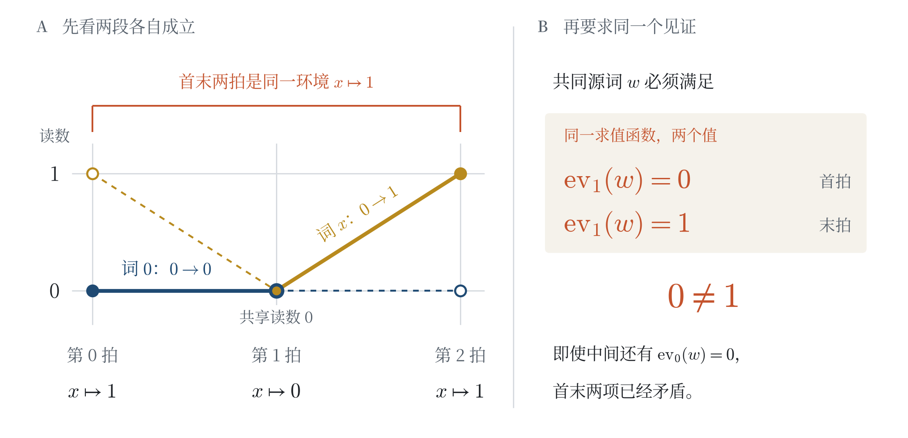
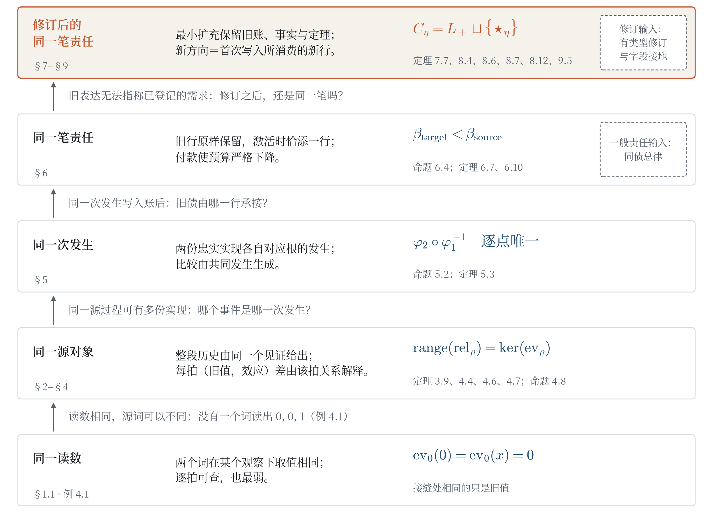
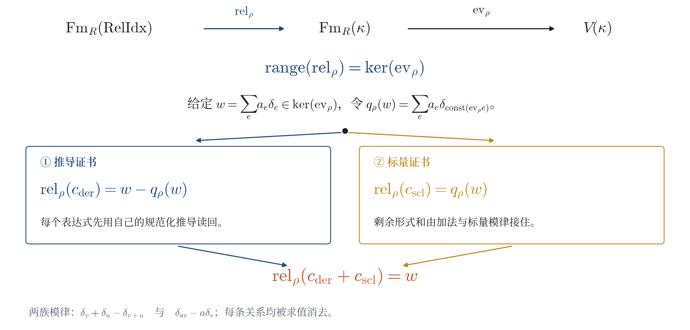
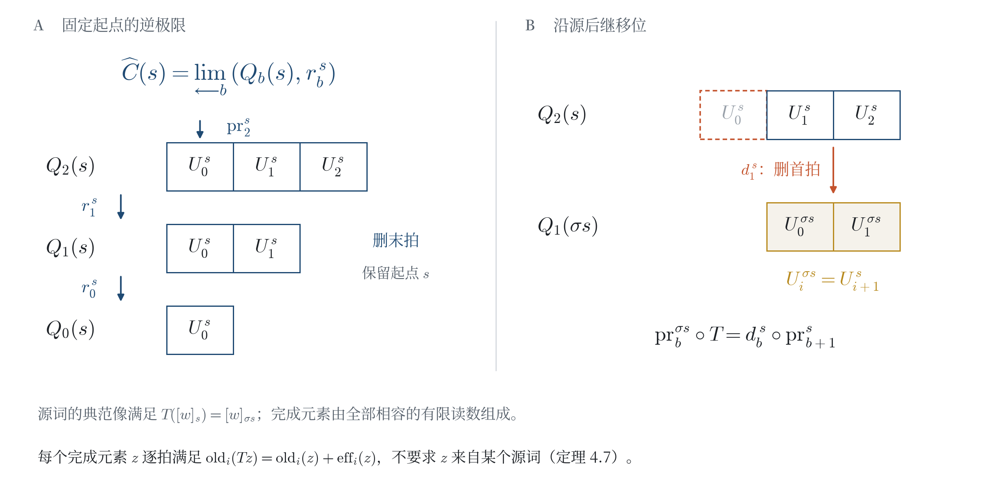
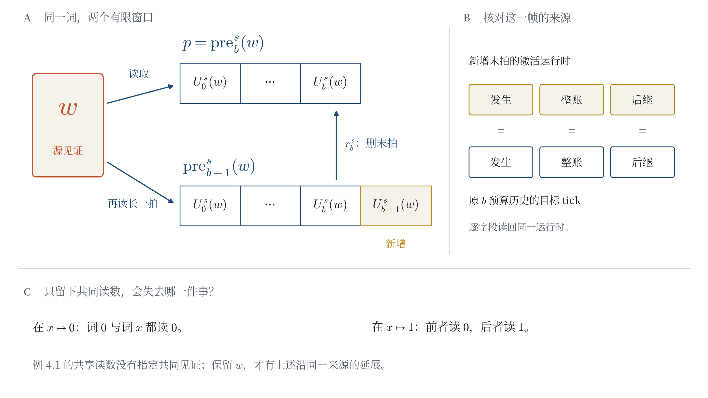
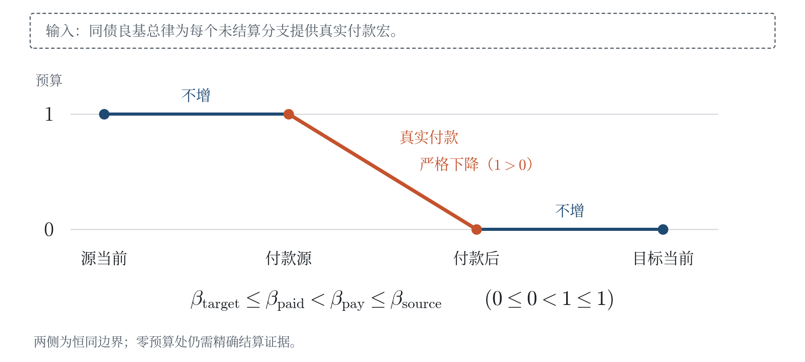
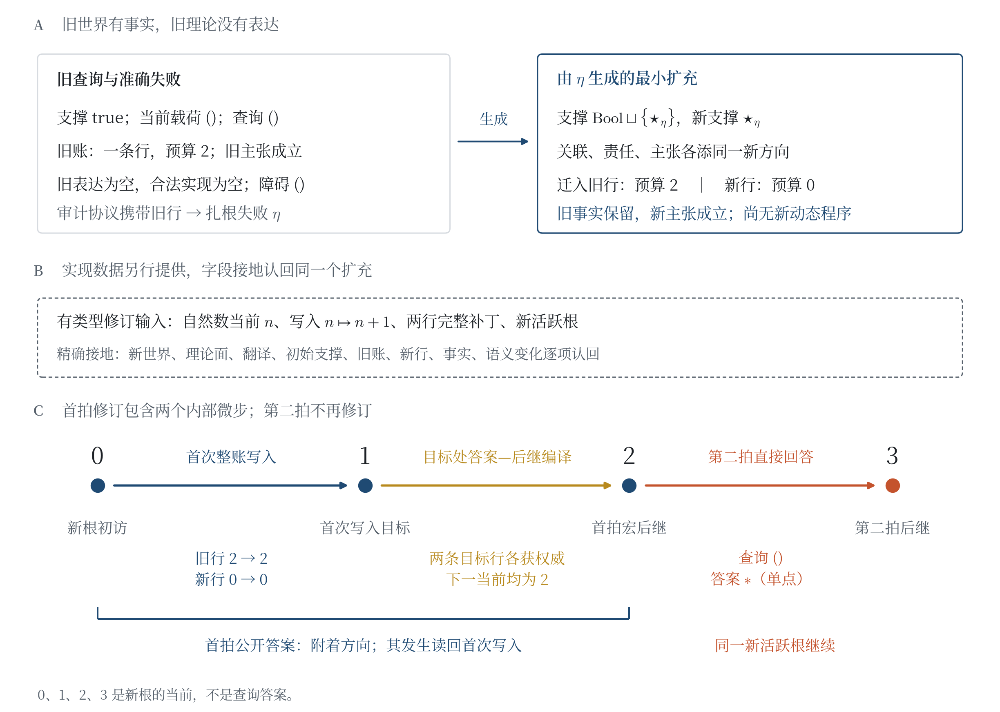
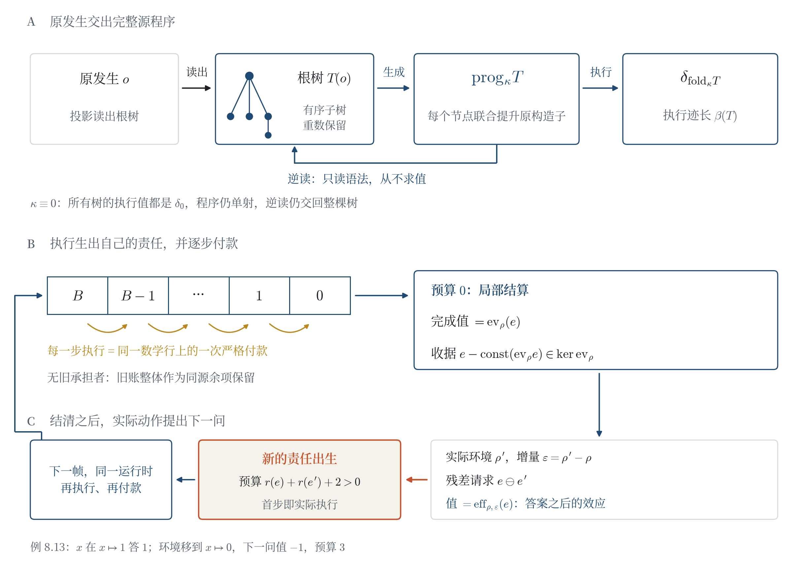

# 状态不是历史，源才是：过程同一性、责任承接与最小修订

**The State Is Not the History, the Source Is: Identity, Responsibility, and Minimal Revision in Processes**

**作者：高健（Jian Gao）**\
独立研究者 · innersummer@hotmail.com · ORCID 0009-0009-5002-1655

> *From null to source: a question itself carries the answer.*

---

## 摘要

提问给过程留下一个必须处置的需求；即使几个读数彼此吻合，答案仍须说明它属于哪一次运行。本文沿同一读数、同一源对象、同一次发生、同一笔责任的四级同一性，构造一条由源亲自走完的正向链：原发生交出完整源程序，程序被实际执行，也能被独立逆读；执行生成自己的责任行并逐步付款；结清之后，实际动作提出下一问。

第一环把读数与源分开。任意根树与任意构造子函数生成一个整树程序：执行迹的长度恰为由树语法生成的预算，只读语法的解析器从程序恢复整棵树；即使构造子恒取零、所有树的执行值都相同，程序仍单射地保存全树。在此之上，推导与模律生成的关系恰为求值核；两个源词在历史中同一，当且仅当每一拍的（旧值，效应）差都由该拍关系解释；演化等式覆盖完成载体的每个元素。换一种实现时，共同发生生成唯一比较。

第二环让责任从源中出生。原发生上登记的完整环境与表达式无需任何旧承担者，便生成一条新的数学责任行：预算是剩余的原语计算数，每一步实际执行都是严格付款，预算耗尽处到达局部结算，完成值等于原表达式的求值；已付执行迹同时是关系收据，全部旧账作为同源余项保留。对一般责任，给定覆盖每个同债当前的总律，真实付款同样生成有限结算历史与终账回执。

第三环让回答提出下一问。结清后，实际动作把已付关系放回当前的真实环境：新请求的值恰是原词在这次更新下的效应，预算严格为正，首步即一次新的责任出生；现成的询问运行时沿这些递归帧逐拍运行，无需外部的未来请求表。旧理论对一项需求既无表达也无合法实现时，扎根失败生成最小扩充：在账、关联与主张三个坐标上，每个容许扩充经唯一忠实映射接收它；任一有类型修订都把这个方向送入新根的首次写入，固定两拍实例的第二拍由同一新根直接回答。

下一问并非空手出发。同一个源程序在执行效应的同时折叠这次访问的完整时间，保留两段历史与作用差的逆判据；全部作用者的读数共同恢复全词模型；任意源程序的已付查询都在同根、同访问处生成新的责任准入，物理与低层两种类型的库存越过准入后被逐项读回；默认运行亲自执行这一源自产请求，连同旧、新两棵子树逐节点付款。问题因此不只等待答案：它的执行、结算与失败都在提出下一问。定理与构造以 Lean 4 形式化；完整书面证明见正文与补充材料，形式化范围见附录 D。

**关键词**：过程同一性；增量计算；源程序执行；语义关系核；忠实实现；责任账；最小修订；依赖类型；形式化

### Abstract (English)

A question leaves a demand for a process to discharge; even when several readings agree, an answer must still say which run it belongs to. Through four levels of identity—same reading, same source object, same occurrence, same obligation—we construct a positive chain that the source walks by itself: the original occurrence hands over a complete source program, the program is actually executed and can be read back independently, the execution gives birth to its own responsibility row and pays it step by step, and after settlement the actual action asks the next question.

The first link separates readings from sources. Any rooted tree and any constructor function generate a whole-tree program: the execution trace has exactly the budget generated by the tree’s syntax, and a syntax-only parser recovers the whole tree from the program; even when the constructor is constantly zero and every tree executes to the same value, the program still keeps the whole tree injectively. On top of this, the relations generated by derivations and module laws are exactly the evaluation kernel; two source words are the same in history iff at every tick their (old value, effect) difference is explained by that tick’s relations; and the evolution equation covers every element of the completion carrier. When implementations change, the common occurrence generates the unique comparison.

The second link lets responsibility be born from the source. A complete environment and expression registered at the original occurrence generate a new mathematical responsibility row without any prior bearer: its budget is the number of remaining primitive computations, every actual execution step is a strict payment, local settlement is reached where the budget runs out, and the completed value equals the evaluation of the original expression; the paid trace is at once a relation receipt, and the whole old ledger is kept as a same-source remainder. For general responsibilities, given a master law covering every same-debt current, genuine payments likewise generate finite settlement histories and terminal receipts.

The third link lets an answer ask the next question. After settlement, the actual action puts the paid relation back into the current actual environment: the value of the new request is exactly the effect of the original word under this update, its budget is strictly positive, and its first step is the birth of a new responsibility; the existing inquiry runtime runs through these recursive frames tick by tick, with no external table of future requests. When the old theory can neither express nor lawfully realize a demand, the rooted failure generates a minimal extension: on the ledger, incidence and claim coordinates, every admissible extension receives it through a unique faithful map; every typed revision sends this direction into the new root’s first write, and in a fixed two-tick instance the second tick is answered directly by the same new root.

The next question does not set out empty-handed. The same source program folds the complete time of this visit while it executes the effect, and keeps both histories together with an inverse criterion for the action difference; the read-outs of all actors jointly recover the all-word model; the paid query of an arbitrary source program generates a new obligation admission at the same root and visit, and physical and low-level inventories of two types cross the admission and are read back item by item; the default run itself executes this source-generated request, together with its old and next subtrees, paying node by node. A question therefore does not merely wait for an answer: its execution, its settlement and its failure all ask the next question. The theorems and constructions are formalized in Lean 4; complete written proofs are given in the text and the Supplement, and the scope of the formalization is given in Appendix D.

**Keywords**: process identity; incremental computation; source-program execution; semantic relation kernel; faithful realization; responsibility ledger; minimal revision; dependent types; formalization

---

## 1 引言

### 1.1 同一读数为什么还不够

向过程提问，就提出了一笔需求：答案是什么，它又凭什么属于这一次运行？先让最简单的候选作答——零词。

考虑一个单变量 $x$，环境依次取 $x\mapsto1$、$x\mapsto0$、$x\mapsto1$。称一个词**实现**一段更新，若它在更新前后的读数恰好等于指定的目标读数。第一段环境更新 $1\to0$，要求读数为 $0\to0$；零词 $0$ 满足要求。第二段环境更新 $0\to1$，要求读数为 $0\to1$；变量词 $x$ 满足要求。两段在共享环境 $x\mapsto0$ 处的读数也一致：都是 $0$。

两段都通过了局部检查。现在试着把它们接成读数为 $0,0,1$ 的三拍历史：是否有一个固定的**源词**（作为历史见证、在各拍反复求值的形式词），可以从头到尾给出这些读数？

没有。这样的词 $w$ 必须同时满足 $\mathrm{ev}_1(w)=0$、$\mathrm{ev}_0(w)=0$ 与 $\mathrm{ev}_1(w)=1$，而首末两个条件在同一环境 $x\mapsto1$ 下要求不同的值（图 1；例 4.1）。出错的是这样一步推论：接缝处读数一致，所以两段可以拼成同一个源词的历史。中间读数相同，只说明两个词在这一拍不可区分，不能把它们认作同一个源对象。

**图注**。图 1｜局部见证与共同源词（精确数值图；例 4.1、表 1）。环境依次为 $x\mapsto1,0,1$。深蓝零词实现第一段的 $0\to0$，金色变量词实现第二段的 $0\to1$；实线表示被采用的局部段，虚线与空心点补足该词在另一段的读数；朱红括线标出首末两拍的同一环境。共同源词必须在首末两拍的同一环境中分别读出 $0$ 与 $1$，矛盾已由这两个条件确定。

同样的缝隙也出现在关系、实现与责任中。关系 $x^2-x$ 在 $x\mapsto1$ 下求值为零，更新到 $x\mapsto2$ 后却变成 $2$：当前成立的关系未必在下一拍继续成立。两份实现可以给出相同的观察序列，却不告诉我们哪个事件是哪一次发生。一笔未完成的义务经过账目更新或表达修订之后，还要回答：由哪一行承接，预算的变化又由哪一次处置支持？

本文把这些现象排成四级同一性，每一级都比前一级多保留一样东西：

- **同一读数**：两个对象在某个观察下取值相同。它可以逐拍检查，也最弱。
- **同一源对象**：整段历史由同一个见证给出。§2–§4 构造这一级：读数进入自由载体，变化成为逐项可查的效应，历史成为相容前缀的完成载体。
- **同一次发生**：事件连同其来源、写回与后继属于同一次运行。§5 在两份实现之间构造这一级，比较映射由共同发生唯一确定。
- **同一笔责任**：须按规则处置的未完成事项称为**责任**，由账行登记其主张与预算。这一级要求责任在账目更新后仍由确定的行承接；§6 构造它，并给出结算有限的条件。

四级之间还贯穿一条由源亲自走完的正向链：原发生交出完整源程序，程序被实际执行，又能被独立逆读（§3.4）；执行生成自己的责任行并逐步付款（§6.5）；结清之后，实际动作提出下一问（§8.5）。链的第一环给开场一个反向的回声：三拍反例里读数相同而源词不同；§3.4 中构造子恒取零，所有树的执行值完全一样，整树程序却仍被逆读回原树。读数可以忘掉一切，源不会。链的末端同样不只交出一个数：§9 证明，下一问连同这次访问的完整时间、全部作用者与两种类型的库存一起，由同一源程序带入并被默认运行执行。

最后一级把问题带到更深的空缺：旧理论连这笔需求的表达都没有。零词让 null 第一次进入开场；到这里，null 取得精确含义——**双空失败**，即指定旧理论对这项需求的表达证词与合法实现两个类型均为空。§7 从依赖结构中选中的残差——对齐后仍不匹配的部分——取得这种失败，§8 把失败连同本次发生、旧行与后继登记为**扎根失败**。于是空缺有了自己的地址：以它为索引生成的新方向，进入一份**有类型修订**所提供的新根；这个合同同时给出新运行及其承接旧问题的相容证明。根是固定发射与编译的运行登记。首拍公开这个附着方向，第二拍新根直接回答。开场追问“同一个见证在哪里”，结尾追问两件事：这一次回答怎样提出下一问，这一次失败怎样成为新回答的来源。

### 1.2 主要结果

图 2 把四组结果排在同一张阶梯上，图 6 把贯穿其中的正向链单独画出；精确陈述见各节。这里的**源过程**给出状态、初始位置和一拍生成后继，并把每个状态登记为一个完整活跃当前——同一根与访问的完整登记（定义 2.1）。

**图注**。图 2｜四级同一性（结构示意图）。自下而上，每一级都比前一级多保留一样东西：同一读数只比较取值；同一源对象要求整段历史由同一见证给出，任意根树的程序可执行也可逆读（§2–§4，定理 3.9、4.4、4.6–4.7）；同一次发生由两份忠实实现与共同发生的对应确定（§5，定理 5.3）；同一笔责任由整账更新中承接旧行的确定行给出，源程序自生的责任逐步付款（§6，命题 6.4、定理 6.7、6.10）；表达结构修订后，最小扩充把新方向送到首次写入所消费的新行，旧行照旧承接，结清的回答提出下一问，并带走完整时间、全部作用者与两种库存（§7–§9，定理 7.7、8.4、8.6–8.7、8.12、9.2–9.8）。级间文字是使下一级成为必要的具体情形；一般责任的同债总律与有类型修订以虚线框标为输入。朱红一级是全文的回答所在。

**A（同一源对象，§2–§4）**。任意原生状态集 $S$ 与任意函数 $f:X\to Y\to Z$ 经自由载体进入多排序表达式语言，状态无须具有加法（命题 2.3、2.5）。更新等式把变化写成逐节点生成的效应；保序保重数的混合项清单合计恰为效应；推导作为可重放的对象存在（命题 3.3、3.5、3.6）。在此之上：

- 任意根树与任意构造子函数生成整树程序：执行值是折叠结果的状态点，执行迹长度恰为由树语法生成的预算，只读语法的解析器从程序交回整棵树；构造子恒取零、所有树读数相同时，程序仍单射（定理 3.9）；
- 对任意交换环与任意环境，推导与模律生成的关系映射，其像恰为求值核（定理 4.4）；
- 两个源词在历史完成载体中同像，当且仅当每一拍的（旧值，效应）差都由该拍生成的关系解释（定理 4.6）；
- 完成载体的**每个**元素——不限于源词的像——在每个有限阶段满足精确演化等式（定理 4.7）。

开场的三拍反例由此得到解释：接缝处相同的只是旧值；带着共同源词的前缀，才能沿生成后继继续延展（命题 4.8）。

**B（同一次发生，§5）**。忠实实现要求：每个当前处世界发生与实现事件双向对应，规范发生送到发射事件，编译结果落在该发生的合法演化族中（定义 5.1）。在这一合同下，同一根的任意两份忠实实现之间，共同发生生成与发射器及整个编译器相容的事件对应；**任何**候选事件映射——不附加任何相容条件——都逐点等于它（定理 5.3）。每个事件都恢复规范发生、全部已安装投影与生成后继（命题 5.2）。物理总构造直接调用这一级结果（§10.1）。

**C（同一笔责任，§6）**。源事件生成的整账更新，未激活时恰为旧账；激活时恰添一条由激活律确定的债行，旧主张与预算原样保留（命题 6.4）。若同债总律为每个同债当前提供精确结算或含真实付款的有限续行，则每个同债当前都生成有限结算历史、准确终点处的精确结算与被跟踪行的终账回执（定理 6.7）。计算责任不需要这条输入：原发生上的完整环境—表达式对无需旧承担者，直接生成执行债律（定义 6.9）及其新责任行；第 $k$ 个因果访问处预算为 $B-k$，$k<B$ 时源选中的执行步是真实付款，$k=B$ 处局部结算且完成值等于原求值；已付迹给出关系收据，全部旧账作为同源余项保留（定理 6.10）。整树程序装入实际询问后，值、出处与代价在同一回答中读出（命题 6.11）。

**D（修订后的同一笔责任，§7–§8）**。依赖树残差给出旧理论的准确表达失败，因果审计把它绑定到根的这一次发生（命题 7.4、7.5）。这样扎根的失败生成最小扩充：旧账、事实、处置与定理保留，新方向在账、关联与主张三个坐标上都没有旧原像；每个容许扩充经唯一忠实态射接收它（定理 8.4）。对任一有类型修订，这一唯一映射把新方向送到修订首次写入所消费的那条新行（定理 8.6）；在**字段接地**条件下——逐字段认回最小扩充，或提供更丰富的忠实重构——旧、新两行在写入目标各自取得新根的答案与后继（定理 8.7）。命题 8.9 的固定实例让新根在第二拍直接回答。依赖步的两类对齐分支还交出完整构造子树，由同一执行债律计费（命题 7.6）；根在该访问登记的原询问输入把它接入共享运行，原编译器的后继再为下一访问供料（定理 7.7）。结清之后，实际动作生成残差请求：其值是已付关系在真实更新下的效应，预算严格为正，首步是新的责任出生；递归帧构成现成询问运行时的全部节点，付款与出生各自保留身份（定理 8.12）。这是命题 8.10 一次性接口障碍的正向对应；例 8.13 用表 1 的三个词把下一问算出来。

**E（完整执行，§9）**。下一问携带的是这一次运行的全部材料。同一程序在折叠效应的同时折叠时间码的收据树；源、目标两段历史生成准确零纤维的共同历史；作用差有像残差与观察残差两枚读数，二者同时为零恰是源纤维可提升的判据（定理 9.2）。全部作用者——配对树的每个位置，重复也分别计入——的读数商出全词模型；有序效应历史把每一步残差运送到末尾，中间的非零项不因末值相消而删去；粗读口与全部未来读口在模型上单射（定理 9.3）。对任意源程序，已付查询生成同根、同访问的责任准入、整账首写与字面后继，新生帧继续运行（定理 9.5）；物理与低层两种库存经绑定保值地越过准入，被逐项读回（定理 9.6）；操作词与完整状态的配对是协变的，迭代代换就是时间推进，每个前缀的费用精确记账（定理 9.7）。默认运行执行这一源自产请求，旧、新两棵子树进入同一主表达式逐节点付款（定理 9.8）。

**构造的类型**。自由模与张量积的泛性质、结构归纳、逆极限、良基递归和不交和提供构造工具。本文让这些工具交付彼此接用的对象：整树程序同时是执行的对象与逆读的来源，执行迹的每一步既是付款又是关系证书，已付关系在新环境中的效应成为下一问；推导的端点差成为关系证书，共同源词成为历史延展的见证，失败的附着方向成为首次写入所消费的新行。忠实实现、同债总律与有类型修订则规定每个连接需要保留什么；合同给齐，同一性便成为被迫成立的结论。§10.1 的领域应用实际使用这些输出。

### 1.3 与最相关工作的差别

**增量计算**。DBSP [1] 在交换群上的流中定义增量视图维护：其 Z-集 $\mathbb Z[A]$ 与本文的自由载体是同一对象，命题 3.3 的双线性节点也是其三项公式（其定理 3.4）的结构归纳形式；DBSP 的结果同样在 Lean 中形式化。本文继续追问这些正确读数是否属于同一运行，因而保留推导对象、完整关系核与带源见证的历史（§10.2）。Cai 等 [2] 为 $\lambda$-演算定义变化结构并证明合法变化上的更新等式；这里任意原生状态先作自由提升，增量结构由提升后的载体承担。

**来源与代数求值**。Green、Karvounarakis 与 Tannen 的来源半环 [3] 先用来源多项式记录输入元组的组合方式，再经半环同态求值（§10.2 详述）。本文共享“先保留来源、再作求值”的想法；所保留的还包括贯穿历史的同一见证、固定访问的发生、整份合法演化及其账行。

**实现与精化**。TLA [4] 以带撇与不带撇的变量组织动作与时序性质。Abadi 与 Lamport [5] 用状态空间之间的精化映射证明低层规格实现高层规格，并表明映射可能要在低层规格中加入辅助变量（历史变量与预言变量）之后才存在。这与本文的出发点相合：只看状态，不足以承载两层之间的对应。§5 的比较方式不同：两份实现不直接互相映射，而是各自与同一根的发生建立忠实对应，比较映射由此生成且唯一。

**事件与因果**。事件结构 [6] 以事件及其因果与一致性关系刻画计算。本文的根在每次访问恰有一个发生，事件之间没有可供选择的分支；我们在这样确定性的单根过程上，把整账处置和表达修订绑定到同一次发生。

**理论修订**。AGM 理论 [7] 研究在给定语言中收缩或修订一个理论：部分交收缩取不蕴含待删命题的若干极大子集之交，并以一组公设刻画。§8 处理另一种修订：需求在旧理论中既无表达也无合法实现，于是扩充表达结构本身；“最小”是容许扩充中的初始性，不是对极大子集的选择。

**资源推理**。分离逻辑 [8] 用分离合取刻画堆的资源局部性。§6 的责任三律刻画义务沿生命周期边的生灭与承接；有限结算另需总律与真实付款。

### 1.4 范围与阅读路线

**范围**。本文的过程是确定性的单根过程：固定根在每次访问恰有一个发生，合法演化至多一个（§5）；并发与非确定性不在本文范围。以下几项是输入而非结论，各在相应位置写明：同债总律（定理 6.7 证明“总律 $\Rightarrow$ 有限结算”）；有类型修订及其字段接地（定理 8.6–8.7）；修订后的新根作为源过程的登记——新根一旦按定义 2.1 登记，§2–§4 的结论即可复用，但这一登记未单独形式化（§8.4 末）。正向链（§3.4、§6.5、§7.3 末、§8.5）与 §9 的完整执行不需要这些输入：付款由执行生成，下一问由实际动作生成，它们的形式化固定于各自的后续源版本（附录 D.2）。语义纤维的刻画不是判定程序（命题 3.6）；以非构造方式定义的总分类也不自动给出判定程序或复杂度结论（命题 7.1）。

全文区分两类对象：由源或编译器**生成**的，与由调用方**提供**的。前者带着它来自哪一次发生的证据，后者作为定理的前提出现。下文说“生成行”“真实付款”时，指的都是前者。

**阅读路线**。§2–§4 沿阶梯从状态走到完成载体，§3.4 给出整树程序，§4 回收三拍反例；§5 处理发生；§6 处理责任，§6.5 让责任由源程序出生并付款；§7–§8 处理表达修订，§8.4 给出两拍实例，§8.5 让回答提出下一问；§9 让下一问带走完整时间、全部作用者与两种库存，并由默认运行执行。§10 汇总领域应用与相关工作的细节，§11 收束。图 3–4 展开完成载体与见证延展，图 5 展开两拍修订，图 6 展开正向链；表 1–5 依次给出反例读数、固定付款、预算三段、两拍轨迹与四级汇总。证明思路随命题给出；§6.5、§7.3 末、§8.5 与 §9 各结果的完整书面证明见补充材料 S1–S5，形式化声明见附录 D，术语速查见附录 E。

---

## 2 源过程与自由载体：状态不必有加法

要让答案属于这一次运行，先给它一个能同时保留对象、发生与后继的源。原生状态可以是数据库、棋局或物理构型；本节先把它登记为一次运行中的当前，再把它放入容许逐项计算的自由载体。

**最小记录定义（世界、根、访问与发生）**。一个**世界关系网络** $N$ 是下列前三行所列的载体与依赖族记录；一个**根**是在 $N$ 上固定词汇、原生当前、发射器与整账编译器的运行登记。**访问** $v$ 是根的一次带历史的时间访问，**发生**是该访问规范发射的依赖对象。记 $c$ 为根处的当前，$s(c)$ 为它的支撑；后三行写出从根登记取得的发生与演化字段。支撑是责任和事实共同挂靠的位置；锚标记来源，关联标记连接，谱系标记承接身份。

<!-- definition-fields:begin -->
| 字段归属 | 本文使用的载体或依赖族 | 字段的职责 |
| --- | --- | --- |
| $N$：支撑与位置 | $\mathrm{Sup}$；锚、关联、谱系及其支撑读出 | 指明发生在哪里，哪些来源与承接身份被保留 |
| $N$：责任与主张 | $\mathrm{Responsibility},\mathrm{Claim}$；$\mathrm{OpenAt}(s,r),\mathrm{HoldsAt}(s,a)$；开行的主张与自然数预算 | 开启见证使责任成为账行；事实见证使主张在该支撑成立 |
| $N$：障碍与处置 | $\mathrm{Obs}(s)$ 及障碍主张；语义变化族；$\mathrm{Disposition}(s,k)$ | 登记遇到什么障碍，以及整支撑结算、转移或法则面扩充三种处置的证据 |
| 根：规范发生 | $\mathrm{Occ}_W(c)$，$g_c\in\mathrm{Occ}_W(c)$ | 把本次访问固定为其规范发射的发生 |
| 根：合法演化 | $\mathrm{Evol}_W(c)$，$\mathrm{Lawful}_c(g,e)$ | 在候选整份演化中，指认属于发生 $g$ 的合法结果 $e$ |
| 根：编译器 | $\mathrm{comp}_c:\mathrm{Occ}_W(c)\to\mathrm{Evol}_W(c)$ | 从发生生成整账写回与下一当前，供后续访问接用 |
<!-- definition-fields:end -->

这里 $\mathrm{OpenAt}$、$\mathrm{HoldsAt}$ 与处置均为携带见证的类型族。根登记产生的**因果世界** $W$ 还固定两条律：每个 $g\in\mathrm{Occ}_W(c)$ 都等于 $g_c$；编译器为每个发生选出合法演化，任何同发生的合法结果都等于它。前者确定发生，后者确定整份演化；§5 的两份实现共用这两条律。完整形式记录的源码定位见附录 D。

固定实例把这组字段压缩得很小：旧根的当前载荷始终是 $()$，时间访问却逐拍推进。只看载荷，每一拍都一样；连同根和访问读取，每一拍各有自己的发生。§8 将在这个世界里提出一个旧理论无法表达的问题。

### 2.1 源过程

$N$ 上的一个**活跃当前**是由词汇、完整活跃根及该根的一次时间访问组成的依赖记录 $c$；发生与一拍后继由这份登记读出。相等比较的是整份记录，§5 的实现比较和 §8 的修订辨认都以此为准。**擦除**把活跃根映到其权威根——固定发生与编译的登记——并保留词汇与同一访问；被略去的仅是活跃根额外携带的发射前继续法则。**终账**是根编译给出的整账终结处置（§6）。

**定义 2.1（源过程）**。$N$ 上的一个**源过程** $\mathcal{P}=(S,\iota,s_0,\sigma)$ 由以下数据组成：

- 状态载体 $S$，任意类型，不假设任何代数结构；
- 单射 $\iota:S\hookrightarrow\mathrm{Cur}(N)$，把每个状态登记为一个活跃当前；
- 初始状态 $s_0\in S$；
- 一拍生成后继 $\sigma:S\to S$：$\iota(\sigma(s))$ 的擦除等于 $\iota(s)$ 的根在 $\iota(s)$ 的访问处生成的下一当前，并且在非终账分支上根本身不变。

后继 $\sigma$ 连同其生成证据一起给定，它必须接续当前登记中的那次发生。

**命题 2.2（固定过程后继的确定性）**。设 $\mathcal{P}$ 是源过程。

1. $\iota(\sigma(s))$ 的擦除等于 $\iota(s)$ 的根的生成下一当前；
2. $\iota(\sigma(s))$ 的根法则面（根登记中指明所循理论法则的字段）等于 $\iota(s)$ 的根法则面；
3. 若 $\iota(s_1)=\iota(s_2)$，则 $\iota(\sigma(s_1))=\iota(\sigma(s_2))$；
4. 对任意观察预算 $n$ 递归生成 $n$ 拍历史；耗尽预算只停止观察，不产生终账处置。

证明。（1）（3）是定义 2.1 的直接展开，（3）中 $\iota$ 单射给出 $s_1=s_2$；（2）由（1）对法则面取像，并用根登记自带的性质：生成下一当前保持法则面；（4）对 $n$ 递归。∎

（2）说明固定法则的过程不能在局部终账或载体移交里藏进一次理论修订，修订属于 §8 的独立构造。（3）说明后继的任何差异都已反映在被登记的当前中：不改变完整当前的参数（词汇、法则面等）不能悄悄分叉下一个世界。

### 2.2 自由载体：把观察变成线性映射

给每个原生对象保留一个独立位置，答案的读出才有一个不会混掉来源的起点。

对每个状态 $s$ 保留一个独立基点，再允许这些基点作有限整系数组合，便得到自由模 $\mathbb{Z}[S]:=S\to_0\mathbb{Z}$。记**状态点**为 $\delta_s:=1\cdot s$。它像一张以状态为标签的格子表：$\delta_s$ 只在第 $s$ 格记 $1$，一般元素只在有限多个格子上记有非零整数，整数可以为负。

状态点映射 $\delta$ 单射，不同状态仍然不同。原生后继逐格推进，得到线性映射 $A:\mathbb{Z}[S]\to\mathbb{Z}[S]$，满足 $A\,\delta_s=\delta_{\sigma(s)}$。在运行时中，状态点还与它所登记的发生、写回和后继一起读回（附录 A.1）。

这种表示给任意加法交换群值的观察留出确定的位置：先规定每个状态点的读数，再按线性组合延拓。

**命题 2.3（任意观察的唯一自由延拓）**。设 $B$ 是任意加法交换群，$\mathrm{read}:S\to B$ 是任意原生观察。则存在唯一线性映射 $\widehat{\mathrm{read}}:\mathbb{Z}[S]\to B$ 使 $\widehat{\mathrm{read}}(\delta_s)=\mathrm{read}(s)$；并且它与源作用对易：
$$\widehat{\mathrm{read}}\circ A=\widehat{\mathrm{read}\circ\sigma}.$$

证明。这是自由模的泛性质。唯一性：两个在全部基点上取值相同的线性映射逐点相同（对有限支撑归纳）；存在性：取线性组合延拓。对易式两边都在基点上取 $\mathrm{read}(\sigma(s))$，由唯一性得等式。∎

例如，$a\delta_s+b\delta_t$ 的读数只能是 $a\,\mathrm{read}(s)+b\,\mathrm{read}(t)$。对易式也可直接在基点上看见：先把 $\delta_s$ 推进为 $\delta_{\sigma(s)}$ 再读取，与先在状态上组成观察 $\mathrm{read}\circ\sigma$ 再自由延拓，结果相同；这不要求在值域 $B$ 上另给一个自治后继。

### 2.3 任意二元原生函数的联合提升

问题同时使用两个输入时，两个输入怎样配对也必须保留。

还需表示同时作用于两个输入的运算，例如乘法、配对或路径组合。给定任意类型 $X,Y,Z$ 及函数 $f:X\to Y\to Z$，分别取它们的自由载体。

**定义 2.4（联合提升）**。**联合映射** $\mathrm{joint}:\mathbb{Z}[X]\to\mathbb{Z}[Y]\to\mathbb{Z}[X\times Y]$ 是唯一的双线性映射使 $\mathrm{joint}(\delta_x,\delta_y)=\delta_{(x,y)}$；**前推** $\mathrm{push}_f:\mathbb{Z}[X\times Y]\to\mathbb{Z}[Z]$ 是 $\mathrm{curry}^{-1}(f)$ 的自由前推；**提升** $\mathrm{lift}(f):=\mathrm{push}_f\circ\mathrm{joint}$。

这是张量积泛性质 [9] 的应用。$\mathrm{joint}$ 将左右库存独立配对，展开为所有左右项的矩形组合；已有配对关系的库存，应直接作为 $\mathbb{Z}[X\times Y]$ 中的元素送入 $\mathrm{push}_f$。例如取 $x\ne x'$、$y\ne y'$，相关库存 $\delta_{(x,y)}+\delta_{(x',y')}$ 只保留两组配对，不能写成某个 $\mathrm{joint}(u,v)$；独立配对若同时给这两个位置非零系数，也会在交叉位置 $(x,y')$ 与 $(x',y)$ 产生非零项。§7 的依赖树使用的正是已有的相关联合材料。

**命题 2.5（基点读回与完整增量展开）**。取三元排序 $\{\text{左},\text{右},\text{结果}\}$，值载体为三个自由载体，环境 $\rho^{\delta}$ 把每个变量送到自身状态点，原生表达式 $e_{f,x,y}:=\mathrm{bilinear}(\mathrm{lift}(f))(\mathrm{var}\,x)(\mathrm{var}\,y)$（表达式与求值在定义 3.1 正式给出）。则：

1. $\mathrm{ev}_{\rho^{\delta}}(e_{f,x,y})=\delta_{f(x,y)}$，且 $\mathrm{lift}(f)(\delta_x,\delta_y)=\delta_{f(x,y)}$；
2. 对任意增量环境 $\varepsilon$：
$$\mathrm{ev}_{\rho^{\delta}+\varepsilon}(e_{f,x,y})=\delta_{f(x,y)}+\mathrm{lift}(f)(\delta_x,\varepsilon_y)+\mathrm{lift}(f)(\varepsilon_x,\delta_y)+\mathrm{lift}(f)(\varepsilon_x,\varepsilon_y).$$

证明。（1）是两个因子映射在基点上的定义式复合。（2）由命题 3.3 的一般更新等式作用于该表达式得出，三个作用项正是其双线性节点保留的三项。∎

命题 2.5(2) 对查表、字符串拼接等原生二元函数同样成立：三项分别对应只改变右输入、只改变左输入与两个输入同时改变。展开来自自由载体上的双线性提升，对 $f$ 没有可微性或加性要求。表达式 $e_{f,x,y}$ 还带有到自身常值的规范化推导（命题 3.6），供后续构造重放。

### 2.4 见证取自运行时

读数所指的见证，应由这一拍的运行交出。

语言中的状态读数还需要运行时见证。一拍转移连同其发生、账与下一当前的完整登记，称为一个 **tick**。取单排序语言，值载体为 $\mathbb{Z}[S]$；加性环境投影 $\pi:M\to\mathrm{Env}$ 把材料读数送入语言环境（一般设置见 §4.3）。源词 $\mathrm{var}$ 与作用词 $\mathrm{linear}(A)(\mathrm{var})$ 在任意有限阶段分别读为
$$(\delta_{s_i},\ \delta_{s_{i+1}}-\delta_{s_i})\quad\text{与}\quad(\delta_{s_{i+1}},\ \delta_{s_{i+2}}-\delta_{s_{i+1}}),\qquad s_k:=\sigma^k(s_0),$$
每一对都包含旧值与增量。

作用词旧分量的状态点，由下一运行时 $\sigma^{i+1}(s_0)$ 的 tick 直接见证；这一运行时正是该阶段历史的目标拍。任意类型 $B$ 上的原生读出 $\mathrm{readout}:S\to B$（$B$ 无须加法）也从同一运行时读取。两者都用 $\Sigma$-类型携带“状态点等于读数旧分量”与“单点等于自由观察像”的证明。

这就是**实际见证原则**：所需的状态点与原生读出从生成的运行时取得，并连同它们与语言读数相等的证明一起携带，不从读数反解状态。§4 据此延展历史，§8 据此辨认修订后的后继。

---

## 3 效应、混合项与推导：更新等式成为可用的对象

答案随过程怎样改变，必须由这一次更新本身交代。本节把变化定义为沿表达式结构生成的**效应**，即更新后的值与旧值之差；双线性节点使用增量视图维护的三项公式 [1]。我们继续保留效应的逐项清单与可重放推导，让下一节能问：两个答案相等，究竟由哪些关系作证？最后，推导被写成逐步计费的执行，任意根树由此生成可执行、可逆读的整树程序（§3.4）。

### 3.1 异构表达式与效应

先让表达式说清它使用哪些原生对象与运算，效应才有可逐节点追踪的来源。

**定义 3.1（表达式与求值）**。设 $\mathcal K$ 是排序集，每个排序 $\kappa$ 有加法交换群 $V(\kappa)$（值载体）与变量集 $\mathrm{Var}(\kappa)$。**表达式** $e\in\mathrm{Expr}(\kappa)$ 由语法
$$e::=\mathrm{var}\,x\mid\mathrm{const}\,c\mid e_1+e_2\mid \mathrm{linear}_h(e)\mid \mathrm{bilinear}_\mu(e_1,e_2)$$
生成，其中 $h:V(\kappa)\to V(\kappa')$ 为加法同态，$\mu:V(\kappa)\to V(\kappa')\to V(\kappa'')$ 为双加性映射。环境 $\rho$ 给每个排序的每个变量一个值；求值 $\mathrm{ev}_\rho(e)$ 如常。语言保留全部中间排序与源操作，语法上不预先施加任何商或规范化。

**定义 3.2（效应）**。效应由旧环境与增量环境的对 $(\rho,\varepsilon)$ 递归生成：变量取增量 $\varepsilon$；常量取 $0$；加法与线性同态按结构递归；双线性节点保留全部三类作用项：
$$\mathrm{bilinear}_\mu(e_1,e_2)\mapsto \mu(\mathrm{ev}_\rho e_1,\mathrm{eff}_{\rho,\varepsilon}e_2)+\mu(\mathrm{eff}_{\rho,\varepsilon}e_1,\mathrm{ev}_\rho e_2)+\mu(\mathrm{eff}_{\rho,\varepsilon}e_1,\mathrm{eff}_{\rho,\varepsilon}e_2).$$

**命题 3.3（更新等式）**。对任意表达式 $e$ 与环境 $\rho,\varepsilon$：
$$\mathrm{ev}_{\rho+\varepsilon}(e)=\mathrm{ev}_\rho(e)+\mathrm{eff}_{\rho,\varepsilon}(e).$$

证明。展开有四项，要对任意双线性节点成立，一项也不能省。对 $e$ 结构归纳。变量、常量由定义得到；加法用群公理，线性节点用加性。双线性节点完整展开：$\mu(a{+}da,a'{+}da')=\mu(a,a')+\mu(a,da')+\mu(da,a')+\mu(da,da')$。其单点特例即命题 2.5(2)。∎

三项分别对应只改变右输入、只改变左输入与两个输入同时改变；省去任一项，等式就不能对任意双线性节点成立。在关系连接上，这正是增量视图维护的三项公式 [1]。归纳还给出两条组合性质，§4 逐拍使用：零增量的效应为零；连续两次更新满足 $\mathrm{eff}_{\rho,\varepsilon_1+\varepsilon_2}=\mathrm{eff}_{\rho,\varepsilon_1}+\mathrm{eff}_{\rho+\varepsilon_1,\varepsilon_2}$，其中第二次效应以更新后的环境为基点，记录的是实际发生的第二段变化。

### 3.2 有序混合项：逐项可查的收据

效应给出总变化；要追踪每一项从哪里来，还需要保留生成它的清单。

**定义 3.4（有序混合项）**。给每个变量标上“旧/增量”部位，得混合环境 $\rho\oplus\varepsilon$。表达式 $e$ 的**混合项列表** $\mathrm{mix}(e)$ 递归生成：变量给出其增量部位词；常量给空表；加法拼接；线性映射逐项施加；双线性节点给出三段——右增量段（旧左元配上每个右增量项）、左增量段，以及两列表的完全有序笛卡尔积（每个左增量项与每个右增量项联合出现）。

**命题 3.5（混合项完备性）**。对任意 $e,\rho,\varepsilon$：
$$\sum_{t\in\mathrm{mix}(e)}\mathrm{ev}_{\rho\oplus\varepsilon}(t)=\mathrm{eff}_{\rho,\varepsilon}(e).$$
列表保持源顺序与重数：同一子项出现两次就贡献两次，双线性节点不折叠、不交换左右序。

证明。难在双线性节点：三段增量各自求和，必须恰好拼回效应。对 $e$ 结构归纳。前四类节点直接；双线性节点分三段验证：右增量段的求和由双加性提出为 $\mu(\mathrm{ev}\,e_1,\sum\mathrm{mix}(e_2))$，左增量段同理，笛卡尔积段的求和经“逐项配对再求和”的交换（对左列表归纳）等于 $\mu(\sum\mathrm{mix}(e_1),\sum\mathrm{mix}(e_2))$。三段相加恰是效应的定义。∎

命题 3.5 给出一张可逐项核对的收据：每项来自一个确定的语法位置，出现两次就计算两次，合计恰为效应。

### 3.3 Type 中的推导：重放，而非判定

效应记录变化，推导保留等式成立的路径。推导像一卷可以重放的录像带，而不是只宣布结论的判决书：它记录从 $e$ 走到 $e'$ 的每一步，可以倒放，也可以接进更长的录像。固定环境 $\rho$，**推导** $d:e\vdash_\rho e'$ 是 $\mathrm{Type}$ 中的归纳对象，包含自反、对称、传递，变量绑定（$\mathrm{var}\,x\vdash\mathrm{const}(\rho\,x)$），三条常值计算规则（常量加法、线性常值、双线性常值），以及与语法节点对应的三条同余规则。每一步都保留源绑定与源操作；推导既然在 $\mathrm{Type}$ 中，后续构造就能取用这些步骤作替换与组装。

**命题 3.6（规范化与语义纤维刻画）**。

1. **可靠性**：若 $d:e\vdash_\rho e'$，则 $\mathrm{ev}_\rho(e)=\mathrm{ev}_\rho(e')$。
2. **规范化生成**：每个 $e$ 递归生成 $\mathrm{norm}_\rho(e):e\vdash_\rho\mathrm{const}(\mathrm{ev}_\rho(e))$，构造时不以任何语义等式或规范化器为输入。
3. **语义纤维刻画**：$e\vdash_\rho e'$ 非空当且仅当 $\mathrm{ev}_\rho(e)=\mathrm{ev}_\rho(e')$。

证明。推导可靠、可由规范化生成，并刻画语义纤维；三款依次证明。（1）对 $d$ 归纳，每条常值规则都是定义式计算。（2）递归：变量用绑定；复合节点先用同余规则归约子表达式，再用对应的常值规则。（3）“仅当”是（1）；“当”由（2）经传递与 transport 拼合：$\mathrm{norm}_\rho(e)$ 接求值相等的 transport，再接 $(\mathrm{norm}_\rho(e'))^{-1}$。∎

（3）刻画语义纤维：给定相等证据，就能连接两条规范化路径；它不是判定语义相等的程序。§4 直接用推导的端点差生成关系核，不需要先解决判定问题。

### 3.4 整树程序：执行、计费与逆读

推导证明等式；执行则把这份证明按原语计算一步步付出。本小节先把命题 3.6 的规范化写成计步的执行迹，再让任意根树生成自己的程序。结果给出读数与源之间最极端的分离：求值可以把所有树读成同一个值，程序仍保存并交回整棵树。

**剩余计数与执行迹**。表达式的**剩余计数** $r(e)$ 统计尚待执行的原语计算：
$$r(\mathrm{var}\,x)=1,\qquad r(\mathrm{const}\,c)=0,\qquad r(e_1+e_2)=r(e_1)+r(e_2)+1,$$
$$r(\mathrm{linear}_h e)=r(e)+1,\qquad r(\mathrm{bilinear}_\mu(e_1,e_2))=r(e_1)+r(e_2)+1.$$
**执行步**是四种原语计算之一——把变量 $\mathrm{var}\,x$ 绑定为 $\mathrm{const}(\rho\,x)$，以及常量的加法、线性作用与双线性作用——并可经同余规则位于任意语法位置之内。有限个执行步首尾相接，称为**执行迹**。

**命题 3.7（执行迹）**。对任意环境 $\rho$ 与表达式 $e$：

1. 每个执行步恰使剩余计数减 $1$；常量没有执行步，执行步关系良基；
2. 存在从左到右访问语法的执行迹 $\mathrm{exec}_\rho(e):e\to\mathrm{const}(\mathrm{ev}_\rho e)$，其长度为 $r(e)$；
3. 每条执行迹都是 §3.3 意义上的推导，因而 $\mathrm{exec}_\rho(e)$ 是命题 3.6(2) 规范化的一个逐步计费的实现。

证明。计数恰好每步减一，执行才能被当作付款。（1）对执行步归纳：每种原语计算消去一个计数单位，同余位置不改变其余部分的计数；严格下降给出良基。（2）对 $e$ 结构递归：先执行左子式，再执行右子式，最后执行该节点自己的原语计算；长度由（1）逐项累计。（3）每个执行步都是一条常值规则或其同余，迹的连接是推导的传递。∎

执行迹的端点差 $e-\mathrm{const}(\mathrm{ev}_\rho e)$ 正是定理 4.4 证明中规范化给出的第一份证书；§4.2 把它读成关系核中的元素，§6.5 把迹的每一步读成一次付款。

**定义 3.8（根树与整树程序）**。**根树**由归纳语法
$$T::=\mathrm{occ}(a;\,T_1,\dots,T_k)\qquad(a\in\mathrm{Root},\ k\ge0)$$
生成：每个节点带一个根标签 $a$ 与一列有序子树，子树的顺序与重数都是数据。给定任意载体 $C$ 与任意**构造子函数** $\kappa:\mathrm{Root}\to\mathrm{List}(C)\to C$，**折叠**为
$$\mathrm{fold}_\kappa\bigl(\mathrm{occ}(a;T_1,\dots,T_k)\bigr)=\kappa\bigl(a,[\mathrm{fold}_\kappa T_1,\dots,\mathrm{fold}_\kappa T_k]\bigr).$$
取三排序 $\{\text{根},\text{结果},\text{子列}\}$，值载体分别为 $\mathbb Z[\mathrm{Root}]$、$\mathbb Z[C]$、$\mathbb Z[\mathrm{List}(C)]$；只有根排序有变量（每个根标签一个），环境 $\delta$ 把变量 $a$ 送到状态点 $\delta_a$。**整树程序**与**子列程序**互递归定义为
$$\mathrm{prog}_\kappa\bigl(\mathrm{occ}(a;\vec T)\bigr)=\mathrm{bilinear}_{\mathrm{lift}(\kappa)}\bigl(\mathrm{var}\,a,\ \mathrm{kids}_\kappa(\vec T)\bigr),$$
$$\mathrm{kids}_\kappa([\,])=\mathrm{const}(\delta_{[\,]}),\qquad \mathrm{kids}_\kappa(T::\vec T)=\mathrm{bilinear}_{\mathrm{lift}(\mathrm{cons})}\bigl(\mathrm{prog}_\kappa T,\ \mathrm{kids}_\kappa\vec T\bigr),$$
其中 $\mathrm{lift}$ 是定义 2.4 的联合提升，$\mathrm{cons}$ 把一个元素接到列表前端。**树预算**由语法递归给出：
$$\beta\bigl(\mathrm{occ}(a;\vec T)\bigr)=2+\beta^*(\vec T),\qquad \beta^*([\,])=0,\qquad \beta^*(T::\vec T)=\beta(T)+\beta^*(\vec T)+1.$$

程序里没有候选值、目标读数或交换等式作为输入：每个节点都是对原构造子的一次联合提升，子树按实际顺序装配。

**定理 3.9（整树执行与独立逆读）**。对任意根集 $\mathrm{Root}$、任意载体 $C$、任意构造子函数 $\kappa$ 与任意根树 $T$：

1. **执行值**：$\mathrm{ev}_\delta(\mathrm{prog}_\kappa T)=\delta_{\mathrm{fold}_\kappa T}$；
2. **由语法计费**：$r(\mathrm{prog}_\kappa T)=\beta(T)$，故执行迹 $\mathrm{exec}_\delta(\mathrm{prog}_\kappa T)$ 的长度为 $\beta(T)$，只取决于树的形状，与 $\kappa$ 及其取值无关；迹的端点差为 $\mathrm{prog}_\kappa T-\mathrm{const}(\delta_{\mathrm{fold}_\kappa T})$；
3. **独立逆读**：只读语法、从不求值的部分函数 $\mathrm{read}:\mathrm{Expr}(\text{结果})\rightharpoonup\{\text{根树}\}$ 满足 $\mathrm{read}(\mathrm{prog}_\kappa T)=T$，因此 $\mathrm{prog}_\kappa$ 是单射；
4. **求值恒零仍保全树**：取 $C=\mathbb Z$、$\kappa\equiv0$，则所有根树的执行值都等于同一个状态点 $\delta_0$，而 $\mathrm{prog}_\kappa$ 仍为单射，$\mathrm{read}$ 从程序交回每一棵树。

证明。四款都对根树与子列互递归。（1）根节点处，命题 2.5(1) 的基点读回给出 $\mathrm{lift}(\kappa)(\delta_a,\delta_{\vec c})=\delta_{\kappa(a,\vec c)}$，子列处对 $\mathrm{lift}(\mathrm{cons})$ 同理；归纳假设把子程序的值读成子树折叠的状态点。（2）根节点贡献变量的 $1$ 与双线性节点的 $1$，子列的每次接续贡献 $1$，空列贡献 $0$，与 $\beta$ 的递归逐项相同；长度由命题 3.7(2) 得出。（3）解析器在结果排序上只接受左排序为“根”、右排序为“子列”的双线性节点，读出变量名作根标签；在子列排序上把常量读作空列，把左排序为“结果”的双线性节点读作接续。它不看节点上的双线性映射，也不求值。对程序互递归即得 $\mathrm{read}\circ\mathrm{prog}_\kappa=\mathrm{id}$，单射随之成立。（4）是（1）与（3）在常值构造子上的特例。∎

（4）是开场三拍反例的反向回声。例 4.1 里读数相同，源词却不同；这里所有树的读数都相同，因为构造子把一切都忘了，程序却一棵不少地保存并交回原树。逆读不经过求值，所以无论 $\kappa$ 保留多少信息，树都留在程序里。读数是最弱的同一性，这在最极端的观察下依然成立。

预算由语法生成，也不偷换单个构造子内部的成本：一次 $\kappa$ 的应用记作一次双线性原语计算，其内部开销按原语合同另计。§6.5 把这个程序装入一次实际询问：根的投影从真实发生读出树，执行生成并支付一条新的数学责任，查询与结果所保留的表达式经同一解析器读回整棵树（命题 6.11）。

---

## 4 关系核与完整历史：同一源词才组成同一历史

答案要贯穿多拍，就必须带着同一个源，而不能在接缝处换见证。开场的三拍问题因此分成两项工作：逐拍关系说明等式在哪个环境成立（§4.2），相容前缀保留整段历史对共同源词的要求（§4.3），已有源见证再沿生成后继延展（§4.4）。

本节起设 $R$ 为任意交换环，每个排序的 $V(\kappa)$ 为 $R$-模。

### 4.1 两个反例的精确形式

开场的三拍反例，连同一个关系失效的反例，现在写成精确的形式。取单排序、值群 $\mathbb{Z}$、单变量 $x$；词 $0$、$x$、$x^2-x$ 按常义求值。

**例 4.1（局部见证不能拼接成共同源历史）**。

1. 第一段（环境 $x\mapsto1\to x\mapsto0$）：零词 $w=0$ 实现读数 $0\to0$，即它在此段的旧读数为 $0$、新读数为 $0$（这里的读数指词在该段起点或终点环境下的读数，下同）；
2. 第二段（$x\mapsto0\to x\mapsto1$）：变量词 $w=x$ 实现读数 $0\to1$，旧读数 $0$、新读数 $1$；
3. 两段在共享环境 $x\mapsto0$ 处读数相同（均为 $0$）；
4. 但不存在源词 $w$ 使 $\mathrm{ev}_1(w)=0$、$\mathrm{ev}_0(w)=0$ 且 $\mathrm{ev}_1(w)=1$：第一与第三个条件在同一环境 $x\mapsto1$ 下给出 $0=1$。

**例 4.2（旧关系在新阶段失效）**。在环境 $x\mapsto1$ 下，$x^2-x\in\ker(\mathrm{ev}_1)$；更新到 $x\mapsto2$ 后 $\mathrm{ev}_2(x^2-x)=2\neq0$。故 $\ker(\mathrm{ev}_1)\not\subseteq\ker(\mathrm{ev}_2)$：把旧阶段的关系当作永久关系，下一拍就会产生假等式。$x^2-x$ 与零词 $0$ 的旧读数同为 $0$（环境 $x\mapsto1$ 下），新读数分别为 $2$ 与 $0$（环境 $x\mapsto2$ 下）——这也是读数不区分源对象的最小展示（完整陈述见附录 B.2）。

**表 1 候选词 × 环境的读数表。**行为候选词，列为环境取值；每格为该词在该环境下的读数。

| 词 \ 环境 | $x\mapsto1$ | $x\mapsto0$ | $x\mapsto2$ |
| --- | --- | --- | --- |
| $0$ | $0^{\otimes,\dagger}$ | $0^{\dagger}$ | $0^{\ddagger}$ |
| $x$ | $1^{\otimes,\dagger}$ | $0^{\dagger}$ | $2$ |
| $x^2-x$ | $0$ | $0$ | $2^{\ddagger}$ |

表中的记号沿三条线索读。$\otimes$ 标出例 4.1 的拼接失败：三拍历史要求共同源词在 $x\mapsto1$ 列同时取 $0$（首拍旧读数）与 $1$（末拍新读数），表中没有一行能同时命中两格。$\dagger$ 标出两段局部正确的实现：$0$ 行给出第一段的 $0\to0$，$x$ 行给出第二段的 $0\to1$，两行恰在 $x\mapsto0$ 列读数相同。$\ddagger$ 标出例 4.2 的关系失效：$x^2-x$ 行与 $0$ 行在 $x\mapsto1$ 列同为 $0$，到 $x\mapsto2$ 列分开为 $2$ 与 $0$。

因此，历史中的相等必须逐拍检查；要让局部读数接续，还须保留给出这些读数的共同源词。下面先处理逐拍相等，再处理历史的接续。

### 4.2 关系核：由证据构成的分解定理

相等的答案需要关系证书；这里由推导直接生成整份证书空间。

**定义 4.3（形式词与关系指标）**。排序 $\kappa$ 的**形式词**是表达式的有限 $R$-线性组合 $\mathrm{Fm}_R(\kappa):=\mathrm{Expr}(\kappa)\to_0 R$，求值线性延拓为 $\mathrm{ev}_\rho:\mathrm{Fm}_R(\kappa)\to V(\kappa)$。充当历史见证的形式词，下文称**源词**。固定环境 $\rho$，**关系指标**是两族证据的不交和：
$$\mathrm{RelIdx}(\rho,\kappa):=\bigl(\Sigma\,e\,e':\ \text{推导}\ \rho\ e\ e'\bigr)\oplus\mathrm{SclIdx}(\kappa).$$
第一部分是**推导证据**，其关系像为两端点的词差 $e-e'$；第二部分是**标量模律**，由加法关系（每个对 $(v,v')$ 给形式和 $\delta_v+\delta_{v'}-\delta_{v+v'}$）与标量作用关系（每个 $(r,v)$ 给 $\delta_{r\cdot v}-r\,\delta_v$）组成，经常值映射送入形式词。**关系映射** $\mathrm{rel}_\rho$ 由指标族线性延拓。

**定理 4.4（关系范围等于求值核）**。对任意交换环 $R$、任意 $R$-模值载体与任意环境 $\rho$：
$$\mathrm{range}(\mathrm{rel}_\rho)=\ker(\mathrm{ev}_\rho),$$
从而 $\mathrm{Fm}_R(\mathrm{RelIdx})\xrightarrow{\mathrm{rel}_\rho}\mathrm{Fm}_R(\kappa)\xrightarrow{\mathrm{ev}_\rho}V(\kappa)$ 在每个排序上正合。

证明思路。推导的端点差与模律自然落在核里；难的是反过来，为每个核元素拼出证书。“$\subseteq$”逐证据检查：推导端点求值相等（命题 3.6(1)），模律在求值后为零。规范化给出第一部分：对每个表达式 $e$ 生成一份证书，其关系像为
$$e-\mathrm{const}(\mathrm{ev}_\rho e).$$
线性延拓得到**推导证书**，把 $w$ 化为逐表达式求值所得的常值形式和。若 $\mathrm{ev}_\rho(w)=0$，这个剩余形式和仍在自由求值 $R[V(\kappa)]\to V(\kappa)$ 的核中，再用加法与标量作用两族模律取得第二部分的**标量证书**。这一步使用标量表现载体：$R[V(\kappa)]$ 对两族模律生成的子模取商后，与 $V(\kappa)$ 线性等价，逆由 $v\mapsto\delta_v$ 诱导；核中的形式和在商中为零，由此取出关系原像。两份证书相加，便得到 $w\in\mathrm{range}(\mathrm{rel}_\rho)$（构造细节见附录 A.3，不使用选择）。∎

两类关系可以看成两种识别：推导把表达式与它的求值常量识别，模律把常量的形式运算与值载体中的实际运算识别。例如在 $V(\kappa)=\mathbb{Z}$ 中，$\delta_2+\delta_3-\delta_5$ 求值为 $2+3-5=0$，$\delta_{2\cdot3}-2\,\delta_3$ 求值为 $6-6=0$。这些“折痕”的线性组合恰好覆盖整个求值核（补图 S1）；§3.3 的规范化推导正好提供第一类证书。

执行迹把这份证书逐步写出：命题 3.7 的每个执行步是一枚推导证据，关系像为其两端点之差，整条迹的关系像伸缩为 $e-\mathrm{const}(\mathrm{ev}_\rho e)$。在增量 $\varepsilon$ 下，这份旧证书的阶段库存（定义 4.5）为 $(0,\mathrm{eff}_{\rho,\varepsilon})$：旧分量为零，变化全部落在效应分量；在更新后的求值下，它的值恰为这个效应。§6.5 与 §8.5 分别把这两句话用作付款收据与下一问。

**图注**。补图 S1｜关系核的两证书分解（证明结构示意图；定理 4.4、附录 A.3）。令 $q_\rho(w)$ 为逐表达式求值后的常值形式和。规范化推导给出关系像 $w-q_\rho(w)$；当 $\mathrm{ev}_\rho(w)=0$ 时，模律证书给出剩余的 $q_\rho(w)$。两证书相加（朱红），关系像恰为 $w$，得到反向包含；正向包含逐证据求值即可。

### 4.3 完成载体：读数不够，就取全部有限读数

现在回到开场那段历史：读数不够，就把全部有限读数都留下。固定源过程 $\mathcal{P}$、材料加法群 $M$（状态携带的读材料）、读取 $\mathrm{mat}:S\to M$ 与加性环境投影 $\pi:M\to\mathrm{Env}$。历史与完成载体按**运行时状态**（自初始状态经 $\sigma$ 可达的状态）建立。对状态 $s$ 与拍号 $i$，记 $s_i:=\sigma^i(s)$，旧环境 $\rho_i:=\pi(\mathrm{mat}(s_i))$，增量 $\varepsilon_i:=\rho_{i+1}-\rho_i$。

只保留一拍会丢掉接续所需的信息。于是先记录从同一起点出发的有限前缀，再要求不同长度的记录彼此相容；完成载体由这些相容记录构成。

**定义 4.5（阶段库存、前缀读数与完成载体）**。把词中每个变量改取配对值（旧值，增量），源词 $w$ 的**阶段库存**为
$$U_i(w):=\bigl(\mathrm{ev}_{\rho_i}(w),\ \mathrm{eff}_{\rho_i,\varepsilon_i}(w)\bigr)\in V(\kappa)\times V(\kappa),$$
即一拍的完整（旧，效应）联合读数（配对化见附录 A.2）。对起点 $s$ 和预算索引 $b$，记长度为 $b+1$ 的前缀读数
$$\mathrm{pre}_b^s(w):=(U_0(w),\dots,U_b(w)).$$
按相同前缀读数取商，得到**阶段商** $Q_b(s):=\mathrm{Fm}_R(\kappa)/\ker(\mathrm{pre}_b^s)$，它等价于 $\mathrm{pre}_b^s$ 的像。同一起点上的限制映射
$$r_b^s:Q_{b+1}(s)\longrightarrow Q_b(s)$$
删去末拍，保留 $(U_0,\dots,U_b)$。**完成载体** $\widehat{C}(s)$ 是这座阶段商塔沿 $r_b^s$ 的逆极限。每个源词有典范像 $[w]_s\in\widehat{C}(s)$；每个有限阶段有投影 $\mathrm{pr}_b^s:\widehat{C}(s)\to Q_b(s)$。

把 $Q_b(s)$ 看作从 $s$ 开始的一张 $b+1$ 拍照片：长照片删去末拍，便留下较短的同起点照片。完成元素为每种长度都给出一张照片，并使它们在重叠部分一致。源词给出这样的相容族，但一般完成元素不必带有一个共同词代表；定理 4.7 对所有完成元素成立。

沿运行时后继推进，则改变起点。下一运行时的第 $i$ 拍就是原运行时的第 $i+1$ 拍，因此有删去首拍的映射
$$d_b^s:Q_{b+1}(s)\longrightarrow Q_b(\sigma(s)).$$
它们与同起点的限制映射相容，经逆极限生成**线性后继** $T:\widehat{C}(s)\to\widehat{C}(\sigma(s))$，满足
$$\mathrm{pr}_b^{\sigma(s)}\circ T=d_b^s\circ\mathrm{pr}_{b+1}^s.$$
因此**源词交换**：$T([w]_s)=[w]_{\sigma(s)}$，推进起点，保留的仍是同一个词。图 3 把“缩短前缀”与“推进起点”分别画出。

**定理 4.6（完成纤维刻画）**。两个源词 $u,v$ 在完成载体中同像，当且仅当对每一拍 $i$，
$$\widetilde{u-v}\in\mathrm{range}\bigl(\mathrm{rel}_{(\rho_i,\varepsilon_i)}\bigr),$$
其中 $\widetilde{(\cdot)}$ 把形式词逐表达式升到配对值语言，$(\rho_i,\varepsilon_i)$ 是让每个变量同时携带（旧值，增量）的配对环境（附录 A.2）。换言之，$u,v$ 不可区分，当且仅当它们每一拍的（旧值，效应）差都能由该拍自己生成的推导与标量关系解释。

证明思路。完成里的一个等式，其实是无穷多个有限等式的相容族。完成中的相等逐层展开为各阶段商的相等；每一阶段的相等由定理 4.4 施加于该拍的配对环境得到，因为 $U_i$ 恰是配对环境下的求值（附录 A.2）。∎

定理 4.6 把历史中的相等还原为逐拍可检查的条件，也说明了开场的那道接缝。把环境序列 $1,0,1$ 当作逐拍环境：在第 $1$ 拍（环境 $x\mapsto0$，增量 $+1$），零词与变量词的阶段库存分别是 $(0,0)$ 与 $(0,1)$，旧值相同，效应不同；在第 $0$ 拍（环境 $x\mapsto1$，增量 $-1$），二者分别是 $(0,0)$ 与 $(1,-1)$。接缝处的“共享读数”只是旧分量的重合，完整库存在每一拍都把两个词分开。

**定理 4.7（逐元素演化等式）**。对完成载体的**每个**元素 $z$（不限于源词的典范像）与每个有限阶段的每个拍 $i$：
$$\bigl(\text{$T(z)$ 在拍 $i$ 的旧分量}\bigr)=\bigl(\text{$z$ 在拍 $i$ 的旧分量}\bigr)+\bigl(\text{$z$ 在拍 $i$ 的效应分量}\bigr).$$

证明思路。先在看得见的词上验证，再让等式沿商与极限传下去。先对源词验证：这是命题 3.3 的更新等式与 $\rho_i+\varepsilon_i=\rho_{i+1}$ 的合成。等式对词线性，因而经有限阶段商的满射降到商元素；取足够长的有限前缀，用删首拍映射 $d_b^s$ 读回后继，就得到该阶段的等式。最后经逆极限投影的相容性，结论对全部完成元素成立（附录 B.1）。∎

每个有限窗口都能读回更新等式，窗口之间的相容性又使这些等式属于同一完成元素——这正是完成载体保留的演化内容。

**图注**。图 3｜前缀截短与起点推进（结构示意图；定义 4.5、定理 4.6–4.7）。A：同起点限制 $r_b^s:Q_{b+1}(s)\to Q_b(s)$ 删末拍，完成载体沿这组限制取逆极限。B：推进映射 $d_b^s:Q_{b+1}(s)\to Q_b(\sigma(s))$ 删首拍，改变起点并诱导 $T$；朱红虚线格即被删去的首拍。两种映射改变不同的索引；定理 4.7 的演化等式对每个完成元素 $z$ 成立，不要求它来自某个源词。

### 4.4 保留源见证的延展

已有的源见证必须亲自给出下一拍，而不能让接缝读数代为挑选。

**命题 4.8（前缀见证延展）**。固定深度（前缀起点所在的运行时推进层数）与预算索引 $b$，设源词 $w$ 是前缀读数 $\mathrm{pre}_b$ 在点 $p$ 上的见证（$p=\mathrm{pre}_b(w)$）。则同一词 $w$ 给出 $b{+}1$ 预算的延展见证：$\mathrm{pre}_{b+1}(w)$ 删去新增末拍后限制回 $p$；新增末拍的激活运行时等于 $b$ 预算历史的目标拍 tick。延展不更换源词，旧投影点不充当选择器。∎

证明就是保留 $w$、再多读一拍：原有各拍仍由同一词给出，新增一拍从历史目标的运行时读取，限制关系与末拍等式都按定义读回；见证已经在前缀数据中，无须另从读数挑选一个词。这一延展在 Fock 运行时实现中形式化（附录 D）：对任意深度、预算与前缀见证，同一证明还读回载荷状态、粒子波读出、整账写回与下一当前，末拍的发生、旧账及后继与运行时登记逐字段相等；通用侧提供定义 4.5 与定理 4.4–4.6。

三拍反例现在有了完整的回答：局部读数不能代替共同见证，带着共同源词的前缀才能沿生成后继继续延展。第一级阶梯到此闭合。图 4 把这一步画成同一条记录增加末拍。

**图注**。图 4｜保留共同源词的前缀延展（结构示意图；命题 4.8）。已给定 $p=\mathrm{pre}_b^s(w)$ 及见证 $w$，再用同一词读取 $\mathrm{pre}_{b+1}^s(w)$；删去新增末拍，即回到原前缀。新增末拍的激活运行时等于原历史的目标 tick。朱红标出被保留的源见证 $w$；从它出发的两条箭头表示读取，向上箭头表示限制。下方重访例 4.1：共享读数没有指定一个贯穿两段的共同见证。

---

## 5 忠实实现：换表示仍是同一次运行

同一问题换一种实现作答，答案连同发生与后继仍须属于同一次运行。共同源对象给出了历史的见证；现在要让不同宿主语言、事件编码与编译策略中的事件认回这个见证的发生。两份实现各自与根的发生建立对应，共同发生便生成它们之间的比较。

一个**执行过程** $P$ 在每个当前 $c$ 给出事件载体 $\mathrm{Evt}_P(c)$、发射事件 $\mathrm{emit}_P(c)$ 与编译器 $\mathrm{compile}_P$；编译结果是下一当前及全部登记写回组成的候选演化。比较所用的**因果世界** $W$ 是 §2 固定根的登记：每次访问恰有一个规范发生；**合法演化唯一律**选择该发生的一份合法演化，并证明同一族中的每个成员都等于它。因而 $W$ 同时固定网络 $N$、发生结构与整份演化的同一性。

**定义 5.1（忠实实现）**。这个合同使实现的每个事件都能认回其世界发生，并在这次发生上合法编译。执行过程 $P$ **忠实实现**世界 $W$，指给出以下三项：

- **双向发生表示**：对每个当前 $c$，世界发生 $\mathrm{Occ}_W(c)$ 与执行事件 $\mathrm{Evt}_P(c)$ 之间的构造性双向映射，左右逆都可构造，不使用选择公理或商。它负责在两种载体之间完整地认回同一个发生。
- **发射器相容**：世界在 $c$ 的规范发生送到 $P$ 在 $c$ 的发射事件。它把上述表示固定到两边实际发射的对象。
- **编译合法性**：每个世界发生经表示翻译后由 $P$ 编译，结果落在该发生的世界合法演化族中。它把事件对应延伸到整份写回与后继。

给定这三项，固定访问的任意事件都恢复到规范发生及全部已安装投影（命题 5.2）；两份这样的合同经共同发生生成唯一比较，并保持整个编译器（定理 5.3）。合同的三个字段都只涉及本实现与世界。对每个连同整账根、发生及编译器固定的完整根登记，规范执行过程已有一份这样的忠实实现。

**命题 5.2（逐事件完全恢复）**。设 $P$ 忠实实现 $W$，$v$ 是任一时间访问，$e\in\mathrm{Evt}_P(v)$ 是**任意**事件（不限于发射事件）。则：

1. **同一发生**：$e$ 经双向表示的逆恢复到 $W$ 的规范发生，且该恢复逐点等于根在 $v$ 处的生成发生；
2. **事件即发射**：$e$ 等于 $P$ 在 $v$ 的发射事件；
3. **全部已安装投影**：对 $W$ 的源投影法则中的每个投影 $\chi$，$\chi$ 施于恢复发生的结果与根自身在 $v$ 处的投影结果（异构意义下）相等；
4. **原后继**：$P$ 编译 $e$ 的下一当前等于根在 $v$ 的生成下一当前。

证明。一次访问只有一个发生，事件这一侧的论证都从这里开始。记根在访问 $v$ 的完整生成发生为 $g_v$，双向表示为 $\varphi_v$。任意事件 $e$ 的逆像 $g=\varphi_v^{-1}(e)$ 是同一访问的世界发生；发生唯一律给出 $g=g_v$，即（1）。于是
$$e=\varphi_v(\varphi_v^{-1}(e))=\varphi_v(g_v)=\mathrm{emit}_P(v),$$
依次使用表示的右逆、发生唯一律与发射器相容，得（2）。对（3），任意已安装投影 $\chi$ 的值是 $g$ 的依赖读出；沿 $g=g_v$ 输运其结果类型，再用根投影的安装相容式，便得到根自身的投影值。先认回完整发生、再取投影，所以量词覆盖全部已安装投影，而不是几个样例字段。（4）按世界的定义成立：演化载体的下一当前固定为 $\mathrm{next}(g_v)$，对该世界的任意执行过程都如此。整份编译结果是否属于合法演化族是另一回事，要用编译合法性；比较两份实现的整个编译结果，还要用合法演化唯一律（定理 5.3）。发生纤维单点性决定事件，合法演化唯一律决定整份演化，二者分担不同的论证。∎

（2）只涉及**固定访问**的事件纤维：同一访问里的全部事件都与发射事件重合，跨访问的事件载体仍可任意丰富。访问之间的区分由表示差异刻画：对任意执行过程 $P$（不要求忠实），两个访问在根语义下可区分，当且仅当它们的标签 $\langle v,\mathrm{emit}_P(v)\rangle$ 不同。

**定理 5.3（唯一比较）**。设 $P_1,P_2$ 都忠实实现同一世界 $W$。则：

1. **生成比较**：$P_1,P_2$ 之间存在双向事件表示，与两者的发射器及**整个编译器**相容——任一 $P_1$-事件翻译成 $P_2$-事件后编译结果不变；特别地，两份实现的生成演化在每个当前相等；
2. **逐点唯一**：**任意**候选事件映射 $P_1\to P_2$——不附加发射器相容或任何其他前提——在每个当前、每个事件上逐点等于生成的比较映射。

证明。两份实现从不直接对话，比较必须经过它们共同认得的那次发生。比较映射沿共同发生构造：先以 $\varphi_1^{-1}$ 把 $P_1$-事件还原为世界发生，再以 $\varphi_2$ 表示为 $P_2$-事件。发射器相容由两份合同逐点合成。编译器相容使用合法演化唯一律：同一发生经两份实现编译后都落入其合法演化族，因而两个结果相等。逐点唯一来自命题 5.2(2)：目标纤维中的任何事件都等于 $P_2$ 的发射事件，候选映射与生成映射都取这个值。起作用的是事件纤维的单点性；双向表示负责构造比较。∎

比较映射的值已经由共同发生确定。物理总构造直接使用它：自源自旋对根登记为因果世界后，命题 5.2 与定理 5.3 为任意事件恢复完整构型接受、物质、占据限制与该拍答案的等式、每个物质点的作用等式及宏后继；两种实现的答案由此有了共同出处（§10.1）。

---

## 6 责任账：源事件、付款与有限结算

一个问题进入运行，也把尚待回答的需求留在运行自己的账上。本节追问：跨过一次更新，怎样认出仍是这笔责任；什么事件真正支付了它；给定怎样的继续规则，回答与结算才会在有限历史中到达？

这里的债务没有外部债主，它登记在过程自己的整账中，随发生一同传递。支撑 $s$ 的**完整活跃账**是依赖和
$$L_s=\sum_{r:\mathrm{Responsibility}}\mathrm{OpenAt}(s,r).$$
一行不仅包含责任标识 $r$，也包含它在此支撑尚开放的见证；主张和预算由该行读出。完整的整账演化必须为每条目标行给出起源、为每条源行给出去向，并证明这些行使用同一次发生的写入规则。有限补丁只列出本次**生成**的行，未改动的旧行可作为恒同余项保留。因此“在账里找得到”和“是本次生成的行”是两种证词。§8 的固定实例会把这一区分具体化：旧账有一行预算为 $2$，修订后另有一条预算为 $0$ 的新行，两行都进入首次写入的补丁。

本节依次说明：责任槽位怎样进入、延续与终结（§6.1）；源事件怎样生成债行而不改动旧账（§6.2–§6.3）；在什么输入下结算必然有限（§6.4）；以及源程序怎样不借旧承担者，生成并支付自己的责任（§6.5）。

### 6.1 生命周期三律：对边语法的守恒

需求一旦入账，它的出现、承接与消失都要由生命周期事件说明。

固定责任词汇 $\mathcal V$，其中包含槽位、准入载荷、边界事件与重开事件等。一个**原生责任过程**的状态是一张槽位列表，每槽或为活跃责任，或为终账档案。状态之间的**边**恰分三类：

- **准入**：追加一个活跃槽；
- **跨界**：对既有活跃槽施加边界事件，再由过程分类器决定该槽的处置，恰为四类之一：携带、持有人释放、承继终账、最终义务终账；
- **重开**：对终账档案施加重开事件，使该槽重新活跃。

每条边都携带其生命周期事件。对状态对 $(s,t)$ 与槽位 $k$，分别记**新分配**（$s_k$ 无槽而 $t_k$ 活跃）、**新活跃**（$s_k$ 非活跃而 $t_k$ 活跃）与**消失**（$s_k$ 活跃而 $t_k$ 非活跃）。

**命题 6.1（生命周期三律与保序历史）**。对任意词汇 $\mathcal V$、任意原生责任过程、任意合法边与槽位：

1. **无免费生成**：新分配的槽位只能由准入事件产生；
2. **重开是唯一旁路**：新活跃槽位要么来自准入，要么来自重开；跨界不能凭空点亮槽位；
3. **无免费消失**：活跃槽位的消失必然来自该边的义务终账事件（消失 $\Rightarrow$ 终账）；携带、持有人释放与承继终账都在同一谱系槽位留下活跃后继；
4. **保序历史**：任何有限运行的目标状态历史，等于源历史按顺序连接各边事件；从空生命周期依赖折叠生成的状态，其历史恰是生成事件表。

证明。三律都从边怎样改槽位读出；最要紧的是消失只有一个来源。直接查看三类边怎样改动槽位列表：准入只在末尾追加，保留全部旧槽；跨界与重开只替换指定槽位，保留长度及其余槽位。关键在跨界的分类器：携带、持有人释放与承继终账都在目标槽留下活跃载荷，只有最终义务终账写入非活跃槽，所以消失只能来自它。（4）对运行长度归纳。∎

三律约束的是由事件与分类器给出的合法边；在此之上，同债总律为未结算分支提供真实付款，预算下降才给出终止（§6.4）。

### 6.2 债务激活：扩世界与读回

要由源事件生成债行，先要说明这笔债怎样延续。**债务激活律**给出它的状态、预算、付款与结算：预算是这笔债拥有的有限进展额度，付款使预算严格下降，结算证据只出现在零预算处。把预算想成账行旁的一列刻度：同债输运只能移向不高的位置，付款必须向下跨过刻度，到达零处之后仍需结算证据。

**定义 6.2（债务激活律）**。这个合同规定一笔债以什么身份出现、怎样付款，以及何种证据允许结算。**债务激活律** $\Lambda$ 提供以下数据（可选族缺省为空）：

- **债务身份**：债状态集 $D$、固定债标签 $\mathrm{id}_0$ 与固定债主张 $\mathrm{cl}_0$。它们使不同状态仍能指向同一笔债及同一个主张。
- **预算**：$\beta:D\to\mathbb N$。它逐状态记录这笔债的有限进展额度。
- **严格付款步骤**：携带见证的族 $\mathrm{Step}(d,d^{\prime}):\mathrm{Type}$，沿每个步骤证据都有 $\beta(d^{\prime})<\beta(d)$。它用源、目标两个状态索引这次付款。
- **同债输运**：可选的同债输运族，预算不增。它允许债务继续承接而保持或减少额度。
- **局部结算**：零预算结算证据族 $\mathrm{Settle}$，只在 $\beta=0$ 处有证据。它提供结束这笔局部债务的根据。
- **整支撑阶段终结**：可选的整支撑阶段终结事件族，每个事件内含局部结算。它把局部结算接到整支撑的终账处置。
- **障碍**：$\mathrm{Obs}:D\to\mathrm{Type}$。它保留该状态遇到的具体阻碍，供审计生成后续需求。

给定 $\Lambda$，世界扩充在未激活处原样返回旧账，在激活处恰增加一条标签为 $\mathrm{id}_0$、主张为 $\mathrm{cl}_0$、预算为 $\beta(d)$ 的债行；旧行的主张与预算不变（定义 6.3、命题 6.4）。

**定义 6.3（扩世界）**。$\Lambda$ 把世界网络 $N$ 扩为 $N[\Lambda]$：支撑改为 $\mathrm{Sup}\times\mathrm{Option}(D)$（第二分量记录债行是否激活）；责任载体取“旧责任 $\oplus$ 债标识型”，主张载体取“旧主张 $\oplus$ 债主张型”（均为旧左新右的不交和）；激活支撑上的新债行只在第二分量为某状态时开启，且开纤维逐点证明债标识等于 $\mathrm{id}_0$；处置族按付款、终账、障碍三分扩充。支撑局部坐标保持 $N$ 原样。

**命题 6.4（扩世界读回）**。扩世界原样归还旧账，并在激活纤维上恰添一条同律债行：

1. **未激活纤维恰是旧账**：在 $\langle s,\mathrm{none}\rangle$ 上，$N[\Lambda]$ 的开责任纤维（开：尚未终账，下同）与 $N$ 在 $s$ 上的纤维之间有构造性双向表示，保留每一条证明相关的旧行；新债侧纤维为空；
2. **激活纤维等于旧账加唯一债行**：在 $\langle s,\mathrm{some}\,d\rangle$ 上，纤维双向表示为“旧行指标集 $\oplus$ 一个新点”；任何开启的新债标识必等于 $\mathrm{id}_0$；新债行的主张为 $\mathrm{cl}_0$，预算为 $\beta(d)$；
3. **旧行不变**：旧行的嵌入保持其主张与预算（按定义）；
4. **处置读回**：基础整支撑结算权威原样提升；源生成的付款步在激活面上给出转移处置，预算严格下降由激活律携带；同债输运预算不增；结算证据只在零预算处可用；零预算本身不构造相终事件；
5. **有限清单**：若旧账有构造性有限清单，激活支撑的完整清单是“清单指标 $\oplus$ 债行”。

证明思路。激活前后，旧行不能动，新债只能有一个名字。按旧、新两支构造子读回：未激活时新侧为空，激活时开启见证把新债标签固定为唯一的 $\mathrm{id}_0$；旧行的开启证据、主张与预算直接保留，处置由各自构造子读回。有限库存再按旧索引与新债行分支组装。逐字段证明见附录 C.5。∎

### 6.3 逐事件整账编译

激活律规定债行可以怎样变化；**发生索引源**告诉编译器这一次事件生成了哪种处置。发生索引源 $\mathrm{src}$ 附着在当前 $c$ 的规范发射发生上：它给出事件集 $E$ 与生成事件 $\mathrm{gen}\in E$，并从事件读取债务激活律、债状态及**生成处置**——付款步（含目标状态）、相终事件或障碍事件三者之一。分支、目标状态与结算都由事件读取，调用方不另行提交。

障碍另走一条固定的**审计协议**。给定障碍 $o$，生产演算生成需求 $\mathrm{dem}(o)$，其源发射规范事件，并把需求关联到一条确定的开责任；障碍演化演算再编译该事件，给出结算、转移或“需要理论审计”等处置，并说明需求行怎样演化。进入 §8 之前，还要核对这条需求行与根整账中的行及其处置一致。

**命题 6.5（逐事件整账编译）**。设旧世界已给定审计协议的生产演算及其障碍演化演算，激活债行已属于扩世界的完整活跃账。按同一生成事件读出的处置，编译器产生：付款步对应当前活跃账到目标债状态活跃账的完整整账演化；相终事件对应完整终账演化；障碍事件对应同一债行的理论审计，其中审计需求行等于活跃债行，编译处置等于“需要理论审计”。

证明思路。编译器不做选择，它只读事件。先读同一生成事件的处置，再沿该处置的依赖结果类型编译：付款给目标整账演化，阶段终结给完整终账，障碍把审计需求认回同一债行。结果保留“本分支确由此事件生成”的等式；逐字段构造见附录 C.5。∎

**固定实例**。一个原生活动——目标 $6$ 的素数对分拆由 $2+4$ 改为 $3+3$——生成发生索引源：从该活动取得有效加性纤维、结算与非零占用；发生索引源发射付款步，由命题 6.5 产生整账步，目标处的相终族另产生完整终账。表 2 并列两者。

**表 2 固定实例的债状态、预算与处置。**付款与目标终账来自两个不同接口：发生索引源只发射第一行，第二行由目标状态的相终族取得（证据索引见附录 D）。

| 债状态 | 预算 | 处置及其来源 | 消费结果 | 下一预算 |
| --- | --- | --- | --- | --- |
| 开（激活） | $1$ | 付款步：$2+4\to3+3$ 的编译动作（唯一严格步） | 完整整账演化 | $0$ |
| 已付 | $0$ | 目标相终族生成的结算，不是同一源的再次发射 | 整支撑终账演化 | ——（终账） |

激活账行的预算为 $1$，主张为右注入的债主张；目标债行满足 $0<1$。该实例的同债输运族为空，因而没有等值携带支；障碍族逐状态为空，因而没有审计支。

### 6.4 同债总律与有限结算

账可以不断更新，未结算的责任却未必因此终止。为证明结算有限（定理 6.7），需要一条**同债总律**：每个同债当前要么给出精确结算，要么提供含真实付款的有限续行。

固定源过程 $\mathcal{P}$ 与原债 $\omega$（$N$ 上某支撑的开责任）。为在整账演化中持续跟踪这笔债，需要三个对象：

- **同债当前**：状态 $s$、$s$ 的完整活跃账中的一行 $r$，以及 $r$ 与 $\omega$ 的同债谱系（谱系与主张两个等式）。
- **同债步**：在过程所定的下一状态账中，给出一条目标行、源行到它的行演化证据，以及它是该后继账中唯一同债目标的证明。后继状态由过程固定；目标行、演化与唯一性是步的数据，不从预算数字反推。步的预算不增，由行演化证据读出。
- **付款宏**：源当前到付款源的预算不增宏历史、一枚**真实付款步**（预算严格下降）及其后的预算不增宏历史；宏历史是同债步的有限（可为空）链，空链是结构恒同，不是进展事件。

**定义 6.6（同债良基总律）**。这个合同要求对固定过程 $\mathcal P$ 中原债 $\omega$ 的每个同债当前给出可接用的处置。**同债良基总律**（下称**总律**）的字段及返回类型如下：

- **覆盖全部同债当前的发射器** $\ell$：对每个同债当前 $x$，发射精确结算或一枚付款宏。它让续行所需的下一项证据在每个当前都有出处；原过程固定后继状态，付款宏固定准确目标。
- **结算返回项**：当前的局部终账，连同下一账无同债行的证明。它同时交代这次结清和被跟踪责任的终止。
- **付款返回项**：付款前的有限预算不增历史、一枚预算严格下降的真实付款步骤、付款后的有限预算不增历史。两侧历史可空；三段一起保留同债行的承接，并使目标预算 $\le$ 付款后预算 $<$ 付款源预算 $\le$ 源预算。

给定总律，付款宏的严格下降使递归沿同一债的准确目标进行，生成有限结算历史、精确终点与终账回执（定理 6.7）。严格下降由三段证据复合得出；等值载荷改写仍只承担输运的职责。

**表 3 三段复合的预算格（定义 6.6）。**只有中间的付款段要求严格下降，两侧只要求预算不增。右列借表 2 的付款 $1\to0$ 与两侧的恒同边界读出这组不等式；这一读法不表示该行动债已登记为总律或付款宏对象。

| 复合段 | 一般律 | 固定实例取值 |
| --- | --- | --- |
| 目标预算 → 付款后预算 | 不增（$\le$） | $0\le 0$ |
| 付款后预算 → 付款源预算 | 真实付款（$<$） | $0<1$ |
| 付款源预算 → 源预算 | 不增（$\le$） | $1\le 1$ |

**图注**。补图 S2｜付款宏的三段预算复合（精确数值图；定义 6.6、定理 6.7、表 3）。按付款宏的边界顺序，预算依次为 $1,1,0,0$：中段是表 2 的付款 $1\to0$，两侧是恒同边界。一般律为 $\beta_{\mathrm{target}}\le\beta_{\mathrm{paid}}<\beta_{\mathrm{pay}}\le\beta_{\mathrm{source}}$，两侧也允许严格下降，只有中间一段必须严格下降（朱红）；虚线框为同债总律输入。

**定理 6.7（有限结算）**。同债付款宏续行关系良基；任何付款宏不能回到同一同债当前，零预算当前没有付款宏——这一部分不需要总律。若另给出定义 6.6 的总律，则对**每个**同债当前，构造生成有限结算历史、某个准确目标处的精确结算，以及被跟踪债行的终账回执。

证明。预算严格下降让递归有底，付款与结算要由总律提供。付款宏 $m$ 包含前历史 $h_-$、付款步 $p$ 与后历史 $h_+$，其完整历史构造为 $(h_-\cdot p)\cdot h_+$。三段预算不等式给出 $\beta(m.\mathrm{target})<\beta(x)$，故付款宏关系是自然数严格序沿 $\beta$ 拉回的子关系，良基。

给定总律 $\ell$，沿此良基关系定义
$$G(x)=\begin{cases}\mathrm{settled}(s,\epsilon_x),&\ell(x)=\operatorname{inl}s,\\ \mathrm{continued}(m,\epsilon_x,G(m.\mathrm{target})),&\ell(x)=\operatorname{inr}m,\end{cases}$$
其中 $\epsilon_x$ 记录这一分支确为 $\ell(x)$ 的发射结果。递归调用使用 $m$ 的准确目标；预算严格下降只许可该调用，不制造付款事件。随后对 $G(x)$ 消去：遇结算节点即返回该当前与结算，遇续行节点即读取其尾历史的终点，这就生成了目标与精确结算。最后，终点的局部相终证据含该发生的完整终账演化，对被跟踪行取其终账回执；下一账无同债行的证明保留在伴随的精确结算中。结论因此同时具有有限历史、准确终点和无同债续行的证据，而不只是“预算终于为零”的数值判断。∎

**注 6.8（总律是输入）**。定理 6.7 证明的是“总律 $\Rightarrow$ 有限结算”；总律本身必须由领域提供，本文不给出与来源无关的保证。没有总律时结论可以失败：零预算且无局部终账的当前使总律成为空类型——零预算排除付款分支，空终账纤维排除结算分支，与发射器的全覆盖矛盾。

**实例的读回**。目标 $6$ 的行动债从同一活动终端读回有效加性纤维、结算与非零占用；整账步消费发生编译像，目标相终事件消费终账，二者再交给正向根构造。该实例的障碍族为空，没有执行审计分支；带两端发生的审计在 §7.3 展开。

### 6.5 无旧承担者：源程序生成并支付自己的责任

前四小节的激活律与总律都是给定的：领域说明一笔债怎样付款，定理 6.7 再保证结算有限。现在让原发生自己给出这一切。一次发生若在登记时携带一对完整的环境与表达式 $(\rho,e)$，这对数据本身就是一条激活律：债状态是已付的执行前缀，预算是剩余的原语计算数，付款是实际执行一步，结算出现在表达式化为常量之处。

**定义 6.9（执行债律）**。对任意环境 $\rho$ 与表达式 $e$，**执行债律** $\Lambda_{\rho,e}$ 是定义 6.2 的如下实例：

- **债务身份**：债状态是对 $(e',t)$，其中 $t:e\to e'$ 是一条执行迹；债标签为单点，债主张就是原表达式 $e$。状态携带全部已付过去，叶值因此不能冒充原来源。
- **预算**：$\beta(e',t)=r(e')$。
- **严格付款**：对实际执行步 $s:e'\to e''$，从 $(e',t)$ 到 $(e'',t\cdot s)$ 的一次付款；预算严格下降由命题 3.7(1) 给出。
- **局部结算与输运**：结算证据当且仅当 $e'$ 是常量时存在，此时预算为零；同债输运只有结算处的恒同输运（状态不变、预算不增）；障碍族为空。

**定理 6.10（无旧承担者的责任出生与付款）**。固定世界网络 $N$ 上任意带完整整账根登记的权威根、任意原点当前 $c$，以及一个读取器，它为该根在 $c$ 处的发生给出完整的环境—表达式对 $(\rho,e)$。记 $B=r(e)$。不输入任何旧责任行作为承担者，也不输入已登记的询问、程序表或未来请求表，构造在扩世界 $N[\Lambda_{\rho,e}]$（定义 6.3）上生成源、整账编译器、权威根与活过程，并且：

1. **出生**：当前为 $\Lambda_{\rho,e}$ 的债状态；每个当前恰发射一个事件，其编译在结算处为恒同输运，在执行步处为原生写入。有限补丁恰含一条生成的数学行，即 $\Lambda_{\rho,e}$ 的债行；原支撑上的完整旧账作为同源输运余项整体保留，重构证书由实际执行步生成。原支撑、法则面、全部旧投影以及原点处的类型与值观察都作为根读出保留。
2. **付款**：第 $k$ 个因果访问处的同债当前（经谱系接回第 $0$ 访问的数学行）预算为 $B-k$。对 $k<B$，源选中的执行步是真实付款，其同债目标唯一，构成两侧历史为空的付款宏（定义 6.6）；目标预算从不回充，付款宏续行关系良基。
3. **结算**：$k=B$ 处预算为零，没有付款宏，局部结算存在；已付执行迹长度为 $B$，完成值等于 $\mathrm{ev}_\rho(e)$。其后的访问保持已付状态，因果访问计数继续前进，有限历史仍区分这些访问。
4. **收据**：已付迹的关系像为 $e-\mathrm{const}(\mathrm{ev}_\rho e)\in\ker(\mathrm{ev}_\rho)$；对任意增量 $\varepsilon$，这份证书在更新后求值下的值恰为它的效应。

证明思路。这里没有可供选择的分支：每一步只读执行器。事件代数在每个债状态上运行命题 3.7 的执行迹，迹为空则结算，否则取首步付款；编译器据此给出恒同输运或原生写入。数学行的去向由实际执行步唯一决定，旧行经余项原样输运，整账的起源与去向互逆。付款：去向等式给出唯一的同债目标，严格下降来自命题 3.7(1)。预算对 $k$ 归纳：每拍减一，到零后停住。结算：剩余计数为零的表达式只能是常量，已付迹的可靠性（命题 3.6(1)）给出完成值。收据由迹的关系像伸缩及 §4.2 的更新读法得出。∎

这条责任没有从旧账借任何一行：它的标签、主张与预算都由 $(\rho,e)$ 生成，付款事件就是计算本身。与定理 6.7 相比，这里不需要总律——源在预算耗尽之前的每一拍都亲自发射付款，有限结算发生在明确的终点 $B$；定理 6.7 处理的则是任意领域责任，给定总律时同样到达终账。§6.3 的目标 $6$ 实例由领域活动付款，这里付款的是计算本身。

计算的回答不替原主张结清：原发生只为这笔计算提供来源，原主张不因读出一个数值而被结算；原物理材料随原根同次保存，计算推进的是自己的时钟，不替换原物理更新。

**命题 6.11（整树询问：值、出处与代价）**。固定一个询问状态（根、时间访问与查询纤维），设根的投影律在每个发生处读出一棵根树 $T(o)$，取读取器 $o\mapsto(\delta,\mathrm{prog}_\kappa T(o))$。则装入该询问的计算（定理 6.10 于当前访问）满足：结果面读出 $\delta_{\mathrm{fold}_\kappa T}$，其中 $T$ 是实际发生读出的树；计费历史就是已付执行迹，长度为 $\beta(T)$；第 $k$ 访问的预算为 $\beta(T)-k$，$k<\beta(T)$ 时有真实付款；发生的原始材料随结果保留；结果面保留的表达式与每个查询的原表达式都被定理 3.9 的解析器读回 $T$。

证明。组合定理 3.9 与定理 6.10：预算由 $r(\mathrm{prog}_\kappa T)=\beta(T)$ 改写，值由定理 3.9(1) 读出，逆读由定理 3.9(3) 给出。∎

于是一个回答同时携带三样东西：值（折叠结果）、出处（被逆读的整棵树）与代价（逐步付清的预算）。§10.1 的算术运行时以原生动作历史的整棵树生成同型程序，并在已登记的询问引擎中执行。

---

## 7 依赖树残差：消不掉的部分成为新坐标

问题若在旧表示中留下无法消去的差额，先把差额定位为这一次发生的失败。本节的**残差**就是两端依赖结构对齐与折叠后仍对不上的准确部分；总处置给每一步一个分支，选中的残差进入责任与主张坐标，因果审计再把它连同原发生交给表达修订。

固定一个完整根登记、一个完备复内积空间 $\mathcal{H}$、根上已安装的联合识别 $\mathrm{rec}$ 以及一次时间访问。$\mathrm{rec}$ 把根的源词读入 $\mathcal{H}$ 并携带安装交换律；源、目标历史与配对展开都沿它比较，残差坐标的类型也由 $\mathcal{H}$ 与 $\mathrm{rec}$ 确定。本节的证明不使用 $\mathcal H$ 的内积结构；取这一类型，是为了让物理应用沿 $\mathrm{rec}$ 直接读取坐标。上述数据确定一**步**：源发生、其账后继（或终账）、整账写回与下一当前；整账写回与下一当前同根自身的生成记录相等，这些等式属于步的定义。

### 7.1 总处置：每一步都有精确归类

在生成新方向以前，先让这一步准确交代自己留下哪一种差额。

**命题 7.1（总处置）**。每一步都被一个六选一的归纳类型完全处置，分类函数 $\mathrm{settle}$ 是全函数。六个分支各携带精确坐标：

- **终账**；
- **生成元残差**：源历史与目标历史之间的生成元残差对象；
- **关系残差**：源历史与目标历史之间的关系残差对象（附生成元闭包相容）；
- **配对形状残差**：两棵完整配对展开树之间的形状坐标；
- **全生成**（被动携带）：对齐后的完整生成树，其根恰为配对发生序列；
- **联合残差**：原对齐迹中一个准确节点的残差载荷，且该载荷属于迹。

这些分支按固定顺序判定：先检查账后继是否为终账；若非终账，再检查目标历史相对源历史的生成元与关系残差；没有这两类残差时，对齐源、目标的完整配对展开，对齐失败给出形状残差；对齐成功后折叠所得树，或者全部生成，或者在原对齐迹的准确节点得到联合残差。

证明。总处置不需要新的判定，只需把三个已有的判定按次序叠起来。步后继、展开对齐与树折叠三个子判定都是既有全函数，$\mathrm{settle}$ 按上述次序嵌套分派。分支所需的精确性——载荷属于原迹、树根等于配对序列——都从子判定的输出合同读回。$\mathrm{settle}$ 在形式化中以非构造方式定义，不自动提供判定程序。∎

根编译器已经生成时间后继时，依赖面无须另造局部进展；“全生成”分支准确登记依赖面上无事可做的情形。

### 7.2 自由残差扩充：新坐标是自由的，失败是精确的

选中的差额成为新责任坐标，旧理论对它的双空也随之取得准确位置。

**定义 7.2（自由残差扩充）**。命题 7.1 的分类之后，由典范控制器——即 $\mathrm{settle}$ 本身，密封运行、构造子私有——选中一个残差；本文不假设它选中哪个分支，只要求它确实选中一次。被选中的对象称为**扎根被动残差** $r$，携带其支撑、残差坐标与目标发生（“被动”指残差坐标由分类结算生成，“扎根”指连同源支撑与目标发生一并登记）。以残差族 $\mathcal{R}$ 为新坐标，定义**同支撑自由扩充** $N[\mathcal{R}]$：支撑、锚、关联、谱系与 $N$ 相同；责任与主张取不交和 $\oplus\,\mathcal{R}$；新责任行只在 $r$ 的焦点支撑上开启；障碍取 $\mathrm{Obs}\oplus(\mathcal{R}\times[\text{支撑}=\text{焦点}])$；处置在“法则面扩充”一处增加新坐标的开启收据。旧坐标原样嵌入；新坐标由焦点支撑的证明等式钉住，不由基数或选择选取。

**命题 7.3（泛性质与旧账读回）**。新主张坐标的消去子是初始的：任何在旧主张与新坐标上分别给定的映射，都有唯一的延拓到扩充上的主张。旧开账行、旧事实与旧处置在扩充上原样保留（构造性双向表示或按定义相等）。

这里的**理论状态** $\Theta$ 包含表达纤维 $E_\Theta(s)$、指称 $d_\Theta:E_\Theta(s)\to\mathrm{Claim}$、每个表达的定理纤维及其与相应世界事实的双向表示，还包含旧法则清单对每个障碍的合法实现纤维 $I_\Theta(o)$。表达一个障碍主张的证词是 $\sum_{a:E_\Theta(s)}[d_\Theta(a)=\mathrm{claim}(o)]$。**双空失败**分别证明这个表达证词类型与 $I_\Theta(o)$ 为空；“无定理”“无事实”与“双空”不是同义语。

**命题 7.4（残差即精确表达失败）**。把旧理论状态搬运到扩充上（旧清单、旧表达与旧定理全部保留，新障碍侧的实现纤维定义为空）。则每个新残差坐标都给出搬运后旧理论的一个表达失败：该坐标的主张不能由任何旧表达指称（指称侧是不交和，没有混合构造子），也没有合法实现（新侧实现纤维为空类型）。即使旧理论在 $N$ 上是根语义的，失败也成立——失败是表示性的，不是旧理论出错。

证明（命题 7.3、7.4）。表达一侧的失语来自构造子不交，实现一侧来自定义。给定旧主张映射 $f$ 与残差映射 $g$，延拓为 $[f,g]$，在 $\operatorname{inl}$、$\operatorname{inr}$ 上分别取 $f,g$，这也给出逐点唯一性。旧行的嵌入把 $\langle r,h\rangle$ 送到 $\langle\operatorname{inl}r,h\rangle$，不更换开启见证 $h$；旧事实与处置的分支同样直接保留原对象。对命题 7.4，搬运理论 $\widetilde\Theta$ 的表达仍为 $E_\Theta(s)$，指称改为 $d_{\widetilde\Theta}(a)=\operatorname{inl}d_\Theta(a)$；新残差 $r$ 的主张是 $\operatorname{inr}r$。若存在表达证词，就得到 $\operatorname{inl}d_\Theta(a)=\operatorname{inr}r$，为不交和构造子不交所排除。另一个空纤维来自定义
$$I_{\widetilde\Theta}(\operatorname{inl}o)=I_\Theta(o),\qquad I_{\widetilde\Theta}(\operatorname{inr}(r,h))=\varnothing.$$
失败属于这份搬运后的旧理论：它无法处理新坐标；扩充世界中的新理论能否实现它，是 §8 的问题。$\Theta$ 为 $N$ 的根语义时，搬运后仍只指称旧主张，这并不等于把整个 $N[\mathcal R]$ 重新登记为根语义。∎

### 7.3 因果审计：旧行恒等，新行得权

要让失败属于这次提问，新行必须取得由本次生成赋予的处置与推进资格，即因果权威。

**命题 7.5（因果审计）**。设选中残差 $r$、$N$ 上已固定的审计协议（生产演算及其障碍演化演算）以及一次精确时间因果根事件。则生成**因果审计转移**：旧行逐行通过恒同核查，新行独得权威，两端发生写入审计源的事件载荷，整账写回经原步的相容式认回。具体地：

1. 步的处置确为 $\mathrm{settle}$ 的输出，根事件的发生等于步的源发生；
2. 转移的目标源的发生同时保留编译步的两端：源发生与残差的目标发生；
3. 根事件、步与根三者的整账写回相等（步的整账写回即原根在该访问处的生成账），步的下一当前等于根的生成下一当前；
4. **旧行逐行通过恒同核查**：对旧账的每一行，有限账补丁生成器对其嵌入行返回“无新行”——旧行不动是逐行检查的结果，不是前提；
5. **新行独得权威**：残差世界行取得活时间因果进入权威；
6. 新行取得**扎根的表达失败**（命题 7.4 的扎根版）与**最小扩充**（§8）。

证明思路。失败要属于这一次提问，就得连同原发生一起保存。审计源把原发生与残差目标发生一起保存，原步骤的相容等式认回整账与后继。逐行检查旧侧，返回恒同余项；新残差行则由本次账补丁取得生成行证据，进而取得因果权威。将同一行的审计相容性与命题 7.4 的双空合并，便得到定义 8.1 的扎根失败，最小扩充随后直接消费它。字段读回与这条构造顺序见附录 C.6。∎

同支撑自由扩充只把残差登记进旧词汇；§8 的最小扩充进一步由扎根失败增加新支撑与新关联——两个可以连续衔接的构造，不是同一不交和换了名字。审计发生按来源索引：复用同一支撑与当前标签，不能进入审计发生纤维，另一来源也不能替代已登记的这一次。若旧世界的障碍词汇逐支撑为空，空性便生成典范的审计协议，领域无须另行提交；若旧世界已有非空障碍结构，命题 7.5 使用它原有的协议。

总处置的另外两支也不是不透明的折叠：对齐成功时，源从这一步交出完整的构造子树，并用 §6.5 的执行债律为它计费。

**命题 7.6（依赖步的源程序供给）**。在本节的固定数据下，命题 7.1 的总处置对每一步生成一份类型恰好匹配的**供给**：终账支给出根编译器在源发生处的整账演化；生成元、关系与配对形状三类残差支给出该残差对象本身；全生成支与联合残差支给出一个**程序包**——对齐后的完整构造子树 $T$（节点为对齐的联合载荷）、以 $T$ 的整树程序为读取器的执行债律的已付状态与执行值、源发生的原始材料，以及全部 $\beta(T)+1$ 个阶段的阶段材料。程序包的执行值恰为 $\delta_{\tau(T)}$，其中 $\tau$ 是被动效应沿对齐树的结算折叠，计费恰为 $\beta(T)$。各支都保留步的整账写回与下一当前等于根的生成记录。

证明。按 $\mathrm{settle}$ 的输出逐支消去：前四支直接返回分类携带的对象；后两支把分类携带的对齐结果装成根树，套用定义 3.8 与定理 6.10，执行值与计费由定理 3.9(1)(2) 改写。整账与后继的等式属于步的定义（§7 开头）。∎

程序包还要进入真实运行。根在这次访问登记过的原询问输入，给出了它的入射位置；原编译器的后继，又给出下一次访问。

**定理 7.7（登记输入的共享运行与后继供料）**。在命题 7.6 的固定数据之外，再取根在该访问登记的原询问输入 $\iota$（原查询的投影位置、激活证明与分类等式）。

1. **登记激活**：在全生成与联合残差两支，构造给出一个新的询问状态 $s_\iota$——根为装入计算询问后的根再加一面查询投影，访问、审计协议与演算不变；其查询以 $\iota$ 的原查询为关联，原始输入的读取器就是命题 7.6 程序包的整树程序。$s_\iota$ 把这一查询编译为回答：回答面经定理 3.9 的解析器读回 $T$，值为 $\delta_{\tau(T)}$，源状态是程序包的已付状态；旧状态对每个原查询的编译面原样保留。其余四支返回命题 7.6 的原供给。
2. **共享运行**：以 $s_\iota$ 与上述读取器生成的数学询问运行时，其计费历史长度为 $\beta(T)$，完成值为 $\delta_{\tau(T)}$；对每个计数，数学行的整账写回与原材料保持；对每个运行偏移，实际查询、回答与后继都由同一运行时给出。
3. **后继供料**：只取活根、访问、识别与审计协议为输入，原编译器的后继生成下一访问 $v^+$，识别在 $v^+$ 重新生成一步及其处置，于是得到下一份供给与运行；终账支不再推进。每个非终账支同时保留前拍的程序包或残差。两拍的整账写回与下一当前分别等于根在 $v$ 与 $v^+$ 的生成记录；后继目标发生上的历史，等于 $v^+$ 的规范发生上的历史。

证明思路。三款都按命题 7.1 的处置逐支消去。（1）新增投影律只在准确发生处激活、载荷为计算查询，编译程序按定义取回答；读回由定理 3.9(3) 与命题 7.6 的树等式给出，值由定理 3.9(1) 给出。（2）把定理 6.10 与命题 6.11 施加于该读取器，用 $r(\mathrm{prog}_\kappa T)=\beta(T)$ 改写计费；各计数与偏移的等式就是数学询问运行时自身的节点等式（定理 8.12(3)）。（3）下一访问由后继的下一当前等式生成；目标发生等于下一访问的规范发生，历史是发生的函数；整账与后继的等式属于步的定义（§7 开头）。完整证明见补充材料 S2。∎

调用方因此不必提供目标查询、对齐结果、已完成的前问状态或未来查询表：入射位置来自原登记，下一份材料来自原后继。§9 将说明这同一个程序还能带走什么。

---

## 8 表达修订：修订之后，还是同一笔责任吗

现在让 null 成为新方向的源，再让这个方向进入一次真正的回答。扎根失败已经保留旧问题的发生、责任行与后继；本节由它生成最小扩充，并证明所有容许扩充都唯一地经过它（§8.1–§8.2）。有类型修订提供运行的新根，使同一方向成为首次写入消费的新行（§8.3）；字段接地把这次写入接到新根自己的答案与后继，两拍实例则让我们亲眼看到它继续回答（§8.4）。最后，回答本身也提出下一问：结清的计算把已付关系在真实环境中的效应生成新请求，由一次新的责任出生接住（§8.5）。

贯穿本节的固定实例，就是 §2 开头那个载荷始终为 $()$ 的旧世界。它的支撑是 $\{\mathrm{false},\mathrm{true}\}$；锚点、关联、谱系、责任和主张的载体都是单点类型。每个支撑有一条旧开责任，预算为 $2$；旧主张的事实纤维有一个成员。旧根的当前载荷是 $()$，规范发生为 $\langle\mathrm{true},()\rangle$；原生写入仍回到 $()$，时间访问前进一步。

这个世界与它的旧理论 $\Theta$ 分别登记。实例把 $\Theta$ 的表达纤维与合法实现纤维都定义为空；查询纤维是单点类型，原查询 $()$ 绑定初始访问、上述发生与预算为 $2$ 的旧责任。障碍 $o=()$ 位于支撑 $\mathrm{true}$，指向同一个旧主张。于是问题已经发生，旧世界也有事实，但这个旧理论对该需求既无表达也无合法实现：这就是 null 的双空。实例从自己给定的空表达理论与失败起步，§7 的依赖残差给出另一条取得失败的入口。三拍开场要求一个贯穿历史的见证；这里的问题更进一步，要求让旧理论尚无位置容纳的需求进入新表达，并保留它从何处来。

### 8.1 扎根失败与最小扩充

双空只有连同自己的发生和旧账一起进入构造，才能决定新方向的附着处。

**定义 8.1（扎根的表达失败）**。这个合同把双空的 null 固定为“这一次问题在这个旧理论中的失败”。固定旧根、时间访问 $v$、理论 $\Theta$、障碍 $o$ 与双空证明 $f$。称 $f$ **扎根**，是指还给出以下依赖字段：

- **理论归属**：$\Theta$ 确为该根的理论面。它固定这次失败所针对的旧表达与旧法则。
- **发生投影**：本次发生的已安装投影读出 $f$。它把双空证明绑定到实际发射的发生。
- **障碍审计**：同一障碍的审计事件已编译为“需要理论审计”。它使失败进入该问题自己的审计分支。
- **责任行与权威**：该需求所指的旧责任行 $e$ 具有从生成账行取得的因果权威。这里的权威是沿这次发生处置、推进此行的资格，来自它参与本次生成的证据。
- **整账相容**：审计协议对 $e$ 的处置与根的整账编译对易。它把需求行的局部处置认回原根同一行的处置。
- **因果后继**：这条行的非终止因果后继。它给出失败继续向前时确切落到哪一行。

将这些依赖数据合记为 $\eta$，其旧目标支撑、目标账与目标行记为 $s_+,L_+,e_+$。给定合同，最小扩充的附着边界、旧账入口与回缩所指的旧行均已由 $\eta$ 确定（命题 8.2）；失败开始承担生成新方向的职责。

在固定实例中，审计编译器发射理论审计，旧根编译器把旧行原样携带，二者逐行相符；实例还证明这一携带不能换成“转移”——转移行不能冒用保持原行的理论审计处置。随后 $\eta$ 取旧初访及其生成后继：$s_+=\mathrm{true}$，$L_+$ 仍是预算为 $2$ 的那条旧行。

**命题 8.2（局部最小扩充）**。每个扎根失败 $\eta$ 生成一个单点方向类型 $D_\eta=\{\star_\eta\}$ 以及
$$C_\eta=L_+\sqcup D_\eta.$$
旧账经左注入进入 $C_\eta$；回缩在旧行上取原行、在新点上取 $e_+$，故旧行嵌入后再回缩即完全恢复。预算为
$$\beta(\operatorname{inl}e)=\beta(e),\qquad \beta(\operatorname{inr}\star_\eta)=0.$$
新点没有旧原像，并带有边界为该失败的附着方向。

证明。新点不能冒充旧行，也不能另选一个旧行来代表。构造子分成旧行与新方向两类；左右构造子不交，排除新点的旧原像。回缩在新点处的值不是另选的旧行，而是 $\eta$ 已携带的 $e_+$。新方向只有一个构造子，其附着边界由 $\eta$ 固定。预算在旧侧照读，在新侧为零。∎

**命题 8.3（全世界扩充及旧面保留）**。同一个 $\eta$ 生成世界网络 $N_\eta$：支撑、关联、责任、主张各扩为原载体与 $D_\eta$ 的不交和；锚点和谱系保留。旧支撑上的完整开账、事实与处置均双向恢复为原对象；新责任和新主张不会泄漏到旧支撑。新支撑 $\star_\eta$ 保留 $s_+$ 的全部旧开账与旧事实，并恰添一条主张为 $\star_\eta$、预算为零的新行。该主张在新支撑成立，从原障碍主张到它的语义变化有唯一的、以失败为索引的构造子。任何原有表达定理先经原理论的定理—事实表示，再经旧事实嵌入，成为新世界中同一旧面上的事实。

证明。旧事实原样保留，新关联却不能混进旧关联。关键在新支撑上的定义：旧责任 $r$ 的开纤维仍为 $N.\mathrm{OpenAt}(s_+,r)$，旧主张 $c$ 的事实纤维仍为 $N.\mathrm{HoldsAt}(s_+,c)$；新责任、新主张的纤维是与 $\star_\eta$ 对齐的单点类型。新支撑上的处置不是裸用旧回执，而是把 $s_+$ 的原回执装入以 $\eta$ 为索引的封装，封装与取回互逆。于是旧事实和责任确实保留，新关联却不被识别成旧关联。附录 C.1 给出四个纤维的分段定义。∎

在实例中，这一步把两点支撑变为 $\mathrm{Bool}\sqcup D_\eta$，新支撑上的账是“旧行 $2$、新行 $0$”。新主张的成立与语义变化已由扩充给出；新根的当前载体、发射器与动态编译器还没有，下一步须由修订提供。

### 8.2 初始性：三个坐标上的同一因子化

新方向的来源既已确定，接下来问每份容许修订必须怎样接收它。

**定理 8.4（最小扩充的初始性）**。固定 $\eta$。一个**容许扩充**分别为旧目标开账、旧关联、旧主张提供构造性回缩及一个没有旧原像的新点，并在账坐标上要求继承预算不增、新点预算为零。则 $C_\eta$ 及其关联、主张扩充到任一容许扩充有一个典范忠实态射：三个坐标上的映射都是单射，保持旧嵌入与新点，账映射不增加预算。该态射在本文的保结构态射类中唯一；遵守这些取值的任意候选坐标映射也逐点等于它。

证明。设目标账嵌入为 $j$、新点为 $a$，定义
$$F(\operatorname{inl}e)=j(e),\qquad F(\operatorname{inr}\star_\eta)=a,$$
关联与主张同式定义。旧—旧相等经回缩还原；旧—新相等被“无旧原像”排除；新—新只有单点一种情形；故三映射均单射。账上的不增性分别用目标的继承预算条件与新点零预算条件。任意候选在每个构造子上的值已被固定，故逐点唯一；形式化中的态射令牌也只有典范构造子。预算只定义在账坐标上；三个坐标的初始性也不推广为任意世界网络态射的初始性。∎

不交和解释了唯一映射为何容易写下。本文需要的不止这张映射：三个新坐标必须来自同一个 $\eta$，旧账必须来自它的生成后继，而这张映射的新方向还要与随后首次写入所消费的账行重合（定理 8.6）。**修订可以更大，但不能绕过它。**

### 8.3 有类型修订、字段接地与首次写入

最小方向现在需要一份运行实现，让它实际参与新根的首次写入。

**定义 8.5（有类型的语义修订）**。这个合同让失败生成的新方向进入一份实际运行的新根，并使全部旧账一同进入首次写入。对固定的 $\eta$，有类型修订 $\Xi$ 提供以下数据与相容证明：

- **新世界与根**：新世界、词汇、语义翻译和完整活跃根。它们提供这次修订的载体、发射与动态编译。
- **初始支撑**：新根的初始支撑回缩到 $s_+$。它把新根的起点接在旧根这一次准确后继上。
- **旧账回缩**：$L_+$ 的全部开行通过回缩结构嵌入新初始账，保持翻译后的主张且预算不增。它使每一笔旧责任在新世界中有可认回的承接者。
- **发生表示**：旧根在后继处的发生纤维与新根初始发生纤维双向对应，并保持规范发射。它把两边的发射绑定为这次修订的接合处。
- **新方向行**：新初始账中有一条预算为零的新行；这条行、它的主张以及新支撑的关联都没有旧原像。它把新方向分别落实在账、主张与关联三个坐标。
- **新事实与语义变化**：新行的主张在新初始支撑成立，并带有从原障碍主张到它的语义变化。它说明新增的主张在新世界中如何成立，以及它接续哪一个旧障碍。
- **首次写入**：新根初访的规范整账编译是非终止演化；每一条继承的旧行以及上述新行，都是这次编译的生成行。它让旧账承接和新方向共同参与同一份实际写入。

给定 $\Xi$，上述字段生成定理 8.4 的容许扩充；其唯一映射把附着方向送到恰被首次写入消费的新行（定理 8.6）。新行的存在、主张的成立和写入的发生，至此在同一个合同内接合。

**定理 8.6（同一方向的因子化与首次写入）**。每份有类型修订 $\Xi$ 生成定理 8.4 的一个容许扩充及其唯一忠实因子化。这个因子化把最小扩充的附着方向送到 $\Xi$ 的那条新行，而该行恰由 $\Xi$ 的首次整账写入消费。于是初始性与运行实现由同一个 $\Xi$ 连接，而不是来自两份碰巧相似的修订。

证明。问题只有两个：新方向落在哪一行，这一行又参与哪一次写入。目标账载体取新初始支撑的开账，账嵌入取定义 8.5 的旧目标账回缩，新点取新行；关联与主张分别取新支撑的关联与新行的主张。无旧原像与预算条件恰好组成容许扩充的字段，于是典范映射在新点处的取值就是新行。附着方向的唯一构造子把这个等式化为定理 8.4 的新点相容式；定义 8.5 的新行生成证明再把它放进首次写入的有限账补丁。前一步确定“哪一行”，后一步确定“它参与哪一次写入”。∎

**定理 8.7（字段接地与两行答案—后继）**。设 $\Xi$ 另有以下两种字段接地证明之一。**精确接地**逐项将新世界、根理论面、翻译、初始支撑、旧目标账嵌入、新行、新事实及语义变化认回 $\eta$ 生成的最小扩充。**更丰富的忠实接地**不要求新世界等于最小世界，但要求新理论面为该世界的根语义，并由新根首次编译选择一枚真实的旧行分裂：两子行不同，具有同一迁入旧行作为起源，子预算严格下降；初始账没有旧账与障碍新行以外的休眠行，全部目标行的起源也由这两类覆盖。

在任一种接地下，首次写入中每一条生成行都取得初始因果权威。取迁入的原失败行与新方向行，沿各自在首次整账演化中的目标推进权威，再调用**新根自身**在相应目标访问处的因果答案—后继编译器，即得到两份答案—后继令牌，并与定理 8.6 的因子化、附着实现组成同一结果。一般情形不要求两条目标行相等；固定实例另证它们给出同一下一当前。

证明。关键的连接是
$$\text{首次生成行}\longmapsto\text{初始行权威}\longmapsto\text{该行的首次写入目标权威}\longmapsto\text{新根的答案—后继}.$$
第二个箭头使用首次写入的非终止证明及整账行演化；最后一个箭头调用新根编译器，不接受外加的结算或下一当前。这给出带类型的恢复构造。要成为某次查询的修订分支，接地实现还必须是该查询已安装的编译程序在准确发生处发出的输出；单独组装的候选不等于已被运行采用。附录 C.2–C.3 写出数据依赖与两种接地条件。∎

**命题 8.8（连续修订的表达容量与结合律）**。设第二次有类型修订扎根于第一次生成的新根的某次访问。则旧世界到第二新世界的关联、主张两类相对表达容量，都有以 $D_1\sqcup D_2$ 为新增方向族的构造。这里的容量指保留旧面与这些方向的联合单射，不要求穷尽目标中的额外结构。容量的复合满足结合律：对三份可复合容量，先合前两份与先合后两份所生成的嵌入，在方向不交和的典范重括号下相等。

证明。修订接连发生时，结合律要在每一类元素上分别对账。旧面回缩复合；第一方向先沿第二旧面嵌入，第二方向直接取自身新点，所得联合映射是两份单射的复合。三次复合时分别检查旧元素及三个方向族，两种括号给出同一个复合值；附录 C.4 写出其类型与等式。账行容量不在此列：第二次修订更换支撑，实际账演化未必是回缩。∎

固定实例采用精确接地。它另行提供自然数当前 $n$、原生写入 $n\mapsto n+1$、两行有限账补丁、完整新根及回答投影；字段接地确认这些语义字段属于同一个 $\eta$。旧行预算仍为 $2$，新行仍为 $0$，两个写入行都按不增的转移演化。新行在新根初始账中已经存在；首次写入的作用是执行 $0\to1$，并把**这两条行**纳入生成补丁，而不是在写后追加它们。

### 8.4 两拍运行：新根回答了什么

这一节把附着方向、首次写入与第二拍回答交给同一条运行来核对。

规范询问运行时从固定过程的初始状态与初始查询激活开始；每一后续激活依赖前一激活及其准确后继，不提供任意状态上的查询选择表。一次 tick 读取已安装编译程序的结果，并把答案、回执和下一当前作为同一次发生的依赖投影；固定可达状态上的发生令牌逐点唯一。当前的自主激活接口要求查询纤维为单点；一般外部查询还需要登记的输入来源。

**命题 8.9（固定实例的修订与第二拍回答）**。对本节的旧根、空表达理论、单点查询以及已实现并接地的新根，规范运行时的首拍是修订分支；其公开答案是该失败生成的附着方向，答案所读回的发生恰为新根初访的完整生成演化。首拍的宏后继是同一新活跃根的自然数当前 $2$。第二拍在该新根的访问 $2$ 直接回答，答案是回答面单点载荷类型的唯一元 $\ast$，其后继当前为 $3$。表 4 展开这些等式中的具体对象。

**表 4 两拍修订实例的完整轨迹。**$\star_\eta$ 是失败 $\eta$ 的唯一方向；$e_o=\langle\operatorname{inl}(),()\rangle$ 为迁入旧行，$e_n=\langle\operatorname{inr}\star_\eta,\mathrm{same}(\star_\eta)\rangle$ 为新行。表内 $0,1,2,3$ 是新根的当前，不是旧根的载荷，也不是查询答案。

| 阶段 | 当前、支撑与账 | 对象或变化 | 输入与产出的分界 |
| --- | --- | --- | --- |
| 旧查询 | 旧初访，载荷 $()$；支撑 $\mathrm{true}$；一条预算 $2$ 的旧行 | 查询 $()$；发生 $\langle\mathrm{true},()\rangle$；旧表达、合法实现均为空 | 旧世界、理论与查询程序为实例数据 |
| 首拍的失败 | 旧行经审计携带到旧后继，载荷仍为 $()$ | 障碍 $o=()$；两份空纤维的消去证明；审计需求行与整账携带处置相符 | 由已安装程序发出的失败分支取得 $\eta$，不由查询者挑选 |
| 最小扩充 | 新支撑型 $\mathrm{Bool}\sqcup D_\eta$；新支撑 $\star_\eta$；账为 $e_o:2,\ e_n:0$ | 关联、责任和主张添 $\star_\eta$；旧事实保留，新主张成立；语义变化为唯一的“障碍揭示”构造 | 由 $\eta$ 生成；此步不生成自然数动态程序 |
| 修订实现 | 新根初始当前 $0$，发生 $\langle\star_\eta,()\rangle$ | 新当前载体为 $\mathbb N$；写入 $n\mapsto n+1$；账补丁含两行；根理论面为 $N_\eta$ 的根语义 | 有类型修订提供程序与证明；精确接地认回最小扩充的语义字段 |
| 首次写入 | $0\to1$，支撑仍为 $\star_\eta$ | 两行各转移到自身：$e_o:2\to2$，$e_n:0\to0$；源行与目标行由索引 $0,1$ 完整列出 | 编译消费旧、新两行，生成各自的目标因果权威；没有终账，也没有预算充值 |
| 首拍的目标处编译 | 在新根访问 $1$ 消费两条目标行，下一当前均为 $2$ | 首拍公开答案为附着方向，其发生读回首次写入；回执保留初始因子化与两行答案—后继 | 调用新根的编译器；过程的宏后继是修订后新根的当前 $2$，不是旧根的微后继 |
| 第二拍 | 同一新根，访问 $2$；查询仍为 $()$ | 回答面读出 $\ast$；回答消费者认证原查询、该发生与新行；当前 $2\to3$ | 运行时直接回答，不再修订原问题；后续激活来自此次转移 |

证明。两拍之间的四个连接都逐一有证明。下面分四个可以单独核查的连接。第一，旧询问程序的输出就是“需要表达修订”分支，规范运行时的首拍读出与这一询问逐点相等，故首拍不能换成别的分支。第二，两行补丁的索引集为 $\{0,1\}$，索引 $0$ 取 $e_o$、索引 $1$ 取 $e_n$；对任意开行，按其责任的左、右构造子恢复这个索引，所以没有遗漏的源行或目标行；每条转移保存主张、预算不增，重构认证保证这就是首次整账编译使用的补丁。第三，首次写入的目标当前为 $1$；定理 8.7 在这里调用新根的行编译器，得到下一当前 $2$，两条行的这项读出相等由实例直接证明；固定询问过程在旧状态处登记的后继是修订后新根的当前 $2$，其相容证明把这个值认回上述生成后继，并且保留的是完整新活跃根，而不只是相同的当前数值。第四，访问 $2$ 的询问编译本来就是已回答构造子；回答投影的载荷类型是单点类型，值为 $\ast$，消费者令牌索引原查询 $()$、该发生及 $e_n$；第二拍的直接回答由运行时消费者证明，$2\to3$ 由新根的原生写入读取。∎

首拍中有两个新根微步：**$0\to1$ 是首次写入，$1\to2$ 是其目标处的答案—后继编译，二者合成首拍的修订宏步。**旧根的微后继仍属于两点支撑网络，新宏后继属于三点支撑网络；实例用“两点不能容纳三个互异支撑”证明两种当前不相等。旧根的载荷始终是 $()$，修订却不能因此被抹去：§2 开头那个“只看载荷，每一拍都一样”的世界，在这里得到最强的回答。

第一拍把旧理论的双空变成可公开读取的附着方向；第二拍由同一新根的已安装答案面读出单点值 $\ast$，消费者同时认回原查询、本次发生与新行。答案的内容与出处因此可以分别读取而共同核对：一个给出值，另一个保留这个值为何属于这次提问。两行预算仍为 $2$ 与 $0$，本例执行的是旧债承接与新表达的运行；付款和结算由 §6 的另一条链承担。

**图注**。图 5｜从双空失败到同一新根的两拍回答（表 4、命题 8.9）。失败生成最小扩充及附着方向；自然数动态程序由有类型修订提供，经字段接地连接。首拍公开答案是该方向，其发生读回新根的首次写入：$0\to1$ 消费预算为 $2$ 与 $0$ 的两行，目标处编译给出相同的宏后继 $2$；第二拍在同一新根的访问 $2$ 直接读出单点答案 $\ast$，推进到 $3$。朱红为第二拍的直接回答；虚线框为另行提供的输入。

**命题 8.10（一次性接口不等于自主运行时）**。对任意一次性询问接口，若回答后的查询纤维为空，则不存在覆盖该接口的自主询问运行时。

证明。若运行时还能继续，它就得从空的查询纤维里取出一个查询。运行时总激活律必须在初次回答的准确后继处产生下一激活；取该激活的查询即得到空类型的成员，矛盾。∎

两拍运行与 §2–§4 的衔接是有条件的：**新根一旦按定义 2.1 登记为源过程**，自由载体、历史完成载体与演化等式即可对它复用，演化仍覆盖完成载体的全部元素。形式化实现了本节的询问宏过程，但未单独给出这个新根的源过程实例；前者是已实现的两拍运行，后者是有明确输入的参数化复用。

### 8.5 回答之后：实际动作提出下一问

命题 8.10 说明一次性接口不能自主继续：回答之后若没有下一个查询，运行时无处取用。这里给出它的正向对应。§6.5 的计算结清之后并不停下：已付关系被放回当前的真实环境重新求值，差额本身成为下一笔请求，由一次新的责任出生接住。

**询问帧**。一个**询问帧**由下列数据组成：一个询问状态；读取根编译器的完整原生程序；在当前访问登记的原始输入 $(\rho,e)$；为每个原发生给出实际环境的读取器 $E$；以及因果深度 $k$。帧在深度 $k$ 的数学状态是执行债律 $\Lambda_{\rho,e}$（定义 6.9）的已付状态，其数学动作或是一个实际执行步，或是结算。记 $\rho'$ 为 $E$ 在帧所在发生处读出的实际环境。

**定义 8.11（残差请求）**。对已付状态 $(e',t)$ 与实际环境 $\rho'$，令 $\varepsilon=\rho'-\rho$。**残差请求**是登记在环境 $\rho+\varepsilon=\rho'$ 上的原始输入
$$e\ominus e':=e+\mathrm{linear}_{-\mathrm{id}}(e'),$$
其承担者是帧的当前责任行。

**定理 8.12（实际动作生成下一问）**。对任意初始询问帧：

1. **请求的值是效应**：$\mathrm{ev}_{\rho'}(e\ominus e')=\mathrm{ev}_{\rho'}(e)-\mathrm{ev}_{\rho'}(e')$，它在登记环境 $\rho$ 下的旧值为零；它等于已付迹的关系证书（关系像 $e-e'$）在增量 $\varepsilon$ 下的效应，也是这份证书在新求值下的值；它为零当且仅当该证书在新求值下的典范残差为零。特别地，结算处 $e'=\mathrm{const}(\mathrm{ev}_\rho e)$，请求的值就是 $\mathrm{eff}_{\rho,\varepsilon}(e)$。
2. **必然出生**：$r(e\ominus e')=r(e)+r(e')+2>0$，故请求在起点不可能已经结算；源对它的第一个动作是实际执行步，其出生编译为一次**责任准入**——一笔新责任的出生，而不是旧债的付款。
3. **递归帧与运行**：下一帧由当前动作决定。执行步给出同一帧的深度 $k+1$，由同一根的回答面直接回答；结算给出**出生帧**：以当前询问状态为旧状态、以后继程序为程序、以残差请求为登记输入，深度归零。这些帧组成一个以自然数为状态的询问过程，其擦除单射——由完整的盒装原始读出与因果深度保证，不借旧行数不变；现成规范询问运行时在每个计数处的节点就是相应的帧，宏后继就是下一帧，每拍保持生成的活法则。每个帧的查询纤维都是单点，不需要外部的未来请求表。
4. **付款与出生分离**：每一帧的实际节点限制为固定根的债过程；只有执行步分支发射同债付款回执，其整账去向等于联合执行步的账演化；预算为零处没有付款宏；出生是新的责任准入。

证明思路。（1）代数展开加命题 3.3：已付迹的可靠性给出 $\mathrm{ev}_\rho(e)=\mathrm{ev}_\rho(e')$，故旧值为零；关系像的伸缩（§4.2）把差读成效应。（2）由剩余计数的定义相加。（3）逐支验证后继合法：执行步分支使用直接回答的后继律，结算分支使用责任准入的后继律，两者都交出同一根上的活法则保持；擦除单射来自秩（原表达式的剩余计数，因果深度）沿帧严格前进；节点等式对计数归纳。（4）把实际节点限制到固定根的债过程，复用定理 6.10 的付款读法。∎

询问运行时的三种处置在本文各有落点：**直接回答**（§8.4 的第二拍，执行中的每一步）、**表达修订**（§8.4 的首拍）与**责任出生**（结清后的下一问）。自动再询问与最小修订在这里相接：前者处理语言能表达、世界却已移动的情形，后者处理连表达都没有的情形。二者都从实际发生出发，都保留旧的身份——再询问在请求中保留已付迹与原承担者，最小扩充以回缩保留旧账。

**例 8.13（三拍世界的下一问）**。回到 §4.1 的单变量世界，在环境 $x\mapsto1$ 登记一个词并执行到结算，再让实际环境移动。零词 $0$ 的剩余计数为 $0$，立即结算，答案为 $0$；实际环境移到 $x\mapsto0$ 后，下一问 $0\ominus\mathrm{const}\,0$ 的值为 $0$，预算为 $2$——关系仍然成立，问题照样出生。变量词 $x$ 执行一步绑定后结算，答案为 $1$；实际环境移到 $x\mapsto0$ 后，下一问 $x\ominus\mathrm{const}\,1$ 的值为 $-1$，预算为 $3$。词 $x^2-x$ 的答案为 $0$；实际环境移到 $x\mapsto2$ 后，下一问的值为 $2$，正是例 4.2 的关系失效，现在以一笔待执行的新请求出现。

证明。三处都是定理 8.12(1) 的特例：下一问的值是 $\mathrm{eff}_{\rho,\varepsilon}(w)=\mathrm{ev}_{\rho'}(w)-\mathrm{ev}_{\rho}(w)$，即表 1 中相应两列之差；预算由定理 8.12(2) 与 $r(\mathrm{const})=0$、$r(\mathrm{var})=1$ 得出。∎

开场那道接缝在这里再次被回收。在第 $1$ 拍的环境 $x\mapsto0$ 登记，零词与变量词的答案同为 $0$；实际环境回到 $x\mapsto1$ 时，它们提出的下一问却分别取值 $0$ 与 $1$。阶段库存的旧分量是答案，效应分量是下一问：接缝处相同的只是答案，下一问把两个词分开。

**图注**。图 6｜从原发生到下一问（结构示意图；定理 3.9、6.10、8.12，例 8.13）。原发生的投影读出根树 $T$；整树程序被执行 $\beta(T)$ 步，只读语法的解析器把程序读回 $T$。每一步执行都是同一数学行上的真实付款，预算依次为 $B,B-1,\dots,0$；结算处完成值等于原求值，已付迹给出关系收据。实际环境移动后，残差请求的值是效应，预算 $r(e)+r(e')+2>0$，首步即新的责任出生（朱红），下一帧回到同一运行时。图中没有虚线输入框：链上没有外供的总律或修订。

这一次下一问只用了一个词和它的已付迹。真实运行交给下一问的还有完整时间、全部作用者和两种类型的库存；§9 证明它们同样由源程序带入并被执行。

---

## 9 完整执行：下一问带走时间、作用者与库存

§8.5 的下一问只用一个词和它的已付迹。真实运行交给下一问的远不止这些：这一次访问有自己的完整时间，依赖步有源、目标两段历史，每个配对位置都有一个作用者，已付查询还留下两种类型的库存。本节证明，这些材料都由同一个源程序带进下一问，并在默认运行中被实际执行。四个小节依次回答：同一程序能保住什么时间与作用（§9.1）；所有作用者合起来能恢复什么（§9.2）；任意源程序的已付查询怎样生成下一次出生、并让两种库存越过准入（§9.3）；默认运行怎样执行这一源自产请求及其子树（§9.4）。

本节沿用 §7 的固定数据：活根、时间访问 $v$、完备复内积空间 $\mathcal H$ 上安装的识别 $\mathrm{rec}$，以及审计协议。记 $\mathrm{step}(v)$ 为识别在 $v$ 生成的一步；它在非终账分支上带有后继 $v^+$、源历史 $\mathcal H_s$ 与目标历史 $\mathcal H_t$，并有源、目标两棵**配对展开树**——依赖结构在源发生与目标发生处的完整有序展开（命题 7.1 的对齐所用）。

### 9.1 同一程序承载完整时间与两段历史

**定义 9.1（时间码、收据与暴露）**。

- **时间码**：根的时间访问分为有限可达、封闭共尾与共尾之后三类，每类的历史由归纳类型编码。一个**时间码** $c$ 记录当前与这份历史编码；$\mathrm{enc}$ 把访问送到时间码，$\mathrm{dec}$ 反向读回。
- **收据**：$\mathrm{rcpt}(c)$ 是时间码 $c$ 连同根在 $c$ 的当前处规范发生的原始源材料；$\mathrm{nx}(c)$ 是编译器给出下一当前时后继访问的时间码，终账处为无。时间作用 $\mathrm{act}(c):=(\mathrm{rcpt}(c),\mathrm{nx}(c))$。
- **暴露**：识别在每个发生的每个配对位置安装一份暴露 $(M,A,U)$：$\mathbb Z$-线性测量 $M:\mathrm{Car}\to\mathcal H$、载体上的等变作用 $A$，以及 $\mathcal H$ 上的线性等距 $U$。源、目标配对展开树的每个位置称为一个**作用者**；同一载荷在树中重复出现时，各个位置分别计入。

暴露的三个字段分别回答“在 $\mathcal H$ 中读到什么”“在载体上怎样作用”“在 $\mathcal H$ 中怎样演化”；本节的恢复与残差都只用它们。

**定理 9.2（同一程序：完整时间、共同历史与作用差）**。设 $\mathrm{step}(v)$ 落在命题 7.1 的全生成或联合残差支，$T$ 为命题 7.6 交出的对齐构造子树。

1. **时间码**：$\mathrm{dec}\circ\mathrm{enc}=\mathrm{id}$、$\mathrm{enc}\circ\mathrm{dec}=\mathrm{id}$，$\mathrm{act}$ 单射；时间码的后继就是实际后继的码：$\mathrm{enc}(v^+)=\mathrm{nx}(\mathrm{enc}\,v)$。
2. **联合程序**：把 $T$ 的每个节点配上 $\mathrm{enc}(v)$ 得到树 $T_J$；构造子 $\kappa_J$ 在每个节点同时产生五个分量——原依赖效应的折叠、以 $\mathrm{act}$ 为节点的收据树、两段历史的原始材料、两侧评价器输入与两侧暴露计划。在配对环境 $(\delta,\delta'-\delta)$ 中执行 $\mathrm{prog}_{\kappa_J}T_J$（$\delta'$ 把每个节点的码换成它的后继码），则：
   - 值为 $(\delta_F,\ \delta_{F'}-\delta_F)$，其中 $F=\mathrm{fold}_{\kappa_J}T_J$，$F'$ 是后继码树的折叠；
   - $F$ 的第一分量等于原依赖效应 $\tau(T)$，收据树的根是 $\mathrm{act}(\mathrm{enc}\,v)$，由它解码回到 $v$；
   - 已付迹长度为 $\beta(T_J)=\beta(T)$，每一步都是同一数学行上的严格付款，预算不回充，续行良基；
   - 在每个计数处，解析器从安装的表达式读回 $T_J$；读回的根码给出的生成下一当前，等于根在 $v$ 处的生成下一当前；更新的提升残差随结果保留：它为零，当且仅当更新后目标纤维中的元素是旧纤维中某一元素沿更新态射的像。
3. **共同历史**：源、目标两段历史的续行生成一段共同历史；一个词在任一条转移下的完成像为零，当且仅当它属于共同历史的关系闭包，即两条转移的零纤维都是准确的；两侧发生的忠实评价器读回原词；两侧完成载体之积 $\mathrm{Src}\times\mathrm{Tgt}$ 带有作用与到共同完成的观察，生成作用模型、配对，以及 $\ell^2(\mathcal H\times\mathcal H)$ 上的等距测量演化。
4. **作用差的逆判据**：对 $T$ 的每个节点，令 $a_s,a_t$ 为两侧暴露作用后的值，$\iota$ 为历史转移的载体映射，$d:=a_t-\iota(a_s)$。像残差是 $d$ 在 $\mathrm{coker}\,\iota$ 中的类，观察残差是 $\partial d=\partial_t a_t-\partial_s a_s\in\mathcal H$。则存在 $a_s$ 所在源纤维中的元素 $r$ 使 $\iota(r)=a_t$，当且仅当观察残差与像残差同时为零。一个 $25$ 步的程序计算 $(d,\partial d,[d])$，每步都有付款。
5. **字面后继**：$\mathrm{step}(v)$ 的目标发生等于 $\mathrm{step}(v^+)$ 的源发生；目标历史与下一源历史的生成元闭包、关系闭包相等，目标词逐字运到下一源词，值不变；两侧暴露与整棵暴露树也相等。

证明思路。（1）对三类访问的归纳编码逐类验证互逆，后继由编译器的下一当前读出。（2）对 $T_J$ 与子列作互递归：执行值由定理 3.9(1) 与命题 2.5 读出；配对语言把更新写成（旧，效应），由命题 3.3 与 $\delta'=\delta+(\delta'-\delta)$ 得出第二分量；五个分量逐项折叠，第一分量的折叠就是 $\tau$，收据分量的折叠就是收据树；计费由定理 3.9(2) 与“配对化不改变剩余计数”得出，付款性质由定理 6.10 读出。（3）共同历史的事件、支撑、生成元与关系取两侧的并，转移按定义嵌入；完成映射把生成元闭包中的词送到共同完成中同一个词的类，故像为零恰是落在共同关系闭包中；作用与观察由两条转移诱导。（4）若 $r$ 存在，则 $d=\iota(r-a_s)$ 落在像中，且 $\partial(r-a_s)=0$ 推出观察残差为零；反之，像残差为零给出 $\iota(r_0)=a_t$，观察残差为零使 $r_0-a_s$ 落在源纤维中。（5）后继的目标发生与下一访问的规范发生相等，历史、暴露都是同一发生上的函数。完整证明见补充材料 S3。∎

定理 9.2 把三件常被分开的事放进同一次执行：效应照旧算出，时间作为收据树一同折叠，历史与作用差也随程序保留。读数可以只给出最后一个值，这份程序却连同它在什么时间、经过哪两段历史一起交回。

### 9.2 全部作用者：全词、节点与全部未来

定理 9.2 只用了两棵配对树的根。其余每个位置也是一个作用者，它们合在一起能恢复多少？

固定上述数据与一个计数。字母表 $L$ 由全部源作用者、全部目标作用者与一个“同时”字母组成；字母 $\ell$ 在联合载体上的作用 $A_\ell$ 是该作用者暴露的作用（“同时”作用于两侧的根）。读出 $\mathrm{rd}$ 由三部分组成：粗读口，以及每个源、目标作用者的测量。

**定理 9.3（全部作用者的共同恢复）**。

1. **全词模型**：令 $\mathrm{Mod}$ 为联合载体对 $\{x:\ \forall w\in L^*,\ \mathrm{rd}(A_wx)=0\}$ 的商。则两点同像当且仅当它们在每个词作用后的读出都相同；$\mathrm{Mod}$ 与全部词读出的完成载体线性等价，完成载体中的两元素相等当且仅当它们对所有后续词的读出都相同。
2. **有序效应历史**：对任意词 $w=\ell_1\cdots\ell_n$ 与点 $x$，记 $x_k=A_{\ell_k}\cdots A_{\ell_1}x$、$\mathcal U_w=U_{\ell_n}\cdots U_{\ell_1}$。总残差 $\mathcal U_wM(x)-M(A_wx)$ 等于各步残差 $U_{\ell_k}M(x_{k-1})-M(x_k)$ 经其后各步演化运送后的和；效应历史逐步记录（字母，点，步残差），长度为 $n$。末值相消时，中间的非零步残差仍被保留。
3. **节点 Hilbert**：取源、目标配对树的全部位置（含重复）为指标，$\mathcal H$ 值平方可和空间 $\ell^2$ 上的测量满足
$$\|\mathrm{meas}(x)\|^2=\sum_{\text{位置 }p}\|M_p(x)\|^2,$$
每个字母在 $\ell^2$ 上的演化等距；节点处的效应是 $U_p$ 作用后的测量与作用后点的测量之差。
4. **未来恢复与三面**：粗读口与全部未来读口合成的映射在 $\mathrm{Mod}$ 上单射，于是 $\mathrm{Mod}$ 与它的像线性同构，两个方向的复合都是恒等。把全部词作用于种子所张成的最小稳定子模称为完整轨道载体，它的积分面、相干共尾面与粗读面联合单射，同样在像上给出双逆，并与每个词的作用交换。
5. **有偿恢复**：对点、种子词、历史词与查询词 $q$，所有者无关的计算以 $|q|+3$ 步算出下一值；对作用后的元素施加恢复映射，第一分量恰为这个下一值。配对库存进入下一次出生，同债不回充。

证明思路。（1）是作用词模型的纤维刻画：商核取为全部词读出的公共核，它对每个字母封闭；完成等价把模型元素送到其全部读出。（2）对首字母归纳：$\mathcal U_{\ell w}M(x)-M(A_{\ell w}x)=\mathcal U_w\bigl(U_\ell M(x)-M(A_\ell x)\bigr)+\bigl(\mathcal U_wM(A_\ell x)-M(A_wA_\ell x)\bigr)$，其中 $\ell w$ 表示先作用 $\ell$、再作用 $w$。（3）$\ell^2$ 范数逐坐标相加，等距逐坐标作用。（4）若合成映射把 $x$ 送到零，则全部未来 $\mathcal H$ 读口为零推出每个作用者在每个词作用后的测量与零点相同，粗读口为零又给出粗读出相同，由（1）的纤维刻画得 $x=0$；三面情形先由积分面为零把元素限制到种子张成的余部，再由另两面为零归零。（5）展开所有者无关计算的执行迹与恢复映射的定义。完整证明见补充材料 S3。∎

（2）给开场的反例又一次回声：读数相同的两个词可以在中间分开，残差也可以在末尾相消而在中间存在。这里保留的不是末值，而是整条有序残差历史。

### 9.3 任意源程序的母准入与两种库存

§8.5 的下一问来自所有者无关的计算帧。现在把它推广到任意源程序：只要源对每个发生给出一份原始输入，已付查询就生成下一次出生。

**定义 9.4（源程序）**。对 §8.5 的询问帧，一个**源程序** $\mathcal S$ 由三项数据组成：一族独立的低层变量 $L$；对每个帧，一个可选的附加投影；以及一个读取器，它对每个发生给出一份原始输入 $(\rho,e)$，其值载体取配对值（旧，效应）、变量取自 $L$。另可附带下一环境的解码器与库存。**原始源程序**取 $L$ 为物理变量、读取器为母帧的原读取器。

源程序只提供语言与读取器；查询、结果、权威、目标与运行时都由既有的询问机制生成。

**定理 9.5（母准入：已付查询生成下一次出生）**。对任意询问帧 $\Phi$ 与任意源程序 $\mathcal S$，设 $s$ 是共享运行时在该帧的已回答状态，$o$ 是其当前发生，$\rho'$ 是字面下一查询的环境。则：

1. **材料与值**：$o$ 处的材料是 $(\rho,\ \varepsilon=\rho'-\rho,\ e,\ \text{已付状态与迹},\ \text{承担者})$；登记的残差请求（定义 8.11）的环境为 $\rho+\varepsilon=\rho'$，值为效应，残差值由已付迹的逆读给出。
2. **必然准入**：初始事件不可能是结算；源的第一个动作是一步真实付款，查询在同根、同访问的状态中编译为责任准入。
3. **目标**：准入目标的字面下一当前就是目标状态的根与访问；后继合法并保持生成的活法则；整账的第一次写入、以及每个旧投影的结果都原样保留。
4. **新生帧**：以 $s$ 为旧状态、残差请求为登记输入、读取器环境为环境、深度为零、已付迹的全部暴露为库存，得到新生帧；定理 8.12 的运行时由它出发，初始节点等于准入目标，每一拍都有宏后继并保持活法则，同债不回充，续行良基。
5. **下一内容**：新生帧在每个发生处的环境，等于源程序在当前活跃环境上的值，即旧值加效应；以宏历史程序为例，从第 $k$ 拍历史出发，新生帧的活跃环境恰为第 $k+2$ 拍历史。旧库存与新付暴露都作为新生库存的部分保留。
6. **原生移位**：同一查询帧的原生游标移位生成完整源包，经同一母准入编译、写入整账、取得字面后继并继续运行。

证明思路。（1）材料按定义装配，$\rho+(\rho'-\rho)=\rho'$；值与残差由定理 8.12(1) 读出。（2）残差请求预算为正（定理 8.12(2)），结算的预算为零，故初始事件只能是付款步；编译程序把唯一查询送到准入，等式按定义成立。（3）准入目标携带字面后继与旧投影的读回，后继合法由准入后继律给出。（4）新生帧代入定理 8.12(3)(4)。（5）由更新等式（命题 3.3）：旧值加效应等于程序在更新环境中的值；宏历史程序的一拍推进由初始环境与新生各贡献一拍。（6）把同一机制施加于原生移位帧。完整证明见补充材料 S4。∎

**定理 9.6（有类型库存越过准入）**。在定理 9.5 的设置中，设帧的物理原始输入为 $(\rho_P,e_P)$（变量取物理类型），源程序的低层原始输入为 $(\rho_L,e_L)$。令绑定 $\sigma(x):=\mathrm{const}(\rho_P(x))$。

1. **绑定保值**：对每个表达式 $e$，$\mathrm{ev}_{\rho_L}(e[\sigma])=\mathrm{ev}_{\rho_P}(e)$；形式词与关系同样保值。低层查询 $(\rho_L,e_P[\sigma])$ 的值等于物理查询的值；物理已付迹沿 $\sigma$ 代换后仍有关系边界，长度等于 $r(e_P[\sigma])$。
2. **库存登记与读回**：完整材料（两侧原始输入与结果、绑定、两份已写库存与代换迹）登记为一个投影；母准入目标在旧投影处继承的结果，恰是这份材料——类型相等由投影的相等给出，不经任何同值标签。
3. **新生库存**：物理库存经 $\sigma$ 迁入低层语言，与低层库存并列成为新生库存，两侧每个事件都在其中；新生帧按定理 9.5 运行，其下一库存包含全部事件，坐标映射单射，逐事件读回原事件。
4. **逆读**：以新生库存的事件为指标的词族，其联合（旧，效应）映射的典范残差为零当且仅当结果值为零；下一拍的逆读由更新态射诱导；共尾的每一拍关系词读出下一拍的场值，计费等于剩余计数。

证明思路。（1）对表达式结构归纳：变量处 $\sigma(x)$ 求值为 $\rho_P(x)$，其余节点逐项保持；迹的代换逐步保持执行步。（2）安装投影后，准入目标的旧投影结果按构造就是该材料。（3）新生库存是两份库存的并列种子；事件保留由并列种子的左右嵌入给出。（4）典范残差为零当且仅当落在核中，读出等价于结果值为零。完整证明见补充材料 S4。∎

**定理 9.7（词—状态配对与有偿前缀）**。固定运行时与其源，状态 $s$ 的旧环境为 $\rho_s$，增量为 $\varepsilon_s=\rho_{\sigma(s)}-\rho_s$。

1. **配对**：形式词与状态自由载体之间有 $\mathbb Z$-双线性配对 $\langle w,\delta_s\rangle=(\mathrm{ev}_{\rho_s}w,\ \mathrm{eff}_{\rho_s,\varepsilon_s}w)$，值仍取原值载体，不取整数迹。
2. **协变与像作用**：设 $\sigma$ 是把每个轨道变量送到其下一值表达式的绑定。则 $\langle w[\sigma],\delta_s\rangle=\langle w,A\delta_s\rangle$，线性延拓为整个载体上的协变 $\langle\sigma^*(\cdot),\cdot\rangle=\langle\cdot,A(\cdot)\rangle$；于是词的作用诱导到配对的余像（词模去配对核）上，且 $\mathrm{read}_s(\mathrm{act}[e])=(\mathrm{ev}_{\rho_s}e[\sigma],\ \mathrm{eff}_{\rho_s,\varepsilon_s}e[\sigma])$。
3. **迭代即时间**：$e[\sigma]^n$ 在第 $d$ 拍状态上的（旧，效应）等于 $e$ 在第 $d+n$ 拍状态上的（旧，效应）；$n$ 次像作用就是 $[e[\sigma]^n]$。
4. **前缀计费**：$0,\dots,n$ 各前缀分别执行，各有自己的已付迹，总长 $\Sigma_n=\sum_{i\le n}r(e[\sigma]^i)$；把它们合成一个批量查询，预算恰为 $\Sigma_n+2(n+1)$，逐步严格付款且同债传承。
5. **调用恢复**：从实际调用帧（计数 $c,\dots,c+b+1$）的观察中恢复所需的有限快照（旧值与增量），由此得到的批量环境等于轨道批量环境，已付值相等；调用的计费等于其剩余计数之和。

证明思路。（1）（2）在基点上由定义与绑定的两条读回（绑定在 $\rho_s$ 下读出 $\rho_{\sigma(s)}$，效应读出 $\varepsilon_{\sigma(s)}$）得出，再由自由模泛性质线性延拓；像作用由协变诱导。（3）对 $n$ 归纳，每次代换推进一拍。（4）由命题 3.7(2) 与批量查询的剩余计数公式。（5）快照由调用帧的环境逐项读出。完整证明见补充材料 S4。∎

### 9.4 默认运行执行源自产请求

前三小节构造的材料，现在由默认运行亲自执行。

**定理 9.8（默认运行执行源自产请求与子树）**。

1. **源自产请求**：定理 9.2 的联合程序根与读取器生成初始数学询问帧及其种子；默认运行时以“本发生的原始请求”为读取器。对每个计数，查询的原始输入就是安装在该发生的源自产请求，结果值等于该请求的执行值，已付迹长度等于登记输入的剩余计数，新生配对库存由既往已写与本次已付两部分组成，实际查询、回答与后继逐计数给出；账根与原根相同。分支版本把核心与关系两份表达式合成二元批量，源作用、已付迹与代换迹一同进入初始库存。
2. **子树进入主表达式**：同一核心自产旧、新两个完整作用者及其规范包。一次有类型的主表达式同时执行原查询、旧码处的子树与新码处的子树：其值为（查询值，旧子树值 + 新子树值），其中一个码处的子树值在该处没有后继时为零，否则为该子树原始输入的值；剩余计数为 $r(\text{查询})+c_{\mathrm{old}}+c_{\mathrm{next}}+3$，已付迹长度为查询已付长度加 $c_{\mathrm{old}}+c_{\mathrm{next}}+3$，两棵子树的迹长恰为各自的计费；旧库存与新付事件全部保留，旧、新作用者分量之和就是本次的源操作。
3. **子树环境**：在每个被供给的发生处，子树环境由该环境的原绑定读出；新生帧的环境与子树环境都取实际更新后的环境，标量与配对库存保留，运行时初始节点与每拍输入均由同一源给出。

证明思路。（1）把定理 9.5 施加于以源自产请求为读取器的源程序；值、计费与库存逐项读出。（2）主表达式是三项的线性组合，值与剩余计数逐项相加，再加三个组合节点；子树值按“有无后继”分情形。（3）环境读出与绑定的定义式一致。完整证明见补充材料 S5。∎

运行到这里，下一问已经不只是一个数：它带着这一次访问的时间、两段历史、全部作用者的读数与两种类型的库存，由同一源程序生成并逐步付清。仍然开放的是另一件事——让子树的值再去读取物理测量本身；那是作用者与物理观察之间的下一笔责任，不是这里任何结论的前提。

---

## 10 领域应用与相关工作

合同写得再一般，也要有人住进去。下面两组领域应用展示这些字段怎样在算术与物理运行中实际工作。

### 10.1 两组领域应用

**算术：原生运算与历史。** 这是框架可居住的第一份证据。Fock 值运行时把原生场词送入自由载体，读取同一次发生所安装的推导对象，以命题 3.6 恢复原状态与该拍目标；关系纤维、完成载体与命题 4.8 的见证延展继续保留原载荷、整账及下一拍。目标 $6$ 的活动债和直接责任再调用命题 6.5。这里实际消费的是推导及其端点、同一源词和原账行。整树执行在这里也有已登记的消费者：在任意深度，运行时从准确原发生的动作历史读出完整的单位历史树，生成与定义 3.8 同型的构造子程序，并与已安装的查询输入一起送入现成的询问引擎；首个实际执行步产生责任出生，所有计数的数学节点、整账回执与宏后继对齐同一目标根，完成值等于原写入的目标，计费等于树预算，余量为预算减计数。领域旗舰稿为[《素数对可以存在，这一对真的发生了：Euler–$\theta$ 实现与同源终端历史》](../canonical-arithmetic/brief.md)。

**物理：发生与完整读回。** 这是第二份可居住的证据。自源自旋对根登记为因果世界后，物理应用调用命题 5.2 与定理 5.3，为任意事件同时取得完整构型接受、物质恢复、作用等式与宏后继。同一根的完整描述载体另有保持任意关系与运算、恢复规范发射历史和后继的接口；它与逐事件恢复各自保留原来的量词。旗舰稿还从同一原作用构造完整量子 Hamiltonian、固定能量余项、同一源准备与全场响应，并让同一电流经完整时间回到原场（旗舰第 6.7–6.14 小节）；那条链是物理稿自己的构造，不调用本文 §3.4–§9 的正向链。领域旗舰稿为[《这浩瀚宇宙里，我们没找到魔法：Spin×SU(7) 理论的同源生成与经典—量子对应》](../physics-common-source/manuscript.md)。

### 10.2 与增量计算、来源半环和理论修订的比较

对照近邻工作，关键是每种方法让一个答案随身保留哪些对象。

**DBSP**。DBSP [1] 将查询 $Q$ 的增量版本定义为 $D\circ Q\circ I$，其中 $I$ 积分变化流，$D$ 对输出流求差。线性算子的增量版本仍是自身，双线性算子给出三项公式（其定理 3.4）。本文使用相同的自由载体与三项展开，随后保留三类供后续提问使用的对象：固定环境中的推导及其生成的完整求值核；全部相容前缀形成的完成载体，其演化覆盖每个元素；与这些读数同次登记的发生、账行及后继。比较的重心由“更新后的读数怎样得到”移到“这些读数怎样属于同一个源与同一次运行”。

**来源半环**。Green、Karvounarakis 与 Tannen [3] 以交换半环 $K$ 标注关系元组：并与投影使用加法，连接使用乘法。来源半环 $\mathbb N[X]$ 保留来源的组合方式和重数，而不只保留贡献元组的集合。记 $\bar R$ 为把输入元组改用独立来源变量标注的关系，$v$ 把变量送回原来的 $K$-标注。其命题 3.5 给出半环同态与正关系代数求值的相容性，命题 4.2 给出 $v$ 的唯一同态延拓；其定理 4.3 对正关系代数查询 $q$ 合成二者，得到
$$q(R)=\operatorname{Eval}_v\circ q(\bar R).$$
原文 §§5–6 还在交换 $\omega$-连续半环上处理 Datalog 推导树，以 $\mathbb N^\infty[[X]]$ 容纳可能无限的来源，并证明相应的因子化。本文与之相近的想法，是先保留符号来源，再把不同读数作为求值；所保留的对象则不同。$\mathbb Z[S]$ 是任意原生状态上的自由模，以任意原生二元函数为入口，不是把 $\mathbb N[X]$ 的系数换成整数所得的同一种查询代数；§4 要求同一 $w$ 贯穿一条生成后继的历史，完成等式覆盖全部相容完成元素；§5 另外固定准确访问的发生纤维，并经忠实合同恢复全部已安装投影与整份合法演化。责任与修订又增加了需保持的对象：旧账行的主张与预算、付款事件的准确目标、失败所指的旧理论、最小扩充及其在首次写入中的实现。两者以符号来源与代数读出的因子化为可比点；本文继续保留让需求跨越运行与修订的对象。

**理论修订**。AGM [7] 的收缩与修订作用于给定语言中的理论：部分交收缩取不蕴含待删命题的若干极大子集之交，满足 Gärdenfors 公设并有表示定理。§8 的修订方向不同：需求在旧理论中既无表达也无合法实现时，扩充的是表达结构本身；旧事实与旧定理被保留而不被收缩；“最小”指定理 8.4 的初始性。两种修订都要回答“修订后保留什么”；这里保留的还包括原问题的发生、账行及接续它的新源。

---

## 11 结论

开场的三拍读数 $0,0,1$ 缺少共同源词；接缝处那个正确的零，无法替整段历史作答。问题于是逐级要求更多：保留取值的来源，保留来源的发生，再保留发生留下的责任。四级同一性不是四种修辞，而是答案随过程运行时必须带走的四层内容。

这些内容不必由外部交给过程。原发生交出完整源程序，程序被执行，也被逆读——即使求值把一切读成零，整棵树仍在；执行不借旧承担者，生出自己的责任行，每一步计算都是一次付款；结清之后，已付关系在真实环境中的效应成为下一问，由一次新的责任出生接住。下一问也不是空手出发：这次访问的完整时间、两段历史、全部作用者的读数与两种类型的库存都随同一程序进入新生帧，由默认运行逐节点执行并付款。答案因此同时带着值、出处、代价与下一问。

最深的一步发生在旧理论连表达都没有时。双空失败把这次需求、原行与准确后继合在 $\eta$ 中；由它生成的最小方向，在每个容许扩充中都有唯一的去处。任一有类型修订的首次写入恰消费这个方向对应的新行，字段接地再让旧、新两行由同一新根取得答案与后继。固定实例把这一连接落成两拍：第一拍公开失败生成的附着方向，第二拍新根直接回答。再询问与修订于是分担同一件事：语言够用时，由执行提出下一问；语言不够时，由失败生成新方向。

**表 5 四级同一性一览。**同时列出不需要的原生结构和仍需提供的输入；两拍修订的轨迹见表 4。

| 同一性 | 输入与条件 | 生成物 | 主要结果 | 领域应用 |
| --- | --- | --- | --- | --- |
| 源对象（§2–§4） | 状态与二元函数无须加法或线性结构；构造子函数任意 | 混合增量、可重放推导、可执行可逆读的整树程序、关系核、共同源历史 | 命题 2.3、3.5、3.7；定理 3.9、4.4、4.6、4.7；命题 4.8 | Fock 原生运算 |
| 发生（§5） | 固定根、发生单点性与合法演化唯一律；两份实现各给忠实合同 | 逐事件恢复、逐点唯一比较 | 命题 5.2；定理 5.3 | 物理总构造 |
| 责任（§6） | 源事件处置；一般有限结算需同债总律，计算责任无需 | 整账更新、无旧承担者的出生与逐步付款、有限结算历史与终账回执 | 命题 6.4、6.5、6.11；定理 6.7、6.10 | 目标 6 行动债；单位历史整树计算 |
| 修订与再询问（§7–§8） | 扎根失败；运行修订需有类型修订、字段接地及已安装程序的发射；再询问只需初始询问帧 | 失败索引的最小扩充、首次写入与两行答案—后继；依赖步的程序供给、登记激活与后继供料；残差请求与连续出生 | 命题 7.5、7.6、8.9；定理 7.7、8.4、8.6、8.7、8.12 | 因果审计、固定两拍运行 |
| 完整执行（§9） | 活根、访问、已安装识别与审计协议；任意源程序只给语言与读取器 | 时间码收据树、准确零纤维的共同历史、作用差逆判据；全词模型与全部未来恢复；母准入、两类库存读回、词—状态协变与前缀计费；执行源自产请求与子树 | 定理 9.2、9.3、9.5–9.8 | 原依赖步的默认运行 |

这些连接共用定义 2.1 的完整登记：源对象有自己的运行时见证，事件有同一根的发生，账行有这一次编译的处置，执行债律的每个状态都携带全部已付过去。修订后的新根一旦按该定义登记为源过程，§2–§4 的自由表示、历史完成载体与逐元素演化等式便可在它上面继续使用（§8.4 末）。

仍有四个问题：让子树的值再去读取物理测量本身，把作用者与物理观察接成下一笔责任；在完成载体中显式构造没有源词代表的元素；为一般领域责任给出同债总律与来源无关的充分条件（计算责任已由定理 6.10 自产付款）；建立账行容量的复合律（关联与主张两轴的容量复合及其结合律已由命题 8.8 给出）。

零词无法替三拍历史担保。可是即使所有读数都是零，源仍记得整棵树；一次结清的回答把自己在新环境中的效应提成下一问；一份扎根失败把自己的空缺变成新方向，随首次写入进入新的发生，再由同一个新根回答。问题给新答案留下了来路，也给下一问留下了起点。

*From null to source: a question itself carries the answer.*

---

## 附录A 有限语言细节

**A.1 原生点与实际阶段怎样接合。**令 $u_i$ 为运行时 $u$ 推进 $i$ 拍后的状态，其原生状态为 $s_i$，完整当前为 $c_i$，由它生成的材料阶段为 $g_i$。定义 2.1 的登记与原生自由提升分别给出
$$\iota(s_i)=c_i,\qquad A\delta_{s_i}=\delta_{s_{i+1}}.$$
同一个阶段生成器还给出三条运行等式：$g_i$ 的发生等于 $c_i$ 所登记根在该访问的规范发射；$g_i$ 的整账写回异构等于该根在同一访问的整账编译；$g_i$ 的下一当前等于 $u_i$ 的 tick 所记的下一当前。前两式确定原生对象怎样进入线性载体，后三式确定这个状态与后继属于哪次运行；二者以同一个 $u_i$ 为索引，不从观察值反求事件。

将“读原生点”与“施加 $A$ 后再读”各写为一个源词，阶段求值分别是
$$\begin{aligned}
\operatorname{read}_i(w_{\mathrm{src}})&=(\delta_{s_i},\delta_{s_{i+1}}-\delta_{s_i}),\\
\operatorname{read}_i(w_A)&=(\delta_{s_{i+1}},\delta_{s_{i+2}}-\delta_{s_{i+1}}).
\end{aligned}$$
第二式由 $A$ 的加性及 $A\delta_s=\delta_{\sigma(s)}$ 得到。它的第一坐标已由运行时 $u_i$ 的 tick 所记的下一当前见证，后继见证保留的正是这个运行时。对任意原生输出 $h:S\to B$（$B$ 无须加法），先在该见证上取 $h(s_{i+1})$，再由自由观察映射验证其基点像。这里没有从任意线性组合中解码状态的步骤。

**A.2 配对语言为什么给出完整库存。**对每个排序令 $\widetilde V=V\times V$。变量在配对环境中取 $(\rho(x),\varepsilon(x))$，常量 $a$ 提升为 $(a,0)$，加法逐坐标进行。加性操作 $h$ 提升为 $\widetilde h(a,da)=(h(a),h(da))$；双加性操作提升为
$$\widetilde \mu((a,da),(c,dc))=\bigl(\mu(a,c),\ \mu(a,dc)+\mu(da,c)+\mu(da,dc)\bigr).$$
因此每个原表达式 $e$ 都按相同语法树生成 $\widetilde e$。对树作结构归纳，变量和常量情形由定义成立，加法与加性节点保持归纳式，双加性节点的第二坐标恰是定义 3.2 的三个效应项，遂得
$$\operatorname{ev}_{(\rho,\varepsilon)}(\widetilde e)=\bigl(\operatorname{ev}_\rho(e),\operatorname{eff}_{\rho,\varepsilon}(e)\bigr).$$
再按系数线性延拓到形式词，就得到完整的旧值—效应库存；这一延拓就是定理 4.6 中的 $\widetilde{(\cdot)}$。定理 4.6 的逐拍关系范围因而是定理 4.4 对这个配对模型的一次应用。

**A.3 核包含于关系范围的两份证书。**设 $w=\sum_i a_i\delta_{e_i}$ 且 $\mathrm{ev}_\rho(w)=0$。记 $v_i=\mathrm{ev}_\rho(e_i)$、$q_0=\sum_i a_i\delta_{v_i}$，以 $j(\delta_v)=\delta_{\mathrm{const}(v)}$ 表示常值嵌入，令 $q=j(q_0)$。每个规范化推导 $e_i\Rightarrow\mathrm{const}(v_i)$ 是一个关系指标，其带系数和 $c_{\mathrm{der}}$ 满足
$$\mathrm{rel}_\rho(c_{\mathrm{der}})=w-q.$$
这里使用原表达式自身递归生成的推导。余下的 $q_0$ 属于值载体上的自由模，其求值为 $\sum_i a_iv_i=0$。标量模律的关系为
$$\delta_x+\delta_y-\delta_{x+y},\qquad \delta_{av}-a\delta_v.$$
把 $a_i\delta_{v_i}$ 改成 $\delta_{a_iv_i}$，再把有限和合成 $\delta_{\sum_i a_iv_i}$，最后用 $(0,0)$ 处的加法关系消去 $\delta_0$，即可看见第二份有限证书为何存在。形式化证明以同一模律商与值模的线性同构实现这一步：$q_0$ 求值为零，故其商类为零，再由商核的刻画取得 $c_0$，满足 $\mathrm{rel}_{\mathrm{scl}}(c_0)=q_0$。将 $c_0$ 注入总关系指标，得到 $c_{\mathrm{scl}}$，于是
$$\mathrm{rel}_\rho(c_{\mathrm{der}}+c_{\mathrm{scl}})=(w-q)+q=w.$$
另一方向 $\mathrm{range}(\mathrm{rel}_\rho)\subseteq\ker(\mathrm{ev}_\rho)$ 对每个生成关系求值为零，再用线性性。两份证书的存在与组装，就是核相等的关键步骤。

## 附录B 完成载体细节与反例

**B.1 阶段商与极限。**固定起点 $s$，每个预算索引 $b$ 的阶段商为 $\mathrm{Fm}_R/\ker(\mathrm{pre}_b^s)$，等价于前缀读数的像。同起点的限制 $r_b^s$ 删末拍；运行时推进的映射 $d_b^s$ 删首拍，并把起点改为 $\sigma(s)$，因为 $\sigma(s)$ 的第 $i$ 拍等于 $s$ 的第 $i+1$ 拍。完成载体沿 $r_b^s$ 取逆极限，后继 $T$ 由 $d_b^s$ 诱导，满足定义 4.5 后的投影交换式。源词以全部相容前缀给出典范像。若 $z=(z_b)_b$ 是任意完成元素，定义 $(Tz)_b=d_b^s(z_{b+1})$；两种删拍操作对易，故 $r_b^{\sigma(s)}(Tz)_{b+1}=(Tz)_b$，这证明 $Tz$ 确为相容族。固定一个有限阶段，其商投影满射，词上的更新等式因而降到该阶段商，再应用于 $z$ 的该有限坐标，便得到定理 4.7。证明在每个有限阶段使用商代表，并不选择一枚贯穿所有阶段的共同词来代表任意 $z$；这正是结论覆盖全部完成元素、而不只覆盖源词典范像的原因。

**B.2 反例的完整陈述。**例 4.1 第四条的证明：设 $\mathrm{ev}_1(w)=0$ 且 $\mathrm{ev}_1(w)=1$，传递得 $0=1$，在 $\mathbb{Z}$ 中矛盾。例 4.2 的补强：环境 $x\mapsto1$ 下的关系 $x^2-x$ 在更新 $1\to2$ 后产生非零残差，该残差由增量见证——旧读数相同（都为 $0$），新读数不同。

## 附录C 从失败到首次写入的定义与推导

**C.1 最小世界的四个纤维。**固定扎根失败 $\eta$，其旧目标支撑为 $s_+$。设 $D=D_\eta$，方向单点记为 $\star$。省略不交和注入的上下标，新网络的开责任纤维定义为
$$\begin{aligned}\mathrm{Open}'(\operatorname{inl}s,\operatorname{inl}r)&=\mathrm{Open}(s,r),&\mathrm{Open}'(\operatorname{inl}s,\operatorname{inr}\star)&=\varnothing,\\\mathrm{Open}'(\operatorname{inr}\star,\operatorname{inl}r)&=\mathrm{Open}(s_+,r),&\mathrm{Open}'(\operatorname{inr}\star,\operatorname{inr}\star)&=\mathrm{Aligned}_\eta(\star,\star).\end{aligned}$$
$\mathrm{Aligned}_\eta$ 是由同一个失败方向生成的对齐类型，其唯一成员记为 $\mathrm{same}(\star)$。事实纤维 $\mathrm{Holds}'$ 按同样四种情况定义：将上式的责任 $r$ 换为主张 $c$、$\mathrm{Open}$ 换为 $\mathrm{Holds}$。新行因而为 $\langle\operatorname{inr}\star,\mathrm{same}(\star)\rangle$，其主张为 $\operatorname{inr}\star$、预算为 $0$；旧行保留其原开启见证、主张和预算。$\mathrm{incidenceAt}(\operatorname{inr}\star)=\operatorname{inr}\star$，锚点与谱系取 $s_+$ 的原值。

给定处置种类 $k$，旧支撑的处置仍为 $\mathrm{Disposition}(s,k)$。新支撑的处置是只含一个字段的失败索引封装 $\mathrm{Seal}_{\eta,k}(d)$，其中 $d:\mathrm{Disposition}(s_+,k)$；装入与取出互逆。新增的语义变化构造子（“障碍揭示”）具有精确类型
$$\mathrm{reveal}_\eta:\mathrm{SemanticChange}'(\operatorname{inr}\star,\operatorname{inl}\mathrm{claim}(o),\operatorname{inr}\star).$$
它不把任意旧主张改成任意新主张。旧理论的定理 $p:\mathrm{Theorem}_\Theta(a)$ 先经 $\Theta$ 的双向定理表示成为 $\mathrm{Holds}(s,d_\Theta(a))$，再由左支嵌入成为新世界的同一旧事实。这里保留的是证明对象本身，而不仅是定理名称。

**C.2 精确接地为什么需要八项。**对有类型修订 $\Xi$，记上述规范扩充为 $M_\eta$。精确接地要求：$\Xi$ 的新世界等于 $M_\eta$ 的世界；新根理论面、翻译、初始支撑、旧目标账回缩、新行、新主张成立证据、语义变化，分别与该规范世界的根语义及 $M_\eta$ 的相应对象异构相等。形式化中的八项因此是一项世界等式与七项异构等式；后七项的类型依赖各自的世界，不能用“两个世界基数相同”替代。根语义在任意支撑以全部主张为表达，指称为恒等，定理纤维即世界事实纤维；因此表 4 的新理论可以直接指称新主张。第二拍的单点答案仍由另外安装的回答投影提供，“可指称”不能直接改写成“查询已回答”。

更丰富的接地不要求上述世界等式，却要求新根理论面仍为自身世界的根语义，以及一枚来自自身首次编译的真实分裂。设其两子行为 $l,r$，迁入的旧失败行为 $e$，则 $l\ne r$、$\mathrm{origin}(l)=\mathrm{origin}(r)=e$；编译器的精确分类必须选中该分裂覆盖证据。该证据给出两个子预算严格小于父预算；初始账中的每行必须来自旧目标账或是新方向行，目标行的起源也由这两类覆盖。这些条件不由初始因子化自动证明，而是更丰富实现的输入。

**C.3 从生成行到答案—后继。**令 $g_0$ 为 $\Xi$ 的新根初访的完整生成演化。首次写入证明排除其终账分支，得到同一次 $g_0$ 的后继 $v_1$ 及完整账演化。若 $e$ 是 $g_0$ 的生成行，其行证明先给出初始权威 $\mathrm{au}_0(e)$；完整账演化给出该行的去向 $e_1$，再沿这个准确后继推进为 $\mathrm{au}_1(e_1)$。恢复构造调用新根在 $v_1$ 处的答案—后继编译器
$$\mathrm{ans}_\Xi\bigl(v_1,e_1,\mathrm{au}_1(e_1)\bigr).$$
这里没有独立的“目标发生”或“下一当前”输入。把 $e$ 分别取为迁入旧失败行和新方向行，就得到定理 8.7 的两份输出。定理 8.6 的因子化还保证第二次取到的不是另造的新行：$F(\operatorname{inr}\star)$ 等于 $\Xi$ 的新行，而首次行证明正以这个值为索引。

在表 4 中，$v_n$ 指从新根初访递归生成、当前为 $n$ 的访问；访问本身还携带它的历史。首次写入从 $v_0$ 到 $v_1$，两次行编译都返回当前 $2$。随后规范询问运行时的下一激活在该新根的当前 $2$ 发生，答案投影取 $\ast$，编译后继取 $3$。首次写入、首拍宏后继和第二拍因此是三个可分别指认的对象。

**C.4 容量复合的实际映射。**一份从 $O$ 到 $M$、方向族为 $D_1$ 的容量，给出旧面回缩 $(j_1,p_1)$ 及单射 $k_1:O\sqcup D_1\to M$；第二份给出 $k_2:M\sqcup D_2\to F$。复合旧面为 $(j_2j_1,p_1p_2)$，旧元素 $o$ 和第一方向 $d_1$ 分别映为 $k_2(\operatorname{inl}(k_1(\operatorname{inl}o)))$ 与 $k_2(\operatorname{inl}(k_1(\operatorname{inr}d_1)))$，第二方向 $d_2$ 则映为 $k_2(\operatorname{inr}d_2)$。先用 $k_2$ 的单射性，再在其旧面内用 $k_1$ 的单射性，即得复合单射。

对第三份容量，令 $\alpha:O\sqcup(D_1\sqcup(D_2\sqcup D_3))\to O\sqcup((D_1\sqcup D_2)\sqcup D_3)$ 为保持四类元素标签的典范重括号映射，则 $k_{(12)3}\circ\alpha=k_{1(23)}$。按旧元素与三个方向族分别展开，左右两边取得同一个复合值。这是命题 8.8 所用的结合律，表达的是同一嵌入，不只是方向数目相同。用于连续修订时，第二次失败还必须属于第一个新根的历史，这保证两份容量在同一条修订链上相接。

**C.5 债务激活与逐事件编译的字段读回。** 命题 6.4 的完整字段证明如下。

证明。（1）–（3）按不交和的构造子检查：未激活时新侧纤维为空类型；激活时开纤维中的单点证明确定债标识——“唯一债行”指激活纤维中的逐点相等，不是全局计数。（4）按处置构造子读回。（5）的双向映射按清单指标与债行分派，单性分别由旧行的单性与债行无旧原像验证。∎

命题 6.5 按同一源事件的处置构造输出。

证明。令 $a=\mathrm{src.gen}$，固定 $\Lambda=\mathrm{lawAt}(a)$、$d=\mathrm{stateAt}(a)$ 与 $\delta=\mathrm{dispositionAt}(a)$；结果类型依赖于 $\delta$。若 $\delta$ 为付款步，旧行按原账保持，新债行取该步的目标状态、同债主张与严格预算下降，合成完整账演化。若为相终事件，完整终账构造消费该事件及其整支撑结算资格，逐行给出终账。若为障碍，扩展后的审计发射器取该债障碍；需求行按定义还原为当前债行，编译还原为理论审计处置。编译像同时存储 $\delta$ 等于源的生成处置，不能换用另一分支的结果。这一接口产生账演化或同行审计，本身不另造根发射器；带两端发生的审计根在 §7.3 构造。∎

**C.6 因果审计的发生、旧行与新行。** 命题 7.5 的逐字段构造如下。

证明。记源事件为 $a$。审计根的来源载荷定义为
$$\bigl(\mathrm{occ}(a),\ \mathrm{occ}^{+}(r)\bigr),$$
其中 $\mathrm{occ}^{+}(r)$ 是残差所携后继的目标发生。审计根的初始发生与目标发生都保留这对载荷，两端等式由投影取回，不从相同的支撑标签猜测来源。$r$ 还携带“自己是控制器选中输出”的等式及原步的整账、后继相容式，与 $a$ 的规范发生读回合成，即得（1）–（3）。账上的构造分开处理两侧：每条嵌入旧行保留为恒同余项，对它询问“是否为本次补丁生成行”返回否——这证明的是没有新生成的权威，不是旧责任已经消失；残差行则有本次生成行的见证，由它构造初始活时间因果权威。随后，残差的障碍、审计需求及根行处置的相容证明，与命题 7.4 的双空证明一起装配为定义 8.1 的扎根失败，最小扩充的构造以这一个失败对象为输入。（4）–（6）因此由行、权威、失败的顺序构造取得，不以审计结果为额外输入。∎

## 附录D 形式化与复现

正文的定义、构造与定理以 Lean 4 形式化；固定提交为 H、base 与其后的 AB、AC、AD、AE，工具链、公开仓库与复现命令见“代码与数据可得性”。正向链（§3.4、§6.5、命题 7.6、§8.5 及 §10.1 的整树消费者）固定于 AB；定理 7.7 固定于 AC；§9 的定理 9.2、9.3、9.5 固定于 AD，定理 9.6–9.8 固定于 AE。这些结果的入口见 D.2；其余结果固定于 H，D.1 的路径均相对于 H 的 `Lean/SaturationMonoid/` 目录。

**形式化范围。**正文标出的边界有三处：命题 4.8 的延展在 Fock 运行时实现中形式化，通用侧提供其依赖（定义 4.5、定理 4.4–4.6）；§8.4 末新根作为源过程的登记未单独形式化，相应复用是参数化推论；命题 7.1 的分类函数以非构造方式定义（Lean 中标为 `noncomputable`），不提供可执行判定程序或复杂度结论。§9 的执行费用按原表达式语法与执行迹记账；单个原语内部、物理测量与机器位运算的费用按各自的原合同另计。

**构建与公理。**命题 6.1 的回归检查在钉定的 mathlib 下需要 base 提交 `8e29b8e` 的战术层修复（改用两条私有列表成员引理，命题、定义与其余证明不变）。公理依赖：该回归的主要定理与两拍实例的四条运行时回归定理只依赖 `propext`，命题 8.10 的一次性接口排除不依赖任何公理；这一记录只覆盖所列声明。

§2 的最小字段记录对应 H 中 `LivingLawRelationNetworkKernel.lean` 的 `WorldRelationNetwork`、`LivingLawCausalRealizationConstructiveKernel.lean` 的 `World` 与 `NoSuspendedCausalMagic`，以及 `LivingLawRootAnswerNextHistoryKernel.lean` 的 `SourceNativeLivingRootCurrentAt`、`erase` 与 `SourceNativeLivingRootProcess`。前三者区分网络字段与根的发生／演化合同，后三者给出词汇—根—访问的完整登记及其生成后继。

### D.1 关键连接的声明入口

| 正文中的关键步骤 | Lean 声明 |
| --- | --- |
| 附录 A 原生点、阶段库存与两证书；定理 4.4 | `GenericFoundation/Operations/Native/Core.lean` 的 `point_factorizes`，`Native/Field.lean` 的 `nextWitness`、`nativeReadWitness`；`Scalar/InventoryLift.lean` 的 `eval_liftExpr`、`evaluation_liftMap`；`Scalar/Presentation.lean` 的 `source_reduction`、`relation_range_eq_kernel` |
| 定理 4.6–4.7 完成纤维与逐元素演化 | `GenericFoundation/Operations/Runtime/Relations.lean` 的 `completion_fibre_generated`、`successor_fibre_generated`；`Runtime/Successor.lean`（全载体后继与删首拍读回）；`Runtime/Evolution.lean`（任意完成元素的更新式） |
| 命题 5.2、定理 5.3 恢复任意事件与比较整个编译结果 | `LivingLawRootGroundedRealizationKernel.lean` 的 `recover_eq_generated`、`event_eq_emitted`、`comparison_unique`；`LivingLawCausalRealizationConstructiveKernel.lean` 的 `commutingPresentation` 使用合法演化唯一律 |
| 命题 6.1 生命周期三律 | `ResponsibilityLifecycleKernel.lean` 的 `Edge.freshlyAllocated_implies_admitted`、`newlyLive_implies_admitted_or_reopened`、`disappears_implies_obligationTerminal`、`Run.history_eq`；回归检查 `ResponsibilityLifecycleRegression.lean`（需 base 修复，见上文） |
| 定理 6.7 由总律生成历史、终点与回执 | `LivingLawRootNoetherianDebtClosureKernel.lean` 的 `generatedHistory`、`terminalSettlement`、`generatedSettlement`、`generatedReceipt`；`LivingLawRootNoetherianDebtClosureRegression.lean` 的 `generated_noetherianDebtSettlementReceipt` |
| 表 2 付款与目标终账的不同来源 | `NoIslandNoMagic/CanonicalArithmeticState/ParticleWave/Fock/Runtime/Goldbach/Occurrence/Actuality/Dynamics/TargetSix/LivingLawCanonicalParticleWaveFockPrimePairActualityTargetSixActionDebt.lean` 的 `source`、`wholeLedgerStep`、`targetSixWholeLedgerTerminal`、`positive` |
| 命题 7.4–7.5 搬运旧理论的双空与因果审计 | `GenericFoundation/Occurrence/Residual/Admission/LivingLawRootGeneratedResidualWorldCofaceKernel.lean` 的 `liftTheory`、`residualFailure`；`GenericFoundation/Integral/Coherent/PerfectRealization/Dependent/Effect/Residual/Causal/LivingLawRootGeneratedDependentJointPassiveResidualAuditTransition.lean` 的 `causal_transition_mouth` 消费两端发生及残差行 |
| 定理 8.4、8.6–8.7 同一新方向既因子化又进入写入 | `LivingLawObstructionGeneratedMinimalCofaceKernel.lean` 的最小扩充与唯一因子化；`LivingLawTypedSemanticWorldNetworkU8Kernel.lean` 的 `factorizesThroughInitialCoface`；`LivingLawTypedSemanticWorldNetworkU8RecoveryKernel.lean` 的 `generatedInitialEntryAnswerAndNext`、`factorizesThroughInitialCofaceAnswerAndNext` |
| 命题 8.8 与附录 C.4 容量复合及结合律 | `LivingLawObstructionGeneratedMinimalCofaceKernel.lean` 的 `RelativeExpressiveCapacity.compose`、`inputAssociator`、`compose_embed_associates`；`LivingLawTypedSemanticWorldNetworkU8Kernel.lean` 的 `successiveWholeNetworkCapacities` |
| 表 4 的具体对象与数字 | `LivingLawRootInquiryU8CompletionRegression.lean` 的 `oldTheory`、`rooted`、`revisedVocabulary`、`revisedRows`、`revisedPatch`、`generatedTypedRevision`、`generatedRevisionCore`、`process`、`public_old_new_rows_generate_same_next` |
| 命题 8.9 首拍宏后继及第二拍确实被运行采用 | `LivingLawCanonicalInquiryRuntimeRegression.lean` 的 `firstTick_resolution_is_revised`、`firstTick_next_uses_exact_revised_living_root`、`firstTick_next_is_not_old_micro_successor`、`secondTick_is_revised_root_answer` |
| 命题 8.10 一次性接口 | `LivingLawCanonicalInquiryRuntimeRegression.lean` 的 `oneShot_has_no_autonomous_runtime` |

### D.2 后续源版本的声明入口

下列提交都是 H 之后的研究提交：AB = `fde5c14df36b6064c87064acd20830d3df0500bb`，AC = `b67aa48c75b3cd7738766ed40093bb3f7c1d7a1a`，AD = `aef0ad2a26199d9fd6da9bc9e7ec1a65636ef63f`，AE = `26b91feb6b507fdc3f43be9c429edb63fb9395ef`。每一行的生产声明与直接消费者在所注提交中逐字读取，源仓保存其严格构建与独立认证记录，本文写作时未重新构建。路径相对于该提交的 `Lean/SaturationMonoid/GenericFoundation/`；`JS/` 简记 `Responsibility/Debt/Activation/Root/Direct/JointSource/`，`DJ/` 简记 `Operations/Native/Tree/Fold/Dependent/`，`ACT/` 简记 `Operations/Inquiry/Context/Faces/Execution/Activation/`，`AW/` 简记 `DJ/Joint/ActionWords/Inventory/`。

| 正文中的关键步骤（提交） | Lean 声明 |
| --- | --- |
| 命题 3.7 执行迹与剩余计数（AB） | `Operations/Execution/Step.lean` 的 `remaining`、`Step.remaining_eq`、`step_wellFounded`；`Execution/Run.lean` 的 `execution`、`execution_length`；`Execution/Trace.lean` 的 `Trace.toDerivation`、`Trace.length_to_const` |
| 定理 3.9 整树执行与独立逆读（AB） | `Operations/Native/Tree/Fold/Source.lean` 的 `program`、`children`、`program_value`、`program_budget`、`trace_budget`、`source_boundary`；`Tree/Fold/Inverse.lean` 的 `readTree`、`readChildren`、`read_program`、`program_injective` |
| §4.2 执行迹的关系像与更新读法（AB） | `Operations/Execution/Relations.lean` 的 `Trace.relation_boundary`、`Trace.relation_inventory`、`Trace.updated_residual` |
| 定义 6.9 执行债律（AB） | `Operations/Execution/Debt/Source.lean` 的 `State`、`advance`、`law`、`generate`、`completed_value`；结算处恒同输运见 `JS/Idle.lean` 的 `law`、`identityTransport` |
| 定理 6.10 无旧承担者的出生与付款（AB） | `JS/OwnerFree/Source.lean` 的 `vocabulary`、`eventAlgebra`、`whole`、`mathEntry`、`destination_math`；`OwnerFree/Compiler.lean` 的 `remainder`、`patch`、`patch_fold`、`compiler`、`ledgerRoot`；`OwnerFree/Authority.lean` 的 `authoritativeRoot`；`OwnerFree/Runtime.lean` 的 `process`、`tick_math`；`OwnerFree/Completion.lean` 的 `budget`、`completed_value`、`completed_history_length`、`completed_next_state`；`OwnerFree/Payment.lean` 的 `debtCurrent`、`debtStep`、`activePayment`、`wellFounded`、`no_refill`、`endpoint_no_paid`；`OwnerFree/Consumer.lean` 的 `value_source`、`paid_history`、`original_material`、`relation_boundary`、`updated_inverse_fibre` |
| 命题 6.11 整树询问（AB） | `Operations/Native/Tree/Fold/Installation.lean` 的 `treeAt`、`reader`、`actual_value`、`actual_trace`；`Tree/Fold/Consumer.lean` 的 `actual_budget`、`completed_cost`、`query_charged_history`、`query_original_material`；`Tree/Fold/Recovery.lean` 的 `recovered_tree`、`query_tree` |
| 命题 7.6 依赖步的源程序供给（AB） | `DJ/Source.lean` 的 `sourceFeed`、`generatedFeed`、`nativePacket`、`actual_effect_value`、`actual_effect_charge`、`original_whole_next`；装入询问见 `DJ/Installation.lean` |
| 定理 7.7 登记激活与后继供料（AC） | `DJ/Input/Source.lean` 的 `queryLaw`、`inputRoot`、`queryInput`、`generatedInput`；`DJ/Input/Consumer.lean` 的 `inputState`、`actual_compiled`、`actual_tree`、`actual_value`、`old_compilation_preserved`、`generatedState`；`DJ/Input/Runtime/Source.lean` 的 `generatedRuntime`；`DJ/Input/Runtime/Consumer.lean` 的 `original_tree`、`actual_normal_history`、`actual_normal_value`、`actual_math_whole_next`、`actual_source_material`、`actual_query_answer_next`；`DJ/Next/Source.lean` 的 `nextVisit`、`nextRun`、`generatedNext`；`DJ/Next/Consumer.lean` 的 `actual_next_material`、`current_whole_next`、`next_whole_next`、`query_answer_next`；低源询问见 `JS/OwnerFree/Installation/Math/{Inquiry,Frame}/Source.lean` |
| 定义 8.11、定理 8.12(1)(2) 残差请求（AB） | `JS/Native/ResidualRequest.lean` 的 `expression`、`input`、`expression_eval`、`old_value`、`budget`、`action_is_paid`、`updated_value`、`residual_value`、`residual_zero_iff` |
| 定理 8.12(3)(4) 递归帧、运行与付款（AB） | `JS/Native/Restructuring/Inquiry/Continuation/` 的 `Frame.lean`；`Source.lean` 的 `material`、`request`、`request_budget`、`born`、`firstStep`、`birth_compiles`、`frames`；`Occurrence.lean` 的 `successor_valid`；`Inventory.lean` 的 `frames_erase_injective`；`Runtime.lean` 的 `inquiryProcess`、`runtime`、`actual_node`、`macro_next`、`macro_next_preserves`；`Payment.lean` 的 `actual_paid_receipt`、`no_paid_of_zero`、`runtime_debt_current_actual`；`Residual.lean` 的 `request_effect`、`request_inverse_fibre` |
| 定义 9.1、定理 9.2 时间码、联合程序、共同历史与作用差（AD） | `Occurrence/Temporal/Source.lean` 的 `encode`、`decode`、`decode_encode`、`encode_decode`、`encode_next`；`Occurrence/Temporal/Action/{Source,Inverse}.lean` 的 `receipt`、`nextCode`、`actual_injective`、`effect_value`、`inverse_read`；`Occurrence/Temporal/History/Common/` 的 `Closure.lean`（`left_fibre_zero`、`right_fibre_zero`）、`Evaluator/Source.lean`（`source_word`、`target_word`）、`Action/Source.lean`（`action`、`observation`、`evolution`）；`DJ/Joint/{Source,Laws,Consumer}.lean` 的 `tree`、`constructor`、`full_inventory`、`original_effect`、`temporal_receipt`、`original_visit`、`cost`、`recovered_tree`、`original_parent_next`、`retained_inverse`、`exact_inverse_fibre`；`DJ/Joint/{TargetDifference,TargetProgramme,TargetConsumer}.lean` 的 `range_residual_exact`、`fibre_preimage_exact`、`target_normal`、`target_normal_inverse`、`target_programme_cost`；`DJ/Next/Material.lean` 的 `token_eq`、`target_generators_next_source`、`target_relations_next_source`、`generated_next_word_value`、`full_exposure_square` |
| 定理 9.3 全部作用者的共同恢复（AD） | `AW/Source.lean` 的 `actions`、`read`、`full_fibre`；`AW/Complete/Source.lean` 的 `equivalence`、`read_after`、`complete_fibre`；`AW/EffectHistory/{Equation,Source}.lean` 的 `accumulated_eq`、`history_length`、`sum_equation`、`source_single`；`AW/NodeHilbert/Source.lean` 的 `measurement`、`evolution`、`energy_source`、`effect_node`；`AW/NodeHilbert/Future/Recovery/Source.lean` 的 `kernel_zero`、`injective`、`recover_emit`、`emit_recover`；`AW/NodeHilbert/Future/Wave/{Words/Kernel,Full/Source,Recovery/Source}.lean` 的 `carrier_minimal`、`incidence_coherent`、`kernel_zero`、`injective`；`Wave/Recovery/Consumer.lean` 的 `normal_value`、`cost`、`paid_recovery` |
| 定义 9.4、定理 9.5 源程序与母准入（AD） | `ACT/Programme.lean` 的 `SourceDatum`、`Programme`、`originalProgramme`；`ACT/Receipt/Source.lean` 的 `material`、`registered`；`ACT/Receipt/Execution.lean` 的 `firstStep`、`first_action`、`generatedAction`；`ACT/Receipt/Compiler.lean` 的 `compiles`；`ACT/Receipt/Consumer.lean` 的 `literal_next`、`successor_valid`、`whole_first`、`all_old_projection`、`actual_updated_environment`、`source_effect`；`ACT/Receipt/Runtime.lean` 的 `bornFrame`、`runtime_current`、`runtime_next`、`no_refill`、`noetherian`；下一内容见 `AW/NodeHilbert/Future/Wave/Incidence/Environment/Consumer.lean` 的 `paid_environment`、`born_environment`、`history_born`；原生移位见 `ACT/Receipt/Faces/Native/Consumer.lean` |
| 定理 9.6 有类型库存越过准入（AE） | `ACT/Receipt/Inventory/{Source,Laws,Installation}.lean` 的 `binding`、`binding_value`、`migrated_charge`、`completeMaterial`、`source_inventory`；`Inventory/Born/{Source,Consumer}.lean` 的 `typed_outcome`、`stock_source`、`original_expression`、`original_relation`、`physical_event`、`low_event`、`next_inventory`；`Inventory/Born/Vector/Fibre/Consumer.lean` 的 `full_fibre`、`inverse_zero`；`Inventory/Born/Coordinates/Actual/{Source,Query}.lean` 的 `actual_injective`、`actual_event_read`；`Coordinates/Actual/Cofinal/Consumer.lean` 的 `query_successor_field`、`paid_cost` |
| 定理 9.7 词—状态配对与有偿前缀（AE） | `Operations/Inquiry/Context/Native/Pairing/Source.lean` 的 `paired`、`point`、`actual_next`；`Pairing/Orbit/{Source,Action}.lean` 的 `point_covariance`、`covariance`、`action_source`、`read_action_single`；`Pairing/Orbit/Iteration.lean` 的 `class_source`、`class_read`、`complete_charge`；`Orbit/Iteration/{Batch,Current}.lean` 的 `query_charge`、`complete_charge`、`iterate_current`；调用恢复见 `ACT/Receipt/Inventory/Born/Coordinates/Actual/Cofinal/Native/Reverse/Action/Cochain/Terms/Next/Future/Query/Pair/Coimage/Iteration/Batch/Calls/Consumer.lean` 的 `observation_recovery`、`environment_source`、`call_charge`、`paid_charge` |
| 定理 9.8 默认运行与子树（AE） | `ACT/Inventory/Pair/Residual/Joint/Past/NextObservation/Request/Acted/Consumer.lean` 的 `actual_query`、`executed_value`、`paid_history`、`born_inventory`；`DJ/{Joint,Branch}/Primary/Consumer.lean` 的 `actual_input`、`actual_answer`、`actual_next`、`source_ledger`；`DJ/Branch/JointQuery/Actor/Operation/Query/Inventory/Consumer.lean` 的 `child_value`、`source_inventory`、`branch_cost`、`core_cost`、`old_preserved`、`new_paid_preserved`、`actual_next_operation`；`Inventory/Action/Consumer.lean` 的 `child_environment_at`；`Inventory/Live/Consumer.lean` 的 `born_environment`、`born_child_environment`、`actual_initial`；默认后继见 `DJ/Next/{Source,Consumer}.lean` |
| §10.1 单位历史整树计算（AB） | `Operations/Native/Tree/Source.lean` 的 `appendTree`、`program`、`program_budget`；同目录 `Installation/FockSource.lean`、`Installation/Runtime.lean` 与 `Installation/Consumer.lean` |

从所注提交的字节新鲜构建时，命题 7.6、定理 7.7 与 §9 各结果的生产声明的依赖闭包里有上游文件落后于同一提交内已更新的接口。`LivingLawRootGeneratedCofinalPerfectAmbientDispositionKernel.lean`（AB–AE，投影分支的下标）与 `ACT/Observation/Source.lean`（AD、AE，共享后继的展开）由 Homework 提交 `089a1727993bec51c27ee72a0311022fec8111ab` 作三行对齐；命题 7.6 与定理 7.7 另用 `LivingLawRootGeneratedDependentJointStateExposureKernel.lean` 在 AD、AE 中已修正的投影证明（原 `rfl` 改为按投影分类逐支 `rfl`）。这些对齐都不改动上表任何声明；公开构建采用对齐后的字节。

## 附录E 专名与代号速查表

按同一性层级分组。“首次使用”指该名字第一次进入论证的位置，更早的出现多为直观预告；本表只助回忆，正式定义以对应位置为准。

**四级同一性**

| 名字 | 一句话职责 | 首次使用 |
| --- | --- | --- |
| 同一读数 | 两个对象在某个观察下取值相同；最弱，逐拍可查 | §1.1 |
| 同一源对象 | 整段历史由同一个见证给出 | §1.1、定理 4.6 |
| 同一次发生 | 事件连同来源、写回与后继属于同一次运行 | §1.1、定理 5.3 |
| 同一笔责任 | 未完成义务在账目更新后仍由确定的行承接 | §1.1、§6 |

**源对象（§2–§4）**

| 名字 | 一句话职责 | 首次使用 |
| --- | --- | --- |
| 世界关系网络 $N$ | 过程挂靠的接口：支撑、责任、主张等载体族与处置类型族 | §2 开篇 |
| 根／访问／发生 | 运行的权威登记／根的一次时间访问／该访问发射的事件 | §2 开篇 |
| 活跃当前 | “此刻这一次发生”的完整登记（根、访问、发生、后继） | §2.1 |
| 擦除 | 将活跃根映到权威根并保留词汇与同一访问，仅略去额外的继续法则 | §2.1 |
| 法则面 | 根登记中指明所循理论法则的字段 | 命题 2.2(2) |
| 源过程 | 状态载体＋单射登记＋初始状态＋一拍生成后继 | 定义 2.1 |
| 自由载体 $\mathbb{Z}[S]$ | 以状态为独立基点的有限整系数形式和（即 Z-集） | §2.2 |
| tick | 一拍转移连同其发生、账与下一当前的完整登记 | §2.4 |
| 实际见证原则 | 读数由生成的运行时逐拍见证，不从读数反解状态 | §2.4 |
| 效应 | 一步更新造成的精确变化（更新等式的右端差） | 定义 3.2 |
| 混合项列表 | 效应的保序保重数收据 | 定义 3.4 |
| 推导 | $\mathrm{Type}$ 中保留具体步骤的证明路径，端点求值相等 | §3.3 |
| 剩余计数／执行迹 | 尚待执行的原语计算数／逐步计费的推导，每步计数减一 | §3.4、命题 3.7 |
| 根树／整树程序 | 带有序子树的根标签树／每个节点联合提升原构造子的表达式 | 定义 3.8 |
| 逆读 | 只读语法、从不求值地把整树程序读回原树 | 定理 3.9 |
| 源词 | 充当历史见证的形式词 | §1.1、定义 4.3 |
| 关系指标 | 推导端点差 ⊕ 标量模律，两族可逐条检查的证据 | 定义 4.3 |
| 阶段库存 | 一拍的（旧值，效应）联合读数 | 定义 4.5 |
| 阶段商／完成载体 | $b{+}1$ 拍的定格照片／与整座塔相容的读数整体（逆极限） | 定义 4.5 |

**发生（§5）**

| 名字 | 一句话职责 | 首次使用 |
| --- | --- | --- |
| 执行过程 | 事件载体＋发射器＋编译器 | §5 开篇 |
| 因果世界 $W$ | 由固定根登记的世界；每次访问恰有一个发生，合法演化至多一个 | §2、§5 开头 |
| 忠实实现 | 双向表示＋发射器相容＋编译合法的三条件合同 | 定义 5.1 |

**责任（§6）**

| 名字 | 一句话职责 | 首次使用 |
| --- | --- | --- |
| 整账 | 当前支撑上全部开责任及其开启见证的依赖和；完整演化给出逐行去向和起源 | §6 开篇 |
| 生成行／恒同余项 | 本次编译生成的行／未改动而保留的旧行 | §6 开篇 |
| 债务激活律 $\Lambda$ | 事件自带的债务生命周期骨架（预算、付款步、结算） | 定义 6.2 |
| 债行／预算 | 同律债务行／这笔债拥有的有限进展额度，付款严格消耗 | 定义 6.2 |
| 审计协议 | 由障碍生成需求事件并编译其责任行处置的固定协议（源码称 U7） | §6.3 |
| 总律 | 同债良基总律：每个同债当前给出精确结算或付款宏（输入） | 定义 6.6 |
| 执行债律 | 由环境—表达式对生成的激活律：已付前缀为债状态，剩余计数为预算 | 定义 6.9 |
| 无旧承担者 | 新责任行不借任何旧行出生，旧账作为同源余项保留 | 定理 6.10 |

**修订（§7–§8）**

| 名字 | 一句话职责 | 首次使用 |
| --- | --- | --- |
| 残差 | 依赖树折叠后对不上的精确部分 | §1.1、§7 开篇 |
| 双空 | 指定理论对该障碍的表达证词与合法实现两个纤维均为空 | §1.1、命题 7.4 前 |
| 扎根 | 失败连同产生它的发生、行与后继一并登记 | §1.1、定义 8.1 |
| 最小扩充 | 保留旧结构、加入由失败索引的新方向的扩充（源码称 minimal coface） | 命题 8.2 |
| 容许扩充 | 三个坐标上有回缩与无旧原像新点、账上预算不增的扩充 | 定理 8.4 |
| 有类型修订 $\Xi$ | 提供新世界、新根、首次写入等数据与证明的修订实现 | §1.1、定义 8.5 |
| 首次写入 | 新根编译器的非终账初始写，其中新行为生成行 | 定义 8.5 |
| 字段接地 | 精确认回最小扩充的语义字段，或提供更丰富的忠实重构证明 | §1.2、定理 8.7 |
| 微步后继／宏后继 | 定义 2.1 的生成后继／修订生成的新根后继 | §8.4 |
| 表达修订分支 | 询问程序输出“需要表达修订”的分支（源码称 U8） | 命题 8.9 |
| 程序包 | 依赖步对齐分支交出的构造子树、已付状态与阶段材料 | 命题 7.6 |
| 询问帧 | 询问状态、原生程序、登记输入、环境读取器与因果深度 | §8.5 |
| 残差请求 | 已付关系在实际环境中的差 $e\ominus e'$，值为效应 | 定义 8.11 |
| 责任准入 | 新责任的出生处置，区别于旧债的付款 | 定理 8.12 |
| 登记输入 | 根在一次访问登记的原询问的投影位置与激活证明；给出程序包的入射位置 | 定理 7.7 |

**完整执行（§9）**

| 名字 | 一句话职责 | 首次使用 |
| --- | --- | --- |
| 时间码 | 访问的当前连同其历史编码；有限、封闭共尾、共尾之后三类，编码与解码互逆 | 定义 9.1 |
| 收据 | 时间码连同该当前规范发生的原始源材料 | 定义 9.1 |
| 暴露 $(M,A,U)$ | 一个配对位置的测量、载体作用与 $\mathcal H$ 上的等距演化 | 定义 9.1 |
| 作用者 | 配对展开树中的一个位置；重复载荷分别计入 | 定义 9.1 |
| 像残差／观察残差 | 作用差在转移余核中的类／在 $\mathcal H$ 中的读数；同时为零即可提升 | 定理 9.2 |
| 全词模型 | 联合载体对“所有词作用后读出为零”的商 | 定理 9.3 |
| 源程序 | 低层变量族、可选的附加投影与原始输入读取器 | 定义 9.4 |
| 母准入 | 任意源程序的已付查询在同根同访问处生成的责任准入 | 定理 9.5 |
| 绑定 $\sigma$ | 把物理变量绑定为其物理值常量，使两种类型的库存保值地互认 | 定理 9.6 |
| 子树 | 主表达式中旧码、新码处的子程序；无后继处取零 | 定理 9.8 |

**实例与领域应用**

| 名字 | 一句话职责 | 首次使用 |
| --- | --- | --- |
| 素数对分拆实例 | 目标 $6$ 的分拆 $2+4\to3+3$ 生成的行动债（表 2 数据来源） | §6.3 |
| 物理总构造 | 自源自旋对根登记的因果世界，调用 §5 的结果 | §5 末 |
| Fock 原生运算 | 以 Fock 空间为值域的运行时实现，调用 §2–§4 的结果 | §2.4、§10.1 |

<!-- code-availability:begin -->
## 代码与数据可得性

本文的 Lean 证明、直接消费者、复现程序与证据采用 H0mework 固定提交 `234817b3c3f7a1023226e7a4fdb8660ddcbc9d0a`，原创材料许可为 Apache-2.0。各主张的来源版本、声明、资源和验收结果见[首发映射](https://github.com/Sapientropic/H0mework/tree/234817b3c3f7a1023226e7a4fdb8660ddcbc9d0a/docs/first-release-map.json)。第三方归属与公开变换见 [NOTICE](https://github.com/Sapientropic/H0mework/tree/234817b3c3f7a1023226e7a4fdb8660ddcbc9d0a/NOTICE) 和[字节合同](https://github.com/Sapientropic/H0mework/tree/234817b3c3f7a1023226e7a4fdb8660ddcbc9d0a/docs/evidence-publication.md)。

本文的版本化证明入口为 `H0mework.Papers.SourceProcessCore`、`H0mework.Papers.SourceProcessCoreHRelease`、`H0mework.Papers.SourceProcessCoreAb`、`H0mework.Papers.SourceProcessCoreAc`、`H0mework.Papers.SourceProcessCoreAd`、`H0mework.Papers.SourceProcessCoreAe`，各入口在独立 Lean 环境中验收。固定工具链、运行依赖与命令见[首发复现指南](https://github.com/Sapientropic/H0mework/tree/234817b3c3f7a1023226e7a4fdb8660ddcbc9d0a/docs/first-release-reproduction.md)。

在仓库根目录运行 `make check-first-release-entry` 检查入口；`make build-first-release` 构建证明选集，`make trust-first-release` 审查所选声明的完整依赖闭包。`make check-first-release-full` 执行两篇首发论文的完整证明与科学检查，Bell 和量子检查也可分别运行 `make check-first-release-bell` 与 `make check-first-release-quantum`。原始执行、新验证输出与失败判决保留各自身份。
<!-- code-availability:end -->

## 参考文献

1. M. Budiu, T. Chajed, F. McSherry, L. Ryzhyk, V. Tannen. DBSP: Automatic Incremental View Maintenance for Rich Query Languages. *Proceedings of the VLDB Endowment*, 16(7):1601–1614, 2023. 本文比较限于 Z-集的定义、增量版本 $D\circ Q\circ I$、线性与双线性算子的定理（其定理 3.3–3.4）及其 Lean 形式化声明。
2. Y. Cai, P. G. Giarrusso, T. Rendel, K. Ostermann. A Theory of Changes for Higher-Order Languages: Incrementalizing Lambda-Calculi by Static Differentiation. In *PLDI 2014*, 2014.
3. T. J. Green, G. Karvounarakis, V. Tannen. Provenance Semirings. In *Proceedings of the 26th ACM SIGMOD-SIGACT-SIGART Symposium on Principles of Database Systems (PODS 2007)*, 2007. 原文：https://web.cs.ucdavis.edu/~green/papers/pods07.pdf 。本文比较限于 §§3–6，特别是其命题 3.5、4.2 与定理 4.3。
4. L. Lamport. The Temporal Logic of Actions. *ACM Transactions on Programming Languages and Systems*, 16(3):872–923, 1994.
5. M. Abadi, L. Lamport. The Existence of Refinement Mappings. *Theoretical Computer Science*, 82(2):253–284, 1991.
6. G. Winskel. Event Structures: Lecture Notes for the Advanced Course on Petri Nets. 技术报告 UCAM-CL-TR-95, University of Cambridge Computer Laboratory, 1986.
7. C. E. Alchourrón, P. Gärdenfors, D. Makinson. On the Logic of Theory Change: Partial Meet Contraction and Revision Functions. *Journal of Symbolic Logic*, 50(2):510–530, 1985.
8. J. C. Reynolds. Separation Logic: A Logic for Shared Mutable Data Structures. In *Proceedings of the 17th Annual IEEE Symposium on Logic in Computer Science*, 55–74, 2002.
9. The Stacks Project Authors. Tensor Products, Tag 00CX. The Stacks Project.

