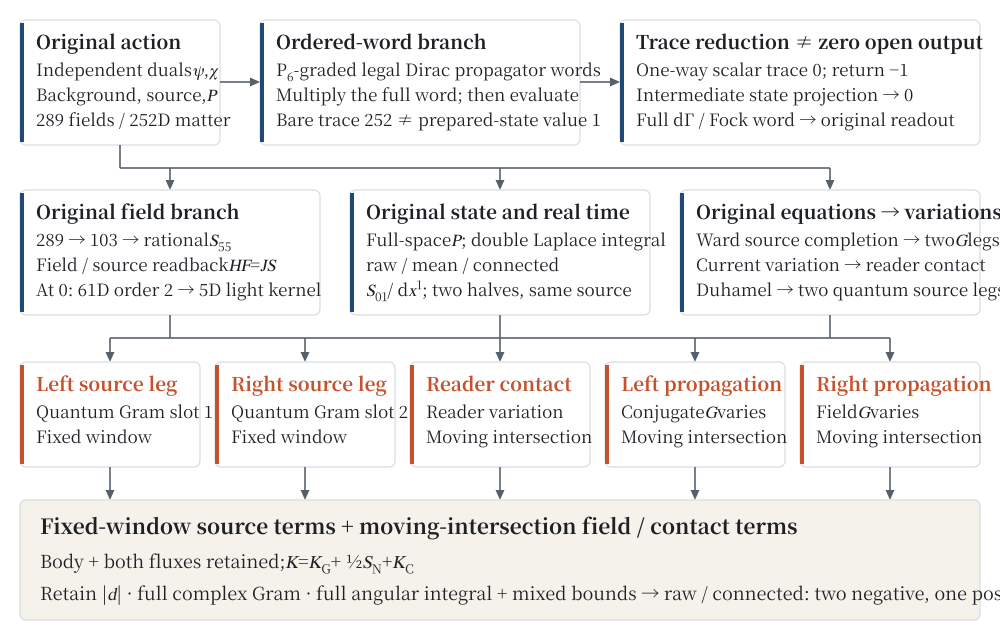
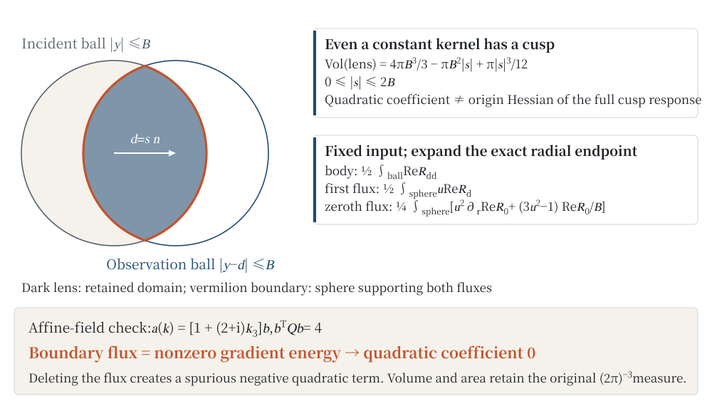
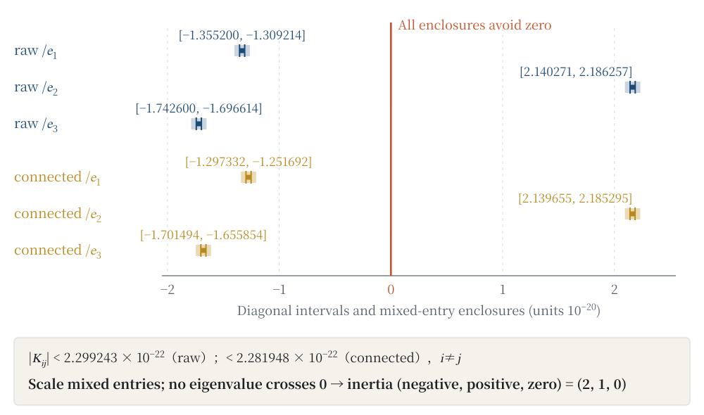
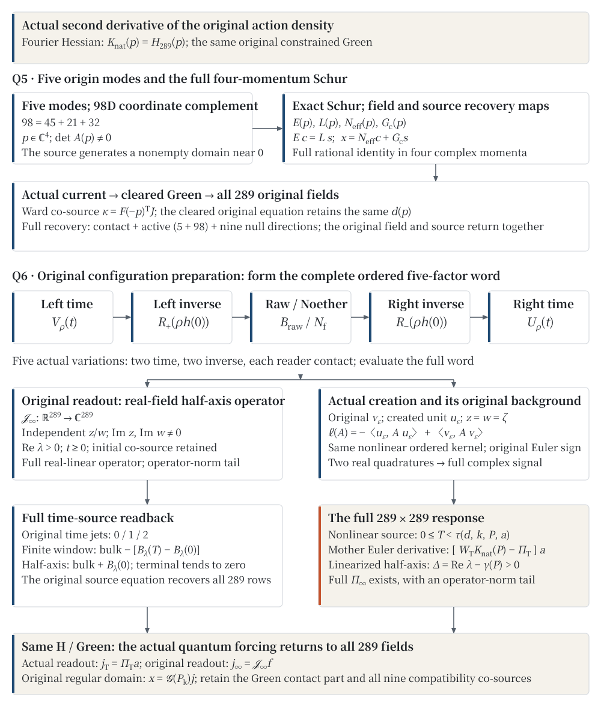

# Two Minuses, One Plus, and a Bare Trace Under Oath: Ordered Closed Traces and Whole-Ball Response Curvature

**COURTYCOURT · THE THEORY TAKES THE STAND · Case 2**

**Author: Jian Gao**\
Independent researcher · innersummer@hotmail.com · ORCID 0009-0009-5002-1655

## Abstract

With the identity matrix on the stand, the bare trace reports \(252\) and the originally normalized prepared state reports \(1\): the first evaluates the trace over the full matter carrier, the second the action within the fixed preparation. For the fixed \(S_{01}/dx^1\) external source with the co-directional readout operator, zero output momentum, double Laplace parameters \(z=w=6c(1-i)\), the same preparation, and an incoming/observing two-ball window of radius \(B\), we prove that in the complete five-term response both the uncentred (raw) and the centred (connected) quadratic coefficient tensors have two negative and one positive eigenvalue. Here “curvature” means the quadratic coefficient after the non-analytic linear term of the sharp window is removed, not the Hessian of the complete response at the origin.

Two branches start from the same action containing an independent dual matter field. Under the \(P_6\) grading, the closed trace of any finite admissible ordered gauge-propagation word equals the closed trace of its block-diagonal part; the prescribed one-directional scalar-insertion closed trace vanishes, and so does every open chain with an arbitrary admissible propagation word between two co-directional insertions. The prepared state, the boundary weight \(K\) and the complete second-quantized word give different evaluations; the actual return operator produces a nonzero reading, while an intermediate preparation projection erases it. The field-equation branch passes from \(289\) fields through auxiliary, Ward and symmetry reductions to a \(103\)-field system, counts matter feedback once, and constructs a rational \(55\)-dimensional bosonic kernel together with field/source recovery maps. The matter block at the origin has rank \(42\); keeping six light matter directions yields a \(61\)-dimensional second-order system whose constant term has rank \(56\), and its five-dimensional light kernel gives both linear and quadratic momentum time scales and is read out as propagation through the dynamical \(g_{00}\) source.

The two quantum source legs, the readout contact term and the two field propagation legs form the complete five-term response. The non-analytic linear term of the true ball intersection, the full complex Gram matrix, implicit root derivatives, full-direction integrals over paired frames and outward-rounded rational remainders together determine the quadratic tensor. The raw three-axis coefficients lie in \([-1.355200,-1.309214]\), \([2.140271,2.186257]\) and \([-1.742600,-1.696614]\) times \(10^{-20}\) model units; a uniform bound on all mixed terms makes the inertia statement apply to the complete tensor. The mean term is kept separately; its second-axis interval contains zero.

The actual Fourier Hessian of the same original action is also identified with the complete 289-field matrix. Five origin directions and a 98-dimensional coordinate complement generate an exact Schur kernel for all four complex momenta, a source-generated invertibility radius and a strict cubic remainder. The actual ordered current reconstructs the denominator-cleared whole field, retaining contact and all nine null directions. For another original configuration preparation, the complete ordered five-factor word, its actual Noether contact and four Fourier keys generate a real-field half-axis response operator. A source-generated created-unit/background difference then observes the same history: within its positive source-generated nonlinear time interval, it produces the full \(289\times289\) quantum tensor \(\Pi_T\), and the finite integral of the mother-Euler amplitude derivative is exactly \([W_T H_{289}-\Pi_T]a\). Coincident clocks give \(W_T=T\); the complete linearized half-axis retains its own growth condition. The same original Green returns this preparation's response to all fields, with conditions stated separately from those of the specified two-ball window.

**Keywords:** independent dual; ordered closed trace; prepared-state readback; Schur complement; background-field response; two-ball window; boundary flux; tensor inertia.

## 1　Name the Evaluation Before Giving the Number

### 1.1　252 and 1 Are Both Telling the Truth

On the original matter carrier \(\mathcal M\) of this paper,

\[
 \operatorname{tr}_{\mathcal M}I=252,
 \qquad \langle w,Iw\rangle=1,\qquad \|w\|=1. \tag{1.1}
\]

“Correcting” the second number from the first, or the first from the second, changes the evaluation being asked for. One is the bare matrix trace over the full carrier; the other is the reading of a complete word in a fixed preparation. When the word comes from the original action, further questions arise: on which side the propagation inverse acts, how the independent dual evolves, whether an insertion admits a return, and whether the preparation is applied before or after the product is complete.

The difference is operational. Every co-directional scalar closed trace in Section 3 vanishes, yet the original return operator in Section 4 gives \(-1\); inserting a preparation projection into that same product immediately changes the reading to \(0\). The open output is present. One particular evaluation does not see it.

Spatial response must also identify its object. The raw external-momentum Hessian of the zero-probe quantum source is strictly negative; restoring the field propagation, reader contact, two-window boundary and all-direction integrals from the same source gives a complete quadratic coefficient with one positive direction. The turn in this trial requires no new witness, only the complete reading of the same original equations.

### 1.2　The Main Result Goes on Record First

All quantities below use the model coordinates of Section 2. Let

\[
 c=\frac{6\sqrt{15}}{25},\quad
 \epsilon_B=\frac{5234375}{294988800512},\quad
 B=\sqrt2\epsilon_B,\quad z=w=6c(1-i). \tag{1.2}
\]

The original external field is \(A_\varepsilon=A_0+\varepsilon\cos(d\cdot x)\,dx^1S_{01}\), the reader uses the same gauge direction, and the observed output is \(p_{\mathrm{out}}=0\). Let \(\mathcal R_\alpha(d)\) denote the real reading of the complete five terms in Section 7, where \(\alpha=\mathrm{raw},\mathrm{mean},\mathrm{conn}\) respectively use \(I,P,I-P\) for the full spatial preparation projection.

**Definition 1.1 (response curvature in this paper).** For every real unit direction \(n\), the positive and negative external-momentum branches constructed with the same original pairing satisfy

\[
 \mathcal R_\alpha(sn)=\mathcal R_\alpha(0)
 +a_\alpha(n)|s|+s^2n^T\mathsf K_\alpha n+o(s^2). \tag{1.3}
\]

Here \(a_\alpha\) is an even directional function determined by the actual values on the sphere, and \(\mathsf K_\alpha\) is a real symmetric matrix. We call \(\mathsf K_\alpha\) the response curvature tensor: it is the quadratic coefficient, with mixed monomials \(2K_{ij}d_id_j\). Even if the function obtained by subtracting the linear term has a second derivative, that derivative corresponds to \(2\mathsf K_\alpha\), rather than \(\mathsf K_\alpha\).

**Theorem 1.2 (complete inertia for the specified two-ball window).** For the external source, reader, preparation, time parameters and two windows specified above, the quadratic coefficients in (1.3) satisfy

\[
 \operatorname{Inertia}(\mathsf K_{\mathrm{raw}})
 =\operatorname{Inertia}(\mathsf K_{\mathrm{conn}})=(2,1,0), \tag{1.4}
\]

The entries count negative, positive and zero eigenvalues, in that order. The following decimal displays are outward enlargements of strict rational intervals, in units of \(10^{-20}\):

| Direction | raw | mean | connected |
|---|---:|---:|---:|
| \(e_1\) | \([-1.355200,-1.309214]\) | \([-0.060120,-0.055272]\) | \([-1.297332,-1.251692]\) |
| \(e_2\) | \([2.140271,2.186257]\) | \([-0.001635,0.003212]\) | \([2.139655,2.185295]\) |
| \(e_3\) | \([-1.742600,-1.696614]\) | \([-0.043357,-0.038509]\) | \([-1.701494,-1.655854]\) |

For \(i\ne j\), we also have

\[
 |K_{ij}^{\mathrm{raw}}|<2.299243\,10^{-22},\quad
 |K_{ij}^{\mathrm{mean}}|<2.423430\,10^{-23},\quad
 |K_{ij}^{\mathrm{conn}}|<2.281948\,10^{-22}. \tag{1.5}
\]

Section 11 proves the inertia using these mixed-entry bounds; the three diagonal signs in the table alone do not imply it. The mean interval for \(e_2\) contains zero, so we give no inertia statement for mean. When \(a_\alpha(n)\ne0\), the first-order change of the complete response is governed by the \(|s|\) term; a positive quadratic coefficient does not mean that the complete response initially rises from the origin in that direction.

### 1.3　One Source, Two Branches

Case 0 [C0] supplies the common original action, independent dual, specified preparation and return to the original evaluation; Case 1 [C1] supplies the original spatial Hamiltonian, common domain, actual evolution, source derivatives and continuous prepared-state readings. This case summons those same actions, operators and preparations to settle three questions: the grading algebra of ordered words; elimination and original-field recovery for the bosonic kernel; and the directional tensor obtained by integrating the complete five terms over time, momentum and two ball windows.

Ordered closed traces and the five-term response branch from the same action. The former evaluates finite matrix words; the latter pairs the quantum Gram matrix of the original preparation with the bosonic field response. The former is not an intermediate approximation to the latter. Figure 1 has no arrow from “the bare trace vanishes” to “the spatial response vanishes.”

Sections 12–13 follow the actual consumers of the same original field and complete preparation: the action’s actual Hessian returns the full 289-field matrix, and the complete four-momentum Schur kernel reconstructs the actual source field. A source-generated created-unit/background difference then observes the actual Noether history, producing the full quantum response and mother-Euler finite window. Both extensions include their written proofs, retaining the original field, source, contact and endpoint cosources; their preparation and time domains are stated separately from the fixed two-ball result.

**Figure 1　One original action, two testimonies; all five terms must appear.** The upper branch preserves word order, grading and evaluation. The lower branch joins the original matter feedback, original-field recovery and quantum prepared-state readings. The two quantum source legs include the Duhamel variation and use fixed windows; the two propagation legs and reader contact use the two-ball intersection that moves with the external momentum. All five terms marked in vermilion are required. The window labels refer to the zero output momentum and equal-radius windows of this case; Section 7.4 gives the general window assignment. Arrows indicate dependence, not numerical equality.

## 2　The Same Original Action and Four Coordinates That Must Stay Distinct

### 2.1　Fields, Carrier and Independent Dual

Write the original fields as \(\Phi=(e,\omega,B_{\mathrm{gr}},\lambda,A,B_g,\phi,\psi,\chi)\). Here \(e\) is the coframe, \(\omega\) the Lorentz connection, \(B_{\mathrm{gr}},\lambda\) the gravitational auxiliary two-forms, \(A,B_g\) the gauge connection and its auxiliary two-form, and \(\phi\) a scalar in the fourth exterior power; \(\psi\) and \(\chi\) are independent matter and dual fields. The matter carrier is

\[
 \mathcal M=\mathbb C^4\otimes
 (\Lambda^6\mathbb C^7\oplus\Lambda^2\mathbb C^7\oplus\Lambda^4\mathbb C^7),
 \qquad \dim\mathcal M=4(7+21+35)=252. \tag{2.1}
\]

The internal basis is \(e_0,\ldots,e_6\), with colour indices \(0,1,2\), weak indices \(3,4\) and the remaining two indices \(5,6\). The original active gauge algebra is \(\mathfrak h=\{\operatorname{diag}(C,W,y,-y):C\in\mathfrak{su}(3),\ W\in\mathfrak{su}(2),\ y\in i\mathbb R\}\), of real dimension \(12\); every gauge vertex in this paper is obtained from this single embedding acting on exterior powers. The exterior-power action is determined by
\(\rho(X)(v_1\wedge\cdots\wedge v_r)=\sum_jv_1\wedge\cdots\wedge Xv_j\wedge\cdots\wedge v_r\)
and all wedge products use the ascending basis and permutation signs.

Take the Pauli matrices \(\sigma_j\) and set

\[
 \gamma^0=\begin{pmatrix}0&I_2\\-I_2&0\end{pmatrix},\quad
 \gamma^j=\begin{pmatrix}0&\sigma_j\\\sigma_j&0\end{pmatrix},\quad
 \gamma_5=\begin{pmatrix}-I_2&0\\0&I_2\end{pmatrix},\quad
 S=\gamma^0\gamma_5. \tag{2.2}
\]

The original scalar and its one-directional matter map are

\[
 \begin{gathered}
 \phi_0=e_{0126}+e_{0124}+e_{0156}+e_{0145},\qquad
 T_\phi(w_6,w_2,w_4)=(w_2\wedge\phi,0,0),\\ Y_R=P_R T_\phi,\quad P_R=\operatorname{diag}(0,0,1,1).
 \end{gathered} \tag{2.3}
\]

The variation does not identify \(\chi\) with \(\psi^\dagger\). The matter term in the original density and its two Euler equations therefore have a definite left-to-right order.

Let \(\mathcal W\) denote the top-degree pairing of two-forms, \(J\) the original gravitational internal map and \(*_e\) the coframe Hodge map. The original action density can be written as

\[
\begin{split}
\mathcal L={}&\mathcal W(B_{\mathrm{gr}},\widehat F_\omega)
-\tfrac12\mathcal W(B_{\mathrm{gr}},JB_{\mathrm{gr}})
+\mathcal W(\lambda,B_{\mathrm{gr}}-J\Sigma_e)\\
&+\mathcal W_g(B_g,F_A)-\tfrac\sigma2\mathcal W_g(B_g,*_eB_g)\\
&+\nu_e\left[\tfrac12g^{\mu\nu}\operatorname{Re}\langle D_\mu\phi,D_\nu\phi\rangle
-\|\phi-v\|^2+\operatorname{Re}\chi(i\Gamma^\mu D_\mu\psi+Y_R\psi)\right]. \tag{2.4}
\end{split}
\]

Here \(v=\phi_0\) is fixed, and \(\eta=\operatorname{diag}(-1,1,1,1)\), \(g=e^T\eta e\), \(\nu_e=|\det e|\). Extend the Lorentz indices of the connection antisymmetrically to all \(a,b\) and define

\[
 \begin{gathered}
 \Gamma_e^\mu=(e^{-1})^\mu{}_a\gamma^a,\qquad
 \Omega_\mu=\tfrac14\omega_{\mu ab}\gamma^a\gamma^b,\\
 D_\mu\psi=(\partial_\mu+\Omega_\mu+\rho(A_\mu))\psi,\quad
 D_\mu\phi=(\partial_\mu+\rho_4(A_\mu))\phi.
 \end{gathered}
\]

Also, \(\Sigma_e^{ab}=e^a\wedge e^b\). Appendix A gives the six-coordinate matrices of the internal map \(J\) and top-degree pairing \(\mathcal W\) in the gravitational term. The curvature is \(F_{\mu\nu}=\partial_\mu A_\nu-\partial_\nu A_\mu+[A_\mu,A_\nu]\), with the Lorentz curvature defined in the same way; \(\Sigma_e\) is the quadratic coframe wedge. The two-form order is \(01,02,03,23,31,12\), and the top-degree pairing is determined by \(\varepsilon^{0123}=1\). The original gauge bilinear form is \(-\operatorname{Re}\operatorname{tr}(XX^\prime)\) on each of the colour and weak blocks, and \(-\operatorname{Re}(yz)\) in the original coordinate of the parent \(U(1)\); the latter does not acquire the factor \(2\) from the trace of the two-charge matrix. Appendix A gives the reconstruction of the background and matrices; the complete sparse matrices and coordinate order are listed through the code and data availability section.

### 2.2　Background, Time and Fourier Signs

Fix

\[
 N=\frac{3\sqrt{30}}{25},\quad s_0=\sqrt2,\quad a=\frac{3\sqrt2}{5},\quad
 \omega_0=\frac{3N\sqrt2}{5},\quad \sigma=\frac12,\quad e=\operatorname{diag}(N,1,1,1). \tag{2.5}
\]

The spatial Lorentz background is \(\omega_{1,23}=\omega_{2,31}=\omega_{3,12}=\sqrt2\) and the gauge background is \(A_0=0,A_j=a\tau_j\), with \(\tau_j=i\sigma_j/2\) embedded in the colour \(0,1\) block. The matter and dual of the original solution at \(t=0\) are \(\psi_0=2w\) and \(\chi_0=2\sqrt2\,w^\dagger S\). They are also the constant backgrounds in the co-rotating representation below; \(U_{\mathrm{rot}}\) restores the phase in the original-time representation. The variations still treat \(\psi,\chi\) independently.

We use the original physical time \(t\) throughout. The quantities \(\tau=Nt\) or \(ct\) used in matrix calculations are changes of variables only. The notation is fixed as follows:

| Symbol | Meaning and conversion |
|---|---|
| \(\lambda\) | Original-time exponential variable; oscillatory energy \(E\) corresponds to \(\lambda=-iE\) |
| \(u,q_{\mathrm{ax}}\) | Rational axial coordinates, \(\lambda=N\sqrt2\,u,\ k_3=\sqrt2\,q_{\mathrm{ax}}\) |
| \(p=2\pi\xi\) | Physical momentum in the matter Fourier integral |
| \(y,d\) | Incoming bosonic physical momentum and external-field physical momentum; the negative-phase output is \(y-d\) |
| \(c=N\sqrt2\) | Laplace change-of-variable constant in this paper; no additional speed of light or experimental unit is introduced |
| \(B=\sqrt2\epsilon_B\) | Radius of the incoming and observing momentum balls; distinct from the radius of the position preparation ball |

The matter coordinates of the original \(289\)-field system use a co-rotating representation with a common phase rotation: \(Q=\gamma_5+2P_6\), \(U_{\mathrm{rot}}(t)=e^{-i\omega_0tQ}\), \(H_{\mathrm{st}}=H_{\mathrm{orig}}-\omega_0Q\). Physical time is unchanged; the original background satisfies

\[
 \psi_{\mathrm{orig}}(t)=U_{\mathrm{rot}}(t)\psi_0,\qquad
 \chi_{\mathrm{orig}}(t)=\chi_0S U_{\mathrm{rot}}(t)^\dagger S.
\]

The spatial current in Section 6 uses the original-time Hamiltonian \(H_{\mathrm{orig}}\), whereas elimination of the original \(289\) fields uses the co-rotating coordinates above. The original matter position preparation ball has radius \(1\), and its normalization after Dirac Green filtering is not chosen anew when \(B\) or the external field changes.

### 2.3　Three Matrix Operations, Three Distinct Duties

For finite fibre matrices, \(\dagger\) denotes the Hermitian adjoint; the formal symmetry of the original independent-dual and realified Euler matrix is \(H(-p)^T=H(p)\). The latter \(T\) and the former \(\dagger\) are not interchangeable. A domain is called regular when the principal parts and block inverses in use are actually invertible there; Sections 3, 5 and 9 give the respective domains.

Write the original evaluation as \(\Omega\): for the original normalized preparation, \(\Omega(A)=\langle w,Aw\rangle\). The continuous spatial preparation embedding \(E\) obeys the same return relation \(\Omega(E^\dagger A E)=\langle Ew,AEw\rangle\). In the original independent dual, the same reading is

\[
 \Omega(A)=\frac{\chi_0(SA\psi_0)}{4\sqrt2}=\langle w,Aw\rangle. \tag{2.6}
\]

Here \(S^2=I\), and the spin exchange \(S\) acts on the entire \(A\) after the product is complete, rather than between consecutive factors. The prepared-state evaluation also acts on the complete product, without intermediate preparation projections. Section 4 first forms the complete Fock word and Section 6 the complete continuous Gram matrix, before returning to the same evaluation in (2.6).

## 3　Closed-Trace Testimony: An Arrow Can Enter, but Cannot Invent a Return

### 3.1　Independent-Dual Propagation and the Dirac Inverse

Write the original fibre equation as \(D\psi=(C_0\partial_t+L)\psi=0\), where \(C_0=i\gamma^0/N\) is invertible. The exact relation between the Hamiltonian and Dirac inverses is

\[
 H=-iC_0^{-1}L,\quad D_z=-iC_0(z-H),\qquad
 G_D(z)=i(z-H)^{-1}C_0^{-1}. \tag{3.1}
\]

Thus \(D_zG_D=G_DD_z=I\). Both the rightmost \(C_0^{-1}\) and the prefactor \(i\) belong to the original equation.

Let \(A=-C_0^{-1}L=-iH\) and \(U(t)=e^{tA}\). The independent dual propagates as

\[
 \psi(t)=U(t)\psi(0),\qquad
 \chi(t)=\chi(0)C_0U(-t)C_0^{-1}. \tag{3.2}
\]

Direct differentiation gives \(\partial_t(\chi C_0\psi)=0\). We have not replaced \(\chi(t)\) by \(\psi(t)^\dagger\); the one-directional term of the original \(252\)-dimensional \(H\) is generally not self-adjoint either.

### 3.2　The Graded Ideal and Admissible Words of Arbitrary Length

Define the projection

\[
 P_6=I_4\otimes\operatorname{diag}(I_7,0_{21},0_{35}). \tag{3.3}
\]

Call \(B\) block-diagonal if \([B,P_6]=0\), and call \(N_a\) a one-directional arrow if

\[
 P_6N_a=N_a,\qquad N_aP_6=0. \tag{3.4}
\]

Thus \(N_a=P_6N_a(I-P_6)\): it enters the sixth exterior power from the other exterior powers. For all block-diagonal \(B\) and arrows \(N_a,N_b\),

\[
 N_aBN_b=0,\quad BN_a,\ N_aB\text{ remain arrows},\quad \operatorname{tr}N_a=0. \tag{3.5}
\]

The last identity follows from \(\operatorname{tr}(P_6N_a)=\operatorname{tr}(N_aP_6)\).

**Definition 3.1 (admissible ordered gauge-propagation word).** For each leg label \(j\), specify the same original free fibre Hamiltonian \(H_{0,j}\), original one-directional term \(N_j\), spectral parameter \(z_j\) and gauge density vertex \(V_j\). Require \([H_{0,j},P_6]=[C_{0,j},P_6]=[V_j,P_6]=0\), condition (3.4) for \(N_j\), and invertibility of \(C_{0,j}\) and \(z_j-H_{0,j}\). A word is any finite ordered product of these Dirac propagators and vertices. Different legs may have different momenta and spectral parameters; their multiplication order remains fixed.

**Theorem 3.2 (closed-trace reduction for every finite word).** Let \(H_j=H_{0,j}+N_j\). Then

\[
 (z_j-H_j)^{-1}=R_{0,j}+R_{0,j}N_jR_{0,j},
 \quad R_{0,j}=(z_j-H_{0,j})^{-1}. \tag{3.6}
\]

Replace each \(G_{D,j}\) in the word by \(iR_{0,j}C_{0,j}^{-1}\) to obtain \(W_0\). Then

\[
 W=W_0+N_W,\qquad P_6N_W=N_W,\quad N_WP_6=0,\qquad
 \operatorname{tr}W=\operatorname{tr}W_0. \tag{3.7}
\]

**Proof.** The entire argument rests on (3.5): two arrows vanish when multiplied, regardless of the block-diagonal factors between them, and the remaining single arrow has zero trace. Since \(R_{0,j}\) is block-diagonal, \(N_jR_{0,j}N_j=0\). Checking (3.6) by multiplication on each side gives the two-sided inverse. Every complete leg is “block-diagonal plus arrow.” Expand the finite product in its original order: terms containing two or more arrows vanish by (3.5); terms containing one remain arrows; the term containing none is precisely \(W_0\). Taking the trace yields (3.7). The proof neither exchanges two distinct vertices, performs a momentum integral, nor truncates the word length. □

**Corollary 3.3 (one-directional scalar insertion).** For the nonzero vertices \(Y_a\) of the original \(70\) real scalar directions, every pair of admissible words \(W_L,W_R\) satisfies

\[
 \operatorname{tr}(W_LY_aW_R)=0,\qquad
 Y_a W Y_b=0\quad\text{as an open-operator identity}. \tag{3.8}
\]

The proof again uses (3.4) and (3.5). This covers all \(70^2=4900\) co-directional double insertions, rather than a single diagonal scalar example.

### 3.3　Not Every Closed Trace Remains Silent

First call a gauge word that speaks: a gauge word can have a genuinely nonzero trace. Take the first gauge vertex twice in the original enumeration of Appendix A, with leg parameters

\[
 (k_1,z_1)=(0,1+2i),\qquad
 (k_2,z_2)=((0,0,3\sqrt2/2),3+i).
\]

The original Dirac inverses give directly

\[
 \operatorname{tr}W=
 \frac{\begin{gathered}-95360266467327071496720412359528906607208738863660800\\
 -53185433068294844818992564133304778477617846100000000\,i\end{gathered}}
 {15868525877183800686561094790721538271497991716304161}\ne0. \tag{3.9}
\]

The real numerator, imaginary numerator and denominator each have fifty-three digits, obtained by rational arithmetic on the original matrix word. Another actual word with three gauge vertices has zero closed trace but a nonzero open difference \(W-W_0\). Equality of closed traces does not imply equality of open operators.

A reverse arrow changes the question. For the original-time one-directional term \(N\),

\[
 \operatorname{tr}(N^\dagger N)=\frac{1296}{125},\qquad
 \operatorname{tr}(N+N^\dagger)^2=\frac{2592}{125}. \tag{3.10}
\]

The adjoint \(N^\dagger\) returns from the sixth exterior power to the original sector and does not satisfy (3.4). Thus (3.10) and (3.8) evaluate different complete words. Replacing the original one-directional scalar with a Hermitian reader has added a real return path.

## 4　Cross-Examining the Prepared State: Finish the Whole Sentence First

### 4.1　Preparation, Boundary Weight and the Complete Fock Word

The prepared state takes the stand by identifying what it cannot see. The original unit preparation \(w\) satisfies \(P_6w=0\); hence \(\langle w,N_aw\rangle=0\) for every arrow \(N_a\). On a general coframe the original boundary weight is

\[
 K_e=-i|\det e|\sqrt2\,S C_0(e),\qquad K=\sqrt2\gamma_5 \text{ on this background}. \tag{4.1}
\]

It commutes with \(P_6\). By (3.7), admissible gauge words satisfy both

\[
 \langle w,Ww\rangle=\langle w,W_0w\rangle,\qquad
 \langle w,KWw\rangle=\langle w,KW_0w\rangle. \tag{4.2}
\]

Let \(\mathcal F_-({\mathcal M})=\bigoplus_{r=0}^{252}\Lambda^r\mathcal M\), with \(J_1:\mathcal M\to\mathcal F_-\) the one-particle embedding. The second quantization \(d\Gamma(A)\) acts by \(A\) in each slot of the \(r\)-particle sector. For every finite ordered sequence,

\[
 \mathbb W=d\Gamma(A_1)\cdots d\Gamma(A_m),\qquad
 \mathbb WJ_1v=J_1(A_1\cdots A_m)v. \tag{4.3}
\]

**Proposition 4.1 (original readback of the complete word).** First form \(\mathbb W\) and then apply the preparation \(J_1w\). Its reading is

\[
 \langle J_1w,\mathbb WJ_1w\rangle
 =\Omega(J_1^\dagger\mathbb WJ_1)
 =\langle w,A_1\cdots A_mw\rangle. \tag{4.4}
\]

Adding \(d\Gamma(K)\) on the left gives the weighted reading. Substitution into (2.6) evaluates the entire \(J_1^\dagger\mathbb WJ_1\). The proof is induction on word length using \(d\Gamma(A)J_1=J_1A\). This does not make the general Fock operator equal to \(d\Gamma(A_1\cdots A_m)\). For complete words containing creation and annihilation operators, use their actual one-particle compression; do not apply (4.3) to intermediate states with changing particle number. □

Try the boundary weight in court as well, with the exchange matrix \(T_S=-iC_0^{-1}S\):

\[
 KT_S=-N\sqrt2 I,\qquad
 \langle w,KT_Sw\rangle=-N\sqrt2=-\frac{6\sqrt{15}}{25}. \tag{4.5}
\]

For a vertex \(V\) derived from the action, define \(T=-iC_0^{-1}V\) and \(B_V=-KT\). The prepared-state reading of the original volume current is then \(4\langle w,B_Vw\rangle\). Squaring the amplitude \(2\) gives \(4\). The weight in the complete \(252\)-dimensional formula is \(\gamma_5\); it cannot be replaced here by the co-rotating charge \(Q=\gamma_5+2P_6\).

### 4.2　The Return Reads −1; an Intermediate Projection Reads 0

Take the original scalar direction \(\delta\phi=e_{0234}\). The four nonzero components of the preparation \(w\), indexed by “spin; exterior-power basis,” are

\[
 w_{0;15}=\tfrac12,\quad w_{1;05}=-\tfrac12,\quad
 w_{2;15}=\tfrac12,\quad w_{3;05}=-\tfrac12. \tag{4.6}
\]

Let the row \(r\) read spin \(2\) and the \(\Lambda^6\) basis vector \(e_{012345}\), and let \(Y=Y_{\delta\phi}\). The wedge signs in (2.3) give \(rY(2w)=-1\). Define the actual return operator \(R=2wr\). Then

\[
 RYw=-w,\quad \langle w,RYw\rangle=-1,\qquad
 \langle w,R P_wYw\rangle=0,\quad P_w=|w\rangle\langle w|. \tag{4.7}
\]

The last identity follows from \(\langle w,Yw\rangle=0\). The return operator is an explicit reader of the original open output, rather than an admissible gauge vertex. The reading −1 is the testimony of an identified open output: object, path and reading are all specified, without inferring zero output from zero expectation.

Of the original \(70\) scalar directions, \(18\) actually satisfy \(Y_aw\ne0\), while all original one-directional prepared-state readings remain zero. With a Hermitian force reader, the actual double-scalar array has \(36\) nonzero readings. Nor do gauge words admit arbitrary insertion of \(P_w\): such an intermediate projection changes \(6\) of the \(16\) actual complete gauge words generated.

### 4.3　The Invertibility Domain of Retarded Propagation and the Continuous Original Evaluation

The self-adjoint fibres of the original free Hamiltonian have actual inverses at \(z=E+i\eta\) with \(\eta>0\); (3.6) lifts them to the Dirac inverse containing the original one-directional term. In the original chiral order,

\[
 D=\begin{pmatrix}0&A\\B&Y_R\end{pmatrix},\qquad
 D^{-1}=\begin{pmatrix}-B^{-1}Y_RA^{-1}&B^{-1}\\ A^{-1}&0\end{pmatrix}. \tag{4.8}
\]

Multiplication on both sides verifies (4.8) and fixes the positions of \(A^{-1},B^{-1}\). The continuous original prepared-state reading then places the complete source filter on both sides of the observable: if \(e=Ew\), \(R=G_D(i)\) and \(n=\|Re\|>0\), then

\[
 \Omega(E^\dagger R^\dagger A R E)/n^2
 =\langle\psi,A\psi\rangle,\qquad \psi=Re/n. \tag{4.9}
\]

The norm \(n\) is computed for this fixed \(e\); it is not a new normalization for each input. The original filter is not repeated between consecutive words. Every continuous Gram matrix in Section 6 returns through (4.9) to the same evaluation.

## 5　After Elimination, the Original Fields Must Return

### 5.1　289 → 103: Coordinates Are Eliminated, the Equations Still Have to Hold

The real active coordinates of the original background comprise \(16\) coframe, \(24\) Lorentz connection, \(36+36\) gravitational auxiliary, \(48\) gauge connection, \(72\) gauge auxiliary and \(9\) scalar-orbit directions, together with \(24\) each for the original matter and independent dual, giving \(289\) in total. Let \(H_{289}(p)\) be the real second-variation matrix of (2.4). All differentiations retain independent left and right momenta before imposing the original formal-transpose relation.

The auxiliary equations give directly

\[
 B_g=-\sigma^{-1}*_eF_A,\quad
 \delta B_g=K_g^{-1}(\delta F_A-\delta K_g\,B_{g,0}),
 \quad\delta B_{\mathrm{gr}}=J\delta\Sigma_e,\quad
 \delta\lambda=J\delta B_{\mathrm{gr}}-\delta\widehat F_\omega. \tag{5.1}
\]

Here \(K_g\) is the actual linear map multiplying \(B_g\) in the original auxiliary equation; the Hodge map cannot be frozen when \(e\) varies. Use these equations to eliminate \(72+72\) auxiliary coordinates, then \(24\) Lorentz coordinates, \(9\) Ward scalar-orbit directions and \(9\) source-symmetry directions, obtaining

\[
 289\longrightarrow217\longrightarrow145\longrightarrow121
 \longrightarrow112\longrightarrow103. \tag{5.2}
\]

The last nine source-symmetry directions consist of three colour \(SU(2)\) and six Lorentz directions. Every step preserves the solution graph and inverse-transpose recovery of the source. The first two auxiliary eliminations leave the matter block unchanged; the Lorentz elimination changes \(128\) of its entries. Inverting the uneliminated free matter block directly would produce a different kernel.

### 5.2　One Matter Feedback and the Rational Bosonic Kernel

Partition the actual \(103\)-field system into bosonic coordinates \(b\in\mathbb C^{55}\) and matter plus independent-dual coordinates \(m\in\mathbb C^{48}\):

\[
 K_{103}=\begin{pmatrix}K_{bb}&K_{bm}\\K_{mb}&M\end{pmatrix},
 \qquad W=-M^{-1}K_{mb},\qquad
 S_{55}=K_{bb}-K_{bm}M^{-1}K_{mb}. \tag{5.3}
\]

**Definition 5.1 (common invertibility domain).** The comparison domain for the two elimination orders is the set of parameters where the original auxiliary block \(A_{\mathrm{aux}}\), the original matter block \(D_{\mathrm{mat}}\), and
\(D_{\mathrm{mat}}-CA_{\mathrm{aux}}^{-1}B\) and \(A_{\mathrm{aux}}-BD_{\mathrm{mat}}^{-1}C\)
are all invertible. Formula (5.3) itself is used only where \(M\) is invertible after the actual elimination. This domain is nonempty: the original rational sample \(u=\frac35(1-3i),q_{\mathrm{ax}}=\frac3{10}\) gives two-sided inverses for every block in both orders.

**Theorem 5.2 (single feedback and recovery of the original equations).** On this common domain, the two admissible elimination orders give the same \(S_{55}\). There exist \(F\in\mathbb C^{289\times55}\), composed from the solution graphs of all steps, and \(J_{\mathrm{src}}\in\mathbb C^{289\times55}\), constructed from the external-source quotient map and inverse transposes, such that

\[
 H_{289}F=J_{\mathrm{src}}S_{55}. \tag{5.4}
\]

If \(S_{55}R_{55}=I\), then \(x=FR_{55}j\) satisfies all \(289\) rows of the original equations,
\(H_{289}x=J_{\mathrm{src}}j\).

**Proof.** The field graph is straightforward to write; the difficulty is making the external source return along the same route. For any invertible block \(A\),

\[
 \begin{pmatrix}A&B\\C&D\end{pmatrix}
 \begin{pmatrix}-A^{-1}B\\I\end{pmatrix}
 =\begin{pmatrix}0\\D-CA^{-1}B\end{pmatrix}. \tag{5.5}
\]

Compose (5.5) in the original order, retaining the matter solution \(m=Wb\) and auxiliary solutions at each step, to obtain the field graph \(F\). The source first uses \(Q(-p)^T\) from the original \(112\to103\) quotient map \(Q\), then restores the Ward scalar and auxiliary coordinates in reverse order. This constructs \(J_{\mathrm{src}}\) without defining the source to be \(HF\). For two adjacent invertible blocks, eliminating the combined block by (5.5), or using the two block-inverse factorizations, gives the unique remaining equation; the Woodbury identity equates its two expressions. Successive composition proves (5.4). □

The source recovered into the original equations has \(32\) nonzero Ward scalar-source entries, typically of the form \(-T_{\mathrm{other}}(-p)^TJ_{112}\). Deleting them breaks (5.4). Likewise, the original equations have already generated the matter-current feedback; (5.3) counts it once. This Schur feedback eliminates variables in the linearized field equations; it is not an additional vacuum \(\operatorname{Tr}\log\) loop.

### 5.3　At the Origin: 42 Heavy Directions and 6 Light Directions

The origin block \(M_0=M(0,0)\) is singular, so the rational inverse in (5.3) cannot be evaluated directly at the origin. In fact,

\[
 \operatorname{rank}M_0=42,\qquad
 \det M_{hh,0}=
 -\frac{58990238851842729101108654352661116616704}
 {9094947017729282379150390625}\ne0. \tag{5.6}
\]

Use this \(42\times42\) principal block to split off six retained matter coordinates. If \(G_0=M_{hh,0}^{-1}\), the full matter vectors of the light directions at the origin are

\[
 E_6=\begin{pmatrix}-G_0M_{h\ell,0}\\I_6\end{pmatrix},\qquad M_0E_6=0. \tag{5.7}
\]

The retained coordinate axes themselves need not lie in the nullspace: their upper heavy-field corrections must be restored.

Write the heavy block as \(M_{hh}=M_{hh,0}+\Delta\). In a neighbourhood where \(\|G_0\Delta\|<1\),

\[
 M_{hh}^{-1}=G_0-G_0\Delta G_0+G_0\Delta G_0\Delta G_0
 -(G_0\Delta)^3M_{hh}^{-1}. \tag{5.8}
\]

Truncating the actual polynomial to total degree two gives a \(61\)-dimensional system with \(55\) bosonic and \(6\) light matter coordinates. The remainder norm in (5.8) is at most
\(\|G_0\Delta\|^3\|G_0\|/(1-\|G_0\Delta\|)\). After all \(289\) fields are recovered, the residual of the second-order equations begins at total degree \(3\), with a genuinely nonzero cubic term.

### 5.4　The Five-Dimensional Light Kernel and Two Time Scales

**Theorem 5.3 (the original five-dimensional light kernel).** The constant term of the \(61\)-dimensional second-order system above has rank \(56\). Eliminating \(56\) heavy constant-term directions gives a five-dimensional light kernel, identical to the second-order kernel obtained by directly eliminating the corresponding \(98\) directions from the \(103\)-field system. The original retained coordinate indices are \(94,100,106,112,118\), each carrying its complete heavy-field solution graph.

A natural basis comes from five original matter/dual variations: opposite real amplitude scaling, opposite phase rotation, axial real scaling, axial phase rotation and an imaginary variation of the independent dual. Appendix B lists the paths. The determinant from this natural basis to the retained coordinates is \(4\). In the natural basis the only first-order entries of the five-dimensional kernel are

\[
 (K_1)_{35}=-8u,\qquad (K_1)_{53}=8u, \tag{5.9}
\]

Matrix indices here start at \(1\). Appendix B gives the complete second-order matrix; the three-dimensional diagonal principal part on the first-order kernel is

\[
 \operatorname{diag}\left(
 \frac{16}{9}(5q_{\mathrm{ax}}^2+3u^2),
 \frac{32}{737}(55q_{\mathrm{ax}}^2+67u^2),
 \frac{20}{81}(125q_{\mathrm{ax}}^2-162u^2)\right). \tag{5.10}
\]

**Proof and dispersion derivation.** A single five-dimensional kernel must describe two time scales. The constant-term rank follows from the actual invertible \(56\)-dimensional block and five-column nullspace graph. The two reduction routes agree coefficient by coefficient in the six matrices for \(1,u,q_{\mathrm{ax}},u^2,uq_{\mathrm{ax}},q_{\mathrm{ax}}^2\). Taking the determinant directly from the complete five-dimensional matrix gives

\[
 \lim_{t\to0}\frac{\det K(tu,tq_{\mathrm{ax}})}{t^8}
 =\frac{655360}{537273}u^2(5q_{\mathrm{ax}}^2+3u^2)
 (55q_{\mathrm{ax}}^2+67u^2)(125q_{\mathrm{ax}}^2-162u^2). \tag{5.11}
\]

In retained coordinates the coefficient differs by the square \(16\) of the basis-change determinant. The three quadratic factors give the original physical leading dispersions

\[
 \frac{\lambda^2}{k^2}=-\frac{18}{25},\quad
 -\frac{594}{1675},\quad \frac13. \tag{5.12}
\]

Now take the slow scale \(u=\varsigma q_{\mathrm{ax}}^2\). The relevant static second-order block becomes
\(\left(\begin{smallmatrix}-40/3&-8\varsigma\\8\varsigma&-10/3\end{smallmatrix}\right)\),
and the coefficient of \(q_{\mathrm{ax}}^{10}\) in the full determinant is

\[
 \frac{512000000}{439587}(36\varsigma^2+25). \tag{5.13}
\]

Thus the slow branches are \(\varsigma=\pm5i/6\), giving the leading behaviour \(\lambda^2/k^4=-3/20\). Both the linear and quadratic scales arise from the same original kernel; the second-order system does not give the exact dispersion at every finite momentum. □

### 5.5　The Original Dynamic \(g_{00}\) Source: Its Actual Injection and Reading

The original metric variation is \(\delta g_{00}=-2N\,\delta e_{00}\). Under the convention of adding \(+J_{00}\delta g_{00}\) to the action, the forced field is the negative inverse applied to the actual source; writing the Green equation as \(Hx=J\) instead retains its positive-sign convention. The original field and source graphs match these two notations exactly.

For the dynamic \(g_{00}\) source, solve the actual \(25\)-dimensional system first, then recover the \(33\)-dimensional independent-dual block and all \(289\) fields to obtain a rational response. Along a fixed ray \(u=rq_{\mathrm{ax}}\) approaching the origin, the actual result is

\[
 \lim_{q_{\mathrm{ax}}\to0}G_{00}(rq_{\mathrm{ax}},q_{\mathrm{ax}})
 =\frac{54\sqrt{30}(297r^2-125)}{3125(162r^2-125)},
 \quad r^2\ne\frac{125}{162}. \tag{5.14}
\]

Its static limit is \(18N/125\) and its purely temporal limit \(33N/125\); the joint origin has no direction-independent value. In the three-dimensional core the reader row and external-source column are \((0,0,-36u/25)\) and \((0,0,+36u/25)\), respectively, and the actual light-field solution contains

\[
 \theta=\frac{729u}{125(125q_{\mathrm{ax}}^2-162u^2)}. \tag{5.15}
\]

Adding the original contact \(18N/125\) and the dynamic part
\(\frac{486Nu^2}{25(162u^2-125q_{\mathrm{ax}}^2)}\)
restores (5.14) exactly: the \(g_{00}\) source genuinely excites the third propagation branch in (5.12). The full rational denominator does not vanish identically on the leading cone; Appendix B gives its explicit expression.

## 6　The Original Preparation Travels Through Real Time, Beyond \(t=0\)

### 6.1　The Original Dirac Filter and Full Spatial Projection

The original unit position-ball preparation is

\[
 e(x)=\frac{\mathbf1_{|x|\le1}}{\sqrt{4\pi/3}}w,\qquad
 \widehat\psi(p)=\frac{f(p)b(|p|)}n,\quad
 f(p)=i(i-H(p))^{-1}C_0^{-1}w, \tag{6.1}
\]

where
\(b(r)=4\pi(\sin r-r\cos r)/(r^3\sqrt{4\pi/3})\),
and \(n^2=\int\|f(p)b(|p|)\|^2d^3p/(2\pi)^3\). The actual occupied \(12\)-dimensional carrier is a two-sided reducing subspace of the full \(252\)-dimensional operator. On it, \(H(p)=H_0+\sum p_jH_j\) is self-adjoint, \([K,H]=0\), and

\[
 \left(\sum p_jH_j\right)^2=N^2|p|^2I,\qquad K^2=2I. \tag{6.2}
\]

This carrier is \(\mathcal H_{12}=\mathbb C^4\otimes\operatorname{span}\{e_{05},e_{15},e_{25}\}\), and \(F_{12}\) is the isometric embedding into \(\mathcal M\) in that basis. The original one-directional Yukawa term remains nonzero on the full space; only its two-sided restriction to this particular carrier is zero. Complete the \(\tau_j\) acting on colours \(0,1\) to \(3\times3\) matrices. The original-time matrix is explicitly

\[
 H(p)=\frac{3N\sqrt2}{2}(\gamma_5\otimes I_3)
 +Na\sum_{j=1}^3 i\gamma^0\gamma^j\otimes\tau_j
 -N\sum_{j=1}^3p_j\gamma^0\gamma^j\otimes I_3.
\]

Its constant term has not had the co-rotating phase \(\omega_0Q\) subtracted.

Let \(Q=K/\sqrt2\) and \(G_0=C_0^{-1}/(iN)\). For each chirality \(\chi=\pm1\), the seed \(s_\chi=(I+\chi Q)G_0w/2\) and partner \(t_\chi=(\chi H-\omega_0)s_\chi/N\) satisfy

\[
 \|s_\chi\|^2=\tfrac12,\quad
 \langle s_\chi,t_\chi\rangle=0,\quad
 \|t_\chi\|^2=|p|^2/2,\quad
 Hs_\chi=\chi(\omega_0s_\chi+Nt_\chi),\quad
 Ht_\chi=\chi(N|p|^2s_\chi+3\omega_0t_\chi). \tag{6.3}
\]

For \(r=|p|>0\), the orthonormal basis is \((\sqrt2s_\chi,\sqrt2t_\chi/r)\), and only in this basis does the matrix become \(\chi\left(\begin{smallmatrix}\omega_0&Nr\\Nr&3\omega_0\end{smallmatrix}\right)\). At \(p=0\), \(t_\chi=0\), so the two-vector basis degenerates. The filter below, written directly in the unnormalized vectors, remains regular:

\[
 f(p)=-N\sum_{\chi=\pm1}
 \frac{(i-3\chi\omega_0)s_\chi+\chi Nt_\chi}
 {(i-\chi\omega_0)(i-3\chi\omega_0)-N^2|p|^2}. \tag{6.4}
\]

The imaginary part of its denominator is \(-4\chi\omega_0\ne0\), so this preparation Green operator is regular for all real momenta.

The actual overlap function of the unit ball is \(1-\frac34r+\frac1{16}r^3\) for \(0\le r\le2\). Define

\[
 J(\kappa)=\int_0^2(r-3r^2/4+r^4/16)e^{-\kappa r}\,dr
 =\frac{2\kappa^3-3\kappa^2+3-3(\kappa+1)^2e^{-2\kappa}}{2\kappa^5}, \tag{6.5}
\]

and take \(\kappa^2=(1-3\omega_0^2+4i\omega_0)/N^2,\operatorname{Re}\kappa>0\) and \(Z=(i-3\omega_0)J(\kappa)\). Full angular integration of (6.4), followed by (6.5), gives

\[
 n^2=\operatorname{Im}Z\simeq0.208904454900,\quad
 \mu_0=\frac{2\sqrt2}{N^2}\frac{\operatorname{Re}Z}{\operatorname{Im}Z}
 \simeq-0.701355479214, \tag{6.6}
\]

\[
 \|A_0\psi\|^2=\frac8{N^2n^2}-\frac8{N^4},\qquad
 \|(A_0-\mu_0)\psi\|^2\simeq45.287036020565. \tag{6.7}
\]

In (6.6)–(6.7), \(A_0=2KH/N^2\) is the original phase current at zero spatial probe; its subscript \(0\) does not denote the time component of the gauge connection. From here on, \(P=|\psi\rangle\langle\psi|\) is a rank-one projection on the entire \(L^2\) space. It is neither a momentum-by-momentum preparation nor a further compression of the \(12\)-dimensional carrier to a compatibility subspace.

### 6.2　The Original Current and Two Half-Amplitudes from the Same Source

Let \(M_k=e^{ik\cdot X}\). On the common \(H\) domain, the original phase current is

\[
 A_k=N^{-2}(KM_kH+H^\sharp M_kK),\qquad
 B_{\varepsilon,k}(t)=U_\varepsilon(t)^\dagger A_{\varepsilon,k}U_\varepsilon(t). \tag{6.8}
\]

On the actual reducing space of (6.1), \(H^\sharp=H\). On the full \(252\)-dimensional common domain, however, \(H=H_{\mathrm{free}}+N_Y\) and \(H^\sharp=H_{\mathrm{free}}+N_Y^\dagger\), with \(N_Y=-iC_0^{-1}Y_R\) and therefore \(N_Y^\dagger=iY_R^\dagger(C_0^{-1})^\dagger\). The adjoint acts on the entire one-directional time term, preserving its left-to-right order. Each Fourier shift of the cosine current carries one factor \(1/2\):

\[
 A_{\cos k}(p_{\mathrm{out}},p_{\mathrm{in}})
 =\frac{KH(p_{\mathrm{in}})+H(p_{\mathrm{out}})^\dagger K}{2N^2},
 \quad p_{\mathrm{out}}=p_{\mathrm{in}}\pm k. \tag{6.9}
\]

The original complete Fock current is
\(\frac2N\operatorname{Herm}[d\Gamma(K)d\Gamma(M_{\cos k}H/N)]\), with Hermitian symmetrization acting on the entire product; (6.8) is its actual action on a one-particle input.

The original gauge direction \(dx^1S_{01}\) uses \(S_{01}\) without division by \(2\). The density vertex, including the volume, generates

\[
 V_{252}=-iC_0^{-1}\frac{V_{\mathrm{density}}(1,S_{01})}{N},\qquad
 V=F_{12}^\dagger V_{252}F_{12},\quad V^\dagger=V,\quad [K,V]=0,\quad\|V\|=N. \tag{6.10}
\]

Take \(W_d=\cos(d\cdot X)V\) and \(H_\varepsilon=H+\varepsilon W_d\). The bounded self-adjoint perturbation gives the common domain \(D(H_\varepsilon)=D(H)\) and an actual unitary group. Its derivative is

\[
 D_d(t)=-i\int_0^tU(t-s)W_dU(s)\,ds. \tag{6.11}
\]

For \(\sigma=\pm1\), define the matrices without their half-amplitudes by

\[
 d_\sigma(t,p)=-i\int_0^tE_{p+\sigma d}(t-s)V E_p(s)\,ds,\qquad E_p(t)=e^{-itH(p)}. \tag{6.12}
\]

Then \(\widehat{D_df}(r)=\frac12\sum_\sigma d_\sigma(t,r-\sigma d)\widehat f(r-\sigma d)\). Both Hamiltonians at their different momenta are retained; the actual Laplace kernel is
\(-i(z+iH(p+\sigma d))^{-1}V(z+iH(p))^{-1}\), multiplied by the corresponding half-amplitude.

Each external-transfer coefficient of the original current follows directly from its complete two-sided variation:

\[
\begin{split}
 C_{\sigma,k}(t,p)={}&E_{p+k+\sigma d}^\dagger\frac{KV}{N^2}E_p\\
 &+\tfrac12d_{-\sigma}(t,p+k+\sigma d)^\dagger A_k(p)E_p\\
 &+\tfrac12E_{p+k+\sigma d}^\dagger A_k(p+\sigma d)d_\sigma(t,p),
 \quad A_k(p)=\frac{K[H(p+k)+H(p)]}{N^2}. \tag{6.13}
\end{split}
\]

The direct term already contains the cosine half-amplitude once. Let \(\mathcal L_{\ell,r}X=i[H(\ell)X-XH(r)]\). Its skew-adjointness gives \(\mathcal R_{z;\ell,r}=(z-\mathcal L_{\ell,r})^{-1}\) and \(\|\mathcal R\|\le1/\operatorname{Re}z\). Hence

\[
 \widehat B_k(z,p)=\mathcal R_{z;p+k,p}(A_k(p)), \tag{6.14}
\]

\[
 \widehat C_{\sigma,k}(z,p)=\mathcal R_{z;p+k+\sigma d,p}
 \left[\frac{KV}{N^2}+\frac i2\{V\widehat B_k(z,p)-\widehat B_k(z,p+\sigma d)V\}\right]. \tag{6.15}
\]

This Sylvester inverse is the frequency representation of the current at all times; it is not the product of two one-particle Laplace inverses.

### 6.3　The Same Decomposition into raw, mean and connected

Write \(\Pi_{\mathrm{raw}}=I,\Pi_{\mathrm{mean}}=P,\Pi_{\mathrm{conn}}=I-P\),
\(j^\alpha_k(t)=\Pi_\alpha B_k(t)\psi\) and \(\zeta^\alpha_{d,k}(t)=\Pi_\alpha C_{d,k}(t)\psi\). Define

\[
 \mathcal N_0^\alpha(k,l;z,w)
 =\int_0^\infty\!\!\int_0^\infty e^{-\bar zt-ws}
 \langle j_k^\alpha(t),j_l^\alpha(s)\rangle\,dt\,ds, \tag{6.16}
\]

\[
 \mathcal N_1^\alpha(d;k,l;z,w)
 =\iint e^{-\bar zt-ws}
 \left[\langle\zeta_{d,k}^\alpha(t),j_l^\alpha(s)\rangle
 +\langle j_k^\alpha(t),\zeta_{d,l}^\alpha(s)\rangle\right]dt\,ds. \tag{6.17}
\]

The identity \(\mathcal N^{\mathrm{raw}}=\mathcal N^{\mathrm{mean}}+\mathcal N^{\mathrm{conn}}\) is the orthogonal projection decomposition. The mean retains the actual product of complex means, for example
\(\mathcal N_0^{\mathrm{mean}}=\overline{\mu_B(k,z)}\mu_B(l,w)\). At general pairs of probes the Gram matrix can be complex, so the left time weight must be \(e^{-\bar zt}\).

**Proposition 6.1 (actual double-time integrals and strong derivatives).** For \(\operatorname{Re}z,\operatorname{Re}w>0\), the strong integrals (6.16)–(6.17), generated by the same original evolution, exist, and the amplitude derivative at fixed preparation commutes with integration. At the bandwidth and frequencies used in Section 9, the required mixed momentum derivatives through order four are likewise dominated by the original position moments.

**Proof.** Strong integration, Fubini and amplitude differentiation each need a dominating function, while the Duhamel bounds grow only polynomially in time. Duhamel iteration gives
\(\|U_\varepsilon-U\|\le|\varepsilon|N|t|\) and
\(\|U_\varepsilon-U-\varepsilon D_d\|\le\varepsilon^2N^2t^2/2\). With \(\alpha_0=\sqrt2/N^2\), \(h=\|H\psi\|\), \(a_k=\alpha_0(2h+N|k|)\) and \(b_0=2\alpha_0N\), first-order and remainder bounds for the complete current can be taken as

\[
 z_k(t)=b_0+2Na_k|t|,\qquad
 d_k(t)=2Nb_0|t|+2N^2a_kt^2. \tag{6.18}
\]

The remainder from the two Gram legs is at most
\(\varepsilon^2[d_k(t)a_l+a_kd_l(s)+z_k(t)z_l(s)]\). Each time monomial has the actual half-line integral
\(\int_0^\infty e^{-\eta t}t^m dt=m!/\eta^{m+1}\), providing domination for strong integration, Fubini and amplitude differentiation. Appendix D gives the weighted-domain recursion for the fourth-order momentum part; it requires position moments of \(\psi,H\psi\), without requiring \(H^2\psi\). □

### 6.4　How Centering Changes the Sign in One Direction

Call the simplest witness first: the zero current probe. Here \(B_{\varepsilon,0}(t)=2K(H+\varepsilon W_d)/N^2\) holds for all actual times. The original second external-momentum variation is therefore

\[
 C''_{ij}\widehat\psi(p)=\frac{2KV}{N^2n}\,
 \partial_{p_i}\partial_{p_j}[f(p)b(|p|)]. \tag{6.19}
\]

For this zero-probe special case, the double-time integral is exactly \(1/|z|^2\). Full integration using (6.4)–(6.5) at the original frequency \(|z|^2=7776/125\) gives

| External direction | raw quantum-source Hessian | mean quantum-source Hessian | connected quantum-source Hessian |
|---|---:|---:|---:|
| 1 | \(-0.014034767643875352\) | \(-0.021154588614571218\) | \(+0.007119820970695866\) |
| 2, 3 | \(-0.014034767643875352\) | \(-0.011031425013252896\) | \(-0.003003342630622456\) |

These are high-precision central displays; the actual calculation uses the outward intervals of Appendix D. Isotropy of raw follows from equality of the three complete rational weights and vanishing mixed weights. Omitting \(\mu_0\mu''_{ij}\) changes the first-direction sign of connected.

For a nonzero current probe, the actual Sylvester momentum derivatives are no longer constant in time. Their second-order Gram data have nonzero imaginary parts; for example, the right-leg second-order connected value is approximately
\(-0.222877720447-0.018187219957i\). Replacing every probe derivative by its derivative at \(t=0\) divided by \(|z|^2\) does not generate this number.

## 7　The Complete Five Terms: Both Quantum Source Legs Must Take the Stand

### 7.1　Full Spatial Columns from the Original \(g_{00}\) Light Branch

Write \(T=|k|^2/2\), and let \(\widehat F(U,T)\) be the original complete even dispersion factor. Take

\[
 \begin{gathered}
 c_F=-100383300000000,\quad
 \widehat F(U(T),T)=0,\quad U(0)=0,\\
 U'(0)=\frac{125}{162},\quad
 D(U,T)=\widehat F_U(U,T)/c_F.
 \end{gathered} \tag{7.1}
\]

The same original equations generate three \(289\)-dimensional full spatial polynomial columns \(\mathcal A,\mathcal B,\mathcal Z\), with \(87,114,56\) nonzero rows, respectively. They satisfy

\[
 H_{289}(\lambda,-ik)(\lambda\mathcal A+\mathcal B)
 =(\lambda^2-c^2U)\mathcal Z-\frac{c^2}{c_F}\widehat F(U,T)j_{00}. \tag{7.2}
\]

Here \(j_{00}\) is the original \(g_{00}\) injection of Section 5, whose nonzero source component is \(-2N\). On the actual root define

\[
 F_\lambda(k)=\frac{\lambda\mathcal A(k,U,T)+\mathcal B(k,U,T)}
 {D(U,T)(\lambda^2-c^2U)},\qquad I_0(k)=\frac{\mathcal Z(k,U,T)}{D(U,T)}, \tag{7.3}
\]

Then \(H_{289}F_\lambda=I_0\). The quantity \(I_0\) is the projected source generated by the original \(g_{00}\) light pole; it differs from the unprojected \(j_{00}\).

**Construction and proof.** The difficulty is to reconstruct all three momenta from columns initially available only on the axis. Split the original axial field-residue column \(\mathcal V(u,q_{\mathrm{ax}})\) into odd and even parts:

\[
 \mathcal A_{\mathrm{ax}}=-\frac c{c_F}\frac{\mathcal V(u,q_{\mathrm{ax}})-\mathcal V(-u,q_{\mathrm{ax}})}{2u},
 \qquad
 \mathcal B_{\mathrm{ax}}=-\frac {c^2}{c_F}\frac{\mathcal V(u,q_{\mathrm{ax}})+\mathcal V(-u,q_{\mathrm{ax}})}{2}. \tag{7.4}
\]

Transport fields by the original rotation action and sources by the inverse transpose. The Casimir of the original generators has only \(j=0,1,2\) components on these axial columns. Each radial factor is \(q_{\mathrm{ax}}^j\) times a polynomial in \(U,T\), so the finite spherical-harmonic polynomials in Appendix C reconstruct all three momenta. Substituting these columns into the complete \(H_{289}\) gives, before taking the root, exactly the second term on the right of (7.2) as residual. Taking the root and dividing by the actual common denominator gives (7.3). The full spatial columns are thus constructed exactly, rather than fitted to axial numerical samples.

The original causal kernel is

\[
 K_0(t,k)=\mathbf1_{t\ge0}
 \frac{\mathcal A\cosh(c\sqrt U\,t)+\mathcal B\sinh(c\sqrt U\,t)/(c\sqrt U)}D. \tag{7.5}
\]

At \(U=0\), use \(\sinh(c\sqrt U\,t)/(c\sqrt U)=t\). The original matrix identities \(H_2\mathcal A=H_2\mathcal B=0\), \(H_1\mathcal A=\mathcal Z\) and \(H_0\mathcal A+H_1\mathcal B=0\) give the distributional equation \(H_{289}K_0=(\mathcal Z/D)\delta_0\). Its Laplace transform on the common domain \(\operatorname{Re}\lambda>c\sqrt U\) is (7.3).

### 7.2　Generate the Compensating Source Before Solving the Response Field

Fix the positive-phase external insertion \(a_\delta=e^{i\delta\cdot x}dx^1S_{01}\). The original curvature and Hodge map give the external auxiliary variation

\[
 b_{g,1}=-\sigma^{-1}*_eD_A(p_e)a_\delta,\qquad p_e=(0,i\delta). \tag{7.6}
\]

Let \(b_1=(a_\delta,b_{g,1})\) denote these actual fields. First compute the original background Euler variation \(E_1=H_{289}(p_e)b_1\), then use all original gauge and Lorentz actions to construct the varied symmetry column \(K_1\) and source-curvature term \(C_1\). The original cubic vertex \(V_\delta\) satisfies the two-sided Ward identities

\[
 V_\delta K(p_{\mathrm{in}})+H(p_{\mathrm{out}})K_1+C_1=0,
 \quad
 K(-p_{\mathrm{out}})^TV_\delta+K_1^TH(p_{\mathrm{in}})+C_1^T=0. \tag{7.7}
\]

For output label \(K\) and input label \(K+\delta\), first generate the Noether compensating source

\[
 K(-p_{\mathrm{out}})^TI_{1,\delta}
 =-K_1^TI_0-C_1^TF_z(K+\delta),\qquad
 H(p_{\mathrm{out}})G_{z,\delta}(K)
 =I_{1,\delta}-V_\delta F_z(K+\delta), \tag{7.8}
\]

where \(p_{\mathrm{out}}=(z,-iK)\). The originally selected nine-row minor is invertible. Set the compensating source on the retained \(280\) rows to zero and solve uniquely for \(I_1\) on those nine rows; then solve the field and recover every auxiliary component. The incoming light root, prepared source and denominator of the field always belong to \(K+\delta\).

The original input source \(I_0\) contains projected gravitational \(B_{\mathrm{gr}}\) terms. The additional particular solution generated by the perturbation is nonzero only on the \(72\) gauge auxiliary coordinates; the other \(96\) auxiliary particular components are exactly zero. Retaining these blocks lets the original \(112\)-row reduced solution and (7.7) recover all \(289\) equations.

### 7.3　Instantaneous Terms Also Pass Through the Laplace Integral

The frequency-degree proof for this same complete rational propagation variation gives

\[
 \mathcal G_{k,\delta}
 =P_1(k,\delta)\delta'_0+P_0(k,\delta)\delta_0
 +\mathbf1_{t\ge0}K_1(t;k,\delta). \tag{7.9}
\]

The original \(103\)-dimensional determinant has time degree exactly \(126\). Row/column matching of the actual sparse entries and cofactor-degree bounds put the complete \(289\)-dimensional recovery for all nine external-source directions at most at \(O(\lambda)\). Its polynomial part therefore needs exactly the two terms in (7.9), kept separate from the ordinary kernel.

On the common domain of the entire incoming light ball, the respective fixed incoming frames and \(\max_i|\delta_i|\le1/200000\), take the original contour \(|\lambda|=\Gamma=5c\). A lower bound for this determinant gives a finite uniform constant \(C\) with \(\|G_\lambda\|_\infty\le C\) on the contour. Take

\[
 P_1=\frac1{2\pi i}\oint\frac{G_\lambda}{\lambda^2}\,d\lambda,\quad
 P_0=\frac1{2\pi i}\oint\frac{G_\lambda}{\lambda}\,d\lambda,\quad
 K_1(t)=\frac1{2\pi i}\oint e^{\lambda t}G_\lambda\,d\lambda. \tag{7.10}
\]

Then \(\|\partial_t^mK_1(t)\|_\infty\le5^{m+1}Ce^{75t/16}\), and the original \(\operatorname{Re}z=6c>5\) ensures convergence of the positive-time integrals. The high-frequency original equations also give

\[
 H_2P_1=0,\quad H_2P_0+H_1P_1=0,\quad
 H_2K_1(0)+H_1P_0+H_0P_1=0, \tag{7.11}
\]

and \(H_2K_1'(0)+H_1K_1(0)+H_0P_0=I_1(\infty)\), cancelling the corresponding higher-order delta residuals in the zero-past equation.

Convolution with the original quantum current \(j_+=\mathbf1_+j\) gives

\[
 \mathcal G*j_+=P_1\delta_0j(0)
 +\mathbf1_+[P_1j'+P_0j+K_1*j]. \tag{7.12}
\]

The endpoint term in \(\widehat{j'}=z\widehat j-j(0)\) must be added to the retained delta term to recover \(G_z\widehat j\). The two current legs have independent time variables, and the reader is integrated by parts distributionally; two distributions are not multiplied arbitrarily at the same time. The uniform time bounds, original strong momentum derivatives and compact momentum support jointly allow the time and spatial integrations in the five terms below to be interchanged.

### 7.4　The Complete Five-Term Expression

Define \(d\mu(k)=(2\pi)^{-3}d^3k\) and \(w_B(k)=\mathbf1_{|k|\le B}\), and denote the output observation window by \(w_R\). Both the original field and output current use the negative Fourier phase. At general output label \(p\) the two field labels are \(k,k-p\), while the quantum probe still uses the positive phase \(M_k\). Let

\[
 L_z(k)=(\bar z,+ik),\quad R_w(l)=(w,-il),\quad
 r_b=(-\bar z-w,-ip). \tag{7.13}
\]

The matrix \(Q_b(L,R)\) is the background reader bilinear matrix generated from the original action, including the second-order constitutive recovery of \(B_g\); \(Q'_{b,\delta}\) is its first variation with respect to the original external field. For \(\delta=\sigma d\) and \(l=k-p+\delta\), the original derivative of \(Q'\) obeys \(L+R+(0,i\delta)+r_b=0\).

Below, \(\langle Fj,QGj'\rangle\) means the original \(Q\) pairing in field indices multiplied by the matter Hilbert inner product, conjugate-linear in the first slot. For each sector use the original projected Laplace vectors \(j,\zeta\) of Section 6. The five kernels are

\[
\begin{aligned}
 \Phi_{R\sigma}(k)&=\langle F_z(k)j_z(k),
 Q_b(L_z(k),R_w(k-p))G_{w,\delta}(k-p)j_w(l)\rangle,\\
 \Phi_{L\sigma}(k)&=\langle G_{z,-\delta}(k+\delta)j_z(k),
 Q_b(L_z(k+\delta),R_w(l))F_w(l)j_w(l)\rangle,\\
 \Phi_{C\sigma}(k)&=\langle F_z(k)j_z(k),
 Q'_{b,\delta}(L_z(k),R_w(l))F_w(l)j_w(l)\rangle,\\
 \Phi_{NZ}(k)&=\langle F_z(k)\zeta_{z,d}(k),
 Q_b(L_z(k),R_w(k-p))F_w(k-p)j_w(k-p)\rangle,\\
 \Phi_{ZN}(k)&=\langle F_z(k)j_z(k),
 Q_b(L_z(k),R_w(k-p))F_w(k-p)\zeta_{w,d}(k-p)\rangle. \tag{7.14}
\end{aligned}
\]

Both types of windows must be retained term by term:

| Kernel | Incoming window | Output observation window |
|---|---|---|
| \(\Phi_{R\sigma}\) | \(w_B(k)w_B(l)\) | \(w_R(k)w_R(k-p)\) |
| \(\Phi_{L\sigma}\) | \(w_B(k)w_B(l)\) | \(w_R(k+\delta)w_R(l)\) |
| \(\Phi_{C\sigma}\) | \(w_B(k)w_B(l)\) | \(w_R(k)w_R(l)\) |
| \(\Phi_{NZ},\Phi_{ZN}\) | \(w_B(k)w_B(k-p)\) | \(w_R(k)w_R(k-p)\) |

Let \(T\) denote the kernel multiplied by both windows in its row. The complete single insertion is

\[
 \mathcal P_b(p,d;z,w)=\frac14\sum_{\sigma=\pm1}\int
 (T_{R\sigma}+T_{L\sigma}+T_{C\sigma})\,d\mu
 +\frac12\int(T_{NZ}+T_{ZN})\,d\mu. \tag{7.15}
\]

The original quadratic fluctuation current supplies one \(1/2\), and each cosine branch of the field/reader terms supplies a further \(1/2\). Since \(\zeta\) already contains the half-amplitude in (6.13), the two quantum source legs receive no additional cosine half-amplitude. Taking the real reading of (7.15) at the same parameters gives \(\mathcal R_\alpha\) in Definition 1.1.

**Proof.** The five terms are the product rule applied once to each of five factors. In the original bilinear current, vary the two field legs, reader and two quantum-current legs in turn; replace the field variation using (7.8) and the quantum variation using (6.13). Relabel the left propagation term by \(\sigma\mapsto-\sigma\) and translate the incoming variable, producing the different observation windows in the table. The actual columns are bounded on the compact support, and the quantum legs satisfy spatial Cauchy–Schwarz; (7.12) and Section 6 supply every time-boundary term and strong integral. This rearrangement therefore preserves the original frequency and double-time readings. □

### 7.5　This Case: Input \(y\), Output \(y-d\)

From now on take \(p=0,R=B,z=w=6c(1-i)\). The time derivative in the weak-form reader is then \(-\bar z-z=-12c\), while that of the external insertion is \(0\). Their origins are distinct.

The Hermitian property of the reader and a change of integration variable combine the two propagation legs into

\[
 \mathscr R_\alpha(y,d)=F_z(y-d)^\dagger Q_{\mathrm{native}}(y-d)
 G_{z,d}(y-d;y)\,\mathcal N_0^\alpha(y-d,y;z,z), \tag{7.16}
\]

\[
 I_G^\alpha(d)=\frac12\sum_{\sigma=\pm1}\operatorname{Re}
 \int_{|y|\le B,\ |y-\sigma d|\le B}\mathscr R_\alpha(y,\sigma d)\,d\mu(y). \tag{7.17}
\]

This remains the original solution at fixed input \(y\); differentiation in \(d\) does not replace the input \(U,D,I_0\) by the output root.

The windows on the two quantum source legs do not move. The full spatial coefficient derived from the background action,

\[
 C(k)=\frac12F_z(k)^\dagger Q_{\mathrm{native}}(k)F_z(k)
 =\frac{P_C(k,U,T)}{D(U,T)^2c^4(U^2+5184)} \tag{7.18}
\]

is generated by the \(685\)-term real polynomial \(P_C\) including every auxiliary recovery, with \(C(0)=\sqrt{15}/25000\). On the entire light ball,

\[
 \begin{gathered}
 0.0001549193308186325975<C(k)<0.0001549193368779607818,\\
 \mu(B)=\frac{B^3}{6\pi^2}\in[2.6685289152662552116,2.6685289152662552117]10^{-16}.
 \end{gathered} \tag{7.19}
\]

The raw external-momentum Hessian of the two quantum source legs is \(\int C(k)H_n(k)d\mu\), with \(H_n(k)\in[-0.015140743694,-0.012928791594]\) on the entire ball. Hence

\[
 S_n^{\mathrm{raw}}\in[-6.25928534,-5.34484924]10^{-22}\quad(|n|=1). \tag{7.20}
\]

Half of this enters \(\mathsf K\); the reader contact and two \(G\) legs are counted separately and are not replaced by (7.20).

## 8　The Sharp Window Summons the Boundary: \(|d|\) Arrives Before the Quadratic Term

### 8.1　The Actual Two-Ball Intersection

For two balls of radius \(B\) at centre separation \(s\in[0,2B]\),

\[
 \operatorname{Vol}(B_B\cap(B_B+sn))
 =\frac{4\pi B^3}{3}-\pi B^2s+\frac{\pi s^3}{12}. \tag{8.1}
\]

Reversing \(s\) makes the separation \(|s|\). A constant kernel already has a cusp; a ball window cannot be treated as a smooth function admitting successive ordinary derivatives.

More generally, translate to the midpoint of the two extreme ball centres and let the half-separation be \(h_0s\). The real directional jet of the kernel is
\(\Psi_j=(\partial_s+a\partial_n)^j\Phi|_{s=0}\), where \(a\) is the midpoint coefficient of the set of centres. The first three terms of the actual integral are

\[
 I_0=\int_B\Psi_0,\quad
 I_1=\int_B\Psi_1-h_0\int_{\partial B}|n\cdot\nu|\Psi_0, \tag{8.2}
\]

\[
 I_2=\frac12\int_B\Psi_2
 +\frac{h_0^2}{2}\int_{\partial B}(n\cdot\nu)\partial_n\Psi_0
 -h_0\int_{\partial B}|n\cdot\nu|\Psi_1. \tag{8.3}
\]

**Proof.** The cusp is hidden in the moving chord endpoints. Slice the ball into chords along \(n\); at transverse position \(y\perp n\) the half-chord length is \(h(y)=\sqrt{B^2-|y|^2}\). The endpoints of a moved long chord are \(-h+h_0s,h-h_0s\). Taylor expansion of the kernel together with the two actual endpoints gives (8.2)–(8.3). The short chords \(h<h_0s\) have transverse area \(\pi h_0^2s^2\) and volume \(4\pi h_0^3s^3/3\) inside the ball, contributing only a cubic remainder. The modulus of continuity of the second derivatives on the closed ball gives \(o(s^2)\). □

### 8.2　Body and Two Fluxes in the Fixed Incoming Frame

The two propagation legs use the original frame at the incoming angle. For a fixed direction \(\nu\), write \(y=r\nu\), \(d=sn\) and \(u=n\cdot\nu\). The actual upper limit on that ray is

\[
 r_{\max,\sigma}(s)=\min\{B,\ \sigma su+\sqrt{B^2-s^2(1-u^2)}\}. \tag{8.4}
\]

Expanding this upper limit directly in (7.17) gives its quadratic coefficient:

\[
\begin{split}
 K_G^\alpha(n)={}&\underbrace{\frac12\int_B\operatorname{Re}\mathscr R_{dd}}_{\mathrm{body}}
 +\underbrace{\frac12\int_{\partial B}u\operatorname{Re}\mathscr R_d}_{\mathrm{first}\ flux}\\
 &+\underbrace{\frac14\int_{\partial B}
 \left[u^2\partial_r\operatorname{Re}\mathscr R_0
 +\frac{3u^2-1}{B}\operatorname{Re}\mathscr R_0\right]}_{\mathrm{zeroth}\ flux}. \tag{8.5}
\end{split}
\]

All volume and surface measures still carry \((2\pi)^{-3}\). The subscript \(d\) denotes the external-momentum derivative along \(n\), not a derivative of the input root. Radial derivatives here are taken only at a fixed angle. Across its seams the original frame need only be Borel measurable and bounded; this choice does not imply angular smoothness of the entire \(G\).

**Figure 2　The sphere is not courtroom decoration.** The dark region on the left is the retained two-ball intersection; its vermilion boundary marks the spherical surface supporting the two fluxes. The incoming cap outside the intersection, cut off by the observing window, produces the first-order loss corresponding to the \(|d|\) term. The right panel splits the quadratic coefficient into body, first flux and zeroth flux. The geometry is schematic; the calculation uses the exact upper limit (8.4) and original measure.

### 8.3　A Cancellation Must Name the Two Terms That Cancel

For the actual symmetric autocorrelation

\[
 L(s)=\frac1{2(2\pi)^3}\int B_Q(a(k),a(k+sn))
 \mathbf1_{B_B}(k)\mathbf1_{B_B}(k+sn)\,d^3k,\qquad
 B_Q(a,b)=\operatorname{Re}(a^\dagger Qb), \tag{8.6}
\]

the chord quantities \(c(t)=B_Q(a,a)\) and \(e(t)=B_Q(a,a')\) satisfy \(c'=2e\). The second-order terms \(s^2c'(h)/2\) and \(-s^2e(h)\) from the moving upper endpoint therefore cancel, leaving

\[
 K(n)=\frac1{4(2\pi)^3}\int_BB_Q(a,\partial_n^2a)
 =\frac1{4(2\pi)^3}\left[
 \int_{\partial B}(n\cdot\nu)B_Q(a,\partial_na)-\int_BB_Q(\partial_na,\partial_na)\right]. \tag{8.7}
\]

The surface flux in the second equality has not disappeared. It is distinct from the pair of chord-endpoint terms that cancelled in the preceding sentence.

Take \(b=e_9+e_{259}\) in the original \(289\) coordinates; the actual value is \(b^TQb=4\). The following three-dimensional test fields can be evaluated directly in (8.7):

| Test field, \(n=e_3\) | Quadratic coefficient |
|---|---:|
| \(a=b\) | \(0\) |
| \(a=[1+(2+i)k_3]b\) | \(0\) |
| \(a=[1+(1+i)k_3+(2-i)k_3^2]b\) | \(B^3(B^2+2)/(3\pi^2)\) |
| \(a=e^{i\kappa k_3}b\) | \(-\kappa^2B^3/(6\pi^2)\) |

The zero in the second row is established explicitly: for the affine example, both the surface flux and gradient energy are nonzero and exactly equal. Deleting the flux invents a negative quadratic coefficient. A general five-term kernel has no such autocorrelation identity; for example, the kernel \(\Phi=s\) on a moving window produces the actual second-order boundary term \(-2\pi B^2h_0\), to which the autocorrelation cancellation does not apply.

### 8.4　The Full Complex Cross Term: One Missing Imaginary Part Changes the Verdict

Write the actual field as \(a=WJ\), where \(W\) is the field column and \(J\) the quantum vector. Let
\(\alpha=W^\dagger QW\in\mathbb R\), \(\beta_n=W^\dagger QW_n\) and \(\delta_n=W^\dagger QW_{nn}\), together with
\(\nu=\langle J,J\rangle,\theta_n=\langle J,J_n\rangle,\eta_n=\langle J,J_{nn}\rangle\). Direct expansion gives

\[
 B_Q(a,a_{nn})=\operatorname{Re}\delta_n\,\nu
 +2\operatorname{Re}(\beta_n\theta_n)+\alpha\operatorname{Re}\eta_n. \tag{8.8}
\]

The middle term is \(2(\operatorname{Re}\beta_n\operatorname{Re}\theta_n-\operatorname{Im}\beta_n\operatorname{Im}\theta_n)\). Take \(W=e^{2ik_3}b,J=e^{-2ik_3}\); the complete field is actually constant. The full right-hand side is \(0\), while deleting the imaginary cross term incorrectly gives \(-32\). This is also why Section 10 integrates angles only after retaining the complete complex Gram matrix.

## 9　The Coefficients Must Leave the Origin: Full Space, Complex Values and Real Time

### 9.1　Implicit Root Derivatives Belong to the Original Field Too

The original light root is a root of the complete \(\widehat F\), not the line containing only \(U'(0)T\). Let \(f=\widehat F/c_F\), \(S=U'(T)\) and \(C=U''(T)\). On the actual root domain of the closed light ball,

\[
 S=-\frac{f_T}{f_U},\qquad
 C=-\frac{f_{TT}+2f_{UT}S+f_{UU}S^2}{f_U},\qquad
 S(0)=\frac{125}{162},\quad C(0)=-\frac{76325}{78732}. \tag{9.1}
\]

For any source polynomial \(g\) with explicit dependence on \(k,U,T\), set \(\mathcal D=S\partial_U+\partial_T\). Its derivatives on the actual root are

\[
 \partial_ag=g_a+k_a\mathcal Dg, \tag{9.2}
\]

\[
 \partial_a\partial_bg=g_{ab}+k_a\mathcal Dg_b+k_b\mathcal Dg_a
 +\delta_{ab}\mathcal Dg
 +k_ak_b(S^2g_{UU}+2Sg_{UT}+g_{TT}+Cg_U). \tag{9.3}
\]

Here \(g_a\) differentiates only the explicit \(k_a\). Apply the same formulas to the denominator \(D\), then the complete quotient rule to obtain derivatives of \(F\) and \(G\).

The original initial seed \(W(k)=-\sum_{\sigma=\pm1}\ell_\sigma(-k)\) provides a direct check. Each \(\ell_\sigma\) is the residue column of the corresponding light pole of the original \(289\)-field system, including its own root derivatives and original clock factor. First contract its \(87\) nonzero rows with the actual \(Q\); only \(56\) of the original \(188\) entries of \(Q\) enter the contraction. This generates all complex coefficients in (8.8), with central values

\[
 \alpha_0=\frac{1944\sqrt{15}}{390625},\quad
 \beta_a(0)=0,\quad
 \delta_{ab}(0)=\frac{144\sqrt{15}}{78125}\delta_{ab}. \tag{9.4}
\]

All coefficients are stored in the rational basis
\((1,\sqrt2,\sqrt{15},\sqrt{30},i,i\sqrt2,i\sqrt{15},i\sqrt{30})\)
. Using the complete \(f\), first cancel the constant term of \(-f_T-\frac{125}{162}D\), then enclose the coefficients on \(0\le T\le\epsilon_B^2\) and \(0\le U\le\frac{1331}{1620}\epsilon_B^2\) to obtain

\[
 |S-125/162|\le3.09374932\,10^{-10},\qquad |C|\le11.211290904. \tag{9.5}
\]

The corresponding bounds over all unit directions are
\(|\alpha-\alpha_0|\le2.54913989\,10^{-10}\), \(|\beta_n|\le3.169153940416\,10^{-6}\) and \(|\delta_n-144\sqrt{15}/78125|\le6.14562710075\,10^{-7}\). These bounds concern only the original initial-seed coefficients; the complete five terms still use (7.3), (7.8) and their respective actual time parameters.

At a new nonzero axial point \(q_{\mathrm{ax}}=1/262144\), the quotient-ring calculation for the complete factor gives
\(\delta_{11}=4(C_2^{\mathrm{same}}+C_2^{\mathrm{opposite}})\), whose right-hand side comes from four actual light-pole pairings. Sturm isolation selects the unique original root in \(3/4<U/q_{\mathrm{ax}}^2<4/5\). Freezing \(S\), omitting the factor \(2\) in the second derivative, or using a synchronous two-leg path gives a nonzero difference on that root. More directly, incorrectly setting \(S(0)\) to \(1\) changes the central \(\delta_{11}\) by

\[
 -\frac{10755974\sqrt{15}}{4150390625}\ne0. \tag{9.6}
\]

### 9.2　All Complex Moments of the Two-Probe Gram Matrix

Full spatial derivatives of the source columns and probe derivatives of the quantum current are two different sets of derivatives. At the quantum end the output momentum \(p\) is fixed and the original input is \(p-k\). If \(G(k,p)\) denotes the matrix kernel in (6.14), its derivatives acting on the preparation include

\[
 g_i=G_i\widehat\psi-G_0\partial_i\widehat\psi,\quad
 g_{ij}=G_{ij}\widehat\psi-G_i\partial_j\widehat\psi-G_j\partial_i\widehat\psi
 +G_0\partial_{ij}\widehat\psi. \tag{9.7}
\]

Differentiating only the Sylvester inverse, or only the preparation, loses actual terms.

Take \(p=\sqrt2v\) and \(x=v\cdot v\). On the actual chirality subspace, the radial denominator of the complete Sylvester elimination is

\[
 D_x=(x-18i)
 \left(x-\frac{83520+967032i}{48841}\right)
 \left(x+\frac9{25}-18i\right)
 \left(x+\frac{61920-530712i}{32761}\right). \tag{9.8}
\]

Real \(x\ge0\) does not meet these complex poles. After the original operator acts on the full occupied carrier, sum the two chiral blocks and then integrate angles. This produces \(1\) normalization weight, \(20\) mean weights and \(58\) two-probe Gram weights. The second-order Gram data include six symmetric components on each of the left and right legs and all nine mixed components. The mean product is formed after the complete complex means are generated; connected is then raw minus mean.

The original continuous integral is evaluated analytically, without replacing it by a numerical grid. Integrate the radial weights by parts into rational functions multiplying only \(b(r)^2\), decompose their \(11\) distinct complex poles of multiplicity at most three, and integrate using (6.5) and its \(\kappa\) derivatives. The orders of every endpoint term at \(0,\infty\) are checked separately. Appendix D gives the transformations and truncation error.

An actual check of the complete current moves both probes simultaneously. With \(L_{ij},R_{ij},M_{ij}\) denoting the left, right and mixed second-order Gram data, the second-order term along \(k=l\) must use \(L+R+2M\). The original connected data give

\[
 (L+R+2M)_{N_0}=0.1622411553760404839\,I_3, \tag{9.9}
\]

while the same combination for the quantum-source variation is approximately, in the three directions,

\[
 0.0255929216787139673,\quad 0.0120264349193238322,\quad 0.0120264349193238322.
\]

These numbers come from the full left, right, mixed and complex-conjugation relations; they cannot be read from the right-leg Hessian alone.

### 9.3　The Original Field Determines the Vanishing Order of Reader Contact

In midpoint momentum coordinates, the actual reader-contact kernel can be written as

\[
 \mathcal C(k,s)=\operatorname{Re}
 \langle A(k-sn/2),(Q_0+sQ_n)A(k+sn/2)\rangle,
 \quad Q_0^\dagger=Q_0,\quad Q_n^\dagger=-Q_n, \tag{9.10}
\]

where \(A\) is the tensor product of the original coframe propagation column and quantum vector. The complete contact has \(97\) nonzero coframe entries. Four further scalar-contact entries act as zero on this original \(\theta\) column because its scalar components vanish identically. What vanishes is their action on this propagation column; the scalar vertices themselves are retained.

Apply (8.3) to (9.10), retaining the surface terms first, and then use the original conjugation symmetry. The contact quadratic coefficient becomes

\[
 K_C(n)=\int_B\left[\frac14\operatorname{Re}\langle A,Q_0A_{nn}\rangle
 +\frac12\operatorname{Re}\langle A,Q_nA_n\rangle\right]d\mu. \tag{9.11}
\]

The original coframe column satisfies \(F_e(0)=0\), and its lowest-degree term is odd and linear. Odd terms of the complete integral vanish, and the quadratic coefficient begins at \(O(B^5)\). Actual uniform derivative bounds give

\[
 \|\mathsf K_C\|\le3.686515414428545\,10^{-26}. \tag{9.12}
\]

The contact's sharp-window linear term, however, is nonzero. The original linear field coefficient satisfies

\[
 (DF_e(0))^\dagger Q_0DF_e(0)
 =-\tau\operatorname{diag}(2,1,1),\qquad
 \tau=\frac{32041\sqrt{30}}{31492800}. \tag{9.13}
\]

Its actual raw linear coefficient is positive and of order \(10^{-23}\) over all directions, whereas the raw linear coefficient of the two propagation legs lies in \([-7.470844,-7.370030]10^{-18}\). The two quantum source windows do not move. The total response therefore retains a nonzero cusp: contact changes the boundary account but does not cancel it.

### 9.4　Solve the External-Source Response Before Taking Norms

Coarse, separate estimates for the \(112\)-dimensional inverse, driving term, recovery and reader would lose the cancellations that determine the width of the external-source response intervals. The actual calculation first generates coefficients of the same solution. Let \(A(q,d)Y(q,d)=f(q,d)\) and \(P_0=A(0,0)^{-1}\). In radial power series and external-momentum multi-indices,

\[
 Y_{n,\alpha}=P_0f_{n,\alpha}
 -\sum_{(j,\beta)\ne(0,0)}{\alpha\choose\beta}
 P_0A_{j,\beta}Y_{n-j,\alpha-\beta}. \tag{9.14}
\]

Every matrix multiplication retains its order. The original inverse-matrix series keeps \(40\) orders and the original external-source response solution \(36\) orders; each complex rectangle is rounded outwards using \(256\)-bit binary rational endpoints. Real and imaginary multiplication retains all cross terms.

Take the complex radial circle \(\rho_*=1/8192>\epsilon_B\). The original factor satisfies

\[
 \bar F(Tr,T)=T\left(r-\frac{125}{162}+TP(r,T)\right),\quad
 \rho_*^2\sup|P|<\frac1{20},\quad \rho_*^2\sup|P_r|<1. \tag{9.15}
\]

On the original small disc centred at \(125/162\), the fixed-point map is thus a contraction preserving the disc and generates a unique holomorphic root. On the real side, uniqueness of the original root identifies it with \(U(T)\). The root coefficients are recursively generated from \(f_U(0,0)=1\), and Cauchy bounds on the same circle control unstored coefficients. The original matrix's Neumann condition simultaneously generates the actual inverse. The finite rectangles in (9.14) and their analytic tails therefore enclose the same actual source solution.

Taking norms after solving the source gives approximate normalized axial bounds for \(Y\), before the physical change of variables, from order \(0\) through \(4\):
\((0.001669,0.190606,0.074193,0.141750,0.357796)\). First form the complete reader \(F^\dagger QED\), then multiply by these solution derivatives and the actual \(B_g\) particular solution. The coefficient \(\ell^1\) norm of the nine-direction expansion is at most \(3\); multiplying the bounds at the reader and external-source ends gives the factor \(9\). At each order the factor \(2^{-1/2}\) converting \(q_{\mathrm{ax}}=r/\sqrt2\) and \(e=d/\sqrt2\) to physical derivatives is included at the final step.

## 10　Whole-Ball Integration: Angles Must Be Present Too

### 10.1　The Original Paired Frames and Their Actual Transport

The three original spatial generators act simultaneously on fields, duals, momenta and gauge directions. The original background reader satisfies

\[
 J^TQ_a+Q_aJ+D_{(S^TL,S^TR)}Q_a+Q_{Ja}=0, \tag{10.1}
\]

The auxiliary constitutive graph obeys the corresponding relation \(D B_a+B_{Ja}=JB_a\). Integrating the differential equations along the original finite circles from the identity initial condition gives finite covariance of the complete cubic current. This covariance identity retains two independent four-momenta and covers the complete cubic current.

For the original paired incoming frames,

\[
 L=L_z(t_z)L_y(t_y),\quad R=R_y(t_y)R_z(t_z),\quad
 L^{-1}(dx^1S_{01})=\sum_{ij}v_iv_jE_{ij},\quad v=Re_1,\quad m=Rn. \tag{10.2}
\]

The \(E_{ij}\) are the original nine spatial gauge directions \(dx^i\otimes(g_1,g_0,g_6-g_7)_j\). The original field/coordinate convention fixes the multiplication order of the two matrices. The undivided Cartan generator is \(g_6-g_7\), and the original Gram matrix of the three gauge directions is \(2I\).

The original integration uses the paired radial measure of the northern hemisphere multiplied by \(2\), with positive and negative radii sharing the same frame. Let \(t=\cos\theta\in[0,1]\) and \(s_\theta=\sqrt{1-t^2}\):

\[
 R=\begin{pmatrix}
 t\cos\varphi&t\sin\varphi&-s_\theta\\
 -\sin\varphi&\cos\varphi&0\\
 s_\theta\cos\varphi&s_\theta\sin\varphi&t
 \end{pmatrix}. \tag{10.3}
\]

A ray extension to \(r=0\) may differ from the selected frame at the origin. The point zero has zero measure in the ball integral; the actual angular integral always uses the original paired frames for \(r>0\).

### 10.2　Full Complex Gram Data: Cancellation Across All Three Contributions

Let \(D(r,d)\) be the original field scalar in (7.16), let \(g=\mathcal N_0(0,0)\), and let \(\ell=\ell_R+i\ell_I\) be the left-leg second-order scalar of the same Gram matrix and \(m_0\) its mixed scalar. The original \(9\times9\) tensor generates all \(15\) second-order radial/external-momentum derivatives. All its first-order jets vanish in the rank-one external-source direction, and its constant term is

\[
 C_*=(366033271/1585732915875000
 +15362367173\,i/19028794990500000)\sqrt{30}. \tag{10.4}
\]

Along \(u=n\cdot\nu\), the second-order product terms of the complete kernel are

\[
 \Phi_{dd}=D_{dd}g+C_*\ell|n|^2,\quad
 \Phi_{rd}=D_{rd}g-C_*(\ell+m_0)u,\quad
 \Phi_{rr}=D_{rr}g+C_*(2\ell_R+2m_0). \tag{10.5}
\]

Substitution into (8.5) gives the following three angular integrands for the leading \(B^3\) coefficient, in order:

\[
 \frac16\operatorname{Re}\Phi_{dd},\qquad
 \frac u2\operatorname{Re}\Phi_{rd},\qquad
 \frac{5u^2-|n|^2}{8}\operatorname{Re}\Phi_{rr}. \tag{10.6}
\]

Integrate every angular monomial from (10.3) exactly using the Beta integrals in Appendix E. Each of the three terms contains \(\ell_I\) or \(m_0\); they cancel only in the sum. The mixed monomials of the full-angle leading quadratic form also vanish at this stage; the actual remainder is not set to be diagonal.

The final values are given by the following integers. Set

\[
 A=22167194028817237306747382536724582082089691131746230098538055829760,
\]
\[
 D_*=144049402099638285990225019962670247878188911404813573223075013222960000000,
\]
\[
\begin{aligned}
 b_1&=-2320339522879271170011217524973217861256927053064666079052657705109338,\\
 b_2&=3921375100572892251186223581547532771093087034683851044524183837417062,\\
 b_3&=-3012102837963769108469432161130193495577865811561102038217309537582938.
\end{aligned}
\]

The three complete angular coefficients divided by \(\pi\) are exactly \(\sqrt{30}(A\ell_R+b_ig)/D_*\). The leading tensor of the two propagation legs is therefore

\[
 \mathsf K_{G,0}^\alpha
 =\frac{B^3\sqrt{30}}{8\pi^2D_*}
 \operatorname{diag}(A\ell_R^\alpha+b_1g^\alpha,
 A\ell_R^\alpha+b_2g^\alpha,
 A\ell_R^\alpha+b_3g^\alpha). \tag{10.7}
\]

Its three raw central values are
\((-1.3031969814,\ 2.1922740186,\ -1.6905967190)10^{-20}\). They already include the actual quantum-time and all-direction angular integrals. Retaining body alone changes (10.7); averaging away variation of the original frame or discarding the complex parts prematurely does not yield the same polynomial either.

### 10.3　Fourth Position Moments Control the Whole-Ball Remainder

For any unit direction \(\nu\), write \(M_j(v)=\|X_\nu^jv\|\). The original Dirac filter and unit-ball seed give position moments of \(\psi,H\psi\) through order four. Using
\([H,X_\nu^j]=-ijh_\nu X_\nu^{j-1}\) and \(\|h_\nu\|=N\), the original free evolution satisfies

\[
 \|X_\nu^mU(t)v\|\le P_m(t;v)
 :=\sum_{j=0}^m{m\choose j}(N|t|)^{m-j}M_j(v). \tag{10.8}
\]

Mixed directions use the Hölder bound on the same position vector. Let \(\alpha_0=\sqrt2/N^2\). The order-\(m\) probe derivative of the complete current is bounded by

\[
 B_m(t,k)=\alpha_0[2P_m(t;H\psi)+N|k|P_m(t;\psi)
 +mN P_{m-1}(t;\psi)] \tag{10.9}
\]

and the quantum-source variation by

\[
 C_m(t,k)=\alpha_0N[2P_m(t;\psi)+4tP_m(t;H\psi)
 +2N|k|tP_m(t;\psi)+2mNtP_{m-1}(t;\psi)] \tag{10.10}
\]

After half-line integration, the effective bounds for \(B_0,\ldots,B_4\) are respectively smaller than
\(1.255144,3.215825,5.536819,11.648259,31.085903\). They come from the same preparation and original physical time.

For the fixed incoming path \((k,l)=(r\nu-dn,r\nu)\), the complete two-probe Gram matrix satisfies

\[
 |\partial_r^a\partial_d^b\mathcal N_0|
 \le\sum_{j=0}^a{a\choose j}B_{b+j}B_{a-j},\qquad a+b\le4. \tag{10.11}
\]

Multiply by the actual source-solution derivatives from Section 9 to obtain the physical bounds \(M_{22},M_{31},M_{40}\) for the same complete kernel. The original paired radial measure exactly cancels the first radial term in body, the second in first flux and the third in zeroth flux. Fourth-order Taylor integral formulas control the respective remainders.

**Proposition 10.1 (complete whole-ball remainder).** On the original light ball, for every real unit direction \(n\),

\[
 |K_G^\alpha(n)-n^T\mathsf K_{G,0}^\alpha n|
 \le\frac{B^5}{\pi^2}\left[
 \frac{M_{22}}{40}+\frac{M_{31}}{48}
 +\frac{1+1/\sqrt3}{144}M_{40}\right]. \tag{10.12}
\]

**Proof.** In the paired radial parameter, the remaining body term is at most \(r^2M_{22}/2\), first flux at most \(|r|^3M_{31}/6\) and zeroth flux at most \(r^4M_{40}/24\). Substitute each into (8.5) and integrate \(r\) with the actual spherical weights. The required angular integrals are
\(\int|u|d\Omega=2\pi\), \(\int u^2d\Omega=4\pi/3\) and \(\int|3u^2-1|d\Omega=16\pi/(3\sqrt3)\). Including the original half-amplitude of each term and \((2\pi)^{-3}\) gives (10.12). Both end caps participate in the integration. □

The outward rational enclosures actually substituted give

| Sector | All-direction bound on \(\|\mathsf K_G-\mathsf K_{G,0}\|\) |
|---|---:|
| raw | \(2.070266\times10^{-22}\) |
| mean | \(1.336530\times10^{-24}\) |
| connected | \(2.052970\times10^{-22}\) |

For a real symmetric matrix, an all-direction quadratic-form bound is the spectral-norm bound. This table therefore also controls mixed entries and does not rely on fitting finitely many directions.

## 11　Two Minuses, One Plus: Three Numbers Become a Tensor Verdict

### 11.1　Add the Five Terms, Keep the Three Sectors Separate

Let \(\mathsf S_N^\alpha\) denote the external-momentum Hessian of the two quantum source legs and \(\mathsf K_C^\alpha\) the quadratic coefficient of reader contact. The complete tensor is

\[
 \mathsf K_\alpha
 =\mathsf K_G^\alpha+\frac12\mathsf S_N^\alpha+\mathsf K_C^\alpha,\qquad
 \mathsf K_{\mathrm{raw}}=\mathsf K_{\mathrm{mean}}+\mathsf K_{\mathrm{conn}}. \tag{11.1}
\]

The first \(1/2\) converts the quantum-source Hessian to a quadratic coefficient; it does not add the cosine half-amplitude again. The field, quantum and reader half-amplitudes in (7.15) have already been counted.

For raw, the quadratic coefficient of the two quantum source legs and reader contact lies, in every unit direction, in
\([-3.13001133,-2.67205597]10^{-22}\). They therefore shift the three leading \(G\) values towards negative values without overturning the positive second direction. The mean and connected intervals are combined independently using their respective complete complex means and Gram matrices. Subtracting the endpoints of the mean interval from those of raw cannot be claimed to give a connected interval as tight as the direct calculation.

Every cell of the table in Section 1 can now be read as a strict interval for one sector of the complete five terms. All numbers are quadratic coefficients in the physical momentum \(d\). The \(B^3\) volume, \((2\pi)^{-3}\) measure, original \(N,c\), undivided \(S_{01}\) and original normalized preparation are all included. The values have not been divided by the ball volume or converted to experimental units.

### 11.2　Mixed Entries and Inertia in All Directions

Let \(d_i\) be the midpoint and \(e_i\) the half-width of each final diagonal interval. Independent enclosures of the actual original real symmetric matrix give

\[
 K_{ii}\in[d_i-e_i,d_i+e_i],\quad |K_{ij}|\le m_\alpha\ (i\ne j), \tag{11.2}
\]

where \(m_{\mathrm{raw}}<2.299243\,10^{-22}\) and \(m_{\mathrm{conn}}<2.281948\,10^{-22}\). Using the outward-enlarged intervals in Section 1, each Gershgorin row expands by at most \(2m_\alpha\) on each side. In units of \(10^{-20}\), the three expanded raw intervals are contained in

\[
 [-1.401185,-1.263229],\quad[2.094286,2.232242],\quad
 [-1.788585,-1.650629], \tag{11.3}
\]

The corresponding expanded connected intervals are contained in

\[
 [-1.342971,-1.206052],\quad[2.094015,2.230935],\quad
 [-1.747134,-1.610214]. \tag{11.4}
\]

**Inertia proof of Theorem 1.2.** Three diagonal signs are insufficient: the mixed entries must be unable to push an eigenvalue through zero along the entire path. Scale the actual off-diagonal part continuously to \(tE\), \(0\le t\le1\), keeping the actual diagonal fixed. The same Gershgorin enclosure (11.2) applies throughout the path, and (11.3)–(11.4) stay separated from zero. Eigenvalues of real symmetric matrices are continuous, so none can cross zero along the path. At \(t=0\) there are two negative diagonal entries and one positive entry; the actual complete tensor at \(t=1\) therefore has the same inertia \((2,1,0)\). □

**Figure 3　Two negative axes and one positive; mixed entries answer questions too.** The horizontal unit is \(10^{-20}\). Solid short lines show the final raw (deep blue) and connected (gold) diagonal intervals; pale wider bands show each row's enclosure after adding two mixed-entry bounds. All intervals remain separated from the vermilion zero line, establishing the inertia. The mean is listed separately in the text; its second-axis interval crosses zero and receives no verdict from this figure.

The reading in an arbitrary real direction is \(n^T\mathsf K_\alpha n\). Inertia does not make the original three axes exact eigenvector directions: small mixed entries that have not been set to zero can rotate the eigenvectors. The conclusion evaluates the complete induced response to one insertion at the fixed external source, reader, preparation, time parameters and two-ball window; it makes no statement about stability of all original fields.

## 12　The Small Kernel Returns the Whole Field Table: The Complete Four-Momentum Schur Complement

The five-dimensional second-order kernel of Section 5 gave two time scales. The same kernel at the origin now acquires rational feedback at all four complex momenta, through which the original current returns to all \(289\) fields. The second-order expansion uses the natural basis of Section 5; the complete feedback uses the five source-generated columns and \(98\)-dimensional coordinate complement below.

### 12.1　The Second Derivative of the Original Density Returns the Original Matrix

**Proposition 12.1 (Fourier Hessian of the same mother action).** On a real first-order jet \(j\) at the original background, lift all nine field groups and their gradients to the original holonomic configuration and define

\[
\mathcal L_{\mathrm{nat}}(j)=\mathcal L_{\mathrm{mother}}(\mathrm{Lift}(j)). \tag{12.1}
\]

Here \(\mathrm{Lift}\) retains the original coframe, connections, auxiliaries, scalar, matter and independent dual, together with their field values and gradients. The actual second derivative of the density is

\[
\mathcal H=D^2\mathcal L_{\mathrm{nat}}(0). \tag{12.2}
\]

Its Fourier Euler matrix satisfies, for every \(p\in\mathbb C^4\),

\[
K_{\rm nat}(p)_{ij}
=\sum_{\alpha,\beta\in\{\varnothing,0,1,2,3\}}
 \mathcal H(e_{\alpha i},e_{\beta j})
 s_\alpha(-p)s_\beta(p)
=H_{289}(p)_{ij},\qquad
s_\varnothing(p)=1,\quad s_\mu(p)=p_\mu. \tag{12.3}
\]

Here \(e_{\alpha i}\) is the basis of the original field first jet: the empty index denotes a field value and the other four indices denote gradients.

**Proof.** The lifted density equals the same original local density, whose \(C^\infty\) regularity generates the actual Fréchet second derivative and its symmetry. All \(1445\) real slots for the values and four gradients of the \(289\) original fields are retained; the source restriction leaves \(637\) effective slots. The gravitational, gauge, scalar and independent Dirac-dual quadratic tables contain \(234,406,220,790\) terms, respectively, totalling \(1650\). Each retains its left and right Euler signs, generating \(3300\) Fourier two-leg terms. Combining coefficients in the rational four-root basis at identical multi-indices preserves their values and gives the complete \(3071\)-term original Jacobi dictionary. Coefficient equality at each multi-index proves (12.3) at every complex four-momentum. The inputs for the original matrix, field change and its inverse retain the original bytes of this paper's fixed source. □

### 12.2　Five Directions at the Origin and Their Coordinate Complement

Write \(H(p)=H_{289}(p)\). The original coefficient table generates the field change \(F(p)\) and its two-sided inverse. Let \(D(p)=F(-p)^TH(p)F(p)\). This matrix splits into contact, \(103\) active coordinates and nine null directions. Below, \(K(p)\) denotes the active block padded to \(289\times289\); its projection is \(P_a\), with contact and null projections \(P_c,P_n\) satisfying \(P_a+P_c+P_n=I\). The original formal-transpose relation is \(K(-p)^T=K(p)\).

Let \(e_j\) denote the unit columns in these coordinates. The five directions at the origin form \(N=(n_0,\ldots,n_4)\in\mathbb C^{289\times5}\):

\[
 n_0=\frac{3\sqrt2}{10}(e_{21}-e_{34})+e_{79}+e_{83},\qquad
 n_1=\frac{3\sqrt2}{10}(e_{21}-e_{34})+e_{79}+e_{85}, \tag{12.4}
\]

\[
 n_2=e_{89}-e_{91},\qquad n_3=e_{95}-e_{97},\qquad
 n_4=e_{101}-e_{103}+e_{107}-e_{109}. \tag{12.5}
\]

The first two columns come from the original canonical preparation and the remaining three from the independent dual. They satisfy \(K(0)N=0\). Define \(C:\mathbb C^{289}\to\mathbb C^5\) by \(Cx=(x_{83},x_{85},x_{89},x_{95},x_{101})\). Then \(CN=I_5\), so \(N\) is injective. Let

\[
 P_h=P_a-\sum_{j\in\{83,85,89,95,101\}}e_je_j^T.
\]

For every \(P_ax=x\), set \(c_N=Cx\in\mathbb C^5\) and \(y=x-Nc_N\). Then \(P_hy=y\). This is a coordinate complement in a direct sum; the five columns themselves also have components in the complementary coordinates.

### 12.3　The Original Coefficients Generate the Two-Sided Complement Inverse

The three disjoint coordinate groups of \(P_h\) have dimensions \(45,21,32\). Their complete index lists are

\[
\begin{aligned}
 I_{45}=\{&9,10,15,16,19,20,21,22,27,28,31,32,33,34,39,\\
 &40,43,44,45,46,51,52,55,56,57,58,59,60,61,62,\\
 &63,64,65,66,67,69,70,72,73,75,76,79,80,82,86\},\\
 I_{21}=\{&88,90,91,92,93,94,96,97,98,99,100,102,\\
 &103,104,105,106,107,108,109,110,111\},\\
 I_{32}=\{&11,12,13,14,17,18,23,24,25,26,29,30,35,36,37,38,\\
 &41,42,47,48,49,50,53,54,68,71,74,77,78,81,84,87\}.
\end{aligned}
\]

Let \(P_i\) be the three projections and \(A_i=P_iK(0)P_i\) the origin blocks. The exact coefficient tables generate \(B_i\) with \(B_iA_i=P_i\) and \(P_iB_i=B_i=B_iP_i\), and with \(B_iA_j=0\) for \(i\ne j\). Set \(B=\sum_iB_i\). The projection and origin-block partitions give

\[
 B(P_hK(0)P_h)=P_h,\qquad P_hB=B=BP_h. \tag{12.6}
\]

Pad the complete finite matrix by \(I-P_h\) and define \(A(p)=P_hK(p)P_h+(I-P_h)\) and \(A_0^{-1}=B+(I-P_h)\). Equation (12.6) gives \(A_0^{-1}A(0)=I\); a left inverse of a finite square matrix is also a right inverse, so \(A(0)A_0^{-1}=I\) and \(\det A(0)\ne0\). The original coefficients have thus generated the nonempty invertibility domain \(\mathcal U=\{p:\det A(p)\ne0\}\).

On \(\mathcal U\), let \(G_c(p)=P_hA(p)^{-1}P_h\). Multiplication on both sides and the projection support give

\[
 G_cKP_h=P_h,\quad P_hKG_c=P_h,\quad G_c(0)=B. \tag{12.7}
\]

### 12.4　The Complete Schur Complement and Actual Field Equations

**Theorem 12.2 (Schur kernel at all four momenta and original-field recovery).** On \(\mathcal U\), define \(E(p)\in\mathbb C^{5\times5}\), \(L_S(p)\in\mathbb C^{5\times289}\) and \(N_{\mathrm{eff}}(p)\in\mathbb C^{289\times5}\) by

\[
 E(p)=N^TK(p)N-N^TK(p)G_c(p)K(p)N, \tag{12.8}
\]

\[
 L_S(p)=N^T-N^TK(p)G_c(p),\qquad N_{\rm eff}(p)=N-G_c(p)K(p)N. \tag{12.9}
\]

For an active original field satisfying \(Kx=s\) and \(P_ax=x\), take \(c_N=Cx\) and \(y=x-Nc_N\) as above. Its complementary field, effective equation and complete reconstruction are

\[
 y=G_c(s-KNc_N),\qquad E(p)c_N=L_S(p)s, \tag{12.10}
\]

\[
 x=N_{\rm eff}(p)c_N+G_c(p)s. \tag{12.11}
\]

**Proof.** Project \(Kx=s\) onto \(P_h\), multiply on the left by \(G_c\) and use \(G_cKP_h=P_h\) to obtain the complementary-field formula. The reader (12.9) satisfies \(L_SKP_h=0\), so multiplying by \(L_S\) on the left eliminates the complementary field exactly; the remaining \(L_SKN=E\) gives the effective equation. Substituting the complementary field into \(x=Nc_N+y\) gives (12.11). At the origin, with \(s=0\), the identity \(K(0)N=0\) makes the complementary field zero, so the five columns span the entire active kernel at the origin. The kernel, reader and field graph retain their rational dependence on all four momenta. □

### 12.5　The Original Coefficients Control the Full Cubic Remainder

Let \(\Delta K=K(p)-K(0)\). The finite polynomial table gives \(36\) terms in \(T_{12}(p)\) of total degrees \(1,2\) and \(48\) terms in \(T_{34}(p)\) of total degrees \(3,4\), satisfying

\[
 N^TKN-N^TKBKN=T_{12}+T_{34}. \tag{12.12}
\]

The identities \(K(0)N=0\) and \(K(0)^T=K(0)\) let both ends be replaced by \(\Delta K\). The complete kernel therefore has the exact decomposition

\[
 E=T_{12}+T_{34}-N^T\Delta K\,(G_c-B)\Delta K\,N. \tag{12.13}
\]

Use the maximum-row-sum operator norm. For coefficients in the rational four-root basis, use the outward coefficient price

\[
 \operatorname{price}(a+b\sqrt2+c\sqrt{15}+d\sqrt{30})
 =|a|+2|b|+4|c|+8|d|. \tag{12.14}
\]

Summing monomial by monomial generates the constants

\[
 I_B=1+\frac{3267130962160409}{14460684885900},\qquad
 V_B=1+\frac{1359392}{375},\qquad
 N_B=\frac{72}{5},\qquad H_B=\frac{4200156368}{32034375}. \tag{12.15}
\]

Here \(I_B\) controls both the origin inverse and its padded inverse, \(V_B\) controls \(\Delta K\), \(N_B\) controls both the five columns and their transpose, and \(H_B\) controls the higher-degree table. If \(0\le\max_j|p_j|\le r\le\rho\), where

\[
 \rho=(4I_BV_B)^{-1}
 =\frac{1355689208053125}{4462200029129218450003}, \tag{12.16}
\]

then \(\|A_0^{-1}[A(p)-A(0)]\|\le1/4\). The Neumann series generates an actual two-sided inverse and gives \(\|G_c\|\le2I_B\). The exact resolvent identity is

\[
 G_c-B=-G_c\Delta K B \tag{12.17}
\]

Together with \(\|\Delta K\|\le V_Br\), it gives \(\|G_c-B\|\le2I_B^2V_Br\). Also, \(\|N\|,\|N^T\|\le N_B\) and \(\|T_{34}\|\le H_Br^3\) for \(r\le1\). Substitution into (12.13) and multiplication of the bounds factor by factor give

\[
 \|E(p)-T_{12}(p)\|
 \le C_Er^3,\qquad
 C_E=H_B+2N_B^2I_B^2V_B^3. \tag{12.18}
\]

This completes the cubic remainder estimate for the entire effective block. The source-generated radius \(\rho\) controls the local inverse at all four complex momenta; the root domain and bounds for the specified \(B\) ball in Sections 1–11 retain their original proof.

### 12.6　Original Fields, Contact and Nine Null Directions Return Together

Fix an original prepared response point \(q\), two independent real momenta \(p_L,p_R\), original rest external states, reading frequency \(\lambda\) and age window \(T\). Write \(J\) for the sum of the two sector-current windows generated by the original action. Its co-source is \(\kappa=F(-P)^TJ\), where \(P=(\lambda,i(p_R-p_L))\). This relation follows from the original source Ward identity.

Let \(d(P)\) be the common original-field denominator and \(\widetilde G(P)\) the original Green matrix with that denominator cleared. The actual generated field satisfies

\[
 \widetilde X=\widetilde G(P)J,\qquad
 H(P)\widetilde X=d(P)\{J-F(-P)^{-T}P_n\kappa\}. \tag{12.19}
\]

Take \(x=P_aF(P)^{-1}\widetilde X\) and \(s=d(P)P_a\kappa\). Apply \(P_aF(-P)^T\) to (12.19). The two-sided inverse of the original change and \(P_aP_n=0\) give \(K(P)x=s\). Theorem 12.2 therefore acts directly on this actual source field to give its five-dimensional effective equation and complementary-field reconstruction.

Adding the contact, active and null projections restores the complete original field:

\[
\begin{split}
 \widetilde X={}&F(P)P_cF(P)^{-1}\widetilde X\\
 &+F(P)\{N_{\rm eff}(P)c_N+G_c(P)s\}\\
 &+F(P)P_nF(P)^{-1}\widetilde X.
\end{split} \tag{12.20}
\]

Contact, effective field, complementary field and all nine null directions are retained term by term. The support of the original rest-insertion current also generates

\[
 N_{\rm native}(0)^T J=(w_J,w_J,0,0,0),\qquad
 w_J=\frac{3\sqrt2}{10}(J_{21}-J_{34}),\quad N_{\rm native}(0)=F(0)N. \tag{12.21}
\]

Here \(N_{\mathrm{native}}(0)\in\mathbb C^{289\times5}\) is the reader of the five columns in original-field coordinates, and \(w_J\) retains the complete weight of the same actual current window. For the actual coordinates \(c_N\), (12.18) and the effective equation give

\[
 \|T_{12}(P)c_N-L_S(P)s\|\le C_Er^3\|c_N\|. \tag{12.22}
\]

The complete four-momentum Schur complement thus returns every field with its original denominator. On \(d(P)\ne0\), the uncleared field is read by dividing by that same \(d(P)\).

## 13　Preparation Does More Than Testify: Real Histories Generate the Complete \(289\times289\) Response

The complete prepared word now receives an original-field readback. We first construct the real-field response operator of the original configuration preparation, then let the actual created unit and background generated from that same preparation evaluate the complete nonlinear history. The five factors here are the left and right times, the left and right matter inverses, and the original action reader. The five spatial sectors in Section 7, the original twelve-dimensional position-ball preparation and the specified two-ball inertia keep their previously defined objects.

### 13.1　From the Complete Five Factors to a Real-Field Half-Line Operator

The matter operators act on the Hilbert space \(\mathscr H_{\mathrm{cfg}}\) obtained from the original configuration measure, complete CAR Fock carrier and half-density pairing. Both the configuration preparation and its created state are evaluated on this carrier.

Fix the original configuration preparation point \(q\): positive precision, matter momentum \(p\), transfer \(k\), original finite frame \(F\), two complete prepared legs and independent matter frequencies \(z,w\), with \(\operatorname{Im}z,\operatorname{Im}w\ne0\). The observing wave momentum and field Laplace frequency \(\lambda\) are independent of these matter frequencies. The original configuration density generates the raw action current and contact, forming the complete kernel

\[
\mathcal W(h,t)=U_+(h,-t)R_+(h,z)B_{\rm raw}(h)R_-(h,w)U_-(h,t). \tag{13.1}
\]

With the original density weight \(W\), the raw current is one complete CAR quantization \(-4W\,DH\) after the independent-dual matrix product is finished; its contact is \(-4(DW\,DH+W\,D^2H)\). Differentiation along the real field \(h=rf\) applies the product rule once to each time, each inverse and the middle reader. The preparation is applied after the complete word has been formed.

Write \(J_N\) for the reader at fixed independent Noether momentum and \(J_{\mathrm{raw}}\) for the raw reader. Original density transport gives \(J_N(0)=J_{\mathrm{raw}}(0)\), while the actual slope retains the complete difference of middle contacts:

\[
 S_q^N=S_q^{\mathrm{raw}}+
 \langle v_{L,q},(J_N'[f]-J_{\mathrm{raw}}'[f])v_{R,q}\rangle. \tag{13.2}
\]

The \(v_{L,q},v_{R,q}\) are the actual zero-field prepared legs, already containing the source time and matter inverses. The four outer derivatives retain their original values, and (13.2) replaces the middle contact. The actual \(\operatorname{Re}(\pi\psi)\) also requires the original reverse and two cross paths. Let \(F,R,D_R,D_L\) be the contact-completed slopes on those four paths. The complete real-density Fourier source slope is

\[
 -\frac12\left[
 \delta_{-k}(F+\overline R)+\delta_k(R+\overline F)
 +\delta_{2p+k}(D_R+\overline{D_L})
 +\delta_{-(2p+k)}(D_L+\overline{D_R})\right]. \tag{13.3}
\]

Here \(\delta_v\) denotes the key \(v\) of a finitely supported Fourier coefficient function. Coincident keys are added before evaluating the observation momentum. All four keys and their original half-amplitudes are retained; the outer minus sign is the single original Euler source sign.

Keep the same observing wave momentum fixed below, and let \(\mathcal D_q(t)\) denote the Fréchet Jacobian of the final real Noether Euler source. It contains the middle-contact correction (13.2) and four-key assembly (13.3). The original joint-field \(C^2\) regularity and compact-time parameter tube generate an integrable derivative majorant on a real-field ball, giving the actual finite-window forcing derivative

\[
D_h J_T(q,h;\lambda)|_{h=0}[f]
=\int_0^Te^{-\lambda t}\,\mathcal D_q(t)f\,dt. \tag{13.4}
\]

The map \(\mathcal D_q(t):\mathbb R^{289}\to\mathbb C^{289}\) is continuous linear on the entire real-field input. Its values on each field basis vector come from the same actual derivative; the parameter tube supplies the full Fréchet property.

**Proposition 13.1 (positive-half-line response operator on the complete real field).** For \(\operatorname{Re}\lambda>0\), the original source generates a finite \(C_q(\lambda)\ge0\) such that

\[
\|e^{-\lambda t}\mathcal D_q(t)\|
\le C_q(\lambda)e^{-\Re\lambda\,t/2},\qquad t\ge0. \tag{13.5}
\]

There is consequently a complete positive-half-line Bochner response operator with explicit tail:

\[
\mathcal J_\infty(q,\lambda)
=\int_0^\infty e^{-\lambda t}\mathcal D_q(t)\,dt,
\qquad
\|\mathcal J_\infty-\mathcal J_T\|
\le\frac{2C_q(\lambda)}{\Re\lambda}
 e^{-\Re\lambda T/2}. \tag{13.6}
\]

Here \(\mathcal J_T\) is the finite-window derivative operator in (13.4).

**Proof.** In the same original time generator, \(C\) preserves the grading and \(A\) raises it. The time ODE and initial condition uniquely recover the \(57\)-term partial evolution, giving a source-generated polynomial bound for all real times. Duhamel, the five time jets, the middle-contact correction and four-key assembly give a response bound for every fixed \(q,F,z,w\). Take \(\eta=\operatorname{Re}\lambda/8\) and use \(t^me^{-\eta t}\le m!/\eta^m\) to bound each time monomial. Summing over all \(289\) actual input basis vectors and output coordinates gives the finite operator-norm price (13.5). The source function is continuous, hence strongly measurable; the common exponential majorant generates the operator-valued Bochner integral. Integration over the actual tail gives (13.6), so the windows converge in operator norm to the complete half-line operator.

Composition with the original Green matrix and the fixed matrix map of the 36 curvature readers retains this bound. Define \(\mathcal C(P)=P_nF(-P)^T\) and \(L_{\mathrm{src}}(P)=F(-P)^{-T}\), both of size \(289\times289\); \(L_S\) remains the \(5\times289\) Schur reader of Section 12. Take \(P_k=(\lambda,ik)\). On the regular domain of the original Green matrix, the same-Hessian identity in Section 12 gives

\[
K_{\rm nat}(P_k)\mathcal G(P_k)\mathcal J_\infty f
=\mathcal J_\infty f-L_{\mathrm{src}}(P_k)\mathcal C(P_k)\mathcal J_\infty f. \tag{13.7}
\]

The original solution graph has time order at most two. Repeated integration by parts retains the initial co-source, while the same uncut time bound sends the terminal term to zero. The complete field and 36 curvature readings thereby obtain an operator-norm window limit. □

### 13.2　The Actual Created Unit Evaluates the Same History

Fix the actual source event

\[
d=(\epsilon>0,\ p\in\mathbb R^3,\ F,\ m\in\mathbb N,\ \zeta\in\mathbb C,\ \Im\zeta\ne0). \tag{13.8}
\]

Here \(\epsilon\) is the original configuration preparation precision, \(p\) the matter momentum, \(F\) the original finite frame, \(m\) the cutoff index and \(\zeta\) the common nonreal frequency of the two matter inverses. Fix the physical transfer \(k\) separately and suppress its subscript in the quantum response tensor below.

Write the original background unit as \(v_\epsilon=\mathcal P x_\epsilon\), with \(\mathcal P\) the same configuration preparation map. Channel \(1\) and spin index \(0\) of the creation branch of the complete original CAR give the creation leg \(\mathcal A_{\mathrm{cr}}x_\epsilon\). The actual scalar coefficient on the source box is at least \(1/2\). An annihilation leg in the unused colour extracts the original preparation; the complete half-density pairing and CAR norm bound give

\[
\|\mathcal P x\|^2
\le4\|\mathcal A_{\rm cr}x\|^2. \tag{13.9}
\]

The unit background makes the creation leg nonzero. Denote it by \(g_\epsilon\) after multiplication by the original nonzero dressed character. Its actual norm generates

\[
u_\epsilon=g_\epsilon/\|g_\epsilon\|,
\qquad\|u_\epsilon\|=\|v_\epsilon\|=1. \tag{13.10}
\]

After the entire product is formed, apply the creation-minus-background functional with the original Euler sign:

\[
\ell_d(A)=-\langle u_\epsilon,A u_\epsilon\rangle
+\langle v_\epsilon,A v_\epsilon\rangle,
\qquad\|\ell_d\|\le2. \tag{13.11}
\]

Cauchy–Schwarz and the operator-norm bound apply to each unit state, giving a functional norm at most \(2\). This reader evaluates the difference between the created unit and the same background; the \(I-P\) Gram decomposition of Section 6 retains its original definition.

Let \(p_-=p\) and \(p_+=p-k\). Write \(G_\pm(h)\) for the original common time generators, \(R_\pm(h)\) for the matter inverses and \(N_f(h)\) for the original Noether reader. For any original real-field history \(h(t)\) with \(C^1\) regularity at \(t=0\), the source generates a positive amplitude radius and time window, producing two actual evolutions:

\[
\partial_tU_\rho(t)=A_{-,\rho}(t)U_\rho(t),
\qquad
\partial_tV_\rho(t)=-V_\rho(t)A_{+,\rho}(t),
\qquad A_{\pm,\rho}(t)=-iG_\pm(\rho h(t)),
\quad U_\rho(0)=V_\rho(0)=I. \tag{13.12}
\]

The independent-dual time leg \(V_\rho\) retains right multiplication in its equation. The joint-field \(C^2\) coefficients and the history's \(C^1\) regularity generate a finite generator bound on the same closed amplitude/time rectangle. Volterra integration and Picard contraction produce the actual histories; overlap uniqueness, the Gronwall bound and domination of the difference quotients on that rectangle give genuine parameter derivatives at zero amplitude. Write \(U_0,V_0\) for the zero-amplitude evolutions. Then

\[
\dot U(t)=U_0(t)\int_0^tU_0(-s)(-iJ_-(h(s)))U_0(s)\,ds, \tag{13.13}
\]

\[
\dot V(t)=-\left[\int_0^tV_0(s)(-iJ_+(h(s)))V_0(-s)\,ds\right]V_0(t),
\quad
\dot R_\pm=-R_\pm J_\pm(h(0))R_\pm,
\quad\dot N_f=N_f'[h(t)]. \tag{13.14}
\]

Here \(J_\pm(h)\) is the field derivative of the same generator. A common majorant controls the Duhamel difference quotients, retaining the full actual time and the independent dual's multiplication order.

First form the complete ordered kernel

\[
\mathcal K_{f,\rho}(t)
=V_\rho(t)R_+(\rho h(0))N_f(\rho h(t))R_-(\rho h(0))U_\rho(t). \tag{13.15}
\]

and then apply \(\ell_d\). The amplitude derivative generated by the original action is

\[
\begin{aligned}
\partial_\rho\mathcal K_{f,\rho}(t)|_0={}&
\dot V R_+N_fR_-U_0
+V_0\dot R_+N_fR_-U_0
+V_0R_+\dot N_fR_-U_0\\
&+V_0R_+N_f\dot R_-U_0
+V_0R_+N_fR_-\dot U.
\end{aligned} \tag{13.16}
\]

This is the product rule applied once at each of five ordered positions. The two matter inverses use the event's \(\operatorname{Im}\zeta\ne0\), and the middle \(N_f'\) uses the complete transported Noether contact. Take every one of the \(289\) original field basis vectors as reader and apply the same difference functional to obtain all source derivatives of the actual nonlinear preparation.

### 13.3　Actual Derivatives Generate the Complete \(289\times289\) Tensor

For complex four-momentum \(P\) and arbitrary \(a\in\mathbb C^{289}\), the original real spatial signals are

\[
h_a(x)=\Re(e^{P\cdot x}a),\qquad
h_{-ia}(x)=\Re(e^{P\cdot x}(-ia)). \tag{13.17}
\]

The two real quadratures restore the complete complex phase. The minimum of their respective source-generated durations gives the common positive window \(\tau(d,k,P,a)>0\). Use the five-term derivatives at all \(289\) readers to define the real-linear map \(L_d(P,t):\mathbb C^{289}_{\mathbb R}\to\mathbb C^{289}\), where the subscript \(\mathbb R\) means that the complex amplitude space is regarded as a real space. Then construct

\[
\mathscr D_d(P,t)a=L_d(P,t)a+iL_d(P,t)(-ia). \tag{13.18}
\]

Real linearity gives \(\mathscr D_d(P,t)(ia)=i\mathscr D_d(P,t)a\) directly, so \(\mathscr D_d\) is complex linear. Define

\[
\Pi_d(P,t)_{ij}=\bigl(\mathscr D_d(P,t)e_j\bigr)_i. \tag{13.19}
\]

Finite basis expansion gives \(\mathscr D_d(P,t)a=\Pi_d(P,t)a\) for every complex amplitude. This matrix retains all \(289\) original inputs and outputs, including the original nine scalar-orbit directions.

Let \(E_d(r,t)\) denote, at the same amplitude \(r\), the complex quadrature of the two actual holonomic mother Euler readings minus the actual nonlinear prepared reading. Subtracting the preparation derivative (13.16) from the actual mother Euler linearization gives, row by row,

\[
\partial_rE_d(r,t)|_0
=K_{\rm nat}(P)e^{P_0t}a-\Pi_d(P,t)a,
\qquad0\le t<\tau(d,k,P,a). \tag{13.20}
\]

Proposition 12.1 identifies the ordinary mother Euler second derivative with the original \(H\); the complete five-term amplitude derivative identifies the prepared part with \(\Pi_d\). Let

\[
W_T(P_0,\lambda)=\int_0^Te^{-\lambda t}e^{P_0t}\,dt,
\qquad
\Pi_{d,T}(P,\lambda)=\int_0^Te^{-\lambda t}\Pi_d(P,t)\,dt. \tag{13.21}
\]

**Theorem 13.2 (complete mother Euler response on the actual nonlinear finite window).** For every \(\lambda\in\mathbb C\) and \(0\le T<\tau(d,k,P,a)\),

\[
\boxed{\int_0^Te^{-\lambda t}\partial_rE_d(r,t)|_0\,dt
=\bigl[W_T(P_0,\lambda)K_{\rm nat}(P)-\Pi_{d,T}(P,\lambda)\bigr]a.} \tag{13.22}
\]

**Proof.** Substitute the pointwise actual derivative (13.20) into the finite integral on the common source-generated window. Continuity allows the finite matrix sum to commute with integration. The ordinary mother Euler term gives \(W_TK_{\mathrm{nat}}(P)a\) and the preparation term \(\Pi_{d,T}(P,\lambda)a\); their difference is (13.22). If \(\lambda=P_0\), the two exponentials multiply to \(1\), so \(W_T=T\). With different clocks, the concrete example \(P=0,\lambda=T=1\) instead gives \(W_T=1-e^{-1}\ne1\). The complete time factor is therefore retained, without division by \(T\). The identity evaluates the finite integral of the pointwise actual derivative. □

The complete linearized operator has a separate positive-half-line return. Define \(\gamma(P)=\max(0,\operatorname{Re}P_0)\) and \(\Delta=\operatorname{Re}\lambda-\gamma(P)>0\). The two unit states, joint-field \(C^2\) coefficients, two matter inverses and actual time bounds generate \(C_d=C_d(k,P,\lambda)\ge0\) such that

\[
\|e^{-\lambda t}\mathscr D_d(P,t)\|
\le C_d e^{-\Delta t/2}\qquad(t\ge0). \tag{13.23}
\]

Sum the source prices of the five terms and all field basis vectors; the exponential majorizes the remaining time polynomial. Continuity gives strong measurability, and (13.23) generates the positive-half-line Bochner integral \(\Pi_\infty\) of the complete linearized operator. Integration of the tail gives

\[
\|\Pi_\infty-\Pi_T\|
\le\frac{2C_d}{\Delta}e^{-\Delta T/2}\qquad(T\ge0). \tag{13.24}
\]

The windows therefore converge to \(\Pi_\infty\) in operator norm. This half-line conclusion keeps \(\Delta>0\); the nonlinear-history identity keeps \(T<\tau\), while the real Noether source half-line of Proposition 13.1 has its own condition \(\operatorname{Re}\lambda>0\).

### 13.4　Quantum Source, Initial and Terminal Co-Sources, and Original Fields Return Together

The same operator window has a direct source readback: \(\Pi_{d,T}(P,\lambda)a=j_T[h_a]+i\,j_T[h_{-ia}]\), where \(j_T[h]\) is the complete \(289\)-row forcing obtained by integrating the actual five-term Noether derivative of the history \(h\) against \(e^{-\lambda t}\). Both come from the same event, physical transfer \(k\) and two actual histories.

On the original constrained regular domain take \(P_k=(\lambda,ik)\) and apply the original Green matrix to this quantum source \(j_T=\Pi_{d,T}(P,\lambda)a\). Then

\[
x_T=\mathcal G(P_k)j_T,
\quad
K_{\rm nat}(P_k)x_T=j_T-L_{\mathrm{src}}(P_k)\mathcal C(P_k)j_T. \tag{13.25}
\]

The zeroth-, first- and second-order time jets of the quantum source are read through the original \(F(-P_k)^T\) to give

\[
F(-P_k)^Tj_T
=\int_0^Te^{-\lambda t}j_{\rm time}(t)\,dt
-\bigl[B_\lambda(T)-B_\lambda(0)\bigr]. \tag{13.26}
\]

Here \(j_{\mathrm{time}}=j_{\mathrm{time}}[h_a]+i\,j_{\mathrm{time}}[h_{-ia}]\) and \(B_\lambda=B_\lambda[h_a]+i\,B_\lambda[h_{-ia}]\) use that same complex-quadrature combination.

**Proof.** The original source solution graph has time order at most two. Integrate each actual Noether history's time jets term by term and by parts twice, then combine the two results with their original phases to obtain the time source and two co-source endpoints in (13.26). Apply the original Green matrix to the forcing already generated. The same-matrix identity of Proposition 12.1 gives (13.25), retaining all nine compatibility directions.

For the two real signals of the original voltage Cauchy event, denote the original field window by \(X_{\mathrm{cl},T}\) and the corresponding quantum forcing by \(j_T^{\mathrm{Re}},j_T^{\mathrm{Im}}\). Adding the original window Green identity and both quantum forcing terms gives exactly

\[
 X_{\mathrm{upd},T}=X_{\mathrm{cl},T}
 -F(P_k)P_nF(P_k)^{-1}X_{\mathrm{cl},T}
 +\mathcal G(P_k)j_T^{\mathrm{Re}}+i\mathcal G(P_k)j_T^{\mathrm{Im}}. \tag{13.27}
\]

The original 36 curvature readers act row by row on the complete update, retaining the initial and terminal co-sources, nine null directions and both quantum terms. The holonomic reader of all 72 original gauge curvatures and the physical-frequency poles also have direct consumers of the same-source field [S2]; the original-field recovery here retains every field for that interface. □

**Figure 4　Original action, complete kernel and actual preparation return the same field table.** The Fourier Hessian identity comes from the actual first-jet density. Q5 retains five origin directions and \(45+21+32\) complementary coordinates, using the complete Schur complement to recover all fields with their original denominator. Q6 applies the prepared evaluation after forming the complete word of the left and right times, both matter inverses and the original action reader; the middle contact retains the raw-to-Noether transport correction. Conditions are stated separately for the original real-field half-line, actual nonlinear finite window and complete linearized half-line: \(\gamma(P)=\max(0,\operatorname{Re}P_0)\), with \(\tau(d,k,P,a)\) the source-generated common window of the two actual signals. The creation-minus-background functional evaluates the complete product to generate \(\Pi_T\); the same two-history combination generates the time source and the two \(B_\lambda\) endpoints. The original Green matrix, contact and nine compatibility directions are retained below.

## 14　Related Work: Classical Tools and the Account in This Case

Abbott's background-field method splits the total field into background and quantum fluctuations and constructs an effective action preserving background gauge invariance. His discussion explicitly distinguishes the connected generating functional, the 1PI effective action obtained by Legendre transformation and background-field vertices [A82, pp. 39–42, §2.2]. We follow the method of varying the background in the same action while retaining its gauge identities: the original \(V_\delta\), \(Q'_\delta\), Ward compensating source and \(B_g\) variation are all generated by that action. Here raw/mean/connected is a Gram decomposition in a fixed preparation; it does not automatically identify the spatial five-term reading with a vacuum 1PI two-point function.

Henning–Lu–Murayama set the stationary solution of tree-level elimination alongside the one-loop \(\operatorname{Tr}\log\) term and organize noncommuting operators by the covariant derivative expansion [HLM16, §2.1, eqs. (3)–(18)]. Their lower-case \(\operatorname{tr}\) traces internal indices, while upper-case \(\operatorname{Tr}\) additionally traces spacetime/momentum operators. Integration by parts and derivative action in a functional trace cannot be handled solely by cyclicity of finite matrices. Section 3 here evaluates the internal closed trace of finite admissible ordered Dirac words; the Schur complement in Section 5 counts matter feedback once in the original linearized equations; Sections 7–11 additionally integrate the prepared state, actual time and two windows. The objects and measures of these three operations are defined separately.

Graded ideals, Schur complements, the Duhamel formula, Sylvester inverses, ball-chord integration and outward interval arithmetic are classical tools. We apply them to the same background model: specifying the word class admitted by the independent dual and actual vertices; recovering eliminated original fields and sources; generating the actual five terms with their respective windows; retaining the complete complex Gram matrix, original finite frames and boundary fluxes; and finally giving strict enclosures of the complete tensor in the specified preparation. Appendices A–E give the numerical conditions and computational instances of the theorems.

## 15　Case Closed: The Bare Trace Told the Truth; the Question Cannot Be Switched

The identity word's \(252\) and \(1\) remain in their respective evaluations. A one-directional arrow has zero closed trace, while an actual return word reads \(-1\); an intermediate projection changes the latter to zero. Elimination compresses \(289\) fields to smaller matrices, yet every original equation returns through \(H_{289}F=J_{\mathrm{src}}S_{55}\). The sharp window leaves \(|d|\), and the quadratic coefficient retains body, both fluxes and the complete complex Gram matrix. Finally, more than three axes report two negative directions and one positive: the uniform mixed-entry bound gives the entire real symmetric tensor the same inertia.

The complete four-momentum kernel returns the actual source field with all five origin directions, the 98-dimensional complement, contact and nine null directions. The original prepared history also gives a new testimony: the created-unit/background difference generates the full 289 quantum tensor, the mother-Euler finite window retains its actual time factor, and the original Green returns the response to the field. Word order, preparation, derivatives, windows and original-field identity are all retained in these two further returns.

Case 3 takes as inputs the original five-term expression (7.15), the clock and bandwidth (1.2), the fixed-preparation Gram matrices (6.16)–(6.17) and the raw/mean/connected tensors (11.1). The same-test comparison of six external-source directions, experimental unit bridge and matching operate on these objects, rather than on one axial number. The bare trace has completed its oath; the whole-ball response leaves with two minuses and one plus, every surface flux accounted for.

## Appendix A　Reconstructing the Original Matrices

### A.1　Basis, Background and Second Variation

The matter basis is ordered first by spin \(0,1,2,3\), then by ascending combinations in \(\Lambda^6,\Lambda^2,\Lambda^4\). Thus \(P_6\) is \(1\) at the first seven diagonal positions of each \(63\)-dimensional block. Define
\(A_{ij}=E_{ij}-E_{ji}\), \(S_{ij}=i(E_{ij}+E_{ji})\) and \(D_{i-j}=i(E_{ii}-E_{jj})\). The original active gauge basis is ordered as

\[
 (A_{01},S_{01},A_{02},S_{02},A_{12},S_{12},D_{0-2},D_{1-2},A_{34},S_{34},D_{3-4},Y) \tag{A.1}
\]

with \(Y=i\operatorname{diag}(0,0,0,0,0,1,-1)\). The three original spatial background generators are exactly

\[
 (\tau_1,\tau_2,\tau_3)=\tfrac12(S_{01},A_{01},D_{0-2}-D_{1-2}). \tag{A.2}
\]

They lie in the colour \(0,1\) block, and the external insertion in this paper uses the entire \(S_{01}=2\tau_1\). Vertex index \(0\) in (3.9), by contrast, is \(A_{01}\) in the time component \(A_0\), not another name for this case's \(dx^1S_{01}\).

For two-forms ordered as \(01,02,03,23,31,12\), the original Hodge map is

\[
 *_e(f_1,f_2,f_3,f_4,f_5,f_6)
 =(f_4/N,f_5/N,f_6/N,-Nf_1,-Nf_2,-Nf_3). \tag{A.3}
\]

For internal index pairs in the same order \(01,02,03,23,31,12\),

\[
 \begin{gathered}
 J=\begin{pmatrix}0&I_3\\-I_3&0\end{pmatrix},\qquad
 \mathcal W(X,Y)=\sum_{I,p}\epsilon_I X_{Ip}Y_{I,p^*},\\
 \epsilon=(-1,-1,-1,1,1,1),\quad p^*=(3,4,5,0,1,2),
 \end{gathered}
\]

where \(p=0,\ldots,5\), and \(p^*\) takes the listed complementary two-form values. The minus signs on internal indices \(I\) come from the Lorentz bilinear form. The pairing \(\mathcal W_g(X,Y)=\sum_p\langle X_p,Y_{p^*}\rangle_g\) uses the original gauge bilinear form of Section 2. On this background,

\[
 \begin{gathered}
 B_{\mathrm{gr},0}=\begin{pmatrix}0&I_3\\-NI_3&0\end{pmatrix},\qquad
 \lambda_0=\operatorname{diag}(-N,-N,-N,s_0^2-1,s_0^2-1,s_0^2-1),\\
 B_{g,0}=\frac{a^2}{\sigma N}(\tau_1,\tau_2,\tau_3,0,0,0).
 \end{gathered}
\]

The original gauge auxiliary background also follows from (5.1) with \(A_j=a\tau_j\). Treat real fields and their first-order jets as independent variables, take the coefficient of \(\varepsilon^2\) in (2.4) along the original background, then take the Hessian of this quadratic polynomial to obtain the original action matrix. The Euler sign convention is
\(\partial_q\mathcal L-\partial_\mu\partial_{\partial_\mu q}\mathcal L\). The momentum coordinates of the original matrix are \(p=(\lambda,ik)\); the negative-phase columns of this case substitute \(k\mapsto-k\) into that matrix.

The evidence package listed in the code and data availability section retains all \(289\) field names, jet coordinates, quadratic action blocks, complete nonzero Fourier Jacobi entries and every auxiliary/Ward elimination step. Sparse entries retain the positions occupied by identically zero rows. It also retains all \(158\) original density vertices, the coframe volume and inverse-frame derivatives, and the complete \(252\)-dimensional free, one-directional and dual time matrices.

### A.2　Explicit Block-Diagonal-Plus-Arrow Algebra

Write a general operator as \(A=A_0+N\), with \([A_0,P_6]=0\) and \(N=P_6N(I-P_6)\). In the order \((I-P_6)\mathcal M\oplus P_6\mathcal M\),

\[
 A=\begin{pmatrix}a&0\\n&b\end{pmatrix},\quad
 A'=\begin{pmatrix}a'&0\\n'&b'\end{pmatrix},\quad
 AA'=\begin{pmatrix}aa'&0\\na'+bn'&bb'\end{pmatrix}. \tag{A.4}
\]

The arbitrary-length product in (3.7) is induction on (A.4). Every gauge vertex is block-diagonal. Of the original \(16\) coframe vertices, the four diagonal coframe variations contain one-directional parts generated by \(Y_R\) or its original lapse multiples; the other twelve do not. Words containing coframe vertices must therefore first use the actual block-diagonal and arrow decomposition (A.4) term by term, rather than assuming that every nonscalar vertex is block-diagonal.

The four nonzero preparation components on the diagonal background are (4.6), with physical amplitude \(2w\). The complete original bilinear density uses independent \(\chi\); its value after fixing the preparation includes \(4\sqrt2\) and the original \(S\) exchange. The unit-norm reading of the probability preparation is instead normalized by (4.4) and (4.9).

## Appendix B　The Five-Dimensional Light Kernel and Dynamic Metric Source

Let

\[
\begin{aligned}
 r&=80q^2/9+16u^2/3,& v&=160q^2/67+32u^2/11,\\
 a&=2500q^2/81-40u^2,& r_m&=80iqu/9+16u^2/3,\\
 v_m&=-80q^2/67-32u^2/11,& a_m&=-20iqu/3,\\
 p_1&=-40q^2/3+80iqu/3+88u^2/9,&
 p_2&=-550q^2/201-2438u^2/561,
\end{aligned} \tag{B.1}
\]

In this appendix \(q=q_{\mathrm{ax}}\). The complete second-order matrix in the natural basis of Section 5 is

\[
 K_2=\begin{pmatrix}
 r&0&r_m&0&0\\
 0&v&0&0&v_m\\
 r_m&0&p_1&0&0\\
 0&0&0&a&a_m\\
 0&v_m&0&a_m&p_2
 \end{pmatrix},\qquad
 K_1=\begin{pmatrix}0&0&0&0&0\\0&0&0&0&0\\0&0&0&0&-8u\\0&0&0&0&0\\0&0&8u&0&0\end{pmatrix}. \tag{B.2}
\]

The matrix obeys the original formal-transpose relation \(K(-u,-q)^T=K(u,q)\); Hermitian symmetry is not imposed on real growth variables. The natural basis is generated by first derivatives of the following five paths through the original \((\psi_0,\chi_0)\):

\[
\begin{array}{ll}
 ((1+\varepsilon)\psi_0,\chi_0/(1+\varepsilon)),&
 (e^{i\varepsilon}\psi_0,e^{-i\varepsilon}\chi_0),\\
 (e^{-\varepsilon\gamma_5}\psi_0,\chi_0e^{-\varepsilon\gamma_5}),&
 (e^{-i\varepsilon\gamma_5}\psi_0,\chi_0e^{-i\varepsilon\gamma_5}),\\
 (\psi_0,(1+i\varepsilon)\chi_0).&
\end{array} \tag{B.3}
\]

The corresponding coframe, connection, auxiliary and heavy matter components are recovered by the actual nullspace graph; (B.3) does not separately set them to zero. The evidence package makes available the original \(289\times5\) zero-mode columns, \(103\)-coordinate readback, basis change, source matrices for each entry of (B.2), the \(F,J_{\mathrm{src}}\) in (5.4), and the full dynamic \(g_{00}\) numerator, denominator and recovery.

The leading \(\theta\) cone is \(u^2=125q^2/162\), but the original complete dynamic denominator on that cone is

\[
 \begin{aligned}
 &\frac{781250q^4}{59049}
 (790649734875q^8+2150126388440q^6-1399007363958q^4\\
 &\qquad+2468324502972q^2-3677642578800),
 \end{aligned} \tag{B.4}
\]

which does not vanish identically. Thus (5.12) describes the leading low-momentum dispersion; finite-momentum poles require the full root of Appendix C and the original dynamic denominator.

## Appendix C　The Complete Root, Full Spatial Columns and Original-Equation Checks

### C.1　The Original Degree-Six Factor

For direct checking, write \(\widehat F(U,T)=\sum_{j=0}^6a_j(T)U^j\). Its full coefficients are

\[
\begin{aligned}
 a_6={}&103312130400,\\
 a_5={}&88042059000T-1326196135152,\\
 a_4={}&-2812927273200T^2+7146135894492T-10666675605312,\\
 a_3={}&-348356420550T^3-4054836616488T^2
 +54877225175424T-29979885888000,\\
 a_2={}&8566446093750T^4+14320336749875T^3
 -13331559163500T^2\\&\quad-44274070098000T-232960429728000,\\
 a_1={}&7105914843750T^5+20863513093750T^4
 -54526414743750T^3\\&\quad+54793278225000T^2
 +333108288000000T-100383300000000,\\
 a_0={}&988769531250T^6+3515380859375T^5
 +10071269531250T^4\\&\quad+30510703125000T^3
 -166986562500000T^2+77456250000000T.
\end{aligned} \tag{C.1}
\]

The complete root domain is \(|k|\le B\), \(T=|k|^2/2\) and \(U=TR(T)\), with the original \(R\) unique in \([125/162-1/20,125/162+1/20]\) and \(D=f_U\in[39/40,41/40]\). This domain includes the origin and an analytic extension around the closed ball; the response frequencies stay away from both original poles.

### C.2　Global Reconstruction Without Angular Denominators

For the \(j=0,1,2\) radial parts \(W_0,W_1,W_2\) of any source column, set \(C_2=(G_y^2W_2+3W_2)/2\) and \(E_2=G_zC_2\). The complete three-momentum numerator is

\[
\begin{split}
 \mathcal N_W={}&W_0-\frac{k_zW_1+k_xG_yW_1-k_yG_xW_1}{\sqrt2}
 +\frac{2k_z^2-k_x^2-k_y^2}{4}W_2\\
 &+\frac{k_xk_z}{2}G_yW_2-\frac{k_yk_z}{2}G_xW_2
 +\frac{k_x^2-k_y^2}{2}C_2+\frac{k_xk_y}{2}E_2. \tag{C.2}
\end{split}
\]

Field columns use \(G\) and source covector columns use \(-G^T\); the linear minus sign comes from reflection in the original negative spatial phase. All \(\mathcal A,\mathcal B,\mathcal Z\) polynomials are available in the evidence package. Casimir projections, generator identities, reflection and the original circle ODE identify (C.2) with the actual original finite transport.

The original world section removes rows \(21,27,39,58,59,60,63,64,68\). The column \(\mathcal A\) vanishes identically on those nine rows; \(\mathcal B\) contains actual \(k_xk_y,k_xk_z,k_yk_z\) terms on six of them, so an axial zero row cannot be extended to a full spatial zero row. The original symmetry minor is

\[
 \det K_{\mathrm{removed}}=\frac{3\sqrt2}{1000}(18-25k_x^2), \tag{C.3}
\]

and is nonzero on the original light ball. Source compensation (7.8) uses this actual minor.

A nonaxial check substitutes the full spatial columns at \(k=\sqrt2\rho(2,-3,6)/7\), \(\rho=1/131072\) and \(\lambda=c(7-2i)\) into all \(289\) equations, together with their three first-order and six second-order equations. Another propagation-kernel check at \(q=1/262144\) tests all nine external-source directions, ten spatial jets through order two, \(289\) original equations and the complete degree-six factor. The inverse table in the positive-phase convention is converted using \(P_{\mathrm{current}}(q)=P_{\mathrm{old}}(-q)\); every odd-order derivative therefore carries a minus sign.

## Appendix D　Exact Complex Gram Integrals and Strong-Derivative Remainders

### D.1　Analytic Integration of Radial Weights

Let \(x=r^2/2\), \(t_b=b'(r)/r\) and \(u_b=(b''-b'/r)/r^2\). The ball preparation gives
\(b(0)=\sqrt{4\pi/3}\), \(t_b(0)=-b(0)/5\) and \(u_b(0)=b(0)/35\). For the actual radial combination
\(\alpha b^2+\beta b t_b+\delta_{bu}b u_b+\delta_{tt}t_b^2\), the original ball-function equation and integration by parts reduce it to \(W(x)b^2\), where

\[
 A=\alpha-\frac{\delta_{bu}}{2x}+\frac{\delta_{tt}}{2x},\quad
 B_1=\beta-\frac{5\delta_{bu}}{2x}+\frac{2\delta_{tt}}x-\delta'_{tt},\quad
 W=A-\frac{B_1}{4x}-\frac{B_1'}2. \tag{D.1}
\]

The endpoint terms \(rB_1b^2/2\) and \(\delta_{tt}bb'\) both tend to zero for the actual original rational weights. For a partial-fraction term \((r^2+\kappa^2)^{-m}\), (6.5) gives the first-order integral; higher orders use

\[
 R_{m+1}(\kappa)=-\frac1{2m\kappa}\partial_\kappa R_m(\kappa). \tag{D.2}
\]

The moments of the original overlap are

\[
 M_j=\int_0^2r^j(r-3r^2/4+r^4/16)dr
 =\frac{3\,2^{j+2}}{(j+2)(j+3)(j+5)}. \tag{D.3}
\]

Truncate \(J(\kappa)=\sum_{j\ge0}(-\kappa)^jM_j/j!\) at order \(130\). At all original complex poles with \(|\kappa|<7\), the tail for the required derivative of order \(j\) is bounded by
\(2^j(2/5)3^{14}14^{131}/131!\)
. The complex roots, \(\pi\), rational weights and these tails are all calculated outwards; the evidence package retains every real and imaginary interval and the raw/mean/connected combinations, while the text displays decimal centres only.

### D.2　Finite Rectangles and Analytic Tails

For the product of complex rectangles \(z=(z_R\pm a)+i(z_I\pm a)\) and \(w=(w_R\pm b)+i(w_I\pm b)\), use the centres \(z_Rw_R-z_Iw_I\) and \(z_Rw_I+z_Iw_R\), with a half-width in each component of at most

\[
 (|z_R|+|z_I|)b+a(|w_R|+|w_I|)+2ab. \tag{D.4}
\]

Then round the endpoints to the outer binary rational grid; all ordered matrix sums follow this rule. If the original analytic solution has bound \(M\) on \(|q|=\rho_*\) and is retained through order \(N\), then at \(t=\epsilon_B/\rho_*<1\) its radial derivative of order \(a\) has a tail bounded by

\[
 \frac{M(N+1)^a a!}{\rho_*^a}
 \frac{t^{N+1-a}}{(1-t)^{a+1}}, \tag{D.5}
\]

The corresponding external multi-index factorials and Cauchy radii are included separately for the original rectangular domain. Combine this tail with the actual external-source response solution coefficients in (9.14), rather than treating it as a final error for the inverse matrix before it acts on the source.

### D.3　Preparation Moments Do Not Require a Second-Order Energy Domain

The original \(\psi=G_D(i)e/n\) lies in the first energy domain; the sharp position ball does not automatically make \(H^2\psi\) defined. Fourth-order spatial-probe regularity follows successively from the position weights \(X_\nu^j\psi,X_\nu^jH\psi\) and commutators. The induction in (10.8) is first proved on the original weighted core, then extended by closedness to the actual preparation. Hölder bounds arbitrary products of directions, giving a uniform bound for every mixed fourth-order direction.

For fixed \(P\), \(\|P v\|,\|(I-P)v\|\le\|v\|\). Finite endpoint moments of mean can be tightened separately using the actual complex means. Raw and connected retain their respective zeroth- and first-order Gram data, then close the higher-order remainders with the original fourth-order vector bounds. All three sectors thereby use the same preparation, without preparing it anew at each momentum in the integral.

## Appendix E　Full Angular Integration and Final Rational Evidence

For nonnegative integers \(a,b,c,d\), monomial integration over the original paired sphere follows from

\[
 \int_0^{2\pi}\cos^c\varphi\sin^d\varphi\,d\varphi
 =\begin{cases}
 \displaystyle\frac{2\Gamma((c+1)/2)\Gamma((d+1)/2)}{\Gamma((c+d+2)/2)},&c,d\text{ both even},\\
 0,&\text{otherwise},
 \end{cases} \tag{E.1}
\]

\[
 \int_0^1 t^a(1-t^2)^{b/2}dt
 =\frac{\Gamma((a+1)/2)\Gamma((b+2)/2)}{2\Gamma((a+b+3)/2)} \tag{E.2}
\]

and multiplication of the northern hemisphere by \(2\). Substituting the actual \(v,m\) from (10.3), compute all \(9\times9\) external-source direction contractions before angular integration to obtain (10.7). An independent route converts trigonometric polynomials to finite Laurent Fourier words and integrates analytically with endpoints \(1,i\), obtaining the same body, first flux, zeroth flux and total.

The evidence package retains all external-source directions and second-order jets, each exact angular polynomial, actual Gram input intervals and leading diagonals of the three sectors, source-solution coefficient bounds and analytic remainders, together with every strict rational interval, mixed-entry bound and all-direction rule after adding the five terms. Its manifest specifies the fixed Git object, SHA-256 hash and size for each item.

The universal algebra of ordered words, prepared-state readback, Schur/light-kernel algebra and spatial evolution of the preceding paper have formal Lean statements. The numerical whole-ball conclusions in this case follow from the exact original matrices, analytic integration and remainders, and outward rational intervals. The code and data availability section gives the public entry points for both.

<!-- code-availability:begin -->
## Code and data availability

The formal proofs, exact programs and frozen receipts for Q1–Q4 are public in H0mework (https://github.com/Sapientropic/H0mework) at commit `ba591b43e13a59ac676919aa153569615f8d4cb2` (tag `papers-2026-09`), licensed under Apache-2.0. H0mework is exported from fixed commits of the private research repository Homework: source files rewrite only local `import` and resource addresses; published receipts replace runtime paths with relative ones, leaving computed data and results unchanged, and the export map records the original byte digests (see the repository's `docs/evidence-publication.md`). The fixed source for Q1–Q4 is T = `85cb5386ca132818f74d90470d87a252e4a27ea7`. Declaration names and source paths for these four claims refer to the original paths inside these commits.

The paper entry modules are `H0mework.Papers.LowEnergyLoopResponse`; their `import` closure is the machine-checked scope of the bound public selection. The toolchain is pinned to Lean 4 `v4.33.0` and mathlib `db584cd6d46c92f209a44c0f1c829460d327499d`. Reproduction: `make bootstrap && make build`; `make check-case2`; `make check-map`; `make check-map` checks the pinned-source identity, artifact hashes and published receipt contents of every export. To restore a source file at its original path, run `python3 tools/source_view.py --output DIR --at T --path PATH` (PATH is the path inside the research repository); apart from receipts with a registered publication transform and the resource digests that reference them, the output is byte-identical to the file in the fixed commit; with `--exact` and the original files from the research repository, every original receipt can be checked byte by byte.

The Case 1 results L1–L17 used here retain Homework S=`30218c1aea92640eae09b1d9204a09b01a2d0e47`. The [public paper entry](https://github.com/Sapientropic/H0mework/blob/ba591b43e13a59ac676919aa153569615f8d4cb2/Lean/H0mework/Papers/LowEnergyLoopResponse.lean) and [file-level export map](https://github.com/Sapientropic/H0mework/blob/ba591b43e13a59ac676919aa153569615f8d4cb2/tools/export-map.json) bind original sources to public consumers. Original certifications at the fixed commit and the local replays for this edition retain their separate execution identities.
Q5 and the original five-factor/Noether half-axis and real-signal foundations of Q6 reuse the accepted same-byte selection at H0mework `234817b3c3f7a1023226e7a4fdb8660ddcbc9d0a` ([first-release map](https://github.com/Sapientropic/H0mework/blob/234817b3c3f7a1023226e7a4fdb8660ddcbc9d0a/docs/first-release-map.json), phys.P27/P29/P33). The fixed observation `51867c59042460646e57d5ead4c405cbca05c240` verifies unchanged target bytes and the later root-supplement acceptance; each receipt retains its own commit. The versioned entries are `H0mework.Papers.PhysicsCommonSourceAcRelease`, `H0mework.Papers.PhysicsCommonSourceAdRelease`, `H0mework.Papers.PhysicsCommonSourceAeRelease`. Use the fixed first-release reproduction guide and its actually registered checks.

The later actual nonlinear Q6 source retains Homework snapshot `71e94e8261d67cf4849a05eb14ac95aa2f7dcbb9` and each producer’s recorded epoch. Its complete written derivation is in Section 13. The 21 selected new roots and their original certifications are recorded in this edition’s release selection. Their public H0 export and complete import/resource acceptance are pending; the old Case 2 entry covers Q1–Q4. The editable materials include the precise source/target bindings and export request.
<!-- code-availability:end -->

## References

[A82] L. F. Abbott. *Introduction to the Background Field Method*. Acta Physica Polonica B **13** (1982), 33–50. [Original article](https://www.actaphys.uj.edu.pl/R/13/1/33/pdf). The distinction between connected and 1PI functions and the background-field expansion, especially pp. 39–42, are used here.

[HLM16] B. Henning, X. Lu, H. Murayama. *How to use the Standard Model effective field theory*. Journal of High Energy Physics **2016**, 023. [DOI: 10.1007/JHEP01(2016)023](https://doi.org/10.1007/JHEP01(2016)023). The cited version is [arXiv:1412.1837v2](https://arxiv.org/html/1412.1837v2), §2.1, on stationary solutions, functional traces and the covariant derivative expansion.

[C0] Jian Gao. *We Found No Magic in This Mighty Universe: Common-Source Generation and Classical–Quantum Correspondence in a Spin×SU(7) Theory*. CourtyCourt · Case 0, version 1. Zenodo. [DOI: 10.5281/zenodo.23210292](https://doi.org/10.5281/zenodo.23210292). The common action, independent dual and preparation/evaluation structure are supplied by this preceding paper.

[C1] Jian Gao. *The Current Takes the Stand: From Coupled Propagation to Actual Electrons, Coulomb Response, and Born Dressing*. CourtyCourt · Case 1, version 1, same-series manuscript. Results L1–L17 supply spatial evolution, the common domain, complete-word readback and genuine parameter derivatives, at the fixed original source commit S = `30218c1aea92640eae09b1d9204a09b01a2d0e47`. The accessible fixed public source is the [paper entry module](https://github.com/Sapientropic/H0mework/blob/ba591b43e13a59ac676919aa153569615f8d4cb2/Lean/H0mework/Papers/LowEnergyPhenomenology.lean).

[S2] Jian Gao. *H0mework: paper proof selection and reproduction materials*. Apache-2.0. [Fixed public commit ba591b43](https://github.com/Sapientropic/H0mework/tree/ba591b43e13a59ac676919aa153569615f8d4cb2). The original definitions, matrices, formal statements and exact-integration evidence for Q1–Q4 use T; L1–L17 of the preceding paper retain S. See “Code and Data Availability” for the export mapping and reproduction instructions.
