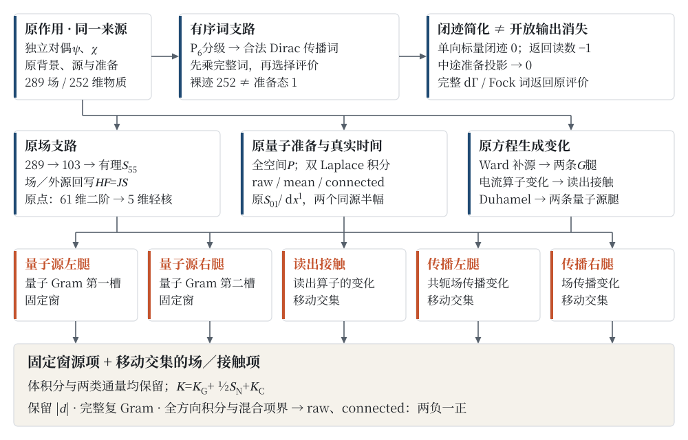
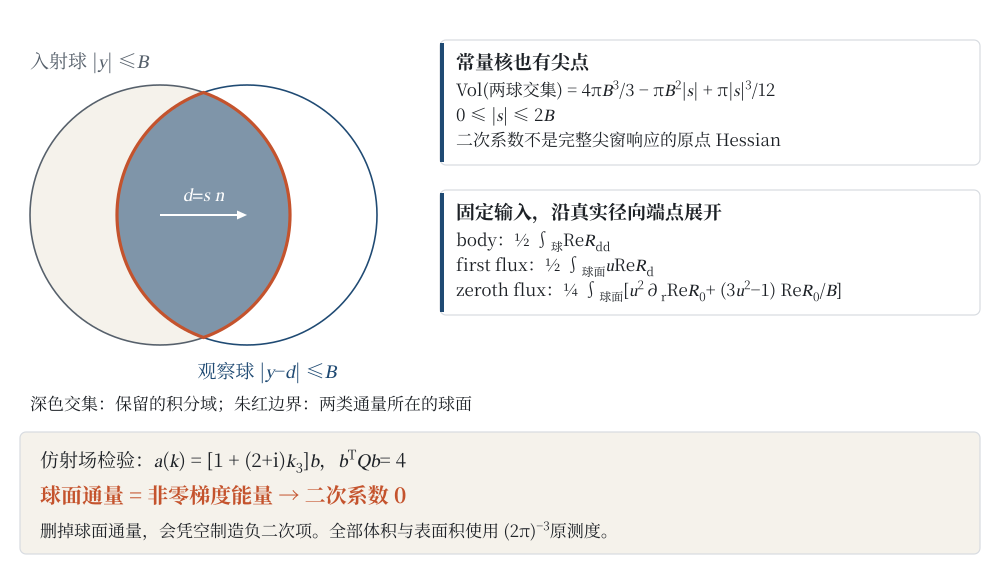
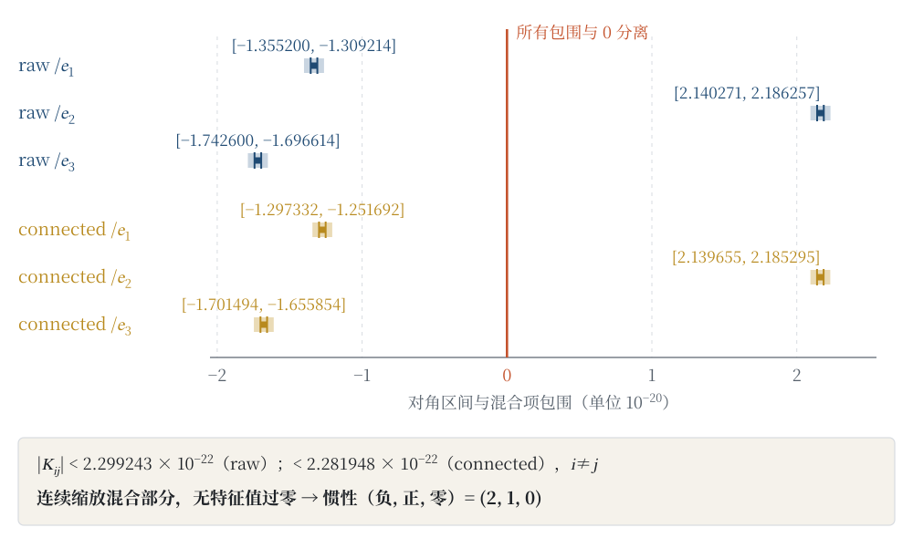
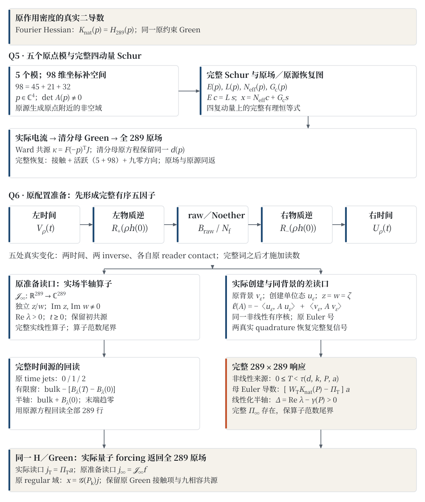

# 两负一正，裸迹宣誓：有序闭迹与整球响应曲率

**COURTYCOURT · THE THEORY TAKES THE STAND · Case 2**

*Two Minuses, One Plus, and a Bare Trace Under Oath: Ordered Closed Traces and Whole-Ball Response Curvature*

**作者：高健（Jian Gao）**\
独立研究者 · innersummer@hotmail.com · ORCID 0009-0009-5002-1655

## 摘要

单位矩阵登台，裸迹报出 \(252\)，原归一准备态报出 \(1\)：两者分别评价全物质载体的迹与固定准备中的作用。对固定的 \(S_{01}/dx^1\) 外源及同向读出算子、零输出动量、双 Laplace 参数 \(z=w=6c(1-i)\)、同一准备和半径 \(B\) 的入射／观察双球窗，我们证明：完整五项响应中，未中心化（raw）与中心化（connected）的二次系数张量均为两负一正。这里的“曲率”是扣除尖窗非解析一次项后的二次系数，不是完整响应在原点的 Hessian。

两条支路从同一个含独立对偶物质场的作用出发。在 \(P_6\) 分级下，任意有限合法有序规范传播词的闭迹等于其块对角部分的闭迹；规定的单向标量插入闭迹为零，两次同向插入之间夹任意合法传播词的开放链亦为零。准备态、边界权 \(K\) 与完整二次量子化词给出不同的评价；实际返回算子产生非零读数，中途准备投影则将它抹去。场方程支路从 \(289\) 场的辅助、Ward 与对称约化得到 \(103\) 场系统，将物质反馈计入一次，构造有理 \(55\) 维玻色核及场／外源恢复映射。原点物质块秩为 \(42\)，保留六个轻物质方向后得到 \(61\) 维二阶系统；其常项秩为 \(56\)，五维轻核同时给出线性与二次动量时间尺度，并由动态 \(g_{00}\) 源读出传播。

两条量子源腿、读出接触项和两条场传播腿组成完整五项响应。真实球交集的非解析一次项、完整复 Gram、隐式根导数、成对标架的全方向积分及向外有理余项共同确定二次张量。raw 三轴系数依次落在 \([-1.355200,-1.309214]\)、\([2.140271,2.186257]\)、\([-1.742600,-1.696614]\) 乘 \(10^{-20}\) 的模型单位区间内；全部混合项另有统一界，使惯性结论适用于完整张量。均值项（mean）独立保留，其第二轴区间跨零。

同一原作用的真实 Fourier Hessian还认回完整289场矩阵。五原点方向与98维坐标补空间生成全四复动量的精确Schur核、源生可逆半径和严格三阶余项，实际有序电流恢复带原分母的全场，接触与九零方向一并保留。另一原配置准备的完整有序五因子，经真实Noether接触与四个Fourier键生成实场半轴响应算子；同一历史被源生成的创建单位态／背景差读口消费后，在正的源生非线性时窗内产生完整 \(289\times289\) 量子张量 \(\Pi_T\)，母Euler幅度导数的有限积分严格为 \([W_T H_{289}-\Pi_T]a\)。同钟 \(W_T=T\)，完整线性化半轴保自身增长条件。新准备的响应由同一原Green返回全部场，其条件与指定双球窗分别陈述。

**关键词：** 独立对偶；有序闭迹；准备态读回；Schur 补；背景场响应；双球窗；边界通量；张量惯性。

## Abstract

With the identity matrix on the stand, the bare trace reports \(252\) and the originally normalized prepared state reports \(1\): the first evaluates the trace over the full matter carrier, the second the action within the fixed preparation. For the fixed \(S_{01}/dx^1\) external source with the co-directional readout operator, zero output momentum, double Laplace parameters \(z=w=6c(1-i)\), the same preparation, and an incoming/observing two-ball window of radius \(B\), we prove that in the complete five-term response both the uncentred (raw) and the centred (connected) quadratic coefficient tensors have two negative and one positive eigenvalue. Here “curvature” means the quadratic coefficient after the non-analytic linear term of the sharp window is removed, not the Hessian of the complete response at the origin.

Two branches start from the same action containing an independent dual matter field. Under the \(P_6\) grading, the closed trace of any finite admissible ordered gauge-propagation word equals the closed trace of its block-diagonal part; the prescribed one-directional scalar-insertion closed trace vanishes, and so does every open chain with an arbitrary admissible propagation word between two co-directional insertions. The prepared state, the boundary weight \(K\) and the complete second-quantized word give different evaluations; the actual return operator produces a nonzero reading, while an intermediate preparation projection erases it. The field-equation branch passes from \(289\) fields through auxiliary, Ward and symmetry reductions to a \(103\)-field system, counts matter feedback once, and constructs a rational \(55\)-dimensional bosonic kernel together with field/source recovery maps. The matter block at the origin has rank \(42\); keeping six light matter directions yields a \(61\)-dimensional second-order system whose constant term has rank \(56\), and its five-dimensional light kernel gives both linear and quadratic momentum time scales and is read out as propagation through the dynamical \(g_{00}\) source.

The two quantum source legs, the readout contact term and the two field propagation legs form the complete five-term response. The non-analytic linear term of the true ball intersection, the full complex Gram matrix, implicit root derivatives, full-direction integrals over paired frames and outward-rounded rational remainders together determine the quadratic tensor. The raw three-axis coefficients lie in \([-1.355200,-1.309214]\), \([2.140271,2.186257]\) and \([-1.742600,-1.696614]\) times \(10^{-20}\) model units; a uniform bound on all mixed terms makes the inertia statement apply to the complete tensor. The mean term is kept separately; its second-axis interval contains zero.

The actual Fourier Hessian of the same original action is also identified with the complete 289-field matrix. Five origin directions and a 98-dimensional coordinate complement generate an exact Schur kernel for all four complex momenta, a source-generated invertibility radius and a strict cubic remainder. The actual ordered current reconstructs the denominator-cleared whole field, retaining contact and all nine null directions. For another original configuration preparation, the complete ordered five-factor word, its actual Noether contact and four Fourier keys generate a real-field half-axis response operator. A source-generated created-unit/background difference then observes the same history: within its positive source-generated nonlinear time interval, it produces the full \(289\times289\) quantum tensor \(\Pi_T\), and the finite integral of the mother-Euler amplitude derivative is exactly \([W_T H_{289}-\Pi_T]a\). Coincident clocks give \(W_T=T\); the complete linearized half-axis retains its own growth condition. The same original Green returns this preparation's response to all fields, with conditions stated separately from those of the specified two-ball window.

**Keywords:** independent dual; ordered closed trace; prepared-state readback; Schur complement; background-field response; two-ball window; boundary flux; tensor inertia.

## 1　先报姓名，再报数字

### 1.1　252 与 1，并不互相作伪证

在本文的原物质载体 \(\mathcal M\) 上，

\[
 \operatorname{tr}_{\mathcal M}I=252,
 \qquad \langle w,Iw\rangle=1,\qquad \|w\|=1. \tag{1.1}
\]

把第二个数字从第一个数字里“纠正”出来，或者反过来，都换掉了评价问题。一个是全载体的裸矩阵迹，一个是固定准备对完整词的读数。若词来自原作用，问题还包括：传播逆取哪一侧，独立对偶如何演化，插入是否允许返回，准备在乘积完成前还是完成后施加。

这不是措辞争执。第 3 节的同向标量闭迹全部消失，第 4 节的原返回算子却给出 \(-1\)；在同一乘积中插入准备投影，读数立即变为 \(0\)。开放输出确实发生了，只是某一种评价没有看见它。

空间响应也有自己的身份证明。零探针量子源的 raw 外动量 Hessian 严格为负；把同源的场传播、读出接触、双窗边界和全部方向积分加回以后，完整二次系数却有一个正方向。法庭里的转折不靠新证人，只靠把同一份原方程读完。

### 1.2　主结果先入卷

以下所有量沿用第 2 节的模型坐标。令

\[
 c=\frac{6\sqrt{15}}{25},\quad
 \epsilon_B=\frac{5234375}{294988800512},\quad
 B=\sqrt2\epsilon_B,\quad z=w=6c(1-i). \tag{1.2}
\]

原外场为 \(A_\varepsilon=A_0+\varepsilon\cos(d\cdot x)\,dx^1S_{01}\)，读出算子取同一规范方向，观察输出 \(p_{\mathrm{out}}=0\)。令 \(\mathcal R_\alpha(d)\) 表示第 7 节完整五项的实读数，其中 \(\alpha=\mathrm{raw},\mathrm{mean},\mathrm{conn}\) 分别取完整空间准备投影的 \(I,P,I-P\)。

**定义 1.1（本文的响应曲率）。** 对每个实单位方向 \(n\)，以同一原配对构造的正负外动量支路满足

\[
 \mathcal R_\alpha(sn)=\mathcal R_\alpha(0)
 +a_\alpha(n)|s|+s^2n^T\mathsf K_\alpha n+o(s^2). \tag{1.3}
\]

其中 \(a_\alpha\) 是由真实球面值确定的偶方向函数，\(\mathsf K_\alpha\) 为实对称矩阵。本文称 \(\mathsf K_\alpha\) 为响应曲率张量；它是二次系数，交叉单项式为 \(2K_{ij}d_id_j\)。即使扣除一次项后的函数有二阶导数，该导数也对应 \(2\mathsf K_\alpha\)，而不是 \(\mathsf K_\alpha\)。

**定理 1.2（指定双球窗的完整惯性）。** 对上述外源、读出算子、准备、时间参数和两窗，式（1.3）的二次系数满足

\[
 \operatorname{Inertia}(\mathsf K_{\mathrm{raw}})
 =\operatorname{Inertia}(\mathsf K_{\mathrm{conn}})=(2,1,0), \tag{1.4}
\]

这里依次记负、正、零特征值的个数。下表是严格有理区间向外放宽后的十进制显示，单位为 \(10^{-20}\)：

| 方向 | raw | mean | connected |
|---|---:|---:|---:|
| \(e_1\) | \([-1.355200,-1.309214]\) | \([-0.060120,-0.055272]\) | \([-1.297332,-1.251692]\) |
| \(e_2\) | \([2.140271,2.186257]\) | \([-0.001635,0.003212]\) | \([2.139655,2.185295]\) |
| \(e_3\) | \([-1.742600,-1.696614]\) | \([-0.043357,-0.038509]\) | \([-1.701494,-1.655854]\) |

对 \(i\ne j\)，另有

\[
 |K_{ij}^{\mathrm{raw}}|<2.299243\,10^{-22},\quad
 |K_{ij}^{\mathrm{mean}}|<2.423430\,10^{-23},\quad
 |K_{ij}^{\mathrm{conn}}|<2.281948\,10^{-22}. \tag{1.5}
\]

第 11 节以这些混合界证明惯性；仅凭表中三个对角符号不足以得出该结论。mean 的 \(e_2\) 区间跨零，因而不给出 mean 的惯性。当 \(a_\alpha(n)\ne0\) 时，完整响应的首阶变化由 \(|s|\) 项决定；正的二次系数不等于完整响应沿该方向从原点首先上升。

### 1.3　同源，两条支路

Case 0 [C0] 给出共同原作用、独立对偶、指定准备及返回原评价的结构；Case 1 [C1] 给出原空间 Hamiltonian、共同域、真实发展、源导数及连续准备读数。本案传唤的仍是这些作用、算符与准备，只问三件事：有序词的分级代数；玻色核的消元与原场回写；完整五项经时间、动量和双球窗积分后的方向张量。

有序闭迹与五项响应从同一作用分叉：前者评价有限矩阵词，后者把原准备的量子 Gram 与玻色场响应配对。前者不是后者的中间近似；图 1 中没有从“裸迹为零”指向“空间响应为零”的箭头。

第12—13节继续沿同一原场与完整准备的实际消费者推进：原作用真实Hessian认回全289场矩阵，完整四动量Schur恢复实际源场；真实Noether有序历史再被源生创建／背景差观察消费，生成全289量子响应和原母Euler有限窗。两条新增结果各给完整证明，保原场、源、接触与初末共源。其新准备与时间域不替换前述固定球窗。

**图 1　同一原作用，两份证词；五项缺一不可。** 上支路保留词序、分级和评价方式；下支路将原物质反馈、原场回写与量子准备读数相接。两条量子源腿含 Duhamel 变化，使用固定窗；两条场传播腿与读出接触项使用随外动量移动的双球交集；朱红标出的五项缺一不可。窗口标注对应本案零输出动量、两窗等半径的设置，一般窗口分配见第 7.4 节。箭头表示依赖，不表示数值相等。

## 2　同一原作用与四种不能混用的坐标

### 2.1　场、载体与独立对偶

原场记为 \(\Phi=(e,\omega,B_{\mathrm{gr}},\lambda,A,B_g,\phi,\psi,\chi)\)。\(e\) 为余标架，\(\omega\) 为 Lorentz 联络，\(B_{\mathrm{gr}},\lambda\) 为引力辅助二形式，\(A,B_g\) 为规范联络及其辅助二形式，\(\phi\) 为四次外代数标量，\(\psi\) 与 \(\chi\) 是独立的物质场和对偶场。物质载体为

\[
 \mathcal M=\mathbb C^4\otimes
 (\Lambda^6\mathbb C^7\oplus\Lambda^2\mathbb C^7\oplus\Lambda^4\mathbb C^7),
 \qquad \dim\mathcal M=4(7+21+35)=252. \tag{2.1}
\]

内空间基为 \(e_0,\ldots,e_6\)，颜色指标 \(0,1,2\)，弱指标 \(3,4\)，其余两个指标 \(5,6\)。原活跃规范代数为 \(\mathfrak h=\{\operatorname{diag}(C,W,y,-y):C\in\mathfrak{su}(3),\ W\in\mathfrak{su}(2),\ y\in i\mathbb R\}\)，实维数为 \(12\)；全文规范顶点均由这一个嵌入作用于外幂。外幂作用由
\(\rho(X)(v_1\wedge\cdots\wedge v_r)=\sum_jv_1\wedge\cdots\wedge Xv_j\wedge\cdots\wedge v_r\)
确定，所有外积以升序基及置换符号计算。

取 Pauli 矩阵 \(\sigma_j\)，

\[
 \gamma^0=\begin{pmatrix}0&I_2\\-I_2&0\end{pmatrix},\quad
 \gamma^j=\begin{pmatrix}0&\sigma_j\\\sigma_j&0\end{pmatrix},\quad
 \gamma_5=\begin{pmatrix}-I_2&0\\0&I_2\end{pmatrix},\quad
 S=\gamma^0\gamma_5. \tag{2.2}
\]

原标量及其单向物质映射为

\[
 \begin{gathered}
 \phi_0=e_{0126}+e_{0124}+e_{0156}+e_{0145},\qquad
 T_\phi(w_6,w_2,w_4)=(w_2\wedge\phi,0,0),\\ Y_R=P_R T_\phi,\quad P_R=\operatorname{diag}(0,0,1,1).
 \end{gathered} \tag{2.3}
\]

\(\chi\) 在变分时不被设为 \(\psi^\dagger\)。这使原密度中的物质项及其两条 Euler 方程有确定的左右次序。

以 \(\mathcal W\) 表示二形式顶次配对，以 \(J\) 表示原引力内部映射，以 \(*_e\) 表示余标架 Hodge 映射，原作用密度可写为

\[
\begin{split}
\mathcal L={}&\mathcal W(B_{\mathrm{gr}},\widehat F_\omega)
-\tfrac12\mathcal W(B_{\mathrm{gr}},JB_{\mathrm{gr}})
+\mathcal W(\lambda,B_{\mathrm{gr}}-J\Sigma_e)\\
&+\mathcal W_g(B_g,F_A)-\tfrac\sigma2\mathcal W_g(B_g,*_eB_g)\\
&+\nu_e\left[\tfrac12g^{\mu\nu}\operatorname{Re}\langle D_\mu\phi,D_\nu\phi\rangle
-\|\phi-v\|^2+\operatorname{Re}\chi(i\Gamma^\mu D_\mu\psi+Y_R\psi)\right]. \tag{2.4}
\end{split}
\]

这里 \(v=\phi_0\) 固定，\(\eta=\operatorname{diag}(-1,1,1,1)\)、\(g=e^T\eta e\)、\(\nu_e=|\det e|\)。将联络的 Lorentz 指标反对称延伸到全部 \(a,b\)，规定

\[
 \begin{gathered}
 \Gamma_e^\mu=(e^{-1})^\mu{}_a\gamma^a,\qquad
 \Omega_\mu=\tfrac14\omega_{\mu ab}\gamma^a\gamma^b,\\
 D_\mu\psi=(\partial_\mu+\Omega_\mu+\rho(A_\mu))\psi,\quad
 D_\mu\phi=(\partial_\mu+\rho_4(A_\mu))\phi.
 \end{gathered}
\]

\(\Sigma_e^{ab}=e^a\wedge e^b\)。引力项中的内部映射 \(J\) 与顶次配对 \(\mathcal W\) 的六坐标矩阵见附录 A。曲率取 \(F_{\mu\nu}=\partial_\mu A_\nu-\partial_\nu A_\mu+[A_\mu,A_\nu]\)，Lorentz 曲率同样定义；\(\Sigma_e\) 为余标架的二次楔积。二形式排序为 \(01,02,03,23,31,12\)，顶次配对由 \(\varepsilon^{0123}=1\) 决定。原规范双线性型在颜色、弱块分别为 \(-\operatorname{Re}\operatorname{tr}(XX^\prime)\)，在母 \(U(1)\) 原坐标上为 \(-\operatorname{Re}(yz)\)；后者不乘双电荷矩阵迹带来的因子 \(2\)。附录 A 给出背景与矩阵的重建方式；完整稀疏矩阵及坐标顺序见代码与数据可得性一节。

### 2.2　背景、时间与 Fourier 号

固定

\[
 N=\frac{3\sqrt{30}}{25},\quad s_0=\sqrt2,\quad a=\frac{3\sqrt2}{5},\quad
 \omega_0=\frac{3N\sqrt2}{5},\quad \sigma=\frac12,\quad e=\operatorname{diag}(N,1,1,1). \tag{2.5}
\]

空间 Lorentz 背景为 \(\omega_{1,23}=\omega_{2,31}=\omega_{3,12}=\sqrt2\)，规范背景为 \(A_0=0,A_j=a\tau_j\)，\(\tau_j=i\sigma_j/2\) 嵌入颜色 \(0,1\) 子块。原解在 \(t=0\) 的物质与对偶为 \(\psi_0=2w\)、\(\chi_0=2\sqrt2\,w^\dagger S\)。它们也是下述共转表示中的常值背景；原时间表示的相位由 \(U_{\mathrm{rot}}\) 恢复。独立变分仍使用独立 \(\psi,\chi\)。

本文始终用原物理时间 \(t\)。矩阵计算中的 \(\tau=Nt\) 或 \(ct\) 只是换元。记号的换算固定为

| 记号 | 含义及换算 |
|---|---|
| \(\lambda\) | 原时间指数变量；振荡能量 \(E\) 对应 \(\lambda=-iE\) |
| \(u,q_{\mathrm{ax}}\) | 有理轴向坐标，\(\lambda=N\sqrt2\,u,\ k_3=\sqrt2\,q_{\mathrm{ax}}\) |
| \(p=2\pi\xi\) | 物质 Fourier 积分的物理动量 |
| \(y,d\) | 玻色入射物理动量、外场物理动量；负相位输出为 \(y-d\) |
| \(c=N\sqrt2\) | 本文 Laplace 换元常数；不是另设光速或实验单位 |
| \(B=\sqrt2\epsilon_B\) | 入射和观察动量球的半径；不是位置准备球的半径 |

原 \(289\) 场的物质坐标采用共同相位旋转的共转表示：\(Q=\gamma_5+2P_6\)，\(U_{\mathrm{rot}}(t)=e^{-i\omega_0tQ}\)，\(H_{\mathrm{st}}=H_{\mathrm{orig}}-\omega_0Q\)。它不改变物理时间；原背景满足

\[
 \psi_{\mathrm{orig}}(t)=U_{\mathrm{rot}}(t)\psi_0,\qquad
 \chi_{\mathrm{orig}}(t)=\chi_0S U_{\mathrm{rot}}(t)^\dagger S.
\]

第 6 节的空间电流使用原时间 Hamiltonian \(H_{\mathrm{orig}}\)，而原 \(289\) 场消元使用上述共转坐标。物质原位置准备球的半径为 \(1\)，经 Dirac Green 滤波后的归一化也不随 \(B\) 或外场重新选择。

### 2.3　三种矩阵运算，三种责任

对有限纤维矩阵用 \(\dagger\) 表示 Hermitian 伴随；原独立对偶和实化 Euler 矩阵的形式对称性则是 \(H(-p)^T=H(p)\)。后者的 \(T\) 与前者的 \(\dagger\) 不可交换使用。称域为 regular，是指正在使用的主部和块逆在该域真实可逆；第 3、5、9 节分别给出所需的域。

原评价用 \(\Omega\) 表示：对原归一准备有 \(\Omega(A)=\langle w,Aw\rangle\)。连续空间的准备嵌入 \(E\) 满足同一返回关系 \(\Omega(E^\dagger A E)=\langle Ew,AEw\rangle\)。在原独立对偶中，同一个读数写成

\[
 \Omega(A)=\frac{\chi_0(SA\psi_0)}{4\sqrt2}=\langle w,Aw\rangle. \tag{2.6}
\]

这里 \(S^2=I\)，自旋交换 \(S\) 施加于完成乘积后的整个 \(A\)，而非插在每两个因子之间。准备评价也作用于完整乘积，中途不插入准备投影。第 4 节先形成完整 Fock 词，第 6 节先形成完整连续 Gram，再返回式（2.6）的同一评价。

## 3　闭迹证词：箭头可以进去，不能凭空回来

### 3.1　独立对偶传播与 Dirac 逆

写原纤维方程为 \(D\psi=(C_0\partial_t+L)\psi=0\)，其中 \(C_0=i\gamma^0/N\) 可逆。Hamiltonian 与 Dirac 逆的准确关系为

\[
 H=-iC_0^{-1}L,\quad D_z=-iC_0(z-H),\qquad
 G_D(z)=i(z-H)^{-1}C_0^{-1}. \tag{3.1}
\]

因此 \(D_zG_D=G_DD_z=I\)。右端的 \(C_0^{-1}\) 和前面的 \(i\) 都属于原方程。

令 \(A=-C_0^{-1}L=-iH\)、\(U(t)=e^{tA}\)。独立对偶的传播为

\[
 \psi(t)=U(t)\psi(0),\qquad
 \chi(t)=\chi(0)C_0U(-t)C_0^{-1}. \tag{3.2}
\]

直接求导给 \(\partial_t(\chi C_0\psi)=0\)。这里没有把 \(\chi(t)\) 换成 \(\psi(t)^\dagger\)；原 \(252\) 维 \(H\) 的单向项一般也不是自伴的。

### 3.2　分级理想与任意长的合法词

定义投影

\[
 P_6=I_4\otimes\operatorname{diag}(I_7,0_{21},0_{35}). \tag{3.3}
\]

称 \(B\) 为块对角算符，若 \([B,P_6]=0\)；称 \(N_a\) 为单向箭头，若

\[
 P_6N_a=N_a,\qquad N_aP_6=0. \tag{3.4}
\]

即 \(N_a=P_6N_a(I-P_6)\)，从非六次外幂进入六次外幂。对所有块对角 \(B\) 与箭头 \(N_a,N_b\)，

\[
 N_aBN_b=0,\quad BN_a,\ N_aB\text{仍为箭头},\quad \operatorname{tr}N_a=0. \tag{3.5}
\]

最后一式由 \(\operatorname{tr}(P_6N_a)=\operatorname{tr}(N_aP_6)\) 得到。

**定义 3.1（合法有序规范传播词）。** 对每个腿标签 \(j\)，给定同一原自由纤维 Hamiltonian \(H_{0,j}\)、原单向项 \(N_j\)、谱参数 \(z_j\) 和规范密度顶点 \(V_j\)。要求 \([H_{0,j},P_6]=[C_{0,j},P_6]=[V_j,P_6]=0\)，\(N_j\) 满足（3.4），\(C_{0,j}\) 可逆，\(z_j-H_{0,j}\) 可逆。词是这些 Dirac 传播与顶点的任意有限有序乘积；不同腿的动量与谱参数可以不同，乘法次序保持不动。

**定理 3.2（任意有限词的闭迹简化）。** 设 \(H_j=H_{0,j}+N_j\)。则

\[
 (z_j-H_j)^{-1}=R_{0,j}+R_{0,j}N_jR_{0,j},
 \quad R_{0,j}=(z_j-H_{0,j})^{-1}. \tag{3.6}
\]

将词中每个 \(G_{D,j}\) 换成 \(iR_{0,j}C_{0,j}^{-1}\)，得到词 \(W_0\)，则

\[
 W=W_0+N_W,\qquad P_6N_W=N_W,\quad N_WP_6=0,\qquad
 \operatorname{tr}W=\operatorname{tr}W_0. \tag{3.7}
\]

**证明。** 整条证明靠（3.5）：两枚箭头之间无论隔着什么块对角因子，乘在一起都消失；剩下的单枚箭头迹为零。因 \(R_{0,j}\) 块对角，\(N_jR_{0,j}N_j=0\)。用左右乘法分别检验（3.6）即得双侧逆。每个完整腿都是“块对角＋箭头”。按原次序展开有限乘积，含两枚或更多箭头的项由（3.5）消失；含一枚的项仍是箭头；不含箭头的项恰为 \(W_0\)。取迹便得（3.7）。证明不交换任何两枚不同顶点，不作动量积分，也不截断词长。□

**推论 3.3（单向标量插入）。** 对原 \(70\) 个实标量方向的非零顶点 \(Y_a\)，任意合法两侧词 \(W_L,W_R\) 均满足

\[
 \operatorname{tr}(W_LY_aW_R)=0,\qquad
 Y_a W Y_b=0\quad\text{作为开放算符恒等式}. \tag{3.8}
\]

证明仍是（3.4）与（3.5）。这一次覆盖全部 \(70^2=4900\) 个同向双插入，而非仅某个对角标量例子。

### 3.3　不是所有闭迹都沉默

先请一个开口说话的规范词：规范词可以有真实非零迹。在附录 A 的原顶点枚举中取第一规范顶点两次，两条腿分别用

\[
 (k_1,z_1)=(0,1+2i),\qquad
 (k_2,z_2)=((0,0,3\sqrt2/2),3+i).
\]

直接用原 Dirac 逆得到

\[
 \operatorname{tr}W=
 \frac{\begin{gathered}-95360266467327071496720412359528906607208738863660800\\
 -53185433068294844818992564133304778477617846100000000\,i\end{gathered}}
 {15868525877183800686561094790721538271497991716304161}\ne0. \tag{3.9}
\]

实部、虚部与分母各五十三位，全由原矩阵词的有理运算当场算出。三规范顶点词的另一实际例子闭迹为零，却有非零开放差 \(W-W_0\)。闭迹相等不意味着两个开放算符相等。

反向箭头则改变争点。对原时间单向项 \(N\)，

\[
 \operatorname{tr}(N^\dagger N)=\frac{1296}{125},\qquad
 \operatorname{tr}(N+N^\dagger)^2=\frac{2592}{125}. \tag{3.10}
\]

\(N^\dagger\) 从六次外幂返回原扇区，不满足（3.4）。因此（3.10）与（3.8）分别评价不同的完整词。将原单向标量改成 Hermitian 读出算子，已经增加了一条真实返回路径。

## 4　准备态交叉询问：先把整句话说完

### 4.1　准备、边界权与完整 Fock 词

准备态坐上证人席，先说清它看不见什么。原单位准备 \(w\) 满足 \(P_6w=0\)，故对每枚箭头 \(N_a\)，\(\langle w,N_aw\rangle=0\)。原边界权在一般余标架上为

\[
 K_e=-i|\det e|\sqrt2\,S C_0(e),\qquad K=\sqrt2\gamma_5 \text{ 于本背景}. \tag{4.1}
\]

它与 \(P_6\) 对易。由（3.7），合法规范词同时有

\[
 \langle w,Ww\rangle=\langle w,W_0w\rangle,\qquad
 \langle w,KWw\rangle=\langle w,KW_0w\rangle. \tag{4.2}
\]

令 \(\mathcal F_-({\mathcal M})=\bigoplus_{r=0}^{252}\Lambda^r\mathcal M\)，\(J_1:\mathcal M\to\mathcal F_-\) 为一粒子嵌入。二次量子化 \(d\Gamma(A)\) 在 \(r\) 粒子扇区逐槽作用 \(A\)。对任意有限有序序列，

\[
 \mathbb W=d\Gamma(A_1)\cdots d\Gamma(A_m),\qquad
 \mathbb WJ_1v=J_1(A_1\cdots A_m)v. \tag{4.3}
\]

**命题 4.1（完整词的原读回）。** 先形成 \(\mathbb W\)，再施加准备 \(J_1w\)，其读数为

\[
 \langle J_1w,\mathbb WJ_1w\rangle
 =\Omega(J_1^\dagger\mathbb WJ_1)
 =\langle w,A_1\cdots A_mw\rangle. \tag{4.4}
\]

左端加 \(d\Gamma(K)\) 即给加权读数。代入式（2.6）评价的是整枚 \(J_1^\dagger\mathbb WJ_1\)。证明由 \(d\Gamma(A)J_1=J_1A\) 对词长归纳得到。一般 Fock 算符并不因此等于 \(d\Gamma(A_1\cdots A_m)\)。对含产生、湮灭的完整词，使用其实际一粒子压缩，不将（4.3）误用到改变粒子数的中间态。□

边界权也当庭试一次，取交换矩阵 \(T_S=-iC_0^{-1}S\)：

\[
 KT_S=-N\sqrt2 I,\qquad
 \langle w,KT_Sw\rangle=-N\sqrt2=-\frac{6\sqrt{15}}{25}. \tag{4.5}
\]

对由作用导出的顶点 \(V\)，定义 \(T=-iC_0^{-1}V\)、\(B_V=-KT\)，则原体积电流的准备读数为 \(4\langle w,B_Vw\rangle\)。振幅 \(2\) 的平方给出 \(4\)。完整 \(252\) 维公式中的权是 \(\gamma_5\)，不能在此提前换成共转荷 \(Q=\gamma_5+2P_6\)。

### 4.2　返回读数 −1；中途投影读数 0

取原标量方向 \(\delta\phi=e_{0234}\)。准备 \(w\) 的四个非零分量按“spin；外幂基”记为

\[
 w_{0;15}=\tfrac12,\quad w_{1;05}=-\tfrac12,\quad
 w_{2;15}=\tfrac12,\quad w_{3;05}=-\tfrac12. \tag{4.6}
\]

令行 \(r\) 读取 spin \(2\)、\(\Lambda^6\) 基 \(e_{012345}\)，\(Y=Y_{\delta\phi}\)。按（2.3）的楔积符号，\(rY(2w)=-1\)。定义实际返回算子 \(R=2wr\)，便有

\[
 RYw=-w,\quad \langle w,RYw\rangle=-1,\qquad
 \langle w,R P_wYw\rangle=0,\quad P_w=|w\rangle\langle w|. \tag{4.7}
\]

后一式是因为 \(\langle w,Yw\rangle=0\)。返回算子不是一枚合法规范顶点，而是对原开放输出的明确读出算子。于是 −1 是开放输出被点名后的证词：对象、路径和读数一并给出，不从零期望值推断零输出。

原 \(70\) 个标量方向中，\(18\) 个确实满足 \(Y_aw\ne0\)，而原单向准备读数仍全为零。使用 Hermitian 力读出算子后，实际双标量阵列有 \(36\) 个非零读数。规范词也并不允许任意插入 \(P_w\)：已生成的 \(16\) 个实际规范整词中有 \(6\) 个会被这种中途投影改变。

### 4.3　延迟传播的可逆域与连续原评价

原自由 Hamiltonian 的自伴纤维在 \(z=E+i\eta\)、\(\eta>0\) 上有真实逆；（3.6）把它提升为含原单向项的 Dirac 逆。具体原 chiral 排序下

\[
 D=\begin{pmatrix}0&A\\B&Y_R\end{pmatrix},\qquad
 D^{-1}=\begin{pmatrix}-B^{-1}Y_RA^{-1}&B^{-1}\\ A^{-1}&0\end{pmatrix}. \tag{4.8}
\]

双侧相乘验证（4.8），也固定了 \(A^{-1},B^{-1}\) 的位置。原准备的连续读数随后以完整源滤波放在 observable 两端：若 \(e=Ew\)、\(R=G_D(i)\)、\(n=\|Re\|>0\)，则

\[
 \Omega(E^\dagger R^\dagger A R E)/n^2
 =\langle\psi,A\psi\rangle,\qquad \psi=Re/n. \tag{4.9}
\]

\(n\) 使用这一个固定 \(e\) 计算；它不是对每个输入重新归一。原滤波不在每两个词之间重复出现。第 6 节的全部连续 Gram 都通过（4.9）返回同一评价。

## 5　消元之后，原场必须回来

### 5.1　289 → 103：消去的是坐标，不是方程责任

原背景的实活跃坐标包括 \(16\) 个余标架、\(24\) 个 Lorentz 联络、\(36+36\) 个引力辅助、\(48\) 个规范联络、\(72\) 个规范辅助、\(9\) 个标量轨道方向，以及各 \(24\) 个原物质与独立对偶方向，总数为 \(289\)。令 \(H_{289}(p)\) 为（2.4）的实二次变分矩阵，所有微分先保留独立左右动量，最后施加原形式转置关系。

辅助方程直接给

\[
 B_g=-\sigma^{-1}*_eF_A,\quad
 \delta B_g=K_g^{-1}(\delta F_A-\delta K_g\,B_{g,0}),
 \quad\delta B_{\mathrm{gr}}=J\delta\Sigma_e,\quad
 \delta\lambda=J\delta B_{\mathrm{gr}}-\delta\widehat F_\omega. \tag{5.1}
\]

这里 \(K_g\) 是原辅助方程中乘 \(B_g\) 的实际线性映射，不能在变化 \(e\) 时冻结 Hodge。按这些方程消去 \(72+72\) 个辅助坐标，再消去 \(24\) 个 Lorentz 坐标、\(9\) 个 Ward 标量轨道和 \(9\) 个源对称方向，得到

\[
 289\longrightarrow217\longrightarrow145\longrightarrow121
 \longrightarrow112\longrightarrow103. \tag{5.2}
\]

最后九个源对称方向由三个颜色 \(SU(2)\) 与六个 Lorentz 方向构成。每步都保存解图和源的逆转置回写。前两组辅助消元不改变物质块；Lorentz 消元却改变其中 \(128\) 个条目。直接从未消元的自由物质块取逆，会得到另一枚核。

### 5.2　一次物质反馈与有理玻色核

将实际 \(103\) 场系统按玻色 \(b\in\mathbb C^{55}\)、物质及独立对偶 \(m\in\mathbb C^{48}\) 分块：

\[
 K_{103}=\begin{pmatrix}K_{bb}&K_{bm}\\K_{mb}&M\end{pmatrix},
 \qquad W=-M^{-1}K_{mb},\qquad
 S_{55}=K_{bb}-K_{bm}M^{-1}K_{mb}. \tag{5.3}
\]

**定义 5.1（共同可逆域）。** 两种消元次序的比较域为：原辅助块 \(A_{\mathrm{aux}}\)、原物质块 \(D_{\mathrm{mat}}\)、以及
\(D_{\mathrm{mat}}-CA_{\mathrm{aux}}^{-1}B\) 与 \(A_{\mathrm{aux}}-BD_{\mathrm{mat}}^{-1}C\)
同时可逆的参数集合。式（5.3）本身仅在实际消元后 \(M\) 可逆处使用。该域非空；原有理样本 \(u=\frac35(1-3i),q_{\mathrm{ax}}=\frac3{10}\) 使两种消元次序涉及的块都具有双侧逆。

**定理 5.2（一次反馈及原方程回写）。** 在上述共同域，两种合法消元次序给出同一 \(S_{55}\)。存在由各步解图合成的 \(F\in\mathbb C^{289\times55}\)，以及由外源的商映射及逆转置构成的 \(J_{\mathrm{src}}\in\mathbb C^{289\times55}\)，使

\[
 H_{289}F=J_{\mathrm{src}}S_{55}. \tag{5.4}
\]

若 \(S_{55}R_{55}=I\)，则 \(x=FR_{55}j\) 满足全部 \(289\) 行原方程
\(H_{289}x=J_{\mathrm{src}}j\)。

**证明。** 场图好写，难的是让外源也沿原路回来。对任意可逆块 \(A\)，

\[
 \begin{pmatrix}A&B\\C&D\end{pmatrix}
 \begin{pmatrix}-A^{-1}B\\I\end{pmatrix}
 =\begin{pmatrix}0\\D-CA^{-1}B\end{pmatrix}. \tag{5.5}
\]

依原次序复合（5.5），保留每步物质解 \(m=Wb\) 及辅助解，得到场图 \(F\)。源先由原 \(112\to103\) 商图 \(Q\) 取 \(Q(-p)^T\)，再反向恢复 Ward 标量和辅助坐标；这个构造给出 \(J_{\mathrm{src}}\)，不把 \(HF\) 定义成源。对两个相邻可逆块，以（5.5）消去总块，或用块逆的两种分解，均得到唯一的剩余方程；Woodbury 恒等式给两种表达相等。逐步复合即得（5.4）。□

恢复到原方程的外源含 \(32\) 个非零 Ward 标量源条目，典型形式为 \(-T_{\mathrm{other}}(-p)^TJ_{112}\)。删除这些条目会破坏（5.4）。同样，既有原物质电流反馈已由原方程生成；式（5.3）将这一反馈计入一次。这一 Schur 反馈是线性化场方程的消元，不是另加一枚真空 \(\operatorname{Tr}\log\) 环。

### 5.3　原点：42 个重方向，6 个轻方向

原点 \(M_0=M(0,0)\) 奇异，故（5.3）的有理逆不能直接代入原点。实际有

\[
 \operatorname{rank}M_0=42,\qquad
 \det M_{hh,0}=
 -\frac{58990238851842729101108654352661116616704}
 {9094947017729282379150390625}\ne0. \tag{5.6}
\]

按这一 \(42\times42\) 主块分出六个保留物质坐标。若 \(G_0=M_{hh,0}^{-1}\)，原点轻方向的完整物质向量为

\[
 E_6=\begin{pmatrix}-G_0M_{h\ell,0}\\I_6\end{pmatrix},\qquad M_0E_6=0. \tag{5.7}
\]

保留坐标轴自身一般不在零空间；它们必须带回上半部重场修正。

写重块 \(M_{hh}=M_{hh,0}+\Delta\)。在 \(\|G_0\Delta\|<1\) 的邻域，

\[
 M_{hh}^{-1}=G_0-G_0\Delta G_0+G_0\Delta G_0\Delta G_0
 -(G_0\Delta)^3M_{hh}^{-1}. \tag{5.8}
\]

将实际多项式按总次数截到二阶，得到玻色 \(55\) 加轻物质 \(6\) 的 \(61\) 维系统。式（5.8）的余项范数不超过
\(\|G_0\Delta\|^3\|G_0\|/(1-\|G_0\Delta\|)\)。回写全部 \(289\) 场后，二阶方程的残差从总次数 \(3\) 开始，且三阶项确实非零。

### 5.4　五维轻核与两种时间尺度

**定理 5.3（五维原轻核）。** 上述 \(61\) 维二阶系统的常项秩为 \(56\)。消去 \(56\) 个常项重方向得到五维轻核；从 \(103\) 场直接消去相应 \(98\) 个方向所得二阶核相同。原保留坐标编号为 \(94,100,106,112,118\)，均带有完整重场解图。

可用五种原物质／对偶变化构造自然基：实振幅反向缩放、相位反向旋转、轴实缩放、轴相位旋转，以及独立对偶的虚变化。具体路径列于附录 B。此自然基到保留坐标的行列式为 \(4\)。在自然基中，五维核的一阶项只有

\[
 (K_1)_{35}=-8u,\qquad (K_1)_{53}=8u, \tag{5.9}
\]

此处矩阵下标从 \(1\) 开始。二阶完整矩阵见附录 B；一阶核上的三维对角主部为

\[
 \operatorname{diag}\left(
 \frac{16}{9}(5q_{\mathrm{ax}}^2+3u^2),
 \frac{32}{737}(55q_{\mathrm{ax}}^2+67u^2),
 \frac{20}{81}(125q_{\mathrm{ax}}^2-162u^2)\right). \tag{5.10}
\]

**证明与色散推导。** 五维核只有一个，却要同时说出两种时间尺度。常项秩由实际 \(56\) 维可逆块及五列零空间图给出；两种降维路线逐个比较 \(1,u,q_{\mathrm{ax}},u^2,uq_{\mathrm{ax}},q_{\mathrm{ax}}^2\) 六个系数矩阵。由完整五维矩阵直接取行列式，

\[
 \lim_{t\to0}\frac{\det K(tu,tq_{\mathrm{ax}})}{t^8}
 =\frac{655360}{537273}u^2(5q_{\mathrm{ax}}^2+3u^2)
 (55q_{\mathrm{ax}}^2+67u^2)(125q_{\mathrm{ax}}^2-162u^2). \tag{5.11}
\]

保留坐标中的系数相差基变换的平方 \(16\)。三个二次因子给原物理领先色散

\[
 \frac{\lambda^2}{k^2}=-\frac{18}{25},\quad
 -\frac{594}{1675},\quad \frac13. \tag{5.12}
\]

另取慢尺度 \(u=\varsigma q_{\mathrm{ax}}^2\)。相关静态二阶块成为
\(\left(\begin{smallmatrix}-40/3&-8\varsigma\\8\varsigma&-10/3\end{smallmatrix}\right)\)，
完整行列式的 \(q_{\mathrm{ax}}^{10}\) 系数为

\[
 \frac{512000000}{439587}(36\varsigma^2+25). \tag{5.13}
\]

故慢支路 \(\varsigma=\pm5i/6\)，即 \(\lambda^2/k^4=-3/20\) 的领先行为。线性尺度与二次尺度均由同一原核生成，不能把二阶系统当成所有有限动量上的精确色散。□

### 5.5　原动态 \(g_{00}\) 源，不是任意选一个矩阵元

原度规变化为 \(\delta g_{00}=-2N\,\delta e_{00}\)。在作用加 \(+J_{00}\delta g_{00}\) 的 convention 下，受迫场为负逆作用于实际源；若写 Green 方程 \(Hx=J\)，则保留其正号 convention。原场图和源图将这两种记法准确对应。

对动态 \(g_{00}\) 源，先解实际 \(25\) 维系统，再恢复 \(33\) 维独立对偶块与全部 \(289\) 场，得到有理响应。令 \(u=rq_{\mathrm{ax}}\) 沿固定射线趋近原点，实际结果为

\[
 \lim_{q_{\mathrm{ax}}\to0}G_{00}(rq_{\mathrm{ax}},q_{\mathrm{ax}})
 =\frac{54\sqrt{30}(297r^2-125)}{3125(162r^2-125)},
 \quad r^2\ne\frac{125}{162}. \tag{5.14}
\]

其静态极限为 \(18N/125\)，纯时间极限为 \(33N/125\)；联合原点没有方向无关的值。在三维核心中，读出行与外源列分别为 \((0,0,-36u/25)\)、\((0,0,+36u/25)\)，实际轻场解含

\[
 \theta=\frac{729u}{125(125q_{\mathrm{ax}}^2-162u^2)}. \tag{5.15}
\]

原接触 \(18N/125\) 与动态部分
\(\frac{486Nu^2}{25(162u^2-125q_{\mathrm{ax}}^2)}\)
相加，（5.14）原样回来：\(g_{00}\) 源确实激发了（5.12）的第三条传播支。完整有理分母在领先锥线上并不恒为零，其具体表达式见附录 B。

## 6　原准备穿过真实时间，而不是停在 \(t=0\)

### 6.1　原 Dirac 滤波与完整空间投影

原单位位置球准备为

\[
 e(x)=\frac{\mathbf1_{|x|\le1}}{\sqrt{4\pi/3}}w,\qquad
 \widehat\psi(p)=\frac{f(p)b(|p|)}n,\quad
 f(p)=i(i-H(p))^{-1}C_0^{-1}w, \tag{6.1}
\]

其中
\(b(r)=4\pi(\sin r-r\cos r)/(r^3\sqrt{4\pi/3})\)，
\(n^2=\int\|f(p)b(|p|)\|^2d^3p/(2\pi)^3\)。原实际 \(12\) 维占据载体是全 \(252\) 维算符的双侧 reducing 子空间；在此 \(H(p)=H_0+\sum p_jH_j\) 自伴，\([K,H]=0\)，且

\[
 \left(\sum p_jH_j\right)^2=N^2|p|^2I,\qquad K^2=2I. \tag{6.2}
\]

这里的载体为 \(\mathcal H_{12}=\mathbb C^4\otimes\operatorname{span}\{e_{05},e_{15},e_{25}\}\)，\(F_{12}\) 是按这组基到 \(\mathcal M\) 的等距嵌入。原单向 Yukawa 在全空间仍非零，只是在这个具体载体的两侧限制为零。将颜色 \(0,1\) 上的 \(\tau_j\) 补为 \(3\times3\) 矩阵，原时间矩阵明确为

\[
 H(p)=\frac{3N\sqrt2}{2}(\gamma_5\otimes I_3)
 +Na\sum_{j=1}^3 i\gamma^0\gamma^j\otimes\tau_j
 -N\sum_{j=1}^3p_j\gamma^0\gamma^j\otimes I_3.
\]

其常项未减去共转相位 \(\omega_0Q\)。

设 \(Q=K/\sqrt2\)，\(G_0=C_0^{-1}/(iN)\)。每个 chirality \(\chi=\pm1\) 的 seed \(s_\chi=(I+\chi Q)G_0w/2\) 与 partner \(t_\chi=(\chi H-\omega_0)s_\chi/N\) 满足

\[
 \|s_\chi\|^2=\tfrac12,\quad
 \langle s_\chi,t_\chi\rangle=0,\quad
 \|t_\chi\|^2=|p|^2/2,\quad
 Hs_\chi=\chi(\omega_0s_\chi+Nt_\chi),\quad
 Ht_\chi=\chi(N|p|^2s_\chi+3\omega_0t_\chi). \tag{6.3}
\]

当 \(r=|p|>0\) 时，正交归一基为 \((\sqrt2s_\chi,\sqrt2t_\chi/r)\)，在此基中的矩阵才是 \(\chi\left(\begin{smallmatrix}\omega_0&Nr\\Nr&3\omega_0\end{smallmatrix}\right)\)。在 \(p=0\) 处，\(t_\chi=0\)，该二向量基退化；下面直接用未归一向量写出的滤波式仍正则：

\[
 f(p)=-N\sum_{\chi=\pm1}
 \frac{(i-3\chi\omega_0)s_\chi+\chi Nt_\chi}
 {(i-\chi\omega_0)(i-3\chi\omega_0)-N^2|p|^2}. \tag{6.4}
\]

分母虚部为 \(-4\chi\omega_0\ne0\)，所以这枚准备 Green 对所有实动量 regular。

单位球的实际重叠函数为 \(1-\frac34r+\frac1{16}r^3\)（\(0\le r\le2\)）。定义

\[
 J(\kappa)=\int_0^2(r-3r^2/4+r^4/16)e^{-\kappa r}\,dr
 =\frac{2\kappa^3-3\kappa^2+3-3(\kappa+1)^2e^{-2\kappa}}{2\kappa^5}, \tag{6.5}
\]

并取 \(\kappa^2=(1-3\omega_0^2+4i\omega_0)/N^2,\operatorname{Re}\kappa>0\)、\(Z=(i-3\omega_0)J(\kappa)\)。由（6.4）作完整角积分再用（6.5），

\[
 n^2=\operatorname{Im}Z\simeq0.208904454900,\quad
 \mu_0=\frac{2\sqrt2}{N^2}\frac{\operatorname{Re}Z}{\operatorname{Im}Z}
 \simeq-0.701355479214, \tag{6.6}
\]

\[
 \|A_0\psi\|^2=\frac8{N^2n^2}-\frac8{N^4},\qquad
 \|(A_0-\mu_0)\psi\|^2\simeq45.287036020565. \tag{6.7}
\]

式（6.6）—（6.7）中 \(A_0=2KH/N^2\) 是零空间探针的原相位电流，其下标 \(0\) 不表示规范联络的时间分量。全文以下的 \(P=|\psi\rangle\langle\psi|\) 是整个 \(L^2\) 空间上的秩一投影。它不是逐动量准备，也不是将 \(12\) 维载体再次压成某个兼容子空间。

### 6.2　原电流与两个同源半幅

令 \(M_k=e^{ik\cdot X}\)。原相位电流在共同 \(H\) 域上为

\[
 A_k=N^{-2}(KM_kH+H^\sharp M_kK),\qquad
 B_{\varepsilon,k}(t)=U_\varepsilon(t)^\dagger A_{\varepsilon,k}U_\varepsilon(t). \tag{6.8}
\]

在（6.1）的实际 reducing 空间，\(H^\sharp=H\)。全 \(252\) 维共同域上则有 \(H=H_{\mathrm{free}}+N_Y\)、\(H^\sharp=H_{\mathrm{free}}+N_Y^\dagger\)，其中 \(N_Y=-iC_0^{-1}Y_R\)，故 \(N_Y^\dagger=iY_R^\dagger(C_0^{-1})^\dagger\)。伴随作用于整个单向时间项，保留其左右顺序。cosine 电流的每个 Fourier shift 带一次 \(1/2\)：

\[
 A_{\cos k}(p_{\mathrm{out}},p_{\mathrm{in}})
 =\frac{KH(p_{\mathrm{in}})+H(p_{\mathrm{out}})^\dagger K}{2N^2},
 \quad p_{\mathrm{out}}=p_{\mathrm{in}}\pm k. \tag{6.9}
\]

原完整 Fock 电流是
\(\frac2N\operatorname{Herm}[d\Gamma(K)d\Gamma(M_{\cos k}H/N)]\)，Hermitian 化作用于整个乘积；（6.8）是它在一粒子输入上的实际作用。

原规范方向 \(dx^1S_{01}\) 使用未除以 \(2\) 的 \(S_{01}\)。从含体积的密度顶点生成

\[
 V_{252}=-iC_0^{-1}\frac{V_{\mathrm{density}}(1,S_{01})}{N},\qquad
 V=F_{12}^\dagger V_{252}F_{12},\quad V^\dagger=V,\quad [K,V]=0,\quad\|V\|=N. \tag{6.10}
\]

取 \(W_d=\cos(d\cdot X)V\)、\(H_\varepsilon=H+\varepsilon W_d\)。有界自伴扰动给共同域 \(D(H_\varepsilon)=D(H)\) 及真实单位群。其导数为

\[
 D_d(t)=-i\int_0^tU(t-s)W_dU(s)\,ds. \tag{6.11}
\]

对 \(\sigma=\pm1\)，定义不含半幅的矩阵

\[
 d_\sigma(t,p)=-i\int_0^tE_{p+\sigma d}(t-s)V E_p(s)\,ds,\qquad E_p(t)=e^{-itH(p)}. \tag{6.12}
\]

则 \(\widehat{D_df}(r)=\frac12\sum_\sigma d_\sigma(t,r-\sigma d)\widehat f(r-\sigma d)\)。两个不同动量的 Hamiltonian 都保留；实际 Laplace 核为
\(-i(z+iH(p+\sigma d))^{-1}V(z+iH(p))^{-1}\)，再乘相应半幅。

原电流的每个外转移系数，从其完整两侧变化直接得出

\[
\begin{split}
 C_{\sigma,k}(t,p)={}&E_{p+k+\sigma d}^\dagger\frac{KV}{N^2}E_p\\
 &+\tfrac12d_{-\sigma}(t,p+k+\sigma d)^\dagger A_k(p)E_p\\
 &+\tfrac12E_{p+k+\sigma d}^\dagger A_k(p+\sigma d)d_\sigma(t,p),
 \quad A_k(p)=\frac{K[H(p+k)+H(p)]}{N^2}. \tag{6.13}
\end{split}
\]

直接项已含 cosine 的半幅一次。设 \(\mathcal L_{\ell,r}X=i[H(\ell)X-XH(r)]\)，其反自伴性给 \(\mathcal R_{z;\ell,r}=(z-\mathcal L_{\ell,r})^{-1}\) 及 \(\|\mathcal R\|\le1/\operatorname{Re}z\)。因此

\[
 \widehat B_k(z,p)=\mathcal R_{z;p+k,p}(A_k(p)), \tag{6.14}
\]

\[
 \widehat C_{\sigma,k}(z,p)=\mathcal R_{z;p+k+\sigma d,p}
 \left[\frac{KV}{N^2}+\frac i2\{V\widehat B_k(z,p)-\widehat B_k(z,p+\sigma d)V\}\right]. \tag{6.15}
\]

这枚 Sylvester 逆是全时间电流的频域表达；它不是两个单粒子 Laplace 逆的乘积。

### 6.3　raw、mean 与 connected 的同一分解

记 \(\Pi_{\mathrm{raw}}=I,\Pi_{\mathrm{mean}}=P,\Pi_{\mathrm{conn}}=I-P\)，
\(j^\alpha_k(t)=\Pi_\alpha B_k(t)\psi\)、\(\zeta^\alpha_{d,k}(t)=\Pi_\alpha C_{d,k}(t)\psi\)。定义

\[
 \mathcal N_0^\alpha(k,l;z,w)
 =\int_0^\infty\!\!\int_0^\infty e^{-\bar zt-ws}
 \langle j_k^\alpha(t),j_l^\alpha(s)\rangle\,dt\,ds, \tag{6.16}
\]

\[
 \mathcal N_1^\alpha(d;k,l;z,w)
 =\iint e^{-\bar zt-ws}
 \left[\langle\zeta_{d,k}^\alpha(t),j_l^\alpha(s)\rangle
 +\langle j_k^\alpha(t),\zeta_{d,l}^\alpha(s)\rangle\right]dt\,ds. \tag{6.17}
\]

\(\mathcal N^{\mathrm{raw}}=\mathcal N^{\mathrm{mean}}+\mathcal N^{\mathrm{conn}}\) 是投影正交分解。mean 保留真正的复均值乘积，例如
\(\mathcal N_0^{\mathrm{mean}}=\overline{\mu_B(k,z)}\mu_B(l,w)\)。在一般两探针处 Gram 可以为复数，左时间权必须是 \(e^{-\bar zt}\)。

**命题 6.1（真实双时间积分与强导数）。** 对 \(\operatorname{Re}z,\operatorname{Re}w>0\)，式（6.16）—（6.17）由同一原演化产生的强积分存在，且固定准备的幅度导数与积分交换。在第 9 节使用的带宽和频率上，所需四阶混合动量导数同样由原位置矩支配。

**证明。** 强积分、Fubini 与幅度求导各要一张支配函数，而 Duhamel 界只随时间多项式增长。Duhamel 迭代给
\(\|U_\varepsilon-U\|\le|\varepsilon|N|t|\) 和
\(\|U_\varepsilon-U-\varepsilon D_d\|\le\varepsilon^2N^2t^2/2\)。以 \(\alpha_0=\sqrt2/N^2\)、\(h=\|H\psi\|\)、\(a_k=\alpha_0(2h+N|k|)\)、\(b_0=2\alpha_0N\)，完整电流的一阶界和余项界可取

\[
 z_k(t)=b_0+2Na_k|t|,\qquad
 d_k(t)=2Nb_0|t|+2N^2a_kt^2. \tag{6.18}
\]

两条 Gram 腿的余项不超过
\(\varepsilon^2[d_k(t)a_l+a_kd_l(s)+z_k(t)z_l(s)]\)。每个时间单项式有真实半轴积分
\(\int_0^\infty e^{-\eta t}t^m dt=m!/\eta^{m+1}\)，故强积分、Fubini 与幅度微分均有支配。四阶动量部分由附录 D 的加权域递推给出；它只要求 \(\psi,H\psi\) 的位置矩，不要求 \(H^2\psi\)。□

### 6.4　中心化怎样改变一个方向的符号

先请最简单的证人：零电流探针。此时 \(B_{\varepsilon,0}(t)=2K(H+\varepsilon W_d)/N^2\) 对所有真实时间成立。于是原外动量二阶变化为

\[
 C''_{ij}\widehat\psi(p)=\frac{2KV}{N^2n}\,
 \partial_{p_i}\partial_{p_j}[f(p)b(|p|)]. \tag{6.19}
\]

这一个零探针特例的双时间积分恰给 \(1/|z|^2\)。用（6.4）—（6.5）完整积分，在原频率 \(|z|^2=7776/125\) 上得到

| 外方向 | raw 量子源 Hessian | mean 量子源 Hessian | connected 量子源 Hessian |
|---|---:|---:|---:|
| 1 | \(-0.014034767643875352\) | \(-0.021154588614571218\) | \(+0.007119820970695866\) |
| 2、3 | \(-0.014034767643875352\) | \(-0.011031425013252896\) | \(-0.003003342630622456\) |

这些是高精度中心显示；实际运算使用附录 D 的向外区间。raw 的各向同性来自三个完整有理权重相等，混合权重为零。省掉 \(\mu_0\mu''_{ij}\) 会改掉 connected 的第一方向符号。

对非零电流探针，真正的 Sylvester 动量导数不再全时间恒定。其第二阶 Gram 有非零虚部，例如 connected 的右腿二阶值约为
\(-0.222877720447-0.018187219957i\)。把所有探针导数一律替换成 \(t=0\) 的导数除以 \(|z|^2\)，不会生成这个数。

## 7　完整五项：两条量子源腿也要出庭

### 7.1　从原 \(g_{00}\) 轻支路生成全空间列

记 \(T=|k|^2/2\)，原完整偶色散因子为 \(\widehat F(U,T)\)。取

\[
 \begin{gathered}
 c_F=-100383300000000,\quad
 \widehat F(U(T),T)=0,\quad U(0)=0,\\
 U'(0)=\frac{125}{162},\quad
 D(U,T)=\widehat F_U(U,T)/c_F.
 \end{gathered} \tag{7.1}
\]

同一原方程生成三个 \(289\) 维全空间多项式列 \(\mathcal A,\mathcal B,\mathcal Z\)，其非零行数分别为 \(87,114,56\)。它们满足

\[
 H_{289}(\lambda,-ik)(\lambda\mathcal A+\mathcal B)
 =(\lambda^2-c^2U)\mathcal Z-\frac{c^2}{c_F}\widehat F(U,T)j_{00}. \tag{7.2}
\]

这里 \(j_{00}\) 是第 5 节的原 \(g_{00}\) 注入，非零源分量为 \(-2N\)。在实际根上定义

\[
 F_\lambda(k)=\frac{\lambda\mathcal A(k,U,T)+\mathcal B(k,U,T)}
 {D(U,T)(\lambda^2-c^2U)},\qquad I_0(k)=\frac{\mathcal Z(k,U,T)}{D(U,T)}, \tag{7.3}
\]

便有 \(H_{289}F_\lambda=I_0\)。\(I_0\) 是由原 \(g_{00}\) 轻极点生成的投影源，不等于未投影的 \(j_{00}\)。

**构造与证明。** 难处在于手里只有轴上的列，要的却是全部三动量。在轴向原场留数列 \(\mathcal V(u,q_{\mathrm{ax}})\) 上取奇、偶两部分：

\[
 \mathcal A_{\mathrm{ax}}=-\frac c{c_F}\frac{\mathcal V(u,q_{\mathrm{ax}})-\mathcal V(-u,q_{\mathrm{ax}})}{2u},
 \qquad
 \mathcal B_{\mathrm{ax}}=-\frac {c^2}{c_F}\frac{\mathcal V(u,q_{\mathrm{ax}})+\mathcal V(-u,q_{\mathrm{ax}})}{2}. \tag{7.4}
\]

按原旋转作用运输字段、按逆转置运输源。原生成元的 Casimir 在这些轴向列上仅有 \(j=0,1,2\) 分量；各自径向因子为 \(q_{\mathrm{ax}}^j\) 乘 \(U,T\) 多项式，故可用附录 C 的有限球谐多项式还原全部三动量。将这些列代入完整 \(H_{289}\)，未取根前的余项恰为（7.2）右端第二项。取根并除以真实共同分母即得（7.3）；全空间列由此精确构造，而非由轴上数值样本拟合。

原因果核为

\[
 K_0(t,k)=\mathbf1_{t\ge0}
 \frac{\mathcal A\cosh(c\sqrt U\,t)+\mathcal B\sinh(c\sqrt U\,t)/(c\sqrt U)}D. \tag{7.5}
\]

\(U=0\) 处取 \(\sinh(c\sqrt U\,t)/(c\sqrt U)=t\)。由原矩阵的 \(H_2\mathcal A=H_2\mathcal B=0\)、\(H_1\mathcal A=\mathcal Z\)、\(H_0\mathcal A+H_1\mathcal B=0\)，分布方程为 \(H_{289}K_0=(\mathcal Z/D)\delta_0\)。在 \(\operatorname{Re}\lambda>c\sqrt U\) 的共同域，其 Laplace 变换是（7.3）。

### 7.2　补源先生成，响应场后求解

固定正相位外插入 \(a_\delta=e^{i\delta\cdot x}dx^1S_{01}\)。原曲率及 Hodge 给外辅助变化

\[
 b_{g,1}=-\sigma^{-1}*_eD_A(p_e)a_\delta,\qquad p_e=(0,i\delta). \tag{7.6}
\]

以 \(b_1=(a_\delta,b_{g,1})\) 表示这些实际字段，先算原背景 Euler \(E_1=H_{289}(p_e)b_1\)，再由全部原规范与 Lorentz 作用构造变化后的对称列 \(K_1\) 和源曲率项 \(C_1\)。原三次顶点 \(V_\delta\) 满足两侧 Ward 恒等式

\[
 V_\delta K(p_{\mathrm{in}})+H(p_{\mathrm{out}})K_1+C_1=0,
 \quad
 K(-p_{\mathrm{out}})^TV_\delta+K_1^TH(p_{\mathrm{in}})+C_1^T=0. \tag{7.7}
\]

对输出标签 \(K\)、输入标签 \(K+\delta\)，先生成 Noether 补源

\[
 K(-p_{\mathrm{out}})^TI_{1,\delta}
 =-K_1^TI_0-C_1^TF_z(K+\delta),\qquad
 H(p_{\mathrm{out}})G_{z,\delta}(K)
 =I_{1,\delta}-V_\delta F_z(K+\delta), \tag{7.8}
\]

其中 \(p_{\mathrm{out}}=(z,-iK)\)。原选定九行 minor 可逆；取保留 \(280\) 行的补源为零，由这九行唯一解出 \(I_1\)，然后求场并回写所有辅助分量。场的入射轻根、准备源和分母始终属于 \(K+\delta\)。

原输入源 \(I_0\) 含引力 \(B_{\mathrm{gr}}\) 投影项；扰动产生的额外特解则只在 \(72\) 个规范辅助坐标上非零，其余 \(96\) 个辅助特解精确为零。保留这些块，原 \(112\) 行的约化解和（7.7）才恢复全部 \(289\) 行方程。

### 7.3　瞬时项也穿过 Laplace 积分

同一完整有理传播变化的频率次数证明给

\[
 \mathcal G_{k,\delta}
 =P_1(k,\delta)\delta'_0+P_0(k,\delta)\delta_0
 +\mathbf1_{t\ge0}K_1(t;k,\delta). \tag{7.9}
\]

原 \(103\) 维行列式时间次数恒为 \(126\)。实际稀疏条目的行／列匹配和余子式次数界，使全部九个外源方向的完整 \(289\) 维回写至多为 \(O(\lambda)\)；因此多项式部分恰只需（7.9）的两项，二者不并入普通核。

在全入射轻球、固定各自入射标架及 \(\max_i|\delta_i|\le1/200000\) 的共同域，原围道可取 \(|\lambda|=\Gamma=5c\)。该行列式的下界给有限统一常数 \(C\)，使 \(\|G_\lambda\|_\infty\le C\) 于该围道。取

\[
 P_1=\frac1{2\pi i}\oint\frac{G_\lambda}{\lambda^2}\,d\lambda,\quad
 P_0=\frac1{2\pi i}\oint\frac{G_\lambda}{\lambda}\,d\lambda,\quad
 K_1(t)=\frac1{2\pi i}\oint e^{\lambda t}G_\lambda\,d\lambda. \tag{7.10}
\]

于是 \(\|\partial_t^mK_1(t)\|_\infty\le5^{m+1}Ce^{75t/16}\)，原 \(\operatorname{Re}z=6c>5\) 保证正时间积分收敛。高频原方程另给

\[
 H_2P_1=0,\quad H_2P_0+H_1P_1=0,\quad
 H_2K_1(0)+H_1P_0+H_0P_1=0, \tag{7.11}
\]

及 \(H_2K_1'(0)+H_1K_1(0)+H_0P_0=I_1(\infty)\)，分别消去零过去方程中的高阶 delta 残差。

与原量子电流 \(j_+=\mathbf1_+j\) 卷积时，

\[
 \mathcal G*j_+=P_1\delta_0j(0)
 +\mathbf1_+[P_1j'+P_0j+K_1*j]. \tag{7.12}
\]

\(\widehat{j'}=z\widehat j-j(0)\) 的端点项与保留的 delta 项相加，才恢复 \(G_z\widehat j\)。两条电流腿使用独立时间变量，读出算子按分布分部积分；这里不在同一时刻任意相乘两个分布。统一时间界、原强动量导数及紧动量支持共同保证下面五项可交换时间与空间积分的次序。

### 7.4　五项的完整表达式

定义 \(d\mu(k)=(2\pi)^{-3}d^3k\)、\(w_B(k)=\mathbf1_{|k|\le B}\)，输出观察窗记 \(w_R\)。原场与输出电流均使用负 Fourier 相位。一般输出标签 \(p\) 下，两场标签为 \(k,k-p\)，而量子探针仍使用正相位 \(M_k\)。令

\[
 L_z(k)=(\bar z,+ik),\quad R_w(l)=(w,-il),\quad
 r_b=(-\bar z-w,-ip). \tag{7.13}
\]

\(Q_b(L,R)\) 是从原作用生成、并包含 \(B_g\) 二阶本构回写的背景读出算子双线性矩阵；\(Q'_{b,\delta}\) 是该读出算子对原外场的一次变化。对 \(\delta=\sigma d\)、\(l=k-p+\delta\)，\(Q'\) 的原导数满足 \(L+R+(0,i\delta)+r_b=0\)。

以下 \(\langle Fj,QGj'\rangle\) 表示字段指标上的原 \(Q\) 配对乘物质 Hilbert 内积，第一槽共轭线性。每个 sector 的向量取第 6 节的原投影后 Laplace 向量 \(j,\zeta\)。五项核为

\[
\begin{aligned}
 \Phi_{R\sigma}(k)&=\langle F_z(k)j_z(k),
 Q_b(L_z(k),R_w(k-p))G_{w,\delta}(k-p)j_w(l)\rangle,\\
 \Phi_{L\sigma}(k)&=\langle G_{z,-\delta}(k+\delta)j_z(k),
 Q_b(L_z(k+\delta),R_w(l))F_w(l)j_w(l)\rangle,\\
 \Phi_{C\sigma}(k)&=\langle F_z(k)j_z(k),
 Q'_{b,\delta}(L_z(k),R_w(l))F_w(l)j_w(l)\rangle,\\
 \Phi_{NZ}(k)&=\langle F_z(k)\zeta_{z,d}(k),
 Q_b(L_z(k),R_w(k-p))F_w(k-p)j_w(k-p)\rangle,\\
 \Phi_{ZN}(k)&=\langle F_z(k)j_z(k),
 Q_b(L_z(k),R_w(k-p))F_w(k-p)\zeta_{w,d}(k-p)\rangle. \tag{7.14}
\end{aligned}
\]

两类窗必须逐项保留：

| 核 | 入射窗 | 输出观察窗 |
|---|---|---|
| \(\Phi_{R\sigma}\) | \(w_B(k)w_B(l)\) | \(w_R(k)w_R(k-p)\) |
| \(\Phi_{L\sigma}\) | \(w_B(k)w_B(l)\) | \(w_R(k+\delta)w_R(l)\) |
| \(\Phi_{C\sigma}\) | \(w_B(k)w_B(l)\) | \(w_R(k)w_R(l)\) |
| \(\Phi_{NZ},\Phi_{ZN}\) | \(w_B(k)w_B(k-p)\) | \(w_R(k)w_R(k-p)\) |

以 \(T\) 表示乘上本行两窗的核，完整一次插入是

\[
 \mathcal P_b(p,d;z,w)=\frac14\sum_{\sigma=\pm1}\int
 (T_{R\sigma}+T_{L\sigma}+T_{C\sigma})\,d\mu
 +\frac12\int(T_{NZ}+T_{ZN})\,d\mu. \tag{7.15}
\]

原二次涨落电流给一个 \(1/2\)，场／读出算子项的 cosine 两支再各给一个 \(1/2\)；\(\zeta\) 已含（6.13）的半幅，故两条量子源腿不再乘一次 cosine 半幅。对（7.15）求同参数实读数，得到定义 1.1 的 \(\mathcal R_\alpha\)。

**证明。** 五项正是乘积法则在五个因子上各落一次。在原双线性电流中对两条场腿、读出算子、两条量子电流腿分别用乘积法则；用（7.8）替换场变化、用（6.13）替换量子变化。左传播项以 \(\sigma\mapsto-\sigma\) 并平移入射变量重标，产生表中的不同观察窗。紧支持内的真实列有界，量子腿满足空间 Cauchy–Schwarz；（7.12）及第 6 节给全部时间边界与强积分。因此该重排保持原频域和双时间读数。□

### 7.5　本案特化：输入 \(y\)，输出 \(y-d\)

以下取 \(p=0,R=B,z=w=6c(1-i)\)。此时弱式读出算子的时间导数是 \(-\bar z-z=-12c\)，而外插入时间导数是 \(0\)。两者的来源不同。

读出算子的 Hermitian 性质与变量平移将两条传播腿组合为

\[
 \mathscr R_\alpha(y,d)=F_z(y-d)^\dagger Q_{\mathrm{native}}(y-d)
 G_{z,d}(y-d;y)\,\mathcal N_0^\alpha(y-d,y;z,z), \tag{7.16}
\]

\[
 I_G^\alpha(d)=\frac12\sum_{\sigma=\pm1}\operatorname{Re}
 \int_{|y|\le B,\ |y-\sigma d|\le B}\mathscr R_\alpha(y,\sigma d)\,d\mu(y). \tag{7.17}
\]

这仍是固定输入 \(y\) 的原解；不在微分 \(d\) 时将输入的 \(U,D,I_0\) 改成输出根。

两条量子源腿的窗不移动。由背景作用导出的全空间系数

\[
 C(k)=\frac12F_z(k)^\dagger Q_{\mathrm{native}}(k)F_z(k)
 =\frac{P_C(k,U,T)}{D(U,T)^2c^4(U^2+5184)} \tag{7.18}
\]

由含全部辅助回写的 \(685\) 项实多项式 \(P_C\) 生成，\(C(0)=\sqrt{15}/25000\)。完整轻球上

\[
 \begin{gathered}
 0.0001549193308186325975<C(k)<0.0001549193368779607818,\\
 \mu(B)=\frac{B^3}{6\pi^2}\in[2.6685289152662552116,2.6685289152662552117]10^{-16}.
 \end{gathered} \tag{7.19}
\]

两条量子源腿的 raw 外动量 Hessian 为 \(\int C(k)H_n(k)d\mu\)，完整球上 \(H_n(k)\in[-0.015140743694,-0.012928791594]\)，故

\[
 S_n^{\mathrm{raw}}\in[-6.25928534,-5.34484924]10^{-22}\quad(|n|=1). \tag{7.20}
\]

进入 \(\mathsf K\) 的是其一半；读出接触与两条 \(G\) 腿另行计入，不由（7.20）替代。

## 8　尖窗传唤边界：\(|d|\) 先到，二次项随后

### 8.1　真实双球交集

对半径 \(B\) 的两球，中心距 \(s\in[0,2B]\) 时

\[
 \operatorname{Vol}(B_B\cap(B_B+sn))
 =\frac{4\pi B^3}{3}-\pi B^2s+\frac{\pi s^3}{12}. \tag{8.1}
\]

取反向 \(s\) 后，中心距为 \(|s|\)。仅常量核已经有尖点，不能把球窗当作可逐次普通微分的光滑函数。

更一般地，平移到两个极端球中心的中点，设半距为 \(h_0s\)，核的实方向 jet 为
\(\Psi_j=(\partial_s+a\partial_n)^j\Phi|_{s=0}\)，其中 \(a\) 是中心集合的中点系数。真实积分前三项为

\[
 I_0=\int_B\Psi_0,\quad
 I_1=\int_B\Psi_1-h_0\int_{\partial B}|n\cdot\nu|\Psi_0, \tag{8.2}
\]

\[
 I_2=\frac12\int_B\Psi_2
 +\frac{h_0^2}{2}\int_{\partial B}(n\cdot\nu)\partial_n\Psi_0
 -h_0\int_{\partial B}|n\cdot\nu|\Psi_1. \tag{8.3}
\]

**证明。** 尖点藏在移动的弦端点里。沿 \(n\) 分球弦，横向位置 \(y\perp n\) 的半弦长为 \(h(y)=\sqrt{B^2-|y|^2}\)。移动后的长弦端点是 \(-h+h_0s,h-h_0s\)。对核作 Taylor 展开并同时展开两个真实端点，得到（8.2）—（8.3）。短弦 \(h<h_0s\) 的横向面积为 \(\pi h_0^2s^2\)，球内体积为 \(4\pi h_0^3s^3/3\)，只贡献三阶余项。闭球上的二阶导数连续模量给 \(o(s^2)\)。□

### 8.2　固定入射标架下的体积分与两类通量

两条传播腿使用入射角上的原标架；对一个固定方向 \(\nu\)，写 \(y=r\nu\)、\(d=sn\)、\(u=n\cdot\nu\)。该射线上真实上限为

\[
 r_{\max,\sigma}(s)=\min\{B,\ \sigma su+\sqrt{B^2-s^2(1-u^2)}\}. \tag{8.4}
\]

对（7.17）直接展开这个上限，得到其二次系数

\[
\begin{split}
 K_G^\alpha(n)={}&\underbrace{\frac12\int_B\operatorname{Re}\mathscr R_{dd}}_{\mathrm{body}}
 +\underbrace{\frac12\int_{\partial B}u\operatorname{Re}\mathscr R_d}_{\mathrm{first}\ flux}\\
 &+\underbrace{\frac14\int_{\partial B}
 \left[u^2\partial_r\operatorname{Re}\mathscr R_0
 +\frac{3u^2-1}{B}\operatorname{Re}\mathscr R_0\right]}_{\mathrm{zeroth}\ flux}. \tag{8.5}
\end{split}
\]

所有体／面测度仍乘 \((2\pi)^{-3}\)；下标 \(d\) 表示沿 \(n\) 的外动量导数，不是输入根的导数。这里仅在固定角上求径向导数。原标架跨拼接缝只需 Borel 可测和有界；不从这一选择反推整个 \(G\) 的角向光滑性。

**图 2　球面不是陪审团席上的装饰。** 左侧深色阴影是保留下来的两球交集，其朱红边界是两类通量所在的球面；入射球中落在交集外、被观察窗裁去的球冠产生一次损失，对应 \(|d|\) 项。右侧把二次系数分成体积分（body）、一阶通量（first flux）与零阶通量（zeroth flux）。图中几何尺寸仅为示意，计算使用（8.4）的精确上限与原测度。

### 8.3　“抵消”必须指明是哪两项

对真实对称自相关

\[
 L(s)=\frac1{2(2\pi)^3}\int B_Q(a(k),a(k+sn))
 \mathbf1_{B_B}(k)\mathbf1_{B_B}(k+sn)\,d^3k,\qquad
 B_Q(a,b)=\operatorname{Re}(a^\dagger Qb), \tag{8.6}
\]

弦上 \(c(t)=B_Q(a,a)\)、\(e(t)=B_Q(a,a')\) 满足 \(c'=2e\)。移动上端点的二阶项 \(s^2c'(h)/2\) 与 \(-s^2e(h)\) 因而相消，留下

\[
 K(n)=\frac1{4(2\pi)^3}\int_BB_Q(a,\partial_n^2a)
 =\frac1{4(2\pi)^3}\left[
 \int_{\partial B}(n\cdot\nu)B_Q(a,\partial_na)-\int_BB_Q(\partial_na,\partial_na)\right]. \tag{8.7}
\]

第二个等号的球面通量并未消失。这与前一句弦端点的抵消是两组不同项。

取原 \(289\) 坐标中的 \(b=e_9+e_{259}\)，实际 \(b^TQb=4\)。以下三维测试场可直接代入（8.7）计算：

| 测试场，\(n=e_3\) | 二次系数 |
|---|---:|
| \(a=b\) | \(0\) |
| \(a=[1+(2+i)k_3]b\) | \(0\) |
| \(a=[1+(1+i)k_3+(2-i)k_3^2]b\) | \(B^3(B^2+2)/(3\pi^2)\) |
| \(a=e^{i\kappa k_3}b\) | \(-\kappa^2B^3/(6\pi^2)\) |

表中第二行的零是当庭结出来的：仿射例子的球面通量与梯度能量都非零，且恰好相等。删掉通量，便凭空捏造一个负二次系数。一般五项核没有自相关的同一恒等式，例如核 \(\Phi=s\) 在移动窗口上产生真实二阶边界项 \(-2\pi B^2h_0\)，不能套用自相关的抵消。

### 8.4　完整复交叉，少一个虚部也会改判

写真实场 \(a=WJ\)，其中 \(W\) 是字段列、\(J\) 是量子向量。令
\(\alpha=W^\dagger QW\in\mathbb R\)、\(\beta_n=W^\dagger QW_n\)、\(\delta_n=W^\dagger QW_{nn}\)，以及
\(\nu=\langle J,J\rangle,\theta_n=\langle J,J_n\rangle,\eta_n=\langle J,J_{nn}\rangle\)。直接展开得

\[
 B_Q(a,a_{nn})=\operatorname{Re}\delta_n\,\nu
 +2\operatorname{Re}(\beta_n\theta_n)+\alpha\operatorname{Re}\eta_n. \tag{8.8}
\]

中间项为 \(2(\operatorname{Re}\beta_n\operatorname{Re}\theta_n-\operatorname{Im}\beta_n\operatorname{Im}\theta_n)\)。取 \(W=e^{2ik_3}b,J=e^{-2ik_3}\)，完整场实际为常量。完整右端为 \(0\)，删除虚部交叉则错误得到 \(-32\)。这也是第 10 节保留完整复 Gram 后才作角积分的原因。

## 9　系数不能只站在原点：全空间、全复数、全时间

### 9.1　隐式根的导数也属于原场

原轻根是完整 \(\widehat F\) 的根，不是只含 \(U'(0)T\) 的直线。令 \(f=\widehat F/c_F\)、\(S=U'(T)\)、\(C=U''(T)\)。在闭轻球的实际根域，

\[
 S=-\frac{f_T}{f_U},\qquad
 C=-\frac{f_{TT}+2f_{UT}S+f_{UU}S^2}{f_U},\qquad
 S(0)=\frac{125}{162},\quad C(0)=-\frac{76325}{78732}. \tag{9.1}
\]

对任何显含 \(k,U,T\) 的源多项式 \(g\)，设 \(\mathcal D=S\partial_U+\partial_T\)，则其在实际根上的导数为

\[
 \partial_ag=g_a+k_a\mathcal Dg, \tag{9.2}
\]

\[
 \partial_a\partial_bg=g_{ab}+k_a\mathcal Dg_b+k_b\mathcal Dg_a
 +\delta_{ab}\mathcal Dg
 +k_ak_b(S^2g_{UU}+2Sg_{UT}+g_{TT}+Cg_U). \tag{9.3}
\]

式中 \(g_a\) 仅微分显式 \(k_a\)。对分母 \(D\) 使用同一公式，再用完整商法则生成 \(F\)、\(G\) 的导数。

原初始 seed \(W(k)=-\sum_{\sigma=\pm1}\ell_\sigma(-k)\) （其中每个 \(\ell_\sigma\) 是原 \(289\) 场对应轻极点的留数列，含各自的根导数与原时钟因子）提供一个直接检验：先以实际 \(Q\) 收缩其 \(87\) 个非零行，原 \(188\) 个 \(Q\) 条目中只有 \(56\) 个进入收缩。由此生成（8.8）的全部复系数，中心值为

\[
 \alpha_0=\frac{1944\sqrt{15}}{390625},\quad
 \beta_a(0)=0,\quad
 \delta_{ab}(0)=\frac{144\sqrt{15}}{78125}\delta_{ab}. \tag{9.4}
\]

全部系数存于有理基
\((1,\sqrt2,\sqrt{15},\sqrt{30},i,i\sqrt2,i\sqrt{15},i\sqrt{30})\)
上。用完整 \(f\) 先消去 \(-f_T-\frac{125}{162}D\) 的常项，再在 \(0\le T\le\epsilon_B^2\)、\(0\le U\le\frac{1331}{1620}\epsilon_B^2\) 上作系数包围，得到

\[
 |S-125/162|\le3.09374932\,10^{-10},\qquad |C|\le11.211290904. \tag{9.5}
\]

相应全单位方向界为
\(|\alpha-\alpha_0|\le2.54913989\,10^{-10}\)、\(|\beta_n|\le3.169153940416\,10^{-6}\)、\(|\delta_n-144\sqrt{15}/78125|\le6.14562710075\,10^{-7}\)。这些界只针对原初始 seed 系数，完整五项仍使用（7.3）、（7.8）和各自的真实时间参数。

在新的非零轴向点 \(q_{\mathrm{ax}}=1/262144\)，完整因子的商环计算给
\(\delta_{11}=4(C_2^{\mathrm{same}}+C_2^{\mathrm{opposite}})\)，右端来自四种实际轻极点配对。Sturm 隔离在 \(3/4<U/q_{\mathrm{ax}}^2<4/5\) 选出唯一原根。冻结 \(S\)、漏掉二阶导数的因子 \(2\)、或改用同步两腿路径，都给出在该根上非零的差。更直接地，将 \(S(0)\) 错置为 \(1\)，中心 \(\delta_{11}\) 改变

\[
 -\frac{10755974\sqrt{15}}{4150390625}\ne0. \tag{9.6}
\]

### 9.2　两探针 Gram 的全部复矩

源列的全空间导数与量子电流的探针导数是不同的两组导数。量子端以输出动量 \(p\) 固定，原输入为 \(p-k\)。若 \(G(k,p)\) 表示（6.14）的矩阵核，其作用于准备的导数包括

\[
 g_i=G_i\widehat\psi-G_0\partial_i\widehat\psi,\quad
 g_{ij}=G_{ij}\widehat\psi-G_i\partial_j\widehat\psi-G_j\partial_i\widehat\psi
 +G_0\partial_{ij}\widehat\psi. \tag{9.7}
\]

只微分 Sylvester 逆，或只微分准备，都会丢掉真实项。

取 \(p=\sqrt2v\)、\(x=v\cdot v\)，在实际 chirality 子空间上，完整 Sylvester 消元的径向分母为

\[
 D_x=(x-18i)
 \left(x-\frac{83520+967032i}{48841}\right)
 \left(x+\frac9{25}-18i\right)
 \left(x+\frac{61920-530712i}{32761}\right). \tag{9.8}
\]

实 \(x\ge0\) 不碰这些复极点。原算符在全部占据载体上作用后，求两个手征块的和，再作角积分，产生 \(1\) 个归一化权、\(20\) 个均值权及 \(58\) 个两探针 Gram 权。Gram 二阶数据包括左右各六个对称分量和全部九个混合分量。mean 在完整复均值生成后相乘，connected 再由 raw 减去 mean。

原连续积分为解析计算，不用数值格点替代：将径向权分部积分成仅乘 \(b(r)^2\) 的有理函数，分解其 \(11\) 个不同复极点及最多三重极点，再用（6.5）及其 \(\kappa\) 导数积分。所有端点项在 \(0,\infty\) 的阶数分别检查。附录 D 给出变换公式和截断误差。

完整电流的一个实际检验是两探针同时移动。以 \(L_{ij},R_{ij},M_{ij}\) 表示左、右、混合二阶 Gram，沿 \(k=l\) 的二阶项须取 \(L+R+2M\)。原 connected 数据给

\[
 (L+R+2M)_{N_0}=0.1622411553760404839\,I_3, \tag{9.9}
\]

而量子源变化的同一组合沿三个方向分别约为

\[
 0.0255929216787139673,\quad 0.0120264349193238322,\quad 0.0120264349193238322.
\]

这些数来自完整左右、混合和复共轭关系，不能从单独的右腿 Hessian 读出。

### 9.3　读出接触的消失阶数由原场决定

在中点动量坐标，读出接触的真实核可写为

\[
 \mathcal C(k,s)=\operatorname{Re}
 \langle A(k-sn/2),(Q_0+sQ_n)A(k+sn/2)\rangle,
 \quad Q_0^\dagger=Q_0,\quad Q_n^\dagger=-Q_n, \tag{9.10}
\]

其中 \(A\) 是原余标架传播列与量子向量的张量积。完整接触有 \(97\) 个非零余标架条目；另外四个标量接触条目在本原 \(\theta\) 列上作用为零，因为该列的标量分量恒为零。消失的是这些顶点对该传播列的作用，标量顶点本身仍被保留。

将（8.3）用于（9.10），先保留球面项，再作原共轭对称变换，接触二次系数成为

\[
 K_C(n)=\int_B\left[\frac14\operatorname{Re}\langle A,Q_0A_{nn}\rangle
 +\frac12\operatorname{Re}\langle A,Q_nA_n\rangle\right]d\mu. \tag{9.11}
\]

原余标架列 \(F_e(0)=0\)，其最低次为奇线性项；完整积分的奇项为零，二次系数从 \(O(B^5)\) 开始。真实均匀导数界给

\[
 \|\mathsf K_C\|\le3.686515414428545\,10^{-26}. \tag{9.12}
\]

接触的尖窗一次项却并不为零。原线性场系数满足

\[
 (DF_e(0))^\dagger Q_0DF_e(0)
 =-\tau\operatorname{diag}(2,1,1),\qquad
 \tau=\frac{32041\sqrt{30}}{31492800}. \tag{9.13}
\]

其实际 raw 一次系数在全方向上约为正的 \(10^{-23}\) 量级；raw 两传播腿的一次系数则在 \([-7.470844,-7.370030]10^{-18}\)。两条量子源腿的窗不动。因此总响应保留非零尖点，接触虽改变边界账目，却不取消它。

### 9.4　先求外源响应，再取范数

直接把 \(112\) 维逆、驱动项、回写与读出算子各自粗估，会丢失该外源响应中决定区间宽度的相消。实际计算先生成同一解的系数。设 \(A(q,d)Y(q,d)=f(q,d)\)，\(P_0=A(0,0)^{-1}\)，则在径向幂级数与外动量多指标上

\[
 Y_{n,\alpha}=P_0f_{n,\alpha}
 -\sum_{(j,\beta)\ne(0,0)}{\alpha\choose\beta}
 P_0A_{j,\beta}Y_{n-j,\alpha-\beta}. \tag{9.14}
\]

所有矩阵乘法保持顺序。原逆矩阵级数保留 \(40\) 阶，原外源响应解保留 \(36\) 阶；每个复矩形用 \(256\) 位二进有理端点向外舍入。实虚乘法均保留交叉项。

复径向圈取 \(\rho_*=1/8192>\epsilon_B\)。原因子具有

\[
 \bar F(Tr,T)=T\left(r-\frac{125}{162}+TP(r,T)\right),\quad
 \rho_*^2\sup|P|<\frac1{20},\quad \rho_*^2\sup|P_r|<1. \tag{9.15}
\]

在中心 \(125/162\) 的原小圆盘内，固定点映射因而收缩且保持圆盘，生成唯一 holomorphic 根；实侧由原根唯一性认回 \(U(T)\)。由 \(f_U(0,0)=1\) 递推根系数，未存储系数由同一圈上的 Cauchy 界控制。原矩阵的 Neumann 条件同时生成真实逆。这样（9.14）的有限矩形和其解析尾包围同一个实际源解。

经源解后再取范数，归一化后的 \(Y\) 的物理换元前轴向 \(0\) 至 \(4\) 阶界约为
\((0.001669,0.190606,0.074193,0.141750,0.357796)\)。完整读出算子先形成 \(F^\dagger QED\)，再乘这些解导数及实际 \(B_g\) 特解。九方向展开的系数 \(\ell^1\) 范数至多 \(3\)，读出与外源两端的界相乘，共给出因子 \(9\)。每阶从 \(q_{\mathrm{ax}}=r/\sqrt2\)、\(e=d/\sqrt2\) 到物理导数的因子 \(2^{-1/2}\) 在末端计入。

## 10　整球积分：角度也不能缺席

### 10.1　原成对标架，不是事后旋转 Hessian

原三个空间生成元同时作用于字段、对偶、动量和规范方向。原背景读出算子满足

\[
 J^TQ_a+Q_aJ+D_{(S^TL,S^TR)}Q_a+Q_{Ja}=0, \tag{10.1}
\]

辅助本构图满足相应 \(D B_a+B_{Ja}=JB_a\)。沿原有限圆的微分方程和单位初值积分，得到完整三次电流的有限协变性；这一协变恒等式保留两个独立四动量，覆盖完整三次电流。

对原成对入射标架，

\[
 L=L_z(t_z)L_y(t_y),\quad R=R_y(t_y)R_z(t_z),\quad
 L^{-1}(dx^1S_{01})=\sum_{ij}v_iv_jE_{ij},\quad v=Re_1,\quad m=Rn. \tag{10.2}
\]

\(E_{ij}\) 为原九个空间规范方向 \(dx^i\otimes(g_1,g_0,g_6-g_7)_j\)。两个矩阵的乘法顺序由原字段／坐标约定决定。未除以二的 Cartan 是 \(g_6-g_7\)，三个规范方向的原 Gram 为 \(2I\)。

原积分使用北半球乘 \(2\) 的成对径向测度，正负径向共用同一标架。令 \(t=\cos\theta\in[0,1]\)、\(s_\theta=\sqrt{1-t^2}\)，

\[
 R=\begin{pmatrix}
 t\cos\varphi&t\sin\varphi&-s_\theta\\
 -\sin\varphi&\cos\varphi&0\\
 s_\theta\cos\varphi&s_\theta\sin\varphi&t
 \end{pmatrix}. \tag{10.3}
\]

\(r=0\) 的某条射线延拓与选定的原点标架可以不同；零点不贡献球积分的测度，实际角积分始终使用 \(r>0\) 的原成对标架。

### 10.2　全复 Gram 与三项边界共同相消

令 \(D(r,d)\) 为（7.16）的原字段标量，\(g=\mathcal N_0(0,0)\)、\(\ell=\ell_R+i\ell_I\) 为同一 Gram 的左腿二阶标量、\(m_0\) 为混合标量。原 \(9\times9\) 张量产生全部 \(15\) 个二阶径向／外动量导数；它在秩一外源方向上的所有一阶 jet 为零，常项为

\[
 C_*=(366033271/1585732915875000
 +15362367173\,i/19028794990500000)\sqrt{30}. \tag{10.4}
\]

沿 \(u=n\cdot\nu\)，完整核的二阶乘积项为

\[
 \Phi_{dd}=D_{dd}g+C_*\ell|n|^2,\quad
 \Phi_{rd}=D_{rd}g-C_*(\ell+m_0)u,\quad
 \Phi_{rr}=D_{rr}g+C_*(2\ell_R+2m_0). \tag{10.5}
\]

代入（8.5），领先 \(B^3\) 系数的三个角被积项依次为

\[
 \frac16\operatorname{Re}\Phi_{dd},\qquad
 \frac u2\operatorname{Re}\Phi_{rd},\qquad
 \frac{5u^2-|n|^2}{8}\operatorname{Re}\Phi_{rr}. \tag{10.6}
\]

对（10.3）的每个角单项式，用附录 E 的 Beta 积分精确计算。三个项各自含 \(\ell_I\) 或 \(m_0\)，总和才使它们相消。全角领先二次式的混合单项式也在此时为零；真实余项不被设为对角。

最终数值由下列整数给出。设

\[
 A=22167194028817237306747382536724582082089691131746230098538055829760,
\]
\[
 D_*=144049402099638285990225019962670247878188911404813573223075013222960000000,
\]
\[
\begin{aligned}
 b_1&=-2320339522879271170011217524973217861256927053064666079052657705109338,\\
 b_2&=3921375100572892251186223581547532771093087034683851044524183837417062,\\
 b_3&=-3012102837963769108469432161130193495577865811561102038217309537582938.
\end{aligned}
\]

三个完整角系数除以 \(\pi\) 恰为 \(\sqrt{30}(A\ell_R+b_ig)/D_*\)。因此两传播腿的领先张量是

\[
 \mathsf K_{G,0}^\alpha
 =\frac{B^3\sqrt{30}}{8\pi^2D_*}
 \operatorname{diag}(A\ell_R^\alpha+b_1g^\alpha,
 A\ell_R^\alpha+b_2g^\alpha,
 A\ell_R^\alpha+b_3g^\alpha). \tag{10.7}
\]

raw 三个中心值为
\((-1.3031969814,\ 2.1922740186,\ -1.6905967190)10^{-20}\)。它们已经包含真实量子时间积分及全方向角积分。只保留 body 会改变（10.7）；对原标架平均化噪声或提前删去复部，也不会得到同一多项式。

### 10.3　用四阶位置矩控制整球余项

取任意单位方向 \(\nu\)，记 \(M_j(v)=\|X_\nu^jv\|\)。原 Dirac 滤波与单位球种子给 \(\psi,H\psi\) 至四阶的位置矩。由
\([H,X_\nu^j]=-ijh_\nu X_\nu^{j-1}\)、\(\|h_\nu\|=N\)，原自由演化满足

\[
 \|X_\nu^mU(t)v\|\le P_m(t;v)
 :=\sum_{j=0}^m{m\choose j}(N|t|)^{m-j}M_j(v). \tag{10.8}
\]

混合方向用同一位置向量的 Hölder 界。令 \(\alpha_0=\sqrt2/N^2\)，完整电流的第 \(m\) 阶探针导数可由

\[
 B_m(t,k)=\alpha_0[2P_m(t;H\psi)+N|k|P_m(t;\psi)
 +mN P_{m-1}(t;\psi)] \tag{10.9}
\]

控制；量子源变化则由

\[
 C_m(t,k)=\alpha_0N[2P_m(t;\psi)+4tP_m(t;H\psi)
 +2N|k|tP_m(t;\psi)+2mNtP_{m-1}(t;\psi)] \tag{10.10}
\]

控制。半轴积分后，\(B_0,\ldots,B_4\) 的有效界依次小于
\(1.255144,3.215825,5.536819,11.648259,31.085903\)。它们来自同一准备及原物理时间。

对于固定入射路径 \((k,l)=(r\nu-dn,r\nu)\)，完整两探针 Gram 有

\[
 |\partial_r^a\partial_d^b\mathcal N_0|
 \le\sum_{j=0}^a{a\choose j}B_{b+j}B_{a-j},\qquad a+b\le4. \tag{10.11}
\]

与第 9 节的实际源解导数相乘，得到同一完整核的物理界 \(M_{22},M_{31},M_{40}\)。原成对径向测度使 body 的一次径向项、first flux 的二次项和 zeroth flux 的三次项严格相消。余项分别用四阶 Taylor 积分式控制。

**命题 10.1（完整整球余项）。** 在原轻球上，对全部实单位方向 \(n\)，

\[
 |K_G^\alpha(n)-n^T\mathsf K_{G,0}^\alpha n|
 \le\frac{B^5}{\pi^2}\left[
 \frac{M_{22}}{40}+\frac{M_{31}}{48}
 +\frac{1+1/\sqrt3}{144}M_{40}\right]. \tag{10.12}
\]

**证明。** 在成对径向参数上，body 的剩余不超过 \(r^2M_{22}/2\)，first flux 的剩余不超过 \(|r|^3M_{31}/6\)，zeroth flux 的剩余不超过 \(r^4M_{40}/24\)。分别代入（8.5），积分 \(r\) 与真实球面权。所需角积分为
\(\int|u|d\Omega=2\pi\)、\(\int u^2d\Omega=4\pi/3\)、\(\int|3u^2-1|d\Omega=16\pi/(3\sqrt3)\)。连同每项原半幅及 \((2\pi)^{-3}\)，得到（10.12）。两端球冠均参与积分。□

实际代入的向外有理包围给

| sector | \(\|\mathsf K_G-\mathsf K_{G,0}\|\) 的全方向界 |
|---|---:|
| raw | \(2.070266\times10^{-22}\) |
| mean | \(1.336530\times10^{-24}\) |
| connected | \(2.052970\times10^{-22}\) |

对实对称矩阵，全方向二次式界就是谱范数界。因而这张表同时控制混合项，不依赖对有限方向作拟合。

## 11　两负一正：三个数升级为一份张量判决

### 11.1　五项相加，三个 sector 分别结账

记两条量子源腿的外动量 Hessian 为 \(\mathsf S_N^\alpha\)，读出接触的二次系数为 \(\mathsf K_C^\alpha\)。完整张量为

\[
 \mathsf K_\alpha
 =\mathsf K_G^\alpha+\frac12\mathsf S_N^\alpha+\mathsf K_C^\alpha,\qquad
 \mathsf K_{\mathrm{raw}}=\mathsf K_{\mathrm{mean}}+\mathsf K_{\mathrm{conn}}. \tag{11.1}
\]

前一个 \(1/2\) 将量子源 Hessian 转成二次系数，不是再次加入 cosine 半幅。式（7.15）的场、量子和读出算子半幅此前已计入。

对 raw，量子源两腿与读出接触项在所有单位方向的二次系数区间为
\([-3.13001133,-2.67205597]10^{-22}\)。因此它们将三个 \(G\) 领先值向负方向修正，却没有压倒第二方向的正值。mean 与 connected 使用各自的完整复均值及 Gram，独立作区间组合；不能把 raw 区间逐端点减去 mean 区间后，声称得到与直接计算同样紧的 connected 区间。

第 1 节那张表现在可以逐格读懂：它给出完整五项的各 sector 严格区间。所有数字都是物理动量 \(d\) 的二次系数；\(B^3\) 体积、\((2\pi)^{-3}\) 测度、原 \(N,c\)、未除二的 \(S_{01}\) 以及原归一准备都已进入。它们未除以球体积，也未作实验单位换算。

### 11.2　混合项与全方向惯性

设最终对角区间中点为 \(d_i\)，半宽为 \(e_i\)。对原实际实对称矩阵，由独立包围得到

\[
 K_{ii}\in[d_i-e_i,d_i+e_i],\quad |K_{ij}|\le m_\alpha\ (i\ne j), \tag{11.2}
\]

其中 \(m_{\mathrm{raw}}<2.299243\,10^{-22}\)、\(m_{\mathrm{conn}}<2.281948\,10^{-22}\)。以第 1 节外放后的区间为例，Gershgorin 的每一行至多再向两侧扩张 \(2m_\alpha\)。raw 三个扩张区间在 \(10^{-20}\) 单位下包含于

\[
 [-1.401185,-1.263229],\quad[2.094286,2.232242],\quad
 [-1.788585,-1.650629], \tag{11.3}
\]

connected 的对应扩张区间包含于

\[
 [-1.342971,-1.206052],\quad[2.094015,2.230935],\quad
 [-1.747134,-1.610214]. \tag{11.4}
\]

**定理 1.2 的惯性证明。** 三个对角符号还不够，要让混合项在整条路径上都推不动零点。将实际非对角部分连续缩放为 \(tE\)、\(0\le t\le1\)，保持实际对角不变。式（11.2）的同一 Gershgorin 包围对整条路径有效，且（11.3）—（11.4）与零分离。实对称矩阵的特征值连续，路径上不可能穿过零。\(t=0\) 有两个负对角、一个正对角，故 \(t=1\) 的实际完整张量具有同一惯性 \((2,1,0)\)。□

**图 3　轴上两负一正；混合项也接受询问。** 横轴单位为 \(10^{-20}\)。实心短线显示 raw（深蓝）和 connected（金色）的最终对角区间；淡色宽带显示每行再加入两个混合界后的包围区间。所有区间保持与朱红零线分离，才得到惯性结论。mean 独立列示在正文，其第二轴跨零，不从图中借用判决。

任意实方向的读数由 \(n^T\mathsf K_\alpha n\) 给出。惯性不意味着原三轴就是精确特征方向；小而未置零的混合项可以旋转特征向量。该结论评价的是固定外源、读出算子、准备、时间参数和双球窗下的完整一次诱导响应，不涉及全部原场的稳定性。

## 12　小核交回整张场表：完整四动量 Schur

第5节的五维二阶核给出了两种时间尺度。现在，同一原点核取得全部四复动量上的有理反馈，原电流经它返回全部 \(289\) 场。二阶展开使用第5节的自然基；完整反馈采用下面由原系数生成的五列及 \(98\) 维坐标补空间。

### 12.1　原密度的二导数认回原矩阵

**命题 12.1（同一母作用的 Fourier Hessian）。** 在原背景的实一阶 jet \(j\) 上，将全部九组字段及其梯度提升为原 holonomic 配置，定义

\[
\mathcal L_{\mathrm{nat}}(j)=\mathcal L_{\mathrm{mother}}(\mathrm{Lift}(j)). \tag{12.1}
\]

其中 \(\mathrm{Lift}\) 保留原余标架、联络、辅助、标量、物质及独立对偶的字段和梯度。密度的真实二导数为

\[
\mathcal H=D^2\mathcal L_{\mathrm{nat}}(0). \tag{12.2}
\]

其 Fourier Euler 矩阵对每个 \(p\in\mathbb C^4\) 满足

\[
K_{\rm nat}(p)_{ij}
=\sum_{\alpha,\beta\in\{\varnothing,0,1,2,3\}}
 \mathcal H(e_{\alpha i},e_{\beta j})
 s_\alpha(-p)s_\beta(p)
=H_{289}(p)_{ij},\qquad
s_\varnothing(p)=1,\quad s_\mu(p)=p_\mu. \tag{12.3}
\]

这里 \(e_{\alpha i}\) 是原字段一 jet 的基，空指标表示字段值，其余四指标表示梯度。

**证明。** 提升后的密度等于同一个原局部密度，其 \(C^\infty\) 正则性生成实际 Fréchet 二导数及对称性。原 \(289\) 场的值与四个梯度共 \(1445\) 个实槽全部保留，其中源限制后的有效槽数为 \(637\)。引力、规范、标量、独立 Dirac-dual 四块的二次表分别有 \(234,406,220,790\) 项，共 \(1650\) 项。每项保留左右 Euler 号，产生 \(3300\) 项 Fourier 二腿表；相同多指标的有理四根系数保值合并，得到完整 \(3071\) 项原 Jacobi 字典。逐多指标的系数恒等给出式（12.3），覆盖全部四复动量。原矩阵、场变换及其逆的输入保持本稿固定来源的原字节。□

### 12.2　五个原点方向与坐标补空间

记 \(H(p)=H_{289}(p)\)。原系数表生成场变换 \(F(p)\) 及其双侧逆，令 \(D(p)=F(-p)^TH(p)F(p)\)。该矩阵分为接触、\(103\) 个活跃坐标及九个零方向。以下 \(K(p)\) 表示补零到 \(289\times289\) 的活跃块；其投影为 \(P_a\)，接触、零方向投影分别为 \(P_c,P_n\)，满足 \(P_a+P_c+P_n=I\)。原形式转置是 \(K(-p)^T=K(p)\)。

以 \(e_j\) 表示这些坐标的单位列。五个原点方向组成 \(N=(n_0,\ldots,n_4)\in\mathbb C^{289\times5}\)：

\[
 n_0=\frac{3\sqrt2}{10}(e_{21}-e_{34})+e_{79}+e_{83},\qquad
 n_1=\frac{3\sqrt2}{10}(e_{21}-e_{34})+e_{79}+e_{85}, \tag{12.4}
\]

\[
 n_2=e_{89}-e_{91},\qquad n_3=e_{95}-e_{97},\qquad
 n_4=e_{101}-e_{103}+e_{107}-e_{109}. \tag{12.5}
\]

前两列来自原 canonical 准备，后三列来自独立对偶。它们满足 \(K(0)N=0\)。定义 \(C:\mathbb C^{289}\to\mathbb C^5\) 为 \(Cx=(x_{83},x_{85},x_{89},x_{95},x_{101})\)，则 \(CN=I_5\)，所以 \(N\) 单射。令

\[
 P_h=P_a-\sum_{j\in\{83,85,89,95,101\}}e_je_j^T.
\]

对任意 \(P_ax=x\)，置 \(c_N=Cx\in\mathbb C^5\)、\(y=x-Nc_N\)，便有 \(P_hy=y\)。这是直接和的坐标补空间；五列本身在补坐标上也有分量。

### 12.3　原系数生成补空间双逆

\(P_h\) 的三个互不交叠坐标组分别为 \(45,21,32\) 维，完整指标如下：

\[
\begin{aligned}
 I_{45}=\{&9,10,15,16,19,20,21,22,27,28,31,32,33,34,39,\\
 &40,43,44,45,46,51,52,55,56,57,58,59,60,61,62,\\
 &63,64,65,66,67,69,70,72,73,75,76,79,80,82,86\},\\
 I_{21}=\{&88,90,91,92,93,94,96,97,98,99,100,102,\\
 &103,104,105,106,107,108,109,110,111\},\\
 I_{32}=\{&11,12,13,14,17,18,23,24,25,26,29,30,35,36,37,38,\\
 &41,42,47,48,49,50,53,54,68,71,74,77,78,81,84,87\}.
\end{aligned}
\]

记三组投影为 \(P_i\)，原点块为 \(A_i=P_iK(0)P_i\)。精确系数表生成 \(B_i\)，满足 \(B_iA_i=P_i\)、\(P_iB_i=B_i=B_iP_i\)，且 \(B_iA_j=0\) 对 \(i\ne j\) 成立。设置 \(B=\sum_iB_i\)。投影分割与原点块分割给

\[
 B(P_hK(0)P_h)=P_h,\qquad P_hB=B=BP_h. \tag{12.6}
\]

在完整有限矩阵上填回 \(I-P_h\)，定义 \(A(p)=P_hK(p)P_h+(I-P_h)\)、\(A_0^{-1}=B+(I-P_h)\)。式（12.6）给 \(A_0^{-1}A(0)=I\)；有限方阵的左逆也是右逆，所以 \(A(0)A_0^{-1}=I\)、\(\det A(0)\ne0\)。原系数已经生成非空可逆域 \(\mathcal U=\{p:\det A(p)\ne0\}\)。

在 \(\mathcal U\) 上令 \(G_c(p)=P_hA(p)^{-1}P_h\)。双侧相乘并使用投影支持，得到

\[
 G_cKP_h=P_h,\quad P_hKG_c=P_h,\quad G_c(0)=B. \tag{12.7}
\]

### 12.4　完整 Schur 与实际场方程

**定理 12.2（全部四动量的 Schur 核与原场恢复）。** 在 \(\mathcal U\) 上定义 \(E(p)\in\mathbb C^{5\times5}\)、\(L_S(p)\in\mathbb C^{5\times289}\)、\(N_{\mathrm{eff}}(p)\in\mathbb C^{289\times5}\)：

\[
 E(p)=N^TK(p)N-N^TK(p)G_c(p)K(p)N, \tag{12.8}
\]

\[
 L_S(p)=N^T-N^TK(p)G_c(p),\qquad N_{\rm eff}(p)=N-G_c(p)K(p)N. \tag{12.9}
\]

对满足 \(Kx=s\)、\(P_ax=x\) 的活跃原场，取上面的 \(c_N=Cx\)、\(y=x-Nc_N\)。其补场、有效方程与完整重建为

\[
 y=G_c(s-KNc_N),\qquad E(p)c_N=L_S(p)s, \tag{12.10}
\]

\[
 x=N_{\rm eff}(p)c_N+G_c(p)s. \tag{12.11}
\]

**证明。** 把 \(Kx=s\) 投影到 \(P_h\)，左乘 \(G_c\)，再用 \(G_cKP_h=P_h\)，得到补场公式。式（12.9）的读口满足 \(L_SKP_h=0\)，故左乘 \(L_S\) 时补场严格消去；剩下的 \(L_SKN=E\) 给出有效方程。将补场代回 \(x=Nc_N+y\)，得到式（12.11）。在原点取 \(s=0\)，由 \(K(0)N=0\) 得补场为零，因此五列覆盖整个活跃原点核。核、读口及场图均保留全部四动量的有理依赖。□

### 12.5　整块三阶余项由原系数控制

令 \(\Delta K=K(p)-K(0)\)。有限多项式表给出 \(36\) 项 \(T_{12}(p)\)（总次数 \(1,2\)）和 \(48\) 项 \(T_{34}(p)\)（总次数 \(3,4\)），并满足

\[
 N^TKN-N^TKBKN=T_{12}+T_{34}. \tag{12.12}
\]

\(K(0)N=0\) 及 \(K(0)^T=K(0)\) 使两端均可换成 \(\Delta K\)。于是完整核精确分解为

\[
 E=T_{12}+T_{34}-N^T\Delta K\,(G_c-B)\Delta K\,N. \tag{12.13}
\]

采用最大行和算子范数。对有理四根系数使用向外系数价

\[
 \operatorname{price}(a+b\sqrt2+c\sqrt{15}+d\sqrt{30})
 =|a|+2|b|+4|c|+8|d|. \tag{12.14}
\]

逐单项式求和生成常数

\[
 I_B=1+\frac{3267130962160409}{14460684885900},\qquad
 V_B=1+\frac{1359392}{375},\qquad
 N_B=\frac{72}{5},\qquad H_B=\frac{4200156368}{32034375}. \tag{12.15}
\]

其中 \(I_B\) 同时控制原点逆及补零逆，\(V_B\) 控制 \(\Delta K\)，\(N_B\) 同时控制五列及其转置，\(H_B\) 控制高次表。若 \(0\le\max_j|p_j|\le r\le\rho\)，其中

\[
 \rho=(4I_BV_B)^{-1}
 =\frac{1355689208053125}{4462200029129218450003}, \tag{12.16}
\]

则 \(\|A_0^{-1}[A(p)-A(0)]\|\le1/4\)。Neumann 级数生成实际双逆，并给 \(\|G_c\|\le2I_B\)。精确 resolvent 恒等式为

\[
 G_c-B=-G_c\Delta K B \tag{12.17}
\]

连同 \(\|\Delta K\|\le V_Br\)，它给出 \(\|G_c-B\|\le2I_B^2V_Br\)。另一方面，\(\|N\|,\|N^T\|\le N_B\)，而 \(\|T_{34}\|\le H_Br^3\) 对 \(r\le1\) 成立。代入式（12.13），逐因子相乘得到

\[
 \|E(p)-T_{12}(p)\|
 \le C_Er^3,\qquad
 C_E=H_B+2N_B^2I_B^2V_B^3. \tag{12.18}
\]

这完成整个有效块的三阶余项估计。源生半径 \(\rho\) 管全部四复动量的局部逆；第1—11节指定 \(B\) 球的根域与预算沿用其原证明。

### 12.6　原场、接触与九零方向共同返回

给定原准备响应点 \(q\)、两个独立实动量 \(p_L,p_R\)、原静止外态、读频 \(\lambda\) 与年龄窗 \(T\)，由原作用生成的两个部门电流窗口之和记为 \(J\)。其共源为 \(\kappa=F(-P)^TJ\)，其中 \(P=(\lambda,i(p_R-p_L))\)。这一关系来自原源 Ward 恒等式。

记原场的共同分母为 \(d(P)\)，清去该分母后的原 Green 为 \(\widetilde G(P)\)。生成的实际场满足

\[
 \widetilde X=\widetilde G(P)J,\qquad
 H(P)\widetilde X=d(P)\{J-F(-P)^{-T}P_n\kappa\}. \tag{12.19}
\]

取 \(x=P_aF(P)^{-1}\widetilde X\)、\(s=d(P)P_a\kappa\)。以 \(P_aF(-P)^T\) 作用于式（12.19），原变换的双逆与 \(P_aP_n=0\) 给出 \(K(P)x=s\)。所以定理12.2直接作用于这个实际源场，得到其五维有效方程和补空间重建。

再把接触、活跃和零方向三个投影相加，完整原场为

\[
\begin{split}
 \widetilde X={}&F(P)P_cF(P)^{-1}\widetilde X\\
 &+F(P)\{N_{\rm eff}(P)c_N+G_c(P)s\}\\
 &+F(P)P_nF(P)^{-1}\widetilde X.
\end{split} \tag{12.20}
\]

接触、有效场、补场和全部九零方向逐项保留。原静止插入的电流支持还生成

\[
 N_{\rm native}(0)^T J=(w_J,w_J,0,0,0),\qquad
 w_J=\frac{3\sqrt2}{10}(J_{21}-J_{34}),\quad N_{\rm native}(0)=F(0)N. \tag{12.21}
\]

其中 \(N_{\mathrm{native}}(0)\in\mathbb C^{289\times5}\) 是五列在原场坐标中的读口；\(w_J\) 保留同一实际电流窗口的完整权重。对实际坐标 \(c_N\)，式（12.18）与有效方程共同给

\[
 \|T_{12}(P)c_N-L_S(P)s\|\le C_Er^3\|c_N\|. \tag{12.22}
\]

完整四动量 Schur 因此返回带原分母的全部场。若在 \(d(P)\ne0\) 域读未清场，则除以同一个 \(d(P)\)。

## 13　准备不只作证：真实历史生成完整 \(289\times289\) 响应

现在让完整准备词接受原场方程的回读。本节先构造原配置准备的实场响应算子，再让同一准备产生的实际创建单位态与背景消费完整非线性历史。这里的五因子是左右时间、左右物质逆和原作用读口；第7节的五个空间部门、原12维位置球准备及指定双球窗惯性仍按其已定义对象使用。

### 13.1　从完整五因子到实场半轴算子

物质算子作用于由原配置测度、完整 CAR Fock 载体与半密度配对得到的 Hilbert 空间 \(\mathscr H_{\mathrm{cfg}}\)。本节的配置准备及其创建态均在这一载体上评价。

固定原配置准备点 \(q\)：正精度、物质动量 \(p\)、转移 \(k\)、原有限标架 \(F\)、两份完整准备腿及两个独立物质频率 \(z,w\)，要求 \(\operatorname{Im}z,\operatorname{Im}w\ne0\)。观察波动量与场的 Laplace 频率 \(\lambda\) 独立于这些物质频率。原配置密度生成 raw 作用电流和接触，形成完整核

\[
\mathcal W(h,t)=U_+(h,-t)R_+(h,z)B_{\rm raw}(h)R_-(h,w)U_-(h,t). \tag{13.1}
\]

在原密度权 \(W\) 下，raw 电流是独立对偶矩阵乘积完成后的一次完整 CAR 量子化 \(-4W\,DH\)，接触为 \(-4(DW\,DH+W\,D^2H)\)。对实场 \(h=rf\) 求真导数，乘积法则在左右时间、左右逆和中央读口各落一次；准备施加于完成后的完整词。

固定独立 Noether 动量的读口记为 \(J_N\)，raw 读口记为 \(J_{\mathrm{raw}}\)。原密度运输给出 \(J_N(0)=J_{\mathrm{raw}}(0)\)，真实斜率则含完整中央接触差：

\[
 S_q^N=S_q^{\mathrm{raw}}+
 \langle v_{L,q},(J_N'[f]-J_{\mathrm{raw}}'[f])v_{R,q}\rangle. \tag{13.2}
\]

\(v_{L,q},v_{R,q}\) 是已含同源时间及物质逆的零场准备腿。四个外侧导数保原值，中央接触按式（13.2）替换。真实 \(\operatorname{Re}(\pi\psi)\) 还需要原反向及两条交叉路径。令 \(F,R,D_R,D_L\) 为这四条路径已补全接触的斜率；其完整实密度 Fourier 源斜率为

\[
 -\frac12\left[
 \delta_{-k}(F+\overline R)+\delta_k(R+\overline F)
 +\delta_{2p+k}(D_R+\overline{D_L})
 +\delta_{-(2p+k)}(D_L+\overline{D_R})\right]. \tag{13.3}
\]

\(\delta_v\) 表示有限支持 Fourier 系数的键 \(v\)；相同键先相加，再评价观察动量。四个键和原半幅全部保留，外面的负号是一次原 Euler 移项。

以下固定同一观察波动量，记最终实 Noether Euler 源的 Fréchet Jacobian 为 \(\mathcal D_q(t)\)。它包含式（13.2）的中央接触修正和式（13.3）的四键合账。原共同场的 \(C^2\) 性与紧时间参数管产生一个实场球上的可积导数支配函数，其有限窗 forcing 曲线满足

\[
D_h J_T(q,h;\lambda)|_{h=0}[f]
=\int_0^Te^{-\lambda t}\,\mathcal D_q(t)f\,dt. \tag{13.4}
\]

映射 \(\mathcal D_q(t):\mathbb R^{289}\to\mathbb C^{289}\) 在整个实场输入上连续线性。每个场基的值来自同一真实导数，参数管则支付完整 Fréchet 性。

**命题 13.1（完整实场的正半轴响应算子）。** 对 \(\operatorname{Re}\lambda>0\)，原源生成有限 \(C_q(\lambda)\ge0\)，使

\[
\|e^{-\lambda t}\mathcal D_q(t)\|
\le C_q(\lambda)e^{-\Re\lambda\,t/2},\qquad t\ge0. \tag{13.5}
\]

因此有完整正半轴 Bochner 响应算子和显式尾：

\[
\mathcal J_\infty(q,\lambda)
=\int_0^\infty e^{-\lambda t}\mathcal D_q(t)\,dt,
\qquad
\|\mathcal J_\infty-\mathcal J_T\|
\le\frac{2C_q(\lambda)}{\Re\lambda}
 e^{-\Re\lambda T/2}. \tag{13.6}
\]

其中 \(\mathcal J_T\) 是式（13.4）的有限窗导数算子。

**证明。** 同一原时间生成元的 \(C\) 保分级、\(A\) 升分级；时间 ODE 与初值唯一认回 \(57\) 项部分演化，对所有实时间产生源生多项式界。Duhamel、五项时间 jet、中央接触修正和四键组装给每个固定 \(q,F,z,w\) 的响应预算。取 \(\eta=\operatorname{Re}\lambda/8\)，用 \(t^me^{-\eta t}\le m!/\eta^m\) 封住各时间单项式。对全部 \(289\) 个输入基与输出坐标求和，得到式（13.5）的有限算子范数价格。源函数连续，故强可测；共同指数支配函数生成算子值 Bochner 积分。对真实尾积分得到式（13.6），窗口遂在算子范数中趋于完整半轴算子。

原 Green 和36曲率读口的固定矩阵映射复合保留这条价格。定义 \(\mathcal C(P)=P_nF(-P)^T\)、\(L_{\mathrm{src}}(P)=F(-P)^{-T}\)，它们均为 \(289\times289\)；\(L_S\) 仍是第12节的 \(5\times289\) Schur 读口。取 \(P_k=(\lambda,ik)\)，在原 Green 的 regular 域上，第12节的同一 Hessian 身份给

\[
K_{\rm nat}(P_k)\mathcal G(P_k)\mathcal J_\infty f
=\mathcal J_\infty f-L_{\mathrm{src}}(P_k)\mathcal C(P_k)\mathcal J_\infty f. \tag{13.7}
\]

原解图的时间阶至多二阶。逐次分部积分保留初始共源，终端由同一个未截断时间预算趋零；完整场和36曲率由此取得算子范数窗口极限。□

### 13.2　实际创建的单位态消费同一历史

固定实际源事件

\[
d=(\epsilon>0,\ p\in\mathbb R^3,\ F,\ m\in\mathbb N,\ \zeta\in\mathbb C,\ \Im\zeta\ne0). \tag{13.8}
\]

其中 \(\epsilon\) 是原配置准备精度，\(p\) 是物质动量，\(F\) 是原有限标架，\(m\) 是截断编号，\(\zeta\) 是两物质逆的同一非实频率。以下另固定物理转移 \(k\)，并在量子响应张量中省略它的下标。

记原背景单位向量为 \(v_\epsilon=\mathcal P x_\epsilon\)，\(\mathcal P\) 为同一配置准备映射。原完整 CAR 创建分支的通道 \(1\)、自旋指标 \(0\) 给创建腿 \(\mathcal A_{\mathrm{cr}}x_\epsilon\)。源盒上的实际标量系数至少 \(1/2\)，未使用颜色的湮灭腿提取原准备；完整半密度配对与 CAR 范数界给

\[
\|\mathcal P x\|^2
\le4\|\mathcal A_{\rm cr}x\|^2. \tag{13.9}
\]

单位背景使创建腿非零。乘原非零 dressed 字符后记为 \(g_\epsilon\)，其真实范数生成

\[
u_\epsilon=g_\epsilon/\|g_\epsilon\|,
\qquad\|u_\epsilon\|=\|v_\epsilon\|=1. \tag{13.10}
\]

在整个乘积之后施加原 Euler 号下的创建／背景差泛函：

\[
\ell_d(A)=-\langle u_\epsilon,A u_\epsilon\rangle
+\langle v_\epsilon,A v_\epsilon\rangle,
\qquad\|\ell_d\|\le2. \tag{13.11}
\]

两个单位态各给 Cauchy–Schwarz 与算子范数界，所以泛函范数至多 \(2\)。该读口评价创建单位态与同一背景的差；第6节的 \(I-P\) Gram 分解保持其原定义。

令 \(p_-=p\)、\(p_+=p-k\)。以 \(G_\pm(h)\) 表示原共同时间生成元，\(R_\pm(h)\) 表示物质逆，\(N_f(h)\) 表示原 Noether 读口。对任意在 \(t=0\) 具有 \(C^1\) 正则性的原实场历史 \(h(t)\)，源生成正幅度半径与正时间窗，产生两份实际演化

\[
\partial_tU_\rho(t)=A_{-,\rho}(t)U_\rho(t),
\qquad
\partial_tV_\rho(t)=-V_\rho(t)A_{+,\rho}(t),
\qquad A_{\pm,\rho}(t)=-iG_\pm(\rho h(t)),
\quad U_\rho(0)=V_\rho(0)=I. \tag{13.12}
\]

\(V_\rho\) 是独立对偶时间腿，其方程保留右乘次序。共同场的 \(C^2\) 系数与历史的 \(C^1\) 正则性，在同一闭幅度／时间矩形上生成有限生成元界。Volterra 积分与 Picard 收缩产生实际历史；重叠唯一性、Gronwall 界及同矩形上的差商支配给出零幅度的真正参数导数。记零幅度演化为 \(U_0,V_0\)，则

\[
\dot U(t)=U_0(t)\int_0^tU_0(-s)(-iJ_-(h(s)))U_0(s)\,ds, \tag{13.13}
\]

\[
\dot V(t)=-\left[\int_0^tV_0(s)(-iJ_+(h(s)))V_0(-s)\,ds\right]V_0(t),
\quad
\dot R_\pm=-R_\pm J_\pm(h(0))R_\pm,
\quad\dot N_f=N_f'[h(t)]. \tag{13.14}
\]

这里 \(J_\pm(h)\) 是同一生成元的场导数。Duhamel 差商由共同支配函数控制，保留完整真实时间与独立对偶的左右次序。

先形成完整有序核

\[
\mathcal K_{f,\rho}(t)
=V_\rho(t)R_+(\rho h(0))N_f(\rho h(t))R_-(\rho h(0))U_\rho(t). \tag{13.15}
\]

再施加 \(\ell_d\)。原作用生成的幅度导数为

\[
\begin{aligned}
\partial_\rho\mathcal K_{f,\rho}(t)|_0={}&
\dot V R_+N_fR_-U_0
+V_0\dot R_+N_fR_-U_0
+V_0R_+\dot N_fR_-U_0\\
&+V_0R_+N_f\dot R_-U_0
+V_0R_+N_fR_-\dot U.
\end{aligned} \tag{13.16}
\]

这是乘积法则在五个有序位置各落一次。两物质逆使用事件的 \(\operatorname{Im}\zeta\ne0\)，中央 \(N_f'\) 使用完整运输后的 Noether 接触。取读口为全部 \(289\) 个原场基，再施加同一差泛函，得到实际非线性准备的全部源导数。

### 13.3　真实导数生成全 \(289\times289\) 张量

给定四复 Fourier 动量 \(P\) 和任意 \(a\in\mathbb C^{289}\)，原实空间信号为

\[
h_a(x)=\Re(e^{P\cdot x}a),\qquad
h_{-ia}(x)=\Re(e^{P\cdot x}(-ia)). \tag{13.17}
\]

两份实历史的正交相位组合恢复完整复相位。取各自源生 duration 的最小值，得到共同正窗 \(\tau(d,k,P,a)>0\)。以全部 \(289\) 读口的五项导数定义实线性映射 \(L_d(P,t):\mathbb C^{289}_{\mathbb R}\to\mathbb C^{289}\)，其中下标 \(\mathbb R\) 表示将复幅度空间视为实空间。然后构造

\[
\mathscr D_d(P,t)a=L_d(P,t)a+iL_d(P,t)(-ia). \tag{13.18}
\]

实线性直接给出 \(\mathscr D_d(P,t)(ia)=i\mathscr D_d(P,t)a\)，故 \(\mathscr D_d\) 复线性。定义

\[
\Pi_d(P,t)_{ij}=\bigl(\mathscr D_d(P,t)e_j\bigr)_i. \tag{13.19}
\]

有限基展开得到 \(\mathscr D_d(P,t)a=\Pi_d(P,t)a\) 对全部复幅度成立。该矩阵保留原 \(289\) 个输入和输出，包括原九个标量轨道方向。

以 \(E_d(r,t)\) 表示同一幅度 \(r\) 下，两个真实 holonomic 母 Euler 读口的复相位组合减去实际非线性准备读数。母 Euler 的真实线性化与式（13.16）的准备导数相减，逐行给出

\[
\partial_rE_d(r,t)|_0
=K_{\rm nat}(P)e^{P_0t}a-\Pi_d(P,t)a,
\qquad0\le t<\tau(d,k,P,a). \tag{13.20}
\]

普通母 Euler 的二导数由命题12.1认回原 \(H\)，准备部分由完整五项幅度导数认回 \(\Pi_d\)。令

\[
W_T(P_0,\lambda)=\int_0^Te^{-\lambda t}e^{P_0t}\,dt,
\qquad
\Pi_{d,T}(P,\lambda)=\int_0^Te^{-\lambda t}\Pi_d(P,t)\,dt. \tag{13.21}
\]

**定理 13.2（实际非线性有限窗的完整母 Euler 响应）。** 对任意 \(\lambda\in\mathbb C\) 和 \(0\le T<\tau(d,k,P,a)\)，有

\[
\boxed{\int_0^Te^{-\lambda t}\partial_rE_d(r,t)|_0\,dt
=\bigl[W_T(P_0,\lambda)K_{\rm nat}(P)-\Pi_{d,T}(P,\lambda)\bigr]a.} \tag{13.22}
\]

**证明。** 在共同源生窗口上，将式（13.20）的逐点真导数代入有限积分。连续性允许有限矩阵和与积分交换，普通母 Euler 项给 \(W_TK_{\mathrm{nat}}(P)a\)，准备项给 \(\Pi_{d,T}(P,\lambda)a\)，二者相减即得式（13.22）。若 \(\lambda=P_0\)，两指数先相乘为 \(1\)，所以 \(W_T=T\)。不同钟的具体例子 \(P=0,\lambda=T=1\) 则给 \(W_T=1-e^{-1}\ne1\)。完整时间因子因此保留；这里没有除以 \(T\)。本式评价逐点真导数的有限积分。□

完整线性化算子另有正半轴返回。定义 \(\gamma(P)=\max(0,\operatorname{Re}P_0)\)、\(\Delta=\operatorname{Re}\lambda-\gamma(P)>0\)。两单位态、共同场 \(C^2\) 系数、两物质逆与真实时间预算生成 \(C_d=C_d(k,P,\lambda)\ge0\)，使

\[
\|e^{-\lambda t}\mathscr D_d(P,t)\|
\le C_d e^{-\Delta t/2}\qquad(t\ge0). \tag{13.23}
\]

五项与全部场基的源价格相加，剩余时间多项式由指数支配。连续性给强可测性，式（13.23）生成完整线性化算子的正半轴 Bochner 积分 \(\Pi_\infty\)。对尾积分得到

\[
\|\Pi_\infty-\Pi_T\|
\le\frac{2C_d}{\Delta}e^{-\Delta T/2}\qquad(T\ge0). \tag{13.24}
\]

窗口因此在算子范数中趋向 \(\Pi_\infty\)。该半轴结论保持 \(\Delta>0\)，非线性历史的身份保持 \(T<\tau\)；命题13.1的实 Noether 源半轴使用其自身的 \(\operatorname{Re}\lambda>0\) 条件。

### 13.4　量子源、初末共源与原场共同返回

同一算子窗口还有一个直接源读回：\(\Pi_{d,T}(P,\lambda)a=j_T[h_a]+i\,j_T[h_{-ia}]\)，其中 \(j_T[h]\) 是将历史 \(h\) 的五项真实 Noether 导数乘 \(e^{-\lambda t}\) 后积分得到的全部 \(289\) 行 forcing。它们来自同一事件、同一物理转移 \(k\) 和两份实际历史。

在原约束 regular 域上取 \(P_k=(\lambda,ik)\)，将这一量子源 \(j_T=\Pi_{d,T}(P,\lambda)a\) 交给原 Green，得到

\[
x_T=\mathcal G(P_k)j_T,
\quad
K_{\rm nat}(P_k)x_T=j_T-L_{\mathrm{src}}(P_k)\mathcal C(P_k)j_T. \tag{13.25}
\]

量子源的零、一、二阶时间 jet 经原 \(F(-P_k)^T\) 生成

\[
F(-P_k)^Tj_T
=\int_0^Te^{-\lambda t}j_{\rm time}(t)\,dt
-\bigl[B_\lambda(T)-B_\lambda(0)\bigr]. \tag{13.26}
\]

其中 \(j_{\mathrm{time}}=j_{\mathrm{time}}[h_a]+i\,j_{\mathrm{time}}[h_{-ia}]\)、\(B_\lambda=B_\lambda[h_a]+i\,B_\lambda[h_{-ia}]\) 使用上述同一复相位组合。

**证明。** 原源解图的时间阶至多二阶。先对每份真实 Noether 历史的时间 jet 逐项积分、分部积分两次，再将两份结果按原相位组合相加，得到式（13.26）的时间源与两个同源端点。随后把已生成的 forcing 交给原 Green，命题12.1的同一矩阵身份给出式（13.25），保留九个相容方向。

对原电压 Cauchy 的两份实信号，记原场窗为 \(X_{\mathrm{cl},T}\)，相应量子 forcing 为 \(j_T^{\mathrm{Re}},j_T^{\mathrm{Im}}\)。原窗口 Green 身份与这两份量子 forcing 相加，严格给出

\[
 X_{\mathrm{upd},T}=X_{\mathrm{cl},T}
 -F(P_k)P_nF(P_k)^{-1}X_{\mathrm{cl},T}
 +\mathcal G(P_k)j_T^{\mathrm{Re}}+i\mathcal G(P_k)j_T^{\mathrm{Im}}. \tag{13.27}
\]

原36曲率读口逐行作用于完整更新，保留初末共源、九零方向与两量子项。原72规范曲率的 holonomic 读口及物理频率极点亦有同源场的直接消费者 [S2]；这里的原场恢复为该接口保留完整字段。□

**图 4　原作用、完整核与实际准备，交回同一张场表。** Fourier Hessian 身份来自真实一 jet 密度。Q5 保留五个原点方向和 \(45+21+32\) 个补坐标，以完整 Schur 恢复带原分母的全部场。Q6 在左右时间、两物质逆与原作用读口形成的完整词之后施加准备评价；中央接触保留 raw 到 Noether 的运输修正。原实场半轴、实际非线性有限窗及完整线性化半轴分别标明条件：\(\gamma(P)=\max(0,\operatorname{Re}P_0)\)，\(\tau(d,k,P,a)\) 是两真实信号的源生共同窗。创建／背景差泛函消费完整乘积，生成 \(\Pi_T\)；同一两历史组合生成时间源与 \(B_\lambda\) 两个端点。底部保留原 Green、接触和九个相容方向。

## 14　相关工作：经典工具与本案的具体账目

Abbott 的背景场方法把总场写成背景与量子涨落，构造保留背景规范不变性的有效作用；其讨论明确区分 connected 生成泛函、Legendre 变换后的 1PI 有效作用以及背景场顶点 [A82, pp. 39–42, §2.2]。本文沿用“在同一作用上变化背景并保留规范恒等式”的方法：原 \(V_\delta\)、\(Q'_\delta\)、Ward 补源和 \(B_g\) 变化都由原作用生成。这里的 raw／mean／connected 是固定准备下的 Gram 分解；它不是把空间五项读数自动认作真空 1PI 二点函数。

Henning–Lu–Murayama 将树级消去的驻定解与一圈 \(\operatorname{Tr}\log\) 项并列，并用协变导数展开组织非交换算符 [HLM16, §2.1, eqs. (3)–(18)]。其小写 \(\operatorname{tr}\) 是内部指标迹，大写 \(\operatorname{Tr}\) 还包含时空／动量算符迹；函数迹中的分部积分和导数作用不能只靠有限矩阵的循环性处理。本文第 3 节评价有限合法有序 Dirac 词的内部闭迹；第 5 节的 Schur 补是原线性化方程的一次物质反馈；第 7—11 节另有准备态、真实时间和双窗积分。三者的对象及测度分别定义。

分级理想、Schur 补、Duhamel 公式、Sylvester 逆、球弦积分和向外区间算术均为经典工具。本文将这些方法用于同一背景模型：给出独立对偶和实际顶点所允许的词类；恢复消元后的原场与源；生成真实五项及各自窗口；保留完整复 Gram、原有限标架和边界 flux；最后对指定准备下的完整张量作严格包围。定理的数值条件与计算实例列于附录 A–E。

## 15　结案：裸迹没有撒谎，问题不能偷换

单位词的 \(252\) 与 \(1\) 留在各自的评价里。单向箭头的闭迹为零，真实返回词为 \(-1\)；中途投影将后者改成零。消元把 \(289\) 场压成较小矩阵，原方程却经 \(H_{289}F=J_{\mathrm{src}}S_{55}\) 全部回来。尖窗留下 \(|d|\)，二次系数保留 body、两类 flux 和完整复 Gram。不只三个轴报出两负一正：混合项的统一界让整个实对称张量具有同一惯性。

完整四动量核进一步交回真实源场，五原点与98补方向连同接触、九零方向同在。原准备的真实有序历史也交出一份新证词：创建／背景差观察自产完整289量子张量，母Euler有限窗保留真实时间因子，原Green再接回实际场。词序、准备、导数、窗口和原场身份逐项保留，才得到这两条新的完整返回。

Case 3 以式（7.15）的原五项表达式、式（1.2）的时钟与带宽、式（6.16）—（6.17）的固定准备 Gram，以及式（11.1）的 raw／mean／connected 张量为输入；六个外源方向的同测试比较、实验单位桥和匹配都在这些对象上进行，而非一个轴向数字。裸迹宣誓完毕；整球响应带着两负一正离席，球面通量一项未漏。

## 附录 A　原矩阵的重建

### A.1　基、背景与二次变分

物质基先按 spin \(0,1,2,3\)，再按 \(\Lambda^6,\Lambda^2,\Lambda^4\) 的升序组合排列。于是 \(P_6\) 在每个 \(63\) 维块的前七个对角位置取 \(1\)。定义
\(A_{ij}=E_{ij}-E_{ji}\)、\(S_{ij}=i(E_{ij}+E_{ji})\)、\(D_{i-j}=i(E_{ii}-E_{jj})\)。原活跃规范基按

\[
 (A_{01},S_{01},A_{02},S_{02},A_{12},S_{12},D_{0-2},D_{1-2},A_{34},S_{34},D_{3-4},Y) \tag{A.1}
\]

排列；\(Y=i\operatorname{diag}(0,0,0,0,0,1,-1)\)。原三空间背景生成元准确为

\[
 (\tau_1,\tau_2,\tau_3)=\tfrac12(S_{01},A_{01},D_{0-2}-D_{1-2}). \tag{A.2}
\]

它们位于颜色 \(0,1\) 子块；本文外插入使用整个 \(S_{01}=2\tau_1\)。式（3.9）中的顶点编号 \(0\) 则是时间分量 \(A_0\) 上的 \(A_{01}\)，不是本案 \(dx^1S_{01}\) 的别名。

对按 \(01,02,03,23,31,12\) 排列的二形式，原 Hodge 为

\[
 *_e(f_1,f_2,f_3,f_4,f_5,f_6)
 =(f_4/N,f_5/N,f_6/N,-Nf_1,-Nf_2,-Nf_3). \tag{A.3}
\]

对同样按 \(01,02,03,23,31,12\) 排列的内部双指标，

\[
 \begin{gathered}
 J=\begin{pmatrix}0&I_3\\-I_3&0\end{pmatrix},\qquad
 \mathcal W(X,Y)=\sum_{I,p}\epsilon_I X_{Ip}Y_{I,p^*},\\
 \epsilon=(-1,-1,-1,1,1,1),\quad p^*=(3,4,5,0,1,2),
 \end{gathered}
\]

其中 \(p=0,\ldots,5\)，\(p^*\) 按列出的互补二形式取值；内部指标 \(I\) 的负号来自 Lorentz 双线性型。\(\mathcal W_g(X,Y)=\sum_p\langle X_p,Y_{p^*}\rangle_g\) 使用第 2 节的原规范双线性型。在本背景上，

\[
 \begin{gathered}
 B_{\mathrm{gr},0}=\begin{pmatrix}0&I_3\\-NI_3&0\end{pmatrix},\qquad
 \lambda_0=\operatorname{diag}(-N,-N,-N,s_0^2-1,s_0^2-1,s_0^2-1),\\
 B_{g,0}=\frac{a^2}{\sigma N}(\tau_1,\tau_2,\tau_3,0,0,0).
 \end{gathered}
\]

原规范辅助背景亦由（5.1）代入 \(A_j=a\tau_j\) 取得。以实字段及其一阶 jet 为独立变量，取（2.4）沿原背景的 \(\varepsilon^2\) 系数，再对此二次多项式求 Hessian，得到原作用矩阵。Euler 号为
\(\partial_q\mathcal L-\partial_\mu\partial_{\partial_\mu q}\mathcal L\)。原矩阵的动量坐标采用 \(p=(\lambda,ik)\)；本案负相位列在该矩阵中代入 \(k\mapsto-k\)。

代码与数据可得性一节所列证据包保留全部 \(289\) 个字段名、jet 坐标、二次作用块、完整 Fourier Jacobi 非零条目及每步辅助／Ward 消元，稀疏条目不省略恒零行所占的位置；另保留全部 \(158\) 枚原密度顶点、余标架体积与逆标架导数，以及完整 \(252\) 维自由、单向和对偶时间矩阵。

### A.2　块对角＋箭头的显式代数

一般算符记为 \(A=A_0+N\)，\([A_0,P_6]=0\)、\(N=P_6N(I-P_6)\)。按 \((I-P_6)\mathcal M\oplus P_6\mathcal M\) 排序，

\[
 A=\begin{pmatrix}a&0\\n&b\end{pmatrix},\quad
 A'=\begin{pmatrix}a'&0\\n'&b'\end{pmatrix},\quad
 AA'=\begin{pmatrix}aa'&0\\na'+bn'&bb'\end{pmatrix}. \tag{A.4}
\]

式（3.7）的任意长乘积就是（A.4）的归纳。规范顶点全部块对角；原 \(16\) 个余标架顶点中的四个对角余标架变化含单向部分，分别由 \(Y_R\) 或其原 lapse 倍数生成，另外十二个没有这种部分。因此若词还含余标架顶点，应先逐项取（A.4）的实际块对角与箭头分解，不能套用“非标量都块对角”的规则。

对角背景的四个非零准备分量为（4.6）；物理幅度为 \(2w\)。完整原双线性密度使用独立 \(\chi\)，指定准备后的数值乘 \(4\sqrt2\) 及其原 \(S\) 交换；概率准备的单位范数读数则按（4.4）、（4.9）归一。

## 附录 B　五维轻核与动态度规源

令

\[
\begin{aligned}
 r&=80q^2/9+16u^2/3,& v&=160q^2/67+32u^2/11,\\
 a&=2500q^2/81-40u^2,& r_m&=80iqu/9+16u^2/3,\\
 v_m&=-80q^2/67-32u^2/11,& a_m&=-20iqu/3,\\
 p_1&=-40q^2/3+80iqu/3+88u^2/9,&
 p_2&=-550q^2/201-2438u^2/561,
\end{aligned} \tag{B.1}
\]

本附录 \(q=q_{\mathrm{ax}}\)。第 5 节自然基中的完整二阶矩阵为

\[
 K_2=\begin{pmatrix}
 r&0&r_m&0&0\\
 0&v&0&0&v_m\\
 r_m&0&p_1&0&0\\
 0&0&0&a&a_m\\
 0&v_m&0&a_m&p_2
 \end{pmatrix},\qquad
 K_1=\begin{pmatrix}0&0&0&0&0\\0&0&0&0&0\\0&0&0&0&-8u\\0&0&0&0&0\\0&0&8u&0&0\end{pmatrix}. \tag{B.2}
\]

矩阵满足原形式转置 \(K(-u,-q)^T=K(u,q)\)，不是在实增长变量上擅自要求 Hermitian。自然基由原 \((\psi_0,\chi_0)\) 的五条路径的一阶导数生成：

\[
\begin{array}{ll}
 ((1+\varepsilon)\psi_0,\chi_0/(1+\varepsilon)),&
 (e^{i\varepsilon}\psi_0,e^{-i\varepsilon}\chi_0),\\
 (e^{-\varepsilon\gamma_5}\psi_0,\chi_0e^{-\varepsilon\gamma_5}),&
 (e^{-i\varepsilon\gamma_5}\psi_0,\chi_0e^{-i\varepsilon\gamma_5}),\\
 (\psi_0,(1+i\varepsilon)\chi_0).&
\end{array} \tag{B.3}
\]

相应余标架、联络、辅助与重物质分量由实际零空间图恢复；它们不由（B.3）单独置零。原 \(289\times5\) 零模列、\(103\) 坐标读回、基变换、（B.2）的逐项源矩阵、（5.4）的 \(F,J_{\mathrm{src}}\) 以及完整动态 \(g_{00}\) 分子、分母和回写均随证据包公开。

领先 \(\theta\) 锥为 \(u^2=125q^2/162\)，但原完整动态分母在该锥上的值是

\[
 \begin{aligned}
 &\frac{781250q^4}{59049}
 (790649734875q^8+2150126388440q^6-1399007363958q^4\\
 &\qquad+2468324502972q^2-3677642578800),
 \end{aligned} \tag{B.4}
\]

并不恒为零。因此（5.12）描述低动量领先色散；有限动量极点须使用附录 C 的完整根和原动态分母。

## 附录 C　完整根、全空间列与原方程检验

### C.1　原六次因子

为便于复核，写 \(\widehat F(U,T)=\sum_{j=0}^6a_j(T)U^j\)，其全部系数为

\[
\begin{aligned}
 a_6={}&103312130400,\\
 a_5={}&88042059000T-1326196135152,\\
 a_4={}&-2812927273200T^2+7146135894492T-10666675605312,\\
 a_3={}&-348356420550T^3-4054836616488T^2
 +54877225175424T-29979885888000,\\
 a_2={}&8566446093750T^4+14320336749875T^3
 -13331559163500T^2\\&\quad-44274070098000T-232960429728000,\\
 a_1={}&7105914843750T^5+20863513093750T^4
 -54526414743750T^3\\&\quad+54793278225000T^2
 +333108288000000T-100383300000000,\\
 a_0={}&988769531250T^6+3515380859375T^5
 +10071269531250T^4\\&\quad+30510703125000T^3
 -166986562500000T^2+77456250000000T.
\end{aligned} \tag{C.1}
\]

完整根域为 \(|k|\le B\)、\(T=|k|^2/2\)、\(U=TR(T)\)，原 \(R\) 在 \([125/162-1/20,125/162+1/20]\) 内唯一，且 \(D=f_U\in[39/40,41/40]\)。这一域包含原点及闭球附近的解析延拓；响应频率远离两原极点。

### C.2　无角分母的全球重建

对任一源列的 \(j=0,1,2\) 径向部分 \(W_0,W_1,W_2\)，令 \(C_2=(G_y^2W_2+3W_2)/2\)、\(E_2=G_zC_2\)。完整三动量分子为

\[
\begin{split}
 \mathcal N_W={}&W_0-\frac{k_zW_1+k_xG_yW_1-k_yG_xW_1}{\sqrt2}
 +\frac{2k_z^2-k_x^2-k_y^2}{4}W_2\\
 &+\frac{k_xk_z}{2}G_yW_2-\frac{k_yk_z}{2}G_xW_2
 +\frac{k_x^2-k_y^2}{2}C_2+\frac{k_xk_y}{2}E_2. \tag{C.2}
\end{split}
\]

字段列使用 \(G\)，源协向量列使用 \(-G^T\)；线性负号来自原负空间相位的反射。全部 \(\mathcal A,\mathcal B,\mathcal Z\) 多项式随证据包公开。Casimir 投影、生成元恒等式、反射及原圆 ODE 将（C.2）认回原实际有限运输。

原世界截面删去行 \(21,27,39,58,59,60,63,64,68\)。\(\mathcal A\) 在这九行恒为零；\(\mathcal B\) 在其中六行含真实 \(k_xk_y,k_xk_z,k_yk_z\) 项，不能把轴向零行延伸为全空间零行。原对称 minor 为

\[
 \det K_{\mathrm{removed}}=\frac{3\sqrt2}{1000}(18-25k_x^2), \tag{C.3}
\]

在原轻球上非零。源补偿（7.8）使用这一实际 minor。

将全空间列代回方程的非轴检验取 \(k=\sqrt2\rho(2,-3,6)/7\)、\(\rho=1/131072\)、\(\lambda=c(7-2i)\)，代回全部 \(289\) 行及其三个一阶、六个二阶方程。传播核的另一组检验取 \(q=1/262144\)，核对全部九个外源方向、十个二阶以内空间 jet、\(289\) 行原方程及完整六次因子。正相位约定下的逆表按 \(P_{\mathrm{current}}(q)=P_{\mathrm{old}}(-q)\) 换算；所有奇阶导数因而带负号。

## 附录 D　复 Gram 的精确积分与强导数余项

### D.1　径向权的解析积分

令 \(x=r^2/2\)、\(t_b=b'(r)/r\)、\(u_b=(b''-b'/r)/r^2\)。球准备给
\(b(0)=\sqrt{4\pi/3}\)、\(t_b(0)=-b(0)/5\)、\(u_b(0)=b(0)/35\)。对实际径向组合
\(\alpha b^2+\beta b t_b+\delta_{bu}b u_b+\delta_{tt}t_b^2\)，原球函数方程与分部积分将其化为 \(W(x)b^2\)，其中

\[
 A=\alpha-\frac{\delta_{bu}}{2x}+\frac{\delta_{tt}}{2x},\quad
 B_1=\beta-\frac{5\delta_{bu}}{2x}+\frac{2\delta_{tt}}x-\delta'_{tt},\quad
 W=A-\frac{B_1}{4x}-\frac{B_1'}2. \tag{D.1}
\]

端点项 \(rB_1b^2/2\) 与 \(\delta_{tt}bb'\) 在原实际有理权上均趋零。对部分分式 \((r^2+\kappa^2)^{-m}\)，（6.5）生成首阶积分；高阶用

\[
 R_{m+1}(\kappa)=-\frac1{2m\kappa}\partial_\kappa R_m(\kappa). \tag{D.2}
\]

原重叠的矩为

\[
 M_j=\int_0^2r^j(r-3r^2/4+r^4/16)dr
 =\frac{3\,2^{j+2}}{(j+2)(j+3)(j+5)}. \tag{D.3}
\]

将 \(J(\kappa)=\sum_{j\ge0}(-\kappa)^jM_j/j!\) 截到 \(130\) 阶；在原所有 \(|\kappa|<7\) 的复极点上，第 \(j\) 个所需导数的尾可用
\(2^j(2/5)3^{14}14^{131}/131!\)
包围。复根、\(\pi\)、有理权和这些尾均向外运算；证据包保留全部实虚区间及 raw／mean／connected 组合，正文只显示十进制中心。

### D.2　有限矩形与解析尾

复矩形 \(z=(z_R\pm a)+i(z_I\pm a)\)、\(w=(w_R\pm b)+i(w_I\pm b)\) 的乘积中心使用 \(z_Rw_R-z_Iw_I\)、\(z_Rw_I+z_Iw_R\)，每槽半宽可取

\[
 (|z_R|+|z_I|)b+a(|w_R|+|w_I|)+2ab. \tag{D.4}
\]

再将端点舍入到外侧二进有理网格，全部有序矩阵和均遵循该规则。原解析解在 \(|q|=\rho_*\) 上已得的上界为 \(M\)，保留至 \(N\) 阶后，在 \(t=\epsilon_B/\rho_*<1\) 上，第 \(a\) 阶径向导数的尾可取

\[
 \frac{M(N+1)^a a!}{\rho_*^a}
 \frac{t^{N+1-a}}{(1-t)^{a+1}}, \tag{D.5}
\]

相应外多指标的阶乘与 Cauchy 半径另按原矩形域计入。该尾与（9.14）的实际外源响应解系数合并，而不是对尚未与外源相乘的逆矩阵作最终误差。

### D.3　准备矩不要求二阶能量域

原 \(\psi=G_D(i)e/n\) 满足一次能量域；尖位置球并不自动保证 \(H^2\psi\) 有定义。四阶空间探针正则性由位置权 \(X_\nu^j\psi,X_\nu^jH\psi\) 及交换子逐次得到。（10.8）的归纳先在原加权核上证明，再用闭性延伸到实际准备。对任意多方向的乘积用 Hölder，故所有四阶混合方向都有统一界。

对固定 \(P\)，\(\|P v\|,\|(I-P)v\|\le\|v\|\)。mean 的有限端点矩可从实际复均值单独收紧；raw 和 connected 保留各自的零、一阶 Gram，再以原四阶向量界封闭高阶余项。这样三个 sector 使用同一个准备，不由积分中的动量重新制备。

## 附录 E　全角与最终有理证据

对非负整数 \(a,b,c,d\)，原成对球面的单项式积分由

\[
 \int_0^{2\pi}\cos^c\varphi\sin^d\varphi\,d\varphi
 =\begin{cases}
 \displaystyle\frac{2\Gamma((c+1)/2)\Gamma((d+1)/2)}{\Gamma((c+d+2)/2)},&c,d\text{均偶},\\
 0,&\text{否则},
 \end{cases} \tag{E.1}
\]

\[
 \int_0^1 t^a(1-t^2)^{b/2}dt
 =\frac{\Gamma((a+1)/2)\Gamma((b+2)/2)}{2\Gamma((a+b+3)/2)} \tag{E.2}
\]

及北半球乘 \(2\) 得到。代入（10.3）的真实 \(v,m\)，先计算全部 \(9\times9\) 外源方向收缩，再积角，产生（10.7）。另一条独立计算路线将三角多项式化为有限 Laurent Fourier 词，以端点 \(1,i\) 解析积分，得到同一 body、first flux、zeroth flux 及它们的总和。

证据包保存全部外源方向与二阶 jet、各项精确角多项式、真实 Gram 输入区间和三个 sector 的领先对角、源解系数界与解析余项，以及五项相加后的全部严格有理区间、混合界及全方向规则；其清单逐项给出固定 Git 对象、SHA-256 散列与大小。

有序词的全称代数、准备读回、Schur／轻核代数与前作空间发展有 Lean 形式化声明；本案整球积分的数值结论由精确原矩阵、解析积分／余项与向外有理区间给出。二者的公开入口见代码与数据可得性一节。

<!-- code-availability:begin -->
## 代码与数据可得性

本文Q1–Q4的形式化证明、精确程序与冻结回执公开于 H0mework（https://github.com/Sapientropic/H0mework），对应提交 `ba591b43e13a59ac676919aa153569615f8d4cb2`（标签 `papers-2026-09`），许可 Apache-2.0。H0mework 从私有研究仓 Homework 的固定提交导出：源码只改写本地 `import` 与资源地址；公开回执把运行路径改为相对地址，计算数据与结果不变，原始字节摘要记于导出映射（见该仓 `docs/evidence-publication.md`）；Q1–Q4所用固定提交为 T = `85cb5386ca132818f74d90470d87a252e4a27ea7`。这四项主张的形式化声明名及源码路径指上述提交内的原文件。

论文入口模块为 `H0mework.Papers.LowEnergyLoopResponse`，其 `import` 闭包即上述绑定选集的机器验证范围。工具链固定为 Lean 4 `v4.33.0` 与 mathlib `db584cd6d46c92f209a44c0f1c829460d327499d`。复现命令：`make bootstrap && make build`；`make check-case2`；`make check-map`；其中 `make check-map` 核对全部导出的固定源身份、工件哈希与公开回执内容。按原路径还原源码可运行 `python3 tools/source_view.py --output DIR --at T --path PATH`（PATH 为原仓内路径），除登记了公开变换的回执及引用它们的资源摘要外，输出与固定提交的原文件逐字节一致；加 `--exact` 并提供源仓原件，可逐字节复核全部原始回执。

本文消费的 Case 1 前作 L1–L17 保持 Homework S=`30218c1aea92640eae09b1d9204a09b01a2d0e47`。本稿[公开总入口](https://github.com/Sapientropic/H0mework/blob/ba591b43e13a59ac676919aa153569615f8d4cb2/Lean/H0mework/Papers/LowEnergyLoopResponse.lean)和[逐文件导出映射](https://github.com/Sapientropic/H0mework/blob/ba591b43e13a59ac676919aa153569615f8d4cb2/tools/export-map.json)给出原来源与公开消费者对应；固定提交中的原认证与本版局部重放分别登记，不将局部重放记为完整生产链的重新认证。
Q5及Q6原五因子／Noether半轴与实信号前置链复用H0mework `234817b3c3f7a1023226e7a4fdb8660ddcbc9d0a` 的已验收同字节选集（[首发映射](https://github.com/Sapientropic/H0mework/blob/234817b3c3f7a1023226e7a4fdb8660ddcbc9d0a/docs/first-release-map.json)，phys.P27/P29/P33）。固定观察`51867c59042460646e57d5ead4c405cbca05c240`核对目标字节保持及后续root-supplement验收；两份回执保各自真实提交。版本入口为`H0mework.Papers.PhysicsCommonSourceAcRelease`, `H0mework.Papers.PhysicsCommonSourceAdRelease`, `H0mework.Papers.PhysicsCommonSourceAeRelease`，复现采用固定首发指南及其实际登记的检查命令。

Q6后续实际非线性源保Homework `71e94e8261d67cf4849a05eb14ac95aa2f7dcbb9`核读快照及各生产体的真实epoch，完整书面推导在第13节。本版选集登记21枚新增根与原认证；其H0公开迁入和完整import／resource验收仍待绑定。旧Case 2入口覆盖Q1–Q4；可编辑材料交付精确source／target对应及迁入需求。
<!-- code-availability:end -->

## 参考文献

[A82] L. F. Abbott. *Introduction to the Background Field Method*. Acta Physica Polonica B **13** (1982), 33–50. [原刊全文](https://www.actaphys.uj.edu.pl/R/13/1/33/pdf)。本文使用其中 connected／1PI 的区分及背景场展开，尤其 pp. 39–42。

[HLM16] B. Henning, X. Lu, H. Murayama. *How to use the Standard Model effective field theory*. Journal of High Energy Physics **2016**, 023. [DOI: 10.1007/JHEP01(2016)023](https://doi.org/10.1007/JHEP01(2016)023). 所引版本为 [arXiv:1412.1837v2](https://arxiv.org/html/1412.1837v2)，§2.1：驻定解、函数迹及协变导数展开。

[C0] 高健（Jian Gao）. *We Found No Magic in This Mighty Universe: Common-Source Generation and Classical–Quantum Correspondence in a Spin×SU(7) Theory*. CourtyCourt · Case 0, v1. Zenodo. [DOI: 10.5281/zenodo.23210292](https://doi.org/10.5281/zenodo.23210292). 中文题名：《这浩瀚宇宙里，我们没找到魔法：Spin×SU(7) 理论的同源生成与经典—量子对应》。共同作用、独立对偶与准备／评价结构见该版。

[C1] 高健（Jian Gao）. *The Current Takes the Stand: From Coupled Propagation to Actual Electrons, Coulomb Response, and Born Dressing*. CourtyCourt · Case 1, v1，同系列稿件。中文题名：《电流出庭：从耦合传播到实际电子、Coulomb 返回与 Born 修饰》。本文消费该稿 L1–L17，研究来源固定为 Homework S=`30218c1aea92640eae09b1d9204a09b01a2d0e47`；对应[公开证明入口](https://github.com/Sapientropic/H0mework/blob/ba591b43e13a59ac676919aa153569615f8d4cb2/Lean/H0mework/Papers/LowEnergyPhenomenology.lean)。

[S2] 高健（Jian Gao）. *H0mework: paper proof selection and reproduction materials*. Apache-2.0. [固定公开提交 ba591b43](https://github.com/Sapientropic/H0mework/tree/ba591b43e13a59ac676919aa153569615f8d4cb2)。Q1–Q4的原定义、原矩阵、形式化声明与精确积分证据采用 T，前作 L1–L17 保持 S；导出对应与复现方式见“代码与数据可得性”一节。
