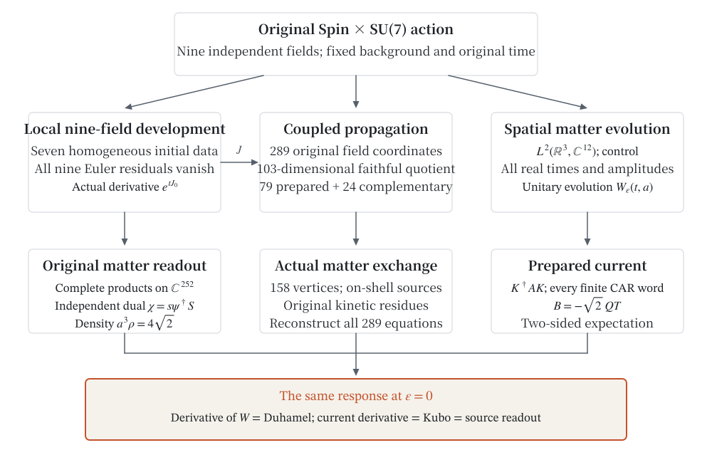
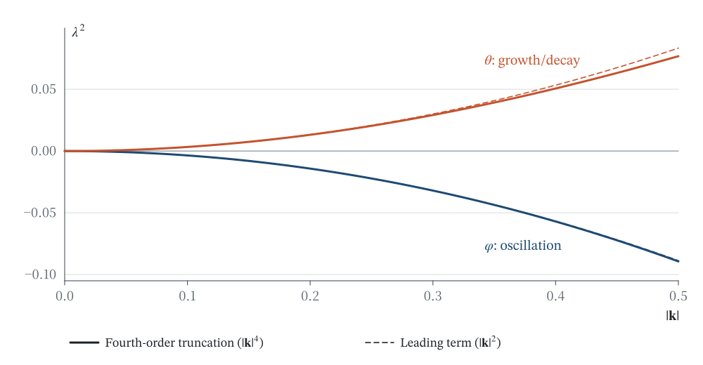
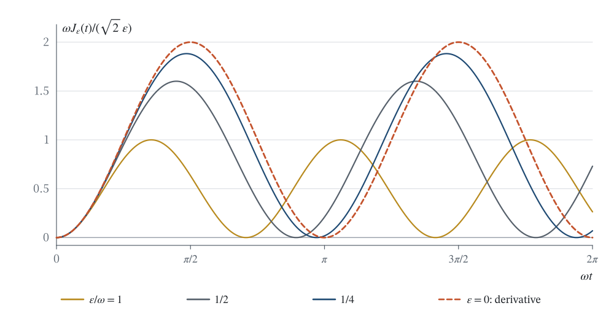
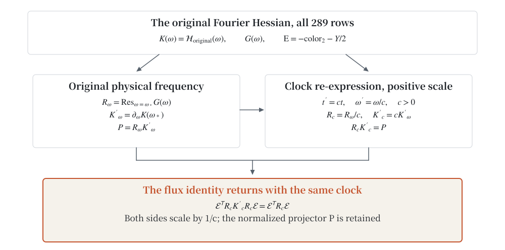
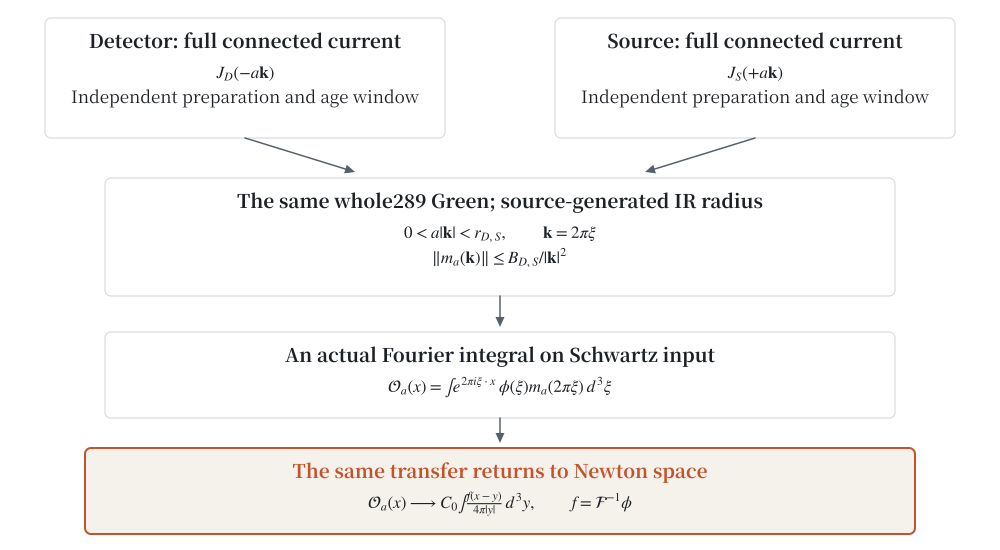
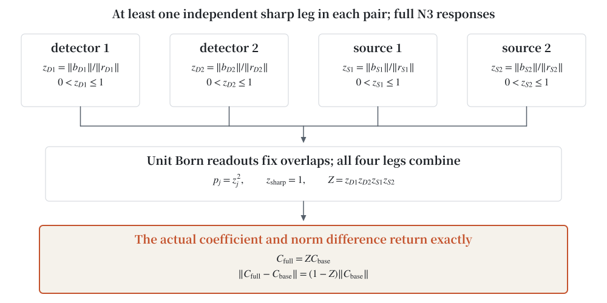
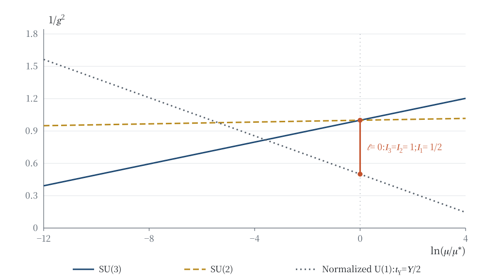
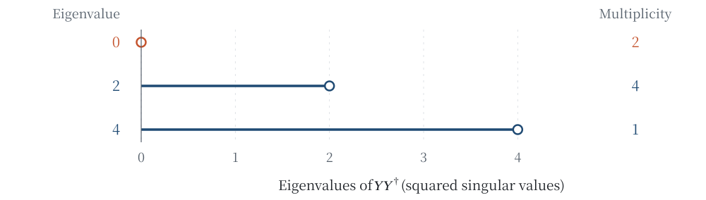
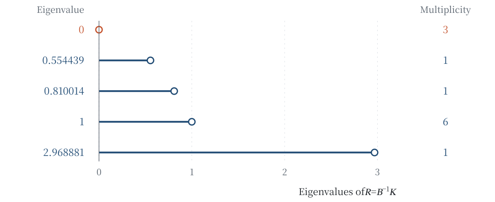

# The Current Takes the Stand: From Coupled Propagation to Actual Electrons, Coulomb Response, and Born Dressing

**Author: Jian Gao**\
Independent Researcher · innersummer@hotmail.com · ORCID 0009-0009-5002-1655

## Abstract

Starting from the original nine-field action of a common-source Spin×SU(7) model, we connect coupled propagation to actual electron readouts, spatial Newton return, and Born dressing. The same source-generated electron state is identified with its original rest leg: its temporal current is $-1$ and its electromagnetic charge is $+1$. The one-pass Coulomb scalar and ordinary photon response retain all 64 weights, both endpoint corrections, independent age windows, and the original source amplitude; the photon formula holds eventually on the original pole sheet. The mixed electromagnetic carrier on all 289 field directions is generated by the actual action Hessian. Every positive clock re-expression transforms the frequency residue and Jacobi derivative together, preserving the original flux identity. For Schwartz inputs, the all-direction Green function and two actual moving endpoints generate a common infrared radius and integrable domination; the genuine Fourier integral, with opposite momenta of the same transfer, returns to a Newton convolution. Unit normalization of complete N3 composite responses generates four Born overlaps. When each pair contains at least one independently generated sharp leg, their product $Z$ gives exactly $C_{\mathrm{full}}=ZC_{\mathrm{base}}$ and the norm difference $(1-Z)\|C_{\mathrm{base}}\|$. The construction retains joint local nine-field development and its actual initial-data derivative, Jacobi propagation at every real spatial momentum with field reconstruction, the two-phase action through fourth derivative order, and a nonzero on-shell tree exchange normalized by original residues. On $L^2(\mathbb R^3,\mathbb C^{12})$ over the fixed original background, it retains every finite CAR word. Norm-continuous histories of bounded self-adjoint gauge controls generate unitary development for all real times and amplitudes; the operator-norm derivative at zero amplitude reads back the Duhamel operator, Kubo integral, and original current. The joint half-unit character, unit-charge electron, and full composite legs retain their distinct definitions; Thomson, full-light, and contact matching enter through the original conditional equation.

**Keywords:** common-source model; actual electron; electromagnetic current; Coulomb exchange; Newton convolution; Born dressing; constrained propagation; all-time Kubo response.

<a id="sec-1"></a>

## 1 One current, three calculations

Making a large matrix smaller is easy. The harder question is whether the smaller matrix still reports the current that the original action assigns to the original matter. We begin by calling a current that can be calculated on paper. It will testify three times: as an expectation under finite evolution, as the derivative of an actual solution with respect to the control amplitude, and as a commutator integral. The initial state, force, and current in all three testimonies come from the same original action.

### 1.1 A four-dimensional window from the original occupied state

Take the source-fixed constants

$$s=\sqrt2,\qquad N^2=\frac{54}{125},\qquad
\alpha_0=\frac{3\sqrt2}{5},\qquad
\omega=\frac{3N}{2}(s-\alpha_0)=\frac{18\sqrt{15}}{125}>0.\tag{1.1}$$

Here $t$ is the original time coordinate, and $N$ is the temporal coefficient of the original coframe. Section 2 gives the origin of these constants and the complete field configuration. The original occupied matter space is

$$\mathcal H_{12}=\mathbb C^4\otimes\operatorname{span}\{e_{05},e_{15},e_{25}\}.$$

With spin indices ordered first and color indices second, the unit occupied vector is

$$w=\frac12(0,1,0,-1,0,0,0,1,0,-1,0,0)^{\mathsf T}.
\tag{1.2}$$

The original field amplitude at time zero is $\psi_0=2w$. Write $Q=\operatorname{diag}(-1,-1,1,1)\otimes I_3$ and choose the original color generator

$$\rho_{01}=\begin{pmatrix}0&1&0\\-1&0&0\\0&0&0\end{pmatrix}.$$

The Hamiltonian force and action current that it generates through the temporal connection are, respectively,

$$T=-iI_4\otimes\rho_{01},\qquad B=-sQT.\tag{1.3}$$

Both are Hermitian, but they are different operators. $T$ determines how the state is driven, whereas $B$ reads the current of the original action. The factor $-sQ$ retains the independent-dual pairing and the weight of the original temporal kinetic term.

Let $r=Tw$, $q=Qr$, and $p=Qw$. The four columns $F=(w,r,q,p)$ are orthonormal and span a common invariant subspace of the original stationary Hamiltonian $h_0$, $T$, and $B$. In this basis generated from the original state,

$$F^\dagger h_0F=
\begin{pmatrix}0&0&0&0\\0&0&2\omega&0\\0&2\omega&0&0\\0&0&0&0\end{pmatrix},
\qquad
F^\dagger TF=
\begin{pmatrix}0&1&0&0\\1&0&0&0\\0&0&0&1\\0&0&1&0\end{pmatrix}.
\tag{1.4}$$

Taking the positive and negative $Q$ eigencombinations $(w+p,r+q,w-p,r-q)/\sqrt2$ then gives two $2\times2$ blocks:

$$h_{0,+}=\begin{pmatrix}0&0\\0&2\omega\end{pmatrix},\quad
h_{0,-}=\begin{pmatrix}0&0\\0&-2\omega\end{pmatrix},\quad
T_\pm=\sigma_x,\quad B_\pm=\mp s\sigma_x.
\tag{1.5}$$

The initial state in each block is $2^{-1/2}(1,0)^{\mathsf T}$. This four-dimensional window is a common invariant subspace of the original twelve-dimensional operators, rather than a separately imposed two-level model.

### 1.2 Finite control before linear response

The first testimony comes from finite evolution. With a real control amplitude $\epsilon$ in the original temporal connection, the actual Hamiltonians of the two blocks are

$$h_{\epsilon,\pm}=\pm\omega I+\epsilon\sigma_x\mp\omega\sigma_z.
\tag{1.6}$$

Since $(\epsilon\sigma_x\mp\omega\sigma_z)^2=(\omega^2+\epsilon^2)I$, set $r_\epsilon=\sqrt{\omega^2+\epsilon^2}$ and compute the exponential directly:

$$U_{\epsilon,\pm}(t)=e^{\mp i\omega t}
\left[\cos(r_\epsilon t)I-i\frac{\sin(r_\epsilon t)}{r_\epsilon}
(\epsilon\sigma_x\mp\omega\sigma_z)\right].\tag{1.7}$$

For every real $\epsilon,t$, this expression satisfies the original initial condition and the finite-control equation. Applying it to the two initial states and adding the currents in (1.5) gives

$$\boxed{J_\epsilon(t)=
\frac{s\epsilon\omega}{\omega^2+\epsilon^2}
\left[1-\cos\!\left(2t\sqrt{\omega^2+\epsilon^2}\right)\right].}
\tag{1.8}$$

Thus the actual derivative of the finite development at zero control is

$$\boxed{\left.\partial_\epsilon J_\epsilon(t)\right|_0
=\frac{s}{\omega}(1-\cos 2\omega t).}\tag{1.9}$$

The order is to solve the finite problem first, then differentiate. The oscillation frequency $r_\epsilon$ itself varies with the control; (1.8) already includes this variation. Here $J_\epsilon$ uses the unit occupied state (1.2). The bilinear current of the original amplitude $\psi_0=2w$ is four times as large.

The second calculation differentiates the state directly. In the original basis $(w,r,q,p)$, the zero-control state remains $w$, and

$$\delta u(t):=\left.\partial_\epsilon U_\epsilon(t)w\right|_0
=-i\frac{\sin2\omega t}{2\omega}r
+\frac{\cos2\omega t-1}{2\omega}q.\tag{1.10}$$

Since $Bw=-sq$, the two current legs together give

$$\delta u(t)^\dagger Bw+w^\dagger B\delta u(t)
=\frac{s}{\omega}(1-\cos2\omega t).\tag{1.11}$$

Differentiating only one leg would halve the coefficient. Replacing the observable $B$ by the driving force $T$ would instead make the responses of the two blocks cancel. Either change is caught immediately: a correct matrix exponential alone does not guarantee the correct original current.

The third calculation uses the unperturbed development $U(t)=e^{-ith_0}$. Set $T_H(\tau)=U(-\tau)TU(\tau)$ and $B_H(t)=U(-t)BU(t)$. Equation (1.4) gives

$$\operatorname{Re}\,i\langle w,[T_H(\tau),B_H(t)]w\rangle
=2s\sin\bigl(2\omega(t-\tau)\bigr).$$

Hence

$$\operatorname{Re}\,i\int_0^t
\langle w,[T_H(\tau),B_H(t)]w\rangle\,d\tau
=\frac{s}{\omega}(1-\cos2\omega t),\tag{1.12}$$

The third testimony agrees exactly with the first two. The oriented integral makes the equality valid at negative times as well. Section 8 proves it on the actual three-dimensional $L^2$ space and supplies a uniform second-order remainder for the propagator. The finite window puts the coefficient visibly on the stand; the full-space theorem then brings spatial preparation, arbitrary initial states, and time evolution under the same definition.

### 1.3 The question and the results

We work from the original action of the existing common-source Spin×SU(7) model [1]. The central connection is this: **the original field equations generate propagation, the original external legs generate sources, and the original action generates the current; on actual spatial preparations, the derivative of finite quantum development returns to that same current.**

The three development problems and the subsequent source-generated observations each retain their own inputs. Placing them side by side makes the origin of every readout explicit.

| Object | Input | Output established here |
|---|---|---|
| Spatially homogeneous nonlinear nine-field development | Seven real initial values in the admissible domain | A joint nine-field solution family on a common initial-data neighborhood and two-sided local time interval, with uniqueness and an actual initial-data derivative |
| Full coupled first variation of the original background | Independent field perturbations and four-momentum | Constraint reduction, complete propagation factors, reconstruction of the original fields, and an effective action in the prepared sector |
| Spatial matter development on the fixed original background | $L^2$ initial states, bounded local controls generated by the original gauge action, and their real amplitudes | Unitary development for all real times and amplitudes, spatial preparation, every finite CAR word, and an operator-norm response derivative |
| Electromagnetic and spatial observations of source-generated preparations | Independent source/detector preparations, actual electrons or N2/N3 responses, the original Green function, and Schwartz input | Complete endpoint Coulomb/ordinary readouts, action/clock normalization, Newton convolution, and Born dressing under the sharp condition in each pair |

Section 3 establishes the first row and returns the radial Jacobi solutions to the complete nine-field system. Sections 4–6 establish the second: from 289 active real fields, we obtain a faithful 103-dimensional propagation quotient and its 79-dimensional prepared sector, calculate the two-phase action through fourth derivative order, and combine all 158 matter vertices, original action residues, and actual on-shell external legs into a nonzero exchange. Sections 7–8 establish the third row. Sections 9–13 connect source-generated preparation to actual electrons, electromagnetic/Coulomb readouts, physical clocks, spatial Newton return, and Born dressing. Section 14 discusses their inputs for further phenomenology. Appendix A gives the original inventory, bare quadratic blocks, and global stabilizer as coordinates for identifying the structure.



**Figure 1. The origin and return of the same current.** The left and middle columns generate nine-field development and constrained propagation from the original action; the right column generates spatial preparation and finite development from the original matter action. The vermilion panel at the bottom is where the three calculations meet: the action current, two-sided variation, and Kubo integral yield the same response at $\epsilon=0$. The arrows carry explicit field, equation, or source maps and do not identify the three domains. The original-field reconstruction arrow represents actual equation identities, beyond preservation of a determinant. The inputs of the three development problems are listed in the table above.

The background-field method, elimination of invertible directions through field equations, second quantization, and nonautonomous evolution have established methodological sources [2–6]. We use these methods to construct their connection within this particular original action: how the independent dual enters the source, how constraints return to original rows, how phases return to original time, and how finite preparation retains the original readout. Appendix E lists the evidence type and source location of each proposition.

<a id="sec-2"></a>

## 2 The original action, nine fields, and the time dictionary

### 2.1 The field source and carrier

We use the same smooth unified source and classical configuration as [1]. The mother group is $\mathrm{Spin}^{+}(1,3)\times\mathrm{SU}(7)$; the actual gauge connection takes values in

$$\mathfrak h=\mathfrak{su}(3)\oplus\mathfrak{su}(2)\oplus\mathfrak u(1),
\qquad (C,W,y)\longmapsto\operatorname{diag}(C,W,y,-y).\tag{2.1}$$

We call (2.1) the P286 embedding. The number identifies this particular construction and is not an additional physical parameter. The seven-dimensional basis $(c_0,c_1,c_2,w_0,w_1,h_+,h_-)$ is indexed by $0,\ldots,6$. Three exterior-power layers form the matter carrier

$$\mathcal M=\mathbb C^4\otimes
\left(\Lambda^6\mathbb C^7\oplus\Lambda^2\mathbb C^7\oplus\Lambda^4\mathbb C^7\right),
\qquad \dim_{\mathbb C}\mathcal M=4(7+21+35)=252.\tag{2.2}$$

Here $e_I$ denotes the unit exterior basis vector whose index set is sorted in increasing order. The specified scalar vacuum is

$$v=e_{0126}+e_{0124}+e_{0156}+e_{0145},\qquad \|v\|^2=4.\tag{2.3}$$

The nine independent fields are the coframe $e$, spin connection $\varpi$, gravitational two-form $\mathcal B$, simplicity multiplier $\Lambda$, gauge connection $A$, gauge two-form $B_A$, scalar $\Phi\in\Lambda^4\mathbb C^7$, matter $\psi\in\mathcal M$, and independent complex-linear dual field $\chi\in\mathcal M^*$. The fields $\chi$ and $\psi$ have independent variations. The relation $\chi=s\psi^\dagger S$ used below belongs to actual solutions and the specified prepared sector; it does not define the original field space.

Curvatures are calculated from these fields: $F_\varpi=d\varpi+\varpi\wedge\varpi$ and $F_A=dA+A\wedge A$. Likewise, covariant derivatives are calculated from the actual first derivatives of the fields, rather than supplied as additional independent data. We write the formulas on coordinate chart zero of the source; the other charts are transported by the same mother representation and its dual.

### 2.2 An action with its normalization intact

Set $\eta=\operatorname{diag}(-1,1,1,1)$, $g=e^{\mathsf T}\eta e$, and $\nu_e=|\det e|$. Spacetime two-forms and internal bivectors are both ordered as $(01,02,03,23,31,12)$, while their two types of indices remain distinct. Write

$$J=\begin{pmatrix}0&I_3\\-I_3&0\end{pmatrix},\qquad
(\Sigma_e)_{Ip}=e^{a_I}_{\mu_p}e^{b_I}_{\nu_p}-e^{a_I}_{\nu_p}e^{b_I}_{\mu_p}.$$

Here $J$ is internal bivector duality, and $\star_e$ is the Hodge operator on spacetime two-forms. Define $p^c=(3,4,5,0,1,2)$, $\epsilon_I=(-1,-1,-1,1,1,1)_I$, and

$$W_\kappa(X,Y)=\sum_p\kappa(X_p,Y_{p^c}),\qquad
W_{\rm top}(X,Y)=\sum_{I,p}\epsilon_I X_{Ip}Y_{I,p^c}.\tag{2.4}$$

On the two special-unitary blocks, $\kappa(X,Y)=-\operatorname{Re}\operatorname{tr}(XY)$; on the original hypercharge coordinate, $\kappa(y,z)=-\operatorname{Re}(yz)$. The latter is not doubled by the two diagonal entries of the mother embedding. Write $\widehat F_{\varpi,Ip}=\epsilon_I F^{\rm raw}_{\varpi,Ip}$, where “raw” denotes the original curvature coordinates with both internal indices lowered.

We use the Dirac matrices and chirality operator

$$\gamma^0=\begin{pmatrix}0&I_2\\-I_2&0\end{pmatrix},\quad
\gamma^i=\begin{pmatrix}0&\sigma_i\\\sigma_i&0\end{pmatrix},\quad
\gamma^5=\operatorname{diag}(-I_2,I_2),\quad S=\gamma^0\gamma^5.\tag{2.5}$$

On $\mathcal M$, each is tensored with the identity on the exterior-power layers. The operator $S$ satisfies $S^\dagger=S$ and $S^2=I$; it exchanges the chiral blocks and connects the specified dual to the coordinate inner product. Set

$$\Gamma_e^\mu=(e^{-1})^\mu{}_a\gamma^a,\quad
\Omega_\mu=\frac14\varpi_{\mu ab}\gamma^a\gamma^b,\quad
D_\mu\psi=\partial_\mu\psi+(\Omega_\mu+\rho(A_\mu))\psi,
$$

$$D_\mu\Phi=\partial_\mu\Phi+\rho_4(A_\mu)\Phi,\qquad
Y_R(\Phi)=T_\Phi P_R,\quad P_R=\operatorname{diag}(0,0,1,1),$$

$$T_\Phi(w_6,w_2,w_4)=(w_2\wedge\Phi,0,0),\qquad
V(\Phi)=\|\Phi-v\|^2.\tag{2.6}$$

The right-handed Yukawa action maps $\Lambda^2$ to $\Lambda^6$. Its direction is part of the original action; the independent dual then evaluates the resulting vector.

The common local density is

$$\begin{aligned}
\mathcal L={}&W_{\rm top}(\mathcal B,\widehat F_\varpi)
-\frac12W_{\rm top}(\mathcal B,J\mathcal B)
+W_{\rm top}(\Lambda,\mathcal B-J\Sigma_e)\\
&+\sum_{j=3,2,1}\left[W_j(B_{A,j},F_{A,j})
-\frac12W_j(B_{A,j},g_j^2\star_e B_{A,j})\right]\\
&+\nu_e\left[\frac12g^{\mu\nu}\operatorname{Re}\langle D_\mu\Phi,D_\nu\Phi\rangle
-V(\Phi)+\operatorname{Re}\chi\bigl(i\Gamma_e^\mu D_\mu\psi+Y_R(\Phi)\psi\bigr)\right],
\qquad g_j^2=\sigma=\frac12.
\end{aligned}\tag{2.7}$$

This formula fixes the normalization of every quadratic form and vertex used below. The BF terms are already coefficients of four-forms; only the last line is additionally multiplied by the volume density. It is $g_j^2$, rather than $g_j$, that equals $1/2$. The independent dual of $\psi$ already supplies the left pairing, so the Yukawa term contains neither an inserted $\gamma^0$ nor an additional reverse adjoint term.

### 2.3 The nine fields of the specified background

Using $q_0=e_{05},q_1=e_{15}\in\Lambda^2\mathbb C^7$, define

$$C(u,v)=\begin{pmatrix}0&u\\-u&0\\0&v\\-v&0\end{pmatrix},\qquad
\Psi[u,v]_r=\sum_{a=0}^1C(u,v)_{ra}q_a,
\quad \Xi[p,q](z)=\sum_{r,a}C(p,q)_{ra}q_a^*(z_r).\tag{2.8}$$

There is no complex conjugation in the expression for $\Xi$. On the first two colors, the three color-doublet generators are

$$\tau_0=\frac12\begin{pmatrix}0&i\\i&0\end{pmatrix},\quad
\tau_1=\frac12\begin{pmatrix}0&1\\-1&0\end{pmatrix},\quad
\tau_2=\frac12\begin{pmatrix}i&0\\0&-i\end{pmatrix},\qquad
\kappa(\tau_i,\tau_j)=\frac12\delta_{ij}.\tag{2.9}$$

They vanish on all remaining coordinates. The specified configuration is

$$\begin{gathered}
e_0=\operatorname{diag}(N,1,1,1),\quad
A^{(0)}=(0,\alpha_0\tau_0,\alpha_0\tau_1,\alpha_0\tau_2),\quad
\Phi_0=v,\\
\psi_0(t)=\Psi[e^{i\omega t},e^{-i\omega t}],\quad
\chi_0(t)=\Xi[se^{i\omega t},se^{-i\omega t}].
\end{gathered}\tag{2.10}$$

The only nonzero components of the spin connection with lowered internal indices are

$$\varpi_{1,23}=\varpi_{2,31}=\varpi_{3,12}=s.\tag{2.11}$$

In the bivector and two-form order specified above, the remaining three fields are

$$\mathcal B_0=\begin{pmatrix}0&I_3\\-NI_3&0\end{pmatrix},\qquad
\Lambda_0=\operatorname{diag}(-N,-N,-N,s^2-1,s^2-1,s^2-1),$$

$$B_{A,0}=\frac{\alpha_0^2}{\sigma N}(\tau_0,\tau_1,\tau_2,0,0,0).\tag{2.12}$$

The actual curvatures are

$$\widehat F_{\varpi,0}=\operatorname{diag}(0,0,0,-s^2,-s^2,-s^2),\quad
F_{A,0}=(0,0,0,-\alpha_0^2\tau_0,-\alpha_0^2\tau_1,-\alpha_0^2\tau_2).\tag{2.13}$$

Thus, although the background coframe is constant, its spin and gauge curvatures are nonzero. These terms arise from connection self-products and subsequently enter propagation mixing and external-leg frequencies.

### 2.4 Auxiliary elimination and recovery of the fields

Start with an elimination that can be carried out entirely on paper. Variation of (2.7) with respect to $B_A$ gives $F_A-K_eB_A=0$, where $K_e=\sigma\star_e$. Since $\star_e^2=-I$ on Lorentzian two-forms,

$$B_A^*=-\sigma^{-1}\star_e F_A,\qquad
\mathcal L(B_A)=\mathcal L(B_A^*)-\frac12W(B_A-B_A^*,K_e(B_A-B_A^*)).
\tag{2.14}$$

This is completion of the square with the signs of the original wedge pairing. On the background $e_0$,

$$\star_{e_0}(f_0,\ldots,f_5)
=(f_3/N,f_4/N,f_5/N,-Nf_0,-Nf_1,-Nf_2).\tag{2.15}$$

Substituting (2.13) immediately reconstructs $B_{A,0}$ in (2.12): the three magnetic curvature components become three electric-type auxiliary components. The eliminated field is still determined by the retained fields.

For an arbitrary first-order perturbation, the reconstruction formula becomes

$$\boxed{\delta B_A=K_0^{-1}
\left(\delta F_A-(\delta K_e)B_{A,0}\right).}\tag{2.16}$$

The second term is essential: changing the coframe also changes the Hodge operator. For example, if only the temporal coefficient $N\mapsto N+\delta n$ and the magnetic amplitude $\alpha_0\mapsto\alpha_0+\delta\alpha$ are perturbed, then

$$\delta(B_A)_{0i}
=\left(\frac{2\alpha_0}{\sigma N}\delta\alpha
-\frac{\alpha_0^2}{\sigma N^2}\delta n\right)\tau_{i-1}.
\tag{2.17}$$

Omitting the coframe term would omit an actual response, beyond a change in gauge notation. The two gravitational fields are likewise reconstructed as

$$\delta\mathcal B=J\,\delta\Sigma_e,\qquad
\delta\Lambda=J\,\delta\mathcal B-\delta\widehat F_\varpi.\tag{2.18}$$

The larger matrix elimination in §4 performs the same operation step by step, preserving both field reconstruction and equation reconstruction at each stage. Tree-level elimination of invertible directions follows the approach of [3, §2.1.1]. Here there is an additional requirement: every solution for the effective fields must again satisfy all original equations retained in the calculation.

### 2.5 Original time, the co-rotating representation, and pairing

The periodic matter background can be made stationary using the same source phase. On the full 252-dimensional carrier, let $P_6$ project onto the $\Lambda^6$ layer and define

$$Q=\gamma^5+2P_6,\qquad P(t)=e^{-i\omega tQ},\qquad
\psi_{\rm orig}=P(t)\psi_{\rm st},\quad
\chi_{\rm orig}=\chi_{\rm st}\,S P(t)^\dagger S.\tag{2.19}$$

Restricted to the original occupied space, $Q$ is the $\gamma^5$ of §1. The complete original Dirac operator acquires $+\omega\Gamma_e^0Q$ in the stationary representation, and the corresponding Hamiltonian satisfies

$$H_{\rm st}(\mathbf k)=H_{\rm orig}(\mathbf k)-\omega Q.
\tag{2.20}$$

The co-rotating transformation changes the field representation while keeping the same time coordinate $t$. Equation (2.20) restores the original frequency with the specified phase. When nonzero vertices preserve the $Q$ charge, the original and stationary frequency transfers coincide.

Throughout the paper, we use the following time and momentum dictionary: original time $t=x^0$; background proper time $\tau=Nt$; the Fourier–Jacobi growth symbol $p=(\lambda,i\mathbf k)$; and the rationalized variables

$$u=\frac{\lambda}{N\sqrt2},\qquad \mathbf q=\frac{\mathbf k}{\sqrt2};
\qquad \widehat f(\xi)=\int e^{-2\pi i\mathbf x\cdot\xi}f(\mathbf x)\,d^3x,
\quad \mathbf k=2\pi\xi.\tag{2.21}$$

In the propagation formulas, $\lambda$ is a growth rate. Quantum frequency formulas use $e^{-iEt}$, so $\lambda=-iE$. Thus $\lambda^2<0$ corresponds to oscillation, and $\lambda^2>0$ to real growth. The following sections retain this sign distinction rather than erasing it under the name “mass squared.”

<a id="sec-3"></a>

## 3 Joint nine-field development and its actual tangent

### 3.1 How seven initial values generate nine fields

Spatial homogeneity removes spatial derivatives but does not split gravity, gauge fields, and matter into uncoupled equations. An initial scalar velocity changes the stress; the temporal coframe then changes, along with the gauge acceleration and matter phase. We now express this feedback as an explicit seven-dimensional system.

Write the state as $x=(a,H,\alpha,b,f,w_s,\theta)$, representing, in order, the spatial scale, frame velocity, gauge amplitude, gauge momentum, radial scalar displacement, scalar velocity in the frame, and matter phase. Here $w_s$ is a real velocity, distinct from the occupied vector $w$ in §1. Define

$$c=\frac{s}{a^2},\quad E_A=b^2+\alpha^4,\quad q_v=\|v\|^2=4,$$

$$\mathcal D(x)=\frac{6s(c-\alpha)}a
+q_v a^3\left(f^2-\frac{w_s^2}{2}\right)
+3a^3+3aH^2-3ac^2,\qquad
n(x)=\sqrt{\frac{3aE_A}{4\sigma\mathcal D(x)}}.\tag{3.1}$$

The admissible domain is the open set $\mathcal A=\{a>0,E_A>0,\mathcal D>0\}$. Its $n$ is determined by the temporal coframe equation, rather than prescribed as an external clock function. The vector field $G$ generated by the original equations is

$$\begin{aligned}
\dot a&=nH,\\
\dot H&=\frac{1}{2a}\left[-\frac{E_A}{4\sigma n}
+n\left(\frac{2s(c-\alpha)}{a^2}
-q_v a^2\left(f^2+\frac{w_s^2}{2}\right)-3a^2-H^2+c^2\right)\right],\\
\dot\alpha&=\frac{ab}{n},\qquad
\dot b=\frac{4\sigma ns}{a}-\frac{2a\alpha^3}{n},\\
\dot f&=nw_s,\qquad \dot w_s=n\left(2f-\frac{3Hw_s}{a}\right),\\
\dot\theta&=\frac{3n(c-\alpha)}{2a}.
\end{aligned}\tag{3.2}$$

Along any admissible solution $x(t)$, set

$$e=\operatorname{diag}(n,a,a,a),\quad A_i=\alpha\tau_{i-1},\ A_0=0,
\quad \Phi=(1+f)v,$$

$$\psi=a^{-3/2}\Psi[e^{i\theta},e^{-i\theta}],\qquad
\chi=sa^{-3/2}\Xi[e^{i\theta},e^{-i\theta}].\tag{3.3}$$

The spin connection is the sum of two parts. The nonzero mixed components of its Levi–Civita part are $\varpi_i{}^0{}_i=\varpi_i{}^i{}_0=H$; the lowered components of its axial-torsion part are $\varpi_{1,23}=\varpi_{2,31}=\varpi_{3,12}=c$. The remaining fields are reconstructed by

$$\mathcal B=J\Sigma_e,\qquad \Lambda=J\mathcal B-\widehat F_\varpi,
\qquad B_A=-\sigma^{-1}\star_e F_A\tag{3.4}$$

Thus the seven state variables specify all nine fields and their actual first derivatives. In particular, $\dot n=Dn(x)G(x)$ cannot be set to zero when calculating curvature.

**Theorem 3.1 (Joint local development).** For every $x_*\in\mathcal A$, there exist $r,T>0$ and $C\geq0$ such that each initial state $x$ in the closed ball $\overline B(x_*,r)$ generates a smooth solution $X(x,t)$ on the same time interval $|t|<T$. The solution remains in $\mathcal A$, satisfies $X(x,0)=x$ and $\partial_tX=G(X)$, and obeys

$$\|X(x,t)-X(y,t)\|\leq C\|x-y\|.\tag{3.5}$$

For the nine fields generated by (3.3)–(3.4), all nine original Euler residuals vanish together on this interval. Developments with the same initial data agree on their common interval of definition.

The difficulty lies in the second step: solving the seven-dimensional ODE does not by itself make all nine fields answer their own equations. The proof has two connected steps. First, strict positivity of $a,E_A,\mathcal D$ makes $G$ smooth on the admissible domain. A local Picard construction gives a common initial-data ball and time interval, and joint continuity keeps the entire product neighborhood inside that domain. Next, substitute the actual derivatives of the solution into the original fields. The Cartan equation gives $c=s/a^2$; the gauge equations give $\dot\alpha,\dot b$; the scalar equations give $\dot f,\dot w_s$; the two matter equations give the dilution rate and $\dot\theta$; and the two coframe balances give $n$ and $\dot H$. This step uses the original field variations, so the conclusion is a joint nine-field solution, beyond a solution of the seven-dimensional ODE. ∎

### 3.2 The initial-data derivative along phase drift

The original state is

$$x_0=(1,0,\alpha_0,0,0,0,0),\qquad
X(x_0,t)=x_0+t\omega e_7.\tag{3.6}$$

It is not a fixed point in the seven-dimensional coordinates: the seventh coordinate keeps moving. Since $G$ does not depend on $\theta$, subtracting this actual drift gives the centered vector field

$$G_c(z)=G(x_0+z)-\omega e_7,\qquad G_c(0)=0,\qquad
J_0=DG(x_0),\quad G_c(z)=J_0z+o(\|z\|).\tag{3.7}$$

**Theorem 3.2 (Actual initial-data derivative).** For the joint development of Theorem 3.1 at $x_0$, and every $|t|<T$,

$$D_xX(x_0,t)=e^{tJ_0}.\tag{3.8}$$

This is the Fréchet derivative of the actual nonlinear solution family. The point easily missed is that the background itself moves: its phase drifts continuously, and deviations must be measured from that moving orbit. In the proof, compare $X(x_0+h,t)-X(x_0,t)$ with $e^{tJ_0}h$. The local Lipschitz bound first controls the full nonlinear displacement by $C\|h\|$, so the remainder in (3.7) is $o(\|h\|)$ throughout the time interval. Applying Grönwall's estimate to the difference equation and treating positive and negative times separately proves (3.8). The phase drift remains in (3.6); it is not mistaken for a perturbation away from the background.

The characteristic polynomial of the original $J_0$ is

$$\det(XI-J_0)=X\left(X^2+\frac{648}{125}\right)
\left(X^2-\frac{50}{3}\right)
\left(X^2-\frac{108}{125}\right).\tag{3.9}$$

The zero root, oscillatory roots, and two pairs of real growth/decay roots each have their own place. The radial scalar pair gives $108/125=2N^2$. The polynomial of the remaining five states is the product of the first three factors; §4 accepts the same tangent through all 289 original rows.

### 3.3 Radial Jacobi solutions on full space

Now give the scalar a spatial profile while retaining all other fields of the original background. Set $\Phi_\epsilon=(1+\epsilon f(t,\mathbf x))v$. The original scalar kinetic term and potential directly reduce the radial equation to

$$\mathcal R f:=\frac1{N^2}\partial_t^2f-\Delta f-2f=0.\tag{3.10}$$

Fix any real spatial momentum $\mathbf k$. With $f(0,\mathbf x)=0$ and $\partial_tf(0,\mathbf x)=\cos(\mathbf k\cdot\mathbf x)$, the solution is

$$f_{\mathbf k}(t,\mathbf x)=\cos(\mathbf k\cdot\mathbf x)
\begin{cases}
\sinh(\gamma t)/\gamma,&|\mathbf k|^2<2,\quad\gamma=N\sqrt{2-|\mathbf k|^2},\\
t,&|\mathbf k|^2=2,\\
\sin(\nu t)/\nu,&|\mathbf k|^2>2,\quad\nu=N\sqrt{|\mathbf k|^2-2}.
\end{cases}\tag{3.11}$$

The critical expression $t$ is the common zero-frequency limit of the other two expressions. Each time factor has initial derivative 1, so the full field always has initial velocity $\cos(\mathbf k\cdot\mathbf x)$.

**Theorem 3.3 (Complete radial first variation).** Suppose the profile $f$ is differentiable, each first coordinate partial derivative is differentiable at the point under consideration, and (3.10) holds there. Then eight of the nine original field residuals vanish exactly for every real $\epsilon$. The only remaining residual is the coframe residual, equal to $\epsilon^2$ times an explicit original coframe covector. Thus the derivatives of all nine residuals with respect to $\epsilon$ vanish at zero. In particular, all three momentum regimes in (3.11) give Jacobi solutions of the original nine-field system.

The second-order backreaction is also visible on paper. The radial perturbation adds to the original density

$$\Delta\mathcal L_\Phi
=\epsilon^2q_v\nu_e\left(\frac12g^{\mu\nu}\partial_\mu f\,\partial_\nu f-f^2\right).
\tag{3.12}$$

Varying with respect to $e$ before setting $e=e_0$ gives the coframe load just described. It starts strictly at second order, explaining both why the first-order Jacobi solution closes and why finite radial amplitude requires the joint feedback of §3.1. The single cosine wave here is a full-space mode; §7 treats normalizable spatial fields separately through $L^2$ preparation.

### 3.4 Matter density in the same development

The amplitude $a^{-3/2}$ in the nonlinear solution has a direct readout. Set $\widehat\psi_\theta=\Psi[e^{i\theta},e^{-i\theta}]/2$. For every complete mother operator $A\in\operatorname{End}(\mathcal M)$,

$$\chi(A\psi)=4s\,a^{-3}\langle\widehat\psi_\theta,SA\widehat\psi_\theta\rangle.
\tag{3.13}$$

Taking $A=S$ and reading the real part gives the original field density

$$\rho=\operatorname{Re}\chi(S\psi)=4s\,a^{-3},\qquad a^3\rho=4s.\tag{3.14}$$

This equality connects spatial volume, matter dilution, and the original dual pairing. Probability normalization of the unit vector and the density of the original field with its amplitude each retain their separate roles.

Subsequent calculations must also avoid compressing operators too early. If $I$ is an isometric embedding of a chosen matter subspace into $\mathcal M$ and $C(A)=I^\dagger AI$, then

$$C(AB)=C(A)C(B)+I^\dagger A(I-II^\dagger)BI.\tag{3.15}$$

The second term records departure from the subspace followed by a return. The exchange in §6 and CAR words in §7 are both calculated as complete products before compression; (3.15) is the algebraic reason for this order.

<a id="sec-4"></a>

## 4 Full coupled propagation and reconstruction of the original fields

### 4.1 Why constraints come first

On a nonzero matter background, a gauge perturbation changes matter, matter changes the current in return, and the coframe and spin connection enter both. Diagonalizing one bare mass block does not solve this coupled propagation problem. We take the second variation directly from the independent field first jets in (2.7).

The active real carrier coupled to the original occupied state contains 16 coframe coordinates, 24 Lorentz-connection coordinates, 36 gravitational auxiliary coordinates, 36 multiplier coordinates, 48 gauge-connection coordinates, 72 gauge-auxiliary coordinates, 9 real scalar orbit coordinates, and 24 real coordinates each for the primal and independent dual in the original occupied space: 289 in total. The remaining scalar and matter directions retain their own blocks and return relations in §§4.5 and 6.

Denote the quadratic Euler symbol by $H_{289}(p)$ and use the signed transpose for real fields, $M^\sharp(p)=M(-p)^{\mathsf T}$. The original quadratic action has the form $\frac12z^\sharp H_{289}z$. Retaining $-p$ is essential for a simple reason: integration by parts changes the sign when a differential operator moves to the other leg.

The first step consists of three actual algebraic eliminations:

$$289\longrightarrow217\longrightarrow145\longrightarrow121.
\tag{4.1}$$

The eliminated dimensions are $72,72,24$, respectively. Each step uses a two-sided inverse of an actual nonzero algebraic block and retains field reconstruction at all momenta. To make the meaning explicit, split the fields at one step into $(y,z)$ and write the quadratic action with a positive-sign source as

$$\frac12\begin{pmatrix}y\\z\end{pmatrix}^{\sharp}
\begin{pmatrix}A&B\\B^\sharp&D\end{pmatrix}
\begin{pmatrix}y\\z\end{pmatrix}+j_y^\sharp y+j_z^\sharp z.
$$

Whenever $A$ is invertible, the original $y$ equation gives

$$y=-A^{-1}(Bz+j_y),\quad
Kz=-j_z+B^\sharp A^{-1}j_y,\quad
K=D-B^\sharp A^{-1}B.\tag{4.2}$$

Substitution into the action also leaves the local term $-\frac12j_y^\sharp A^{-1}j_y$. The propagation kernel, external-source transformation, eliminated fields, and contact term therefore arise together from one elimination step. The tree exchange in §6 uses all four.

### 4.2 A faithful section from the original Ward rows

The next object is not another zero block that can simply be discarded. The responses of all 12 gauge tangents to the original scalar potential form a torque of rank 9. For an original real scalar deviation $\phi$, it takes the form

$$\mathcal T_X(\phi)=-2\nu_e\langle\rho(X)v,\phi\rangle_{\mathbb R}.
\tag{4.3}$$

Row operations with an explicit polynomial inverse turn the 9 scalar rows into invertible constant constraints. Eliminating the corresponding variables gives 112 equivalent equations. The original scalar rows can be reconstructed by the inverse transformation, so the nonzero potential response is retained as a constraint.

The 112-dimensional system has 9 genuine symmetry tangents: three original color-SU(2) tangents and six Lorentz tangents. Let their matrix be $T_{\mathrm{sym}}(p)$. At axial momentum $p=(\lambda,0,0,ik)$, it has an invertible $9\times9$ minor independent of $\lambda,k$. This minor generates a 103-dimensional section $C$ and polynomial readback $Q_{\mathrm{sec}}(p)$ satisfying

$$Q_{\mathrm{sec}}(p)C=I_{103},\qquad
H_{112}(p)=Q_{\mathrm{sec}}^\sharp(p)K_{103}(p)Q_{\mathrm{sec}}(p).
\tag{4.4}$$

The section introduces no denominators in $\lambda$ or $k$, so neither the origin nor special momenta are lost through its choice. For sources satisfying

$$T_{\mathrm{sym}}^\sharp(p)j=0\tag{4.5}$$

and wherever $K_{103}$ is invertible, the positive Green response $x_G=CK_{103}^{-1}C^{\mathsf T}j$ satisfies $H_{112}x_G=j$. With the positive-sign action source $+j^{\mathsf T}x$ of (4.2), the stationary equation is $H_{112}x+j=0$, hence the induced field is $x_{\rm ind}=-x_G$. Equation (4.2) and the inverse Ward transformation then reconstruct all 289 rows. Here “positive Green” refers to the sign of the source equation, not positive definiteness of the operator.

The rank is 103 at a generic axial point and 98 at the origin. The additional five-dimensional kernel at the origin is spanned by five constant original matter/dual directions: real vector rescaling, vector phase, real axial rescaling, homogeneous $\theta$ phase, and purely imaginary independent-dual rescaling. At nonzero momentum these generally cease to be kernel directions. In contrast, four ordinary coordinate-change candidates leave 128 nonzero residual entries in the original symbol; this reduction uses the nine tangents that actually annihilate it. The difference between temporal rescaling of the original Hodge operator and ordinary pullback of a two-form also has the explicit nonzero derivative $-2/N$.

**Proposition 4.1 (Full propagation and reconstruction).** The algebraic eliminations, Ward constraints, and faithful section above give equivalent constrained propagation for the full active quadratic action. The nonradial five-state Jacobi solution of the original seven-dimensional development satisfies all 289 rows under the actual rank-5 field embedding, and its characteristic polynomial

$$X\left(X^2+\frac{648}{125}\right)\left(X^2-\frac{50}{3}\right)
\tag{4.6}$$

appears in full on the time axis of the original propagation.

The first three steps are algebraic identities; the verdict rests on the final cross-examination. The proof combines the block identity (4.2), polynomial inverse row transformations, and (4.4), then sends the actual five-state derivative of §3 through the original field map into $H_{289}$. Every resulting row is zero. Nonlinear development and linear propagation therefore share an actual tangent, beyond a resemblance between eigenvalues.

### 4.3 Complete factors and low-momentum branches

Decomposing $K_{103}$ by its actual nonzero support gives ten blocks of dimensions

$$1,1,1,1,2,2,16,16,30,33.\tag{4.7}$$

Read in the original variables of (2.21), the complete determinant has 22 distinct rational factors. Simultaneous rotation of spatial, spin, and original color directions organizes them into 14 radial product factors; the total degree of the corresponding time polynomial is 126. These rotations transport all nonzero real spatial momenta, while the matrix at the origin retains zero momentum independently. Appendix B and the accompanying exact catalog give the full factors, multiplicities, and nonzero scaling constants.

At the origin, the multiplicities of the temporal factors are $(1,1,2,2,2)$ and those of the static spatial factors are $(2,2,2,2,2)$. The leading terms of four low-momentum characteristic branches are

$$\lambda^2=-\frac{18}{25}|\mathbf k|^2,\quad
\lambda^2=-\frac3{20}|\mathbf k|^4,\quad
\lambda^2=-\frac{594}{1675}|\mathbf k|^2,\quad
\lambda^2=\frac13|\mathbf k|^2.\tag{4.8}$$

The first pair and the second pair differ in their lowest momentum orders and original field content. Section 5 derives the latter pair again from the phase-coordinate effective action and also obtains the fourth-order coefficients. The factor count here concerns characteristic divisors of the original operator. Whether a particular external state reads a pole is determined by the numerators and sources.

A smaller original weak block illustrates this distinction. The four-vector blocks of native $A_{34}$ and $S_{34}$ are each isolated in both directions from the remaining 99 quotient coordinates. Their transverse and longitudinal propagation denominators are, respectively,

$$\lambda^2+\frac{125}{54}k^2-\frac12,\qquad
\lambda^2+\frac{54}{125}k^2-\frac12.\tag{4.9}$$

Yet the response of the homogeneous temporal component is the constant $-N/2$. Reconstruction of the original fields also shows that a four-vector source $j_\mu$ generates $-\lambda j_0-ikj_3$ in the original scalar-orbit row. A four-vector readout in the quotient therefore includes an actual scalar-source condition, beyond forcing a single $A$ component.

### 4.4 The prepared sector in the original independent-dual theory

Now select the real preparation relation already present in the original theory,

$$\chi=s\psi^\dagger S.\tag{4.10}$$

Its linear tangent gives an 88-dimensional embedding $C_{\mathrm{prep}}$ and an actual equation-return matrix $R_{\mathrm{prep}}$:

$$K_{88}=C_{\mathrm{prep}}^{\mathsf T}H_{112}C_{\mathrm{prep}},\qquad
H_{112}C_{\mathrm{prep}}=R_{\mathrm{prep}}K_{88},\qquad
C_{\mathrm{prep}}^{\mathsf T}R_{\mathrm{prep}}=I_{88}.\tag{4.11}$$

The last two equalities go beyond substituting the preparation relation into the action: they guarantee that a reduced solution again satisfies the original independent equations. Removing the same nine genuine symmetry directions gives $K_{79}$, and the original 103-dimensional propagation splits into these 79 directions and a 24-dimensional complementary block. The real sources generated by actual prepared matter vanish identically on that block. This is a source selection rule, not a reason to remove original propagation branches.

### 4.5 Retaining all peripheral matter and scalar directions

The remaining directions of the complete carrier also have definite dynamical roles. Maximal development of the prepared peripheral constraints gives a real fiber of dimension 522 at generic momentum, 524 at the origin, and 530 on the sphere $|\mathbf k|^2=5929/1800$; its development reconstructs all 1078 original rows. The instantaneous compatibility kernel has complex dimension 266, which describes a different object from the real dimension of the developable fiber. With scalar and connection held fixed, there is also a 232-dimensional complex invariant subspace for matter propagation.

The scalar has two decompositions whose definitions must both be retained. Among all 70 real scalar directions, the space satisfying both the Yukawa-kernel condition and orthogonality to the real gauge orbit has dimension 43: 23 real singlets and five four-dimensional blocks. The entire 61-dimensional scalar complement of the active 9-dimensional orbit consists instead of 25 real singlets and nine four-dimensional blocks; §6.3 gives its complete propagation inverse. The first decomposition selects directions satisfying two conditions, while the second reconstructs every peripheral scalar. The two sets of dimensions therefore cannot replace one another by subtraction.

<a id="sec-5"></a>

## 5 The low-momentum action of two phases

### 5.1 Original phases rather than an arbitrary kernel basis

In the two-dimensional kernel of the prepared propagation $K_{79}(0)$, choose the two actual phases of the original matter. The vector phase $\varphi$ has tangent

$$\delta\psi=i\psi_0\,\delta\varphi,\qquad
\delta\chi=-i\chi_0\,\delta\varphi;$$

The axial phase $\theta$ has tangent

$$\delta\psi=-i\gamma^5\psi_0\,\delta\theta,\qquad
\delta\chi=-i\chi_0\gamma^5\,\delta\theta.\tag{5.1}$$

The vector phase rotates the matter and independent-dual legs in opposite directions; the axial phase acts on both legs with the same sign of $-i\gamma^5$. This distinction fixes the phase amplitudes and permits a term-by-term comparison of the effective action with the original Noether densities.

First use the original field scaling $S_f$ to write $G=S_f^{\mathsf T}K_{79}S_f/N$. Let $P_{\rm src}(p)$ be the two original phase columns after actual section readback, and take the constant columns $P=P_{\rm src}(0)$. The difference $P_{\rm src}(p)-P$ lies in the remaining 77 directions. Choose a constant column matrix $E$ for these directions. Then $T_0=[P,E]$ is invertible, and

$$D(p)=E^{\mathsf T}G(p)E=D_0+D_1+D_2,\qquad D_0\text{ invertible}.\tag{5.2}$$

Here “heavy directions” means the 77 directions invertible at the origin. Their elimination applies to the derivative expansion near that point and is determined by the actual matrix in (5.2), rather than an externally imposed mass cutoff.

### 5.2 Recursive elimination and full field reconstruction

Write $B(p)=E^{\mathsf T}G(p)P=\sum B_n$, with each subscript denoting total momentum degree. The original equations generate the heavy-direction corrections order by order:

$$W_0=0,\qquad
D_0W_n=-B_n-D_1W_{n-1}-D_2W_{n-2},\quad 1\leq n\leq4,
\tag{5.3}$$

Subscripts outside the range are taken to be zero. The effective phase field is then $F=P+E\sum_{n=1}^4W_n$, and it satisfies

$$GF=T_0^{-\mathsf T}\big|_{\rm light}(K_2+K_4)+R_5+R_6.\tag{5.4}$$

Within the fourth-order truncation, the first- and third-order effective operators vanish. The formula contains two exact remainder matrices $R_5,R_6$, which are homogeneous polynomials, rather than numerical fitting errors. If $V_{289}$ and $J_{289}$ are the actual field and equation embeddings of §4, then

$$H_{289}V_{289}=J_{289}G,\quad V_{289}^{\sharp}J_{289}=NI_{79},$$

$$H_{289}V_{289}F
=J_{289}T_0^{-\mathsf T}\big|_{\rm light}(K_2+K_4)
+J_{289}(R_5+R_6).\tag{5.5}$$

The effective phases and their truncation error thus have a definite location in all 289 original rows. The same reconstruction formula states both the retained order and the first order at which the original equations acquire an error.

### 5.3 The effective action and one complete expansion

The calculation gives

$$K_2=\begin{pmatrix}
\frac{32}{11}u^2+\frac{160}{67}|\mathbf q|^2&0\\
0&-40u^2+\frac{2500}{81}|\mathbf q|^2
\end{pmatrix}.\tag{5.6}$$

Returning to the original time and spatial coordinates, the second-derivative density is

$$\boxed{\mathcal L_2=
-\frac8{11N}(\partial_t\varphi)^2+\frac{40N}{67}|\nabla\varphi|^2
+\frac{10}{N}(\partial_t\theta)^2+\frac{625N}{81}|\nabla\theta|^2.}
\tag{5.7}$$

Appendix B gives the complete four-momentum polynomial $K_4$. To calculate one branch explicitly, take the vector-phase entry along $q_3=q,q_1=q_2=0$:

$$(K_4)_{\varphi\varphi}
=\frac{8000}{13467}q^4
+\frac{258700928}{203688375}q^2u^2
+\frac{320}{363}u^4.\tag{5.8}$$

Set $u^2=cq^2+dq^4+O(q^6)$. The second-order term of (5.6) gives $c=-55/67$. Substituting this $c$ into (5.8) gives the fourth-order term $12033024q^4/82709825$, hence

$$\frac{32}{11}d+\frac{12033024}{82709825}=0,
\qquad d=-\frac{376032}{7519075}.\tag{5.9}$$

Finally, using $\lambda^2=2N^2u^2$ and $q^2=k^2/2$ gives

$$\boxed{\lambda_\varphi^2
=-\frac{594}{1675}|\mathbf k|^2
-\frac{10152864}{939884375}|\mathbf k|^4+O(|\mathbf k|^6).}
\tag{5.10}$$

The same calculation for the axial phase gives

$$\boxed{\lambda_\theta^2
=\frac13|\mathbf k|^2-\frac{3053}{29160}|\mathbf k|^4
+O(|\mathbf k|^6).}\tag{5.11}$$

Equations (5.10)–(5.11) have the same coefficients in every real momentum direction. In this fixed phase section, the off-shell $K_4$ need not be manifestly rotationally scalar entry by entry. Substituting the second-order shell relation into its diagonal entries makes the fourth-order coefficients radial. The two second-order slopes differ, so the fourth-order off-diagonal entries affect the branch locations only at higher order. Rotational properties of propagation must therefore be assessed together with section readback, beyond inspecting a single off-shell matrix entry.



**Figure 2. Two soft branches in original time.** Solid curves are the fourth-order truncations in (5.10)–(5.11) near $\mathbf k=0$, and dashed curves are their second-order leading terms. The horizontal axis shows $0\leq|\mathbf k|\leq0.5$; the asymptotic remainder is $O(|\mathbf k|^6)$. The vertical axis is the original-time growth variable $\lambda^2$. Below zero lies the oscillatory $\varphi$ branch (deep blue); above zero lies the growth/decay $\theta$ branch (vermilion), whose fourth-order term visibly separates it from its leading term over the displayed range. These truncations are not exact finite-momentum dispersion relations.

### 5.4 Noether densities fix the phase scales

The derivatives of the original action with respect to the two phases give

$$J_\varphi^\mu=-\nu_e\operatorname{Re}\chi\Gamma_e^\mu\psi,
\qquad J_\theta^\mu=\nu_e\operatorname{Re}\chi\Gamma_e^\mu Q\psi.\tag{5.12}$$

On the original background, the vector density is zero and the axial density is $4s$. Their first variations must include both matter legs and the coframe. The coframe enters through

$$\delta\operatorname{adj}(e)=\det e\left[
\operatorname{tr}(e^{-1}\delta e)e^{-1}-e^{-1}(\delta e)e^{-1}\right]
\tag{5.13}$$

and cannot be discarded before normalizing the phases. Substituting the heavy-direction solution (5.3) into the original densities gives, at lowest order,

$$\delta J_\varphi^0=-\frac{16}{11N}\partial_t\varphi+O(\partial^3),\qquad
\delta J_\theta^0=\frac{20}{N}\partial_t\theta+O(\partial^3).\tag{5.14}$$

These are exactly the derivatives of (5.7) with respect to the two phase velocities. The full four-momentum Ward identities connect the divergences of the original currents to the phase rows of $H_{289}$. Thus the coefficients in (5.7) face two examinations: they first give the correct branches, and the charge densities of the original action then fix the phase scales.

<a id="sec-6"></a>

## 6 How the original external legs exchange interaction

The propagation matrix answers how a field is forced; phenomenology also asks what matter exerted the force. The complete matter vertices of the original action first connect to the propagation of §4. Actual free external legs then take the stand and supply a nonzero four-leg coefficient. Its normalization is finally read from the original temporal kinetic term, rather than guessed from coordinate-vector lengths.

### 6.1 Complete vertices and original source conditions

Varying the original density once with respect to every bosonic field gives 158 vertices acting on the complete $\mathcal M$. We use

$$\mathcal L_3=\sum_b\delta b\,\operatorname{Re}\bigl[\zeta V_b(p)\xi\bigr],\tag{6.1}$$

where $p$ acts on the primal leg $\xi$, and $\zeta$ is the independent dual leg. The four vertex classes are

| Field | Real directions | Vertex read from the original action |
|---|---:|---|
| Gauge connection $A_\mu^T$ | 48 | $Ni\Gamma_{e_0}^\mu\rho(T)$ |
| Lorentz connection $\varpi_{\mu ab}$ with lowered indices | 24 | $Ni\Gamma_{e_0}^\mu\gamma^a\gamma^b/2$, counted over the six oriented bivectors |
| Coframe $e^a{}_{\mu}$ | 16 | Actual derivatives of $\operatorname{adj}(e)$, the complete stationary kinetic term, and $\det(e)Y_R$ |
| Scalar $\Phi$ | 70 | $NY_R(\sigma_b)$, where $\sigma_b$ runs over the real and imaginary directions of the 35 complex basis vectors |

The coframe vertices include the $+\omega\Gamma_e^0Q$ generated by (2.19). Both the volume derivative and inverse-coframe derivative contribute, so these vertices also check consistency of the time and field normalizations.

Let $D(p)$ be the complete original stationary Dirac symbol. The 18 identities generated by the actual local gauge and Lorentz actions have the common form

$$\delta D(p,r)+ND(p+r)T-NTD(p)=0.\tag{6.2}$$

Here $\delta D$ includes background-connection commutators, scalar vertices, and coframe variations together. Applying the actual source transformation of §4 expresses each of the nine symmetry-source compatibility conditions and nine scalar contact sources as

$$\operatorname{SourceMap}(r)V(p)
=N\bigl[TD(p)-D(p-r)T\bigr].\tag{6.3}$$

For two external legs satisfying $D(p_{\rm in})u_{\rm in}=0$ and $\zeta_{\rm out}D(p_{\rm out})=0$, take $r=p_{\rm in}-p_{\rm out}$. The two original field equations annihilate the right-hand side. The source conditions thus follow from the external legs, rather than from an additional conservation assumption imposed outside the exchange calculation.

For the preparation relation (4.10), the actual real transfer source is

$$j_b=\frac{s}{2}u_{\rm out}^\dagger
\left[SV_b(p_{\rm in})+V_b(p_{\rm out})^\dagger S\right]u_{\rm in}.
\tag{6.4}$$

The two terms respectively use one external-leg equation. All $SV_b$ also preserve the original $Q$ charge. Nonzero transfers connect external states of equal $Q$ charge, so energy transfers agree in the co-rotating and original representations.

### 6.2 Dynamical exchange, contact terms, and fermionic exchange

Sending the 97 active bosonic sources through the original 289-dimensional polynomial decomposition gives auxiliary sources, nine scalar contact sources, $f_{79}$, $f_{24}$, and nine rows of compatibility conditions. Where these conditions hold and the corresponding dynamical blocks are invertible, the original active tree action is

$$\mathcal L_{\rm tree,act}=-\frac12\left[
 j^\sharp C_{\rm contact}j
+f_{79}^\sharp A_{79}^{-1}f_{79}
+f_{24}^\sharp B_{24}^{-1}f_{24}\right].\tag{6.5}$$

This formula follows by successive completion of the square using (4.2). A positive-sign source induces the negative of the Green response, and the same field embedding reconstructs all original auxiliaries. For an arbitrary independent dual, $B_{24}$ may have a nonzero source; for the original real preparation sources (6.4), all 24 complementary-block vertices vanish exactly on the complete 252-dimensional carrier.

The algebraic inverse of the Lorentz connection further reduces the original 24 real spin sources to four axial bilinears,

$$\mathcal A^a=s\xi^\dagger S\gamma^a\gamma^5\xi,
\qquad
\boxed{\mathcal L_{\rm spin}=\frac{3N}{16}\eta_{ab}\mathcal A^a\mathcal A^b.}
\tag{6.6}$$

This is the actual local four-fermion contact term in (6.5). The inverse of the original connection block retains the respective signs of its temporal and spatial terms.

Multiparticle readouts use the same finite CAR representation. For one-body operators $A,B$, normal ordering splits $d\Gamma(A)d\Gamma(B)$ into the one-body term $d\Gamma(AB)$ and a four-operator term. On two occupied vectors, the matrix element of the latter contains two pairings, the second with a minus sign. That sign follows from anticommutation of the original creation and annihilation operators; it is not added by hand at the end of the four-leg calculation. The double-occupation vector of the two original chiral components has squared norm 4. The normal-ordered readout of the same color current is $216/125$, or $54/125$ after division by this squared norm. The complete action and pairing are read only after forming the four-operator product.

### 6.3 All 61 peripheral scalars and nonzero matter return

Let $J$ be the column matrix of the original nine-dimensional real scalar orbit,

$$P_\perp=I-J(J^{\mathsf T}J)^{-1}J^{\mathsf T}.
$$

The original color-SU(2) action on this space generates two orthogonal projections,

$$P_d=-\frac43\sum_i\rho_i^2P_\perp,\qquad P_s=P_\perp-P_d,
\qquad\operatorname{rank}P_s=25,\quad\operatorname{rank}P_d=36.\tag{6.7}$$

Write $r=|\mathbf k|^2$, $\Delta_s=\lambda^2/N^2+r-2$, $\Delta_d=\Delta_s+27/50$, and $\rho(\mathbf k)=\sum_i k_i\rho_i$. The complete projected inverse is

$$\boxed{G_\perp=\frac1N\left[
\frac{P_s}{\Delta_s}+\frac{\Delta_dP_d+2i\alpha_0\rho(\mathbf k)P_\perp}{\Delta_d^2-\alpha_0^2r}
\right],\qquad\alpha_0^2=\frac{18}{25}.}\tag{6.8}$$

Multiplication by the original scalar operator on either side gives $P_\perp$, and there are no angular or $|\mathbf k|$ denominators. For the positive-sign source $z_\perp=P_\perp z$, the induced scalar $\eta=-G_\perp z_\perp$ must also be sent through the original Yukawa mixing $M$, giving

$$\xi=D_6^{-1}MG_\perp z_\perp,\qquad\zeta=0.\tag{6.9}$$

The output of $M$ lies in $\Lambda^6$ and is generally nonzero, even though $Y_R$ vanishes on $\Lambda^6$ inputs. Equation (6.9) is precisely the matter return that cannot be omitted from scalar propagation. Together with (6.8), it reconstructs all 1078 original peripheral rows with their corresponding sources.

The complete scalar source enters the two parts through $z_J=J^{\mathsf T}z$ and $z_\perp$, with projections summing to $I_{70}$. Adding

$$-\frac12z_\perp^\sharp G_\perp z_\perp\tag{6.10}$$

to (6.5) gives the tree response of all original bosonic directions to these matter-bilinear sources. At the origin, the peripheral local term is $z^{\mathsf T}P_sz/(4N)+25z^{\mathsf T}P_dz/(73N)$. Appendix C gives the two complete weak five-source blocks and their scalar–divergence contact terms.

### 6.4 The original 216-dimensional free external-leg space

The complete original matter operator generates an isometric embedding $F_{\rm free}:\mathbb C^{216}\to\mathcal M$ satisfying

$$F_{\rm free}^\dagger F_{\rm free}=I,\qquad
F_{\rm free}F_{\rm free}^\dagger=P_{\rm free},\qquad
Y_R(v)F_{\rm free}=0.\tag{6.11}$$

The original $H$ splits there into 50 $2\times2$ blocks and 29 $4\times4$ blocks. Let $\chi_c=\pm1$ denote chirality and $\mathbf q=\mathbf k/\sqrt2$. After dividing the original Hamiltonian by $N\sqrt2$, the two block types are

$$h_{\chi_c,s}=\chi_c\left(\frac32I+\mathbf q\cdot\boldsymbol\sigma\right),$$

$$h_{\chi_c,d}=\chi_c\left(\frac32I+\mathbf q\cdot\boldsymbol\sigma\otimes I
+\frac3{10}\sum_i\sigma_i\otimes\sigma_i\right).\tag{6.12}$$

Color singlets and doublets here refer to the color SU(2) preserved by the original background. The two singlet spectral projections are $(I\pm\widehat{\mathbf q}\cdot\boldsymbol\sigma)/2$. The parallel-spin projections of a doublet give $\chi_c(9/5\pm|\mathbf q|)$. On the mixed-spin subspace, factoring out the chirality sign $\chi_c$ and subtracting $6I/5$ leaves an operator whose square is $(|\mathbf q|^2+9/25)I$, giving the remaining branches $\chi_c(6/5\pm\sqrt{|\mathbf q|^2+9/25})$. Every projection returns to the original 252 coordinates through $F_{\rm free}$. At zero momentum, combined projections are defined directly, without relying on a direction that does not exist.

These projections give the original-frequency resolvent and propagator,

$$G_H(E,\mathbf k)=\sum_b\frac{\Pi_b(\mathbf k)}{E-E_b(\mathbf k)},\qquad
U_{\rm free}(t,\mathbf k)=\sum_b e^{-iE_b(\mathbf k)t}\Pi_b(\mathbf k).
\tag{6.13}$$

They satisfy a two-sided inverse identity on the projected space and the time-group law. The external legs actually satisfy the original primal, independent-dual, and scalar equations. All 70 real scalar vertices vanish between two free external legs, so the projections themselves generate the scalar-exchange selection rule for this family.

### 6.5 Residues determine the external-leg scale

A unit coordinate vector is not yet an action-normalized external leg. Taking the original temporal jet of the actual field $\psi(x)=u+x^0v$, (2.7) gives

$$\mathcal L(u,\epsilon v)-\mathcal L(u,0)
=\epsilon s\operatorname{Re}\bigl(i\langle u,\gamma^5v\rangle\bigr).
\tag{6.14}$$

Here the original volume factor $N$ cancels the inverse-coframe factor $N^{-1}$, leaving the temporal kinetic pairing $G=s\gamma^5$. The original-frequency kernel and its inverse are therefore

$$K(E,\mathbf k)=s\gamma^5(E-H_{\rm orig}(\mathbf k)),\qquad
G_K(E,\mathbf k)=\sum_b\frac{(\chi_{c,b}/s)\Pi_b(\mathbf k)}{E-E_b(\mathbf k)}.
\tag{6.15}$$

The free space contains 106 negative-kinetic and 110 positive-kinetic directions. A different, positive pairing read from the same phase rate is $s\gamma^5Q$, with weight $s$ on 202 directions and $3s$ on 14 right-handed $\Lambda^6$ directions. These pairings come from the time derivative and phase charge, respectively. Positivity of the latter does not change the signs of the former.

For right-handed external legs, the original residue fixes the exact scale

$$u_{\rm action}=s^{-1/2}u_{\rm coordinate}=2^{-1/4}u_{\rm coordinate}.
\tag{6.16}$$

Each bilinear source is therefore divided by $s$, and the four-leg tree coefficient by $s^2=2$. This scaling applies to both dynamical and contact terms.

### 6.6 A nonzero, on-shell, conserving exchange

Take the first right-handed $\Lambda^4$ color singlet and the first right-handed $\Lambda^2$ color singlet in (6.12), generating external legs with their actual positive-helicity projections. Their momenta are

$$\Lambda^4:\quad(0,0,1/\sqrt2)\longrightarrow(1/\sqrt2,0,0),$$

$$\Lambda^2:\quad(0,0,-1/\sqrt2)\longrightarrow(-1/\sqrt2,0,0).
\tag{6.17}$$

All four legs have original frequency $2N\sqrt2$, $Q$ charge 1, and stationary frequency $2N\sqrt2-\omega$. Total original energy and total spatial momentum are therefore conserved. Their complete 252-dimensional coordinate columns and transfer sources are stored in the data accompanying Appendix C.

Substitution of the four legs into (6.4) gives two nonzero 97-component sources, while the original nine compatibility rows, nine scalar contact sources, and 24 complementary-block sources all vanish. The cross-vertices between the two exterior-power layers also vanish, so the species-exchange term in this channel is indeed zero. The remaining direct coefficient still has two parts: the full $79\times79$ dynamical inverse and the actual spin contact term.

Write

$$d=\frac{460567872925762140980306550635427551740791}
{457772441257406774332263414159620301790297}.
$$

The original coordinate-unit legs give

$$D_{\rm dyn}=\sqrt{30}\,d,\qquad
C_{\rm loc}=-\frac{9\sqrt{30}}{50},\qquad
\mathcal K_{\rm coordinate}=-D_{\rm dyn}-C_{\rm loc}
=-\sqrt{30}\left(d-\frac9{50}\right).\tag{6.18}$$

The two source orderings in $-D-C$ arise from the $-\frac12$ quadratic form of (6.5). The dynamical solution and contact fields jointly reconstruct all 289 original rows. Finally, regenerating the four external legs, two sources, and complete induced field with (6.16) gives

$$\boxed{\mathcal K_{\rm action}
=-\frac{\sqrt{30}}2\left(d-\frac9{50}\right)
\simeq-2.2623860895.}\tag{6.19}$$

This rational number, with forty-two digits in both numerator and denominator, is the exact solution of the full coupled inverse at fixed momentum. On the stand it supplies a nonzero, on-shell tree coefficient normalized by the original action, ready to serve as input for further identification of external states and scattering.

### 6.7 Original electric and magnetic principal terms and static readouts

The highest-derivative density read from the same gauge-auxiliary elimination is

$$\mathcal L_{\rm prin}=\frac{N}{2\sigma}\kappa(E,E)
-\frac1{2\sigma N}\kappa(B,B).\tag{6.20}$$

Changing to proper time $\tau=Nt$, while also transforming the connection one-form $A_\tau=A_t/N$ and integration density $dt=d\tau/N$, gives

$$\mathcal L_{\rm prin,\tau}=\frac{N^2}{2\sigma}\kappa(E_\tau,E_\tau)
-\frac1{2\sigma N^2}\kappa(B,B).\tag{6.21}$$

Thus the electric and magnetic inverse coefficients in the original native pairing are $108/125$ and $125/27$, respectively. The original-coordinate characteristic speed of the complete matter and scalar fields is $N$, and that of the actual transverse gauge wave is $1/N$. With the same clock,

$$\frac{c_{\rm gauge}}{c_{\rm matter}}=\frac1{N^2}=\frac{125}{54}.\tag{6.22}$$

These are two principal parts determined by the original action, rather than two couplings that can be fitted independently.

Static charge and metric readouts further show that a zero of the propagation kernel need not give every source a long-range pole. For all 12 original temporal gauge charges, reconstruction through the full coupled system gives a $12\times12$ response whose 144 entries have finite directional extensions to zero momentum. The Coulomb residues vanish in every direction. The soft-phase pole coefficient factors explicitly as

$$\operatorname{Res}_{q^{-2}}G_{\rm source}
=C_{\rm null}(0)^{\mathsf T}C_{\rm constraint}C_{\rm null}(0),\qquad
(C_{\rm constraint})_{22}=\frac{9023}{5000N},\tag{6.23}$$

All other entries vanish, and indices start at 0. For a regular source satisfying the original compatibility condition $C_{\rm null}j=0$, this residue vanishes. Both phase branches remain in the propagation operator.

For the ten original metric sources, set $\delta g=e_0^{\mathsf T}\eta\delta e+\delta e^{\mathsf T}\eta e_0$. With the positive-sign source convention, the response $R_g$ satisfies $\delta g=-R_gJ$. One complete static axial readout at $k=\sqrt2q$ is

$$R_{00,00}(q)=N^3\frac{625q^6+7800q^4+15984q^2-31104}
{625q^8+2550q^6+7704q^4+23328q^2-93312}.\tag{6.24}$$

Its value at the origin is $N^3/3$, while $\lim_{|k|\to\infty}|k|^2R_{00,00}=2N^3$. Every entry of the ten-by-ten metric readout is finite at the origin. The eight $1/q$ terms of the full field in the $J_{03}$ channel remain, but cancel under the metric map. The actual numerators distinguish clearly the information retained by the source, complete field, and final observable.

<a id="sec-7"></a>

## 7 From the occupied current to an actual spatial preparation

### 7.1 The same twelve-dimensional symbol

We return to the original occupied space of §1. This time all 48 gauge perturbation directions appear; the examination is no longer restricted to a single $T$. The stationary Hamiltonian read from the actual connection is

$$h(\mathbf k)=h_0+\sum_iH_i k_i,\qquad
h_0=\left(\frac{3Ns}{2}-\omega\right)\gamma^5
+iN\alpha_0\sum_i\gamma^0\gamma^i\rho_i,\qquad
H_i=-N\gamma^0\gamma^i.\tag{7.1}$$

All matrices are restricted to $\mathcal H_{12}$, and $\rho_i$ are the three original color generators. For every real momentum, $h(\mathbf k)$ is Hermitian and commutes with $Q$. The Hamiltonian in original time is $H_{\rm orig}=h+\omega Q$. The $h_0$ of §1 is precisely the zero-momentum part above.

For an original gauge direction $A_\mu^a$, the Hamiltonian force and current are

$$T_{0a}=-i\rho_a,\qquad T_{ia}=iN\gamma^0\gamma^i\rho_a,\qquad
B_{\mu a}=-sQT_{\mu a}.\tag{7.2}$$

Both families preserve $\mathcal H_{12}$ and are Hermitian. Let the columns of $T_*$ and $B_*$ be $T_a\psi_0$ and $B_a\psi_0$, respectively, retaining the original background amplitude $\psi_0=2w$. The ordered resolvents of the two matter legs give the complete $48\times48$ current response

$$\Pi(E,\mathbf k)=B_*^\dagger(E-h(\mathbf k))^{-1}T_*
-B_*^{\mathsf T}(E+h(-\mathbf k))^{-\mathsf T}\overline{T_*}.
\tag{7.3}$$

The second term retains the reversed momentum, transpose, and complex conjugation. This is the same response obtained by eliminating matter and its independent dual from the original 289-dimensional system. One nonzero reading in an original temporal direction is

$$\Pi_{00}(z\omega,0)=-\frac{200\sqrt{30}}{27(z^2-4)}.\tag{7.4}$$

It fixes both the oscillatory poles at zero momentum and the original field amplitude. For $E+i\eta$, with $\eta>0$, the imaginary part of the Hermitian inner product yields

$$\eta\|v\|\leq\|[(E+i\eta)I-h(\mathbf k)]v\|.
$$

Thus the resolvent exists in the upper half-plane, and the norms of the original matrices give the bound valid at every momentum,

$$\boxed{\|\Pi(E+i\eta,\mathbf k)\|\leq\frac{1512\sqrt2}{125\eta}.}
\tag{7.5}$$

At zero momentum, this ordered frequency expression is also obtained from the retarded kernel of the original forced ODE and a positively damped Laplace integral, retaining the initial jump and zero-mode term. The same two-leg equations connect the frequency and time responses.

### 7.2 The spatial carrier and the complete domain of the unbounded generator

Finite matrices tell us how each momentum evolves. A normalizable spatial state also requires a complete Hilbert space. Set

$$\mathscr H=L^2(\mathbb R^3,\mathbb C^{12}),\qquad
U(t)=\mathcal F^{-1}\,e^{-it h(2\pi\xi)}\,\mathcal F.\tag{7.6}$$

The exponential is unitary in every fiber, so it preserves the $L^2$ norm and has the explicit inverse $U(-t)$. As $t\to0$, the squared pointwise difference is bounded by $4\|\widehat f(\xi)\|^2$; dominated convergence gives strong continuity. No bound on $h(\mathbf k)$ over all momenta is required.

**Theorem 7.1 (Original spatial propagation and its domain).** Equation (7.6) defines a strongly continuous unitary group on $\mathscr H$. The complete domain and action of its self-adjoint Hamiltonian $\mathsf H$ are

$$\boxed{\mathcal D(\mathsf H)=
\{f\in\mathscr H:h(2\pi\xi)\widehat f(\xi)\in L^2\},\qquad
\mathsf Hf=\mathcal F^{-1}\bigl(h(2\pi\xi)\widehat f(\xi)\bigr).}
\tag{7.7}$$

For every vector in this domain, $\partial_tU(t)f=-i\mathsf HU(t)f$ holds at every real time. Schwartz fields belong to the domain, and Fourier differentiation gives the original position-space Dirac equation. General $L^2$ initial states satisfy the corresponding weak equation and its weak return to the independent dual.

The easily missed step is the reverse inclusion. Without it, one knows only that vectors with a square-integrable energy multiplier belong to the domain. If $U(t)f$ has an $L^2$ derivative at zero, a subsequence of its difference quotients converges almost everywhere. In every finite-dimensional fiber, the derivative of the exponential is already known to be $-ih(2\pi\xi)\widehat f$. The two limits agree, forcing this energy multiplier to belong to $L^2$. Hence (7.7) is exactly the complete domain. ∎

Propagation in original time is

$$U_{\rm orig}(t)=P(t)U(t),\qquad P(t)=e^{-i\omega tQ}.\tag{7.8}$$

The internal phase commutes with the vector-valued Fourier transform, so this identity holds for every $L^2$ vector. The spatially constant background remains the original field that generates the coefficients. Preparations, perturbations, and forced fields are the objects placed in $L^2$.

### 7.3 Original gauge controls generate spatial preparations

For a continuous $L^2$ source $f(t)$, define the actual strong integral

$$u(t)=\int_0^tU(t-\tau)f(\tau)\,d\tau.\tag{7.9}$$

It is continuous, has zero initial value, and satisfies

$$\frac d{dt}\bigl[U(-t)u(t)\bigr]=U(-t)f(t),\qquad
\|u(t)\|\leq\int_0^t\|f(\tau)\|\,d\tau\quad(t\geq0).
\tag{7.10}$$

If the source vanishes in the past, so does the past field. Subtracting (7.9) from another solution leaves a curve with zero derivative in the interaction picture; thus mild solutions with the same initial value are unique.

Let an original finite-dimensional gauge force act pointwise on an $L^2$ spatial profile. This gives an actual history of source operators $F(t)$ from $\mathcal H_{12}$ to $\mathscr H$, and a bounded linear preparation map

$$K_tu=\int_0^tU(t-\tau)F(\tau)u\,d\tau,\qquad
\|K_t\|\leq\left|\int_0^t\|F(\tau)\|\,d\tau\right|,\qquad t\in\mathbb R.\tag{7.11}$$

This control is an actual field source; the preparation direction still comes from the original occupied vector $w$. The source construction supplies a nonzero causal history and a positive preparation time $t_p$ for which $K_{t_p}w\ne0$. Consequently,

$$u_p=\frac{K_{t_p}w}{\|K_{t_p}w\|},\qquad
\rho_p=|u_p\rangle\langle u_p|\tag{7.12}$$

is a normalized spatial pure state. The unnormalized $K_t|w\rangle\langle w|K_t^\dagger$ also retains the preparation strength. For every bounded spatial operator $A$,

$$\langle K_tw,AK_tw\rangle=\langle w,K_t^\dagger AK_tw\rangle.\tag{7.13}$$

Let $I_{12}:\mathcal H_{12}\to\mathcal M$ be the original isometric embedding, and lift the operator on the right to $\widetilde A_t=I_{12}K_t^\dagger AK_tI_{12}^\dagger$. One spin exchange $S$ is still needed before evaluation by the independent dual. From $\chi_0=s\psi_0^\dagger S$, $S^2=I$, and $\psi_0(0)=2I_{12}w$, we obtain

$$\chi_0(0)\bigl(S\widetilde A_t\psi_0(0)\bigr)
=4s\,\langle w,K_t^\dagger AK_tw\rangle
=4s\,\langle K_tw,AK_tw\rangle.\tag{7.13a}$$

The quantum evaluation by the original source reads (7.13a) divided by $4s$, exactly recovering (7.13). The spin exchange acts once, after the complete operator has been formed; it is not inserted into intermediate products. Spatial preparation and the original independent dual therefore evaluate the same object throughout.

### 7.4 Every finite CAR word

A spatial preparation must support more than a single one-body expectation. Given any finite test family $f_1,\ldots,f_m\in\mathscr H$, allow repetitions, linear dependence, and nonorthogonality, and include $u_p$ in its finite-dimensional span $E$. On $\Lambda E$, define creation and annihilation operators satisfying

$$\{a(f),a(g)\}=0,\qquad
\{a(f),a^\dagger(g)\}=\langle f,g\rangle I.\tag{7.14}$$

Every finite word $W$ in these operators has the actual vector-state evaluation

$$\omega_p(W)=\langle u_p,Wu_p\rangle_{\Lambda E}.\tag{7.15}$$

Here $u_p$ lies in the one-particle sector, but $W$ may pass through other particle-number sectors. When $E$ is enlarged, the isometric embedding of exterior algebras intertwines every original creation and annihilation action. Thus (7.15) is independent of the additional test directions. It respects adjoints, linearity, and positivity for every finite word.

If $J_E:E\to\Lambda E$ is the one-particle embedding, the actual operator returned to the one-body input is $J_E^\dagger WJ_E$. Form the complete word first, then pull it back using (7.13). In particular,

$$J_E^\dagger ABJ_E\ne
(J_E^\dagger AJ_E)(J_E^\dagger BJ_E)
\tag{7.16}$$

can occur when an intermediate particle-number sector contributes on return. The difference is precisely the complementary-space term described by (3.15). This order preserves the same content in finite CAR words, original matter products, and source readings.

A four-point word makes the order explicit. For any four spatial test vectors $f,g,h,k$, which need not be orthogonal, a unit one-particle preparation $u_p$ gives

$$\langle u_p,a^\dagger(f)a(g)a^\dagger(h)a(k)u_p\rangle
=\langle u_p,f\rangle\langle g,h\rangle\langle k,u_p\rangle.\tag{7.16a}$$

Reading from right to left, the state passes through the vacuum, one-particle, vacuum, and one-particle sectors. The three inner products are the coefficients of these three actual actions. If all four test vectors equal $u_p$, the complete word reads 1, whereas compressing each creation or annihilation operator to the one-particle sector before multiplying gives zero. The return through intermediate sectors is exactly the content the complete product must retain.

### 7.5 Local currents become integrable readings

Let $g\in L^\infty(\mathbb R^3)$ be a real control profile, and let $T$ be an original gauge force from (7.2). The local Hamiltonian is the bounded self-adjoint operator

$$R_gf(\mathbf x)=g(\mathbf x)Tf(\mathbf x).
\tag{7.17}$$

The corresponding original current matrix remains $B=-sQT$. For $f,h\in L^2$, the local current density $g f^\dagger Bh$ belongs to $L^1$, with

$$\|g f^\dagger Bh\|_{L^1}
\leq\|g\|_\infty\|B\|\|f\|_2\|h\|_2.\tag{7.18}$$

This gives the integrated current an actual meaning in function space. The next section applies the same controls at finite amplitude, before assuming a linear response.

<a id="sec-8"></a>

## 8 All real times, all real control amplitudes, and an actual response derivative

### 8.1 Generating evolution for all time from original controls

Suppose $R:\mathbb R\to\mathcal B(\mathscr H)$ is continuous in operator norm and every $R(t)$ is self-adjoint. Original local gauge histories $R(t)=R_{g_t}$ give an actual class of inputs: $t\mapsto g_t$ is continuous in the $L^\infty$ norm, the profiles are real, and the gauge matrices are generated by (7.2). A bound $M$ exists on each compact time interval; no common bound over the entire time axis is required.

For any real amplitude $\epsilon$, any real initial time $a$, and any $u\in\mathscr H$, solve in the interaction picture

$$y'(t)=-i\epsilon R_H(t)y(t),\qquad y(a)=u,\qquad
R_H(t)=U(-t)R(t)U(t).\tag{8.1}$$

Only strong continuity of $U$ is needed. Continuity of $R_H(t)$ on each vector, together with a locally uniform norm bound, makes the vector field in (8.1) jointly continuous. The group of the unbounded free Hamiltonian need not be continuous in operator norm.

**Theorem 8.1 (Unitary evolution generated by the source for all time).** For every $R$ as above and every $\epsilon,a,u$, equation (8.1) has a unique strong solution on all of $\mathbb R$. The physical propagator it generates,

$$W_\epsilon(t,a)u
=U(t)y_{\epsilon,a,U(-a)u}(t)\tag{8.2}$$

is an actual two-time unitary operator on $\mathscr H$, satisfying

$$W_\epsilon(a,a)=I,\quad
W_\epsilon(t,b)W_\epsilon(b,a)=W_\epsilon(t,a),\quad
W_\epsilon(t,a)^{-1}=W_\epsilon(a,t),\quad
\|W_\epsilon(t,a)u\|=\|u\|.\tag{8.3}$$

The physical field satisfies the original controlled weak equation against every test vector in the generator domain.

**Construction.** The difficulty is extending a solution through all time. The state space is unbounded, and an ordinary Picard construction initially gives a local window near the initial value. First replace the unbounded state variable by the globally bounded radial map

$$b(v)=\frac{v}{1+\|v\|},\qquad \|b(v)\|\leq1,\qquad
\|b(v)-b(w)\|\leq2\|v-w\|.\tag{8.4}$$

On any prescribed finite window, use the vector field

$$F(t,v)=-i\epsilon R_H(t)(1+\|u\|)b(v)\tag{8.5}$$

in the Picard construction. It is bounded and uniformly Lipschitz over the whole state space, so the window length is no longer restricted by a small neighborhood of the initial value. Along the resulting trajectory, self-adjointness gives

$$\frac d{dt}\|v(t)\|^2
=2\operatorname{Re}\langle v(t),-i\epsilon R_H(t)v(t)\rangle
\frac{1+\|u\|}{1+\|v(t)\|}=0.\tag{8.6}$$

Therefore $\|v(t)\|=\|u\|$, and the radial factor in (8.5) is exactly 1 along the whole trajectory. The constructed solution returns to (8.1) without changing physical time. The difference between two original solutions on overlapping windows also preserves its norm and has zero initial value, so the two solutions agree. Arbitrary finite windows thus glue to a solution for all time. Uniqueness then proves additivity, complex homogeneity, the composition law, and backward evolution, giving (8.3). ∎

The argument has two steps: a globally bounded vector field supplies sufficiently large windows, and original norm conservation removes the auxiliary radial factor exactly. The basic nonautonomous problem belongs to the evolution-equation setting of [5]. Here the construction retains the original space, original gauge matrices, every real control amplitude, and their return to the original current.

### 8.2 An operator-norm derivative of the same solution family

Fix any real $t$ and take the initial time to be 0. On the time segment joining $0$ and $t$, choose $M\geq\sup\|R(\tau)\|$ and define

$$D(t)u=-i\int_0^tU(t-\tau)R(\tau)U(\tau)u\,d\tau.
\tag{8.7}$$

For every $u$, the integral converges strongly in $\mathscr H$. Since $\|D(t)\|\leq M|t|$, it defines a bounded operator.

**Theorem 8.2 (Actual amplitude derivative).** The propagator $\epsilon\mapsto W_\epsilon(t,0)$, defined for every real amplitude, has the operator-norm derivative $D(t)$ at $\epsilon=0$. The same actual evolution satisfies the uniform remainder bound

$$\boxed{\|W_\epsilon(t,0)-U(t)-\epsilon D(t)\|
\leq\epsilon^2M^2|t|^2\qquad(|\epsilon|\leq1).}\tag{8.8}$$

As $t$ is arbitrary, the conclusion holds at every real time.

The decisive step is making the remainder bound uniform over the entire unit ball. Starting from the original integral equation, the difference between the interaction state and its initial value first obeys

$$\|y_\epsilon(\tau)-u\|\leq|\epsilon|M|\tau|\|u\|.
$$

Substitute this difference back into the integral once. The first-order remainder is at most $\epsilon^2M^2|t|^2\|u\|$. The same $M$ works on the entire unit ball; taking the supremum gives (8.8). Uniformity on this ball promotes the strong derivative for each state to an operator-norm derivative. Theorem 8.1 already defines the global propagator for every real $\epsilon$, and it is this actual solution family that is differentiated.

### 8.3 The two-sided current, Kubo integral, and original source

For a bounded self-adjoint current operator $B$ and initial state $u$, define

$$J_\epsilon(t)=\operatorname{Re}\langle W_\epsilon(t,0)u,
B W_\epsilon(t,0)u\rangle.
$$

Applying (8.8) to both legs gives

$$\left.\partial_\epsilon J_\epsilon(t)\right|_0
=\operatorname{Re}\bigl[
\langle D(t)u,BU(t)u\rangle+
\langle U(t)u,BD(t)u\rangle\bigr].\tag{8.9}$$

Set $B_H(t)=U(-t)BU(t)$ and substitute (8.7). The result is

$$\boxed{\left.\partial_\epsilon J_\epsilon(t)\right|_0
=\operatorname{Re}\,i\int_0^t
\langle u,[R_H(\tau),B_H(t)]u\rangle\,d\tau.}\tag{8.10}$$

This is a Kubo-type commutator response on the actual preparation. The relation between response and fluctuations is a central theme of the classical linear-response literature [6]. The specific operators, initial state, and normalization in (8.10) come from the original action of §§2 and 7.

For $u=u_p$, first define the complete response operator

$$A_{\rm resp}(t)=i\int_0^t[R_H(\tau),B_H(t)]\,d\tau
\tag{8.11}$$

by a strong integral on each vector, then apply the normalized pullback $K_{t_p}^\dagger A_{\rm resp}K_{t_p}$. Evaluation by the complete original mother operator equals (8.10) exactly. If the current is represented by second quantization, the commutator becomes the finite CAR four-point word of §7.4; evaluation of the complete word by the original source remains the same reading. Five witnesses now sign the same equality: finite evolution, differentiation of both legs, the Duhamel integral, the Kubo commutator, and original source evaluation.

Original local gauge forces commute with $Q$. By uniqueness, the actual evolution also commutes with $P(r)$. The original phase at preparation time $t_p$ therefore gives the actual field

$$\psi_{\epsilon,\rm orig}(t)=P(t+t_p)W_\epsilon(t,0)u_p.\tag{8.12}$$

Its actual interaction equation in original time is

$$\frac d{dt}\bigl[U_{\rm orig}(-t)\psi_{\epsilon,\rm orig}(t)\bigr]
=U_{\rm orig}(-t)(-i\epsilon R(t)\psi_{\epsilon,\rm orig}(t)).\tag{8.13}$$

The original current is compatible with this phase, so (8.10) is preserved in original time with the full preparation phase. The current matrix $B=-sQT$ already contains the dual weight $s$: doubling the prepared field amplitude multiplies the current and its derivative by four, as in §1. The independent-dual evaluation of the mother operator uses $4s$ according to (7.13a); the current, which already carries the weight, is not multiplied by $s$ again. If the control vanishes in the past, the past physical field is exactly the original free evolution.

### 8.4 Two tests: the finite window and the actual spatial carrier

The opening current returns to court. The A01 control of §1 gives a finite solution with noncommuting coefficients. After division by $\epsilon$, (1.8) tends to (1.9) as $\epsilon\to0$. Write $x=\omega t$ and $\beta=\epsilon/\omega$. The full comparison becomes

$$\frac{\omega J_\epsilon(t)}{s\epsilon}
=\frac{1-\cos(2x\sqrt{1+\beta^2})}{1+\beta^2}
\longrightarrow1-\cos2x.
\tag{8.14}$$



**Figure 3. How the finite current approaches its actual derivative.** The solid curves use (8.14) with $\epsilon/\omega=1,1/2,1/4$ (gold, gray, and dark blue). The vermilion dashed curve is the normalized derivative $1-\cos2\omega t$, with $\omega=18\sqrt{15}/125$. The horizontal coordinate $\omega t$ uses original time, not proper time. The vertical coordinate is $\omega J_\epsilon/(s\epsilon)$ for a unit occupied state; the current of the field with its original amplitude is four times as large. Finite amplitude changes both amplitude and oscillation frequency.

This four-dimensional invariant window of the original system tests the noncommuting coefficients; actual $L^2$ examples test the spatial and temporal quantifiers. Original temporal hypercharge generates $T=I$ on the occupied space. For a nonzero spherical $L^2$ profile $f$, the actual propagator for every real $\epsilon,a,t$ is

$$W_\epsilon(t,a)f=e^{-i\epsilon(t-a)}U(t-a)f.\tag{8.15}$$

For example, at $\epsilon=3,a=100,t=-200$, the actual solution is $e^{900i}U(-300)f$. Its norm is nonzero, with no restriction to the original local time window or a small-amplitude range. Another real local control history vanishes in the past and grows as $\max(t,0)$ in the future. It needs no uniform norm bound on the whole time axis; at $\epsilon=-7,t=-1000$, the evolution returns exactly to $U(-1000)f$.

The original nonzero causal preparation also supplies some $t_p>0$ such that its normalized field in original time has norm 1 for every real $\epsilon,t$ and admits the original source derivative (8.10). The finite invariant window and the examples on the full spatial carrier each use their actual carrier, together testing the coefficients and the construction for all time.

<a id="sec-9"></a>

## 9 How the same source prepares electromagnetic readouts

Section 8 connected the original current to actual spatial development. Preparation itself now enters the exchange: the same action first generates a configuration state, then brings the joint phase, complete static Green operator, and actual electron together. The scale is not supplied by a fit. The phase action, both preparations, and every normalization return to their original definitions.

### 9.1 The repaired mother density returns to the same propagation operator

Along positiveSmoothUnifiedSource and the same nine fields of SpinPair.actual, take the real first jet $j=(x,x_\mu)\in\mathbb R^{289}\times(\mathbb R^{289})^4$. Insert the anchored affine signal $x+\sum_\mu(y^\mu-y_0^\mu)x_\mu$ into the nine original field groups to obtain the local mother density $\mathcal L_{\mathrm{nat}}(j)$. The matter leg is inserted with the original co-rotating matrix; the independent dual is composed with that matrix, without complex conjugation of its coefficients. Set $\mathcal B=D^2\mathcal L_{\mathrm{nat}}(0)$, $\sigma_\emptyset(p)=1$, and $\sigma_\mu(p)=p_\mu$. The Fourier dictionary of this real Hessian is

$$K_{ab}(p)=\sum_{d,e\in\{\emptyset,0,1,2,3\}}
\mathcal B(e_{d,a},e_{e,b})\sigma_d(-p)\sigma_e(p)
=H_{289,ab}(p),\qquad p\in\mathbb C^4.
\tag{9.1}$$

The identity comes from the actual second derivative of the original density. Gravity, gauge fields, scalars, and the independent Dirac legs contribute $234,406,220,790$ quadratic terms, respectively: $1650$ terms in total. Fourier combination of the two legs merges $3300$ signed contributions into the original $3071$-term Jacobi dictionary, with coefficients in $\mathbb Q(\sqrt2,\sqrt{15})$. The Green operator used by the new preparations is therefore the original propagation of §§4–6. The connection is an actual action identity on the original $289$ directions.

For arbitrary forcing $J$, reconstruction retains the nine-dimensional compatibility cosource:

$$K(p)X(p;J)=J-L_{\mathrm{null}}(p)\,
P_{\mathrm{null}}R_b(p)J,\qquad
R_b(p)L_{\mathrm{null}}(p)=I.
\tag{9.2}$$

The right-hand side becomes $J$ exactly when that cosource vanishes. The static limits below retain this reconstruction identity; existence of a pole does not establish source compatibility.

### 9.2 One generated configuration preparation and its complete legs

With the original configuration measure and half-density, $A$ is the minimal closed graph of the first-order factor of the original coframe Weyl principal part, while $R$ is the complete Fourier energy tail minus the original composition term. The action's closed domain and two-sided Schur bounds give density of $A$ and bounded self-adjointness of $R$. They generate the form $\mathfrak q(x,y)=\langle Ax,Ay\rangle+\langle x,Ry\rangle$, hence the same source operator $\mathcal T$. Its positive injective resolvent and source energy are

$$\mathsf B=(\mathcal T+1+\|R\|)^{-1},\qquad
E_{\mathrm{src}}=\|\mathsf B\|^{-1}-(1+\|R\|).
\tag{9.3}$$

For every $\varepsilon>0$, Appendix F.1 uses $\mathsf B$ to generate a unit $x_\varepsilon$ in the domain of $\mathcal T$, with $\|\mathcal T x_\varepsilon-E_{\mathrm{src}}x_\varepsilon\|<\varepsilon$. Localization in the actual source chart and original CAR creation give a profile $u_\varepsilon$ and the same configuration state $v_\varepsilon$:

$$u_\varepsilon=\operatorname{zeroLocalizedProfile}(\phi_{\mathrm{src}},x_\varepsilon),
\quad v_\varepsilon=\operatorname{prepared}(u_\varepsilon)
=\operatorname{sourceCreated}(\operatorname{halfDensity}(x_\varepsilon)),
\quad \|v_\varepsilon\|=1,\quad
\langle v_\varepsilon,Q_Yv_\varepsilon\rangle=-1.
\tag{9.4}$$

The localizer $\phi_{\mathrm{src}}$ equals $1$ at the original source point, ensuring a nonzero localized space. The operators and energy $\mathcal T,R,E_{\mathrm{src}}$ are independent of $\varepsilon$. The complete Yukawa domain and value are retained, with $\|Y_{\mathrm{closed}}v_\varepsilon-Y_n v_\varepsilon\|\le(915/916)^{n+1}\,916\,b_Y$. The near-spectrum and cutoff residuals concern the same preparation; convergence of the state-vector sequence is not required. Here $v_\varepsilon$ is the original configuration-background preparation. The actual created N2 unit state used below first applies the specified charged CAR creation to this same background and then divides by the generated nonzero vector's actual norm. The condition $\|v_\varepsilon\|=1$ cannot replace that step.

Write $L^{\pm}_{a,s}u_\varepsilon$ for the original completed creation/annihilation legs. They retain the inverse square-root and square-root volume factors and complete configuration measure. Choose a finite configuration frame $F$, the original fully retained resolvent $G_{F,n}(p,z)$, and test reconstruction $\mathcal I_F$. For independent legs $\ell,r$, define

$$a=\mathcal I_F\!\left(G_{F,n}(p+k,z)^\dagger\ell\right),\qquad
b=\mathcal I_F\!\left(G_{F,n}(p,w)r\right),\qquad
J_i=(D\,\operatorname{fieldForm}_{e_i})(0)[a,b].
\tag{9.5}$$

This is the complete $289$-component prepared current. Here $C_F(p)$ is the grade-preserving part of the original common Hamiltonian compressed to the finite frame, and $Y_n$ is the original retained Yukawa cutoff. The explicit resolvent convention is

$$R_F(p,z)=(C_F(p)-zI)^{-1},\quad
H_{F,n}(p)=C_F(p)+Y_n,\quad
G_{F,n}(p,z)=(H_{F,n}(p)-zI)^{-1}
=\sum_{j=0}^{56}(-R_F(p,z)Y_n)^jR_F(p,z).$$

The original grade support annihilates every pure raising product of length 57, so the finite sum is the actual two-sided inverse. The same $H-zI$ convention is used for the uncut original matter resolvent below; the $E-h$ dictionary of §7 retains its own sign. Let $f_{F,\alpha}$ and $v_{F,\alpha}$ be the original frame test and configuration image. The two explicit computable bounds are

$$b_n(z)=\frac1{|\operatorname{Im}z|}
\sum_{j=0}^{56}\left(\frac{\|Y_n\|}{|\operatorname{Im}z|}\right)^j,\qquad
c_i(p,F)=\sum_{\alpha,\beta}
\left|(D\,\operatorname{fieldForm}_{e_i})(0)
[f_{F,\alpha},f_{F,\beta}]\right|
\|v_{F,\alpha}\|\|v_{F,\beta}\|.$$

The first bounds the finite resolvent sum; the second bounds the complete rank-one Riesz operator of the same bilinear table by the triangle inequality. When $\operatorname{Im}z,\operatorname{Im}w\ne0$, each entry has its original bound

$$|J_i|\le \|\ell\|\,b_n(z)\,c_i(p,F)\,b_n(w)\,\|r\|.
\tag{9.6}$$

Both resolvents, the fully retained Yukawa term, and the two preparations remain explicit. Source and detector below may choose all these parameters independently.

### 9.3 The joint half-unit and the electron unit

The actual joint direction is $\mathsf E=-T^{\mathrm{color}}_2-Y/2$. In the seven-dimensional order $(c_0,c_1,c_2,w_0,w_1,h_+,h_-)$, the weights of its anti-Hermitian action are

$$\mathsf E=i\,\operatorname{diag}\!\left(-\tfrac12,\tfrac12,0,0,0,-\tfrac12,\tfrac12\right),
\qquad
\mathsf E\,e_I=i\!\left(\sum_{j\in I}q_j\right)e_I.
\tag{9.7}$$

Take the scalar subset $\{c_0,c_1,c_2\}\setminus\{c\}$ together with either $\{w_0,w_1\}$ or $\{h_+,h_-\}$, and the matter subset $\{c,h_+\}$. The three scalar weights are $(1/2,-1/2,0)$ and matter weights $(-1,0,-1/2)$; their sum is $-1/2$ for each color. For $a,s\in\{0,1\}$, let $I(a,c)$ be the actual scalar subset above and define the original signed contraction

$$\phi_{a,c}=(-1)^{[c=1]}\Phi_{I(a,c)},\qquad
\psi_{s,c}=\psi_{s,\{c,h_+\}},\qquad
r_{a,s}=\sum_c\phi_{a,c}\psi_{s,c},\qquad
r^\vee_{a,s}=\sum_c\overline{\phi_{a,c}}\,
\chi(e_{s,\{c,h_+\}}).$$

Here $\chi$ remains an arbitrary independent complex-linear dual. The termwise product rule gives

$$r_{a,s}(\mathsf E\Phi,\psi)+r_{a,s}(\Phi,\mathsf E\psi)
=-\frac i2r_{a,s}(\Phi,\psi),\qquad
r^\vee_{a,s}(\mathsf E\Phi,\chi)+
r^\vee_{a,s}(\Phi,-\chi\circ\mathsf E)
=\frac i2r^\vee_{a,s}(\Phi,\chi).
\tag{9.8}$$

The independent-dual term uses negative composition. Conjugation of the scalar coefficient in the dual contraction restores the opposite sign; $\chi$ is not replaced by a Hilbert adjoint.

The original CAR identities $[d\Gamma(M),a^\dagger_j]=\sum_iM_{ij}a_i^\dagger$ and $[d\Gamma(M),a_j]=-\sum_iM_{ji}a_i$, together with the scalar variation in (9.7), give the dressed creation and annihilation characters $c_+=i/2$ and $c_-=-i/2$. The identity first holds on smooth tests, then extends along the dense core to completed profiles by the original leg bound. The two-leg current consequently satisfies

$$J_i^{\mathrm{dress}}=(\overline{c_\ell}+c_r)J_i.
\tag{9.9}$$

The corresponding GT character is $-(10/11)c_\pm$, and its complete prepared current has the same factor $-10/11$. The actual charge reader on a completed leg also retains the original scalar/configuration action on its input. On the original test core this remainder is $L^\pm(Q_{\mathsf E}f)+i\,\operatorname{embed}(L^\pm_{\delta\Phi}f)$, where $f$ is the actual seed section and $\delta\Phi=\mathsf E\Phi$. Denote its bounded extension, supplied by the original leg bound, by $L_{\mathrm{in}}^\pm$. Thus

$$Q_{\mathsf E}L^\pm u=\delta_\pm L^\pm u+L_{\mathrm{in}}^\pm u,\quad
\delta_\pm=\pm\tfrac12,\qquad
J_Q=(\delta_\ell+\delta_r)J+J_{\mathrm{in}}.
\tag{9.10}$$

The photon left reader $\beta(J_Q)$ therefore reads both $(\delta_\ell+\delta_r)\beta(J)$ and $\beta(J_{\mathrm{in}})$. The half-unit is a relative increment of the joint scalar–matter letter, and cannot replace the actual source amplitude.

The electron unit is generated separately from actual charged edge $0$. The original charge function $q_{\mathrm{edge}}(e)$ equals $1$ at $e=0$ and $0$ at $e=1$. The independent-dual Noether readout of the same rest preparation is

$$q_e=1,\qquad
\chi_0\!\left(C_{\mathrm{dual}}(P_{s,0})\,
Q_{\mathrm{Noether}}P_{s,0}\psi_0\right)
=h_{\mathrm{src}}q_e,\qquad
h_{\mathrm{src}}=\operatorname{phaseMomentum}>0.
\tag{9.11}$$

Simultaneously rescaling the two representations by a common nonzero factor and then dividing by that factor preserves $q_e$. For filtered spatial states, the charge-commutator correction $h_{\mathrm{src}}\langle f_L,\Delta_Qf_R\rangle$ must remain. Section 10 compares the original temporal current and electromagnetic charge on the same actual electron.

### 9.4 The complete static projection generates its scalar

The prepared current comes from actual configuration insertion. Original matter, independent-dual, and auxiliary directions with coordinate $i\ge73$ have no insertion in this configuration slice, so $J_i=0$. This zero-column result concerns the configuration-slice variation of the actual fieldForm. The 64-weight age window in §10 uses the original raw-slot reader, recovered through the same complete configuration reader and its compensation; the fixed $w_J$ below is not substituted for that window readout. The remaining readback of the origin reconstruction matrix $F_0$ is

$$F_0^{\mathsf T}J=(e_0+e_1)w_J,\qquad
w_J=\frac{3\sqrt2}{10}(J_{21}-J_{34}).
\tag{9.12}$$

The surviving field $g=e_{21}-e_{34}$ is exactly the original spatial gauge-slot difference $A_1^{\,0}-A_2^{\,1}$. Its scalar and coframe fields vanish, while the original scalar-orbit compensation is retained. The full configuration content of $w_J$ is

$$w_J=\frac{3\sqrt2}{10}\left[
D\mathcal F_{\mathrm{native},g}
+D\mathcal F_{\mathrm{coframe},g}
+\int\!\left(j_{\mathrm{density},g}
+\langle a,\widehat{M_g}b\rangle_z
-\langle a,\widehat{M_{\perp,g}}b\rangle_z\right)d\mu(z)
-D\mathcal F_{\mathrm{retained},g}\right].
\tag{9.13}$$

All first-order readouts are evaluated at the same zero-field point on the same $a,b$. The matrix $M_g$ is the actual difference of two original gauge-density columns, and $M_{\perp,g}$ is the complementary reconstruction of that insertion. Native, coframe, volume-density, complete matter, complementary scalar/gauge, and retained Yukawa terms all remain. Equation (9.6) gives its bound with both resolvents.

Appendix F.2 displays the complete five-dimensional static matrix and its two-sided inverse. For every unit spatial direction $n$ and $p_\kappa=(0,i\kappa n)$, the original leading tensor is $-\kappa^2 T_{\mathrm{stat}}$. The same Schur elimination retains contact, complement, and full-field reconstruction. Writing $\mathcal G_\kappa J$ for the original complete Green field gives

$$-\kappa^2\mathcal G_\kappa J\longrightarrow
F_0G_0F_0^{\mathsf T}J,\qquad
G_0(e_0+e_1)=\sqrt{30}\left(-\frac9{125}e_0-\frac{67}{72}e_1\right).
\tag{9.14}$$

**Theorem 9.1 (Static scalar of two complete preparations).** Fix any independent source and detector preparations, including their positive preparation precisions, momenta, configuration frames, cutoffs, resolvents, and discrete leg indices. For every real unit direction $n$, as $\kappa=0$ is approached within the source-generated static radius,

$$\begin{aligned}
C_{\mathrm{comp}}&=K_*w_Dw_S,\qquad
K_*=\frac{9023}{9000}\sqrt{30},\\
J_D^{\mathsf T}F_0G_0F_0^{\mathsf T}J_S&=-C_{\mathrm{comp}},\\
\kappa^2J_D^{\mathsf T}\mathcal G_\kappa J_S&\longrightarrow C_{\mathrm{comp}}.
\end{aligned}\tag{9.15}$$

*Proof.* Apply (9.12) at both ends and substitute the actual inverse in (9.14): $9/125+67/72=9023/9000$. The contraction uses a complex bilinear transpose, without inserting a further conjugation. Appendix F.2 supplies a direction-uniform $O(\kappa)$ bound on the pole-factor error. Contact and complement are continuous and bounded, so multiplication by $\kappa^2$ sends them to zero. Both $w_D,w_S$ are the full configuration integrals in (9.13); no externally held current is needed. ∎

Inserting the two original electron units normalized in (9.11) into this static residue gives $q_e^Dq_e^SC_T=C_T$. Each endpoint's nonzero representation scale still cancels; the full configuration response and original normalization are unchanged. Section 10 goes on to use the actual electron age windows and leg corrections directly.

The signs are now fixed: the source's Thomson static definition uses the original residue, hence $C_T=-C_{\mathrm{comp}}$, corresponding to the $-\kappa^2$ limit. The positive scalar above corresponds to $+\kappa^2$. Dividing each once by $h_{\mathrm{src}}c_{\mathrm{src}}$ gives its own dimensionless readout.

### 9.5 Actual photon amplitude and its conditional consumer

Let $P_\omega$ be the complete $289$-dimensional residue at the original physical-frequency pole, $\mathcal P_\omega$ its original frequency-normalized polarization, and $\beta$ the source-generated left reader. For each unit direction and source branch $b$, at sufficiently small scale $e>0$ on the original pole sheet,

$$P_\omega(e,b,n)J=\beta_{e,b,n}(J)\,
\mathcal P_\omega(e,b,n).
\tag{9.16}$$

The original physical ray is $p=(-ie^2s_b(e,n),ie^2n)$, with physical frequency $\omega_e=e^2s_b(e,n)$; $e$ and the static $\kappa$ of the preceding subsection keep their own roles. The complete residue factors with rank one on this original pole branch, without setting $\beta=1$. Using the same current in (9.5), define $\mathcal A_\gamma=J^{\mathsf T}\mathcal P_\omega$ and $\widehat{\mathcal A}_\gamma=\mathcal A_\gamma/(h_{\mathrm{src}}c_{\mathrm{src}})$. At nonzero scale and nonreal parameters for both resolvents,

$$h_{\mathrm{src}}c_{\mathrm{src}}\widehat{\mathcal A}_\gamma
=\mathcal A_\gamma,\qquad
|\mathcal A_\gamma|\le\sum_i|\mathcal P_{\omega,i}|\,
\|\ell\|b_n(z)c_i(p,F)b_n(w)\|r\|.
\tag{9.17}$$

The unit state, native $Y$ charge $-1$, amplitude, normalized amplitude, and bound in (9.4) and (9.17) all come from the same preparation and form its ordinary input. This configuration preparation and the actual edge-$0$ electron in §10 retain their respective external-leg identities.

**Proposition 9.2 (Conditional Thomson return with the original ordinary input bound).** Suppose matching supplies three actual values $\mathcal O,\mathcal L,\mathcal C$, with $\mathcal O=\widehat{\mathcal A}_\gamma$ the specified ordinary input of the preparation above, and

$$\mathcal O-\mathcal L=C_T+\mathcal C.
\tag{9.18}$$

Then the same readout is exactly

$$\frac{\mathcal O-\mathcal L-\mathcal C}
{h_{\mathrm{src}}c_{\mathrm{src}}}
=\frac{C_T}{h_{\mathrm{src}}c_{\mathrm{src}}}.
\tag{9.19}$$

*Proof.* Substitute (9.18) in the numerator to cancel the contact term. The denominator is nonzero because the original source action unit and speed are positive. Binding $\mathcal O$ makes the conditional consumer use the original prepared amplitude. Projection to the original matching contract preserves all three values and the same equality. ∎

Here $\mathcal O$ is already $\mathcal A_\gamma/(h_{\mathrm{src}}c_{\mathrm{src}})$. This original owner contract applies $(h_{\mathrm{src}}c_{\mathrm{src}})^{-1}$ again to $\mathcal O-\mathcal L-\mathcal C$. These are the two actual normalization positions; the conditional readout is not directly identified with physical $\alpha$. Preparation, amplitude, and their conditional readout have been generated. The physical transverse carrier, complete light/contact relation, zero-transfer limit, and Thomson identification are the concrete returns required by (9.18). The original 17-companion Riesz split and six-test errors are used with their own established inputs. No experimental $\alpha$ or new scale is inserted.

<a id="sec-10"></a>

## 10 Two-end returns of the actual electron: once-Coulomb and ordinary photon

The half-unit character and unit electron can now take their respective places in one formula. Complete sources, currents, and external legs determine the exchange coefficient. The return identities below retain each preparation's own age window and every correction.

### 10.1 The same rest leg, two original operators

For $s\in\{0,1\}$, the rest index of original charged edge $0$ is $(s,1)$. Let $u_{\mathrm{src}}^0$ denote the original mother-matter unit occupied state at time zero, and set

$$u_{e,s}=\operatorname{operator}(P_{(s,1)})
u_{\mathrm{src}}^0
=\operatorname{naturalCoordinates}
\bigl(\operatorname{sourceChargedRestriction}(s,0)\bigr).
\tag{10.1}$$

Both readouts use this actual external state. The original temporal pairing of the mother action and the actual electromagnetic charge operator give, respectively,

$$\langle u_{e,s},B_{\mathrm{native},0}u_{e,s}\rangle=-1,
\qquad Q_{\mathrm{EM}}u_{e,s}=u_{e,s},
\qquad a_{\mathrm{src}}h_{\mathrm{src}}=1.
\tag{10.2}$$

*Proof.* The coordinate identity of the original preparation operator gives (10.1). The temporal reader is the original Noether bilinear multiplied by $a_{\mathrm{src}}$. Actual charged edge zero has original temporal readout $-h_{\mathrm{src}}$; the last action-unit identity makes it $-1$. The actual EM operator has eigenvalue $+1$ on the same edge-$0$ external coordinates, giving the second equality. The leg is unchanged, and the two operators are not identified. ∎

The filtered states retain their commutator correction and complete EM defect:

$$h_{\mathrm{src}}\langle f_L,Q_{\mathrm{EM}}f_R\rangle
=h_{\mathrm{src}}\langle f_L,f_R\rangle
+h_{\mathrm{src}}\langle f_L,\Delta_Qf_R\rangle
-h_{\mathrm{src}}\langle f_L,D_{\mathrm{EM}}f_R\rangle.
\tag{10.3}$$

Here $\Delta_Q=[Q_{\mathrm{actual}},F]$ acts on the original unfiltered leg. The complete $D_{\mathrm{EM}}$ vanishes on the source embedding but is nonzero on the whole carrier. A unit-charge readout does not remove it.

### 10.2 Actual leg norms and the three corrections

Each response point $q$ includes its positive preparation precision, finite configuration frame $F$, and two original complex Green parameters $z,w$. Let $G_z$ be the complete matter resolvent at zero momentum. Write $u$ and $d$ for the actual prepared primal and independent dual, and $r$ and $\ell$ for their actual column and dual defects relative to the original rest reference energy. The two-sided inverse gives

$$u^{\mathrm{amp}}=u-G_wr=(E_R-w)G_wu,\qquad
d^{\mathrm{amp}}=d-\ell G_z=(E_L-z)dG_z.
\tag{10.4}$$

Nonreal $z,w$ make both energy gaps nonzero. Injectivity of the resolvent and nonzero original legs imply that both amputated legs are nonzero. Their own norms therefore generate

$$N_q=\|d^{\mathrm{amp}}\|^{-1}\|u^{\mathrm{amp}}\|^{-1},\qquad
\mathcal U_q(A)=N_q\bigl[d(Au)+\mathfrak c_q(A)\bigr],
\tag{10.5}$$

$$\mathfrak c_q(A)=
-\ell\!\left(G_zAu\right)-d\!\left(AG_wr\right)
+\ell\!\left(G_zAG_wr\right).
\tag{10.6}$$

*Proof.* Expand $(d-\ell G_z)A(u-G_wr)$ to obtain the original bilinear and all three terms. Dividing by the actual norms of the two legs gives (10.5). Both legs are unit, without requiring their mutual pairing to equal $1$; the operator norm gives $|\mathcal U_q(A)|\le\|A\|$. ∎

The final term is the cross-term of the two endpoint defects. Together with both one-end terms, it belongs to the complete original-leg correction. All subsequent readouts use this identity.

### 10.3 All 64 weights and the original oriented age windows

The original rest-index set $\mathscr R$ has eight elements. For the coordinates $c^{s,e}_a(p)$ of an actual moving charged preparation, define the endpoint weights

$$W^{s_L,e_L;s_R,e_R}_{ab}(p_L,p_R)
=\overline{c^{s_L,e_L}_a(p_L)}
c^{s_R,e_R}_b(p_R),\qquad a,b\in\mathscr R.
\tag{10.7}$$

The complete prepared current and detector use all $8\times8$ weights of the original zero-momentum expansion, then place the actual $p_L,p_R$ in the time and resolvent kernels. The original order of these two operations is retained; no single rest component is selected.

Write $U_p(t)$ for original time evolution, $G_p(z)=(H_F(p)-zI)^{-1}$ for the complete matter resolvent, and $C_g$ for the complete configuration current restriction in (9.13). The actual original-slot reader $M_g$ and compensation $C_{\mathrm{comp},g}$ satisfy $C_g=M_g+C_{\mathrm{comp},g}$. The three kernels are therefore

$$\mathscr K_{A}(t)=U_{p_L}(-t)G_{p_L}(z)\,
A\,G_{p_R}(w)U_{p_R}(t),\qquad
\mathscr K_{\mathrm{mode}}
=\mathscr K_{C_g}-\mathscr K_{C_{\mathrm{comp},g}}.
\tag{10.8}$$

For each original rest pair, the complete origin weight is

$$d_{ab}(\lambda,T)=
-\frac{3\sqrt2}{10}\int_0^T e^{-\lambda t}
\langle u_a(p_L),\mathscr K_{C_g}(t)u_b(p_R)\rangle\,dt
+\frac{3\sqrt2}{10}\int_0^T e^{-\lambda t}
\langle u_a(p_L),\mathscr K_{C_{\mathrm{comp},g}}(t)u_b(p_R)\rangle\,dt.
\tag{10.9}$$

This is the actual integral of original Euler slots $21-34$, rather than a redefined completed-leg window. Each kernel is continuous on a finite age window, so the integrals exist for every real $T$ and complex $\lambda$. $T<0$ retains the oriented integral. At zero window length, both terms and the original readout vanish together. Multiplying (10.9) by all $W_{ab}$ and summing preserves the pairwise identity.

### 10.4 Equal-charge external states read the once-Coulomb scalar

The static coframe source splits into the two original charge-transfer channels $A_+,A_-$. After the complete matter resolvents, preparation projection, equal-energy projection, and zero-velocity resonance projection, they satisfy

$$[Q_{\mathrm{actual}},A_\pm]=\pm A_\pm+\mathcal X_\pm.
\tag{10.10}$$

The remainder $\mathcal X_\pm$ retains the original charge torque, commutators of both resolvents, and every projection commutator. Appendix F.3 gives the complete construction. For actual ends of equal edge, the charge difference is zero, hence $\mathcal Q(A_+)=-\mathcal Q(\mathcal X_+)$ and $\mathcal Q(A_-)=\mathcal Q(\mathcal X_-)$. The original prepared static coframe operator is the sum of the two channels, so

$$W_{\mathrm{cf}}
=\mathcal Q_S(A_++A_-)
=\mathcal Q_S(\mathcal X_--\mathcal X_+),
\qquad \mathcal Q_S(A)=d_S(Au_S).
\tag{10.11}$$

Both sides include all 64 source weights. The detector's complete static age readout is $D_{\mathrm{act}}=\sum_{a,b}W^D_{ab}(0,0)d_{ab}(0,T)$, with both full and compensation terms in (10.9).

**Theorem 10.1 (Once-Coulomb readout of the same actual electron).** Take independent response points $q_D,q_S$, each with nonreal $z,w$, arbitrary side indices for the two actual electrons, a real age $T$, and real spatial momentum $n$. Let $V_S^{\mathrm C}$ be the original three-channel Coulomb field, using the same source's prepared static coframe operator as input. The original once-Coulomb observation is exactly

$$\boxed{C_{\mathrm{raw}}
=N_D\left[K_*D_{\mathrm{act}}W_{\mathrm{cf}}
-\mathfrak c_D\!\left(\mathscr A_D(V_S^{\mathrm C};0,T)\right)\right],
\qquad K_*=\frac{9023}{9000}\sqrt{30}.}
\tag{10.12}$$

Here $\mathscr A_D(V;\lambda,T)=\int_0^T e^{-\lambda t}\sum_iV_i\,\mathscr K_i^D(t)\,dt$ is the original full-field age kernel. The field $V_S^{\mathrm C}$ already contains the original Coulomb inverse once; no second static residue is applied to it. The original action-Euler minus sign also fixes the passage from a two-leg read to a field read:

$$\mathcal D_D^{\lambda,T}(V)
=-d_D\!\left(\mathscr A_D(V;\lambda,T)u_D\right),\qquad
\mathcal U_D^{\mathrm{field}}(V)
=-\mathcal U_D\!\left(\mathscr A_D(V;\lambda,T)\right)
=N_D\left[\mathcal D_D^{\lambda,T}(V)
-\mathfrak c_D\!\left(\mathscr A_D(V;\lambda,T)\right)\right].$$

The first equality comes from the original detector's Euler kernel, and the second defines the original field observation. Substituting the plus-correction bilinear in (10.5) into this negative field read produces the minus-correction terms in (10.12) and (10.16); no sign is chosen anew after normalization.

*Proof.* For each original source pair, the original static simple forcing projects to $(e_0+e_1)\langle u_a,S_{\mathrm{cf}}u_b\rangle$. The detector reads the three original origin columns as $d_{ab}(0,T),d_{ab}(0,T),0$, respectively. The two original spatial coefficients are $a_0=25\sqrt{30}/54$ and $a_1=12\sqrt{30}/335$, hence

$$a_0^{-1}+a_1^{-1}
=\sqrt{30}\left(\frac9{125}+\frac{67}{72}\right)=K_*.
\tag{10.13}$$

Sum first over all 64 detector pairs, then all 64 source pairs. The complete contraction is exactly $K_*D_{\mathrm{act}}W_{\mathrm{cf}}$, without requiring equal windows or frames. The original normalized field read is the original detector minus the complete correction (10.6), multiplied by its actual $N_D$, proving (10.12). The equal-charge identity (10.11) retains both complete exchange channels, and the original age decomposition (10.9) retains $D_{\mathrm{act}}$. ∎

Normalizing the source legs by their own norms also gives the exact two-end return

$$N_SC_{\mathrm{raw}}
=N_D\left[
K_*D_{\mathrm{act}}\bigl(\mathcal U_S(\mathcal X_--\mathcal X_+)
-N_S\mathfrak c_S(\mathcal X_--\mathcal X_+)\bigr)
-N_S\mathfrak c_D(\mathscr A_D(V_S^{\mathrm C};0,T))\right].
\tag{10.14}$$

This is another expansion of (10.5) at the source end, retaining both one-end corrections and their respective cross-terms. The dimensionless static readout divides once more by $h_{\mathrm{src}}c_{\mathrm{src}}$. It remains the observation of the specified electrons, complete static reader, and original age window.

### 10.5 Ordinary photon retains the original source amplitude

Now give the two ends their own age windows: detector $(\lambda,T)$ and source $(\mu,S)$. Let $J_S^{\mu,S}$ be the original source window current with all 64 weights, and $\mathcal D_D^{\lambda,T}$ the detector's complete 64-weight linear reader. For source branch $b$, unit direction $n$, and scale $e$ on the original pole sheet, write

$$V_\gamma(e)=P_\omega(e,b,n)J_S^{\mu,S}
=\beta_S(e)\mathcal P_\omega(e,b,n),\qquad
\beta_S(e)=\beta_{e,b,n}(J_S^{\mu,S}).
\tag{10.15}$$

**Theorem 10.2 (Full-parameter ordinary return of the actual electron).** For arbitrary $q_D,q_S$, four side indices, complex $\lambda,\mu$, real $T,S$, and real unit direction $n$, suppose the detector's two Green parameters are nonreal. There is then an eventual neighborhood in the original scaleApproach filter such that every $e>0$ in it, at the original sourceSheet pole, satisfies

$$\boxed{\mathcal O_e
=\frac{N_D}{h_{\mathrm{src}}c_{\mathrm{src}}(b)}
\left[
\beta_S(e)\,
\mathcal D_D^{\lambda,T}\!\left(\mathcal P_\omega(e,b,n)\right)
-\mathfrak c_D\!\left(\mathscr A_D(V_\gamma(e);\lambda,T)\right)
\right].}
\tag{10.16}$$

*Proof.* The original complete frequency-residue factorization (9.16) applies to every source current. The source's 64-term weighted sum commutes with the linear left reader, so its coefficient is exactly $\beta_S(e)$. Applying the negative field-read definition in §10.4 to the two-leg read (10.5) gives the complete detector readout minus the full leg correction. Equation (10.15) and detector linearity then extract $\beta_S(e)$, followed by division once by the original phase-momentum–speed product. Both finite windows, response points, and every discrete index remain in the same formula. The eventual neighborhood comes from the original pole factorization; the identity has not been extended to arbitrary finite momenta. ∎

A nonzero visible source amplitude is now an actual input to this formula, beyond a typed name awaiting a value. If the original left reader annihilates a source, the same identity gives its corresponding return. Equation (10.16) does not divide out $\beta_S$; $\mathcal O_e$ does not automatically supply the light/contact or Thomson return in (9.18). The subsequent original-action/physical-clock and spatial-integral constructions directly use the two ends retained here.

<a id="sec-11"></a>

## 11 The original action identifies the scale of the electromagnetic carrier

### 11.1 An actual first jet of the same nine field groups

Write $\mathcal L_{\rm nat}$ for the restriction of the repaired mother density from the preceding section to the original nine-group field lift. Its variable is the actual first jet

$$j=(x,x_0,x_1,x_2,x_3)\in\mathbb R^{289}\times(\mathbb R^{289})^4,
\qquad \mathcal B=D^2\mathcal L_{\rm nat}(0).
\tag{11.1}$$

The Hessian is evaluated at the zero jet in the original neighborhood of nondegenerate coframes. At a spacetime point $a$, the signal $x+\sum_\mu(y^\mu-a^\mu)x_\mu$ has exactly the value and derivatives $x,x_\mu$. Inserting it into the nine original field groups gives an actual local density. Matter and its independent complex-linear dual field use the original co-rotating action together: the matter perturbation is $P(y)\delta\psi$, and the dual perturbation is $\delta\chi\circ P(y)$. The latter remains independent of the Hermitian adjoint of matter. Zero perturbation returns the same original configuration; the coframe, scalar, and both auxiliary families retain their original insertions.

Let $d,e\in\{\varnothing,0,1,2,3\}$ label the value slot and four derivative slots. Let $e_{d,i}$ be the corresponding first-jet basis vector, with $\sigma_\varnothing(p)=1$ and $\sigma_\mu(p)=p_\mu$. The Fourier matrix of the actual Hessian is

$$K_{ij}(p)=\sum_{d,e}
\mathcal B(e_{d,i},e_{e,j})\sigma_d(-p)\sigma_e(p),
\qquad p\in\mathbb C^4.
\tag{11.2}$$

**Theorem 11.1 (The same original action and Jacobi matrix).** Equation (11.2) equals the original $289\times289$ Jacobi matrix exactly. Its Green function, contact terms, and nine cosource constraints continue to use that same matrix.

**Proof.** The actual second variation of the local density splits into gravity, gauge, scalar, and independent-dual Dirac sectors. Each quadratic monomial $c j_{d,i}j_{e,j}$ gives two ordered Hessian terms. Equation (11.2) applies $p\mapsto-p$ once to the left leg and retains $p$ on the right. The 1650 quadratic terms in the four sectors thus produce 3300 signed contributions. Merging equal field rows, field columns, and momentum powers gives coefficient-by-coefficient equality with the original 3071-term dictionary. This merging preserves the matrix value, and every coefficient remains in $\mathbb Q(\sqrt2,\sqrt{15})$. Appendix G.1 gives the first jet, second-order expansion, and merging rules. ∎

This bridge connects the actual restriction of the repaired density to the original propagation matrix. Results L1–L17 at the fixed source S retain their original objects. The equality here gives the additional action an exact return to that propagation carrier; it requires no byte identity between the complete densities or theories at the two versions.

### 11.2 The literal electromagnetic direction retains every mixed output

The original direction is $\mathrm E=-C_2-Y/2$. Inserting it into the four original gauge slots gives the real matrix $\mathcal E:\mathbb C^4\to\mathbb C^{289}$. Its commutator derivative in the original background is

$$[\bar A_\mu,\mathrm E]
=(0,-\alpha_0 C_1,\alpha_0 C_0,0)_\mu.
\tag{11.3}$$

The two nonzero color directions enter the complete field equations. Accordingly, retain the full Green output before taking the electromagnetic reading:

$$G_{\rm E}=\mathcal E^{\mathsf T}G\mathcal E,
\qquad V_{\rm E}=R\mathcal E,
\qquad T_{\rm E}=\mathcal E^{\mathsf T}R\mathcal E.
\tag{11.4}$$

The left and right pairing is the original ordered Fourier pairing; momentum reflection is already contained in the original recovery reader. The two independent endpoints retain their separate roles.

For each fixed unit spatial direction $n$ and source branch $b\in\{0,1\}$, the complete original five-direction characteristic construction generates a simple pole $s_b(\varepsilon,n)$. For sufficiently small positive $\varepsilon$, use the actual physical ray

$$p_\varepsilon(s,n)=(-i\varepsilon^2s,i\varepsilon^2n),
\qquad \omega=\varepsilon^2s,
\qquad R=\lim_{s\to s_b}(s-s_b)G(p_\varepsilon(s,n)).
\tag{11.5}$$

Here $\varepsilon$ is the source-ray parameter. The pole-existence range is stated for each fixed $b,n$. The complete residue obeys

$$K(p_\varepsilon(s_b,n))R=RK(p_\varepsilon(s_b,n))=0,
\qquad R K'_s R=R.
\tag{11.6}$$

Thus $V_{\rm E}$ solves all 289 homogeneous rows and the original null-field constraint. Its normalization is

$$\mathcal E^{\mathsf T}R K'_sV_{\rm E}=T_{\rm E}.
\tag{11.7}$$

The complete original action source $J$ of the rest electron similarly generates $v_J=RJ$. The original left reader $\ell_b$ and nonzero complete field polarization $v_b$ give

$$v_J=\ell_b(J)v_b,
\qquad v_J\ne0\iff\ell_b(J)\ne0.
\tag{11.8}$$

Polarization, residue, and visibility all come from the same source and Green function. The unit temporal reading of the electron source before propagation is $h$, establishing that the source is nonzero. Whether a particular pole is visible is determined by the actual left reading in (11.8).

**Proof.** The two original Green equations retain the varying null-source and null-field terms. Multiplication by $s-s_b$ and passage to the limit gives the two homogeneous identities in (11.6). Apply the left homogeneous identity to the difference quotient of $K$, retaining the continuous variation of the null source. This gives $R K'_sR=R$. Appendix G.2 supplies the full derivation. Multiplication by $\mathcal E$ or $J$ gives the carrier equation and normalization. The rank-one factorization of the complete field residue gives (11.8), with $v_b\ne0$ generated by that same simple-pole construction. ∎

### 11.3 Physical frequency and every positive clock re-expression

In the physical-frequency variable, the actual residue and derivative of the same action are

$$R_\omega=\varepsilon^2R,
\qquad K'_\omega=\varepsilon^{-2}K'_s,
\qquad R_\omega K'_\omega R_\omega=R_\omega.
\tag{11.9}$$

For any $c>0$, re-express $t'=ct$ and $\omega'=\omega/c$. This simultaneously changes the Green argument, pole location, residue, and derivative:

$$G_c(\omega')=G(p_\varepsilon(c\omega'/\varepsilon^2,n)),
\quad \omega'_b=\omega_b/c,
\quad R_c=R_\omega/c,
\quad K'_c=cK'_\omega.
\tag{11.10}$$

**Theorem 11.2 (Preserved flux normalization under the original clock).** The re-expressed actual punctured pole generates the residue. The chain derivative of the same Hessian gives $K'_c$, and

$$R_cK'_c=R_\omega K'_\omega,
\qquad R_cK'_cR_c=R_c,
\qquad
\mathcal E^{\mathsf T}R_cK'_cR_c\mathcal E
=\mathcal E^{\mathsf T}R_c\mathcal E.
\tag{11.11}$$

**Proof.** Rewriting the punctured limit with $\omega=c\omega'$ gives $\omega'-\omega'_b=(\omega-\omega_b)/c$, so the actual pole residue is $R_\omega/c$. The chain rule gives the derivative factor $c$. Substitution into (11.9) leaves one factor $1/c$ from the two residues and single derivative, giving (11.11). ∎

The normalization identity and the $R K'$ projection are preserved. The electromagnetic residue tensors on both sides scale together by $1/c$. This distinction puts the physical clock, action derivative, and external-leg scale in the same equation.



**Figure 4. Clock re-expression of the same original action.** Fix an original source branch, a unit spatial direction, and the generated simple-pole range. A positive clock change $t'=ct$ gives $R_c=R_\omega/c$ and $K'_c=cK'_\omega$. Here $\mathcal E$ inserts the literal $\mathrm E$ into four gauge slots on all 289 directions: mixed outputs are retained before contraction. The normalized projector and flux identity are preserved while both tensors scale by $1/c$, as in (11.9)–(11.11).

<a id="sec-12"></a>

## 12 The complete field Green function returns to Newton space

### 12.1 The all-direction static return generates an integrable window

Retain $F_0=\mathrm{fullNativeOrigin}$ and $G_0=\mathrm{staticInverse}$, and define the complete static coefficient

$$S_0=-F_0G_0F_0^{\mathsf T}.
\tag{12.1}$$

The complete original Schur formula, contact terms, and field/source recovery give a common operator-norm limit: for every $\eta>0$, there is $r_\eta>0$ such that every unit direction $n$ and every $0<r<r_\eta$ in the original static domain obey

$$\|r^2G(0,irn)-S_0\|\leq\eta.
\tag{12.2}$$

Appendix G.3 proves this uniformity from the error of the complete five-direction inverse and continuity of the original recovery matrices. Taking $\eta=1$ generates a radius $\rho>0$ and budget $B_0=1+\|S_0\|$ from the actual source; the radius also lies inside the original regular static domain. For $a>0$, define

$$\mathcal W_a(k)=
\begin{cases}
a^2G(0,iak),&0<a|k|<\rho,\\
0,&\text{otherwise}.
\end{cases}
\qquad
\|\mathcal W_a(k)\|\leq\frac{B_0}{|k|^2}.
\tag{12.3}$$

The value at the origin is set to zero and does not change the Lebesgue integral. The source's all-direction estimate generates this IR window; as $a$ changes, the matrix inside it remains the original whole289 Green function.

For any $\phi\in\mathcal S(\mathbb R^3,\mathbb C)$, keep the original Fourier coordinate $k=2\pi\xi$ and write

$$f_\phi(x)=\int e^{2\pi i\xi\cdot x}\phi(\xi)\,d\xi,
\qquad
\mathcal P_a[\phi](x)=\int e^{2\pi i\xi\cdot x}\phi(\xi)
\mathcal W_a(2\pi\xi)\,d\xi.
\tag{12.4}$$

**Theorem 12.1 (Actual full-field Fourier/Newton return).** Equation (12.4) is a Bochner matrix integral. For every $\phi,x$,

$$\lim_{a\downarrow0}\mathcal P_a[\phi](x)
=\mathcal N_\phi(x)S_0,
\qquad
\mathcal N_\phi(x)=\int\frac{f_\phi(x-y)}{4\pi|y|}\,dy.
\tag{12.5}$$

**Proof.** In three dimensions, $|\xi|^{-2}$ is locally integrable at the origin, and Schwartz decay controls infinity. Hence $B_0|\phi(\xi)|/|2\pi\xi|^2$ gives a common integrable bound for the complete matrix integral. For every $\xi\ne0$, (12.2) gives $\mathcal W_a(2\pi\xi)\to S_0/|2\pi\xi|^2$. Dominated convergence generates the Bochner limit. The remaining scalar Fourier integral equals the Newton convolution in (12.5). Appendix G.4 uses the same positive Gaussian regulator on both sides and removes it under their respective established bounds, deriving the single factor $4\pi$ in full. ∎

The same momentum dilation gives the exact three-dimensional homogeneity law. With $\phi_a(\xi)=\phi(\xi/a)$,

$$\mathcal P_a[\phi](x)=a^{-1}\mathcal P_1[\phi_a](x/a).
\tag{12.6}$$

The Green prefactor $a^2$ and three-dimensional Jacobian $a^{-3}$ give degree $-1$. The profile and position transform together; no additional Coulomb length is supplied.

### 12.2 The original two-unit electron reading retains independent windows

Apply the complete unit source current and detector of §10 to (12.4). The detector's single original action/speed normalization gives

$$\lim_{a\downarrow0}\mathcal P_a^{\rm el}[\phi](x)
=\mathcal N_\phi(x)\,
\frac{K_*W_D^{\rm actual}(q_D;\lambda,T)
W_S^{\rm actual}(q_S;\mu,S)}{h c_b},
\qquad K_*=\frac{9023}{9000}\sqrt{30}.
\tag{12.7}$$

Here $h$ is the original phaseMomentum and $c_b$ the original branch's sourceSpeed; both retain their source units. The two $q$ values, left and right external legs, $\lambda,T$, and $\mu,S$ are independent. Each $W^{\rm actual}$ retains all 64 original weights, both endpoint returns, and corrections. The actual physicalTime/jointResolvent and oriented age windows are consumed through their original definitions in §10. The equality holds for every argument allowed by those definitions.

**Proof.** The complete detector/source reading is a continuous linear map on matrices, so it commutes with the Bochner integral in (12.4) and consumes (12.5). Its actual reading of $S_0$ is $K_*W_D^{\rm actual}W_S^{\rm actual}/(hc_b)$, obtained from that same $G_0$. The full field is retained, and the source amplitude keeps its original normalization. ∎

### 12.3 Two connected currents of created N2 states share the same transfer

Take an actual created event

$$e=(\epsilon_e,p_e,F_e,n_e,z_e),
\qquad \epsilon_e>0,\quad \operatorname{Im}z_e\ne0.
\tag{12.8}$$

Its norm-one N2 state $u_e$ is generated by actual CAR creation and the actual norm on the same sourceProfile; $b_e$ is the original norm-one N1 background with that profile. Appendix G.5 gives the lower bound proving creation is nonzero. Their original nativeY readings are $-2,-1$, respectively, with connected increment $-1$. These readings belong to this created source; the actual electron of §10 retains its own rest leg and electromagnetic unit.

Let $R_e(p)=(C_{F_e}(p)+Y_{n_e}-z_e)^{-1}$ be the event's actual finite fullY inverse, and $\mathcal A_{F_e}$ the original test approximation. If $\mathcal J_i(p;v,w)$ denotes the original first-order source of the mother action along field direction $i$, the complete connected current is

$$\begin{aligned}
J_e(k)_i={}&\mathcal J_i\bigl(p_e;
\mathcal A_{F_e}R_e(p_e-k)^\dagger u_e,
\mathcal A_{F_e}R_e(p_e)u_e\bigr)\\
&-\mathcal J_i\bigl(p_e;
\mathcal A_{F_e}R_e(p_e-k)^\dagger b_e,
\mathcal A_{F_e}R_e(p_e)b_e\bigr).
\end{aligned}
\tag{12.9}$$

It retains all 289 components, the complete excited source pair, and the unchanged background pair. Nonreal $z_e$ ensures continuity of the actual inverse, hence continuity of $k\mapsto J_e(k)$. Detector and source may have independent $\epsilon,p,F,n,z$. At a common Fourier momentum $ak$, the endpoints use $J_D(-ak)$ and $J_S(ak)$; the original transfers of their matter legs are $-ak$ and $ak$, respectively.

Write $L(k,M)=J_D(-k)^{\mathsf T}M J_S(k)$. It is jointly continuous in $(k,M)$. Together with (12.2), the actual endpoints generate $\rho_{DS}>0$ and

$$B_{DS}=1+|L(0,S_0)|,
\qquad
|L(rn,r^2G(0,irn))|\leq B_{DS}\quad(0<r<\rho_{DS},\ |n|=1).
\tag{12.10}$$

Choose the window $\min(\rho,\rho_{DS})$, define $m_a(k)=L(ak,\mathcal W_a(k))$ inside it, and set it to zero outside.

**Theorem 12.2 (Newton observation of actual moving endpoints).** For any two events above and every $\phi,x$,

$$\mathcal P_a^{\rm conn}[\phi](x)
=\int e^{2\pi i\xi\cdot x}\phi(\xi)m_a(2\pi\xi)\,d\xi
\longrightarrow
-\mathcal N_\phi(x)
(F_0^{\mathsf T}J_D(0))^{\mathsf T}G_0(F_0^{\mathsf T}J_S(0)).
\tag{12.11}$$

**Proof.** Joint continuity and (12.2) make $L(rn,r^2G)$ approach $L(0,S_0)$ uniformly over every direction, generating (12.10) without a supplied current radius. Write $r=a|k|$ and $n=k/|k|$. Then $|m_a(k)|\leq B_{DS}/|k|^2$, and for every $k\ne0$ it tends to $L(0,S_0)/|k|^2$. The same Schwartz domination as in Theorem 12.1 gives the actual integral and its limit. Finally substitute (12.1). ∎

The normalization of this raw connected reading is already contained in (12.9), with no further division by $hc_b$. The algebraic Green contact of the complete mother action and the second field contact of the source retain their respective origins.

The joint-charge reading also retains the original input return. Write the complete original joint current as $J_e^{\rm joint}=J_e+\Xi_e$, where $\Xi_e$ contains the scalar/input return of the same state and the charge return of the same background. For the same complete field matrix $M$,

$$\begin{aligned}
(J_D^{\rm joint})^{\mathsf T}MJ_S^{\rm joint}
={}&J_D^{\mathsf T}MJ_S
+J_D^{\mathsf T}M\Xi_S
+\Xi_D^{\mathsf T}MJ_S
+\Xi_D^{\mathsf T}M\Xi_S.
\end{aligned}
\tag{12.12}$$

Both cross returns and the return–return term accompany the connected term; at zero transfer, all are read with $M=S_0$. Appendix G.5 gives the actual original-state expression for $\Xi_e$. No charge eigenvalue for the propagated state is needed to express this finite source's joint-charge return.



**Figure 5. Two actual endpoints share one Fourier transfer.** The created N2 connected currents use $J_D(-ak)$ and $J_S(ak)$ with independent preparations and age windows. Here $m_a$ is the complete endpoint contraction in (12.11), and $C_0=L(0,S_0)$. Actual continuity and the all-direction Green function generate the common infrared radius and budget; the symbol is zero outside its defined window. Schwartz input pays for the same genuine integral, with $f=\mathcal F^{-1}\phi$ and exactly one $4\pi$. This raw connected readout keeps the normalization in (12.9), with no additional $hc_b$ divisor.

<a id="sec-13"></a>

## 13 Born overlaps become actual Coulomb dressing

### 13.1 The complete N3 response generates its own unit state

This section uses a different actual external state: an N3 source in the complete 504-mode CAR. Set $q_\ell=f_{d_\ell}\,q_{d_\ell}^{(3)}$, where $d_\ell\in\{0,1\}$ labels the two independent branches and $f_d$ is a smooth, compactly supported profile generated by the source, with $f_d(z_*)=1$. Original CAR triple products give $\|q_d^{(3)}\|^2=2$, and the input belongs to sector $(3,0)$. Appendix G.6 specifies the triple products and their Gram, establishing that the input is nonzero.

Every leg $\ell=(d_\ell,F_\ell,\sharp_\ell,\zeta_\ell)$ has its own nonreal energy. Put $R_{0,F}(\zeta)=(C_F-\zeta)^{-1}$ and $T_F(\zeta)=-R_{0,F}(\zeta)Y$. The original grade preserves particle number and increases by one under $Y$, so the fourth grade increase vanishes exactly on an N3 input:

$$b_\ell=R_{0,F_\ell}(\zeta_\ell)q_\ell,
\qquad
r_\ell=
\begin{cases}
\sum_{j=0}^{3}T_{F_\ell}(\zeta_\ell)^j b_\ell,&\sharp_\ell=0,\\
b_\ell,&\sharp_\ell=1.
\end{cases}
\tag{13.1}$$

The value $\sharp=1$ denotes the response of the original independent sharp action. Return to the complete original action retains the actual finite-frame defect $d_F$:

$$\begin{aligned}
(H_0+Y-\zeta_\ell)r_\ell&=q_\ell+d_{F_\ell}r_\ell &&(\sharp_\ell=0),\\
(H_0+Y^\sharp-\zeta_\ell)r_\ell&=q_\ell+d_{F_\ell}r_\ell &&(\sharp_\ell=1).
\end{aligned}
\tag{13.2}$$

The actual finite-source equation gives $r_\ell\ne0$. The four fullY terms belong to orthogonal sectors $(3,j)$. Consequently,

$$u_\ell=\frac{r_\ell}{\|r_\ell\|},
\qquad \|u_\ell\|=1,
\qquad P_{3,0}r_\ell=b_\ell,
\qquad \|r_\ell\|^2=\sum_{j=0}^{3}\|T_{F_\ell}^jb_\ell\|^2
\quad(\sharp_\ell=0).
\tag{13.3}$$

The norms and inner products use the complete original configuration measure and its particle-number half-density. Normalization retains every fullY contribution.

### 13.2 Each overlap is a Born reading of the same unit state

Define the actual bottom overlap and Born weight

$$z_\ell=\frac{\|b_\ell\|}{\|r_\ell\|},
\qquad \mathfrak b_\ell=z_\ell^2=\|P_{3,0}u_\ell\|^2,
\qquad 0<z_\ell\leq1.
\tag{13.4}$$

The original two-sided inverse of $R_0$ makes the bottom response nonzero; the contraction bound of the orthogonal projection gives the upper bound. An independent sharp leg has $z_\ell=\mathfrak b_\ell=1$. The other orthogonal fullY sectors remain in the denominator.

The original first variation in a pure gauge direction preserves grade. Thus, if at least one endpoint of a left/right pair is independent sharp, the complete gauge numerator equals the bottom numerator exactly. Denote the original gauge sesquilinear form by $\mathcal V_{\mu a}(p;v,w)$ and define

$$\begin{aligned}
w_{LR}^{\rm base}(p)&=\frac{3\sqrt2}{10}
\bigl[-\mathcal V_{10}(p;b_L,b_R)+\mathcal V_{21}(p;b_L,b_R)\bigr],\\
\widehat w_{LR}^{\rm base}(p)&=
\frac{w_{LR}^{\rm base}(p)}{\|b_L\|\|b_R\|}.
\end{aligned}
\tag{13.5}$$

These gauge directions are precisely original fields 21 and 34. The static weight of the actual complete unit responses obeys

$$w_{LR}^{\rm actual}(p)
=z_Lz_R\widehat w_{LR}^{\rm base}(p),
\qquad \sharp_L=1\ \text{or}\ \sharp_R=1.
\tag{13.6}$$

The condition for reducing the numerator is essential: if both endpoints are fullY, a raised–raised numerator at the same grade can survive. The literal electromagnetic charge of the complete response also retains its original $[C_F+Y,Q_{\rm E}]$ return; the response need not be an eigenstate of the input charge.

### 13.3 Exact dressing and norm difference from four Born overlaps

For the detector pair $(dL,dR)$ and source pair $(sL,sR)$, require at least one independent sharp endpoint in each pair. Set

$$Z=z_{dL}z_{dR}z_{sL}z_{sR},
\qquad 0<Z\leq1,
\qquad
C_{\rm base}=\frac{K_*\widehat w_{dL,dR}^{\rm base}(p_D)
\widehat w_{sL,sR}^{\rm base}(p_S)}{hc_b}.
\tag{13.7}$$

**Theorem 13.1 (Born dressing generated by the source).** Under the sharp condition in each pair, the complete N3 Coulomb coefficient and its difference from the bottom unit response satisfy

$$\boxed{C_{\rm full}=ZC_{\rm base},
\qquad |C_{\rm full}-C_{\rm base}|=(1-Z)|C_{\rm base}|.}
\tag{13.8}$$

The actual Fourier packet of the same complete N3 current, single $hc_b$ detector normalization, and whole289 Green function further gives

$$\lim_{a\downarrow0}\mathcal P_a^{(3)}[\phi](x)
=\mathcal N_\phi(x)\,ZC_{\rm base}.
\tag{13.9}$$

**Proof.** The original gauge action preserves grade, so the sharp endpoint restricts that pair's complete gauge numerator to the bottom sector. Unit normalization still uses the norms of both complete responses, giving (13.6). Multiplying the two pairs gives the product $Z$ of four overlaps. Consumption of the actual static contraction with the same $G_0$ proves the first identity in (13.8). Since $Z$ is real and at most 1, $|Z-1|=1-Z$, giving the exact norm difference. The complete N3 matrix reading is a continuous linear map on (12.4). Equation (12.5) gives its Newton limit; substitution of this coefficient gives (13.9). Appendix G.6 supplies the complete gauge-projection, original static-seed, and full-field integral calculation. ∎

All four overlaps come from their own actual responses. No separate matching scale is supplied to $Z$. The result permits an overlap to equal 1. It connects the Born content of the complete response norm directly to an integrable spatial observation, retaining the conditions on individual legs rather than replacing them by a frequency-integrated average.



**Figure 6. Four Born overlaps generate the actual Coulomb dressing.** D1/D2 are the detector left/right legs; S1/S2 are the source left/right legs. Each $b_j$ is the original bottom response, $r_j$ the full N3 response, and $p_j=z_j^2$ the unit-state $(3,0)$ Born value. At least one leg in each pair is independently sharp; this returns the complete gauge numerator to the bottom grade while retaining both full norms. Their four positive overlaps give the coefficient and norm difference in (13.8), and enter the same whole289 Newton packet.

<a id="sec-14"></a>

## 14 What the current brings back

### 14.1 From three readout levels to an actual spatial observation

The bare scalar–gauge Gram describes the quadratic geometry of the vacuum, the complete propagation divisors describe the coupled Jacobi operator, and visibility of a pole to a particular source depends on the complete numerator. The twelve original temporal charge sources of §6.7 and the source-generated full covector of §9 retain their own definitions. The latter survives through original spatial gauge slots21–34, with native, coframe, density, complement, and retained returns. Reading these fields through the same Green function gives the actual Coulomb observation established here.

Spatial return is now an operation on integrable functions. Schwartz inputs, the original three-dimensional Jacobian, the source-generated infrared radius, and continuity at both endpoints pay for the Newton limit. Actual electrons, created N2 connected states, and complete N3 responses each form their own currents. The opposite transfer momenta still belong to one Fourier event. Four N3 Born overlaps come from the actual full-response norms; the sharp condition in each pair connects the complete gauge numerator to its bottom grade, and the same original static inverse generates the exact dressing and norm difference.

### 14.2 The methods meet on the original objects

Background-field organization [2], tree-level effective actions generated by the heavy-direction equations [3], exterior algebra and second quantization [4], nonautonomous evolution [5], and linear response [6] are the methods used here. They are tested on the same original objects: constraint reduction reconstructs the fields, phases return to original time, residues determine external-leg normalization, complete CAR words retain intermediate grades, and the derivative of actual finite control returns to the original current. The new preparations, electromagnetic carriers, and spatial integrals continue to use these results through the identified action Hessian.

Clock re-expression makes the connection particularly visible. The residue and Jacobi derivative transform together, preserving the normalized flux identity while both raw tensors scale by $1/c$. Keeping this step in the same calculation as the actual endpoint norms gives field scale and current scale their respective sources.

### 14.3 Inputs already available for further calculations

All 158 vertices, sourced propagation and contact terms, the 216-dimensional free spectrum and residues, actual electron endpoint readouts, physical-frequency carriers, genuine Newton packets, and conditional Born dressing are definite inputs for loop response, thresholds, B/L, hadronic matrix elements, and decay calculations. The inventory affine formulas in Appendix A retain their trace-arithmetic identity. Complete quantum running uses the actual kinetic terms, chiral weights, and quantum boundary conditions. Thomson, full-light, and contact matching return through the specific equation in §9.5.

### 14.4 Closing statement

The opening current has been read three times: through finite evolution, two-sided differentiation, and the Kubo integral. It leaves the court with the complete response of the same actual electron, a Newton observation of the same transfer, and Coulomb dressing paid for by actual Born overlaps. Every reduction, external-leg normalization, and clock change preserves the route back to the original action.

<a id="app-a"></a>

## Appendix A. Original inventory, bare quadratic structure, and stabilizer

### A.1 One-loop algebra for the specified inventory

The original single-copy Weyl inventory is $\Lambda^6\oplus\Lambda^2\oplus\Lambda^4$, together with one complex $\Lambda^4$ scalar. Substitution into the specified one-loop algebraic formula gives, in the order $\mathrm{SU}(7),\mathrm{SU}(3),\mathrm{SU}(2),\mathrm U(1)$,

$$b_0=\left(\frac{56}{3},4,\frac13,-28\right).\tag{A.1}$$

The three original constitutive parameters are all $1/2$. Restricting the mother SU(7) trace to the hypercharge direction gives twice the native pairing. In the specified affine coordinate $\ell$, the three inverse-coupling readings are

$$I_3=1+4\ell,\qquad I_2=1+\frac\ell3,\qquad I_1=\frac12-7\ell.
\tag{A.2}$$

They are simultaneously positive on $-1/4<\ell<1/14$. The equality $I_3=I_2$ forces $\ell=0$, where $I_1=1/2\ne1$, so they have no common intersection. Here $\ell$ is the affine running coordinate of the inventory, distinct from physical time $t$ in the main text. Equation (A.1) is the substitution of the specified inventory into an existing formula; the physical coefficients of the complete original quantum loops are to be determined using the inputs of §9.3.



**Figure A1. Three affine readings for the specified inventory.** The horizontal axis is the inventory running coordinate $\ln(\mu/\mu^*)$, distinct from original time. With $\ell=\ln(\mu/\mu^*)/(8\pi^2)$, the three lines are (A.2), using native $\sigma=1/2$ with no thresholds, experimental fit, or GeV calibration. The vermilion vertical segment marks the gap at $\ell=0$: $I_3=I_2=1$, while $I_1=1/2$.

### A.2 Complete Yukawa coordinates of the joint vacuum

For the vacuum in (2.3), the oriented exterior product gives every matrix element of the wedge map $Y:\Lambda^2\mathbb C^7\to\Lambda^6\mathbb C^7$. If $I$ is a six-index set and $J$ a two-index set,

$$Y_{I,J}=\sum_{K\in\{0126,0124,0156,0145\}}
\mathbf1_{J\cap K=\varnothing}\mathbf1_{J\cup K=I}
\operatorname{sgn}(J,K),\tag{A.3}$$

where the sign is that of the permutation arranging the sequence $J$ followed by $K$ into an increasing six-index sequence. In the original output-basis order,

$$YY^\dagger=\operatorname{diag}(2,2,2,4,2,0,0),\qquad
\operatorname{rank}Y=5,\qquad\dim\ker Y=16.\tag{A.4}$$

Equation (A.3) specifies the complete $7\times21$ matrix without printing 147 coordinates as a dense array. The original right-handed Yukawa map remains the ordered $Y_R$; the singular-value reading from $YY^\dagger$ does not replace it by $Y_R+Y_R^\dagger$.



**Figure A2. Nonzero singular values and kernel of the joint vacuum.** The left column gives the eigenvalues of $YY^\dagger$ (squared singular values), and the right column their multiplicities. The vermilion zero eigenvalue, of multiplicity 2, gives $\operatorname{rank}Y=5$. The Gram matrix comes from the complete $7\times21$ wedge map. These bare singular values have a different identity from the original frequency spectrum of §6.

### A.3 The bare gauge Gram matrix and complete stabilizer

Acting on $v$ with the original gauge directions and taking the Gram matrix in the original real scalar pairing gives the native P286 bare quadratic block. It has rank 9 and spectrum

$$0\ [3],\qquad1\ [6],\qquad
\text{the three roots of }6x^3-26x^2+27x-8=0.\tag{A.5}$$

The scalar stabilizer in the complete mother group is

$$\operatorname{Stab}_{\mathrm{SU}(7)}(v)
\simeq\frac{\mathrm{SU}(2)\times\mathrm{USp}(4)\times\mathrm U(1)}{\mathbb Z_2},
\tag{A.6}$$

Its intersection with the P286 subgroup of (2.1) is the specified color SU(2). This group isomorphism follows directly from the four-term vacuum. Write

$$v=e_{01}\wedge\Omega_v,\qquad
\Omega_v=(e_2-e_5)\wedge e_4+(e_2+e_5)\wedge e_6,$$

and define $W_v(x)=x\wedge v$. Taking the exterior products term by term gives

$$W_v^\dagger W_v=\operatorname{diag}(0,0,2,4,2,2,2).$$

If $g\in\mathrm{SU}(7)$ preserves $v$, then $W_vg=(\Lambda^5g)W_v$. Unitarity of the exterior-power action forces $g$ to preserve the three eigenspaces of this Gram matrix: $A=\operatorname{span}(e_0,e_1)$, $B=\operatorname{span}(e_2,e_4,e_5,e_6)$, and $C=\operatorname{span}(e_3)$. This excludes both mixing between blocks and additional discrete branches. With $u_\pm=(e_2\pm e_5)/\sqrt2$, we have $\Omega_v=\sqrt2(u_-\wedge e_4+u_+\wedge e_6)$. Its stabilizer in $U(B)$ is $\mathrm{USp}(4)$, and $\Omega_v\wedge\Omega_v\ne0$ forces its determinant to be 1.

A block-diagonal element preserves $v$ precisely when $\det(g_A)\Lambda^2g_B(\Omega_v)=\Omega_v$. Choose $z\in U(1)$ such that $z^2=\det(g_A)^{-1}$, set $A_0=zg_A$ and $S_B=z^{-1}g_B$, and use the unit determinant of the mother-group element to obtain $g_C=z^{-2}$. Thus, in block order $A\oplus B\oplus C$, the surjection

$$(A_0,S_B,z)\longmapsto\operatorname{diag}(z^{-1}A_0,zS_B,z^{-2})$$

covers the complete stabilizer. Its kernel consists exactly of $(I_2,I_4,1)$ and $(-I_2,-I_4,-1)$, giving the $\mathbb Z_2$ in (A.6).

Within the P286 subgroup, preservation of $A,B,C$ forces the color block to be $(A_c,c)$, the weak block to be $\operatorname{diag}(w,w^{-1})$, and the hypercharge block to be $\operatorname{diag}(h,h^{-1})$, with $\det A_c=c^{-1}$. The four terms $e_{0126},e_{0124},e_{0156},e_{0145}$ acquire the phases $h^{-1},w^{-1},c^{-1},c^{-1}w^{-1}h$, respectively. The terms are linearly independent and all have coefficient 1, forcing $h=w=c=1$. Exactly the specified color $\mathrm{SU}(2)$ embedding remains. This is the complete group-level analytic proof for the bare scalar. The finite Gram check and fixed source are given in row L2 of Appendix E. ∎



**Figure A3. The native P286 bare scalar–gauge quadratic block.** The left column gives the eigenvalues of $R=B^{-1}K$, with $B$ the native real scalar pairing; the right column gives multiplicities. Of the 12 directions, 3 are zero (vermilion) and 9 are positive. The three nonrational eigenvalues are the roots of the cubic in (A.5), shown as decimals from rational isolating intervals. The kernel corresponds to the stabilizer tangent space; complete coupled propagation is treated separately in §4.

<a id="app-b"></a>

## Appendix B. Reduced operators, fourth-order phases, and recovery of original fields

### B.1 Homogeneous coframe balance and radial feedback

Use $E_A,\mathcal D,c,q_v$ from (3.1). Substituting the same development and its actual jet into the original coframe variation reduces the temporal row to

$$\mathcal C_0=\mathcal D-\frac{3aE_A}{4\sigma n^2}=0,\tag{B.1}$$

and the spatial trace row to

$$\mathcal C_s=2a\dot H+\frac{E_A}{4\sigma n}
-n\left[\frac{2s(c-\alpha)}{a^2}-q_va^2\left(f^2+\frac{w_s^2}{2}\right)
-3a^2-H^2+c^2\right]=0.\tag{B.2}$$

The positive root of (B.1) gives $n$ in (3.1), while (B.2) gives $\dot H$ in (3.2). These two balances retain the coefficients of the matter, gauge, scalar kinetic, and potential terms. The corresponding traceless spatial rows and mixed rows vanish through the specific components of the original homogeneous fields. In the radial first-order direction, both $f,w_s$ start at zero; the scalar load in (B.1)–(B.2) begins at second order, in agreement with the complete coframe variation (3.12).

### B.2 Propagation catalogs and recovery matrices

The accompanying data file `axial-propagation.json` records the field indices, row denominators, nonzero constants, and all factors and multiplicities of the ten blocks. The file `radial-propagation.json` records the 14 radial products and their correspondence with 22 axial factors. Both are extracted from exact outputs at the fixed source commit.

After field scaling, $G=S_f^{\mathsf T}K_{103}S_f/N$. The exact recovery of the original determinant is

$$\det K_{103}(\lambda,k)=
\frac{N^{103}}{\prod_i(S_f)_{ii}^2}
\det G\left(\frac{\lambda}{N\sqrt2},\frac{k}{\sqrt2}\right).\tag{B.3}$$

The three original rounds of auxiliary recovery, the Ward-row inverse, the preparation embedding, and section readback give two sets of maps. The field map sends effective solutions back to original fields; the equation map sends effective residuals back to original Euler rows. They are different matrices. The $V_{289}$ and $J_{289}$ of §5 are their prepared-subclass versions, and $H_{289}V_{289}=J_{289}G$ holds for all four formal momentum variables.

Exceptional fiber dimensions, projections, and rotation maps for peripheral development are recorded in the canonical-peripheral sources listed in Appendix E. The difference between an instantaneous kernel and the maximal development space is that the latter requires the original vector field to remain in the constraint space. The computation therefore uses the constraints and their evolution closure together, rather than only the matrix kernel at one point.

The four-dimensional blocks in the 43-dimensional real scalar subspace use the original quaternionic structure. For three actual generator matrices satisfying $J_i^2=-I$ and $J_iJ_j=-J_jJ_i$, a matrix $M=aI+\sum_i b_iJ_i$ satisfies

$$M\left(aI-\sum_i b_iJ_i\right)=
\left(a^2+\sum_i b_i^2\right)I,\qquad
\det M=\left(a^2+\sum_i b_i^2\right)^2.\tag{B.4}$$

The adapted basis and coefficients apply this identity block by block to 23 real singlets and five four-dimensional blocks. The complete 61-dimensional peripheral inverse uses all its projections in (6.8).

### B.3 The fourth-order phase matrix at full four-momentum

Write $r=q_1^2+q_2^2+q_3^2$. With the original phase normalization of §5, the fourth-order term is

$$\begin{aligned}
(K_4)_{\varphi\varphi}={}&\frac{8000}{13467}\bigl[(q_2^2+q_3^2)^2-q_1^4\bigr]
-\frac{12033024}{67896125}q_1^2u^2\\
&+\frac{258700928}{203688375}(q_2^2+q_3^2)u^2
+\frac{320}{363}u^4,\\[2pt]
(K_4)_{\varphi\theta}=(K_4)_{\theta\varphi}={}&
\frac{2000}{603}q_1^2r+\frac{400}{99}q_1^2u^2
-\frac{148000i}{59697}q_3ur-\frac{34000i}{6633}q_3u^3,\\[2pt]
(K_4)_{\theta\theta}={}&\frac{2317625}{39366}r^2
-\frac{47494}{243}ru^2+\frac{45694}{375}u^4.
\end{aligned}\tag{B.5}$$

Here $u,\mathbf q$ are the growth and spatial Fourier variables; transpose identities use the bilinear convention $p\mapsto-p$. An off-shell expression on a particular section can contain directional terms. The original four-momentum effective action and complete field recovery together determine their meaning.

Substituting $u^2=-55r/67+dr^2$ into the vector-phase row reduces (B.5), on the second-order shell, to $12033024r^2/82709825$, independent of direction. For the axial-phase row, take $u^2=125r/162+dr^2$; its fourth-order term is $-381625r^2/19683$. Returning each to original time gives (5.10)–(5.11). The square of the fourth-order off-diagonal term enters the determinant at eighth order; after division by the other, noncoincident second-order branch, its influence begins at the sixth-order coefficient of $u^2$.

The accompanying `soft-phase.json` records the constant phase basis, the inverse of the 77-dimensional heavy block at the origin, graph maps at each order, original Noether densities, the embedding into the original 289 rows, and fifth- and sixth-order remainders. The $O(|\mathbf k|^6)$ in the main text denotes the order of the branch expansion. By contrast, $R_5,R_6$ are the exact homogeneous remainders obtained by substituting the finite field truncation into the original equations. They serve different purposes.

<a id="app-c"></a>

## Appendix C. External legs, weak five-component sources, and static-response catalogs

### C.1 Original coordinates of the four external legs

The original 252 coordinates are ordered first by Dirac component, then by exterior degree $\Lambda^6,\Lambda^2,\Lambda^4$. Each degree follows the original enumeration of increasing index sets. Let $e_j^{(252)}$ denote the zero-indexed unit column. The four coordinate-unit legs of (6.17) are

$$u_{4,\rm in}=e_{154},\qquad
u_{4,\rm out}=\frac{e_{154}+e_{217}}{\sqrt2},$$

$$u_{2,\rm in}=e_{196},\qquad
u_{2,\rm out}=\frac{e_{133}-e_{196}}{\sqrt2}.\tag{C.1}$$

The subscripts $\mathrm{in}/\mathrm{out}$ distinguish incoming and outgoing legs. All four $u$ belong to the original matter carrier; the independent complex-linear dual field of an outgoing leg is $s u_{\rm out}^\dagger S$, and transfer sources are formed according to (6.4). Their field equations, momenta, frequencies, complete 97-component transfer sources, 79-dimensional dynamical solutions, and 289-dimensional positive Green fields are recorded in `onshell-exchange.json`. The action-normalized external legs are all multiplied by $2^{-1/4}$. Their two actually regenerated sources, 289-dimensional fields, and final exchange are recorded in `kinetic-residue.json`.

The complete merged frequency distribution at the origin is

$$\frac{E_{\rm orig}}{N\sqrt2}:
-\frac95[42],\ -\frac32[50],\ -\frac35[14],\quad
\frac35[15],\ \frac32[50],\ \frac95[45].\tag{C.2}$$

The free spectral branches at nonzero momentum are given in §6.4. The zero-frequency spheres in original time are $|\mathbf k|^2=54/25,9/2,162/25$, with kernel dimensions $29,50,29$, respectively. The co-rotating zero-frequency spheres are instead $0,9/50,81/50,72/25$, with dimensions $31,5,45,28$. The two sets are related by $E_{\rm st}=E_{\rm orig}-\omega Q$ and retain their distinct identities.

### C.2 Complete inverses for two original weak five-component sources

Each weak channel contains four connection components and one original scalar direction. For arbitrary three-momentum, write

$$r=|\mathbf k|^2,\qquad
T=\lambda^2+\frac r{N^2}-\frac12,\qquad
L=\lambda^2+N^2r-\frac12.$$

The actual four-vector Green matrix is

$$G_{00}=\frac{N(1-2\lambda^2)}{4L},\qquad
G_{0i}=G_{i0}=-\frac{iN\lambda k_i}{2L},$$

$$G_{ij}=-\frac{\delta_{ij}}{4NT}
+\frac{(2N^2\lambda^2+2r-N^{-2})k_ik_j}{4NTL}.\tag{C.3}$$

It has no directional denominator, and at $\mathbf k=0$ directly gives $G_{00}=-N/2$. The original change of variables $A_\mu=B_\mu-\partial_\mu\eta$ turns the five-variable action into a constant scalar block $-4N$ and a four-vector block. For a gauge source $j_\mu$ and original scalar source $z$, the tree action is

$$-\frac12j(-p)^{\mathsf T}G(p)j(p)
+\frac1{8N}r_{\rm src}(-p)r_{\rm src}(p),\qquad
r_{\rm src}=z+\lambda j_0+i\mathbf k\cdot\mathbf j.\tag{C.4}$$

The second term is the original scalar–divergence contact source. Both channels are recovered through the original six gauge auxiliaries and satisfy all 289 rows. Equation (C.4) thus agrees with the corresponding block of (6.5).

### C.3 Residues, sources, and static readings

All free spectral projections retain chirality and exterior degree. The sign of the kinetic residue is $\chi_c/s$, while the positive weight in the phase-charge pairing is $s\chi_cQ$. The counts are

| Original free directions | Dimension | Kinetic weight | Phase-charge weight |
|---|---:|---:|---:|
| Left-handed $\Lambda^2/\Lambda^4$ | 106 | $-s$ | $s$ |
| Right-handed $\Lambda^2/\Lambda^4$ | 96 | $s$ | $s$ |
| Right-handed $\Lambda^6$ | 14 | $s$ | $3s$ |

The accompanying `metric-response.json` retains ten independent metric sources and every $10\times10$ rational reading; `charge-response.json` retains twelve original charge sources, the $12\times12$ readings, and the soft residues of compatible sources. The minus signs of their complete induced fields follow the convention of a positive source term in the action. A finite extension of the reading to the origin does not make the complete original inverse invertible there.

<a id="app-d"></a>

## Appendix D. Proof interfaces for spatial evolution and complete-word return

### D.1 The strong equation on the original domain and the weak equation for general initial states

For $f\in\mathcal D(\mathsf H)$, (7.7) gives the strong derivative of $U(t)f$. For a general $u\in\mathscr H$, take a test vector $v$ in the domain. Equation (8.2) satisfies

$$\frac d{dt}\langle v,W_\epsilon(t,a)u\rangle
=-i\langle\mathsf Hv,W_\epsilon(t,a)u\rangle
-i\epsilon\langle v,R(t)W_\epsilon(t,a)u\rangle.\tag{D.1}$$

The inner product is conjugate-linear on the left and linear on the right. In the first term of (D.1), the unbounded generator acts on $v$ first, so the term is defined for every $L^2$ initial state. Returning through the original $S$ pairing and (7.8) gives the weak equation for the original independent dual. Schwartz tests then express the Fourier multiplier as actual spatial partial derivatives.

### D.2 Gluing windows into evolution for all time

For a given starting time $a$ and ending time $t$, choose any open window containing both, for example one of radius $|a|+|t|+1$. The radial construction generates a solution on that window; the norm identity then makes it satisfy the original interaction equation. On overlap with another window, the two original solutions agree by their common initial value and uniqueness. Hence near any $t$, the global curve agrees locally with a curve from one fixed window. Its time derivative is inherited from that fixed curve, rather than obtained by differentiating a window radius that varies with $t$.

Linearity also follows from uniqueness: the sum of two solutions and the solution with the sum of their initial values satisfy the same original equation. Using a solution's value at an intermediate time as new initial data gives the two-time composition law, and reverse time gives a two-sided inverse. The argument needs no control norm bound supplied uniformly over all time.

### D.3 The order of preparation, CAR words, and the original mother operator

Let $E$ contain the preparation vector and a given finite test family, let $J_E$ be the one-particle embedding, and let $I_{12}:\mathcal H_{12}\to\mathcal M$ be the original isometric exterior-power embedding. For a finite CAR word $W$, the mother operator of the unnormalized spatial preparation is

$$\widetilde A_W=I_{12}K_t^\dagger\,\iota_E
(J_E^\dagger WJ_E)\iota_E^\dagger K_tI_{12}^\dagger,
\qquad A_{\rm mother}=S\widetilde A_W.\tag{D.2}$$

Here $\iota_E:E\to\mathscr H$ is the inclusion map. The final $S$ returns the coordinate inner product to the original independent dual, exactly as in (7.13a). For normalization, divide further by $\|K_tw\|^2$. A zero preparation retains the unnormalized zero functional; the unit-state conclusions apply to the nonzero preparations actually generated.

Equation (D.2) uses one compression after $W$ has been formed in full. When the test family is enlarged, the exterior-algebra embedding intertwines each creation and annihilation operator, preserving every finite word, its adjoint, and $W^\dagger W$ simultaneously. For a multitime word, first apply the original $P(t_i+t_p)$ on each individual leg, then form the complete product. In general, phases at different times cannot be combined into an arbitrarily chosen single total phase.

### D.4 The first-order remainder and integrated current

The common constant in (8.8) comes from $\sup\|R(t)\|$ on the time segment, rather than a derivative radius depending on a particular initial state. The strong integral is defined on each vector, and this uniform bound gives the boundedness of the integral operator. No operator-norm continuity of $R_H(t)$ is required. The local-current $L^1$ bound (7.18) then sends the two first-order state variations into an actual integrated current. In this order, (8.10) is the first-order reading of global finite evolution, beyond a formal commutator expression.

<a id="app-e"></a>

## Appendix E. Fixed evidence and claim locations

### E.1 Versions and evidence identities

L1–L17 retain source S. L18–L23, L24–L25, and L26–L28 retain e055, c62, and 71e respectively; the complete commit values appear in Code and data availability and the release selection. The original action baseline H=`e60a86058abcb74b7f2225f2383c182be8343785` is an ancestor of S. The action root, background parameters, actual background, and Clifford definitions used here are identical between H and S.

In the table, **F** denotes a formal Lean theorem, **E** an exact computational result with its independent check, and **A** an analytic argument. The prefix `L/` means `Lean/SaturationMonoid/PhysicsCore/LowEnergy/`, and `V/` means `Verification/physics/low-energy-phenomenology/`.

| Claim | Evidence | Main text / appendix | Fixed-source entry |
|------|--|-----|-----------|
| L1 Inventory and affine expressions | F | A.1 | `L/ScalarInventory.lean`, `L/Running.lean` |
| L2 Joint vacuum and bare stabilizer | F/E/A | §2, A.2–A.3 | `L/JointMassCoordinates.lean`, `V/stabilizer-derivation.md` |
| L3 Joint nine-field development and actual initial-data derivatives | F | §§3.1–3.2, B.1 | `L/Evolution/Uniform.lean`, `VariationDerivative.lean` |
| L4 Complete matter composition and density | F | §3.4, D.3 | `L/Quantum/{Compression,Density}.lean` |
| L5 Radial Jacobi propagation at every momentum | F | §3.3 | `L/Spacetime/{Propagation,Cauchy,Jacobi}.lean` |
| L6 Complete coupled propagation | F/E | §§4.1–4.3, B.2 | `V/active-gauge/`, `rotation/` |
| L7 Phases, preparations, and peripheral development | F/E | §2.5, §§4.4–4.5, B.2 | `L/FullPhase/`, `V/canonical-active/`, `canonical-peripheral/` |
| L8 Two-phase effective action | E | §5, B.3, Figure 2 | `V/soft-phase/compute.py`, `receipt.json` |
| L9 Complete vertices and source exchange | F/E | §§6.1–6.3, C.2 | `V/matter-vertices/`, `scalar-exchange/`, `L/Fermion/Consumer.lean` |
| L10 Original free external legs and residues | F/E | §§6.4–6.6, C.1/C.3 | `V/matter-modes/`, `onshell-sources/`, `kinetic-residue/` |
| L11 Principal parts and static source response | E | §6.7, C.3 | `V/principal-normalization/`, `charge-response/`, `metric-response/` |
| L12 Occupied response in every gauge direction | E | §7.1 | `V/occupied-response/`, `causal/` |
| L13 Group on the full spatial carrier and complete domain | F/E | §§7.2–7.3, D.1 | `L/MatterSpace/{Spatial,GeneratorDomain,PrimalSymbol}.lean` |
| L14 Actual gauge preparation | F | §7.3, D.3 | `L/MatterSpace/Preparation{Gauge,State,Native}.lean` |
| L15 Every finite CAR word | F | §7.4, D.3 | `L/MatterSpace/SpatialCAR{Words,State,Native}.lean` |
| L16 Local current and original phase | F | §7.5, §8.3, D.4 | `L/MatterSpace/SpatialResponse{Kubo,Source,Phase}.lean` |
| L17 All-time, all-amplitude evolution and actual derivatives | F/E | §1, §8, D.2/D.4, Figure 3 | `L/MatterSpace/Global{Glue,Flow,Response,Original}.lean` |

New source paths use `Verification/physics/low-energy-phenomenology/` as their root. The continuation below lists L18–L28.

| Claim | Type | Text/appendix | Fixed source entry |
|---|---|---|---|
| L18 Joint charge and complete static projection | F | §9.1–9.4, F.2 | `alpha-source/SourceJoint{PhaseAction,PreparedCoupling}.lean`, `SourceStaticComposite{Projection,Current}.lean` |
| L19 Complete static scalar | F | §9.4, F.2 | `em-identification/PhysicalEMCompleteStaticScalar.lean` |
| L20 Dressed character and prepared read | F | §9.3 | `em-identification/PhysicalEMDressed{Character,PreparedRead}.lean` |
| L21 Edge0 unit and conditional Thomson return | F | §9.3/9.5, §10.1 | `SourceElectronChargeUnit.lean`, `SourceThomson{StaticResponse,MatchingConsumer}.lean` |
| L22 Source photon amplitude and ordinary input | F | §9.2/9.5, F.1 | `SourcePrepared{PhotonAmplitude,ThomsonInput}.lean` |
| L23 Matching owner bound to the original ordinary | F | §9.5 | `SourcePreparedThomsonMatchingBridge.lean` |
| L24 Actual electron, equal charge and one-pass Coulomb | F | §10.1–10.4, F.3 | `em-identification/PhysicalEMActualElectronCoulomb.lean` |
| L25 Full-parameter ordinary return | F | §10.5 | `em-identification/PhysicalEMActualElectronOrdinary.lean` |
| L26 Same-action and physical-clock carrier | F | §11, G.1–G.2, Figure 4 | `em-identification/ActualEM{Carrier,Action,Clock}.lean` |
| L27 Whole289 and moving Newton return | F | §12, G.3–G.5, Figure 5 | `em-identification/Actual{WholeCoulombPacket,DressedMovingCoulomb}.lean` |
| L28 Full N3 Born dressing | F | §13, G.6, Figure 6 | `em-identification/ActualCompositeCoulombDressing.lean` |

### E.2 Restoring source files

The original exact data files are extracted from commit S; new mechanism plates use their fixed declarations. Build steps, checks, and the public status of each source family appear in “Code and data availability.” In the public repository H0mework, fixed source files can be restored by their original paths with

```bash
python3 tools/source_view.py --output DIR --at base --path ORIGINAL_REPOSITORY_PATH
```

<a id="app-f"></a>

## Appendix F. Written proofs for preparation, the static inverse, and equal-charge exchange

### F.1 How the closed form generates the same preparation point

The original source remainder is the complete energy tail minus the composition term, $R=E_{\mathrm{tail}}-C_{\mathrm{src}}$. Both have their own two-sided Schur/source-coefficient bounds and self-adjointness, so $R$ is fixed, bounded, and self-adjoint. Augment the closed densely defined factor $A$ by

$$\widetilde A x=\left(Ax,(R+\|R\|I)^{1/2}x\right),\qquad
\|\widetilde Ax\|^2=\mathfrak q(x,x)+\|R\|\|x\|^2.
\tag{F.1}$$

The square root is that of a bounded positive operator. If $x_n\to x$ and $\widetilde Ax_n\to(y,z)$, closedness of $A$ gives $x\in D(A)$ and $Ax=y$; boundedness of the square root gives $z=(R+\|R\|I)^{1/2}x$. The augmented graph is therefore closed, with the same dense domain. The Riesz solution for the graph inner product $\langle\widetilde Ax,\widetilde Ay\rangle+\langle x,y\rangle$ generates $\mathsf B$, satisfying

$$\mathfrak q(\mathsf Bf,y)+(1+\|R\|)\langle\mathsf Bf,y\rangle
=\langle f,y\rangle,\qquad y\in D(A).
\tag{F.2}$$

Taking $y=\mathsf Bf$ shows positivity of $\mathsf B$. If $\mathsf Bf=0$, then $f$ is orthogonal to dense $D(A)$ and hence $f=0$. Exchanging the two sides and conjugating gives self-adjointness. Let $b=\|\mathsf B\|>0$. For a bounded positive operator the supremum of its quadratic readout on unit vectors is its norm. Choose unit $y_j$ with $\langle y_j,\mathsf By_j\rangle\to b$. Since $0\le\mathsf B^2\le b\mathsf B$,

$$\|(\mathsf B-bI)y_j\|^2
\le b\left(b-\langle y_j,\mathsf By_j\rangle\right)\longrightarrow0.
\tag{F.3}$$

Thus $\|\mathsf By_j\|\to b$, while $x_j=\mathsf By_j/\|\mathsf By_j\|$ lies in the domain of $\mathcal T$ and

$$\|(\mathcal T-E_{\mathrm{src}})x_j\|
=\frac{\|y_j-b^{-1}\mathsf By_j\|}{\|\mathsf By_j\|}
\longrightarrow0.
\tag{F.4}$$

Given $\varepsilon$, choose the same $x_j$ with residual below $\varepsilon$. Localized half-density and original number-raising CAR creation are isometric, so $v_\varepsilon$ remains unit. The original seed has native $Y$ eigenvalue $-1$. This identity holds first on smooth tests and extends by boundedness of the charge operator and density, giving (9.4). The original weak-form identity for the same $x_j$ is the inverse graph of (F.2); the original localized-leg bound controls all eight completed legs. The closed Yukawa graph at this point gives the geometric cutoff bound following (9.4). Every preparation field therefore uses this generated point.

### F.2 The static inverse in every direction, original-field reconstruction, and error bounds

The original five-dimensional static matrix and inverse are

$$T_5=\sqrt{30}
\begin{pmatrix}
-25/54&0&0&0&0\\
0&-12/335&0&0&0\\
0&0&1/15&-1/3&0\\
0&0&-1/3&1/15&0\\
0&0&0&0&4/5
\end{pmatrix},
\quad
G_5=\sqrt{30}
\begin{pmatrix}
-9/125&0&0&0&0\\
0&-67/72&0&0&0\\
0&0&-1/48&-5/48&0\\
0&0&-5/48&-1/48&0\\
0&0&0&0&1/24
\end{pmatrix}.
\tag{F.5}$$

Direct multiplication gives $T_5G_5=G_5T_5=I_5$, checking the actual scales in (9.14) and (10.13). Below, $T_{\mathrm{stat}},G_0$ denote the $289$-dimensional zero extensions of $T_5,G_5$; in particular, $G_0$ is the original staticInverse. The invertible padded matrices are separately denoted $\widetilde T_0=T_{\mathrm{stat}}+I-\Pi_5$ and $\widetilde G_0=G_0+I-\Pi_5$. The field-reconstruction matrices $F_0$ and $F_{\kappa,n}$ act in the original $289$ dimensions. The source reader takes values in $\Pi_5$, where the zero extension and padded inverse have the same action. At $p=(0,i\kappa n)$, the leading dictionary of the original Schur kernel $K_{\mathrm{eff}}(p)$ is exactly $-\kappa^2|n|^2T_{\mathrm{stat}}$: terms with nonzero temporal powers vanish, each spatial square gives $-\kappa^2n_j^2$, and the original canonical term table cancels cross-terms.

Let $\Pi_5$ be the five-direction projection and define

$$\mathsf K_{\kappa,n}
=(-\kappa^2)^{-1}K_{\mathrm{eff}}(0,i\kappa n)+(I-\Pi_5).
\tag{F.6}$$

The original finite polynomial coefficients and complementary inverse give source-generated constants $B_{\mathrm{inv}}\ge1$, $C_{\mathrm{eff}}\ge0$, and a positive radius $r_0$ such that, for every $|n|=1$ and $0<\kappa\le r_0$, $\|\mathsf K_{\kappa,n}-\widetilde T_0\|\le C_{\mathrm{eff}}\kappa$ and $\|\widetilde G_0\|\le B_{\mathrm{inv}}$. These constants can be computed directly from absolute coefficient sums in the original term tables and the two-sided complementary-inverse bound on the controlled neighborhood. Reduce the radius to

$$r_{\mathrm{stat}}=\min\left\{r_0,
\frac1{4B_{\mathrm{inv}}(1+C_{\mathrm{eff}})}\right\}.
\tag{F.7}$$

Then $\|\widetilde G_0(\mathsf K_{\kappa,n}-\widetilde T_0)\|\le1/4$. The Neumann series gives the actual two-sided inverse, and the inverse-difference identity gives

$$\|\mathsf K_{\kappa,n}^{-1}\|\le2B_{\mathrm{inv}},\qquad
\|\mathsf K_{\kappa,n}^{-1}-\widetilde G_0\|
\le2B_{\mathrm{inv}}^2C_{\mathrm{eff}}\kappa.
\tag{F.8}$$

Retaining the original field map $F_{\kappa,n}$, source reader $R_{\kappa,n}$, contact, and complement, the complete original field is

$$\mathcal G_\kappa J=X_{\mathrm{contact}}(J)
+(-\kappa^2)^{-1}F_{\kappa,n}
\mathsf K_{\kappa,n}^{-1}R_{\kappa,n}J
+X_{\mathrm{complement}}(J).
\tag{F.9}$$

These maps are continuous within the original source radius and converge to $F_0,F_0^{\mathsf T}$ and the original contact/complement at the origin. The complete field satisfies (9.2). Its finite-$\kappa$ pole-factor error therefore obeys

$$\begin{aligned}
&\left|J_D^{\mathsf T}
\left[-\kappa^2(\mathcal G_\kappa J_S-X_{\mathrm{reg}}(J_S))
-F_{\kappa,n}G_0R_{\kappa,n}J_S\right]\right|\\
&\quad\le
\left(\sum_i|J_{D,i}|\right)\|F_{\kappa,n}\|\,
2B_{\mathrm{inv}}^2C_{\mathrm{eff}}\kappa\,
\|R_{\kappa,n}J_S\|,
\qquad X_{\mathrm{reg}}=X_{\mathrm{contact}}+X_{\mathrm{complement}}.
\end{aligned}\tag{F.10}$$

This first controls the actual factor at finite scale, then uses continuity to take the complete residue limit for fixed forcing. Both source maps remain, without discarding geometric projection or contact in advance.

### F.3 Why equal-charge coframe exchange retains every correction

Let $Q$ be the original actual charge. In the positive triangular coframe coordinates $z_{\mathrm{cf}}=(z_0,\ldots,z_5)$, the three original cofactors are $m=(n_{\mathrm{cf}}z_2z_5,n_{\mathrm{cf}}z_1z_5,n_{\mathrm{cf}}z_0z_5)$. The original density-pairing matrix $D_{\mathrm{kin}}$ and gamma/color actions give the complete 252-dimensional matrix

$$M_{\mathrm{cf}}(z)=2\left[
m_0D_{\mathrm{kin}}\,i\gamma^1\rho(T_1)
+m_1D_{\mathrm{kin}}\,i\gamma^1\rho(T_0)
-m_2D_{\mathrm{kin}}\,i\gamma^2\rho(T_0)\right].$$

These three polynomial coefficients combine the volume and inverse-frame variations of the original coframe slot. For the unit- and zero-charge projections $\Pi_e,\Pi_n$, the actual matrix support gives $M_{\mathrm{cf}}=\Pi_eM_{\mathrm{cf}}\Pi_n+\Pi_nM_{\mathrm{cf}}\Pi_e$. The two original primal channels are these ordered products. The independent-dual branch exchanges their signs before taking the conjugate matrix of the original branch. Form the complete 504-dimensional matrix first, then apply full CAR one-body quantization. The identity $[d\Gamma(Q),d\Gamma(M)]=d\Gamma([Q,M])$ gives charge degrees $+1,-1$ on the smooth core; products of quantized projections are not substituted for the original matrix product.

Write $C_\pm^0$ for this core channel, $\mathcal I_F$ for test reconstruction, and $P_F$ for output-frame approximation. The finite reader is $C_\pm=P_F\,\operatorname{embed}\,C_\pm^0\mathcal I_F$. Its compression correction is generated directly from two original differences:

$$E_{\mathrm{cmp},\pm}y=
[Q,P_F]\operatorname{embed}C_\pm^0\mathcal I_Fy
+P_F\operatorname{embed}C_\pm^0
(Q_{\mathrm{core}}\mathcal I_Fy-\mathcal I_FQy).$$

Substitution of the core charge-degree identity gives

$$[Q,C_\pm]=\pm C_\pm+E_{\mathrm{cmp},\pm}.
\tag{F.11}$$

The term $E_{\mathrm{cmp},\pm}$ is generated by the same test reconstruction and finite-frame projection relative to $Q$. The two-sided original Green identities give

$$[Q,G_z]=G_z[H,Q]G_z.
\tag{F.12}$$

Set $b_{\mathrm{cf}}=-g_{\mathrm{scale}}/2$ and $B_\pm=G_z(b_{\mathrm{cf}}C_\pm)G_w$. The product rule gives, term by term,

$$[Q,B_\pm]=\pm B_\pm+
[Q,G_z](b_{\mathrm{cf}}C_\pm)G_w
+G_z(b_{\mathrm{cf}}E_{\mathrm{cmp},\pm})G_w
+G_z(b_{\mathrm{cf}}C_\pm)[Q,G_w].
\tag{F.13}$$

Denote the last three terms by $E_{B,\pm}$. The original preparation projection $P$, equal-energy map $\mathcal E_F(A)=\sum_\nu C_\nu A E_\nu$, and resonance projection $P_{\mathrm{res}}(n)=\sum_{\nu:\Delta v_\nu(n)=0}P_\nu(n)$ are the actual original objects. Set $B_\pm^P=PB_\pm P$. Its exchange remainder is

$$E_{P,\pm}=[Q,P]B_\pm P+PE_{B,\pm}P+PB_\pm[Q,P].
\tag{F.14}$$

The equal-energy map generates independent commutator terms at both ends:

$$E_{\mathcal E}(A)=
\sum_\nu\left([Q,C_\nu]AE_\nu+C_\nu A[Q,E_\nu]\right),
\quad
[Q,\mathcal E_F(A)]=\mathcal E_F([Q,A])+E_{\mathcal E}(A).
\tag{F.15}$$

The resonance-projection commutator is the sum of the same $[Q,P_\nu(n)]$ over the original finite index set, without changing the zero-velocity surface. Taking $A_\pm=P_{\mathrm{res}}\mathcal E_F(B_\pm^P)$ gives

$$\mathcal X_\pm=[Q,P_{\mathrm{res}}]\mathcal E_F(B_\pm^P)
+P_{\mathrm{res}}\left(E_{\mathcal E}(B_\pm^P)
+\mathcal E_F(E_{P,\pm})\right).
\tag{F.16}$$

Substitute (F.13)–(F.16) successively to obtain (10.10). The original actual prepared dual and primal have endpoint charges $q_L,q_R$, hence

$$\bigl(q_L-q_R\mp1\bigr)\mathcal Q_S(A_\pm)
=\mathcal Q_S(\mathcal X_\pm).
\tag{F.17}$$

For equal edge, $q_L=q_R$; adding the two channels gives (10.11). The proof uses actual two-sided inverses, original charge action, and product rules for finite sums. All matter torques, compression terms, endpoint Green factors, and spectral-window corrections therefore remain. Summing all 64 weights and then normalizing both actual ends by (10.5) gives exactly (10.12)–(10.14).

<a id="app-g"></a>

## Appendix G. Complete derivations of the same-action identity, spatial integral, and Born dressing

### G.1 The actual first-jet Hessian and Fourier dictionary

The first jet has $5\times289=1445$ real slots. Write $x_{d,i}$ for its original value or derivative coordinates. In the original nine-group lift, the coframe, two connections, auxiliaries, multiplier, and scalar use their actual insertions; matter uses $P\delta\psi$, and the independent dual uses $\delta\chi\circ P$. At the anchor, the time derivative of the co-rotating field retains $P'(a)\delta\psi$, while the spatial derivatives retain the actual $x_i$. These determine the original time coefficients.

Put $X=\bar e^{-1}\delta e$. The local second-order expansion is recoverable term by term:

$$\begin{aligned}
e(t)^{-1}&=(I-tX+t^2X^2)\bar e^{-1}+O(t^3),\\
\nu_{e(t)}&=\nu_{\bar e}\left[1+t\operatorname{tr}X+
\frac{t^2}{2}\bigl((\operatorname{tr}X)^2-\operatorname{tr}X^2\bigr)\right]+O(t^3),\\
F(\bar A+ta)&=\bar F+tD_{\bar A}a+t^2a\wedge a,\\
D_{\bar A+ta}(\bar\Phi+t\varphi)&=
D_{\bar A}\bar\Phi+t(D_{\bar A}\varphi+\rho(a)\bar\Phi)+t^2\rho(a)\varphi.
\end{aligned}
\tag{G.1}$$

The Lorentz curvature expands in the same way, and $\Sigma_e$ expands by wedging two coframe columns. The independent-dual matter term uses the original bilinear product $\chi(i\Gamma D\psi+Y_R\psi)$, with the original one-way Yukawa. Substitute (G.1) into the four-sector density. In each product, select two first-order factors or one second-order factor. The result is the actual second-order homogeneous density

$$\mathcal Q(j)=\sum_{\ell=1}^{1650}
c_\ell x_{d_\ell,i_\ell}x_{e_\ell,j_\ell},
\qquad
\mathcal B(v,w)=\mathcal Q(v+w)-\mathcal Q(v)-\mathcal Q(w).
\tag{G.2}$$

The sectors contain 234, 406, 220, and 790 terms, respectively. Gravity includes the actual BF, BB, and linear multiplier terms. Since $\mathcal Q=\frac12\mathcal B(j,j)$, the factor $1/2$ in the second-order density is not inserted again into the Fourier Hessian. The expansion uses 637 real first-jet slots; unused slots remain in the complete carrier.

A term $c x_{d,i}x_{e,j}$ polarizes in (G.2) to $c(v_{d,i}w_{e,j}+v_{e,j}w_{d,i})$. Its Fourier value is therefore exactly

$$c\,\sigma_d(-p)\sigma_e(p)E_{ij}
+c\,\sigma_e(-p)\sigma_d(p)E_{ji}.
\tag{G.3}$$

Value slots have zero momentum power, and derivative slots have the corresponding four-dimensional unit power. The left derivative slot contributes one factor $-1$; the right slot keeps its sign. The two powers add. Equation (G.3) thus agrees with the original Euler rule, “value derivative minus divergence.” Adding contributions term by term preserves the matrix; exchanging two terms preserves their sum; merging a common $(i,j,\text{four-momentum power})$ adds coefficients and also preserves the matrix. Canonicalizing the two finite tables by these three algebraic rules gives identical nonzero terms and $\mathbb Q(\sqrt2,\sqrt{15})$ coefficients. This proves the complete identity between the original 3071-term matrix and (11.2), with no Hessian identity supplied as an input.

### G.2 Difference-quotient proof of residue flux

Fix $b,n$ and $\varepsilon$ in the generated simple-pole range. Abbreviate $s_0=s_b$, $K(s)=K(p_\varepsilon(s,n))$, and $G(s)=G(p_\varepsilon(s,n))$. The original recovery matrices give the two-sided equations

$$K(s)G(s)=I-Q_s(s),\qquad
G(s)K(s)=I-Q_f(s),
\qquad RQ_s(s_0)=0.
\tag{G.4}$$

Here $Q_s,Q_f$ are the complete original null-source and null-field readers. They are generated by the original polynomial recovery matrices and are continuous at the pole. We have $(s-s_0)G(s)\to R$, and $K$ is the differentiable original polynomial matrix. Multiply the first two equations by $s-s_0$ and take the limit to obtain $K(s_0)R=RK(s_0)=0$. For $s\ne s_0$, this gives

$$R\frac{K(s)-K(s_0)}{s-s_0}\bigl[(s-s_0)G(s)\bigr]
=R(I-Q_s(s)).
\tag{G.5}$$

The left side tends to $RK'(s_0)R$. The right retains the actual varying $Q_s(s)$ and tends to $R(I-Q_s(s_0))=R$. This proves (11.6) while retaining the constraint source in the difference quotient.

From $R K'R=R$, we obtain $(RK')^2=RK'$. The simple-pole cofactor factorization of the original left reader gives $R=v_b\ell_b$. Its nonzero polarization lies in the original active field image, so the null-field reading vanishes. Hence $RJ=v_b\ell_b(J)$, with nonzero equivalence following from $v_b\ne0$. The chain transformations of physical frequency and positive clock then give (11.9)–(11.11) directly.

### G.3 How the complete Schur formula generates a radius for every direction

Write $F(p)$ for the original complete field frame, $A(p)$ for its regular/contact part, and $F(-p)^{\mathsf T}$ for the reflected frame. They are continuous at zero momentum, with $F(0)=F_0$. Denote the padded inverse of the complete static five-direction kernel by $B(r,n)^{-1}$. The original Schur formula is

$$r^2G(0,irn)=r^2A(0,irn)
-F(0,irn)B(r,n)^{-1}F(0,-irn)^{\mathsf T}.
\tag{G.6}$$

The original static domain generates constants $M_G,M_E$ such that, for every unit $n$,

$$\|B(r,n)^{-1}-\widetilde G_0\|\leq2M_G^2M_Er,
\qquad \widetilde G_0=G_0+I-\Pi_5.
\tag{G.7}$$

This is the original error bound for the finite kernel: $\|B(r,n)-B(0,n)\|\leq M_Er$ and $\|B(0,n)^{-1}\|\leq M_G$. On the original domain, $M_GM_Er\leq1/2$. The Neumann series gives $\|B(r,n)^{-1}\|\leq2M_G$, and the inverse-difference identity gives (G.7). The term coefficients and $|n_i|\leq1$ produce the same $M_E$. Since $F(p)\Pi_5=F(p)$, the complementary part $I-\Pi_5$ contributes zero to the limiting contraction in (G.6).

The bound $\|(0,irn)\|\leq r$ lets the continuity of $F,A$, and the reflected frame at the origin provide radii common to every direction. Finite matrix multiplication and subtraction are continuous. Taking the minimum of these radii and the one from (G.7) gives (12.2). More explicitly, first select an input error $\delta>0$ for the Schur reading, then choose

$$r_* =\min\left(\delta,r_F,r_A,r_{F^-},
\frac{\delta}{1+2M_G^2M_E}\right)>0.
\tag{G.8}$$

This controls all five actual inputs $(r,A,F,B^{-1},F^-)$ near their zero-momentum values simultaneously. Taking output error 1, the triangle inequality gives $\|r^2G\|\leq1+\|S_0\|$, the source budget in (12.3).

### G.4 Newton convolution and two actual regulator limits

For Schwartz $\phi$, use $\sup|\phi|$ near the origin: the radial measure $r^2dr$ controls the singularity $r^{-2}$. At infinity, use $|\phi(\xi)|\leq C_m(1+|\xi|)^{-m}$ with $m>3$. Thus

$$\int\frac{|\phi(\xi)|}{|2\pi\xi|^2}\,d\xi<\infty,
\qquad
\int\frac{|f_\phi(x-y)|}{|y|}\,dy<\infty.
\tag{G.9}$$

For the second integral, inverse Fourier transformation preserves Schwartz functions, as do translation and reflection; $r^{-1}$ is also locally integrable at the origin. The finite matrix integral may be defined entry by entry. Equation (G.9) and the uniform matrix-norm bound simultaneously establish its Bochner integrability.

For $d>0$, use the same positive Gaussian representation

$$\frac1{|k|^2+d^2}=\int_0^\infty e^{-t(|k|^2+d^2)}\,dt,
\qquad
\mathcal F^{-1}\bigl(e^{-t|2\pi\xi|^2}\bigr)(y)
=(4\pi t)^{-3/2}e^{-|y|^2/(4t)}.
\tag{G.10}$$

On both sides, $d>0$, the Gaussian integral, and the Schwartz $L^1$ bounds justify the Fubini interchanges. The regulated Fourier integral therefore equals $g_d*f_\phi$, where

$$g_d(y)=\int_0^\infty e^{-d^2t}(4\pi t)^{-3/2}
e^{-|y|^2/(4t)}\,dt
=\frac{e^{-d|y|}}{4\pi|y|}\quad(y\ne0).
\tag{G.11}$$

The final equality can also be evaluated directly. Set $a=d|y|/2$ and substitute $u=|y|/(2\sqrt t)$. The remaining integral is $I(a)=\int_0^\infty e^{-u^2-a^2/u^2}du$. Differentiate for $a>0$ and substitute $v=a/u$ to get $I'(a)=-2I(a)$. Gaussian domination at zero gives $I(0)=\sqrt\pi/2$, hence $I(a)=(\sqrt\pi/2)e^{-2a}$. These give the constant in (G.11).

As $d\downarrow0$, the frequency side is dominated by the first integral in (G.9). The spatial side is dominated by its second integral and $|g_d(y)|\leq(4\pi|y|)^{-1}$. The two sides tend separately to the original massless Fourier integral and (12.5), proving equality. The coordinate $k=2\pi\xi$ and original three-dimensional volume are retained together, so the Fourier calculation supplies exactly this one $4\pi$.

### G.5 The created source, joint return, and moving domination

On the source closed box of the original norm-one background $b$, the scalar coefficient $c_{12}$ near its vacuum value 1 obeys $|c_{12}|\geq1/2$. An unused color mode satisfies $a_{02}b=0$. The original CAR therefore gives

$$a_{02}a^\dagger_{10}(\Phi)b=\overline{c_{12}}\,b,
\qquad
\|b\|^2\leq4\|a^\dagger_{10}(\Phi)b\|^2.
\tag{G.12}$$

The norms use the original physical half-density. Integrate first over configuration, then extend the bound from the dense smooth core to the original closed preparation carrier by continuity. The annihilator bound $\|a_{02}\|\leq1$ and the coefficient lower bound give the second inequality. Actual dressed creation also multiplies by the original nonzero character $i/2$, so the created vector is nonzero, and its own norm gives the unique positive real normalization factor. The same CAR increment and unit norms give nativeY readings $-2,-1$ for the complete N2 state and unchanged background.

At a fixed event's nonreal energy, the finite fullY inverse and original field vertex are continuous in transfer momentum, and the original test approximation is continuous linear. Every term of (12.9) is therefore continuous, and the endpoint contraction $L(k,M)$ is jointly continuous. Given output error $\eta$, first control $L$ in a common neighborhood of $(0,S_0)$. Equation (12.2) then controls the matrix, and $\|rn\|\leq r$ controls transfer. This gives $L(rn,r^2G)\to L(0,S_0)$ uniformly in direction. Error 1 generates $B_{DS}$ and a positive radius. The dominated convergence in (12.11) then uses this actual source-generated budget throughout.

If $Q_{\rm joint}u=\frac12u+v$ is the input return of the same original joint charge, write $V_i(k)$ for the two-leg current vertex in (12.9). The input cross terms of the original joint current are

$$I_e(k)_i=\langle v,V_i(k)u\rangle+\langle u,V_i(k)v\rangle,
\quad
\Xi_e=I_e+J_e^{\rm bg}-J_e^{\rm bg,Q}.
\tag{G.13}$$

Here $J^{\rm bg,Q}_i=\langle Q_{\rm joint}b,V_i b\rangle+\langle b,V_iQ_{\rm joint}b\rangle$. Substitute $Q_{\rm joint}u$ into the two-sided expectation: $1/2+1/2$ gives the actual excited current. Subtracting the original charged background gives exactly $J^{\rm joint}=J+\Xi$. Bilinearly expanding the two complete original returns yields (12.12), retaining both cross terms and the return–return term.

### G.6 Complete N3 response, gauge projection, and coefficient

The original named modes obey the mother CAR $\{a_i,a_j^\dagger\}=\delta_{ij}$. Let $\Omega_d$ be the branch vacuum and let $\pi$ range over the permutations of three colors. The original triple products are

$$\begin{aligned}
\epsilon_d(s_0,s_1,s_2)&=\sum_\pi\operatorname{sgn}(\pi)
a^\dagger_{d,(s_0,\pi_0,0)}
a^\dagger_{d,(s_1,\pi_1,0)}
a^\dagger_{d,(s_2,\pi_2,1)}\Omega_d,\\
q_d^{(3)}&=\tfrac13\bigl[\epsilon_d(0,1,2)-\epsilon_d(0,0,3)\bigr].
\end{aligned}
\tag{G.14}$$

Eliminate the three creation operators from right to left using CAR. The inner product of two triple products is the determinant of their $3\times3$ Kronecker Gram matrix. The first term has six orthogonal unit occupation words and norm squared 6. In the second, the first two spins repeat: exchanging their two colors combines the two summands into one occupation word with coefficient 2. Three such groups give norm squared 12. The spin occupations of the two terms differ, so their cross inner product is zero. Consequently $\|q_d^{(3)}\|^2=(6+12)/9=2$. The actual source profile is 1 at $z_*$, so $q_\ell\ne0$ in the original positive configuration measure.

The operator $R_{0,F}$ preserves each sector $(N,j)$. The operator $Y$ preserves $N$ and increases $j$ by one. Since sector $(3,4)$ of the original N3 carrier is empty, $T_F^4b=0$. The finite geometric sum gives

$$\begin{aligned}
(C_F+Y-\zeta)\sum_{j=0}^{3}T_F^jb
&=q+R_{0,F}^{-1}(-T_F^4b)=q,\\
P_{3,0}\sum_{j=0}^{3}T_F^jb&=b,
\qquad
\left\|\sum_{j=0}^{3}T_F^jb\right\|^2
=\sum_{j=0}^{3}\|T_F^jb\|^2.
\end{aligned}
\tag{G.15}$$

The independent sharp grade action vanishes on the bottom sector, so its response is $b$. The actual two-sided inverses give $b\ne0,r\ne0$, while the original $H_0-C_F=d_F$ gives (13.2). From the same source equation, the complete response return of literal electromagnetic charge $Q_{\rm E}$ is

$$Q_{\rm E}r=q_d^{\rm EM}r+
\mathfrak R_F[(\mathfrak B_FQ_{\rm E}-Q_{\rm E}\mathfrak B_F)r],
\quad q_d^{\rm EM}=(-1)^d,
\quad \mathfrak B_F=C_F+Y^{(\sharp)}-\zeta.
\tag{G.16}$$

This retains charge mixing from compression and Yukawa. Multiplication by $\|r\|^{-1}$ preserves the same return on the unit state.

Write $\Gamma_{\mu a}(p)$ for the original quantum action of the pure-gauge form. It preserves grade, hence $P\Gamma_{\mu a}=\Gamma_{\mu a}P$, where $P=P_{3,0}$. The projection $P$ is self-adjoint in the original configuration pairing, giving

$$\mathcal V_{\mu a}(p;Pv,w)=\mathcal V_{\mu a}(p;v,Pw).
\tag{G.17}$$

If one endpoint is sharp, it equals its own bottom response $b$; (G.17) projects the opposite endpoint to the bottom sector. This proves that the complete numerator equals the numerator in (13.5). The original pure-gauge form is conjugate-linear on the left and linear on the right. Normalization by positive real norms gives $w^{\rm actual}=w^{\rm base}/(\|r_L\|\|r_R\|)$. Substituting $z=\|b\|/\|r\|$ proves (13.6).

The constant of the complete field contraction also matters. The zero action of original unsupported field slots and every row of $F_0$ together give

$$F_0^{\mathsf T}J=(e_0+e_1)w^{\rm actual},
\qquad
G_0(e_0+e_1)=\sqrt{30}
\left(-\frac9{125}e_0-\frac{67}{72}e_1\right).
\tag{G.18}$$

Therefore $-(e_0+e_1)^{\mathsf T}G_0(e_0+e_1)=\sqrt{30}(9/125+67/72)=K_*$. The actual N3 detector contains a single $(hc_b)^{-1}$, so its complete $S_0$ coefficient is $K_*w_D^{\rm actual}w_S^{\rm actual}/(hc_b)$. Applying (13.6) to each pair proves (13.8). Finally, the continuous matrix reading commutes with the actual Bochner integral, and Theorem 12.1 gives (13.9). The full field is retained throughout the Fourier return. ∎

<!-- code-availability:begin -->
## Code and data availability

The inherited L1–L17 formal proofs, exact programs and frozen receipts are public in H0mework (https://github.com/Sapientropic/H0mework) at commit `ba591b43e13a59ac676919aa153569615f8d4cb2` (tag `papers-2026-09`), licensed under Apache-2.0. H0mework is exported from fixed commits of the private research repository Homework: source files rewrite only local `import` and resource addresses; published receipts replace runtime paths with relative ones, leaving computed data and results unchanged, and the export map records the original byte digests (see the repository's `docs/evidence-publication.md`). The fixed commits used here are S = `30218c1aea92640eae09b1d9204a09b01a2d0e47`, base = `8e29b8e1e58f9846fdddedaaeab9fc8724cdcb87`. Declaration names and source paths cited in the text and appendices refer to the original paths inside these commits.

The paper entry modules are `H0mework.Papers.LowEnergyPhenomenology`; their `import` closure is the machine-checked scope of the bound public selection. The toolchain is pinned to Lean 4 `v4.33.0` and mathlib `db584cd6d46c92f209a44c0f1c829460d327499d`. Reproduction: `make bootstrap && make build`; `make check`; `make check-map`; `make check-map` checks the pinned-source identity, artifact hashes and published receipt contents of every export. To restore a source file at its original path, run `python3 tools/source_view.py --output DIR --at base --path PATH` (PATH is the path inside the research repository); apart from receipts with a registered publication transform and the resource digests that reference them, the output is byte-identical to the file in the fixed commit; with `--exact` and the original files from the research repository, every original receipt can be checked byte by byte.

base is the immediate successor of S, containing a tactical proof repair; the modules used by this paper are byte-identical between the two commits.
The added L18–L23 results retain source commit `e05558097256e86b537c019c8ca63cd449d6b2d2`; L24–L25 retain `c62f3d25c42d4bf2b77ac009b49fc71cfd752f46`; L26–L28 retain `71e94e8261d67cf4849a05eb14ac95aa2f7dcbb9`. Their written proofs are included in §§9–13 and Appendices F–G. The [release selection](release-selection.json) records each production statement, direct consumer, source digest and original certification. At the fixed public observation `51867c59042460646e57d5ead4c405cbca05c240`, the new production entries have no export mapping. A public package covering all L1–L28 has not yet received an acceptance commit. Its precise material requirements are in [the H0 evidence request](h0-evidence-request.md); the older entry above certifies its inherited scope.
<!-- code-availability:end -->

## References

[1] *We Found No Magic in This Mighty Universe: Common-Source Generation and Classical–Quantum Correspondence in a Spin×SU(7) Theory*. [Published preprint](https://doi.org/10.5281/zenodo.23210292).

[2] Abbott, L. F. Introduction to the Background Field Method. *Acta Physica Polonica B*, **13** (1982), 33–50. [Original journal text](https://www.actaphys.uj.edu.pl/R/13/1/33/pdf).

[3] Henning, B., Lu, X., and Murayama, H. How to use the Standard Model effective field theory. arXiv:1412.1837v2 (2015). [Authors' manuscript](https://arxiv.org/abs/1412.1837v2), §2.1.1, equations (2.4)–(2.8).

[4] Tasaki, H. Introduction to the “second quantization” formalism for non-relativistic quantum mechanics: A possible substitution for Sections 6.7 and 6.8 of Feynman's “Statistical Mechanics”. arXiv:1812.10732v5 (2018; v5 revised 2023). [Author's manuscript](https://arxiv.org/abs/1812.10732v5), §3, equations (3.22)–(3.29).

[5] Kato, T. Integration of the equation of evolution in a Banach space. *Journal of the Mathematical Society of Japan*, **5** (1953), 208–234. DOI: [10.2969/jmsj/00520208](https://doi.org/10.2969/jmsj/00520208).

[6] Kubo, R. Statistical-Mechanical Theory of Irreversible Processes. I. General Theory and Simple Applications to Magnetic and Conduction Problems. *Journal of the Physical Society of Japan*, **12** (1957), 570–586. DOI: [10.1143/JPSJ.12.570](https://doi.org/10.1143/JPSJ.12.570).
