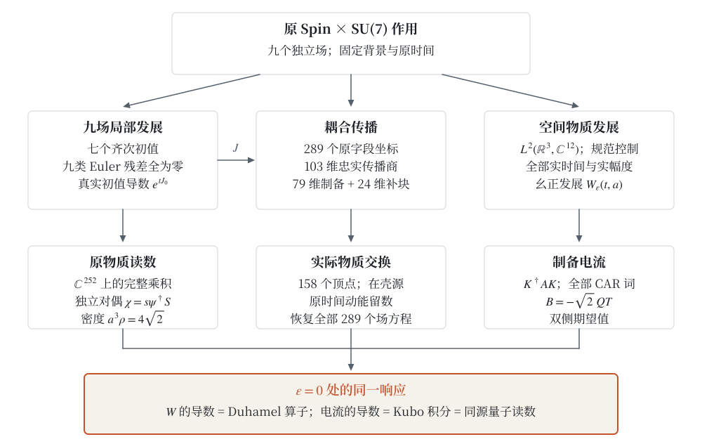
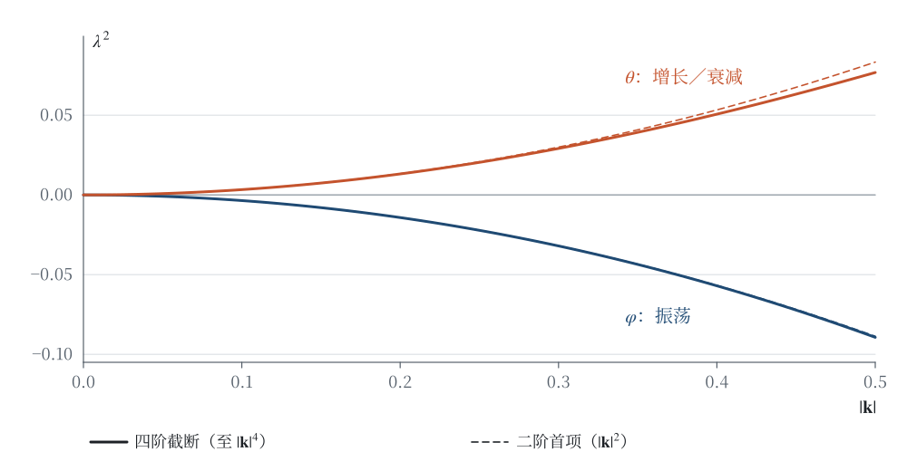
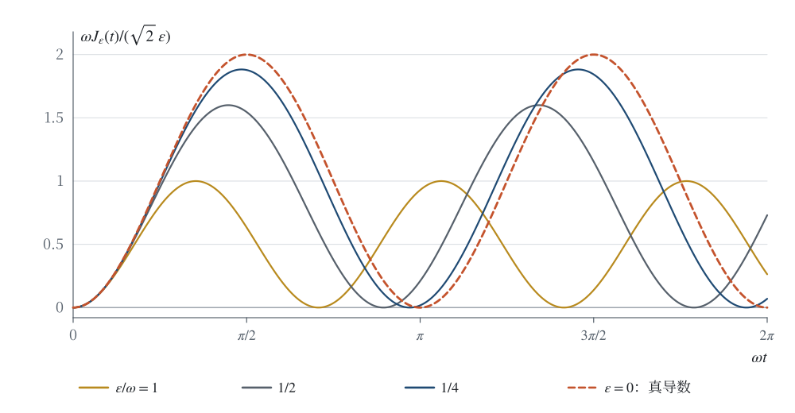
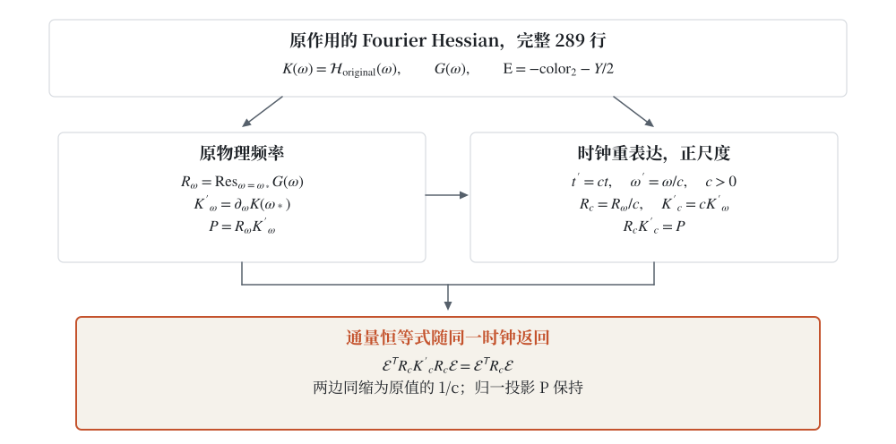
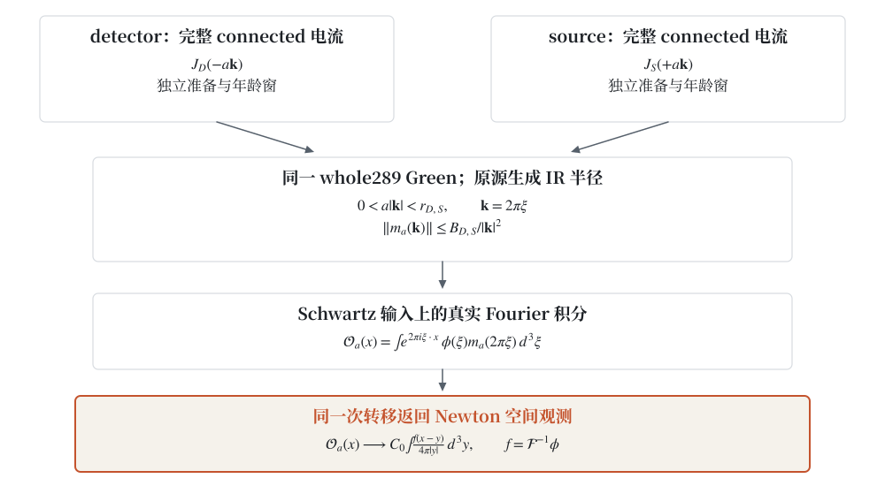
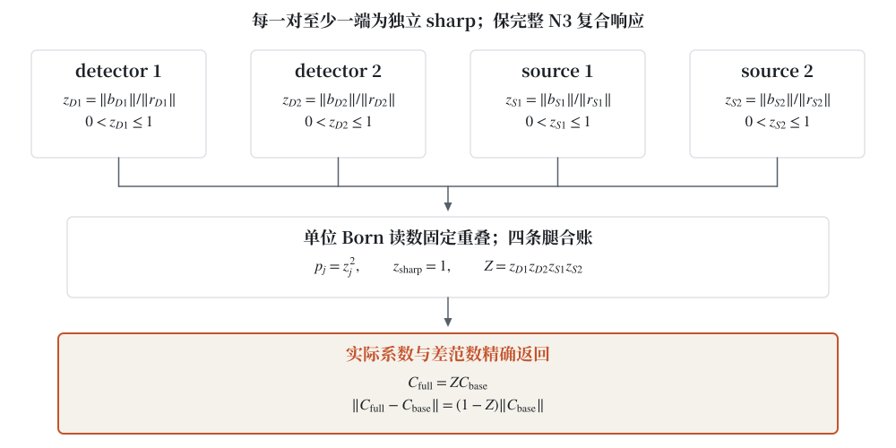
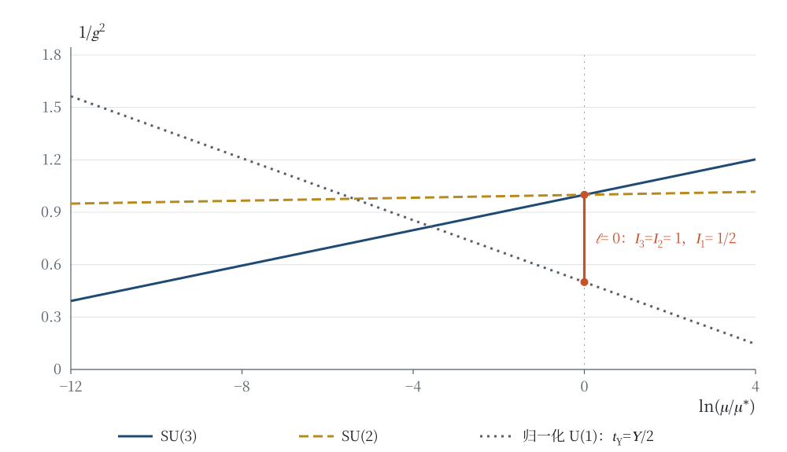
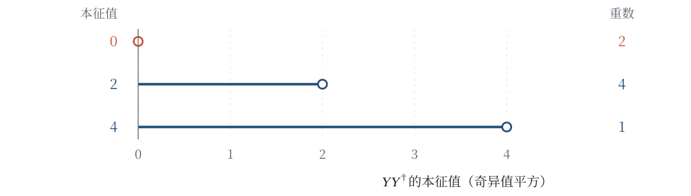
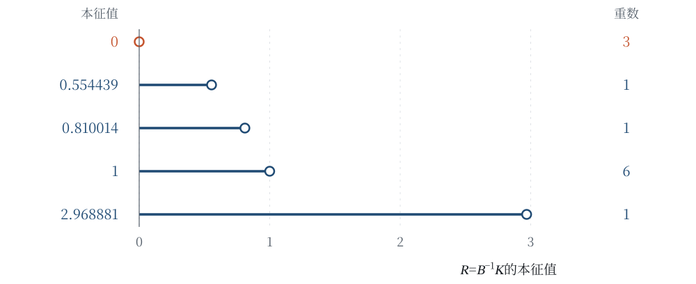

# 电流出庭：从耦合传播到实际电子、Coulomb 返回与 Born 修饰

# The Current Takes the Stand: From Coupled Propagation to Actual Electrons, Coulomb Response, and Born Dressing

**作者：高健（Jian Gao）**\
独立研究者 · innersummer@hotmail.com · ORCID 0009-0009-5002-1655

## 摘要

本文从共同源 Spin×SU(7) 模型的原九场作用出发，把耦合传播接到实际电子的电磁读数、Newton 空间返回与 Born 修饰。同一个源生电子态认回原静止腿，原时间电流为 $-1$、电磁荷为 $+1$；一次 Coulomb 标量和 ordinary photon 响应保留全部64权、两端修正、独立年龄窗及原源振幅，photon 公式在原极点支的最终邻域成立。完整289场的混合电磁载体由真实作用 Hessian 生成；任意正时钟重表达同时变换频率留数与 Jacobi 导数，保持原通量恒等式。对 Schwartz 输入，原全方向 Green 与实际移动两端自产共同红外范围及可积控制，使同一次、相反动量转移的真实 Fourier 积分返回 Newton 卷积。完整 N3 复合响应的单位归一进一步产生四个 Born 重叠：每一对至少有一端为独立 sharp 时，其乘积 $Z$ 精确给出 $C_{\mathrm{full}}=ZC_{\mathrm{base}}$ 及差范数 $(1-Z)\|C_{\mathrm{base}}\|$。这条链保留原有的共同局部九场发展与真实初值导数、全三动量 Jacobi 传播及原场恢复、两相位四阶导数作用、按原留数归一的非零在壳树交换，以及固定原背景的 $L^2(\mathbb R^3,\mathbb C^{12})$ 空间上的全部有限 CAR 词。范数连续的有界自伴规范控制生成全实时间、全实幅度的幺正发展；零幅度的算子范数导数同时读回 Duhamel、Kubo 与原电流。联合半单位 character、实际单位电子和完整复合腿各保其定义；Thomson／full-light／contact 按原匹配等式作为条件消费者。

**关键词：** 共同源；实际电子；电磁电流；Coulomb 交换；Newton 卷积；Born 修饰；受约束传播；全时间 Kubo 响应。

## Abstract

Starting from the original nine-field action of a common-source Spin×SU(7) model, we connect coupled propagation to actual electron readouts, spatial Newton return, and Born dressing. The same source-generated electron state is identified with its original rest leg: its temporal current is $-1$ and its electromagnetic charge is $+1$. The one-pass Coulomb scalar and ordinary photon response retain all 64 weights, both endpoint corrections, independent age windows, and the original source amplitude; the photon formula holds eventually on the original pole sheet. The mixed electromagnetic carrier on all 289 field directions is generated by the actual action Hessian. Every positive clock re-expression transforms the frequency residue and Jacobi derivative together, preserving the original flux identity. For Schwartz inputs, the all-direction Green function and two actual moving endpoints generate a common infrared radius and integrable domination; the genuine Fourier integral, with opposite momenta of the same transfer, returns to a Newton convolution. Unit normalization of complete N3 composite responses generates four Born overlaps. When each pair contains at least one independently generated sharp leg, their product $Z$ gives exactly $C_{\mathrm{full}}=ZC_{\mathrm{base}}$ and the norm difference $(1-Z)\|C_{\mathrm{base}}\|$. The construction retains joint local nine-field development and its actual initial-data derivative, Jacobi propagation at every real spatial momentum with field reconstruction, the two-phase action through fourth derivative order, and a nonzero on-shell tree exchange normalized by original residues. On $L^2(\mathbb R^3,\mathbb C^{12})$ over the fixed original background, it retains every finite CAR word. Norm-continuous histories of bounded self-adjoint gauge controls generate unitary development for all real times and amplitudes; the operator-norm derivative at zero amplitude reads back the Duhamel operator, Kubo integral, and original current. The joint half-unit character, unit-charge electron, and full composite legs retain their distinct definitions; Thomson, full-light, and contact matching enter through the original conditional equation.

**Keywords:** common-source model; actual electron; electromagnetic current; Coulomb exchange; Newton convolution; Born dressing; constrained propagation; all-time Kubo response.

<a id="sec-1"></a>

## 1 一个电流，三条计算路径

把大矩阵变小并不难；难的是追问：小矩阵报出的读数，还是不是原作用对原物质所作的读数？本文先传唤一个能在纸上算完的电流。它将三次作证：一次作为有限演化的期望值，一次作为真实解对控制幅度的导数，一次作为对易子积分。三次证词中的初态、力和电流都由同一原作用确定。

### 1.1 从原占据态取出四维窗口

取源固定常数

$$s=\sqrt2,\qquad N^2=\frac{54}{125},\qquad
\alpha_0=\frac{3\sqrt2}{5},\qquad
\omega=\frac{3N}{2}(s-\alpha_0)=\frac{18\sqrt{15}}{125}>0.\tag{1.1}$$

这里 $t$ 是原时间坐标，$N$ 是原余标架的时间系数。常数的来源与完整场构型将在 §2 写出。物质的原占据空间为

$$\mathcal H_{12}=\mathbb C^4\otimes\operatorname{span}\{e_{05},e_{15},e_{25}\}.$$

按自旋优先、颜色次之的坐标序，单位占据向量为

$$w=\frac12(0,1,0,-1,0,0,0,1,0,-1,0,0)^{\mathsf T}.
\tag{1.2}$$

原场在零时刻的幅度是 $\psi_0=2w$。记 $Q=\operatorname{diag}(-1,-1,1,1)\otimes I_3$，选择原色生成元

$$\rho_{01}=\begin{pmatrix}0&1&0\\-1&0&0\\0&0&0\end{pmatrix}.$$

它在时间连接中产生的 Hamiltonian 力和作用电流分别为

$$T=-iI_4\otimes\rho_{01},\qquad B=-sQT.\tag{1.3}$$

两者都是 Hermitian 算子，却不是同一个算子。$T$ 决定怎样推动态，$B$ 决定怎样读取原作用的电流；因子 $-sQ$ 保留了独立对偶的配对与原时间动能权重。

令 $r=Tw$、$q=Qr$、$p=Qw$。四列 $F=(w,r,q,p)$ 正交归一，并同时保持于原定常 Hamiltonian $h_0$、$T$ 和 $B$。在这个由原态生成的基中，

$$F^\dagger h_0F=
\begin{pmatrix}0&0&0&0\\0&0&2\omega&0\\0&2\omega&0&0\\0&0&0&0\end{pmatrix},
\qquad
F^\dagger TF=
\begin{pmatrix}0&1&0&0\\1&0&0&0\\0&0&0&1\\0&0&1&0\end{pmatrix}.
\tag{1.4}$$

再取 $Q$ 的正、负本征组合 $(w+p,r+q,w-p,r-q)/\sqrt2$，系统化成两个二阶块：

$$h_{0,+}=\begin{pmatrix}0&0\\0&2\omega\end{pmatrix},\quad
h_{0,-}=\begin{pmatrix}0&0\\0&-2\omega\end{pmatrix},\quad
T_\pm=\sigma_x,\quad B_\pm=\mp s\sigma_x.
\tag{1.5}$$

初态在两块中各为 $2^{-1/2}(1,0)^{\mathsf T}$。这个四维窗口不是另置的二能级模型，而是原十二维算子的一个同时不变子空间。

### 1.2 有限控制先于线性响应

第一份证词来自有限演化。给原时间连接一个实控制幅度 $\epsilon$，两块的真实 Hamiltonian 是

$$h_{\epsilon,\pm}=\pm\omega I+\epsilon\sigma_x\mp\omega\sigma_z.
\tag{1.6}$$

由于 $(\epsilon\sigma_x\mp\omega\sigma_z)^2=(\omega^2+\epsilon^2)I$，令 $r_\epsilon=\sqrt{\omega^2+\epsilon^2}$，即可直接求指数：

$$U_{\epsilon,\pm}(t)=e^{\mp i\omega t}
\left[\cos(r_\epsilon t)I-i\frac{\sin(r_\epsilon t)}{r_\epsilon}
(\epsilon\sigma_x\mp\omega\sigma_z)\right].\tag{1.7}$$

对所有实 $\epsilon,t$，这个式子满足原初值与有限控制方程。将它作用于两块初态，再用 (1.5) 的两个电流相加，得到

$$\boxed{J_\epsilon(t)=
\frac{s\epsilon\omega}{\omega^2+\epsilon^2}
\left[1-\cos\!\left(2t\sqrt{\omega^2+\epsilon^2}\right)\right].}
\tag{1.8}$$

因此，有限发展在零控制处的真导数为

$$\boxed{\left.\partial_\epsilon J_\epsilon(t)\right|_0
=\frac{s}{\omega}(1-\cos 2\omega t).}\tag{1.9}$$

次序是先有有限解，再求导；振荡频率 $r_\epsilon$ 本身也随控制变化；这一变化已经包含在 (1.8) 中。这里 $J_\epsilon$ 采用单位占据态 (1.2)；原幅度 $\psi_0=2w$ 的双线性电流为其四倍。

第二条路径直接对态求导。原基 $(w,r,q,p)$ 中，零控制态始终是 $w$，且

$$\delta u(t):=\left.\partial_\epsilon U_\epsilon(t)w\right|_0
=-i\frac{\sin2\omega t}{2\omega}r
+\frac{\cos2\omega t-1}{2\omega}q.\tag{1.10}$$

因 $Bw=-sq$，电流的两条腿共同给出

$$\delta u(t)^\dagger Bw+w^\dagger B\delta u(t)
=\frac{s}{\omega}(1-\cos2\omega t).\tag{1.11}$$

若只对一条腿求导，系数会少一半。若把观测量 $B$ 换成推动系统的 $T$，两块的响应反而抵消为零。两处改口都当场露馅：算对矩阵指数，还不足以保证算对原电流。

第三条路径使用未扰动发展 $U(t)=e^{-ith_0}$。令 $T_H(\tau)=U(-\tau)TU(\tau)$、$B_H(t)=U(-t)BU(t)$，从 (1.4) 得

$$\operatorname{Re}\,i\langle w,[T_H(\tau),B_H(t)]w\rangle
=2s\sin\bigl(2\omega(t-\tau)\bigr).$$

于是

$$\operatorname{Re}\,i\int_0^t
\langle w,[T_H(\tau),B_H(t)]w\rangle\,d\tau
=\frac{s}{\omega}(1-\cos2\omega t),\tag{1.12}$$

第三份证词与前两份分毫不差；有向积分也使等式对负时间成立。§8 将在真正的三维 $L^2$ 空间中证明这一等式，并给出传播算子的统一二阶余项。有限窗口让系数当庭可见；全空间定理再让空间准备、任意初态和时间发展共用同一个定义。

### 1.3 本文的问题与结果

本文沿既有共同源 Spin×SU(7) 模型 [1] 的原作用展开。全文的中心是以下相接关系：**原场方程生成传播，原外腿生成源，原作用生成电流；在实际空间准备上，有限量子发展的真导数回到同一电流。**

三类发展与后续源生观测各带自己的输入。先把它们并排摆开，后文每个读数都能在此找到出处。

| 对象 | 输入 | 本文得到的输出 |
|---|---|---|
| 空间齐次九场非线性发展 | 允许域中的七个实初值 | 共同初值邻域和双向局部时间条带上的九场解族、唯一性及真实初值导数 |
| 原背景的完整耦合第一变分 | 独立字段扰动与四动量 | 约束约化、完整传播因子、原字段恢复及制备子类的有效作用 |
| 固定原背景上的空间物质发展 | $L^2$ 初态、原规范作用生成的有界局域控制及其实幅度 | 全实时间、全实幅度的幺正发展，空间准备、全部有限 CAR 词及算子范数响应导数 |
| 源生准备的电磁与空间观测 | 独立source／detector准备、实际电子或N2／N3响应、原Green与Schwartz输入 | 完整两端Coulomb／ordinary读数、原作用／clock归一、Newton卷积及逐对sharp条件下的Born修饰 |

§3 建立第一行，并将径向 Jacobi 解接回完整九场。§§4–6 建立第二行：从 289 个活跃实字段出发，得到 103 维忠实传播商及其 79 维制备子类，计算两相位四阶导数作用，再以完整 158 个物质顶点、原作用留数和实际在壳外腿形成非零交换。§§7–8 建立第三行。§§9–13把同源准备接到实际电子、电磁／Coulomb、物理时钟、Newton空间返回及Born修饰。§14讨论这些结果对后续唯象计算的具体含义。原库存、裸二次块和全局稳定子见附录 A；它们为结构辨识提供坐标。



**图 1　同一电流的来路与返回。** 左、中两列从原作用生成九场发展和受约束传播，右列从原物质作用生成空间准备与有限发展。朱红底框是三条路径的汇合处：作用电流、双侧变分及 Kubo 积分在 $\epsilon=0$ 处给出同一响应。箭头携带显式的场、方程或源映射，不把三个域等同；原字段恢复箭头表示实际方程恒等式，而非只保留某个行列式。三条发展路径的输入分别见上表。

背景场方法、通过场方程消去可逆方向、二次量子化与非自治发展均有成熟的方法来源 [2–6]。本文使用这些方法，具体构造的是它们在这一个原作用中的连接：独立对偶如何进入源，约束如何恢复为原行，相位如何回到原时间，有限准备如何保持原读数。各命题的证据类型与源位置列于附录 E。

<a id="sec-2"></a>

## 2 原作用、九个场与时间字典

### 2.1 场的来源与载体

本文沿用 [1] 中的同一光滑统一源及其经典构型。母群为 $\mathrm{Spin}^{+}(1,3)\times\mathrm{SU}(7)$；实际规范连接取值于

$$\mathfrak h=\mathfrak{su}(3)\oplus\mathfrak{su}(2)\oplus\mathfrak u(1),
\qquad (C,W,y)\longmapsto\operatorname{diag}(C,W,y,-y).\tag{2.1}$$

下文称(2.1)为 P286 嵌入；该编号标识这一具体构造，不是另一个物理参数。七维基按 $(c_0,c_1,c_2,w_0,w_1,h_+,h_-)$ 编为 $0,\ldots,6$。三个外幂层组成物质载体

$$\mathcal M=\mathbb C^4\otimes
\left(\Lambda^6\mathbb C^7\oplus\Lambda^2\mathbb C^7\oplus\Lambda^4\mathbb C^7\right),
\qquad \dim_{\mathbb C}\mathcal M=4(7+21+35)=252.\tag{2.2}$$

$e_I$ 表示指标集合递增排序的单位外幂基。标量的指定真空是

$$v=e_{0126}+e_{0124}+e_{0156}+e_{0145},\qquad \|v\|^2=4.\tag{2.3}$$

九个独立场分别为余标架 $e$、自旋联络 $\varpi$、引力二形式 $\mathcal B$、简单性乘子 $\Lambda$、规范连接 $A$、规范二形式 $B_A$、标量 $\Phi\in\Lambda^4\mathbb C^7$、物质 $\psi\in\mathcal M$ 和独立复线性对偶 $\chi\in\mathcal M^*$。$\chi$ 与 $\psi$ 各有自己的变分；后文的关系 $\chi=s\psi^\dagger S$ 是实际解与指定制备子类的关系，不是原场空间的定义。

曲率由这些场计算：$F_\varpi=d\varpi+\varpi\wedge\varpi$、$F_A=dA+A\wedge A$。同样，协变导数由实际场的一阶导数计算，而非作为可以独立指定的附加数据。以下在源的零号坐标片写公式，其他坐标片按同一母表示及其对偶输运。

### 2.2 一个保留归一化的作用式

令 $\eta=\operatorname{diag}(-1,1,1,1)$、$g=e^{\mathsf T}\eta e$、$\nu_e=|\det e|$。时空二形式与内部双矢均按 $(01,02,03,23,31,12)$ 排序，但保留两类指标的区别。写

$$J=\begin{pmatrix}0&I_3\\-I_3&0\end{pmatrix},\qquad
(\Sigma_e)_{Ip}=e^{a_I}_{\mu_p}e^{b_I}_{\nu_p}-e^{a_I}_{\nu_p}e^{b_I}_{\mu_p}.$$

$J$ 是内部双矢对偶；$\star_e$ 是时空二形式的 Hodge 算子。定义 $p^c=(3,4,5,0,1,2)$、$\epsilon_I=(-1,-1,-1,1,1,1)_I$，以及

$$W_\kappa(X,Y)=\sum_p\kappa(X_p,Y_{p^c}),\qquad
W_{\rm top}(X,Y)=\sum_{I,p}\epsilon_I X_{Ip}Y_{I,p^c}.\tag{2.4}$$

在两个特殊酉块上 $\kappa(X,Y)=-\operatorname{Re}\operatorname{tr}(XY)$；在原超荷坐标上 $\kappa(y,z)=-\operatorname{Re}(yz)$。后者没有因母嵌入出现两个对角元而乘二。记 $\widehat F_{\varpi,Ip}=\epsilon_I F^{\rm raw}_{\varpi,Ip}$，其中 raw 表示降低两个内部指标的原曲率坐标。

Dirac 矩阵与手征算子采用

$$\gamma^0=\begin{pmatrix}0&I_2\\-I_2&0\end{pmatrix},\quad
\gamma^i=\begin{pmatrix}0&\sigma_i\\\sigma_i&0\end{pmatrix},\quad
\gamma^5=\operatorname{diag}(-I_2,I_2),\quad S=\gamma^0\gamma^5.\tag{2.5}$$

在 $\mathcal M$ 上均张量以外幂层的恒等作用。$S^\dagger=S$、$S^2=I$；它交换手征块，负责把指定对偶接回坐标内积。令

$$\Gamma_e^\mu=(e^{-1})^\mu{}_a\gamma^a,\quad
\Omega_\mu=\frac14\varpi_{\mu ab}\gamma^a\gamma^b,\quad
D_\mu\psi=\partial_\mu\psi+(\Omega_\mu+\rho(A_\mu))\psi,
$$

$$D_\mu\Phi=\partial_\mu\Phi+\rho_4(A_\mu)\Phi,\qquad
Y_R(\Phi)=T_\Phi P_R,\quad P_R=\operatorname{diag}(0,0,1,1),$$

$$T_\Phi(w_6,w_2,w_4)=(w_2\wedge\Phi,0,0),\qquad
V(\Phi)=\|\Phi-v\|^2.\tag{2.6}$$

右手 Yukawa 作用从 $\Lambda^2$ 指向 $\Lambda^6$。其方向性是原作用的一部分；独立对偶随后评价这个向量。

共同局部密度为

$$\begin{aligned}
\mathcal L={}&W_{\rm top}(\mathcal B,\widehat F_\varpi)
-\frac12W_{\rm top}(\mathcal B,J\mathcal B)
+W_{\rm top}(\Lambda,\mathcal B-J\Sigma_e)\\
&+\sum_{j=3,2,1}\left[W_j(B_{A,j},F_{A,j})
-\frac12W_j(B_{A,j},g_j^2\star_e B_{A,j})\right]\\
&+\nu_e\left[\frac12g^{\mu\nu}\operatorname{Re}\langle D_\mu\Phi,D_\nu\Phi\rangle
-V(\Phi)+\operatorname{Re}\chi\bigl(i\Gamma_e^\mu D_\mu\psi+Y_R(\Phi)\psi\bigr)\right],
\qquad g_j^2=\sigma=\frac12.
\end{aligned}\tag{2.7}$$

上式固定了全文所有二次型和顶点的归一化。BF 项本身已是四形式系数；仅最后一行另乘体积密度。$g_j^2$ 而非 $g_j$ 等于 $1/2$。相对于 $\psi$ 的独立对偶已承担左配对，Yukawa 中不再插入 $\gamma^0$ 或额外的反向伴随项。

### 2.3 指定背景的九个字段

用 $q_0=e_{05},q_1=e_{15}\in\Lambda^2\mathbb C^7$ 定义

$$C(u,v)=\begin{pmatrix}0&u\\-u&0\\0&v\\-v&0\end{pmatrix},\qquad
\Psi[u,v]_r=\sum_{a=0}^1C(u,v)_{ra}q_a,
\quad \Xi[p,q](z)=\sum_{r,a}C(p,q)_{ra}q_a^*(z_r).\tag{2.8}$$

$\Xi$ 的表达式中没有复共轭。三个色二重态生成元在前两色上为

$$\tau_0=\frac12\begin{pmatrix}0&i\\i&0\end{pmatrix},\quad
\tau_1=\frac12\begin{pmatrix}0&1\\-1&0\end{pmatrix},\quad
\tau_2=\frac12\begin{pmatrix}i&0\\0&-i\end{pmatrix},\qquad
\kappa(\tau_i,\tau_j)=\frac12\delta_{ij}.\tag{2.9}$$

它们在其余坐标上为零。指定构型是

$$\begin{gathered}
e_0=\operatorname{diag}(N,1,1,1),\quad
A^{(0)}=(0,\alpha_0\tau_0,\alpha_0\tau_1,\alpha_0\tau_2),\quad
\Phi_0=v,\\
\psi_0(t)=\Psi[e^{i\omega t},e^{-i\omega t}],\quad
\chi_0(t)=\Xi[se^{i\omega t},se^{-i\omega t}].
\end{gathered}\tag{2.10}$$

降低内部指标的自旋连接，其唯一非零分量是

$$\varpi_{1,23}=\varpi_{2,31}=\varpi_{3,12}=s.\tag{2.11}$$

在前述双矢与二形式顺序中，其余三个字段为

$$\mathcal B_0=\begin{pmatrix}0&I_3\\-NI_3&0\end{pmatrix},\qquad
\Lambda_0=\operatorname{diag}(-N,-N,-N,s^2-1,s^2-1,s^2-1),$$

$$B_{A,0}=\frac{\alpha_0^2}{\sigma N}(\tau_0,\tau_1,\tau_2,0,0,0).\tag{2.12}$$

实际曲率是

$$\widehat F_{\varpi,0}=\operatorname{diag}(0,0,0,-s^2,-s^2,-s^2),\quad
F_{A,0}=(0,0,0,-\alpha_0^2\tau_0,-\alpha_0^2\tau_1,-\alpha_0^2\tau_2).\tag{2.13}$$

因此背景余标架虽然常数，自旋曲率与规范曲率仍非零。由联络自乘产生的这些项，后面会进入传播混合和外腿频率。

### 2.4 辅助消元以及如何把场找回来

先看一组可以完全手算的消元。由 (2.7) 对 $B_A$ 变分得 $F_A-K_eB_A=0$，其中 $K_e=\sigma\star_e$。洛伦兹二形式上 $\star_e^2=-I$，故

$$B_A^*=-\sigma^{-1}\star_e F_A,\qquad
\mathcal L(B_A)=\mathcal L(B_A^*)-\frac12W(B_A-B_A^*,K_e(B_A-B_A^*)).
\tag{2.14}$$

这是原楔配对下带符号的配方。对背景 $e_0$，

$$\star_{e_0}(f_0,\ldots,f_5)
=(f_3/N,f_4/N,f_5/N,-Nf_0,-Nf_1,-Nf_2).\tag{2.15}$$

把 (2.13) 代入，立即恢复 (2.12) 的 $B_{A,0}$：三个磁曲率分量变成三个电型辅助分量。消去的场没有消失，它的值已由保留场确定。

对任意一阶扰动，恢复公式继续为

$$\boxed{\delta B_A=K_0^{-1}
\left(\delta F_A-(\delta K_e)B_{A,0}\right).}\tag{2.16}$$

第二项尤其重要：余标架改变，Hodge 算子也改变。例如仅扰动时间系数 $N\mapsto N+\delta n$ 并扰动磁幅度 $\alpha_0\mapsto\alpha_0+\delta\alpha$，则

$$\delta(B_A)_{0i}
=\left(\frac{2\alpha_0}{\sigma N}\delta\alpha
-\frac{\alpha_0^2}{\sigma N^2}\delta n\right)\tau_{i-1}.
\tag{2.17}$$

忽略余标架项会漏掉一个真实响应，而不是只改变规范写法。引力两项同样恢复为

$$\delta\mathcal B=J\,\delta\Sigma_e,\qquad
\delta\Lambda=J\,\delta\mathcal B-\delta\widehat F_\varpi.\tag{2.18}$$

§4 的大矩阵消元逐步实现同一件事，并保存每一步的场恢复与方程恢复。树级消去可逆方向的思路与 [3, §2.1.1] 一致；这里多要求一步：每个有效场的解都要重新满足原来保留的所有方程。

### 2.5 原时间、共转表示与配对

物质的周期背景可用同一源相位化为定常形式。在完整 252 维载体上，令 $P_6$ 为 $\Lambda^6$ 层投影，定义

$$Q=\gamma^5+2P_6,\qquad P(t)=e^{-i\omega tQ},\qquad
\psi_{\rm orig}=P(t)\psi_{\rm st},\quad
\chi_{\rm orig}=\chi_{\rm st}\,S P(t)^\dagger S.\tag{2.19}$$

$Q$ 限制到原占据空间即为 §1 的 $\gamma^5$。完整原 Dirac 算子在定常表示中增加 $+\omega\Gamma_e^0Q$，相应 Hamiltonian 满足

$$H_{\rm st}(\mathbf k)=H_{\rm orig}(\mathbf k)-\omega Q.
\tag{2.20}$$

共转变换改变的是场表示，时间坐标仍为同一个 $t$；(2.20) 按确定的相位恢复原频率。非零顶点保留 $Q$ 荷时，原频率与定常频率的转移量相同。

全文采用下列时间与动量字典：原时间 $t=x^0$；背景固有时 $\tau=Nt$；Fourier–Jacobi 增长符号 $p=(\lambda,i\mathbf k)$；有理化变量

$$u=\frac{\lambda}{N\sqrt2},\qquad \mathbf q=\frac{\mathbf k}{\sqrt2};
\qquad \widehat f(\xi)=\int e^{-2\pi i\mathbf x\cdot\xi}f(\mathbf x)\,d^3x,
\quad \mathbf k=2\pi\xi.\tag{2.21}$$

在传播式中 $\lambda$ 是增长率；在量子频率式中使用 $e^{-iEt}$，即 $\lambda=-iE$。所以 $\lambda^2<0$ 对应振荡，$\lambda^2>0$ 对应实增长。以下各节保持这个符号，不用“质量平方”的命名抹平二者。

<a id="sec-3"></a>

## 3 九场共同发展及其真实切向

### 3.1 七个初值怎样生成九个场

空间齐次条件使空间导数消失，但并未把引力、规范和物质拆成互不影响的方程。一个标量初始速度会改变应力；时间余标架因而改变，规范加速度与物质相位也随之改变。下面把这种反馈写成一个明确的七维系统。

记状态为 $x=(a,H,\alpha,b,f,w_s,\theta)$，依次表示空间尺度、标架速度、规范幅度、规范动量、径向标量位移、标架中的标量速度和物质相位。此处 $w_s$ 是实速度，区别于 §1 的占据向量 $w$。定义

$$c=\frac{s}{a^2},\quad E_A=b^2+\alpha^4,\quad q_v=\|v\|^2=4,$$

$$\mathcal D(x)=\frac{6s(c-\alpha)}a
+q_v a^3\left(f^2-\frac{w_s^2}{2}\right)
+3a^3+3aH^2-3ac^2,\qquad
n(x)=\sqrt{\frac{3aE_A}{4\sigma\mathcal D(x)}}.\tag{3.1}$$

允许域是开集 $\mathcal A=\{a>0,E_A>0,\mathcal D>0\}$。其中的 $n$ 由时间余标架方程确定，不是另给的时钟函数。原方程生成的向量场 $G$ 为

$$\begin{aligned}
\dot a&=nH,\\
\dot H&=\frac{1}{2a}\left[-\frac{E_A}{4\sigma n}
+n\left(\frac{2s(c-\alpha)}{a^2}
-q_v a^2\left(f^2+\frac{w_s^2}{2}\right)-3a^2-H^2+c^2\right)\right],\\
\dot\alpha&=\frac{ab}{n},\qquad
\dot b=\frac{4\sigma ns}{a}-\frac{2a\alpha^3}{n},\\
\dot f&=nw_s,\qquad \dot w_s=n\left(2f-\frac{3Hw_s}{a}\right),\\
\dot\theta&=\frac{3n(c-\alpha)}{2a}.
\end{aligned}\tag{3.2}$$

沿任一允许解 $x(t)$ 写出

$$e=\operatorname{diag}(n,a,a,a),\quad A_i=\alpha\tau_{i-1},\ A_0=0,
\quad \Phi=(1+f)v,$$

$$\psi=a^{-3/2}\Psi[e^{i\theta},e^{-i\theta}],\qquad
\chi=sa^{-3/2}\Xi[e^{i\theta},e^{-i\theta}].\tag{3.3}$$

自旋连接由两部分相加：Levi–Civita 部分的非零混合分量为 $\varpi_i{}^0{}_i=\varpi_i{}^i{}_0=H$；轴向挠率部分的降低分量为 $\varpi_{1,23}=\varpi_{2,31}=\varpi_{3,12}=c$。其余字段由

$$\mathcal B=J\Sigma_e,\qquad \Lambda=J\mathcal B-\widehat F_\varpi,
\qquad B_A=-\sigma^{-1}\star_e F_A\tag{3.4}$$

恢复。因而七个状态既写出九个场，也写出各场实际的一阶导数。特别是 $\dot n=Dn(x)G(x)$，不能在求曲率时当作零。

**定理 3.1（共同局部发展）。** 对每个 $x_*\in\mathcal A$，存在 $r,T>0$ 和 $C\geq0$，使闭球 $\overline B(x_*,r)$ 中每个初值 $x$ 都生成同一时间条带 $|t|<T$ 上的光滑解 $X(x,t)$。它保持在 $\mathcal A$ 中，满足 $X(x,0)=x$、$\partial_tX=G(X)$，并有

$$\|X(x,t)-X(y,t)\|\leq C\|x-y\|.\tag{3.5}$$

由 (3.3)–(3.4) 生成的九场，其原九类 Euler 残差在条带内共同为零。同初值的发展在共同定义区间上相同。

难处在第二步：七维 ODE 有解，不等于九个场都回答了各自的方程。证明要点是两个实际相接的步骤。先由 $a,E_A,\mathcal D$ 的严格正性，得到 $G$ 在允许域内光滑；局部 Picard 构造给出共同初值球和共同时间区间，再利用联合连续性把整个乘积邻域留在允许域。随后将该解的实际导数代入原场：Cartan 方程给出 $c=s/a^2$，规范方程给出 $\dot\alpha,\dot b$，标量方程给出 $\dot f,\dot w_s$，两条物质方程给出稀释率与 $\dot\theta$，余标架两类平衡给出 $n$ 和 $\dot H$。这一步使用的是原场变分，故结论是九场共同解，而不止七维 ODE 的一个解。∎

### 3.2 相位漂移中的初值导数

原状态为

$$x_0=(1,0,\alpha_0,0,0,0,0),\qquad
X(x_0,t)=x_0+t\omega e_7.\tag{3.6}$$

它不是七维坐标中的静止点：第七坐标一直走。由于 $G$ 不依赖 $\theta$，减去这一实际漂移后，得到中心向量场

$$G_c(z)=G(x_0+z)-\omega e_7,\qquad G_c(0)=0,\qquad
J_0=DG(x_0),\quad G_c(z)=J_0z+o(\|z\|).\tag{3.7}$$

**定理 3.2（真初值导数）。** 对定理 3.1 在 $x_0$ 处的共同发展及每个 $|t|<T$，

$$D_xX(x_0,t)=e^{tJ_0}.\tag{3.8}$$

这是实际非线性解族的 Fréchet 导数。容易算错的是背景本身在走：相位一直漂移，偏离必须从漂移中的轨道量起。证明中，将 $X(x_0+h,t)-X(x_0,t)$ 与 $e^{tJ_0}h$ 相减。局部 Lipschitz 界先把全部非线性位移控制为 $C\|h\|$；(3.7) 的余项因而在整段时间上为 $o(\|h\|)$。对差方程应用 Grönwall 估计，再分别处理正、负时间，即得 (3.8)。相位漂移保留在 (3.6) 中，而没有被误算为偏离背景的扰动。

原 $J_0$ 的特征多项式为

$$\det(XI-J_0)=X\left(X^2+\frac{648}{125}\right)
\left(X^2-\frac{50}{3}\right)
\left(X^2-\frac{108}{125}\right).\tag{3.9}$$

零根、振荡根和两对实增长／衰减根各有自己的位置。径向标量对给出 $108/125=2N^2$；其余五态的多项式是前三个因子的乘积，并将在 §4 通过原 289 行接受同一个切向。

### 3.3 全空间径向 Jacobi 解

现在允许标量有空间轮廓，仍保留原背景的其余场。令 $\Phi_\epsilon=(1+\epsilon f(t,\mathbf x))v$。径向方程从原标量动能和势直接化为

$$\mathcal R f:=\frac1{N^2}\partial_t^2f-\Delta f-2f=0.\tag{3.10}$$

固定任意实三动量 $\mathbf k$，取 $f(0,\mathbf x)=0$、$\partial_tf(0,\mathbf x)=\cos(\mathbf k\cdot\mathbf x)$，得到

$$f_{\mathbf k}(t,\mathbf x)=\cos(\mathbf k\cdot\mathbf x)
\begin{cases}
\sinh(\gamma t)/\gamma,&|\mathbf k|^2<2,\quad\gamma=N\sqrt{2-|\mathbf k|^2},\\
t,&|\mathbf k|^2=2,\\
\sin(\nu t)/\nu,&|\mathbf k|^2>2,\quad\nu=N\sqrt{|\mathbf k|^2-2}.
\end{cases}\tag{3.11}$$

临界式 $t$ 是左右两种表达式在零频率处的同一极限；三个时间因子的初始导数均为 1，完整场的初始速度始终为 $\cos(\mathbf k\cdot\mathbf x)$。

**定理 3.3（完整径向第一变分）。** 设轮廓 $f$ 可微，各一阶坐标偏导在所考察点可微，且在该点满足 (3.10)。则原九场残差中八类在任意实 $\epsilon$ 下恰为零，唯一留下的余标架残差为 $\epsilon^2$ 乘一个明确的原余标架余向量。因此九类残差对 $\epsilon$ 在零处的导数全部为零。特别地，(3.11) 的三种动量区域均给出原九场的 Jacobi 解。

二阶反作用也可以从纸面看见。径向扰动给原密度增加

$$\Delta\mathcal L_\Phi
=\epsilon^2q_v\nu_e\left(\frac12g^{\mu\nu}\partial_\mu f\,\partial_\nu f-f^2\right).
\tag{3.12}$$

对 $e$ 变分后才置 $e=e_0$，便是上述余标架负载。它严格从二阶开始，解释了一阶 Jacobi 解为何闭合，也解释了有限径向振幅为何要求 §3.1 的共同反馈。这里的单个余弦波是全空间模态；§7 的 $L^2$ 准备将另外处理可归一的空间场。

### 3.4 同一发展的物质密度

非线性解中 $a^{-3/2}$ 的振幅有直接读数。令 $\widehat\psi_\theta=\Psi[e^{i\theta},e^{-i\theta}]/2$，则对任意完整母算子 $A\in\operatorname{End}(\mathcal M)$，

$$\chi(A\psi)=4s\,a^{-3}\langle\widehat\psi_\theta,SA\widehat\psi_\theta\rangle.
\tag{3.13}$$

取 $A=S$ 并读实部，得到原场密度

$$\rho=\operatorname{Re}\chi(S\psi)=4s\,a^{-3},\qquad a^3\rho=4s.\tag{3.14}$$

这将空间体积、物质稀释与原对偶配对接在同一条等式上。单位向量的概率规范与有幅度的原场密度因此都保留了各自的用途。

后续计算还要避免过早压缩算子。若 $I$ 为选定物质子空间到 $\mathcal M$ 的等距嵌入，$C(A)=I^\dagger AI$，则

$$C(AB)=C(A)C(B)+I^\dagger A(I-II^\dagger)BI.\tag{3.15}$$

第二项记录先离开子空间、再返回的过程。§6 的交换和 §7 的 CAR 词都先计算完整乘积，再作压缩；(3.15) 是这一顺序的代数理由。

<a id="sec-4"></a>

## 4 完整耦合传播与原场恢复

### 4.1 为什么先处理约束

在非零物质背景上，规范扰动改变物质，物质反过来改变电流，余标架与自旋连接又同时进入二者。把某一个裸质量块对角化，尚未完成这组联立传播问题。本节直接从 (2.7) 的独立字段一阶 jet 取二次变分。

与原占据态相耦合的活跃实载体包含：16 个余标架坐标、24 个 Lorentz 连接坐标、36 个引力辅助坐标、36 个乘子坐标、48 个规范连接坐标、72 个规范辅助坐标、9 个标量实轨道坐标，以及原占据空间中 primal 与独立 dual 的各 24 个实坐标，总计 289。其余标量与物质方向在 §4.5 和 §6 保留各自的分块与返回关系。

记二次 Euler 符号为 $H_{289}(p)$，采用实字段的带符号转置 $M^\sharp(p)=M(-p)^{\mathsf T}$。原二次作用的形式为 $\frac12z^\sharp H_{289}z$。准确保留 $-p$ 的原因很简单：分部积分把微分算子送到另一条腿时会改变符号。

第一步是三次真实代数消元：

$$289\longrightarrow217\longrightarrow145\longrightarrow121.
\tag{4.1}$$

相应消去维数为 $72,72,24$。每步从实际非零代数块求双侧逆，保留了全动量场恢复。为了看清其含义，设某一步的场分为 $(y,z)$，二次作用连同正号源为

$$\frac12\begin{pmatrix}y\\z\end{pmatrix}^{\sharp}
\begin{pmatrix}A&B\\B^\sharp&D\end{pmatrix}
\begin{pmatrix}y\\z\end{pmatrix}+j_y^\sharp y+j_z^\sharp z.
$$

只要 $A$ 可逆，原 $y$ 方程给出

$$y=-A^{-1}(Bz+j_y),\quad
Kz=-j_z+B^\sharp A^{-1}j_y,\quad
K=D-B^\sharp A^{-1}B.\tag{4.2}$$

代回作用后还留下局部项 $-\frac12j_y^\sharp A^{-1}j_y$。于是传播核、外源变换、被消去场和接触项从同一个消元步骤同时产生。§6 的树交换会把这四样一并用上。

### 4.2 从原 Ward 行得到忠实截面

接下来遇到的不是另一个可以随意舍弃的零块。全部 12 个规范切向对原标量势的响应恰给出秩 9 的 torque。对原实标量偏差 $\phi$，它的形状是

$$\mathcal T_X(\phi)=-2\nu_e\langle\rho(X)v,\phi\rangle_{\mathbb R}.
\tag{4.3}$$

通过具有显式多项式逆的行操作，9 个标量行成为可逆常数约束，消去相应变量后得到 112 个等价方程。原标量行可以反向恢复，非零势响应因此作为约束保留。

112 系统的真正对称切向有 9 个：三个原色 SU(2) 切向和六个 Lorentz 切向。记其矩阵为 $T_{\mathrm{sym}}(p)$。在轴向 $p=(\lambda,0,0,ik)$，它具有一个与 $\lambda,k$ 无关的可逆 $9\times9$ 子式，由此生成 103 维截面 $C$ 与多项式读回 $Q_{\mathrm{sec}}(p)$，满足

$$Q_{\mathrm{sec}}(p)C=I_{103},\qquad
H_{112}(p)=Q_{\mathrm{sec}}^\sharp(p)K_{103}(p)Q_{\mathrm{sec}}(p).
\tag{4.4}$$

截面构造不引入 $\lambda$ 或 $k$ 的分母。因此原点与特殊动量没有因选择截面而丢失。对满足

$$T_{\mathrm{sym}}^\sharp(p)j=0\tag{4.5}$$

的源，在 $K_{103}$ 可逆处，正 Green 响应 $x_G=CK_{103}^{-1}C^{\mathsf T}j$ 满足 $H_{112}x_G=j$。沿用 (4.2) 的正号作用源 $+j^{\mathsf T}x$ 时，驻值方程为 $H_{112}x+j=0$，故诱导场是 $x_{\rm ind}=-x_G$；再用 (4.2) 和 Ward 逆变换恢复全部 289 行。这里“正 Green”指源方程的符号，不指算子的正定性。

一般轴向点的秩为 103，原点为 98。原点额外五维核由原 matter／dual 的五种常方向张成：向量实缩放、向量相位、轴向实缩放、齐次 $\theta$ 相位及纯虚独立对偶缩放。它们在非零动量一般不再成核。另一方面，四个普通坐标变化候选在原符号中留下 128 项非零残差；本约化使用的是实际消去符号的九个切向。原 Hodge 算子的时间伸缩与普通二形式拉回之差，也具有明确的非零导数 $-2/N$。

**命题 4.1（完整传播与回写）。** 上述代数消元、Ward 约束与忠实截面给出完整活跃二次作用的等价受约束传播。原七维发展中的非径向五态 Jacobi 解，经秩 5 的实际场嵌入满足全部 289 行，且其特征多项式

$$X\left(X^2+\frac{648}{125}\right)\left(X^2-\frac{50}{3}\right)
\tag{4.6}$$

完整进入原传播的时间轴。

前三步是代数恒等式，判决落在最后一次对质。证明由块恒等式 (4.2)、多项式行逆和 (4.4) 合成；最后把 §3 的实际五态导数经原字段映射送入 $H_{289}$，所得每一行都为零。因而这里的非线性发展与线性传播共享真实切向，而不是仅有相似的特征值。

### 4.3 完整因子与低动量支

对 $K_{103}$ 按实际非零支撑分解，得到十个块，维数依次为

$$1,1,1,1,2,2,16,16,30,33.\tag{4.7}$$

在 (2.21) 的原变量读回下，完整行列式有 22 个不同的有理因子。同步旋转空间、自旋和原色方向后，可将其组合为 14 个径向乘积因子；相应时间多项式总次数为 126。所有非零实空间动量均由该旋转输运，零动量由原点矩阵独立保留。完整因子、重数与非零缩放常数见附录 B 及随稿精确目录。

原点处的时间部分重数是 $(1,1,2,2,2)$，静态空间部分重数是 $(2,2,2,2,2)$。四条低动量特征支的首项为

$$\lambda^2=-\frac{18}{25}|\mathbf k|^2,\quad
\lambda^2=-\frac3{20}|\mathbf k|^4,\quad
\lambda^2=-\frac{594}{1675}|\mathbf k|^2,\quad
\lambda^2=\frac13|\mathbf k|^2.\tag{4.8}$$

前两条与后两条有不同的最低动量阶和原场组成。后两条将在 §5 由相位坐标的有效作用重新求得，并进一步给出四阶系数。这里的因子数统计的是原算子的特征除子；具体外态是否读到某个极点，还要由分子和源来决定。

一个较小的原弱块展示了这种区别。native $A_{34}$ 与 $S_{34}$ 的四向量块，各与商中其余 99 个坐标双向隔离，其横、纵传播分母分别为

$$\lambda^2+\frac{125}{54}k^2-\frac12,\qquad
\lambda^2+\frac{54}{125}k^2-\frac12.\tag{4.9}$$

齐次时间分量的响应却为常数 $-N/2$。原字段回写还表明：四向量源 $j_\mu$ 在原标量轨道行同时生成 $-\lambda j_0-ikj_3$。因此，一个商中的四向量读数包含真实的标量源条件，而不是单独强迫某个 $A$ 分量。

### 4.4 原独立对偶中的制备子类

现在选取原理论已有的实制备关系

$$\chi=s\psi^\dagger S.\tag{4.10}$$

其线性切向给出 88 维嵌入 $C_{\mathrm{prep}}$，以及实际方程返回矩阵 $R_{\mathrm{prep}}$：

$$K_{88}=C_{\mathrm{prep}}^{\mathsf T}H_{112}C_{\mathrm{prep}},\qquad
H_{112}C_{\mathrm{prep}}=R_{\mathrm{prep}}K_{88},\qquad
C_{\mathrm{prep}}^{\mathsf T}R_{\mathrm{prep}}=I_{88}.\tag{4.11}$$

最后两个等式比“把制备关系代入作用”更强：它们保证约化解重新满足原独立方程。除去同样的九个真实对称方向后得到 $K_{79}$，且原 103 维传播分解为这 79 个方向与一个 24 维补块。实际制备物质产生的实源在该补块上恒等为零；这是一项源选择律，而不是删除原传播分支的理由。

### 4.5 外围物质与标量的完整保留

完整载体的其余方向同样有明确的动力学位置。对制备类外围约束作最大发展，实纤维维数在一般动量为 522，在原点为 524，在球面 $|\mathbf k|^2=5929/1800$ 为 530；其发展恢复原来的 1078 行。瞬时相容核的复维数为 266，与可发展纤维的实维数描述不同对象。固定标量与连接时，另有 232 维复物质传播不变子空间。

标量也有两种必须保留定义的分解。全部 70 个实标量方向中，同时满足 Yukawa 核条件与实规范轨道正交条件的空间维数是 43，可写为 23 个实单态和五个四维块。与活跃 9 维轨道互补的整个 61 维标量空间，则由 25 个实单态和九个四维块组成；它的完整传播逆在 §6.3 给出。前一分解挑选同时满足两种条件的方向，后一分解负责恢复所有外围标量，因此两组数并不相减替代。

<a id="sec-5"></a>

## 5 两相位的低动量作用

### 5.1 用原相位，而不是任意核基

在制备传播 $K_{79}(0)$ 的二维核中，选择原物质的两种实际相位。向量相位 $\varphi$ 的切向为

$$\delta\psi=i\psi_0\,\delta\varphi,\qquad
\delta\chi=-i\chi_0\,\delta\varphi;$$

轴向相位 $\theta$ 的切向为

$$\delta\psi=-i\gamma^5\psi_0\,\delta\theta,\qquad
\delta\chi=-i\chi_0\gamma^5\,\delta\theta.\tag{5.1}$$

向量相位使物质与独立对偶两腿反向转动；轴向相位则在两腿上以同号的 $-i\gamma^5$ 作用。这一区别固定了相位幅度，并使有效作用能够与原 Noether 密度逐项比较。

先按原字段缩放 $S_f$ 写 $G=S_f^{\mathsf T}K_{79}S_f/N$，令 $P_{\rm src}(p)$ 为原相位经实际截面读回后的两列，并取常数列 $P=P_{\rm src}(0)$。$P_{\rm src}(p)-P$ 位于剩余 77 个方向中。选取这些方向的常数列矩阵 $E$，则 $T_0=[P,E]$ 可逆，而

$$D(p)=E^{\mathsf T}G(p)E=D_0+D_1+D_2,\qquad D_0\text{ 可逆}.\tag{5.2}$$

“重方向”在这里指原点处可逆的 77 个方向。其消去适用于原点附近的导数展开，由 (5.2) 的实际矩阵而不是一个外加质量分界决定。

### 5.2 递归消去与完整场回写

设 $B(p)=E^{\mathsf T}G(p)P=\sum B_n$，各下标表示总动量次数。原方程逐阶生成重方向修正

$$W_0=0,\qquad
D_0W_n=-B_n-D_1W_{n-1}-D_2W_{n-2},\quad 1\leq n\leq4,
\tag{5.3}$$

越界下标取零。于是相位的有效场为 $F=P+E\sum_{n=1}^4W_n$，满足

$$GF=T_0^{-\mathsf T}\big|_{\rm light}(K_2+K_4)+R_5+R_6.\tag{5.4}$$

在四阶截断内，一阶和三阶有效算子消失。上式含两个确切余项矩阵 $R_5,R_6$，它们是齐次多项式，而非数值拟合误差。若 $V_{289}$ 与 $J_{289}$ 为 §4 的实际场与方程嵌入，则

$$H_{289}V_{289}=J_{289}G,\quad V_{289}^{\sharp}J_{289}=NI_{79},$$

$$H_{289}V_{289}F
=J_{289}T_0^{-\mathsf T}\big|_{\rm light}(K_2+K_4)
+J_{289}(R_5+R_6).\tag{5.5}$$

有效相位及其截断误差由此在原 289 行中有了确定位置：保留到几阶、原方程的误差从哪一阶开始，同一个回写式当场给出。

### 5.3 有效作用及一条完整展开

计算得到

$$K_2=\begin{pmatrix}
\frac{32}{11}u^2+\frac{160}{67}|\mathbf q|^2&0\\
0&-40u^2+\frac{2500}{81}|\mathbf q|^2
\end{pmatrix}.\tag{5.6}$$

回到原时间和空间坐标，二阶导数密度为

$$\boxed{\mathcal L_2=
-\frac8{11N}(\partial_t\varphi)^2+\frac{40N}{67}|\nabla\varphi|^2
+\frac{10}{N}(\partial_t\theta)^2+\frac{625N}{81}|\nabla\theta|^2.}
\tag{5.7}$$

完整 $K_4$ 的四动量多项式见附录 B。为了实际算出一条支，先沿 $q_3=q,q_1=q_2=0$ 取向量相位项：

$$(K_4)_{\varphi\varphi}
=\frac{8000}{13467}q^4
+\frac{258700928}{203688375}q^2u^2
+\frac{320}{363}u^4.\tag{5.8}$$

令 $u^2=cq^2+dq^4+O(q^6)$。由 (5.6) 的二阶项，$c=-55/67$。把这个 $c$ 代入 (5.8)，四阶项变为 $12033024q^4/82709825$；因而

$$\frac{32}{11}d+\frac{12033024}{82709825}=0,
\qquad d=-\frac{376032}{7519075}.\tag{5.9}$$

最后使用 $\lambda^2=2N^2u^2$、$q^2=k^2/2$，得到

$$\boxed{\lambda_\varphi^2
=-\frac{594}{1675}|\mathbf k|^2
-\frac{10152864}{939884375}|\mathbf k|^4+O(|\mathbf k|^6).}
\tag{5.10}$$

同样计算轴向相位，得

$$\boxed{\lambda_\theta^2
=\frac13|\mathbf k|^2-\frac{3053}{29160}|\mathbf k|^4
+O(|\mathbf k|^6).}\tag{5.11}$$

(5.10)–(5.11) 在任意实动量方向有相同系数。所用离壳 $K_4$ 在这个固定相位截面中不必逐项写成显然的旋转标量；将二阶壳关系代入其对角项后，四阶系数成为径向表达式。两条二阶斜率不同，四阶非对角项对分支位置的影响从更高阶开始。这也说明，判断传播的旋转性质应连同截面读回，而不只看某一个离壳矩阵元。



**图 2　原时间中的两条软支。** 实线为 (5.10)–(5.11) 在 $\mathbf k=0$ 附近的四阶截断，虚线为二阶首项，横轴展示 $0\leq|\mathbf k|\leq0.5$，渐近余项为 $O(|\mathbf k|^6)$。纵轴为原时间增长变量 $\lambda^2$：零线以下是振荡支 $\varphi$（深蓝），以上是增长／衰减支 $\theta$（朱红）；后者的四阶项在所示范围内已与首项分开。截断式不是有限动量的精确色散式。

### 5.4 Noether 密度固定相位的尺度

原作用对两种相位的导数读数为

$$J_\varphi^\mu=-\nu_e\operatorname{Re}\chi\Gamma_e^\mu\psi,
\qquad J_\theta^\mu=\nu_e\operatorname{Re}\chi\Gamma_e^\mu Q\psi.\tag{5.12}$$

原背景上的向量密度为零，轴向密度为 $4s$。第一变分必须同时计入物质两腿以及余标架。后者通过

$$\delta\operatorname{adj}(e)=\det e\left[
\operatorname{tr}(e^{-1}\delta e)e^{-1}-e^{-1}(\delta e)e^{-1}\right]
\tag{5.13}$$

进入，不能在归一化相位之前丢弃。将 (5.3) 的重方向解代回原密度，最低阶为

$$\delta J_\varphi^0=-\frac{16}{11N}\partial_t\varphi+O(\partial^3),\qquad
\delta J_\theta^0=\frac{20}{N}\partial_t\theta+O(\partial^3).\tag{5.14}$$

它们恰为 (5.7) 对两条相位速度的导数。完整四动量 Ward 恒等式则把原流的散度与 $H_{289}$ 的相位行相接。于是 (5.7) 的系数经受了两次询问：先解出正确的支，再由原作用的电荷密度固定相位尺度。

<a id="sec-6"></a>

## 6 原外腿怎样交换作用

传播矩阵回答场怎样受迫；唯象还要追问：是什么样的物质施了这个力？原作用的完整物质顶点先接上 §4 的传播，实际自由外腿随后出庭，交出一个非零四腿系数。归一化最后从原时间动能读取，不从坐标向量的长度猜测。

### 6.1 完整顶点与原源条件

对原密度的全部玻色字段求一次变分，得到 158 个作用在完整 $\mathcal M$ 上的顶点。采用

$$\mathcal L_3=\sum_b\delta b\,\operatorname{Re}\bigl[\zeta V_b(p)\xi\bigr],\tag{6.1}$$

其中 $p$ 作用于 primal 腿 $\xi$，独立 dual 腿为 $\zeta$。四类顶点为

| 字段 | 实方向数 | 从原作用读取的顶点 |
|---|---:|---|
| 规范连接 $A_\mu^T$ | 48 | $Ni\Gamma_{e_0}^\mu\rho(T)$ |
| 降低指标的 Lorentz 连接 $\varpi_{\mu ab}$ | 24 | $Ni\Gamma_{e_0}^\mu\gamma^a\gamma^b/2$，按六个定向双矢计数 |
| 余标架 $e^a{}_{\mu}$ | 16 | 对 $\operatorname{adj}(e)$、完整定常动能及 $\det(e)Y_R$ 的真实导数 |
| 标量 $\Phi$ | 70 | $NY_R(\sigma_b)$，$\sigma_b$ 为 35 个复基的实部与虚部方向 |

余标架顶点包括 (2.19) 产生的 $+\omega\Gamma_e^0Q$。它的体积导数和逆余标架导数共同参与，故可以用来检查时间与场归一化是否一致。

令 $D(p)$ 为原完整定常 Dirac 符号。由实际局域规范与 Lorentz 作用生成的 18 条恒等式具有共同形式

$$\delta D(p,r)+ND(p+r)T-NTD(p)=0.\tag{6.2}$$

这里 $\delta D$ 同时包含背景连接交换子、标量顶点及余标架变化。再代入 §4 的真实源变换，可将九条对称源相容条件和九条标量接触源各写为

$$\operatorname{SourceMap}(r)V(p)
=N\bigl[TD(p)-D(p-r)T\bigr].\tag{6.3}$$

对两条外腿 $D(p_{\rm in})u_{\rm in}=0$、$\zeta_{\rm out}D(p_{\rm out})=0$，取 $r=p_{\rm in}-p_{\rm out}$，右侧被原两条场方程消去。源条件因而来自外腿，而不是交换计算之外另加的守恒假设。

对制备关系 (4.10)，实际实转移源为

$$j_b=\frac{s}{2}u_{\rm out}^\dagger
\left[SV_b(p_{\rm in})+V_b(p_{\rm out})^\dagger S\right]u_{\rm in}.
\tag{6.4}$$

两项分别接受一条外腿方程。全部 $SV_b$ 还保持原 $Q$ 荷；非零转移连接相同 $Q$ 荷的外态，于是共转表示与原表示的能量转移相同。

### 6.2 动态交换、接触项与费米交换

将 97 个活跃玻色源送入原 289 维多项式分解，得到辅助源、九个标量接触源、$f_{79}$、$f_{24}$ 及九行相容条件。在相容条件成立且相应动态块可逆处，原活跃树作用为

$$\mathcal L_{\rm tree,act}=-\frac12\left[
 j^\sharp C_{\rm contact}j
+f_{79}^\sharp A_{79}^{-1}f_{79}
+f_{24}^\sharp B_{24}^{-1}f_{24}\right].\tag{6.5}$$

该式由 (4.2) 逐步配方所得。正号源产生的诱导场为负的 Green 响应；全部原辅助场再由同一场嵌入恢复。对任意独立对偶，$B_{24}$ 可以有非零源；对 (6.4) 的原实制备源，完整 252 维上的 24 个补块顶点恰为零。

Lorentz 连接的代数逆进一步把原 24 个实自旋源化成四条轴向双线性

$$\mathcal A^a=s\xi^\dagger S\gamma^a\gamma^5\xi,
\qquad
\boxed{\mathcal L_{\rm spin}=\frac{3N}{16}\eta_{ab}\mathcal A^a\mathcal A^b.}
\tag{6.6}$$

这是 (6.5) 中的实际局部四费米接触项。其时间项与空间项的符号由原连接块逆保留。

多粒子读数由同一有限 CAR 表示完成。对一体算子 $A,B$，正规序将 $d\Gamma(A)d\Gamma(B)$ 分成一体项 $d\Gamma(AB)$ 和四算子项。后者在两个占据向量上的矩阵元含有两种配对，第二种带负号；这个负号来自原产生、湮灭算子的反交换，而不是在四腿结果末端手工添加。原两个手征分量的双占据向量范数平方为 4；同一颜色电流的正规读数为 $216/125$，除以此范数后为 $54/125$。完整作用与配对都在形成四算子乘积后再读取。

### 6.3 外围 61 个标量及非零物质返回

设 $J$ 为原九维实标量轨道的列矩阵，

$$P_\perp=I-J(J^{\mathsf T}J)^{-1}J^{\mathsf T}.
$$

原色 SU(2) 在该空间的作用生成两个正交投影

$$P_d=-\frac43\sum_i\rho_i^2P_\perp,\qquad P_s=P_\perp-P_d,
\qquad\operatorname{rank}P_s=25,\quad\operatorname{rank}P_d=36.\tag{6.7}$$

记 $r=|\mathbf k|^2$、$\Delta_s=\lambda^2/N^2+r-2$、$\Delta_d=\Delta_s+27/50$、$\rho(\mathbf k)=\sum_i k_i\rho_i$。完整投影逆为

$$\boxed{G_\perp=\frac1N\left[
\frac{P_s}{\Delta_s}+\frac{\Delta_dP_d+2i\alpha_0\rho(\mathbf k)P_\perp}{\Delta_d^2-\alpha_0^2r}
\right],\qquad\alpha_0^2=\frac{18}{25}.}\tag{6.8}$$

它与原标量算子左右相乘均为 $P_\perp$，且不含角度或 $|\mathbf k|$ 分母。对正号源 $z_\perp=P_\perp z$，诱导标量 $\eta=-G_\perp z_\perp$ 还须送入原 Yukawa 混合 $M$，得到

$$\xi=D_6^{-1}MG_\perp z_\perp,\qquad\zeta=0.\tag{6.9}$$

$M$ 的输出位于 $\Lambda^6$；它一般非零，虽然 $Y_R$ 在 $\Lambda^6$ 输入上为零。式 (6.9) 正是标量传播之外不可省去的物质返回。连同 (6.8)，全部原外围 1078 行恢复为相应源。

完整标量源通过 $z_J=J^{\mathsf T}z$ 与 $z_\perp$ 接到两部分，投影和为 $I_{70}$。将

$$-\frac12z_\perp^\sharp G_\perp z_\perp\tag{6.10}$$

与 (6.5) 相加，得到全部原玻色方向对这些物质双线性源的树响应。原点的外围局部项为 $z^{\mathsf T}P_sz/(4N)+25z^{\mathsf T}P_dz/(73N)$。两个完整弱五源块及其标量—散度接触项在附录 C 给出。

### 6.4 原 216 维自由外腿

原完整物质算子生成等距嵌入 $F_{\rm free}:\mathbb C^{216}\to\mathcal M$，满足

$$F_{\rm free}^\dagger F_{\rm free}=I,\qquad
F_{\rm free}F_{\rm free}^\dagger=P_{\rm free},\qquad
Y_R(v)F_{\rm free}=0.\tag{6.11}$$

原 $H$ 在其中分为 50 个二阶块和 29 个四阶块。以 $\chi_c=\pm1$ 表示手征、$\mathbf q=\mathbf k/\sqrt2$，将原 Hamiltonian 除以 $N\sqrt2$ 后，两类块为

$$h_{\chi_c,s}=\chi_c\left(\frac32I+\mathbf q\cdot\boldsymbol\sigma\right),$$

$$h_{\chi_c,d}=\chi_c\left(\frac32I+\mathbf q\cdot\boldsymbol\sigma\otimes I
+\frac3{10}\sum_i\sigma_i\otimes\sigma_i\right).\tag{6.12}$$

色单态、双态均指原背景保持的色 SU(2)。单态的两个谱投影为 $(I\pm\widehat{\mathbf q}\cdot\boldsymbol\sigma)/2$。双态的平行自旋投影给出 $\chi_c(9/5\pm|\mathbf q|)$；在混合自旋子空间上，先提出手征符号 $\chi_c$，再减去 $6I/5$，所得算子的平方为 $(|\mathbf q|^2+9/25)I$，给出其余两支 $\chi_c(6/5\pm\sqrt{|\mathbf q|^2+9/25})$。所有投影经 $F_{\rm free}$ 返回原 252 坐标。零动量用合并投影直接定义，避免依赖一个不存在的方向。

由这些投影，原频率 resolvent 与传播分别为

$$G_H(E,\mathbf k)=\sum_b\frac{\Pi_b(\mathbf k)}{E-E_b(\mathbf k)},\qquad
U_{\rm free}(t,\mathbf k)=\sum_b e^{-iE_b(\mathbf k)t}\Pi_b(\mathbf k).
\tag{6.13}$$

它们满足投影空间上的双侧逆和时间群律，且外腿实际满足原 primal、独立 dual 与标量方程。全部 70 个实标量顶点在两个自由外腿之间消去，故本族的标量交换选择律由原投影产生。

### 6.5 留数决定外腿的尺度

单位坐标向量尚不是单位作用外腿。对真实场 $\psi(x)=u+x^0v$ 取原时间 jet，由 (2.7) 读取

$$\mathcal L(u,\epsilon v)-\mathcal L(u,0)
=\epsilon s\operatorname{Re}\bigl(i\langle u,\gamma^5v\rangle\bigr).
\tag{6.14}$$

原体积 $N$ 与逆余标架 $N^{-1}$ 在此相消，时间动能配对为 $G=s\gamma^5$。于是原频率核与其逆为

$$K(E,\mathbf k)=s\gamma^5(E-H_{\rm orig}(\mathbf k)),\qquad
G_K(E,\mathbf k)=\sum_b\frac{(\chi_{c,b}/s)\Pi_b(\mathbf k)}{E-E_b(\mathbf k)}.
\tag{6.15}$$

自由空间中有 106 个负动能方向、110 个正动能方向。另一个由同一相位速率读取的正配对为 $s\gamma^5Q$，在 202 个方向上权重为 $s$，在 14 个右手 $\Lambda^6$ 方向上为 $3s$。这两个配对分别来自时间导数和相位荷，不因后一项为正就改写前一项的符号。

对右手外腿，原留数给出准确尺度

$$u_{\rm action}=s^{-1/2}u_{\rm coordinate}=2^{-1/4}u_{\rm coordinate}.
\tag{6.16}$$

因此每条双线性源除以 $s$，四腿树系数除以 $s^2=2$。这个尺度同时作用于动态项与接触项。

### 6.6 一个非零、在壳且守恒的交换

取 (6.12) 中第一个右手 $\Lambda^4$ 色单态及第一个右手 $\Lambda^2$ 色单态，以各自真实正 helicity 投影产生外腿。其动量为

$$\Lambda^4:\quad(0,0,1/\sqrt2)\longrightarrow(1/\sqrt2,0,0),$$

$$\Lambda^2:\quad(0,0,-1/\sqrt2)\longrightarrow(-1/\sqrt2,0,0).
\tag{6.17}$$

四条腿的原频率均为 $2N\sqrt2$，$Q$ 荷均为 1，定常频率为 $2N\sqrt2-\omega$。因此总原能量和总三动量守恒。它们的完整 252 维坐标列及转移源保存在附录 C 的伴随数据中。

将四条腿代入 (6.4)，两条 97 分量源非零，原九行相容式、九个标量接触源以及 24 补块源均为零。两种外幂级之间的交叉顶点也为零，所以本通道的物种交换项确实消失。剩下的直接系数仍有两个组成：完整 $79\times79$ 动态逆，以及实际自旋接触。

写

$$d=\frac{460567872925762140980306550635427551740791}
{457772441257406774332263414159620301790297}.
$$

原坐标单位腿给出

$$D_{\rm dyn}=\sqrt{30}\,d,\qquad
C_{\rm loc}=-\frac{9\sqrt{30}}{50},\qquad
\mathcal K_{\rm coordinate}=-D_{\rm dyn}-C_{\rm loc}
=-\sqrt{30}\left(d-\frac9{50}\right).\tag{6.18}$$

$-D-C$ 的两个源排列来自 (6.5) 的 $-\frac12$ 二次式。动态解与接触场共同恢复原 289 行。最后以 (6.16) 重新生成四条外腿、两条源和完整诱导场，得到

$$\boxed{\mathcal K_{\rm action}
=-\frac{\sqrt{30}}2\left(d-\frac9{50}\right)
\simeq-2.2623860895.}\tag{6.19}$$

分子分母各四十二位的有理数，是固定动量处完整耦合逆的精确解；它当庭交出一个按原作用归一、非零且在壳的树系数，可直接作为后续外态及散射识别的输入。

### 6.7 原电、磁主部与静态读数

从同一规范辅助消元读出的最高导数密度为

$$\mathcal L_{\rm prin}=\frac{N}{2\sigma}\kappa(E,E)
-\frac1{2\sigma N}\kappa(B,B).\tag{6.20}$$

换到固有时 $\tau=Nt$ 时，同时变换连接一形式 $A_\tau=A_t/N$ 和积分密度 $dt=d\tau/N$，得到

$$\mathcal L_{\rm prin,\tau}=\frac{N^2}{2\sigma}\kappa(E_\tau,E_\tau)
-\frac1{2\sigma N^2}\kappa(B,B).\tag{6.21}$$

故原 native 配对下的电、磁逆系数分别为 $108/125$ 与 $125/27$。完整物质与标量的原坐标特征速度为 $N$，真实规范横向波为 $1/N$；在同一时钟中

$$\frac{c_{\rm gauge}}{c_{\rm matter}}=\frac1{N^2}=\frac{125}{54}.\tag{6.22}$$

这是两个由原作用确定的主部，不是两项可独立拟合的耦合。

静态电荷与度规读数进一步表明，传播核的零点并不等于每个源都看到长程极点。对全部 12 个原时间规范电荷，解回完整耦合系统后，$12\times12$ 响应的 144 个条目在零动量具有有限方向延拓，全部方向的 Coulomb 留数为零。其相位软极点系数具体因式分解为

$$\operatorname{Res}_{q^{-2}}G_{\rm source}
=C_{\rm null}(0)^{\mathsf T}C_{\rm constraint}C_{\rm null}(0),\qquad
(C_{\rm constraint})_{22}=\frac{9023}{5000N},\tag{6.23}$$

其余条目为零，下标从 0 计。正则源若满足原相容条件 $C_{\rm null}j=0$，这个留数便消失。两条相位特征支仍保留在传播算子中。

对原十个度规源，令 $\delta g=e_0^{\mathsf T}\eta\delta e+\delta e^{\mathsf T}\eta e_0$，响应 $R_g$ 按正号源约定满足 $\delta g=-R_gJ$。静态轴向 $k=\sqrt2q$ 的一个完整读数是

$$R_{00,00}(q)=N^3\frac{625q^6+7800q^4+15984q^2-31104}
{625q^8+2550q^6+7704q^4+23328q^2-93312}.\tag{6.24}$$

它在原点为 $N^3/3$，而 $\lim_{|k|\to\infty}|k|^2R_{00,00}=2N^3$。十乘十度规读数均在原点有限；完整场在 $J_{03}$ 通道中的八个 $1/q$ 项却仍存在，只是在度规映射下消去。源、完整场和最终观测量各自保留的信息，由这些实际分子清楚地区分。

<a id="sec-7"></a>

## 7 从占据电流到真正的空间准备

### 7.1 同一个十二维符号

回到 §1 的原占据空间。这一次 48 个规范扰动方向全部到场，不再只传唤一个 $T$。从实际连接读取的定常 Hamiltonian 为

$$h(\mathbf k)=h_0+\sum_iH_i k_i,\qquad
h_0=\left(\frac{3Ns}{2}-\omega\right)\gamma^5
+iN\alpha_0\sum_i\gamma^0\gamma^i\rho_i,\qquad
H_i=-N\gamma^0\gamma^i.\tag{7.1}$$

所有矩阵限制在 $\mathcal H_{12}$，$\rho_i$ 是三个原色生成元。$h(\mathbf k)$ 对每个实动量 Hermitian，且与 $Q$ 对易。原 Hamiltonian 为 $H_{\rm orig}=h+\omega Q$。§1 的 $h_0$ 即上式的零动量部分。

对原规范方向 $A_\mu^a$，Hamiltonian 力为

$$T_{0a}=-i\rho_a,\qquad T_{ia}=iN\gamma^0\gamma^i\rho_a,\qquad
B_{\mu a}=-sQT_{\mu a}.\tag{7.2}$$

两种算子都保持 $\mathcal H_{12}$，且都 Hermitian。令 $T_*$、$B_*$ 的列分别为 $T_a\psi_0$、$B_a\psi_0$，即保留原背景幅度 $\psi_0=2w$。两条物质腿的有序 resolvent 给出全部 $48\times48$ 电流响应

$$\Pi(E,\mathbf k)=B_*^\dagger(E-h(\mathbf k))^{-1}T_*
-B_*^{\mathsf T}(E+h(-\mathbf k))^{-\mathsf T}\overline{T_*}.
\tag{7.3}$$

第二项保留反向动量、转置与复共轭。它与原 289 系统中的 matter／dual 消元所得响应相同。一个原时间方向的非零读数为

$$\Pi_{00}(z\omega,0)=-\frac{200\sqrt{30}}{27(z^2-4)}.\tag{7.4}$$

这同时固定了零动量振荡极点及原场幅度。对 $E+i\eta$、$\eta>0$，Hermitian 内积的虚部给出

$$\eta\|v\|\leq\|[(E+i\eta)I-h(\mathbf k)]v\|.
$$

因此 resolvent 在上半平面存在，且原矩阵范数生成的全动量界为

$$\boxed{\|\Pi(E+i\eta,\mathbf k)\|\leq\frac{1512\sqrt2}{125\eta}.}
\tag{7.5}$$

零动量时，这个有序频率式也由原受迫 ODE 的延迟核和正阻尼 Laplace 积分得到，保留初值跳跃与零模项。频率和时间响应由同一两腿方程相接。

### 7.2 空间载体及无界生成元的真实定义域

有限矩阵告诉我们每一个动量怎样演化；可归一的空间状态还需要一个完整 Hilbert 空间。取

$$\mathscr H=L^2(\mathbb R^3,\mathbb C^{12}),\qquad
U(t)=\mathcal F^{-1}\,e^{-it h(2\pi\xi)}\,\mathcal F.\tag{7.6}$$

每个纤维的指数幺正，故它保持 $L^2$ 范数，并具有显式逆 $U(-t)$。当 $t\to0$，逐点差的平方被 $4\|\widehat f(\xi)\|^2$ 控制，支配收敛给出强连续性。这里不需要 $h(\mathbf k)$ 在全部动量上有界。

**定理 7.1（原空间传播与定义域）。** 式 (7.6) 生成 $\mathscr H$ 上的强连续幺正群。其自伴 Hamiltonian $\mathsf H$ 的完整定义域及作用为

$$\boxed{\mathcal D(\mathsf H)=
\{f\in\mathscr H:h(2\pi\xi)\widehat f(\xi)\in L^2\},\qquad
\mathsf Hf=\mathcal F^{-1}\bigl(h(2\pi\xi)\widehat f(\xi)\bigr).}
\tag{7.7}$$

对域中每个向量，$\partial_tU(t)f=-i\mathsf HU(t)f$ 在所有实时间成立。Schwartz 场属于该域，且由 Fourier 微分得到原位置空间 Dirac 方程；一般 $L^2$ 初态则满足相应弱方程与独立 dual 的弱读回。

容易漏掉的是反向包含：没有它，只知道能量乘子平方可积的向量落在定义域内。若 $U(t)f$ 在零处具有 $L^2$ 导数，则差商的一个子列几乎处处收敛；每个有限维纤维的指数导数又已知为 $-ih(2\pi\xi)\widehat f$。两种极限相等，迫使这个能量乘子属于 $L^2$。因此 (7.7) 正是完整定义域。∎

原时间传播为

$$U_{\rm orig}(t)=P(t)U(t),\qquad P(t)=e^{-i\omega tQ}.\tag{7.8}$$

内部相位与向量值 Fourier 变换交换，故这个等式对全部 $L^2$ 向量成立。空间常量背景依然是产生系数的原场；进入 $L^2$ 的是准备、扰动和受迫场。

### 7.3 原规范控制生成空间准备

对连续 $L^2$ 源 $f(t)$，定义真实强积分

$$u(t)=\int_0^tU(t-\tau)f(\tau)\,d\tau.\tag{7.9}$$

它连续、零初值，满足

$$\frac d{dt}\bigl[U(-t)u(t)\bigr]=U(-t)f(t),\qquad
\|u(t)\|\leq\int_0^t\|f(\tau)\|\,d\tau\quad(t\geq0).
\tag{7.10}$$

过去源为零时，过去场也为零。将另一个解与 (7.9) 相减，交互表象中的导数为零，故相同初值的 mild 解唯一。

让原有限维规范力点态作用于一个 $L^2$ 空间剖面，便得到从 $\mathcal H_{12}$ 到 $\mathscr H$ 的实际源算子历史 $F(t)$。它生成有界线性准备映射

$$K_tu=\int_0^tU(t-\tau)F(\tau)u\,d\tau,\qquad
\|K_t\|\leq\left|\int_0^t\|F(\tau)\|\,d\tau\right|,\qquad t\in\mathbb R.\tag{7.11}$$

这个控制是真实场源，准备的方向仍来自原占据向量 $w$。源构造提供非零因果历史和正准备时刻 $t_p$，使 $K_{t_p}w\ne0$。于是

$$u_p=\frac{K_{t_p}w}{\|K_{t_p}w\|},\qquad
\rho_p=|u_p\rangle\langle u_p|\tag{7.12}$$

是规范化的空间纯态；未归一的 $K_t|w\rangle\langle w|K_t^\dagger$ 同时保留准备强度。对任意有界空间算子 $A$，

$$\langle K_tw,AK_tw\rangle=\langle w,K_t^\dagger AK_tw\rangle.\tag{7.13}$$

记 $I_{12}:\mathcal H_{12}\to\mathcal M$ 为原等距嵌入，将右侧算子提升为 $\widetilde A_t=I_{12}K_t^\dagger AK_tI_{12}^\dagger$。独立对偶评价前还须作一次自旋交换 $S$；由 $\chi_0=s\psi_0^\dagger S$、$S^2=I$ 及 $\psi_0(0)=2I_{12}w$，得到

$$\chi_0(0)\bigl(S\widetilde A_t\psi_0(0)\bigr)
=4s\,\langle w,K_t^\dagger AK_tw\rangle
=4s\,\langle K_tw,AK_tw\rangle.\tag{7.13a}$$

原源量子评价读出 (7.13a) 除以 $4s$ 的值，恰为 (7.13)。自旋交换只在完整算子形成后作用一次，不插入中间乘积；这样，空间准备与原独立对偶始终评价同一个对象。

### 7.4 全部有限 CAR 词

空间准备不能只验证一个一体期望值。给定任意有限测试族 $f_1,\ldots,f_m\in\mathscr H$，允许重复、线性相关和非正交，并把 $u_p$ 一起加入其有限维张成空间 $E$。在 $\Lambda E$ 上定义产生、湮灭算子，满足

$$\{a(f),a(g)\}=0,\qquad
\{a(f),a^\dagger(g)\}=\langle f,g\rangle I.\tag{7.14}$$

每个由这些算子组成的有限词 $W$ 都有实际向量态评价

$$\omega_p(W)=\langle u_p,Wu_p\rangle_{\Lambda E}.\tag{7.15}$$

这里 $u_p$ 位于一粒子层；$W$ 本身可以经过其他粒子数层。将 $E$ 扩大时，外代数的等距嵌入与所有原产生、湮灭作用交织，因此 (7.15) 不依赖额外添入哪些测试方向。它尊重伴随、线性和正性，且对全部有限词成立。

若 $J_E:E\to\Lambda E$ 是一粒子嵌入，返回一体输入的实际算子是 $J_E^\dagger WJ_E$。先形成整个词，再用 (7.13) 拉回。特别地，

$$J_E^\dagger ABJ_E\ne
(J_E^\dagger AJ_E)(J_E^\dagger BJ_E)
\tag{7.16}$$

在有中间粒子数返回时完全可能；差值正是 (3.15) 所描述的补空间项。这个顺序使有限 CAR 词、原物质乘积与源读数保持同一个内容。

一个四点词把这个次序具体化。对任意四个空间测试向量 $f,g,h,k$，允许它们不正交，在单位一粒子准备 $u_p$ 上有

$$\langle u_p,a^\dagger(f)a(g)a^\dagger(h)a(k)u_p\rangle
=\langle u_p,f\rangle\langle g,h\rangle\langle k,u_p\rangle.\tag{7.16a}$$

从右向左计算时，态依次经过真空、一粒子、真空、一粒子层；三个内积就是这三次实际作用的系数。取四个测试向量都为 $u_p$，全词读数为 1，而逐个把产生／湮灭算子压到一粒子层后再相乘得到零。中间层的返回正是完整乘积需要保留的内容。

### 7.5 局域电流成为可积读数

令 $g\in L^\infty(\mathbb R^3)$ 为实控制剖面，$T$ 为 (7.2) 的原规范力。局域 Hamiltonian 是有界自伴算子

$$R_gf(\mathbf x)=g(\mathbf x)Tf(\mathbf x).
\tag{7.17}$$

相应原电流矩阵仍为 $B=-sQT$。对 $f,h\in L^2$，局域电流密度 $g f^\dagger Bh$ 属于 $L^1$，且

$$\|g f^\dagger Bh\|_{L^1}
\leq\|g\|_\infty\|B\|\|f\|_2\|h\|_2.\tag{7.18}$$

这给电流积分一个真实的函数空间意义。下一节将让同样的控制以有限幅度作用，而不先假定响应已经线性。

<a id="sec-8"></a>

## 8 全实时间、全实控制幅度与真响应导数

### 8.1 从原控制生成全时间发展

设 $R:\mathbb R\to\mathcal B(\mathscr H)$ 在算子范数中连续，且每个 $R(t)$ 自伴。原局域规范历史 $R(t)=R_{g_t}$ 是实际的一类输入：$t\mapsto g_t$ 在 $L^\infty$ 范数中连续、剖面实值，规范矩阵由 (7.2) 生成。每段紧时间区间上存在界 $M$；整条时间轴不要求共用一个界。

给定任意实幅度 $\epsilon$、任意实初始时刻 $a$ 和任意 $u\in\mathscr H$，在交互表象中求

$$y'(t)=-i\epsilon R_H(t)y(t),\qquad y(a)=u,\qquad
R_H(t)=U(-t)R(t)U(t).\tag{8.1}$$

$U$ 只需强连续。$R_H(t)$ 的逐向量连续性和局部统一范数界足以使 (8.1) 的向量场联合连续；无界自由 Hamiltonian 的群本身不必算子范数连续。

**定理 8.1（全时间源生幺正发展）。** 对上述每个 $R$、每个 $\epsilon,a,u$，式 (8.1) 有定义在全部 $\mathbb R$ 上的唯一强解。由它生成的物理传播

$$W_\epsilon(t,a)u
=U(t)y_{\epsilon,a,U(-a)u}(t)\tag{8.2}$$

是 $\mathscr H$ 上真正的双时刻幺正算子，满足

$$W_\epsilon(a,a)=I,\quad
W_\epsilon(t,b)W_\epsilon(b,a)=W_\epsilon(t,a),\quad
W_\epsilon(t,a)^{-1}=W_\epsilon(a,t),\quad
\|W_\epsilon(t,a)u\|=\|u\|.\tag{8.3}$$

物理场对每个生成元域中的测试向量满足原受控弱方程。

**构造。** 难处在于把解一路延到全时间：状态空间无界，普通 Picard 构造只在初值附近给出局部窗口。先把无界的状态变量变成全局有界的径向函数

$$b(v)=\frac{v}{1+\|v\|},\qquad \|b(v)\|\leq1,\qquad
\|b(v)-b(w)\|\leq2\|v-w\|.\tag{8.4}$$

在任意给定有限窗口内，用向量场

$$F(t,v)=-i\epsilon R_H(t)(1+\|u\|)b(v)\tag{8.5}$$

作 Picard 构造。它在全部状态空间有界且统一 Lipschitz，因此窗口长度不再被小初值邻域限制。沿所得轨道，自伴性给出

$$\frac d{dt}\|v(t)\|^2
=2\operatorname{Re}\langle v(t),-i\epsilon R_H(t)v(t)\rangle
\frac{1+\|u\|}{1+\|v(t)\|}=0.\tag{8.6}$$

于是 $\|v(t)\|=\|u\|$，(8.5) 的径向因子沿整条轨道恰为 1；构造实际解回 (8.1)，没有改变物理时间。重叠窗口内的两个原解之差也保范数，且初值为零，所以完全相同。任意有限窗口据此拼成全时间解。再由唯一性证明加法、复数倍数、复合律与反向发展，即得 (8.3)。∎

整条路线只有两步：先用全局有界向量场换来足够大的窗口，再用原范数守恒把辅助径向因子精确消去。非自治发展的基本问题与 [5] 同属演化方程范畴；这里保留的是原空间、原规范矩阵、任意实控制幅度及它们向原电流的回读。

### 8.2 同一个解族的算子范数导数

现在固定任意实 $t$，初始时刻取 0。在连接 $0$ 与 $t$ 的时间段上取 $M\geq\sup\|R(\tau)\|$，定义

$$D(t)u=-i\int_0^tU(t-\tau)R(\tau)U(\tau)u\,d\tau.
\tag{8.7}$$

积分对每个 $u$ 在 $\mathscr H$ 中强收敛，且 $\|D(t)\|\leq M|t|$，所以它定义一个有界算子。

**定理 8.2（真实幅度导数）。** 全实幅度传播 $\epsilon\mapsto W_\epsilon(t,0)$ 在 $\epsilon=0$ 具有算子范数导数 $D(t)$；同一实际发展满足统一余项界

$$\boxed{\|W_\epsilon(t,0)-U(t)-\epsilon D(t)\|
\leq\epsilon^2M^2|t|^2\qquad(|\epsilon|\leq1).}\tag{8.8}$$

因 $t$ 任意，结论适用于全部实时间。

决定性的一步是让余项界对整个单位球统一。证明从原积分方程开始。交互态与初态的差先满足

$$\|y_\epsilon(\tau)-u\|\leq|\epsilon|M|\tau|\|u\|.
$$

将这个差代回积分一次，所得一阶剩余量至多为 $\epsilon^2M^2|t|^2\|u\|$。常数 $M$ 对整个单位球相同，取上确界便得到 (8.8)。这一单位球上的统一性，把每个态的强导数提升为算子范数导数。全局传播本身对所有实 $\epsilon$ 已由定理 8.1 定义；求导使用的是这个真实解族。

### 8.3 双侧电流、Kubo 积分与原源

取有界自伴电流算子 $B$、初态 $u$，定义

$$J_\epsilon(t)=\operatorname{Re}\langle W_\epsilon(t,0)u,
B W_\epsilon(t,0)u\rangle.
$$

将 (8.8) 同时用于两条腿，得到

$$\left.\partial_\epsilon J_\epsilon(t)\right|_0
=\operatorname{Re}\bigl[
\langle D(t)u,BU(t)u\rangle+
\langle U(t)u,BD(t)u\rangle\bigr].\tag{8.9}$$

令 $B_H(t)=U(-t)BU(t)$，将 (8.7) 代入，便成为

$$\boxed{\left.\partial_\epsilon J_\epsilon(t)\right|_0
=\operatorname{Re}\,i\int_0^t
\langle u,[R_H(\tau),B_H(t)]u\rangle\,d\tau.}\tag{8.10}$$

这是在当前实际准备上的 Kubo 型对易子响应。响应与涨落的关联是经典线性响应文献 [6] 的核心主题；此处 (8.10) 的具体算子、初态和归一化由 §§2、7 的原作用给出。

对 $u=u_p$，先将整个响应算子

$$A_{\rm resp}(t)=i\int_0^t[R_H(\tau),B_H(t)]\,d\tau
\tag{8.11}$$

按逐向量强积分定义，再作规范化的 $K_{t_p}^\dagger A_{\rm resp}K_{t_p}$ 拉回。原完整母算子读出准确等于 (8.10)。若用二次量子化表示电流，对易子成为 §7.4 的有限 CAR 四点词；完整词的原源评价仍是同一读数。五位证人于是在同一个等式上签名：有限发展、双侧求导、Duhamel 积分、Kubo 对易子和原源评价。

原局域规范力与 $Q$ 对易，实际发展因唯一性也与 $P(r)$ 对易。准备时刻 $t_p$ 的原相位因此在真实字段上成为

$$\psi_{\epsilon,\rm orig}(t)=P(t+t_p)W_\epsilon(t,0)u_p.\tag{8.12}$$

其真实原交互方程为

$$\frac d{dt}\bigl[U_{\rm orig}(-t)\psi_{\epsilon,\rm orig}(t)\bigr]
=U_{\rm orig}(-t)(-i\epsilon R(t)\psi_{\epsilon,\rm orig}(t)).\tag{8.13}$$

原电流亦与该相位相容，所以 (8.10) 在原时间和准备总相位下保持。电流矩阵 $B=-sQT$ 已含对偶权重 $s$：准备场的幅度乘二时，电流及其导数乘四，与 §1 相同。母算子的独立对偶读回则按 (7.13a) 使用 $4s$，不再给已含权重的电流重复乘 $s$。若控制在过去为零，过去的物理场就是原自由发展。

### 8.4 有限窗口与真实空间的两个检验

开场那个电流再次出庭。§1 的 A01 控制给出非交换的有限解。(1.8) 除以 $\epsilon$ 后，在 $\epsilon\to0$ 时趋向 (1.9)。令 $x=\omega t$、$\beta=\epsilon/\omega$，可以把整个比较写成

$$\frac{\omega J_\epsilon(t)}{s\epsilon}
=\frac{1-\cos(2x\sqrt{1+\beta^2})}{1+\beta^2}
\longrightarrow1-\cos2x.
\tag{8.14}$$



**图 3　有限电流如何趋向真导数。** 实曲线采用 (8.14) 的 $\epsilon/\omega=1,1/2,1/4$（金、灰、深蓝），朱红虚线为归一化真导数 $1-\cos2\omega t$，$\omega=18\sqrt{15}/125$。横轴 $\omega t$ 使用原时间，不是固有时。纵轴为单位占据态的 $\omega J_\epsilon/(s\epsilon)$；原有幅度场的电流乘四。有限幅度既改变振幅，也改变振荡频率。

这个四维原不变窗口验证非交换系数；真实 $L^2$ 例子则检验空间与时间的量词。原时间超荷在占据空间生成 $T=I$。对一个非零球形 $L^2$ 剖面 $f$，任意实 $\epsilon,a,t$ 的真实传播为

$$W_\epsilon(t,a)f=e^{-i\epsilon(t-a)}U(t-a)f.\tag{8.15}$$

例如 $\epsilon=3,a=100,t=-200$ 时，实际解是 $e^{900i}U(-300)f$；其范数非零，且不受原局部时间窗口或小幅度范围限制。另一个实局域控制历史在过去为零、未来按 $\max(t,0)$ 增长，它无需整条时间轴上的统一范数界；在 $\epsilon=-7,t=-1000$ 时，发展精确返回 $U(-1000)f$。

原非零因果准备还给出某个 $t_p>0$，其规范化原字段对全部实 $\epsilon,t$ 的范数恒为 1，并接受 (8.10) 的原源导数。有限不变窗口与全空间例子各自使用真实的载体，共同检查系数和全时间构造。

<a id="sec-9"></a>

## 9 同一个源怎样准备电磁读数

§8 已把原电流接到真实空间发展。现在让准备本身进入交换：先由同一作用生成配置态，再把联合相位、完整静态 Green 和实际电子接在一起。这里的尺度不由拟合补入；相位作用、两端准备和每次归一都能回到原定义。

### 9.1 修复后的母密度认回同一个传播算子

沿 positiveSmoothUnifiedSource 和同一 SpinPair.actual 九场，取实一阶 jet
$j=(x,x_\mu)\in\mathbb R^{289}\times(\mathbb R^{289})^4$。将锚定仿射信号
$x+\sum_\mu(y^\mu-y_0^\mu)x_\mu$ 插入九组原场，得到局部母密度 $\mathcal L_{\mathrm{nat}}(j)$。物质腿按原共转矩阵插入；独立对偶按该矩阵复合，其系数不取复共轭。令 $\mathcal B=D^2\mathcal L_{\mathrm{nat}}(0)$，$\sigma_\emptyset(p)=1$、$\sigma_\mu(p)=p_\mu$。同一实 Hessian 的 Fourier 字典为

$$K_{ab}(p)=\sum_{d,e\in\{\emptyset,0,1,2,3\}}
\mathcal B(e_{d,a},e_{e,b})\sigma_d(-p)\sigma_e(p)
=H_{289,ab}(p),\qquad p\in\mathbb C^4.
\tag{9.1}$$

等式来自原密度的实际二导数：引力、规范、标量、独立 Dirac 两腿分别贡献 $234,406,220,790$ 个二次项，合计 $1650$ 项；两腿 Fourier 归并的 $3300$ 个有符号贡献合成原 $3071$ 项 Jacobi 字典。其系数均在 $\mathbb Q(\sqrt2,\sqrt{15})$ 中。因而以下新准备消费的 Green，正是 §§4–6 已支付的原传播；连接是原 $289$ 方向上的真实作用恒等式。

对任意 forcing $J$，原场返回保持其九维共源：

$$K(p)X(p;J)=J-L_{\mathrm{null}}(p)\,
P_{\mathrm{null}}R_b(p)J,\qquad
R_b(p)L_{\mathrm{null}}(p)=I.
\tag{9.2}$$

当且仅当对应共源为零，才把右端写成 $J$。下面的静态极限保留这个返回式，不以极点存在代替源相容。

### 9.2 一次生成的配置准备与完整两腿

在原配置测度与半密度中，$A$ 是原余标架 Weyl 主部的一阶因子的最小闭图，$R$ 是完整 Fourier 能量尾减原组成项；原作用的闭域与双侧 Schur 界给出 $A$ 稠密和 $R$ 有界自伴。二者生成形式
$\mathfrak q(x,y)=\langle Ax,Ay\rangle+\langle x,Ry\rangle$。它给出同一源算子 $\mathcal T$，其正单射预解式及源能量是

$$\mathsf B=(\mathcal T+1+\|R\|)^{-1},\qquad
E_{\mathrm{src}}=\|\mathsf B\|^{-1}-(1+\|R\|).
\tag{9.3}$$

对每个 $\varepsilon>0$，附录 F.1 从 $\mathsf B$ 生成 $\mathcal T$ 定义域中的单位 $x_\varepsilon$，满足
$\|\mathcal T x_\varepsilon-E_{\mathrm{src}}x_\varepsilon\|<\varepsilon$。源实际坐标片中的局域化与原 CAR 创建给出轮廓 $u_\varepsilon$ 和同一配置态 $v_\varepsilon$：

$$u_\varepsilon=\operatorname{zeroLocalizedProfile}(\phi_{\mathrm{src}},x_\varepsilon),
\quad v_\varepsilon=\operatorname{prepared}(u_\varepsilon)
=\operatorname{sourceCreated}(\operatorname{halfDensity}(x_\varepsilon)),
\quad \|v_\varepsilon\|=1,\quad
\langle v_\varepsilon,Q_Yv_\varepsilon\rangle=-1.
\tag{9.4}$$

$\phi_{\mathrm{src}}$ 在原源点等于 $1$；它保证局域化空间非零。$\mathcal T,R,E_{\mathrm{src}}$ 不随 $\varepsilon$ 改变。全 Yukawa 域和值保持，并有
$\|Y_{\mathrm{closed}}v_\varepsilon-Y_n v_\varepsilon\|
\le(915/916)^{n+1}\,916\,b_Y$。近谱残差与截断残差属于同一个准备，不要求态矢序列收敛。这里 $v_\varepsilon$ 是原配置背景准备。后文实际创建的 N2 单位态先在这同一背景上施加指定 charged CAR 创建，再用所生成非零向量的实际范数归一；该步骤不能由 $\|v_\varepsilon\|=1$ 代替。

用 $L^{\pm}_{a,s}u_\varepsilon$ 表示原创建／湮灭的完成腿。它们保留原体积的反向平方根与平方根以及完整配置测度。取有限配置框架 $F$、原完整保留预解 $G_{F,n}(p,z)$ 和测试恢复 $\mathcal I_F$；对独立两腿 $\ell,r$ 定义

$$a=\mathcal I_F\!\left(G_{F,n}(p+k,z)^\dagger\ell\right),\qquad
b=\mathcal I_F\!\left(G_{F,n}(p,w)r\right),\qquad
J_i=(D\,\operatorname{fieldForm}_{e_i})(0)[a,b].
\tag{9.5}$$

这就是完整 $289$ 分量的准备电流。这里 $C_F(p)$ 是原共同 Hamiltonian 保 grade 部分的有限框架压缩，$Y_n$ 是原保留 Yukawa 截断，具体预解约定是

$$R_F(p,z)=(C_F(p)-zI)^{-1},\quad
H_{F,n}(p)=C_F(p)+Y_n,\quad
G_{F,n}(p,z)=(H_{F,n}(p)-zI)^{-1}
=\sum_{j=0}^{56}(-R_F(p,z)Y_n)^jR_F(p,z).$$

原 grade 支撑使第57次纯升阶乘积为零，所以右侧有限和是实际双侧逆。这一 $H-zI$ 约定也用于下文的 uncut 原物质预解；它与 §7 的 $E-h$ 字典各保原号数。记 $f_{F,\alpha}$ 和 $v_{F,\alpha}$ 为原 frame test 和其配置像，则两种明确可计算价格是

$$b_n(z)=\frac1{|\operatorname{Im}z|}
\sum_{j=0}^{56}\left(\frac{\|Y_n\|}{|\operatorname{Im}z|}\right)^j,\qquad
c_i(p,F)=\sum_{\alpha,\beta}
\left|(D\,\operatorname{fieldForm}_{e_i})(0)
[f_{F,\alpha},f_{F,\beta}]\right|
\|v_{F,\alpha}\|\|v_{F,\beta}\|.$$

前者由有限预解和控制，后者由同双线性表的完整 rank-one Riesz 算子及三角不等式控制。对 $\operatorname{Im}z,\operatorname{Im}w\ne0$，各分量具有原价格

$$|J_i|\le \|\ell\|\,b_n(z)\,c_i(p,F)\,b_n(w)\,\|r\|.
\tag{9.6}$$

两份预解、原全保留 Yukawa 和两端准备从未合并成一个外供矩阵。后面的 source 与 detector 可以独立选择所有这些参数。

### 9.3 联合荷的半单位与电子的整单位

实际联合方向是 $\mathsf E=-T^{\mathrm{color}}_2-Y/2$。在七维顺序 $(c_0,c_1,c_2,w_0,w_1,h_+,h_-)$ 上，其反 Hermitian 作用的权为

$$\mathsf E=i\,\operatorname{diag}\!\left(-\tfrac12,\tfrac12,0,0,0,-\tfrac12,\tfrac12\right),
\qquad
\mathsf E\,e_I=i\!\left(\sum_{j\in I}q_j\right)e_I.
\tag{9.7}$$

取标量子集 $\{c_0,c_1,c_2\}\setminus\{c\}$，再并上 $\{w_0,w_1\}$ 或 $\{h_+,h_-\}$；物质子集为 $\{c,h_+\}$。三个颜色的标量权是 $(1/2,-1/2,0)$，物质权是 $(-1,0,-1/2)$，逐色之和恒为 $-1/2$。对 $a,s\in\{0,1\}$，令 $I(a,c)$ 为上述实际标量子集，定义原有符号收缩

$$\phi_{a,c}=(-1)^{[c=1]}\Phi_{I(a,c)},\qquad
\psi_{s,c}=\psi_{s,\{c,h_+\}},\qquad
r_{a,s}=\sum_c\phi_{a,c}\psi_{s,c},\qquad
r^\vee_{a,s}=\sum_c\overline{\phi_{a,c}}\,
\chi(e_{s,\{c,h_+\}}).$$

其中 $\chi$ 仍为任意独立复线性对偶。逐项乘积法则便给出

$$r_{a,s}(\mathsf E\Phi,\psi)+r_{a,s}(\Phi,\mathsf E\psi)
=-\frac i2r_{a,s}(\Phi,\psi),\qquad
r^\vee_{a,s}(\mathsf E\Phi,\chi)+
r^\vee_{a,s}(\Phi,-\chi\circ\mathsf E)
=\frac i2r^\vee_{a,s}(\Phi,\chi).
\tag{9.8}$$

独立对偶的第二项是负复合；标量系数在对偶收缩中的共轭使号数返回。它没有把 $\chi$ 替成 Hilbert 伴随。

原 CAR 恒等式 $[d\Gamma(M),a^\dagger_j]=\sum_iM_{ij}a_i^\dagger$、$[d\Gamma(M),a_j]=-\sum_iM_{ji}a_i$，连同 (9.7) 的标量变分，给出 dressed 创建、湮灭的联合 character $c_+=i/2$、$c_-=-i/2$。该等式先在光滑测试域成立，再由原腿界沿稠密核心延伸到完成轮廓。两腿电流遂满足

$$J_i^{\mathrm{dress}}=(\overline{c_\ell}+c_r)J_i.
\tag{9.9}$$

相应 GT character 为 $-(10/11)c_\pm$，完整 GT 准备电流也乘同一个 $-10/11$。另一方面，真实荷读算子作用在原完成腿上还保留输入的原标量／配置作用。在原测试核心上，这个余项是 $L^\pm(Q_{\mathsf E}f)+i\,\operatorname{embed}(L^\pm_{\delta\Phi}f)$，其中 $f$ 是实际 seed section，$\delta\Phi=\mathsf E\Phi$；原腿界给出的有界延伸记为 $L_{\mathrm{in}}^\pm$。因此

$$Q_{\mathsf E}L^\pm u=\delta_\pm L^\pm u+L_{\mathrm{in}}^\pm u,\quad
\delta_\pm=\pm\tfrac12,\qquad
J_Q=(\delta_\ell+\delta_r)J+J_{\mathrm{in}}.
\tag{9.10}$$

因此 photon 的左读数 $\beta(J_Q)$ 同时读取
$(\delta_\ell+\delta_r)\beta(J)$ 与 $\beta(J_{\mathrm{in}})$。半单位是共同标量—物质字母的相对增量，不能替掉实际源振幅。

电子单位另由实际 charged edge $0$ 生成。原荷函数 $q_{\mathrm{edge}}(e)$ 在 $e=0$ 为 $1$、$e=1$ 为 $0$。同一静止准备的独立对偶 Noether 读数为

$$q_e=1,\qquad
\chi_0\!\left(C_{\mathrm{dual}}(P_{s,0})\,
Q_{\mathrm{Noether}}P_{s,0}\psi_0\right)
=h_{\mathrm{src}}q_e,\qquad
h_{\mathrm{src}}=\operatorname{phaseMomentum}>0.
\tag{9.11}$$

两侧同时乘同一个非零表示尺度，再除去该尺度，读数仍为 $q_e$。在滤波空间态上，则必须保留
$h_{\mathrm{src}}\langle f_L,\Delta_Qf_R\rangle$ 的电荷对易修正。第10节会在同一个实际电子上比较原时间电流与电磁荷。

### 9.4 完整静态投影亲自给出标量

准备电流来自实际配置插入。坐标 $i\ge73$ 的原物质、独立对偶与辅助方向在这一配置 slice 中没有插入，故 $J_i=0$。这里的零列结论指实际 fieldForm 的配置 slice 变分；第10节的全64权年龄窗使用原 raw 槽 reader，再由同一完整配置 reader 加其补偿认回，并不把下面的固定 $w_J$ 偷换为该窗读数。原点恢复矩阵 $F_0$ 的剩余读数为

$$F_0^{\mathsf T}J=(e_0+e_1)w_J,\qquad
w_J=\frac{3\sqrt2}{10}(J_{21}-J_{34}).
\tag{9.12}$$

存活字段 $g=e_{21}-e_{34}$ 恰为原空间规范槽
$A_1^{\,0}-A_2^{\,1}$，其标量与余标架字段为零；原标量轨道补偿仍保持。$w_J$ 的完整配置内容是

$$w_J=\frac{3\sqrt2}{10}\left[
D\mathcal F_{\mathrm{native},g}
+D\mathcal F_{\mathrm{coframe},g}
+\int\!\left(j_{\mathrm{density},g}
+\langle a,\widehat{M_g}b\rangle_z
-\langle a,\widehat{M_{\perp,g}}b\rangle_z\right)d\mu(z)
-D\mathcal F_{\mathrm{retained},g}\right].
\tag{9.13}$$

所有一阶读数均在同一零场点、同一 $a,b$ 上评价；$M_g$ 是原规范密度的两个实际列差，$M_{\perp,g}$ 是同插入的互补恢复。式中同时保 native、coframe、体积密度、完整物质、互补标量／规范和 retained Yukawa；(9.6) 直接给出它的两预解价格。

附录 F.2 明示完整五维静态矩阵及其双侧逆。对任意单位空间方向 $n$、$p_\kappa=(0,i\kappa n)$，原 leading tensor 是
$-\kappa^2 T_{\mathrm{stat}}$；同一 Schur 消元保留 contact、complement 和全场恢复。令 $\mathcal G_\kappa J$ 为原完整 Green 场，则

$$-\kappa^2\mathcal G_\kappa J\longrightarrow
F_0G_0F_0^{\mathsf T}J,\qquad
G_0(e_0+e_1)=\sqrt{30}\left(-\frac9{125}e_0-\frac{67}{72}e_1\right).
\tag{9.14}$$

**定理9.1（两个完整准备的静态标量）。** 固定任意两份独立 source 与 detector 准备，包括各自的正准备精度、动量、配置框架、截断、预解和离散腿指标。对每个单位实方向 $n$，在源生静态半径内趋于 $\kappa=0$，

$$\begin{aligned}
C_{\mathrm{comp}}&=K_*w_Dw_S,\qquad
K_*=\frac{9023}{9000}\sqrt{30},\\
J_D^{\mathsf T}F_0G_0F_0^{\mathsf T}J_S&=-C_{\mathrm{comp}},\\
\kappa^2J_D^{\mathsf T}\mathcal G_\kappa J_S&\longrightarrow C_{\mathrm{comp}}.
\end{aligned}\tag{9.15}$$

*证明。* 将 (9.12) 分别用于两端，再代入 (9.14) 的实际逆：
$9/125+67/72=9023/9000$。收缩使用复双线性转置，不另插入共轭。附录 F.2 的方向统一 $O(\kappa)$ 价格控制极点因子的误差，contact 与 complement 连续有界，乘 $\kappa^2$ 后趋零。两端 $w_D,w_S$ 都是 (9.13) 的完整配置积分，因而无需外供 held-current 值。∎

把 (9.11) 已归一的两个原电子单位插入这一静态留数，得到 $q_e^Dq_e^SC_T=C_T$；两端各自非零的表示尺度仍相消，完整配置响应和原归一没有改动。第10节进一步直接使用实际电子的年龄窗与双腿修正。

记号的号数现在完全确定：源码的 Thomson 静态定义采用原留数，所以
$C_T=-C_{\mathrm{comp}}$，对应 $-\kappa^2$ 的极限；上述正标量对应 $+\kappa^2$。它们各除一次 $h_{\mathrm{src}}c_{\mathrm{src}}$ 得到自己的无量纲读数。

### 9.5 实际 photon amplitude 与精确条件消费者

令 $P_\omega$ 为原物理频率极点的完整 $289$ 留数，$\mathcal P_\omega$ 为其原频率归一极化，$\beta$ 为源生成的左读数。对每个单位方向、每个源支 $b$，在原 pole sheet 的充分小尺度 $e>0$ 上，

$$P_\omega(e,b,n)J=\beta_{e,b,n}(J)\,
\mathcal P_\omega(e,b,n).
\tag{9.16}$$

原 physical ray 是 $p=(-ie^2s_b(e,n),ie^2n)$，物理频率为 $\omega_e=e^2s_b(e,n)$；$e$ 与上一小节的静态 $\kappa$ 保留各自参数。完整留数在这一原极点支上秩一分解，未设 $\beta=1$。用同一 (9.5) 电流定义
$\mathcal A_\gamma=J^{\mathsf T}\mathcal P_\omega$，并令
$\widehat{\mathcal A}_\gamma=\mathcal A_\gamma/(h_{\mathrm{src}}c_{\mathrm{src}})$。
在非零尺度与非实两预解参数上，

$$h_{\mathrm{src}}c_{\mathrm{src}}\widehat{\mathcal A}_\gamma
=\mathcal A_\gamma,\qquad
|\mathcal A_\gamma|\le\sum_i|\mathcal P_{\omega,i}|\,
\|\ell\|b_n(z)c_i(p,F)b_n(w)\|r\|.
\tag{9.17}$$

(9.4)、(9.17) 的单位态、native $Y$ 荷 $-1$、振幅、归一振幅及价格，来自同一个准备，构成 ordinary 输入。所用配置准备与第10节实际 edge-$0$ 电子保留各自的外腿身份。

**命题9.2（绑定原 ordinary 的条件 Thomson 返回）。** 设匹配者给出三个实际数
$\mathcal O,\mathcal L,\mathcal C$，其中 $\mathcal O=\widehat{\mathcal A}_\gamma$ 是上述准备的指定 ordinary 输入，且满足

$$\mathcal O-\mathcal L=C_T+\mathcal C.
\tag{9.18}$$

则同一读数严格为

$$\frac{\mathcal O-\mathcal L-\mathcal C}
{h_{\mathrm{src}}c_{\mathrm{src}}}
=\frac{C_T}{h_{\mathrm{src}}c_{\mathrm{src}}}.
\tag{9.19}$$

*证明。* 把 (9.18) 代入分子，接触项相消；分母由原源的正作用单位与正速度生成，非零。绑定 $\mathcal O$ 使条件消费的正是原准备振幅；投影到原 matching 合同保留三个数和同一个等式。∎

这里 $\mathcal O$ 已经是 $\mathcal A_\gamma/(h_{\mathrm{src}}c_{\mathrm{src}})$；这枚原 owner 合同又对 $\mathcal O-\mathcal L-\mathcal C$ 施加一次 $(h_{\mathrm{src}}c_{\mathrm{src}})^{-1}$。这是两处准确的归一位置，不把条件读数直接识别为实际 $\alpha$。准备、振幅和条件消费关系已经生成。物理横向 carrier、完整 light/contact、零转移及 Thomson 识别是 (9.18) 所需的具体返回；原17个 companion 的 Riesz 分离和六测试误差按各自已付输入使用。以上构造不插入实验 $\alpha$ 或新的尺度。

<a id="sec-10"></a>

## 10 实际电子的两端读回：一次 Coulomb 与 ordinary photon

半单位 character 与单位电子终于可以在同一个公式里各就各位。决定交换系数的是完整源、电流与外腿；下面的返回式保留每份准备自己的年龄窗和全部修正。

### 10.1 同一静止腿，两种原算子

对 $s\in\{0,1\}$，原 charged edge $0$ 的静止索引为 $(s,1)$。以 $u_{\mathrm{src}}^0$ 表示原母物质在零时的单位占据态，取

$$u_{e,s}=\operatorname{operator}(P_{(s,1)})
u_{\mathrm{src}}^0
=\operatorname{naturalCoordinates}
\bigl(\operatorname{sourceChargedRestriction}(s,0)\bigr).
\tag{10.1}$$

这是两种读数共同使用的实际外态。母作用的原时间配对和实际电磁荷算子分别给出

$$\langle u_{e,s},B_{\mathrm{native},0}u_{e,s}\rangle=-1,
\qquad Q_{\mathrm{EM}}u_{e,s}=u_{e,s},
\qquad a_{\mathrm{src}}h_{\mathrm{src}}=1.
\tag{10.2}$$

*证明。* 原 prepared 算子的坐标恒等式给出 (10.1)。时间读算子由原 Noether 双线性乘 $a_{\mathrm{src}}$ 得到，实际 charged edge 的原时间读数为 $-h_{\mathrm{src}}$；最后一个作用单位恒等式将其化为 $-1$。同一外坐标在实际 EM 算子的 edge-$0$ 作用上有本征值 $+1$，即第二式。两步没有换腿，也没有把两个算子认作恒等。∎

滤波后的同态仍保其交换修正与完整 EM defect：

$$h_{\mathrm{src}}\langle f_L,Q_{\mathrm{EM}}f_R\rangle
=h_{\mathrm{src}}\langle f_L,f_R\rangle
+h_{\mathrm{src}}\langle f_L,\Delta_Qf_R\rangle
-h_{\mathrm{src}}\langle f_L,D_{\mathrm{EM}}f_R\rangle.
\tag{10.3}$$

$\Delta_Q=[Q_{\mathrm{actual}},F]$ 作用于原未滤波腿；完整 $D_{\mathrm{EM}}$ 在源嵌入上消去而在全载体上非零。它不会因一次单位荷读数而被删除。

### 10.2 实际双腿的范数与三项修正

每份响应点 $q$ 包括其正准备精度、有限配置框架 $F$ 和两份原复 Green 参数 $z,w$。令 $G_z$ 为零动量完整物质预解，$u$、$d$ 为实际 prepared primal 与独立 dual，$r$、$\ell$ 为它们相对原静止参考能量的实际列残差与对偶残差。由双侧逆得到

$$u^{\mathrm{amp}}=u-G_wr=(E_R-w)G_wu,\qquad
d^{\mathrm{amp}}=d-\ell G_z=(E_L-z)dG_z.
\tag{10.4}$$

非实 $z,w$ 使两个能量差非零；预解单射、实际原腿非零，故两条 amputated 腿都非零。于是它们自己的范数生成

$$N_q=\|d^{\mathrm{amp}}\|^{-1}\|u^{\mathrm{amp}}\|^{-1},\qquad
\mathcal U_q(A)=N_q\bigl[d(Au)+\mathfrak c_q(A)\bigr],
\tag{10.5}$$

$$\mathfrak c_q(A)=
-\ell\!\left(G_zAu\right)-d\!\left(AG_wr\right)
+\ell\!\left(G_zAG_wr\right).
\tag{10.6}$$

*证明。* 展开 $(d-\ell G_z)A(u-G_wr)$，得到原双线性和全部三项；除以两腿的实际范数即 (10.5)。两腿各为单位，不要求其相互配对等于 $1$；算子范数给 $|\mathcal U_q(A)|\le\|A\|$。∎

最后一项是两端残差交叉项；它与两个单端项同属完整原腿修正。所有后续读数沿用此式。

### 10.3 全64权和原有向年龄窗

原静止索引集合 $\mathscr R$ 有八个元素。对实际 moving charged 准备的坐标 $c^{s,e}_a(p)$，定义两端权

$$W^{s_L,e_L;s_R,e_R}_{ab}(p_L,p_R)
=\overline{c^{s_L,e_L}_a(p_L)}
c^{s_R,e_R}_b(p_R),\qquad a,b\in\mathscr R.
\tag{10.7}$$

完整 prepared current 与 detector 使用原零动量展开系数的全部 $8\times8$ 权，再把实际 $p_L,p_R$ 放入时间与预解核；这两个步骤按原次序保持，不截取单个静止分量。

记原时间算子为 $U_p(t)$、原完整物质预解为 $G_p(z)=(H_F(p)-zI)^{-1}$，$C_g$ 为 (9.13) 的完整配置 current restriction。实际原槽 reader $M_g$ 与其补偿 $C_{\mathrm{comp},g}$ 满足
$C_g=M_g+C_{\mathrm{comp},g}$。因此三个核为

$$\mathscr K_{A}(t)=U_{p_L}(-t)G_{p_L}(z)\,
A\,G_{p_R}(w)U_{p_R}(t),\qquad
\mathscr K_{\mathrm{mode}}
=\mathscr K_{C_g}-\mathscr K_{C_{\mathrm{comp},g}}.
\tag{10.8}$$

对每对原静止腿，完整原点权为

$$d_{ab}(\lambda,T)=
-\frac{3\sqrt2}{10}\int_0^T e^{-\lambda t}
\langle u_a(p_L),\mathscr K_{C_g}(t)u_b(p_R)\rangle\,dt
+\frac{3\sqrt2}{10}\int_0^T e^{-\lambda t}
\langle u_a(p_L),\mathscr K_{C_{\mathrm{comp},g}}(t)u_b(p_R)\rangle\,dt.
\tag{10.9}$$

它是原 Euler 槽 $21-34$ 的实际积分，不是重新定义的 completed-leg 窗。各核在有限年龄窗上连续；任意实 $T$ 与任意复 $\lambda$ 都可积，$T<0$ 保原有向积分。零窗长时两项及原读数共同为零。对 (10.9) 乘全部 $W_{ab}$ 后求和，逐对恒等式仍成立。

### 10.4 同荷外态读出一次 Coulomb 标量

静态 coframe 源分成两个原荷转移通道 $A_+,A_-$。它们经过完整物质预解、准备投影、等能投影与零速度共振投影后，满足

$$[Q_{\mathrm{actual}},A_\pm]=\pm A_\pm+\mathcal X_\pm.
\tag{10.10}$$

$\mathcal X_\pm$ 保留原 charge torque、两份预解的对易项和所有投影对易项；附录 F.3 给出完整构造。对任意相同 edge 的实际两端，荷差为零，故
$\mathcal Q(A_+)=-\mathcal Q(\mathcal X_+)$、
$\mathcal Q(A_-)=\mathcal Q(\mathcal X_-)$。由原 coframe prepared static 等于两通道之和，得到

$$W_{\mathrm{cf}}
=\mathcal Q_S(A_++A_-)
=\mathcal Q_S(\mathcal X_--\mathcal X_+),
\qquad \mathcal Q_S(A)=d_S(Au_S).
\tag{10.11}$$

两边同时包含源的全部64权。原 detector 的完整静态年龄读数为
$D_{\mathrm{act}}=\sum_{a,b}W^D_{ab}(0,0)d_{ab}(0,T)$，其中 (10.9) 保留 full 与 compensation 两项。

**定理10.1（同一个实际电子的一次 Coulomb 读数）。** 对两份独立响应点 $q_D,q_S$，各自 $z,w$ 虚部非零；取任意两个实际电子的 side 指标、实年龄 $T$ 和实空间动量 $n$。令 $V_S^{\mathrm C}$ 为原三个空间通道的 Coulomb 场，以同一源的 coframe prepared static 为输入。原一次观测严格为

$$\boxed{C_{\mathrm{raw}}
=N_D\left[K_*D_{\mathrm{act}}W_{\mathrm{cf}}
-\mathfrak c_D\!\left(\mathscr A_D(V_S^{\mathrm C};0,T)\right)\right],
\qquad K_*=\frac{9023}{9000}\sqrt{30}.}
\tag{10.12}$$

$\mathscr A_D(V;\lambda,T)=\int_0^T e^{-\lambda t}
\sum_iV_i\,\mathscr K_i^D(t)\,dt$ 是原全字段年龄核。式中 $V_S^{\mathrm C}$ 已经接受原一次 Coulomb 逆，不再对它施加第二个静态留数。原 action Euler 的负号还固定了 field read 与双腿 read 的转接：

$$\mathcal D_D^{\lambda,T}(V)
=-d_D\!\left(\mathscr A_D(V;\lambda,T)u_D\right),\qquad
\mathcal U_D^{\mathrm{field}}(V)
=-\mathcal U_D\!\left(\mathscr A_D(V;\lambda,T)\right)
=N_D\left[\mathcal D_D^{\lambda,T}(V)
-\mathfrak c_D\!\left(\mathscr A_D(V;\lambda,T)\right)\right].$$

第一式来自原 detector 的 Euler 核，第二式是原 field 观测的定义。将 (10.5) 的加修正双线性代入这个负 field read，才得到 (10.12)、(10.16) 中的减修正；不在归一末端另选号数。

*证明。* 对每个原 source pair，原静态 simple forcing 投影为
$(e_0+e_1)\langle u_a,S_{\mathrm{cf}}u_b\rangle$。三条原 origin column 的 detector 读数依次为
$d_{ab}(0,T),d_{ab}(0,T),0$。原两条空间系数是
$a_0=25\sqrt{30}/54$、$a_1=12\sqrt{30}/335$，故

$$a_0^{-1}+a_1^{-1}
=\sqrt{30}\left(\frac9{125}+\frac{67}{72}\right)=K_*.
\tag{10.13}$$

先对64个 detector pair 求和，再对64个 source pair 求和，完整收缩因而恰为
$K_*D_{\mathrm{act}}W_{\mathrm{cf}}$；不需要相同窗口或相同框架。原 normalized field read 是原 detector 减 (10.6) 的完整修正，再乘实际 $N_D$，即 (10.12)。同荷识别 (10.11) 保两通道完整交换；原年龄分解 (10.9) 保原 $D_{\mathrm{act}}$。∎

若源两腿也按其自身范数归一，则还有准确的双端返回：

$$N_SC_{\mathrm{raw}}
=N_D\left[
K_*D_{\mathrm{act}}\bigl(\mathcal U_S(\mathcal X_--\mathcal X_+)
-N_S\mathfrak c_S(\mathcal X_--\mathcal X_+)\bigr)
-N_S\mathfrak c_D(\mathscr A_D(V_S^{\mathrm C};0,T))\right].
\tag{10.14}$$

这是 (10.5) 在源端的再次展开，两个单端修正和各自交叉项都保留。无量纲静态读数再除一次 $h_{\mathrm{src}}c_{\mathrm{src}}$；它仍是本次指定电子、完整静态 reader 与原年龄窗的观测。

### 10.5 ordinary photon 保住原源振幅

现在让两端各有自己的年龄窗：detector 使用 $(\lambda,T)$，source 使用 $(\mu,S)$。令
$J_S^{\mu,S}$ 为原 source 全64权窗口电流，
$\mathcal D_D^{\lambda,T}$ 为 detector 的全64权线性 reader。对源支 $b$、单位方向 $n$ 和原 pole sheet 上尺度 $e$，写

$$V_\gamma(e)=P_\omega(e,b,n)J_S^{\mu,S}
=\beta_S(e)\mathcal P_\omega(e,b,n),\qquad
\beta_S(e)=\beta_{e,b,n}(J_S^{\mu,S}).
\tag{10.15}$$

**定理10.2（实际电子的 ordinary 全实参返回）。** 对任意 $q_D,q_S$、四个 side 指标、复 $\lambda,\mu$、实 $T,S$ 及单位实方向 $n$，若 detector 的两份 Green 参数虚部非零，则存在原 scaleApproach 中的最终邻域，使其每个 $e>0$ 在原 sourceSheet 极点处满足

$$\boxed{\mathcal O_e
=\frac{N_D}{h_{\mathrm{src}}c_{\mathrm{src}}(b)}
\left[
\beta_S(e)\,
\mathcal D_D^{\lambda,T}\!\left(\mathcal P_\omega(e,b,n)\right)
-\mathfrak c_D\!\left(\mathscr A_D(V_\gamma(e);\lambda,T)\right)
\right].}
\tag{10.16}$$

*证明。* 原完整频率留数的分解 (9.16) 对任意 source current 成立；source 的64项加权求和与左线性 reader 相容，所以其系数正是 $\beta_S(e)$。按第10.4节的负场读数定义对该场应用 (10.5) 的双腿读数，得到 detector 的完整线性读数减完整腿修正。再用 (10.15) 和 detector 线性性，提取 $\beta_S(e)$，除去一次原相位动量—速度积。有限双窗口、两份响应点和全部离散指标始终在同一式中；最终邻域来自原极点分解，没有扩张成任意有限动量的恒等式。∎

非零可见的源振幅已在此式中成为实际输入，而非等待填充的 typed 名称；若原左 reader 对某 source 消去，等式也如实给出该 source 的返回。式 (10.16) 不除去 $\beta_S$，也不把 $\mathcal O_e$ 自动当作 (9.18) 的 light/contact 或 Thomson 返回。后续原作用／物理时钟与空间积分，直接消费这里保全的两端。

<a id="sec-11"></a>

## 11 原作用亲自认回电磁载体的尺度

### 11.1 同一九组场的一 jet，而非另设的二次模型

记前节的 repaired 母密度在原九组场提升上的限制为 $\mathcal L_{\rm nat}$。它的变量是实际一 jet

$$j=(x,x_0,x_1,x_2,x_3)\in\mathbb R^{289}\times(\mathbb R^{289})^4,
\qquad \mathcal B=D^2\mathcal L_{\rm nat}(0).
\tag{11.1}$$

Hessian 在零 jet 的原非退化 coframe 邻域取值。在时空点 $a$ 使用 $x+\sum_\mu(y^\mu-a^\mu)x_\mu$，其值和导数恰为 $x,x_\mu$；将它代入九组原场便给出真正的局部密度。物质与独立复线性对偶同时采用原共转作用：扰动的物质是 $P(y)\delta\psi$，对偶是 $\delta\chi\circ P(y)$。后者没有变成物质的 Hermitian 伴随。零扰动返回同一个原配置，coframe、标量和两套辅助场也保持其原插入。

令 $d,e\in\{\varnothing,0,1,2,3\}$ 标记值槽与四个导数槽，$e_{d,i}$ 为相应一 jet 单位向量，$\sigma_\varnothing(p)=1$、$\sigma_\mu(p)=p_\mu$。真实 Hessian 的 Fourier 矩阵为

$$K_{ij}(p)=\sum_{d,e}
\mathcal B(e_{d,i},e_{e,j})\sigma_d(-p)\sigma_e(p),
\qquad p\in\mathbb C^4.
\tag{11.2}$$

**定理 11.1（同一原作用与同一 Jacobi）。** 式 (11.2) 精确等于原 $289\times289$ Jacobi 矩阵；其 Green、接触项和九个共源约束继续使用同一矩阵。

**证明。** 局部密度的真实二阶变分按引力、规范、标量和独立对偶 Dirac 四部门分解。每个二次单项 $c j_{d,i}j_{e,j}$ 产生两个有序 Hessian 项；(11.2) 给左腿一次 $p\mapsto-p$，右腿保留 $p$。四部门的 1650 个二次项因此给出 3300 个带符号贡献，按场行、场列及动量幂次合并后与原 3071 项字典逐系数相等。这个合并保持矩阵值，系数始终在 $\mathbb Q(\sqrt2,\sqrt{15})$ 中。附录 G.1 给出一 jet、二阶展开与归并规则。∎

这条桥连接的是 repaired 密度的实际限制与原传播矩阵。L1–L17 的固定 S 结果仍按原对象使用；当前等式提供新增作用到该传播载体的精确返回，不要求两个版本的完整密度或完整理论逐字节相同。

### 11.2 字面电磁方向保留全部混合输出

原方向为 $\mathrm E=-C_2-Y/2$。把它插入四个原规范槽，得到实矩阵 $\mathcal E:\mathbb C^4\to\mathbb C^{289}$。原背景中的对易导数是

$$[\bar A_\mu,\mathrm E]
=(0,-\alpha_0 C_1,\alpha_0 C_0,0)_\mu.
\tag{11.3}$$

两条非零色方向会进入全场方程。因而先保留整个 Green 输出，再作电磁读回：

$$G_{\rm E}=\mathcal E^{\mathsf T}G\mathcal E,
\qquad V_{\rm E}=R\mathcal E,
\qquad T_{\rm E}=\mathcal E^{\mathsf T}R\mathcal E.
\tag{11.4}$$

这里的左右配对是原有序 Fourier 配对；反向动量已包含在原恢复读口中。它不把两个独立端点改成同一个 Hermitian 向量。

对每个固定单位空间方向 $n$ 和源支 $b\in\{0,1\}$，原五方向完整特征构造生成一个简单极点 $s_b(\varepsilon,n)$。在足够小的正 $\varepsilon$ 上，使用实际物理射线

$$p_\varepsilon(s,n)=(-i\varepsilon^2s,i\varepsilon^2n),
\qquad \omega=\varepsilon^2s,
\qquad R=\lim_{s\to s_b}(s-s_b)G(p_\varepsilon(s,n)).
\tag{11.5}$$

本节的 $\varepsilon$ 是源射线参数。极点的存在范围按每个固定 $b,n$ 陈述。完整留数满足

$$K(p_\varepsilon(s_b,n))R=RK(p_\varepsilon(s_b,n))=0,
\qquad R K'_s R=R.
\tag{11.6}$$

于是 $V_{\rm E}$ 解全部 289 条齐次行，并满足原 null-field 约束；其归一是

$$\mathcal E^{\mathsf T}R K'_sV_{\rm E}=T_{\rm E}.
\tag{11.7}$$

原静止电子的完整作用源 $J$ 同样生成 $v_J=RJ$。原左读口 $\ell_b$ 与非零全场极化 $v_b$ 给出

$$v_J=\ell_b(J)v_b,
\qquad v_J\ne0\iff\ell_b(J)\ne0.
\tag{11.8}$$

极化、留数及可见性都来自同一次源和 Green。电子源在传播前的单位时间读数为 $h$；这证明源非零，但是否看见某一极点由 (11.8) 的实际左读数决定。

**证明。** 原两侧 Green 方程保持变化中的 null-source／null-field 项。乘以 $s-s_b$ 后取极限得到 (11.6) 的两条齐次式。再将左齐次式用于 $K$ 的差商，保留 null-source 的连续变化，得到 $R K'_sR=R$。完整推导见 G.2。乘以 $\mathcal E$ 或 $J$ 即得载体方程和归一；全场留数的秩一分解给出 (11.8)。其中 $v_b\ne0$ 已由同一简单极点构造生成。∎

### 11.3 物理频率与任意正时钟重表达

在物理频率变量中，真正的留数与同作用的导数是

$$R_\omega=\varepsilon^2R,
\qquad K'_\omega=\varepsilon^{-2}K'_s,
\qquad R_\omega K'_\omega R_\omega=R_\omega.
\tag{11.9}$$

任取 $c>0$，重表达 $t'=ct$、$\omega'=\omega/c$。这同时改变 Green 的自变量、移动极点、留数与导数：

$$G_c(\omega')=G(p_\varepsilon(c\omega'/\varepsilon^2,n)),
\quad \omega'_b=\omega_b/c,
\quad R_c=R_\omega/c,
\quad K'_c=cK'_\omega.
\tag{11.10}$$

**定理 11.2（原时钟下的通量归一保持）。** 留数由重表达后的实际穿孔极点生成；同一 Hessian 的链式导数给出 $K'_c$，并有

$$R_cK'_c=R_\omega K'_\omega,
\qquad R_cK'_cR_c=R_c,
\qquad
\mathcal E^{\mathsf T}R_cK'_cR_c\mathcal E
=\mathcal E^{\mathsf T}R_c\mathcal E.
\tag{11.11}$$

**证明。** 用 $\omega=c\omega'$ 改写穿孔极限时，$\omega'-\omega'_b=(\omega-\omega_b)/c$，所以实际极点留数是 $R_\omega/c$。链式法则给导数因子 $c$。代入 (11.9)，两个留数和一个导数共留下 $1/c$，得到 (11.11)。∎

保持的是归一恒等式及 $R K'$ 投影；两边的电磁留数张量一起缩为原值的 $1/c$。这个区别把物理时钟、作用导数和外腿尺度放在同一个式子中。



**图 4　同一原作用下的时钟重表达。** 固定原 source 支、单位空间方向及已生成简单极点范围，$t'=ct$ 的正尺度重表达使 $R_c=R_\omega/c$、$K'_c=cK'_\omega$。图中的 $\mathcal E$ 是字面 $\mathrm E$ 插入四个规范槽得到的完整289维映射；实际混合输出先保留，再收缩。归一投影与通量恒等式保持，两端张量共同缩为原值的 $1/c$，对应(11.9)–(11.11)。

<a id="sec-12"></a>

## 12 全场 Green 真正回到 Newton 空间

### 12.1 从全方向静态返回生成可积窗口

沿用 $F_0=\mathrm{fullNativeOrigin}$、$G_0=\mathrm{staticInverse}$，定义完整静态系数

$$S_0=-F_0G_0F_0^{\mathsf T}.
\tag{12.1}$$

原完整 Schur 式、接触项和 field／source 恢复给出共同的算子范数极限：对每个 $\eta>0$，存在 $r_\eta>0$，使所有单位方向 $n$ 和原静态域内的 $0<r<r_\eta$ 都满足

$$\|r^2G(0,irn)-S_0\|\leq\eta.
\tag{12.2}$$

G.3 从完整五方向逆的误差及原恢复矩阵的连续性证明这条统一性。取 $\eta=1$，便由实际源生成半径 $\rho>0$ 和预算 $B_0=1+\|S_0\|$；半径同时位于原 regular 静态域内。对 $a>0$ 定义

$$\mathcal W_a(k)=
\begin{cases}
a^2G(0,iak),&0<a|k|<\rho,\\
0,&\text{otherwise}.
\end{cases}
\qquad
\|\mathcal W_a(k)\|\leq\frac{B_0}{|k|^2}.
\tag{12.3}$$

原点采用零值，作用于 Lebesgue 积分时不改变读数。这个 IR 窗由源的全方向估计生成；$a$ 改变时，窗内仍是原 whole289 Green。

取任意 $\phi\in\mathcal S(\mathbb R^3,\mathbb C)$，保持原 Fourier 坐标 $k=2\pi\xi$，记

$$f_\phi(x)=\int e^{2\pi i\xi\cdot x}\phi(\xi)\,d\xi,
\qquad
\mathcal P_a[\phi](x)=\int e^{2\pi i\xi\cdot x}\phi(\xi)
\mathcal W_a(2\pi\xi)\,d\xi.
\tag{12.4}$$

**定理 12.1（真实全场 Fourier／Newton 返回）。** 式 (12.4) 是 Bochner 矩阵积分。对每个 $\phi,x$，

$$\lim_{a\downarrow0}\mathcal P_a[\phi](x)
=\mathcal N_\phi(x)S_0,
\qquad
\mathcal N_\phi(x)=\int\frac{f_\phi(x-y)}{4\pi|y|}\,dy.
\tag{12.5}$$

**证明。** 三维的 $|\xi|^{-2}$ 在原点局部可积，Schwartz 衰减支付无穷远；因此 $B_0|\phi(\xi)|/|2\pi\xi|^2$ 是整个矩阵积分的共同可积支配。对每个 $\xi\ne0$，(12.2) 给出 $\mathcal W_a(2\pi\xi)\to S_0/|2\pi\xi|^2$。支配收敛生成其 Bochner 极限。剩余标量 Fourier 积分与 (12.5) 的 Newton 卷积相同；G.4 对两侧使用同一正 Gaussian 规整参数并在各自已付支配下去掉它，给出一次 $4\pi$ 的完整推导。∎

同一动量伸缩还给出准确的三维齐次律。令 $\phi_a(\xi)=\phi(\xi/a)$，则

$$\mathcal P_a[\phi](x)=a^{-1}\mathcal P_1[\phi_a](x/a).
\tag{12.6}$$

因 Green 前的 $a^2$ 与三维 Jacobian $a^{-3}$ 相乘，次数为 $-1$。剖面和位置也随同变换，没有额外放入一个 Coulomb 长度。

### 12.2 原电子两单位读口保留独立窗口

把 §10 的完整单位 source current 与 detector 作用于 (12.4)。detector 的单次原作用／速度归一给出

$$\lim_{a\downarrow0}\mathcal P_a^{\rm el}[\phi](x)
=\mathcal N_\phi(x)\,
\frac{K_*W_D^{\rm actual}(q_D;\lambda,T)
W_S^{\rm actual}(q_S;\mu,S)}{h c_b},
\qquad K_*=\frac{9023}{9000}\sqrt{30}.
\tag{12.7}$$

$h$ 为原 phaseMomentum，$c_b$ 为原源支的 sourceSpeed；它们保留源内单位身份。两个 $q$、左右外腿、$\lambda,T$ 与 $\mu,S$ 独立。$W^{\rm actual}$ 保留原完整 64 权、两端返回和 correction，实际 physicalTime／jointResolvent 与有向年龄窗均由 §10 的原定义消费。等式对这些原定义允许的全部实参成立。

**证明。** 完整 detector—source 读口是矩阵上的连续线性映射，故可与 (12.4) 的 Bochner 积分交换并消费 (12.5)。其对 $S_0$ 的实际读数由同一个 $G_0$ 给出 $K_*W_D^{\rm actual}W_S^{\rm actual}/(hc_b)$；没有压缩为某条任意电磁轴，也没有重新归一 source 振幅。∎

### 12.3 Created N2 的两条 connected 电流共享同一次转移

另取一个实际 created 事件

$$e=(\epsilon_e,p_e,F_e,n_e,z_e),
\qquad \epsilon_e>0,\quad \operatorname{Im}z_e\ne0.
\tag{12.8}$$

它的 norm1 N2 态 $u_e$ 由同 sourceProfile 的真实 CAR 创建和实际范数生成；$b_e$ 是同剖面的原 norm1 N1 background。G.5 给出创建非零的下价。两者的原 nativeY 读数分别为 $-2,-1$，connected 增量为 $-1$。这些是此 created 源的读数；§10 的实际电子仍保留自己的静止腿及 EM 单位。

令 $R_e(p)=(C_{F_e}(p)+Y_{n_e}-z_e)^{-1}$ 为该事件的实际有限 fullY 逆，$\mathcal A_{F_e}$ 为原测试近似。若 $\mathcal J_i(p;v,w)$ 表示母作用沿第 $i$ 个场方向的原一阶源，则完整 connected 电流是

$$\begin{aligned}
J_e(k)_i={}&\mathcal J_i\bigl(p_e;
\mathcal A_{F_e}R_e(p_e-k)^\dagger u_e,
\mathcal A_{F_e}R_e(p_e)u_e\bigr)\\
&-\mathcal J_i\bigl(p_e;
\mathcal A_{F_e}R_e(p_e-k)^\dagger b_e,
\mathcal A_{F_e}R_e(p_e)b_e\bigr).
\end{aligned}
\tag{12.9}$$

它保留全部 289 分量、完整源对和 unchanged background 对。非实 $z_e$ 保证实际逆的连续性，因而 $k\mapsto J_e(k)$ 连续。detector 与 source 可以有独立的 $\epsilon,p,F,n,z$。在共同 Fourier 动量 $ak$ 上，两端使用 $J_D(-ak)$ 和 $J_S(ak)$；各自物质腿的原转移分别为 $-ak$ 与 $ak$。

记 $L(k,M)=J_D(-k)^{\mathsf T}M J_S(k)$。它关于 $(k,M)$ 联合连续。由 (12.2)，实际两端自身生成 $\rho_{DS}>0$ 与

$$B_{DS}=1+|L(0,S_0)|,
\qquad
|L(rn,r^2G(0,irn))|\leq B_{DS}\quad(0<r<\rho_{DS},\ |n|=1).
\tag{12.10}$$

把窗口取为 $\min(\rho,\rho_{DS})$，在窗内定义 $m_a(k)=L(ak,\mathcal W_a(k))$、窗外为零。

**定理 12.2（实际移动两端的 Newton 观测）。** 对任意两个上述事件及任意 $\phi,x$，

$$\mathcal P_a^{\rm conn}[\phi](x)
=\int e^{2\pi i\xi\cdot x}\phi(\xi)m_a(2\pi\xi)\,d\xi
\longrightarrow
-\mathcal N_\phi(x)
(F_0^{\mathsf T}J_D(0))^{\mathsf T}G_0(F_0^{\mathsf T}J_S(0)).
\tag{12.11}$$

**证明。** 联合连续性与 (12.2) 使 $L(rn,r^2G)$ 对全部方向共同趋于 $L(0,S_0)$，由此生成 (12.10)，不输入某个事先假定的电流半径。写 $r=a|k|$、$n=k/|k|$，则 $|m_a(k)|\leq B_{DS}/|k|^2$，且每个 $k\ne0$ 上趋于 $L(0,S_0)/|k|^2$。与定理 12.1 相同的 Schwartz 支配给出真实积分和极限。最后代入 (12.1)。∎

这个 raw connected 读口的归一已经写在 (12.9) 中，不再额外除以 $hc_b$。完整母作用的 algebraic Green contact 与源的二阶 field contact 保留各自来源。

联合荷读口还保留原输入返回。若原完整联合电流写成 $J_e^{\rm joint}=J_e+\Xi_e$，$\Xi_e$ 包含同态的 scalar／input 返回与同 background 的荷返回，则对同一全场矩阵 $M$ 有

$$\begin{aligned}
(J_D^{\rm joint})^{\mathsf T}MJ_S^{\rm joint}
={}&J_D^{\mathsf T}MJ_S
+J_D^{\mathsf T}M\Xi_S
+\Xi_D^{\mathsf T}MJ_S
+\Xi_D^{\mathsf T}M\Xi_S.
\end{aligned}
\tag{12.12}$$

两条 cross 返回及 return—return 与 connected 项同在；零转移时同样以 $M=S_0$ 读出。G.5 给出 $\Xi_e$ 的实际原态表达。这里无需把有限源的联合荷返回改写成传播后态的荷本征值。



**图 5　两个实际端点共享同一次 Fourier 转移。** 两个 created N2 connected 电流分别取 $J_D(-ak)$ 与 $J_S(ak)$，各保自己的准备和年龄窗。图中 $m_a$ 是(12.11)的完整两端收缩，$C_0=L(0,S_0)$；共同IR半径与预算由实际连续性及全方向Green自产，窗外按原定义置零。Schwartz 输入支付同一次真实积分，$f=\mathcal F^{-1}\phi$，只出现一次 $4\pi$。该 raw connected 读口使用(12.9)的原归一，不增一个 $hc_b$ 分母。

<a id="sec-13"></a>

## 13 Born 重叠成为实际 Coulomb dressing

### 13.1 N3 完整响应亲自生成单位态

本节使用另一种实际外态：完整 504 模 CAR 中的 N3 源。令 $q_\ell=f_{d_\ell}\,q_{d_\ell}^{(3)}$，其中 $d_\ell\in\{0,1\}$ 是两独立分支，$f_d$ 为源生成的光滑紧支撑剖面且 $f_d(z_*)=1$。原 CAR 三重积给 $\|q_d^{(3)}\|^2=2$，输入位于 $(3,0)$ 层。G.6 写出具体三重积及其 Gram，因此输入非零。

每腿 $\ell=(d_\ell,F_\ell,\sharp_\ell,\zeta_\ell)$ 有独立非实能量。令 $R_{0,F}(\zeta)=(C_F-\zeta)^{-1}$、$T_F(\zeta)=-R_{0,F}(\zeta)Y$。原 grade 保持粒子数并随 $Y$ 增一，故 N3 输入的第四次增级严格为零：

$$b_\ell=R_{0,F_\ell}(\zeta_\ell)q_\ell,
\qquad
r_\ell=
\begin{cases}
\sum_{j=0}^{3}T_{F_\ell}(\zeta_\ell)^j b_\ell,&\sharp_\ell=0,\\
b_\ell,&\sharp_\ell=1.
\end{cases}
\tag{13.1}$$

$\sharp=1$ 是原独立 sharp 作用的响应。完整原作用的返回仍有实际 finite-frame 缺陷 $d_F$：

$$\begin{aligned}
(H_0+Y-\zeta_\ell)r_\ell&=q_\ell+d_{F_\ell}r_\ell &&(\sharp_\ell=0),\\
(H_0+Y^\sharp-\zeta_\ell)r_\ell&=q_\ell+d_{F_\ell}r_\ell &&(\sharp_\ell=1).
\end{aligned}
\tag{13.2}$$

实际有限源方程给出 $r_\ell\ne0$；四个 fullY 项分属正交的 $(3,j)$ 层。因此

$$u_\ell=\frac{r_\ell}{\|r_\ell\|},
\qquad \|u_\ell\|=1,
\qquad P_{3,0}r_\ell=b_\ell,
\qquad \|r_\ell\|^2=\sum_{j=0}^{3}\|T_{F_\ell}^jb_\ell\|^2
\quad(\sharp_\ell=0).
\tag{13.3}$$

范数与内积使用原完整配置测度及其粒子数半密度。归一没有丢掉任何 fullY 项。

### 13.2 每个 overlap 就是同一单位态的 Born 读数

定义实际底层重叠及 Born 权重

$$z_\ell=\frac{\|b_\ell\|}{\|r_\ell\|},
\qquad \mathfrak b_\ell=z_\ell^2=\|P_{3,0}u_\ell\|^2,
\qquad 0<z_\ell\leq1.
\tag{13.4}$$

底层响应非零来自 $R_0$ 的原两侧逆；正交投影的范数不增给上界。独立 sharp 腿有 $z_\ell=\mathfrak b_\ell=1$。fullY 的其余正交层则保留在分母中。

纯规范的原一阶作用保 grade。因而若左右一对至少有一端是独立 sharp，完整规范分子准确等于底层分子。记原作用左共轭、右线性的规范配对为 $\mathcal V_{\mu a}(p;v,w)$，并定义

$$\begin{aligned}
w_{LR}^{\rm base}(p)&=\frac{3\sqrt2}{10}
\bigl[-\mathcal V_{10}(p;b_L,b_R)+\mathcal V_{21}(p;b_L,b_R)\bigr],\\
\widehat w_{LR}^{\rm base}(p)&=
\frac{w_{LR}^{\rm base}(p)}{\|b_L\|\|b_R\|}.
\end{aligned}
\tag{13.5}$$

两个规范方向就是原字段 21、34。实际完整单位响应的静态权重满足

$$w_{LR}^{\rm actual}(p)
=z_Lz_R\widehat w_{LR}^{\rm base}(p),
\qquad \sharp_L=1\ \text{或}\ \sharp_R=1.
\tag{13.6}$$

这个分子约化的条件不能省略：两端都为 fullY 时，同 grade 的 raised—raised 分子可以存活。完整响应的字面 EM 荷也保留原 $[C_F+Y,Q_{\rm E}]$ 返回，不要求响应是输入荷的本征态。

### 13.3 四个 Born overlap 的精确 dressing 与差价

对 detector 对 $(dL,dR)$ 和 source 对 $(sL,sR)$，各自要求至少一端独立 sharp。令

$$Z=z_{dL}z_{dR}z_{sL}z_{sR},
\qquad 0<Z\leq1,
\qquad
C_{\rm base}=\frac{K_*\widehat w_{dL,dR}^{\rm base}(p_D)
\widehat w_{sL,sR}^{\rm base}(p_S)}{hc_b}.
\tag{13.7}$$

**定理 13.1（源生 Born dressing）。** 在上述逐对 sharp 条件下，完整 N3 Coulomb 系数与底层单位响应的差满足

$$\boxed{C_{\rm full}=ZC_{\rm base},
\qquad |C_{\rm full}-C_{\rm base}|=(1-Z)|C_{\rm base}|.}
\tag{13.8}$$

同一完整 N3 电流、单次 $hc_b$ detector 归一及 whole289 Green 的实际 Fourier 包进一步给出

$$\lim_{a\downarrow0}\mathcal P_a^{(3)}[\phi](x)
=\mathcal N_\phi(x)\,ZC_{\rm base}.
\tag{13.9}$$

**证明。** 原规范作用保 grade，所以 sharp 端将该对的完整规范分子限制到底层；单位归一仍使用两条完整响应的范数。这给出 (13.6)。两对相乘得到四个 overlap 的 $Z$，再消费同 $G_0$ 的实际静态收缩，得 (13.8) 第一式。$Z$ 是实数且不大于 1，故 $|Z-1|=1-Z$，得到准确差范数。完整 N3 矩阵读口是 (12.4) 上的连续线性映射；(12.5) 给其 Newton 极限，再代入该系数便得 (13.9)。G.6 给出规范投影、原静态种子与全场积分的完整计算。∎

这四个 overlap 都由自己的实际响应生成；$Z$ 没有另供 matching scale。结论允许 overlap 等于 1。它把全响应范数里的 Born 内容直接接到可积空间观测，而不是把逐腿条件换成某个全频积分平均值。



**图 6　四个 Born 重叠直接生成实际 Coulomb 修饰。** D1／D2是detector左右腿，S1／S2是source左右腿。各 $b_j$ 为原底层响应，$r_j$ 为完整N3响应，$p_j=z_j^2$ 是单位态的 $(3,0)$ Born值。每一对至少有一端为独立sharp，完整规范分子才能精确返回底层；两个完整范数仍保留。四个正重叠之积给(13.8)的实际系数及差范数，并进入同一个whole289 Newton包。

<a id="sec-14"></a>

## 14 电流带回了什么

### 14.1 从三个读数层次到真实空间观测

裸标量—规范 Gram 刻画真空的二次几何，完整传播除子刻画耦合 Jacobi 算子，具体源能否读取极点则取决于完整分子。第6.7节的12个原时间电荷源与第9节的源生完整 covector各有自己的定义；后者的存活投影是原空间规范槽21–34，含 native、coframe、density、complement 与 retained 返回。把这些字段读回同一个 Green，才得到本版的实际 Coulomb 观测。

本文的空间返回已经是可积函数上的真实运算。Schwartz 输入、原三维 Jacobian、源生红外半径和两端连续性共同支付 Newton 极限。实际电子、created N2 connected 与完整 N3 响应各自形成电流；两个相反转移动量仍属于同一次 Fourier 事件。N3 的四个 Born 重叠来自全响应的实际范数，逐对 sharp 条件把完整规范分子接到底层，再由同一个原静态逆生成精确修饰与差范数。

### 14.2 方法怎样在原对象上相接

背景场组织 [2]、由重方向方程生成树级有效作用 [3]、外代数与二次量子化 [4]、非自治发展 [5] 和线性响应 [6] 是本文所用方法。它们在这里接受同一原对象的检验：约束约化恢复原场，相位返回原时间，原留数固定外腿，完整 CAR 词保留中间层，有限控制的真实导数返回原电流。新增准备、电磁载体和空间积分继续沿已识别的作用 Hessian消费这些结果。

时钟重表达尤其显露这个联系。留数与 Jacobi 导数同时变换，归一通量恒等式保持，两个原始张量同缩为$1/c$。把这一步和实际端点范数放在同一条计算链中，场的尺度与电流的尺度才各有确定来源。

### 14.3 后续计算已经拿到的输入

完整158顶点、带源传播及接触项、216维自由谱和留数、实际电子两端读数、物理频率载体、真实 Newton 包以及条件 Born 修饰，都是继续计算圈响应、阈值、B/L、强子矩阵元及衰变的确定输入。附录A的库存仿射式保留其迹算术身份；完整量子跑动须消费实际动能、手征权重及量子边界条件。Thomson／full-light／contact 沿第9.5节的具体匹配等式返回。

### 14.4 结语

开场电流已经由有限演化、双侧导数和 Kubo 积分三次读出；离开法庭时，它还带回同一个实际电子的完整响应、同一次转移的 Newton 空间观测，以及由真实 Born 重叠亲自支付的 Coulomb 修饰。每一次缩小矩阵、归一外腿或改变时钟，都保留了返回原作用的路。

<a id="app-a"></a>

## 附录 A　原库存、裸二次结构与稳定子

### A.1 指定库存的一圈代数

原单份 Weyl 库存为 $\Lambda^6\oplus\Lambda^2\oplus\Lambda^4$，另有一个复 $\Lambda^4$ 标量。代入指定一圈代数公式，按 $\mathrm{SU}(7),\mathrm{SU}(3),\mathrm{SU}(2),\mathrm U(1)$ 排序得到

$$b_0=\left(\frac{56}{3},4,\frac13,-28\right).\tag{A.1}$$

三个原本构参数均为 $1/2$；母 SU(7) 迹限制到超荷方向时为 native 配对的两倍。在指定仿射坐标 $\ell$ 中，三条逆耦合读数为

$$I_3=1+4\ell,\qquad I_2=1+\frac\ell3,\qquad I_1=\frac12-7\ell.
\tag{A.2}$$

它们同时为正的区间是 $-1/4<\ell<1/14$。由 $I_3=I_2$ 得 $\ell=0$，而此时 $I_1=1/2\ne1$，所以没有共同交点。这里 $\ell$ 是库存仿射跑动坐标，区别于正文物理时间 $t$；(A.1) 是指定库存对既有公式的代入，完整原量子圈的物理系数由 §9.3 的输入继续确定。



**附图 A1　指定库存的三条仿射读数。** 横轴为库存跑动坐标 $\ln(\mu/\mu^*)$，不是原时间；$\ell=\ln(\mu/\mu^*)/(8\pi^2)$，三条线即 (A.2)，取原生 $\sigma=1/2$，未引入阈值、实验拟合或 GeV 标定。朱红竖段标出 $\ell=0$ 处 $I_3=I_2=1$ 而 $I_1=1/2$ 的缺口。

### A.2 联合真空的完整 Yukawa 坐标

按 (2.3) 的真空，楔映射 $Y:\Lambda^2\mathbb C^7\to\Lambda^6\mathbb C^7$ 的全部矩阵元由有向外积给出。若 $I$ 为六指标、$J$ 为二指标，

$$Y_{I,J}=\sum_{K\in\{0126,0124,0156,0145\}}
\mathbf1_{J\cap K=\varnothing}\mathbf1_{J\cup K=I}
\operatorname{sgn}(J,K),\tag{A.3}$$

其中符号是把先写 $J$、后写 $K$ 的序列排成递增六指标的置换符号。按原输出基排序，

$$YY^\dagger=\operatorname{diag}(2,2,2,4,2,0,0),\qquad
\operatorname{rank}Y=5,\qquad\dim\ker Y=16.\tag{A.4}$$

式 (A.3) 给出完整 $7\times21$ 矩阵，不必把 147 个坐标印成一个稠密方阵。原右手 Yukawa 仍是有序的 $Y_R$；$YY^\dagger$ 的奇异值读数不把它替换成 $Y_R+Y_R^\dagger$。



**附图 A2　联合真空的非零奇异值与核。** 左列为 $YY^\dagger$ 的本征值（奇异值平方），右列为重数；朱红的零本征值（重数 2）给出 $\operatorname{rank}Y=5$。来自完整 $7\times21$ 楔映射的 Gram 矩阵；图中裸奇异值的身份区别于 §6 的原频率谱。

### A.3 裸规范 Gram 与完整稳定子

把原规范方向作用于 $v$，并用原实标量配对取 Gram，得到 native P286 裸二次块：秩为 9，谱为

$$0\ [3],\qquad1\ [6],\qquad
6x^3-26x^2+27x-8=0\ \text{的三根}.\tag{A.5}$$

完整母群中的标量稳定子为

$$\operatorname{Stab}_{\mathrm{SU}(7)}(v)
\simeq\frac{\mathrm{SU}(2)\times\mathrm{USp}(4)\times\mathrm U(1)}{\mathbb Z_2},
\tag{A.6}$$

其与 (2.1) 的 P286 子群相交为指定色 SU(2)。这个群同构可直接从四项真空求出。写

$$v=e_{01}\wedge\Omega_v,\qquad
\Omega_v=(e_2-e_5)\wedge e_4+(e_2+e_5)\wedge e_6,$$

并定义 $W_v(x)=x\wedge v$。逐项外积给出

$$W_v^\dagger W_v=\operatorname{diag}(0,0,2,4,2,2,2).$$

若 $g\in\mathrm{SU}(7)$ 保持 $v$，则 $W_vg=(\Lambda^5g)W_v$；外幂作用的幺正性迫使 $g$ 保持上述 Gram 的三个本征空间：$A=\operatorname{span}(e_0,e_1)$、$B=\operatorname{span}(e_2,e_4,e_5,e_6)$、$C=\operatorname{span}(e_3)$。这一步同时排除了混块与额外离散分支。令 $u_\pm=(e_2\pm e_5)/\sqrt2$，则 $\Omega_v=\sqrt2(u_-\wedge e_4+u_+\wedge e_6)$；保持它的 $U(B)$ 子群为 $\mathrm{USp}(4)$，并由 $\Omega_v\wedge\Omega_v\ne0$ 得到行列式为 1。

块对角元保持 $v$ 的条件是 $\det(g_A)\Lambda^2g_B(\Omega_v)=\Omega_v$。取 $z\in U(1)$ 满足 $z^2=\det(g_A)^{-1}$，令 $A_0=zg_A$、$S_B=z^{-1}g_B$，再用母行列式等于 1 得 $g_C=z^{-2}$。因而按 $A\oplus B\oplus C$ 块序的满射

$$(A_0,S_B,z)\longmapsto\operatorname{diag}(z^{-1}A_0,zS_B,z^{-2})$$

覆盖全部稳定子，其核恰为 $(I_2,I_4,1)$ 和 $(-I_2,-I_4,-1)$，即 (A.6) 的 $\mathbb Z_2$。

在 P286 子群内，保持 $A,B,C$ 迫使色块为 $(A_c,c)$、弱块为 $\operatorname{diag}(w,w^{-1})$、超荷块为 $\operatorname{diag}(h,h^{-1})$，其中 $\det A_c=c^{-1}$。四项 $e_{0126},e_{0124},e_{0156},e_{0145}$ 依次获得相位 $h^{-1},w^{-1},c^{-1},c^{-1}w^{-1}h$。四项线性独立且系数均为 1，故 $h=w=c=1$，留下恰为指定嵌入的色 $\mathrm{SU}(2)$。这是裸标量的完整群级解析证明；有限 Gram 校验与固定出处见附录 E 的 L2。∎



**附图 A3　native P286 标量—规范裸二次块。** 左列为 $R=B^{-1}K$ 的本征值，$B$ 为原生实标量配对，右列为重数；12 个方向中 3 个为零（朱红），9 个为正，三枚非有理本征值是 (A.5) 三次式的根，按有理隔离区间的小数显示。零空间与稳定子切向对应；完整耦合传播另外见 §4。

<a id="app-b"></a>

## 附录 B　约化算子、四阶相位与原场返回

### B.1 齐次余标架平衡与径向反馈

记 (3.1) 的 $E_A,\mathcal D,c,q_v$。将同一发展及实际 jet 代入原余标架变分，时间行化为

$$\mathcal C_0=\mathcal D-\frac{3aE_A}{4\sigma n^2}=0,\tag{B.1}$$

空间迹行化为

$$\mathcal C_s=2a\dot H+\frac{E_A}{4\sigma n}
-n\left[\frac{2s(c-\alpha)}{a^2}-q_va^2\left(f^2+\frac{w_s^2}{2}\right)
-3a^2-H^2+c^2\right]=0.\tag{B.2}$$

(B.1) 的正根给出 (3.1) 的 $n$，(B.2) 给出 (3.2) 的 $\dot H$。物质项、规范项、标量动能与势项的系数都在这两个平衡中保留。相应非迹空间行及混合行由原齐次场的具体分量消去。径向一阶方向中 $f,w_s$ 都从零开始，(B.1)–(B.2) 的标量负载从二阶出现，与 (3.12) 的完整余标架变分一致。

### B.2 传播目录与恢复矩阵

随稿数据 `axial-propagation.json` 保存十个块的字段索引、行分母、非零常数、全部因子及重数；`radial-propagation.json` 保存 14 个径向乘积及其与 22 个轴向因子的对应。二者摘自固定源提交的精确输出。

字段缩放后 $G=S_f^{\mathsf T}K_{103}S_f/N$，原行列式的准确恢复是

$$\det K_{103}(\lambda,k)=
\frac{N^{103}}{\prod_i(S_f)_{ii}^2}
\det G\left(\frac{\lambda}{N\sqrt2},\frac{k}{\sqrt2}\right).\tag{B.3}$$

原三轮辅助恢复、Ward 行逆、制备嵌入和截面读回构成两组映射：场映射把有效解送回原字段，方程映射把有效残差送回原 Euler 行。它们不是同一个矩阵。§5 的 $V_{289}$ 与 $J_{289}$ 是其制备子类版本，恒等式 $H_{289}V_{289}=J_{289}G$ 在全部四个形式动量下成立。

外围发展的例外纤维维数、投影和旋转映射分别保存在附录 E 所列的 canonical-peripheral 来源。瞬时核与最大发展空间的区别在于，后者要求原向量场继续留在约束空间；因此计算同时使用约束及其发展闭包，而不只取某一点的矩阵核。

43 维实标量子空间的四维块使用原四元数结构：对三个满足 $J_i^2=-I$、$J_iJ_j=-J_jJ_i$ 的实际生成矩阵，若 $M=aI+\sum_i b_iJ_i$，则

$$M\left(aI-\sum_i b_iJ_i\right)=
\left(a^2+\sum_i b_i^2\right)I,\qquad
\det M=\left(a^2+\sum_i b_i^2\right)^2.\tag{B.4}$$

适配基及系数把这个恒等式逐块应用到 23 个实单态和五个四维块。完整 61 维外围逆另由 (6.8) 使用其全部投影。

### B.3 全四动量的四阶相位矩阵

记 $r=q_1^2+q_2^2+q_3^2$。在 §5 的原相位归一中，四阶项为

$$\begin{aligned}
(K_4)_{\varphi\varphi}={}&\frac{8000}{13467}\bigl[(q_2^2+q_3^2)^2-q_1^4\bigr]
-\frac{12033024}{67896125}q_1^2u^2\\
&+\frac{258700928}{203688375}(q_2^2+q_3^2)u^2
+\frac{320}{363}u^4,\\[2pt]
(K_4)_{\varphi\theta}=(K_4)_{\theta\varphi}={}&
\frac{2000}{603}q_1^2r+\frac{400}{99}q_1^2u^2
-\frac{148000i}{59697}q_3ur-\frac{34000i}{6633}q_3u^3,\\[2pt]
(K_4)_{\theta\theta}={}&\frac{2317625}{39366}r^2
-\frac{47494}{243}ru^2+\frac{45694}{375}u^4.
\end{aligned}\tag{B.5}$$

这里 $u,\mathbf q$ 是增长／空间 Fourier 变量，转置恒等式采用 $p\mapsto-p$ 的双线性约定。具体截面的离壳表达式可以含有定向项；原四动量有效作用与完整字段回写共同决定其意义。

把 $u^2=-55r/67+dr^2$ 代入向量相位行，(B.5) 在二阶壳上化为 $12033024r^2/82709825$，与方向无关。轴向相位行取 $u^2=125r/162+dr^2$，四阶项为 $-381625r^2/19683$。两种原时间读回分别给出 (5.10)–(5.11)。四阶非对角项的平方在行列式中从八阶开始，除以另一条非重合二阶支后，从 $u^2$ 的六阶系数开始产生影响。

随稿数据 `soft-phase.json` 保存常数相位基、77 维重方向原点逆、各阶图映射、原 Noether 密度、原 289 行嵌入以及五／六阶余项。正文的 $O(|\mathbf k|^6)$ 是分支展开的阶数；其中的 $R_5,R_6$ 是有限场截断代入原方程后确切的齐次余项，二者用途不同。

<a id="app-c"></a>

## 附录 C　外腿、弱五源与静态响应目录

### C.1 四条外腿的原坐标

原 252 坐标按 Dirac 分量优先、外幂层次依次为 $\Lambda^6,\Lambda^2,\Lambda^4$，每层按递增指标集合的原枚举排序。令 $e_j^{(252)}$ 表示从 0 开始编号的单位列，(6.17) 的四条坐标单位腿为

$$u_{4,\rm in}=e_{154},\qquad
u_{4,\rm out}=\frac{e_{154}+e_{217}}{\sqrt2},$$

$$u_{2,\rm in}=e_{196},\qquad
u_{2,\rm out}=\frac{e_{133}-e_{196}}{\sqrt2}.\tag{C.1}$$

下标 $\mathrm{in}/\mathrm{out}$ 区分入、出腿，四个 $u$ 均属于原物质载体；出腿的独立对偶为 $s u_{\rm out}^\dagger S$，转移源按 (6.4) 形成。它们的场方程、动量、频率、全部 97 分量转移源、79 维动态解与 289 维正 Green 字段保存在随稿数据 `onshell-exchange.json`。作用归一腿统一乘 $2^{-1/4}$；其实际重新生成的两条源、289维场和最终交换见 `kinetic-residue.json`。

原点频率的完整合并分布为

$$\frac{E_{\rm orig}}{N\sqrt2}:
-\frac95[42],\ -\frac32[50],\ -\frac35[14],\quad
\frac35[15],\ \frac32[50],\ \frac95[45].\tag{C.2}$$

非零动量的自由谱分支在 §6.4 给出；原时间零频率球为 $|\mathbf k|^2=54/25,9/2,162/25$，相应核维数为 $29,50,29$。共转零频率球另为 $0,9/50,81/50,72/25$，维数为 $31,5,45,28$。两组由 $E_{\rm st}=E_{\rm orig}-\omega Q$ 连接，不互相改名。

### C.2 两个原弱五源的完整逆

每个弱通道含四个连接分量与一个原标量方向。对任意三动量，记

$$r=|\mathbf k|^2,\qquad
T=\lambda^2+\frac r{N^2}-\frac12,\qquad
L=\lambda^2+N^2r-\frac12.$$

实际四向量 Green 矩阵为

$$G_{00}=\frac{N(1-2\lambda^2)}{4L},\qquad
G_{0i}=G_{i0}=-\frac{iN\lambda k_i}{2L},$$

$$G_{ij}=-\frac{\delta_{ij}}{4NT}
+\frac{(2N^2\lambda^2+2r-N^{-2})k_ik_j}{4NTL}.\tag{C.3}$$

它没有方向分母，$\mathbf k=0$ 时直接得到 $G_{00}=-N/2$。原变量变换 $A_\mu=B_\mu-\partial_\mu\eta$ 将五变量作用化成标量常数块 $-4N$ 与四向量块。对规范源 $j_\mu$ 和原标量源 $z$，树作用为

$$-\frac12j(-p)^{\mathsf T}G(p)j(p)
+\frac1{8N}r_{\rm src}(-p)r_{\rm src}(p),\qquad
r_{\rm src}=z+\lambda j_0+i\mathbf k\cdot\mathbf j.\tag{C.4}$$

第二项是原标量—散度接触源。两通道均由原六个规范辅助场恢复并满足全部 289 行；式 (C.4) 因而与 (6.5) 的对应块相同。

### C.3 留数、源与静态读数

全部自由谱投影保留手征和外幂级。动能留数的符号为 $\chi_c/s$；相位荷配对的正权重则为 $s\chi_cQ$。其计数为

| 原自由方向 | 维数 | 动能权重 | 相位荷权重 |
|---|---:|---:|---:|
| 左手 $\Lambda^2/\Lambda^4$ | 106 | $-s$ | $s$ |
| 右手 $\Lambda^2/\Lambda^4$ | 96 | $s$ | $s$ |
| 右手 $\Lambda^6$ | 14 | $s$ | $3s$ |

随稿数据 `metric-response.json` 保留十个独立度规源及全部 $10\times10$ 有理读数；`charge-response.json` 保留十二个原电荷源、$12\times12$ 读数及相容源软留数。它们的完整诱导场负号均按正号作用源约定。读数在原点有限延拓，并不意味着原完整逆在原点可逆。

<a id="app-d"></a>

## 附录 D　空间发展与全词读回的证明接口

### D.1 原域上的强式与一般初态的弱式

对 $f\in\mathcal D(\mathsf H)$，(7.7) 给出 $U(t)f$ 的强导数。对一般 $u\in\mathscr H$，取域中测试向量 $v$，(8.2) 满足

$$\frac d{dt}\langle v,W_\epsilon(t,a)u\rangle
=-i\langle\mathsf Hv,W_\epsilon(t,a)u\rangle
-i\epsilon\langle v,R(t)W_\epsilon(t,a)u\rangle.\tag{D.1}$$

内积采用左共轭、右线性约定。(D.1) 的第一项先把无界生成元作用于 $v$，所以对全部 $L^2$ 初态都有定义。用原 $S$ 配对及 (7.8) 读回后得到原独立 dual 弱方程；Schwartz 测试再把 Fourier 乘子写成实际空间偏导。

### D.2 全时间窗口的拼接

给定起点 $a$、终点 $t$，选择任何包含二者的开窗口，例如半径 $|a|+|t|+1$。窗口内的径向构造先生成解，范数恒等式再使其满足原交互方程。与另一个窗口重叠时，两条原解由相同初值与唯一性相等。因此在任意 $t$ 邻域内，全局曲线与某条固定窗口曲线最终相等；其时间导数从这条固定曲线继承，而不是对随 $t$ 改变的窗口半径求导。

线性同样由唯一性得出：两解之和与和初值的解满足同一原方程。把一个解在中间时刻的值用作新初值，便得双时刻复合律；反向时间给出双侧逆。这个论证不需要对全体时间预先供应一个统一的控制范数。

### D.3 准备、CAR 词与原母作用的次序

令 $E$ 包含准备向量及给定有限测试族，$J_E$ 为一粒子层嵌入，$I_{12}:\mathcal H_{12}\to\mathcal M$ 为原外幂等距嵌入。对有限 CAR 词 $W$，未归一空间准备的母作用为

$$\widetilde A_W=I_{12}K_t^\dagger\,\iota_E
(J_E^\dagger WJ_E)\iota_E^\dagger K_tI_{12}^\dagger,
\qquad A_{\rm mother}=S\widetilde A_W.\tag{D.2}$$

其中 $\iota_E:E\to\mathscr H$ 为包含映射；最后一次 $S$ 将坐标内积接回原独立对偶，正是 (7.13a) 的配对。规范化时再除以 $\|K_tw\|^2$。若准备为零，则保留未归一的零泛函；单位态结论只用于已生成的非零准备。

(D.2) 在 $W$ 已完整形成之后使用一次压缩。测试族扩大时，外代数嵌入交织每一个产生／湮灭算子，故全部有限词、其伴随及 $W^\dagger W$ 同时保持。多时词先在各自腿上使用原 $P(t_i+t_p)$，再形成完整乘积；一般不把多条不同时刻的相位合成一个任意选取的总相位。

### D.4 一阶余项与电流积分

式 (8.8) 的共同常数来自时间段上的 $\sup\|R(t)\|$，而非某个初态依赖的导数半径。由于强积分逐向量定义，积分算子的有界性由该统一界给出；无须把 $R_H(t)$ 提升为算子范数连续。局域电流的 $L^1$ 界 (7.18) 随后把两条一阶态变分送入真实积分电流。此顺序保证 (8.10) 是全局有限发展的一阶读数，不只是一个形式对易子。

<a id="app-e"></a>

## 附录 E　固定证据与命题位置

### E.1 版本及证据身份

L1–L17的固定来源为提交S；新增L18–L23、L24–L25、L26–L28分别采用e055、c62、71e，完整值见“代码与数据可得性”及release-selection。本文继承的原作用基线 H = `e60a86058abcb74b7f2225f2383c182be8343785` 是 S 的祖先，原作用根、背景参数、实际背景与 Clifford 定义在两者之间相同。

下表中 **F** 表示正式 Lean 定理，**E** 表示精确程序结果及其独立检查，**A** 表示解析论证。路径前缀 `L/` 为 `Lean/SaturationMonoid/PhysicsCore/LowEnergy/`，`V/` 为 `Verification/physics/low-energy-phenomenology/`。

| 命题 | 身份 | 正文／附录 | 固定来源入口 |
|------|--|-----|-----------|
| L1 库存与仿射式 | F | A.1 | `L/ScalarInventory.lean`、`L/Running.lean` |
| L2 联合真空与裸稳定子 | F/E/A | §2、A.2–A.3 | `L/JointMassCoordinates.lean`、`V/stabilizer-derivation.md` |
| L3 共同九场与真初值导数 | F | §3.1–3.2、B.1 | `L/Evolution/Uniform.lean`、`VariationDerivative.lean` |
| L4 完整物质复合与密度 | F | §3.4、D.3 | `L/Quantum/{Compression,Density}.lean` |
| L5 全动量径向 Jacobi | F | §3.3 | `L/Spacetime/{Propagation,Cauchy,Jacobi}.lean` |
| L6 完整耦合传播 | F/E | §4.1–4.3、B.2 | `V/active-gauge/`、`rotation/` |
| L7 相位、制备与外围发展 | F/E | §2.5、§4.4–4.5、B.2 | `L/FullPhase/`、`V/canonical-active/`、`canonical-peripheral/` |
| L8 两相位有效作用 | E | §5、B.3、图2 | `V/soft-phase/compute.py`、`receipt.json` |
| L9 完整顶点与源交换 | F/E | §6.1–6.3、C.2 | `V/matter-vertices/`、`scalar-exchange/`、`L/Fermion/Consumer.lean` |
| L10 原自由外腿与留数 | F/E | §6.4–6.6、C.1/C.3 | `V/matter-modes/`、`onshell-sources/`、`kinetic-residue/` |
| L11 主部与静态源响应 | E | §6.7、C.3 | `V/principal-normalization/`、`charge-response/`、`metric-response/` |
| L12 全规范占据响应 | E | §7.1 | `V/occupied-response/`、`causal/` |
| L13 全空间群与完整域 | F/E | §7.2–7.3、D.1 | `L/MatterSpace/{Spatial,GeneratorDomain,PrimalSymbol}.lean` |
| L14 真实规范准备 | F | §7.3、D.3 | `L/MatterSpace/Preparation{Gauge,State,Native}.lean` |
| L15 全部有限 CAR 词 | F | §7.4、D.3 | `L/MatterSpace/SpatialCAR{Words,State,Native}.lean` |
| L16 局域电流与原相位 | F | §7.5、§8.3、D.4 | `L/MatterSpace/SpatialResponse{Kubo,Source,Phase}.lean` |
| L17 全时间、全幅度与真导数 | F/E | §1、§8、D.2/D.4、图3 | `L/MatterSpace/Global{Glue,Flow,Response,Original}.lean` |

新增源路径均以 `Verification/physics/low-energy-phenomenology/` 为根；下表续列L18–L28。

| 命题 | 身份 | 正文／附录 | 固定来源入口 |
|---|---|---|---|
| L18 联合荷与完整静态投影 | F | §9.1–9.4、F.2 | `alpha-source/SourceJoint{PhaseAction,PreparedCoupling}.lean`、`SourceStaticComposite{Projection,Current}.lean` |
| L19 complete static 标量 | F | §9.4、F.2 | `em-identification/PhysicalEMCompleteStaticScalar.lean` |
| L20 dressed character 与 prepared read | F | §9.3 | `em-identification/PhysicalEMDressed{Character,PreparedRead}.lean` |
| L21 edge0单位与条件Thomson | F | §9.3/9.5、§10.1 | `SourceElectronChargeUnit.lean`、`SourceThomson{StaticResponse,MatchingConsumer}.lean` |
| L22 源生photon振幅与ordinary input | F | §9.2/9.5、F.1 | `SourcePrepared{PhotonAmplitude,ThomsonInput}.lean` |
| L23 原ordinary的matching owner | F | §9.5 | `SourcePreparedThomsonMatchingBridge.lean` |
| L24 实际电子、同荷与一次Coulomb | F | §10.1–10.4、F.3 | `em-identification/PhysicalEMActualElectronCoulomb.lean` |
| L25 ordinary全实参返回 | F | §10.5 | `em-identification/PhysicalEMActualElectronOrdinary.lean` |
| L26 同作用／物理clock载体 | F | §11、G.1–G.2、图4 | `em-identification/ActualEM{Carrier,Action,Clock}.lean` |
| L27 whole289／moving Newton返回 | F | §12、G.3–G.5、图5 | `em-identification/Actual{WholeCoulombPacket,DressedMovingCoulomb}.lean` |
| L28 完整N3 Born dressing | F | §13、G.6、图6 | `em-identification/ActualCompositeCoulombDressing.lean` |

### E.2 源码还原

原精确数据文件摘自提交S；新增机制图由各自固定声明生成。构建、检查和各来源的公开状态见“代码与数据可得性”一节。在公开仓 H0mework 中按原路径还原固定源码的命令为

```bash
python3 tools/source_view.py --output <目录> --at base --path <完整仓内路径>
```

<a id="app-f"></a>

## 附录 F　准备、静态逆与同荷交换的书面证明

### F.1 闭形式怎样生成同一个准备点

原源余项是完整能量尾与组成项之差 $R=E_{\mathrm{tail}}-C_{\mathrm{src}}$。两者各有双侧 Schur／源系数界与自伴性；所以 $R$ 固定、有界、自伴。闭稠密因子 $A$ 的增广图取

$$\widetilde A x=\left(Ax,(R+\|R\|I)^{1/2}x\right),\qquad
\|\widetilde Ax\|^2=\mathfrak q(x,x)+\|R\|\|x\|^2.
\tag{F.1}$$

平方根是有界正算子的平方根。若 $x_n\to x$、$\widetilde Ax_n\to(y,z)$，$A$ 闭使 $x\in D(A)$、$Ax=y$；有界平方根使 $z=(R+\|R\|I)^{1/2}x$。因此增广图闭，域仍稠密。图内积
$\langle\widetilde Ax,\widetilde Ay\rangle+\langle x,y\rangle$
的 Riesz 解生成 $\mathsf B$，满足

$$\mathfrak q(\mathsf Bf,y)+(1+\|R\|)\langle\mathsf Bf,y\rangle
=\langle f,y\rangle,\qquad y\in D(A).
\tag{F.2}$$

取 $y=\mathsf Bf$，得 $\mathsf B$ 正；若 $\mathsf Bf=0$，则 $f$ 与稠密 $D(A)$ 正交，故 $f=0$。两侧交换并取共轭给自伴性。令 $b=\|\mathsf B\|>0$。对正有界算子，单位向量的二次读数上确界等于范数；取单位 $y_j$ 使 $\langle y_j,\mathsf By_j\rangle\to b$。由
$0\le\mathsf B^2\le b\mathsf B$，

$$\|(\mathsf B-bI)y_j\|^2
\le b\left(b-\langle y_j,\mathsf By_j\rangle\right)\longrightarrow0.
\tag{F.3}$$

于是 $\|\mathsf By_j\|\to b$，$x_j=\mathsf By_j/\|\mathsf By_j\|$ 在 $\mathcal T$ 的定义域中，且

$$\|(\mathcal T-E_{\mathrm{src}})x_j\|
=\frac{\|y_j-b^{-1}\mathsf By_j\|}{\|\mathsf By_j\|}
\longrightarrow0.
\tag{F.4}$$

给定 $\varepsilon$，选其残差小于 $\varepsilon$ 的同一 $x_j$。局域化半密度和原 number-raising CAR 创建是等距的，所以 $v_\varepsilon$ 仍单位。原 seed 的 native $Y$ 特征值为 $-1$；这一等式先在光滑测试核心成立，再由有界荷算子和稠密性延伸，给 (9.4)。同一 $x_j$ 的原弱形式就是 (F.2) 的逆图，八条完成腿由原局域化腿界控制。闭 Yukawa 图在这个点给出 (9.4) 后的几何截断界；因而准备中每个字段都消费这个生成点。

### F.2 全方向静态逆、原场恢复及误差价格

原五维静态矩阵及其逆是

$$T_5=\sqrt{30}
\begin{pmatrix}
-25/54&0&0&0&0\\
0&-12/335&0&0&0\\
0&0&1/15&-1/3&0\\
0&0&-1/3&1/15&0\\
0&0&0&0&4/5
\end{pmatrix},
\quad
G_5=\sqrt{30}
\begin{pmatrix}
-9/125&0&0&0&0\\
0&-67/72&0&0&0\\
0&0&-1/48&-5/48&0\\
0&0&-5/48&-1/48&0\\
0&0&0&0&1/24
\end{pmatrix}.
\tag{F.5}$$

直接乘法给 $T_5G_5=G_5T_5=I_5$。这同时核对 (9.14) 与 (10.13) 的实际尺度。以下 $T_{\mathrm{stat}},G_0$ 表示 $T_5,G_5$ 的 $289$ 维零扩展；尤其 $G_0$ 就是原 staticInverse。可逆 padded 矩阵则另记为 $\widetilde T_0=T_{\mathrm{stat}}+I-\Pi_5$、$\widetilde G_0=G_0+I-\Pi_5$。下文 $F_0$ 和 $F_{\kappa,n}$ 是原 $289$ 维场恢复矩阵，source reader 的值在 $\Pi_5$ 内，故零扩展与 padded 逆在该值上的作用相同。原 Schur 核 $K_{\mathrm{eff}}(p)$ 的 leading dictionary 在 $p=(0,i\kappa n)$ 上逐项等于
$-\kappa^2|n|^2T_{\mathrm{stat}}$：时间幂非零的单项式消去，三个空间平方各给 $-\kappa^2n_j^2$，交叉项在原典范项表中相消。

令 $\Pi_5$ 为五方向投影，定义

$$\mathsf K_{\kappa,n}
=(-\kappa^2)^{-1}K_{\mathrm{eff}}(0,i\kappa n)+(I-\Pi_5).
\tag{F.6}$$

原有限多项式系数及互补逆给出源内常数
$B_{\mathrm{inv}}\ge1$、$C_{\mathrm{eff}}\ge0$ 和正半径 $r_0$，对所有 $|n|=1$、$0<\kappa\le r_0$ 满足
$\|\mathsf K_{\kappa,n}-\widetilde T_0\|\le C_{\mathrm{eff}}\kappa$、
$\|\widetilde G_0\|\le B_{\mathrm{inv}}$。常数可由原项表的绝对系数和及互补块在控制邻域的双侧逆界直接计算。再缩半径到

$$r_{\mathrm{stat}}=\min\left\{r_0,
\frac1{4B_{\mathrm{inv}}(1+C_{\mathrm{eff}})}\right\}.
\tag{F.7}$$

此时 $\|\widetilde G_0(\mathsf K_{\kappa,n}-\widetilde T_0)\|\le1/4$。Neumann 级数给实际双侧逆，逆差恒等式给

$$\|\mathsf K_{\kappa,n}^{-1}\|\le2B_{\mathrm{inv}},\qquad
\|\mathsf K_{\kappa,n}^{-1}-\widetilde G_0\|
\le2B_{\mathrm{inv}}^2C_{\mathrm{eff}}\kappa.
\tag{F.8}$$

保原 field map $F_{\kappa,n}$、source reader $R_{\kappa,n}$、contact 与 complement，完整原场为

$$\mathcal G_\kappa J=X_{\mathrm{contact}}(J)
+(-\kappa^2)^{-1}F_{\kappa,n}
\mathsf K_{\kappa,n}^{-1}R_{\kappa,n}J
+X_{\mathrm{complement}}(J).
\tag{F.9}$$

这些映射在原源半径内连续，分别趋于 $F_0,F_0^{\mathsf T}$ 与原点的 contact／complement；全场满足 (9.2)。原极点因子的有限 $\kappa$ 误差，因此有

$$\begin{aligned}
&\left|J_D^{\mathsf T}
\left[-\kappa^2(\mathcal G_\kappa J_S-X_{\mathrm{reg}}(J_S))
-F_{\kappa,n}G_0R_{\kappa,n}J_S\right]\right|\\
&\quad\le
\left(\sum_i|J_{D,i}|\right)\|F_{\kappa,n}\|\,
2B_{\mathrm{inv}}^2C_{\mathrm{eff}}\kappa\,
\|R_{\kappa,n}J_S\|,
\qquad X_{\mathrm{reg}}=X_{\mathrm{contact}}+X_{\mathrm{complement}}.
\end{aligned}\tag{F.10}$$

这先控制有限尺度的实际因子，再由连续性取固定 forcing 的完整留数极限。它保留两个 source maps，未把几何投影或 contact 提前丢弃。

### F.3 同荷 coframe 交换为何保全部修正

设 $Q$ 为原实际荷。原正三角余标架坐标 $z_{\mathrm{cf}}=(z_0,\ldots,z_5)$ 的三个余子式是
$m=(n_{\mathrm{cf}}z_2z_5,n_{\mathrm{cf}}z_1z_5,n_{\mathrm{cf}}z_0z_5)$。原密度配对矩阵 $D_{\mathrm{kin}}$ 和原 gamma／色作用给出完整252矩阵

$$M_{\mathrm{cf}}(z)=2\left[
m_0D_{\mathrm{kin}}\,i\gamma^1\rho(T_1)
+m_1D_{\mathrm{kin}}\,i\gamma^1\rho(T_0)
-m_2D_{\mathrm{kin}}\,i\gamma^2\rho(T_0)\right].$$

这是原 coframe 槽变分中体积与逆标架合成的三个多项式系数。按原绝对荷的单位、零权投影 $\Pi_e,\Pi_n$，该矩阵的实际支持给
$M_{\mathrm{cf}}=\Pi_eM_{\mathrm{cf}}\Pi_n+\Pi_nM_{\mathrm{cf}}\Pi_e$。
因此原 primal 两通道是这两个有序乘积；独立 dual 分支交换正负通道后取原分支的共轭矩阵。先形成完整504矩阵，再应用完整 CAR 一体量子化，可由
$[d\Gamma(Q),d\Gamma(M)]=d\Gamma([Q,M])$
得到光滑测试核心上的荷次 $+1,-1$；不把量子化投影的乘积替代原矩阵乘积。

记该核心通道为 $C_\pm^0$，测试恢复为 $\mathcal I_F$、输出框架近似为 $P_F$。有限 reader 是
$C_\pm=P_F\,\operatorname{embed}\,C_\pm^0\mathcal I_F$。
其压缩交换项由两个原差直接生成：

$$E_{\mathrm{cmp},\pm}y=
[Q,P_F]\operatorname{embed}C_\pm^0\mathcal I_Fy
+P_F\operatorname{embed}C_\pm^0
(Q_{\mathrm{core}}\mathcal I_Fy-\mathcal I_FQy).$$

将核心荷次恒等式代入即得

$$[Q,C_\pm]=\pm C_\pm+E_{\mathrm{cmp},\pm}.
\tag{F.11}$$

$E_{\mathrm{cmp},\pm}$ 由同一测试恢复和有限框架投影与 $Q$ 的差生成。原 Green 两侧逆给出

$$[Q,G_z]=G_z[H,Q]G_z.
\tag{F.12}$$

令 $b_{\mathrm{cf}}=-g_{\mathrm{scale}}/2$、$B_\pm=G_z(b_{\mathrm{cf}}C_\pm)G_w$。乘积法则逐项给

$$[Q,B_\pm]=\pm B_\pm+
[Q,G_z](b_{\mathrm{cf}}C_\pm)G_w
+G_z(b_{\mathrm{cf}}E_{\mathrm{cmp},\pm})G_w
+G_z(b_{\mathrm{cf}}C_\pm)[Q,G_w].
\tag{F.13}$$

记右侧后三项为 $E_{B,\pm}$。原准备投影 $P$、等能映射
$\mathcal E_F(A)=\sum_\nu C_\nu A E_\nu$、共振投影
$P_{\mathrm{res}}(n)=\sum_{\nu:\Delta v_\nu(n)=0}P_\nu(n)$
是实际原对象。定义 $B_\pm^P=PB_\pm P$，其交换余项为

$$E_{P,\pm}=[Q,P]B_\pm P+PE_{B,\pm}P+PB_\pm[Q,P].
\tag{F.14}$$

等能映射产生独立两侧交换项

$$E_{\mathcal E}(A)=
\sum_\nu\left([Q,C_\nu]AE_\nu+C_\nu A[Q,E_\nu]\right),
\quad
[Q,\mathcal E_F(A)]=\mathcal E_F([Q,A])+E_{\mathcal E}(A).
\tag{F.15}$$

共振投影的对易子是同一个原有限求和中各 $[Q,P_\nu(n)]$ 的和，不更换零速度面。取
$A_\pm=P_{\mathrm{res}}\mathcal E_F(B_\pm^P)$，则

$$\mathcal X_\pm=[Q,P_{\mathrm{res}}]\mathcal E_F(B_\pm^P)
+P_{\mathrm{res}}\left(E_{\mathcal E}(B_\pm^P)
+\mathcal E_F(E_{P,\pm})\right).
\tag{F.16}$$

将 (F.13)–(F.16) 逐层代入，得到 (10.10)。原实际 prepared dual 与 primal 在两端给荷 $q_L,q_R$，因此

$$\bigl(q_L-q_R\mp1\bigr)\mathcal Q_S(A_\pm)
=\mathcal Q_S(\mathcal X_\pm).
\tag{F.17}$$

对相同 edge，$q_L=q_R$；加两个通道便得 (10.11)。证明只用了真实两侧逆、原荷作用和有限和乘积法则，故所有物质 torque、压缩、两端 Green 与 spectral 窗修正都还在。最后对完整64权求和，并按 (10.5) 再作实际双端归一，正是 (10.12)–(10.14)。

<a id="app-g"></a>

## 附录 G　同作用、空间积分与 Born dressing 的完整推导

### G.1 真实一 jet 的 Hessian 与 Fourier 字典

一 jet 有 $5\times289=1445$ 个实槽。定义 $x_{d,i}$ 为值或导数的原坐标。在原九组提升中，coframe、两连接、辅助场、乘子和标量使用其实际插入，物质使用 $P\delta\psi$，独立对偶使用 $\delta\chi\circ P$。在锚点处，共转场的时间导数保留 $P'(a)\delta\psi$；空间导数保留实际 $x_i$。这决定原时间系数。

令 $X=\bar e^{-1}\delta e$。局部第二阶展开可以逐项恢复：

$$\begin{aligned}
e(t)^{-1}&=(I-tX+t^2X^2)\bar e^{-1}+O(t^3),\\
\nu_{e(t)}&=\nu_{\bar e}\left[1+t\operatorname{tr}X+
\frac{t^2}{2}\bigl((\operatorname{tr}X)^2-\operatorname{tr}X^2\bigr)\right]+O(t^3),\\
F(\bar A+ta)&=\bar F+tD_{\bar A}a+t^2a\wedge a,\\
D_{\bar A+ta}(\bar\Phi+t\varphi)&=
D_{\bar A}\bar\Phi+t(D_{\bar A}\varphi+\rho(a)\bar\Phi)+t^2\rho(a)\varphi.
\end{aligned}
\tag{G.1}$$

Lorentz 曲率同样展开；$\Sigma_e$ 用两列 coframe 的楔积展开。独立对偶的物质项使用原双线性积 $\chi(i\Gamma D\psi+Y_R\psi)$，不增加反向 Yukawa。将 (G.1) 代入原四部门密度，对每个积取两个一次项或一个二次项，便得到实际二阶齐次密度

$$\mathcal Q(j)=\sum_{\ell=1}^{1650}
c_\ell x_{d_\ell,i_\ell}x_{e_\ell,j_\ell},
\qquad
\mathcal B(v,w)=\mathcal Q(v+w)-\mathcal Q(v)-\mathcal Q(w).
\tag{G.2}$$

四部门分别有 234、406、220、790 项；引力包含真实 BF、BB 和线性乘子项。$\mathcal Q=\frac12\mathcal B(j,j)$；二阶密度的这个 $1/2$ 不再插入 Fourier Hessian。有效使用的实一 jet 槽有 637 个，未出现的槽仍留在完整载体内。

对一项 $c x_{d,i}x_{e,j}$，(G.2) 的极化是 $c(v_{d,i}w_{e,j}+v_{e,j}w_{d,i})$，故其 Fourier 值准确为

$$c\,\sigma_d(-p)\sigma_e(p)E_{ij}
+c\,\sigma_e(-p)\sigma_d(p)E_{ji}.
\tag{G.3}$$

值槽的幂为零、导数槽的幂为对应四元单位幂。左导数槽的系数乘 $-1$，右槽不变；两幂相加。因此 (G.3) 与原 Euler 的“值偏导减散度”规则相同。逐项相加保持矩阵，交换两个项的次序保持和；合并同一 $(i,j,\text{四元幂})$ 只把系数相加，也保持矩阵。用这些三条代数规则典范化两个有限项表后，全部非零项及 $\mathbb Q(\sqrt2,\sqrt{15})$ 系数相同。这给原 3071 项矩阵和 (11.2) 的完整恒等式，而不是把目标 Hessian 当作输入。

### G.2 留数通量的差商证明

固定 $b,n$ 和已生成简单极点范围内的 $\varepsilon$，简记 $s_0=s_b$、$K(s)=K(p_\varepsilon(s,n))$、$G(s)=G(p_\varepsilon(s,n))$。原恢复矩阵给两侧方程

$$K(s)G(s)=I-Q_s(s),\qquad
G(s)K(s)=I-Q_f(s),
\qquad RQ_s(s_0)=0.
\tag{G.4}$$

$Q_s,Q_f$ 分别是完整原 null-source 与 null-field 读口，由原 polynomial 恢复矩阵生成，在极点处连续。$(s-s_0)G(s)\to R$，而 $K$ 是可微的原多项式矩阵。将前两式乘以 $s-s_0$ 并取极限，得 $K(s_0)R=RK(s_0)=0$。于是对 $s\ne s_0$，

$$R\frac{K(s)-K(s_0)}{s-s_0}\bigl[(s-s_0)G(s)\bigr]
=R(I-Q_s(s)).
\tag{G.5}$$

左侧趋于 $RK'(s_0)R$；右侧保留实际变化的 $Q_s(s)$ 后趋于 $R(I-Q_s(s_0))=R$。这证明 (11.6)。它没有在差商中删除约束源。

由 $R K'R=R$，$(RK')^2=RK'$。原 left reader 的简单极点余子式分解给 $R=v_b\ell_b$，其非零极化位于原 active field image，故 null-field 读数为零。于是 $RJ=v_b\ell_b(J)$，非零等价性由 $v_b\ne0$ 得到。物理频率及正时钟的链式变换再直接给 (11.9)–(11.11)。

### G.3 完整 Schur 式怎样产生全方向半径

把原全场 frame 记为 $F(p)$，原 regular／contact 部分记为 $A(p)$，反射 frame 记为 $F(-p)^{\mathsf T}$；它们在零动量连续，$F(0)=F_0$。完整静态五方向核的 padded 逆记为 $B(r,n)^{-1}$。原 Schur 式是

$$r^2G(0,irn)=r^2A(0,irn)
-F(0,irn)B(r,n)^{-1}F(0,-irn)^{\mathsf T}.
\tag{G.6}$$

原静态域生成常数 $M_G,M_E$，使所有单位 $n$ 上

$$\|B(r,n)^{-1}-\widetilde G_0\|\leq2M_G^2M_Er,
\qquad \widetilde G_0=G_0+I-\Pi_5.
\tag{G.7}$$

这是有限核的原误差界：$\|B(r,n)-B(0,n)\|\leq M_Er$、$\|B(0,n)^{-1}\|\leq M_G$；在原域内 $M_GM_Er\leq1/2$，Neumann 级数给 $\|B(r,n)^{-1}\|\leq2M_G$，逆差恒等式给 (G.7)。各项系数及 $|n_i|\leq1$ 生成同一个 $M_E$。$F(p)\Pi_5=F(p)$，所以补空间 $I-\Pi_5$ 在 (G.6) 的极限收缩中为零。

由于 $\|(0,irn)\|\leq r$，$F,A$ 及反射 frame 在原点的连续性分别给所有方向共用的半径。乘法与相减在有限矩阵范数中连续，将这些半径与 (G.7) 的半径取最小，得到 (12.2)。具体可先给 Schur 读口选择输入误差 $\delta>0$，再取

$$r_* =\min\left(\delta,r_F,r_A,r_{F^-},
\frac{\delta}{1+2M_G^2M_E}\right)>0.
\tag{G.8}$$

这控制五个实际输入 $(r,A,F,B^{-1},F^-)$ 同时靠近其零动量值。取输出误差 1 后，三角不等式给 $\|r^2G\|\leq1+\|S_0\|$，即 (12.3) 的源预算。

### G.4 Newton 卷积与两个真实去规极限

若 $\phi$ 为 Schwartz，近原点用 $\sup|\phi|$，球坐标中的 $r^2dr$ 支付 $r^{-2}$；远处用 $|\phi(\xi)|\leq C_m(1+|\xi|)^{-m}$，取 $m>3$。因此

$$\int\frac{|\phi(\xi)|}{|2\pi\xi|^2}\,d\xi<\infty,
\qquad
\int\frac{|f_\phi(x-y)|}{|y|}\,dy<\infty.
\tag{G.9}$$

第二式使用 inverse Fourier 仍为 Schwartz，平移及反射保持该类，原点的 $r^{-1}$ 也局部可积。有限矩阵值积分可逐项定义；(G.9) 与统一矩阵范数界同时给出其 Bochner 可积性。

取 $d>0$，用同一个正 Gaussian 表示

$$\frac1{|k|^2+d^2}=\int_0^\infty e^{-t(|k|^2+d^2)}\,dt,
\qquad
\mathcal F^{-1}\bigl(e^{-t|2\pi\xi|^2}\bigr)(y)
=(4\pi t)^{-3/2}e^{-|y|^2/(4t)}.
\tag{G.10}$$

两侧的 Fubini 交换由 $d>0$、Gaussian 积分与 Schwartz 的 $L^1$ 性支付。因此规整 Fourier 积分等于 $g_d*f_\phi$，其中

$$g_d(y)=\int_0^\infty e^{-d^2t}(4\pi t)^{-3/2}
e^{-|y|^2/(4t)}\,dt
=\frac{e^{-d|y|}}{4\pi|y|}\quad(y\ne0).
\tag{G.11}$$

最后一个等号也可直接算出：设 $a=d|y|/2$，代换 $u=|y|/(2\sqrt t)$ 后只需 $I(a)=\int_0^\infty e^{-u^2-a^2/u^2}du$。对 $a>0$ 求导，再作 $v=a/u$，得到 $I'(a)=-2I(a)$；在零处的 Gaussian 支配给 $I(0)=\sqrt\pi/2$，故 $I(a)=(\sqrt\pi/2)e^{-2a}$。这正是 (G.11) 的常数。

当 $d\downarrow0$，频率侧由 (G.9) 第一式支配，空间侧由第二式及 $|g_d(y)|\leq(4\pi|y|)^{-1}$ 支配。两侧分别趋于原 massless Fourier 积分与 (12.5)，从而相等。$k=2\pi\xi$ 与原三维体积始终一起使用，所以 Fourier 只带来这一次 $4\pi$。

### G.5 Created 源、joint 返回及移动支配

原 norm1 background $b$ 的源闭盒内，标量系数 $c_{12}$ 在真空值 1 附近满足 $|c_{12}|\geq1/2$。未占据色模式满足 $a_{02}b=0$。原 CAR 因而给

$$a_{02}a^\dagger_{10}(\Phi)b=\overline{c_{12}}\,b,
\qquad
\|b\|^2\leq4\|a^\dagger_{10}(\Phi)b\|^2.
\tag{G.12}$$

这里的范数使用原 physical half-density；先逐配置积分，再由 dense smooth core 的连续性把下界扩到原闭准备载体。$\|a_{02}\|\leq1$ 与系数下界给第二式。实际 dressed 创建还乘原非零 character $i/2$，所以创建非零，自己的范数给唯一正实归一因子。完整 N2 态和不变 background 的 nativeY 读数 $-2,-1$ 由同一 CAR 增量与单位范数读出。

在固定事件的非实能量上，有限 fullY 逆及原场顶点对转移动量连续，原测试近似也是连续线性映射。因此 (12.9) 每一项连续，并且两端收缩 $L(k,M)$ 联合连续。给定输出误差 $\eta$，先在 $(0,S_0)$ 的一个共同邻域中控制 $L$，再由 (12.2) 控制矩阵并用 $\|rn\|\leq r$ 控制转移，便得到全方向的 $L(rn,r^2G)\to L(0,S_0)$。误差取 1 生成 $B_{DS}$ 和正半径；随后 (12.11) 的支配收敛完全使用这项实际源生成预算。

若 $Q_{\rm joint}u=\frac12u+v$ 为同一原联合荷的 input 返回，记 $V_i(k)$ 为 (12.9) 的双腿 current vertex，则原 joint current 的输入交叉项为

$$I_e(k)_i=\langle v,V_i(k)u\rangle+\langle u,V_i(k)v\rangle,
\quad
\Xi_e=I_e+J_e^{\rm bg}-J_e^{\rm bg,Q}.
\tag{G.13}$$

$J^{\rm bg,Q}_i=\langle Q_{\rm joint}b,V_i b\rangle+\langle b,V_iQ_{\rm joint}b\rangle$。将 $Q_{\rm joint}u$ 代入两侧期望，$1/2+1/2$ 给实际 excited current，再减去原 charged background，恰得 $J^{\rm joint}=J+\Xi$。对这两个完整原返回作双线性展开就是 (12.12)，同时保留两条 cross 和 return—return。

### G.6 N3 的完整响应、规范投影及系数

原命名模式满足母 CAR 的 $\{a_i,a_j^\dagger\}=\delta_{ij}$。令 $\Omega_d$ 为分支真空，$\pi$ 遍历三个颜色的排列，原三重积为

$$\begin{aligned}
\epsilon_d(s_0,s_1,s_2)&=\sum_\pi\operatorname{sgn}(\pi)
a^\dagger_{d,(s_0,\pi_0,0)}
a^\dagger_{d,(s_1,\pi_1,0)}
a^\dagger_{d,(s_2,\pi_2,1)}\Omega_d,\\
q_d^{(3)}&=\tfrac13\bigl[\epsilon_d(0,1,2)-\epsilon_d(0,0,3)\bigr].
\end{aligned}
\tag{G.14}$$

从右向左用 CAR 消去三次产生算子，两个三重积的内积就是 $3\times3$ 的 Kronecker Gram 行列式。第一项有六个正交单位占据词，范数平方 6；第二项的前两自旋重复，交换两色的两项合成同一个带系数 2 的占据词，三组给范数平方 12。两项自旋占据不同，交叉内积为零。于是 $\|q_d^{(3)}\|^2=(6+12)/9=2$。实际源剖面在 $z_*$ 为 1，故在原正配置测度中 $q_\ell\ne0$。

$R_{0,F}$ 保每个 $(N,j)$ 层；$Y$ 保 $N$ 并增 $j$ 一。原 N3 的 $(3,4)$ 层为空，因此 $T_F^4b=0$。有限几何和给

$$\begin{aligned}
(C_F+Y-\zeta)\sum_{j=0}^{3}T_F^jb
&=q+R_{0,F}^{-1}(-T_F^4b)=q,\\
P_{3,0}\sum_{j=0}^{3}T_F^jb&=b,
\qquad
\left\|\sum_{j=0}^{3}T_F^jb\right\|^2
=\sum_{j=0}^{3}\|T_F^jb\|^2.
\end{aligned}
\tag{G.15}$$

独立 sharp 增级在底层消失，所以响应是 $b$。实际两侧逆同时给 $b\ne0,r\ne0$，原 $H_0-C_F=d_F$ 给 (13.2)。由同一源方程，字面 EM 荷 $Q_{\rm E}$ 的完整响应返回为

$$Q_{\rm E}r=q_d^{\rm EM}r+
\mathfrak R_F[(\mathfrak B_FQ_{\rm E}-Q_{\rm E}\mathfrak B_F)r],
\quad q_d^{\rm EM}=(-1)^d,
\quad \mathfrak B_F=C_F+Y^{(\sharp)}-\zeta.
\tag{G.16}$$

这保留 compression 及 Yukawa 的荷混合。乘以 $\|r\|^{-1}$ 后同一返回仍在单位态上成立。

记纯规范型的原量子作用为 $\Gamma_{\mu a}(p)$。它保 grade，故 $P\Gamma_{\mu a}=\Gamma_{\mu a}P$，$P=P_{3,0}$。$P$ 在原配置配对中自伴，给出

$$\mathcal V_{\mu a}(p;Pv,w)=\mathcal V_{\mu a}(p;v,Pw).
\tag{G.17}$$

若一端 sharp，则该端等于自己的底层 $b$；(G.17) 把另一端投到底层。这证明完整分子等于 (13.5) 的分子。纯规范原双线性型左共轭、右线性；正实范数归一给 $w^{\rm actual}=w^{\rm base}/(\|r_L\|\|r_R\|)$。代入 $z=\|b\|/\|r\|$ 即得 (13.6)。

还须看住完整场收缩的常数。原 unsupported 场槽的零作用与全部 $F_0$ 行共同给

$$F_0^{\mathsf T}J=(e_0+e_1)w^{\rm actual},
\qquad
G_0(e_0+e_1)=\sqrt{30}
\left(-\frac9{125}e_0-\frac{67}{72}e_1\right).
\tag{G.18}$$

因此 $-(e_0+e_1)^{\mathsf T}G_0(e_0+e_1)=\sqrt{30}(9/125+67/72)=K_*$。实际 N3 detector 只含一次 $(hc_b)^{-1}$，所以其完整 $S_0$ 系数是 $K_*w_D^{\rm actual}w_S^{\rm actual}/(hc_b)$。两对分别消费 (13.6) 给 (13.8)。最后，连续矩阵读口与真 Bochner 积分交换，定理 12.1 给 (13.9)；全场没有在 Fourier 返回前被换成一枚 scalar 传播子。∎

<!-- code-availability:begin -->
## 代码与数据可得性

本稿继承的L1–L17形式化证明、精确程序与冻结回执公开于 H0mework（https://github.com/Sapientropic/H0mework），对应提交 `ba591b43e13a59ac676919aa153569615f8d4cb2`（标签 `papers-2026-09`），许可 Apache-2.0。H0mework 从私有研究仓 Homework 的固定提交导出：源码只改写本地 `import` 与资源地址；公开回执把运行路径改为相对地址，计算数据与结果不变，原始字节摘要记于导出映射（见该仓 `docs/evidence-publication.md`）；本文所用固定提交为 S = `30218c1aea92640eae09b1d9204a09b01a2d0e47`、base = `8e29b8e1e58f9846fdddedaaeab9fc8724cdcb87`。文中出现的形式化声明名及源码路径均指这些提交内的原文件。

论文入口模块为 `H0mework.Papers.LowEnergyPhenomenology`，其 `import` 闭包即上述绑定选集的机器验证范围。工具链固定为 Lean 4 `v4.33.0` 与 mathlib `db584cd6d46c92f209a44c0f1c829460d327499d`。复现命令：`make bootstrap && make build`；`make check`；`make check-map`；其中 `make check-map` 核对全部导出的固定源身份、工件哈希与公开回执内容。按原路径还原源码可运行 `python3 tools/source_view.py --output DIR --at base --path PATH`（PATH 为原仓内路径），除登记了公开变换的回执及引用它们的资源摘要外，输出与固定提交的原文件逐字节一致；加 `--exact` 并提供源仓原件，可逐字节复核全部原始回执。

base 是 S 的直接后继战术修复，本文所用模块在两者间逐字节一致。
新增L18–L23采用源提交 `e05558097256e86b537c019c8ca63cd449d6b2d2`，L24–L25采用 `c62f3d25c42d4bf2b77ac009b49fc71cfd752f46`，L26–L28采用 `71e94e8261d67cf4849a05eb14ac95aa2f7dcbb9`。完整书面证明已纳入§§9–13与附录F–G；逐项生产声明、直接消费者、来源摘要及原认证见[发布选集](release-selection.json)。公开观察固定 `51867c59042460646e57d5ead4c405cbca05c240`，新增关键生产口尚无导出映射；覆盖全部L1–L28的公开包尚无实际验收提交。精确迁入需求见[H0材料请求](h0-evidence-request.md)，上面的旧入口保留其继承范围。
<!-- code-availability:end -->

## 参考文献

[1] Gao, J. *We Found No Magic in This Mighty Universe: Common-Source Generation and Classical–Quantum Correspondence in a Spin×SU(7) Theory*. Zenodo, v1 (2026). DOI: [10.5281/zenodo.23210292](https://doi.org/10.5281/zenodo.23210292).

[2] Abbott, L. F. Introduction to the Background Field Method. *Acta Physica Polonica B*, **13** (1982), 33–50. [原刊全文](https://www.actaphys.uj.edu.pl/R/13/1/33/pdf).

[3] Henning, B., Lu, X., and Murayama, H. How to use the Standard Model effective field theory. arXiv:1412.1837v2 (2015). [作者原稿](https://arxiv.org/abs/1412.1837v2), §2.1.1, 式 (2.4)–(2.8).

[4] Tasaki, H. Introduction to the “second quantization” formalism for non-relativistic quantum mechanics: A possible substitution for Sections 6.7 and 6.8 of Feynman's “Statistical Mechanics”. arXiv:1812.10732v5 (2018; v5 revised 2023). [作者原稿](https://arxiv.org/abs/1812.10732v5), §3, 式 (3.22)–(3.29).

[5] Kato, T. Integration of the equation of evolution in a Banach space. *Journal of the Mathematical Society of Japan*, **5** (1953), 208–234. DOI: [10.2969/jmsj/00520208](https://doi.org/10.2969/jmsj/00520208).

[6] Kubo, R. Statistical-Mechanical Theory of Irreversible Processes. I. General Theory and Simple Applications to Magnetic and Conduction Problems. *Journal of the Physical Society of Japan*, **12** (1957), 570–586. DOI: [10.1143/JPSJ.12.570](https://doi.org/10.1143/JPSJ.12.570).
